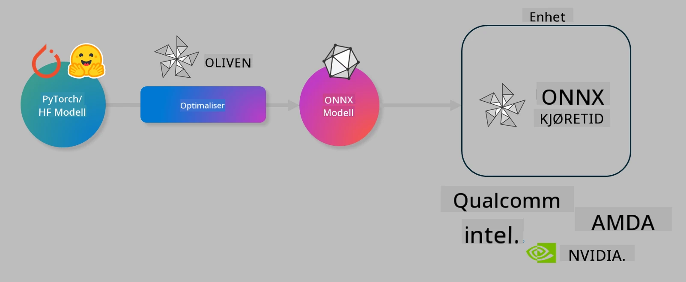

<!--
CO_OP_TRANSLATOR_METADATA:
{
  "original_hash": "6bbe47de3b974df7eea29dfeccf6032b",
  "translation_date": "2025-07-17T10:21:33+00:00",
  "source_file": "md/03.FineTuning/olive-lab/readme.md",
  "language_code": "no"
}
-->
# Lab. Optimaliser AI-modeller for inferens på enheten

## Introduksjon

> [!IMPORTANT]
> Denne labben krever et **Nvidia A10 eller A100 GPU** med tilhørende drivere og CUDA toolkit (versjon 12+) installert.

> [!NOTE]
> Dette er en **35-minutters** lab som gir deg en praktisk introduksjon til kjernebegrepene for å optimalisere modeller for inferens på enheten ved bruk av OLIVE.

## Læringsmål

Når du er ferdig med denne labben, vil du kunne bruke OLIVE til å:

- Kvantisere en AI-modell ved hjelp av AWQ kvantiseringsmetode.
- Finjustere en AI-modell for en spesifikk oppgave.
- Generere LoRA-adaptere (finjustert modell) for effektiv inferens på enheten med ONNX Runtime.

### Hva er Olive

Olive (*O*NNX *live*) er et verktøysett for modelloptimalisering med tilhørende CLI som gjør det mulig å levere modeller for ONNX runtime +++https://onnxruntime.ai+++ med kvalitet og ytelse.



Inndata til Olive er vanligvis en PyTorch- eller Hugging Face-modell, og utdata er en optimalisert ONNX-modell som kjøres på en enhet (distribusjonsmål) som kjører ONNX runtime. Olive optimaliserer modellen for distribusjonsmålets AI-akselerator (NPU, GPU, CPU) levert av en maskinvareleverandør som Qualcomm, AMD, Nvidia eller Intel.

Olive kjører en *workflow*, som er en ordnet sekvens av individuelle modelloptimaliseringsoppgaver kalt *passes* – eksempler på passes inkluderer: modellkomprimering, graffangst, kvantisering, grafoptimalisering. Hver pass har et sett med parametere som kan justeres for å oppnå de beste målene, for eksempel nøyaktighet og latenstid, som evalueres av den respektive evaluator. Olive benytter en søkestrategi som bruker en søkealgoritme for å autojustere hver pass én etter én eller flere passes samtidig.

#### Fordeler med Olive

- **Reduser frustrasjon og tid** brukt på prøving og feiling med manuell eksperimentering av ulike teknikker for grafoptimalisering, komprimering og kvantisering. Definer dine kvalitets- og ytelseskrav, og la Olive automatisk finne den beste modellen for deg.
- **40+ innebygde komponenter for modelloptimalisering** som dekker banebrytende teknikker innen kvantisering, komprimering, grafoptimalisering og finjustering.
- **Brukervennlig CLI** for vanlige modelloptimaliseringsoppgaver. For eksempel, olive quantize, olive auto-opt, olive finetune.
- Innebygd modellpakking og distribusjon.
- Støtter generering av modeller for **Multi LoRA serving**.
- Bygg workflows med YAML/JSON for å orkestrere modelloptimalisering og distribusjonsoppgaver.
- **Hugging Face** og **Azure AI** integrasjon.
- Innebygd **caching**-mekanisme for å **spare kostnader**.

## Labinstruksjoner

> [!NOTE]
> Sørg for at du har opprettet ditt Azure AI Hub og prosjekt, og satt opp din A100 compute i henhold til Lab 1.

### Steg 0: Koble til din Azure AI Compute

Du kobler til Azure AI compute ved å bruke fjernfunksjonen i **VS Code**.

1. Åpne **VS Code** desktop-applikasjonen:
1. Åpne **command palette** med **Shift+Ctrl+P**
1. Søk i command palette etter **AzureML - remote: Connect to compute instance in New Window**.
1. Følg instruksjonene på skjermen for å koble til Compute. Dette innebærer å velge din Azure Subscription, Resource Group, Project og Compute-navnet du satte opp i Lab 1.
1. Når du er koblet til din Azure ML Compute-node, vises dette nederst til venstre i Visual Code som `><Azure ML: Compute Name`

### Steg 1: Klon dette repoet

I VS Code kan du åpne et nytt terminalvindu med **Ctrl+J** og klone dette repoet:

I terminalen skal du se prompten

```
azureuser@computername:~/cloudfiles/code$ 
```  
Klon løsningen

```bash
cd ~/localfiles
git clone https://github.com/microsoft/phi-3cookbook.git
```

### Steg 2: Åpne mappe i VS Code

For å åpne VS Code i riktig mappe, kjør følgende kommando i terminalen, som åpner et nytt vindu:

```bash
code phi-3cookbook/code/04.Finetuning/Olive-lab
```

Alternativt kan du åpne mappen ved å velge **File** > **Open Folder**.

### Steg 3: Avhengigheter

Åpne et terminalvindu i VS Code på din Azure AI Compute-instans (tips: **Ctrl+J**) og kjør følgende kommandoer for å installere avhengighetene:

```bash
conda create -n olive-ai python=3.11 -y
conda activate olive-ai
pip install -r requirements.txt
az extension remove -n azure-cli-ml
az extension add -n ml
```

> [!NOTE]
> Det tar ca. 5 minutter å installere alle avhengighetene.

I denne labben laster du ned og laster opp modeller til Azure AI Model-katalogen. For å få tilgang til modellkatalogen må du logge inn i Azure med:

```bash
az login
```

> [!NOTE]
> Ved innlogging blir du bedt om å velge abonnement. Sørg for å sette abonnementet til det som er gitt for denne labben.

### Steg 4: Kjør Olive-kommandoer

Åpne et terminalvindu i VS Code på din Azure AI Compute-instans (tips: **Ctrl+J**) og sørg for at `olive-ai` conda-miljøet er aktivert:

```bash
conda activate olive-ai
```

Kjør deretter følgende Olive-kommandoer i kommandolinjen.

1. **Inspiser dataene:** I dette eksempelet skal du finjustere Phi-3.5-Mini-modellen slik at den blir spesialisert på å svare på reiserelaterte spørsmål. Koden under viser de første postene i datasettet, som er i JSON lines-format:

    ```bash
    head data/data_sample_travel.jsonl
    ```

1. **Kvantisere modellen:** Før trening kvantiserer du modellen med følgende kommando som bruker en teknikk kalt Active Aware Quantization (AWQ) +++https://arxiv.org/abs/2306.00978+++. AWQ kvantiserer vektene i en modell ved å ta hensyn til aktiveringene som produseres under inferens. Det betyr at kvantiseringsprosessen tar hensyn til den faktiske datadistribusjonen i aktiveringene, noe som gir bedre bevaring av modellens nøyaktighet sammenlignet med tradisjonelle vektskvantiseringsmetoder.

    ```bash
    olive quantize \
       --model_name_or_path microsoft/Phi-3.5-mini-instruct \
       --trust_remote_code \
       --algorithm awq \
       --output_path models/phi/awq \
       --log_level 1
    ```

    Det tar **~8 minutter** å fullføre AWQ-kvantiseringsprosessen, som vil **redusere modellstørrelsen fra ~7,5GB til ~2,5GB**.

    I denne labben viser vi hvordan du kan hente modeller fra Hugging Face (for eksempel: `microsoft/Phi-3.5-mini-instruct`). Olive lar deg også hente modeller fra Azure AI-katalogen ved å oppdatere `model_name_or_path`-argumentet til en Azure AI asset ID (for eksempel: `azureml://registries/azureml/models/Phi-3.5-mini-instruct/versions/4`).

1. **Tren modellen:** Deretter finjusterer `olive finetune`-kommandoen den kvantiserte modellen. Kvantisering før finjustering gir bedre nøyaktighet enn å gjøre det etterpå, siden finjusteringsprosessen gjenoppretter noe av tapet fra kvantiseringen.

    ```bash
    olive finetune \
        --method lora \
        --model_name_or_path models/phi/awq \
        --data_files "data/data_sample_travel.jsonl" \
        --data_name "json" \
        --text_template "<|user|>\n{prompt}<|end|>\n<|assistant|>\n{response}<|end|>" \
        --max_steps 100 \
        --output_path ./models/phi/ft \
        --log_level 1
    ```

    Det tar **~6 minutter** å fullføre finjusteringen (med 100 steg).

1. **Optimaliser:** Når modellen er trent, optimaliserer du den med Olives `auto-opt`-kommando, som fanger ONNX-grafen og automatisk utfører en rekke optimaliseringer for å forbedre modellens ytelse på CPU ved å komprimere modellen og gjøre fusjoner. Det kan nevnes at du også kan optimalisere for andre enheter som NPU eller GPU ved å oppdatere `--device` og `--provider` argumentene – men i denne labben bruker vi CPU.

    ```bash
    olive auto-opt \
       --model_name_or_path models/phi/ft/model \
       --adapter_path models/phi/ft/adapter \
       --device cpu \
       --provider CPUExecutionProvider \
       --use_ort_genai \
       --output_path models/phi/onnx-ao \
       --log_level 1
    ```

    Det tar **~5 minutter** å fullføre optimaliseringen.

### Steg 5: Rask test av modellinferens

For å teste inferens av modellen, lag en Python-fil i mappen din kalt **app.py** og kopier inn følgende kode:

```python
import onnxruntime_genai as og
import numpy as np

print("loading model and adapters...", end="", flush=True)
model = og.Model("models/phi/onnx-ao/model")
adapters = og.Adapters(model)
adapters.load("models/phi/onnx-ao/model/adapter_weights.onnx_adapter", "travel")
print("DONE!")

tokenizer = og.Tokenizer(model)
tokenizer_stream = tokenizer.create_stream()

params = og.GeneratorParams(model)
params.set_search_options(max_length=100, past_present_share_buffer=False)
user_input = "what is the best thing to see in chicago"
params.input_ids = tokenizer.encode(f"<|user|>\n{user_input}<|end|>\n<|assistant|>\n")

generator = og.Generator(model, params)

generator.set_active_adapter(adapters, "travel")

print(f"{user_input}")

while not generator.is_done():
    generator.compute_logits()
    generator.generate_next_token()

    new_token = generator.get_next_tokens()[0]
    print(tokenizer_stream.decode(new_token), end='', flush=True)

print("\n")
```

Kjør koden med:

```bash
python app.py
```

### Steg 6: Last opp modell til Azure AI

Å laste opp modellen til et Azure AI modellarkiv gjør modellen delbar med andre i utviklingsteamet ditt og håndterer også versjonskontroll av modellen. For å laste opp modellen, kjør følgende kommando:

> [!NOTE]
> Oppdater `{}`-plassholderne med navnet på din resource group og Azure AI prosjekt.

For å finne resource group `"resourceGroup"` og Azure AI prosjekt, kjør følgende kommando:

```
az ml workspace show
```

Eller gå til +++ai.azure.com+++ og velg **management center** > **project** > **overview**

Oppdater `{}`-plassholderne med navnet på din resource group og Azure AI prosjekt.

```bash
az ml model create \
    --name ft-for-travel \
    --version 1 \
    --path ./models/phi/onnx-ao \
    --resource-group {RESOURCE_GROUP_NAME} \
    --workspace-name {PROJECT_NAME}
```

Du kan deretter se den opplastede modellen og distribuere den på https://ml.azure.com/model/list

**Ansvarsfraskrivelse**:  
Dette dokumentet er oversatt ved hjelp av AI-oversettelsestjenesten [Co-op Translator](https://github.com/Azure/co-op-translator). Selv om vi streber etter nøyaktighet, vennligst vær oppmerksom på at automatiske oversettelser kan inneholde feil eller unøyaktigheter. Det opprinnelige dokumentet på originalspråket skal anses som den autoritative kilden. For kritisk informasjon anbefales profesjonell menneskelig oversettelse. Vi er ikke ansvarlige for eventuelle misforståelser eller feiltolkninger som oppstår ved bruk av denne oversettelsen.