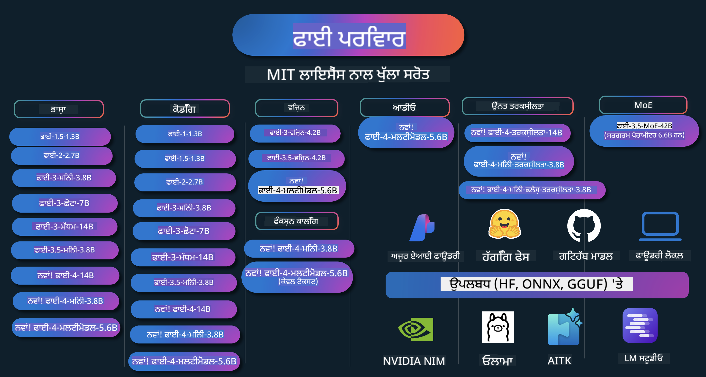

<!--
CO_OP_TRANSLATOR_METADATA:
{
  "original_hash": "5c07bb4c3c89a36c9be332a065a9a33c",
  "translation_date": "2025-07-16T15:06:50+00:00",
  "source_file": "README.md",
  "language_code": "pa"
}
-->
# Phi Cookbook: Microsoft ਦੇ Phi ਮਾਡਲਾਂ ਨਾਲ ਹੱਥੋਂ-ਹੱਥ ਉਦਾਹਰਨਾਂ

  

  
  
  

  
  

Phi Microsoft ਵੱਲੋਂ ਵਿਕਸਿਤ ਖੁੱਲ੍ਹਾ ਸਰੋਤ AI ਮਾਡਲਾਂ ਦੀ ਇੱਕ ਲੜੀ ਹੈ।

Phi ਇਸ ਸਮੇਂ ਸਭ ਤੋਂ ਤਾਕਤਵਰ ਅਤੇ ਲਾਗਤ-ਪ੍ਰਭਾਵੀ ਛੋਟਾ ਭਾਸ਼ਾ ਮਾਡਲ (SLM) ਹੈ, ਜਿਸਦੇ ਬਹੁ-ਭਾਸ਼ਾਈ, ਤਰਕਸ਼ੀਲਤਾ, ਟੈਕਸਟ/ਚੈਟ ਜਨਰੇਸ਼ਨ, ਕੋਡਿੰਗ, ਚਿੱਤਰ, ਆਡੀਓ ਅਤੇ ਹੋਰ ਸਥਿਤੀਆਂ ਵਿੱਚ ਬਹੁਤ ਵਧੀਆ ਬੈਂਚਮਾਰਕ ਹਨ।

ਤੁਸੀਂ Phi ਨੂੰ ਕਲਾਉਡ ਜਾਂ ਐਜ ਡਿਵਾਈਸਾਂ 'ਤੇ ਡਿਪਲੋਇ ਕਰ ਸਕਦੇ ਹੋ, ਅਤੇ ਸੀਮਿਤ ਕੰਪਿਊਟਿੰਗ ਸ਼ਕਤੀ ਨਾਲ ਆਸਾਨੀ ਨਾਲ ਜਨਰੇਟਿਵ AI ਐਪਲੀਕੇਸ਼ਨ ਬਣਾ ਸਕਦੇ ਹੋ।

ਇਹਨਾਂ ਸਰੋਤਾਂ ਨੂੰ ਵਰਤਣ ਲਈ ਇਹ ਕਦਮ ਫੋਲੋ ਕਰੋ:  
1. **ਰਿਪੋਜ਼ਟਰੀ ਨੂੰ Fork ਕਰੋ**: ਕਲਿੱਕ ਕਰੋ   
2. **ਰਿਪੋਜ਼ਟਰੀ ਨੂੰ Clone ਕਰੋ**: `git clone https://github.com/microsoft/PhiCookBook.git`  
3. [**Microsoft AI Discord Community ਵਿੱਚ ਸ਼ਾਮਿਲ ਹੋਵੋ ਅਤੇ ਮਾਹਿਰਾਂ ਅਤੇ ਹੋਰ ਡਿਵੈਲਪਰਾਂ ਨਾਲ ਮਿਲੋ**](https://discord.com/invite/ByRwuEEgH4?WT.mc_id=aiml-137032-kinfeylo)

### 🌐 ਬਹੁ-ਭਾਸ਼ਾਈ ਸਹਿਯੋਗ

#### GitHub Action ਰਾਹੀਂ ਸਹਿਯੋਗ (ਆਟੋਮੈਟਿਕ ਅਤੇ ਹਮੇਸ਼ਾ ਅਪ-ਟੂ-ਡੇਟ)

[French](../fr/README.md) | [Spanish](../es/README.md) | [German](../de/README.md) | [Russian](../ru/README.md) | [Arabic](../ar/README.md) | [Persian (Farsi)](../fa/README.md) | [Urdu](../ur/README.md) | [Chinese (Simplified)](../zh/README.md) | [Chinese (Traditional, Macau)](../mo/README.md) | [Chinese (Traditional, Hong Kong)](../hk/README.md) | [Chinese (Traditional, Taiwan)](../tw/README.md) | [Japanese](../ja/README.md) | [Korean](../ko/README.md) | [Hindi](../hi/README.md)  
[Bengali](../bn/README.md) | [Marathi](../mr/README.md) | [Nepali](../ne/README.md) | [Punjabi (Gurmukhi)](./README.md) | [Portuguese (Portugal)](../pt/README.md) | [Portuguese (Brazil)](../br/README.md) | [Italian](../it/README.md) | [Polish](../pl/README.md) | [Turkish](../tr/README.md) | [Greek](../el/README.md) | [Thai](../th/README.md) | [Swedish](../sv/README.md) | [Danish](../da/README.md) | [Norwegian](../no/README.md) | [Finnish](../fi/README.md) | [Dutch](../nl/README.md) | [Hebrew](../he/README.md) | [Vietnamese](../vi/README.md) | [Indonesian](../id/README.md) | [Malay](../ms/README.md) | [Tagalog (Filipino)](../tl/README.md) | [Swahili](../sw/README.md) | [Hungarian](../hu/README.md) | [Czech](../cs/README.md) | [Slovak](../sk/README.md) | [Romanian](../ro/README.md) | [Bulgarian](../bg/README.md) | [Serbian (Cyrillic)](../sr/README.md) | [Croatian](../hr/README.md) | [Slovenian](../sl/README.md)

## ਸੂਚੀ

- ਪਰਿਚਯ  
  - [Phi ਪਰਿਵਾਰ ਵਿੱਚ ਤੁਹਾਡਾ ਸਵਾਗਤ ਹੈ](./md/01.Introduction/01/01.PhiFamily.md)  
  - [ਆਪਣੇ ਵਾਤਾਵਰਣ ਦੀ ਸੈਟਿੰਗ](./md/01.Introduction/01/01.EnvironmentSetup.md)  
  - [ਮੁੱਖ ਤਕਨਾਲੋਜੀਆਂ ਨੂੰ ਸਮਝਣਾ](./md/01.Introduction/01/01.Understandingtech.md)  
  - [Phi ਮਾਡਲਾਂ ਲਈ AI ਸੁਰੱਖਿਆ](./md/01.Introduction/01/01.AISafety.md)  
  - [Phi ਹਾਰਡਵੇਅਰ ਸਹਿਯੋਗ](./md/01.Introduction/01/01.Hardwaresupport.md)  
  - [Phi ਮਾਡਲ ਅਤੇ ਪਲੇਟਫਾਰਮਾਂ 'ਤੇ ਉਪਲਬਧਤਾ](./md/01.Introduction/01/01.Edgeandcloud.md)  
  - [Guidance-ai ਅਤੇ Phi ਦੀ ਵਰਤੋਂ](./md/01.Introduction/01/01.Guidance.md)  
  - [GitHub Marketplace ਮਾਡਲ](https://github.com/marketplace/models)  
  - [Azure AI ਮਾਡਲ ਕੈਟਾਲੌਗ](https://ai.azure.com)

- ਵੱਖ-ਵੱਖ ਵਾਤਾਵਰਣ ਵਿੱਚ Phi ਦਾ ਇੰਫਰੈਂਸ  
  - [Hugging face](./md/01.Introduction/02/01.HF.md)  
  - [GitHub ਮਾਡਲ](./md/01.Introduction/02/02.GitHubModel.md)  
  - [Azure AI Foundry ਮਾਡਲ ਕੈਟਾਲੌਗ](./md/01.Introduction/02/03.AzureAIFoundry.md)  
  - [Ollama](./md/01.Introduction/02/04.Ollama.md)  
  - [AI Toolkit VSCode (AITK)](./md/01.Introduction/02/05.AITK.md)  
  - [NVIDIA NIM](./md/01.Introduction/02/06.NVIDIA.md)  
  - [Foundry Local](./md/01.Introduction/02/07.FoundryLocal.md)

- Phi ਪਰਿਵਾਰ ਦਾ ਇੰਫਰੈਂਸ  
  - [iOS ਵਿੱਚ Phi ਦਾ ਇੰਫਰੈਂਸ](./md/01.Introduction/03/iOS_Inference.md)  
  - [Android ਵਿੱਚ Phi ਦਾ ਇੰਫਰੈਂਸ](./md/01.Introduction/03/Android_Inference.md)  
  - [Jetson ਵਿੱਚ Phi ਦਾ ਇੰਫਰੈਂਸ](./md/01.Introduction/03/Jetson_Inference.md)  
  - [AI PC ਵਿੱਚ Phi ਦਾ ਇੰਫਰੈਂਸ](./md/01.Introduction/03/AIPC_Inference.md)  
  - [Apple MLX Framework ਨਾਲ Phi ਦਾ ਇੰਫਰੈਂਸ](./md/01.Introduction/03/MLX_Inference.md)  
  - [ਲੋਕਲ ਸਰਵਰ ਵਿੱਚ Phi ਦਾ ਇੰਫਰੈਂਸ](./md/01.Introduction/03/Local_Server_Inference.md)  
  - [AI Toolkit ਦੀ ਵਰਤੋਂ ਨਾਲ ਰਿਮੋਟ ਸਰਵਰ ਵਿੱਚ Phi ਦਾ ਇੰਫਰੈਂਸ](./md/01.Introduction/03/Remote_Interence.md)  
  - [Rust ਨਾਲ Phi ਦਾ ਇੰਫਰੈਂਸ](./md/01.Introduction/03/Rust_Inference.md)  
  - [ਲੋਕਲ ਵਿੱਚ Phi--Vision ਦਾ ਇੰਫਰੈਂਸ](./md/01.Introduction/03/Vision_Inference.md)  
  - [Kaito AKS, Azure Containers (ਅਧਿਕਾਰਿਕ ਸਹਿਯੋਗ) ਨਾਲ Phi ਦਾ ਇੰਫਰੈਂਸ](./md/01.Introduction/03/Kaito_Inference.md)  
- [Phi ਪਰਿਵਾਰ ਦੀ ਮਾਤਰਾ ਨਿਰਧਾਰਿਤ ਕਰਨਾ](./md/01.Introduction/04/QuantifyingPhi.md)  
  - [llama.cpp ਦੀ ਵਰਤੋਂ ਨਾਲ Phi-3.5 / 4 ਦਾ ਕੁਆੰਟਾਈਜ਼ਿੰਗ](./md/01.Introduction/04/UsingLlamacppQuantifyingPhi.md)  
  - [onnxruntime ਲਈ ਜਨਰੇਟਿਵ AI ਐਕਸਟੈਂਸ਼ਨ ਦੀ ਵਰਤੋਂ ਨਾਲ Phi-3.5 / 4 ਦਾ ਕੁਆੰਟਾਈਜ਼ਿੰਗ](./md/01.Introduction/04/UsingORTGenAIQuantifyingPhi.md)  
  - [Intel OpenVINO ਦੀ ਵਰਤੋਂ ਨਾਲ Phi-3.5 / 4 ਦਾ ਕੁਆੰਟਾਈਜ਼ਿੰਗ](./md/01.Introduction/04/UsingIntelOpenVINOQuantifyingPhi.md)  
  - [Apple MLX Framework ਦੀ ਵਰਤੋਂ ਨਾਲ Phi-3.5 / 4 ਦਾ ਕੁਆੰਟਾਈਜ਼ਿੰਗ](./md/01.Introduction/04/UsingAppleMLXQuantifyingPhi.md)

- Phi ਦਾ ਮੁਲਾਂਕਣ  
  - [Responsible AI](./md/01.Introduction/05/ResponsibleAI.md)  
  - [ਮੁਲਾਂਕਣ ਲਈ Azure AI Foundry](./md/01.Introduction/05/AIFoundry.md)  
  - [ਮੁਲਾਂਕਣ ਲਈ Promptflow ਦੀ ਵਰਤੋਂ](./md/01.Introduction/05/Promptflow.md)

- Azure AI Search ਨਾਲ RAG  
  - [Azure AI Search ਨਾਲ Phi-4-mini ਅਤੇ Phi-4-multimodal (RAG) ਦੀ ਵਰਤੋਂ ਕਿਵੇਂ ਕਰੀਏ](https://github.com/microsoft/PhiCookBook/blob/main/code/06.E2E/E2E_Phi-4-RAG-Azure-AI-Search.ipynb)

- Phi ਐਪਲੀਕੇਸ਼ਨ ਵਿਕਾਸ ਦੇ ਨਮੂਨੇ  
  - ਟੈਕਸਟ ਅਤੇ ਚੈਟ ਐਪਲੀਕੇਸ਼ਨ  
    - Phi-4 ਨਮੂਨੇ 🆕  
      - [📓] [Phi-4-mini ONNX ਮਾਡਲ ਨਾਲ ਚੈਟ ਕਰੋ](./md/02.Application/01.TextAndChat/Phi4/ChatWithPhi4ONNX/README.md)  
      - [Phi-4 ਲੋਕਲ ONNX ਮਾਡਲ ਨਾਲ ਚੈਟ .NET](../../md/04.HOL/dotnet/src/LabsPhi4-Chat-01OnnxRuntime)  
      - [Semantic Kernel ਦੀ ਵਰਤੋਂ ਨਾਲ Phi-4 ONNX ਨਾਲ .NET ਕਨਸੋਲ ਐਪ ਚੈਟ](../../md/04.HOL/dotnet/src/LabsPhi4-Chat-02SK)  
    - Phi-3 / 3.5 ਨਮੂਨੇ  
      - [Phi3, ONNX Runtime Web ਅਤੇ WebGPU ਦੀ ਵਰਤੋਂ ਨਾਲ ਬ੍ਰਾਊਜ਼ਰ ਵਿੱਚ ਲੋਕਲ ਚੈਟਬੋਟ](https://github.com/microsoft/onnxruntime-inference-examples/tree/main/js/chat)  
      - [OpenVino ਚੈਟ](./md/02.Application/01.TextAndChat/Phi3/E2E_OpenVino_Chat.md)  
      - [ਮਲਟੀ ਮਾਡਲ - ਇੰਟਰਐਕਟਿਵ Phi-3-mini ਅਤੇ OpenAI Whisper](./md/02.Application/01.TextAndChat/Phi3/E2E_Phi-3-mini_with_whisper.md)  
      - [MLFlow - ਇੱਕ ਰੈਪਰ ਬਣਾਉਣਾ ਅਤੇ Phi-3 ਨਾਲ MLFlow ਦੀ ਵਰਤੋਂ](./md//02.Application/01.TextAndChat/Phi3/E2E_Phi-3-MLflow.md)  
      - [ਮਾਡਲ ਅਪਟੀਮਾਈਜ਼ੇਸ਼ਨ - ONNX Runtime Web ਲਈ Phi-3-mini ਮਾਡਲ ਨੂੰ Olive ਨਾਲ ਕਿਵੇਂ ਅਪਟੀਮਾਈਜ਼ ਕਰੀਏ](https://github.com/microsoft/Olive/tree/main/examples/phi3)  
      - [WinUI3 ਐਪ ਨਾਲ Phi-3 mini-4k-instruct-onnx](https://github.com/microsoft/Phi3-Chat-WinUI3-Sample/)  
      - [WinUI3 ਮਲਟੀ ਮਾਡਲ AI ਪਾਵਰਡ ਨੋਟਸ ਐਪ ਨਮੂਨਾ](https://github.com/microsoft/ai-powered-notes-winui3-sample)
- [Prompt flow ਨਾਲ ਕਸਟਮ Phi-3 ਮਾਡਲਾਂ ਨੂੰ ਫਾਈਨ-ਟਿਊਨ ਅਤੇ ਇੰਟੀਗ੍ਰੇਟ ਕਰੋ](./md/02.Application/01.TextAndChat/Phi3/E2E_Phi-3-FineTuning_PromptFlow_Integration.md)
- [Azure AI Foundry ਵਿੱਚ Prompt flow ਨਾਲ ਕਸਟਮ Phi-3 ਮਾਡਲਾਂ ਨੂੰ ਫਾਈਨ-ਟਿਊਨ ਅਤੇ ਇੰਟੀਗ੍ਰੇਟ ਕਰੋ](./md/02.Application/01.TextAndChat/Phi3/E2E_Phi-3-FineTuning_PromptFlow_Integration_AIFoundry.md)
- [Microsoft ਦੇ ਜ਼ਿੰਮੇਵਾਰ AI ਸਿਧਾਂਤਾਂ 'ਤੇ ਧਿਆਨ ਕੇਂਦਰਿਤ ਕਰਦਿਆਂ Azure AI Foundry ਵਿੱਚ ਫਾਈਨ-ਟਿਊਨ ਕੀਤੇ Phi-3 / Phi-3.5 ਮਾਡਲ ਦਾ ਮੁਲਾਂਕਣ ਕਰੋ](./md/02.Application/01.TextAndChat/Phi3/E2E_Phi-3-Evaluation_AIFoundry.md)
- [📓] [Phi-3.5-mini-instruct ਭਾਸ਼ਾ ਅਨੁਮਾਨ ਨਮੂਨਾ (ਚੀਨੀ/ਅੰਗਰੇਜ਼ੀ)](../../md/02.Application/01.TextAndChat/Phi3/phi3-instruct-demo.ipynb)
- [Phi-3.5-Instruct WebGPU RAG ਚੈਟਬੋਟ](./md/02.Application/01.TextAndChat/Phi3/WebGPUWithPhi35Readme.md)
- [Windows GPU ਦੀ ਵਰਤੋਂ ਕਰਕੇ Phi-3.5-Instruct ONNX ਨਾਲ Prompt flow ਹੱਲ ਬਣਾਉਣਾ](./md/02.Application/01.TextAndChat/Phi3/UsingPromptFlowWithONNX.md)
- [Microsoft Phi-3.5 tflite ਦੀ ਵਰਤੋਂ ਕਰਕੇ ਐਂਡਰਾਇਡ ਐਪ ਬਣਾਉਣਾ](./md/02.Application/01.TextAndChat/Phi3/UsingPhi35TFLiteCreateAndroidApp.md)
- [Microsoft.ML.OnnxRuntime ਦੀ ਵਰਤੋਂ ਕਰਕੇ ਸਥਾਨਕ ONNX Phi-3 ਮਾਡਲ ਨਾਲ Q&A .NET ਉਦਾਹਰਨ](../../md/04.HOL/dotnet/src/LabsPhi301)
- [Semantic Kernel ਅਤੇ Phi-3 ਨਾਲ ਕਨਸੋਲ ਚੈਟ .NET ਐਪ](../../md/04.HOL/dotnet/src/LabsPhi302)

- Azure AI Inference SDK ਕੋਡ ਆਧਾਰਿਤ ਨਮੂਨੇ  
  - Phi-4 ਨਮੂਨੇ 🆕  
    - [📓] [Phi-4-multimodal ਦੀ ਵਰਤੋਂ ਕਰਕੇ ਪ੍ਰੋਜੈਕਟ ਕੋਡ ਬਣਾਓ](./md/02.Application/02.Code/Phi4/GenProjectCode/README.md)  
  - Phi-3 / 3.5 ਨਮੂਨੇ  
    - [Microsoft Phi-3 ਪਰਿਵਾਰ ਨਾਲ ਆਪਣਾ Visual Studio Code GitHub Copilot Chat ਬਣਾਓ](./md/02.Application/02.Code/Phi3/VSCodeExt/README.md)  
    - [GitHub ਮਾਡਲਾਂ ਨਾਲ Phi-3.5 ਦੀ ਵਰਤੋਂ ਕਰਕੇ ਆਪਣਾ Visual Studio Code Chat Copilot Agent ਬਣਾਓ](/md/02.Application/02.Code/Phi3/CreateVSCodeChatAgentWithGitHubModels.md)  

- ਉੱਨਤ ਤਰਕ ਨਮੂਨੇ  
  - Phi-4 ਨਮੂਨੇ 🆕  
    - [📓] [Phi-4-mini-reasoning ਜਾਂ Phi-4-reasoning ਨਮੂਨੇ](./md/02.Application/03.AdvancedReasoning/Phi4/AdvancedResoningPhi4mini/README.md)  
    - [📓] [Microsoft Olive ਨਾਲ Phi-4-mini-reasoning ਦਾ ਫਾਈਨ-ਟਿਊਨਿੰਗ](../../md/02.Application/03.AdvancedReasoning/Phi4/AdvancedResoningPhi4mini/olive_ft_phi_4_reasoning_with_medicaldata.ipynb)  
    - [📓] [Apple MLX ਨਾਲ Phi-4-mini-reasoning ਦਾ ਫਾਈਨ-ਟਿਊਨਿੰਗ](../../md/02.Application/03.AdvancedReasoning/Phi4/AdvancedResoningPhi4mini/mlx_ft_phi_4_reasoning_with_medicaldata.ipynb)  
    - [📓] [GitHub ਮਾਡਲਾਂ ਨਾਲ Phi-4-mini-reasoning](../../md/02.Application/02.Code/Phi4r/github_models_inference.ipynb)  
    - [📓] [Azure AI Foundry ਮਾਡਲਾਂ ਨਾਲ Phi-4-mini-reasoning](../../md/02.Application/02.Code/Phi4r/azure_models_inference.ipynb)  
- ਡੈਮੋਜ਼  
    - [Phi-4-mini ਡੈਮੋਜ਼ ਜੋ Hugging Face Spaces 'ਤੇ ਹੋਸਟ ਕੀਤੇ ਗਏ ਹਨ](https://huggingface.co/spaces/microsoft/phi-4-mini?WT.mc_id=aiml-137032-kinfeylo)  
    - [Phi-4-multimodal ਡੈਮੋਜ਼ ਜੋ Hugging Face Spaces 'ਤੇ ਹੋਸਟ ਕੀਤੇ ਗਏ ਹਨ](https://huggingface.co/spaces/microsoft/phi-4-multimodal?WT.mc_id=aiml-137032-kinfeylo)  
- ਵਿਜ਼ਨ ਨਮੂਨੇ  
  - Phi-4 ਨਮੂਨੇ 🆕  
    - [📓] [Phi-4-multimodal ਦੀ ਵਰਤੋਂ ਕਰਕੇ ਚਿੱਤਰ ਪੜ੍ਹੋ ਅਤੇ ਕੋਡ ਬਣਾਓ](./md/02.Application/04.Vision/Phi4/CreateFrontend/README.md)  
  - Phi-3 / 3.5 ਨਮੂਨੇ  
    - [📓][Phi-3-vision-ਚਿੱਤਰ ਟੈਕਸਟ ਤੋਂ ਟੈਕਸਟ](../../md/02.Application/04.Vision/Phi3/E2E_Phi-3-vision-image-text-to-text-online-endpoint.ipynb)  
    - [Phi-3-vision-ONNX](https://onnxruntime.ai/docs/genai/tutorials/phi3-v.html)  
    - [📓][Phi-3-vision CLIP ਐਂਬੈਡਿੰਗ](../../md/02.Application/04.Vision/Phi3/E2E_Phi-3-vision-image-text-to-text-online-endpoint.ipynb)  
    - [ਡੈਮੋ: Phi-3 ਰੀਸਾਈਕਲਿੰਗ](https://github.com/jennifermarsman/PhiRecycling/)  
    - [Phi-3-vision - ਵਿਜ਼ੂਅਲ ਭਾਸ਼ਾ ਸਹਾਇਕ - Phi3-Vision ਅਤੇ OpenVINO ਨਾਲ](https://docs.openvino.ai/nightly/notebooks/phi-3-vision-with-output.html)  
    - [Phi-3 Vision Nvidia NIM](./md/02.Application/04.Vision/Phi3/E2E_Nvidia_NIM_Vision.md)  
    - [Phi-3 Vision OpenVino](./md/02.Application/04.Vision/Phi3/E2E_OpenVino_Phi3Vision.md)  
    - [📓][Phi-3.5 Vision ਮਲਟੀ-ਫਰੇਮ ਜਾਂ ਮਲਟੀ-ਚਿੱਤਰ ਨਮੂਨਾ](../../md/02.Application/04.Vision/Phi3/phi3-vision-demo.ipynb)  
    - [Microsoft.ML.OnnxRuntime .NET ਦੀ ਵਰਤੋਂ ਕਰਕੇ ਸਥਾਨਕ ONNX ਮਾਡਲ ਨਾਲ Phi-3 Vision](../../md/04.HOL/dotnet/src/LabsPhi303)  
    - [Microsoft.ML.OnnxRuntime .NET ਦੀ ਵਰਤੋਂ ਕਰਕੇ ਮੀਨੂ ਆਧਾਰਿਤ ਸਥਾਨਕ ONNX ਮਾਡਲ ਨਾਲ Phi-3 Vision](../../md/04.HOL/dotnet/src/LabsPhi304)  

- ਗਣਿਤ ਨਮੂਨੇ  
  - Phi-4-Mini-Flash-Reasoning-Instruct ਨਮੂਨੇ 🆕 [Phi-4-Mini-Flash-Reasoning-Instruct ਨਾਲ ਗਣਿਤ ਡੈਮੋ](../../md/02.Application/09.Math/MathDemo.ipynb)  

- ਆਡੀਓ ਨਮੂਨੇ  
  - Phi-4 ਨਮੂਨੇ 🆕  
    - [📓] [Phi-4-multimodal ਦੀ ਵਰਤੋਂ ਕਰਕੇ ਆਡੀਓ ਟ੍ਰਾਂਸਕ੍ਰਿਪਟ ਨਿਕਾਲਣਾ](./md/02.Application/05.Audio/Phi4/Transciption/README.md)  
    - [📓] [Phi-4-multimodal ਆਡੀਓ ਨਮੂਨਾ](../../md/02.Application/05.Audio/Phi4/Siri/demo.ipynb)  
    - [📓] [Phi-4-multimodal ਸਪੀਚ ਅਨੁਵਾਦ ਨਮੂਨਾ](../../md/02.Application/05.Audio/Phi4/Translate/demo.ipynb)  
    - [Phi-4-multimodal ਦੀ ਵਰਤੋਂ ਕਰਕੇ ਆਡੀਓ ਫਾਈਲ ਦਾ ਵਿਸ਼ਲੇਸ਼ਣ ਅਤੇ ਟ੍ਰਾਂਸਕ੍ਰਿਪਟ ਬਣਾਉਣ ਲਈ .NET ਕਨਸੋਲ ਐਪਲੀਕੇਸ਼ਨ](../../md/04.HOL/dotnet/src/LabsPhi4-MultiModal-02Audio)  

- MOE ਨਮੂਨੇ  
  - Phi-3 / 3.5 ਨਮੂਨੇ  
    - [📓] [Phi-3.5 Mixture of Experts Models (MoEs) ਸੋਸ਼ਲ ਮੀਡੀਆ ਨਮੂਨਾ](../../md/02.Application/06.MoE/Phi3/phi3_moe_demo.ipynb)  
    - [📓] [NVIDIA NIM Phi-3 MOE, Azure AI Search, ਅਤੇ LlamaIndex ਨਾਲ Retrieval-Augmented Generation (RAG) ਪਾਈਪਲਾਈਨ ਬਣਾਉਣਾ](../../md/02.Application/06.MoE/Phi3/azure-ai-search-nvidia-rag.ipynb)  

- ਫੰਕਸ਼ਨ ਕਾਲਿੰਗ ਨਮੂਨੇ  
  - Phi-4 ਨਮੂਨੇ 🆕  
    - [📓] [Phi-4-mini ਨਾਲ ਫੰਕਸ਼ਨ ਕਾਲਿੰਗ ਦੀ ਵਰਤੋਂ](./md/02.Application/07.FunctionCalling/Phi4/FunctionCallingBasic/README.md)  
    - [📓] [Phi-4-mini ਨਾਲ ਮਲਟੀ-ਏਜੰਟ ਬਣਾਉਣ ਲਈ ਫੰਕਸ਼ਨ ਕਾਲਿੰਗ ਦੀ ਵਰਤੋਂ](../../md/02.Application/07.FunctionCalling/Phi4/Multiagents/Phi_4_mini_multiagent.ipynb)  
    - [📓] [Ollama ਨਾਲ ਫੰਕਸ਼ਨ ਕਾਲਿੰਗ ਦੀ ਵਰਤੋਂ](../../md/02.Application/07.FunctionCalling/Phi4/Ollama/ollama_functioncalling.ipynb)  
    - [📓] [ONNX ਨਾਲ ਫੰਕਸ਼ਨ ਕਾਲਿੰਗ ਦੀ ਵਰਤੋਂ](../../md/02.Application/07.FunctionCalling/Phi4/ONNX/onnx_parallel_functioncalling.ipynb)  

- ਮਲਟੀਮੋਡਲ ਮਿਕਸਿੰਗ ਨਮੂਨੇ  
  - Phi-4 ਨਮੂਨੇ 🆕  
    - [📓] [ਟੈਕਨੋਲੋਜੀ ਪੱਤਰਕਾਰ ਵਜੋਂ Phi-4-multimodal ਦੀ ਵਰਤੋਂ](../../md/02.Application/08.Multimodel/Phi4/TechJournalist/phi_4_mm_audio_text_publish_news.ipynb)  
    - [Phi-4-multimodal ਦੀ ਵਰਤੋਂ ਕਰਕੇ ਚਿੱਤਰਾਂ ਦਾ ਵਿਸ਼ਲੇਸ਼ਣ ਕਰਨ ਲਈ .NET ਕਨਸੋਲ ਐਪਲੀਕੇਸ਼ਨ](../../md/04.HOL/dotnet/src/LabsPhi4-MultiModal-01Images)  

- Phi ਫਾਈਨ-ਟਿਊਨਿੰਗ  
  - [ਫਾਈਨ-ਟਿਊਨਿੰਗ ਸਥਿਤੀਆਂ](./md/03.FineTuning/FineTuning_Scenarios.md)  
  - [ਫਾਈਨ-ਟਿਊਨਿੰਗ ਅਤੇ RAG ਵਿੱਚ ਫਰਕ](./md/03.FineTuning/FineTuning_vs_RAG.md)  
  - [Phi-3 ਨੂੰ ਉਦਯੋਗ ਵਿਸ਼ੇਸ਼ਜ્ઞ ਬਣਾਉਣਾ](./md/03.FineTuning/LetPhi3gotoIndustriy.md)  
  - [VS Code ਲਈ AI Toolkit ਨਾਲ Phi-3 ਦੀ ਫਾਈਨ-ਟਿਊਨਿੰਗ](./md/03.FineTuning/Finetuning_VSCodeaitoolkit.md)  
  - [Azure Machine Learning Service ਨਾਲ Phi-3 ਦੀ ਫਾਈਨ-ਟਿਊਨਿੰਗ](./md/03.FineTuning/Introduce_AzureML.md)  
  - [Lora ਨਾਲ Phi-3 ਦੀ ਫਾਈਨ-ਟਿਊਨਿੰਗ](./md/03.FineTuning/FineTuning_Lora.md)  
  - [QLora ਨਾਲ Phi-3 ਦੀ ਫਾਈਨ-ਟਿਊਨਿੰਗ](./md/03.FineTuning/FineTuning_Qlora.md)  
  - [Azure AI Foundry ਨਾਲ Phi-3 ਦੀ ਫਾਈਨ-ਟਿਊਨਿੰਗ](./md/03.FineTuning/FineTuning_AIFoundry.md)  
  - [Azure ML CLI/SDK ਨਾਲ Phi-3 ਦੀ ਫਾਈਨ-ਟਿਊਨਿੰਗ](./md/03.FineTuning/FineTuning_MLSDK.md)  
  - [Microsoft Olive ਨਾਲ ਫਾਈਨ-ਟਿਊਨਿੰਗ](./md/03.FineTuning/FineTuning_MicrosoftOlive.md)  
  - [Microsoft Olive Hands-On Lab ਨਾਲ ਫਾਈਨ-ਟਿਊਨਿੰਗ](./md/03.FineTuning/olive-lab/readme.md)  
  - [Weights and Bias ਨਾਲ Phi-3-vision ਦੀ ਫਾਈਨ-ਟਿਊਨਿੰਗ](./md/03.FineTuning/FineTuning_Phi-3-visionWandB.md)  
  - [Apple MLX Framework ਨਾਲ Phi-3 ਦੀ ਫਾਈਨ-ਟਿਊਨਿੰਗ](./md/03.FineTuning/FineTuning_MLX.md)  
  - [Phi-3-vision (ਅਧਿਕਾਰਿਕ ਸਹਾਇਤਾ) ਦੀ ਫਾਈਨ-ਟਿਊਨਿੰਗ](./md/03.FineTuning/FineTuning_Vision.md)  
  - [Kaito AKS, Azure Containers (ਅਧਿਕਾਰਿਕ ਸਹਾਇਤਾ) ਨਾਲ Phi-3 ਦੀ ਫਾਈਨ-ਟਿਊਨਿੰਗ](./md/03.FineTuning/FineTuning_Kaito.md)  
  - [Phi-3 ਅਤੇ 3.5 Vision ਦੀ ਫਾਈਨ-ਟਿਊਨਿੰਗ](https://github.com/2U1/Phi3-Vision-Finetune)  

- ਹੈਂਡਸ-ਆਨ ਲੈਬ  
  - [ਅਗਲੇ ਪੀੜ੍ਹੀ ਦੇ ਮਾਡਲਾਂ ਦੀ ਖੋਜ: LLMs, SLMs, ਸਥਾਨਕ ਵਿਕਾਸ ਅਤੇ ਹੋਰ](https://github.com/microsoft/aitour-exploring-cutting-edge-models)  
  - [NLP ਦੀ ਸਮਰੱਥਾ ਖੋਲ੍ਹਣਾ: Microsoft Olive ਨਾਲ ਫਾਈਨ-ਟਿਊਨਿੰਗ](https://github.com/azure/Ignite_FineTuning_workshop)  

- ਅਕਾਦਮਿਕ ਰਿਸਰਚ ਪੇਪਰ ਅਤੇ ਪ੍ਰਕਾਸ਼ਨ  
  - [Textbooks Are All You Need II: phi-1.5 ਤਕਨੀਕੀ ਰਿਪੋਰਟ](https://arxiv.org/abs/2309.05463)  
  - [Phi-3 ਤਕਨੀਕੀ ਰਿਪੋਰਟ: ਤੁਹਾਡੇ ਫੋਨ 'ਤੇ ਇੱਕ ਬਹੁਤ ਸਮਰੱਥ ਭਾਸ਼ਾ ਮਾਡਲ](https://arxiv.org/abs/2404.14219)  
  - [Phi-4 ਤਕਨੀਕੀ ਰਿਪੋਰਟ](https://arxiv.org/abs/2412.08905)  
  - [Phi-4-Mini ਤਕਨੀਕੀ ਰਿਪੋਰਟ: ਮਿਕਸਚਰ-ਆਫ-ਲੋਰਾ ਦੁਆਰਾ ਸੰਕੁਚਿਤ ਪਰ ਸ਼ਕਤੀਸ਼ਾਲੀ ਮਲਟੀਮੋਡਲ ਭਾਸ਼ਾ ਮਾਡਲ](https://arxiv.org/abs/2503.01743)  
  - [ਵਾਹਨ ਵਿੱਚ ਫੰਕਸ਼ਨ-ਕਾਲਿੰਗ ਲਈ ਛੋਟੇ ਭਾਸ਼ਾ ਮਾਡਲਾਂ ਦਾ ਅਪਟੀਮਾਈਜ਼ੇਸ਼ਨ](https://arxiv.org/abs/2501.02342)  
  - [(WhyPHI) ਬਹੁ-ਚੋਣ ਪ੍ਰਸ਼ਨ ਉੱਤਰ ਦੇਣ ਲਈ PHI-3 ਦੀ ਫਾਈਨ-ਟਿਊਨਿੰਗ: ਵਿਧੀ, ਨਤੀਜੇ ਅਤੇ ਚੁਣੌਤੀਆਂ](https://arxiv.org/abs/2501.01588)
- [Phi-4-reasoning Technical Report](https://www.microsoft.com/en-us/research/wp-content/uploads/2025/04/phi_4_reasoning.pdf)
- [Phi-4-mini-reasoning Technical Report](https://huggingface.co/microsoft/Phi-4-mini-reasoning/blob/main/Phi-4-Mini-Reasoning.pdf)

## Phi ਮਾਡਲਾਂ ਦੀ ਵਰਤੋਂ

### Azure AI Foundry 'ਤੇ Phi

ਤੁਸੀਂ Microsoft Phi ਦੀ ਵਰਤੋਂ ਕਿਵੇਂ ਕਰਨੀ ਹੈ ਅਤੇ ਆਪਣੇ ਵੱਖ-ਵੱਖ ਹਾਰਡਵੇਅਰ ਡਿਵਾਈਸਾਂ ਵਿੱਚ E2E ਹੱਲ ਕਿਵੇਂ ਬਣਾਉਣੇ ਹਨ, ਇਹ ਸਿੱਖ ਸਕਦੇ ਹੋ। ਆਪਣੇ ਲਈ Phi ਦਾ ਅਨੁਭਵ ਕਰਨ ਲਈ, ਮਾਡਲਾਂ ਨਾਲ ਖੇਡਣਾ ਸ਼ੁਰੂ ਕਰੋ ਅਤੇ ਆਪਣੇ ਸੰਦਰਭਾਂ ਲਈ Phi ਨੂੰ ਕਸਟਮਾਈਜ਼ ਕਰੋ [Azure AI Foundry Azure AI Model Catalog](https://aka.ms/phi3-azure-ai) ਦੀ ਵਰਤੋਂ ਕਰਕੇ। ਤੁਸੀਂ [Azure AI Foundry ਨਾਲ ਸ਼ੁਰੂਆਤ]( /md/02.QuickStart/AzureAIFoundry_QuickStart.md) 'ਤੇ ਹੋਰ ਜਾਣਕਾਰੀ ਲੈ ਸਕਦੇ ਹੋ।

**ਪਲੇਗ੍ਰਾਊਂਡ**  
ਹਰ ਮਾਡਲ ਲਈ ਇੱਕ ਸਮਰਪਿਤ ਪਲੇਗ੍ਰਾਊਂਡ ਹੁੰਦਾ ਹੈ ਜਿੱਥੇ ਤੁਸੀਂ ਮਾਡਲ ਦੀ ਜਾਂਚ ਕਰ ਸਕਦੇ ਹੋ [Azure AI Playground](https://aka.ms/try-phi3)।

### GitHub ਮਾਡਲਾਂ 'ਤੇ Phi

ਤੁਸੀਂ Microsoft Phi ਦੀ ਵਰਤੋਂ ਕਿਵੇਂ ਕਰਨੀ ਹੈ ਅਤੇ ਆਪਣੇ ਵੱਖ-ਵੱਖ ਹਾਰਡਵੇਅਰ ਡਿਵਾਈਸਾਂ ਵਿੱਚ E2E ਹੱਲ ਕਿਵੇਂ ਬਣਾਉਣੇ ਹਨ, ਇਹ ਸਿੱਖ ਸਕਦੇ ਹੋ। ਆਪਣੇ ਲਈ Phi ਦਾ ਅਨੁਭਵ ਕਰਨ ਲਈ, ਮਾਡਲ ਨਾਲ ਖੇਡਣਾ ਸ਼ੁਰੂ ਕਰੋ ਅਤੇ ਆਪਣੇ ਸੰਦਰਭਾਂ ਲਈ Phi ਨੂੰ ਕਸਟਮਾਈਜ਼ ਕਰੋ [GitHub Model Catalog](https://github.com/marketplace/models?WT.mc_id=aiml-137032-kinfeylo) ਦੀ ਵਰਤੋਂ ਕਰਕੇ। ਤੁਸੀਂ [GitHub Model Catalog ਨਾਲ ਸ਼ੁਰੂਆਤ]( /md/02.QuickStart/GitHubModel_QuickStart.md) 'ਤੇ ਹੋਰ ਜਾਣਕਾਰੀ ਲੈ ਸਕਦੇ ਹੋ।

**ਪਲੇਗ੍ਰਾਊਂਡ**  
ਹਰ ਮਾਡਲ ਲਈ ਇੱਕ ਸਮਰਪਿਤ [ਪਲੇਗ੍ਰਾਊਂਡ ਜਿੱਥੇ ਮਾਡਲ ਦੀ ਜਾਂਚ ਕੀਤੀ ਜਾ ਸਕਦੀ ਹੈ](/md/02.QuickStart/GitHubModel_QuickStart.md)।

### Hugging Face 'ਤੇ Phi

ਤੁਸੀਂ ਮਾਡਲ ਨੂੰ [Hugging Face](https://huggingface.co/microsoft) 'ਤੇ ਵੀ ਲੱਭ ਸਕਦੇ ਹੋ।

**ਪਲੇਗ੍ਰਾਊਂਡ**  
[Hugging Chat playground](https://huggingface.co/chat/models/microsoft/Phi-3-mini-4k-instruct)

## ਜ਼ਿੰਮੇਵਾਰ AI

Microsoft ਆਪਣੇ ਗਾਹਕਾਂ ਨੂੰ ਸਾਡੇ AI ਉਤਪਾਦਾਂ ਦੀ ਜ਼ਿੰਮੇਵਾਰੀ ਨਾਲ ਵਰਤੋਂ ਕਰਨ ਵਿੱਚ ਮਦਦ ਕਰਨ, ਸਾਡੇ ਸਿੱਖਿਆਵਾਂ ਸਾਂਝੀਆਂ ਕਰਨ ਅਤੇ Transparency Notes ਅਤੇ Impact Assessments ਵਰਗੇ ਟੂਲਾਂ ਰਾਹੀਂ ਭਰੋਸੇਮੰਦ ਸਾਂਝੇਦਾਰੀਆਂ ਬਣਾਉਣ ਲਈ ਵਚਨਬੱਧ ਹੈ। ਇਹਨਾਂ ਵਿੱਚੋਂ ਬਹੁਤ ਸਾਰੇ ਸਰੋਤ [https://aka.ms/RAI](https://aka.ms/RAI) 'ਤੇ ਮਿਲ ਸਕਦੇ ਹਨ।  
Microsoft ਦਾ ਜ਼ਿੰਮੇਵਾਰ AI ਲਈ ਰਵੱਈਆ ਸਾਡੇ AI ਦੇ ਨਿਆਂ, ਭਰੋਸੇਯੋਗਤਾ ਅਤੇ ਸੁਰੱਖਿਆ, ਗੋਪਨੀਯਤਾ ਅਤੇ ਸੁਰੱਖਿਆ, ਸ਼ਾਮਿਲਤਾ, ਪਾਰਦਰਸ਼ਤਾ ਅਤੇ ਜਵਾਬਦੇਹੀ ਦੇ ਸਿਧਾਂਤਾਂ 'ਤੇ ਆਧਾਰਿਤ ਹੈ।

ਵੱਡੇ ਪੱਧਰ ਦੇ ਕੁਦਰਤੀ ਭਾਸ਼ਾ, ਚਿੱਤਰ ਅਤੇ ਬੋਲ ਚਾਲ ਦੇ ਮਾਡਲ - ਜਿਵੇਂ ਕਿ ਇਸ ਨਮੂਨੇ ਵਿੱਚ ਵਰਤੇ ਗਏ ਹਨ - ਕਦੇ-ਕਦੇ ਅਨਿਆਂਸਪਦ, ਅਣਭਰੋਸੇਯੋਗ ਜਾਂ ਅਪਮਾਨਜਨਕ ਤਰੀਕੇ ਨਾਲ ਵਰਤੋਂ ਕਰ ਸਕਦੇ ਹਨ, ਜਿਸ ਨਾਲ ਨੁਕਸਾਨ ਹੋ ਸਕਦਾ ਹੈ। ਕਿਰਪਾ ਕਰਕੇ [Azure OpenAI service Transparency note](https://learn.microsoft.com/legal/cognitive-services/openai/transparency-note?tabs=text) ਨੂੰ ਵੇਖੋ ਤਾਂ ਜੋ ਖਤਰੇ ਅਤੇ ਸੀਮਾਵਾਂ ਬਾਰੇ ਜਾਣੂ ਹੋ ਸਕੋ।

ਇਨ੍ਹਾਂ ਖਤਰਿਆਂ ਨੂੰ ਘਟਾਉਣ ਲਈ ਸਿਫਾਰਸ਼ ਕੀਤੀ ਗਈ ਪদ্ধਤੀ ਇਹ ਹੈ ਕਿ ਤੁਸੀਂ ਆਪਣੇ ਆਰਕੀਟੈਕਚਰ ਵਿੱਚ ਇੱਕ ਸੁਰੱਖਿਆ ਪ੍ਰਣਾਲੀ ਸ਼ਾਮਿਲ ਕਰੋ ਜੋ ਨੁਕਸਾਨਦਾਇਕ ਵਰਤੋਂ ਨੂੰ ਪਛਾਣ ਸਕੇ ਅਤੇ ਰੋਕ ਸਕੇ। [Azure AI Content Safety](https://learn.microsoft.com/azure/ai-services/content-safety/overview) ਇੱਕ ਸੁਤੰਤਰ ਸੁਰੱਖਿਆ ਪਰਤ ਪ੍ਰਦਾਨ ਕਰਦਾ ਹੈ, ਜੋ ਐਪਲੀਕੇਸ਼ਨਾਂ ਅਤੇ ਸੇਵਾਵਾਂ ਵਿੱਚ ਨੁਕਸਾਨਦਾਇਕ ਯੂਜ਼ਰ-ਜਨਰੇਟਡ ਅਤੇ AI-ਜਨਰੇਟਡ ਸਮੱਗਰੀ ਦੀ ਪਛਾਣ ਕਰ ਸਕਦਾ ਹੈ। Azure AI Content Safety ਵਿੱਚ ਟੈਕਸਟ ਅਤੇ ਚਿੱਤਰ API ਸ਼ਾਮਿਲ ਹਨ ਜੋ ਤੁਹਾਨੂੰ ਨੁਕਸਾਨਦਾਇਕ ਸਮੱਗਰੀ ਦੀ ਪਛਾਣ ਕਰਨ ਦੀ ਆਗਿਆ ਦਿੰਦੇ ਹਨ। Azure AI Foundry ਵਿੱਚ, Content Safety ਸੇਵਾ ਤੁਹਾਨੂੰ ਵੱਖ-ਵੱਖ ਮੋਡਾਲਿਟੀਜ਼ ਵਿੱਚ ਨੁਕਸਾਨਦਾਇਕ ਸਮੱਗਰੀ ਦੀ ਪਛਾਣ ਲਈ ਨਮੂਨਾ ਕੋਡ ਵੇਖਣ, ਖੋਜਣ ਅਤੇ ਅਜ਼ਮਾਉਣ ਦੀ ਆਗਿਆ ਦਿੰਦੀ ਹੈ। ਹੇਠਾਂ ਦਿੱਤੀ [quickstart ਦਸਤਾਵੇਜ਼ੀਕਰਨ](https://learn.microsoft.com/azure/ai-services/content-safety/quickstart-text?tabs=visual-studio%2Clinux&pivots=programming-language-rest) ਤੁਹਾਨੂੰ ਸੇਵਾ ਨੂੰ ਬੇਨਤੀ ਕਰਨ ਵਿੱਚ ਮਦਦ ਕਰਦੀ ਹੈ।

ਇੱਕ ਹੋਰ ਪਹਲੂ ਜੋ ਧਿਆਨ ਵਿੱਚ ਰੱਖਣਾ ਚਾਹੀਦਾ ਹੈ ਉਹ ਹੈ ਸਮੁੱਚੇ ਐਪਲੀਕੇਸ਼ਨ ਦੀ ਕਾਰਗੁਜ਼ਾਰੀ। ਬਹੁ-ਮੋਡਾਲ ਅਤੇ ਬਹੁ-ਮਾਡਲ ਐਪਲੀਕੇਸ਼ਨਾਂ ਵਿੱਚ, ਅਸੀਂ ਕਾਰਗੁਜ਼ਾਰੀ ਦਾ ਮਤਲਬ ਲੈਂਦੇ ਹਾਂ ਕਿ ਸਿਸਟਮ ਤੁਹਾਡੇ ਅਤੇ ਤੁਹਾਡੇ ਯੂਜ਼ਰਾਂ ਦੀ ਉਮੀਦਾਂ ਅਨੁਸਾਰ ਕੰਮ ਕਰਦਾ ਹੈ, ਜਿਸ ਵਿੱਚ ਨੁਕਸਾਨਦਾਇਕ ਨਤੀਜੇ ਨਾ ਬਣਾਉਣਾ ਵੀ ਸ਼ਾਮਿਲ ਹੈ। ਆਪਣੇ ਸਮੁੱਚੇ ਐਪਲੀਕੇਸ਼ਨ ਦੀ ਕਾਰਗੁਜ਼ਾਰੀ ਦਾ ਮੁਲਾਂਕਣ ਕਰਨ ਲਈ [Performance and Quality and Risk and Safety evaluators](https://learn.microsoft.com/azure/ai-studio/concepts/evaluation-metrics-built-in) ਦੀ ਵਰਤੋਂ ਕਰੋ। ਤੁਸੀਂ [custom evaluators](https://learn.microsoft.com/azure/ai-studio/how-to/develop/evaluate-sdk#custom-evaluators) ਬਣਾਉਣ ਅਤੇ ਮੁਲਾਂਕਣ ਕਰਨ ਦੀ ਵੀ ਸਮਰੱਥਾ ਰੱਖਦੇ ਹੋ।

ਤੁਸੀਂ ਆਪਣੇ ਵਿਕਾਸ ਵਾਤਾਵਰਣ ਵਿੱਚ [Azure AI Evaluation SDK](https://microsoft.github.io/promptflow/index.html) ਦੀ ਵਰਤੋਂ ਕਰਕੇ ਆਪਣੀ AI ਐਪਲੀਕੇਸ਼ਨ ਦਾ ਮੁਲਾਂਕਣ ਕਰ ਸਕਦੇ ਹੋ। ਚਾਹੇ ਟੈਸਟ ਡੇਟਾਸੈੱਟ ਹੋਵੇ ਜਾਂ ਟਾਰਗੇਟ, ਤੁਹਾਡੇ ਜਨਰੇਟਿਵ AI ਐਪਲੀਕੇਸ਼ਨ ਦੀਆਂ ਪੈਦਾਵਾਰਾਂ ਨੂੰ ਬਿਲਟ-ਇਨ ਜਾਂ ਕਸਟਮ ਮੁਲਾਂਕਣਕਾਰਾਂ ਨਾਲ ਮਾਤਰਾਤਮਕ ਤੌਰ 'ਤੇ ਮਾਪਿਆ ਜਾਂਦਾ ਹੈ। ਆਪਣੇ ਸਿਸਟਮ ਦਾ ਮੁਲਾਂਕਣ ਕਰਨ ਲਈ azure ai evaluation sdk ਨਾਲ ਸ਼ੁਰੂਆਤ ਕਰਨ ਲਈ, ਤੁਸੀਂ [quickstart ਗਾਈਡ](https://learn.microsoft.com/azure/ai-studio/how-to/develop/flow-evaluate-sdk) ਦੀ ਪਾਲਣਾ ਕਰ ਸਕਦੇ ਹੋ। ਇੱਕ ਵਾਰੀ ਤੁਸੀਂ ਮੁਲਾਂਕਣ ਚਲਾਉਂਦੇ ਹੋ, ਤੁਸੀਂ [Azure AI Foundry ਵਿੱਚ ਨਤੀਜੇ ਵੇਖ ਸਕਦੇ ਹੋ](https://learn.microsoft.com/azure/ai-studio/how-to/evaluate-flow-results)।

## ਟ੍ਰੇਡਮਾਰਕ

ਇਸ ਪ੍ਰੋਜੈਕਟ ਵਿੱਚ ਪ੍ਰੋਜੈਕਟਾਂ, ਉਤਪਾਦਾਂ ਜਾਂ ਸੇਵਾਵਾਂ ਲਈ ਟ੍ਰੇਡਮਾਰਕ ਜਾਂ ਲੋਗੋ ਹੋ ਸਕਦੇ ਹਨ। Microsoft ਦੇ ਟ੍ਰੇਡਮਾਰਕ ਜਾਂ ਲੋਗੋ ਦੀ ਮਨਜ਼ੂਰਸ਼ੁਦਾ ਵਰਤੋਂ [Microsoft's Trademark & Brand Guidelines](https://www.microsoft.com/legal/intellectualproperty/trademarks/usage/general) ਦੇ ਅਧੀਨ ਹੈ ਅਤੇ ਇਸ ਦੀ ਪਾਲਣਾ ਕਰਨੀ ਜ਼ਰੂਰੀ ਹੈ।  
Microsoft ਦੇ ਟ੍ਰੇਡਮਾਰਕ ਜਾਂ ਲੋਗੋ ਦੀ ਇਸ ਪ੍ਰੋਜੈਕਟ ਦੇ ਸੋਧੇ ਹੋਏ ਸੰਸਕਰਣਾਂ ਵਿੱਚ ਵਰਤੋਂ ਨਾਲ ਗਲਤਫਹਮੀ ਨਹੀਂ ਹੋਣੀ ਚਾਹੀਦੀ ਅਤੇ ਨਾ ਹੀ ਇਹ Microsoft ਦੀ ਸਪਾਂਸਰਸ਼ਿਪ ਦਾ ਇਸ਼ਾਰਾ ਕਰਨੀ ਚਾਹੀਦੀ ਹੈ। ਕਿਸੇ ਤੀਜੇ ਪੱਖ ਦੇ ਟ੍ਰੇਡਮਾਰਕ ਜਾਂ ਲੋਗੋ ਦੀ ਵਰਤੋਂ ਉਸ ਤੀਜੇ ਪੱਖ ਦੀਆਂ ਨੀਤੀਆਂ ਦੇ ਅਧੀਨ ਹੈ।

**ਅਸਵੀਕਾਰੋਪਣ**:  
ਇਹ ਦਸਤਾਵੇਜ਼ AI ਅਨੁਵਾਦ ਸੇਵਾ [Co-op Translator](https://github.com/Azure/co-op-translator) ਦੀ ਵਰਤੋਂ ਕਰਕੇ ਅਨੁਵਾਦਿਤ ਕੀਤਾ ਗਿਆ ਹੈ। ਜਦੋਂ ਕਿ ਅਸੀਂ ਸਹੀਤਾ ਲਈ ਕੋਸ਼ਿਸ਼ ਕਰਦੇ ਹਾਂ, ਕਿਰਪਾ ਕਰਕੇ ਧਿਆਨ ਰੱਖੋ ਕਿ ਸਵੈਚਾਲਿਤ ਅਨੁਵਾਦਾਂ ਵਿੱਚ ਗਲਤੀਆਂ ਜਾਂ ਅਸਮਰਥਤਾਵਾਂ ਹੋ ਸਕਦੀਆਂ ਹਨ। ਮੂਲ ਦਸਤਾਵੇਜ਼ ਆਪਣੀ ਮੂਲ ਭਾਸ਼ਾ ਵਿੱਚ ਪ੍ਰਮਾਣਿਕ ਸਰੋਤ ਮੰਨਿਆ ਜਾਣਾ ਚਾਹੀਦਾ ਹੈ। ਮਹੱਤਵਪੂਰਨ ਜਾਣਕਾਰੀ ਲਈ, ਪੇਸ਼ੇਵਰ ਮਨੁੱਖੀ ਅਨੁਵਾਦ ਦੀ ਸਿਫਾਰਸ਼ ਕੀਤੀ ਜਾਂਦੀ ਹੈ। ਇਸ ਅਨੁਵਾਦ ਦੀ ਵਰਤੋਂ ਤੋਂ ਉਤਪੰਨ ਕਿਸੇ ਵੀ ਗਲਤਫਹਮੀ ਜਾਂ ਗਲਤ ਵਿਆਖਿਆ ਲਈ ਅਸੀਂ ਜ਼ਿੰਮੇਵਾਰ ਨਹੀਂ ਹਾਂ।