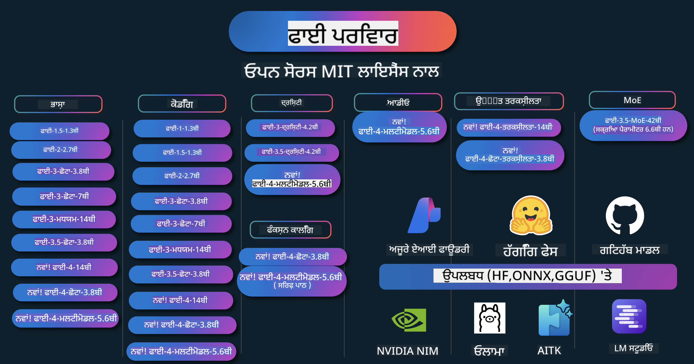

<!--
CO_OP_TRANSLATOR_METADATA:
{
  "original_hash": "1cab9282e04f2e1c388a38dca7763c16",
  "translation_date": "2025-05-09T03:49:08+00:00",
  "source_file": "README.md",
  "language_code": "pa"
}
-->
# Phi Cookbook: Microsoft ਦੇ Phi ਮਾਡਲਾਂ ਨਾਲ ਹੱਥ-ਅਨੁਭਵ ਉਦਾਹਰਣ

  

  
  
  

  
  

Phi Microsoft ਵੱਲੋਂ ਵਿਕਸਿਤ ਖੁੱਲ੍ਹਾ ਸੋਰਸ AI ਮਾਡਲਾਂ ਦੀ ਇੱਕ ਲੜੀ ਹੈ।  

Phi ਇਸ ਸਮੇਂ ਸਭ ਤੋਂ ਤਾਕਤਵਰ ਅਤੇ ਕਿਫਾਇਤੀ ਛੋਟਾ ਭਾਸ਼ਾ ਮਾਡਲ (SLM) ਹੈ, ਜਿਸਦੇ ਬਹੁ-ਭਾਸ਼ਾਈ, ਤਰਕ, ਟੈਕਸਟ/ਚੈਟ ਜਨਰੇਸ਼ਨ, ਕੋਡਿੰਗ, ਤਸਵੀਰਾਂ, ਆਡੀਓ ਅਤੇ ਹੋਰ ਸੰਦਰਭਾਂ ਵਿੱਚ ਬਹੁਤ ਵਧੀਆ ਬੈਂਚਮਾਰਕ ਹਨ।  

ਤੁਸੀਂ Phi ਨੂੰ ਕਲਾਉਡ ਜਾਂ ਐਜ ਡਿਵਾਈਸਾਂ 'ਤੇ ਡਿਪਲੋਇ ਕਰ ਸਕਦੇ ਹੋ, ਅਤੇ ਸੀਮਿਤ ਕਮਪਿਊਟਿੰਗ ਸ਼ਕਤੀ ਨਾਲ ਆਸਾਨੀ ਨਾਲ ਜਨਰੇਟਿਵ AI ਐਪਲੀਕੇਸ਼ਨ ਬਣਾ ਸਕਦੇ ਹੋ।

ਇਹਨਾਂ ਸਰੋਤਾਂ ਨੂੰ ਵਰਤਣਾ ਸ਼ੁਰੂ ਕਰਨ ਲਈ ਇਹ ਕਦਮ ਫਾਲੋ ਕਰੋ:  
1. **Repository ਨੂੰ Fork ਕਰੋ**: ਕਲਿੱਕ ਕਰੋ   
2. **Repository ਨੂੰ Clone ਕਰੋ**: `git clone https://github.com/microsoft/PhiCookBook.git`  
3. [**Microsoft AI Discord Community ਵਿੱਚ ਸ਼ਾਮਿਲ ਹੋਵੋ ਅਤੇ ਮਾਹਿਰਾਂ ਅਤੇ ਹੋਰ ਵਿਕਾਸਕਾਰਾਂ ਨਾਲ ਮਿਲੋ**](https://discord.com/invite/ByRwuEEgH4?WT.mc_id=aiml-137032-kinfeylo)

## 🌐 ਬਹੁ-ਭਾਸ਼ਾਈ ਸਹਿਯੋਗ

### GitHub Action ਰਾਹੀਂ ਸਹਿਯੋਗ (ਆਟੋਮੈਟਿਕ ਅਤੇ ਹਮੇਸ਼ਾ ਅਪ-ਟੂ-ਡੇਟ)

[French](../fr/README.md) | [Spanish](../es/README.md) | [German](../de/README.md) | [Russian](../ru/README.md) | [Arabic](../ar/README.md) | [Persian (Farsi)](../fa/README.md) | [Urdu](../ur/README.md) | [Chinese (Simplified)](../zh/README.md) | [Chinese (Traditional, Macau)](../mo/README.md) | [Chinese (Traditional, Hong Kong)](../hk/README.md) | [Chinese (Traditional, Taiwan)](../tw/README.md) | [Japanese](../ja/README.md) | [Korean](../ko/README.md) | [Hindi](../hi/README.md)

### CLI ਰਾਹੀਂ ਸਹਿਯੋਗ
## ਸਮੱਗਰੀ ਦੀ ਸੂਚੀ

- ਪਰਚਿਆ
- [Phi ਪਰਿਵਾਰ ਵਿੱਚ ਤੁਹਾਡਾ ਸੁਆਗਤ ਹੈ](./md/01.Introduction/01/01.PhiFamily.md)
  - [ਆਪਣੇ ਵਾਤਾਵਰਨ ਦੀ ਸੈਟਅਪ ਕਰਨਾ](./md/01.Introduction/01/01.EnvironmentSetup.md)
  - [ਮੁੱਖ ਤਕਨਾਲੋਜੀਆਂ ਨੂੰ ਸਮਝਣਾ](./md/01.Introduction/01/01.Understandingtech.md)
  - [Phi ਮਾਡਲਾਂ ਲਈ AI ਸੁਰੱਖਿਆ](./md/01.Introduction/01/01.AISafety.md)
  - [Phi ਹਾਰਡਵੇਅਰ ਸਹਿਯੋਗ](./md/01.Introduction/01/01.Hardwaresupport.md)
  - [Phi ਮਾਡਲ ਅਤੇ ਪਲੇਟਫਾਰਮਾਂ 'ਤੇ ਉਪਲਬਧਤਾ](./md/01.Introduction/01/01.Edgeandcloud.md)
  - [Guidance-ai ਅਤੇ Phi ਦੀ ਵਰਤੋਂ](./md/01.Introduction/01/01.Guidance.md)
  - [GitHub Marketplace Models](https://github.com/marketplace/models)
  - [Azure AI Model Catalog](https://ai.azure.com)

- ਵੱਖ-ਵੱਖ ਵਾਤਾਵਰਨਾਂ ਵਿੱਚ Phi ਦੀ ਇੰਫਰੰਸ
    -  [Hugging face](./md/01.Introduction/02/01.HF.md)
    -  [GitHub Models](./md/01.Introduction/02/02.GitHubModel.md)
    -  [Azure AI Foundry Model Catalog](./md/01.Introduction/02/03.AzureAIFoundry.md)
    -  [Ollama](./md/01.Introduction/02/04.Ollama.md)
    -  [AI Toolkit VSCode (AITK)](./md/01.Introduction/02/05.AITK.md)
    -  [NVIDIA NIM](./md/01.Introduction/02/06.NVIDIA.md)

- Phi ਪਰਿਵਾਰ ਦੀ ਇੰਫਰੰਸ
    - [iOS ਵਿੱਚ Phi ਦੀ ਇੰਫਰੰਸ](./md/01.Introduction/03/iOS_Inference.md)
    - [Android ਵਿੱਚ Phi ਦੀ ਇੰਫਰੰਸ](./md/01.Introduction/03/Android_Inference.md)
    - [Jetson ਵਿੱਚ Phi ਦੀ ਇੰਫਰੰਸ](./md/01.Introduction/03/Jetson_Inference.md)
    - [AI PC ਵਿੱਚ Phi ਦੀ ਇੰਫਰੰਸ](./md/01.Introduction/03/AIPC_Inference.md)
    - [Apple MLX Framework ਨਾਲ Phi ਦੀ ਇੰਫਰੰਸ](./md/01.Introduction/03/MLX_Inference.md)
    - [ਲੋਕਲ ਸਰਵਰ ਵਿੱਚ Phi ਦੀ ਇੰਫਰੰਸ](./md/01.Introduction/03/Local_Server_Inference.md)
    - [AI Toolkit ਦੀ ਵਰਤੋਂ ਨਾਲ ਰਿਮੋਟ ਸਰਵਰ ਵਿੱਚ Phi ਦੀ ਇੰਫਰੰਸ](./md/01.Introduction/03/Remote_Interence.md)
    - [Rust ਨਾਲ Phi ਦੀ ਇੰਫਰੰਸ](./md/01.Introduction/03/Rust_Inference.md)
    - [ਲੋਕਲ ਵਿੱਚ Phi--Vision ਦੀ ਇੰਫਰੰਸ](./md/01.Introduction/03/Vision_Inference.md)
    - [Kaito AKS, Azure Containers (ਅਧਿਕਾਰਿਕ ਸਹਿਯੋਗ) ਨਾਲ Phi ਦੀ ਇੰਫਰੰਸ](./md/01.Introduction/03/Kaito_Inference.md)
-  [Phi ਪਰਿਵਾਰ ਦੀ ਮਾਤਰਾ ਨਿਰਧਾਰਿਤ ਕਰਨਾ](./md/01.Introduction/04/QuantifyingPhi.md)
    - [llama.cpp ਦੀ ਵਰਤੋਂ ਕਰਕੇ Phi-3.5 / 4 ਨੂੰ ਕੁਆੰਟਾਈਜ਼ ਕਰਨਾ](./md/01.Introduction/04/UsingLlamacppQuantifyingPhi.md)
    - [onnxruntime ਲਈ Generative AI ਐਕਸਟੇਂਸ਼ਨਾਂ ਨਾਲ Phi-3.5 / 4 ਨੂੰ ਕੁਆੰਟਾਈਜ਼ ਕਰਨਾ](./md/01.Introduction/04/UsingORTGenAIQuantifyingPhi.md)
    - [Intel OpenVINO ਦੀ ਵਰਤੋਂ ਕਰਕੇ Phi-3.5 / 4 ਨੂੰ ਕੁਆੰਟਾਈਜ਼ ਕਰਨਾ](./md/01.Introduction/04/UsingIntelOpenVINOQuantifyingPhi.md)
    - [Apple MLX Framework ਦੀ ਵਰਤੋਂ ਕਰਕੇ Phi-3.5 / 4 ਨੂੰ ਕੁਆੰਟਾਈਜ਼ ਕਰਨਾ](./md/01.Introduction/04/UsingAppleMLXQuantifyingPhi.md)

-  Phi ਦਾ ਮੁਲਾਂਕਣ
- [Response AI](./md/01.Introduction/05/ResponsibleAI.md)
    - [Azure AI Foundry for Evaluation](./md/01.Introduction/05/AIFoundry.md)
    - [Using Promptflow for Evaluation](./md/01.Introduction/05/Promptflow.md)
 
- RAG with Azure AI Search
    - [How to use Phi-4-mini and Phi-4-multimodal(RAG) with Azure AI Search](https://github.com/microsoft/PhiCookBook/blob/main/code/06.E2E/E2E_Phi-4-RAG-Azure-AI-Search.ipynb)

- Phi application development samples
  - Text & Chat Applications
    - Phi-4 Samples 🆕
      - [📓] [Chat With Phi-4-mini ONNX Model](./md/02.Application/01.TextAndChat/Phi4/ChatWithPhi4ONNX/README.md)
      - [Chat with Phi-4 local ONNX Model .NET](../../md/04.HOL/dotnet/src/LabsPhi4-Chat-01OnnxRuntime)
      - [Chat .NET Console App with Phi-4 ONNX using Sementic Kernel](../../md/04.HOL/dotnet/src/LabsPhi4-Chat-02SK)
    - Phi-3 / 3.5 Samples
      - [Local Chatbot in the browser using Phi3, ONNX Runtime Web and WebGPU](https://github.com/microsoft/onnxruntime-inference-examples/tree/main/js/chat)
      - [OpenVino Chat](./md/02.Application/01.TextAndChat/Phi3/E2E_OpenVino_Chat.md)
      - [Multi Model - Interactive Phi-3-mini and OpenAI Whisper](./md/02.Application/01.TextAndChat/Phi3/E2E_Phi-3-mini_with_whisper.md)
      - [MLFlow - Building a wrapper and using Phi-3 with MLFlow](./md//02.Application/01.TextAndChat/Phi3/E2E_Phi-3-MLflow.md)
      - [Model Optimization - How to optimize Phi-3-min model for ONNX Runtime Web with Olive](https://github.com/microsoft/Olive/tree/main/examples/phi3)
      - [WinUI3 App with Phi-3 mini-4k-instruct-onnx](https://github.com/microsoft/Phi3-Chat-WinUI3-Sample/)
      -[WinUI3 Multi Model AI Powered Notes App Sample](https://github.com/microsoft/ai-powered-notes-winui3-sample)
      - [Fine-tune and Integrate custom Phi-3 models with Prompt flow](./md/02.Application/01.TextAndChat/Phi3/E2E_Phi-3-FineTuning_PromptFlow_Integration.md)
      - [Fine-tune and Integrate custom Phi-3 models with Prompt flow in Azure AI Foundry](./md/02.Application/01.TextAndChat/Phi3/E2E_Phi-3-FineTuning_PromptFlow_Integration_AIFoundry.md)
      - [Evaluate the Fine-tuned Phi-3 / Phi-3.5 Model in Azure AI Foundry Focusing on Microsoft's Responsible AI Principles](./md/02.Application/01.TextAndChat/Phi3/E2E_Phi-3-Evaluation_AIFoundry.md)
      - [📓] [Phi-3.5-mini-instruct language prediction sample (Chinese/English)](../../md/02.Application/01.TextAndChat/Phi3/phi3-instruct-demo.ipynb)
      - [Phi-3.5-Instruct WebGPU RAG Chatbot](./md/02.Application/01.TextAndChat/Phi3/WebGPUWithPhi35Readme.md)
      - [Using Windows GPU to create Prompt flow solution with Phi-3.5-Instruct ONNX](./md/02.Application/01.TextAndChat/Phi3/UsingPromptFlowWithONNX.md)
      - [Using Microsoft Phi-3.5 tflite to create Android app](./md/02.Application/01.TextAndChat/Phi3/UsingPhi35TFLiteCreateAndroidApp.md)
      - [Q&A .NET Example using local ONNX Phi-3 model using the Microsoft.ML.OnnxRuntime](../../md/04.HOL/dotnet/src/LabsPhi301)
      - [Console chat .NET app with Semantic Kernel and Phi-3](../../md/04.HOL/dotnet/src/LabsPhi302)

  - Azure AI Inference SDK Code Based Samples 
    - Phi-4 Samples 🆕
      - [📓] [Generate project code using Phi-4-multimodal](./md/02.Application/02.Code/Phi4/GenProjectCode/README.md)
    - Phi-3 / 3.5 Samples
      - [Build your own Visual Studio Code GitHub Copilot Chat with Microsoft Phi-3 Family](./md/02.Application/02.Code/Phi3/VSCodeExt/README.md)
      - [Create your own Visual Studio Code Chat Copilot Agent with Phi-3.5 by GitHub Models](/md/02.Application/02.Code/Phi3/CreateVSCodeChatAgentWithGitHubModels.md)

  - Advanced Reasoning Samples
    - Phi-4 Samples 🆕
      - [📓] [Phi-4-mini-reasoning or Phi-4-reasoning Samples](./md/02.Application/03.AdvancedReasoning/Phi4/AdvancedResoningPhi4mini/README.md)
      - [📓] [Fine-tuning Phi-4-mini-reasoning with Microsoft Olive](../../md/02.Application/03.AdvancedReasoning/Phi4/AdvancedResoningPhi4mini/olive_ft_phi_4_reasoning_with_medicaldata.ipynb)
      - [📓] [Fine-tuning Phi-4-mini-reasoning with Apple MLX](../../md/02.Application/03.AdvancedReasoning/Phi4/AdvancedResoningPhi4mini/mlx_ft_phi_4_reasoning_with_medicaldata.ipynb)
      - [📓] [Phi-4-mini-reasoning with GitHub Models](../../md/02.Application/02.Code/Phi4r/github_models_inference.ipynb)
- [📓] [Phi-4-mini reasoning ਨਾਲ Azure AI Foundry Models](../../md/02.Application/02.Code/Phi4r/azure_models_inference.ipynb)
  - ਡੈਮੋਜ਼
      - [Phi-4-mini ਡੈਮੋਜ਼ ਜੋ Hugging Face Spaces 'ਤੇ ਹੋਸਟ ਕੀਤੇ ਗਏ ਹਨ](https://huggingface.co/spaces/microsoft/phi-4-mini?WT.mc_id=aiml-137032-kinfeylo)
      - [Phi-4-multimodal ਡੈਮੋਜ਼ ਜੋ Hugging Face Spaces 'ਤੇ ਹੋਸਟ ਕੀਤੇ ਗਏ ਹਨ](https://huggingface.co/spaces/microsoft/phi-4-multimodal?WT.mc_id=aiml-137032-kinfeylo)
  - ਵਿਜ਼ਨ ਸੈਂਪਲ
    - Phi-4 ਸੈਂਪਲ 🆕
      - [📓] [ਚਿੱਤਰਾਂ ਨੂੰ ਪੜ੍ਹਨ ਅਤੇ ਕੋਡ ਬਣਾਉਣ ਲਈ Phi-4-multimodal ਦੀ ਵਰਤੋਂ ਕਰੋ](./md/02.Application/04.Vision/Phi4/CreateFrontend/README.md) 
    - Phi-3 / 3.5 ਸੈਂਪਲ
      -  [📓][Phi-3-vision-ਚਿੱਤਰ ਟੈਕਸਟ ਤੋਂ ਟੈਕਸਟ](../../md/02.Application/04.Vision/Phi3/E2E_Phi-3-vision-image-text-to-text-online-endpoint.ipynb)
      - [Phi-3-vision-ONNX](https://onnxruntime.ai/docs/genai/tutorials/phi3-v.html)
      - [📓][Phi-3-vision CLIP ਐਂਬੈਡਿੰਗ](../../md/02.Application/04.Vision/Phi3/E2E_Phi-3-vision-image-text-to-text-online-endpoint.ipynb)
      - [ਡੈਮੋ: Phi-3 ਰੀਸਾਈਕਲਿੰਗ](https://github.com/jennifermarsman/PhiRecycling/)
      - [Phi-3-vision - ਵਿਜ਼ੂਅਲ ਭਾਸ਼ਾ ਸਹਾਇਕ - Phi3-Vision ਅਤੇ OpenVINO ਨਾਲ](https://docs.openvino.ai/nightly/notebooks/phi-3-vision-with-output.html)
      - [Phi-3 Vision Nvidia NIM](./md/02.Application/04.Vision/Phi3/E2E_Nvidia_NIM_Vision.md)
      - [Phi-3 Vision OpenVino](./md/02.Application/04.Vision/Phi3/E2E_OpenVino_Phi3Vision.md)
      - [📓][Phi-3.5 Vision ਮਲਟੀ-ਫਰੇਮ ਜਾਂ ਮਲਟੀ-ਇਮੇਜ ਸੈਂਪਲ](../../md/02.Application/04.Vision/Phi3/phi3-vision-demo.ipynb)
      - [Phi-3 Vision ਲੋਕਲ ONNX ਮਾਡਲ Microsoft.ML.OnnxRuntime .NET ਦੀ ਵਰਤੋਂ ਨਾਲ](../../md/04.HOL/dotnet/src/LabsPhi303)
      - [ਮੈਨੂ ਅਧਾਰਿਤ Phi-3 Vision ਲੋਕਲ ONNX ਮਾਡਲ Microsoft.ML.OnnxRuntime .NET ਦੀ ਵਰਤੋਂ ਨਾਲ](../../md/04.HOL/dotnet/src/LabsPhi304)

  - ਆਡੀਓ ਸੈਂਪਲ
    - Phi-4 ਸੈਂਪਲ 🆕
      - [📓] [Phi-4-multimodal ਦੀ ਵਰਤੋਂ ਕਰਕੇ ਆਡੀਓ ਟ੍ਰਾਂਸਕ੍ਰਿਪਟ ਕੱਢਣਾ](./md/02.Application/05.Audio/Phi4/Transciption/README.md)
      - [📓] [Phi-4-multimodal ਆਡੀਓ ਸੈਂਪਲ](../../md/02.Application/05.Audio/Phi4/Siri/demo.ipynb)
      - [📓] [Phi-4-multimodal ਸਪੀਚ ਟ੍ਰਾਂਸਲੇਸ਼ਨ ਸੈਂਪਲ](../../md/02.Application/05.Audio/Phi4/Translate/demo.ipynb)
      - [.NET ਕਨਸੋਲ ਐਪਲੀਕੇਸ਼ਨ ਜੋ Phi-4-multimodal ਆਡੀਓ ਦੀ ਵਰਤੋਂ ਕਰਕੇ ਆਡੀਓ ਫਾਈਲ ਦਾ ਵਿਸ਼ਲੇਸ਼ਣ ਕਰਦਾ ਹੈ ਅਤੇ ਟ੍ਰਾਂਸਕ੍ਰਿਪਟ ਬਣਾਉਂਦਾ ਹੈ](../../md/04.HOL/dotnet/src/LabsPhi4-MultiModal-02Audio)

  - MOE ਸੈਂਪਲ
    - Phi-3 / 3.5 ਸੈਂਪਲ
      - [📓] [Phi-3.5 ਮਿਕਸਚਰ ਆਫ਼ ਐਕਸਪਰਟਸ ਮਾਡਲ (MoEs) ਸੋਸ਼ਲ ਮੀਡੀਆ ਸੈਂਪਲ](../../md/02.Application/06.MoE/Phi3/phi3_moe_demo.ipynb)
      - [📓] [NVIDIA NIM Phi-3 MOE, Azure AI Search, ਅਤੇ LlamaIndex ਨਾਲ Retrieval-Augmented Generation (RAG) ਪਾਈਪਲਾਈਨ ਬਣਾਉਣਾ](../../md/02.Application/06.MoE/Phi3/azure-ai-search-nvidia-rag.ipynb)
  - ਫੰਕਸ਼ਨ ਕਾਲਿੰਗ ਸੈਂਪਲ
    - Phi-4 ਸੈਂਪਲ 🆕
      -  [📓] [Phi-4-mini ਨਾਲ ਫੰਕਸ਼ਨ ਕਾਲਿੰਗ ਦੀ ਵਰਤੋਂ](./md/02.Application/07.FunctionCalling/Phi4/FunctionCallingBasic/README.md)
      -  [📓] [Phi-4-mini ਨਾਲ ਮਲਟੀ-ਏਜੰਟ ਬਣਾਉਣ ਲਈ ਫੰਕਸ਼ਨ ਕਾਲਿੰਗ ਦੀ ਵਰਤੋਂ](../../md/02.Application/07.FunctionCalling/Phi4/Multiagents/Phi_4_mini_multiagent.ipynb)
      -  [📓] [Ollama ਨਾਲ ਫੰਕਸ਼ਨ ਕਾਲਿੰਗ ਦੀ ਵਰਤੋਂ](../../md/02.Application/07.FunctionCalling/Phi4/Ollama/ollama_functioncalling.ipynb)
  - ਮਲਟੀਮੋਡਲ ਮਿਕਸਿੰਗ ਸੈਂਪਲ
    - Phi-4 ਸੈਂਪਲ 🆕
      -  [📓] [ਟੈਕਨੋਲੋਜੀ ਜਰਨਲਿਸਟ ਵਜੋਂ Phi-4-multimodal ਦੀ ਵਰਤੋਂ](../../md/02.Application/08.Multimodel/Phi4/TechJournalist/phi_4_mm_audio_text_publish_news.ipynb)
      - [.NET ਕਨਸੋਲ ਐਪਲੀਕੇਸ਼ਨ ਜੋ Phi-4-multimodal ਦੀ ਵਰਤੋਂ ਕਰਕੇ ਚਿੱਤਰਾਂ ਦਾ ਵਿਸ਼ਲੇਸ਼ਣ ਕਰਦਾ ਹੈ](../../md/04.HOL/dotnet/src/LabsPhi4-MultiModal-01Images)

- ਫਾਈਨ-ਟਿਊਨਿੰਗ Phi ਸੈਂਪਲ
  - [ਫਾਈਨ-ਟਿਊਨਿੰਗ ਸਥਿਤੀਆਂ](./md/03.FineTuning/FineTuning_Scenarios.md)
  - [ਫਾਈਨ-ਟਿਊਨਿੰਗ ਬਨਾਮ RAG](./md/03.FineTuning/FineTuning_vs_RAG.md)
  - [Phi-3 ਨੂੰ ਉਦਯੋਗ ਦੇ ਮਾਹਿਰ ਬਣਾਉਣ ਲਈ ਫਾਈਨ-ਟਿਊਨਿੰਗ](./md/03.FineTuning/LetPhi3gotoIndustriy.md)
  - [AI Toolkit for VS Code ਨਾਲ Phi-3 ਦੀ ਫਾਈਨ-ਟਿਊਨਿੰਗ](./md/03.FineTuning/Finetuning_VSCodeaitoolkit.md)
  - [Azure Machine Learning Service ਨਾਲ Phi-3 ਦੀ ਫਾਈਨ-ਟਿਊਨਿੰਗ](./md/03.FineTuning/Introduce_AzureML.md)
- [Lora ਨਾਲ Phi-3 ਦੀ ਫਾਈਨ-ਟਿਊਨਿੰਗ](./md/03.FineTuning/FineTuning_Lora.md)
  - [QLora ਨਾਲ Phi-3 ਦੀ ਫਾਈਨ-ਟਿਊਨਿੰਗ](./md/03.FineTuning/FineTuning_Qlora.md)
  - [Azure AI Foundry ਨਾਲ Phi-3 ਦੀ ਫਾਈਨ-ਟਿਊਨਿੰਗ](./md/03.FineTuning/FineTuning_AIFoundry.md)
  - [Azure ML CLI/SDK ਨਾਲ Phi-3 ਦੀ ਫਾਈਨ-ਟਿਊਨਿੰਗ](./md/03.FineTuning/FineTuning_MLSDK.md)
  - [Microsoft Olive ਨਾਲ ਫਾਈਨ-ਟਿਊਨਿੰਗ](./md/03.FineTuning/FineTuning_MicrosoftOlive.md)
  - [Microsoft Olive Hands-On Lab ਨਾਲ ਫਾਈਨ-ਟਿਊਨਿੰਗ](./md/03.FineTuning/olive-lab/readme.md)
  - [Weights and Bias ਨਾਲ Phi-3-vision ਦੀ ਫਾਈਨ-ਟਿਊਨਿੰਗ](./md/03.FineTuning/FineTuning_Phi-3-visionWandB.md)
  - [Apple MLX Framework ਨਾਲ Phi-3 ਦੀ ਫਾਈਨ-ਟਿਊਨਿੰਗ](./md/03.FineTuning/FineTuning_MLX.md)
  - [Phi-3-vision ਦੀ ਫਾਈਨ-ਟਿਊਨਿੰਗ (ਆਧਿਕਾਰਿਕ ਸਹਾਇਤਾ)](./md/03.FineTuning/FineTuning_Vision.md)
  - [Kaito AKS, Azure Containers ਨਾਲ Phi-3 ਦੀ ਫਾਈਨ-ਟਿਊਨਿੰਗ (ਆਧਿਕਾਰਿਕ ਸਹਾਇਤਾ)](./md/03.FineTuning/FineTuning_Kaito.md)
  - [Phi-3 ਅਤੇ 3.5 Vision ਦੀ ਫਾਈਨ-ਟਿਊਨਿੰਗ](https://github.com/2U1/Phi3-Vision-Finetune)

- Hands on Lab
  - [ਅੱਗੇ ਆ ਰਹੀਆਂ ਮਾਡਲਾਂ ਦੀ ਖੋਜ: LLMs, SLMs, ਸਥਾਨਕ ਵਿਕਾਸ ਅਤੇ ਹੋਰ](https://github.com/microsoft/aitour-exploring-cutting-edge-models)
  - [NLP ਦੀ ਸਮਰੱਥਾ ਖੋਲ੍ਹਣਾ: Microsoft Olive ਨਾਲ ਫਾਈਨ-ਟਿਊਨਿੰਗ](https://github.com/azure/Ignite_FineTuning_workshop)

- ਅਕਾਦਮਿਕ ਰਿਸਰਚ ਪੇਪਰ ਅਤੇ ਪ੍ਰਕਾਸ਼ਨ
  - [Textbooks Are All You Need II: phi-1.5 ਤਕਨੀਕੀ ਰਿਪੋਰਟ](https://arxiv.org/abs/2309.05463)
  - [Phi-3 ਤਕਨੀਕੀ ਰਿਪੋਰਟ: ਤੁਹਾਡੇ ਫੋਨ 'ਤੇ ਇੱਕ ਬਹੁਤ ਸਮਰੱਥ ਭਾਸ਼ਾ ਮਾਡਲ](https://arxiv.org/abs/2404.14219)
  - [Phi-4 ਤਕਨੀਕੀ ਰਿਪੋਰਟ](https://arxiv.org/abs/2412.08905)
  - [Phi-4-Mini ਤਕਨੀਕੀ ਰਿਪੋਰਟ: ਮਿਕਸਚਰ-ਆਫ-ਲੋਰਾ ਦੇ ਜ਼ਰੀਏ ਸੰਕੁਚਿਤ ਪਰ ਤਾਕਤਵਰ ਮਲਟੀਮੋਡਲ ਭਾਸ਼ਾ ਮਾਡਲ](https://arxiv.org/abs/2503.01743)
  - [ਵਾਹਨ ਵਿੱਚ ਫੰਕਸ਼ਨ-ਕਾਲਿੰਗ ਲਈ ਛੋਟੇ ਭਾਸ਼ਾ ਮਾਡਲਾਂ ਦੀ ਅਪਟੀਮਾਈਜ਼ੇਸ਼ਨ](https://arxiv.org/abs/2501.02342)
  - [(WhyPHI) ਬਹੁ-ਚੋਣ ਪ੍ਰਸ਼ਨ ਉੱਤਰ ਦੇਣ ਲਈ PHI-3 ਦੀ ਫਾਈਨ-ਟਿਊਨਿੰਗ: ਵਿਧੀ, ਨਤੀਜੇ ਅਤੇ ਚੁਣੌਤੀਆਂ](https://arxiv.org/abs/2501.01588)
  - [Phi-4-ਰਿਜ਼ਨਿੰਗ ਤਕਨੀਕੀ ਰਿਪੋਰਟ](https://www.microsoft.com/en-us/research/wp-content/uploads/2025/04/phi_4_reasoning.pdf)
  - [Phi-4-mini-ਰਿਜ਼ਨਿੰਗ ਤਕਨੀਕੀ ਰਿਪੋਰਟ](https://huggingface.co/microsoft/Phi-4-mini-reasoning/blob/main/Phi-4-Mini-Reasoning.pdf)

## Phi ਮਾਡਲਾਂ ਦੀ ਵਰਤੋਂ

### Azure AI Foundry 'ਤੇ Phi

ਤੁਸੀਂ ਸਿੱਖ ਸਕਦੇ ਹੋ ਕਿ Microsoft Phi ਨੂੰ ਕਿਵੇਂ ਵਰਤਣਾ ਹੈ ਅਤੇ ਆਪਣੇ ਵੱਖ-ਵੱਖ ਹਾਰਡਵੇਅਰ ਡਿਵਾਈਸਾਂ ਵਿੱਚ E2E ਹੱਲ ਕਿਵੇਂ ਬਣਾਉਣੇ ਹਨ। ਖੁਦ Phi ਦਾ ਅਨੁਭਵ ਕਰਨ ਲਈ, ਮਾਡਲਾਂ ਨਾਲ ਖੇਡਣਾ ਸ਼ੁਰੂ ਕਰੋ ਅਤੇ ਆਪਣੇ ਸਹੂਲਤਾਂ ਲਈ Phi ਨੂੰ ਕਸਟਮਾਈਜ਼ ਕਰੋ [Azure AI Foundry Azure AI Model Catalog](https://aka.ms/phi3-azure-ai) ਦੀ ਵਰਤੋਂ ਕਰਕੇ। ਤੁਸੀਂ [Azure AI Foundry](/md/02.QuickStart/AzureAIFoundry_QuickStart.md) ਦੇ ਗੈਟਿੰਗ ਸਟਾਰਟ ਗਾਈਡ 'ਤੇ ਹੋਰ ਜਾਣਕਾਰੀ ਪ੍ਰਾਪਤ ਕਰ ਸਕਦੇ ਹੋ।

**ਪਲੇਗ੍ਰਾਊਂਡ**  
ਹਰ ਮਾਡਲ ਲਈ ਇੱਕ ਸਮਰਪਿਤ ਪਲੇਗ੍ਰਾਊਂਡ ਹੈ ਜਿੱਥੇ ਤੁਸੀਂ ਮਾਡਲ ਦੀ ਜਾਂਚ ਕਰ ਸਕਦੇ ਹੋ [Azure AI Playground](https://aka.ms/try-phi3) 'ਤੇ।

### GitHub ਮਾਡਲਾਂ 'ਤੇ Phi

ਤੁਸੀਂ ਸਿੱਖ ਸਕਦੇ ਹੋ ਕਿ Microsoft Phi ਨੂੰ ਕਿਵੇਂ ਵਰਤਣਾ ਹੈ ਅਤੇ ਆਪਣੇ ਵੱਖ-ਵੱਖ ਹਾਰਡਵੇਅਰ ਡਿਵਾਈਸਾਂ ਵਿੱਚ E2E ਹੱਲ ਕਿਵੇਂ ਬਣਾਉਣੇ ਹਨ। ਖੁਦ Phi ਦਾ ਅਨੁਭਵ ਕਰਨ ਲਈ, ਮਾਡਲ ਨਾਲ ਖੇਡਣਾ ਸ਼ੁਰੂ ਕਰੋ ਅਤੇ ਆਪਣੇ ਸਹੂਲਤਾਂ ਲਈ Phi ਨੂੰ ਕਸਟਮਾਈਜ਼ ਕਰੋ [GitHub Model Catalog](https://github.com/marketplace/models?WT.mc_id=aiml-137032-kinfeylo) ਦੀ ਵਰਤੋਂ ਕਰਕੇ। ਤੁਸੀਂ [GitHub Model Catalog](/md/02.QuickStart/GitHubModel_QuickStart.md) ਦੇ ਗੈਟਿੰਗ ਸਟਾਰਟ ਗਾਈਡ 'ਤੇ ਹੋਰ ਜਾਣਕਾਰੀ ਪ੍ਰਾਪਤ ਕਰ ਸਕਦੇ ਹੋ।

**ਪਲੇਗ੍ਰਾਊਂਡ**  
ਹਰ ਮਾਡਲ ਲਈ ਇੱਕ ਸਮਰਪਿਤ [ਪਲੇਗ੍ਰਾਊਂਡ ਹੈ ਜਿੱਥੇ ਮਾਡਲ ਦੀ ਜਾਂਚ ਕੀਤੀ ਜਾ ਸਕਦੀ ਹੈ](/md/02.QuickStart/GitHubModel_QuickStart.md)।

### Hugging Face 'ਤੇ Phi

ਤੁਸੀਂ ਮਾਡਲ ਨੂੰ [Hugging Face](https://huggingface.co/microsoft) 'ਤੇ ਵੀ ਲੱਭ ਸਕਦੇ ਹੋ।

**ਪਲੇਗ੍ਰਾਊਂਡ**  
[Hugging Chat playground](https://huggingface.co/chat/models/microsoft/Phi-3-mini-4k-instruct)

## ਜ਼ਿੰਮੇਵਾਰ AI

Microsoft ਆਪਣੇ ਗਾਹਕਾਂ ਨੂੰ ਸਾਡੇ AI ਉਤਪਾਦਾਂ ਨੂੰ ਜ਼ਿੰਮੇਵਾਰੀ ਨਾਲ ਵਰਤਣ ਵਿੱਚ ਮਦਦ ਕਰਨ, ਸਾਡੇ ਤਜਰਬੇ ਸਾਂਝੇ ਕਰਨ ਅਤੇ Transparency Notes ਅਤੇ Impact Assessments ਵਰਗੇ ਟੂਲਾਂ ਰਾਹੀਂ ਭਰੋਸੇਮੰਦ ਸਾਂਝੇਦਾਰੀ ਬਣਾਉਣ ਲਈ ਵਚਨਬੱਧ ਹੈ। ਇਹਨਾਂ ਵਿੱਚੋਂ ਬਹੁਤ ਸਾਰੇ ਸਰੋਤ [https://aka.ms/RAI](https://aka.ms/RAI) 'ਤੇ ਮਿਲ ਸਕਦੇ ਹਨ।  
Microsoft ਦਾ ਜ਼ਿੰਮੇਵਾਰ AI ਲਈ ਦ੍ਰਿਸ਼ਟਿਕੋਣ ਸਾਡੇ AI ਦੇ ਸਿਧਾਂਤਾਂ 'ਤੇ ਅਧਾਰਿਤ ਹੈ ਜੋ ਨਿਆਂ, ਭਰੋਸੇਯੋਗਤਾ ਅਤੇ ਸੁਰੱਖਿਆ, ਗੋਪਨੀਯਤਾ ਅਤੇ ਸੁਰੱਖਿਆ, ਸ਼ਾਮਿਲੀਅਤ, ਪਾਰਦਰਸ਼ਤਾ ਅਤੇ ਜਵਾਬਦੇਹੀ ਹਨ।
ਵੱਡੇ ਪੱਧਰ ਦੇ ਕੁਦਰਤੀ ਭਾਸ਼ਾ, ਚਿੱਤਰ, ਅਤੇ ਭਾਸ਼ਣ ਮਾਡਲ - ਜਿਵੇਂ ਕਿ ਇਸ ਨਮੂਨੇ ਵਿੱਚ ਵਰਤੇ ਗਏ ਹਨ - ਸੰਭਵ ਹੈ ਕਿ ਅਣਇਨਸਾਫ, ਅਣਭਰੋਸੇਮੰਦ, ਜਾਂ ਅਪਮਾਨਜਨਕ ਤਰੀਕਿਆਂ ਨਾਲ ਵਰਤੋਂ ਕਰ ਸਕਦੇ ਹਨ, ਜਿਸ ਨਾਲ ਨੁਕਸਾਨ ਹੋ ਸਕਦਾ ਹੈ। ਕਿਰਪਾ ਕਰਕੇ [Azure OpenAI service Transparency note](https://learn.microsoft.com/legal/cognitive-services/openai/transparency-note?tabs=text) ਨੂੰ ਵੇਖੋ ਤਾਂ ਜੋ ਖਤਰੇ ਅਤੇ ਸੀਮਾਵਾਂ ਬਾਰੇ ਜਾਣੂ ਹੋ ਸਕੋ।

ਇਨ੍ਹਾਂ ਖਤਰਿਆਂ ਨੂੰ ਘਟਾਉਣ ਲਈ ਸੁਝਾਇਆ ਗਿਆ ਤਰੀਕਾ ਇਹ ਹੈ ਕਿ ਆਪਣੇ ਆਰਕੀਟੈਕਚਰ ਵਿੱਚ ਇੱਕ ਸੁਰੱਖਿਆ ਪ੍ਰਣਾਲੀ ਸ਼ਾਮਲ ਕਰੋ ਜੋ ਨੁਕਸਾਨਦਾਇਕ ਵਰਤੋਂ ਨੂੰ ਪਹਚਾਣ ਸਕੇ ਅਤੇ ਰੋਕ ਸਕੇ। [Azure AI Content Safety](https://learn.microsoft.com/azure/ai-services/content-safety/overview) ਇੱਕ ਸੁਤੰਤਰ ਸੁਰੱਖਿਆ ਪਰਤ ਮੁਹੱਈਆ ਕਰਦਾ ਹੈ, ਜੋ ਐਪਲੀਕੇਸ਼ਨਾਂ ਅਤੇ ਸੇਵਾਵਾਂ ਵਿੱਚ ਨੁਕਸਾਨਦਾਇਕ ਯੂਜ਼ਰ-ਤਿਆਰ ਅਤੇ AI-ਤਿਆਰ ਸਮੱਗਰੀ ਨੂੰ ਪਹਚਾਣ ਸਕਦਾ ਹੈ। Azure AI Content Safety ਵਿੱਚ ਟੈਕਸਟ ਅਤੇ ਚਿੱਤਰ API ਸ਼ਾਮਲ ਹਨ ਜੋ ਤੁਹਾਨੂੰ ਨੁਕਸਾਨਦਾਇਕ ਸਮੱਗਰੀ ਪਹਚਾਣਨ ਦੀ ਆਗਿਆ ਦਿੰਦੇ ਹਨ। Azure AI Foundry ਵਿੱਚ, Content Safety ਸੇਵਾ ਤੁਹਾਨੂੰ ਵੱਖ-ਵੱਖ ਮੋਡਾਲਿਟੀਜ਼ ਵਿੱਚ ਨੁਕਸਾਨਦਾਇਕ ਸਮੱਗਰੀ ਦੀ ਪਹਚਾਣ ਲਈ ਨਮੂਨਾ ਕੋਡ ਦੇਖਣ, ਖੋਜ ਕਰਨ ਅਤੇ ਅਜ਼ਮਾਉਣ ਦੀ ਆਗਿਆ ਦਿੰਦੀ ਹੈ। ਹੇਠਾਂ ਦਿੱਤੀ [quickstart documentation](https://learn.microsoft.com/azure/ai-services/content-safety/quickstart-text?tabs=visual-studio%2Clinux&pivots=programming-language-rest) ਤੁਹਾਨੂੰ ਸੇਵਾ ਨੂੰ ਬੇਨਤੀ ਭੇਜਣ ਵਿੱਚ ਮਦਦ ਕਰਦੀ ਹੈ।

ਇੱਕ ਹੋਰ ਗੱਲ ਜੋ ਧਿਆਨ ਵਿੱਚ ਰੱਖਣੀ ਚਾਹੀਦੀ ਹੈ, ਉਹ ਹੈ ਕੁੱਲ ਐਪਲੀਕੇਸ਼ਨ ਦੀ ਕਾਰਗੁਜ਼ਾਰੀ। ਮਲਟੀ-ਮੋਡਲ ਅਤੇ ਮਲਟੀ-ਮਾਡਲ ਐਪਲੀਕੇਸ਼ਨਾਂ ਵਿੱਚ, ਅਸੀਂ ਕਾਰਗੁਜ਼ਾਰੀ ਨੂੰ ਇਸ ਤਰ੍ਹਾਂ ਸਮਝਦੇ ਹਾਂ ਕਿ ਸਿਸਟਮ ਤੁਹਾਡੇ ਅਤੇ ਤੁਹਾਡੇ ਯੂਜ਼ਰਾਂ ਦੀ ਉਮੀਦਾਂ ਅਨੁਸਾਰ ਕੰਮ ਕਰਦਾ ਹੈ, ਜਿਸ ਵਿੱਚ ਨੁਕਸਾਨਦਾਇਕ ਨਤੀਜੇ ਨਾ ਬਣਾਉਣਾ ਵੀ ਸ਼ਾਮਲ ਹੈ। ਇਹ ਜਰੂਰੀ ਹੈ ਕਿ ਤੁਸੀਂ ਆਪਣੇ ਕੁੱਲ ਐਪਲੀਕੇਸ਼ਨ ਦੀ ਕਾਰਗੁਜ਼ਾਰੀ ਦਾ ਮੁਲਾਂਕਣ [Performance and Quality and Risk and Safety evaluators](https://learn.microsoft.com/azure/ai-studio/concepts/evaluation-metrics-built-in) ਦੀ ਵਰਤੋਂ ਕਰਕੇ ਕਰੋ। ਤੁਹਾਡੇ ਕੋਲ [custom evaluators](https://learn.microsoft.com/azure/ai-studio/how-to/develop/evaluate-sdk#custom-evaluators) ਬਣਾਉਣ ਅਤੇ ਮੁਲਾਂਕਣ ਕਰਨ ਦੀ ਵੀ ਸਹੂਲਤ ਹੈ।

ਤੁਸੀਂ ਆਪਣੇ ਵਿਕਾਸ ਮਾਹੌਲ ਵਿੱਚ [Azure AI Evaluation SDK](https://microsoft.github.io/promptflow/index.html) ਦੀ ਵਰਤੋਂ ਕਰਕੇ ਆਪਣੀ AI ਐਪਲੀਕੇਸ਼ਨ ਦਾ ਮੁਲਾਂਕਣ ਕਰ ਸਕਦੇ ਹੋ। ਚਾਹੇ ਇੱਕ ਟੈਸਟ ਡਾਟਾਸੈੱਟ ਹੋਵੇ ਜਾਂ ਇੱਕ ਟਾਰਗਟ, ਤੁਹਾਡੇ ਜਨਰੇਟਿਵ AI ਐਪਲੀਕੇਸ਼ਨ ਦੀਆਂ ਪੈਦਾਵਾਰਾਂ ਨੂੰ ਇੰਬਿਲਟ ਜਾਂ ਕਸਟਮ ਮੁਲਾਂਕਣਕਾਰਾਂ ਨਾਲ ਮਾਤਰਾਤਮਕ ਤੌਰ 'ਤੇ ਮਾਪਿਆ ਜਾਂਦਾ ਹੈ। ਆਪਣੀ ਸਿਸਟਮ ਦਾ ਮੁਲਾਂਕਣ ਕਰਨ ਲਈ azure ai evaluation sdk ਨਾਲ ਸ਼ੁਰੂਆਤ ਕਰਨ ਲਈ, ਤੁਸੀਂ [quickstart guide](https://learn.microsoft.com/azure/ai-studio/how-to/develop/flow-evaluate-sdk) ਦੀ ਪਾਲਣਾ ਕਰ ਸਕਦੇ ਹੋ। ਜਦੋਂ ਤੁਸੀਂ ਮੁਲਾਂਕਣ ਚਲਾਉਂਦੇ ਹੋ, ਤਾਂ ਤੁਸੀਂ ਨਤੀਜੇ [Azure AI Foundry ਵਿੱਚ visualize](https://learn.microsoft.com/azure/ai-studio/how-to/evaluate-flow-results) ਕਰ ਸਕਦੇ ਹੋ।

## Trademarks

ਇਸ ਪ੍ਰੋਜੈਕਟ ਵਿੱਚ ਪ੍ਰੋਜੈਕਟਾਂ, ਉਤਪਾਦਾਂ ਜਾਂ ਸੇਵਾਵਾਂ ਲਈ ਟਰੇਡਮਾਰਕ ਜਾਂ ਲੋਗੋ ਹੋ ਸਕਦੇ ਹਨ। Microsoft ਦੇ ਟਰੇਡਮਾਰਕ ਜਾਂ ਲੋਗੋ ਦੀ ਅਧਿਕ੍ਰਿਤ ਵਰਤੋਂ [Microsoft's Trademark & Brand Guidelines](https://www.microsoft.com/legal/intellectualproperty/trademarks/usage/general) ਦੇ ਅਧੀਨ ਹੈ ਅਤੇ ਇਸ ਦੀ ਪਾਲਣਾ ਕਰਨੀ ਲਾਜ਼ਮੀ ਹੈ। Microsoft ਦੇ ਟਰੇਡਮਾਰਕ ਜਾਂ ਲੋਗੋ ਦੀ ਇਸ ਪ੍ਰੋਜੈਕਟ ਦੇ ਸੋਧੇ ਹੋਏ ਸੰਸਕਰਣਾਂ ਵਿੱਚ ਵਰਤੋਂ ਨਾਲ ਗਲਤਫਹਮੀ ਜਾਂ Microsoft ਦੀ ਸਹਿਯੋਗਤਾ ਦਾ ਭਰਮ ਨਹੀਂ ਪੈਦਾ ਹੋਣਾ ਚਾਹੀਦਾ। ਕਿਸੇ ਤੀਜੇ ਪੱਖ ਦੇ ਟਰੇਡਮਾਰਕ ਜਾਂ ਲੋਗੋ ਦੀ ਵਰਤੋਂ ਉਸ ਤੀਜੇ ਪੱਖ ਦੀਆਂ ਨੀਤੀਆਂ ਦੇ ਅਧੀਨ ਹੈ।

**ਅਸਵੀਕਾਰੋक्ति**:  
ਇਹ ਦਸਤਾਵੇਜ਼ AI ਅਨੁਵਾਦ ਸੇਵਾ [Co-op Translator](https://github.com/Azure/co-op-translator) ਦੀ ਵਰਤੋਂ ਕਰਕੇ ਅਨੁਵਾਦ ਕੀਤਾ ਗਿਆ ਹੈ। ਜਦੋਂ ਕਿ ਅਸੀਂ ਸਹੀਅਤ ਲਈ ਯਤਨ ਕਰਦੇ ਹਾਂ, ਕਿਰਪਾ ਕਰਕੇ ਧਿਆਨ ਰੱਖੋ ਕਿ ਆਟੋਮੈਟਿਕ ਅਨੁਵਾਦਾਂ ਵਿੱਚ ਗਲਤੀਆਂ ਜਾਂ ਅਸਥਿਰਤਾਵਾਂ ਹੋ ਸਕਦੀਆਂ ਹਨ। ਮੂਲ ਦਸਤਾਵੇਜ਼ ਆਪਣੀ ਮੂਲ ਭਾਸ਼ਾ ਵਿੱਚ ਪ੍ਰਮਾਣਿਕ ਸਰੋਤ ਮੰਨਿਆ ਜਾਣਾ ਚਾਹੀਦਾ ਹੈ। ਜਰੂਰੀ ਜਾਣਕਾਰੀ ਲਈ, ਪੇਸ਼ੇਵਰ ਮਨੁੱਖੀ ਅਨੁਵਾਦ ਦੀ ਸਿਫਾਰਸ਼ ਕੀਤੀ ਜਾਂਦੀ ਹੈ। ਅਸੀਂ ਇਸ ਅਨੁਵਾਦ ਦੀ ਵਰਤੋਂ ਤੋਂ ਉਤਪੰਨ ਕਿਸੇ ਵੀ ਗਲਤਫਹਿਮੀ ਜਾਂ ਗਲਤ ਵਿਵਰਣ ਲਈ ਜ਼ਿੰਮੇਵਾਰ ਨਹੀਂ ਹਾਂ।