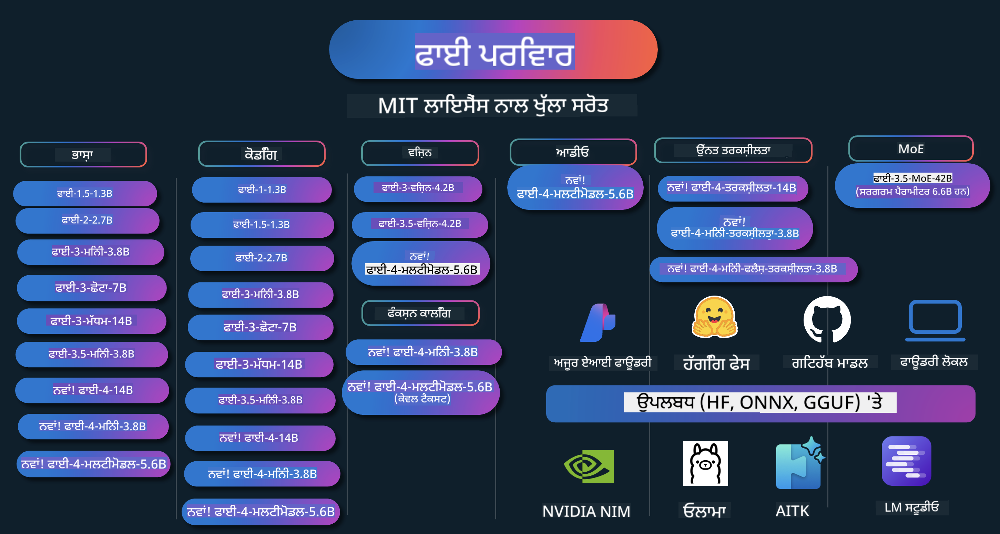

<!--
CO_OP_TRANSLATOR_METADATA:
{
  "original_hash": "ef3a50368712b1a7483d0def1f70c490",
  "translation_date": "2025-12-21T11:11:06+00:00",
  "source_file": "README.md",
  "language_code": "pa"
}
-->
# Phi Cookbook: Microsoft's Phi ਮਾਡਲਾਂ ਨਾਲ ਹੱਥ-ਅਨੁਭਵੀ ਉਦਾਹਰਨਾਂ

Phi Microsoft ਵਲੋਂ ਵਿਕਸਿਤ ਖੁੱਲ੍ਹਾ-ਸਰੋਤ ਏਆਈ ਮਾਡਲਾਂ ਦੀ ਇੱਕ ਸੀਰੀਜ਼ ਹੈ। 

ਫਿਲਹਾਲ Phi ਸਭ ਤੋਂ ਸਾਹਮਣੇ ਅਤੇ ਕਿਫਾਇਤੀ ਛੋਟਾ ਲੈਂਗਵੇਜ ਮਾਡਲ (SLM) ਹੈ, ਜਿਸਨੇ ਬਹੁ-ਭਾਸ਼ਾਈ, ਤਰਕਸ਼ੀਲਤਾ, ਲੇਖ/ਚੈਟ ਜਨਰੇਸ਼ਨ, ਕੋਡਿੰਗ, ਇਮੇਜ, ਆਡੀਓ ਅਤੇ ਹੋਰ ਪਰਿਸਥਿਤੀਆਂ ਵਿੱਚ ਬਹੁਤ ਚੰਗੇ ਬੈਂਚਮਾਰਕ ਦਰਸਾਏ ਹਨ। 

ਤੁਸੀਂ Phi ਨੂੰ ਕਲਾਊਡ ਜਾਂ ਐਜ ਡਿਵਾਈਸਾਂ 'ਤੇ ਤਾਇਨਾਤ ਕਰ ਸਕਦੇ ਹੋ, ਅਤੇ ਸੀਮਤ ਕੰਪਿਊਟਿੰਗ ਪਾਵਰ ਨਾਲ ਆਸਾਨੀ ਨਾਲ ਜਨੇਰੇਟਿਵ ਏਆਈ ਐਪਲੀਕੇਸ਼ਨਾਂ ਤਿਆਰ ਕਰ ਸਕਦੇ ਹੋ।

ਇਨ੍ਹਾਂ ਸਰੋਤਾਂ ਨੂੰ ਵਰਤਣਾ ਸ਼ੁਰੂ ਕਰਨ ਲਈ ਇਹ ਕਦਮ ਫੋਲੋ ਕਰੋ :
1. **ਰਿਪੋਜ਼ਿਟਰੀ ਨੂੰ ਫੌਰਕ ਕਰੋ**: Click 
2. **ਰਿਪੋਜ਼ਿਟਰੀ ਕਲੋਨ ਕਰੋ**:   `git clone https://github.com/microsoft/PhiCookBook.git`
3. [**Microsoft AI Discord Community ਵਿੱਚ ਸ਼ਾਮਿਲ ਹੋਵੋ ਅਤੇ ਮਾਹਿਰਾਂ ਅਤੇ ਹੋਰ ਡੈਵਲਪਰਾਂ ਨਾਲ ਮਿਲੋ**](https://discord.com/invite/ByRwuEEgH4?WT.mc_id=aiml-137032-kinfeylo)

### 🌐 ਬਹੁ-ਭਾਸ਼ੀਏ ਸਹਾਇਤਾ

#### GitHub ਐਕਸ਼ਨ ਰਾਹੀਂ ਸਮਰਥਿਤ (ਆਟੋਮੇਟਿਡ ਅਤੇ ਹਮੇਸ਼ਾਂ ਅੱਪ-ਟੂ-ਡੇਟ)

<!-- CO-OP TRANSLATOR LANGUAGES TABLE START -->
[ਅਰਬੀ](../ar/README.md) | [ਬੰਗਾਲੀ](../bn/README.md) | [ਬੁਲਗੇਰੀ](../bg/README.md) | [ਬਰਮੀ (ਮਿਆਨਮਾਰ)](../my/README.md) | [ਚੀਨੀ (ਸਰਲੀਕ੍ਰਿਤ)](../zh/README.md) | [ਚੀਨੀ (ਰਵਾਇਤੀ, ਹੋੰਗਕਾਂਗ)](../hk/README.md) | [ਚੀਨੀ (ਰਵਾਇਤੀ, ਮਕਾਉ)](../mo/README.md) | [ਚੀਨੀ (ਰਵਾਇਤੀ, ਤਾਈਵਾਨ)](../tw/README.md) | [ਕ੍ਰੋਏਸ਼ੀਆਈ](../hr/README.md) | [ਚੈਕ](../cs/README.md) | [ਡੈਨਿਸ਼](../da/README.md) | [ਡੱਚ](../nl/README.md) | [ਇਸਟੋਨੀਆਈ](../et/README.md) | [ਫਿਨਨਿਸ਼](../fi/README.md) | [ਫ੍ਰੈਂਚ](../fr/README.md) | [ਜਰਮਨ](../de/README.md) | [ਗ੍ਰੀਕ](../el/README.md) | [ਹਿਬਰੂ](../he/README.md) | [ਹਿੰਦੀ](../hi/README.md) | [ਹੰਗੇਰੀ](../hu/README.md) | [ਇੰਡੋਨੇਸ਼ੀਆਈ](../id/README.md) | [ਇਟਾਲੀਅਨ](../it/README.md) | [ਜਪਾਨੀ](../ja/README.md) | [ਕੰਨੜ](../kn/README.md) | [ਕੋਰੀਅਨ](../ko/README.md) | [ਲਿਥੁਆਨੀਅਨ](../lt/README.md) | [ਮਲੇ](../ms/README.md) | [ਮਲਿਆਲਮ](../ml/README.md) | [ਮਰਾਠੀ](../mr/README.md) | [ਨੇਪਾਲੀ](../ne/README.md) | [ਨਾਈਜੀਰੀਆਈ ਪਿਡਜਿਨ](../pcm/README.md) | [ਨਾਰਵੇਜੀਅਨ](../no/README.md) | [ਫ਼ਾਰਸੀ (ਪੇਰਸ਼ੀ)](../fa/README.md) | [ਪੋਲਿਸ਼](../pl/README.md) | [ਪੋਰਚੁਗੀਜ਼ (ਬ੍ਰਾਜ਼ੀਲ)](../br/README.md) | [ਪੋਰਚੁਗੀਜ਼ (ਪੋਰਚੁਗਲ)](../pt/README.md) | [ਪੰਜਾਬੀ (ਗੁਰਮੁਖੀ)](./README.md) | [ਰੋਮਾਨੀਅਨ](../ro/README.md) | [ਰੂਸੀ](../ru/README.md) | [ਸਰਬੀਆਈ (ਸਿਰਿਲਿਕ)](../sr/README.md) | [ਸਲੋਵਾਕ](../sk/README.md) | [ਸਲੋਵੇਨੀਆਈ](../sl/README.md) | [ਸਪੇਨੀ](../es/README.md) | [ਸਵਾਹਿਲੀ](../sw/README.md) | [ਸਵੀਡਿਸ਼](../sv/README.md) | [ਟਾਗਾਲੋਗ (ਫਿਲੀਪੀਨੋ)](../tl/README.md) | [ਤਮਿੱਲ](../ta/README.md) | [ਤੇਲੁਗੁ](../te/README.md) | [ਥਾਈ](../th/README.md) | [ਤੁਰਕੀ](../tr/README.md) | [ਯੂਕਰੇਨੀ](../uk/README.md) | [ਉਰਦੂ](../ur/README.md) | [ਵਾਇਤਨਾਮੀ](../vi/README.md)
<!-- CO-OP TRANSLATOR LANGUAGES TABLE END -->

## ਸਮੱਗਰੀ ਦੀ ਸੂਚੀ

- ਪ੍ਰਸਤਾਵਨਾ
  - [Phi ਪਰਿਵਾਰ ਵਿੱਚ ਤੁਹਾਡਾ ਸਵਾਗਤ ਹੈ](./md/01.Introduction/01/01.PhiFamily.md)
  - [ਆਪਣਾ ਵਾਤਾਵਰਣ ਸੈੱਟਅਪ ਕਰਨਾ](./md/01.Introduction/01/01.EnvironmentSetup.md)
  - [ਮੁੱਖ ਤਕਨੀਕਾਂ ਨੂੰ ਸਮਝਣਾ](./md/01.Introduction/01/01.Understandingtech.md)
  - [Phi ਮਾਡਲਾਂ ਲਈ ਏ.ਆਈ. ਸੁਰੱਖਿਆ](./md/01.Introduction/01/01.AISafety.md)
  - [Phi ਹਾਰਡਵੇਅਰ ਸਹਾਇਤਾ](./md/01.Introduction/01/01.Hardwaresupport.md)
  - [ਪਲੇਟਫਾਰਮਾਂ 'ਤੇ Phi ਮਾਡਲ ਅਤੇ ਉਪਲਬਧਤਾ](./md/01.Introduction/01/01.Edgeandcloud.md)
  - [Guidance-ai ਅਤੇ Phi ਦੀ ਵਰਤੋਂ](./md/01.Introduction/01/01.Guidance.md)
  - [GitHub ਮਾਰਕੀਟਪਲੇਸ ਮਾਡਲ](https://github.com/marketplace/models)
  - [Azure AI ਮਾਡਲ ਕੈਟਲਾਗ](https://ai.azure.com)

- ਵੱਖ-ਵੱਖ ਵਾਤਾਵਰਣਾਂ ਵਿੱਚ Phi ਦੀ ਇਨਫਰੈਂਸ
    -  [Hugging face](./md/01.Introduction/02/01.HF.md)
    -  [GitHub Models](./md/01.Introduction/02/02.GitHubModel.md)
    -  [Azure AI Foundry Model Catalog](./md/01.Introduction/02/03.AzureAIFoundry.md)
    -  [Ollama](./md/01.Introduction/02/04.Ollama.md)
    -  [AI Toolkit VSCode (AITK)](./md/01.Introduction/02/05.AITK.md)
    -  [NVIDIA NIM](./md/01.Introduction/02/06.NVIDIA.md)
    -  [Foundry Local](./md/01.Introduction/02/07.FoundryLocal.md)

- Phi ਪਰਿਵਾਰ ਵਿੱਚ ਇਨਫਰੈਂਸ
    - [iOS ਵਿੱਚ Phi ਇਨਫਰੈਂਸ](./md/01.Introduction/03/iOS_Inference.md)
    - [Android ਵਿੱਚ Phi ਇਨਫਰੈਂਸ](./md/01.Introduction/03/Android_Inference.md)
    - [Jetson ਵਿੱਚ Phi ਇਨਫਰੈਂਸ](./md/01.Introduction/03/Jetson_Inference.md)
    - [AI PC ਵਿੱਚ Phi ਇਨਫਰੈਂਸ](./md/01.Introduction/03/AIPC_Inference.md)
    - [Apple MLX ਫਰੇਮਵਰਕ ਨਾਲ Phi ਇਨਫਰੈਂਸ](./md/01.Introduction/03/MLX_Inference.md)
    - [ਲੋਕਲ ਸਰਵਰ ਵਿੱਚ Phi ਇਨਫਰੈਂਸ](./md/01.Introduction/03/Local_Server_Inference.md)
    - [AI Toolkit ਦੀ ਵਰਤੋਂ ਕਰਕੇ ਰਿਮੋਟ ਸਰਵਰ ਵਿੱਚ Phi ਇਨਫਰੈਂਸ](./md/01.Introduction/03/Remote_Interence.md)
    - [Rust ਨਾਲ Phi ਇਨਫਰੈਂਸ](./md/01.Introduction/03/Rust_Inference.md)
    - [ਲੋਕਲ ਵਿੱਚ Phi--Vision ਇਨਫਰੈਂਸ](./md/01.Introduction/03/Vision_Inference.md)
    - [Kaito AKS, Azure Containers (ਆਧिकारिक ਸਮਰਥਨ) ਨਾਲ Phi ਇਨਫਰੈਂਸ](./md/01.Introduction/03/Kaito_Inference.md)
-  [Phi ਪਰਿਵਾਰ ਦੀ ਮਾਪ](./md/01.Introduction/04/QuantifyingPhi.md)
    - [llama.cpp ਦੀ ਵਰਤੋਂ ਕਰਕੇ Phi-3.5 / 4 ਦੀ ਕੁਆਂਟੀਜ਼ਿੰਗ](./md/01.Introduction/04/UsingLlamacppQuantifyingPhi.md)
    - [onnxruntime ਲਈ Generative AI ਵਿਸਥਾਪਨ ਦੀ ਵਰਤੋਂ ਕਰਕੇ Phi-3.5 / 4 ਦੀ ਕੁਆਂਟੀਜ਼ਿੰਗ](./md/01.Introduction/04/UsingORTGenAIQuantifyingPhi.md)
    - [Intel OpenVINO ਦੀ ਵਰਤੋਂ ਕਰਕੇ Phi-3.5 / 4 ਦੀ ਕੁਆਂਟੀਜ਼ਿੰਗ](./md/01.Introduction/04/UsingIntelOpenVINOQuantifyingPhi.md)
    - [Apple MLX ਫਰੇਮਵਰਕ ਦੀ ਵਰਤੋਂ ਕਰਕੇ Phi-3.5 / 4 ਦੀ ਕੁਆਂਟੀਜ਼ਿੰਗ](./md/01.Introduction/04/UsingAppleMLXQuantifyingPhi.md)

-  Phi ਦਾ ਮੁਲਾਂਕਣ
    - [Response AI](./md/01.Introduction/05/ResponsibleAI.md)
    - [ਮੁਲਾਂਕਣ ਲਈ Azure AI Foundry](./md/01.Introduction/05/AIFoundry.md)
    - [ਮੁਲਾਂਕਣ ਲਈ Promptflow ਦੀ ਵਰਤੋਂ](./md/01.Introduction/05/Promptflow.md)
 
- RAG ਨਾਲ Azure AI Search
    - [Azure AI Search ਨਾਲ Phi-4-mini ਅਤੇ Phi-4-multimodal(RAG) ਨੂੰ ਕਿਵੇਂ ਵਰਤਣਾ](https://github.com/microsoft/PhiCookBook/blob/main/code/06.E2E/E2E_Phi-4-RAG-Azure-AI-Search.ipynb)

- Phi ਐਪਲੀਕੇਸ਼ਨ ਵਿਕਾਸ ਉਦਾਹਰਣਾਂ
  - ਟੈਕਸਟ ਅਤੇ ਚੈਟ ਐਪਲੀਕੇਸ਼ਨਾਂ
    - Phi-4 ਨਮੂਨੇ 🆕
      - [📓] [Phi-4-mini ONNX ਮਾਡਲ ਨਾਲ ਚੈਟ](./md/02.Application/01.TextAndChat/Phi4/ChatWithPhi4ONNX/README.md)
      - [Phi-4 ਲੋਕਲ ONNX ਮਾਡਲ ਨਾਲ ਚੈਟ .NET](../../md/04.HOL/dotnet/src/LabsPhi4-Chat-01OnnxRuntime)
      - [Sementic Kernel ਦੀ ਵਰਤੋਂ ਨਾਲ Phi-4 ONNX ਨਾਲ Chat .NET ਕਨਸੋਲ ਐਪ](../../md/04.HOL/dotnet/src/LabsPhi4-Chat-02SK)
    - Phi-3 / 3.5 ਉਦਾਹਰਣਾਂ
      - [Phi3, ONNX Runtime Web ਅਤੇ WebGPU ਦੀ ਵਰਤੋਂ ਕਰਕੇ ਬਰਾਊਜ਼ਰ ਵਿੱਚ ਲੋਕਲ ਚੈਟਬੋਟ](https://github.com/microsoft/onnxruntime-inference-examples/tree/main/js/chat)
      - [OpenVino ਚੈਟ](./md/02.Application/01.TextAndChat/Phi3/E2E_OpenVino_Chat.md)
      - [ਮਲਟੀ ਮਾਡਲ - ਇੰਟਰਐਕਟਿਵ Phi-3-mini ਅਤੇ OpenAI Whisper](./md/02.Application/01.TextAndChat/Phi3/E2E_Phi-3-mini_with_whisper.md)
      - [MLFlow - ਇੱਕ ਰੈਪਰ ਬਣਾਉਣਾ ਅਤੇ MLFlow ਨਾਲ Phi-3 ਦੀ ਵਰਤੋਂ](./md//02.Application/01.TextAndChat/Phi3/E2E_Phi-3-MLflow.md)
      - [ਮਾਡਲ ਅਪਟੀਮਾਈਜ਼ੇਸ਼ਨ - ONNX Runtime Web ਲਈ Phi-3-min ਮਾਡਲ ਨੂੰ Olive ਨਾਲ ਕਿਵੇਂ ਅਪਟੀਮਾਈਜ਼ ਕਰੋ](https://github.com/microsoft/Olive/tree/main/examples/phi3)
      - [WinUI3 ਐਪ Phi-3 mini-4k-instruct-onnx ਦੇ ਨਾਲ](https://github.com/microsoft/Phi3-Chat-WinUI3-Sample/)
      -[WinUI3 ਮਲਟੀ ਮਾਡਲ AI ਪਾਵਰਡ ਨੋਟਸ ਐਪ ਸੈਂਪਲ](https://github.com/microsoft/ai-powered-notes-winui3-sample)
      - [ਕਸਟਮ Phi-3 ਮਾਡਲਾਂ ਨੂੰ Prompt flow ਨਾਲ ਫਾਈਨ-ਟਿਊਨ ਅਤੇ ਇੰਟੀਗ੍ਰੇਟ ਕਰੋ](./md/02.Application/01.TextAndChat/Phi3/E2E_Phi-3-FineTuning_PromptFlow_Integration.md)
      - [Azure AI Foundry ਵਿੱਚ Prompt flow ਨਾਲ ਕਸਟਮ Phi-3 ਮਾਡਲਾਂ ਨੂੰ ਫਾਈਨ-ਟਿਊਨ ਅਤੇ ਇੰਟੀਗ੍ਰੇਟ ਕਰੋ](./md/02.Application/01.TextAndChat/Phi3/E2E_Phi-3-FineTuning_PromptFlow_Integration_AIFoundry.md)
      - [Microsoft ਦੇ ਜ਼ਿੰਮੇਵਾਰ AI ਸਿਧਾਂਤਾਂ 'ਤੇ ਧਿਆਨ ਦੇਂਦੇ ਹੋਏ Azure AI Foundry ਵਿੱਚ ਫਾਈਨ-ਟਿਊਨ ਕੀਤੇ Phi-3 / Phi-3.5 ਮਾਡਲ ਦਾ ਮੂਲਾਂਕਣ ਕਰੋ](./md/02.Application/01.TextAndChat/Phi3/E2E_Phi-3-Evaluation_AIFoundry.md)
      - [📓] [Phi-3.5-mini-instruct ਭਾਸ਼ਾ ਭਵਿਸ਼ਵਾਣੀ ਸੈਂਪਲ (Chinese/English)](./md/02.Application/01.TextAndChat/Phi3/phi3-instruct-demo.ipynb)
      - [Phi-3.5-Instruct WebGPU RAG ਚੈਟਬੋਟ](./md/02.Application/01.TextAndChat/Phi3/WebGPUWithPhi35Readme.md)
      - [Windows GPU ਦੀ ਵਰਤੋਂ ਕਰਕੇ Phi-3.5-Instruct ONNX ਨਾਲ Prompt flow ਹੱਲ ਬਣਾਉਣਾ](./md/02.Application/01.TextAndChat/Phi3/UsingPromptFlowWithONNX.md)
      - [Microsoft Phi-3.5 tflite ਦੀ ਵਰਤੋਂ ਕਰਕੇ Android ਐਪ ਬਣਾਉਣਾ](./md/02.Application/01.TextAndChat/Phi3/UsingPhi35TFLiteCreateAndroidApp.md)
      - [Q&A .NET ਉਦਾਹਰਣ - ਲੋਕਲ ONNX Phi-3 ਮਾਡਲ ਨੂੰ Microsoft.ML.OnnxRuntime ਦੀ ਵਰਤੋਂ ਨਾਲ](../../md/04.HOL/dotnet/src/LabsPhi301)
      - [Semantic Kernel ਅਤੇ Phi-3 ਨਾਲ ਕੰਸੋਲ ਚੈਟ .NET ਐਪ](../../md/04.HOL/dotnet/src/LabsPhi302)

  - Azure AI Inference SDK Code Based Samples 
    - Phi-4 Samples 🆕
      - [📓] [Phi-4-multimodal ਦੀ ਵਰਤੋਂ ਕਰਕੇ ਪ੍ਰੋਜੈਕਟ ਕੋਡ ਜਨਰੇਟ ਕਰੋ](./md/02.Application/02.Code/Phi4/GenProjectCode/README.md)
    - Phi-3 / 3.5 Samples
      - [ਆਪਣਾ Visual Studio Code GitHub Copilot Chat Microsoft Phi-3 ਫੈਮਲੀ ਨਾਲ ਬਣਾਓ](./md/02.Application/02.Code/Phi3/VSCodeExt/README.md)
      - [GitHub Models ਦੁਆਰਾ Phi-3.5 ਨਾਲ ਆਪਣਾ Visual Studio Code Chat Copilot Agent ਬਣਾਓ](/md/02.Application/02.Code/Phi3/CreateVSCodeChatAgentWithGitHubModels.md)

  - Advanced Reasoning Samples
    - Phi-4 Samples 🆕
      - [📓] [Phi-4-mini-reasoning ਜਾਂ Phi-4-reasoning ਸੈਂਪਲ](./md/02.Application/03.AdvancedReasoning/Phi4/AdvancedResoningPhi4mini/README.md)
      - [📓] [Microsoft Olive ਨਾਲ Phi-4-mini-reasoning ਨੂੰ ਫਾਈਨ-ਟਿਊਨ ਕਰਨਾ](./md/02.Application/03.AdvancedReasoning/Phi4/AdvancedResoningPhi4mini/olive_ft_phi_4_reasoning_with_medicaldata.ipynb)
      - [📓] [Apple MLX ਨਾਲ Phi-4-mini-reasoning ਨੂੰ ਫਾਈਨ-ਟਿਊਨ ਕਰਨਾ](./md/02.Application/03.AdvancedReasoning/Phi4/AdvancedResoningPhi4mini/mlx_ft_phi_4_reasoning_with_medicaldata.ipynb)
      - [📓] [GitHub Models ਨਾਲ Phi-4-mini-reasoning](./md/02.Application/02.Code/Phi4r/github_models_inference.ipynb)
      - [📓] [Azure AI Foundry Models ਨਾਲ Phi-4-mini-reasoning](./md/02.Application/02.Code/Phi4r/azure_models_inference.ipynb)
  - Demos
      - [Hugging Face Spaces 'ਤੇ ਹੋਸਟ ਕੀਤੇ Phi-4-mini ਡੈਮੋ](https://huggingface.co/spaces/microsoft/phi-4-mini?WT.mc_id=aiml-137032-kinfeylo)
      - [Hugging Face Spaces 'ਤੇ ਹੋਸਟ ਕੀਤੇ Phi-4-multimodal ਡੈਮੋ](https://huggingface.co/spaces/microsoft/phi-4-multimodal?WT.mc_id=aiml-137032-kinfeylo)
  - Vision Samples
    - Phi-4 Samples 🆕
      - [📓] [ਚਿੱਤਰ ਪੜ੍ਹਨ ਅਤੇ ਕੋਡ ਜਨਰੇਟ ਕਰਨ ਲਈ Phi-4-multimodal ਵਰਤੋ](./md/02.Application/04.Vision/Phi4/CreateFrontend/README.md) 
    - Phi-3 / 3.5 Samples
      -  [📓][Phi-3-vision-Image ਟੈਕਸਟ ਤੋਂ ਟੈਕਸਟ](./md/02.Application/04.Vision/Phi3/E2E_Phi-3-vision-image-text-to-text-online-endpoint.ipynb)
      - [Phi-3-vision-ONNX](https://onnxruntime.ai/docs/genai/tutorials/phi3-v.html)
      - [📓][Phi-3-vision CLIP ਐਮਬੈਡਿੰਗ](./md/02.Application/04.Vision/Phi3/E2E_Phi-3-vision-image-text-to-text-online-endpoint.ipynb)
      - [ਡੈਮੋ: Phi-3 ਰੀਸਾਇਕਲਿੰਗ](https://github.com/jennifermarsman/PhiRecycling/)
      - [Phi-3-vision - ਵਿਜ਼ੂਅਲ ਭਾਸ਼ਾ ਸਹਾਇਕ - Phi3-Vision ਅਤੇ OpenVINO ਨਾਲ](https://docs.openvino.ai/nightly/notebooks/phi-3-vision-with-output.html)
      - [Phi-3 Vision Nvidia NIM](./md/02.Application/04.Vision/Phi3/E2E_Nvidia_NIM_Vision.md)
      - [Phi-3 Vision OpenVino](./md/02.Application/04.Vision/Phi3/E2E_OpenVino_Phi3Vision.md)
      - [📓][Phi-3.5 Vision ਮਲਟੀ-ਫਰੇਮ ਜਾਂ ਮਲਟੀ-ਇਮੇਜ ਸੈਂਪਲ](./md/02.Application/04.Vision/Phi3/phi3-vision-demo.ipynb)
      - [Phi-3 Vision ਲੋਕਲ ONNX ਮਾਡਲ - Microsoft.ML.OnnxRuntime .NET ਦੀ ਵਰਤੋਂ ਨਾਲ](../../md/04.HOL/dotnet/src/LabsPhi303)
      - [ਮੇਨੂ ਅਧਾਰਿਤ Phi-3 Vision ਲੋਕਲ ONNX ਮਾਡਲ - Microsoft.ML.OnnxRuntime .NET ਦੀ ਵਰਤੋਂ ਨਾਲ](../../md/04.HOL/dotnet/src/LabsPhi304)

  - Math Samples
    -  Phi-4-Mini-Flash-Reasoning-Instruct ਸੈਂਪਲ 🆕 [Phi-4-Mini-Flash-Reasoning-Instruct ਨਾਲ Math Demo](./md/02.Application/09.Math/MathDemo.ipynb)

  - Audio Samples
    - Phi-4 Samples 🆕
      - [📓] [Phi-4-multimodal ਦੀ ਵਰਤੋਂ ਕਰਕੇ ਆਡੀਓ ਟ੍ਰਾਂਸਕ੍ਰਿਪਟ ਨਿਕਾਲਣਾ](./md/02.Application/05.Audio/Phi4/Transciption/README.md)
      - [📓] [Phi-4-multimodal ਆਡੀਓ ਸੈਂਪਲ](./md/02.Application/05.Audio/Phi4/Siri/demo.ipynb)
      - [📓] [Phi-4-multimodal ਸਪੀਚ ਟ੍ਰਾਂਸਲੇਸ਼ਨ ਸੈਂਪਲ](./md/02.Application/05.Audio/Phi4/Translate/demo.ipynb)
      - [.NET ਕੰਸੋਲ ਐਪਲੀਕੇਸ਼ਨ ਜੋ Phi-4-multimodal ਆਡੀਓ ਦੀ ਵਰਤੋਂ ਕਰਕੇ ਆਡੀਓ ਫਾਈਲ ਦਾ ਵਿਸ਼ਲੇਸ਼ਣ ਕਰਦੀ ਹੈ ਅਤੇ ਟ੍ਰਾਂਸਕ੍ਰਿਪਟ ਤਿਆਰ ਕਰਦੀ ਹੈ](../../md/04.HOL/dotnet/src/LabsPhi4-MultiModal-02Audio)

  - MOE Samples
    - Phi-3 / 3.5 Samples
      - [📓] [Phi-3.5 Mixture of Experts ਮਾਡਲ (MoEs) ਸੋਸ਼ਲ ਮੀਡੀਆ ਸੈਂਪਲ](./md/02.Application/06.MoE/Phi3/phi3_moe_demo.ipynb)
      - [📓] [NVIDIA NIM Phi-3 MOE, Azure AI Search, ਅਤੇ LlamaIndex ਨਾਲ Retrieval-Augmented Generation (RAG) ਪਾਈਪਲਾਈਨ ਬਣਾਉਣਾ](./md/02.Application/06.MoE/Phi3/azure-ai-search-nvidia-rag.ipynb)
      - 
  - Function Calling Samples
    - Phi-4 Samples 🆕
      -  [📓] [Phi-4-mini ਨਾਲ ਫੰਕਸ਼ਨ ਕਾਲਿੰਗ ਦੀ ਵਰਤੋਂ](./md/02.Application/07.FunctionCalling/Phi4/FunctionCallingBasic/README.md)
      -  [📓] [Phi-4-mini ਨਾਲ ਬਹੁ-ਏਜੰਟ ਬਣਾਉਣ ਲਈ ਫੰਕਸ਼ਨ ਕਾਲਿੰਗ ਦੀ ਵਰਤੋਂ](./md/02.Application/07.FunctionCalling/Phi4/Multiagents/Phi_4_mini_multiagent.ipynb)
      -  [📓] [Ollama ਨਾਲ ਫੰਕਸ਼ਨ ਕਾਲਿੰਗ ਦੀ ਵਰਤੋਂ](./md/02.Application/07.FunctionCalling/Phi4/Ollama/ollama_functioncalling.ipynb)
      -  [📓] [ONNX ਨਾਲ ਫੰਕਸ਼ਨ ਕਾਲਿੰਗ ਦੀ ਵਰਤੋਂ](../../md/02.Application/07.FunctionCalling/Phi4/ONNX/onnx_parallel_functioncalling_ipynb)
  - Multimodal Mixing Samples
    - Phi-4 Samples 🆕
      -  [📓] [ਇੱਕ ਟੈਕਨੋਲੋਜੀ ਪੱਤਰਕਾਰ ਵਜੋਂ Phi-4-multimodal ਦੀ ਵਰਤੋਂ](./md/02.Application/08.Multimodel/Phi4/TechJournalist/phi_4_mm_audio_text_publish_news.ipynb)
      - [.NET ਕੰਸੋਲ ਐਪਲੀਕੇਸ਼ਨ ਜੋ Phi-4-multimodal ਦੀ ਵਰਤੋਂ ਕਰਕੇ ਚਿੱਤਰਾਂ ਦਾ ਵਿਸ਼ਲੇਸ਼ਣ ਕਰਦੀ ਹੈ](../../md/04.HOL/dotnet/src/LabsPhi4-MultiModal-01Images)

- Phi ਫਾਈਨ-ਟਿਊਨਿੰਗ ਸੈਂਪਲ
  - [ਫਾਈਨ-ਟਿਊਨਿੰਗ ਸਕੈਨਰੀਓਜ਼](./md/03.FineTuning/FineTuning_Scenarios.md)
  - [ਫਾਈਨ-ਟਿਊਨਿੰਗ ਬਨਾਮ RAG](./md/03.FineTuning/FineTuning_vs_RAG.md)
  - [ਫਾਈਨ-ਟਿਊਨਿੰਗ: Phi-3 ਨੂੰ ਉਦਯੋਗ ਵਿਸ਼ੇਸ਼ਜ੍ਞ ਬਣਨ ਦਿਓ](./md/03.FineTuning/LetPhi3gotoIndustriy.md)
  - [AI Toolkit for VS Code ਨਾਲ Phi-3 ਨੂੰ ਫਾਈਨ-ਟਿਊਨ ਕਰੋ](./md/03.FineTuning/Finetuning_VSCodeaitoolkit.md)
  - [Azure Machine Learning Service ਨਾਲ Phi-3 ਨੂੰ ਫਾਈਨ-ਟਿਊਨ ਕਰੋ](./md/03.FineTuning/Introduce_AzureML.md)
  - [Lora ਨਾਲ Phi-3 ਨੂੰ ਫਾਈਨ-ਟਿਊਨ ਕਰੋ](./md/03.FineTuning/FineTuning_Lora.md)
  - [QLora ਨਾਲ Phi-3 ਨੂੰ ਫਾਈਨ-ਟਿਊਨ ਕਰੋ](./md/03.FineTuning/FineTuning_Qlora.md)
  - [Azure AI Foundry ਨਾਲ Phi-3 ਨੂੰ ਫਾਈਨ-ਟਿਊਨ ਕਰੋ](./md/03.FineTuning/FineTuning_AIFoundry.md)
  - [Azure ML CLI/SDK ਨਾਲ Phi-3 ਨੂੰ ਫਾਈਨ-ਟਿਊਨ ਕਰੋ](./md/03.FineTuning/FineTuning_MLSDK.md)
  - [Microsoft Olive ਨਾਲ ਫਾਈਨ-ਟਿਊਨਿੰਗ](./md/03.FineTuning/FineTuning_MicrosoftOlive.md)
  - [Microsoft Olive Hands-On Lab ਨਾਲ ਫਾਈਨ-ਟਿਊਨਿੰਗ](./md/03.FineTuning/olive-lab/readme.md)
  - [Weights and Bias ਨਾਲ Phi-3-vision ਦੀ ਫਾਈਨ-ਟਿਊਨਿੰਗ](./md/03.FineTuning/FineTuning_Phi-3-visionWandB.md)
  - [Apple MLX Framework ਨਾਲ Phi-3 ਨੂੰ ਫਾਈਨ-ਟਿਊਨ ਕਰੋ](./md/03.FineTuning/FineTuning_MLX.md)
  - [Phi-3-vision ਨੂੰ ਫਾਈਨ-ਟਿਊਨਿੰਗ (ਆਧਿਕਾਰਿਕ ਸਹਾਇਤਾ)](./md/03.FineTuning/FineTuning_Vision.md)
  - [Kaito AKS, Azure Containers ਨਾਲ Phi-3 ਦੀ ਫਾਈਨ-ਟਿਊਨਿੰਗ (ਆਧਿਕਾਰਿਕ ਸਹਾਇਤਾ)](./md/03.FineTuning/FineTuning_Kaito.md)
  - [Phi-3 ਅਤੇ 3.5 Vision ਦੀ ਫਾਈਨ-ਟਿਊਨਿੰਗ](https://github.com/2U1/Phi3-Vision-Finetune)

- Hands on Lab
  - [ਅਗਲੀ ਪੀੜ੍ਹੀ ਦੇ ਮਾਡਲਾਂ ਦੀ ਖੋਜ: LLMs, SLMs, ਲੋਕਲ ਡਿਵੈਲਪਮੈਂਟ ਅਤੇ ਹੋਰ](https://github.com/microsoft/aitour-exploring-cutting-edge-models)
  - [NLP ਖ਼ਾਬਸ਼ਕਤੀ ਖੋਲ੍ਹਣਾ: Microsoft Olive ਨਾਲ ਫਾਈਨ-ਟਿਊਨਿੰਗ](https://github.com/azure/Ignite_FineTuning_workshop)

- Academic Research Papers and Publications
  - [Textbooks Are All You Need II: phi-1.5 ਤਕਨੀਕੀ ਰਿਪੋਰਟ](https://arxiv.org/abs/2309.05463)
  - [Phi-3 ਤਕਨੀਕੀ ਰਿਪੋਰਟ: ਤੁਹਾਡੇ ਫ਼ੋਨ 'ਤੇ ਸਥਾਨਕ ਤੌਰ 'ਤੇ ਇੱਕ ਬਹੁਤ ਸਮਰੱਥ ਭਾਸ਼ਾ ਮਾਡਲ](https://arxiv.org/abs/2404.14219)
  - [Phi-4 ਤਕਨੀਕੀ ਰਿਪੋਰਟ](https://arxiv.org/abs/2412.08905)
  - [Phi-4-Mini ਤਕਨੀਕੀ ਰਿਪੋਰਟ: Mixture-of-LoRAs ਰਾਹੀਂ ਸੰਕੁਚਿਤ ਪਰ ਸ਼ਕਤੀਸ਼ਾਲੀ ਬਹੁ-ਮੋਡਲ ਭਾਸ਼ਾ ਮਾਡਲ](https://arxiv.org/abs/2503.01743)
  - [ਗੱਡੀ-ਅੰਦਰ ਫੰਕਸ਼ਨ-ਕਾਲਿੰਗ ਲਈ ਛੋਟੇ ਭਾਸ਼ਾ ਮਾਡਲਾਂ ਨੂੰ ਅਪਟੀਮਾਈਜ਼ ਕਰਣਾ](https://arxiv.org/abs/2501.02342)
  - [(WhyPHI) ਬਹੁ-ਚੋਣੀ ਪ੍ਰਸ਼ਨ-ਉੱਤਰ ਲਈ PHI-3 ਦੀ ਫਾਇਨ-ਟਿਊਨਿੰਗ: ਵਿਧੀ, ਨਤੀਜੇ, ਅਤੇ ਚੁਣੌਤੀਆਂ](https://arxiv.org/abs/2501.01588)
  - [Phi-4-reasoning ਤਕਨੀਕੀ ਰਿਪੋਰਟ](https://www.microsoft.com/en-us/research/wp-content/uploads/2025/04/phi_4_reasoning.pdf)
  - [Phi-4-mini-reasoning ਤਕਨੀਕੀ ਰਿਪੋਰਟ](https://huggingface.co/microsoft/Phi-4-mini-reasoning/blob/main/Phi-4-Mini-Reasoning.pdf)

## Phi ਮਾਡਲਾਂ ਦੀ ਵਰਤੋਂ

### Phi on Azure AI Foundry

ਤੁਸੀਂ ਸਿੱਖ ਸਕਦੇ ਹੋ ਕਿ Microsoft Phi ਦੀ ਵਰਤੋਂ ਕਿਵੇਂ ਕਰਨੀ ਹੈ ਅਤੇ ਆਪਣੇ ਵੱਖ-ਵੱਖ ਹਾਰਡਵੇਅਰ ਡਿਵਾਈਸਾਂ ਵਿੱਚ E2E ਸੌਲਿਊਸ਼ਨ ਕਿਵੇਂ ਬਣਾਣੇ ਹਨ। ਖੁਦ Phi ਦਾ ਅਨੁਭਵ ਕਰਨ ਲਈ, ਮਾਡਲਾਂ ਨਾਲ ਖੇਡਣਾ ਸ਼ੁਰੂ ਕਰੋ ਅਤੇ ਆਪਣੇ ਪ੍ਰੰਦਭਾਂ ਲਈ Phi ਨੂੰ ਕਸਟਮਾਈਜ਼ ਕਰੋ, ਵਰਤੋਂ ਕਰਦੇ ਹੋਏ [Azure AI Foundry Azure AI Model Catalog](https://aka.ms/phi3-azure-ai) । ਤੁਹਾਨੂੰ ਹੋਰ ਜਾਣਕਾਰੀ Getting Started with [Azure AI Foundry](/md/02.QuickStart/AzureAIFoundry_QuickStart.md) 'ਚ ਮਿਲੇਗੀ

**ਪਲੇਗ੍ਰਾਊਂਡ**
ਹਰੇਕ ਮਾਡਲ ਦੀ ਪਰੀਖਿਆ ਲਈ ਇੱਕ ਨਿਰਧਾਰਤ ਪਲੇਗ੍ਰਾਊਂਡ ਹੁੰਦੀ ਹੈ [Azure AI Playground](https://aka.ms/try-phi3).

### Phi on GitHub Models

ਤੁਸੀਂ ਸਿੱਖ ਸਕਦੇ ਹੋ ਕਿ Microsoft Phi ਦੀ ਵਰਤੋਂ ਕਿਵੇਂ ਕਰਨੀ ਹੈ ਅਤੇ ਆਪਣੇ ਵੱਖ-ਵੱਖ ਹਾਰਡਵੇਅਰ ਡਿਵਾਈਸਾਂ ਵਿੱਚ E2E ਸੌਲਿਊਸ਼ਨ ਕਿਵੇਂ ਬਣਾਣੇ ਹਨ। ਖੁਦ Phi ਦਾ ਅਨੁਭਵ ਕਰਨ ਲਈ, ਮਾਡਲ ਨਾਲ ਖੇਡਣਾ ਸ਼ੁਰੂ ਕਰੋ ਅਤੇ ਆਪਣੇ ਪ੍ਰਸੰਗਾਂ ਲਈ Phi ਨੂੰ ਕਸਟਮਾਈਜ਼ ਕਰੋ, ਵਰਤੋਂ ਕਰਦੇ ਹੋਏ [GitHub Model Catalog](https://github.com/marketplace/models?WT.mc_id=aiml-137032-kinfeylo) । ਤੁਹਾਨੂੰ ਹੋਰ ਜਾਣਕਾਰੀ Getting Started with [GitHub Model Catalog](/md/02.QuickStart/GitHubModel_QuickStart.md) 'ਚ ਮਿਲੇਗੀ

**ਪਲੇਗ੍ਰਾਊਂਡ**
ਹਰੇਕ ਮਾਡਲ ਲਈ ਇੱਕ ਨਿਰਧਾਰਤ [playground to test the model](/md/02.QuickStart/GitHubModel_QuickStart.md) ਹੈ।

### Phi on Hugging Face

ਤੁਸੀਂ ਮਾਡਲ ਨੂੰ [Hugging Face](https://huggingface.co/microsoft) 'ਤੇ ਵੀ ਲੱਭ ਸਕਦੇ ਹੋ

**ਪਲੇਗ੍ਰਾਊਂਡ**
 [Hugging Chat ਪਲੇਗ੍ਰਾਊਂਡ](https://huggingface.co/chat/models/microsoft/Phi-3-mini-4k-instruct)

 ## 🎒 ਹੋਰ ਕੋਰਸ

ਸਾਡੀ ਟੀਮ ਹੋਰ ਕੋਰਸ ਵੀ ਤਿਆਰ ਕਰਦੀ ਹੈ! ਵੇਖੋ:

<!-- CO-OP TRANSLATOR OTHER COURSES START -->
### LangChain

---

### Azure / Edge / MCP / Agents

---
 
### Generative AI Series

[-9333EA?style=for-the-badge&labelColor=E5E7EB&color=9333EA)](https://github.com/microsoft/Generative-AI-for-beginners-dotnet?WT.mc_id=academic-105485-koreyst)
[-C084FC?style=for-the-badge&labelColor=E5E7EB&color=C084FC)](https://github.com/microsoft/generative-ai-for-beginners-java?WT.mc_id=academic-105485-koreyst)
[-E879F9?style=for-the-badge&labelColor=E5E7EB&color=E879F9)](https://github.com/microsoft/generative-ai-with-javascript?WT.mc_id=academic-105485-koreyst)

---
 
### Core Learning

---
 
### Copilot Series

<!-- CO-OP TRANSLATOR OTHER COURSES END -->

## ਜ਼ਿੰਮੇਵਾਰ AI 

Microsoft ਆਪਣੇ ਗਾਹਕਾਂ ਨੂੰ ਸਾਡੇ AI ਉਤਪਾਦਾਂ ਨੂੰ ਜ਼ਿੰਮੇਵਾਰ ਢੰਗ ਨਾਲ ਵਰਤਣ ਵਿੱਚ ਮਦਦ ਕਰਨ, ਸਾਡੀਆਂ ਸਿੱਖਣੀਆਂ ਸਾਂਝਾ ਕਰਨ, ਅਤੇ Transparency Notes ਅਤੇ Impact Assessments ਵਰਗੇ ਟੂਲਾਂ ਰਾਹੀਂ ਭਰੋਸੇ-ਆਧਾਰਿਤ ਭਾਗੀਦਾਰੀਆਂ ਬਣਾਉਣ ਲਈ ਵਚਨਬੱਧ ਹੈ। ਇਨ੍ਹਾਂ ਵਿੱਚੋਂ ਬਹੁਤ ਸਾਰੇ ਸਰੋਤ [https://aka.ms/RAI](https://aka.ms/RAI) 'ਤੇ ਮਿਲ ਸਕਦੇ ਹਨ।
Microsoft ਦਾ ਜ਼ਿੰਮੇਵਾਰ AI ਲਈ ਦ੍ਰਿਸ਼ਟੀਕੋਣ ਸਾਡੇ AI ਸਿਧਾਂਤਾਂ 'ਤੇ ਆਧਾਰਿਤ ਹੈ: ਇਨਸਾਫ਼ (fairness), ਭਰੋਸੇਯੋਗਤਾ ਅਤੇ ਸੁਰੱਖਿਆ, ਨਿੱਜੀਤਾ ਅਤੇ ਸੁਰੱਖਿਆ, ਸ਼ਮੂਲੀਅਤ, ਪਾਰਦਰਸ਼ਤਾ, ਅਤੇ ਜਵਾਬਦੇਹੀ।

ਵੱਡੇ ਪੱਧਰ ਦੇ ਕੁਦਰਤੀ ਭਾਸ਼ਾ, ਚਿੱਤਰ, ਅਤੇ ਬੋਲ ਮਾਡਲ — ਜਿਵੇਂ ਕਿ ਇਸ ਨਮੂਨੇ ਵਿੱਚ ਵਰਤੇ ਗਏ — ਸੰਭਵ ਹੈ ਕਿ ਐਸੇ ਤਰੀਕੇ ਨਾਲ ਵਰਤੋਂ ਕਰਨ ਜੋ ਅਨਿਆਂਪੂਰਨ, ਅਭਰੋਸੇਯੋਗ, ਜਾਂ ਅਪਮਾਨਜਨਕ ਹੋ ਸਕਦੇ ਹਨ, ਜਿਸ ਨਾਲ ਨੁਕਸਾਨ ਹੋ ਸਕਦਾ ਹੈ। ਖਤਰੇ ਅਤੇ ਸੀਮਾਵਾਂ ਬਾਰੇ ਜਾਣਕਾਰੀ ਲਈ ਕਿਰਪਾ ਕਰਕੇ [Azure OpenAI ਸੇਵਾ ਟ੍ਰਾਂਸਪਰੈਂਸੀ ਨੋਟ](https://learn.microsoft.com/legal/cognitive-services/openai/transparency-note?tabs=text) ਨੂੰ ਦੇਖੋ।

ਇਨ੍ਹਾਂ ਖਤਰਿਆਂ ਨੂੰ ਘਟਾਉਣ ਲਈ ਸਿਫਾਰਸ਼ ਕੀਤੀ ਤਕਨੀਕ ਇਹ ਹੈ ਕਿ ਆਪਣੀ ਆਰਕੀਟੈਕਚਰ ਵਿੱਚ ਇਕ ਸੁਰੱਖਿਆ ਪ੍ਰਣਾਲੀ ਸ਼ਾਮਲ ਕਰੋ ਜੋ ਨੁਕਸਾਨਦਾਇਕ ਵਿਹਾਰ ਦਾ ਪਤਾ ਲਗਾ ਕੇ ਰੋਕ ਸਕੇ। [Azure AI Content Safety](https://learn.microsoft.com/azure/ai-services/content-safety/overview) ਇੱਕ ਸੁਤੰਤਰ ਸੁਰੱਖਿਆ ਪਰਤ ਮੁਹੱਈਆ ਕਰਦਾ/ਕਰਦੀ ਹੈ, ਜੋ ਐਪਲੀਕੇਸ਼ਨ ਅਤੇ ਸਰਵਿਸਜ਼ ਵਿੱਚ ਉਪਭੋਗਤਾ-ਜਨਰੇਟਡ ਅਤੇ AI-ਜਨਰੇਟਡ ਨੁਕਸਾਨਦਾਇਕ ਸਮੱਗਰੀ ਦੀ ਪਹਚਾਨ ਕਰ ਸਕਦਾ/ਸਕਦੀ ਹੈ। Azure AI Content Safety ਵਿੱਚ ਟੈਕਸਟ ਅਤੇ ਚਿੱਤਰ APIs ਸ਼ਾਮਲ ਹਨ ਜੋ ਤੁਹਾਨੂੰ ਨੁਕਸਾਨਦਾਇਕ ਸਮੱਗਰੀ ਦੀ ਪਛਾਣ ਕਰਨ ਦੀ ਆਗਿਆ ਦਿੰਦੇ ਹਨ। Azure AI Foundry ਦੇ ਅੰਦਰ, Content Safety ਸਰਵਿਸ ਤੁਹਾਨੂੰ ਵੱਖ-ਵੱਖ ਮੋਡਾਲਿਟੀਆਂ ਵਿੱਚ ਨੁਕਸਾਨਦਾਇਕ ਸਮੱਗਰੀ ਦਾ ਪਤਾ ਲਗਾਉਣ ਲਈ ਨਮੂਨਾ ਕੋਡ ਦੇਖਣ, ਖੋਜਣ ਅਤੇ ਪ੍ਰਯੋਗ ਕਰਨ ਦੀ ਆਗਿਆ ਦਿੰਦੀ ਹੈ। ਹੇਠਾਂ ਦਿੱਤੀ [quickstart documentation](https://learn.microsoft.com/azure/ai-services/content-safety/quickstart-text?tabs=visual-studio%2Clinux&pivots=programming-language-rest) ਤੁਹਾਨੂੰ ਸਰਵਿਸ ਲਈ ਬੇਨਤੀਆਂ ਕਰਨ ਵਿੱਚ ਮਦਦ ਕਰੇਗੀ।

ਇੱਕ ਹੋਰ ਪੱਖ ਜਿਸਨੂੰ ਧਿਆਨ ਵਿੱਚ ਰੱਖਣਾ ਜ਼ਰੂਰੀ ਹੈ ਉਹ ਹੈ ਸਮੱਗਰੀ ਦੇ ਸਮੁੱਚੇ ਐਪਲੀਕੇਸ਼ਨ ਦੀ ਕਾਰਕਰਦਗੀ। ਬਹੁ-ਮੋਡਲ ਅਤੇ ਬਹੁ-ਮਾਡਲ ਐਪਲੀਕੇਸ਼ਨਾਂ ਦੇ ਨਾਲ, ਅਸੀਂ ਕਾਰਕਰਦਗੀ ਦੇ ਰੂਪ ਵਿੱਚ ਇਹ ਮੰਨਦੇ ਹਾਂ ਕਿ ਸਿਸਟਮ ਤੁਹਾਡੇ ਅਤੇ ਤੁਹਾਡੇ ਉਪਭੋਗਤਿਆਂ ਦੀ ਉਮੀਦਾਂ ਮੁਤਾਬਕ ਕੰਮ ਕਰਦਾ ਹੈ, ਜਿਸ ਵਿੱਚ ਨੁਕਸਾਨਦਾਇਕ ਆਉਟਪੁਟ ਨਾ ਪੈਦਾ ਹੋਣ ਵੀ ਸ਼ਾਮਲ ਹੈ। ਆਪਣੇ ਸਮੁੱਚੇ ਐਪਲੀਕੇਸ਼ਨ ਦੀ ਕਾਰਕਰਦਗੀ ਦਾ ਅੰਕਾਂਕਣ ਕਰਨ ਲਈ [Performance and Quality and Risk and Safety evaluators](https://learn.microsoft.com/azure/ai-studio/concepts/evaluation-metrics-built-in) ਵਰਤਣਾ ਮਹੱਤਵਪੂਰਨ ਹੈ। ਤੁਹਾਡੇ ਕੋਲ [custom evaluators](https://learn.microsoft.com/azure/ai-studio/how-to/develop/evaluate-sdk#custom-evaluators) ਬਣਾਉਣ ਅਤੇ ਅੰਕਾਂਕਣ ਕਰਨ ਦੀ ਸਮਰੱਥਾ ਵੀ ਹੈ।

ਤੁਸੀਂ ਆਪਣੇ ਵਿਕਾਸ ਵਾਤਾਵਰਣ ਵਿੱਚ [Azure AI Evaluation SDK](https://microsoft.github.io/promptflow/index.html) ਦੀ ਵਰਤੋਂ ਕਰ ਕੇ ਆਪਣੇ AI ਐਪਲੀਕੇਸ਼ਨ ਦਾ ਮੁਲਾਂਕਣ ਕਰ ਸਕਦੇ ਹੋ। ਇੱਕ ਟੈਸਟ ਡੇਟਾਸੇਟ ਜਾਂ ਨਿਸ਼ਾਨ ਦਿੱਤਾ ਜਾਣ 'ਤੇ, ਤੁਹਾਡੇ ਜੈਨੇਰੇਟਿਵ AI ਐਪਲੀਕੇਸ਼ਨ ਦੀਆਂ ਉਤਪੱਤੀਆਂ ਨਿਰਧਾਰਿਤ ਮਾਪਦੰਡਾਂ ਨਾਲ ਬਿਲਟ-ਇਨ ਇਵੈਲੀੂਏਟਰਾਂ ਜਾਂ ਤੁਹਾਡੇ ਚੋਣ ਦੇ ਕਸਟਮ ਇਵੈਲੀੂਏਟਰਾਂ ਦੀ ਵਰਤੋਂ ਕਰ ਕੇ ਗਿਣਤੀ-ਅਧਾਰਤ ਤੌਰ 'ਤੇ ਮਾਪੀਆਂ ਜਾਂਦੀਆਂ ਹਨ। ਆਪਣੀ ਸਿਸਟਮ ਦਾ ਅੰਕਾਂਕਣ ਕਰਨ ਲਈ Azure AI Evaluation SDK ਨਾਲ ਸ਼ੁਰੂ ਕਰਨ ਲਈ ਤੁਸੀਂ [quickstart guide](https://learn.microsoft.com/azure/ai-studio/how-to/develop/flow-evaluate-sdk) ਨੂੰ ਫੋਲੋ ਕਰ ਸਕਦੇ ਹੋ। ਇੱਕ ਵਾਰ ਤੁਸੀਂ ਅੰਕਾਂਕਣ ਚੱਲਾਇਆ, ਤੁਸੀਂ [Azure AI Foundry ਵਿੱਚ ਨਤੀਜੇ ਵਿਜ਼ੂਅਲਾਈਜ਼]https://learn.microsoft.com/azure/ai-studio/how-to/evaluate-flow-results() ਕਰ ਸਕਦੇ ਹੋ।

## ਟ੍ਰੇਡਮਾਰਕ
ਇਸ ਪ੍ਰੋਜੈਕਟ ਵਿੱਚ ਪ੍ਰੋਜੈਕਟਾਂ, ਉਤਪਾਦਾਂ ਜਾਂ ਸੇਵਾਵਾਂ ਦੇ ਟ੍ਰੇਡਮਾਰਕ ਜਾਂ ਲੋਗੋ ਹੋ ਸਕਦੇ ਹਨ। Microsoft ਦੇ ਟ੍ਰੇਡਮਾਰਕ ਜਾਂ ਲੋਗੋ ਦੇ ਅਧਿਕ੍ਰਤ ਉਪਯੋਗ ਉਨ੍ਹਾਂ ਦੀਆਂ ਨੀਤੀਆਂ ਦੇ ਅਧੀਨ ਹੈ ਅਤੇ ਇਹ [ਮਾਈਕ੍ਰੋਸੌਫਟ ਦੇ ਟ੍ਰੇਡਮਾਰਕ ਅਤੇ ਬ੍ਰੈਂਡ ਦਿਸ਼ਾ-ਨਿਰਦੇਸ਼](https://www.microsoft.com/legal/intellectualproperty/trademarks/usage/general) ਦੀ ਪਾਲਣਾ ਕਰਨੀ ਲਾਜ਼ਮੀ ਹੈ।
Microsoft ਦੇ ਟ੍ਰੇਡਮਾਰਕ ਜਾਂ ਲੋਗੋ ਦਾ ਇਸ ਪ੍ਰੋਜੈਕਟ ਦੀ ਸੋਧ ਕੀਤੀ ਗਈ ਸੰਸਕਰਣਾਂ ਵਿੱਚ ਉਪਯੋਗ ਗਲਤਫਹਮੀ ਪੈਦਾ ਨਹੀਂ ਕਰਨਾ ਚਾਹੀਦਾ ਅਤੇ ਨਾ ਹੀ ਇਹ Microsoft ਦੀ ਪ੍ਰਾਯੋਜਕਤਾ ਦਰਸਾਉਂਦਾ ਹੋਣਾ ਚਾਹੀਦਾ। ਤੀਜੇ-ਪੱਖ ਦੇ ਟ੍ਰੇਡਮਾਰਕ ਜਾਂ ਲੋਗੋ ਦੇ ਕਿਸੇ ਵੀ ਉਪਯੋਗ ਉਨ੍ਹਾਂ ਤੀਜੇ-ਪੱਖ ਦੀਆਂ ਨੀਤੀਆਂ ਦੇ ਅਧੀਨ ਹੁੰਦੇ ਹਨ।

## ਮਦਦ ਪ੍ਰਾਪਤ ਕਰੋ

ਜੇ ਤੁਸੀਂ ਫਸ ਜਾਂਦੇ ਹੋ ਜਾਂ AI ਐਪ ਬਣਾਉਣ ਬਾਰੇ ਕੋਈ ਸਵਾਲ ਹੈ, ਤਾਂ ਜੁੜੋ:

ਜੇ ਤੁਹਾਡੇ ਕੋਲ ਉਤਪਾਦ ਬਾਰੇ ਫੀਡਬੈਕ ਹੈ ਜਾਂ ਬਣਾਉਂਦੇ ਸਮੇਂ ਕੋਈ ਤਰੁਟੀਆਂ ਆਉਂਦੀਆਂ ਹਨ, ਤਾਂ ਜਾਓ:

---

<!-- CO-OP TRANSLATOR DISCLAIMER START -->
ਅਸਵੀਕਾਰ:
ਇਹ ਦਸਤਾਵੇਜ਼ AI ਅਨੁਵਾਦ ਸੇਵਾ [Co-op Translator](https://github.com/Azure/co-op-translator) ਦੀ ਵਰਤੋਂ ਕਰਕੇ ਅਨੁਵਾਦ ਕੀਤਾ ਗਿਆ ਹੈ। ਜਦੋਂ ਕਿ ਅਸੀਂ ਸਹੀਤਾ ਲਈ ਯਤਨਸ਼ੀਲ ਹਾਂ, ਕਿਰਪਾ ਕਰਕੇ ਧਿਆਨ ਰੱਖੋ ਕਿ ਆਟੋਮੇਟਿਕ ਅਨੁਵਾਦਾਂ ਵਿੱਚ ਗਲਤੀਆਂ ਜਾਂ ਅਣਸਹੀਤੀਆਂ ਹੋ ਸਕਦੀਆਂ ਹਨ। ਮੂਲ ਭਾਸ਼ਾ ਵਿੱਚ ਮੌਜੂਦ ਦਸਤਾਵੇਜ਼ ਨੂੰ ਅਧਿਕਾਰਿਕ ਸਰੋਤ ਮੰਨਿਆ ਜਾਣਾ ਚਾਹੀਦਾ ਹੈ। ਮਹੱਤਵਪੂਰਨ ਜਾਣਕਾਰੀ ਲਈ, ਪੇਸ਼ੇਵਰ ਮਨੁੱਖੀ ਅਨੁਵਾਦ ਦੀ ਸਿਫਾਰਸ਼ ਕੀਤੀ ਜਾਂਦੀ ਹੈ। ਅਸੀਂ ਇਸ ਅਨੁਵਾਦ ਦੇ ਉਪਯੋਗ ਕਾਰਨ ਹੋਣ ਵਾਲੀਆਂ ਕਿਸੇ ਵੀ ਗਲਤਫਹਿਮੀਆਂ ਜਾਂ ਗਲਤ ਵਿਆਖਿਆਵਾਂ ਲਈ ਜ਼ਿੰਮੇਵਾਰ ਨਹੀਂ ਹਾਂ।
<!-- CO-OP TRANSLATOR DISCLAIMER END -->