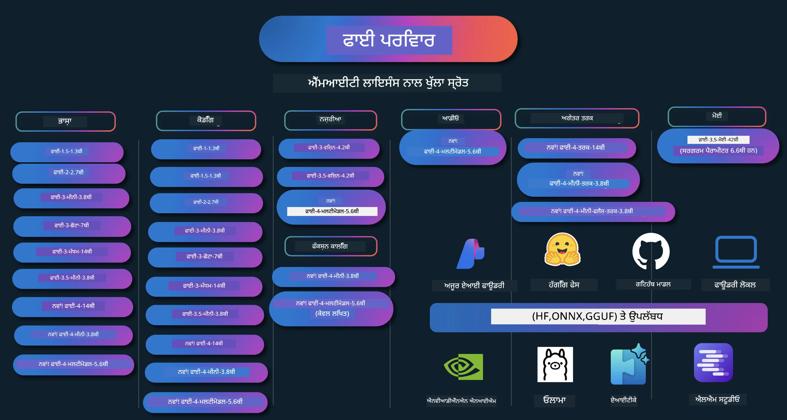

# Phi ਕੂਕਬੁੱਕ: ਮਾਈਕਰੋਸਾਫਟ ਦੇ Phi ਮਾਡਲਾਂ ਨਾਲ ਹੈਂਡਸ-ਆਨ ਉਦਾਹਰਨਾਂ

[](https://codespaces.new/microsoft/phicookbook)
[](https://vscode.dev/redirect?url=vscode://ms-vscode-remote.remote-containers/cloneInVolume?url=https://github.com/microsoft/phicookbook)

[](https://GitHub.com/microsoft/phicookbook/graphs/contributors/?WT.mc_id=aiml-137032-kinfeylo)
[](https://GitHub.com/microsoft/phicookbook/issues/?WT.mc_id=aiml-137032-kinfeylo)
[](https://GitHub.com/microsoft/phicookbook/pulls/?WT.mc_id=aiml-137032-kinfeylo)
[](http://makeapullrequest.com?WT.mc_id=aiml-137032-kinfeylo)

[](https://GitHub.com/microsoft/phicookbook/watchers/?WT.mc_id=aiml-137032-kinfeylo)
[](https://GitHub.com/microsoft/phicookbook/network/?WT.mc_id=aiml-137032-kinfeylo)
[](https://GitHub.com/microsoft/phicookbook/stargazers/?WT.mc_id=aiml-137032-kinfeylo)

[](https://discord.com/invite/ByRwuEEgH4)

Phi ਮਾਈਕਰੋਸਾਫਟ ਵਲੋਂ ਵਿਕਸਿਤ ਇੱਕ ਖੁਲ੍ਹਾ ਸਰੋਤ AI ਮਾਡਲਾਂ ਦੀ ਸਿਰੀਜ਼ ਹੈ।

Phi ਵਰਤਮਾਨ ਵਿੱਚ ਸਭ ਤੋਂ ਸ਼ਕਤੀਸ਼ালী ਅਤੇ ਲਾਗਤ-ਪ੍ਰਭਾਵਸ਼ালী ਛੋਟਾ ਭਾਸ਼ਾ ਮਾਡਲ (SLM) ਹੈ, ਜਿਸ ਨੇ ਬਹੁ-ਭਾਸ਼ਾਈ, ਤਰਕ, ਲਿਖਤ/ਚੈਟ ਪੈਦਾ ਕਰਨ, ਕੋਡਿੰਗ, ਚਿੱਤਰਾਂ, ਆਡੀਓ ਅਤੇ ਹੋਰ ਪ੍ਰਸੰਗਾਂ ਵਿੱਚ ਬਹੁਤ ਵਧੀਆ ਬੈਂਚਮਾਰਕ ਹਾਸਲ ਕੀਤੇ ਹਨ।

ਤੁਸੀਂ Phi ਨੂੰ ਕਲਾਉਡ ਜਾਂ ਐਜ ਡਿਵਾਈਸਾਂ 'ਤੇ ਡਿਪਲੋਇ ਕਰ ਸਕਦੇ ਹੋ, ਅਤੇ ਸੀਮਤ ਕੰਪਿਊਟਿੰਗ ਸ਼ਕਤੀ ਨਾਲ ਜਨਰੇਟਿਵ AI ਐਪਲੀਕੇਸ਼ਨਾਂ ਨੂੰ ਆਸਾਨੀ ਨਾਲ ਬਣਾਉ ਸਕਦੇ ਹੋ।

ਇਹਨਾਂ ਸਰੋਤਾਂ ਨੂੰ ਵਰਤਣ ਸ਼ੁਰੂ ਕਰਨ ਲਈ ਇਹ ਕਦਮ ਫੋਲੋ ਕਰੋ:
1. **ਰਿਪੋਜ਼ੀਟਰੀ ਨੂੰ ਫੋਰਕ ਕਰੋ**: Click ਕਰੋ [](https://GitHub.com/microsoft/phicookbook/network/?WT.mc_id=aiml-137032-kinfeylo)
2. **ਰਿਪੋਜ਼ੀਟਰੀ ਨੂੰ ਕਲੋਨ ਕਰੋ**: `git clone https://github.com/microsoft/PhiCookBook.git`
3. [**ਮਾਈਕਰੋਸਾਫਟ AI ਡਿਸਕੋਰਡ ਕਮਿਊਨਿਟੀ ਵਿੱਚ ਸ਼ਾਮਲ ਹੋਵੋ ਅਤੇ ਮਾਹਿਰਾਂ ਤੇ ਵਿਕਾਸਕਾਰਾਂ ਨਾਲ ਮਿਲੋ**](https://discord.com/invite/ByRwuEEgH4?WT.mc_id=aiml-137032-kinfeylo)



### 🌐 ਬਹੁ-ਭਾਸ਼ਾ ਸਹਾਇਤਾ

#### ਗਿੱਟਹੱਬ ਐਕਸ਼ਨ ਰਾਹੀਂ ਸਹਾਇਤਾ (ਆਟੋਮੈਟੇਡ ਅਤੇ ਹਮੇਸ਼ਾਂ ਅਪ-ਟੂ-ਡੇਟ)

<!-- CO-OP TRANSLATOR LANGUAGES TABLE START -->
[Arabic](../ar/README.md) | [Bengali](../bn/README.md) | [Bulgarian](../bg/README.md) | [Burmese (Myanmar)](../my/README.md) | [Chinese (Simplified)](../zh-CN/README.md) | [Chinese (Traditional, Hong Kong)](../zh-HK/README.md) | [Chinese (Traditional, Macau)](../zh-MO/README.md) | [Chinese (Traditional, Taiwan)](../zh-TW/README.md) | [Croatian](../hr/README.md) | [Czech](../cs/README.md) | [Danish](../da/README.md) | [Dutch](../nl/README.md) | [Estonian](../et/README.md) | [Finnish](../fi/README.md) | [French](../fr/README.md) | [German](../de/README.md) | [Greek](../el/README.md) | [Hebrew](../he/README.md) | [Hindi](../hi/README.md) | [Hungarian](../hu/README.md) | [Indonesian](../id/README.md) | [Italian](../it/README.md) | [Japanese](../ja/README.md) | [Kannada](../kn/README.md) | [Korean](../ko/README.md) | [Lithuanian](../lt/README.md) | [Malay](../ms/README.md) | [Malayalam](../ml/README.md) | [Marathi](../mr/README.md) | [Nepali](../ne/README.md) | [Nigerian Pidgin](../pcm/README.md) | [Norwegian](../no/README.md) | [Persian (Farsi)](../fa/README.md) | [Polish](../pl/README.md) | [Portuguese (Brazil)](../pt-BR/README.md) | [Portuguese (Portugal)](../pt-PT/README.md) | [Punjabi (Gurmukhi)](./README.md) | [Romanian](../ro/README.md) | [Russian](../ru/README.md) | [Serbian (Cyrillic)](../sr/README.md) | [Slovak](../sk/README.md) | [Slovenian](../sl/README.md) | [Spanish](../es/README.md) | [Swahili](../sw/README.md) | [Swedish](../sv/README.md) | [Tagalog (Filipino)](../tl/README.md) | [Tamil](../ta/README.md) | [Telugu](../te/README.md) | [Thai](../th/README.md) | [Turkish](../tr/README.md) | [Ukrainian](../uk/README.md) | [Urdu](../ur/README.md) | [Vietnamese](../vi/README.md)

> **ਥਾਂ-ਥਾਂ ਕਲੋਨ ਕਰਨਾ ਚਾਹੁੰਦੇ ਹੋ?**
>
> ਇਹ ਰਿਪੋਜ਼ੀਟਰੀ 50+ ਭਾਸ਼ਾ ਅਨੁਵਾਦ ਸ਼ਾਮਲ ਕਰਦਾ ਹੈ ਜੋ ਡਾਊਨਲੋਡ ਆਕਾਰ ਨੂੰ ਕਾਫ਼ੀ ਵਧਾ ਦਿੰਦਾ ਹੈ। ਬਿਨਾਂ ਅਨੁਵਾਦਾਂ ਦੇ ਕਲੋਨ ਕਰਨ ਲਈ, sparse checkout ਵਰਤੋਂ:
>
> **Bash / macOS / Linux:**
> ```bash
> git clone --filter=blob:none --sparse https://github.com/microsoft/PhiCookBook.git
> cd PhiCookBook
> git sparse-checkout set --no-cone '/*' '!translations' '!translated_images'
> ```
>
> **CMD (Windows):**
> ```cmd
> git clone --filter=blob:none --sparse https://github.com/microsoft/PhiCookBook.git
> cd PhiCookBook
> git sparse-checkout set --no-cone "/*" "!translations" "!translated_images"
> ```
>
> ਇਸ ਨਾਲ ਤੁਹਾਨੂੰ ਕੋਰਸ ਪੂਰਾ ਕਰਨ ਲਈ ਸਭ ਕੁਝ ਮਿਲ ਜਾਵੇਗਾ ਤੇ ਡਾਊਨਲੋਡ ਵੀ ਤੇਜ਼ ਹੋਵੇਗਾ।
<!-- CO-OP TRANSLATOR LANGUAGES TABLE END -->

## ਸਮੱਗਰੀ ਦੀ ਸੂਚੀ

- ਪਰਿਚਯ
  - [Phi ਪਰਿਵਾਰ ਵਿੱਚ ਸੁਆਗਤ ਹੈ](./md/01.Introduction/01/01.PhiFamily.md)
  - [ਆਪਣਾ ਵਾਤਾਵਰਣ ਸੈਟ ਕਰਨਾ](./md/01.Introduction/01/01.EnvironmentSetup.md)
  - [ਮੁੱਖ ਤਕਨਾਲੋਜੀਆਂ ਦੀ ਸਮਝ](./md/01.Introduction/01/01.Understandingtech.md)
  - [Phi ਮਾਡਲਾਂ ਲਈ AI ਸੁਰੱਖਿਆ](./md/01.Introduction/01/01.AISafety.md)
  - [Phi ਹਾਰਡਵੇਅਰ ਸਹਾਇਤਾ](./md/01.Introduction/01/01.Hardwaresupport.md)
  - [Phi ਮਾਡਲਾਂ ਅਤੇ ਪਲੇਟਫਾਰਮਾਂ 'ਤੇ ਉਪਲਬਧਤਾ](./md/01.Introduction/01/01.Edgeandcloud.md)
  - [Guidance-ai ਅਤੇ Phi ਦੀ ਵਰਤੋਂ](./md/01.Introduction/01/01.Guidance.md)
  - [GitHub ਮਾਰਕੀਟਪਲੇਸ ਮਾਡਲ](https://github.com/marketplace/models)
  - [Azure AI ਮਾਡਲ ਕੈਟਾਲਾਗ](https://ai.azure.com)

- ਵੱਖ-ਵੱਖ ਵਾਤਾਵਰਣ ਵਿੱਚ Phi ਇੰਫਰੰਸ
    -  [Hugging face](./md/01.Introduction/02/01.HF.md)
    -  [GitHub ਮਾਡਲ](./md/01.Introduction/02/02.GitHubModel.md)
    -  [Microsoft Foundry ਮਾਡਲ ਕੈਟਾਲਾਗ](./md/01.Introduction/02/03.AzureAIFoundry.md)
    -  [Ollama](./md/01.Introduction/02/04.Ollama.md)
    -  [AI ਟੂਲਕਿਟ VSCode (AITK)](./md/01.Introduction/02/05.AITK.md)
    -  [NVIDIA NIM](./md/01.Introduction/02/06.NVIDIA.md)
    -  [Foundry Local](./md/01.Introduction/02/07.FoundryLocal.md)

- Phi ਪਰਿਵਾਰ ਦਾ ਇੰਫਰੰਸ
    - [iOS ਵਿੱਚ Phi ਦਾ ਇੰਫਰੰਸ](./md/01.Introduction/03/iOS_Inference.md)
    - [Android ਵਿੱਚ Phi ਦਾ ਇੰਫਰੰਸ](./md/01.Introduction/03/Android_Inference.md)
    - [Jetson ਵਿੱਚ Phi ਦਾ ਇੰਫਰੰਸ](./md/01.Introduction/03/Jetson_Inference.md)
    - [AI PC ਵਿੱਚ Phi ਦਾ ਇੰਫਰੰਸ](./md/01.Introduction/03/AIPC_Inference.md)
    - [Apple MLX ਫਰੇਮਵਰਕ ਨਾਲ Phi ਦਾ ਇੰਫਰੰਸ](./md/01.Introduction/03/MLX_Inference.md)
    - [ਲੋਕਲ ਸਰਵਰ ਵਿੱਚ Phi ਦਾ ਇੰਫਰੰਸ](./md/01.Introduction/03/Local_Server_Inference.md)
    - [AI ਟੂਲਕਿਟ ਦੀ ਵਰਤੋਂ ਨਾਲ ਰਿਮੋਟ ਸਰਵਰ ਵਿੱਚ Phi ਦਾ ਇੰਫਰੰਸ](./md/01.Introduction/03/Remote_Interence.md)
    - [Rust ਨਾਲ Phi ਦਾ ਇੰਫਰੰਸ](./md/01.Introduction/03/Rust_Inference.md)
    - [ਲੋਕਲ ਵਿੱਚ Phi--Vision ਦਾ ਇੰਫਰੰਸ](./md/01.Introduction/03/Vision_Inference.md)
    - [Kaito AKS, Azure Containers (ਅਧਿਕਾਰਿਕ ਸਹਾਇਤਾ) ਨਾਲ Phi ਦਾ ਇੰਫਰੰਸ](./md/01.Introduction/03/Kaito_Inference.md)
-  [Phi ਪਰਿਵਾਰ ਦੀ ਪਰਿਮਾਣਤਾ](./md/01.Introduction/04/QuantifyingPhi.md)
    - [llama.cpp ਦੇ ਨਾਲ Phi-3.5 / 4 ਦਾ ਕੁਆੰਟੀਫਾਈ ਕਰਨਾ](./md/01.Introduction/04/UsingLlamacppQuantifyingPhi.md)
    - [onnxruntime ਲਈ ਜਨਰੇਟਿਵ AI ਐਕਸਟੈਂਸ਼ਨਾਂ ਨਾਲ Phi-3.5 / 4 ਦਾ ਕੁਆੰਟੀਫਾਈ ਕਰਨਾ](./md/01.Introduction/04/UsingORTGenAIQuantifyingPhi.md)
    - [Intel OpenVINO ਨਾਲ Phi-3.5 / 4 ਦਾ ਕੁਆੰਟੀਫਾਈ ਕਰਨਾ](./md/01.Introduction/04/UsingIntelOpenVINOQuantifyingPhi.md)
    - [Apple MLX ਫਰੇਮਵਰਕ ਨਾਲ Phi-3.5 / 4 ਦਾ ਕੁਆੰਟੀਫਾਈ ਕਰਨਾ](./md/01.Introduction/04/UsingAppleMLXQuantifyingPhi.md)

-  Phi ਦਾ ਮੁਲਾਂਕਣ
    - [ਜਵਾਬਦੇਹ AI](./md/01.Introduction/05/ResponsibleAI.md)
    - [ਮੁਲਾਂਕਣ ਲਈ Microsoft Foundry](./md/01.Introduction/05/AIFoundry.md)
    - [ਮੁਲਾਂਕਣ ਲਈ Promptflow ਦੀ ਵਰਤੋਂ](./md/01.Introduction/05/Promptflow.md)
 
- Azure AI Search ਨਾਲ RAG
    - [Phi-4-mini ਅਤੇ Phi-4-multimodal (RAG) ਨੂੰ Azure AI Search ਨਾਲ ਕਿਵੇਂ ਵਰਤਣਾ](https://github.com/microsoft/PhiCookBook/blob/main/code/06.E2E/E2E_Phi-4-RAG-Azure-AI-Search.ipynb)

- Phi ਐਪਲੀਕੇਸ਼ਨ ਵਿਕਾਸ ਉਦਾਹਰਨਾਂ
  - ਲਿਖਤ ਅਤੇ ਚੈਟ ਐਪਲੀਕੇਸ਼ਨ
    - Phi-4 ਨਮੂਨੇ 🆕
      - [📓] [Phi-4-mini ONNX ਮਾਡਲ ਨਾਲ ਚੈਟ](./md/02.Application/01.TextAndChat/Phi4/ChatWithPhi4ONNX/README.md)
      - [Phi-4 ਲੋਕਲ ONNX ਮਾਡਲ ਨਾਲ ਚੈਟ .NET](../../md/04.HOL/dotnet/src/LabsPhi4-Chat-01OnnxRuntime)
      - [ਸੇਮੈਂਟਿਕ ਕਰਨਲ ਦੀ ਵਰਤੋਂ ਨਾਲ Phi-4 ONNX ਨਾਲ .NET ਕੰਜੋਲ ਐਪ ਵਿੱਚ ਚੈਟ](../../md/04.HOL/dotnet/src/LabsPhi4-Chat-02SK)
    - Phi-3 / 3.5 ਨਮੂਨੇ
      - [Phi3, ONNX ਰਨਟਾਈਮ ਵੈੱਬ ਅਤੇ WebGPU ਦੀ ਵਰਤੋਂ ਕਰਕੇ ਬ੍ਰਾਊਜ਼ਰ ਵਿੱਚ ਲੋਕਲ ਚੈਟਬੋਟ](https://github.com/microsoft/onnxruntime-inference-examples/tree/main/js/chat)
      - [OpenVino Chat](./md/02.Application/01.TextAndChat/Phi3/E2E_OpenVino_Chat.md)
      - [ਮਲਟੀ ਮਾਡਲ - ਇੰਟਰਐਕਟਿਵ Phi-3-mini ਅਤੇ OpenAI Whisper](./md/02.Application/01.TextAndChat/Phi3/E2E_Phi-3-mini_with_whisper.md)
      - [MLFlow - wrapper ਬਣਾਉਣਾ ਅਤੇ Phi-3 ਨੂੰ MLFlow ਨਾਲ ਵਰਤਣਾ](./md//02.Application/01.TextAndChat/Phi3/E2E_Phi-3-MLflow.md)
      - [ਮਾਡਲ ਆਪਟੀਮਾਈਜੇਸ਼ਨ - ONNX Runtime Web ਲਈ Phi-3-min ਮਾਡਲ ਨੂੰ Olive ਨਾਲ ਕਿਵੇਂ ਆਪਟੀਮਾਈਜ਼ ਕਰਨਾ ਹੈ](https://github.com/microsoft/Olive/tree/main/examples/phi3)
      - [WinUI3 ਐਪ ਨਾਲ Phi-3 ਮਿਨੀ-4k-instruct-onnx](https://github.com/microsoft/Phi3-Chat-WinUI3-Sample/)
      -[WinUI3 ਮਲਟੀ ਮਾਡਲ AI Powered ਨੋਟਸ ਐਪ ਸੈਂਪਲ](https://github.com/microsoft/ai-powered-notes-winui3-sample)
      - [Custom Phi-3 ਮਾਡਲਾਂ ਨੂੰ Fine-tune ਅਤੇ Prompt flow ਨਾਲ ਇੰਟਿਗ੍ਰੇਟ ਕਰੋ](./md/02.Application/01.TextAndChat/Phi3/E2E_Phi-3-FineTuning_PromptFlow_Integration.md)
      - [Microsoft Foundry ਵਿੱਚ Prompt flow ਨਾਲ Custom Phi-3 ਮਾਡਲਾਂ ਨੂੰ Fine-tune ਅਤੇ ਇੰਟਿਗ੍ਰੇਟ ਕਰੋ](./md/02.Application/01.TextAndChat/Phi3/E2E_Phi-3-FineTuning_PromptFlow_Integration_AIFoundry.md)
      - [Microsoft ਦੀ Responsibility AI ਨੀਤੀਆਂ 'ਤੇ ਧਿਆਨ ਕੇਂਦਰਿਤ ਕਰਦੇ ਹੋਏ Microsoft Foundry ਵਿਚ Fine-tuned Phi-3 / Phi-3.5 ਮਾਡਲ ਦਾ ਮੁਲਾਂਕਣ](./md/02.Application/01.TextAndChat/Phi3/E2E_Phi-3-Evaluation_AIFoundry.md)
      - [📓] [Phi-3.5-mini-instruct ਭਾਸ਼ਾ ਅਨੁਮਾਨ ਸੈਂਪਲ (ਚੀਨੀ/ਅੰਗਰੇਜ਼ੀ)](./md/02.Application/01.TextAndChat/Phi3/phi3-instruct-demo.ipynb)
      - [Phi-3.5-Instruct WebGPU RAG Chatbot](./md/02.Application/01.TextAndChat/Phi3/WebGPUWithPhi35Readme.md)
      - [Windows GPU ਵਰਤ ਕੇ Phi-3.5-Instruct ONNX ਨਾਲ Prompt flow ਹੱਲ ਬਣਾਉਣ](./md/02.Application/01.TextAndChat/Phi3/UsingPromptFlowWithONNX.md)
      - [Microsoft Phi-3.5 tflite ਦੀ ਵਰਤੋਂ ਕਰਕੇ Android ਐਪ ਬਣਾਉਣਾ](./md/02.Application/01.TextAndChat/Phi3/UsingPhi35TFLiteCreateAndroidApp.md)
      - [ਸਥਾਨਕ ONNX Phi-3 ਮਾਡਲ ਵਰਤ ਕੇ Q&A .NET ਉਦਾਹਰਣ Microsoft.ML.OnnxRuntime ਦੀ ਵਰਤੋਂ ਨਾਲ](../../md/04.HOL/dotnet/src/LabsPhi301)
      - [Semantic Kernel ਅਤੇ Phi-3 ਨਾਲ Console chat .NET ਐਪ](../../md/04.HOL/dotnet/src/LabsPhi302)

  - Azure AI Inference SDK ਕੋਡ ਅਧਾਰਿਤ ਸੈਂਪਲ 
    - Phi-4 ਸੈਂਪਲ 🆕
      - [📓] [Phi-4-multimodal ਵਰਤ ਕੇ ਪ੍ਰੋਜੈਕਟ ਕੋਡ ਬਣਾਓ](./md/02.Application/02.Code/Phi4/GenProjectCode/README.md)
    - Phi-3 / 3.5 ਸੈਂਪਲ
      - [Microsoft Phi-3 ਪਰਿਵਾਰ ਨਾਲ ਆਪਣਾ Visual Studio Code GitHub Copilot Chat ਬਣਾਓ](./md/02.Application/02.Code/Phi3/VSCodeExt/README.md)
      - [GitHub ਮਾਡਲਾਂ ਨਾਲ Phi-3.5 ਦੇ ਨਾਲ ਆਪਣਾ Visual Studio Code Chat Copilot Agent ਬਣਾਓ](/md/02.Application/02.Code/Phi3/CreateVSCodeChatAgentWithGitHubModels.md)

  - ਅਡਵਾਂਸਡ ਰੀਜ਼ਨਿੰਗ ਸੈਂਪਲ
    - Phi-4 ਸੈਂਪਲ 🆕
      - [📓] [Phi-4-mini-reasoning ਜਾਂ Phi-4-reasoning ਸੈਂਪਲ](./md/02.Application/03.AdvancedReasoning/Phi4/AdvancedResoningPhi4mini/README.md)
      - [📓] [Microsoft Olive ਨਾਲ Phi-4-mini-reasoning ਦਾ Fine-tuning](./md/02.Application/03.AdvancedReasoning/Phi4/AdvancedResoningPhi4mini/olive_ft_phi_4_reasoning_with_medicaldata.ipynb)
      - [📓] [Apple MLX ਨਾਲ Phi-4-mini-reasoning ਦਾ Fine-tuning](./md/02.Application/03.AdvancedReasoning/Phi4/AdvancedResoningPhi4mini/mlx_ft_phi_4_reasoning_with_medicaldata.ipynb)
      - [📓] [GitHub ਮਾਡਲਾਂ ਨਾਲ Phi-4-mini-reasoning](./md/02.Application/02.Code/Phi4r/github_models_inference.ipynb)
      - [📓] [Microsoft Foundry ਮਾਡਲਾਂ ਨਾਲ Phi-4-mini-reasoning](./md/02.Application/02.Code/Phi4r/azure_models_inference.ipynb)
  - ਡੈਮੋ
      - [Phi-4-mini ਡੈਮੋ Hugging Face Spaces 'ਤੇ ਹੋਸਟ ਕੀਤੇ ਗਏ](https://huggingface.co/spaces/microsoft/phi-4-mini?WT.mc_id=aiml-137032-kinfeylo)
      - [Phi-4-multimodal ਡੈਮੋ Hugginge Face Spaces 'ਤੇ ਹੋਸਟ ਕੀਤੇ ਗਏ](https://huggingface.co/spaces/microsoft/phi-4-multimodal?WT.mc_id=aiml-137032-kinfeylo)
  - ਵਿਜ਼ਨ ਸੈਂਪਲ
    - Phi-4 ਸੈਂਪਲ 🆕
      - [📓] [Phi-4-multimodal ਨਾਲ ਚਿੱਤਰ ਪੜ੍ਹੋ ਅਤੇ ਕੋਡ ਬਣਾਓ](./md/02.Application/04.Vision/Phi4/CreateFrontend/README.md) 
    - Phi-3 / 3.5 ਸੈਂਪਲ
      -  [📓][Phi-3-vision-ਚਿੱਤਰ ਟੈਕਸਟ ਤੋਂ ਟੈਕਸਟ](./md/02.Application/04.Vision/Phi3/E2E_Phi-3-vision-image-text-to-text-online-endpoint.ipynb)
      - [Phi-3-vision-ONNX](https://onnxruntime.ai/docs/genai/tutorials/phi3-v.html)
      - [📓][Phi-3-vision CLIP ਐਂਬੈਡਿੰਗ](./md/02.Application/04.Vision/Phi3/E2E_Phi-3-vision-image-text-to-text-online-endpoint.ipynb)
      - [ਡੈਮੋ: Phi-3 ਰੀਸਾਈਕਲਿੰਗ](https://github.com/jennifermarsman/PhiRecycling/)
      - [Phi-3-vision - ਵਿਜ਼ੂਅਲ ਭਾਸ਼ਾ ਸਹਾਇਕ - Phi3-Vision ਅਤੇ OpenVINO ਨਾਲ](https://docs.openvino.ai/nightly/notebooks/phi-3-vision-with-output.html)
      - [Phi-3 Vision Nvidia NIM](./md/02.Application/04.Vision/Phi3/E2E_Nvidia_NIM_Vision.md)
      - [Phi-3 Vision OpenVino](./md/02.Application/04.Vision/Phi3/E2E_OpenVino_Phi3Vision.md)
      - [📓][Phi-3.5 Vision ਮਲਟੀ-ਫਰੇਮ ਜਾਂ ਮਲਟੀ-ਇਮੇਜ ਸੈਂਪਲ](./md/02.Application/04.Vision/Phi3/phi3-vision-demo.ipynb)
      - [Microsoft.ML.OnnxRuntime .NET ਵਰਤ ਕੇ Phi-3 Vision ਸਥਾਨਕ ONNX ਮਾਡਲ](../../md/04.HOL/dotnet/src/LabsPhi303)
      - [Microsoft.ML.OnnxRuntime .NET ਵਰਤ ਕੇ ਮੀਨੂ ਅਧਾਰਿਤ Phi-3 Vision ਸਥਾਨਕ ONNX ਮਾਡਲ](../../md/04.HOL/dotnet/src/LabsPhi304)

  - ਮੈਥ ਸੈਂਪਲ
    -  Phi-4-Mini-Flash-Reasoning-Instruct ਸੈਂਪਲ 🆕 [Phi-4-Mini-Flash-Reasoning-Instruct ਨਾਲ ਮੈਥ ਡੈਮੋ](./md/02.Application/09.Math/MathDemo.ipynb)

  - ਆਡੀਓ ਸੈਂਪਲ
    - Phi-4 ਸੈਂਪਲ 🆕
      - [📓] [Phi-4-multimodal ਨਾਲ ਆਡੀਓ ਟਰਾਂਸਕ੍ਰਿਪਟ ਇਕੱਤਰ ਕਰਨਾ](./md/02.Application/05.Audio/Phi4/Transciption/README.md)
      - [📓] [Phi-4-multimodal ਆਡੀਓ ਸੈਂਪਲ](./md/02.Application/05.Audio/Phi4/Siri/demo.ipynb)
      - [📓] [Phi-4-multimodal ਭਾਸ਼ਾ ਅਨੁਵਾਦ ਸੈਂਪਲ](./md/02.Application/05.Audio/Phi4/Translate/demo.ipynb)
      - [.NET ਕੰਸੋਲ ਐਪਲੀਕੇਸ਼ਨ ਜੋ Phi-4-multimodal ਆਡੀਓ ਨਾਲ ਆਡੀਓ ਫਾਇਲ ਦਾ ਵਿਸ਼ਲੇਸ਼ਣ ਕਰਕੇ ਟਰਾਂਸਕ੍ਰਿਪਟ ਬਣਾਉਂਦੀ ਹੈ](../../md/04.HOL/dotnet/src/LabsPhi4-MultiModal-02Audio)

  - MOE ਸੈਂਪਲ
    - Phi-3 / 3.5 ਸੈਂਪਲ
      - [📓] [Phi-3.5 ਮੁਲਤ-ਵਿਸ਼ੇਸ਼ਜ੍ੰਜ ਮਾਡਲ (MoEs) ਸਮਾਜਿਕ ਮੀਡੀਆ ਸੈਂਪਲ](./md/02.Application/06.MoE/Phi3/phi3_moe_demo.ipynb)
      - [📓] [NVIDIA NIM Phi-3 MOE, Azure AI Search, ਅਤੇ LlamaIndex ਨਾਲ Retrieval-Augmented Generation (RAG) ਪਾਈਪਲਾਈਨ ਬਣਾਉਣਾ](./md/02.Application/06.MoE/Phi3/azure-ai-search-nvidia-rag.ipynb)
      - 
  - ਫੰਕਸ਼ਨ ਕਾਲਿੰਗ ਸੈਂਪਲ
    - Phi-4 ਸੈਂਪਲ 🆕
      -  [📓] [Phi-4-mini ਨਾਲ ਫੰਕਸ਼ਨ ਕਾਲਿੰਗ ਦੀ ਵਰਤੋਂ](./md/02.Application/07.FunctionCalling/Phi4/FunctionCallingBasic/README.md)
      -  [📓] [Phi-4-mini ਨਾਲ ਮੁਲਟੀ-ਏਜੰਟ ਬਣਾਉਣ ਲਈ ਫੰਕਸ਼ਨ ਕਾਲਿੰਗ ਦੀ ਵਰਤੋਂ](./md/02.Application/07.FunctionCalling/Phi4/Multiagents/Phi_4_mini_multiagent.ipynb)
      -  [📓] [Ollama ਨਾਲ ਫੰਕਸ਼ਨ ਕਾਲਿੰਗ ਦੀ ਵਰਤੋਂ](./md/02.Application/07.FunctionCalling/Phi4/Ollama/ollama_functioncalling.ipynb)
      -  [📓] [ONNX ਨਾਲ ਫੰਕਸ਼ਨ ਕਾਲਿੰਗ ਦੀ ਵਰਤੋਂ](./md/02.Application/07.FunctionCalling/Phi4/ONNX/onnx_parallel_functioncalling.ipynb)
  - ਮਲਟੀਮੋਡਲ ਮਿਕਸਿੰਗ ਸੈਂਪਲ
    - Phi-4 ਸੈਂਪਲ 🆕
      -  [📓] [ਯੂਜਰ ਤਕਨੀਕੀ ਪੱਤਰਕਾਰ ਵਜੋਂ Phi-4-multimodal ਦੀ ਵਰਤੋਂ](./md/02.Application/08.Multimodel/Phi4/TechJournalist/phi_4_mm_audio_text_publish_news.ipynb)
      - [.NET ਕੰਸੋਲ ਐਪਲੀਕੇਸ਼ਨ ਜੋ Phi-4-multimodal ਨਾਲ ਚਿੱਤਰਾਂ ਦਾ ਵਿਸ਼ਲੇਸ਼ਣ ਕਰਦਾ ਹੈ](../../md/04.HOL/dotnet/src/LabsPhi4-MultiModal-01Images)

- Phi ਸੈਂਪਲਾਂ ਦਾ ਫਾਈਨ-ਟਿਊਨਿੰਗ
  - [ਫਾਈਨ-ਟਿਊਨਿੰਗ ਦ੍ਰਿਸ਼ਟਿਕੋਣ](./md/03.FineTuning/FineTuning_Scenarios.md)
  - [ਫਾਈਨ-ਟਿਊਨਿੰਗ ਵਿਰੁੱਧ RAG](./md/03.FineTuning/FineTuning_vs_RAG.md)
  - [Phi-3 ਨੂੰ ਉਦਯੋਗ ਦੇ ਨਿਪੁੰਨ ਬਣਾਓ - ਫਾਈਨ-ਟਿਊਨਿੰਗ](./md/03.FineTuning/LetPhi3gotoIndustriy.md)
  - [VS ਕੋਡ ਲਈ AI ਟੂਲਕਿੱਟ ਨਾਲ Phi-3 ਦਾ ਫਾਈਨ-ਟਿਊਨਿੰਗ](./md/03.FineTuning/Finetuning_VSCodeaitoolkit.md)
  - [Azure Machine Learning ਸਰਵਿਸ ਨਾਲ Phi-3 ਦਾ ਫਾਈਨ-ਟਿਊਨਿੰਗ](./md/03.FineTuning/Introduce_AzureML.md)
  - [Lora ਨਾਲ Phi-3 ਦਾ ਫਾਈਨ-ਟਿਊਨਿੰਗ](./md/03.FineTuning/FineTuning_Lora.md)
  - [QLora ਨਾਲ Phi-3 ਦਾ ਫਾਈਨ-ਟਿਊਨਿੰਗ](./md/03.FineTuning/FineTuning_Qlora.md)
  - [Microsoft Foundry ਨਾਲ Phi-3 ਦਾ ਫਾਈਨ-ਟਿਊਨਿੰਗ](./md/03.FineTuning/FineTuning_AIFoundry.md)
  - [Azure ML CLI/SDK ਨਾਲ Phi-3 ਦਾ ਫਾਈਨ-ਟਿਊਨਿੰਗ](./md/03.FineTuning/FineTuning_MLSDK.md)
  - [Microsoft Olive ਨਾਲ ਫਾਈਨ-ਟਿਊਨਿੰਗ](./md/03.FineTuning/FineTuning_MicrosoftOlive.md)
  - [Microsoft Olive Hands-On Lab ਨਾਲ ਫਾਈਨ-ਟਿਊਨਿੰਗ](./md/03.FineTuning/olive-lab/readme.md)
  - [Weights and Bias ਨਾਲ Phi-3-vision ਦਾ ਫਾਈਨ-ਟਿਊਨਿੰਗ](./md/03.FineTuning/FineTuning_Phi-3-visionWandB.md)
  - [Apple MLX Framework ਨਾਲ Phi-3 ਦਾ ਫਾਈਨ-ਟਿਊਨਿੰਗ](./md/03.FineTuning/FineTuning_MLX.md)
  - [Phi-3-vision (ਅਧਿਕਾਰਿਕ ਸਹਾਇਤਾ) ਦਾ ਫਾਈਨ-ਟਿਊਨਿੰਗ](./md/03.FineTuning/FineTuning_Vision.md)
  - [Kaito AKS, Azure Containers (ਅਧਿਕਾਰਿਕ ਸਹਾਇਤਾ) ਨਾਲ Phi-3 ਦਾ ਫਾਈਨ-ਟਿਊਨਿੰਗ](./md/03.FineTuning/FineTuning_Kaito.md)
  - [Phi-3 ਅਤੇ 3.5 Vision ਦਾ ਫਾਈਨ-ਟਿਊਨਿੰਗ](https://github.com/2U1/Phi3-Vision-Finetune)

- Hands on Lab
  - [ਕੱਟੜੇ ਮਾਡਲਾਂ ਦਾ ਅਨੁਸੰਧਾਨ: LLMs, SLMs, ਸਥਾਨਕ ਵਿਕਾਸ ਅਤੇ ਹੋਰ](https://github.com/microsoft/aitour-exploring-cutting-edge-models)
  - [NLP ਸਮਰੱਥਾ ਨੂੰ ਖੋਲ੍ਹਣਾ: Microsoft Olive ਨਾਲ ਫਾਈਨ-ਟਿਊਨਿੰਗ](https://github.com/azure/Ignite_FineTuning_workshop)
- ਅਕਾਦਮਿਕ ਰਿਸਰਚ ਪੇਪਰ ਅਤੇ ਪ੍ਰਕਾਸ਼ਨ
  - [Textbooks Are All You Need II: phi-1.5 ਤਕਨੀਕੀ ਰਿਪੋਰਟ](https://arxiv.org/abs/2309.05463)
  - [Phi-3 ਤਕਨੀਕੀ ਰਿਪੋਰਟ: ਤੁਹਾਡੇ ਫੋਨ 'ਤੇ ਇੱਕ ਬਹੁਤ ਸਮਰੱਥ ਭਾਸ਼ਾ ਮਾਡਲ](https://arxiv.org/abs/2404.14219)
  - [Phi-4 ਤਕਨੀਕੀ ਰਿਪੋਰਟ](https://arxiv.org/abs/2412.08905)
  - [Phi-4-Mini ਤਕਨੀਕੀ ਰਿਪੋਰਟ: ਮਿਕਸਚਰ-ਆਫ-ਲੋਰਾ ਦੁਆਰਾ ਕੰਪੈਕਟ ਪਰ ਪ੍ਰਭਾਵਸ਼ਾਲੀ ਬਹੁਮਾਡਲ ਭਾਸ਼ਾ ਮਾਡਲ](https://arxiv.org/abs/2503.01743)
  - [ਕਾਰ ਵਿੱਚ ਫਂਕਸ਼ਨ ਕਾਲਿੰਗ ਲਈ ਛੋਟੇ ਭਾਸ਼ਾ ਮਾਡਲਾਂ ਦਾ ਅਪਟੀਮਾਈਜ਼ੇਸ਼ਨ](https://arxiv.org/abs/2501.02342)
  - [(WhyPHI) ਬਹੁ-ਚੋਣ ਸਵਾਲ ਉੱਤਰ ਲਈ PHI-3 ਫਾਈਨ-ਟਿਊਨਿੰਗ: ਵਿਧੀ, ਨਤੀਜੇ, ਅਤੇ ਚੁਣੌਤੀਆਂ](https://arxiv.org/abs/2501.01588)
  - [Phi-4-ਤਰਕ ਤਕਨੀਕੀ ਰਿਪੋਰਟ](https://www.microsoft.com/en-us/research/wp-content/uploads/2025/04/phi_4_reasoning.pdf)
  - [Phi-4-ਮਿਨੀ-ਤਰਕ ਤਕਨੀਕੀ ਰਿਪੋਰਟ](https://huggingface.co/microsoft/Phi-4-mini-reasoning/blob/main/Phi-4-Mini-Reasoning.pdf)

## ਫਾਈ ਮਾਡਲਾਂ ਦੀ ਵਰਤੋਂ

### ਅਜ਼ੂਰ ਏਆਈ ਫਾਉਂਡਰੀ 'ਤੇ ਫਾਈ

ਤੁਸੀਂ ਸਿੱਖ ਸਕਦੇ ਹੋ ਕਿ ਮਾਇਕਰੋਸੋਫਟ ਫਾਈ ਦੀ ਵਰਤੋਂ ਕਿਵੇਂ ਕਰਨੀ ਹੈ ਅਤੇ ਆਪਣੇ ਵੱਖ-ਵੱਖ ਹਾਰਡਵੇਅਰ ਉਪਕਰਨਾਂ ਵਿੱਚ E2E ਹੱਲ ਕਿਵੇਂ ਬਣਾਉਣੇ ਹਨ। ਆਪਣਾ ਅਨੁਭਵ ਸਵੈ-ਖੇਡਵਿਲ਼ੀ ਲਈ, ਪਹਿਲਾਂ ਮਾਡਲਾਂ ਨਾਲ ਖੇਡਣਾ ਸ਼ੁਰੂ ਕਰੋ ਅਤੇ ਆਪਣੇ ਸਿਨਾਰਿਓ ਲਈ ਫਾਈ ਨੂੰ ਕਸਟਮਾਈਜ਼ ਕਰੋ [ਅਜ਼ੂਰ ਏਆਈ ਫਾਉਂਡਰੀ ਅਜ਼ੂਰ ਏਆਈ ਮਾਡਲ ਕੈਟਾਲੌਗ](https://aka.ms/phi3-azure-ai) ਪ੍ਰਾਪਤ ਕਰਨ ਲਈ ਤੁਸੀਂ [ਅਜ਼ੂਰ ਏਆਈ ਫਾਉਂਡਰੀ](/md/02.QuickStart/AzureAIFoundry_QuickStart.md) ਨਾਲ ਸ਼ੁਰੂਆਤ ਬਾਰੇ ਵੀ ਜਾਣ ਸਕਦੇ ਹੋ।

**ਪਲੇਗਰਾਊਂਡ**
ਹਰ ਮਾਡਲ ਨੂੰ ਮਾਡਲ [ਅਜ਼ੂਰ ਏਆਈ ਪਲੇਗਰਾਊਂਡ](https://aka.ms/try-phi3) 'ਚ ਟੈਸਟ ਕਰਨ ਲਈ ਇੱਕ ਸਮਰਪਿਤ ਪਲੇਗਰਾਊਂਡ ਹੈ।

### GitHub ਮਾਡਲਾਂ 'ਤੇ ਫਾਈ

ਤੁਸੀਂ ਸਿੱਖ ਸਕਦੇ ਹੋ ਕਿ ਮਾਇਕਰੋਸੋਫਟ ਫਾਈ ਦੀ ਵਰਤੋਂ ਕਿਵੇਂ ਕਰਨੀ ਹੈ ਅਤੇ ਆਪਣੇ ਵੱਖ-ਵੱਖ ਹਾਰਡਵੇਅਰ ਉਪਕਰਨਾਂ ਵਿੱਚ E2E ਹੱਲ ਕਿਵੇਂ ਬਣਾਉਣੇ ਹਨ। ਆਪਣਾ ਅਨੁਭਵ ਸਵੈ-ਖੇਡਵਿਲ਼ੀ ਲਈ, ਮਾਡਲ ਨਾਲ ਖੇਡਣਾ ਸ਼ੁਰੂ ਕਰੋ ਅਤੇ ਆਪਣੇ ਸਿਨਾਰਿਓ ਲਈ ਫਾਈ ਨੂੰ ਕਸਟਮਾਈਜ਼ ਕਰੋ [GitHub ਮਾਡਲ ਕੈਟਾਲੌਗ](https://github.com/marketplace/models?WT.mc_id=aiml-137032-kinfeylo) ਦੀ ਵਰਤੋਂ ਕਰਕੇ ਤੁਸੀਂ [GitHub ਮਾਡਲ ਕੈਟਾਲੌਗ](/md/02.QuickStart/GitHubModel_QuickStart.md) ਨਾਲ ਸ਼ੁਰੂਆਤ ਬਾਰੇ ਵੀ ਜਾਣ ਸਕਦੇ ਹੋ।

**ਪਲੇਗਰਾਊਂਡ**
ਹਰ ਮਾਡਲ ਦੇ ਲਈ [ਮਾਡਲ ਦੀ جانਚ ਕਰਨ ਲਈ ਸਮਰਪਿਤ ਪਲੇਗਰਾਊਂਡ](/md/02.QuickStart/GitHubModel_QuickStart.md) ਮੌਜੂਦ ਹੈ।

### Hugging Face 'ਤੇ ਫਾਈ

ਤੁਸੀਂ ਮਾਡਲ ਨੂੰ [Hugging Face](https://huggingface.co/microsoft) 'ਤੇ ਵੀ ਲੱਭ ਸਕਦੇ ਹੋ।

**ਪਲੇਗਰਾਊਂਡ**
[Hugging Chat ਪਲੇਗਰਾਊਂਡ](https://huggingface.co/chat/models/microsoft/Phi-3-mini-4k-instruct)

 ## 🎒 ਹੋਰ ਕੋਰਸ

ਸਾਡੀ ਟੀਮ ਹੋਰ ਕੋਰਸ ਤਿਆਰ ਕਰਦੀ ਹੈ! ਦੇਖੋ:

<!-- CO-OP TRANSLATOR OTHER COURSES START -->
### LangChain
[](https://aka.ms/langchain4j-for-beginners)
[](https://aka.ms/langchainjs-for-beginners?WT.mc_id=m365-94501-dwahlin)
[](https://github.com/microsoft/langchain-for-beginners?WT.mc_id=m365-94501-dwahlin)
---

### ਅਜ਼ੂਰ / ਏਡਜ / MCP / ਏਜੰਟ
[](https://github.com/microsoft/AZD-for-beginners?WT.mc_id=academic-105485-koreyst)
[](https://github.com/microsoft/edgeai-for-beginners?WT.mc_id=academic-105485-koreyst)
[](https://github.com/microsoft/mcp-for-beginners?WT.mc_id=academic-105485-koreyst)
[](https://github.com/microsoft/ai-agents-for-beginners?WT.mc_id=academic-105485-koreyst)

---
 
### ਜਨੇਰੇਟਿਵ ਏਆਈ ਸੀਰੀਜ਼
[](https://github.com/microsoft/generative-ai-for-beginners?WT.mc_id=academic-105485-koreyst)
[-9333EA?style=for-the-badge&labelColor=E5E7EB&color=9333EA)](https://github.com/microsoft/Generative-AI-for-beginners-dotnet?WT.mc_id=academic-105485-koreyst)
[-C084FC?style=for-the-badge&labelColor=E5E7EB&color=C084FC)](https://github.com/microsoft/generative-ai-for-beginners-java?WT.mc_id=academic-105485-koreyst)
[-E879F9?style=for-the-badge&labelColor=E5E7EB&color=E879F9)](https://github.com/microsoft/generative-ai-with-javascript?WT.mc_id=academic-105485-koreyst)

---
 
### ਕੋਰ ਲਰਨਿੰਗ
[](https://aka.ms/ml-beginners?WT.mc_id=academic-105485-koreyst)
[](https://aka.ms/datascience-beginners?WT.mc_id=academic-105485-koreyst)
[](https://aka.ms/ai-beginners?WT.mc_id=academic-105485-koreyst)
[](https://github.com/microsoft/Security-101?WT.mc_id=academic-96948-sayoung)
[](https://aka.ms/webdev-beginners?WT.mc_id=academic-105485-koreyst)
[](https://aka.ms/iot-beginners?WT.mc_id=academic-105485-koreyst)
[](https://github.com/microsoft/xr-development-for-beginners?WT.mc_id=academic-105485-koreyst)

---
 
### ਕੋਪਾਇਲਟ ਸੀਰੀਜ਼
[](https://aka.ms/GitHubCopilotAI?WT.mc_id=academic-105485-koreyst)
[](https://github.com/microsoft/mastering-github-copilot-for-dotnet-csharp-developers?WT.mc_id=academic-105485-koreyst)
[](https://github.com/microsoft/CopilotAdventures?WT.mc_id=academic-105485-koreyst)
<!-- CO-OP TRANSLATOR OTHER COURSES END -->

## ਜਵਾਬਦੇਹਏ ਐਆਈ

ਮਾਇਕਰੋਸੋਫਟ ਸਾਡੇ ਗ੍ਰਾਹਕਾਂ ਨੂੰ ਸਾਡੀਆਂ AI ਉਤਪਾਦਾਂ ਦੀ ਜਵਾਬਦੇਹੀ ਨਾਲ ਵਰਤੋਂ ਵਿੱਚ ਮਦਦ ਕਰਨ, ਆਪਣੇ ਸਿੱਖਿਆਂ ਨੂੰ ਸਾਂਝਾ ਕਰਨ, ਅਤੇ ਟ੍ਰਾਂਸਪੇਰੈਂਸੀ ਨੋਟ ਅਤੇ ਪ੍ਰਭਾਵ ਮੁਲਾਂਕਣ ਵਰਗੇ ਵੱਧ ਭਰੋਸੇਯੋਗ ਸਹਿਯੋਗ ਬਣਾਉਣ ਵਿੱਚ ਵਚਨਬੱਧ ਹੈ। ਇਨ੍ਹਾਂ ਵਿੱਚੋਂ ਬਹੁਤ ਸਾਰੇ ਸਰੋਤ [https://aka.ms/RAI](https://aka.ms/RAI) 'ਤੇ ਮਿਲ ਸਕਦੇ ਹਨ।  
ਮਾਇਕਰੋਸੋਫਟ ਦਾ ਜਵਾਬਦੇਹ AI ਲਈ ਦ੍ਰਿਸ਼ਟੀਕੋਣ ਸਾਡੇ AI ਦੇ ਨਿਆਇ, ਭਰੋਸੇਯੋਗਤਾ ਅਤੇ ਸੁਰੱਖਿਆ, ਗੁਪਤਤਾ ਅਤੇ ਸੁਰੱਖਿਆ, ਸਮਾਵੇਸ਼, ਪਾਰਦਰਸ਼ਤਾ ਅਤੇ ਜਵਾਬਦੇਹੀ ਦੇ ਸਿਧਾਂਤਾਂ 'ਤੇ ਅਧਾਰਿਤ ਹੈ।

ਵੱਡੇ ਪੈਮਾਨੇ ਦੇ ਕੁਦਰਤੀ ਭਾਸ਼ਾ, ਤਸਵੀਰ ਅਤੇ ਬੋਲਣ ਵਾਲੇ ਮਾਡਲ - ਜਿਵੇਂ ਦਿੱਖੀ ਸੈਂਪਲ ਵਿੱਚ ਵਰਤੇ ਗਏ - ਸੰਭਾਵਤ ਤੌਰ 'ਤੇ ਐਸਾ ਵਰਤਾਅ ਕਰ ਸਕਦੇ ਹਨ ਜੋ ਨਿਆਇਪੂਰਨ, ਭਰੋਸੇਯੋਗ ਨਾ ਹੋਣ ਵਾਲਾ ਜਾਂ ਅਪਮਾਨਜਨਕ ਹੋਵੇ, ਜਿਸ ਨਾਲ ਨੁਕਸਾਨ ਹੋ ਸਕਦਾ ਹੈ। ਕ੍ਰਿਪਾ ਕਰਕੇ [Azure OpenAI ਸਰਵਿਸ Transparency note](https://learn.microsoft.com/legal/cognitive-services/openai/transparency-note?tabs=text) ਨੂੰ ਵੇਖੋ ਤਾਂ ਜੋ ਜੋਖਮਾਂ ਅਤੇ ਸੀਮਾਵਾਂ ਬਾਰੇ ਜਾਣਕਾਰੀ ਮਿਲ ਸਕੇ।

ਇਨ੍ਹਾਂ ਜੋਖਮਾਂ ਨੂੰ ਘਟਾਉਣ ਲਈ ਤਜਵੀਜ਼ ਕੀਤੀ ਵਿਧੀ ਇਹ ਹੈ ਕਿ ਤੁਸੀਂ ਆਪਣੀ ਅਰਕੀਟੈਕਚਰ ਵਿੱਚ ਇੱਕ ਸੁਰੱਖਿਆ ਪ੍ਰਣਾਲੀ ਸ਼ਾਮਿਲ ਕਰੋ ਜੋ ਨੁਕਸਾਨਦਾਇਕ ਵਰਤਾਅ ਦਾ ਪਤਾ ਲਗਾ ਸਕੇ ਅਤੇ ਰੋਕ ਸਕੇ। [Azure AI Content Safety](https://learn.microsoft.com/azure/ai-services/content-safety/overview) ਇੱਕ ਸੁਤੰਤਰ ਪਰਤ ਪ੍ਰਦਾਨ ਕਰਦਾ ਹੈ, ਜੋ ਐਪਲੀਕੇਸ਼ਨ ਅਤੇ ਸਰਵਿਸ ਵਿੱਚ ਨੁਕਸਾਨਦਾਇਕ ਉਪਭੋਗਤਾ-ਜਨਰੇਟਡ ਅਤੇ AI-ਜਨਰੇਟਡ ਸਮੱਗਰੀ ਦਾ ਪਤਾ ਲਗਾਉਣ ਯੋਗ ਹੈ। ਅਜ਼ੂਰ ਏਆਈ ਫਾਉਂਡਰੀ ਵਿੱਚ, Content Safety ਸਰਵਿਸ ਤੁਹਾਨੂੰ ਵੱਖ-ਵੱਖ ਮਾਦਾ ਦੀ ਵਰਤੋਂ ਨਾਲ ਨੁਕਸਾਨਦਾਇਕ ਸਮੱਗਰੀ ਪਤਾ ਕਰਨ ਲਈ ਨਮੂਨਾ ਕੋਡ ਨੂੰ ਵੇਖਣ, ਖੋਜਣ ਅਤੇ ਅਜ਼ਮਾਇਸ਼ ਕਰਨ ਦੀ ਆਗਿਆ ਦਿੰਦਾ ਹੈ। ਹੇਠਾਂ ਦਿੱਤੇ [ਕੁਇਕਸਟਾਰਟ ਦਸਤਾਵੇਜ਼](https://learn.microsoft.com/azure/ai-services/content-safety/quickstart-text?tabs=visual-studio%2Clinux&pivots=programming-language-rest) ਤੁਹਾਨੂੰ ਸਰਵਿਸ ਨੂੰ ਬੇਨਤੀ ਭੇਜਣੀ ਸਿੱਖਾਉਂਦਾ ਹੈ।
ਦੂਜਾ ਪਹلو ਜੋ ਗ੍ਰਹਿਣ ਕਰਨਾ ਚਾਹੀਦਾ ਹੈ ਉਹ ਹੈ ਕੁੱਲ ਐਪਲੀਕੇਸ਼ਨ ਦੀ ਕਾਰگزاری। ਮਲਟੀ-ਮੋਡਲ ਅਤੇ ਮਲਟੀ-ਮਾਡਲ ਐਪਲੀਕੇਸ਼ਨਾਂ ਵਿੱਚ, ਅਸੀਂ ਕਾਰگزاری ਦਾ ਅਰਥ ਲੈਂਦੇ ਹਾਂ ਕਿ ਸਿਸਟਮ ਤੁਹਾਡੇ ਅਤੇ ਤੁਹਾਡੇ ਉਪਭੋਗਤਾਵਾਂ ਦੀ ਉਮੀਦਾਂ ਅਨੁਸਾਰ ਕੰਮ ਕਰਦਾ ਹੈ, ਜਿਸ ਵਿੱਚ ਨੁਕਸਾਨਦਾਇਕ ਨਤੀਜੇ ਪੈਦਾ ਨਾ ਕਰਨਾ ਵੀ ਸ਼ਾਮਲ ਹੈ। ਇਹ ਜ਼ਰੂਰੀ ਹੈ ਕਿ ਤੁਸੀਂ ਆਪਣੇ ਕੁੱਲ ਐਪਲੀਕੇਸ਼ਨ ਦੀ ਕਾਰگزاری ਦਾ ਮੁਲਾਂਕਣ [ਪ੍ਰਦਰਸ਼ਨ ਅਤੇ ਗੁਣਵੱਤਾ ਅਤੇ ਜੋਖਮ ਅਤੇ ਸੁਰੱਖਿਆ ਮੁਲਾਂਕਣਕਾਰਾਂ](https://learn.microsoft.com/azure/ai-studio/concepts/evaluation-metrics-built-in) ਦੀ ਵਰਤੋਂ ਨਾਲ ਕਰੋ। ਤੁਸੀਂ [ਕਸਟਮ ਮੁਲਾਂਕਣਕਾਰਾਂ](https://learn.microsoft.com/azure/ai-studio/how-to/develop/evaluate-sdk#custom-evaluators) ਨਾਲ ਬਣਾਉਣ ਅਤੇ ਮੁਲਾਂਕਣ ਕਰਨ ਦੀ ਸਮਰੱਥਾ ਵੀ ਰੱਖਦੇ ਹੋ।

ਤੁਸੀਂ ਆਪਣੇ ਵਿਕਾਸ ਮਾਹੌਲ ਵਿੱਚ [Azure AI Evaluation SDK](https://microsoft.github.io/promptflow/index.html) ਦੀ ਵਰਤੋਂ ਕਰ ਕੇ ਆਪਣੀ AI ਐਪਲੀਕੇਸ਼ਨ ਦਾ ਮੁਲਾਂਕਣ ਕਰ ਸਕਦੇ ਹੋ। ਜਾਂ ਤਾਂ ਇੱਕ ਟੈਸਟ ਡੇਟਾਸੈੱਟ ਜਾਂ ਟਾਰਗੇਟ ਦਿੱਤਾ ਜਾਵੇ, ਤੁਹਾਡੇ ਜਨਰੇਟਿਵ AI ਐਪਲੀਕੇਸ਼ਨ ਦੀਆਂ ਰਚਨਾਵਾਂ ਦੀ ਗਿਣਤੀ ਗੁਣਾ ਨਾਲ ਨਪਤੀ ਜਾਂਦੀਆਂ ਹਨ ਜਿਨ੍ਹਾਂ ਵਿੱਚ ਬਿਲਟ-ਇਨ ਮੁਲਾਂਕਣਕਾਰ ਜਾਂ ਤੁਹਾਡੇ ਚੋਣ ਦੇ ਕਸਟਮ ਮੁਲਾਂਕਣਕਾਰ ਸ਼ਾਮਲ ਹਨ। ਤੁਹਾਡਾ ਸਿਸਟਮ ਮੁਲਾਂਕਣ ਕਰਵਾਉਣ ਲਈ azure ai evaluation sdk ਨਾਲ ਸ਼ੁਰੂਆਤ ਕਰਨ ਲਈ, ਤੁਸੀਂ [ਕੁਇਕਸਟਾਰਟ ਗਾਈਡ](https://learn.microsoft.com/azure/ai-studio/how-to/develop/flow-evaluate-sdk) ਦੀ ਪਾਲਣਾ ਕਰ ਸਕਦੇ ਹੋ। ਇੱਕ ਵਾਰੀ ਤੁਸੀਂ ਮੁਲਾਂਕਣ ਦੌੜ ਚਲਾਉਂਦੇ ਹੋ, ਤਾਂ ਤੁਸੀਂ [Microsoft Foundry ਵਿੱਚ ਨਤੀਜਿਆਂ ਨੂੰ ਵੇਖ ਸਕਦੇ ਹੋ](https://learn.microsoft.com/azure/ai-studio/how-to/evaluate-flow-results)।

## ਟਰੇਡਮਾਰਕ

ਇਹ ਪ੍ਰੋਜੈਕਟ ਪ੍ਰੋਜੈਕਟਾਂ, ਉਤਪਾਦਾਂ ਜਾਂ ਸੇਵਾਵਾਂ ਲਈ ਟਰੇਡਮਾਰਕ ਜਾਂ ਲੋਗੋ ਸ਼ਾਮਲ ਕਰ ਸਕਦਾ ਹੈ। ਮਾਇਕ੍ਰੋਸਾਫਟ ਟਰੇਡਮਾਰਕ ਜਾਂ ਲੋਗੋ ਦੀ ਅਧਿਕਾਰਤ ਵਰਤੋਂ ਨੂੰ [Microsoft ਦੀ ਟਰੇਡਮਾਰਕ ਅਤੇ ਬ੍ਰਾਂਡ ਦੇ ਨਿਯਮਾਂ](https://www.microsoft.com/legal/intellectualproperty/trademarks/usage/general) ਦੀ ਪਾਲਣਾ ਕਰਨੀ ਲਾਜ਼ਮੀ ਹੈ।
ਇਸ ਪ੍ਰੋਜੈਕਟ ਦੇ ਸੋਧੇ ਹੋਏ ਵਰਜਨ ਵਿੱਚ Microsoft ਦੇ ਟਰੇਡਮਾਰਕ ਜਾਂ ਲੋਗੋ ਦੀ ਵਰਤੋਂ ਨਾਲ ਗਲਤ ਫਹਿਮੀ ਨਹੀਂ ਪੈਦਾ ਹੋਣੀ ਚਾਹੀਦੀ ਜਾਂ Microsoft ਦੀ ਪ੍ਰੋਤਸਾਹਨਾ ਦਾ ਭਾਵ ਨਹੀਂ ਵਿਦਿਆਣਾ ਚਾਹੀਦਾ। ਤੀਜੇ ਪੱਖ ਦੇ ਟਰੇਡਮਾਰਕ ਜਾਂ ਲੋਗੋ ਦੀ ਵਰਤੋਂ ਉਨ੍ਹਾਂ ਤੀਜੇ ਪੱਖ ਦੀਆਂ ਨੀਤੀਆਂ ਦੇ ਅਧੀਨ ਹੈ।

## ਮਦਦ ਲੈਣਾ

ਜੇ ਤੁਸੀਂ ਫਸ ਜਾਂਦੇ ਹੋ ਜਾਂ AI ਐਪ ਬਣਾਉਣ ਬਾਰੇ ਕਿਸੇ ਵੀ ਸਵਾਲ ਹਨ, ਤਾਂ ਸ਼ਾਮਲ ਹੋਵੋ:

[](https://aka.ms/foundry/discord)

ਜੇ ਤੁਹਾਡੇ ਕੋਲ ਉਤਪਾਦ ਫੀਡਬੈਕ ਜਾਂ ਗਲਤੀਆਂ ਹਨ ਜਦੋਂ ਤੁਸੀਂ ਬਣਾਉਂਦੇ ਹੋ ਤਾਂ ਜਾਓ:

[](https://aka.ms/foundry/forum)

---

<!-- CO-OP TRANSLATOR DISCLAIMER START -->
**ਅਸਵੀਕਾਰੋਪਤਾ**:  
ਇਸ ਦਸਤਾਵੇਜ਼ ਦਾ ਅਨੁਵਾਦ AI ਅਨੁਵਾਦ ਸੇਵਾ [Co-op Translator](https://github.com/Azure/co-op-translator) ਦੀ ਵਰਤੋਂ ਕਰਕੇ ਕੀਤਾ ਗਿਆ ਹੈ। ਜਦੋਂ ਕਿ ਅਸੀਂ ਸਹੀਅਤ ਲਈ ਕੋਸ਼ਿਸ਼ ਕਰਦੇ ਹਾਂ, ਕਿਰਪਾ ਧਿਆਨ ਰੱਖੋ ਕਿ ਆਟੋਮੇਟਿਕ ਅਨੁਵਾਦਾਂ ਵਿੱਚ ਗਲਤੀਆਂ ਜਾਂ ਅਸਥਿਰਤਾਵਾਂ ਹੋ ਸਕਦੀਆਂ ਹਨ। ਮੂਲ ਦਸਤਾਵੇਜ਼ ਆਪਣੀ ਮੂਲ ਭਾਸ਼ਾ ਵਿੱਚ ਸਾਰਥਕ ਸਰੋਤ ਮੰਨਿਆ ਜਾਣਾ ਚਾਹੀਦਾ ਹੈ। ਮਹੱਤਵਪੂਰਨ ਜਾਣਕਾਰੀ ਲਈ, ਪੇਸ਼ੇਵਰ ਮਨੁੱਖੀ ਅਨੁਵਾਦ ਦੀ ਸਿਫਾਰਿਸ਼ ਕੀਤੀ ਜਾਂਦੀ ਹੈ। ਅਸੀਂ ਇਸ ਅਨੁਵਾਦ ਦੀ ਵਰਤੋਂ ਕਰਕੇ ਹੋਣ ਵਾਲੀਆਂ ਕਿਸੇ ਵੀ ਗਲਤ ਸਮਝ ਜਾਂ ਵਿਆਖਿਆ ਲਈ ਜ਼ਿੰਮੇਵਾਰ ਨਹੀਂ ਹਾਂ।
<!-- CO-OP TRANSLATOR DISCLAIMER END -->