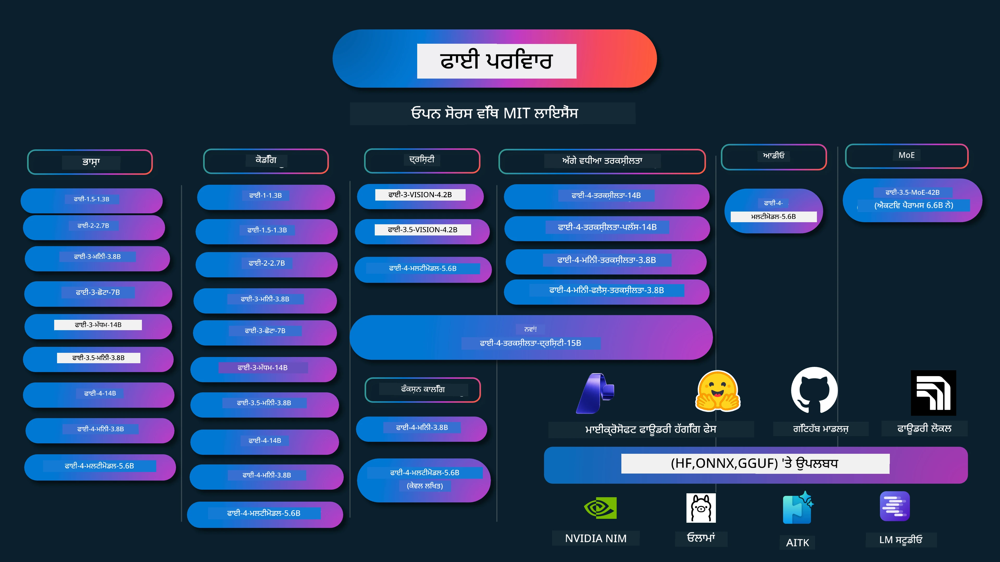

# ਫਾਈ ਕੁਕਬੁੱਕ: ਮਾਇਕ੍ਰੋਸਾਫ਼ਟ ਦੇ ਫਾਈ ਮਾਡਲਾਂ ਨਾਲ ਹੱਥ-ਓਣ ਉਦਾਹਰਨਾਂ

[](https://codespaces.new/microsoft/phicookbook)
[](https://vscode.dev/redirect?url=vscode://ms-vscode-remote.remote-containers/cloneInVolume?url=https://github.com/microsoft/phicookbook)

[](https://GitHub.com/microsoft/phicookbook/graphs/contributors/?WT.mc_id=aiml-137032-kinfeylo)
[](https://GitHub.com/microsoft/phicookbook/issues/?WT.mc_id=aiml-137032-kinfeylo)
[](https://GitHub.com/microsoft/phicookbook/pulls/?WT.mc_id=aiml-137032-kinfeylo)
[](http://makeapullrequest.com?WT.mc_id=aiml-137032-kinfeylo)

[](https://GitHub.com/microsoft/phicookbook/watchers/?WT.mc_id=aiml-137032-kinfeylo)
[](https://GitHub.com/microsoft/phicookbook/network/?WT.mc_id=aiml-137032-kinfeylo)
[](https://GitHub.com/microsoft/phicookbook/stargazers/?WT.mc_id=aiml-137032-kinfeylo)

[](https://discord.com/invite/ByRwuEEgH4)

ਫਾਈ ਮਾਇਕ੍ਰੋਸਾਫਟ ਵੱਲੋਂ ਵਿਕਸਤ ਖੁੱਲ੍ਹਾ ਸਤਰ ਦਾ ਏਆਈ ਮਾਡਲਾਂ ਦਾ ਇੱਕ ਸਿਰੀਜ਼ ਹੈ।

ਫਾਈ ਵਰਤਮਾਨ ਵਿੱਚ ਸਭ ਤੋਂ ਤਾਕਤਵਰ ਅਤੇ ਕਿਫਾਇਤੀ ਛੋਟਾ ਭਾਸ਼ਾ ਮਾਡਲ (SLM) ਹੈ, ਜਿਸਦੇ ਬਹੁ-ਭਾਸ਼ਾਈ, ਤਰਕਸ਼ੀਲ, ਪਾਠ/ਚੈਟ ਜੈਨਰੇਸ਼ਨ, ਕੋਡਿੰਗ, ਚਿੱਤਰਾਂ, ਆਡੀਓ ਤੇ ਹੋਰ ਸਥਿਤੀਆਂ ਵਿੱਚ ਸੁਚੱਜੇ ਬੈਂਚਮਾਰਕ ਹਨ।

ਤੁਸੀਂ ਫਾਈ ਨੂੰ ਕਲਾਉਡ ਜਾਂ ਐਜ ਡਿਵਾਈਸਾਂ 'ਤੇ ਡਿਪਲੌਇ ਕਰ ਸਕਦੇ ਹੋ, ਅਤੇ ਸੀਮਤ ਕੰਪਿਊਟਿੰਗ ਸ਼ਕਤੀ ਨਾਲ ਆਸਾਨੀ ਨਾਲ ਜਨਰੇਟਿਵ ਏਆਈ ਐਪਲੀਕੇਸ਼ਨਾਂ ਬਣਾ ਸਕਦੇ ਹੋ।

ਇਹਨਾਂ ਸਰੋਤਾਂ ਦੀ ਵਰਤੋਂ ਸ਼ੁਰੂ ਕਰਨ ਲਈ ਇਹ ਕਦਮ ਫਾਲੋ ਕਰੋ:
1. **ਰਿਪੋਜ਼ਿਟਰੀ ਨੂੰ ਫੋਰਕ ਕਰੋ**: ਕਲਿੱਕ ਕਰੋ [](https://GitHub.com/microsoft/phicookbook/network/?WT.mc_id=aiml-137032-kinfeylo)
2. **ਰਿਪੋਜ਼ਿਟਰੀ ਕਲੋਨ ਕਰੋ**: `git clone https://github.com/microsoft/PhiCookBook.git`
3. [**ਮਾਇਕ੍ਰੋਸਾਫਟ ਏਆਈ ਡਿਸਕਾਰਡ ਕਮਿਊਨਿਟੀ ਨਾਲ ਜੁੜੋ ਅਤੇ ਮਾਹਿਰਾਂ ਅਤੇ ਹੋਰ ਡਿਵੈਲਪਰਾਂ ਨੂੰ ਮਿਲੋ**](https://discord.com/invite/ByRwuEEgH4?WT.mc_id=aiml-137032-kinfeylo)



### 🌐 ਬਹੁ-ਭਾਸ਼ਾਈ ਸਹਾਇਤਾ

#### ਗਿੱਟਹੱਬ ਐਕਸ਼ਨ ਰਾਹੀਂ ਸਪੋਰਟ ਕੀਤਾ ਗਿਆ (ਆਟੋਮੇਟੇਡ ਅਤੇ ਸਦਾ-ਅਪਡੇਟ)

<!-- CO-OP TRANSLATOR LANGUAGES TABLE START -->
[Arabic](../ar/README.md) | [Bengali](../bn/README.md) | [Bulgarian](../bg/README.md) | [Burmese (Myanmar)](../my/README.md) | [Chinese (Simplified)](../zh-CN/README.md) | [Chinese (Traditional, Hong Kong)](../zh-HK/README.md) | [Chinese (Traditional, Macau)](../zh-MO/README.md) | [Chinese (Traditional, Taiwan)](../zh-TW/README.md) | [Croatian](../hr/README.md) | [Czech](../cs/README.md) | [Danish](../da/README.md) | [Dutch](../nl/README.md) | [Estonian](../et/README.md) | [Finnish](../fi/README.md) | [French](../fr/README.md) | [German](../de/README.md) | [Greek](../el/README.md) | [Hebrew](../he/README.md) | [Hindi](../hi/README.md) | [Hungarian](../hu/README.md) | [Indonesian](../id/README.md) | [Italian](../it/README.md) | [Japanese](../ja/README.md) | [Kannada](../kn/README.md) | [Khmer](../km/README.md) | [Korean](../ko/README.md) | [Lithuanian](../lt/README.md) | [Malay](../ms/README.md) | [Malayalam](../ml/README.md) | [Marathi](../mr/README.md) | [Nepali](../ne/README.md) | [Nigerian Pidgin](../pcm/README.md) | [Norwegian](../no/README.md) | [Persian (Farsi)](../fa/README.md) | [Polish](../pl/README.md) | [Portuguese (Brazil)](../pt-BR/README.md) | [Portuguese (Portugal)](../pt-PT/README.md) | [Punjabi (Gurmukhi)](./README.md) | [Romanian](../ro/README.md) | [Russian](../ru/README.md) | [Serbian (Cyrillic)](../sr/README.md) | [Slovak](../sk/README.md) | [Slovenian](../sl/README.md) | [Spanish](../es/README.md) | [Swahili](../sw/README.md) | [Swedish](../sv/README.md) | [Tagalog (Filipino)](../tl/README.md) | [Tamil](../ta/README.md) | [Telugu](../te/README.md) | [Thai](../th/README.md) | [Turkish](../tr/README.md) | [Ukrainian](../uk/README.md) | [Urdu](../ur/README.md) | [Vietnamese](../vi/README.md)

> **ਕੀ ਤੁਸੀਂ ਸਥਾਨਕ ਤੌਰ 'ਤੇ ਕਲੋਨ ਕਰਨਾ ਪਸੰਦ ਕਰਦੇ ਹੋ?**
>
> ਇਹ ਰਿਪੋਜ਼ਿਟਰੀ ਵਿੱਚ 50+ ਭਾਸ਼ਾ ਅਨੁਵਾਦ ਸ਼ਾਮਲ ਹਨ ਜੋ ਡਾਉਨਲੋਡ ਆਕਾਰ ਨੂੰ ਵੱਡਾ ਕਰ ਦਿੰਦے ਹਨ। ਬਿਨਾਂ ਅਨੁਵਾਦਾਂ ਦੇ ਕਲੋਨ ਕਰਨ ਲਈ, sparse checkout ਵਰਤੋਂ ਕਰੋ:
>
> **Bash / macOS / Linux:**
> ```bash
> git clone --filter=blob:none --sparse https://github.com/microsoft/PhiCookBook.git
> cd PhiCookBook
> git sparse-checkout set --no-cone '/*' '!translations' '!translated_images'
> ```
>
> **CMD (Windows):**
> ```cmd
> git clone --filter=blob:none --sparse https://github.com/microsoft/PhiCookBook.git
> cd PhiCookBook
> git sparse-checkout set --no-cone "/*" "!translations" "!translated_images"
> ```
>
> ਇਹ ਤੁਹਾਨੂੰ ਕੋਰਸ ਨੂੰ ਪੂਰਾ ਕਰਨ ਲਈ ਸਾਰਾ ਕੁਝ ਮੁਹੱਈਆ ਕਰਵਾਉਂਦਾ ਹੈ ਤੇ ਡਾਉਨਲੋਡ ਤੇਜ਼ ਹੁੰਦਾ ਹੈ।
<!-- CO-OP TRANSLATOR LANGUAGES TABLE END -->

## ਸਮਗਰੀ ਸੂਚੀ

- ਪਰਿਚਯ
  - [ਫਾਈ ਪਰਿਵਾਰ ਦਾ ਸਵਾਗਤ ਹੈ](./md/01.Introduction/01/01.PhiFamily.md)
  - [ਆਪਣੇ ਵਾਤਾਵਰਨ ਨੂੰ ਸੈੱਟ ਕਰਨਾ](./md/01.Introduction/01/01.EnvironmentSetup.md)
  - [ਮੁੱਖ ਪ੍ਰੌਧੋਗਿਕੀਆਂ ਨੂੰ ਸਮਝਣਾ](./md/01.Introduction/01/01.Understandingtech.md)
  - [ਫਾਈ ਮਾਡਲਾਂ ਲਈ ਏਆਈ ਸੁਰੱਖਿਆ](./md/01.Introduction/01/01.AISafety.md)
  - [ਫਾਈ ਹਾਰਡਵੇਅਰ ਸਹਾਇਤਾ](./md/01.Introduction/01/01.Hardwaresupport.md)
  - [ਫਾਈ ਮਾਡਲਾਂ ਅਤੇ ਪਲੇਟਫਾਰਮਾਂ ਉੱਤੇ ਉਪਲਬਧਤਾ](./md/01.Introduction/01/01.Edgeandcloud.md)
  - [ਗਾਇਡੈਂਸ-ai ਅਤੇ ਫਾਈ ਦੀ ਵਰਤੋਂ](./md/01.Introduction/01/01.Guidance.md)
  - [ਗਿੱਟਹੱਬ ਮਾਰਕੀਟਪਲੇਸ ਮਾਡਲ](https://github.com/marketplace/models)
  - [ਅਜ਼ਯੂਰ ਏਆਈ ਮਾਡਲ ਕੈਟਲੌਗ](https://ai.azure.com)

- ਵੱਖ-ਵੱਖ ਵਾਤਾਵਰਨ ਵਿੱਚ ਫਾਈ ਇਨਫਰੈਂਸ
    -  [ਹੱਗਿੰਗ ਫੇਸ](./md/01.Introduction/02/01.HF.md)
    -  [ਗਿੱਟਹੱਬ ਮਾਡਲ](./md/01.Introduction/02/02.GitHubModel.md)
    -  [ਮਾਇਕ੍ਰੋਸਾਫਟ ਫਾਊਂਡਰੀ ਮਾਡਲ ਕੈਟਲੌਗ](./md/01.Introduction/02/03.AzureAIFoundry.md)
    -  [ਓਲਾਮਾ](./md/01.Introduction/02/04.Ollama.md)
    -  [ਏਆਈ ਟੂਲਕਿਟ VSCode (AITK)](./md/01.Introduction/02/05.AITK.md)
    -  [ਐਨਵੀਆਨਵੀਡੀਆ NIM](./md/01.Introduction/02/06.NVIDIA.md)
    -  [ਫਾਊਂਡਰੀ ਲੋਕਲ](./md/01.Introduction/02/07.FoundryLocal.md)

- ਫਾਈ ਪਰਿਵਾਰ ਦੀ ਇਨਫਰੈਂਸ
    - [iOS ਵਿੱਚ ਫਾਈ ਇਨਫਰੈਂਸ](./md/01.Introduction/03/iOS_Inference.md)
    - [ਐਂਡਰਾਇਡ ਵਿੱਚ ਫਾਈ ਇਨਫਰੈਂਸ](./md/01.Introduction/03/Android_Inference.md)
    - [ਜੇਟਸਨ ਵਿੱਚ ਫਾਈ ਇਨਫਰੈਂਸ](./md/01.Introduction/03/Jetson_Inference.md)
    - [ਏਆਈ ਪੀਸੀ ਵਿੱਚ ਫਾਈ ਇਨਫਰੈਂਸ](./md/01.Introduction/03/AIPC_Inference.md)
    - [ਐਪਲ MLX ਫਰੇਮਵਰਕ ਨਾਲ ਫਾਈ ਇਨਫਰੈਂਸ](./md/01.Introduction/03/MLX_Inference.md)
    - [ਲੋਕਲ ਸਰਵਰ ਵਿੱਚ ਫਾਈ ਇਨਫਰੈਂਸ](./md/01.Introduction/03/Local_Server_Inference.md)
    - [ਏਆਈ ਟੂਲਕਿਟ ਨਾਲ ਰਿਮੋਟ ਸਰਵਰ ਵਿੱਚ ਫਾਈ ਇਨਫਰੈਂਸ](./md/01.Introduction/03/Remote_Interence.md)
    - [ਰੱਸਟ ਨਾਲ ਫਾਈ ਇਨਫਰੈਂਸ](./md/01.Introduction/03/Rust_Inference.md)
    - [ਲੋਕਲ ਵਿੱਚ ਫਾਈ--ਵਿਜ਼ਨ ਇਨਫਰੈਂਸ](./md/01.Introduction/03/Vision_Inference.md)
    - [ਕੈਟੋ AKS, ਅਜ਼ਯੂਰ ਕੰਟੇਨਰਜ਼ (ਅਧਿਕਾਰਿਕ ਸਹਾਇਤਾ) ਨਾਲ ਫਾਈ ਇਨਫਰੈਂਸ](./md/01.Introduction/03/Kaito_Inference.md)
-  [ਫਾਈ ਪਰਿਵਾਰ ਦਾ ਮਾਪ](./md/01.Introduction/04/QuantifyingPhi.md)
    - [llama.cpp ਨਾਲ ਫਾਈ-3.5 / 4 ਕੋਅੰਟਾਈਜ਼ਿੰਗ](./md/01.Introduction/04/UsingLlamacppQuantifyingPhi.md)
    - [onnxruntime ਲਈ ਜਨਰੇਟਿਵ ਏਆਈ ਐਕਸਟੈਂਸ਼ਨ ਨਾਲ ਫਾਈ-3.5 / 4 ਕੋਅੰਟਾਈਜ਼ਿੰਗ](./md/01.Introduction/04/UsingORTGenAIQuantifyingPhi.md)
    - [ਇੰਟਲ ਓਪਨਵੀਨੋ ਨਾਲ ਫਾਈ-3.5 / 4 ਕੋਅੰਟਾਈਜ਼ਿੰਗ](./md/01.Introduction/04/UsingIntelOpenVINOQuantifyingPhi.md)
    - [ਐਪਲ MLX ਫਰੇਮਵਰਕ ਨਾਲ ਫਾਈ-3.5 / 4 ਕੋਅੰਟਾਈਜ਼ਿੰਗ](./md/01.Introduction/04/UsingAppleMLXQuantifyingPhi.md)

-  ਫਾਈ ਜ਼ਾਂਚ
    - [ਜ਼ਿੰਮੇਵਾਰ ਏਆਈ](./md/01.Introduction/05/ResponsibleAI.md)
    - [ਮਾਇਕ੍ਰੋਸਾਫਟ ਫਾਊਂਡਰੀ ਖਾਤਮੇ ਲਈ](./md/01.Introduction/05/AIFoundry.md)
    - [ਖਾਤਮੇ ਲਈ ਪ੍ਰੰਪਟਫਲੋ ਦੀ ਵਰਤੋਂ](./md/01.Introduction/05/Promptflow.md)
 
- ਅਜ਼ਯੂਰ ਏਆਈ ਖੋਜ ਨਾਲ RAG
    - [ਅਜ਼ਯੂਰ ਏਆਈ ਖੋਜ ਨਾਲ ਫਾਈ-4-ਮਿਨੀ ਅਤੇ ਫਾਈ-4-ਮਲਟੀਮੋਡਲ (RAG) ਦੀ ਵਰਤੋਂ ਕਿਵੇਂ ਕਰੀਏ](https://github.com/microsoft/PhiCookBook/blob/main/code/06.E2E/E2E_Phi-4-RAG-Azure-AI-Search.ipynb)
    - [ਜ਼ੀਰੋ-ਕਲਾਉਡ ਲੋਕਲ ਹਾਈਬ੍ਰਿਡ RAG SQLite FTS5 ਅਤੇ phi-4-mini ਨਾਲ](https://github.com/microsoft/PhiCookBook/blob/main/code/06.E2E/E2E_Phi-4-mini_Local_Hybrid_RAG_SQLite_FTS5.ipynb)

- ਫਾਈ ਐਪਲੀਕੇਸ਼ਨ ਵਿਕਾਸ ਸੈਂਪਲ
  - ਟੈਕਸਟ ਅਤੇ ਚੈਟ ਐਪਲੀਕੇਸ਼ਨ
    - ਫਾਈ-4 ਸੈਂਪਲ
      - [📓] [ਫਾਈ-4-ਮਿਨੀ ONNX ਮਾਡਲ ਨਾਲ ਚੈਟ](./md/02.Application/01.TextAndChat/Phi4/ChatWithPhi4ONNX/README.md)
      - [ਫਾਈ-4 ਲੋਕਲ ONNX ਮਾਡਲ .NET ਨਾਲ ਚੈਟ](../../md/04.HOL/dotnet/src/LabsPhi4-Chat-01OnnxRuntime)
      - [ਸੇਂਮੈਂਟਿਕ ਕਰਨੇਲ ਦੀ ਵਰਤੋਂ ਨਾਲ ਫਾਈ-4 ONNX ਚੈਟ .NET ਕੰਸੋਲ ਐਪ](../../md/04.HOL/dotnet/src/LabsPhi4-Chat-02SK)

    - ਫਾਈ-3 / 3.5 ਨਮੂਨੇ
      - [ਫਾਈ3, ONNX ਰਨਟਾਈਮ ਵੈੱਬ ਅਤੇ WebGPU ਦੀ ਵਰਤੋਂ ਕਰਦਿਆਂ ਬ੍ਰਾਉਜ਼ਰ ਵਿੱਚ ਸਥਾਨਕ ਚੈਟਬੋਟ](https://github.com/microsoft/onnxruntime-inference-examples/tree/main/js/chat)
      - [OpenVino ਚੈਟ](./md/02.Application/01.TextAndChat/Phi3/E2E_OpenVino_Chat.md)
      - [ਮਲਟੀ ਮਾਡਲ - ਇੰਟਰਐਕਟਿਵ ਫਾਈ-3-ਮਿਨੀ ਅਤੇ OpenAI ਵਿਸਪਰ](./md/02.Application/01.TextAndChat/Phi3/E2E_Phi-3-mini_with_whisper.md)
      - [MLFlow - ਇੱਕ ਰੈਪਰ ਬਣਾਉਣਾ ਅਤੇ ਫਾਈ-3 ਨੂੰ MLFlow ਨਾਲ ਵਰਤਣਾ](./md//02.Application/01.TextAndChat/Phi3/E2E_Phi-3-MLflow.md)
      - [ਮਾਡਲ ਆਪਟੀਮਾਈਜ਼ੇਸ਼ਨ - ONNX ਰਨਟਾਈਮ ਵੈੱਬ ਲਈ ਫਾਈ-3-ਮਿਨੀ ਮਾਡਲ ਨੂੰ Olive ਨਾਲ ਕਿਵੇਂ ਆਪਟੀਮਾਈਜ਼ ਕਰਨਾ](https://github.com/microsoft/Olive/tree/main/examples/phi3)
      - [WinUI3 ਐਪ ਫਾਈ-3 ਮਿਨੀ-4k-instruct-onnx ਨਾਲ](https://github.com/microsoft/Phi3-Chat-WinUI3-Sample/)
      -[WinUI3 ਮਲਟੀ ਮਾਡਲ ਏआई ਪਾਵਰਡ ਨੋਟਸ ਐਪ ਨਮੂਨਾ](https://github.com/microsoft/ai-powered-notes-winui3-sample)
      - [ਕਸਟਮ ਫਾਈ-3 ਮਾਡਲਾਂ ਨੂੰ ਪ੍ਰੋੰਪਟ ਫਲੋ ਨਾਲ ਫਾਈਨ-ਟਿਊਨ ਅਤੇ ਇੰਟੀਗ੍ਰੇਟ ਕਰੋ](./md/02.Application/01.TextAndChat/Phi3/E2E_Phi-3-FineTuning_PromptFlow_Integration.md)
      - [ਮਾਈਕ੍ਰੋਸਾਫਟ Foundry ਵਿੱਚ ਪ੍ਰੋੰਪਟ ਫਲੋ ਨਾਲ ਕਸਟਮ ਫਾਈ-3 ਮਾਡਲਾਂ ਨੂੰ ਫਾਈਨ-ਟਿਊਨ ਅਤੇ ਇੰਟੀਗ੍ਰੇਟ ਕਰੋ](./md/02.Application/01.TextAndChat/Phi3/E2E_Phi-3-FineTuning_PromptFlow_Integration_AIFoundry.md)
      - [ਮਾਈਕ੍ਰੋਸਾਫਟ ਦੀਜ਼ ਜ਼ਿੰਮੇਵਾਰ AI ਸਿਧਾਂਤਾਂ 'ਤੇ ਧਿਆਨ ਕੇਂਦਰਿਤ ਕਰਦਿਆਂ ਮਾਈਕ੍ਰੋਸਾਫਟ Foundry ਵਿੱਚ ਫਾਈਨ-ਟਿਊਨ ਕੀਤੇ ਗਏ ਫਾਈ-3 / ਫਾਈ-3.5 ਮਾਡਲ ਦਾ ਮੁੱਲਾਂਕਣ ਕਰੋ](./md/02.Application/01.TextAndChat/Phi3/E2E_Phi-3-Evaluation_AIFoundry.md)
      - [📓] [ਫਾਈ-3.5-ਮਿਨੀ-ਇੰਸਟ੍ਰੱਕਟ ਭਾਸ਼ਾ ਭਵਿੱਖਬਾਣੀ ਨਮੂਨਾ (ਚੀਨੀ/ਅੰਗਰੇਜ਼ੀ)](./md/02.Application/01.TextAndChat/Phi3/phi3-instruct-demo.ipynb)
      - [ਫਾਈ-3.5-ਇੰਸਟ੍ਰੱਕਟ WebGPU RAG ਚੈਟਬੋਟ](./md/02.Application/01.TextAndChat/Phi3/WebGPUWithPhi35Readme.md)
      - [ਫਾਈ-3.5-ਇੰਸਟ੍ਰੱਕਟ ONNX ਨਾਲ ਪ੍ਰੋੰਪਟ ਫਲੋ ਸਉਲਿਊਸ਼ਨ ਬਣਾਉਣ ਲਈ Windows GPU ਦੀ ਵਰਤੋਂ](./md/02.Application/01.TextAndChat/Phi3/UsingPromptFlowWithONNX.md)
      - [Android ਐਪ ਬਣਾਉਣ ਲਈ ਮਾਈਕ੍ਰੋਸਾਫਟ ਫਾਈ-3.5 tflite ਦੀ ਵਰਤੋਂ](./md/02.Application/01.TextAndChat/Phi3/UsingPhi35TFLiteCreateAndroidApp.md)
      - [Microsoft.ML.OnnxRuntime ਦੀ ਵਰਤੋਂ ਕਰਦਿਆਂ ਸਥਾਨਕ ONNX ਫਾਈ-3 ਮਾਡਲ ਨਾਲ Q&A .NET ਉਦਾਹਰਨ](../../md/04.HOL/dotnet/src/LabsPhi301)
      - [ਸੈਮੈਂਟਿਕ ਕਰਨਲ ਅਤੇ ਫਾਈ-3 ਨਾਲ ਕੰਸੋਲ ਚੈਟ .NET ਐਪ](../../md/04.HOL/dotnet/src/LabsPhi302)

  - ਅਜ਼ੁਰ ਏਆਈ ਇੰਫਰੈਂਸ SDK ਕੋਡ ਅਧਾਰਿਤ ਨਮੂਨੇ
    - ਫਾਈ-4 ਨਮੂਨੇ
      - [📓] [ਫਾਈ-4-ਮਲਟੀਮੋਡਲ ਦੀ ਵਰਤੋਂ ਕਰਕੇ ਪ੍ਰੋਜੈਕਟ ਕੋਡ ਜਨਰੇਟ ਕਰੋ](./md/02.Application/02.Code/Phi4/GenProjectCode/README.md)
    - ਫਾਈ-3 / 3.5 ਨਮੂਨੇ
      - [ਮਾਈਕ੍ਰੋਸਾਫਟ ਫਾਈ-3 ਪਰਿਵਾਰ ਨਾਲ ਆਪਣਾ ਵਿਜ਼ੂਅਲ ਸਟੂਡੀਓ ਕੋਡ GitHub ਕੋਪਾਈਲਟ ਚੈਟ ਬਣਾਓ](./md/02.Application/02.Code/Phi3/VSCodeExt/README.md)
      - [GitHub ਮਾਡਲਾਂ ਦੁਆਰਾ ਫਾਈ-3.5 ਨਾਲ ਆਪਣਾ ਵਿਜ਼ੂਅਲ ਸਟੂਡੀਓ ਕੋਡ ਚੈਟ ਕੋਪਾਈਲਟ ਏਜੰਟ ਬਣਾਓ](/md/02.Application/02.Code/Phi3/CreateVSCodeChatAgentWithGitHubModels.md)

  - ਉੱਚ ਤਰ੍ਹਾਂ ਦਾ ਤਰਕਸ਼ਾਸਤਰ ਨਮੂਨੇ
    - ਫਾਈ-4 ਨਮੂਨੇ
      - [📓] [ਫਾਈ-4-ਮਿਨੀ-ਤਕਰਾਰ ਜਾਂ ਫਾਈ-4-ਤਕਰਾਰ ਨਮੂਨੇ](./md/02.Application/03.AdvancedReasoning/Phi4/AdvancedResoningPhi4mini/README.md)
      - [📓] [ਮਾਈਕ੍ਰੋਸਾਫਟ Olive ਨਾਲ ਫਾਈ-4-ਮਿਨੀ-ਤਕਰਾਰ ਨੂੰ ਫਾਈਨ-ਟਿਊਨ ਕਰਨਾ](./md/02.Application/03.AdvancedReasoning/Phi4/AdvancedResoningPhi4mini/olive_ft_phi_4_reasoning_with_medicaldata.ipynb)
      - [📓] [Apple MLX ਨਾਲ ਫਾਈ-4-ਮਿਨੀ-ਤਕਰਾਰ ਨੂੰ ਫਾਈਨ-ਟਿਊਨ ਕਰਨਾ](./md/02.Application/03.AdvancedReasoning/Phi4/AdvancedResoningPhi4mini/mlx_ft_phi_4_reasoning_with_medicaldata.ipynb)
      - [📓] [GitHub ਮਾਡਲਾਂ ਨਾਲ ਫਾਈ-4-ਮਿਨੀ-ਤਕਰਾਰ](./md/02.Application/02.Code/Phi4r/github_models_inference.ipynb)
      - [📓] [ਮਾਈਕ੍ਰੋਸਾਫਟ Foundry ਮਾਡਲਾਂ ਨਾਲ ਫਾਈ-4-ਮਿਨੀ-ਤਕਰਾਰ](./md/02.Application/02.Code/Phi4r/azure_models_inference.ipynb)
  - ਡੈਮੋ
      - [ਫਾਈ-4-ਮਿਨੀ ਡੈਮੋਜ਼ Hugging Face ਸਪੇਸز ਤੇ ਹੋਸਟ ਕੀਤੇ ਗਏ](https://huggingface.co/spaces/microsoft/phi-4-mini?WT.mc_id=aiml-137032-kinfeylo)
      - [ਫਾਈ-4-ਮਲਟੀਮੋਡਲ ਡੈਮੋਜ਼ Hugginge Face ਸਪੇਸਜ਼ ਤੇ ਹੋਸਟ ਕੀਤੇ ਗਏ](https://huggingface.co/spaces/microsoft/phi-4-multimodal?WT.mc_id=aiml-137032-kinfeylo)
  - ਵਿਜ਼ਨ ਨਮੂਨੇ
    - ਫਾਈ-4 ਨਮੂਨੇ
      - [📓] [ਫਾਈ-4-ਮਲਟੀਮੋਡਲ ਦੀ ਵਰਤੋਂ ਕਰਕੇ ਚਿੱਤਰ ਪੜ੍ਹੋ ਅਤੇ ਕੋਡ ਜਨਰੇਟ ਕਰੋ](./md/02.Application/04.Vision/Phi4/CreateFrontend/README.md) 
    - ਫਾਈ-3 / 3.5 ਨਮੂਨੇ
      -  [📓][ਫਾਈ-3-ਵਿਜ਼ਨ-ਚਿੱਤਰ ਲਿਖਤ ਤੋਂ ਲਿਖਤ](./md/02.Application/04.Vision/Phi3/E2E_Phi-3-vision-image-text-to-text-online-endpoint.ipynb)
      - [ਫਾਈ-3-ਵਿਜ਼ਨ-ONNX](https://onnxruntime.ai/docs/genai/tutorials/phi3-v.html)
      - [📓][ਫਾਈ-3-ਵਿਜ਼ਨ CLIP ਐਂਬੈਡਿੰਗ](./md/02.Application/04.Vision/Phi3/E2E_Phi-3-vision-image-text-to-text-online-endpoint.ipynb)
      - [ਡੈਮੋ: ਫਾਈ-3 ਰੀਸਾਈਕਲਿੰਗ](https://github.com/jennifermarsman/PhiRecycling/)
      - [ਫਾਈ-3-ਵਿਜ਼ਨ - ਦ੍ਰਿਸ਼ਟੀ ਭਾਸ਼ਾ ਸਹਾਇਕ - ਫਾਈ3-ਵਿਜ਼ਨ ਅਤੇ OpenVINO ਨਾਲ](https://docs.openvino.ai/nightly/notebooks/phi-3-vision-with-output.html)
      - [ਫਾਈ-3 ਵਿਜ਼ਨ Nvidia NIM](./md/02.Application/04.Vision/Phi3/E2E_Nvidia_NIM_Vision.md)
      - [ਫਾਈ-3 ਵਿਜ਼ਨ OpenVino](./md/02.Application/04.Vision/Phi3/E2E_OpenVino_Phi3Vision.md)
      - [📓][ਫਾਈ-3.5 ਵਿਜ਼ਨ ਮਲਟੀ-ਫ੍ਰੇਮ ਜਾਂ ਮਲਟੀ-ਚਿੱਤਰ ਨਮੂਨਾ](./md/02.Application/04.Vision/Phi3/phi3-vision-demo.ipynb)
      - [ਮਾਈਕ੍ਰੋਸਾਫਟ.ML.OnnxRuntime .NET ਦੀ ਵਰਤੋਂ ਕਰਕੇ ਫਾਈ-3 ਵਿਜ਼ਨ ਸਥਾਨਕ ONNX ਮਾਡਲ](../../md/04.HOL/dotnet/src/LabsPhi303)
      - [ਮੇਨੂ ਅਧਾਰਿਤ ਫਾਈ-3 ਵਿਜ਼ਨ ਸਥਾਨਕ ONNX ਮਾਡਲ Microsoft.ML.OnnxRuntime .NET ਦੀ ਵਰਤੋਂ ਨਾਲ](../../md/04.HOL/dotnet/src/LabsPhi304)

  - ਤਰਕਸ਼ਾਸਤਰ-ਵਿਜ਼ਨ ਨਮੂਨੇ
    - ਫਾਈ-4-ਤਰਕਸ਼ਾਸਤਰ-ਵਿਜ਼ਨ-15B
      - [📓] [ਫਾਈ-4-ਤਰਕਸ਼ਾਸਤਰ-ਵਿਜ਼ਨ-15B ਦੀ ਵਰਤੋਂ ਕਰਕੇ ਜੇਵਾਕਿੰਗ ਦੀ ਪਹਿਚਾਣ](./md/02.Application/10.ReasoningVision/Phi_4_reasoning_vision_15b_Jaywalking.ipynb)
      - [📓] [ਫਾਈ-4-ਤਰਕਸ਼ਾਸਤਰ-ਵਿਜ਼ਨ-15B ਦੀ ਵਰਤੋਂ ਕਰਕੇ ਗਣਿਤ](./md/02.Application/10.ReasoningVision/Phi_4_reasoning_vision_15b_Math.ipynb)
      - [📓] [ਫਾਈ-4-ਤਰਕਸ਼ਾਸਤਰ-ਵਿਜ਼ਨ-15B ਦੀ ਵਰਤੋਂ ਕਰਕੇ UI ਦੀ ਪਹਿਚਾਣ](./md/02.Application/10.ReasoningVision/Phi_4_reasoning_vision_15b_ui.ipynb)

  - ਗਣਿਤ ਨਮੂਨੇ
    -  ਫਾਈ-4-ਮਿਨੀ-ਫਲੈਸ਼-ਤਰਕਸ਼ਾਸਤਰ-ਇਨਸਟ੍ਰੱਕਟ ਨਮੂਨੇ  [ਫਾਈ-4-ਮਿਨੀ-ਫਲੈਸ਼-ਤਰਕਸ਼ਾਸਤਰ-ਇਨਸਟ੍ਰੱਕਟ ਨਾਲ ਗਣਿਤ ਡੈਮੋ](./md/02.Application/09.Math/MathDemo.ipynb)

  - ਆਡੀਓ ਨਮੂਨੇ
    - ਫਾਈ-4 ਨਮੂਨੇ
      - [📓] [ਫਾਈ-4-ਮਲਟੀਮੋਡਲ ਦੀ ਵਰਤੋਂ ਕਰਕੇ ਆਡੀਓ ਟ੍ਰਾਂਸਕ੍ਰਿਪਟ ਨਿਕਾਲਣਾ](./md/02.Application/05.Audio/Phi4/Transciption/README.md)
      - [📓] [ਫਾਈ-4-ਮਲਟੀਮੋਡਲ ਆਡੀਓ ਨਮੂਨਾ](./md/02.Application/05.Audio/Phi4/Siri/demo.ipynb)
      - [📓] [ਫਾਈ-4-ਮਲਟੀਮੋਡਲ ਸਪੀਚ ਅਨੁਵਾਦ ਨਮੂਨਾ](./md/02.Application/05.Audio/Phi4/Translate/demo.ipynb)
      - [.NET ਕੰਸੋਲ ਐਪਲੀਕੇਸ਼ਨ ਜੋ ਫਾਈ-4-ਮਲਟੀਮੋਡਲ ਦੀ ਵਰਤੋਂ ਕਰਕੇ ਆਡੀਓ ਫਾਈਲ ਦਾ ਵਿਸ਼ਲੇਸ਼ਣ ਅਤੇ ਟ੍ਰਾਂਸਕ੍ਰਿਪਟ ਜਨਰੇਟ ਕਰਦਾ ਹੈ](../../md/04.HOL/dotnet/src/LabsPhi4-MultiModal-02Audio)

  - MOE ਨਮੂਨੇ
    - ਫਾਈ-3 / 3.5 ਨਮੂਨੇ
      - [📓] [ਫਾਈ-3.5 ਮਿਕਸਚਰ ਆਫ਼ ਐਕਸਪਟਰਟ ਮਾਡਲਜ਼ (MoEs) ਸੋਸ਼ਲ ਮੀਡੀਆ ਨਮੂਨਾ](./md/02.Application/06.MoE/Phi3/phi3_moe_demo.ipynb)
      - [📓] [NVIDIA NIM ਫਾਈ-3 MOE, ਅਜ਼ੁਰ ਏਆਈ ਸਹਾਇਕ ਅਤੇ LlamaIndex ਨਾਲ ਰੀਟਰੀਵਲ-ਆਗਮੈਂਟਡ ਜਨਰੇਸ਼ਨ (RAG) ਪਾਈਪਲਾਈਨ ਬਣਾਉਣਾ](./md/02.Application/06.MoE/Phi3/azure-ai-search-nvidia-rag.ipynb)
      - 
  - ਫੰਕਸ਼ਨ ਕਾਲਿੰਗ ਨਮੂਨੇ
    - ਫਾਈ-4 ਨਮੂਨੇ 🆕
      -  [📓] [ਫਾਈ-4-ਮਿਨੀ ਨਾਲ ਫੰਕਸ਼ਨ ਕਾਲਿੰਗ ਦੀ ਵਰਤੋਂ](./md/02.Application/07.FunctionCalling/Phi4/FunctionCallingBasic/README.md)
      -  [📓] [ਫਾਈ-4-ਮਿਨੀ ਨਾਲ ਕਈ ਏਜੰਟ ਬਣਾਉਣ ਲਈ ਫੰਕਸ਼ਨ ਕਾਲਿੰਗ ਦੀ ਵਰਤੋਂ](./md/02.Application/07.FunctionCalling/Phi4/Multiagents/Phi_4_mini_multiagent.ipynb)
      -  [📓] [Ollama ਨਾਲ ਫੰਕਸ਼ਨ ਕਾਲਿੰਗ ਦੀ ਵਰਤੋਂ](./md/02.Application/07.FunctionCalling/Phi4/Ollama/ollama_functioncalling.ipynb)
      -  [📓] [ONNX ਨਾਲ ਫੰਕਸ਼ਨ ਕਾਲਿੰਗ ਦੀ ਵਰਤੋਂ](./md/02.Application/07.FunctionCalling/Phi4/ONNX/onnx_parallel_functioncalling.ipynb)
  - ਮਲਟੀਮੋਡਲ ਮਿਕਸਿੰਗ ਨਮੂਨੇ
    - ਫਾਈ-4 ਨਮੂਨੇ 🆕
      -  [📓] [ਫਾਈ-4-ਮਲਟੀਮੋਡਲ ਨੂੰ ਇੱਕ ਤਕਨਾਲੋਜੀ ਪੱਤਰਕਾਰ ਵਜੋਂ ਵਰਤਣਾ](./md/02.Application/08.Multimodel/Phi4/TechJournalist/phi_4_mm_audio_text_publish_news.ipynb)
      - [.NET ਕੰਸੋਲ ਐਪਲੀਕੇਸ਼ਨ ਜੋ ਫਾਈ-4-ਮਲਟੀਮੋਡਲ ਦੀ ਵਰਤੋਂ ਕਰਕੇ ਚਿੱਤਰਾਂ ਦਾ ਵਿਸ਼ਲੇਸ਼ਣ ਕਰਦਾ ਹੈ](../../md/04.HOL/dotnet/src/LabsPhi4-MultiModal-01Images)

- ਫਾਈਨ-ਟਿਊਨਿੰਗ ਫਾਈ ਨਮੂਨੇ
  - [ਫਾਈਨ-ਟਿਊਨਿੰਗ ਸੀਨਾਰਿਓਜ਼](./md/03.FineTuning/FineTuning_Scenarios.md)
  - [ਫਾਈਨ-ਟਿਊਨਿੰਗ ਵਿਰੁੱਧ RAG](./md/03.FineTuning/FineTuning_vs_RAG.md)
  - [ਫਾਈਨ-ਟਿਊਨਿੰਗ ਫਾਈ-3 ਨੂੰ ਉਦਯੋਗ ਵਿਸ਼ੇਸ਼ਜ্ঞান ਬਣਾਉਣਾ](./md/03.FineTuning/LetPhi3gotoIndustriy.md)
  - [VS ਕੋਡ ਲਈ AI ਟੂਲਕਿੱਟ ਨਾਲ ਫਾਈ-3 ਦੀ ਫਾਈਨ-ਟਿਊਨਿੰਗ](./md/03.FineTuning/Finetuning_VSCodeaitoolkit.md)
  - [ਅਜ਼ੁਰ ਮਸ਼ੀਨ ਲਰਨਿੰਗ ਸਰਵਿਸ ਨਾਲ ਫਾਈ-3 ਦੀ ਫਾਈਨ-ਟਿਊਨਿੰਗ](./md/03.FineTuning/Introduce_AzureML.md)
  - [ਲੋਰਾ ਨਾਲ ਫਾਈ-3 ਦੀ ਫਾਈਨ-ਟਿਊਨਿੰਗ](./md/03.FineTuning/FineTuning_Lora.md)
  - QLora ਨਾਲ ਫਾਈ-3 ਦੀ ਫਾਈਨ-ਟਿਊਨਿੰਗ](./md/03.FineTuning/FineTuning_Qlora.md)
  - [ਮਾਈਕ੍ਰੋਸਾਫਟ Foundry ਨਾਲ ਫਾਈ-3 ਦੀ ਫਾਈਨ-ਟਿਊਨਿੰਗ](./md/03.FineTuning/FineTuning_AIFoundry.md)
  - [ਅਜ਼ੁਰ ML CLI/SDK ਨਾਲ ਫਾਈ-3 ਦੀ ਫਾਈਨ-ਟਿਊਨਿੰਗ](./md/03.FineTuning/FineTuning_MLSDK.md)
  - [ਮਾਈਕ੍ਰੋਸਾਫਟ Olive ਨਾਲ ਫਾਈਨ-ਟਿਊਨਿੰਗ](./md/03.FineTuning/FineTuning_MicrosoftOlive.md)
  - [ਮਾਈਕ੍ਰੋਸਾਫਟ Olive ਹੈਂਡਜ਼-ਆਨ ਲੈਬ ਨਾਲ ਫਾਈਨ-ਟਿਊਨਿੰਗ](./md/03.FineTuning/olive-lab/readme.md)
  - [Weights and Bias ਨਾਲ ਫਾਈ-3-ਵਿਜ਼ਨ ਦੀ ਫਾਈਨ-ਟਿਊਨਿੰਗ](./md/03.FineTuning/FineTuning_Phi-3-visionWandB.md)

  - [Apple MLX Framework ਨਾਲ ਫਾਈ-3 ਦਾ ਫਾਈਨ-ਟਿਊਨਿੰਗ](./md/03.FineTuning/FineTuning_MLX.md)
  - [ਫਾਈ-3-ਵਿਜ਼ਨ ਦਾ ਫਾਈਨ-ਟਿਊਨਿੰਗ (ਅਧਿਕਾਰਕ ਸਪੋਰਟ)](./md/03.FineTuning/FineTuning_Vision.md)
  - [ਫਾਈ-3 ਦਾ ਕਾਈਟੋ AKS, Azure ਕਨਟੇਨਰਾਂ ਨਾਲ ਫਾਈਨ-ਟਿਊਨਿੰਗ (ਅਧਿਕਾਰਕ ਸਹਾਇਤਾ)](./md/03.FineTuning/FineTuning_Kaito.md)
  - [ਫਾਈ-3 ਅਤੇ 3.5 ਵਿਜ਼ਨ ਦਾ ਫਾਈਨ-ਟਿਊਨਿੰਗ](https://github.com/2U1/Phi3-Vision-Finetune)

- ਹੈਂਡਸ-ਆਨ ਲੈਬ
  - [ਅਗੇਤੁਰ ਮਾਡਲ ਦੀ ਪੜਚੋਲ: LLMs, SLMs, ਸਥਾਨਕ ਵਿਕਾਸ ਅਤੇ ਹੋਰ](https://github.com/microsoft/aitour-exploring-cutting-edge-models)
  - [NLP ਸਮਰੱਥਾ ਖੋਲ੍ਹਣਾ: Microsoft Olive ਨਾਲ ਫਾਈਨ-ਟਿਊਨਿੰਗ](https://github.com/azure/Ignite_FineTuning_workshop)

- ਅਕਾਦਮਿਕ ਖੋਜ ਪੱਤਰ ਅਤੇ ਪ੍ਰਕਾਸ਼ਨ
  - [Textbooks Are All You Need II: phi-1.5 ਤਕਨੀਕੀ ਰਿਪੋਰਟ](https://arxiv.org/abs/2309.05463)
  - [Phi-3 ਤਕਨੀਕੀ ਰਿਪੋਰਟ: ਤੁਹਾਡੇ ਫੋਨ 'ਤੇ ਇੱਕ ਬਹੁਤ ਸਮਰੱਥ ਭਾਸ਼ਾ ਮਾਡਲ](https://arxiv.org/abs/2404.14219)
  - [Phi-4 ਤਕਨੀਕੀ ਰਿਪੋਰਟ](https://arxiv.org/abs/2412.08905)
  - [Phi-4-Mini ਤਕਨੀਕੀ ਰਿਪੋਰਟ: ਮਿਕਸਚਰ-ਆਫ-ਲੋRAs ਰਾਹੀਂ ਘਣਿਸ਼ਠ ਅਤੇ ਸ਼ਕਤੀਸ਼ਾਲੀ ਮਲਟੀਮੋਡਲ ਭਾਸ਼ਾ ਮਾਡਲ](https://arxiv.org/abs/2503.01743)
  - [ਵਾਹਨ ਵਿੱਚ ਫੰਕਸ਼ਨ-ਕਾਲਿੰਗ ਲਈ ਛੋਟੇ ਭਾਸ਼ਾ ਮਾਡਲਾਂ ਦਾ ਆਪਟੀਮਾਈਜ਼ੇਸ਼ਨ](https://arxiv.org/abs/2501.02342)
  - [(WhyPHI) ਬਹੁ-ਚੋਣ ਸਵਾਲ ਜਵਾਬ ਲਈ PHI-3 ਦਾ ਫਾਈਨ-ਟਿਊਨਿੰਗ: ਢੰਗ, ਨਤੀਜੇ ਅਤੇ ਚੁਣੌਤੀਆਂ](https://arxiv.org/abs/2501.01588)
  - [Phi-4-ਵੀਚਾਰਧਾਰਾ ਤਕਨੀਕੀ ਰਿਪੋਰਟ](https://www.microsoft.com/en-us/research/wp-content/uploads/2025/04/phi_4_reasoning.pdf)
  - [Phi-4-mini-ਵੀਚਾਰਧਾਰਾ ਤਕਨੀਕੀ ਰਿਪੋਰਟ](https://huggingface.co/microsoft/Phi-4-mini-reasoning/blob/main/Phi-4-Mini-Reasoning.pdf)

## ਫਾਈ ਮਾਡਲਸ ਦੀ ਵਰਤੋਂ

### Microsoft Foundry 'ਤੇ ਫਾਈ

ਤੁਸੀਂ Microsoft Phi ਦੀ ਵਰਤੋਂ ਕਿਵੇਂ ਕਰਨ ਦੀ ਸਿੱਖਿਆ ਪ੍ਰਾਪਤ ਕਰ ਸਕਦੇ ਹੋ ਅਤੇ ਵੱਖ-ਵੱਖ ਹਾਰਡਵੇਅਰ ਡਿਵਾਈਸਾਂ ਵਿੱਚ E2E ਸੋਲਿਊਸ਼ਨ ਬਣਾਉਣ ਦੇ ਤਰੀਕੇ ਸਿੱਖ ਸਕਦੇ ਹੋ। Phi ਦਾ ਅਨੁਭਵ ਲੈਣ ਲਈ, models ਨਾਲ ਖੇਡੋ ਅਤੇ ਆਪਣੇ ਮਾਮਲਿਆਂ ਲਈ Phi ਨੂੰ ਕਸਟਮਾਈਜ਼ ਕਰੋ, [Microsoft Foundry Azure AI Model Catalog](https://aka.ms/phi3-azure-ai) ਦੇ ਜ਼ਰੀਏ। ਜ਼ਿਆਦਾ ਜਾਣਕਾਰੀ ਲਈ [Microsoft Foundry](/md/02.QuickStart/AzureAIFoundry_QuickStart.md) ਦੇ ਗੈਟਿੰਗ ਸਟਾਰਟ ਪੇਜ 'ਤੇ ਜਾਓ।

**ਪਲੇਗ੍ਰਾਉਂਡ**
ਹਰ ਮਾਡਲ ਲਈ ਇਕ ਖਾਸ ਪਲੇਗ੍ਰਾਉਂਡ ਹੈ ਜਿੱਥੇ ਮਾਡਲ ਦੀ ਟੈਸਟਿੰਗ ਕਰ ਸਕਦੇ ਹੋ [Azure AI Playground](https://aka.ms/try-phi3)।

### GitHub Models 'ਤੇ ਫਾਈ

ਤੁਸੀਂ Microsoft Phi ਦੀ ਵਰਤੋਂ ਕਿਵੇਂ ਕਰਨ ਦੀ ਸਿੱਖਿਆ ਪ੍ਰਾਪਤ ਕਰ ਸਕਦੇ ਹੋ ਅਤੇ ਵੱਖ-ਵੱਖ ਹਾਰਡਵੇਅਰ ਡਿਵਾਈਸਾਂ ਵਿੱਚ E2E ਸੋਲਿਊਸ਼ਨ ਬਣਾਉਣ ਦੇ ਤਰੀਕੇ ਸਿੱਖ ਸਕਦੇ ਹੋ। Phi ਦਾ ਅਨੁਭਵ ਲੈਣ ਲਈ, ਮਾਡਲ ਨਾਲ ਖੇਡੋ ਅਤੇ ਆਪਣੇ ਮਾਮਲਿਆਂ ਲਈ Phi ਨੂੰ ਕਸਟਮਾਈਜ਼ ਕਰੋ, [GitHub Model Catalog](https://github.com/marketplace/models?WT.mc_id=aiml-137032-kinfeylo) ਦੇ ਜ਼ਰੀਏ। ਜ਼ਿਆਦਾ ਜਾਣਕਾਰੀ ਲਈ [GitHub Model Catalog](/md/02.QuickStart/GitHubModel_QuickStart.md) ਦੇ ਗੈਟਿੰਗ ਸਟਾਰਟ ਪੇਜ 'ਤੇ ਜਾਓ।

**ਪਲੇਗ੍ਰਾਉਂਡ**
ਹਰ ਮਾਡਲ ਲਈ ਇਕ ਖਾਸ [ਪਲੇਗ੍ਰਾਉਂਡ ਹੈ ਜਿੱਥੇ ਮਾਡਲ ਨੂੰ ਟੈਸਟ ਕੀਤਾ ਜਾ ਸਕਦਾ ਹੈ](/md/02.QuickStart/GitHubModel_QuickStart.md)।

### Hugging Face 'ਤੇ ਫਾਈ

ਤੁਸੀਂ ਮਾਡਲ ਨੂੰ [Hugging Face](https://huggingface.co/microsoft) 'ਤੇ ਵੀ ਲੱਭ ਸਕਦੇ ਹੋ।

**ਪਲੇਗ੍ਰਾਉਂਡ**
 [Hugging Chat playground](https://huggingface.co/chat/models/microsoft/Phi-3-mini-4k-instruct)

 ## 🎒 ਹੋਰ ਕੋਰਸ

ਅਸੀਂ ਹੋਰ ਕੋਰਸ ਵੀ ਬਣਾਉਂਦੇ ਹਾਂ! ਵੇਖੋ:

<!-- CO-OP TRANSLATOR OTHER COURSES START -->
### LangChain
[](https://aka.ms/langchain4j-for-beginners)
[](https://aka.ms/langchainjs-for-beginners?WT.mc_id=m365-94501-dwahlin)
[](https://github.com/microsoft/langchain-for-beginners?WT.mc_id=m365-94501-dwahlin)
---

### Azure / Edge / MCP / Agents
[](https://github.com/microsoft/AZD-for-beginners?WT.mc_id=academic-105485-koreyst)
[](https://github.com/microsoft/edgeai-for-beginners?WT.mc_id=academic-105485-koreyst)
[](https://github.com/microsoft/mcp-for-beginners?WT.mc_id=academic-105485-koreyst)
[](https://github.com/microsoft/ai-agents-for-beginners?WT.mc_id=academic-105485-koreyst)

---
 
### Generative AI Series
[](https://github.com/microsoft/generative-ai-for-beginners?WT.mc_id=academic-105485-koreyst)
[-9333EA?style=for-the-badge&labelColor=E5E7EB&color=9333EA)](https://github.com/microsoft/Generative-AI-for-beginners-dotnet?WT.mc_id=academic-105485-koreyst)
[-C084FC?style=for-the-badge&labelColor=E5E7EB&color=C084FC)](https://github.com/microsoft/generative-ai-for-beginners-java?WT.mc_id=academic-105485-koreyst)
[-E879F9?style=for-the-badge&labelColor=E5E7EB&color=E879F9)](https://github.com/microsoft/generative-ai-with-javascript?WT.mc_id=academic-105485-koreyst)

---
 
### ਕੋਰ ਸਿੱਖਿਆ
[](https://aka.ms/ml-beginners?WT.mc_id=academic-105485-koreyst)
[](https://aka.ms/datascience-beginners?WT.mc_id=academic-105485-koreyst)
[](https://aka.ms/ai-beginners?WT.mc_id=academic-105485-koreyst)
[](https://github.com/microsoft/Security-101?WT.mc_id=academic-96948-sayoung)
[](https://aka.ms/webdev-beginners?WT.mc_id=academic-105485-koreyst)
[](https://aka.ms/iot-beginners?WT.mc_id=academic-105485-koreyst)
[](https://github.com/microsoft/xr-development-for-beginners?WT.mc_id=academic-105485-koreyst)

---
 
### ਕੋ-ਪਾਇਲਟ ਸੀਰੀਜ਼
[](https://aka.ms/GitHubCopilotAI?WT.mc_id=academic-105485-koreyst)
[](https://github.com/microsoft/mastering-github-copilot-for-dotnet-csharp-developers?WT.mc_id=academic-105485-koreyst)
[](https://github.com/microsoft/CopilotAdventures?WT.mc_id=academic-105485-koreyst)
<!-- CO-OP TRANSLATOR OTHER COURSES END -->

## ਜ਼ਿੰਮੇਵਾਰ AI

Microsoft ਆਪਣੇ ਗਾਹਕਾਂ ਨੂੰ ਸਾਡੇ AI ਉਤਪਾਦਾਂ ਦੀ ਜ਼ਿੰਮੇਵਾਰੀ ਨਾਲ ਵਰਤੋਂ ਵਿੱਚ ਮਦਦ ਕਰਨ, ਸਾਡੇ ਸਿੱਖਿਆਵਾਂ ਸਾਂਝੇ ਕਰਨ, ਅਤੇ ਟਰਾਂਸਪੇਰੈਂਸੀ ਨੋਟਸ ਅਤੇ ਪ੍ਰਭਾਵ ਮੁਲਾਂਕਣ ਵਰਗੇ ਸੰਦਾਂ ਰਾਹੀਂ ਭਰੋਸੇਯੋਗ ਭਾਈਚਾਰੇ ਨਿਰਮਾਣ 'ਤੇ ਬਹੁਤ ਜ਼ੋਰ ਦਿੰਦਾ ਹੈ। ਇਨ੍ਹਾਂ ਵਿੱਚੋਂ ਕਈ ਸਾਧਨ [https://aka.ms/RAI](https://aka.ms/RAI) 'ਤੇ ਮਿਲ ਸਕਦੇ ਹਨ।
Microsoft ਦਾ ਜ਼ਿੰਮੇਵਾਰ AI ਦਾ ਤਰੀਕਾ ਸਾਡੇ AI ਦੇ ਅਦਾਲਤੀ, ਭਰੋਸੇਯੋਗਤਾ ਅਤੇ ਸੁਰੱਖਿਆ, ਪ੍ਰਾਈਵੇਸੀ ਅਤੇ ਸੁਰੱਖਿਆ, ਸ਼ਾਮਿਲਤਾ, ਪਾਰਦਰਸ਼ਤਾ ਅਤੇ ਜਵਾਬਦੇਹੀ ਦੇ ਸਿਧਾਂਤਾਂ ਤੇ ਆਧਾਰਿਤ ਹੈ।

ਵੱਡੇ ਪੈਮانے 'ਤੇ ਨੇਚੁਰਲ ਲੈਂਗਵੇਜ਼, ਚਿੱਤਰ ਅਤੇ ਬੋਲ ਚਾਲ ਦੇ ਮਾਡਲ - ਜਿਵੇਂ ਕਿ ਇਸ ਨਮੂਨੇ ਵਿੱਚ ਵਰਤੇ ਗਏ - ਅਕਸਰ ਅਣਦੇਖਿਆਂ, ਅਣਭਰੋਸੇਯੋਗ ਜਾਂ ਅਪਮਾਨਜਨਕ ਵਿਹਾਰ ਕਰ ਸਕਦੇ ਹਨ, ਜੋ ਕਿ ਨੁਕਸਾਨ ਪਹੁੰਚਾ ਸਕਦਾ ਹੈ। ਕਿਰਪਾ ਕਰਕੇ ਜੋਖਮ ਅਤੇ ਸੀਮਾਵਾਂ ਬਾਰੇ ਜਾਣਕਾਰੀ ਲਈ [Azure OpenAI ਸੇਵਾ ਟਰਾਂਸਪੇਰੈਂਸੀ ਨੋਟ](https://learn.microsoft.com/legal/cognitive-services/openai/transparency-note?tabs=text) ਨੂੰ ਵੇਖੋ।


ਇਹ ਜੋਖਮਾਂ ਨੂੰ ਘਟਾਉਣ ਲਈ ਸਿਫਾਰਸ਼ੀ ਕੀਤੀ ਗਈ ਪদ্ধਤੀ ਇਹ ਹੈ ਕਿ ਤੁਹਾਡੇ ਸਾਂਰਚਨਾ ਵਿੱਚ ਇੱਕ ਸੁਰੱਖਿਆ ਪ੍ਰਣਾਲੀ ਸ਼ਾਮਲ ਕੀਤੀ ਜਾਵੇ ਜੋ ਖਤਰਨਾਕ ਵਰਤਾਰ ਨੂੰ ਪਛਾਣ ਅਤੇ ਰੋਕ ਸਕੇ। [Azure AI Content Safety](https://learn.microsoft.com/azure/ai-services/content-safety/overview) ਇੱਕ ਸਵਤੰਤਰ ਸੁਰੱਖਿਆ ਪਰਤ ਪ੍ਰਦਾਨ ਕਰਦਾ ਹੈ, ਜੋ ਐਪਲੀਕੇਸ਼ਨਾਂ ਅਤੇ ਸੇਵਾਵਾਂ ਵਿੱਚ ਖਤਰਨਾਕ ਉਪਭੋਗਤਾ-ਜਨਰੀਤ ਅਤੇ ਏਆਈ-ਜਨਰੀਤ ਸਮੱਗਰੀ ਦਾ ਪਤਾ ਲਗਾਉਣ ਦੇ ਯੋਗ ਹੈ। Azure AI Content Safety ਵਿੱਚ ਟੈਕਸਟ ਅਤੇ ਚਿੱਤਰ ਏਪੀਆਈਜ਼ ਸ਼ਾਮਲ ਹਨ ਜੋ ਤੁਹਾਨੂੰ ਖਤਰਨਾਕ ਸਮੱਗਰੀ ਦਾ ਪਤਾ ਲਾਉਣ ਦੀ ਆਗਿਆ ਦਿੰਦੇ ਹਨ। ਮਾਇਕਰੋਸਾਫਟ ਫਾਊਂਡਰੀ ਦੇ ਅੰਦਰ, Content Safety ਸੇਵਾ ਤੁਹਾਨੂੰ ਵੱਖ-ਵੱਖ ਮੋਡਾਲਿਟੀਜ਼ ਵਿੱਚ ਖਤਰਨਾਕ ਸਮੱਗਰੀ ਪਛਾਣ ਲਈ ਨਮੂਨਾ ਕੋਡ ਦੇਖਣ, ਖੰਗਾਲਣ ਅਤੇ ਕੋਸ਼ਿਸ਼ ਕਰਨ ਦੀ ਆਗਿਆ ਦਿੰਦੀ ਹੈ। ਹੇਠਾਂ ਦਿੱਤੀ ਗਈ [quickstart ਦਸਤਾਵੇਜ਼](https://learn.microsoft.com/azure/ai-services/content-safety/quickstart-text?tabs=visual-studio%2Clinux&pivots=programming-language-rest) ਤੁਹਾਡੇ ਲਈ ਸੇਵਾ ਨੂੰ ਬੇਨਤੀਆਂ ਭੇਜਣ ਦੀ ਪ੍ਰਕਿਰਿਆ ਦਿਖਾਉਂਦੀ ਹੈ।

ਇੱਕ ਹੋਰ پهلو ਜੋ ਧਿਆਨ ਵਿੱਚ ਰੱਖਣਾ ਚਾਹੀਦਾ ਹੈ ਉਹ ਕੁੱਲ ਐਪਲੀਕੇਸ਼ਨ ਦੀ ਪ੍ਰਦਰਸ਼ਨਸ਼ੀਲਤਾ ਹੈ। ਬਹੁ-ਮੋਡਲ ਅਤੇ ਬਹੁ-ਮਾਡਲ ਐਪਲੀਕੇਸ਼ਨਾਂ ਨਾਲ, ਅਸੀਂ ਪ੍ਰਦਰਸ਼ਨਸ਼ੀਲਤਾ ਦੱਸਦੇ ਹਾਂ ਕਿ ਸਿਸਟਮ ਉਸ ਤਰ੍ਹਾਂ ਕੰਮ ਕਰਦਾ ਹੈ ਜਿਵੇਂ ਤੂੰ ਅਤੇ ਤੇਰੇ ਵਰਤੋਂਕਾਰ ਉਮੀਦ ਕਰਦੇ ਹਨ, ਜਿਸ ਵਿੱਚ ਖਤਰਨਾਕ ਨਤੀਜਿਆਂ ਦਾ ਉਤਪਾਤਨ ਸ਼ਾਮਲ ਨਹੀਂ ਹੈ। ਤੁਹਾਡੇ ਲਈ ਇਹ ਜਰੂਰੀ ਹੈ ਕਿ ਤੁਸੀਂ ਆਪਣੇ ਕੁੱਲ ਐਪਲੀਕੇਸ਼ਨ ਦੀ ਪ੍ਰਦਰਸ਼ਨਸ਼ੀਲਤਾ ਦਾ ਮੁਲਾਂਕਣ ਕਰੋ [Performance and Quality and Risk and Safety evaluators](https://learn.microsoft.com/azure/ai-studio/concepts/evaluation-metrics-built-in) ਦੀ ਵਰਤੋਂ ਕਰਕੇ। ਤੁਹਾਡੇ ਕੋਲ [custom evaluators](https://learn.microsoft.com/azure/ai-studio/how-to/develop/evaluate-sdk#custom-evaluators) ਬਣਾਉਣ ਅਤੇ ਮੁਲਾਂਕਣ ਕਰਨ ਦੀ ਸਮਰੱਥਾ ਵੀ ਹੈ।

ਤੁਸੀਂ ਆਪਣੇ ਵਿਕਾਸ ਦੇ ਵਾਤਾਵਰਣ ਵਿੱਚ ਆਪਣੀ ਏਆਈ ਐਪਲੀਕੇਸ਼ਨ ਦਾ ਮੁਲਾਂਕਣ [Azure AI Evaluation SDK](https://microsoft.github.io/promptflow/index.html) ਦੀ ਵਰਤੋਂ ਨਾਲ ਕਰ ਸਕਦੇ ਹੋ। ਚਾਹੇ ਇੱਕ ਟੈਸਟ ਡੇਟਾਸੇਟ ਹੋਵੇ ਜਾਂ ਟਾਰਗੇਟ, ਤੁਹਾਡੇ ਜਨਰੇਟਿਵ ਏਆਈ ਐਪਲੀਕੇਸ਼ਨ ਦੇ ਜਨਰੇਸ਼ਨਾਂ ਦੀ ਮਾਤਰਾਤਮਕ ਮਾਪ ਪੇਸ਼ਗੀ ਤਿਆਰ ਕੀਤੇ ਇਵੈਲੂਏਟਰ ਜਾਂ ਤੁਹਾਡੇ ਚੋਣ ਦੇ ਅਨੁਕੂਲ ਇਵੈਲੂਏਟਰ ਨਾਲ ਕੀਤੀ ਜਾਂਦੀ ਹੈ। ਆਪਣੇ ਸਿਸਟਮ ਦੇ ਮੁਲਾਂਕਣ ਲਈ azure ai evaluation sdk ਨਾਲ ਸ਼ੁਰੂਆਤ ਕਰਨ ਲਈ, ਤੁਸੀਂ [quickstart guide](https://learn.microsoft.com/azure/ai-studio/how-to/develop/flow-evaluate-sdk) ਦੀ ਪਾਲਣਾ ਕਰ ਸਕਦੇ ਹੋ। ਇੱਕ ਵਾਰੀ ਤੁਸੀਂ ਮੁਲਾਂਕਣ ਚਲਾਉਂਦੇ ਹੋ, ਤੁਸੀਂ [Microsoft Foundry ਵਿੱਚ ਨਤੀਜਿਆਂ ਦਾ ਦਰਸ਼ਨ ਕਰ ਸਕਦੇ ਹੋ](https://learn.microsoft.com/azure/ai-studio/how-to/evaluate-flow-results).

## ਟਰੇਡਮਾਰਕ

ਇਸ ਪ੍ਰੋਜੈਕਟ ਵਿੱਚ ਪ੍ਰੋਜੈਕਟਾਂ, ਉਤਪਾਦਾਂ ਜਾਂ ਸੇਵਾਵਾਂ ਲਈ ਟਰੇਡਮਾਰਕ ਜਾਂ ਲੋਗੋਜ਼ ਹੋ ਸਕਦੇ ਹਨ। Microsoft ਟਰੇਡਮਾਰਕ ਜਾਂ ਲੋਗੋਜ਼ ਦੀ ਮਨਜ਼ੂਰਸ਼ੁਦਾ ਵਰਤੋਂ [Microsoft ਦੇ ਟਰੇਡਮਾਰਕ ਅਤੇ ਬ੍ਰਾਂਡ ਦਿਸ਼ਾ-ਨਿਰਦੇਸ਼](https://www.microsoft.com/legal/intellectualproperty/trademarks/usage/general) ਦੇ ਅਧੀਨ ਹੈ ਅਤੇ ਇਸਦੀ ਪਾਲਣਾ ਕਰਨੀ ਜਰੂਰੀ ਹੈ।
Microsoft ਟਰੇਡਮਾਰਕ ਜਾਂ ਲੋਗੋਜ਼ ਦੀ ਇਹ ਪ੍ਰੋਜੈਕਟ ਦੇ ਸੰਜੋੜੇ ਸੰਸਕਰਨਾਂ ਵਿੱਚ ਵਰਤੋਂ Microsoft ਦੀ ਸਹਿਯੋਗੀਤਾ ਦਰਸਾਉਣ ਜਾਂ ਗਲਤੀ ਪੈਦਾ ਕਰਨ ਵਾਲੀ ਨਹੀਂ ਹੋਣੀ ਚਾਹੀਦੀ। ਕਿਸੇ ਵੀ ਤੀਸਰੇ ਧਿਰ ਦੇ ਟਰੇਡਮਾਰਕ ਜਾਂ ਲੋਗੋਜ਼ ਦੀ ਵਰਤੋਂ ਉਹਨਾਂ ਤੀਸਰੇ ਧਿਰ ਦੀਆਂ ਨੀਤੀਆਂ ਦੇ ਅਧੀਨ ਹੁੰਦੀ ਹੈ।

## ਸਹਾਇਤਾ ਪ੍ਰਾਪਤ ਕਰਨਾ

ਜੇ ਤੁਸੀਂ ਫਸ ਜਾਂਦੇ ਹੋ ਜਾਂ ਏਆਈ ਐਪ ਬਣਾਉਣ ਬਾਰੇ ਕੋਈ ਸਵਾਲ ਹੈ, ਤਦ ਸ਼ਾਮਿਲ ਹੋਵੋ:

[](https://aka.ms/foundry/discord)

ਜੇ ਤੁਹਾਨੂੰ ਉਤਪਾਦ ਫੀਡਬੈਕ ਜਾਂ ਤਿਆਰ ਕਰਦੇ ਸਮੇਂ ਕੋਈ ਗਲਤੀ ਮਿਲਦੀ ਹੈ, ਤਾਂ ਜਾਓ:

[](https://aka.ms/foundry/forum)

---

<!-- CO-OP TRANSLATOR DISCLAIMER START -->
**ਅਸਵੀਕਾਰੋਪਣ**:
ਇਸ ਦਸਤਾਵੇਜ਼ ਦਾ ਅਨੁਵਾਦ ਏਆਈ ਅਨੁਵਾਦ ਸੇਵਾ [Co-op Translator](https://github.com/Azure/co-op-translator) ਦੀ ਵਰਤੋਂ ਕਰਕੇ ਕੀਤਾ ਗਿਆ ਹੈ। ਜਦੋਂ ਕਿ ਅਸੀਂ ਸਹੀਤਾਵਾਂ ਲਈ ਯਤਨਸ਼ੀਲ ਹਾਂ, ਕਿਰਪਾ ਕਰਕੇ ਧਿਆਨ ਰੱਖੋ ਕਿ ਸਵੈਚਾਲਿਤ ਅਨੁਵਾਦਾਂ ਵਿੱਚ ਗਲਤੀਆਂ ਜਾਂ ਅਸਮੱਤਿਆਵਾਂ ਹੋ ਸਕਦੀਆਂ ਹਨ। ਮੂਲ ਦਸਤਾਵੇਜ਼ ਆਪਣੀ ਮੂਲ ਭਾਸ਼ਾ ਵਿੱਚ ਅਧਿਕਾਰਕ ਸਰੋਤ ਮੰਨਿਆ ਜਾਣਾ ਚਾਹੀਦਾ ਹੈ। ਜਰੂਰੀ ਜਾਣਕਾਰੀ ਲਈ, ਪੇਸ਼ੇਵਰ ਮਨੁੱਖੀ ਅਨੁਵਾਦ ਦੀ ਸਿਫ਼ਾਰਸ਼ ਕੀਤੀ ਜਾਂਦੀ ਹੈ। ਅਸੀਂ ਇਸ ਅਨੁਵਾਦ ਦੇ ਉਪਯੋਗ ਤੋਂ ਪੈਦਾ ਹੋਣ ਵਾਲੀਆਂ ਕਿਸੇ ਵੀ ਗਲਤਫਹਿਮੀਆਂ ਜਾਂ ਗਲਤ ਵਿਆਖਿਆਵਾਂ ਲਈ ਜਵਾਬਦੇਹ ਨਹੀਂ ਹਾਂ।
<!-- CO-OP TRANSLATOR DISCLAIMER END -->