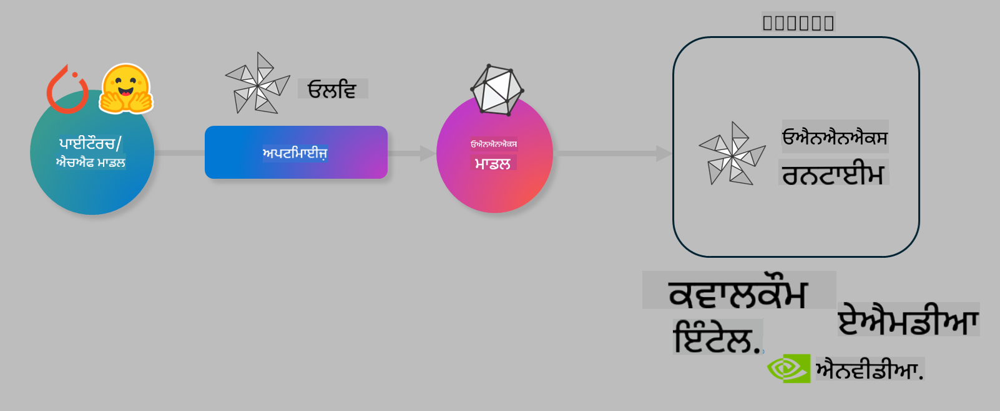

<!--
CO_OP_TRANSLATOR_METADATA:
{
  "original_hash": "6bbe47de3b974df7eea29dfeccf6032b",
  "translation_date": "2025-05-09T04:22:46+00:00",
  "source_file": "code/03.Finetuning/olive-lab/readme.md",
  "language_code": "pa"
}
-->
# Lab. Optimize AI models for on-device inference

## Introduction 

> [!IMPORTANT]
> ਇਸ ਲੈਬ ਲਈ **Nvidia A10 ਜਾਂ A100 GPU** ਨਾਲ ਸੰਬੰਧਤ ਡਰਾਈਵਰ ਅਤੇ CUDA ਟੂਲਕਿਟ (ਵਰਜਨ 12+) ਇੰਸਟਾਲ ਹੋਣਾ ਜ਼ਰੂਰੀ ਹੈ।

> [!NOTE]
> ਇਹ ਇੱਕ **35 ਮਿੰਟਾਂ ਦਾ** ਲੈਬ ਹੈ ਜੋ ਤੁਹਾਨੂੰ OLIVE ਦੀ ਵਰਤੋਂ ਕਰਕੇ ਮਾਡਲਾਂ ਨੂੰ on-device inference ਲਈ optimize ਕਰਨ ਦੇ ਮੁੱਖ ਸੰਕਲਪਾਂ ਨਾਲ ਪਰਚੇ ਕਰਵਾਏਗਾ।

## Learning Objectives

ਇਸ ਲੈਬ ਦੇ ਅੰਤ ਤੱਕ, ਤੁਸੀਂ OLIVE ਦੀ ਵਰਤੋਂ ਕਰਕੇ:

- AWQ quantization ਮੈਥਡ ਨਾਲ AI ਮਾਡਲ ਨੂੰ Quantize ਕਰਨਾ ਸਿੱਖੋਗੇ।
- ਕਿਸੇ ਖਾਸ ਟਾਸਕ ਲਈ AI ਮਾਡਲ ਨੂੰ Fine-tune ਕਰਨਾ।
- ONNX Runtime ਤੇ ਪ੍ਰਭਾਵਸ਼ਾਲੀ on-device inference ਲਈ LoRA adapters (fine-tuned ਮਾਡਲ) ਬਣਾਉਣਾ।

### What is Olive

Olive (*O*NNX *live*) ਇੱਕ ਮਾਡਲ optimization toolkit ਹੈ ਜਿਸਦੇ ਨਾਲ CLI ਵੀ ਹੈ ਜੋ ਤੁਹਾਨੂੰ ONNX runtime +++https://onnxruntime.ai+++ ਲਈ ਮਾਡਲ ਭੇਜਣ ਦੀ ਸਹੂਲਤ ਦਿੰਦਾ ਹੈ, ਜਿੱਥੇ ਮਾਡਲ ਦੀ ਗੁਣਵੱਤਾ ਅਤੇ ਪ੍ਰਦਰਸ਼ਨ ਬਰਕਰਾਰ ਰਹਿੰਦਾ ਹੈ।



Olive ਦਾ input ਆਮ ਤੌਰ 'ਤੇ PyTorch ਜਾਂ Hugging Face ਮਾਡਲ ਹੁੰਦਾ ਹੈ ਅਤੇ output optimized ONNX ਮਾਡਲ ਹੁੰਦਾ ਹੈ ਜੋ ਕਿਸੇ ਡਿਵਾਈਸ (deployment target) ਉੱਤੇ ਚਲਾਇਆ ਜਾਂਦਾ ਹੈ ਜਿਸ 'ਤੇ ONNX runtime ਹੁੰਦਾ ਹੈ। Olive ਮਾਡਲ ਨੂੰ ਉਸ deployment target ਦੇ AI accelerator (NPU, GPU, CPU) ਲਈ optimize ਕਰਦਾ ਹੈ, ਜੋ Qualcomm, AMD, Nvidia ਜਾਂ Intel ਵਰਗੇ hardware vendor ਵੱਲੋਂ ਪ੍ਰਦਾਨ ਕੀਤਾ ਗਿਆ ਹੁੰਦਾ ਹੈ।

Olive ਇੱਕ *workflow* ਚਲਾਉਂਦਾ ਹੈ, ਜੋ ਕਿ ਇੱਕ ordered sequence ਹੁੰਦਾ ਹੈ ਵਿਅਕਤੀਗਤ ਮਾਡਲ optimization ਟਾਸਕਾਂ ਦਾ ਜਿਨ੍ਹਾਂ ਨੂੰ *passes* ਕਿਹਾ ਜਾਂਦਾ ਹੈ - ਉਦਾਹਰਣ ਲਈ: ਮਾਡਲ compression, graph capture, quantization, graph optimization। ਹਰ pass ਦੇ ਕੁਝ parameters ਹੁੰਦੇ ਹਨ ਜਿਨ੍ਹਾਂ ਨੂੰ tune ਕਰਕੇ accuracy ਅਤੇ latency ਵਰਗੇ ਮੈਟਰਿਕਸ ਬਿਹਤਰ ਬਣਾਏ ਜਾਂਦੇ ਹਨ ਜੋ evaluator ਵੱਲੋਂ ਮਾਪੇ ਜਾਂਦੇ ਹਨ। Olive ਇੱਕ search strategy ਵਰਤਦਾ ਹੈ ਜੋ ਹਰ pass ਨੂੰ ਇੱਕ-ਇੱਕ ਕਰਕੇ ਜਾਂ ਕੁਝ passes ਨੂੰ ਇਕੱਠੇ auto-tune ਕਰਦਾ ਹੈ।

#### Benefits of Olive

- **ਹੱਥੋਂ-ਹੱਥ ਟ੍ਰਾਇਲ-ਐਂਡ-ਐਰਰ manual experimentation ਦੀ ਥਕਾਵਟ ਅਤੇ ਸਮਾਂ ਘਟਾਓ** graph optimization, compression ਅਤੇ quantization ਲਈ ਵੱਖ-ਵੱਖ ਤਕਨੀਕਾਂ ਨਾਲ। ਆਪਣੀ ਗੁਣਵੱਤਾ ਅਤੇ ਪ੍ਰਦਰਸ਼ਨ ਦੀਆਂ ਸੀਮਾਵਾਂ ਨਿਰਧਾਰਤ ਕਰੋ ਅਤੇ Olive ਨੂੰ ਬਿਹਤਰ ਮਾਡਲ ਖੋਜਣ ਦਿਓ।
- **40+ built-in ਮਾਡਲ optimization components** ਜੋ cutting edge quantization, compression, graph optimization ਅਤੇ finetuning ਤਕਨੀਕਾਂ ਨੂੰ ਕਵਰ ਕਰਦੇ ਹਨ।
- ਆਮ ਮਾਡਲ optimization ਟਾਸਕਾਂ ਲਈ **ਸੌਖਾ CLI**। ਉਦਾਹਰਣ ਵਜੋਂ, olive quantize, olive auto-opt, olive finetune।
- ਮਾਡਲ ਪੈਕੇਜਿੰਗ ਅਤੇ ਡਿਪਲੋਇਮੈਂਟ built-in।
- **Multi LoRA serving** ਲਈ ਮਾਡਲ ਬਣਾਉਣ ਦੀ ਸਹੂਲਤ।
- YAML/JSON ਦੀ ਵਰਤੋਂ ਕਰਕੇ workflows ਬਣਾਓ ਜੋ ਮਾਡਲ optimization ਅਤੇ deployment ਟਾਸਕਾਂ ਨੂੰ ਸੰਚਾਲਿਤ ਕਰਦੇ ਹਨ।
- **Hugging Face** ਅਤੇ **Azure AI** ਇੰਟੀਗ੍ਰੇਸ਼ਨ।
- built-in **caching** ਮਕੈਨਿਜ਼ਮ ਜੋ **ਲਾਗਤਾਂ ਬਚਾਉਂਦਾ ਹੈ**।

## Lab Instructions
> [!NOTE]
> ਕਿਰਪਾ ਕਰਕੇ ਯਕੀਨੀ ਬਣਾਓ ਕਿ ਤੁਸੀਂ ਆਪਣਾ Azure AI Hub ਅਤੇ Project ਪ੍ਰੋਵਾਈਜ਼ਨ ਕੀਤਾ ਹੈ ਅਤੇ Lab 1 ਅਨੁਸਾਰ ਆਪਣਾ A100 compute ਸੈੱਟਅਪ ਕੀਤਾ ਹੈ।

### Step 0: Connect to your Azure AI Compute

ਤੁਸੀਂ **VS Code** ਦੇ remote feature ਦੀ ਵਰਤੋਂ ਕਰਕੇ Azure AI compute ਨਾਲ ਜੁੜੋਗੇ।

1. ਆਪਣਾ **VS Code** ਡੈਸਕਟਾਪ ਐਪ ਖੋਲ੍ਹੋ:
1. **Shift+Ctrl+P** ਨਾਲ **command palette** ਖੋਲ੍ਹੋ
1. command palette ਵਿੱਚ ਖੋਜੋ **AzureML - remote: Connect to compute instance in New Window**।
1. ਸਕ੍ਰੀਨ 'ਤੇ ਦਿੱਤੇ ਹਦਾਇਤਾਂ ਦਾ ਪਾਲਣ ਕਰੋ, ਜਿਸ ਵਿੱਚ ਆਪਣੀ Azure Subscription, Resource Group, Project ਅਤੇ Lab 1 ਵਿੱਚ ਬਣਾਇਆ Compute ਨਾਮ ਚੁਣਨਾ ਸ਼ਾਮਲ ਹੈ।
1. ਜਦੋਂ ਤੁਸੀਂ Azure ML Compute node ਨਾਲ ਜੁੜ ਜਾਵੋਗੇ ਤਾਂ ਇਹ **Visual Code ਦੇ ਹੇਠਾਂ ਖੱਬੇ ਕੋਨੇ** ਵਿੱਚ ਦਿਖਾਈ ਦੇਵੇਗਾ `><Azure ML: Compute Name`

### Step 1: Clone this repo

VS Code ਵਿੱਚ, ਨਵਾਂ terminal ਖੋਲ੍ਹਣ ਲਈ **Ctrl+J** ਦਬਾਓ ਅਤੇ ਇਸ repo ਨੂੰ clone ਕਰੋ:

Terminal ਵਿੱਚ ਤੁਹਾਨੂੰ prompt ਵੇਖਾਈ ਦੇਵੇਗਾ

```
azureuser@computername:~/cloudfiles/code$ 
```
Clone the solution 

```bash
cd ~/localfiles
git clone https://github.com/microsoft/phi-3cookbook.git
```

### Step 2: Open Folder in VS Code

ਸੰਬੰਧਿਤ ਫੋਲਡਰ ਵਿੱਚ VS Code ਖੋਲ੍ਹਣ ਲਈ terminal ਵਿੱਚ ਹੇਠਾਂ ਦਿੱਤਾ ਕਮਾਂਡ ਚਲਾਓ, ਜੋ ਨਵੀਂ window ਖੋਲ੍ਹੇਗਾ:

```bash
code phi-3cookbook/code/04.Finetuning/Olive-lab
```

ਵਿਕਲਪ ਵਜੋਂ, ਤੁਸੀਂ **File** > **Open Folder** ਚੁਣ ਕੇ ਵੀ ਫੋਲਡਰ ਖੋਲ੍ਹ ਸਕਦੇ ਹੋ।

### Step 3: Dependencies

VS Code ਵਿੱਚ ਆਪਣੀ Azure AI Compute Instance ਵਿੱਚ terminal ਖੋਲ੍ਹੋ (ਟਿੱਪ: **Ctrl+J**) ਅਤੇ dependencies ਇੰਸਟਾਲ ਕਰਨ ਲਈ ਹੇਠਾਂ ਦਿੱਤੇ ਕਮਾਂਡ ਚਲਾਓ:

```bash
conda create -n olive-ai python=3.11 -y
conda activate olive-ai
pip install -r requirements.txt
az extension remove -n azure-cli-ml
az extension add -n ml
```

> [!NOTE]
> ਸਾਰੇ dependencies ਇੰਸਟਾਲ ਕਰਨ ਵਿੱਚ ਲਗਭਗ ~5 ਮਿੰਟ ਲੱਗਣਗੇ।

ਇਸ ਲੈਬ ਵਿੱਚ ਤੁਸੀਂ ਮਾਡਲਾਂ ਨੂੰ Azure AI Model catalog ਤੋਂ ਡਾਊਨਲੋਡ ਅਤੇ ਅਪਲੋਡ ਕਰੋਗੇ। ਮਾਡਲ ਕੈਟਾਲੌਗ ਤੱਕ ਪਹੁੰਚ ਲਈ, ਤੁਹਾਨੂੰ Azure ਵਿੱਚ login ਕਰਨਾ ਪਵੇਗਾ:

```bash
az login
```

> [!NOTE]
> ਲੌਗਿਨ ਸਮੇਂ ਤੁਹਾਨੂੰ ਆਪਣੀ subscription ਚੁਣਣ ਲਈ ਕਿਹਾ ਜਾਵੇਗਾ। ਯਕੀਨੀ ਬਣਾਓ ਕਿ ਤੁਸੀਂ ਇਸ ਲੈਬ ਲਈ ਦਿੱਤੀ subscription ਚੁਣੀ ਹੈ।

### Step 4: Execute Olive commands 

VS Code ਵਿੱਚ ਆਪਣੀ Azure AI Compute Instance ਵਿੱਚ terminal ਖੋਲ੍ਹੋ (ਟਿੱਪ: **Ctrl+J**) ਅਤੇ `olive-ai` conda environment ਨੂੰ activate ਕਰੋ:

```bash
conda activate olive-ai
```

ਫਿਰ, ਹੇਠਾਂ ਦਿੱਤੇ Olive commands ਕਮਾਂਡ ਲਾਈਨ 'ਤੇ ਚਲਾਓ।

1. **ਡੇਟਾ ਦਾ ਨਿਰੀਖਣ ਕਰੋ:** ਇਸ ਉਦਾਹਰਣ ਵਿੱਚ, ਤੁਸੀਂ Phi-3.5-Mini ਮਾਡਲ ਨੂੰ fine-tune ਕਰ ਰਹੇ ਹੋ ਤਾਂ ਜੋ ਇਹ ਯਾਤਰਾ ਸਬੰਧੀ ਸਵਾਲਾਂ ਦੇ ਜਵਾਬ ਦੇਣ ਵਿੱਚ ਮਾਹਿਰ ਹੋ ਜਾਵੇ। ਹੇਠਾਂ ਦਿੱਤਾ ਕੋਡ ਡੇਟਾਸੇਟ ਦੇ ਪਹਿਲੇ ਕੁਝ ਰਿਕਾਰਡ ਦਿਖਾਉਂਦਾ ਹੈ, ਜੋ JSON lines ਫਾਰਮੈਟ ਵਿੱਚ ਹਨ:
   
    ```bash
    head data/data_sample_travel.jsonl
    ```
1. **ਮਾਡਲ ਨੂੰ Quantize ਕਰੋ:** ਮਾਡਲ ਨੂੰ train ਕਰਨ ਤੋਂ ਪਹਿਲਾਂ, ਤੁਸੀਂ ਹੇਠਾਂ ਦਿੱਤਾ ਕਮਾਂਡ ਚਲਾ ਕੇ AWQ (Active Aware Quantization) ਤਕਨੀਕ ਵਰਤ ਕੇ ਮਾਡਲ ਨੂੰ quantize ਕਰੋਗੇ +++https://arxiv.org/abs/2306.00978+++. AWQ ਮਾਡਲ ਦੇ ਵਜ਼ਨਾਂ ਨੂੰ quantize ਕਰਦਾ ਹੈ ਜਿਸ ਵਿੱਚ inference ਦੌਰਾਨ ਬਣੇ activation ਨੂੰ ਧਿਆਨ ਵਿੱਚ ਰੱਖਿਆ ਜਾਂਦਾ ਹੈ। ਇਸਦਾ ਮਤਲਬ ਹੈ ਕਿ quantization ਪ੍ਰਕਿਰਿਆ ਵਿੱਚ ਅਸਲ ਡੇਟਾ distribution ਨੂੰ ਧਿਆਨ ਵਿੱਚ ਰੱਖਿਆ ਜਾਂਦਾ ਹੈ, ਜਿਸ ਨਾਲ ਮਾਡਲ ਦੀ accuracy ਬਿਹਤਰ ਬਣੀ ਰਹਿੰਦੀ ਹੈ ਤੁਲਨਾਤਮਕ ਤੌਰ 'ਤੇ ਰਵਾਇਤੀ weight quantization ਮੈਥਡਾਂ ਨਾਲੋਂ।
    
    ```bash
    olive quantize \
       --model_name_or_path microsoft/Phi-3.5-mini-instruct \
       --trust_remote_code \
       --algorithm awq \
       --output_path models/phi/awq \
       --log_level 1
    ```
    
    AWQ quantization ਮੁਕੰਮਲ ਹੋਣ ਵਿੱਚ ਲਗਭਗ **~8 ਮਿੰਟ** ਲੱਗਦੇ ਹਨ, ਜੋ ਮਾਡਲ ਦਾ ਆਕਾਰ **~7.5GB ਤੋਂ ~2.5GB** ਤੱਕ ਘਟਾਉਂਦਾ ਹੈ।
   
   ਇਸ ਲੈਬ ਵਿੱਚ ਅਸੀਂ ਦਿਖਾ ਰਹੇ ਹਾਂ ਕਿ ਕਿਵੇਂ Hugging Face ਤੋਂ ਮਾਡਲ (ਜਿਵੇਂ: `microsoft/Phi-3.5-mini-instruct`). However, Olive also allows you to input models from the Azure AI catalog by updating the `model_name_or_path` argument to an Azure AI asset ID (for example:  `azureml://registries/azureml/models/Phi-3.5-mini-instruct/versions/4`). 

1. **Train the model:** Next, the `olive finetune` ਕਮਾਂਡ quantized ਮਾਡਲ ਨੂੰ fine-tune ਕਰਦੀ ਹੈ। ਮਾਡਲ ਨੂੰ fine-tune ਕਰਨ ਤੋਂ ਪਹਿਲਾਂ quantize ਕਰਨ ਨਾਲ ਬਿਹਤਰ accuracy ਮਿਲਦੀ ਹੈ ਕਿਉਂਕਿ fine-tuning quantization ਨਾਲ ਹੋਏ ਕੁਝ ਨੁਕਸਾਨ ਨੂੰ ਵਾਪਸ ਲਿਆਉਂਦਾ ਹੈ।
    
    ```bash
    olive finetune \
        --method lora \
        --model_name_or_path models/phi/awq \
        --data_files "data/data_sample_travel.jsonl" \
        --data_name "json" \
        --text_template "<|user|>\n{prompt}<|end|>\n<|assistant|>\n{response}<|end|>" \
        --max_steps 100 \
        --output_path ./models/phi/ft \
        --log_level 1
    ```
    
    Fine-tuning (100 steps ਨਾਲ) ਮੁਕੰਮਲ ਹੋਣ ਵਿੱਚ ਲਗਭਗ **~6 ਮਿੰਟ** ਲੱਗਦੇ ਹਨ।

1. **Optimize ਕਰੋ:** ਮਾਡਲ train ਹੋਣ ਤੋਂ ਬਾਅਦ, ਤੁਸੀਂ Olive ਦੇ `auto-opt` command, which will capture the ONNX graph and automatically perform a number of optimizations to improve the model performance for CPU by compressing the model and doing fusions. It should be noted, that you can also optimize for other devices such as NPU or GPU by just updating the `--device` and `--provider` arguments ਦੀ ਵਰਤੋਂ ਕਰਕੇ ਮਾਡਲ ਨੂੰ optimize ਕਰੋਗੇ - ਪਰ ਇਸ ਲੈਬ ਲਈ ਅਸੀਂ CPU ਦੀ ਵਰਤੋਂ ਕਰਾਂਗੇ।

    ```bash
    olive auto-opt \
       --model_name_or_path models/phi/ft/model \
       --adapter_path models/phi/ft/adapter \
       --device cpu \
       --provider CPUExecutionProvider \
       --use_ort_genai \
       --output_path models/phi/onnx-ao \
       --log_level 1
    ```
    
    Optimization ਮੁਕੰਮਲ ਹੋਣ ਵਿੱਚ ਲਗਭਗ **~5 ਮਿੰਟ** ਲੱਗਦੇ ਹਨ।

### Step 5: Model inference quick test

ਮਾਡਲ ਦੀ inference ਟੈਸਟ ਕਰਨ ਲਈ, ਆਪਣੇ ਫੋਲਡਰ ਵਿੱਚ **app.py** ਨਾਮ ਦਾ Python ਫਾਇਲ ਬਣਾਓ ਅਤੇ ਹੇਠਾਂ ਦਿੱਤਾ ਕੋਡ copy-paste ਕਰੋ:

```python
import onnxruntime_genai as og
import numpy as np

print("loading model and adapters...", end="", flush=True)
model = og.Model("models/phi/onnx-ao/model")
adapters = og.Adapters(model)
adapters.load("models/phi/onnx-ao/model/adapter_weights.onnx_adapter", "travel")
print("DONE!")

tokenizer = og.Tokenizer(model)
tokenizer_stream = tokenizer.create_stream()

params = og.GeneratorParams(model)
params.set_search_options(max_length=100, past_present_share_buffer=False)
user_input = "what is the best thing to see in chicago"
params.input_ids = tokenizer.encode(f"<|user|>\n{user_input}<|end|>\n<|assistant|>\n")

generator = og.Generator(model, params)

generator.set_active_adapter(adapters, "travel")

print(f"{user_input}")

while not generator.is_done():
    generator.compute_logits()
    generator.generate_next_token()

    new_token = generator.get_next_tokens()[0]
    print(tokenizer_stream.decode(new_token), end='', flush=True)

print("\n")
```

ਕੋਡ ਚਲਾਉਣ ਲਈ:

```bash
python app.py
```

### Step 6: Upload model to Azure AI

ਮਾਡਲ ਨੂੰ Azure AI ਮਾਡਲ ਰਿਪੋਜ਼ਿਟਰੀ ਵਿੱਚ upload ਕਰਨ ਨਾਲ ਇਹ ਮਾਡਲ ਤੁਹਾਡੇ development ਟੀਮ ਦੇ ਹੋਰ ਮੈਂਬਰਾਂ ਨਾਲ ਸਾਂਝਾ ਹੋ ਸਕਦਾ ਹੈ ਅਤੇ ਮਾਡਲ ਦਾ version control ਵੀ ਸੰਭਾਲਿਆ ਜਾਂਦਾ ਹੈ। ਮਾਡਲ upload ਕਰਨ ਲਈ ਹੇਠਾਂ ਦਿੱਤਾ ਕਮਾਂਡ ਚਲਾਓ:

> [!NOTE]
> `{}` placeholders with the name of your resource group and Azure AI Project Name. 

To find your resource group `"resourceGroup"` ਅਤੇ Azure AI Project ਦਾ ਨਾਮ ਅਪਡੇਟ ਕਰੋ, ਫਿਰ ਹੇਠਾਂ ਦਿੱਤਾ ਕਮਾਂਡ ਚਲਾਓ

```
az ml workspace show
```

ਜਾਂ +++ai.azure.com+++ ਤੇ ਜਾ ਕੇ **management center** > **project** > **overview** ਚੁਣੋ।

`{}` placeholders ਨੂੰ ਆਪਣੇ resource group ਅਤੇ Azure AI Project Name ਨਾਲ ਭਰੋ।

```bash
az ml model create \
    --name ft-for-travel \
    --version 1 \
    --path ./models/phi/onnx-ao \
    --resource-group {RESOURCE_GROUP_NAME} \
    --workspace-name {PROJECT_NAME}
```

ਤੁਸੀਂ ਆਪਣਾ upload ਕੀਤਾ ਮਾਡਲ https://ml.azure.com/model/list 'ਤੇ ਵੇਖ ਸਕਦੇ ਹੋ ਅਤੇ deploy ਕਰ ਸਕਦੇ ਹੋ।

**ਅਸਵੀਕਾਰੋਪਣ**:  
ਇਹ ਦਸਤਾਵੇਜ਼ AI ਅਨੁਵਾਦ ਸੇਵਾ [Co-op Translator](https://github.com/Azure/co-op-translator) ਦੀ ਵਰਤੋਂ ਕਰਕੇ ਅਨੁਵਾਦਿਤ ਕੀਤਾ ਗਿਆ ਹੈ। ਜਦੋਂ ਕਿ ਅਸੀਂ ਸਹੀਅਤ ਲਈ ਕੋਸ਼ਿਸ਼ ਕਰਦੇ ਹਾਂ, ਕਿਰਪਾ ਕਰਕੇ ਧਿਆਨ ਵਿੱਚ ਰੱਖੋ ਕਿ ਆਟੋਮੈਟਿਕ ਅਨੁਵਾਦਾਂ ਵਿੱਚ ਗਲਤੀਆਂ ਜਾਂ ਅਸਮਰਥਤਾਵਾਂ ਹੋ ਸਕਦੀਆਂ ਹਨ। ਮੂਲ ਦਸਤਾਵੇਜ਼ ਆਪਣੀ ਮੂਲ ਭਾਸ਼ਾ ਵਿੱਚ ਅਧਿਕਾਰਕ ਸਰੋਤ ਮੰਨਿਆ ਜਾਣਾ ਚਾਹੀਦਾ ਹੈ। ਮਹੱਤਵਪੂਰਨ ਜਾਣਕਾਰੀ ਲਈ, ਪੇਸ਼ੇਵਰ ਮਨੁੱਖੀ ਅਨੁਵਾਦ ਦੀ ਸਿਫ਼ਾਰਸ਼ ਕੀਤੀ ਜਾਂਦੀ ਹੈ। ਅਸੀਂ ਇਸ ਅਨੁਵਾਦ ਦੀ ਵਰਤੋਂ ਤੋਂ ਉੱਪਜਣ ਵਾਲੀਆਂ ਕਿਸੇ ਵੀ ਗਲਤਫਹਮੀਆਂ ਜਾਂ ਗਲਤ ਵਿਆਖਿਆਵਾਂ ਲਈ ਜ਼ਿੰਮੇਵਾਰ ਨਹੀਂ ਹਾਂ।