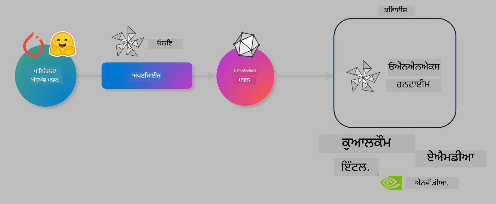

# ਲੈਬ। ਡਿਵਾਈਸ ‘ਤੇ ਇਨਫਰੰਸ ਲਈ AI ਮਾਡਲਾਂ ਨੂੰ ਅਪਟੀਮਾਈਜ਼ ਕਰੋ

## ਪਰਿਚਯ

> [!IMPORTANT]  
> ਇਸ ਲੈਬ ਲਈ **Nvidia A10 ਜਾਂ A100 GPU** ਅਤੇ ਸੰਬੰਧਿਤ ਡਰਾਈਵਰ ਅਤੇ CUDA ਟੂਲਕਿਟ (ਵਰਜਨ 12+) ਲੋੜੀਂਦੇ ਹਨ।

> [!NOTE]  
> ਇਹ ਇੱਕ **35 ਮਿੰਟਾਂ ਦੀ** ਲੈਬ ਹੈ ਜੋ ਤੁਹਾਨੂੰ OLIVE ਦੀ ਵਰਤੋਂ ਕਰਕੇ ਡਿਵਾਈਸ ‘ਤੇ ਇਨਫਰੰਸ ਲਈ ਮਾਡਲਾਂ ਨੂੰ ਅਪਟੀਮਾਈਜ਼ ਕਰਨ ਦੇ ਮੁੱਖ ਸਿਧਾਂਤਾਂ ਨਾਲ ਹੱਥੋਂ-ਹੱਥ ਜਾਣੂ ਕਰਵਾਏਗੀ।

## ਸਿੱਖਣ ਦੇ ਉਦੇਸ਼

ਇਸ ਲੈਬ ਦੇ ਅੰਤ ਤੱਕ, ਤੁਸੀਂ OLIVE ਦੀ ਵਰਤੋਂ ਕਰਕੇ:

- AWQ ਕਵਾਂਟਾਈਜ਼ੇਸ਼ਨ ਵਿਧੀ ਨਾਲ AI ਮਾਡਲ ਨੂੰ ਕਵਾਂਟਾਈਜ਼ ਕਰ ਸਕੋਗੇ।  
- ਕਿਸੇ ਖਾਸ ਕੰਮ ਲਈ AI ਮਾਡਲ ਨੂੰ ਫਾਈਨ-ਟਿਊਨ ਕਰ ਸਕੋਗੇ।  
- ONNX Runtime ‘ਤੇ ਪ੍ਰਭਾਵਸ਼ਾਲੀ ਡਿਵਾਈਸ ਇਨਫਰੰਸ ਲਈ LoRA ਐਡਾਪਟਰ (ਫਾਈਨ-ਟਿਊਨ ਕੀਤਾ ਮਾਡਲ) ਜਨਰੇਟ ਕਰ ਸਕੋਗੇ।  

### Olive ਕੀ ਹੈ

Olive (*O*NNX *live*) ਇੱਕ ਮਾਡਲ ਅਪਟੀਮਾਈਜ਼ੇਸ਼ਨ ਟੂਲਕਿਟ ਹੈ ਜਿਸ ਨਾਲ CLI ਵੀ ਮਿਲਦਾ ਹੈ ਜੋ ਤੁਹਾਨੂੰ ONNX runtime +++https://onnxruntime.ai+++ ਲਈ ਗੁਣਵੱਤਾ ਅਤੇ ਪ੍ਰਦਰਸ਼ਨ ਵਾਲੇ ਮਾਡਲ ਭੇਜਣ ਦੀ ਸਹੂਲਤ ਦਿੰਦਾ ਹੈ।



Olive ਦਾ ਇਨਪੁੱਟ ਆਮ ਤੌਰ ‘ਤੇ PyTorch ਜਾਂ Hugging Face ਮਾਡਲ ਹੁੰਦਾ ਹੈ ਅਤੇ ਆਉਟਪੁੱਟ ਇੱਕ ਅਪਟੀਮਾਈਜ਼ਡ ONNX ਮਾਡਲ ਹੁੰਦਾ ਹੈ ਜੋ ONNX runtime ਚਲਾਉਂਦੇ ਡਿਵਾਈਸ (ਡਿਪਲੋਇਮੈਂਟ ਟਾਰਗੇਟ) ‘ਤੇ ਚਲਾਇਆ ਜਾਂਦਾ ਹੈ। Olive ਮਾਡਲ ਨੂੰ ਡਿਪਲੋਇਮੈਂਟ ਟਾਰਗੇਟ ਦੇ AI ਐਕਸੇਲੇਰੇਟਰ (NPU, GPU, CPU) ਲਈ ਅਪਟੀਮਾਈਜ਼ ਕਰੇਗਾ, ਜੋ Qualcomm, AMD, Nvidia ਜਾਂ Intel ਵਰਗੇ ਹਾਰਡਵੇਅਰ ਵੇਂਡਰ ਵੱਲੋਂ ਪ੍ਰਦਾਨ ਕੀਤਾ ਜਾਂਦਾ ਹੈ।

Olive ਇੱਕ *workflow* ਚਲਾਉਂਦਾ ਹੈ, ਜੋ ਕਿ ਵਿਅਕਤੀਗਤ ਮਾਡਲ ਅਪਟੀਮਾਈਜ਼ੇਸ਼ਨ ਟਾਸਕਾਂ ਦੀ ਇੱਕ ਕ੍ਰਮਬੱਧ ਲੜੀ ਹੁੰਦੀ ਹੈ, ਜਿਸਨੂੰ *passes* ਕਹਿੰਦੇ ਹਨ - ਉਦਾਹਰਨ ਵਜੋਂ: ਮਾਡਲ ਕੰਪ੍ਰੈਸ਼ਨ, ਗ੍ਰਾਫ ਕੈਪਚਰ, ਕਵਾਂਟਾਈਜ਼ੇਸ਼ਨ, ਗ੍ਰਾਫ ਅਪਟੀਮਾਈਜ਼ੇਸ਼ਨ। ਹਰ ਪਾਸ ਦੇ ਕੁਝ ਪੈਰਾਮੀਟਰ ਹੁੰਦੇ ਹਨ ਜਿਨ੍ਹਾਂ ਨੂੰ ਬਿਹਤਰ ਮੈਟ੍ਰਿਕਸ, ਜਿਵੇਂ ਕਿ ਸਹੀਅਤ ਅਤੇ ਲੇਟੈਂਸੀ, ਪ੍ਰਾਪਤ ਕਰਨ ਲਈ ਟਿਊਨ ਕੀਤਾ ਜਾ ਸਕਦਾ ਹੈ। Olive ਇੱਕ ਖੋਜ ਰਣਨੀਤੀ ਵਰਤਦਾ ਹੈ ਜੋ ਹਰ ਪਾਸ ਨੂੰ ਇੱਕ-ਇੱਕ ਕਰਕੇ ਜਾਂ ਪਾਸਾਂ ਦੇ ਸਮੂਹ ਨੂੰ ਆਟੋ-ਟਿਊਨ ਕਰਨ ਲਈ ਖੋਜ ਅਲਗੋਰਿਦਮ ਦੀ ਵਰਤੋਂ ਕਰਦਾ ਹੈ।

#### Olive ਦੇ ਫਾਇਦੇ

- ਗ੍ਰਾਫ ਅਪਟੀਮਾਈਜ਼ੇਸ਼ਨ, ਕੰਪ੍ਰੈਸ਼ਨ ਅਤੇ ਕਵਾਂਟਾਈਜ਼ੇਸ਼ਨ ਲਈ ਵੱਖ-ਵੱਖ ਤਕਨੀਕਾਂ ਨਾਲ ਹੱਥੋਂ-ਹੱਥ ਟ੍ਰਾਇਲ-ਐਂਡ-ਐਰਰ ਮੈਨੂਅਲ ਪ੍ਰਯੋਗ ਦੇ ਸਮੇਂ ਅਤੇ ਨਿਰਾਸ਼ਾ ਨੂੰ ਘਟਾਓ। ਆਪਣੀ ਗੁਣਵੱਤਾ ਅਤੇ ਪ੍ਰਦਰਸ਼ਨ ਦੀਆਂ ਸੀਮਾਵਾਂ ਨਿਰਧਾਰਤ ਕਰੋ ਅਤੇ Olive ਤੁਹਾਡੇ ਲਈ ਸਭ ਤੋਂ ਵਧੀਆ ਮਾਡਲ ਖੋਜ ਲਵੇਗਾ।  
- **40+ ਬਿਲਟ-ਇਨ ਮਾਡਲ ਅਪਟੀਮਾਈਜ਼ੇਸ਼ਨ ਕੰਪੋਨੈਂਟ** ਜੋ ਕਵਾਂਟਾਈਜ਼ੇਸ਼ਨ, ਕੰਪ੍ਰੈਸ਼ਨ, ਗ੍ਰਾਫ ਅਪਟੀਮਾਈਜ਼ੇਸ਼ਨ ਅਤੇ ਫਾਈਨ-ਟਿਊਨਿੰਗ ਵਿੱਚ ਅਗਲੇ ਪੱਧਰ ਦੀਆਂ ਤਕਨੀਕਾਂ ਨੂੰ ਕਵਰ ਕਰਦੇ ਹਨ।  
- ਆਮ ਮਾਡਲ ਅਪਟੀਮਾਈਜ਼ੇਸ਼ਨ ਟਾਸਕਾਂ ਲਈ ਆਸਾਨ CLI, ਜਿਵੇਂ olive quantize, olive auto-opt, olive finetune।  
- ਮਾਡਲ ਪੈਕੇਜਿੰਗ ਅਤੇ ਡਿਪਲੋਇਮੈਂਟ ਬਿਲਟ-ਇਨ।  
- **ਮਲਟੀ LoRA ਸਰਵਿੰਗ** ਲਈ ਮਾਡਲ ਜਨਰੇਟ ਕਰਨ ਦਾ ਸਮਰਥਨ।  
- YAML/JSON ਦੀ ਵਰਤੋਂ ਕਰਕੇ ਵਰਕਫਲੋ ਬਣਾਓ ਜੋ ਮਾਡਲ ਅਪਟੀਮਾਈਜ਼ੇਸ਼ਨ ਅਤੇ ਡਿਪਲੋਇਮੈਂਟ ਟਾਸਕਾਂ ਨੂੰ ਸੰਚਾਲਿਤ ਕਰਦਾ ਹੈ।  
- **Hugging Face** ਅਤੇ **Azure AI** ਇੰਟੀਗ੍ਰੇਸ਼ਨ।  
- ਲਾਗਤ ਬਚਾਉਣ ਲਈ ਬਿਲਟ-ਇਨ **ਕੈਸ਼ਿੰਗ** ਮਕੈਨਿਜ਼ਮ।  

## ਲੈਬ ਨਿਰਦੇਸ਼  
> [!NOTE]  
> ਕਿਰਪਾ ਕਰਕੇ ਯਕੀਨੀ ਬਣਾਓ ਕਿ ਤੁਸੀਂ ਆਪਣਾ Azure AI Hub ਅਤੇ ਪ੍ਰੋਜੈਕਟ ਪ੍ਰੋਵਾਈਜ਼ਨ ਕਰ ਚੁੱਕੇ ਹੋ ਅਤੇ Lab 1 ਅਨੁਸਾਰ ਆਪਣਾ A100 ਕੰਪਿਊਟ ਸੈੱਟਅਪ ਕੀਤਾ ਹੈ।

### ਕਦਮ 0: ਆਪਣੇ Azure AI ਕੰਪਿਊਟ ਨਾਲ ਜੁੜੋ

ਤੁਸੀਂ **VS Code** ਵਿੱਚ ਰਿਮੋਟ ਫੀਚਰ ਦੀ ਵਰਤੋਂ ਕਰਕੇ Azure AI ਕੰਪਿਊਟ ਨਾਲ ਜੁੜੋਗੇ।

1. ਆਪਣਾ **VS Code** ਡੈਸਕਟਾਪ ਐਪ ਖੋਲ੍ਹੋ।  
2. **Shift+Ctrl+P** ਨਾਲ ਕਮਾਂਡ ਪੈਲੇਟ ਖੋਲ੍ਹੋ।  
3. ਕਮਾਂਡ ਪੈਲੇਟ ਵਿੱਚ **AzureML - remote: Connect to compute instance in New Window** ਖੋਜੋ।  
4. ਸਕ੍ਰੀਨ ‘ਤੇ ਦਿੱਤੇ ਨਿਰਦੇਸ਼ਾਂ ਦੀ ਪਾਲਣਾ ਕਰਦੇ ਹੋਏ ਕੰਪਿਊਟ ਨਾਲ ਜੁੜੋ। ਇਸ ਵਿੱਚ ਤੁਹਾਡੇ Azure ਸਬਸਕ੍ਰਿਪਸ਼ਨ, ਰਿਸੋਰਸ ਗਰੁੱਪ, ਪ੍ਰੋਜੈਕਟ ਅਤੇ Lab 1 ਵਿੱਚ ਸੈੱਟ ਕੀਤਾ ਕੰਪਿਊਟ ਨਾਮ ਚੁਣਨਾ ਸ਼ਾਮਲ ਹੈ।  
5. ਜਦੋਂ ਤੁਸੀਂ Azure ML ਕੰਪਿਊਟ ਨੋਡ ਨਾਲ ਜੁੜ ਜਾਵੋਗੇ, ਤਾਂ ਇਹ **Visual Code ਦੇ ਹੇਠਲੇ ਖੱਬੇ ਕੋਨੇ** ‘ਤੇ `><Azure ML: Compute Name` ਵਜੋਂ ਦਿਖਾਈ ਦੇਵੇਗਾ।  

### ਕਦਮ 1: ਇਸ ਰਿਪੋ ਨੂੰ ਕਲੋਨ ਕਰੋ

VS Code ਵਿੱਚ, **Ctrl+J** ਨਾਲ ਨਵਾਂ ਟਰਮੀਨਲ ਖੋਲ੍ਹੋ ਅਤੇ ਇਸ ਰਿਪੋ ਨੂੰ ਕਲੋਨ ਕਰੋ:

ਟਰਮੀਨਲ ਵਿੱਚ ਤੁਹਾਨੂੰ ਪ੍ਰਾਂਪਟ ਵੇਖਾਈ ਦੇਵੇਗਾ

```
azureuser@computername:~/cloudfiles/code$ 
```  
ਸੋਲੂਸ਼ਨ ਕਲੋਨ ਕਰੋ  

```bash
cd ~/localfiles
git clone https://github.com/microsoft/phi-3cookbook.git
```

### ਕਦਮ 2: VS Code ਵਿੱਚ ਫੋਲਡਰ ਖੋਲ੍ਹੋ

ਸੰਬੰਧਿਤ ਫੋਲਡਰ ਵਿੱਚ VS Code ਖੋਲ੍ਹਣ ਲਈ ਟਰਮੀਨਲ ਵਿੱਚ ਹੇਠਾਂ ਦਿੱਤੀ ਕਮਾਂਡ ਚਲਾਓ, ਜੋ ਨਵੀਂ ਵਿੰਡੋ ਖੋਲ੍ਹੇਗੀ:

```bash
code phi-3cookbook/code/04.Finetuning/Olive-lab
```

ਵਿਕਲਪ ਵਜੋਂ, ਤੁਸੀਂ **File** > **Open Folder** ਚੁਣ ਕੇ ਵੀ ਫੋਲਡਰ ਖੋਲ੍ਹ ਸਕਦੇ ਹੋ।

### ਕਦਮ 3: Dependencies

VS Code ਵਿੱਚ ਆਪਣੇ Azure AI Compute ਇੰਸਟੈਂਸ ਵਿੱਚ ਟਰਮੀਨਲ ਖੋਲ੍ਹੋ (ਟਿੱਪ: **Ctrl+J**) ਅਤੇ dependencies ਇੰਸਟਾਲ ਕਰਨ ਲਈ ਹੇਠਾਂ ਦਿੱਤੀਆਂ ਕਮਾਂਡਾਂ ਚਲਾਓ:

```bash
conda create -n olive-ai python=3.11 -y
conda activate olive-ai
pip install -r requirements.txt
az extension remove -n azure-cli-ml
az extension add -n ml
```

> [!NOTE]  
> ਸਾਰੀਆਂ dependencies ਇੰਸਟਾਲ ਕਰਨ ਵਿੱਚ ਲਗਭਗ 5 ਮਿੰਟ ਲੱਗਣਗੇ।

ਇਸ ਲੈਬ ਵਿੱਚ ਤੁਸੀਂ ਮਾਡਲਾਂ ਨੂੰ Azure AI ਮਾਡਲ ਕੈਟਾਲੌਗ ਵਿੱਚ ਡਾਊਨਲੋਡ ਅਤੇ ਅਪਲੋਡ ਕਰੋਗੇ। ਇਸ ਲਈ ਮਾਡਲ ਕੈਟਾਲੌਗ ਤੱਕ ਪਹੁੰਚ ਲਈ, ਤੁਹਾਨੂੰ Azure ਵਿੱਚ ਲੌਗਿਨ ਕਰਨਾ ਪਵੇਗਾ:

```bash
az login
```

> [!NOTE]  
> ਲੌਗਿਨ ਸਮੇਂ ਤੁਹਾਨੂੰ ਆਪਣੀ ਸਬਸਕ੍ਰਿਪਸ਼ਨ ਚੁਣਨ ਲਈ ਕਿਹਾ ਜਾਵੇਗਾ। ਯਕੀਨੀ ਬਣਾਓ ਕਿ ਤੁਸੀਂ ਇਸ ਲੈਬ ਲਈ ਦਿੱਤੀ ਗਈ ਸਬਸਕ੍ਰਿਪਸ਼ਨ ਚੁਣੀ ਹੈ।  

### ਕਦਮ 4: Olive ਕਮਾਂਡਾਂ ਚਲਾਓ

VS Code ਵਿੱਚ ਆਪਣੇ Azure AI Compute ਇੰਸਟੈਂਸ ਵਿੱਚ ਟਰਮੀਨਲ ਖੋਲ੍ਹੋ (ਟਿੱਪ: **Ctrl+J**) ਅਤੇ ਯਕੀਨੀ ਬਣਾਓ ਕਿ `olive-ai` ਕੋਂਡਾ ਵਾਤਾਵਰਣ ਐਕਟੀਵੇਟ ਹੈ:

```bash
conda activate olive-ai
```

ਫਿਰ, ਹੇਠਾਂ ਦਿੱਤੀਆਂ Olive ਕਮਾਂਡਾਂ ਕਮਾਂਡ ਲਾਈਨ ‘ਤੇ ਚਲਾਓ।

1. **ਡਾਟਾ ਦੀ ਜਾਂਚ ਕਰੋ:** ਇਸ ਉਦਾਹਰਨ ਵਿੱਚ, ਤੁਸੀਂ Phi-3.5-Mini ਮਾਡਲ ਨੂੰ ਫਾਈਨ-ਟਿਊਨ ਕਰਨ ਜਾ ਰਹੇ ਹੋ ਤਾਂ ਜੋ ਇਹ ਯਾਤਰਾ ਸੰਬੰਧੀ ਸਵਾਲਾਂ ਦੇ ਜਵਾਬ ਦੇਣ ਵਿੱਚ ਮਾਹਿਰ ਹੋ ਜਾਵੇ। ਹੇਠਾਂ ਦਿੱਤਾ ਕੋਡ ਡਾਟਾਸੈੱਟ ਦੇ ਪਹਿਲੇ ਕੁਝ ਰਿਕਾਰਡ ਦਿਖਾਉਂਦਾ ਹੈ, ਜੋ JSON ਲਾਈਨ ਫਾਰਮੈਟ ਵਿੱਚ ਹਨ:

    ```bash
    head data/data_sample_travel.jsonl
    ```

2. **ਮਾਡਲ ਨੂੰ ਕਵਾਂਟਾਈਜ਼ ਕਰੋ:** ਮਾਡਲ ਨੂੰ ਟ੍ਰੇਨ ਕਰਨ ਤੋਂ ਪਹਿਲਾਂ, ਤੁਸੀਂ ਹੇਠਾਂ ਦਿੱਤੀ ਕਮਾਂਡ ਨਾਲ ਕਵਾਂਟਾਈਜ਼ ਕਰਦੇ ਹੋ ਜੋ Active Aware Quantization (AWQ) +++https://arxiv.org/abs/2306.00978+++ ਤਕਨੀਕ ਵਰਤਦੀ ਹੈ। AWQ ਮਾਡਲ ਦੇ ਵਜ਼ਨਾਂ ਨੂੰ ਕਵਾਂਟਾਈਜ਼ ਕਰਦਾ ਹੈ ਜੋ ਇਨਫਰੰਸ ਦੌਰਾਨ ਬਣੇ ਐਕਟੀਵੇਸ਼ਨਾਂ ਨੂੰ ਧਿਆਨ ਵਿੱਚ ਰੱਖਦਾ ਹੈ। ਇਸਦਾ ਮਤਲਬ ਹੈ ਕਿ ਕਵਾਂਟਾਈਜ਼ੇਸ਼ਨ ਪ੍ਰਕਿਰਿਆ ਐਕਟੀਵੇਸ਼ਨਾਂ ਵਿੱਚ ਅਸਲ ਡਾਟਾ ਵੰਡ ਨੂੰ ਧਿਆਨ ਵਿੱਚ ਰੱਖਦੀ ਹੈ, ਜਿਸ ਨਾਲ ਮਾਡਲ ਦੀ ਸਹੀਅਤ ਬਿਹਤਰ ਤਰੀਕੇ ਨਾਲ ਬਚਾਈ ਜਾਂਦੀ ਹੈ, ਜਿਵੇਂ ਕਿ ਰਵਾਇਤੀ ਵਜ਼ਨ ਕਵਾਂਟਾਈਜ਼ੇਸ਼ਨ ਤਰੀਕਿਆਂ ਨਾਲ ਨਹੀਂ ਹੁੰਦਾ।

    ```bash
    olive quantize \
       --model_name_or_path microsoft/Phi-3.5-mini-instruct \
       --trust_remote_code \
       --algorithm awq \
       --output_path models/phi/awq \
       --log_level 1
    ```

    AWQ ਕਵਾਂਟਾਈਜ਼ੇਸ਼ਨ ਨੂੰ ਪੂਰਾ ਕਰਨ ਵਿੱਚ ਲਗਭਗ **8 ਮਿੰਟ** ਲੱਗਦੇ ਹਨ, ਜੋ ਮਾਡਲ ਦਾ ਆਕਾਰ ਲਗਭਗ **7.5GB ਤੋਂ 2.5GB** ਤੱਕ ਘਟਾ ਦਿੰਦਾ ਹੈ।

    ਇਸ ਲੈਬ ਵਿੱਚ, ਅਸੀਂ ਤੁਹਾਨੂੰ ਦਿਖਾ ਰਹੇ ਹਾਂ ਕਿ ਕਿਵੇਂ Hugging Face ਤੋਂ ਮਾਡਲ ਇਨਪੁੱਟ ਕਰਦੇ ਹਨ (ਉਦਾਹਰਨ ਵਜੋਂ: `microsoft/Phi-3.5-mini-instruct`)। ਪਰ Olive ਤੁਹਾਨੂੰ Azure AI ਕੈਟਾਲੌਗ ਤੋਂ ਮਾਡਲ ਇਨਪੁੱਟ ਕਰਨ ਦੀ ਵੀ ਆਗਿਆ ਦਿੰਦਾ ਹੈ, ਜਦੋਂ ਤੁਸੀਂ `model_name_or_path` ਆਰਗੁਮੈਂਟ ਨੂੰ Azure AI ਐਸੈੱਟ ID ਨਾਲ ਅਪਡੇਟ ਕਰਦੇ ਹੋ (ਉਦਾਹਰਨ ਵਜੋਂ: `azureml://registries/azureml/models/Phi-3.5-mini-instruct/versions/4`)।

3. **ਮਾਡਲ ਨੂੰ ਟ੍ਰੇਨ ਕਰੋ:** ਫਿਰ, `olive finetune` ਕਮਾਂਡ ਕਵਾਂਟਾਈਜ਼ਡ ਮਾਡਲ ਨੂੰ ਫਾਈਨ-ਟਿਊਨ ਕਰਦੀ ਹੈ। ਮਾਡਲ ਨੂੰ ਫਾਈਨ-ਟਿਊਨ ਕਰਨ ਤੋਂ ਪਹਿਲਾਂ ਕਵਾਂਟਾਈਜ਼ ਕਰਨਾ ਬਿਹਤਰ ਸਹੀਅਤ ਦਿੰਦਾ ਹੈ ਕਿਉਂਕਿ ਫਾਈਨ-ਟਿਊਨਿੰਗ ਪ੍ਰਕਿਰਿਆ ਕਵਾਂਟਾਈਜ਼ੇਸ਼ਨ ਨਾਲ ਹੋਏ ਕੁਝ ਨੁਕਸਾਨ ਨੂੰ ਠੀਕ ਕਰਦੀ ਹੈ।

    ```bash
    olive finetune \
        --method lora \
        --model_name_or_path models/phi/awq \
        --data_files "data/data_sample_travel.jsonl" \
        --data_name "json" \
        --text_template "<|user|>\n{prompt}<|end|>\n<|assistant|>\n{response}<|end|>" \
        --max_steps 100 \
        --output_path ./models/phi/ft \
        --log_level 1
    ```

    ਫਾਈਨ-ਟਿਊਨਿੰਗ (100 ਕਦਮਾਂ ਨਾਲ) ਨੂੰ ਪੂਰਾ ਕਰਨ ਵਿੱਚ ਲਗਭਗ **6 ਮਿੰਟ** ਲੱਗਦੇ ਹਨ।

4. **ਅਪਟੀਮਾਈਜ਼ ਕਰੋ:** ਮਾਡਲ ਟ੍ਰੇਨ ਹੋਣ ਤੋਂ ਬਾਅਦ, ਤੁਸੀਂ Olive ਦੀ `auto-opt` ਕਮਾਂਡ ਨਾਲ ਮਾਡਲ ਨੂੰ ਅਪਟੀਮਾਈਜ਼ ਕਰਦੇ ਹੋ, ਜੋ ONNX ਗ੍ਰਾਫ ਕੈਪਚਰ ਕਰਦਾ ਹੈ ਅਤੇ ਮਾਡਲ ਦੇ ਪ੍ਰਦਰਸ਼ਨ ਨੂੰ ਸੁਧਾਰਨ ਲਈ ਕਈ ਅਪਟੀਮਾਈਜ਼ੇਸ਼ਨ ਕਰਦਾ ਹੈ, ਜਿਵੇਂ ਕਿ ਮਾਡਲ ਕੰਪ੍ਰੈਸ਼ਨ ਅਤੇ ਫਿਊਜ਼ਨ। ਇਹ ਧਿਆਨ ਵਿੱਚ ਰੱਖਣਾ ਚਾਹੀਦਾ ਹੈ ਕਿ ਤੁਸੀਂ `--device` ਅਤੇ `--provider` ਆਰਗੁਮੈਂਟ ਅਪਡੇਟ ਕਰਕੇ ਹੋਰ ਡਿਵਾਈਸਾਂ ਲਈ ਵੀ ਅਪਟੀਮਾਈਜ਼ ਕਰ ਸਕਦੇ ਹੋ, ਜਿਵੇਂ NPU ਜਾਂ GPU, ਪਰ ਇਸ ਲੈਬ ਲਈ ਅਸੀਂ CPU ਦੀ ਵਰਤੋਂ ਕਰਾਂਗੇ।

    ```bash
    olive auto-opt \
       --model_name_or_path models/phi/ft/model \
       --adapter_path models/phi/ft/adapter \
       --device cpu \
       --provider CPUExecutionProvider \
       --use_ort_genai \
       --output_path models/phi/onnx-ao \
       --log_level 1
    ```

    ਅਪਟੀਮਾਈਜ਼ੇਸ਼ਨ ਨੂੰ ਪੂਰਾ ਕਰਨ ਵਿੱਚ ਲਗਭਗ **5 ਮਿੰਟ** ਲੱਗਦੇ ਹਨ।

### ਕਦਮ 5: ਮਾਡਲ ਇਨਫਰੰਸ ਦਾ ਤੇਜ਼ ਟੈਸਟ

ਮਾਡਲ ਇਨਫਰੰਸ ਦੀ ਜਾਂਚ ਕਰਨ ਲਈ, ਆਪਣੇ ਫੋਲਡਰ ਵਿੱਚ ਇੱਕ Python ਫਾਇਲ ਬਣਾਓ ਜਿਸਦਾ ਨਾਮ **app.py** ਰੱਖੋ ਅਤੇ ਹੇਠਾਂ ਦਿੱਤਾ ਕੋਡ ਕਾਪੀ-ਪੇਸਟ ਕਰੋ:

```python
import onnxruntime_genai as og
import numpy as np

print("loading model and adapters...", end="", flush=True)
model = og.Model("models/phi/onnx-ao/model")
adapters = og.Adapters(model)
adapters.load("models/phi/onnx-ao/model/adapter_weights.onnx_adapter", "travel")
print("DONE!")

tokenizer = og.Tokenizer(model)
tokenizer_stream = tokenizer.create_stream()

params = og.GeneratorParams(model)
params.set_search_options(max_length=100, past_present_share_buffer=False)
user_input = "what is the best thing to see in chicago"
params.input_ids = tokenizer.encode(f"<|user|>\n{user_input}<|end|>\n<|assistant|>\n")

generator = og.Generator(model, params)

generator.set_active_adapter(adapters, "travel")

print(f"{user_input}")

while not generator.is_done():
    generator.compute_logits()
    generator.generate_next_token()

    new_token = generator.get_next_tokens()[0]
    print(tokenizer_stream.decode(new_token), end='', flush=True)

print("\n")
```

ਕੋਡ ਚਲਾਉਣ ਲਈ:

```bash
python app.py
```

### ਕਦਮ 6: ਮਾਡਲ ਨੂੰ Azure AI ‘ਤੇ ਅਪਲੋਡ ਕਰੋ

ਮਾਡਲ ਨੂੰ Azure AI ਮਾਡਲ ਰਿਪੋਜ਼ਿਟਰੀ ਵਿੱਚ ਅਪਲੋਡ ਕਰਨ ਨਾਲ ਮਾਡਲ ਤੁਹਾਡੇ ਵਿਕਾਸ ਟੀਮ ਦੇ ਹੋਰ ਮੈਂਬਰਾਂ ਨਾਲ ਸਾਂਝਾ ਕੀਤਾ ਜਾ ਸਕਦਾ ਹੈ ਅਤੇ ਮਾਡਲ ਦੇ ਵਰਜਨ ਕੰਟਰੋਲ ਨੂੰ ਵੀ ਸੰਭਾਲਿਆ ਜਾਂਦਾ ਹੈ। ਮਾਡਲ ਅਪਲੋਡ ਕਰਨ ਲਈ ਹੇਠਾਂ ਦਿੱਤੀ ਕਮਾਂਡ ਚਲਾਓ:

> [!NOTE]  
> `{}` ਪਲੇਸਹੋਲਡਰ ਨੂੰ ਆਪਣੇ ਰਿਸੋਰਸ ਗਰੁੱਪ ਅਤੇ Azure AI ਪ੍ਰੋਜੈਕਟ ਦੇ ਨਾਮ ਨਾਲ ਅਪਡੇਟ ਕਰੋ।

ਆਪਣਾ ਰਿਸੋਰਸ ਗਰੁੱਪ `"resourceGroup"` ਅਤੇ Azure AI ਪ੍ਰੋਜੈਕਟ ਨਾਮ ਲੱਭਣ ਲਈ ਹੇਠਾਂ ਦਿੱਤੀ ਕਮਾਂਡ ਚਲਾਓ:

```
az ml workspace show
```

ਜਾਂ +++ai.azure.com+++ ‘ਤੇ ਜਾ ਕੇ **management center** > **project** > **overview** ਚੁਣੋ।

`{}` ਪਲੇਸਹੋਲਡਰ ਨੂੰ ਆਪਣੇ ਰਿਸੋਰਸ ਗਰੁੱਪ ਅਤੇ Azure AI ਪ੍ਰੋਜੈਕਟ ਦੇ ਨਾਮ ਨਾਲ ਅਪਡੇਟ ਕਰੋ।

```bash
az ml model create \
    --name ft-for-travel \
    --version 1 \
    --path ./models/phi/onnx-ao \
    --resource-group {RESOURCE_GROUP_NAME} \
    --workspace-name {PROJECT_NAME}
```

ਤੁਸੀਂ ਆਪਣਾ ਅਪਲੋਡ ਕੀਤਾ ਮਾਡਲ ਵੇਖ ਸਕਦੇ ਹੋ ਅਤੇ https://ml.azure.com/model/list ‘ਤੇ ਮਾਡਲ ਡਿਪਲੋਇ ਕਰ ਸਕਦੇ ਹੋ।

**ਅਸਵੀਕਾਰੋਪਣ**:  
ਇਹ ਦਸਤਾਵੇਜ਼ AI ਅਨੁਵਾਦ ਸੇਵਾ [Co-op Translator](https://github.com/Azure/co-op-translator) ਦੀ ਵਰਤੋਂ ਕਰਕੇ ਅਨੁਵਾਦ ਕੀਤਾ ਗਿਆ ਹੈ। ਜਦੋਂ ਕਿ ਅਸੀਂ ਸਹੀਤਾ ਲਈ ਕੋਸ਼ਿਸ਼ ਕਰਦੇ ਹਾਂ, ਕਿਰਪਾ ਕਰਕੇ ਧਿਆਨ ਰੱਖੋ ਕਿ ਸਵੈਚਾਲਿਤ ਅਨੁਵਾਦਾਂ ਵਿੱਚ ਗਲਤੀਆਂ ਜਾਂ ਅਸਮਰਥਤਾਵਾਂ ਹੋ ਸਕਦੀਆਂ ਹਨ। ਮੂਲ ਦਸਤਾਵੇਜ਼ ਆਪਣੀ ਮੂਲ ਭਾਸ਼ਾ ਵਿੱਚ ਪ੍ਰਮਾਣਿਕ ਸਰੋਤ ਮੰਨਿਆ ਜਾਣਾ ਚਾਹੀਦਾ ਹੈ। ਮਹੱਤਵਪੂਰਨ ਜਾਣਕਾਰੀ ਲਈ, ਪੇਸ਼ੇਵਰ ਮਨੁੱਖੀ ਅਨੁਵਾਦ ਦੀ ਸਿਫਾਰਸ਼ ਕੀਤੀ ਜਾਂਦੀ ਹੈ। ਅਸੀਂ ਇਸ ਅਨੁਵਾਦ ਦੀ ਵਰਤੋਂ ਤੋਂ ਉਤਪੰਨ ਕਿਸੇ ਵੀ ਗਲਤਫਹਿਮੀ ਜਾਂ ਗਲਤ ਵਿਆਖਿਆ ਲਈ ਜ਼ਿੰਮੇਵਾਰ ਨਹੀਂ ਹਾਂ।