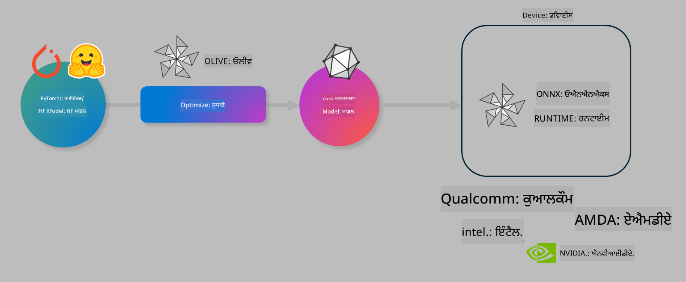

<!--
CO_OP_TRANSLATOR_METADATA:
{
  "original_hash": "6bbe47de3b974df7eea29dfeccf6032b",
  "translation_date": "2025-05-09T04:35:55+00:00",
  "source_file": "code/04.Finetuning/olive-lab/readme.md",
  "language_code": "pa"
}
-->
# Lab. Optimize AI models for on-device inference

## Introduction 

> [!IMPORTANT]
> ਇਸ ਲੈਬ ਲਈ **Nvidia A10 ਜਾਂ A100 GPU** ਨਾਲ ਸਬੰਧਿਤ ਡਰਾਈਵਰ ਅਤੇ CUDA ਟੂਲਕਿਟ (ਵਰਜ਼ਨ 12+) ਲੋੜੀਂਦੇ ਹਨ।

> [!NOTE]
> ਇਹ ਇੱਕ **35 ਮਿੰਟਾਂ ਦਾ** ਲੈਬ ਹੈ ਜੋ ਤੁਹਾਨੂੰ OLIVE ਦੀ ਵਰਤੋਂ ਕਰਕੇ ਮਾਡਲਾਂ ਨੂੰ on-device inference ਲਈ optimize ਕਰਨ ਦੇ ਮੁੱਖ ਸਿਧਾਂਤਾਂ ਦਾ ਹੱਥੋਂ-ਹੱਥ ਪਰਚਾਰ ਕਰਵਾਏਗਾ।

## Learning Objectives

ਇਸ ਲੈਬ ਦੇ ਅੰਤ ਵਿੱਚ, ਤੁਸੀਂ OLIVE ਦੀ ਵਰਤੋਂ ਕਰਕੇ:

- AWQ quantization ਮੈਥਡ ਨਾਲ AI ਮਾਡਲ ਨੂੰ Quantize ਕਰਨਾ ਸਿੱਖ ਜਾਵੋਗੇ।
- ਕਿਸੇ ਵਿਸ਼ੇਸ਼ ਟਾਸਕ ਲਈ AI ਮਾਡਲ ਨੂੰ Fine-tune ਕਰਨਾ ਸਿੱਖੋਗੇ।
- ONNX Runtime 'ਤੇ ਪ੍ਰਭਾਵਸ਼ਾਲੀ on-device inference ਲਈ LoRA adapters (fine-tuned ਮਾਡਲ) ਬਣਾਉਣਾ ਸਿੱਖੋਗੇ।

### What is Olive

Olive (*O*NNX *live*) ਇੱਕ ਮਾਡਲ optimization ਟੂਲਕਿਟ ਹੈ ਜਿਸਦੇ ਨਾਲ CLI ਵੀ ਹੁੰਦੀ ਹੈ ਜੋ ਤੁਹਾਨੂੰ ONNX runtime +++https://onnxruntime.ai+++ ਲਈ ਮਾਡਲਾਂ ਨੂੰ ਕੁਆਲਟੀ ਅਤੇ ਪਰਫਾਰਮੈਂਸ ਦੇ ਨਾਲ ship ਕਰਨ ਦੀ ਸਹੂਲਤ ਦਿੰਦੀ ਹੈ।



Olive ਵਿੱਚ ਆਮ ਤੌਰ 'ਤੇ PyTorch ਜਾਂ Hugging Face ਮਾਡਲ ਇੰਪੁੱਟ ਹੁੰਦਾ ਹੈ ਅਤੇ ਆਉਟਪੁੱਟ ਇੱਕ optimized ONNX ਮਾਡਲ ਹੁੰਦਾ ਹੈ ਜੋ ਕਿਸੇ ਡਿਵਾਈਸ (deployment target) 'ਤੇ ਚਲਾਇਆ ਜਾਂਦਾ ਹੈ ਜੋ ONNX runtime ਚਲਾ ਰਿਹਾ ਹੁੰਦਾ ਹੈ। Olive ਮਾਡਲ ਨੂੰ deployment target ਦੇ AI accelerator (NPU, GPU, CPU) ਲਈ optimize ਕਰਦਾ ਹੈ, ਜੋ ਕਿ Qualcomm, AMD, Nvidia ਜਾਂ Intel ਵਰਗੇ hardware vendor ਵੱਲੋਂ ਮੁਹੱਈਆ ਕਰਵਾਇਆ ਜਾਂਦਾ ਹੈ।

Olive ਇੱਕ *workflow* ਚਲਾਉਂਦਾ ਹੈ, ਜੋ ਕਿ ਅਨੁਕ੍ਰਮਿਕ ਮਾਡਲ optimization ਕੰਮਾਂ ਦੀ ਲੜੀ ਹੁੰਦੀ ਹੈ ਜਿਸਨੂੰ *passes* ਕਹਿੰਦੇ ਹਨ - ਉਦਾਹਰਨ ਲਈ: ਮਾਡਲ ਕੰਪ੍ਰੈਸ਼ਨ, ਗ੍ਰਾਫ ਕੈਪਚਰ, quantization, ਗ੍ਰਾਫ optimization। ਹਰ ਇੱਕ pass ਦੇ ਕੁਝ ਪੈਰਾਮੀਟਰ ਹੁੰਦੇ ਹਨ ਜੋ ਸਭ ਤੋਂ ਵਧੀਆ ਮੈਟ੍ਰਿਕਸ ਜਿਵੇਂ ਕਿ accuracy ਅਤੇ latency ਪ੍ਰਾਪਤ ਕਰਨ ਲਈ ਟਿਊਨ ਕੀਤੇ ਜਾ ਸਕਦੇ ਹਨ, ਜੋ ਵੱਖ-ਵੱਖ evaluator ਵੱਲੋਂ ਮਾਪੇ ਜਾਂਦੇ ਹਨ। Olive ਇੱਕ ਖੋਜ ਰਣਨੀਤੀ ਵਰਤਦਾ ਹੈ ਜੋ ਹਰ pass ਨੂੰ ਇੱਕ-ਇੱਕ ਕਰਕੇ ਜਾਂ ਕੁਝ passes ਨੂੰ ਇੱਕੱਠੇ auto-tune ਕਰਨ ਲਈ search algorithm ਦੀ ਵਰਤੋਂ ਕਰਦਾ ਹੈ।

#### Benefits of Olive

- **ਹੱਥੋਂ-ਹੱਥ ਟ੍ਰਾਇਲ-ਐਂਡ-ਐਰਰ ਦੇ ਸਮੇਂ ਅਤੇ ਝੰਝਟ ਨੂੰ ਘਟਾਓ** ਜੋ ਗ੍ਰਾਫ optimization, compression ਅਤੇ quantization ਦੀਆਂ ਵੱਖ-ਵੱਖ ਤਕਨੀਕਾਂ ਨਾਲ ਹੁੰਦੀ ਹੈ। ਆਪਣੀਆਂ ਕੁਆਲਟੀ ਅਤੇ ਪਰਫਾਰਮੈਂਸ ਦੀਆਂ ਸੀਮਾਵਾਂ ਤੈਅ ਕਰੋ ਅਤੇ Olive ਆਪਣੇ ਆਪ ਸਭ ਤੋਂ ਵਧੀਆ ਮਾਡਲ ਲੱਭੇਗਾ।
- **40+ built-in ਮਾਡਲ optimization ਕੰਪੋਨੈਂਟ** ਜੋ cutting edge quantization, compression, graph optimization ਅਤੇ finetuning ਤਕਨੀਕਾਂ ਨੂੰ ਕਵਰ ਕਰਦੇ ਹਨ।
- ਆਮ ਮਾਡਲ optimization ਟਾਸਕਾਂ ਲਈ ਆਸਾਨ CLI। ਉਦਾਹਰਨ ਵਜੋਂ, olive quantize, olive auto-opt, olive finetune।
- ਮਾਡਲ ਪੈਕੇਜਿੰਗ ਅਤੇ ਡਿਪਲੋਇਮੈਂਟ ਬਿਲਟ-ਇਨ।
- **Multi LoRA serving** ਲਈ ਮਾਡਲ ਬਣਾਉਣ ਦਾ ਸਮਰਥਨ।
- YAML/JSON ਵਰਤ ਕੇ workflow ਬਣਾਉਣਾ ਜੋ ਮਾਡਲ optimization ਅਤੇ ਡਿਪਲੋਇਮੈਂਟ ਟਾਸਕਾਂ ਨੂੰ ਆਰਕੀਟੈਕਟ ਕਰਦਾ ਹੈ।
- **Hugging Face** ਅਤੇ **Azure AI** ਨਾਲ ਇੰਟੀਗ੍ਰੇਸ਼ਨ।
- ਖਰਚਾ ਬਚਾਉਣ ਲਈ ਬਿਲਟ-ਇਨ **caching** ਮਕੈਨਿਜ਼ਮ।

## Lab Instructions
> [!NOTE]
> ਕਿਰਪਾ ਕਰਕੇ ਯਕੀਨੀ ਬਣਾਓ ਕਿ ਤੁਸੀਂ ਆਪਣਾ Azure AI Hub ਅਤੇ Project ਪ੍ਰੋਵਿਜ਼ਨ ਕਰ ਲਿਆ ਹੈ ਅਤੇ Lab 1 ਦੇ ਅਨੁਸਾਰ ਆਪਣਾ A100 compute ਸੈਟਅਪ ਕੀਤਾ ਹੈ।

### Step 0: Connect to your Azure AI Compute

ਤੁਸੀਂ **VS Code** ਦੀ remote ਫੀਚਰ ਦੀ ਵਰਤੋਂ ਕਰਕੇ Azure AI compute ਨਾਲ ਜੁੜੋਗੇ।

1. ਆਪਣਾ **VS Code** ਡੈਸਕਟਾਪ ਐਪਲੀਕੇਸ਼ਨ ਖੋਲ੍ਹੋ:
1. **Shift+Ctrl+P** ਨਾਲ **command palette** ਖੋਲ੍ਹੋ
1. command palette ਵਿੱਚ **AzureML - remote: Connect to compute instance in New Window** ਖੋਜੋ।
1. ਸਕ੍ਰੀਨ 'ਤੇ ਦਿੱਤੇ ਨਿਰਦੇਸ਼ਾਂ ਨੂੰ ਫਾਲੋ ਕਰਦੇ ਹੋਏ Compute ਨਾਲ ਜੁੜੋ। ਇਸ ਵਿੱਚ ਤੁਹਾਡੇ Azure Subscription, Resource Group, Project ਅਤੇ Lab 1 ਵਿੱਚ ਸੈਟ ਕੀਤਾ Compute ਨਾਮ ਚੁਣਨਾ ਸ਼ਾਮਿਲ ਹੈ।
1. ਜਦੋਂ ਤੁਸੀਂ Azure ML Compute ਨੋਡ ਨਾਲ ਜੁੜ ਜਾਂਦੇ ਹੋ, ਤਾਂ ਇਹ Visual Code ਦੇ **ਨੀਵੇਂ ਖੱਬੇ ਕੋਨੇ** ਵਿੱਚ ਦਿਖਾਈ ਦੇਵੇਗਾ `><Azure ML: Compute Name`

### Step 1: Clone this repo

VS Code ਵਿੱਚ, ਤੁਸੀਂ **Ctrl+J** ਨਾਲ ਨਵਾਂ ਟਰਮੀਨਲ ਖੋਲ੍ਹ ਕੇ ਇਸ repo ਨੂੰ clone ਕਰ ਸਕਦੇ ਹੋ:

ਟਰਮੀਨਲ ਵਿੱਚ ਤੁਹਾਨੂੰ ਪ੍ਰਾਂਪਟ ਵੇਖਾਈ ਦੇਵੇਗੀ

```
azureuser@computername:~/cloudfiles/code$ 
```
Clone the solution 

```bash
cd ~/localfiles
git clone https://github.com/microsoft/phi-3cookbook.git
```

### Step 2: Open Folder in VS Code

ਸੰਬੰਧਿਤ ਫੋਲਡਰ ਵਿੱਚ VS Code ਖੋਲ੍ਹਣ ਲਈ ਟਰਮੀਨਲ ਵਿੱਚ ਹੇਠਾਂ ਦਿੱਤਾ ਕਮਾਂਡ ਚਲਾਓ, ਜੋ ਨਵੀਂ ਵਿੰਡੋ ਖੋਲ੍ਹੇਗੀ:

```bash
code phi-3cookbook/code/04.Finetuning/Olive-lab
```

ਵਿਕਲਪਕ ਤੌਰ 'ਤੇ, ਤੁਸੀਂ **File** > **Open Folder** ਚੁਣ ਕੇ ਵੀ ਫੋਲਡਰ ਖੋਲ੍ਹ ਸਕਦੇ ਹੋ।

### Step 3: Dependencies

VS Code ਵਿੱਚ ਆਪਣੇ Azure AI Compute Instance ਵਿੱਚ ਟਰਮੀਨਲ ਖੋਲ੍ਹੋ (ਟਿਪ: **Ctrl+J**) ਅਤੇ dependencies ਇੰਸਟਾਲ ਕਰਨ ਲਈ ਹੇਠਾਂ ਦਿੱਤੇ ਕਮਾਂਡ ਚਲਾਓ:

```bash
conda create -n olive-ai python=3.11 -y
conda activate olive-ai
pip install -r requirements.txt
az extension remove -n azure-cli-ml
az extension add -n ml
```

> [!NOTE]
> ਸਾਰੇ dependencies ਇੰਸਟਾਲ ਕਰਨ ਵਿੱਚ ਲਗਭਗ ~5 ਮਿੰਟ ਲੱਗਣਗੇ।

ਇਸ ਲੈਬ ਵਿੱਚ ਤੁਸੀਂ ਮਾਡਲਾਂ ਨੂੰ Azure AI Model catalog ਵਿੱਚ ਡਾਊਨਲੋਡ ਅਤੇ ਅਪਲੋਡ ਕਰੋਗੇ। ਮਾਡਲ ਕੈਟਾਲੌਗ ਤੱਕ ਪਹੁੰਚਣ ਲਈ, ਤੁਹਾਨੂੰ Azure ਵਿੱਚ ਲੌਗਿਨ ਕਰਨਾ ਪਵੇਗਾ:

```bash
az login
```

> [!NOTE]
> ਲੌਗਿਨ ਸਮੇਂ ਤੁਹਾਨੂੰ ਆਪਣੀ subscription ਚੁਣਣ ਲਈ ਕਿਹਾ ਜਾਵੇਗਾ। ਯਕੀਨੀ ਬਣਾਓ ਕਿ ਤੁਸੀਂ ਇਸ ਲੈਬ ਲਈ ਦਿੱਤੀ subscription ਚੁਣੀ ਹੈ।

### Step 4: Execute Olive commands 

VS Code ਵਿੱਚ ਆਪਣੇ Azure AI Compute Instance ਵਿੱਚ ਟਰਮੀਨਲ ਖੋਲ੍ਹੋ (ਟਿਪ: **Ctrl+J**) ਅਤੇ ਯਕੀਨੀ ਬਣਾਓ ਕਿ `olive-ai` conda environment ਐਕਟੀਵੇਟ ਹੈ:

```bash
conda activate olive-ai
```

ਫਿਰ, ਹੇਠਾਂ ਦਿੱਤੇ Olive ਕਮਾਂਡ ਕਮਾਂਡ ਲਾਈਨ 'ਤੇ ਚਲਾਓ।

1. **ਡਾਟਾ ਦੀ ਜਾਂਚ ਕਰੋ:** ਇਸ ਉਦਾਹਰਨ ਵਿੱਚ, ਤੁਸੀਂ Phi-3.5-Mini ਮਾਡਲ ਨੂੰ travel ਸੰਬੰਧੀ ਸਵਾਲਾਂ ਦੇ ਜਵਾਬ ਦੇਣ ਲਈ ਫਾਈਨ-ਟਿਊਨ ਕਰ ਰਹੇ ਹੋ। ਹੇਠਾਂ ਦਿੱਤਾ ਕੋਡ ਡਾਟਾ ਸੈੱਟ ਦੇ ਪਹਿਲੇ ਕੁਝ ਰਿਕਾਰਡ ਦਿਖਾਉਂਦਾ ਹੈ, ਜੋ JSON lines ਫਾਰਮੈਟ ਵਿੱਚ ਹਨ:

    ```bash
    head data/data_sample_travel.jsonl
    ```
1. **ਮਾਡਲ ਨੂੰ Quantize ਕਰੋ:** ਮਾਡਲ ਨੂੰ ਟ੍ਰੇਨ ਕਰਨ ਤੋਂ ਪਹਿਲਾਂ, ਤੁਸੀਂ ਹੇਠਾਂ ਦਿੱਤੀ ਕਮਾਂਡ ਨਾਲ Active Aware Quantization (AWQ) ਤਕਨੀਕ +++https://arxiv.org/abs/2306.00978+++ ਵਰਤ ਕੇ quantize ਕਰੋਗੇ। AWQ ਮਾਡਲ ਦੇ ਵਜ਼ਨ ਨੂੰ quantize ਕਰਦਾ ਹੈ ਜਦੋਂ inference ਦੌਰਾਨ activations ਬਣ ਰਹੇ ਹੁੰਦੇ ਹਨ। ਇਸਦਾ ਮਤਲਬ ਹੈ ਕਿ quantization ਪ੍ਰਕਿਰਿਆ activations ਵਿੱਚ ਡਾਟਾ ਦੀ distribution ਨੂੰ ਧਿਆਨ ਵਿੱਚ ਰੱਖਦੀ ਹੈ, ਜਿਸ ਨਾਲ ਪਰੰਪਰਾਗਤ weight quantization ਤਕਨੀਕਾਂ ਨਾਲੋਂ ਮਾਡਲ ਦੀ accuracy ਬਿਹਤਰ ਬਚਾਈ ਜਾਂਦੀ ਹੈ।

    ```bash
    olive quantize \
       --model_name_or_path microsoft/Phi-3.5-mini-instruct \
       --trust_remote_code \
       --algorithm awq \
       --output_path models/phi/awq \
       --log_level 1
    ```

    AWQ quantization ਨੂੰ ਮੁਕੰਮਲ ਕਰਨ ਵਿੱਚ **ਲਗਭਗ 8 ਮਿੰਟ** ਲੱਗਦੇ ਹਨ, ਜੋ ਮਾਡਲ ਦਾ ਆਕਾਰ **ਲਗਭਗ 7.5GB ਤੋਂ ~2.5GB** ਕਰ ਦਿੰਦਾ ਹੈ।

    ਇਸ ਲੈਬ ਵਿੱਚ, ਅਸੀਂ ਦਿਖਾ ਰਹੇ ਹਾਂ ਕਿ ਕਿਵੇਂ Hugging Face ਤੋਂ ਮਾਡਲ ਇੰਪੁੱਟ ਕਰਨਾ ਹੈ (ਉਦਾਹਰਨ ਲਈ: `microsoft/Phi-3.5-mini-instruct`). However, Olive also allows you to input models from the Azure AI catalog by updating the `model_name_or_path` argument to an Azure AI asset ID (for example:  `azureml://registries/azureml/models/Phi-3.5-mini-instruct/versions/4`). 

1. **Train the model:** Next, the `olive finetune` ਕਮਾਂਡ quantized ਮਾਡਲ ਨੂੰ fine-tune ਕਰਦੀ ਹੈ। ਮਾਡਲ ਨੂੰ fine-tuning ਤੋਂ ਪਹਿਲਾਂ quantize ਕਰਨ ਨਾਲ accuracy ਵਧੀਆ ਹੁੰਦੀ ਹੈ ਕਿਉਂਕਿ fine-tuning ਪ੍ਰਕਿਰਿਆ quantization ਦੇ ਕੁਝ ਨੁਕਸਾਨਾਂ ਨੂੰ ਠੀਕ ਕਰ ਦਿੰਦੀ ਹੈ।

    ```bash
    olive finetune \
        --method lora \
        --model_name_or_path models/phi/awq \
        --data_files "data/data_sample_travel.jsonl" \
        --data_name "json" \
        --text_template "<|user|>\n{prompt}<|end|>\n<|assistant|>\n{response}<|end|>" \
        --max_steps 100 \
        --output_path ./models/phi/ft \
        --log_level 1
    ```

    Fine-tuning (100 steps ਨਾਲ) ਨੂੰ ਮੁਕੰਮਲ ਕਰਨ ਵਿੱਚ **ਲਗਭਗ 6 ਮਿੰਟ** ਲੱਗਦੇ ਹਨ।

1. **Optimize ਕਰੋ:** ਮਾਡਲ ਨੂੰ ਟ੍ਰੇਨ ਕਰਨ ਤੋਂ ਬਾਅਦ, ਤੁਸੀਂ Olive ਦੇ `auto-opt` command, which will capture the ONNX graph and automatically perform a number of optimizations to improve the model performance for CPU by compressing the model and doing fusions. It should be noted, that you can also optimize for other devices such as NPU or GPU by just updating the `--device` and `--provider` argument ਨਾਲ ਮਾਡਲ ਨੂੰ optimize ਕਰੋਗੇ - ਪਰ ਇਸ ਲੈਬ ਲਈ ਅਸੀਂ CPU ਵਰਤਾਂਗੇ।

    ```bash
    olive auto-opt \
       --model_name_or_path models/phi/ft/model \
       --adapter_path models/phi/ft/adapter \
       --device cpu \
       --provider CPUExecutionProvider \
       --use_ort_genai \
       --output_path models/phi/onnx-ao \
       --log_level 1
    ```

    Optimization ਨੂੰ ਮੁਕੰਮਲ ਕਰਨ ਵਿੱਚ **ਲਗਭਗ 5 ਮਿੰਟ** ਲੱਗਦੇ ਹਨ।

### Step 5: Model inference quick test

ਮਾਡਲ ਦੀ inference ਟੈਸਟ ਕਰਨ ਲਈ, ਆਪਣੇ ਫੋਲਡਰ ਵਿੱਚ ਇੱਕ Python ਫਾਇਲ **app.py** ਬਣਾਓ ਅਤੇ ਹੇਠਾਂ ਦਿੱਤਾ ਕੋਡ ਕਾਪੀ-ਪੇਸਟ ਕਰੋ:

```python
import onnxruntime_genai as og
import numpy as np

print("loading model and adapters...", end="", flush=True)
model = og.Model("models/phi/onnx-ao/model")
adapters = og.Adapters(model)
adapters.load("models/phi/onnx-ao/model/adapter_weights.onnx_adapter", "travel")
print("DONE!")

tokenizer = og.Tokenizer(model)
tokenizer_stream = tokenizer.create_stream()

params = og.GeneratorParams(model)
params.set_search_options(max_length=100, past_present_share_buffer=False)
user_input = "what is the best thing to see in chicago"
params.input_ids = tokenizer.encode(f"<|user|>\n{user_input}<|end|>\n<|assistant|>\n")

generator = og.Generator(model, params)

generator.set_active_adapter(adapters, "travel")

print(f"{user_input}")

while not generator.is_done():
    generator.compute_logits()
    generator.generate_next_token()

    new_token = generator.get_next_tokens()[0]
    print(tokenizer_stream.decode(new_token), end='', flush=True)

print("\n")
```

ਕੋਡ ਚਲਾਉਣ ਲਈ:

```bash
python app.py
```

### Step 6: Upload model to Azure AI

ਮਾਡਲ ਨੂੰ Azure AI ਮਾਡਲ ਰਿਪੋਜ਼ਟਰੀ ਵਿੱਚ ਅਪਲੋਡ ਕਰਨ ਨਾਲ ਮਾਡਲ ਤੁਹਾਡੇ ਵਿਕਾਸ ਟੀਮ ਦੇ ਹੋਰ ਮੈਂਬਰਾਂ ਨਾਲ ਸਾਂਝਾ ਕੀਤਾ ਜਾ ਸਕਦਾ ਹੈ ਅਤੇ ਮਾਡਲ ਦਾ ਵਰਜ਼ਨ ਕੰਟਰੋਲ ਵੀ ਹੁੰਦਾ ਹੈ। ਮਾਡਲ ਅਪਲੋਡ ਕਰਨ ਲਈ ਹੇਠਾਂ ਦਿੱਤੀ ਕਮਾਂਡ ਚਲਾਓ:

> [!NOTE]
> `{}` ਵਿੱਚ ਆਪਣਾ `resourceGroup` ਅਤੇ Azure AI Project ਦਾ ਨਾਮ ਅਪਡੇਟ ਕਰੋ ਅਤੇ ਫਿਰ ਹੇਠਾਂ ਦਿੱਤੀ ਕਮਾਂਡ ਚਲਾਓ

```
az ml workspace show
```

ਜਾਂ +++ai.azure.com+++ 'ਤੇ ਜਾ ਕੇ **management center** > **project** > **overview** ਚੁਣੋ।

`{}` ਪਲੇਸਹੋਲਡਰ ਨੂੰ ਆਪਣੇ resource group ਅਤੇ Azure AI Project ਦੇ ਨਾਮ ਨਾਲ ਅਪਡੇਟ ਕਰੋ।

```bash
az ml model create \
    --name ft-for-travel \
    --version 1 \
    --path ./models/phi/onnx-ao \
    --resource-group {RESOURCE_GROUP_NAME} \
    --workspace-name {PROJECT_NAME}
```

ਤੁਸੀਂ ਆਪਣਾ ਅਪਲੋਡ ਕੀਤਾ ਮਾਡਲ ਵੇਖ ਸਕਦੇ ਹੋ ਅਤੇ https://ml.azure.com/model/list 'ਤੇ ਮਾਡਲ ਡਿਪਲੋਇ ਕਰ ਸਕਦੇ ਹੋ।

**ਅਸਵੀਕਾਰੋਪੱਤਰ**:  
ਇਹ ਦਸਤਾਵੇਜ਼ AI ਅਨੁਵਾਦ ਸੇਵਾ [Co-op Translator](https://github.com/Azure/co-op-translator) ਦੀ ਵਰਤੋਂ ਕਰਕੇ ਅਨੁਵਾਦਿਤ ਕੀਤਾ ਗਿਆ ਹੈ। ਜਦੋਂ ਕਿ ਅਸੀਂ ਸਹੀਤਾ ਲਈ ਕੋਸ਼ਿਸ਼ ਕਰਦੇ ਹਾਂ, ਕਿਰਪਾ ਕਰਕੇ ਧਿਆਨ ਵਿੱਚ ਰੱਖੋ ਕਿ ਸਵੈਚਾਲਿਤ ਅਨੁਵਾਦਾਂ ਵਿੱਚ ਗਲਤੀਆਂ ਜਾਂ ਅਸਮਰਥਤਾਵਾਂ ਹੋ ਸਕਦੀਆਂ ਹਨ। ਮੂਲ ਦਸਤਾਵੇਜ਼ ਆਪਣੀ ਮੂਲ ਭਾਸ਼ਾ ਵਿੱਚ ਹੀ ਅਧਿਕਾਰਿਕ ਸਰੋਤ ਮੰਨਿਆ ਜਾਣਾ ਚਾਹੀਦਾ ਹੈ। ਜ਼ਰੂਰੀ ਜਾਣਕਾਰੀ ਲਈ, ਪੇਸ਼ੇਵਰ ਮਨੁੱਖੀ ਅਨੁਵਾਦ ਦੀ ਸਿਫਾਰਸ਼ ਕੀਤੀ ਜਾਂਦੀ ਹੈ। ਇਸ ਅਨੁਵਾਦ ਦੀ ਵਰਤੋਂ ਤੋਂ ਪੈਦਾ ਹੋਣ ਵਾਲੀਆਂ ਕਿਸੇ ਵੀ ਗਲਤਫਹਮੀਆਂ ਜਾਂ ਗਲਤ ਵਿਆਖਿਆਵਾਂ ਲਈ ਅਸੀਂ ਜ਼ਿੰਮੇਵਾਰ ਨਹੀਂ ਹਾਂ।