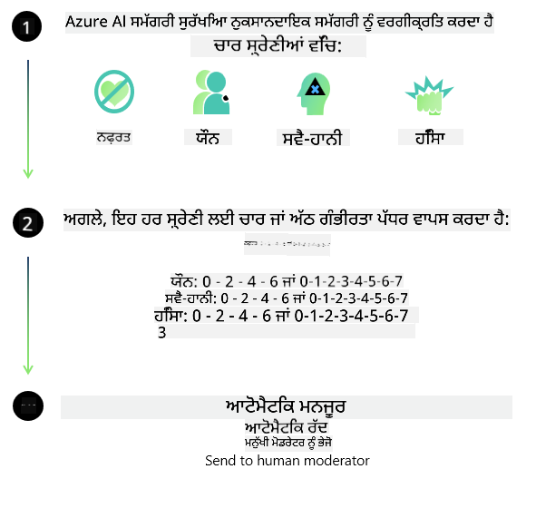

<!--
CO_OP_TRANSLATOR_METADATA:
{
  "original_hash": "c8273672cc57df2be675407a1383aaf0",
  "translation_date": "2025-07-16T17:46:15+00:00",
  "source_file": "md/01.Introduction/01/01.AISafety.md",
  "language_code": "pa"
}
-->
# Phi ਮਾਡਲਾਂ ਲਈ AI ਸੁਰੱਖਿਆ  
Phi ਪਰਿਵਾਰ ਦੇ ਮਾਡਲ [Microsoft Responsible AI Standard](https://query.prod.cms.rt.microsoft.com/cms/api/am/binary/RE5cmFl) ਦੇ ਅਨੁਸਾਰ ਵਿਕਸਿਤ ਕੀਤੇ ਗਏ ਹਨ, ਜੋ ਕਿ ਕੰਪਨੀ-ਵਿਆਪਕ ਮਿਆਰਾਂ ਦਾ ਸੈੱਟ ਹੈ ਜੋ ਛੇ ਮੁੱਖ ਸਿਧਾਂਤਾਂ 'ਤੇ ਆਧਾਰਿਤ ਹੈ: ਜਵਾਬਦੇਹੀ, ਪਾਰਦਰਸ਼ਤਾ, ਨਿਆਂਸੰਗਤਾ, ਭਰੋਸੇਯੋਗਤਾ ਅਤੇ ਸੁਰੱਖਿਆ, ਗੋਪਨੀਯਤਾ ਅਤੇ ਸੁਰੱਖਿਆ, ਅਤੇ ਸਮਾਵੇਸ਼ਤਾ, ਜੋ [Microsoft ਦੇ Responsible AI ਸਿਧਾਂਤਾਂ](https://www.microsoft.com/ai/responsible-ai) ਦਾ ਹਿੱਸਾ ਹਨ।  

ਪਿਛਲੇ Phi ਮਾਡਲਾਂ ਵਾਂਗ, ਇੱਕ ਬਹੁਪੱਖੀ ਸੁਰੱਖਿਆ ਮੁਲਾਂਕਣ ਅਤੇ ਸੁਰੱਖਿਆ ਪੋਸਟ-ਟ੍ਰੇਨਿੰਗ ਪਹੁੰਚ ਅਪਣਾਈ ਗਈ ਹੈ, ਜਿਸ ਵਿੱਚ ਇਸ ਰਿਲੀਜ਼ ਦੀ ਬਹੁ-ਭਾਸ਼ਾਈ ਸਮਰੱਥਾ ਨੂੰ ਧਿਆਨ ਵਿੱਚ ਰੱਖਦੇ ਹੋਏ ਵਾਧੂ ਉਪਾਇਆ ਕੀਤੇ ਗਏ ਹਨ। ਸਾਡੀ ਸੁਰੱਖਿਆ ਟ੍ਰੇਨਿੰਗ ਅਤੇ ਮੁਲਾਂਕਣ ਦੀ ਪਹੁੰਚ, ਜਿਸ ਵਿੱਚ ਕਈ ਭਾਸ਼ਾਵਾਂ ਅਤੇ ਖਤਰੇ ਦੀਆਂ ਸ਼੍ਰੇਣੀਆਂ ਵਿੱਚ ਟੈਸਟਿੰਗ ਸ਼ਾਮਲ ਹੈ, [Phi Safety Post-Training Paper](https://arxiv.org/abs/2407.13833) ਵਿੱਚ ਦਰਸਾਈ ਗਈ ਹੈ। ਜਦੋਂ ਕਿ Phi ਮਾਡਲ ਇਸ ਪਹੁੰਚ ਤੋਂ ਲਾਭਾਨਵਿਤ ਹੁੰਦੇ ਹਨ, ਵਿਕਾਸਕਾਰਾਂ ਨੂੰ ਆਪਣੀ ਵਿਸ਼ੇਸ਼ ਵਰਤੋਂ ਦੇ ਕੇਸ ਅਤੇ ਸਾਂਸਕ੍ਰਿਤਿਕ ਅਤੇ ਭਾਸ਼ਾਈ ਸੰਦਰਭ ਦੇ ਅਨੁਸਾਰ ਜਵਾਬਦੇਹ AI ਦੀਆਂ ਸਭ ਤੋਂ ਵਧੀਆ ਪ੍ਰਥਾਵਾਂ ਨੂੰ ਲਾਗੂ ਕਰਨਾ ਚਾਹੀਦਾ ਹੈ, ਜਿਸ ਵਿੱਚ ਖਤਰਿਆਂ ਦੀ ਨਕਸ਼ਾ ਬਣਾਉਣਾ, ਮਾਪਣਾ ਅਤੇ ਘਟਾਉਣਾ ਸ਼ਾਮਲ ਹੈ।  

## ਸਭ ਤੋਂ ਵਧੀਆ ਪ੍ਰਥਾਵਾਂ  

ਹੋਰ ਮਾਡਲਾਂ ਵਾਂਗ, Phi ਪਰਿਵਾਰ ਦੇ ਮਾਡਲ ਵੀ ਅਜਿਹੇ ਤਰੀਕਿਆਂ ਨਾਲ ਵਰਤੋਂ ਕਰ ਸਕਦੇ ਹਨ ਜੋ ਅਨਿਆਂਸੰਗਤ, ਭਰੋਸੇਯੋਗ ਨਾ ਹੋਣ ਵਾਲੇ ਜਾਂ ਅਪਮਾਨਜਨਕ ਹੋ ਸਕਦੇ ਹਨ।  

SLM ਅਤੇ LLM ਦੀਆਂ ਕੁਝ ਸੀਮਿਤ ਵਰਤੋਂਆਂ ਜਿਨ੍ਹਾਂ ਬਾਰੇ ਤੁਹਾਨੂੰ ਜਾਣੂ ਹੋਣਾ ਚਾਹੀਦਾ ਹੈ, ਉਹ ਹਨ:  

- **ਸੇਵਾ ਦੀ ਗੁਣਵੱਤਾ:** Phi ਮਾਡਲ ਮੁੱਖ ਤੌਰ 'ਤੇ ਅੰਗਰੇਜ਼ੀ ਟੈਕਸਟ 'ਤੇ ਟ੍ਰੇਨ ਕੀਤੇ ਗਏ ਹਨ। ਅੰਗਰੇਜ਼ੀ ਤੋਂ ਇਲਾਵਾ ਹੋਰ ਭਾਸ਼ਾਵਾਂ ਵਿੱਚ ਕਾਰਗੁਜ਼ਾਰੀ ਘੱਟ ਹੋ ਸਕਦੀ ਹੈ। ਟ੍ਰੇਨਿੰਗ ਡੇਟਾ ਵਿੱਚ ਘੱਟ ਪ੍ਰਤੀਨਿਧਿਤ ਅੰਗਰੇਜ਼ੀ ਭਾਸ਼ਾ ਦੇ ਵੈਰੀਐਂਟਾਂ ਦੀ ਕਾਰਗੁਜ਼ਾਰੀ ਮਿਆਰੀ ਅਮਰੀਕੀ ਅੰਗਰੇਜ਼ੀ ਨਾਲੋਂ ਘੱਟ ਹੋ ਸਕਦੀ ਹੈ।  
- **ਨੁਕਸਾਨਾਂ ਦੀ ਪ੍ਰਤੀਨਿਧਤਾ ਅਤੇ ਸਟੀਰੀਓਟਾਈਪਾਂ ਦੀ ਪੱਕੀ ਕਰਨਾ:** ਇਹ ਮਾਡਲ ਲੋਕਾਂ ਦੇ ਕੁਝ ਸਮੂਹਾਂ ਨੂੰ ਜ਼ਿਆਦਾ ਜਾਂ ਘੱਟ ਦਰਸਾ ਸਕਦੇ ਹਨ, ਕੁਝ ਸਮੂਹਾਂ ਦੀ ਪ੍ਰਤੀਨਿਧਤਾ ਮਿਟਾ ਸਕਦੇ ਹਨ ਜਾਂ ਨਿੰਦਾ ਜਾਂ ਨਕਾਰਾਤਮਕ ਸਟੀਰੀਓਟਾਈਪਾਂ ਨੂੰ ਮਜ਼ਬੂਤ ਕਰ ਸਕਦੇ ਹਨ। ਸੁਰੱਖਿਆ ਪੋਸਟ-ਟ੍ਰੇਨਿੰਗ ਦੇ ਬਾਵਜੂਦ, ਇਹ ਸੀਮਾਵਾਂ ਅਜੇ ਵੀ ਮੌਜੂਦ ਹੋ ਸਕਦੀਆਂ ਹਨ ਕਿਉਂਕਿ ਵੱਖ-ਵੱਖ ਸਮੂਹਾਂ ਦੀ ਪ੍ਰਤੀਨਿਧਤਾ ਦੇ ਪੱਧਰ ਵੱਖਰੇ ਹੋ ਸਕਦੇ ਹਨ ਜਾਂ ਟ੍ਰੇਨਿੰਗ ਡੇਟਾ ਵਿੱਚ ਨਕਾਰਾਤਮਕ ਸਟੀਰੀਓਟਾਈਪਾਂ ਦੇ ਉਦਾਹਰਣਾਂ ਦੀ ਵਿਆਪਕਤਾ ਹੋ ਸਕਦੀ ਹੈ ਜੋ ਅਸਲੀ ਦੁਨੀਆ ਦੇ ਰੁਝਾਨਾਂ ਅਤੇ ਸਮਾਜਿਕ ਪੱਖਪਾਤਾਂ ਨੂੰ ਦਰਸਾਉਂਦੀਆਂ ਹਨ।  
- **ਅਣੁਚਿਤ ਜਾਂ ਅਪਮਾਨਜਨਕ ਸਮੱਗਰੀ:** ਇਹ ਮਾਡਲ ਹੋਰ ਕਿਸਮ ਦੀਆਂ ਅਣੁਚਿਤ ਜਾਂ ਅਪਮਾਨਜਨਕ ਸਮੱਗਰੀ ਵੀ ਤਿਆਰ ਕਰ ਸਕਦੇ ਹਨ, ਜਿਸ ਕਰਕੇ ਸੰਵੇਦਨਸ਼ੀਲ ਸੰਦਰਭਾਂ ਵਿੱਚ ਵਰਤੋਂ ਲਈ ਵਾਧੂ ਰੋਕਥਾਮਾਂ ਦੇ ਬਿਨਾਂ ਇਹਨਾਂ ਨੂੰ ਤਾਇਨਾਤ ਕਰਨਾ ਠੀਕ ਨਹੀਂ ਹੋ ਸਕਦਾ।  
- **ਜਾਣਕਾਰੀ ਦੀ ਭਰੋਸੇਯੋਗਤਾ:** ਭਾਸ਼ਾ ਮਾਡਲ ਬੇਸਮਝ ਸਮੱਗਰੀ ਜਨਰੇਟ ਕਰ ਸਕਦੇ ਹਨ ਜਾਂ ਅਜਿਹੀ ਸਮੱਗਰੀ ਤਿਆਰ ਕਰ ਸਕਦੇ ਹਨ ਜੋ ਸੁਣਨ ਵਿੱਚ ਠੀਕ ਲੱਗਦੀ ਹੋਵੇ ਪਰ ਗਲਤ ਜਾਂ ਪੁਰਾਣੀ ਹੋ ਸਕਦੀ ਹੈ।  
- **ਕੋਡ ਲਈ ਸੀਮਿਤ ਦਾਇਰਾ:** Phi-3 ਦਾ ਜ਼ਿਆਦਾਤਰ ਟ੍ਰੇਨਿੰਗ ਡੇਟਾ Python 'ਤੇ ਆਧਾਰਿਤ ਹੈ ਅਤੇ ਆਮ ਪੈਕੇਜਾਂ ਜਿਵੇਂ "typing, math, random, collections, datetime, itertools" ਦੀ ਵਰਤੋਂ ਕਰਦਾ ਹੈ। ਜੇ ਮਾਡਲ Python ਸਕ੍ਰਿਪਟਾਂ ਤਿਆਰ ਕਰਦਾ ਹੈ ਜੋ ਹੋਰ ਪੈਕੇਜਾਂ ਜਾਂ ਹੋਰ ਭਾਸ਼ਾਵਾਂ ਵਿੱਚ ਸਕ੍ਰਿਪਟਾਂ ਦੀ ਵਰਤੋਂ ਕਰਦੀਆਂ ਹਨ, ਤਾਂ ਅਸੀਂ ਉਪਭੋਗਤਾਵਾਂ ਨੂੰ ਸਖ਼ਤ ਸਲਾਹ ਦਿੰਦੇ ਹਾਂ ਕਿ ਉਹ ਸਾਰੇ API ਦੀ ਵਰਤੋਂ ਨੂੰ ਹੱਥੋਂ ਜਾਂਚਣ।  

ਵਿਕਾਸਕਾਰਾਂ ਨੂੰ ਜਵਾਬਦੇਹ AI ਦੀਆਂ ਸਭ ਤੋਂ ਵਧੀਆ ਪ੍ਰਥਾਵਾਂ ਨੂੰ ਲਾਗੂ ਕਰਨਾ ਚਾਹੀਦਾ ਹੈ ਅਤੇ ਇਹ ਯਕੀਨੀ ਬਣਾਉਣਾ ਚਾਹੀਦਾ ਹੈ ਕਿ ਕੋਈ ਵਿਸ਼ੇਸ਼ ਵਰਤੋਂ ਦਾ ਕੇਸ ਸੰਬੰਧਤ ਕਾਨੂੰਨਾਂ ਅਤੇ ਨਿਯਮਾਂ (ਜਿਵੇਂ ਗੋਪਨੀਯਤਾ, ਵਪਾਰ ਆਦਿ) ਦੇ ਅਨੁਕੂਲ ਹੋਵੇ।  

## ਜਵਾਬਦੇਹ AI ਵਿਚਾਰ  

ਹੋਰ ਭਾਸ਼ਾ ਮਾਡਲਾਂ ਵਾਂਗ, Phi ਸੀਰੀਜ਼ ਦੇ ਮਾਡਲ ਵੀ ਅਜਿਹੇ ਤਰੀਕਿਆਂ ਨਾਲ ਵਰਤੋਂ ਕਰ ਸਕਦੇ ਹਨ ਜੋ ਅਨਿਆਂਸੰਗਤ, ਭਰੋਸੇਯੋਗ ਨਾ ਹੋਣ ਵਾਲੇ ਜਾਂ ਅਪਮਾਨਜਨਕ ਹੋ ਸਕਦੇ ਹਨ। ਕੁਝ ਸੀਮਿਤ ਵਰਤੋਂਆਂ ਜਿਨ੍ਹਾਂ ਬਾਰੇ ਜਾਣੂ ਹੋਣਾ ਜ਼ਰੂਰੀ ਹੈ, ਉਹ ਹਨ:  

**ਸੇਵਾ ਦੀ ਗੁਣਵੱਤਾ:** Phi ਮਾਡਲ ਮੁੱਖ ਤੌਰ 'ਤੇ ਅੰਗਰੇਜ਼ੀ ਟੈਕਸਟ 'ਤੇ ਟ੍ਰੇਨ ਕੀਤੇ ਗਏ ਹਨ। ਅੰਗਰੇਜ਼ੀ ਤੋਂ ਇਲਾਵਾ ਹੋਰ ਭਾਸ਼ਾਵਾਂ ਵਿੱਚ ਕਾਰਗੁਜ਼ਾਰੀ ਘੱਟ ਹੋ ਸਕਦੀ ਹੈ। ਟ੍ਰੇਨਿੰਗ ਡੇਟਾ ਵਿੱਚ ਘੱਟ ਪ੍ਰਤੀਨਿਧਿਤ ਅੰਗਰੇਜ਼ੀ ਭਾਸ਼ਾ ਦੇ ਵੈਰੀਐਂਟਾਂ ਦੀ ਕਾਰਗੁਜ਼ਾਰੀ ਮਿਆਰੀ ਅਮਰੀਕੀ ਅੰਗਰੇਜ਼ੀ ਨਾਲੋਂ ਘੱਟ ਹੋ ਸਕਦੀ ਹੈ।  

**ਨੁਕਸਾਨਾਂ ਦੀ ਪ੍ਰਤੀਨਿਧਤਾ ਅਤੇ ਸਟੀਰੀਓਟਾਈਪਾਂ ਦੀ ਪੱਕੀ ਕਰਨਾ:** ਇਹ ਮਾਡਲ ਲੋਕਾਂ ਦੇ ਕੁਝ ਸਮੂਹਾਂ ਨੂੰ ਜ਼ਿਆਦਾ ਜਾਂ ਘੱਟ ਦਰਸਾ ਸਕਦੇ ਹਨ, ਕੁਝ ਸਮੂਹਾਂ ਦੀ ਪ੍ਰਤੀਨਿਧਤਾ ਮਿਟਾ ਸਕਦੇ ਹਨ ਜਾਂ ਨਿੰਦਾ ਜਾਂ ਨਕਾਰਾਤਮਕ ਸਟੀਰੀਓਟਾਈਪਾਂ ਨੂੰ ਮਜ਼ਬੂਤ ਕਰ ਸਕਦੇ ਹਨ। ਸੁਰੱਖਿਆ ਪੋਸਟ-ਟ੍ਰੇਨਿੰਗ ਦੇ ਬਾਵਜੂਦ, ਇਹ ਸੀਮਾਵਾਂ ਅਜੇ ਵੀ ਮੌਜੂਦ ਹੋ ਸਕਦੀਆਂ ਹਨ ਕਿਉਂਕਿ ਵੱਖ-ਵੱਖ ਸਮੂਹਾਂ ਦੀ ਪ੍ਰਤੀਨਿਧਤਾ ਦੇ ਪੱਧਰ ਵੱਖਰੇ ਹੋ ਸਕਦੇ ਹਨ ਜਾਂ ਟ੍ਰੇਨਿੰਗ ਡੇਟਾ ਵਿੱਚ ਨਕਾਰਾਤਮਕ ਸਟੀਰੀਓਟਾਈਪਾਂ ਦੇ ਉਦਾਹਰਣਾਂ ਦੀ ਵਿਆਪਕਤਾ ਹੋ ਸਕਦੀ ਹੈ ਜੋ ਅਸਲੀ ਦੁਨੀਆ ਦੇ ਰੁਝਾਨਾਂ ਅਤੇ ਸਮਾਜਿਕ ਪੱਖਪਾਤਾਂ ਨੂੰ ਦਰਸਾਉਂਦੀਆਂ ਹਨ।  

**ਅਣੁਚਿਤ ਜਾਂ ਅਪਮਾਨਜਨਕ ਸਮੱਗਰੀ:** ਇਹ ਮਾਡਲ ਹੋਰ ਕਿਸਮ ਦੀਆਂ ਅਣੁਚਿਤ ਜਾਂ ਅਪਮਾਨਜਨਕ ਸਮੱਗਰੀ ਵੀ ਤਿਆਰ ਕਰ ਸਕਦੇ ਹਨ, ਜਿਸ ਕਰਕੇ ਸੰਵੇਦਨਸ਼ੀਲ ਸੰਦਰਭਾਂ ਵਿੱਚ ਵਰਤੋਂ ਲਈ ਵਾਧੂ ਰੋਕਥਾਮਾਂ ਦੇ ਬਿਨਾਂ ਇਹਨਾਂ ਨੂੰ ਤਾਇਨਾਤ ਕਰਨਾ ਠੀਕ ਨਹੀਂ ਹੋ ਸਕਦਾ।  
ਜਾਣਕਾਰੀ ਦੀ ਭਰੋਸੇਯੋਗਤਾ: ਭਾਸ਼ਾ ਮਾਡਲ ਬੇਸਮਝ ਸਮੱਗਰੀ ਜਨਰੇਟ ਕਰ ਸਕਦੇ ਹਨ ਜਾਂ ਅਜਿਹੀ ਸਮੱਗਰੀ ਤਿਆਰ ਕਰ ਸਕਦੇ ਹਨ ਜੋ ਸੁਣਨ ਵਿੱਚ ਠੀਕ ਲੱਗਦੀ ਹੋਵੇ ਪਰ ਗਲਤ ਜਾਂ ਪੁਰਾਣੀ ਹੋ ਸਕਦੀ ਹੈ।  

**ਕੋਡ ਲਈ ਸੀਮਿਤ ਦਾਇਰਾ:** Phi-3 ਦਾ ਜ਼ਿਆਦਾਤਰ ਟ੍ਰੇਨਿੰਗ ਡੇਟਾ Python 'ਤੇ ਆਧਾਰਿਤ ਹੈ ਅਤੇ ਆਮ ਪੈਕੇਜਾਂ ਜਿਵੇਂ "typing, math, random, collections, datetime, itertools" ਦੀ ਵਰਤੋਂ ਕਰਦਾ ਹੈ। ਜੇ ਮਾਡਲ Python ਸਕ੍ਰਿਪਟਾਂ ਤਿਆਰ ਕਰਦਾ ਹੈ ਜੋ ਹੋਰ ਪੈਕੇਜਾਂ ਜਾਂ ਹੋਰ ਭਾਸ਼ਾਵਾਂ ਵਿੱਚ ਸਕ੍ਰਿਪਟਾਂ ਦੀ ਵਰਤੋਂ ਕਰਦੀਆਂ ਹਨ, ਤਾਂ ਅਸੀਂ ਉਪਭੋਗਤਾਵਾਂ ਨੂੰ ਸਖ਼ਤ ਸਲਾਹ ਦਿੰਦੇ ਹਾਂ ਕਿ ਉਹ ਸਾਰੇ API ਦੀ ਵਰਤੋਂ ਨੂੰ ਹੱਥੋਂ ਜਾਂਚਣ।  

ਵਿਕਾਸਕਾਰਾਂ ਨੂੰ ਜਵਾਬਦੇਹ AI ਦੀਆਂ ਸਭ ਤੋਂ ਵਧੀਆ ਪ੍ਰਥਾਵਾਂ ਨੂੰ ਲਾਗੂ ਕਰਨਾ ਚਾਹੀਦਾ ਹੈ ਅਤੇ ਇਹ ਯਕੀਨੀ ਬਣਾਉਣਾ ਚਾਹੀਦਾ ਹੈ ਕਿ ਕੋਈ ਵਿਸ਼ੇਸ਼ ਵਰਤੋਂ ਦਾ ਕੇਸ ਸੰਬੰਧਤ ਕਾਨੂੰਨਾਂ ਅਤੇ ਨਿਯਮਾਂ (ਜਿਵੇਂ ਗੋਪਨੀਯਤਾ, ਵਪਾਰ ਆਦਿ) ਦੇ ਅਨੁਕੂਲ ਹੋਵੇ। ਮਹੱਤਵਪੂਰਨ ਵਿਚਾਰ ਕਰਨ ਵਾਲੇ ਖੇਤਰ ਹਨ:  

**ਵੰਡ:** ਮਾਡਲ ਉਹਨਾਂ ਸਥਿਤੀਆਂ ਲਈ ਉਚਿਤ ਨਹੀਂ ਹੋ ਸਕਦੇ ਜਿੱਥੇ ਕਾਨੂੰਨੀ ਦਰਜਾ ਜਾਂ ਸਰੋਤਾਂ ਜਾਂ ਜੀਵਨ ਦੇ ਮੌਕਿਆਂ ਦੀ ਵੰਡ 'ਤੇ ਪ੍ਰਭਾਵ ਪੈ ਸਕਦਾ ਹੈ (ਜਿਵੇਂ: ਰਹਾਇਸ਼, ਨੌਕਰੀ, ਕਰੈਡਿਟ ਆਦਿ) ਬਿਨਾਂ ਹੋਰ ਮੁਲਾਂਕਣਾਂ ਅਤੇ ਵਾਧੂ ਪੱਖਪਾਤ-ਰਹਿਤ ਤਕਨੀਕਾਂ ਦੇ।  

**ਉੱਚ-ਖਤਰੇ ਵਾਲੇ ਸੰਦਰਭ:** ਵਿਕਾਸਕਾਰਾਂ ਨੂੰ ਉੱਚ-ਖਤਰੇ ਵਾਲੇ ਸੰਦਰਭਾਂ ਵਿੱਚ ਮਾਡਲਾਂ ਦੀ ਵਰਤੋਂ ਦੀ ਯੋਗਤਾ ਦਾ ਮੁਲਾਂਕਣ ਕਰਨਾ ਚਾਹੀਦਾ ਹੈ ਜਿੱਥੇ ਅਨਿਆਂਸੰਗਤ, ਭਰੋਸੇਯੋਗ ਨਾ ਹੋਣ ਵਾਲੇ ਜਾਂ ਅਪਮਾਨਜਨਕ ਨਤੀਜੇ ਬਹੁਤ ਮਹਿੰਗੇ ਜਾਂ ਨੁਕਸਾਨਦਾਇਕ ਹੋ ਸਕਦੇ ਹਨ। ਇਸ ਵਿੱਚ ਸੰਵੇਦਨਸ਼ੀਲ ਜਾਂ ਵਿਸ਼ੇਸ਼ਗਿਆਨ ਖੇਤਰਾਂ ਵਿੱਚ ਸਲਾਹ ਦੇਣਾ ਸ਼ਾਮਲ ਹੈ ਜਿੱਥੇ ਸਹੀਤਾ ਅਤੇ ਭਰੋਸੇਯੋਗਤਾ ਜ਼ਰੂਰੀ ਹੈ (ਜਿਵੇਂ: ਕਾਨੂੰਨੀ ਜਾਂ ਸਿਹਤ ਸਲਾਹ)। ਤਾਇਨਾਤੀ ਸੰਦਰਭ ਦੇ ਅਨੁਸਾਰ ਐਪਲੀਕੇਸ਼ਨ ਪੱਧਰ 'ਤੇ ਵਾਧੂ ਸੁਰੱਖਿਆ ਉਪਾਇਆ ਲਾਗੂ ਕਰਨੇ ਚਾਹੀਦੇ ਹਨ।  

**ਗਲਤ ਜਾਣਕਾਰੀ:** ਮਾਡਲ ਗਲਤ ਜਾਣਕਾਰੀ ਪੈਦਾ ਕਰ ਸਕਦੇ ਹਨ। ਵਿਕਾਸਕਾਰਾਂ ਨੂੰ ਪਾਰਦਰਸ਼ਤਾ ਦੀਆਂ ਸਭ ਤੋਂ ਵਧੀਆ ਪ੍ਰਥਾਵਾਂ ਦੀ ਪਾਲਣਾ ਕਰਨੀ ਚਾਹੀਦੀ ਹੈ ਅਤੇ ਅੰਤ-ਉਪਭੋਗਤਾਵਾਂ ਨੂੰ ਦੱਸਣਾ ਚਾਹੀਦਾ ਹੈ ਕਿ ਉਹ AI ਸਿਸਟਮ ਨਾਲ ਗੱਲਬਾਤ ਕਰ ਰਹੇ ਹਨ। ਐਪਲੀਕੇਸ਼ਨ ਪੱਧਰ 'ਤੇ, ਵਿਕਾਸਕਾਰ ਫੀਡਬੈਕ ਮਕੈਨਿਜ਼ਮ ਅਤੇ ਪਾਈਪਲਾਈਨ ਬਣਾਕੇ ਜਵਾਬਾਂ ਨੂੰ ਵਰਤੋਂ-ਕੇਸ ਵਿਸ਼ੇਸ਼, ਸੰਦਰਭੀ ਜਾਣਕਾਰੀ ਨਾਲ ਜੋੜ ਸਕਦੇ ਹਨ, ਜਿਸ ਤਕਨੀਕ ਨੂੰ Retrieval Augmented Generation (RAG) ਕਿਹਾ ਜਾਂਦਾ ਹੈ।  

**ਨੁਕਸਾਨਦਾਇਕ ਸਮੱਗਰੀ ਦੀ ਪੈਦਾوار:** ਵਿਕਾਸਕਾਰਾਂ ਨੂੰ ਆਪਣੇ ਸੰਦਰਭ ਲਈ ਨਤੀਜਿਆਂ ਦਾ ਮੁਲਾਂਕਣ ਕਰਨਾ ਚਾਹੀਦਾ ਹੈ ਅਤੇ ਉਪਲਬਧ ਸੁਰੱਖਿਆ ਕਲਾਸੀਫਾਇਰ ਜਾਂ ਆਪਣੇ ਵਰਤੋਂ ਦੇ ਕੇਸ ਲਈ ਉਚਿਤ ਕਸਟਮ ਹੱਲ ਵਰਤਣੇ ਚਾਹੀਦੇ ਹਨ।  

**ਗਲਤ ਵਰਤੋਂ:** ਧੋਖਾਧੜੀ, ਸਪੈਮ ਜਾਂ ਮਾਲਵੇਅਰ ਬਣਾਉਣ ਵਰਗੀਆਂ ਹੋਰ ਗਲਤ ਵਰਤੋਂਆਂ ਸੰਭਵ ਹਨ, ਅਤੇ ਵਿਕਾਸਕਾਰਾਂ ਨੂੰ ਇਹ ਯਕੀਨੀ ਬਣਾਉਣਾ ਚਾਹੀਦਾ ਹੈ ਕਿ ਉਹਨਾਂ ਦੀਆਂ ਐਪਲੀਕੇਸ਼ਨਾਂ ਨੇ ਸੰਬੰਧਤ ਕਾਨੂੰਨਾਂ ਅਤੇ ਨਿਯਮਾਂ ਦੀ ਉਲੰਘਣਾ ਨਾ ਕੀਤੀ ਹੋਵੇ।  

### ਫਾਈਨਟਿਊਨਿੰਗ ਅਤੇ AI ਸਮੱਗਰੀ ਸੁਰੱਖਿਆ  

ਮਾਡਲ ਨੂੰ ਫਾਈਨਟਿਊਨ ਕਰਨ ਤੋਂ ਬਾਅਦ, ਅਸੀਂ ਬਹੁਤ ਸਿਫਾਰਸ਼ ਕਰਦੇ ਹਾਂ ਕਿ [Azure AI Content Safety](https://learn.microsoft.com/azure/ai-services/content-safety/overview) ਉਪਾਇਆ ਵਰਤੇ ਜਾਣ ਤਾਂ ਜੋ ਮਾਡਲਾਂ ਵੱਲੋਂ ਬਣਾਈ ਗਈ ਸਮੱਗਰੀ ਦੀ ਨਿਗਰਾਨੀ ਕੀਤੀ ਜਾ ਸਕੇ, ਸੰਭਾਵਿਤ ਖਤਰਿਆਂ, ਧਮਕੀਆਂ ਅਤੇ ਗੁਣਵੱਤਾ ਸਮੱਸਿਆਵਾਂ ਦੀ ਪਹਚਾਣ ਕੀਤੀ ਜਾ ਸਕੇ ਅਤੇ ਰੋਕਥਾਮ ਕੀਤੀ ਜਾ ਸਕੇ।  

  

[Azure AI Content Safety](https://learn.microsoft.com/azure/ai-services/content-safety/overview) ਟੈਕਸਟ ਅਤੇ ਚਿੱਤਰ ਸਮੱਗਰੀ ਦੋਹਾਂ ਲਈ ਸਹਾਇਤਾ ਦਿੰਦਾ ਹੈ। ਇਹ ਕਲਾਉਡ, ਡਿਸਕਨੈਕਟਿਡ ਕੰਟੇਨਰਾਂ ਅਤੇ ਐਜ/ਐਂਬੈਡਡ ਡਿਵਾਈਸਾਂ 'ਤੇ ਤਾਇਨਾਤ ਕੀਤਾ ਜਾ ਸਕਦਾ ਹੈ।  

## Azure AI Content Safety ਦਾ ਜਾਇਜ਼ਾ  

Azure AI Content Safety ਇੱਕ ਸਾਰਥਕ ਹੱਲ ਨਹੀਂ ਹੈ; ਇਸਨੂੰ ਕਾਰੋਬਾਰਾਂ ਦੀਆਂ ਵਿਸ਼ੇਸ਼ ਨੀਤੀਆਂ ਦੇ ਅਨੁਕੂਲ ਬਣਾਇਆ ਜਾ ਸਕਦਾ ਹੈ। ਇਸਦੇ ਨਾਲ-ਨਾਲ, ਇਸਦੇ ਬਹੁ-ਭਾਸ਼ਾਈ ਮਾਡਲ ਇਸਨੂੰ ਇੱਕ ਸਮੇਂ ਵਿੱਚ ਕਈ ਭਾਸ਼ਾਵਾਂ ਨੂੰ ਸਮਝਣ ਯੋਗ ਬਣਾਉਂਦੇ ਹਨ।  

  

- **Azure AI Content Safety**  
- **Microsoft Developer**  
- **5 ਵੀਡੀਓਜ਼**  

Azure AI Content Safety ਸੇਵਾ ਐਪਲੀਕੇਸ਼ਨਾਂ ਅਤੇ ਸੇਵਾਵਾਂ ਵਿੱਚ ਨੁਕਸਾਨਦਾਇਕ ਉਪਭੋਗਤਾ-ਜਨਰੇਟ ਕੀਤੀ ਅਤੇ AI-ਜਨਰੇਟ ਕੀਤੀ ਸਮੱਗਰੀ ਦੀ ਪਹਚਾਣ ਕਰਦੀ ਹੈ। ਇਸ ਵਿੱਚ ਟੈਕਸਟ ਅਤੇ ਚਿੱਤਰ API ਸ਼ਾਮਲ ਹਨ ਜੋ ਤੁਹਾਨੂੰ ਨੁਕਸਾਨਦਾਇਕ ਜਾਂ ਅਣੁਚਿਤ ਸਮੱਗਰੀ ਦੀ ਪਹਚਾਣ ਕਰਨ ਦੀ ਆਗਿਆ ਦਿੰਦੇ ਹਨ।  

[AI Content Safety Playlist](https://www.youtube.com/playlist?list=PLlrxD0HtieHjaQ9bJjyp1T7FeCbmVcPkQ)

**ਅਸਵੀਕਾਰੋਪਣ**:  
ਇਹ ਦਸਤਾਵੇਜ਼ AI ਅਨੁਵਾਦ ਸੇਵਾ [Co-op Translator](https://github.com/Azure/co-op-translator) ਦੀ ਵਰਤੋਂ ਕਰਕੇ ਅਨੁਵਾਦਿਤ ਕੀਤਾ ਗਿਆ ਹੈ। ਜਦੋਂ ਕਿ ਅਸੀਂ ਸਹੀਤਾ ਲਈ ਕੋਸ਼ਿਸ਼ ਕਰਦੇ ਹਾਂ, ਕਿਰਪਾ ਕਰਕੇ ਧਿਆਨ ਰੱਖੋ ਕਿ ਸਵੈਚਾਲਿਤ ਅਨੁਵਾਦਾਂ ਵਿੱਚ ਗਲਤੀਆਂ ਜਾਂ ਅਸਮਰਥਤਾਵਾਂ ਹੋ ਸਕਦੀਆਂ ਹਨ। ਮੂਲ ਦਸਤਾਵੇਜ਼ ਆਪਣੀ ਮੂਲ ਭਾਸ਼ਾ ਵਿੱਚ ਪ੍ਰਮਾਣਿਕ ਸਰੋਤ ਮੰਨਿਆ ਜਾਣਾ ਚਾਹੀਦਾ ਹੈ। ਮਹੱਤਵਪੂਰਨ ਜਾਣਕਾਰੀ ਲਈ, ਪੇਸ਼ੇਵਰ ਮਨੁੱਖੀ ਅਨੁਵਾਦ ਦੀ ਸਿਫਾਰਸ਼ ਕੀਤੀ ਜਾਂਦੀ ਹੈ। ਅਸੀਂ ਇਸ ਅਨੁਵਾਦ ਦੀ ਵਰਤੋਂ ਤੋਂ ਉਤਪੰਨ ਕਿਸੇ ਵੀ ਗਲਤਫਹਿਮੀ ਜਾਂ ਗਲਤ ਵਿਆਖਿਆ ਲਈ ਜ਼ਿੰਮੇਵਾਰ ਨਹੀਂ ਹਾਂ।