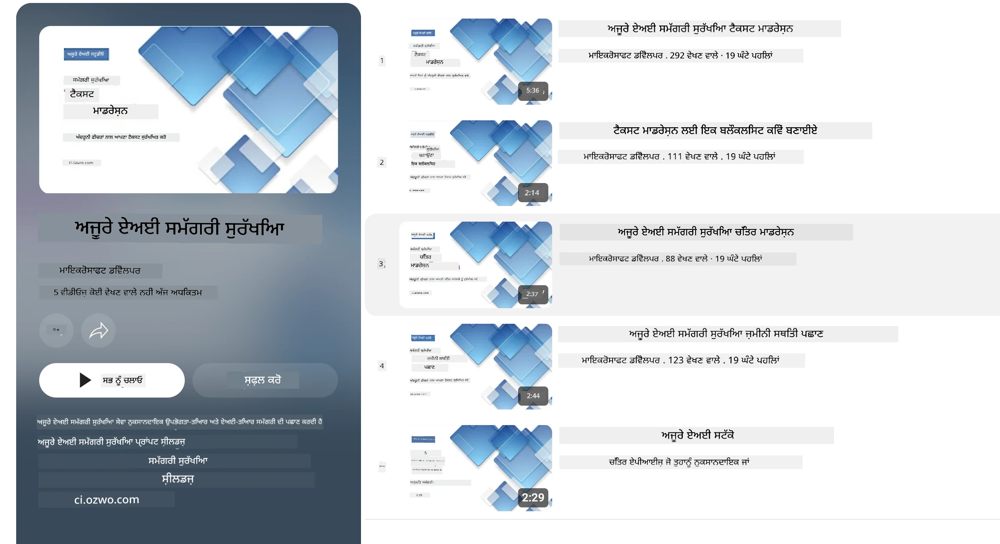

<!--
CO_OP_TRANSLATOR_METADATA:
{
  "original_hash": "839ccc4b3886ef10cfd4e64977f5792d",
  "translation_date": "2026-01-05T14:00:36+00:00",
  "source_file": "md/01.Introduction/01/01.AISafety.md",
  "language_code": "pa"
}
-->
# Phi ਮਾਡਲਾਂ ਲਈ AI ਸੁਰੱਖਿਆ
Phi ਪਰਿਵਾਰ ਦੇ ਮਾਡਲਾਂ ਨੂੰ [Microsoft Responsible AI Standard](https://www.microsoft.com/ai/principles-and-approach#responsible-ai-standard) ਦੇ ਅਨੁਕੂਲ ਵਿਕਸਿਤ ਕੀਤਾ ਗਿਆ ਸੀ, ਜੋ ਇਕ ਕੰਪਨੀ-ਵਿਆਪਕ ਲੋੜਾਂ ਦਾ ਸੈਟ ਹੈ ਜੋ ਹੇਠ ਲਿਖੇ ਛੇ ਸਿਧਾਂਤਾਂ ਅਧਾਰਿਤ ਹੈ: ਜਵਾਬਦੇਹੀ, ਪਾਰਦਰਸ਼ਿਤਾ, ਨਿਆਂਸੰਗਤਾ, ਭਰੋਸੇਯੋਗਤਾ ਅਤੇ ਸੁਰੱਖਿਆ, ਗੁਪਤਤਾ ਅਤੇ ਸੁਰੱਖਿਆ, ਅਤੇ ਸ਼ਾਮਿਲੀਅਤ ਜੋ [Microsoft ਦੇ Responsible AI ਸਿਧਾਂਤਾਂ](https://www.microsoft.com/ai/responsible-ai) ਦਾ ਰੂਪ ਹਨ।

ਪਿਛਲੇ Phi ਮਾਡਲਾਂ ਵਾਂਗ, ਇੱਕ ਬਹੁ-ਪੱਖੀ ਸੁਰੱਖਿਆ ਮੁਲਾਂਕਣ ਅਤੇ ਸੁਰੱਖਿਆ ਬਾਅਦ-ਤਾਲੀਮੀ ਪਹੁੰਚ اپنਾਈ ਗਈ ਸੀ, ਇਸ ਰਿਲੀਜ਼ ਦੀ ਬਹੁ-ਭਾਸ਼ਾਈ ਸਮਰੱਥਾਵਾਂ ਨੂੰ ਧਿਆਨ ਵਿੱਚ ਰੱਖਦੇ ਹੋਏ ਵਾਧੂ ਉਪਾਇਆ ਕੀਤੇ ਗਏ। ਸਾਡਾ ਸੁਰੱਖਿਆ ਤਾਲੀਮੀ ਅਤੇ ਮੁਲਾਂਕਣ ਦਾ ਢੰਗ, ਜਿਸ ਵਿੱਚ ਕਈ ਭਾਸ਼ਾਵਾਂ ਅਤੇ ਖ਼ਤਰੇ ਦੀਆਂ ਸ਼੍ਰੇਣੀਆਂ ਵਿੱਚ ਟੈਸਟਿੰਗ ਸ਼ਾਮਿਲ ਹੈ, [Phi Safety Post-Training Paper](https://arxiv.org/abs/2407.13833) ਵਿੱਚ ਦਰਸਾਇਆ ਗਿਆ ਹੈ। ਜਦ ਕਿ Phi ਮਾਡਲਾਂ ਇਸ ਪਹੁੰਚ ਤੋਂ ਲਾਭ ਵਿਥਦੇ ਹਨ, ਵਿਕਾਸਕਾਰਾਂ ਨੂੰ ਆਪਣੀ ਵਿਸ਼ੇਸ਼ ਵਰਤੋਂ ਕੇਸ ਅਤੇ ਸਾਂಸ್ಕ੍ਰਿਤਿਕ ਅਤੇ ਭਾਸ਼ਾਈ ਸੰਦਰਭ ਦੇ ਨਾਲ ਸੰਬੰਧਿਤ ਖ਼ਤਰਿਆਂ ਨਿਊਨਤਮ ਕਰਨ ਲਈ ਜਵਾਬਦੇਹ AI ਅੱਛੇ ਅਮਲ ਨੂੰ ਲਾਗੂ ਕਰਨਾ ਚਾਹੀਦਾ ਹੈ।

## ਸਰੋਤ ਅਮਲ

ਹੋਰ ਮਾਡਲਾਂ ਵਾਂਗ, Phi ਪਰਿਵਾਰ ਦੇ ਮਾਡਲਾਂ ਦੇ ਵਿਹਾਰ ਵਿੱਚ ਅਜੇਹੀਆਂ ਸ਼ਰਤਾਂ ਹਨ ਜੋ ਅਨਿਆਂਯਕ, ਅਭਰਦਾਇਕ ਜਾਂ ਅਪਮਾਨਜਨਕ ਹੋ ਸਕਦੀਆਂ ਹਨ।

SLM ਅਤੇ LLM ਦੇ ਕੁਝ ਸੀਮਤ ਵਿਹਾਰਾਂ ਬਾਰੇ ਤੁਹਾਨੂੰ ਜਾਣੂ ਹੋਣਾ ਚਾਹੀਦਾ ਹੈ:

- **ਸੇਵਾ ਦੀ ਗੁਣਵੱਤਾ:** Phi ਮਾਡਲ ਮੁੱਖ ਤੌਰ 'ਤੇ ਅੰਗਰੇਜ਼ੀ ਟੈਕਸਟ 'ਤੇ ਤਿਆਰ ਕੀਤੇ ਗਏ ਹਨ। ਅੰਗਰੇਜ਼ੀ ਤੋਂ ਬਿਨਾਂ ਹੋਰ ਭਾਸ਼ਾਵਾਂ ਵੱਲੋਂ ਖਰਾਬ ਪ੍ਰਦਰਸ਼ਨ ਹੁੰਦਾ ਹੈ। ਤਾਲੀਮ ਡੇਟਾ ਵਿੱਚ ਘੱਟ ਪ੍ਰਤੀਨਿਧਿਤ ਅੰਗਰੇਜ਼ੀ ਭਾਸ਼ਾ ਦੇ ਪ੍ਰਕਾਰਾਂ ਦੀ ਤੁਲਨਾ ਵਿੱਚ ਮਿਆਰੀ ਅਮਰੀਕੀ ਅੰਗਰੇਜ਼ੀ ਨਾਲੋਂ ਨੁਕਸਾਨਦਾਇਕ ਪ੍ਰਦਰਸ਼ਨ ਹੋ ਸਕਦਾ ਹੈ।
- **ਹਾਨੀਆਂ ਦੀ ਪ੍ਰਤੀਨਿਧਤਾ ਅਤੇ ਸਟੀਰੀਓਟਾਈਪਾਂ ਦੀ ਪੁਸ਼ਟੀ:** ਇਹ ਮਾਡਲ ਲੋਕਾਂ ਦੇ ਕੁਝ ਗਰੁੱਪਾਂ ਨੂੰ ਵੱਧ ਜਾਂ ਘੱਟ ਦਰਸਾ ਸਕਦੇ ਹਨ, ਕੁਝ ਗਰੁੱਪਾਂ ਦੀ ਪ੍ਰਤੀਨਿਧਤਾ ਨੂੰ ਮਿਟਾ ਸਕਦੇ ਹਨ ਜਾਂ ਨਿੰਦਾਤਮਕ ਜਾਂ ਨਕਾਰਾਤਮਕ ਸਟਰੀਓਟਾਈਪਾਂ ਨੂੰ ਮਜ਼ਬੂਤ ਕਰ ਸਕਦੇ ਹਨ। ਸੁਰੱਖਿਆ ਬਾਅਦ-ਤਾਲੀਮ ਦੇ ਬਾਵਜੂਦ, ਇਹ ਸੀਮਾਵਾਂ ਤਾਲੀਮੀ ਡੇਟਾ ਵਿੱਚ ਵੱਖ-ਵੱਖ ਗਰੁੱਪਾਂ ਦੇ ਪ੍ਰਤੀਨਿਧਾਨ ਦੇ ਪੱਧਰ ਜਾਂ ਨਕਾਰਾਤਮਕ ਸਟਰੀਓਟਾਈਪਾਂ ਦੇ ਉਦਾਹਰਨਾਂ ਦੀ ਵਰਤੋਂ ਕਾਰਨ ਮੌਜੂਦ ਰਹਿ ਸਕਦੀਆਂ ਹਨ ਜੋ ਅਸਲ ਦੁਨੀਆ ਦੇ ਨਕਸ਼ੇ ਅਤੇ ਸਮਾਜਿਕ ਪੱਖਪਾਤ ਅਨੁਸਾਰ ਹਨ।
- **ਅਨੁਚਿਤ ਜਾਂ ਅਪਮਾਨਜਨਕ ਸਮੱਗਰੀ:** ਇਹ ਮਾਡਲ ਹੋਰ ਕਿਸਮ ਦੀਆਂ ਅਨੁਚਿਤ ਜਾਂ ਅਪਮਾਨਜਨਕ ਸਮੱਗਰੀ ਤਿਆਰ ਕਰ ਸਕਦੇ ਹਨ, ਜਿਸ ਕਰਕੇ ਸੰਵੇਦਨਸ਼ੀਲ ਸੰਦਰਭਾਂ ਵਿੱਚ ਇਸਨੂੰ ਵਰਤਣਾ ਵਾਂਝਾ ਹੋ ਸਕਦਾ ਹੈ ਜਦ ਤੱਕ ਵਰਤੋਂ ਕੇਸ ਲਈ ਵਾਧੂ ਉਪਾਯ ਨਾ ਲਾਏ ਜਾਣ।
- **ਜਾਣਕਾਰੀ ਦੀ ਭਰੋਸੇਯੋਗਤਾ:** ਭਾਸ਼ਾ ਮਾਡਲ ਬੇਰਹਮੀ ਦੀ ਸਮੱਗਰੀ ਤਿਆਰ ਕਰ ਸਕਦੇ ਹਨ ਜਾਂ ਉਹ ਸਮੱਗਰੀ ਬਣਾ ਸਕਦੇ ਹਨ ਜੋ ਸਮਝਦਾਰ ਲੱਗੇ ਪਰ ਗਲਤ ਜਾਂ ਪੁਰਾਣੀ ਹੋ ਸਕਦੀ ਹੈ।
- **ਕੋਡ ਲਈ ਸੀਮਤ ਦਾਇਰਾ:** Phi-3 ਦਾ ਬਹੁਤ ਜ਼ਿਆਦਾ ਤਾਲੀਮ ਡੇਟਾ Python 'ਤੇ ਆਧਾਰਿਤ ਹੈ ਅਤੇ ਆਮ ਪੈਕੇਜਾਂ ਜਿਵੇਂ ਕਿ "typing, math, random, collections, datetime, itertools" ਦੀ ਵਰਤੋਂ ਕਰਦਾ ਹੈ। ਜੇ ਮਾਡਲ Python ਸਕ੍ਰਿਪਟ ਲਿਖਦਾ ਹੈ ਜੋ ਹੋਰ ਪੈਕੇਜਾਂ ਜਾਂ ਹੋਰ ਭਾਸ਼ਾਵਾਂ ਵਿੱਚ ਸਕ੍ਰਿਪਟ ਨੂੰ ਵਰਤਦਾ ਹੈ, ਤਾਂ ਅਸੀਂ ਉਪਭੋਗਤਾਵਾਂ ਨੂੰ ਸਿਫਾਰਸ਼ ਕਰਦੇ ਹਾਂ ਕਿ ਉਹ ਸਾਰੇ API ਦੀ ਵਰਤੋਂ ਹੱਥੋਂ ਜਾਂਚਣ।

ਵਿਕਾਸਕਾਰਾਂ ਨੂੰ ਜਵਾਬਦੇਹ AI ਅੱਛੇ ਅਮਲ ਲਾਗੂ ਕਰਨੇ ਚਾਹੀਦੇ ਹਨ ਅਤੇ ਉਹ ਇਸ ਗੱਲ ਲਈ ਜ਼ਿੰਮੇਵਾਰ ਹਨ ਕਿ ਕੋਈ ਵਿਸ਼ੇਸ਼ ਵਰਤੋਂ ਕੇਸ ਸੰਬੰਧਤ ਕਾਨੂੰਨਾਂ ਅਤੇ ਨਿਯਮਾਂ (ਜਿਵੇਂ ਗੁਪਤਤਾ, ਵਪਾਰ, ਆਦਿ) ਦਾ ਪਾਲਣ ਕਰਦਾ ਹੋਵੇ।

## ਜਵਾਬਦੇਹ AI ਵਿଚਾਰ

ਹੋਰ ਭਾਸ਼ਾਈ ਮਾਡਲਾਂ ਵਾਂਗ, Phi ਸੀਰੀਜ਼ ਦੇ ਮਾਡਲ ਅੰਨਿਆਂਯਕ, ਅਭਰਦਾਇਕ ਜਾਂ ਅਪਮਾਨਜਨਕ ਵਿਹਾਰ ਕਰ ਸਕਦੇ ਹਨ। ਜਾਣੂ ਹੋਣ ਵਾਲੇ ਕੁਝ ਸੀਮਤ ਵਿਹਾਰ ਹਨ:

**ਸੇਵਾ ਦੀ ਗੁਣਵੱਤਾ:** Phi ਮਾਡਲ ਮੁੱਖ ਤੌਰ 'ਤੇ ਅੰਗਰੇਜ਼ੀ ਟੈਕਸਟ 'ਤੇ ਤਿਆਰ ਕੀਤੇ ਗਏ ਹਨ। ਅੰਗਰੇਜ਼ੀ ਤੋਂ ਬਿਨਾਂ ਹੋਰ ਭਾਸ਼ਾਵਾਂ ਨੂੰ ਖਰਾਬ ਪ੍ਰਦਰਸ਼ਨ ਦਾ ਸਾਹਮਣਾ ਕਰਨਾ ਪੈਂਦਾ ਹੈ। ਤਾਲੀਮ ਡੇਟਾ ਵਿੱਚ ਘੱਟ ਪ੍ਰਤੀਨਿਧਤ ਅੰਗਰੇਜ਼ੀ ਭਾਸ਼ਾ ਦੇ ਪ੍ਰਕਾਰਾਂ ਨੂੰ ਮਿਆਰੀ ਅਮਰੀਕੀ ਅੰਗਰੇਜ਼ੀ ਨਾਲੋਂ ਖਰਾਬ ਪ੍ਰਦਰਸ਼ਨ ਹੋ ਸਕਦਾ ਹੈ।

**ਹਾਨੀਆਂ ਦੀ ਪ੍ਰਤੀਨਿਧਤਾ ਅਤੇ ਸਟੀਰੀਓਟਾਈਪਾਂ ਦੀ ਪੁਸ਼ਟੀ:** ਇਹ ਮਾਡਲ ਲੋਕਾਂ ਦੇ ਕੁਝ ਗਰੁੱਪਾਂ ਨੂੰ ਵੱਧ ਜਾਂ ਘੱਟ ਦਰਸਾ ਸਕਦੇ ਹਨ, ਕੁਝ ਗਰੁੱਪਾਂ ਦੀ ਪ੍ਰਤੀਨਿਧਤਾ ਮਿਟਾ ਸਕਦੇ ਹਨ ਜਾਂ ਨਿੰਦਾਤਮਕ ਜਾਂ ਨਕਾਰਾਤਮਕ ਸਟਰੀਓਟਾਈਪਾਂ ਨੂੰ ਮਜ਼ਬੂਤ ਕਰ ਸਕਦੇ ਹਨ। ਸੁਰੱਖਿਆ ਬਾਅਦ-ਤਾਲੀਮ ਦੇ ਬਾਵਜੂਦ, ਇਹ ਸੀਮਾਵਾਂ ਵੱਖ-ਵੱਖ ਗਰੁੱਪਾਂ ਦੀ ਪ੍ਰਤੀਨਿਧਾਨ ਦੇ ਪੱਧਰ ਜਾਂ ਨਕਾਰਾਤਮਕ ਸਟਰੀਓਟਾਈਪਾਂ ਦੇ ਉਦਾਹਰਨਾਂ ਦੇ ਪ੍ਰਭਾਵ ਕਰਕੇ ਰਹਿ ਸਕਦੀਆਂ ਹਨ।

**ਅਨੁਚਿਤ ਜਾਂ ਅਪਮਾਨਜਨਕ ਸਮੱਗਰੀ:** ਇਹ ਮਾਡਲ ਹੋਰ ਕਿਸਮ ਦੀਆਂ ਅਨੁਚਿਤ ਜਾਂ ਅਪਮਾਨਜਨਕ ਸਮੱਗਰੀ ਪ੍ਰਸਤੁਤ ਕਰ ਸਕਦੇ ਹਨ, ਜਿਸ ਕਰਕੇ ਸੰਵੇਦਨਸ਼ੀਲ ਸੰਦਰਭਾਂ ਵਿੱਚ ਵਰਤਣਾ ਅਣੁਕੂਲ ਨਹੀਂ ਰਹਿ ਸਕਦਾ ਜਦ ਤੱਕ ਵਰਤੋਂ ਕੇਸ ਲਈ ਵਾਧੂ ਉਪਾਯ ਨਾ ਕੀਤੇ ਜਾਣ।
ਜਾਣਕਾਰੀ ਦੀ ਭਰੋਸੇਯੋਗਤਾ: ਭਾਸ਼ਾ ਮਾਡਲ ਬੇਰਹਮੀ ਦੀ ਸਮੱਗਰੀ ਤਿਆਰ ਕਰ ਸਕਦੇ ਹਨ ਜਾਂ ਸਮੱਗਰੀ ਬਣਾ ਸਕਦੇ ਹਨ ਜੋ ਸਮਝਦਾਰ ਲੱਗਦੀ ਹੈ ਪਰ ਗਲਤ ਜਾਂ ਪੁਰਾਣੀ ਹੈ।

**ਕੋਡ ਲਈ ਸੀਮਤ ਦਾਇਰਾ:** Phi-3 ਦੇ ਬਹੁਤ ਜ਼ਿਆਦਾ ਤਾਲੀਮ ਡੇਟਾ Python ਵਿੱਚ ਹੈ ਅਤੇ ਆਮ ਪੈਕੇਜਾਂ ਜਿਵੇਂ ਕਿ "typing, math, random, collections, datetime, itertools" ਦੀ ਵਰਤੋਂ ਕਰਦਾ ਹੈ। ਜੇ ਮਾਡਲ ਹੋਰ ਪੈਕੇਜਾਂ ਜਾਂ ਭਾਸ਼ਾਵਾਂ ਵਿੱਚ ਸਕ੍ਰਿਪਟਾਂ ਤਿਆਰ ਕਰਦਾ ਹੈ, ਤਾਂ ਅਸੀਂ ਉਪਭੋਗਤਾਵਾਂ ਨੂੰ ਸਿਫਾਰਸ਼ ਕਰਦੇ ਹਾਂ ਕਿ ਉਹ ਸਾਰੇ API ਦੀ ਵਰਤੋਂ ਹੱਥੋਂ ਜਾਂਚਣ।

ਵਿਕਾਸਕਾਰਾਂ ਨੂੰ ਜਵਾਬਦੇਹ AI ਦੇ ਅੱਛੇ ਅਮਲ ਲਾਗੂ ਕਰਨੇ ਚਾਹੀਦੇ ਹਨ ਅਤੇ ਉਹ ਇਸ ਗੱਲ ਦੇ ਜਵਾਬਦੇਹ ਹਨ ਕਿ ਕੋਈ ਵਿਸ਼ੇਸ਼ ਵਰਤੋਂ ਕੇਸ ਸੰਬੰਧਤ ਕਾਨੂੰਨਾਂ ਅਤੇ ਨਿਯਮਾਂ ਨਾਲ ਸੰਗਤ ਹੋਵੇ (ਜਿਵੇਂ ਗੁਪਤਤਾ, ਵਪਾਰ ਆਦਿ)। ਪ੍ਰਭਾਵਸ਼ਾਲੀ ਖੇਤਰਾਂ ਵਿੱਚ ਧਿਆਨ ਦੇਣ ਵਾਲੀਆਂ ਗੱਲਾਂ ਹਨ:

**ਵੰਡਣਾ:** ਮਾਡਲ ਕਿਸੇ ਏਸੇ ਮਾਮਲੇ ਲਈ ਉਚਿਤ ਨਹੀਂ ਜਿੱਥੇ ਕਾਨੂੰਨੀ ਦਰਜਾ ਜਾਂ ਸਰੋਤਾਂ ਜਾਂ ਜੀਵਨ ਦੇ ਮੌਕਿਆਂ ਦੀ ਵੰਡ 'ਤੇ ਅਸਰ ਪੈਂਦਾ ਹੋਵੇ (ਜਿਵੇਂ: ਰਿਹਾਇਸ਼, ਨੌਕਰੀ, ਕਰੈਡਿਟ ਆਦਿ) ਬਿਨਾਂ ਹੋਰ ਮੁਲਾਂਕਣ ਅਤੇ ਵਾਧੂ ਪੱਖਪਾਤ-ਰਹਿਤ ਤਕਨੀਕਾਂ ਦੇ।

**ਉੱਚ ਖ਼ਤਰੇ ਵਾਲੀਆਂ ਸਥਿਤੀਆਂ:** ਵਿਕਾਸਕਾਰਾਂ ਨੂੰ ਮਾਡਲਾਂ ਦੀ ਵਰਤੋਂ ਉੱਚ-ਖ਼ਤਰੇ ਵਾਲੀਆਂ ਸਥਿਤੀਆਂ ਵਿੱਚ ਕਰਨ ਦੇ ਯੋਗਤਾ ਦਾ ਮੂਲਾਂਕਣ ਕਰਨਾ ਚਾਹੀਦਾ ਹੈ ਜਿੱਥੇ ਅਨਿਆਂਯਕ, ਅਭਰਦਾਇਕ ਜਾਂ ਅਪਮਾਨਜਨਕ ਨਤੀਜੇ ਬਹੁਤ ਮਹਿੰਗੇ ਜਾਂ ਨੁਕਸਾਨਦਾਇਕ ਹੋ ਸਕਦੇ ਹਨ। ਇਹ ਸੰਵੇਦਨਸ਼ੀਲ ਜਾਂ ਮਾਹਿਰ ਖੇਤਰਾਂ (ਜਿਵੇਂ ਕਾਨੂੰਨੀ ਜਾਂ ਸਿਹਤ ਸਲਾਹ) ਵਿੱਚ ਸਹੀ ਅਤੇ ਭਰੋਸੇਯੋਗ ਸਲਾਹ ਦੇਣ ਨੂੰ ਸ਼ਾਮਿਲ ਕਰਦਾ ਹੈ। ਵਾਧੂ ਸੁਰੱਖਿਆ ਉਪਾਯਾਂ ਨੂੰ ਐਪਲੀਕੇਸ਼ਨ ਦੇ ਪੱਧਰ 'ਤੇ ਲਾਗੂ ਕੀਤਾ ਜਾਣਾ ਚਾਹੀਦਾ ਹੈ ਵਿਤਰਨ ਸੰਦਰਭ ਅਨੁਸਾਰ।

**ਗਲਤ ਜਾਣਕਾਰੀ:** ਮਾਡਲ ਗਲਤ ਜਾਣਕਾਰੀ ਤਿਆਰ ਕਰ ਸਕਦੇ ਹਨ। ਵਿਕਾਸਕਾਰਾਂ ਨੂੰ ਪਾਰਦਰਸ਼ਿਤਾ ਦੇ ਅੱਛੇ ਅਮਲਾਂ ਦੀ ਪਾਲਣਾ ਕਰਨੀ ਚਾਹੀਦੀ ਹੈ ਅਤੇ ਵਰਤੋਂਕਾਰਾਂ ਨੂੰ ਐ ਆਈ ਸਿਸਟਮ ਨਾਲ ਗੱਲਬਾਤ ਕਰ ਰਹੇ ਹੋਣ ਦੀ ਸੂਚਨਾ ਦਿੱਲਾਂ ਚਾਹੀਦੀ ਹੈ। ਐਪਲੀਕੇਸ਼ਨ ਪੱਧਰ 'ਤੇ, ਵਿਕਾਸਕਾਰ ਫੀਡਬੈਕ ਪ੍ਰਣਾਲੀਆਂ ਅਤੇ ਪਾਈਪਲਾਈਨਾਂ ਬਣਾ ਸਕਦੇ ਹਨ ਜੋ ਵਰਤੋਂ ਕੇਸ-ਵਿਸ਼ੇਸ਼, ਸੰਦਰਭ ਜਾਣਕਾਰੀ 'ਤੇ ਨਿਰਭਰ ਹੋਣ ਵਾਲੇ ਜਵਾਬਾਂ ਦੀ ਸਥਾਪਨਾ ਕਰਦੀਆਂ ਹਨ, ਜਿਹਨੂੰ Retrieval Augmented Generation (RAG) ਕਿਹਾ ਜਾਂਦਾ ਹੈ।

**ਹਾਨਿਕਾਰਕ ਸਮੱਗਰੀ ਦੀ ਉਤਪੱਤੀ:** ਵਿਕਾਸਕਾਰਾਂ ਨੂੰ ਆਪਣੀ ਸੰਦਰਭ ਲਈ ਨਤੀਜਿਆਂ ਦਾ ਮੁਲਾਂਕਣ ਕਰਨਾ ਚਾਹੀਦਾ ਹੈ ਅਤੇ ਉਪਲਬਧ ਸੁਰੱਖਿਆ ਕਲਾਸੀਫਾਇਰ ਜਾਂ ਆਪਣੀ ਵਰਤੋਂ ਲਈ ਉਚਿਤ ਕਸਟਮ ਹੱਲ ਵਰਤਣੇ ਚਾਹੀਦੇ ਹਨ।

**ਗਲਤ ਵਰਤੋਂ:** ਦੂਜੀਆਂ ਕਿਸਮਾਂ ਦੀ ਗਲਤ ਵਰਤੋਂ ਜਿਵੇਂ ਧੋਖਾਧੜੀ, ਸਪੈਮ, ਜਾਂ ਮਾਲਵੇਅਰ ਤਿਆਰ ਕਰਨੀ ਸੰਭਵ ਹੈ, ਅਤੇ ਵਿਕਾਸਕਾਰਾਂ ਨੂੰ ਯਕੀਨ ਕਰਨਾ ਚਾਹੀਦਾ ਹੈ ਕਿ ਉਨ੍ਹਾਂ ਦੀਆਂ ਐਪਲੀਕੇਸ਼ਨਾਂ ਸੰਬੰਧਤ ਕਾਨੂੰਨਾਂ ਅਤੇ ਨਿਯਮਾਂ ਦਾ ਉਲੰਘਣ ਨਹੀਂ ਕਰਦੀਆਂ।

### ਫਾਇਨਟਿਊਨਿੰਗ ਅਤੇ AI ਸਮੱਗਰੀ ਸੁਰੱਖਿਆ

ਕਿਸੇ ਮਾਡਲ ਨੂੰ ਫਾਇਨਟਿਊਨ ਕਰਨ ਤੋਂ ਬਾਅਦ, ਅਸੀਂ ਬਹੁਤ ਸਿਫਾਰਸ਼ ਕਰਦੇ ਹਾਂ ਕਿ [Azure AI Content Safety](https://learn.microsoft.com/azure/ai-services/content-safety/overview) ਉਪਾਇਆ ਵਰਤੇ ਜਾ ਕੇ ਮਾਡਲਾਂ ਦੁਆਰਾ ਤਿਆਰ ਕੀਤੀ ਸਮੱਗਰੀ ਦੀ ਨਿਗਰਾਨੀ ਕੀਤੀ ਜਾਵੇ, ਸੰਭਾਵਿਤ ਖ਼ਤਰਿਆਂ, ਧਮਕੀਆਂ ਅਤੇ ਗੁਣਵੱਤਾ ਦੇ ਮੁੱਦਿਆਂ ਨੂੰ ਪਛਾਣ ਕਰਕੇ ਬਲੌਕ ਕੀਤਾ ਜਾਵੇ।

[Azure AI Content Safety](https://learn.microsoft.com/azure/ai-services/content-safety/overview) ਟੈਕਸਟ ਅਤੇ ਚਿੱਤਰ ਸਮੱਗਰੀ ਦੋਹਾਂ ਲਈ ਸਹਾਇਕ ਹੈ। ਇਸਨੂੰ ਕਲਾਉਡ, ਡਿਸਕਨੈਕਟਡ ਕੰਟੇਨਰਾਂ ਅਤੇ ਐਜ/ਏਂਬੈਡਡ ਉਪਕਰਨਾਂ 'ਤੇ ਲਗਾਇਆ ਜਾ ਸਕਦਾ ਹੈ।

## Azure AI Content Safety ਦਾ ਜਾਇਜ਼ਾ

Azure AI Content Safety ਇੱਕ ਸਾਰਥਕ ਹੱਲ ਨਹੀਂ ਹੈ; ਇਹ ਕਾਰੋਬਾਰਾਂ ਦੀਆਂ ਵਿਸ਼ੇਸ਼ ਨੀਤੀਆਂ ਦੇ ਨਾਲ ਮੇਲ ਖਾਂدي ਤਰ੍ਹਾਂ ਸੋਧਿਆ ਜਾ ਸਕਦਾ ਹੈ। ਇਸਦੇ ਨਾਲ-ਨਾਲ, ਇਸਦੇ ਬਹੁ-ਭਾਸ਼ਾਈ ਮਾਡਲਾਂ ਇਸਨੂੰ ਕਈ ਭਾਸ਼ਾਵਾਂ ਨੂੰ ਇੱਕ ਸਾਥ ਸਮਝਣ ਦੀ ਸਮਰੱਥਾ ਦਿੰਦੇ ਹਨ।

- **Azure AI Content Safety**
- **Microsoft Developer**
- **5 ਵੀਡੀਓਜ਼**

Azure AI Content Safety ਸੇਵਾ ਐਪਲੀਕੇਸ਼ਨਾਂ ਅਤੇ ਸੇਵਾਵਾਂ ਵਿੱਚ ਹਾਨਿਕਾਰਕ ਉਪਭੋਗਤਾ-ਤਿਆਰ ਅਤੇ AI-ਤਿਆਰ ਸਮੱਗਰੀ ਦਾ ਪਤਾ ਲਗਾਉਂਦੀ ਹੈ। ਇਸ ਵਿੱਚ ਟੈਕਸਟ ਅਤੇ ਇਮੇਜ API ਸ਼ਾਮਿਲ ਹਨ ਜੋ ਤੁਹਾਨੂੰ ਹਾਨਿਕਾਰਕ ਜਾਂ ਅਨਚਾਹੀ ਸਮੱਗਰੀ ਦੀ ਪਹਚਾਣ ਕਰਨ ਦਿੰਦੇ ਹਨ।

[AI Content Safety Playlist](https://www.youtube.com/playlist?list=PLlrxD0HtieHjaQ9bJjyp1T7FeCbmVcPkQ)

---

<!-- CO-OP TRANSLATOR DISCLAIMER START -->
**ਅਸਵੀਕਾਰੋਪੱਤਰ**:  
ਇਹ ਦਸਤਾਵੇਜ਼ AI ਅਨੁਵਾਦ ਸੇਵਾ [Co-op Translator](https://github.com/Azure/co-op-translator) ਦੀ ਵਰਤੋਂ ਨਾਲ ਅਨੁਵਾਦ ਕੀਤਾ ਗਿਆ ਹੈ। ਜਦੋਂ ਕਿ ਅਸੀਂ ਸਹੀ ਦੀ ਕੋਸ਼ਿਸ਼ ਕਰਦੇ ਹਾਂ, ਕ੍ਰਿਪਾ ਕਰਕੇ ਜਾਣੂ ਰਹੋ ਕਿ ਸਵੈਚਲਿਤ ਅਨੁਵਾਦਾਂ ਵਿੱਚ ਗਲਤੀਆਂ ਜਾਂ ਅਸਪਸ਼ਟਤਾਵਾਂ ਹੋ ਸਕਦੀਆਂ ਹਨ। ਮੂਲ ਦਸਤਾਵੇਜ਼ ਆਪਣੇ ਮੂਲ ਭਾਸ਼ਾ ਵਿੱਚ ਅਧਿਕਾਰਿਕ ਸਰੋਤ ਮੰਨਿਆ ਜਾਣਾ ਚਾਹੀਦਾ ਹੈ। ਮਹੱਤਵਪੂਰਨ ਜਾਣਕਾਰੀ ਲਈ, ਪੇਸ਼ੇਵਰ ਮਨੁੱਖੀ ਅਨੁਵਾਦ ਸਿਫ਼ਾਰਸ਼ੀ ਹੈ। ਅਸੀਂ ਇਸ ਅਨੁਵਾਦ ਦੀ ਵਰਤੋਂ ਨਾਲ ਹੋਣ ਵਾਲੀਆਂ ਕਿਸੇ ਵੀ ਗਲਤ ਫਹਿਮੀਆਂ ਜਾਂ ਗਲਤ ਵਿਆਖਿਆਵਾਂ ਲਈ ਜ਼ਿੰਮੇਵਾਰ ਨਹੀਂ ਹਾਂ।
<!-- CO-OP TRANSLATOR DISCLAIMER END -->