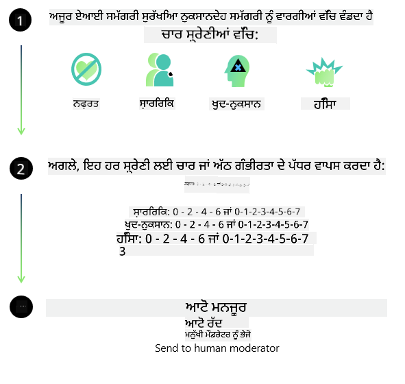
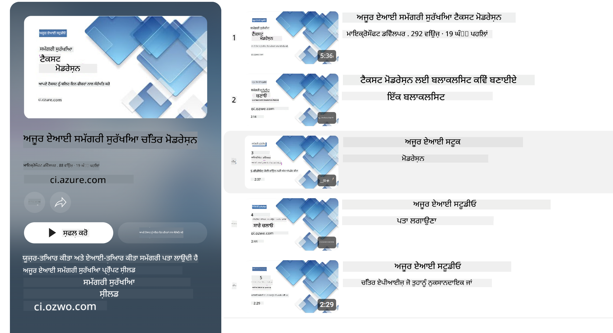

<!--
CO_OP_TRANSLATOR_METADATA:
{
  "original_hash": "c8273672cc57df2be675407a1383aaf0",
  "translation_date": "2025-05-09T05:51:27+00:00",
  "source_file": "md/01.Introduction/01/01.AISafety.md",
  "language_code": "pa"
}
-->
# ਫਾਈ ਮਾਡਲਾਂ ਲਈ ਏਆਈ ਸੁਰੱਖਿਆ  
ਫਾਈ ਪਰਿਵਾਰ ਦੇ ਮਾਡਲ [Microsoft Responsible AI Standard](https://query.prod.cms.rt.microsoft.com/cms/api/am/binary/RE5cmFl) ਦੇ ਅਨੁਸਾਰ ਵਿਕਸਿਤ ਕੀਤੇ ਗਏ ਹਨ, ਜੋ ਕਿ ਕੰਪਨੀ-ਵਿਆਪੀ ਲੋੜਾਂ ਦਾ ਸੈੱਟ ਹੈ ਜੋ ਛੇ ਮੁੱਖ ਸਿਧਾਂਤਾਂ 'ਤੇ ਆਧਾਰਿਤ ਹੈ: ਜਵਾਬਦੇਹੀ, ਪਾਰਦਰਸ਼ਤਾ, ਨਿਆਂਸੰਗਤਾ, ਭਰੋਸੇਯੋਗਤਾ ਅਤੇ ਸੁਰੱਖਿਆ, ਗੋਪਨੀਯਤਾ ਅਤੇ ਸੁਰੱਖਿਆ, ਅਤੇ ਸ਼ਾਮਿਲ ਕਰਨ ਵਾਲਾ ਸਿਧਾਂਤ ਜੋ [Microsoft ਦੇ Responsible AI principles](https://www.microsoft.com/ai/responsible-ai) ਬਣਾਉਂਦੇ ਹਨ।  

ਪਿਛਲੇ ਫਾਈ ਮਾਡਲਾਂ ਵਾਂਗ, ਇੱਕ ਬਹੁਪੱਖੀ ਸੁਰੱਖਿਆ ਮੁਲਾਂਕਣ ਅਤੇ ਸੁਰੱਖਿਆ ਪੋਸਟ-ਟ੍ਰੇਨਿੰਗ ਅਪ੍ਰੋਚ ਅਪਣਾਈ ਗਈ ਹੈ, ਜਿਸ ਵਿੱਚ ਇਸ ਰਿਲੀਜ਼ ਦੀ ਬਹੁ-ਭਾਸ਼ਾਈ ਸਮਰੱਥਾ ਨੂੰ ਧਿਆਨ ਵਿੱਚ ਰੱਖਦੇ ਹੋਏ ਵਾਧੂ ਉਪਾਇਆ ਕੀਤੇ ਗਏ ਹਨ। ਸਾਡਾ ਸੁਰੱਖਿਆ ਟ੍ਰੇਨਿੰਗ ਅਤੇ ਮੁਲਾਂਕਣ ਦਾ ਅਪ੍ਰੋਚ, ਜਿਸ ਵਿੱਚ ਕਈ ਭਾਸ਼ਾਵਾਂ ਅਤੇ ਜੋਖਮ ਸ਼੍ਰੇਣੀਆਂ ਵਿੱਚ ਟੈਸਟਿੰਗ ਸ਼ਾਮਿਲ ਹੈ, [Phi Safety Post-Training Paper](https://arxiv.org/abs/2407.13833) ਵਿੱਚ ਦਰਸਾਇਆ ਗਿਆ ਹੈ। ਜਦੋਂ ਕਿ ਫਾਈ ਮਾਡਲ ਇਸ ਅਪ੍ਰੋਚ ਤੋਂ ਲਾਭਾਨਵਿਤ ਹੁੰਦੇ ਹਨ, ਵਿਕਾਸਕਾਰਾਂ ਨੂੰ ਆਪਣੇ ਵਿਸ਼ੇਸ਼ ਵਰਤੋਂ ਕੇਸ ਅਤੇ ਸਾਂਸਕ੍ਰਿਤਿਕ ਅਤੇ ਭਾਸ਼ਾਈ ਸੰਦਰਭ ਦੇ ਜੋਖਮਾਂ ਦੀ ਮੈਪਿੰਗ, ਮਾਪਣ ਅਤੇ ਘਟਾਉਣ ਸਮੇਤ ਜ਼ਿੰਮੇਵਾਰ ਏਆਈ ਦੀਆਂ ਸਰਵੋਤਮ ਪ੍ਰਥਾਵਾਂ ਲਾਗੂ ਕਰਨੀ ਚਾਹੀਦੀ ਹੈ।  

## ਸਰਵੋਤਮ ਅਭਿਆਸ  

ਹੋਰ ਮਾਡਲਾਂ ਵਾਂਗ, ਫਾਈ ਪਰਿਵਾਰ ਦੇ ਮਾਡਲ ਅਜਿਹੇ ਤਰੀਕਿਆਂ ਨਾਲ ਵਰਤ ਸਕਦੇ ਹਨ ਜੋ ਨਿਆਂਸੰਗਤ, ਭਰੋਸੇਯੋਗ ਨਹੀਂ ਜਾਂ ਅਪਮਾਨਜਨਕ ਹੋ ਸਕਦੇ ਹਨ।  

SLM ਅਤੇ LLM ਦੀਆਂ ਕੁਝ ਸੀਮਿਤ ਵਰਤੋਂ ਦੀਆਂ ਵਿਸ਼ੇਸ਼ਤਾਵਾਂ ਜਿਨ੍ਹਾਂ ਤੋਂ ਸਾਵਧਾਨ ਰਹਿਣਾ ਜਰੂਰੀ ਹੈ:  

- **ਸੇਵਾ ਦੀ ਗੁਣਵੱਤਾ:** ਫਾਈ ਮਾਡਲ ਮੁੱਖ ਤੌਰ 'ਤੇ ਅੰਗਰੇਜ਼ੀ ਲਿਖਤ 'ਤੇ ਟ੍ਰੇਨ ਕੀਤੇ ਗਏ ਹਨ। ਅੰਗਰੇਜ਼ੀ ਤੋਂ ਇਲਾਵਾ ਹੋਰ ਭਾਸ਼ਾਵਾਂ ਵਿੱਚ ਕਾਰਗੁਜ਼ਾਰੀ ਘੱਟ ਹੋ ਸਕਦੀ ਹੈ। ਟ੍ਰੇਨਿੰਗ ਡਾਟਾ ਵਿੱਚ ਘੱਟ ਪ੍ਰਤੀਨਿਧਿਤ ਅੰਗਰੇਜ਼ੀ ਭਾਸ਼ਾ ਦੇ ਰੂਪ ਅਮਰੀਕੀ ਅੰਗਰੇਜ਼ੀ ਨਾਲੋਂ ਘੱਟ ਪ੍ਰਭਾਵਸ਼ਾਲੀ ਹੋ ਸਕਦੇ ਹਨ।  
- **ਨੁਕਸਾਨਾਂ ਦੀ ਪ੍ਰਤੀਨਿਧਤਾ ਅਤੇ ਸਟੀਰੀਓਟਾਈਪਸ ਦਾ ਜਾਰੀ ਰਹਿਣਾ:** ਇਹ ਮਾਡਲ ਕੁਝ ਸਮੂਹਾਂ ਨੂੰ ਜ਼ਿਆਦਾ ਜਾਂ ਘੱਟ ਦਰਸਾ ਸਕਦੇ ਹਨ, ਕੁਝ ਸਮੂਹਾਂ ਦੀ ਪ੍ਰਤੀਨਿਧਤਾ ਮਿਟਾ ਸਕਦੇ ਹਨ ਜਾਂ ਨਿੰਦਾ ਭਰੇ ਸਟੀਰੀਓਟਾਈਪਸ ਨੂੰ ਵਧਾ ਸਕਦੇ ਹਨ। ਸੁਰੱਖਿਆ ਪੋਸਟ-ਟ੍ਰੇਨਿੰਗ ਦੇ ਬਾਵਜੂਦ, ਇਹ ਸੀਮਾਵਾਂ ਟ੍ਰੇਨਿੰਗ ਡਾਟਾ ਵਿੱਚ ਵੱਖ-ਵੱਖ ਸਮੂਹਾਂ ਦੀ ਵੱਖਰੀ ਪ੍ਰਤੀਨਿਧਤਾ ਜਾਂ ਨਕਾਰਾਤਮਕ ਸਟੀਰੀਓਟਾਈਪਸ ਦੇ ਉਦਾਹਰਣਾਂ ਦੀ ਬਹੁਲਤਾ ਕਾਰਨ ਮੌਜੂਦ ਰਹਿ ਸਕਦੀਆਂ ਹਨ, ਜੋ ਅਸਲੀ ਦੁਨੀਆ ਦੇ ਰੁਝਾਨਾਂ ਅਤੇ ਸਮਾਜਿਕ ਪੱਖਪਾਤ ਨੂੰ ਦਰਸਾਉਂਦੀਆਂ ਹਨ।  
- **ਅਣਉਚਿਤ ਜਾਂ ਅਪਮਾਨਜਨਕ ਸਮੱਗਰੀ:** ਇਹ ਮਾਡਲ ਹੋਰ ਕਿਸਮ ਦੀਆਂ ਅਣਉਚਿਤ ਜਾਂ ਅਪਮਾਨਜਨਕ ਸਮੱਗਰੀ ਪੈਦਾ ਕਰ ਸਕਦੇ ਹਨ, ਜਿਸ ਕਾਰਨ ਇਹ ਸੰਵੇਦਨਸ਼ੀਲ ਸੰਦਰਭਾਂ ਵਿੱਚ ਵਰਤੋਂ ਲਈ ਅਨੁਕੂਲ ਨਹੀਂ ਹੋ ਸਕਦੇ ਬਿਨਾਂ ਵਰਤੋਂ ਕੇਸ ਦੇ ਖਾਸ ਉਪਾਇਆ ਲਗਾਏ।  
- **ਸੂਚਨਾ ਦੀ ਭਰੋਸੇਯੋਗਤਾ:** ਭਾਸ਼ਾ ਮਾਡਲ ਅਸਮਝਦਾਰ ਸਮੱਗਰੀ ਜਨਰੇਟ ਕਰ ਸਕਦੇ ਹਨ ਜਾਂ ਐਸੀ ਸਮੱਗਰੀ ਬਣਾ ਸਕਦੇ ਹਨ ਜੋ ਲਾਜ਼ਮੀ ਤੌਰ 'ਤੇ ਠੀਕ ਨਾ ਹੋਵੇ ਜਾਂ ਪੁਰਾਣੀ ਹੋ ਸਕਦੀ ਹੈ।  
- **ਕੋਡ ਲਈ ਸੀਮਿਤ ਦਾਇਰਾ:** ਫਾਈ-3 ਟ੍ਰੇਨਿੰਗ ਡਾਟਾ ਦਾ ਜ਼ਿਆਦਾਤਰ ਹਿੱਸਾ Python 'ਤੇ ਆਧਾਰਿਤ ਹੈ ਅਤੇ "typing, math, random, collections, datetime, itertools" ਵਰਗੇ ਆਮ ਪੈਕੇਜਾਂ ਦੀ ਵਰਤੋਂ ਕਰਦਾ ਹੈ। ਜੇ ਮਾਡਲ Python ਸਕ੍ਰਿਪਟਾਂ ਜਨਰੇਟ ਕਰਦਾ ਹੈ ਜੋ ਹੋਰ ਪੈਕੇਜਾਂ ਜਾਂ ਹੋਰ ਭਾਸ਼ਾਵਾਂ ਵਿੱਚ ਸਕ੍ਰਿਪਟਾਂ ਵਰਤਦੇ ਹਨ, ਤਾਂ ਅਸੀਂ ਉਪਭੋਗਤਾਵਾਂ ਨੂੰ ਸਾਰੇ API ਦੀ ਵਰਤੋਂ ਹੱਥੋਂ ਜਾਂਚਣ ਦੀ ਸਿਫਾਰਿਸ਼ ਕਰਦੇ ਹਾਂ।  

ਵਿਕਾਸਕਾਰਾਂ ਨੂੰ ਜ਼ਿੰਮੇਵਾਰ ਏਆਈ ਸਰਵੋਤਮ ਅਭਿਆਸ ਲਾਗੂ ਕਰਨੇ ਚਾਹੀਦੇ ਹਨ ਅਤੇ ਇਹ ਯਕੀਨੀ ਬਣਾਉਣਾ ਚਾਹੀਦਾ ਹੈ ਕਿ ਕੋਈ ਵਿਸ਼ੇਸ਼ ਵਰਤੋਂ ਕੇਸ ਸਬੰਧਤ ਕਾਨੂੰਨਾਂ ਅਤੇ ਨਿਯਮਾਂ (ਜਿਵੇਂ ਕਿ ਗੋਪਨੀਯਤਾ, ਵਪਾਰ ਆਦਿ) ਨਾਲ ਅਨੁਕੂਲ ਹੋਵੇ।  

## ਜ਼ਿੰਮੇਵਾਰ ਏਆਈ ਵਿਚਾਰ  

ਹੋਰ ਭਾਸ਼ਾ ਮਾਡਲਾਂ ਵਾਂਗ, ਫਾਈ ਸੀਰੀਜ਼ ਦੇ ਮਾਡਲ ਵੀ ਅਜਿਹੇ ਤਰੀਕਿਆਂ ਨਾਲ ਵਰਤ ਸਕਦੇ ਹਨ ਜੋ ਨਿਆਂਸੰਗਤ, ਭਰੋਸੇਯੋਗ ਨਹੀਂ ਜਾਂ ਅਪਮਾਨਜਨਕ ਹੋ ਸਕਦੇ ਹਨ। ਕੁਝ ਸੀਮਿਤ ਵਰਤੋਂ ਦੀਆਂ ਵਿਸ਼ੇਸ਼ਤਾਵਾਂ ਜਿਨ੍ਹਾਂ ਤੋਂ ਸਾਵਧਾਨ ਰਹਿਣਾ ਜਰੂਰੀ ਹੈ:  

**ਸੇਵਾ ਦੀ ਗੁਣਵੱਤਾ:** ਫਾਈ ਮਾਡਲ ਮੁੱਖ ਤੌਰ 'ਤੇ ਅੰਗਰੇਜ਼ੀ ਲਿਖਤ 'ਤੇ ਟ੍ਰੇਨ ਕੀਤੇ ਗਏ ਹਨ। ਅੰਗਰੇਜ਼ੀ ਤੋਂ ਇਲਾਵਾ ਹੋਰ ਭਾਸ਼ਾਵਾਂ ਵਿੱਚ ਕਾਰਗੁਜ਼ਾਰੀ ਘੱਟ ਹੋ ਸਕਦੀ ਹੈ। ਟ੍ਰੇਨਿੰਗ ਡਾਟਾ ਵਿੱਚ ਘੱਟ ਪ੍ਰਤੀਨਿਧਿਤ ਅੰਗਰੇਜ਼ੀ ਭਾਸ਼ਾ ਦੇ ਰੂਪ ਅਮਰੀਕੀ ਅੰਗਰੇਜ਼ੀ ਨਾਲੋਂ ਘੱਟ ਪ੍ਰਭਾਵਸ਼ਾਲੀ ਹੋ ਸਕਦੇ ਹਨ।  

**ਨੁਕਸਾਨਾਂ ਦੀ ਪ੍ਰਤੀਨਿਧਤਾ ਅਤੇ ਸਟੀਰੀਓਟਾਈਪਸ ਦਾ ਜਾਰੀ ਰਹਿਣਾ:** ਇਹ ਮਾਡਲ ਕੁਝ ਸਮੂਹਾਂ ਨੂੰ ਜ਼ਿਆਦਾ ਜਾਂ ਘੱਟ ਦਰਸਾ ਸਕਦੇ ਹਨ, ਕੁਝ ਸਮੂਹਾਂ ਦੀ ਪ੍ਰਤੀਨਿਧਤਾ ਮਿਟਾ ਸਕਦੇ ਹਨ ਜਾਂ ਨਿੰਦਾ ਭਰੇ ਸਟੀਰੀਓਟਾਈਪਸ ਨੂੰ ਵਧਾ ਸਕਦੇ ਹਨ। ਸੁਰੱਖਿਆ ਪੋਸਟ-ਟ੍ਰੇਨਿੰਗ ਦੇ ਬਾਵਜੂਦ, ਇਹ ਸੀਮਾਵਾਂ ਟ੍ਰੇਨਿੰਗ ਡਾਟਾ ਵਿੱਚ ਵੱਖ-ਵੱਖ ਸਮੂਹਾਂ ਦੀ ਵੱਖਰੀ ਪ੍ਰਤੀਨਿਧਤਾ ਜਾਂ ਨਕਾਰਾਤਮਕ ਸਟੀਰੀਓਟਾਈਪਸ ਦੇ ਉਦਾਹਰਣਾਂ ਦੀ ਬਹੁਲਤਾ ਕਾਰਨ ਮੌਜੂਦ ਰਹਿ ਸਕਦੀਆਂ ਹਨ, ਜੋ ਅਸਲੀ ਦੁਨੀਆ ਦੇ ਰੁਝਾਨਾਂ ਅਤੇ ਸਮਾਜਿਕ ਪੱਖਪਾਤ ਨੂੰ ਦਰਸਾਉਂਦੀਆਂ ਹਨ।  

**ਅਣਉਚਿਤ ਜਾਂ ਅਪਮਾਨਜਨਕ ਸਮੱਗਰੀ:** ਇਹ ਮਾਡਲ ਹੋਰ ਕਿਸਮ ਦੀਆਂ ਅਣਉਚਿਤ ਜਾਂ ਅਪਮਾਨਜਨਕ ਸਮੱਗਰੀ ਪੈਦਾ ਕਰ ਸਕਦੇ ਹਨ, ਜਿਸ ਕਾਰਨ ਇਹ ਸੰਵੇਦਨਸ਼ੀਲ ਸੰਦਰਭਾਂ ਵਿੱਚ ਵਰਤੋਂ ਲਈ ਅਨੁਕੂਲ ਨਹੀਂ ਹੋ ਸਕਦੇ ਬਿਨਾਂ ਵਰਤੋਂ ਕੇਸ ਦੇ ਖਾਸ ਉਪਾਇਆ ਲਗਾਏ।  
ਸੂਚਨਾ ਦੀ ਭਰੋਸੇਯੋਗਤਾ: ਭਾਸ਼ਾ ਮਾਡਲ ਅਸਮਝਦਾਰ ਸਮੱਗਰੀ ਜਨਰੇਟ ਕਰ ਸਕਦੇ ਹਨ ਜਾਂ ਐਸੀ ਸਮੱਗਰੀ ਬਣਾ ਸਕਦੇ ਹਨ ਜੋ ਲਾਜ਼ਮੀ ਤੌਰ 'ਤੇ ਠੀਕ ਨਾ ਹੋਵੇ ਜਾਂ ਪੁਰਾਣੀ ਹੋ ਸਕਦੀ ਹੈ।  

**ਕੋਡ ਲਈ ਸੀਮਿਤ ਦਾਇਰਾ:** ਫਾਈ-3 ਟ੍ਰੇਨਿੰਗ ਡਾਟਾ ਦਾ ਜ਼ਿਆਦਾਤਰ ਹਿੱਸਾ Python 'ਤੇ ਆਧਾਰਿਤ ਹੈ ਅਤੇ "typing, math, random, collections, datetime, itertools" ਵਰਗੇ ਆਮ ਪੈਕੇਜਾਂ ਦੀ ਵਰਤੋਂ ਕਰਦਾ ਹੈ। ਜੇ ਮਾਡਲ Python ਸਕ੍ਰਿਪਟਾਂ ਜਨਰੇਟ ਕਰਦਾ ਹੈ ਜੋ ਹੋਰ ਪੈਕੇਜਾਂ ਜਾਂ ਹੋਰ ਭਾਸ਼ਾਵਾਂ ਵਿੱਚ ਸਕ੍ਰਿਪਟਾਂ ਵਰਤਦੇ ਹਨ, ਤਾਂ ਅਸੀਂ ਉਪਭੋਗਤਾਵਾਂ ਨੂੰ ਸਾਰੇ API ਦੀ ਵਰਤੋਂ ਹੱਥੋਂ ਜਾਂਚਣ ਦੀ ਸਿਫਾਰਿਸ਼ ਕਰਦੇ ਹਾਂ।  

ਵਿਕਾਸਕਾਰਾਂ ਨੂੰ ਜ਼ਿੰਮੇਵਾਰ ਏਆਈ ਸਰਵੋਤਮ ਅਭਿਆਸ ਲਾਗੂ ਕਰਨੇ ਚਾਹੀਦੇ ਹਨ ਅਤੇ ਇਹ ਯਕੀਨੀ ਬਣਾਉਣਾ ਚਾਹੀਦਾ ਹੈ ਕਿ ਕੋਈ ਵਿਸ਼ੇਸ਼ ਵਰਤੋਂ ਕੇਸ ਸਬੰਧਤ ਕਾਨੂੰਨਾਂ ਅਤੇ ਨਿਯਮਾਂ (ਜਿਵੇਂ ਕਿ ਗੋਪਨੀਯਤਾ, ਵਪਾਰ ਆਦਿ) ਨਾਲ ਅਨੁਕੂਲ ਹੋਵੇ।  
ਮਹੱਤਵਪੂਰਨ ਵਿਚਾਰ ਕਰਨ ਵਾਲੇ ਖੇਤਰਾਂ ਵਿੱਚ ਸ਼ਾਮਿਲ ਹਨ:  

**ਵੰਡ:** ਮਾਡਲ ਅਜਿਹੇ ਸੰਦਰਭਾਂ ਲਈ ਉਚਿਤ ਨਹੀਂ ਹੋ ਸਕਦੇ ਜਿੱਥੇ ਕਾਨੂੰਨੀ ਦਰਜਾ ਜਾਂ ਸੰਸਾਧਨਾਂ ਜਾਂ ਜੀਵਨ ਦੇ ਮੌਕਿਆਂ ਦੀ ਵੰਡ 'ਤੇ ਗੰਭੀਰ ਪ੍ਰਭਾਵ ਪੈ ਸਕਦਾ ਹੈ (ਜਿਵੇਂ ਕਿ ਰਹਾਇਸ਼, ਨੌਕਰੀ, ਕਰੈਡਿਟ ਆਦਿ) ਬਿਨਾਂ ਹੋਰ ਮੁਲਾਂਕਣਾਂ ਅਤੇ ਵਾਧੂ ਪੱਖਪਾਤ ਘਟਾਉਣ ਵਾਲੀਆਂ ਤਕਨੀਕਾਂ ਦੇ।  

**ਉੱਚ-ਜੋਖਮ ਵਾਲੇ ਸੰਦਰਭ:** ਵਿਕਾਸਕਾਰਾਂ ਨੂੰ ਉਹਨਾਂ ਸੰਦਰਭਾਂ ਵਿੱਚ ਮਾਡਲ ਦੀ ਵਰਤੋਂ ਦੀ ਯੋਗਤਾ ਦਾ ਮੁਲਾਂਕਣ ਕਰਨਾ ਚਾਹੀਦਾ ਹੈ ਜਿੱਥੇ ਨਿਆਂਸੰਗਤ, ਭਰੋਸੇਯੋਗ ਨਹੀਂ ਜਾਂ ਅਪਮਾਨਜਨਕ ਨਤੀਜੇ ਬਹੁਤ ਮਹਿੰਗੇ ਹੋ ਸਕਦੇ ਹਨ ਜਾਂ ਨੁਕਸਾਨ ਪਹੁੰਚਾ ਸਕਦੇ ਹਨ। ਇਸ ਵਿੱਚ ਸੰਵੇਦਨਸ਼ੀਲ ਜਾਂ ਵਿਸ਼ੇਸ਼ਗਿਆਨ ਖੇਤਰਾਂ ਵਿੱਚ ਸਲਾਹ ਦੇਣਾ ਸ਼ਾਮਿਲ ਹੈ ਜਿੱਥੇ ਸਹੀ ਅਤੇ ਭਰੋਸੇਯੋਗ ਜਾਣਕਾਰੀ ਜ਼ਰੂਰੀ ਹੈ (ਜਿਵੇਂ ਕਾਨੂੰਨੀ ਜਾਂ ਸਿਹਤ ਸਲਾਹ)। ਐਪਲੀਕੇਸ਼ਨ ਪੱਧਰ 'ਤੇ ਵਾਧੂ ਸੁਰੱਖਿਆ ਉਪਾਇਆ ਲਾਗੂ ਕੀਤੇ ਜਾਣੇ ਚਾਹੀਦੇ ਹਨ ਜੋ ਤੈਨਾਤੀ ਸੰਦਰਭ ਦੇ ਅਨੁਸਾਰ ਹੋਣ।  

**ਗਲਤ ਜਾਣਕਾਰੀ:** ਮਾਡਲ ਗਲਤ ਜਾਣਕਾਰੀ ਪੈਦਾ ਕਰ ਸਕਦੇ ਹਨ। ਵਿਕਾਸਕਾਰਾਂ ਨੂੰ ਪਾਰਦਰਸ਼ਤਾ ਦੀਆਂ ਸਰਵੋਤਮ ਪ੍ਰਥਾਵਾਂ ਦੀ ਪਾਲਣਾ ਕਰਨੀ ਚਾਹੀਦੀ ਹੈ ਅਤੇ ਅੰਤ-ਉਪਭੋਗਤਾਵਾਂ ਨੂੰ ਦੱਸਣਾ ਚਾਹੀਦਾ ਹੈ ਕਿ ਉਹ ਏਆਈ ਸਿਸਟਮ ਨਾਲ ਗੱਲਬਾਤ ਕਰ ਰਹੇ ਹਨ। ਐਪਲੀਕੇਸ਼ਨ ਪੱਧਰ 'ਤੇ, ਵਿਕਾਸਕਾਰ ਫੀਡਬੈਕ ਮਕੈਨਿਜ਼ਮ ਅਤੇ ਪਾਈਪਲਾਈਨ ਤਿਆਰ ਕਰ ਸਕਦੇ ਹਨ ਜੋ ਜਵਾਬਾਂ ਨੂੰ ਵਰਤੋਂ ਕੇਸ ਵਿਸ਼ੇਸ਼, ਸੰਦਰਭਿਕ ਜਾਣਕਾਰੀ ਨਾਲ ਜੁੜੇ ਹੋਣ, ਜਿਸ ਨੂੰ Retrieval Augmented Generation (RAG) ਕਹਿੰਦੇ ਹਨ।  

**ਨੁਕਸਾਨਦਾਇਕ ਸਮੱਗਰੀ ਦੀ ਪੈਦਾਵਾਰ:** ਵਿਕਾਸਕਾਰਾਂ ਨੂੰ ਆਪਣੇ ਸੰਦਰਭ ਲਈ ਨਤੀਜਿਆਂ ਦਾ ਮੁਲਾਂਕਣ ਕਰਨਾ ਚਾਹੀਦਾ ਹੈ ਅਤੇ ਉਪਲਬਧ ਸੁਰੱਖਿਆ ਕਲਾਸੀਫਾਇਰਾਂ ਜਾਂ ਖਾਸ ਹੱਲਾਂ ਦੀ ਵਰਤੋਂ ਕਰਨੀ ਚਾਹੀਦੀ ਹੈ ਜੋ ਉਨ੍ਹਾਂ ਦੇ ਵਰਤੋਂ ਕੇਸ ਲਈ موزੂ ਹਨ।  

**ਗਲਤ ਵਰਤੋਂ:** ਧੋਖਾਧੜੀ, ਸਪੈਮ ਜਾਂ ਮਾਲਵੇਅਰ ਬਣਾਉਣ ਵਰਗੀਆਂ ਹੋਰ ਗਲਤ ਵਰਤੋਂਆਂ ਸੰਭਵ ਹਨ, ਅਤੇ ਵਿਕਾਸਕਾਰਾਂ ਨੂੰ ਇਹ ਯਕੀਨੀ ਬਣਾਉਣਾ ਚਾਹੀਦਾ ਹੈ ਕਿ ਉਹਨਾਂ ਦੇ ਐਪਲੀਕੇਸ਼ਨ ਲਾਗੂ ਕਾਨੂੰਨਾਂ ਅਤੇ ਨਿਯਮਾਂ ਦਾ ਉਲੰਘਣ ਨਾ ਕਰਨ।  

### ਫਾਈਨਟਿਊਨਿੰਗ ਅਤੇ ਏਆਈ ਸਮੱਗਰੀ ਸੁਰੱਖਿਆ  

ਮਾਡਲ ਨੂੰ ਫਾਈਨ-ਟਿਊਨ ਕਰਨ ਤੋਂ ਬਾਅਦ, ਅਸੀਂ ਬਹੁਤ ਜ਼ੋਰ ਦੇ ਕੇ ਸਿਫਾਰਿਸ਼ ਕਰਦੇ ਹਾਂ ਕਿ [Azure AI Content Safety](https://learn.microsoft.com/azure/ai-services/content-safety/overview) ਉਪਾਇਆ ਵਰਤੇ ਜਾਣ ਤਾਂ ਜੋ ਮਾਡਲਾਂ ਵੱਲੋਂ ਬਣਾਈ ਗਈ ਸਮੱਗਰੀ ਦੀ ਨਿਗਰਾਨੀ ਕੀਤੀ ਜਾ ਸਕੇ, ਸੰਭਾਵਿਤ ਜੋਖਮਾਂ, ਧਮਕੀਆਂ ਅਤੇ ਗੁਣਵੱਤਾ ਸਮੱਸਿਆਵਾਂ ਦੀ ਪਹਚਾਣ ਅਤੇ ਰੋਕਥਾਮ ਕੀਤੀ ਜਾ ਸਕੇ।  

  

[Azure AI Content Safety](https://learn.microsoft.com/azure/ai-services/content-safety/overview) ਟੈਕਸਟ ਅਤੇ ਚਿੱਤਰ ਸਮੱਗਰੀ ਦੋਹਾਂ ਨੂੰ ਸਹਿਯੋਗ ਦਿੰਦਾ ਹੈ। ਇਹ ਕਲਾਉਡ, ਡਿਸਕਨੈਕਟਿਡ ਕੰਟੇਨਰ ਅਤੇ ਐਜ/ਐਂਬੈਡਡ ਡਿਵਾਈਸز 'ਤੇ ਤੈਨਾਤ ਕੀਤਾ ਜਾ ਸਕਦਾ ਹੈ।  

## Azure AI Content Safety ਦਾ ਜਾਇਜ਼ਾ  

Azure AI Content Safety ਹਰ ਕਿਸਮ ਦੀ ਹਾਲਤ ਲਈ ਇੱਕੋ ਜਿਹਾ ਹੱਲ ਨਹੀਂ ਹੈ; ਇਸਨੂੰ ਕਾਰੋਬਾਰਾਂ ਦੀਆਂ ਖਾਸ ਨੀਤੀਆਂ ਨਾਲ ਮਿਲਾਉਣ ਲਈ ਕਸਟਮਾਈਜ਼ ਕੀਤਾ ਜਾ ਸਕਦਾ ਹੈ। ਇਸਦੇ ਨਾਲ ਨਾਲ, ਇਸਦੇ ਬਹੁ-ਭਾਸ਼ਾਈ ਮਾਡਲ ਇਸਨੂੰ ਇੱਕ ਸਮੇਂ ਵਿੱਚ ਕਈ ਭਾਸ਼ਾਵਾਂ ਨੂੰ ਸਮਝਣ ਯੋਗ ਬਣਾਉਂਦੇ ਹਨ।  

  

- **Azure AI Content Safety**  
- **Microsoft Developer**  
- **5 ਵੀਡੀਓਜ਼**  

Azure AI Content Safety ਸੇਵਾ ਐਪਲੀਕੇਸ਼ਨਾਂ ਅਤੇ ਸੇਵਾਵਾਂ ਵਿੱਚ ਨੁਕਸਾਨਦਾਇਕ ਉਪਭੋਗਤਾ-ਜਨਰੇਟ ਅਤੇ ਏਆਈ-ਜਨਰੇਟ ਸਮੱਗਰੀ ਦੀ ਪਹਚਾਣ ਕਰਦੀ ਹੈ। ਇਸ ਵਿੱਚ ਟੈਕਸਟ ਅਤੇ ਚਿੱਤਰ API ਸ਼ਾਮਿਲ ਹਨ ਜੋ ਤੁਹਾਨੂੰ ਨੁਕਸਾਨਦਾਇਕ ਜਾਂ ਅਣਉਚਿਤ ਸਮੱਗਰੀ ਦੀ ਪਹਚਾਣ ਕਰਨ ਦਿੰਦੇ ਹਨ।  

[AI Content Safety Playlist](https://www.youtube.com/playlist?list=PLlrxD0HtieHjaQ9bJjyp1T7FeCbmVcPkQ)

**ਇਸ ਬਿਆਨਬਾਜ਼ੀ**:  
ਇਹ ਦਸਤਾਵੇਜ਼ AI ਅਨੁਵਾਦ ਸੇਵਾ [Co-op Translator](https://github.com/Azure/co-op-translator) ਦੀ ਵਰਤੋਂ ਕਰਕੇ ਅਨੁਵਾਦ ਕੀਤਾ ਗਿਆ ਹੈ। ਜਦੋਂ ਕਿ ਅਸੀਂ ਸਹੀਅਤ ਲਈ ਕੋਸ਼ਿਸ਼ ਕਰਦੇ ਹਾਂ, ਕਿਰਪਾ ਕਰਕੇ ਧਿਆਨ ਰੱਖੋ ਕਿ ਸਵੈਚਾਲਿਤ ਅਨੁਵਾਦਾਂ ਵਿੱਚ ਗਲਤੀਆਂ ਜਾਂ ਅਸਹੀਤਾਵਾਂ ਹੋ ਸਕਦੀਆਂ ਹਨ। ਮੂਲ ਦਸਤਾਵੇਜ਼ ਆਪਣੀ ਮੂਲ ਭਾਸ਼ਾ ਵਿੱਚ ਪ੍ਰਮਾਣਿਕ ਸਰੋਤ ਵਜੋਂ ਮੰਨਿਆ ਜਾਣਾ ਚਾਹੀਦਾ ਹੈ। ਮਹੱਤਵਪੂਰਨ ਜਾਣਕਾਰੀ ਲਈ, ਪੇਸ਼ੇਵਰ ਮਨੁੱਖੀ ਅਨੁਵਾਦ ਦੀ ਸਿਫਾਰਸ਼ ਕੀਤੀ ਜਾਂਦੀ ਹੈ। ਅਸੀਂ ਇਸ ਅਨੁਵਾਦ ਦੀ ਵਰਤੋਂ ਤੋਂ ਉਤਪੰਨ ਕਿਸੇ ਵੀ ਗਲਤਫਹਿਮੀ ਜਾਂ ਗਲਤ ਵਿਵਰਣ ਲਈ ਜ਼ਿੰਮੇਵਾਰ ਨਹੀਂ ਹਾਂ।