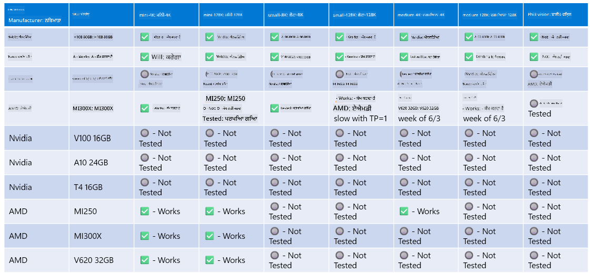

<!--
CO_OP_TRANSLATOR_METADATA:
{
  "original_hash": "8cdc17ce0f10535da30b53d23fe1a795",
  "translation_date": "2025-05-09T07:48:00+00:00",
  "source_file": "md/01.Introduction/01/01.Hardwaresupport.md",
  "language_code": "pa"
}
-->
# ਫਾਈ ਹਾਰਡਵੇਅਰ ਸਹਾਇਤਾ

Microsoft Phi ਨੂੰ ONNX Runtime ਲਈ ਅਨੁਕੂਲਿਤ ਕੀਤਾ ਗਿਆ ਹੈ ਅਤੇ ਇਹ Windows DirectML ਨੂੰ ਸਹਾਇਤ ਕਰਦਾ ਹੈ। ਇਹ ਵੱਖ-ਵੱਖ ਕਿਸਮਾਂ ਦੇ ਹਾਰਡਵੇਅਰ, ਜਿਵੇਂ ਕਿ GPUs, CPUs ਅਤੇ ਮੋਬਾਈਲ ਡਿਵਾਈਸਾਂ 'ਤੇ ਵੀ ਚੰਗੀ ਤਰ੍ਹਾਂ ਕੰਮ ਕਰਦਾ ਹੈ।

## ਡਿਵਾਈਸ ਹਾਰਡਵੇਅਰ  
ਖਾਸ ਤੌਰ 'ਤੇ, ਸਹਾਇਤ ਕੀਤੇ ਹਾਰਡਵੇਅਰ ਵਿੱਚ ਸ਼ਾਮਲ ਹਨ:

- GPU SKU: RTX 4090 (DirectML)  
- GPU SKU: 1 A100 80GB (CUDA)  
- CPU SKU: Standard F64s v2 (64 vCPUs, 128 GiB ਮੈਮੋਰੀ)

## ਮੋਬਾਈਲ SKU

- ਐਂਡਰਾਇਡ - Samsung Galaxy S21  
- Apple iPhone 14 ਜਾਂ ਉੱਚੇ A16/A17 ਪ੍ਰੋਸੈਸਰ

## ਫਾਈ ਹਾਰਡਵੇਅਰ ਵਿਸ਼ੇਸ਼ਤਾਵਾਂ

- ਘੱਟੋ-ਘੱਟ ਸੰਰਚਨਾ ਦੀ ਲੋੜ।  
- Windows: DirectX 12-ਯੋਗ GPU ਅਤੇ ਘੱਟੋ-ਘੱਟ 4GB ਮਿਲੀ-ਜੁਲੀ RAM  

CUDA: NVIDIA GPU ਜਿਸ ਦੀ Compute Capability >= 7.02 ਹੋਵੇ



## ਕਈ GPUs 'ਤੇ onnxruntime ਚਲਾਉਣਾ

ਹੁਣ ਤੱਕ ਉਪਲਬਧ Phi ONNX ਮਾਡਲ ਸਿਰਫ 1 GPU ਲਈ ਹਨ। Phi ਮਾਡਲ ਲਈ multi-gpu ਸਹਾਇਤਾ ਸੰਭਵ ਹੈ, ਪਰ 2 GPUs ਨਾਲ ORT ਇਹ ਗਾਰੰਟੀ ਨਹੀਂ ਦਿੰਦਾ ਕਿ ਇਹ 2 ORT ਇੰਸਟੈਂਸ ਦੀ ਤੁਲਨਾ ਵਿੱਚ ਵੱਧ throughput ਦੇਵੇਗਾ। ਤਾਜ਼ਾ ਜਾਣਕਾਰੀਆਂ ਲਈ ਕਿਰਪਾ ਕਰਕੇ [ONNX Runtime](https://onnxruntime.ai/) ਵੇਖੋ।

[Build 2024 the GenAI ONNX Team](https://youtu.be/WLW4SE8M9i8?si=EtG04UwDvcjunyfC) ਨੇ ਘੋਸ਼ਣਾ ਕੀਤੀ ਕਿ ਉਹਨਾਂ ਨੇ Phi ਮਾਡਲਾਂ ਲਈ multi-gpu ਦੀ ਥਾਂ multi-instance ਸਹਾਇਤਾ ਚਾਲੂ ਕਰ ਦਿੱਤੀ ਹੈ।  

ਹੁਣ ਇਹ ਤੁਹਾਨੂੰ ਇੱਕ onnnxruntime ਜਾਂ onnxruntime-genai ਇੰਸਟੈਂਸ CUDA_VISIBLE_DEVICES ਵਾਤਾਵਰਣ ਚਰ ਨੂੰ ਇਸ ਤਰ੍ਹਾਂ ਸੈੱਟ ਕਰਕੇ ਚਲਾਉਣ ਦੀ ਆਗਿਆ ਦਿੰਦਾ ਹੈ।

```Python
CUDA_VISIBLE_DEVICES=0 python infer.py
CUDA_VISIBLE_DEVICES=1 python infer.py
```

Phi ਬਾਰੇ ਹੋਰ ਜਾਣਕਾਰੀ ਲਈ [Azure AI Foundry](https://ai.azure.com) 'ਤੇ ਜਾਓ।

**ਡਿਸਕਲੇਮਰ**:  
ਇਹ ਦਸਤਾਵੇਜ਼ AI ਅਨੁਵਾਦ ਸੇਵਾ [Co-op Translator](https://github.com/Azure/co-op-translator) ਦੀ ਵਰਤੋਂ ਕਰਕੇ ਅਨੁਵਾਦਿਤ ਕੀਤਾ ਗਿਆ ਹੈ। ਜਦੋਂ ਕਿ ਅਸੀਂ ਸਹੀਅਤ ਲਈ ਕੋਸ਼ਿਸ਼ ਕਰਦੇ ਹਾਂ, ਕਿਰਪਾ ਕਰਕੇ ਧਿਆਨ ਰੱਖੋ ਕਿ ਸਵੈਚਾਲਿਤ ਅਨੁਵਾਦਾਂ ਵਿੱਚ ਗਲਤੀਆਂ ਜਾਂ ਅਸਥਿਰਤਾਵਾਂ ਹੋ ਸਕਦੀਆਂ ਹਨ। ਮੂਲ ਦਸਤਾਵੇਜ਼ ਆਪਣੀ ਮੂਲ ਭਾਸ਼ਾ ਵਿੱਚ ਹੀ ਅਧਿਕਾਰਤ ਸਰੋਤ ਮੰਨਿਆ ਜਾਣਾ ਚਾਹੀਦਾ ਹੈ। ਜ਼ਰੂਰੀ ਜਾਣਕਾਰੀ ਲਈ, ਪੇਸ਼ੇਵਰ ਮਨੁੱਖੀ ਅਨੁਵਾਦ ਦੀ ਸਿਫਾਰਸ਼ ਕੀਤੀ ਜਾਂਦੀ ਹੈ। ਅਸੀਂ ਇਸ ਅਨੁਵਾਦ ਦੀ ਵਰਤੋਂ ਤੋਂ ਪੈਦਾ ਹੋਣ ਵਾਲੀਆਂ ਕਿਸੇ ਵੀ ਗਲਤਫਹਮੀਆਂ ਜਾਂ ਗਲਤ ਵਿਆਖਿਆਵਾਂ ਲਈ ਜ਼ਿੰਮੇਵਾਰ ਨਹੀਂ ਹਾਂ।