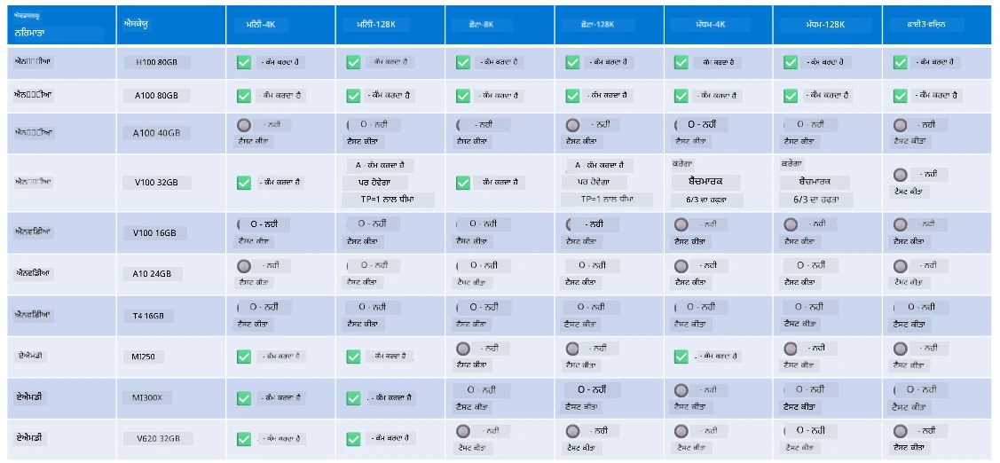

# Phi Hardware Support

Microsoft Phi ਨੂੰ ONNX Runtime ਲਈ ਅਨੁਕੂਲਿਤ ਕੀਤਾ ਗਿਆ ਹੈ ਅਤੇ ਇਹ Windows DirectML ਨੂੰ ਸਹਿਯੋਗ ਦਿੰਦਾ ਹੈ। ਇਹ ਵੱਖ-ਵੱਖ ਹਾਰਡਵੇਅਰ ਕਿਸਮਾਂ ਤੇ ਚੰਗੀ ਤਰ੍ਹਾਂ ਕੰਮ ਕਰਦਾ ਹੈ, ਜਿਵੇਂ ਕਿ GPUs, CPUs, ਅਤੇ ਇੱਥੋਂ ਤੱਕ ਕਿ ਮੋਬਾਈਲ ਡਿਵਾਈਸز ਵੀ।

## Device Hardware  
ਖਾਸ ਤੌਰ 'ਤੇ, ਸਹਿਯੋਗੀ ਹਾਰਡਵੇਅਰ ਵਿੱਚ ਸ਼ਾਮਲ ਹਨ:

- GPU SKU: RTX 4090 (DirectML)  
- GPU SKU: 1 A100 80GB (CUDA)  
- CPU SKU: Standard F64s v2 (64 vCPUs, 128 GiB ਮੈਮੋਰੀ)  

## Mobile SKU

- Android - Samsung Galaxy S21  
- Apple iPhone 14 ਜਾਂ ਉੱਪਰਲਾ A16/A17 ਪ੍ਰੋਸੈਸਰ  

## Phi Hardware Specification

- ਘੱਟੋ-ਘੱਟ ਸੰਰਚਨਾ ਦੀ ਲੋੜ।  
- Windows: DirectX 12-ਯੋਗ GPU ਅਤੇ ਘੱਟੋ-ਘੱਟ 4GB ਮਿਲੀ-ਜੁਲੀ RAM  

CUDA: NVIDIA GPU ਜਿਸ ਦੀ Compute Capability >= 7.02 ਹੋਵੇ  



## Running onnxruntime on multiple GPUs

ਮੌਜੂਦਾ ਸਮੇਂ Phi ONNX ਮਾਡਲ ਸਿਰਫ਼ 1 GPU ਲਈ ਉਪਲਬਧ ਹਨ। Phi ਮਾਡਲ ਲਈ ਮਲਟੀ-GPU ਸਹਿਯੋਗ ਸੰਭਵ ਹੈ, ਪਰ 2 GPU ਨਾਲ ORT ਇਹ ਗਾਰੰਟੀ ਨਹੀਂ ਦਿੰਦਾ ਕਿ ਇਹ 2 ORT ਇੰਸਟੈਂਸ ਨਾਲੋਂ ਵੱਧ throughput ਦੇਵੇਗਾ। ਤਾਜ਼ਾ ਜਾਣਕਾਰੀ ਲਈ ਕਿਰਪਾ ਕਰਕੇ [ONNX Runtime](https://onnxruntime.ai/) ਵੇਖੋ।

[Build 2024 the GenAI ONNX Team](https://youtu.be/WLW4SE8M9i8?si=EtG04UwDvcjunyfC) ਨੇ ਐਲਾਨ ਕੀਤਾ ਕਿ ਉਹਨਾਂ ਨੇ Phi ਮਾਡਲਾਂ ਲਈ ਮਲਟੀ-GPU ਦੀ ਥਾਂ ਮਲਟੀ-ਇੰਸਟੈਂਸ ਨੂੰ ਯੋਗ ਕੀਤਾ ਹੈ।  

ਹੁਣ ਇਸ ਨਾਲ ਤੁਸੀਂ CUDA_VISIBLE_DEVICES ਵਾਤਾਵਰਣ ਚਰ (environment variable) ਦੇ ਨਾਲ ਇੱਕ onnxruntime ਜਾਂ onnxruntime-genai ਇੰਸਟੈਂਸ ਚਲਾ ਸਕਦੇ ਹੋ।  

```Python
CUDA_VISIBLE_DEVICES=0 python infer.py
CUDA_VISIBLE_DEVICES=1 python infer.py
```

Phi ਬਾਰੇ ਹੋਰ ਜਾਣਕਾਰੀ ਲਈ [Azure AI Foundry](https://ai.azure.com) 'ਤੇ ਖੋਜ ਕਰੋ।

**ਅਸਵੀਕਾਰੋਪਣ**:  
ਇਹ ਦਸਤਾਵੇਜ਼ AI ਅਨੁਵਾਦ ਸੇਵਾ [Co-op Translator](https://github.com/Azure/co-op-translator) ਦੀ ਵਰਤੋਂ ਕਰਕੇ ਅਨੁਵਾਦਿਤ ਕੀਤਾ ਗਿਆ ਹੈ। ਜਦੋਂ ਕਿ ਅਸੀਂ ਸਹੀਤਾ ਲਈ ਕੋਸ਼ਿਸ਼ ਕਰਦੇ ਹਾਂ, ਕਿਰਪਾ ਕਰਕੇ ਧਿਆਨ ਰੱਖੋ ਕਿ ਸਵੈਚਾਲਿਤ ਅਨੁਵਾਦਾਂ ਵਿੱਚ ਗਲਤੀਆਂ ਜਾਂ ਅਸਮਰਥਤਾਵਾਂ ਹੋ ਸਕਦੀਆਂ ਹਨ। ਮੂਲ ਦਸਤਾਵੇਜ਼ ਆਪਣੀ ਮੂਲ ਭਾਸ਼ਾ ਵਿੱਚ ਪ੍ਰਮਾਣਿਕ ਸਰੋਤ ਮੰਨਿਆ ਜਾਣਾ ਚਾਹੀਦਾ ਹੈ। ਮਹੱਤਵਪੂਰਨ ਜਾਣਕਾਰੀ ਲਈ, ਪੇਸ਼ੇਵਰ ਮਨੁੱਖੀ ਅਨੁਵਾਦ ਦੀ ਸਿਫਾਰਸ਼ ਕੀਤੀ ਜਾਂਦੀ ਹੈ। ਅਸੀਂ ਇਸ ਅਨੁਵਾਦ ਦੀ ਵਰਤੋਂ ਤੋਂ ਉਤਪੰਨ ਕਿਸੇ ਵੀ ਗਲਤਫਹਮੀ ਜਾਂ ਗਲਤ ਵਿਆਖਿਆ ਲਈ ਜ਼ਿੰਮੇਵਾਰ ਨਹੀਂ ਹਾਂ।