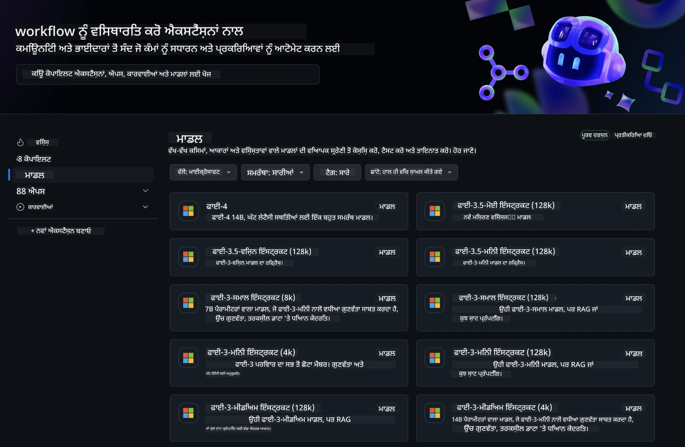
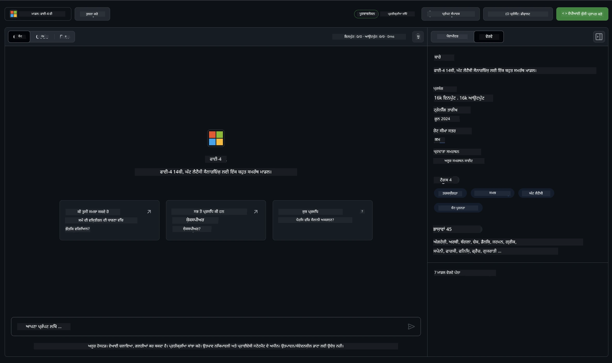
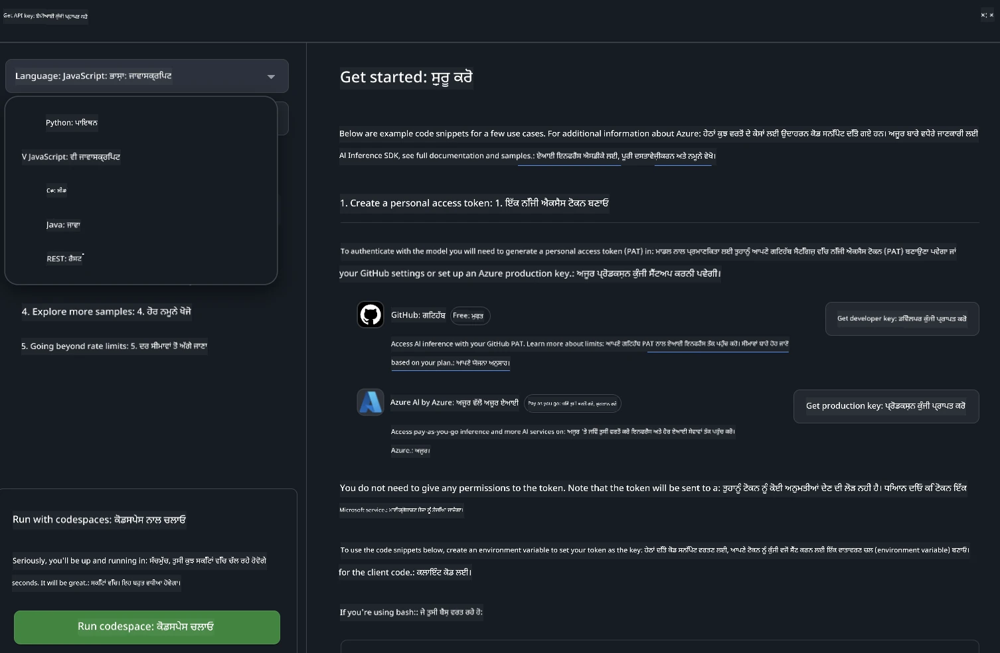
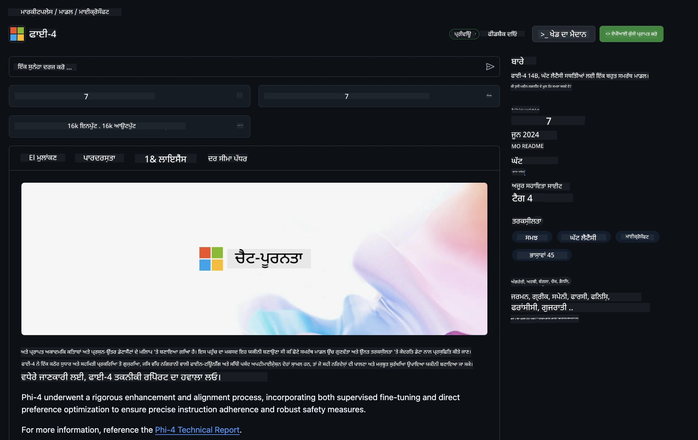

<!--
CO_OP_TRANSLATOR_METADATA:
{
  "original_hash": "fb67a08b9fc911a10ed58081fadef416",
  "translation_date": "2025-07-16T18:59:50+00:00",
  "source_file": "md/01.Introduction/02/02.GitHubModel.md",
  "language_code": "pa"
}
-->
## GitHub ਮਾਡਲਾਂ ਵਿੱਚ Phi ਪਰਿਵਾਰ

[GitHub ਮਾਡਲਾਂ](https://github.com/marketplace/models) ਵਿੱਚ ਤੁਹਾਡਾ ਸਵਾਗਤ ਹੈ! ਅਸੀਂ ਤੁਹਾਡੇ ਲਈ Azure AI ‘ਤੇ ਹੋਸਟ ਕੀਤੇ AI ਮਾਡਲਾਂ ਦੀ ਖੋਜ ਲਈ ਸਾਰਾ ਕੁਝ ਤਿਆਰ ਕਰ ਦਿੱਤਾ ਹੈ।



GitHub ਮਾਡਲਾਂ ‘ਤੇ ਉਪਲਬਧ ਮਾਡਲਾਂ ਬਾਰੇ ਹੋਰ ਜਾਣਕਾਰੀ ਲਈ, [GitHub Model Marketplace](https://github.com/marketplace/models) ਵੇਖੋ।

## ਉਪਲਬਧ ਮਾਡਲ

ਹਰ ਮਾਡਲ ਲਈ ਇੱਕ ਸਮਰਪਿਤ ਪਲੇਗ੍ਰਾਊਂਡ ਅਤੇ ਨਮੂਨਾ ਕੋਡ ਹੈ।



### GitHub ਮਾਡਲ ਕੈਟਾਲੌਗ ਵਿੱਚ Phi ਪਰਿਵਾਰ

- [Phi-4](https://github.com/marketplace/models/azureml/Phi-4)

- [Phi-3.5-MoE instruct (128k)](https://github.com/marketplace/models/azureml/Phi-3-5-MoE-instruct)

- [Phi-3.5-vision instruct (128k)](https://github.com/marketplace/models/azureml/Phi-3-5-vision-instruct)

- [Phi-3.5-mini instruct (128k)](https://github.com/marketplace/models/azureml/Phi-3-5-mini-instruct)

- [Phi-3-Medium-128k-Instruct](https://github.com/marketplace/models/azureml/Phi-3-medium-128k-instruct)

- [Phi-3-medium-4k-instruct](https://github.com/marketplace/models/azureml/Phi-3-medium-4k-instruct)

- [Phi-3-mini-128k-instruct](https://github.com/marketplace/models/azureml/Phi-3-mini-128k-instruct)

- [Phi-3-mini-4k-instruct](https://github.com/marketplace/models/azureml/Phi-3-mini-4k-instruct)

- [Phi-3-small-128k-instruct](https://github.com/marketplace/models/azureml/Phi-3-small-128k-instruct)

- [Phi-3-small-8k-instruct](https://github.com/marketplace/models/azureml/Phi-3-small-8k-instruct)

## ਸ਼ੁਰੂਆਤ ਕਰਨਾ

ਕੁਝ ਬੁਨਿਆਦੀ ਉਦਾਹਰਣਾਂ ਤੁਹਾਡੇ ਲਈ ਤਿਆਰ ਹਨ ਜੋ ਤੁਸੀਂ ਚਲਾ ਸਕਦੇ ਹੋ। ਇਹਨਾਂ ਨੂੰ ਤੁਸੀਂ samples ਡਾਇਰੈਕਟਰੀ ਵਿੱਚ ਲੱਭ ਸਕਦੇ ਹੋ। ਜੇ ਤੁਸੀਂ ਆਪਣੀ ਮਨਪਸੰਦ ਭਾਸ਼ਾ ਵਿੱਚ ਸਿੱਧਾ ਜਾਣਾ ਚਾਹੁੰਦੇ ਹੋ, ਤਾਂ ਉਦਾਹਰਣਾਂ ਹੇਠਾਂ ਦਿੱਤੀਆਂ ਭਾਸ਼ਾਵਾਂ ਵਿੱਚ ਮਿਲ ਜਾਣਗੀਆਂ:

- Python  
- JavaScript  
- C#  
- Java  
- cURL  

ਨਮੂਨੇ ਅਤੇ ਮਾਡਲ ਚਲਾਉਣ ਲਈ ਇੱਕ ਸਮਰਪਿਤ Codespaces Environment ਵੀ ਉਪਲਬਧ ਹੈ।



## ਨਮੂਨਾ ਕੋਡ

ਹੇਠਾਂ ਕੁਝ ਵਰਤੋਂ ਦੇ ਕੇਸਾਂ ਲਈ ਉਦਾਹਰਣ ਕੋਡ ਸਨਿੱਪੇਟ ਦਿੱਤੇ ਗਏ ਹਨ। Azure AI Inference SDK ਬਾਰੇ ਵਧੇਰੇ ਜਾਣਕਾਰੀ ਲਈ ਪੂਰੀ ਡੌਕਯੂਮੈਂਟੇਸ਼ਨ ਅਤੇ ਨਮੂਨੇ ਵੇਖੋ।

## ਸੈਟਅਪ

1. ਇੱਕ personal access token ਬਣਾਓ  
ਤੁਹਾਨੂੰ ਟੋਕਨ ਨੂੰ ਕਿਸੇ ਵੀ ਪਰਮਿਸ਼ਨ ਦੇਣ ਦੀ ਲੋੜ ਨਹੀਂ ਹੈ। ਧਿਆਨ ਰੱਖੋ ਕਿ ਟੋਕਨ ਮਾਈਕ੍ਰੋਸਾਫਟ ਸਰਵਿਸ ਨੂੰ ਭੇਜਿਆ ਜਾਵੇਗਾ।

ਹੇਠਾਂ ਦਿੱਤੇ ਕੋਡ ਸਨਿੱਪੇਟ ਵਰਤਣ ਲਈ, ਆਪਣੇ ਟੋਕਨ ਨੂੰ client ਕੋਡ ਲਈ ਕੁੰਜੀ ਵਜੋਂ ਸੈੱਟ ਕਰਨ ਲਈ ਇੱਕ environment variable ਬਣਾਓ।

ਜੇ ਤੁਸੀਂ bash ਵਰਤ ਰਹੇ ਹੋ:  
```
export GITHUB_TOKEN="<your-github-token-goes-here>"
```  
ਜੇ ਤੁਸੀਂ powershell ਵਿੱਚ ਹੋ:  

```
$Env:GITHUB_TOKEN="<your-github-token-goes-here>"
```  

ਜੇ ਤੁਸੀਂ Windows command prompt ਵਰਤ ਰਹੇ ਹੋ:  

```
set GITHUB_TOKEN=<your-github-token-goes-here>
```  

## Python ਨਮੂਨਾ

### Dependencies ਇੰਸਟਾਲ ਕਰੋ  
pip ਦੀ ਵਰਤੋਂ ਕਰਕੇ Azure AI Inference SDK ਇੰਸਟਾਲ ਕਰੋ (ਲੋੜੀਂਦਾ: Python >=3.8):  

```
pip install azure-ai-inference
```  

### ਇੱਕ ਬੁਨਿਆਦੀ ਕੋਡ ਨਮੂਨਾ ਚਲਾਓ

ਇਹ ਨਮੂਨਾ chat completion API ਨੂੰ ਬੁਨਿਆਦੀ ਤਰੀਕੇ ਨਾਲ ਕਾਲ ਕਰਦਾ ਹੈ। ਇਹ GitHub AI ਮਾਡਲ ਇੰਫਰੈਂਸ ਐਂਡਪੌਇੰਟ ਅਤੇ ਤੁਹਾਡੇ GitHub ਟੋਕਨ ਦੀ ਵਰਤੋਂ ਕਰ ਰਿਹਾ ਹੈ। ਕਾਲ synchronous ਹੈ।  

```python
import os
from azure.ai.inference import ChatCompletionsClient
from azure.ai.inference.models import SystemMessage, UserMessage
from azure.core.credentials import AzureKeyCredential

endpoint = "https://models.inference.ai.azure.com"
model_name = "Phi-4"
token = os.environ["GITHUB_TOKEN"]

client = ChatCompletionsClient(
    endpoint=endpoint,
    credential=AzureKeyCredential(token),
)

response = client.complete(
    messages=[
        UserMessage(content="I have $20,000 in my savings account, where I receive a 4% profit per year and payments twice a year. Can you please tell me how long it will take for me to become a millionaire? Also, can you please explain the math step by step as if you were explaining it to an uneducated person?"),
    ],
    temperature=0.4,
    top_p=1.0,
    max_tokens=2048,
    model=model_name
)

print(response.choices[0].message.content)
```  

### ਬਹੁ-ਚਰਚਾ ਸੰਵਾਦ ਚਲਾਓ

ਇਹ ਨਮੂਨਾ chat completion API ਨਾਲ ਬਹੁ-ਚਰਚਾ ਸੰਵਾਦ ਦਿਖਾਉਂਦਾ ਹੈ। ਜਦੋਂ ਤੁਸੀਂ ਮਾਡਲ ਨੂੰ ਚੈਟ ਐਪਲੀਕੇਸ਼ਨ ਲਈ ਵਰਤਦੇ ਹੋ, ਤਾਂ ਤੁਹਾਨੂੰ ਉਸ ਸੰਵਾਦ ਦਾ ਇਤਿਹਾਸ ਸੰਭਾਲਣਾ ਪੈਂਦਾ ਹੈ ਅਤੇ ਮਾਡਲ ਨੂੰ ਤਾਜ਼ਾ ਸੁਨੇਹੇ ਭੇਜਣੇ ਪੈਂਦੇ ਹਨ।  

```
import os
from azure.ai.inference import ChatCompletionsClient
from azure.ai.inference.models import AssistantMessage, SystemMessage, UserMessage
from azure.core.credentials import AzureKeyCredential

token = os.environ["GITHUB_TOKEN"]
endpoint = "https://models.inference.ai.azure.com"
# Replace Model_Name
model_name = "Phi-4"

client = ChatCompletionsClient(
    endpoint=endpoint,
    credential=AzureKeyCredential(token),
)

messages = [
    SystemMessage(content="You are a helpful assistant."),
    UserMessage(content="What is the capital of France?"),
    AssistantMessage(content="The capital of France is Paris."),
    UserMessage(content="What about Spain?"),
]

response = client.complete(messages=messages, model=model_name)

print(response.choices[0].message.content)
```  

### ਆਉਟਪੁੱਟ ਸਟ੍ਰੀਮ ਕਰੋ

ਵਧੀਆ ਯੂਜ਼ਰ ਅਨੁਭਵ ਲਈ, ਤੁਸੀਂ ਮਾਡਲ ਦੇ ਜਵਾਬ ਨੂੰ ਸਟ੍ਰੀਮ ਕਰਨਾ ਚਾਹੋਗੇ ਤਾਂ ਜੋ ਪਹਿਲਾ ਟੋਕਨ ਜਲਦੀ ਦਿਖਾਈ ਦੇਵੇ ਅਤੇ ਲੰਬੇ ਜਵਾਬਾਂ ਦੀ ਉਡੀਕ ਨਾ ਕਰਨੀ ਪਵੇ।  

```
import os
from azure.ai.inference import ChatCompletionsClient
from azure.ai.inference.models import SystemMessage, UserMessage
from azure.core.credentials import AzureKeyCredential

token = os.environ["GITHUB_TOKEN"]
endpoint = "https://models.inference.ai.azure.com"
# Replace Model_Name
model_name = "Phi-4"

client = ChatCompletionsClient(
    endpoint=endpoint,
    credential=AzureKeyCredential(token),
)

response = client.complete(
    stream=True,
    messages=[
        SystemMessage(content="You are a helpful assistant."),
        UserMessage(content="Give me 5 good reasons why I should exercise every day."),
    ],
    model=model_name,
)

for update in response:
    if update.choices:
        print(update.choices[0].delta.content or "", end="")

client.close()
```  

## GitHub ਮਾਡਲਾਂ ਲਈ ਮੁਫ਼ਤ ਵਰਤੋਂ ਅਤੇ ਰੇਟ ਸੀਮਾਵਾਂ



[ਪਲੇਗ੍ਰਾਊਂਡ ਅਤੇ ਮੁਫ਼ਤ API ਵਰਤੋਂ ਲਈ ਰੇਟ ਸੀਮਾਵਾਂ](https://docs.github.com/en/github-models/prototyping-with-ai-models#rate-limits) ਤੁਹਾਨੂੰ ਮਾਡਲਾਂ ਨਾਲ ਪ੍ਰਯੋਗ ਕਰਨ ਅਤੇ ਆਪਣੀ AI ਐਪਲੀਕੇਸ਼ਨ ਦਾ ਪ੍ਰੋਟੋਟਾਈਪ ਬਣਾਉਣ ਵਿੱਚ ਮਦਦ ਕਰਨ ਲਈ ਹਨ। ਇਨ੍ਹਾਂ ਸੀਮਾਵਾਂ ਤੋਂ ਵੱਧ ਵਰਤੋਂ ਲਈ, ਅਤੇ ਆਪਣੀ ਐਪਲੀਕੇਸ਼ਨ ਨੂੰ ਵੱਡੇ ਪੱਧਰ ‘ਤੇ ਲਿਜਾਣ ਲਈ, ਤੁਹਾਨੂੰ Azure ਖਾਤੇ ਤੋਂ ਸਰੋਤ ਪ੍ਰਦਾਨ ਕਰਨੇ ਪੈਣਗੇ ਅਤੇ GitHub personal access token ਦੀ ਥਾਂ ਉਥੋਂ ਪ੍ਰਮਾਣਿਕਤਾ ਕਰਨੀ ਪਵੇਗੀ। ਤੁਹਾਨੂੰ ਆਪਣੇ ਕੋਡ ਵਿੱਚ ਹੋਰ ਕੁਝ ਬਦਲਣ ਦੀ ਲੋੜ ਨਹੀਂ। Azure AI ਵਿੱਚ ਮੁਫ਼ਤ ਟੀਅਰ ਸੀਮਾਵਾਂ ਤੋਂ ਬਾਹਰ ਜਾਣ ਲਈ ਇਸ ਲਿੰਕ ਦੀ ਵਰਤੋਂ ਕਰੋ।  

### ਖੁਲਾਸੇ

ਜਦੋਂ ਤੁਸੀਂ ਕਿਸੇ ਮਾਡਲ ਨਾਲ ਇੰਟਰੈਕਟ ਕਰ ਰਹੇ ਹੋ, ਤਾਂ ਯਾਦ ਰੱਖੋ ਕਿ ਤੁਸੀਂ AI ਨਾਲ ਪ੍ਰਯੋਗ ਕਰ ਰਹੇ ਹੋ, ਇਸ ਲਈ ਸਮੱਗਰੀ ਵਿੱਚ ਗਲਤੀਆਂ ਹੋ ਸਕਦੀਆਂ ਹਨ।  

ਇਹ ਫੀਚਰ ਵੱਖ-ਵੱਖ ਸੀਮਾਵਾਂ (ਜਿਵੇਂ ਕਿ ਪ੍ਰਤੀ ਮਿੰਟ ਬੇਨਤੀਆਂ, ਪ੍ਰਤੀ ਦਿਨ ਬੇਨਤੀਆਂ, ਪ੍ਰਤੀ ਬੇਨਤੀ ਟੋਕਨ, ਅਤੇ ਸਮਕਾਲੀ ਬੇਨਤੀਆਂ) ਦੇ ਅਧੀਨ ਹੈ ਅਤੇ ਪ੍ਰੋਡਕਸ਼ਨ ਵਰਤੋਂ ਲਈ ਨਹੀਂ ਬਣਾਇਆ ਗਿਆ।  

GitHub ਮਾਡਲ Azure AI Content Safety ਦੀ ਵਰਤੋਂ ਕਰਦੇ ਹਨ। ਇਹ ਫਿਲਟਰ GitHub ਮਾਡਲਾਂ ਦੇ ਤਜਰਬੇ ਦਾ ਹਿੱਸਾ ਹੋਣ ਕਰਕੇ ਬੰਦ ਨਹੀਂ ਕੀਤੇ ਜਾ ਸਕਦੇ। ਜੇ ਤੁਸੀਂ ਕਿਸੇ ਭੁਗਤਾਨੀ ਸੇਵਾ ਰਾਹੀਂ ਮਾਡਲਾਂ ਦੀ ਵਰਤੋਂ ਕਰਨ ਦਾ ਫੈਸਲਾ ਕਰਦੇ ਹੋ, ਤਾਂ ਕਿਰਪਾ ਕਰਕੇ ਆਪਣੀਆਂ ਸਮੱਗਰੀ ਫਿਲਟਰਾਂ ਨੂੰ ਆਪਣੀਆਂ ਜ਼ਰੂਰਤਾਂ ਅਨੁਸਾਰ ਸੰਰਚਿਤ ਕਰੋ।  

ਇਹ ਸੇਵਾ GitHub ਦੇ Pre-release Terms ਦੇ ਅਧੀਨ ਹੈ।

**ਅਸਵੀਕਾਰੋਪਣ**:  
ਇਹ ਦਸਤਾਵੇਜ਼ AI ਅਨੁਵਾਦ ਸੇਵਾ [Co-op Translator](https://github.com/Azure/co-op-translator) ਦੀ ਵਰਤੋਂ ਕਰਕੇ ਅਨੁਵਾਦ ਕੀਤਾ ਗਿਆ ਹੈ। ਜਦੋਂ ਕਿ ਅਸੀਂ ਸਹੀਤਾ ਲਈ ਕੋਸ਼ਿਸ਼ ਕਰਦੇ ਹਾਂ, ਕਿਰਪਾ ਕਰਕੇ ਧਿਆਨ ਰੱਖੋ ਕਿ ਸਵੈਚਾਲਿਤ ਅਨੁਵਾਦਾਂ ਵਿੱਚ ਗਲਤੀਆਂ ਜਾਂ ਅਸਮਰਥਤਾਵਾਂ ਹੋ ਸਕਦੀਆਂ ਹਨ। ਮੂਲ ਦਸਤਾਵੇਜ਼ ਆਪਣੀ ਮੂਲ ਭਾਸ਼ਾ ਵਿੱਚ ਪ੍ਰਮਾਣਿਕ ਸਰੋਤ ਮੰਨਿਆ ਜਾਣਾ ਚਾਹੀਦਾ ਹੈ। ਮਹੱਤਵਪੂਰਨ ਜਾਣਕਾਰੀ ਲਈ, ਪੇਸ਼ੇਵਰ ਮਨੁੱਖੀ ਅਨੁਵਾਦ ਦੀ ਸਿਫਾਰਸ਼ ਕੀਤੀ ਜਾਂਦੀ ਹੈ। ਇਸ ਅਨੁਵਾਦ ਦੀ ਵਰਤੋਂ ਨਾਲ ਹੋਣ ਵਾਲੀਆਂ ਕਿਸੇ ਵੀ ਗਲਤਫਹਿਮੀਆਂ ਜਾਂ ਗਲਤ ਵਿਆਖਿਆਵਾਂ ਲਈ ਅਸੀਂ ਜ਼ਿੰਮੇਵਾਰ ਨਹੀਂ ਹਾਂ।