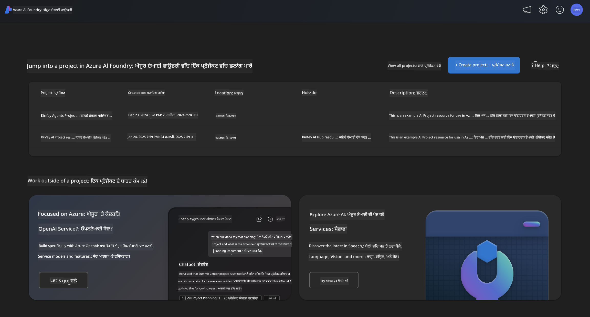
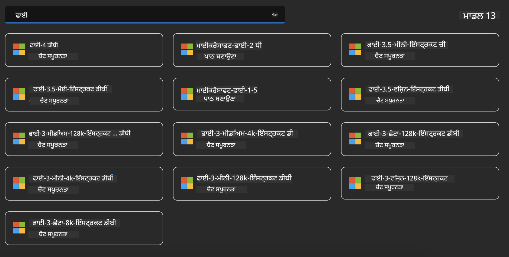
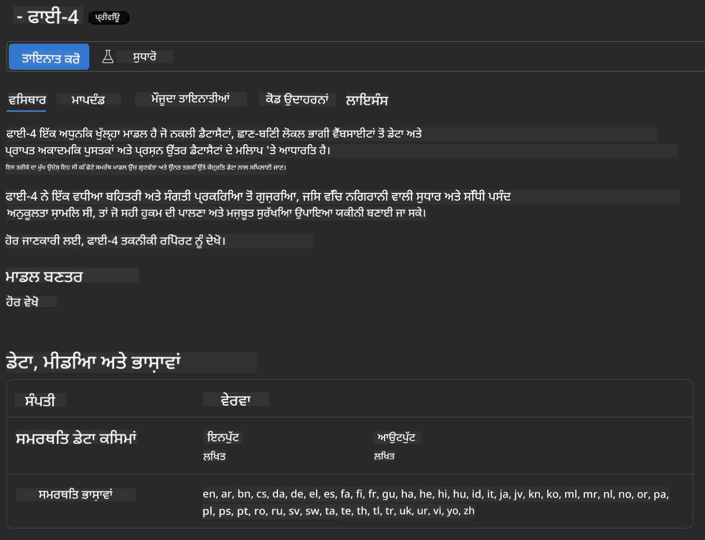
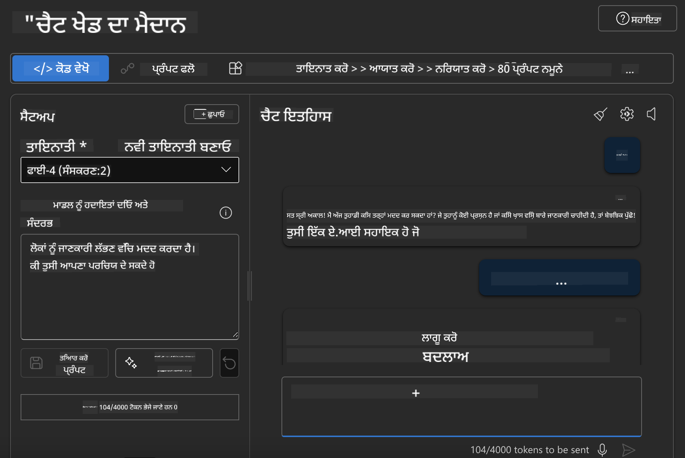

<!--
CO_OP_TRANSLATOR_METADATA:
{
  "original_hash": "3ae21dc5554e888defbe57946ee995ee",
  "translation_date": "2025-05-09T09:03:08+00:00",
  "source_file": "md/01.Introduction/02/03.AzureAIFoundry.md",
  "language_code": "pa"
}
-->
## Azure AI Foundry ਵਿੱਚ Phi ਪਰਿਵਾਰ

[Azure AI Foundry](https://ai.azure.com) ਇੱਕ ਭਰੋਸੇਮੰਦ ਪਲੇਟਫਾਰਮ ਹੈ ਜੋ ਡਿਵੈਲਪਰਾਂ ਨੂੰ ਸੁਰੱਖਿਅਤ, ਸੁਰੱਖਿਅਤ ਅਤੇ ਜ਼ਿੰਮੇਵਾਰ ਤਰੀਕੇ ਨਾਲ AI ਨਾਲ ਨਵੀਨਤਾ ਲਿਆਉਣ ਅਤੇ ਭਵਿੱਖ ਨੂੰ ਰੂਪ ਦੇਣ ਵਿੱਚ ਸਮਰੱਥ ਬਣਾਉਂਦਾ ਹੈ।

[Azure AI Foundry](https://ai.azure.com) ਡਿਵੈਲਪਰਾਂ ਲਈ ਬਣਾਇਆ ਗਿਆ ਹੈ ਤਾਂ ਜੋ:

- ਐਂਟਰਪ੍ਰਾਈਜ਼-ਗਰੇਡ ਪਲੇਟਫਾਰਮ 'ਤੇ ਜਨਰੇਟਿਵ AI ਐਪਲੀਕੇਸ਼ਨਾਂ ਬਣਾਈਆਂ ਜਾ ਸਕਣ।
- ਅਧੁਨਿਕ AI ਟੂਲਜ਼ ਅਤੇ ML ਮਾਡਲਾਂ ਦੀ ਵਰਤੋਂ ਕਰਕੇ ਖੋਜ, ਤਿਆਰੀ, ਟੈਸਟ ਅਤੇ ਡਿਪਲੌਇ ਕੀਤਾ ਜਾ ਸਕੇ, ਜੋ ਜ਼ਿੰਮੇਵਾਰ AI ਅਮਲਾਂ 'ਤੇ ਆਧਾਰਿਤ ਹਨ।
- ਐਪਲੀਕੇਸ਼ਨ ਡਿਵੈਲਪਮੈਂਟ ਦੇ ਪੂਰੇ ਲਾਈਫਸਾਈਕਲ ਲਈ ਟੀਮ ਨਾਲ ਸਹਿਯੋਗ ਕੀਤਾ ਜਾ ਸਕੇ।

Azure AI Foundry ਨਾਲ, ਤੁਸੀਂ ਵੱਖ-ਵੱਖ ਮਾਡਲਾਂ, ਸੇਵਾਵਾਂ ਅਤੇ ਸਮਰੱਥਾਵਾਂ ਦੀ ਖੋਜ ਕਰ ਸਕਦੇ ਹੋ ਅਤੇ ਉਹ AI ਐਪਲੀਕੇਸ਼ਨ ਬਣਾਉਣ ਵਿੱਚ ਲੱਗ ਸਕਦੇ ਹੋ ਜੋ ਤੁਹਾਡੇ ਲਕੜਾਂ ਨੂੰ ਸਭ ਤੋਂ ਵਧੀਆ ਸੇਵਾ ਦਿੰਦੇ ਹਨ। Azure AI Foundry ਪਲੇਟਫਾਰਮ ਪੂਰਾ ਪ੍ਰਮਾਣਿਤ ਐਪਲੀਕੇਸ਼ਨਾਂ ਵਿੱਚ ਪ੍ਰੂਫ ਆਫ ਕਾਂਸੈਪਟ ਨੂੰ ਬਦਲਣ ਲਈ ਸਕੇਲਬਿਲਟੀ ਸਹੂਲਤ ਮੁਹੱਈਆ ਕਰਵਾਉਂਦਾ ਹੈ। ਲੰਮੇ ਸਮੇਂ ਦੀ ਸਫਲਤਾ ਲਈ ਲਗਾਤਾਰ ਨਿਗਰਾਨੀ ਅਤੇ ਸੁਧਾਰ ਕੀਤੇ ਜਾਂਦੇ ਹਨ।



Azure AI Foundry ਵਿੱਚ Azure AOAI Service ਦੀ ਵਰਤੋਂ ਕਰਨ ਦੇ ਨਾਲ-ਨਾਲ, ਤੁਸੀਂ Azure AI Foundry Model Catalog ਵਿੱਚ ਤੀਸਰੇ ਪੱਖ ਦੇ ਮਾਡਲ ਵੀ ਵਰਤ ਸਕਦੇ ਹੋ। ਜੇ ਤੁਸੀਂ Azure AI Foundry ਨੂੰ ਆਪਣਾ AI ਹੱਲ ਪਲੇਟਫਾਰਮ ਬਣਾਉਣਾ ਚਾਹੁੰਦੇ ਹੋ ਤਾਂ ਇਹ ਚੰਗਾ ਵਿਕਲਪ ਹੈ।

ਅਸੀਂ Model Catalog ਵਿੱਚੋਂ ਫਿਰੀ ਫੈਮਿਲੀ ਮਾਡਲਾਂ ਨੂੰ ਤੇਜ਼ੀ ਨਾਲ ਡਿਪਲੌਇ ਕਰ ਸਕਦੇ ਹਾਂ Azure AI Foundry ਵਿੱਚ

[Microsoft Phi Models in Azure AI Foundry Models](https://ai.azure.com/explore/models/?selectedCollection=phi)



### **Azure AI Foundry ਵਿੱਚ Phi-4 ਨੂੰ ਡਿਪਲੌਇ ਕਰੋ**



### **Azure AI Foundry Playground ਵਿੱਚ Phi-4 ਦਾ ਟੈਸਟ ਕਰੋ**



### **Azure AI Foundry Phi-4 ਨੂੰ ਕਾਲ ਕਰਨ ਲਈ Python ਕੋਡ ਚਲਾਉਣਾ**


```python

import os  
import base64
from openai import AzureOpenAI  
from azure.identity import DefaultAzureCredential, get_bearer_token_provider  
        
endpoint = os.getenv("ENDPOINT_URL", "Your Azure AOAI Service Endpoint")  
deployment = os.getenv("DEPLOYMENT_NAME", "Phi-4")  
      
token_provider = get_bearer_token_provider(  
    DefaultAzureCredential(),  
    "https://cognitiveservices.azure.com/.default"  
)  
  
client = AzureOpenAI(  
    azure_endpoint=endpoint,  
    azure_ad_token_provider=token_provider,  
    api_version="2024-05-01-preview",  
)  
  

chat_prompt = [
    {
        "role": "system",
        "content": "You are an AI assistant that helps people find information."
    },
    {
        "role": "user",
        "content": "can you introduce yourself"
    }
] 
    
# Include speech result if speech is enabled  
messages = chat_prompt 

completion = client.chat.completions.create(  
    model=deployment,  
    messages=messages,
    max_tokens=800,  
    temperature=0.7,  
    top_p=0.95,  
    frequency_penalty=0,  
    presence_penalty=0,
    stop=None,  
    stream=False  
)  
  
print(completion.to_json())  

```

**ਅਸਵੀਕਾਰੋਧ**:  
ਇਹ ਦਸਤਾਵੇਜ਼ AI ਅਨੁਵਾਦ ਸੇਵਾ [Co-op Translator](https://github.com/Azure/co-op-translator) ਦੀ ਵਰਤੋਂ ਕਰਕੇ ਅਨੁਵਾਦ ਕੀਤਾ ਗਿਆ ਹੈ। ਜਦੋਂ ਕਿ ਅਸੀਂ ਸਹੀਅਤ ਲਈ ਕੋਸ਼ਿਸ਼ ਕਰਦੇ ਹਾਂ, ਕਿਰਪਾ ਕਰਕੇ ਧਿਆਨ ਵਿੱਚ ਰੱਖੋ ਕਿ ਸਵੈਚਾਲਿਤ ਅਨੁਵਾਦਾਂ ਵਿੱਚ ਗਲਤੀਆਂ ਜਾਂ ਅਸਪਸ਼ਟਤਾਵਾਂ ਹੋ ਸਕਦੀਆਂ ਹਨ। ਮੂਲ ਦਸਤਾਵੇਜ਼ ਆਪਣੀ ਮੂਲ ਭਾਸ਼ਾ ਵਿੱਚ ਪ੍ਰਮਾਣਿਕ ਸਰੋਤ ਮੰਨਿਆ ਜਾਣਾ ਚਾਹੀਦਾ ਹੈ। ਜਰੂਰੀ ਜਾਣਕਾਰੀ ਲਈ, ਪੇਸ਼ੇਵਰ ਮਨੁੱਖੀ ਅਨੁਵਾਦ ਦੀ ਸਿਫਾਰਸ਼ ਕੀਤੀ ਜਾਂਦੀ ਹੈ। ਅਸੀਂ ਇਸ ਅਨੁਵਾਦ ਦੇ ਉਪਯੋਗ ਤੋਂ ਪੈਦਾ ਹੋਣ ਵਾਲੀਆਂ ਕਿਸੇ ਵੀ ਗਲਤਫਹਿਮੀਆਂ ਜਾਂ ਗਲਤ ਵਿਆਖਿਆਵਾਂ ਲਈ ਜ਼ਿੰਮੇਵਾਰ ਨਹੀਂ ਹਾਂ।