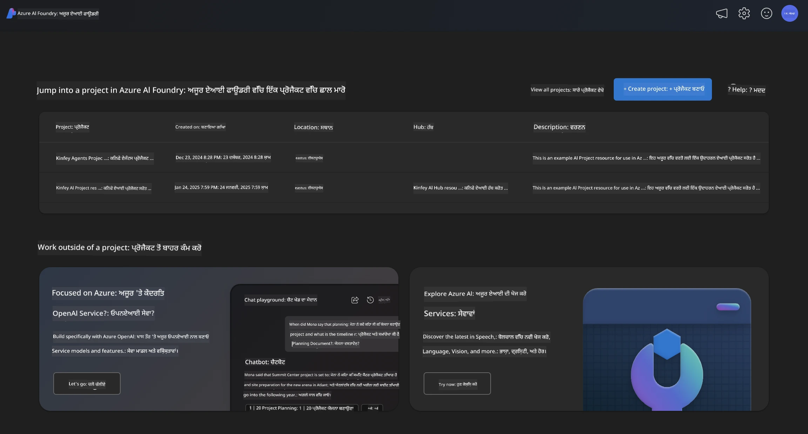
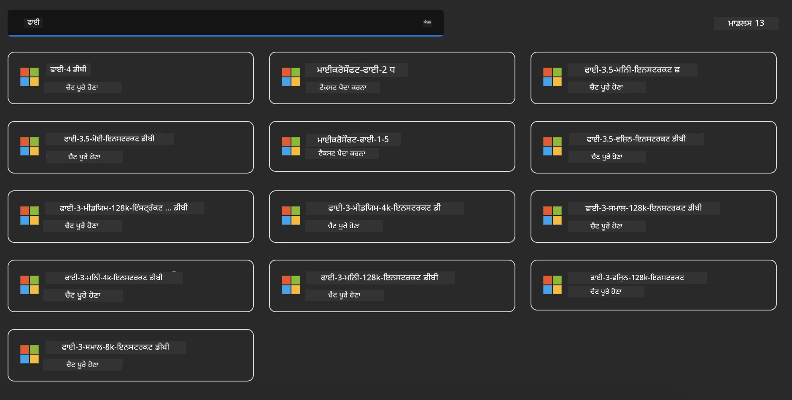
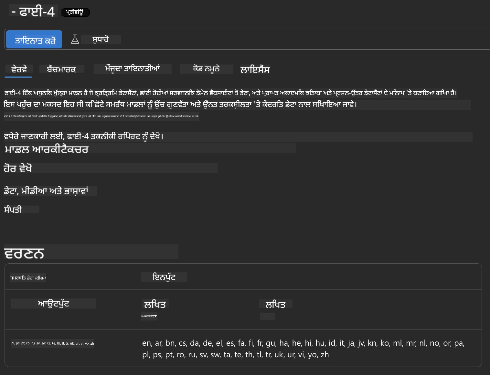
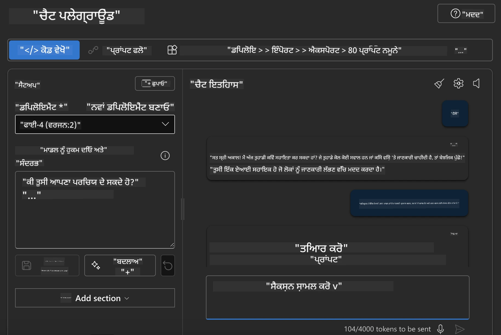

## Azure AI Foundry ਵਿੱਚ Phi ਪਰਿਵਾਰ

[Azure AI Foundry](https://ai.azure.com) ਇੱਕ ਭਰੋਸੇਮੰਦ ਪਲੇਟਫਾਰਮ ਹੈ ਜੋ ਵਿਕਾਸਕਾਰਾਂ ਨੂੰ ਸੁਰੱਖਿਅਤ, ਸੁਰੱਖਿਅਤ ਅਤੇ ਜ਼ਿੰਮੇਵਾਰ ਤਰੀਕੇ ਨਾਲ AI ਨਾਲ ਨਵੀਨਤਾ ਲਿਆਉਣ ਅਤੇ ਭਵਿੱਖ ਨੂੰ ਆਕਾਰ ਦੇਣ ਲਈ ਸਮਰੱਥ ਬਣਾਉਂਦਾ ਹੈ।

[Azure AI Foundry](https://ai.azure.com) ਵਿਕਾਸਕਾਰਾਂ ਲਈ ਬਣਾਇਆ ਗਿਆ ਹੈ ਤਾਂ ਜੋ:

- ਇੱਕ ਐਂਟਰਪ੍ਰਾਈਜ਼-ਗਰੇਡ ਪਲੇਟਫਾਰਮ 'ਤੇ ਜਨਰੇਟਿਵ AI ਐਪਲੀਕੇਸ਼ਨਾਂ ਬਣਾਈਆਂ ਜਾ ਸਕਣ।
- ਅਗਲੇ ਪੱਧਰ ਦੇ AI ਟੂਲਾਂ ਅਤੇ ML ਮਾਡਲਾਂ ਦੀ ਵਰਤੋਂ ਕਰਕੇ ਖੋਜ, ਬਣਾਉ, ਟੈਸਟ ਅਤੇ ਡਿਪਲੋਇ ਕੀਤਾ ਜਾ ਸਕੇ, ਜੋ ਜ਼ਿੰਮੇਵਾਰ AI ਅਮਲਾਂ 'ਤੇ ਆਧਾਰਿਤ ਹਨ।
- ਐਪਲੀਕੇਸ਼ਨ ਵਿਕਾਸ ਦੇ ਪੂਰੇ ਜੀਵਨ ਚੱਕਰ ਲਈ ਟੀਮ ਨਾਲ ਸਹਿਯੋਗ ਕੀਤਾ ਜਾ ਸਕੇ।

Azure AI Foundry ਨਾਲ, ਤੁਸੀਂ ਵੱਖ-ਵੱਖ ਮਾਡਲਾਂ, ਸੇਵਾਵਾਂ ਅਤੇ ਸਮਰੱਥਾਵਾਂ ਦੀ ਖੋਜ ਕਰ ਸਕਦੇ ਹੋ ਅਤੇ ਉਹ AI ਐਪਲੀਕੇਸ਼ਨਾਂ ਬਣਾਉਣ ਲਈ ਤਿਆਰ ਹੋ ਜਾਓ ਜੋ ਤੁਹਾਡੇ ਲਕੜਾਂ ਨੂੰ ਸਭ ਤੋਂ ਵਧੀਆ ਸੇਵਾ ਦੇਣ। Azure AI Foundry ਪਲੇਟਫਾਰਮ ਸਹੂਲਤ ਦਿੰਦਾ ਹੈ ਕਿ ਪ੍ਰੂਫ ਆਫ ਕਾਂਸੈਪਟ ਨੂੰ ਪੂਰੇ ਤੌਰ 'ਤੇ ਉਤਪਾਦਨ ਐਪਲੀਕੇਸ਼ਨਾਂ ਵਿੱਚ ਬਦਲਣਾ ਆਸਾਨ ਬਣਾਇਆ ਜਾਵੇ। ਲਗਾਤਾਰ ਨਿਗਰਾਨੀ ਅਤੇ ਸੁਧਾਰ ਲੰਬੇ ਸਮੇਂ ਦੀ ਸਫਲਤਾ ਲਈ ਸਹਾਇਕ ਹਨ।



Azure AI Foundry ਵਿੱਚ Azure AOAI Service ਦੀ ਵਰਤੋਂ ਦੇ ਨਾਲ-ਨਾਲ, ਤੁਸੀਂ Azure AI Foundry Model Catalog ਵਿੱਚ ਤੀਜੀ ਪੱਖ ਦੇ ਮਾਡਲਾਂ ਦੀ ਵੀ ਵਰਤੋਂ ਕਰ ਸਕਦੇ ਹੋ। ਜੇ ਤੁਸੀਂ Azure AI Foundry ਨੂੰ ਆਪਣਾ AI ਹੱਲ ਪਲੇਟਫਾਰਮ ਬਣਾਉਣਾ ਚਾਹੁੰਦੇ ਹੋ ਤਾਂ ਇਹ ਚੰਗਾ ਵਿਕਲਪ ਹੈ।

ਅਸੀਂ Azure AI Foundry ਵਿੱਚ Model Catalog ਰਾਹੀਂ Phi ਪਰਿਵਾਰ ਦੇ ਮਾਡਲਾਂ ਨੂੰ ਤੇਜ਼ੀ ਨਾਲ ਡਿਪਲੋਇ ਕਰ ਸਕਦੇ ਹਾਂ

[Microsoft Phi Models in Azure AI Foundry Models](https://ai.azure.com/explore/models/?selectedCollection=phi)



### **Azure AI Foundry ਵਿੱਚ Phi-4 ਨੂੰ ਡਿਪਲੋਇ ਕਰੋ**




### **Azure AI Foundry Playground ਵਿੱਚ Phi-4 ਦੀ ਟੈਸਟਿੰਗ ਕਰੋ**



### **Azure AI Foundry Phi-4 ਨੂੰ ਕਾਲ ਕਰਨ ਲਈ Python ਕੋਡ ਚਲਾਉਣਾ**


```python

import os  
import base64
from openai import AzureOpenAI  
from azure.identity import DefaultAzureCredential, get_bearer_token_provider  
        
endpoint = os.getenv("ENDPOINT_URL", "Your Azure AOAI Service Endpoint")  
deployment = os.getenv("DEPLOYMENT_NAME", "Phi-4")  
      
token_provider = get_bearer_token_provider(  
    DefaultAzureCredential(),  
    "https://cognitiveservices.azure.com/.default"  
)  
  
client = AzureOpenAI(  
    azure_endpoint=endpoint,  
    azure_ad_token_provider=token_provider,  
    api_version="2024-05-01-preview",  
)  
  

chat_prompt = [
    {
        "role": "system",
        "content": "You are an AI assistant that helps people find information."
    },
    {
        "role": "user",
        "content": "can you introduce yourself"
    }
] 
    
# Include speech result if speech is enabled  
messages = chat_prompt 

completion = client.chat.completions.create(  
    model=deployment,  
    messages=messages,
    max_tokens=800,  
    temperature=0.7,  
    top_p=0.95,  
    frequency_penalty=0,  
    presence_penalty=0,
    stop=None,  
    stream=False  
)  
  
print(completion.to_json())  

```

**ਅਸਵੀਕਾਰੋਪਣ**:  
ਇਹ ਦਸਤਾਵੇਜ਼ AI ਅਨੁਵਾਦ ਸੇਵਾ [Co-op Translator](https://github.com/Azure/co-op-translator) ਦੀ ਵਰਤੋਂ ਕਰਕੇ ਅਨੁਵਾਦ ਕੀਤਾ ਗਿਆ ਹੈ। ਜਦੋਂ ਕਿ ਅਸੀਂ ਸਹੀਤਾ ਲਈ ਕੋਸ਼ਿਸ਼ ਕਰਦੇ ਹਾਂ, ਕਿਰਪਾ ਕਰਕੇ ਧਿਆਨ ਰੱਖੋ ਕਿ ਸਵੈਚਾਲਿਤ ਅਨੁਵਾਦਾਂ ਵਿੱਚ ਗਲਤੀਆਂ ਜਾਂ ਅਸਮਰਥਤਾਵਾਂ ਹੋ ਸਕਦੀਆਂ ਹਨ। ਮੂਲ ਦਸਤਾਵੇਜ਼ ਆਪਣੀ ਮੂਲ ਭਾਸ਼ਾ ਵਿੱਚ ਪ੍ਰਮਾਣਿਕ ਸਰੋਤ ਮੰਨਿਆ ਜਾਣਾ ਚਾਹੀਦਾ ਹੈ। ਮਹੱਤਵਪੂਰਨ ਜਾਣਕਾਰੀ ਲਈ, ਪੇਸ਼ੇਵਰ ਮਨੁੱਖੀ ਅਨੁਵਾਦ ਦੀ ਸਿਫਾਰਸ਼ ਕੀਤੀ ਜਾਂਦੀ ਹੈ। ਅਸੀਂ ਇਸ ਅਨੁਵਾਦ ਦੀ ਵਰਤੋਂ ਤੋਂ ਉਤਪੰਨ ਕਿਸੇ ਵੀ ਗਲਤਫਹਿਮੀ ਜਾਂ ਗਲਤ ਵਿਆਖਿਆ ਲਈ ਜ਼ਿੰਮੇਵਾਰ ਨਹੀਂ ਹਾਂ।