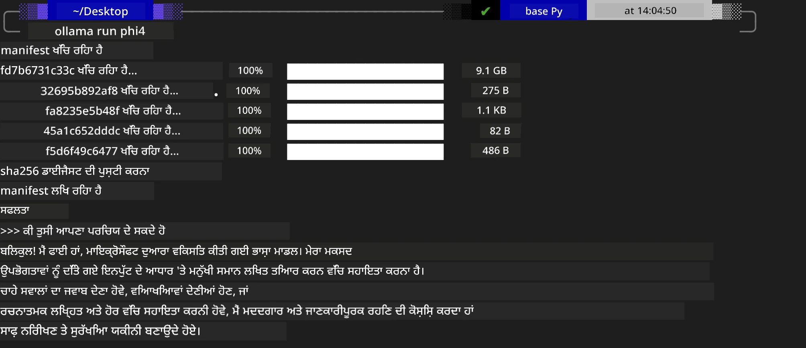
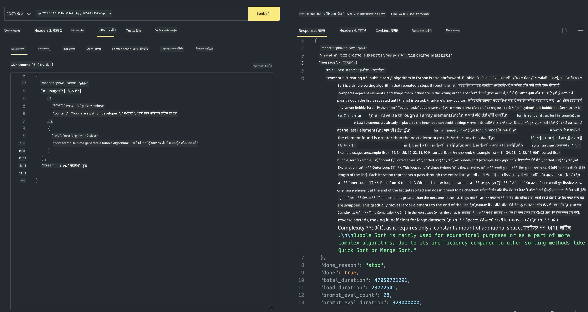

<!--
CO_OP_TRANSLATOR_METADATA:
{
  "original_hash": "2aa35f3c8b437fd5dc9995d53909d495",
  "translation_date": "2025-12-21T11:15:10+00:00",
  "source_file": "md/01.Introduction/02/04.Ollama.md",
  "language_code": "pa"
}
-->
## Ollama ਵਿੱਚ Phi ਪਰਿਵਾਰ

[Ollama](https://ollama.com) ਲੋਕਾਂ ਨੂੰ ਆਸਾਨ ਸਕ੍ਰਿਪਟਾਂ ਰਾਹੀਂ ਖੁੱਲ੍ਹੇ ਸਰੋਤ LLM ਜਾਂ SLM ਨੂੰ ਸਿੱਧਾ ਤੌਰ 'ਤੇ ਡਿਪਲੋਏ ਕਰਨ ਦੀ ਆਗਿਆ ਦਿੰਦਾ ਹੈ, ਅਤੇ ਸਥਾਨਕ Copilot ਐਪਲੀਕੇਸ਼ਨ ਪ੍ਰਸੰਗਾਂ ਦੀ ਸਹਾਇਤਾ ਲਈ APIs ਬਣਾਉਣ ਵਿੱਚ ਵੀ ਮਦਦ ਕਰ ਸਕਦਾ ਹੈ।

## **1. ਇੰਸਟਾਲੇਸ਼ਨ**

Ollama Windows, macOS, ਅਤੇ Linux 'ਤੇ ਚਲਾਉਣ ਨੂੰ ਸਮਰਥਨ ਕਰਦਾ ਹੈ। ਤੁਸੀਂ ਇਸ ਲਿੰਕ ([https://ollama.com/download](https://ollama.com/download)) ਰਾਹੀਂ Ollama ਇੰਸਟਾਲ ਕਰ ਸਕਦੇ ਹੋ। ਸਫਲ ਇੰਸਟਾਲੇਸ਼ਨ ਤੋਂ ਬਾਅਦ, ਤੁਸੀਂ ਟਰਮੀਨਲ ਵਿਂਡੋ ਰਾਹੀਂ ਸੀਧਾ Ollama ਸਕ੍ਰਿਪਟ ਦਾ ਉਪਯੋਗ ਕਰਕੇ Phi-3 ਨੂੰ ਕਾਲ ਕਰ ਸਕਦੇ ਹੋ। ਤੁਸੀਂ Ollama ਵਿੱਚ ਸਾਰੇ [Ollama ਵਿੱਚ ਉਪਲਬਧ ਲਾਇਬਰਰੀਆਂ](https://ollama.com/library) ਵੇਖ ਸਕਦੇ ਹੋ। ਜੇ ਤੁਸੀਂ ਇਸ ਰਿਪੋਜ਼ਿਟਰੀ ਨੂੰ Codespace ਵਿੱਚ ਖੋਲ੍ਹਦੇ ਹੋ, ਤਾਂ ਇਸ 'ਤੇ ਪਹਿਲਾਂ থেকেই Ollama ਇੰਸਟਾਲ ਹੋਇਆ ਹੋਵੇਗਾ।

```bash

ollama run phi4

```

> [!NOTE]
> ਮਾਡਲ ਪਹਿਲੀ ਵਾਰੀ ਚਲਾਉਂਦੇ ਸਮੇਂ ਪਹਿਲਾਂ ਡਾਊਨਲੋਡ ਕੀਤਾ ਜਾਵੇਗਾ। ਬੇਸ਼ਕ, ਤੁਸੀਂ ਡਾਊਨਲੋਡ ਕੀਤਾ ਹੋਇਆ Phi-4 ਮਾਡਲ ਵੀ ਸਿੱਧਾ ਦਰਸਾ ਸਕਦੇ ਹੋ। ਅਸੀਂ ਕਮਾਂਡ ਚਲਾਉਣ ਲਈ ਉਦਾਹਰਣ ਵਜੋਂ WSL ਲੈਂਦੇ ਹਾਂ। ਮਾਡਲ ਸਫਲਤਾਪੂਰਵਕ ਡਾਊਨਲੋਡ ਹੋਣ ਤੋਂ ਬਾਅਦ, ਤੁਸੀਂ ਟਰਮੀਨਲ 'ਤੇ ਸਿੱਧਾ ਇੰਟਰਐਕਟ ਕਰ ਸਕਦੇ ਹੋ।



## **2. Ollama ਤੋਂ phi-4 API ਨੂੰ ਕਾਲ ਕਰੋ**

ਜੇ ਤੁਸੀਂ Ollama ਰਾਹੀਂ ਬਣਾਈ ਗਈ Phi-4 API ਨੂੰ ਕਾਲ ਕਰਨਾ ਚਾਹੁੰਦੇ ਹੋ, ਤਾਂ ਤੁਸੀਂ Ollama ਸਰਵਰ ਨੂੰ ਸ਼ੁਰੂ ਕਰਨ ਲਈ ਟਰਮੀਨਲ ਵਿੱਚ ਇਹ ਕਮਾਂਡ ਵਰਤ ਸਕਦੇ ਹੋ।

```bash

ollama serve

```

> [!NOTE]
> ਜੇ ਤੁਸੀਂ MacOS ਜਾਂ Linux 'ਤੇ ਚਲਾ ਰਹੇ ਹੋ, ਤਾਂ ਕਿਰਪਾ ਕਰਕੇ ਨੋਟ ਕਰੋ ਕਿ ਤੁਹਾਨੂੰ ਹੇਠ ਲਿਖੀ ਤਰੁੱਟੀ ਮਿਲ ਸਕਦੀ ਹੈ **"Error: listen tcp 127.0.0.1:11434: bind: address already in use"**। ਇਹ ਤਰੁੱਟੀ ਕਮਾਂਡ ਚਲਾਉਂਦੇ ਸਮੇਂ ਮਿਲ ਸਕਦੀ ਹੈ। ਤੁਸੀਂ ਇਸ ਤਰੁੱਟੀ ਨੂੰ ਨਜ਼ਰਅੰਦਾਜ਼ ਕਰ ਸਕਦੇ ਹੋ, ਕਿਉਂਕਿ ਆਮ ਤੌਰ 'ਤੇ ਇਹ ਦਰਸਾਉਂਦੀ ਹੈ ਕਿ ਸਰਵਰ ਪਹਿਲਾਂ ਹੀ ਚੱਲ ਰਿਹਾ ਹੈ, ਜਾਂ ਤੁਸੀਂ Ollama ਨੂੰ ਰੋਕ ਕੇ ਦੁਬਾਰਾ ਸ਼ੁਰੂ ਕਰ ਸਕਦੇ ਹੋ:

**macOS**

```bash

brew services restart ollama

```

**Linux**

```bash

sudo systemctl stop ollama

```

Ollama ਦੋ API ਦਾ ਸਮਰਥਨ ਕਰਦਾ ਹੈ: generate ਅਤੇ chat। ਤੁਸੀਂ ਆਪਣੀਆਂ ਲੋੜਾਂ ਅਨੁਸਾਰ Ollama ਵੱਲੋਂ ਦਿੱਤੀ ਮਾਡਲ API ਨੂੰ ਕਾਲ ਕਰ ਸਕਦੇ ਹੋ, ਪੋਰਟ 11434 'ਤੇ ਚੱਲ ਰਹੀ ਸਥਾਨਕ ਸੇਵਾ ਨੂੰ ਰੀਕਵੇਸਟ ਭੇਜ ਕੇ।

**Chat**

```bash

curl http://127.0.0.1:11434/api/chat -d '{
  "model": "phi3",
  "messages": [
    {
      "role": "system",
      "content": "Your are a python developer."
    },
    {
      "role": "user",
      "content": "Help me generate a bubble algorithm"
    }
  ],
  "stream": false
  
}'
```

ਇਹ Postman ਵਿੱਚ ਨਤੀਜਾ ਹੈ



## ਵਾਧੂ ਸਰੋਤ

Ollama ਵਿੱਚ ਉਪਲਬਧ ਮਾਡਲਾਂ ਦੀ ਸੂਚੀ ਵੇਖਣ ਲਈ [ਉਨ੍ਹਾਂ ਦੀ ਲਾਇਬ੍ਰੇਰੀ](https://ollama.com/library) ਦੀ ਜਾਂਚ ਕਰੋ।

ਹੇਠਾਂ ਦਿੱਤੀ ਕਮਾਂਡ ਦੀ ਵਰਤੋਂ ਕਰਕੇ ਆਪਣੇ ਮਾਡਲ ਨੂੰ Ollama ਸਰਵਰ ਤੋਂ ਪੂਲ ਕਰੋ

```bash
ollama pull phi4
```

ਮਾਡਲ ਨੂੰ ਚਲਾਉਣ ਲਈ ਇਹ ਕਮਾਂਡ ਵਰਤੋ

```bash
ollama run phi4
```

***ਨੋਟ:*** ਹੋਰ ਜਾਣਕਾਰੀ ਲਈ ਇਸ ਲਿੰਕ ਨੂੰ ਵੇਖੋ [https://github.com/ollama/ollama/blob/main/docs/api.md](https://github.com/ollama/ollama/blob/main/docs/api.md)

## Python ਵਿੱਚ Ollama ਨੂੰ ਕਾਲ ਕਰਨਾ

ਤੁਸੀਂ ਉੱਪਰ ਵਰਤੇ ਗਏ ਸਥਾਨਕ ਸਰਵਰ ਐਂਡਪਾਇੰਟਸ ਨੂੰ ਰੀਕਵੇਸਟ ਭੇਜਣ ਲਈ `requests` ਜਾਂ `urllib3` ਦੀ ਵਰਤੋਂ ਕਰ ਸਕਦੇ ਹੋ। ਹਾਲਾਂਕਿ, Python ਵਿੱਚ Ollama ਦੀ ਵਰਤੋਂ ਕਰਨ ਦਾ ਇੱਕ ਲੋਕਪ੍ਰਿਯ ਤਰੀਕਾ [openai](https://pypi.org/project/openai/) SDK ਰਾਹੀਂ ਹੈ, ਕਿਉਂਕਿ Ollama OpenAI-ਅਨੁਕੂਲ ਸਰਵਰ ਐਂਡਪਾਇੰਟ ਵੀ ਪ੍ਰਦਾਨ ਕਰਦਾ ਹੈ।

Here is an example for phi3-mini:

```python
import openai

client = openai.OpenAI(
    base_url="http://localhost:11434/v1",
    api_key="nokeyneeded",
)

response = client.chat.completions.create(
    model="phi4",
    temperature=0.7,
    n=1,
    messages=[
        {"role": "system", "content": "You are a helpful assistant."},
        {"role": "user", "content": "Write a haiku about a hungry cat"},
    ],
)

print("Response:")
print(response.choices[0].message.content)
```

## JavaScript ਵਿੱਚ Ollama ਨੂੰ ਕਾਲ ਕਰਨਾ 

```javascript
// Phi-4 ਨਾਲ ਇੱਕ ਫਾਇਲ ਦਾ ਸਾਰ ਲੈਣ ਦੀ ਉਦਾਹਰਣ
script({
    model: "ollama:phi4",
    title: "Summarize with Phi-4",
    system: ["system"],
})

// ਸਾਰ ਲੈਣ ਦੀ ਉਦਾਹਰਣ
const file = def("FILE", env.files)
$`Summarize ${file} in a single paragraph.`
```

## C# ਵਿੱਚ Ollama ਨੂੰ ਕਾਲ ਕਰਨਾ

ਇੱਕ ਨਵਾਂ C# Console ਐਪਲੀਕੇਸ਼ਨ ਬਣਾਓ ਅਤੇ ਹੇਠ ਲਿਖਿਆ NuGet ਪੈਕੇਜ ਜੋੜੋ:

```bash
dotnet add package Microsoft.SemanticKernel --version 1.34.0
```

ਫਿਰ `Program.cs` ਫਾਈਲ ਵਿੱਚ ਇਸ ਕੋਡ ਨੂੰ ਬਦਲੋ

```csharp
using Microsoft.SemanticKernel;
using Microsoft.SemanticKernel.ChatCompletion;

// add chat completion service using the local ollama server endpoint
#pragma warning disable SKEXP0001, SKEXP0003, SKEXP0010, SKEXP0011, SKEXP0050, SKEXP0052
builder.AddOpenAIChatCompletion(
    modelId: "phi4",
    endpoint: new Uri("http://localhost:11434/"),
    apiKey: "non required");

// invoke a simple prompt to the chat service
string prompt = "Write a joke about kittens";
var response = await kernel.InvokePromptAsync(prompt);
Console.WriteLine(response.GetValue<string>());
```

ਐਪ ਨੂੰ ਇਹ ਕਮਾਂਡ ਚਲਾ ਕੇ ਰਨ ਕਰੋ:

```bash
dotnet run
```

---

<!-- CO-OP TRANSLATOR DISCLAIMER START -->
ਅਸਵੀਕਾਰਨ:
ਇਸ ਦਸਤਾਵੇਜ਼ ਦਾ ਅਨੁਵਾਦ AI ਅਨੁਵਾਦ ਸੇਵਾ [Co-op Translator](https://github.com/Azure/co-op-translator) ਦੀ ਵਰਤੋਂ ਕਰਕੇ ਕੀਤਾ ਗਿਆ ਹੈ। ਅਸੀਂ ਸਹੀ ਹੋਣ ਲਈ ਕੋਸ਼ਿਸ਼ ਕਰਦੇ ਹਾਂ, ਪਰ ਕਿਰਪਾ ਕਰਕੇ ਧਿਆਨ ਰੱਖੋ ਕਿ ਸਵੈਚਾਲਿਤ ਅਨੁਵਾਦਾਂ ਵਿੱਚ ਗਲਤੀਆਂ ਜਾਂ ਤ੍ਰੁੱਟੀਆਂ ਹੋ ਸਕਦੀਆਂ ਹਨ। ਮੂਲ ਦਸਤਾਵੇਜ਼ (ਆਸਲੀ ਭਾਸ਼ਾ ਵਿੱਚ) ਨੂੰ ਆਧਿਕਾਰਕ ਸਰੋਤ ਮੰਨਿਆ ਜਾਣਾ ਚਾਹੀਦਾ ਹੈ। ਅਹਿਮ ਜਾਣਕਾਰੀ ਲਈ, ਪੇਸ਼ੇਵਰ ਮਨੁੱਖੀ ਅਨੁਵਾਦ ਦੀ ਸਿਫ਼ਾਰਿਸ਼ ਕੀਤੀ ਜਾਂਦੀ ਹੈ। ਅਸੀਂ ਇਸ ਅਨੁਵਾਦ ਦੇ ਉਪਯੋਗ ਤੋਂ ਉਤਪੰਨ ਹੋਣ ਵਾਲੀਆਂ ਕਿਸੇ ਵੀ ਗਲਤਫਹਮੀਆਂ ਜਾਂ ਗਲਤ ਵਿਆਖਿਆਵਾਂ ਲਈ ਜ਼ਿੰਮੇਵਾਰ ਨਹੀਂ ਹਾਂ।
<!-- CO-OP TRANSLATOR DISCLAIMER END -->