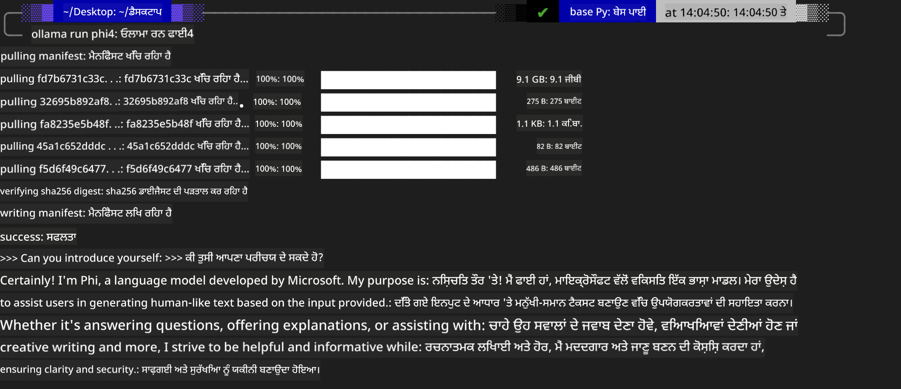
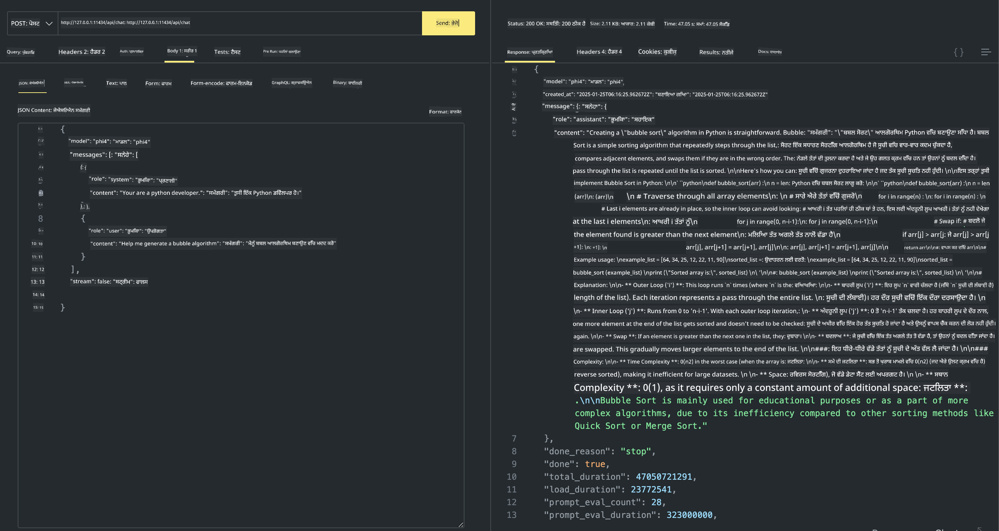

<!--
CO_OP_TRANSLATOR_METADATA:
{
  "original_hash": "0b38834693bb497f96bf53f0d941f9a1",
  "translation_date": "2025-05-09T09:12:53+00:00",
  "source_file": "md/01.Introduction/02/04.Ollama.md",
  "language_code": "pa"
}
-->
## Ollama ਵਿੱਚ Phi ਪਰਿਵਾਰ

[Ollama](https://ollama.com) ਵੱਧ ਲੋਕਾਂ ਨੂੰ ਸਿੱਧਾ ਖੁੱਲ੍ਹੇ ਸਰੋਤ LLM ਜਾਂ SLM ਨੂੰ ਆਸਾਨ ਸਕ੍ਰਿਪਟਾਂ ਰਾਹੀਂ ਡਿਪਲੋਏ ਕਰਨ ਦੀ ਆਗਿਆ ਦਿੰਦਾ ਹੈ, ਅਤੇ ਸਥਾਨਕ Copilot ਐਪਲੀਕੇਸ਼ਨ ਸਿਨਾਰਿਓਜ਼ ਵਿੱਚ ਮਦਦ ਲਈ API ਵੀ ਬਣਾਈ ਜਾ ਸਕਦੀ ਹੈ।

## **1. ਇੰਸਟਾਲੇਸ਼ਨ**

Ollama Windows, macOS, ਅਤੇ Linux 'ਤੇ ਚਲਾਉਣ ਦਾ ਸਮਰਥਨ ਕਰਦਾ ਹੈ। ਤੁਸੀਂ ਇਸ ਲਿੰਕ ([https://ollama.com/download](https://ollama.com/download)) ਰਾਹੀਂ Ollama ਇੰਸਟਾਲ ਕਰ ਸਕਦੇ ਹੋ। ਸਫਲ ਇੰਸਟਾਲੇਸ਼ਨ ਤੋਂ ਬਾਅਦ, ਤੁਸੀਂ ਟਰਮੀਨਲ ਵਿੰਡੋ ਰਾਹੀਂ ਸਿੱਧਾ Ollama ਸਕ੍ਰਿਪਟ ਦੀ ਵਰਤੋਂ ਕਰਕੇ Phi-3 ਨੂੰ ਕਾਲ ਕਰ ਸਕਦੇ ਹੋ। ਤੁਸੀਂ ਸਾਰੇ [ਉਪਲਬਧ ਲਾਇਬ੍ਰੇਰੀਜ਼ Ollama ਵਿੱਚ](https://ollama.com/library) ਵੇਖ ਸਕਦੇ ਹੋ। ਜੇ ਤੁਸੀਂ ਇਸ ਰਿਪੋਜ਼ਟਰੀ ਨੂੰ Codespace ਵਿੱਚ ਖੋਲ੍ਹਦੇ ਹੋ, ਤਾਂ ਇੱਥੇ ਪਹਿਲਾਂ ਹੀ Ollama ਇੰਸਟਾਲ ਹੋਇਆ ਹੋਵੇਗਾ।

```bash

ollama run phi4

```

> [!NOTE]
> ਜਦੋਂ ਤੁਸੀਂ ਪਹਿਲੀ ਵਾਰੀ ਮਾਡਲ ਚਲਾਉਂਦੇ ਹੋ ਤਾਂ ਇਹ ਪਹਿਲਾਂ ਡਾਊਨਲੋਡ ਕੀਤਾ ਜਾਵੇਗਾ। ਬेशक, ਤੁਸੀਂ ਸਿੱਧਾ ਡਾਊਨਲੋਡ ਕੀਤਾ ਹੋਇਆ Phi-4 ਮਾਡਲ ਵੀ ਨਿਰਧਾਰਤ ਕਰ ਸਕਦੇ ਹੋ। ਅਸੀਂ ਉਦਾਹਰਨ ਵਜੋਂ WSL 'ਤੇ ਕਮਾਂਡ ਚਲਾਉਂਦੇ ਹਾਂ। ਮਾਡਲ ਸਫਲਤਾਪੂਰਵਕ ਡਾਊਨਲੋਡ ਹੋਣ ਤੋਂ ਬਾਅਦ, ਤੁਸੀਂ ਸਿੱਧਾ ਟਰਮੀਨਲ 'ਤੇ ਇੰਟਰੈਕਟ ਕਰ ਸਕਦੇ ਹੋ।



## **2. Ollama ਤੋਂ phi-4 API ਕਾਲ ਕਰੋ**

ਜੇ ਤੁਸੀਂ Ollama ਦੁਆਰਾ ਬਣਾਈ ਗਈ Phi-4 API ਕਾਲ ਕਰਨੀ ਹੈ, ਤਾਂ ਤੁਸੀਂ ਟਰਮੀਨਲ ਵਿੱਚ ਇਹ ਕਮਾਂਡ ਚਲਾ ਕੇ Ollama ਸਰਵਰ ਸ਼ੁਰੂ ਕਰ ਸਕਦੇ ਹੋ।

```bash

ollama serve

```

> [!NOTE]
> ਜੇ MacOS ਜਾਂ Linux ਚਲਾ ਰਹੇ ਹੋ, ਤਾਂ ਧਿਆਨ ਦਿਓ ਕਿ ਤੁਹਾਨੂੰ ਇਹ ਤਰ੍ਹਾਂ ਦੀ ਗਲਤੀ ਮਿਲ ਸਕਦੀ ਹੈ **"Error: listen tcp 127.0.0.1:11434: bind: address already in use"** ਇਹ ਗਲਤੀ ਕਮਾਂਡ ਚਲਾਉਂਦੇ ਸਮੇਂ ਆ ਸਕਦੀ ਹੈ। ਤੁਸੀਂ ਇਸ ਗਲਤੀ ਨੂੰ ਅਣਡਿੱਠਾ ਕਰ ਸਕਦੇ ਹੋ ਕਿਉਂਕਿ ਇਹ ਆਮ ਤੌਰ 'ਤੇ ਦਰਸਾਉਂਦੀ ਹੈ ਕਿ ਸਰਵਰ ਪਹਿਲਾਂ ਹੀ ਚੱਲ ਰਿਹਾ ਹੈ, ਜਾਂ ਤੁਸੀਂ Ollama ਨੂੰ ਰੋਕ ਕੇ ਮੁੜ ਸ਼ੁਰੂ ਕਰ ਸਕਦੇ ਹੋ:

**macOS**

```bash

brew services restart ollama

```

**Linux**

```bash

sudo systemctl stop ollama

```

Ollama ਦੋ API ਸਮਰਥਨ ਕਰਦਾ ਹੈ: generate ਅਤੇ chat। ਤੁਸੀਂ ਆਪਣੇ ਲੋੜ ਅਨੁਸਾਰ Ollama ਵੱਲੋਂ ਦਿੱਤਾ ਮਾਡਲ API ਕਾਲ ਕਰ ਸਕਦੇ ਹੋ, ਜੋ ਕਿ ਲੋਕਲ ਸਰਵਿਸ 'ਤੇ ਪੋਰਟ 11434 'ਤੇ ਚੱਲ ਰਹੀ ਹੈ।

**ਚੈਟ**

```bash

curl http://127.0.0.1:11434/api/chat -d '{
  "model": "phi3",
  "messages": [
    {
      "role": "system",
      "content": "Your are a python developer."
    },
    {
      "role": "user",
      "content": "Help me generate a bubble algorithm"
    }
  ],
  "stream": false
  
}'

This is the result in Postman



## Additional Resources

Check the list of available models in Ollama in [their library](https://ollama.com/library).

Pull your model from the Ollama server using this command

```bash
ollama pull phi4
```

Run the model using this command

```bash
ollama run phi4
```

***Note:*** Visit this link [https://github.com/ollama/ollama/blob/main/docs/api.md](https://github.com/ollama/ollama/blob/main/docs/api.md) to learn more

## Calling Ollama from Python

You can use `requests` or `urllib3` to make requests to the local server endpoints used above. However, a popular way to use Ollama in Python is via the [openai](https://pypi.org/project/openai/) SDK, since Ollama provides OpenAI-compatible server endpoints as well.

Here is an example for phi3-mini:

```python
import openai

client = openai.OpenAI(
    base_url="http://localhost:11434/v1",
    api_key="nokeyneeded",
)

response = client.chat.completions.create(
    model="phi4",
    temperature=0.7,
    n=1,
    messages=[
        {"role": "system", "content": "You are a helpful assistant."},
        {"role": "user", "content": "Write a haiku about a hungry cat"},
    ],
)

print("Response:")
print(response.choices[0].message.content)
```

## Calling Ollama from JavaScript 

```javascript
// Phi-4 ਨਾਲ ਫਾਇਲ ਦਾ ਸੰਖੇਪ ਕਰਨ ਦਾ ਉਦਾਹਰਨ
script({
    model: "ollama:phi4",
    title: "Phi-4 ਨਾਲ ਸੰਖੇਪ",
    system: ["system"],
})

// ਸੰਖੇਪ ਕਰਨ ਦਾ ਉਦਾਹਰਨ
const file = def("FILE", env.files)
$`Summarize ${file} in a single paragraph.`
```

## Calling Ollama from C#

Create a new C# Console application and add the following NuGet package:

```bash
dotnet add package Microsoft.SemanticKernel --version 1.34.0
```

Then replace this code in the `Program.cs` file

```csharp
using Microsoft.SemanticKernel;
using Microsoft.SemanticKernel.ChatCompletion;

// ਸਥਾਨਕ Ollama ਸਰਵਰ ਐਂਡਪੌਇੰਟ ਦੀ ਵਰਤੋਂ ਕਰਕੇ ਚੈਟ ਕਮਪਲੀਸ਼ਨ ਸਰਵਿਸ ਸ਼ਾਮਿਲ ਕਰੋ
#pragma warning disable SKEXP0001, SKEXP0003, SKEXP0010, SKEXP0011, SKEXP0050, SKEXP0052
builder.AddOpenAIChatCompletion(
    modelId: "phi4",
    endpoint: new Uri("http://localhost:11434/"),
    apiKey: "non required");

// ਚੈਟ ਸਰਵਿਸ ਨੂੰ ਇੱਕ ਸਧਾਰਨ ਪ੍ਰਾਂਪਟ ਭੇਜੋ
string prompt = "Write a joke about kittens";
var response = await kernel.InvokePromptAsync(prompt);
Console.WriteLine(response.GetValue<string>());
```

Run the app with the command:

```bash
dotnet run

**ਅਸਵੀਕਾਰੋक्ति**:  
ਇਹ ਦਸਤਾਵੇਜ਼ AI ਅਨੁਵਾਦ ਸੇਵਾ [Co-op Translator](https://github.com/Azure/co-op-translator) ਦੀ ਵਰਤੋਂ ਨਾਲ ਅਨੁਵਾਦ ਕੀਤਾ ਗਿਆ ਹੈ। ਜਦੋਂ ਕਿ ਅਸੀਂ ਸਹੀਅਤ ਲਈ ਕੋਸ਼ਿਸ਼ ਕਰਦੇ ਹਾਂ, ਕਿਰਪਾ ਕਰਕੇ ਧਿਆਨ ਰੱਖੋ ਕਿ ਆਟੋਮੈਟਿਕ ਅਨੁਵਾਦਾਂ ਵਿੱਚ ਗਲਤੀਆਂ ਜਾਂ ਅਣਸਹੀਤੀਆਂ ਹੋ ਸਕਦੀਆਂ ਹਨ। ਮੂਲ ਦਸਤਾਵੇਜ਼ ਆਪਣੀ ਮੂਲ ਭਾਸ਼ਾ ਵਿੱਚ ਹੀ ਪ੍ਰਮਾਣਿਕ ਸਰੋਤ ਮੰਨਿਆ ਜਾਣਾ ਚਾਹੀਦਾ ਹੈ। ਮਹੱਤਵਪੂਰਨ ਜਾਣਕਾਰੀ ਲਈ, ਪੇਸ਼ੇਵਰ ਮਨੁੱਖੀ ਅਨੁਵਾਦ ਦੀ ਸਿਫਾਰਸ਼ ਕੀਤੀ ਜਾਂਦੀ ਹੈ। ਅਸੀਂ ਇਸ ਅਨੁਵਾਦ ਦੇ ਉਪਯੋਗ ਤੋਂ ਉਤਪੰਨ ਕਿਸੇ ਵੀ ਗਲਤਫਹਮੀ ਜਾਂ ਗਲਤ ਵਿਵਖਿਆ ਲਈ ਜ਼ਿੰਮੇਵਾਰ ਨਹੀਂ ਹਾਂ।