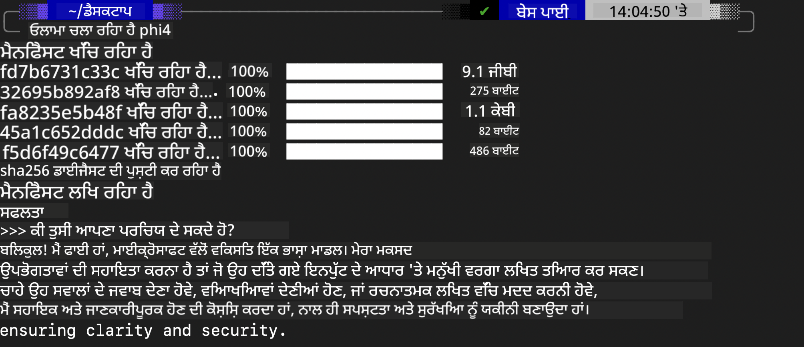
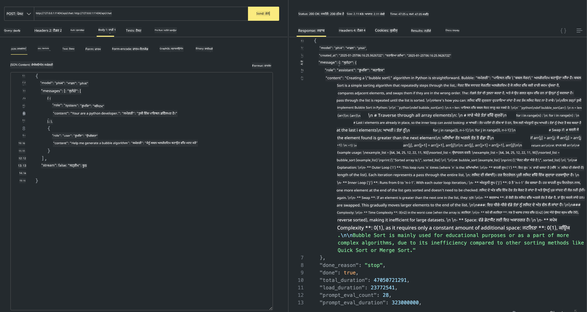

<!--
CO_OP_TRANSLATOR_METADATA:
{
  "original_hash": "0b38834693bb497f96bf53f0d941f9a1",
  "translation_date": "2025-07-16T19:15:04+00:00",
  "source_file": "md/01.Introduction/02/04.Ollama.md",
  "language_code": "pa"
}
-->
## ਓਲਾਮਾ ਵਿੱਚ ਫਾਈ ਪਰਿਵਾਰ

[Ollama](https://ollama.com) ਵੱਧ ਲੋਕਾਂ ਨੂੰ ਸਿੱਧਾ ਖੁੱਲ੍ਹੇ ਸਰੋਤ LLM ਜਾਂ SLM ਨੂੰ ਸਧਾਰਣ ਸਕ੍ਰਿਪਟਾਂ ਰਾਹੀਂ ਡਿਪਲੋਇ ਕਰਨ ਦੀ ਆਗਿਆ ਦਿੰਦਾ ਹੈ, ਅਤੇ ਸਥਾਨਕ Copilot ਐਪਲੀਕੇਸ਼ਨ ਸਥਿਤੀਆਂ ਵਿੱਚ ਮਦਦ ਲਈ APIs ਵੀ ਬਣਾਉਂਦਾ ਹੈ।

## **1. ਇੰਸਟਾਲੇਸ਼ਨ**

Ollama Windows, macOS ਅਤੇ Linux 'ਤੇ ਚਲਾਉਣ ਦਾ ਸਮਰਥਨ ਕਰਦਾ ਹੈ। ਤੁਸੀਂ ਇਸ ਲਿੰਕ ([https://ollama.com/download](https://ollama.com/download)) ਰਾਹੀਂ Ollama ਇੰਸਟਾਲ ਕਰ ਸਕਦੇ ਹੋ। ਸਫਲ ਇੰਸਟਾਲੇਸ਼ਨ ਤੋਂ ਬਾਅਦ, ਤੁਸੀਂ ਟਰਮੀਨਲ ਵਿੰਡੋ ਰਾਹੀਂ ਸਿੱਧਾ Ollama ਸਕ੍ਰਿਪਟ ਦੀ ਵਰਤੋਂ ਕਰਕੇ Phi-3 ਨੂੰ ਕਾਲ ਕਰ ਸਕਦੇ ਹੋ। ਤੁਸੀਂ [Ollama ਵਿੱਚ ਉਪਲਬਧ ਸਾਰੀਆਂ ਲਾਇਬ੍ਰੇਰੀਆਂ](https://ollama.com/library) ਵੇਖ ਸਕਦੇ ਹੋ। ਜੇ ਤੁਸੀਂ ਇਸ ਰਿਪੋਜ਼ਿਟਰੀ ਨੂੰ Codespace ਵਿੱਚ ਖੋਲ੍ਹਦੇ ਹੋ, ਤਾਂ ਇਸ ਵਿੱਚ ਪਹਿਲਾਂ ਹੀ Ollama ਇੰਸਟਾਲ ਹੋਇਆ ਹੋਵੇਗਾ।

```bash

ollama run phi4

```

> [!NOTE]
> ਜਦੋਂ ਤੁਸੀਂ ਪਹਿਲੀ ਵਾਰੀ ਮਾਡਲ ਚਲਾਉਂਦੇ ਹੋ ਤਾਂ ਇਹ ਪਹਿਲਾਂ ਡਾਊਨਲੋਡ ਕੀਤਾ ਜਾਵੇਗਾ। ਬੇਸ਼ੱਕ, ਤੁਸੀਂ ਸਿੱਧਾ ਡਾਊਨਲੋਡ ਕੀਤਾ ਹੋਇਆ Phi-4 ਮਾਡਲ ਵੀ ਦਰਜ ਕਰ ਸਕਦੇ ਹੋ। ਅਸੀਂ WSL ਨੂੰ ਉਦਾਹਰਨ ਵਜੋਂ ਕਮਾਂਡ ਚਲਾਉਣ ਲਈ ਲੈਂਦੇ ਹਾਂ। ਮਾਡਲ ਸਫਲਤਾਪੂਰਵਕ ਡਾਊਨਲੋਡ ਹੋਣ ਤੋਂ ਬਾਅਦ, ਤੁਸੀਂ ਟਰਮੀਨਲ 'ਤੇ ਸਿੱਧਾ ਇੰਟਰੈਕਟ ਕਰ ਸਕਦੇ ਹੋ।



## **2. Ollama ਤੋਂ phi-4 API ਕਾਲ ਕਰੋ**

ਜੇ ਤੁਸੀਂ Ollama ਦੁਆਰਾ ਬਣਾਈ ਗਈ Phi-4 API ਨੂੰ ਕਾਲ ਕਰਨਾ ਚਾਹੁੰਦੇ ਹੋ, ਤਾਂ ਤੁਸੀਂ ਟਰਮੀਨਲ ਵਿੱਚ ਇਹ ਕਮਾਂਡ ਚਲਾ ਕੇ Ollama ਸਰਵਰ ਸ਼ੁਰੂ ਕਰ ਸਕਦੇ ਹੋ।

```bash

ollama serve

```

> [!NOTE]
> ਜੇ ਤੁਸੀਂ MacOS ਜਾਂ Linux 'ਤੇ ਚਲਾ ਰਹੇ ਹੋ, ਤਾਂ ਕਿਰਪਾ ਕਰਕੇ ਧਿਆਨ ਦਿਓ ਕਿ ਤੁਸੀਂ ਹੇਠਾਂ ਦਿੱਤੀ ਗਈ ਗਲਤੀ ਦਾ ਸਾਹਮਣਾ ਕਰ ਸਕਦੇ ਹੋ **"Error: listen tcp 127.0.0.1:11434: bind: address already in use"**। ਇਹ ਗਲਤੀ ਕਮਾਂਡ ਚਲਾਉਂਦੇ ਸਮੇਂ ਆ ਸਕਦੀ ਹੈ। ਤੁਸੀਂ ਇਸ ਗਲਤੀ ਨੂੰ ਨਜ਼ਰਅੰਦਾਜ਼ ਕਰ ਸਕਦੇ ਹੋ, ਕਿਉਂਕਿ ਇਹ ਆਮ ਤੌਰ 'ਤੇ ਦਰਸਾਉਂਦਾ ਹੈ ਕਿ ਸਰਵਰ ਪਹਿਲਾਂ ਹੀ ਚੱਲ ਰਿਹਾ ਹੈ, ਜਾਂ ਤੁਸੀਂ Ollama ਨੂੰ ਰੋਕ ਕੇ ਦੁਬਾਰਾ ਸ਼ੁਰੂ ਕਰ ਸਕਦੇ ਹੋ:

**macOS**

```bash

brew services restart ollama

```

**Linux**

```bash

sudo systemctl stop ollama

```

Ollama ਦੋ API ਸਮਰਥਿਤ ਕਰਦਾ ਹੈ: generate ਅਤੇ chat। ਤੁਸੀਂ ਆਪਣੀਆਂ ਜ਼ਰੂਰਤਾਂ ਅਨੁਸਾਰ Ollama ਵੱਲੋਂ ਦਿੱਤਾ ਗਿਆ ਮਾਡਲ API ਕਾਲ ਕਰ ਸਕਦੇ ਹੋ, ਜੋ ਕਿ ਪੋਰਟ 11434 'ਤੇ ਚੱਲ ਰਹੀ ਸਥਾਨਕ ਸੇਵਾ ਨੂੰ ਬੇਨਤੀ ਭੇਜ ਕੇ ਹੁੰਦਾ ਹੈ।

**ਚੈਟ**

```bash

curl http://127.0.0.1:11434/api/chat -d '{
  "model": "phi3",
  "messages": [
    {
      "role": "system",
      "content": "Your are a python developer."
    },
    {
      "role": "user",
      "content": "Help me generate a bubble algorithm"
    }
  ],
  "stream": false
  
}'

This is the result in Postman



## Additional Resources

Check the list of available models in Ollama in [their library](https://ollama.com/library).

Pull your model from the Ollama server using this command

```bash
ollama pull phi4
```

Run the model using this command

```bash
ollama run phi4
```

***Note:*** Visit this link [https://github.com/ollama/ollama/blob/main/docs/api.md](https://github.com/ollama/ollama/blob/main/docs/api.md) to learn more

## Calling Ollama from Python

You can use `requests` or `urllib3` to make requests to the local server endpoints used above. However, a popular way to use Ollama in Python is via the [openai](https://pypi.org/project/openai/) SDK, since Ollama provides OpenAI-compatible server endpoints as well.

Here is an example for phi3-mini:

```python
import openai

client = openai.OpenAI(
    base_url="http://localhost:11434/v1",
    api_key="nokeyneeded",
)

response = client.chat.completions.create(
    model="phi4",
    temperature=0.7,
    n=1,
    messages=[
        {"role": "system", "content": "ਤੁਸੀਂ ਇੱਕ ਮਦਦਗਾਰ ਸਹਾਇਕ ਹੋ।"},
        {"role": "user", "content": "ਭੁੱਖੇ ਬਿੱਲੀ ਬਾਰੇ ਇੱਕ ਹਾਇਕੂ ਲਿਖੋ"},
    ],
)

print("ਜਵਾਬ:")
print(response.choices[0].message.content)
```

## Calling Ollama from JavaScript 

```javascript
// Phi-4 ਨਾਲ ਫਾਈਲ ਦਾ ਸਾਰ ਸੰਖੇਪ ਕਰਨ ਦਾ ਉਦਾਹਰਨ
script({
    model: "ollama:phi4",
    title: "Phi-4 ਨਾਲ ਸੰਖੇਪ ਕਰੋ",
    system: ["system"],
})

// ਸੰਖੇਪ ਕਰਨ ਦਾ ਉਦਾਹਰਨ
const file = def("FILE", env.files)
$`ਇੱਕ ਪੈਰਾਗ੍ਰਾਫ ਵਿੱਚ ${file} ਦਾ ਸੰਖੇਪ ਕਰੋ।`
```

## Calling Ollama from C#

Create a new C# Console application and add the following NuGet package:

```bash
dotnet add package Microsoft.SemanticKernel --version 1.34.0
```

Then replace this code in the `Program.cs` file

```csharp
using Microsoft.SemanticKernel;
using Microsoft.SemanticKernel.ChatCompletion;

// ਸਥਾਨਕ ollama ਸਰਵਰ ਐਂਡਪੌਇੰਟ ਦੀ ਵਰਤੋਂ ਕਰਕੇ ਚੈਟ ਕੰਪਲੀਸ਼ਨ ਸੇਵਾ ਸ਼ਾਮਲ ਕਰੋ
#pragma warning disable SKEXP0001, SKEXP0003, SKEXP0010, SKEXP0011, SKEXP0050, SKEXP0052
builder.AddOpenAIChatCompletion(
    modelId: "phi4",
    endpoint: new Uri("http://localhost:11434/"),
    apiKey: "non required");

// ਚੈਟ ਸੇਵਾ ਨੂੰ ਇੱਕ ਸਧਾਰਣ ਪ੍ਰਾਂਪਟ ਭੇਜੋ
string prompt = "ਬਿੱਲੀਆਂ ਬਾਰੇ ਇੱਕ ਮਜ਼ਾਕ ਲਿਖੋ";
var response = await kernel.InvokePromptAsync(prompt);
Console.WriteLine(response.GetValue<string>());
```

Run the app with the command:

```bash
dotnet run

**ਅਸਵੀਕਾਰੋਪੱਤਰ**:  
ਇਹ ਦਸਤਾਵੇਜ਼ AI ਅਨੁਵਾਦ ਸੇਵਾ [Co-op Translator](https://github.com/Azure/co-op-translator) ਦੀ ਵਰਤੋਂ ਕਰਕੇ ਅਨੁਵਾਦਿਤ ਕੀਤਾ ਗਿਆ ਹੈ। ਜਦੋਂ ਕਿ ਅਸੀਂ ਸਹੀਤਾ ਲਈ ਕੋਸ਼ਿਸ਼ ਕਰਦੇ ਹਾਂ, ਕਿਰਪਾ ਕਰਕੇ ਧਿਆਨ ਰੱਖੋ ਕਿ ਸਵੈਚਾਲਿਤ ਅਨੁਵਾਦਾਂ ਵਿੱਚ ਗਲਤੀਆਂ ਜਾਂ ਅਸਮਰਥਤਾਵਾਂ ਹੋ ਸਕਦੀਆਂ ਹਨ। ਮੂਲ ਦਸਤਾਵੇਜ਼ ਆਪਣੀ ਮੂਲ ਭਾਸ਼ਾ ਵਿੱਚ ਪ੍ਰਮਾਣਿਕ ਸਰੋਤ ਮੰਨਿਆ ਜਾਣਾ ਚਾਹੀਦਾ ਹੈ। ਮਹੱਤਵਪੂਰਨ ਜਾਣਕਾਰੀ ਲਈ, ਪੇਸ਼ੇਵਰ ਮਨੁੱਖੀ ਅਨੁਵਾਦ ਦੀ ਸਿਫਾਰਸ਼ ਕੀਤੀ ਜਾਂਦੀ ਹੈ। ਇਸ ਅਨੁਵਾਦ ਦੀ ਵਰਤੋਂ ਤੋਂ ਉਤਪੰਨ ਕਿਸੇ ਵੀ ਗਲਤਫਹਿਮੀ ਜਾਂ ਗਲਤ ਵਿਆਖਿਆ ਲਈ ਅਸੀਂ ਜ਼ਿੰਮੇਵਾਰ ਨਹੀਂ ਹਾਂ।