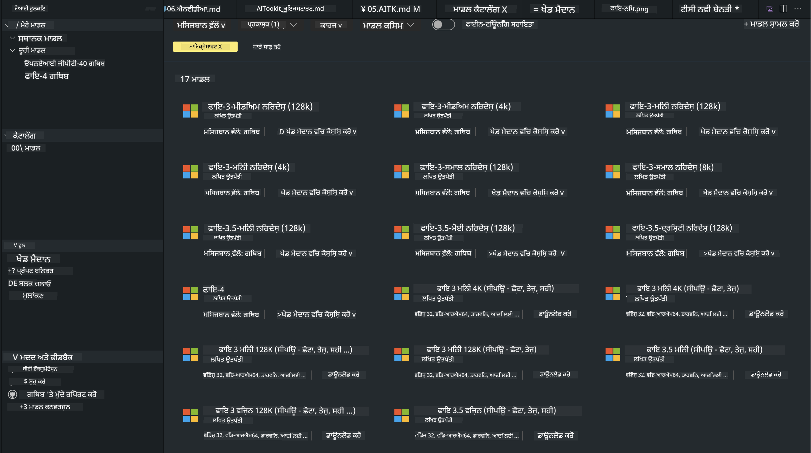
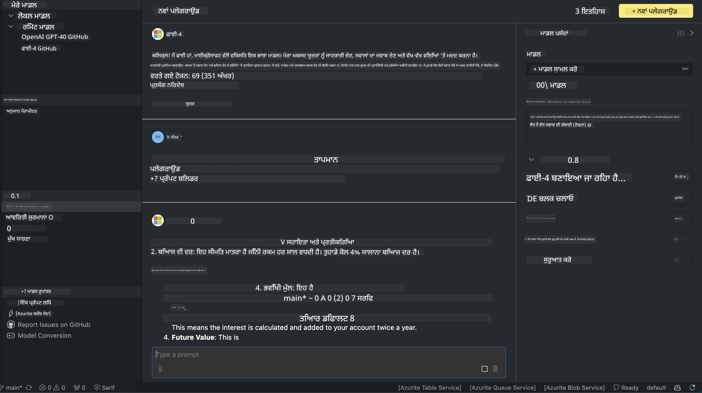

<!--
CO_OP_TRANSLATOR_METADATA:
{
  "original_hash": "4951d458c0b60c02cd1e751b40903877",
  "translation_date": "2025-05-09T09:29:25+00:00",
  "source_file": "md/01.Introduction/02/05.AITK.md",
  "language_code": "pa"
}
-->
# AITK ਵਿੱਚ Phi ਪਰਿਵਾਰ

[AI Toolkit for VS Code](https://marketplace.visualstudio.com/items?itemName=ms-windows-ai-studio.windows-ai-studio) ਜਨਰੇਟਿਵ AI ਐਪ ਵਿਕਾਸ ਨੂੰ ਸੌਖਾ ਬਣਾਉਂਦਾ ਹੈ, ਜਿਸ ਵਿੱਚ Azure AI Foundry Catalog ਅਤੇ ਹੋਰ ਕੈਟਲਾਗਾਂ ਜਿਵੇਂ Hugging Face ਤੋਂ ਅਗਲੇ ਪੱਧਰ ਦੇ AI ਵਿਕਾਸ ਟੂਲ ਅਤੇ ਮਾਡਲ ਇਕੱਠੇ ਕੀਤੇ ਗਏ ਹਨ। ਤੁਸੀਂ GitHub Models ਅਤੇ Azure AI Foundry Model Catalogs ਦੁਆਰਾ ਸੰਚਾਲਿਤ AI ਮਾਡਲ ਕੈਟਲਾਗ ਨੂੰ ਬ੍ਰਾਊਜ਼ ਕਰ ਸਕਦੇ ਹੋ, ਉਨ੍ਹਾਂ ਨੂੰ ਸਥਾਨਕ ਜਾਂ ਰਿਮੋਟ ਡਾਊਨਲੋਡ ਕਰ ਸਕਦੇ ਹੋ, ਫਾਈਨ-ਟਿਊਨ ਕਰ ਸਕਦੇ ਹੋ, ਟੈਸਟ ਕਰ ਸਕਦੇ ਹੋ ਅਤੇ ਆਪਣੀ ਐਪਲੀਕੇਸ਼ਨ ਵਿੱਚ ਵਰਤ ਸਕਦੇ ਹੋ।

AI Toolkit ਪ੍ਰੀਵਿਊ ਸਥਾਨਕ ਤੌਰ 'ਤੇ ਚੱਲੇਗਾ। ਸਥਾਨਕ ਇਨਫਰੰਸ ਜਾਂ ਫਾਈਨ-ਟਿਊਨ, ਜੋ ਮਾਡਲ ਤੁਸੀਂ ਚੁਣਦੇ ਹੋ ਉਸ 'ਤੇ ਨਿਰਭਰ ਕਰਦਾ ਹੈ, ਤੁਹਾਨੂੰ NVIDIA CUDA GPU ਵਰਗਾ GPU ਚਾਹੀਦਾ ਹੋ ਸਕਦਾ ਹੈ। ਤੁਸੀਂ AITK ਨਾਲ ਸਿੱਧਾ GitHub Models ਵੀ ਚਲਾ ਸਕਦੇ ਹੋ।

## ਸ਼ੁਰੂਆਤ ਕਰਨਾ

[Windows subsystem for Linux ਇੰਸਟਾਲ ਕਰਨ ਬਾਰੇ ਹੋਰ ਜਾਣੋ](https://learn.microsoft.com/windows/wsl/install?WT.mc_id=aiml-137032-kinfeylo)

ਅਤੇ [ਡਿਫੌਲਟ ਡਿਸਟ੍ਰੋਬਿਊਸ਼ਨ ਬਦਲਣ ਬਾਰੇ](https://learn.microsoft.com/windows/wsl/install#change-the-default-linux-distribution-installed)।

[AI Toolkit GitHub ਰਿਪੋ](https://github.com/microsoft/vscode-ai-toolkit/)

- Windows, Linux, macOS
  
- Windows ਅਤੇ Linux ਦੋਹਾਂ 'ਤੇ ਫਾਈਨ-ਟਿਊਨਿੰਗ ਲਈ, ਤੁਹਾਨੂੰ Nvidia GPU ਦੀ ਲੋੜ ਹੋਵੇਗੀ। ਇਸਦੇ ਨਾਲ-ਨਾਲ, **Windows** ਲਈ Linux ਸਬਸਿਸਟਮ ਨਾਲ Ubuntu ਡਿਸਟ੍ਰੋ 18.4 ਜਾਂ ਉਸ ਤੋਂ ਉੱਪਰ ਦੀ ਲੋੜ ਹੈ। [Windows subsystem for Linux ਇੰਸਟਾਲ ਕਰਨ ਬਾਰੇ ਹੋਰ ਜਾਣੋ](https://learn.microsoft.com/windows/wsl/install) ਅਤੇ [ਡਿਫੌਲਟ ਡਿਸਟ੍ਰੋਬਿਊਸ਼ਨ ਬਦਲਣ ਬਾਰੇ](https://learn.microsoft.com/windows/wsl/install#change-the-default-linux-distribution-installed)।

### AI Toolkit ਇੰਸਟਾਲ ਕਰੋ

AI Toolkit ਇੱਕ [Visual Studio Code Extension](https://code.visualstudio.com/docs/setup/additional-components#_vs-code-extensions) ਵਜੋਂ ਦਿੱਤਾ ਜਾਂਦਾ ਹੈ, ਇਸ ਲਈ ਤੁਹਾਨੂੰ ਪਹਿਲਾਂ [VS Code](https://code.visualstudio.com/docs/setup/windows?WT.mc_id=aiml-137032-kinfeylo) ਇੰਸਟਾਲ ਕਰਨਾ ਪਵੇਗਾ, ਅਤੇ AI Toolkit ਨੂੰ [VS Marketplace](https://marketplace.visualstudio.com/items?itemName=ms-windows-ai-studio.windows-ai-studio) ਤੋਂ ਡਾਊਨਲੋਡ ਕਰੋ।  
[AI Toolkit Visual Studio Marketplace ਵਿੱਚ ਉਪਲਬਧ ਹੈ](https://marketplace.visualstudio.com/items?itemName=ms-windows-ai-studio.windows-ai-studio) ਅਤੇ ਇਸਨੂੰ ਕਿਸੇ ਵੀ ਹੋਰ VS Code ਐਕਸਟੈਂਸ਼ਨ ਵਾਂਗ ਇੰਸਟਾਲ ਕੀਤਾ ਜਾ ਸਕਦਾ ਹੈ।

ਜੇ ਤੁਹਾਨੂੰ VS Code ਐਕਸਟੈਂਸ਼ਨ ਇੰਸਟਾਲ ਕਰਨ ਦਾ ਤਜਰਬਾ ਨਹੀਂ ਹੈ, ਤਾਂ ਇਹ ਕਦਮ ਫਾਲੋ ਕਰੋ:

### ਸਾਈਨ ਇਨ ਕਰੋ

1. VS Code ਵਿੱਚ Activity Bar ਵਿੱਚੋਂ **Extensions** ਚੁਣੋ  
1. Extensions Search ਬਾਰ ਵਿੱਚ "AI Toolkit" ਲਿਖੋ  
1. "AI Toolkit for Visual Studio code" ਚੁਣੋ  
1. **Install** 'ਤੇ ਕਲਿੱਕ ਕਰੋ  

ਹੁਣ, ਤੁਸੀਂ ਐਕਸਟੈਂਸ਼ਨ ਵਰਤਣ ਲਈ ਤਿਆਰ ਹੋ!

ਤੁਹਾਨੂੰ GitHub ਵਿੱਚ ਸਾਈਨ ਇਨ ਕਰਨ ਲਈ ਕਿਹਾ ਜਾਵੇਗਾ, ਇਸ ਲਈ ਕਿਰਪਾ ਕਰਕੇ "Allow" 'ਤੇ ਕਲਿੱਕ ਕਰੋ। ਤੁਸੀਂ GitHub ਸਾਈਨ ਇਨ ਪੇਜ 'ਤੇ ਰੀਡਾਇਰੈਕਟ ਹੋਵੋਗੇ।

ਕਿਰਪਾ ਕਰਕੇ ਸਾਈਨ ਇਨ ਕਰੋ ਅਤੇ ਪ੍ਰਕਿਰਿਆ ਦੇ ਕਦਮਾਂ ਨੂੰ ਫਾਲੋ ਕਰੋ। ਸਫਲਤਾ ਨਾਲ ਮੁਕੰਮਲ ਹੋਣ 'ਤੇ, ਤੁਹਾਨੂੰ VS Code ਵਾਪਸ ਲੈ ਜਾਇਆ ਜਾਵੇਗਾ।

ਜਦੋਂ ਐਕਸਟੈਂਸ਼ਨ ਇੰਸਟਾਲ ਹੋ ਜਾਵੇਗਾ, ਤਾਂ ਤੁਹਾਡੇ Activity Bar ਵਿੱਚ AI Toolkit ਦਾ ਆਈਕਨ ਦਿਖਾਈ ਦੇਵੇਗਾ।

ਚਲੋ ਉਪਲਬਧ ਕਾਰਵਾਈਆਂ ਨੂੰ ਵੇਖੀਏ!

### ਉਪਲਬਧ ਕਾਰਵਾਈਆਂ

AI Toolkit ਦਾ ਪ੍ਰਾਇਮਰੀ ਸਾਈਡਬਾਰ ਹੇਠਾਂ ਦਿੱਤੀਆਂ ਸੈਕਸ਼ਨਾਂ ਵਿੱਚ ਵੰਡਿਆ ਗਿਆ ਹੈ:  

- **Models**  
- **Resources**  
- **Playground**  
- **Fine-tuning**  
- **Evaluation**

Resources ਸੈਕਸ਼ਨ ਵਿੱਚ ਉਪਲਬਧ ਹਨ। ਸ਼ੁਰੂ ਕਰਨ ਲਈ **Model Catalog** ਚੁਣੋ।

### ਕੈਟਲਾਗ ਤੋਂ ਮਾਡਲ ਡਾਊਨਲੋਡ ਕਰੋ

VS Code ਸਾਈਡਬਾਰ ਤੋਂ AI Toolkit ਖੋਲ੍ਹਣ 'ਤੇ, ਤੁਸੀਂ ਹੇਠਾਂ ਦਿੱਤੀਆਂ ਵਿਕਲਪਾਂ ਵਿੱਚੋਂ ਚੁਣ ਸਕਦੇ ਹੋ:



- **Model Catalog** ਵਿੱਚੋਂ ਸਮਰਥਿਤ ਮਾਡਲ ਲੱਭੋ ਅਤੇ ਸਥਾਨਕ ਡਾਊਨਲੋਡ ਕਰੋ  
- **Model Playground** ਵਿੱਚ ਮਾਡਲ ਇਨਫਰੰਸ ਟੈਸਟ ਕਰੋ  
- **Model Fine-tuning** ਵਿੱਚ ਸਥਾਨਕ ਜਾਂ ਰਿਮੋਟ ਫਾਈਨ-ਟਿਊਨ ਕਰੋ  
- AI Toolkit ਲਈ ਕਮਾਂਡ ਪੈਲੇਟ ਰਾਹੀਂ ਕਲਾਉਡ 'ਤੇ ਫਾਈਨ-ਟਿਊਨਡ ਮਾਡਲ ਤੈਨਾਤ ਕਰੋ  
- ਮਾਡਲ ਮੁਲਾਂਕਣ

> [!NOTE]
>
> **GPU Vs CPU**
>
> ਤੁਸੀਂ ਦੇਖੋਗੇ ਕਿ ਮਾਡਲ ਕਾਰਡਾਂ 'ਤੇ ਮਾਡਲ ਦਾ ਆਕਾਰ, ਪਲੇਟਫਾਰਮ ਅਤੇ ਐਕਸੈਲੇਰੇਟਰ ਕਿਸਮ (CPU, GPU) ਦਰਸਾਈ ਗਈ ਹੈ। **Windows ਡਿਵਾਈਸਾਂ ਜਿਨ੍ਹਾਂ ਵਿੱਚ ਘੱਟੋ-ਘੱਟ ਇੱਕ GPU ਹੈ**, ਉਨ੍ਹਾਂ ਲਈ ਸਿਰਫ Windows ਲਈ ਟਾਰਗਟ ਕੀਤੇ ਮਾਡਲ ਵਰਜਨਾਂ ਨੂੰ ਚੁਣੋ।  
>
> ਇਹ ਯਕੀਨੀ ਬਣਾਉਂਦਾ ਹੈ ਕਿ ਤੁਹਾਡੇ ਕੋਲ DirectML ਐਕਸੈਲੇਰੇਟਰ ਲਈ ਅਨੁਕੂਲ ਮਾਡਲ ਹੈ।  
>
> ਮਾਡਲ ਨਾਮਾਂ ਦਾ ਫਾਰਮੈਟ ਇਹ ਹੈ:  
>
> - `{model_name}-{accelerator}-{quantization}-{format}`।  
>
> Windows ਡਿਵਾਈਸ 'ਤੇ GPU ਹੈ ਜਾਂ ਨਹੀਂ, ਇਹ ਚੈੱਕ ਕਰਨ ਲਈ **Task Manager** ਖੋਲ੍ਹੋ ਅਤੇ ਫਿਰ **Performance** ਟੈਬ ਚੁਣੋ। ਜੇ ਤੁਹਾਡੇ ਕੋਲ GPU ਹੈ, ਤਾਂ ਉਹ "GPU 0" ਜਾਂ "GPU 1" ਵਰਗੇ ਨਾਮਾਂ ਹੇਠਾਂ ਦਿਖਾਈ ਦੇਣਗੇ।

### Playground ਵਿੱਚ ਮਾਡਲ ਚਲਾਓ

ਸਾਰੇ ਪੈਰਾਮੀਟਰ ਸੈੱਟ ਹੋਣ ਤੋਂ ਬਾਅਦ, **Generate Project** 'ਤੇ ਕਲਿੱਕ ਕਰੋ।

ਜਦੋਂ ਤੁਹਾਡਾ ਮਾਡਲ ਡਾਊਨਲੋਡ ਹੋ ਜਾਵੇ, ਤਾਂ ਕੈਟਲਾਗ ਵਿੱਚ ਮਾਡਲ ਕਾਰਡ 'ਤੇ **Load in Playground** ਚੁਣੋ:

- ਮਾਡਲ ਡਾਊਨਲੋਡ ਸ਼ੁਰੂ ਕਰੋ  
- ਸਾਰੇ ਲੋੜੀਂਦੇ ਪ੍ਰੀ-ਰੀਕੁਆਜ਼ਿਟ ਅਤੇ ਡਿਪੈਂਡੈਂਸੀਜ਼ ਇੰਸਟਾਲ ਕਰੋ  
- VS Code ਵਰਕਸਪੇਸ ਬਣਾਓ



### ਆਪਣੀ ਐਪਲੀਕੇਸ਼ਨ ਵਿੱਚ REST API ਵਰਤੋਂ

AI Toolkit ਇੱਕ ਸਥਾਨਕ REST API ਵੈੱਬ ਸਰਵਰ **ਪੋਰਟ 5272 'ਤੇ** ਲੈ ਕੇ ਆਉਂਦਾ ਹੈ ਜੋ [OpenAI chat completions format](https://platform.openai.com/docs/api-reference/chat/create) ਵਰਤਦਾ ਹੈ।  

ਇਸ ਨਾਲ ਤੁਸੀਂ ਆਪਣੀ ਐਪਲੀਕੇਸ਼ਨ ਨੂੰ ਸਥਾਨਕ ਤੌਰ 'ਤੇ ਟੈਸਟ ਕਰ ਸਕਦੇ ਹੋ ਬਿਨਾਂ ਕਿਸੇ ਕਲਾਉਡ AI ਮਾਡਲ ਸਰਵਿਸ 'ਤੇ ਨਿਰਭਰ ਹੋਏ। ਉਦਾਹਰਨ ਲਈ, ਹੇਠਾਂ ਦਿੱਤਾ JSON ਫਾਈਲ ਦਿਖਾਉਂਦੀ ਹੈ ਕਿ ਕਿਵੇਂ ਬਾਡੀ ਨੂੰ ਕਨਫਿਗਰ ਕਰਨਾ ਹੈ:

```json
{
    "model": "Phi-4",
    "messages": [
        {
            "role": "user",
            "content": "what is the golden ratio?"
        }
    ],
    "temperature": 0.7,
    "top_p": 1,
    "top_k": 10,
    "max_tokens": 100,
    "stream": true
}
```

ਤੁਸੀਂ REST API ਨੂੰ (ਮਿਸਾਲ ਵਜੋਂ) [Postman](https://www.postman.com/) ਜਾਂ CURL (Client URL) ਯੂਟਿਲਿਟੀ ਨਾਲ ਟੈਸਟ ਕਰ ਸਕਦੇ ਹੋ:

```bash
curl -vX POST http://127.0.0.1:5272/v1/chat/completions -H 'Content-Type: application/json' -d @body.json
```

### Python ਲਈ OpenAI ਕਲਾਇੰਟ ਲਾਇਬ੍ਰੇਰੀ ਵਰਤੋਂ

```python
from openai import OpenAI

client = OpenAI(
    base_url="http://127.0.0.1:5272/v1/", 
    api_key="x" # required for the API but not used
)

chat_completion = client.chat.completions.create(
    messages=[
        {
            "role": "user",
            "content": "what is the golden ratio?",
        }
    ],
    model="Phi-4",
)

print(chat_completion.choices[0].message.content)
```

### .NET ਲਈ Azure OpenAI ਕਲਾਇੰਟ ਲਾਇਬ੍ਰੇਰੀ ਵਰਤੋਂ

ਆਪਣੇ ਪ੍ਰੋਜੈਕਟ ਵਿੱਚ NuGet ਰਾਹੀਂ [Azure OpenAI client library for .NET](https://www.nuget.org/packages/Azure.AI.OpenAI/) ਸ਼ਾਮਲ ਕਰੋ:

```bash
dotnet add {project_name} package Azure.AI.OpenAI --version 1.0.0-beta.17
```

ਆਪਣੇ ਪ੍ਰੋਜੈਕਟ ਵਿੱਚ **OverridePolicy.cs** ਨਾਮਕ C# ਫਾਈਲ ਸ਼ਾਮਲ ਕਰੋ ਅਤੇ ਹੇਠਾਂ ਦਿੱਤਾ ਕੋਡ ਪੇਸਟ ਕਰੋ:

```csharp
// OverridePolicy.cs
using Azure.Core.Pipeline;
using Azure.Core;

internal partial class OverrideRequestUriPolicy(Uri overrideUri)
    : HttpPipelineSynchronousPolicy
{
    private readonly Uri _overrideUri = overrideUri;

    public override void OnSendingRequest(HttpMessage message)
    {
        message.Request.Uri.Reset(_overrideUri);
    }
}
```

ਅਗਲਾ, ਆਪਣੇ **Program.cs** ਫਾਈਲ ਵਿੱਚ ਹੇਠਾਂ ਦਿੱਤਾ ਕੋਡ ਪੇਸਟ ਕਰੋ:

```csharp
// Program.cs
using Azure.AI.OpenAI;

Uri localhostUri = new("http://localhost:5272/v1/chat/completions");

OpenAIClientOptions clientOptions = new();
clientOptions.AddPolicy(
    new OverrideRequestUriPolicy(localhostUri),
    Azure.Core.HttpPipelinePosition.BeforeTransport);
OpenAIClient client = new(openAIApiKey: "unused", clientOptions);

ChatCompletionsOptions options = new()
{
    DeploymentName = "Phi-4",
    Messages =
    {
        new ChatRequestSystemMessage("You are a helpful assistant. Be brief and succinct."),
        new ChatRequestUserMessage("What is the golden ratio?"),
    }
};

StreamingResponse<StreamingChatCompletionsUpdate> streamingChatResponse
    = await client.GetChatCompletionsStreamingAsync(options);

await foreach (StreamingChatCompletionsUpdate chatChunk in streamingChatResponse)
{
    Console.Write(chatChunk.ContentUpdate);
}
```

## AI Toolkit ਨਾਲ ਫਾਈਨ ਟਿਊਨਿੰਗ

- ਮਾਡਲ ਖੋਜ ਅਤੇ playground ਨਾਲ ਸ਼ੁਰੂਆਤ ਕਰੋ।  
- ਸਥਾਨਕ ਕੰਪਿਊਟਿੰਗ ਸਰੋਤਾਂ ਦੀ ਵਰਤੋਂ ਕਰਕੇ ਮਾਡਲ ਫਾਈਨ-ਟਿਊਨਿੰਗ ਅਤੇ ਇਨਫਰੰਸ।  
- Azure ਸਰੋਤਾਂ ਦੀ ਵਰਤੋਂ ਕਰਕੇ ਰਿਮੋਟ ਫਾਈਨ-ਟਿਊਨਿੰਗ ਅਤੇ ਇਨਫਰੰਸ।  

[AI Toolkit ਨਾਲ ਫਾਈਨ ਟਿਊਨਿੰਗ](../../03.FineTuning/Finetuning_VSCodeaitoolkit.md)

## AI Toolkit Q&A ਸਰੋਤ

ਕਿਰਪਾ ਕਰਕੇ ਸਾਡੇ [Q&A ਪੇਜ](https://github.com/microsoft/vscode-ai-toolkit/blob/main/archive/QA.md) ਨੂੰ ਸਭ ਤੋਂ ਆਮ ਸਮੱਸਿਆਵਾਂ ਅਤੇ ਹੱਲਾਂ ਲਈ ਵੇਖੋ।

**ਡਿਸਕਲੇਮਰ**:  
ਇਹ ਦਸਤਾਵੇਜ਼ AI ਅਨੁਵਾਦ ਸੇਵਾ [Co-op Translator](https://github.com/Azure/co-op-translator) ਦੀ ਵਰਤੋਂ ਕਰਕੇ ਅਨੁਵਾਦ ਕੀਤਾ ਗਿਆ ਹੈ। ਜਦੋਂ ਕਿ ਅਸੀਂ ਸਹੀਅਤ ਲਈ ਯਤਨ ਕਰਦੇ ਹਾਂ, ਕਿਰਪਾ ਕਰਕੇ ਧਿਆਨ ਰੱਖੋ ਕਿ ਸਵੈਚਾਲਿਤ ਅਨੁਵਾਦਾਂ ਵਿੱਚ ਗਲਤੀਆਂ ਜਾਂ ਅਸਮਰਥਤਾਵਾਂ ਹੋ ਸਕਦੀਆਂ ਹਨ। ਮੂਲ ਦਸਤਾਵੇਜ਼ ਆਪਣੀ ਮੂਲ ਭਾਸ਼ਾ ਵਿੱਚ ਹੀ ਅਧਿਕਾਰਤ ਸਰੋਤ ਮੰਨਿਆ ਜਾਣਾ ਚਾਹੀਦਾ ਹੈ। ਮਹੱਤਵਪੂਰਨ ਜਾਣਕਾਰੀ ਲਈ, ਪੇਸ਼ੇਵਰ ਮਨੁੱਖੀ ਅਨੁਵਾਦ ਦੀ ਸਿਫਾਰਸ਼ ਕੀਤੀ ਜਾਂਦੀ ਹੈ। ਅਸੀਂ ਇਸ ਅਨੁਵਾਦ ਦੇ ਉਪਯੋਗ ਤੋਂ ਉਤਪੰਨ ਹੋਣ ਵਾਲੀਆਂ ਕਿਸੇ ਵੀ ਗਲਤਫਹਿਮੀਆਂ ਜਾਂ ਭ੍ਰਮਾਂ ਲਈ ਜ਼ਿੰਮੇਵਾਰ ਨਹੀਂ ਹਾਂ।