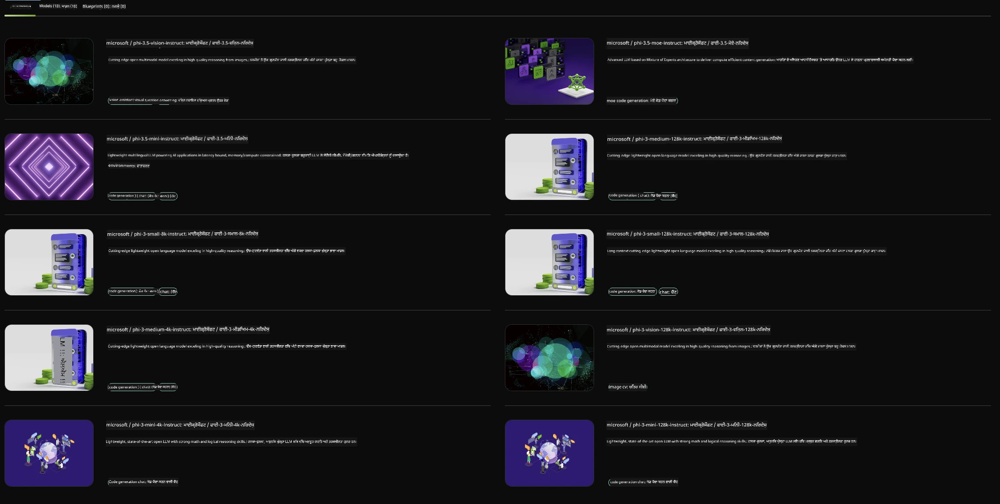

<!--
CO_OP_TRANSLATOR_METADATA:
{
  "original_hash": "7b08e277df2a9307f861ae54bc30c772",
  "translation_date": "2025-07-16T19:35:36+00:00",
  "source_file": "md/01.Introduction/02/06.NVIDIA.md",
  "language_code": "pa"
}
-->
## NVIDIA NIM ਵਿੱਚ Phi ਪਰਿਵਾਰ

NVIDIA NIM ਇੱਕ ਆਸਾਨ-ਵਰਤੋਂ ਵਾਲੇ ਮਾਈਕ੍ਰੋਸਰਵਿਸਿਜ਼ ਦਾ ਸੈੱਟ ਹੈ ਜੋ ਕਲਾਉਡ, ਡਾਟਾ ਸੈਂਟਰ ਅਤੇ ਵਰਕਸਟੇਸ਼ਨਾਂ 'ਤੇ ਜਨਰੇਟਿਵ AI ਮਾਡਲਾਂ ਦੀ ਤਿਆਰੀ ਨੂੰ ਤੇਜ਼ ਕਰਦਾ ਹੈ। NIMs ਨੂੰ ਮਾਡਲ ਪਰਿਵਾਰ ਅਤੇ ਪ੍ਰਤੀ ਮਾਡਲ ਅਧਾਰ 'ਤੇ ਵਰਗੀਕ੍ਰਿਤ ਕੀਤਾ ਗਿਆ ਹੈ। ਉਦਾਹਰਨ ਵਜੋਂ, ਵੱਡੇ ਭਾਸ਼ਾ ਮਾਡਲਾਂ (LLMs) ਲਈ NVIDIA NIM ਉਦਯੋਗਿਕ ਐਪਲੀਕੇਸ਼ਨਾਂ ਵਿੱਚ ਅਧੁਨਿਕ LLMs ਦੀ ਤਾਕਤ ਲਿਆਉਂਦਾ ਹੈ, ਜੋ ਬੇਮਿਸਾਲ ਕੁਦਰਤੀ ਭਾਸ਼ਾ ਪ੍ਰੋਸੈਸਿੰਗ ਅਤੇ ਸਮਝਣ ਦੀ ਸਮਰੱਥਾ ਪ੍ਰਦਾਨ ਕਰਦਾ ਹੈ।

NIM IT ਅਤੇ DevOps ਟੀਮਾਂ ਲਈ ਆਪਣੇ ਪ੍ਰਬੰਧਿਤ ਵਾਤਾਵਰਣਾਂ ਵਿੱਚ ਵੱਡੇ ਭਾਸ਼ਾ ਮਾਡਲਾਂ (LLMs) ਨੂੰ ਸਵੈ-ਹੋਸਟ ਕਰਨਾ ਆਸਾਨ ਬਣਾਉਂਦਾ ਹੈ, ਜਦਕਿ ਵਿਕਾਸਕਾਰਾਂ ਨੂੰ ਉਦਯੋਗ ਮਿਆਰੀ APIs ਪ੍ਰਦਾਨ ਕਰਦਾ ਹੈ ਜੋ ਉਨ੍ਹਾਂ ਨੂੰ ਸ਼ਕਤੀਸ਼ਾਲੀ ਕੋਪਾਇਲਟ, ਚੈਟਬੋਟ ਅਤੇ AI ਸਹਾਇਕ ਬਣਾਉਣ ਦੀ ਆਗਿਆ ਦਿੰਦੇ ਹਨ ਜੋ ਉਨ੍ਹਾਂ ਦੇ ਕਾਰੋਬਾਰ ਨੂੰ ਬਦਲ ਸਕਦੇ ਹਨ। NVIDIA ਦੀ ਅਗੇਤਰ GPU ਤੇਜ਼ੀ ਅਤੇ ਸਕੇਲ ਕਰਨ ਯੋਗ ਤਿਆਰੀ ਦੀ ਵਰਤੋਂ ਕਰਦਿਆਂ, NIM ਬੇਮਿਸਾਲ ਪ੍ਰਦਰਸ਼ਨ ਨਾਲ ਸਭ ਤੋਂ ਤੇਜ਼ ਇੰਫਰੈਂਸ ਦਾ ਰਸਤਾ ਦਿੰਦਾ ਹੈ।

ਤੁਸੀਂ NVIDIA NIM ਦੀ ਵਰਤੋਂ ਕਰਕੇ Phi ਪਰਿਵਾਰ ਦੇ ਮਾਡਲਾਂ ਦਾ ਇੰਫਰੈਂਸ ਕਰ ਸਕਦੇ ਹੋ



### **ਨਮੂਨੇ - NVIDIA NIM ਵਿੱਚ Phi-3-Vision**

ਕਲਪਨਾ ਕਰੋ ਕਿ ਤੁਹਾਡੇ ਕੋਲ ਇੱਕ ਚਿੱਤਰ (`demo.png`) ਹੈ ਅਤੇ ਤੁਸੀਂ ਇਸ ਚਿੱਤਰ ਨੂੰ ਪ੍ਰੋਸੈਸ ਕਰਨ ਅਤੇ ਇਸ ਦੀ ਇੱਕ ਨਵੀਂ ਵਰਜਨ (`phi-3-vision.jpg`) ਸੇਵ ਕਰਨ ਲਈ Python ਕੋਡ ਬਣਾਉਣਾ ਚਾਹੁੰਦੇ ਹੋ।

ਉਪਰ ਦਿੱਤਾ ਕੋਡ ਇਸ ਪ੍ਰਕਿਰਿਆ ਨੂੰ ਆਟੋਮੇਟ ਕਰਦਾ ਹੈ:

1. ਵਾਤਾਵਰਣ ਅਤੇ ਜ਼ਰੂਰੀ ਸੰਰਚਨਾਵਾਂ ਸੈੱਟ ਕਰਨਾ।
2. ਮਾਡਲ ਨੂੰ ਲੋੜੀਂਦਾ Python ਕੋਡ ਬਣਾਉਣ ਲਈ ਪ੍ਰੰਪਟ ਤਿਆਰ ਕਰਨਾ।
3. ਪ੍ਰੰਪਟ ਨੂੰ ਮਾਡਲ ਨੂੰ ਭੇਜਣਾ ਅਤੇ ਬਣਾਇਆ ਗਿਆ ਕੋਡ ਇਕੱਠਾ ਕਰਨਾ।
4. ਬਣਾਇਆ ਗਿਆ ਕੋਡ ਕੱਢ ਕੇ ਚਲਾਉਣਾ।
5. ਮੂਲ ਅਤੇ ਪ੍ਰੋਸੈਸ ਕੀਤੇ ਚਿੱਤਰਾਂ ਨੂੰ ਦਿਖਾਉਣਾ।

ਇਹ ਤਰੀਕਾ AI ਦੀ ਤਾਕਤ ਦੀ ਵਰਤੋਂ ਕਰਕੇ ਚਿੱਤਰ ਪ੍ਰੋਸੈਸਿੰਗ ਕੰਮਾਂ ਨੂੰ ਆਟੋਮੇਟ ਕਰਦਾ ਹੈ, ਜਿਸ ਨਾਲ ਤੁਹਾਡੇ ਲਕੜਾਂ ਨੂੰ ਪੂਰਾ ਕਰਨਾ ਆਸਾਨ ਅਤੇ ਤੇਜ਼ ਹੋ ਜਾਂਦਾ ਹੈ।

[ਨਮੂਨਾ ਕੋਡ ਹੱਲ](../../../../../code/06.E2E/E2E_Nvidia_NIM_Phi3_Vision.ipynb)

ਆਓ ਪੂਰੇ ਕੋਡ ਨੂੰ ਕਦਮ-ਦਰ-ਕਦਮ ਸਮਝੀਏ:

1. **ਲੋੜੀਂਦਾ ਪੈਕੇਜ ਇੰਸਟਾਲ ਕਰੋ**:
    ```python
    !pip install langchain_nvidia_ai_endpoints -U
    ```
    ਇਹ ਕਮਾਂਡ `langchain_nvidia_ai_endpoints` ਪੈਕੇਜ ਨੂੰ ਇੰਸਟਾਲ ਕਰਦੀ ਹੈ, ਇਹ ਯਕੀਨੀ ਬਣਾਉਂਦੀ ਹੈ ਕਿ ਇਹ ਸਭ ਤੋਂ ਨਵਾਂ ਵਰਜਨ ਹੈ।

2. **ਜ਼ਰੂਰੀ ਮੋਡੀਊਲ ਇੰਪੋਰਟ ਕਰੋ**:
    ```python
    from langchain_nvidia_ai_endpoints import ChatNVIDIA
    import getpass
    import os
    import base64
    ```
    ਇਹ ਇੰਪੋਰਟ NVIDIA AI ਐਂਡਪੌਇੰਟਸ ਨਾਲ ਇੰਟਰੈਕਟ ਕਰਨ, ਪਾਸਵਰਡ ਸੁਰੱਖਿਅਤ ਤਰੀਕੇ ਨਾਲ ਸੰਭਾਲਣ, ਓਪਰੇਟਿੰਗ ਸਿਸਟਮ ਨਾਲ ਕੰਮ ਕਰਨ ਅਤੇ ਡਾਟਾ ਨੂੰ ਬੇਸ64 ਫਾਰਮੈਟ ਵਿੱਚ ਐਨਕੋਡ/ਡਿਕੋਡ ਕਰਨ ਲਈ ਜ਼ਰੂਰੀ ਮੋਡੀਊਲ ਲਿਆਉਂਦੇ ਹਨ।

3. **API ਕੀ ਸੈੱਟ ਕਰੋ**:
    ```python
    if not os.getenv("NVIDIA_API_KEY"):
        os.environ["NVIDIA_API_KEY"] = getpass.getpass("Enter your NVIDIA API key: ")
    ```
    ਇਹ ਕੋਡ ਜਾਂਚਦਾ ਹੈ ਕਿ `NVIDIA_API_KEY` ਵਾਤਾਵਰਣ ਵੈਰੀਏਬਲ ਸੈੱਟ ਹੈ ਜਾਂ ਨਹੀਂ। ਜੇ ਨਹੀਂ, ਤਾਂ ਇਹ ਯੂਜ਼ਰ ਨੂੰ ਸੁਰੱਖਿਅਤ ਤਰੀਕੇ ਨਾਲ ਆਪਣੀ API ਕੀ ਦਰਜ ਕਰਨ ਲਈ ਕਹਿੰਦਾ ਹੈ।

4. **ਮਾਡਲ ਅਤੇ ਚਿੱਤਰ ਦਾ ਪਾਥ ਪਰਿਭਾਸ਼ਿਤ ਕਰੋ**:
    ```python
    model = 'microsoft/phi-3-vision-128k-instruct'
    chat = ChatNVIDIA(model=model)
    img_path = './imgs/demo.png'
    ```
    ਇਹ ਮਾਡਲ ਨੂੰ ਸੈੱਟ ਕਰਦਾ ਹੈ, ਦਿੱਤੇ ਮਾਡਲ ਨਾਲ `ChatNVIDIA` ਦਾ ਇੰਸਟੈਂਸ ਬਣਾਉਂਦਾ ਹੈ ਅਤੇ ਚਿੱਤਰ ਫਾਇਲ ਦਾ ਪਾਥ ਪਰਿਭਾਸ਼ਿਤ ਕਰਦਾ ਹੈ।

5. **ਟੈਕਸਟ ਪ੍ਰੰਪਟ ਬਣਾਓ**:
    ```python
    text = "Please create Python code for image, and use plt to save the new picture under imgs/ and name it phi-3-vision.jpg."
    ```
    ਇਹ ਇੱਕ ਟੈਕਸਟ ਪ੍ਰੰਪਟ ਤਿਆਰ ਕਰਦਾ ਹੈ ਜੋ ਮਾਡਲ ਨੂੰ ਚਿੱਤਰ ਪ੍ਰੋਸੈਸਿੰਗ ਲਈ Python ਕੋਡ ਬਣਾਉਣ ਦੀ ਹਦਾਇਤ ਦਿੰਦਾ ਹੈ।

6. **ਚਿੱਤਰ ਨੂੰ ਬੇਸ64 ਵਿੱਚ ਐਨਕੋਡ ਕਰੋ**:
    ```python
    with open(img_path, "rb") as f:
        image_b64 = base64.b64encode(f.read()).decode()
    image = f''
    ```
    ਇਹ ਕੋਡ ਚਿੱਤਰ ਫਾਇਲ ਨੂੰ ਪੜ੍ਹਦਾ ਹੈ, ਇਸਨੂੰ ਬੇਸ64 ਵਿੱਚ ਐਨਕੋਡ ਕਰਦਾ ਹੈ ਅਤੇ ਐਨਕੋਡ ਕੀਤੇ ਡਾਟਾ ਨਾਲ ਇੱਕ HTML ਚਿੱਤਰ ਟੈਗ ਬਣਾਉਂਦਾ ਹੈ।

7. **ਟੈਕਸਟ ਅਤੇ ਚਿੱਤਰ ਨੂੰ ਪ੍ਰੰਪਟ ਵਿੱਚ ਜੋੜੋ**:
    ```python
    prompt = f"{text} {image}"
    ```
    ਇਹ ਟੈਕਸਟ ਪ੍ਰੰਪਟ ਅਤੇ HTML ਚਿੱਤਰ ਟੈਗ ਨੂੰ ਇੱਕ ਸਿੰਗਲ ਸਟਰਿੰਗ ਵਿੱਚ ਜੋੜਦਾ ਹੈ।

8. **ChatNVIDIA ਦੀ ਵਰਤੋਂ ਕਰਕੇ ਕੋਡ ਜਨਰੇਟ ਕਰੋ**:
    ```python
    code = ""
    for chunk in chat.stream(prompt):
        print(chunk.content, end="")
        code += chunk.content
    ```
    ਇਹ ਕੋਡ ਪ੍ਰੰਪਟ ਨੂੰ `ChatNVIDIA` ਮਾਡਲ ਨੂੰ ਭੇਜਦਾ ਹੈ ਅਤੇ ਬਣਾਏ ਗਏ ਕੋਡ ਨੂੰ ਟੁਕੜਿਆਂ ਵਿੱਚ ਇਕੱਠਾ ਕਰਦਾ ਹੈ, ਹਰ ਟੁਕੜਾ ਪ੍ਰਿੰਟ ਕਰਦਾ ਅਤੇ `code` ਸਟਰਿੰਗ ਵਿੱਚ ਜੋੜਦਾ ਹੈ।

9. **ਜਨਰੇਟ ਕੀਤੇ ਸਮੱਗਰੀ ਵਿੱਚੋਂ Python ਕੋਡ ਕੱਢੋ**:
    ```python
    begin = code.index('```python') + 9
    code = code[begin:]
    end = code.index('```')
    code = code[:end]
    ```
    ਇਹ ਮਾਰਕਡਾਊਨ ਫਾਰਮੈਟਿੰਗ ਹਟਾ ਕੇ ਅਸਲ Python ਕੋਡ ਕੱਢਦਾ ਹੈ।

10. **ਜਨਰੇਟ ਕੀਤਾ ਕੋਡ ਚਲਾਓ**:
    ```python
    import subprocess
    result = subprocess.run(["python", "-c", code], capture_output=True)
    ```
    ਇਹ ਕੱਢਿਆ ਗਿਆ Python ਕੋਡ ਇੱਕ ਸਬਪ੍ਰੋਸੈਸ ਵਜੋਂ ਚਲਾਉਂਦਾ ਹੈ ਅਤੇ ਇਸਦਾ ਆਉਟਪੁੱਟ ਕੈਪਚਰ ਕਰਦਾ ਹੈ।

11. **ਚਿੱਤਰ ਦਿਖਾਓ**:
    ```python
    from IPython.display import Image, display
    display(Image(filename='./imgs/phi-3-vision.jpg'))
    display(Image(filename='./imgs/demo.png'))
    ```
    ਇਹ ਲਾਈਨਾਂ `IPython.display` ਮੋਡੀਊਲ ਦੀ ਵਰਤੋਂ ਕਰਕੇ ਚਿੱਤਰ ਦਿਖਾਉਂਦੀਆਂ ਹਨ।

**ਅਸਵੀਕਾਰੋਪਣ**:  
ਇਹ ਦਸਤਾਵੇਜ਼ AI ਅਨੁਵਾਦ ਸੇਵਾ [Co-op Translator](https://github.com/Azure/co-op-translator) ਦੀ ਵਰਤੋਂ ਕਰਕੇ ਅਨੁਵਾਦਿਤ ਕੀਤਾ ਗਿਆ ਹੈ। ਜਦੋਂ ਕਿ ਅਸੀਂ ਸਹੀਤਾ ਲਈ ਕੋਸ਼ਿਸ਼ ਕਰਦੇ ਹਾਂ, ਕਿਰਪਾ ਕਰਕੇ ਧਿਆਨ ਰੱਖੋ ਕਿ ਸਵੈਚਾਲਿਤ ਅਨੁਵਾਦਾਂ ਵਿੱਚ ਗਲਤੀਆਂ ਜਾਂ ਅਸਮਰਥਤਾਵਾਂ ਹੋ ਸਕਦੀਆਂ ਹਨ। ਮੂਲ ਦਸਤਾਵੇਜ਼ ਆਪਣੀ ਮੂਲ ਭਾਸ਼ਾ ਵਿੱਚ ਪ੍ਰਮਾਣਿਕ ਸਰੋਤ ਮੰਨਿਆ ਜਾਣਾ ਚਾਹੀਦਾ ਹੈ। ਮਹੱਤਵਪੂਰਨ ਜਾਣਕਾਰੀ ਲਈ, ਪੇਸ਼ੇਵਰ ਮਨੁੱਖੀ ਅਨੁਵਾਦ ਦੀ ਸਿਫਾਰਸ਼ ਕੀਤੀ ਜਾਂਦੀ ਹੈ। ਅਸੀਂ ਇਸ ਅਨੁਵਾਦ ਦੀ ਵਰਤੋਂ ਤੋਂ ਉਤਪੰਨ ਕਿਸੇ ਵੀ ਗਲਤਫਹਿਮੀ ਜਾਂ ਗਲਤ ਵਿਆਖਿਆ ਲਈ ਜ਼ਿੰਮੇਵਾਰ ਨਹੀਂ ਹਾਂ।