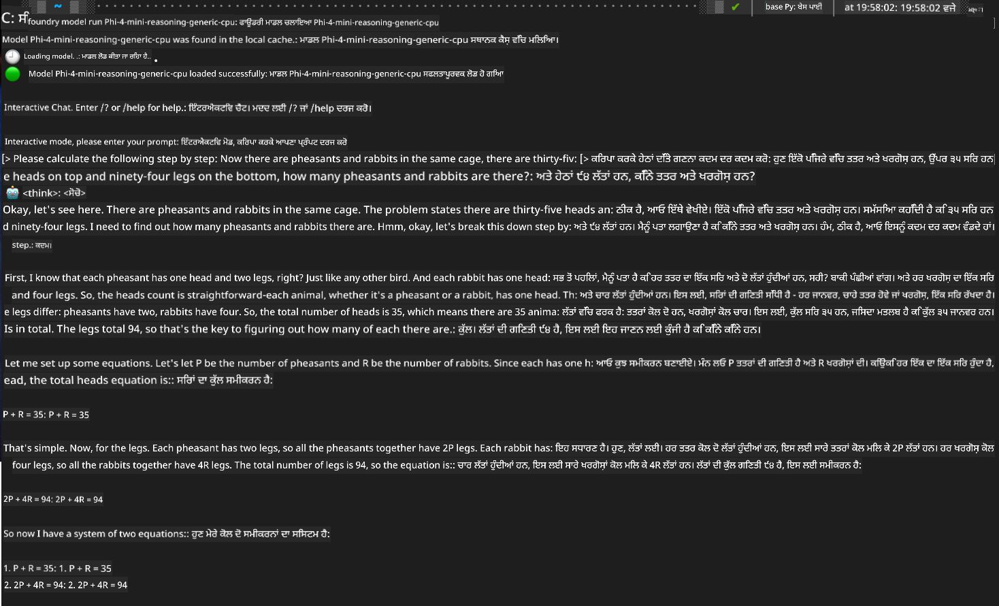

<!--
CO_OP_TRANSLATOR_METADATA:
{
  "original_hash": "52973a5680a65a810aa80b7036afd31f",
  "translation_date": "2025-07-16T19:45:23+00:00",
  "source_file": "md/01.Introduction/02/07.FoundryLocal.md",
  "language_code": "pa"
}
-->
## Foundry Local ਵਿੱਚ Phi-Family ਮਾਡਲਾਂ ਨਾਲ ਸ਼ੁਰੂਆਤ

### Foundry Local ਦਾ ਪਰਿਚਯ

Foundry Local ਇੱਕ ਸ਼ਕਤੀਸ਼ਾਲੀ on-device AI inference ਹੱਲ ਹੈ ਜੋ ਤੁਹਾਡੇ ਸਥਾਨਕ ਹਾਰਡਵੇਅਰ 'ਤੇ ਸਿੱਧਾ ਐਂਟਰਪ੍ਰਾਈਜ਼-ਗਰੇਡ AI ਸਮਰੱਥਾਵਾਂ ਲਿਆਉਂਦਾ ਹੈ। ਇਹ ਟਿਊਟੋਰਿਅਲ ਤੁਹਾਨੂੰ Foundry Local ਨਾਲ Phi-Family ਮਾਡਲਾਂ ਸੈੱਟਅਪ ਅਤੇ ਵਰਤੋਂ ਵਿੱਚ ਮਦਦ ਕਰੇਗਾ, ਜਿਸ ਨਾਲ ਤੁਸੀਂ ਆਪਣੇ AI ਕੰਮਾਂ 'ਤੇ ਪੂਰਾ ਕਾਬੂ ਰੱਖ ਸਕੋਗੇ, ਪ੍ਰਾਈਵੇਸੀ ਬਰਕਰਾਰ ਰੱਖਦੇ ਹੋਏ ਅਤੇ ਖਰਚੇ ਘਟਾਉਂਦੇ ਹੋਏ।

Foundry Local ਤੁਹਾਡੇ ਡਿਵਾਈਸ 'ਤੇ AI ਮਾਡਲਾਂ ਨੂੰ ਲੋਕਲ ਤੌਰ 'ਤੇ ਚਲਾਕੇ ਪ੍ਰਦਰਸ਼ਨ, ਪ੍ਰਾਈਵੇਸੀ, ਕਸਟਮਾਈਜ਼ੇਸ਼ਨ ਅਤੇ ਲਾਗਤ ਦੇ ਫਾਇਦੇ ਦਿੰਦਾ ਹੈ। ਇਹ ਤੁਹਾਡੇ ਮੌਜੂਦਾ ਵਰਕਫਲੋਅ ਅਤੇ ਐਪਲੀਕੇਸ਼ਨਾਂ ਵਿੱਚ ਇੱਕ ਸੌਖੇ CLI, SDK ਅਤੇ REST API ਰਾਹੀਂ ਬਿਨਾਂ ਕਿਸੇ ਰੁਕਾਵਟ ਦੇ ਸ਼ਾਮਿਲ ਹੋ ਜਾਂਦਾ ਹੈ।


### Foundry Local ਕਿਉਂ ਚੁਣੀਏ?

Foundry Local ਦੇ ਫਾਇਦਿਆਂ ਨੂੰ ਸਮਝ ਕੇ ਤੁਸੀਂ ਆਪਣੇ AI ਡਿਪਲੋਇਮੈਂਟ ਰਣਨੀਤੀ ਬਾਰੇ ਸੋਚ-ਵਿਚਾਰ ਕਰ ਸਕੋਗੇ:

- **On-Device Inference:** ਮਾਡਲਾਂ ਨੂੰ ਆਪਣੇ ਹਾਰਡਵੇਅਰ 'ਤੇ ਲੋਕਲ ਤੌਰ 'ਤੇ ਚਲਾਓ, ਖਰਚੇ ਘਟਾਓ ਅਤੇ ਸਾਰਾ ਡਾਟਾ ਆਪਣੇ ਡਿਵਾਈਸ 'ਤੇ ਹੀ ਰੱਖੋ।

- **Model Customization:** ਪਹਿਲਾਂ ਤੋਂ ਤਿਆਰ ਮਾਡਲਾਂ ਵਿੱਚੋਂ ਚੁਣੋ ਜਾਂ ਆਪਣੇ ਮਾਡਲ ਵਰਤੋ ਜੋ ਖਾਸ ਜ਼ਰੂਰਤਾਂ ਅਤੇ ਵਰਤੋਂ ਦੇ ਕੇਸਾਂ ਲਈ موزੂਨ ਹੋਣ।

- **Cost Efficiency:** ਮੌਜੂਦਾ ਹਾਰਡਵੇਅਰ ਦੀ ਵਰਤੋਂ ਕਰਕੇ ਕਲਾਉਡ ਸੇਵਾਵਾਂ ਦੇ ਮੁੜ-ਮੁੜ ਖਰਚੇ ਖਤਮ ਕਰੋ, ਜਿਸ ਨਾਲ AI ਹੋਰ ਸਸਤੀ ਅਤੇ ਪਹੁੰਚਯੋਗ ਬਣ ਜਾਂਦੀ ਹੈ।

- **Seamless Integration:** SDK, API endpoints ਜਾਂ CLI ਰਾਹੀਂ ਆਪਣੇ ਐਪਲੀਕੇਸ਼ਨਾਂ ਨਾਲ ਜੁੜੋ, ਅਤੇ ਜਦੋਂ ਲੋੜ ਹੋਵੇ ਤਾਂ Azure AI Foundry ਵੱਲ ਆਸਾਨੀ ਨਾਲ ਸਕੇਲ ਕਰੋ।

> **Getting Started Note:** ਇਹ ਟਿਊਟੋਰਿਅਲ Foundry Local ਨੂੰ CLI ਅਤੇ SDK ਇੰਟਰਫੇਸ ਰਾਹੀਂ ਵਰਤਣ 'ਤੇ ਧਿਆਨ ਕੇਂਦਰਿਤ ਕਰਦਾ ਹੈ। ਤੁਸੀਂ ਦੋਹਾਂ ਤਰੀਕਿਆਂ ਨੂੰ ਸਿੱਖੋਗੇ ਤਾਂ ਜੋ ਆਪਣੇ ਵਰਤੋਂ ਦੇ ਕੇਸ ਲਈ ਸਭ ਤੋਂ ਵਧੀਆ ਤਰੀਕਾ ਚੁਣ ਸਕੋ।

## ਭਾਗ 1: Foundry Local CLI ਸੈੱਟਅਪ ਕਰਨਾ

### ਕਦਮ 1: ਇੰਸਟਾਲੇਸ਼ਨ

Foundry Local CLI ਤੁਹਾਡਾ ਦਰਵਾਜ਼ਾ ਹੈ ਜੋ ਤੁਹਾਨੂੰ AI ਮਾਡਲਾਂ ਨੂੰ ਲੋਕਲ ਤੌਰ 'ਤੇ ਮੈਨੇਜ ਅਤੇ ਚਲਾਉਣ ਦੀ ਆਗਿਆ ਦਿੰਦਾ ਹੈ। ਆਓ ਇਸਨੂੰ ਆਪਣੇ ਸਿਸਟਮ 'ਤੇ ਇੰਸਟਾਲ ਕਰੀਏ।

**ਸਮਰਥਿਤ ਪਲੇਟਫਾਰਮ:** Windows ਅਤੇ macOS

ਵਿਸਥਾਰ ਵਿੱਚ ਇੰਸਟਾਲੇਸ਼ਨ ਲਈ, ਕਿਰਪਾ ਕਰਕੇ [official Foundry Local documentation](https://github.com/microsoft/Foundry-Local/blob/main/README.md) ਨੂੰ ਵੇਖੋ।

### ਕਦਮ 2: ਉਪਲਬਧ ਮਾਡਲਾਂ ਦੀ ਖੋਜ

ਜਦੋਂ Foundry Local CLI ਇੰਸਟਾਲ ਹੋ ਜਾਵੇ, ਤਾਂ ਤੁਸੀਂ ਵੇਖ ਸਕਦੇ ਹੋ ਕਿ ਤੁਹਾਡੇ ਵਰਤੋਂ ਦੇ ਕੇਸ ਲਈ ਕਿਹੜੇ ਮਾਡਲ ਉਪਲਬਧ ਹਨ। ਇਹ ਕਮਾਂਡ ਤੁਹਾਨੂੰ ਸਾਰੇ ਸਮਰਥਿਤ ਮਾਡਲ ਦਿਖਾਏਗੀ:


```bash
foundry model list
```

### ਕਦਮ 3: Phi Family ਮਾਡਲਾਂ ਨੂੰ ਸਮਝਣਾ

Phi Family ਵੱਖ-ਵੱਖ ਵਰਤੋਂ ਦੇ ਕੇਸਾਂ ਅਤੇ ਹਾਰਡਵੇਅਰ ਸੰਰਚਨਾਵਾਂ ਲਈ ਅਨੁਕੂਲਿਤ ਮਾਡਲਾਂ ਦੀ ਇੱਕ ਰੇਂਜ ਪੇਸ਼ ਕਰਦੀ ਹੈ। Foundry Local ਵਿੱਚ ਉਪਲਬਧ Phi ਮਾਡਲ ਹਨ:

**ਉਪਲਬਧ Phi ਮਾਡਲ:** 

- **phi-3.5-mini** - ਬੁਨਿਆਦੀ ਕੰਮਾਂ ਲਈ ਛੋਟਾ ਮਾਡਲ
- **phi-3-mini-128k** - ਲੰਬੀਆਂ ਗੱਲਬਾਤਾਂ ਲਈ ਵਧੇਰੇ ਸੰਦਰਭ ਵਾਲਾ ਵਰਜਨ
- **phi-3-mini-4k** - ਆਮ ਵਰਤੋਂ ਲਈ ਸਟੈਂਡਰਡ ਸੰਦਰਭ ਮਾਡਲ
- **phi-4** - ਸੁਧਾਰਤ ਸਮਰੱਥਾਵਾਂ ਵਾਲਾ ਅਗਲਾ ਪੱਧਰ ਮਾਡਲ
- **phi-4-mini** - Phi-4 ਦਾ ਹਲਕਾ ਵਰਜਨ
- **phi-4-mini-reasoning** - ਜਟਿਲ ਤਰਕਸ਼ੀਲ ਕੰਮਾਂ ਲਈ ਖਾਸ ਤੌਰ 'ਤੇ ਬਣਾਇਆ ਗਿਆ

> **Hardware Compatibility:** ਹਰ ਮਾਡਲ ਨੂੰ ਤੁਹਾਡੇ ਸਿਸਟਮ ਦੀ ਸਮਰੱਥਾ ਅਨੁਸਾਰ ਵੱਖ-ਵੱਖ ਹਾਰਡਵੇਅਰ ਐਕਸਲੇਰੇਸ਼ਨ (CPU, GPU) ਲਈ ਸੰਰਚਿਤ ਕੀਤਾ ਜਾ ਸਕਦਾ ਹੈ।

### ਕਦਮ 4: ਆਪਣਾ ਪਹਿਲਾ Phi ਮਾਡਲ ਚਲਾਉਣਾ

ਆਓ ਇੱਕ ਪ੍ਰਯੋਗਾਤਮਕ ਉਦਾਹਰਨ ਨਾਲ ਸ਼ੁਰੂ ਕਰੀਏ। ਅਸੀਂ `phi-4-mini-reasoning` ਮਾਡਲ ਚਲਾਵਾਂਗੇ, ਜੋ ਕਦਮ-ਦਰ-ਕਦਮ ਜਟਿਲ ਸਮੱਸਿਆਵਾਂ ਹੱਲ ਕਰਨ ਵਿੱਚ ਮਾਹਿਰ ਹੈ।


**ਮਾਡਲ ਚਲਾਉਣ ਲਈ ਕਮਾਂਡ:**

```bash
foundry model run Phi-4-mini-reasoning-generic-cpu
```

> **First-Time Setup:** ਜਦੋਂ ਤੁਸੀਂ ਮਾਡਲ ਪਹਿਲੀ ਵਾਰੀ ਚਲਾਉਂਦੇ ਹੋ, Foundry Local ਇਸਨੂੰ ਆਪਣੇ ਸਥਾਨਕ ਡਿਵਾਈਸ 'ਤੇ ਆਪਣੇ ਆਪ ਡਾਊਨਲੋਡ ਕਰ ਲਵੇਗਾ। ਡਾਊਨਲੋਡ ਸਮਾਂ ਤੁਹਾਡੇ ਨੈੱਟਵਰਕ ਦੀ ਗਤੀ 'ਤੇ ਨਿਰਭਰ ਕਰਦਾ ਹੈ, ਇਸ ਲਈ ਸ਼ੁਰੂਆਤੀ ਸੈੱਟਅਪ ਦੌਰਾਨ ਧੀਰਜ ਰੱਖੋ।

### ਕਦਮ 5: ਮਾਡਲ ਨੂੰ ਅਸਲੀ ਸਮੱਸਿਆ ਨਾਲ ਟੈਸਟ ਕਰਨਾ

ਹੁਣ ਆਓ ਆਪਣੇ ਮਾਡਲ ਨੂੰ ਇੱਕ ਕਲਾਸਿਕ ਤਰਕਸ਼ੀਲ ਸਮੱਸਿਆ ਨਾਲ ਟੈਸਟ ਕਰੀਏ ਅਤੇ ਵੇਖੀਏ ਕਿ ਇਹ ਕਦਮ-ਦਰ-ਕਦਮ ਤਰਕਸ਼ੀਲ ਹੱਲ ਕਿਵੇਂ ਕਰਦਾ ਹੈ:

**ਉਦਾਹਰਨ ਸਮੱਸਿਆ:**

```txt
Please calculate the following step by step: Now there are pheasants and rabbits in the same cage, there are thirty-five heads on top and ninety-four legs on the bottom, how many pheasants and rabbits are there?
```

**ਉਮੀਦ ਕੀਤੀ ਵਰਤੋਂ:** ਮਾਡਲ ਇਸ ਸਮੱਸਿਆ ਨੂੰ ਤਰਕਸ਼ੀਲ ਕਦਮਾਂ ਵਿੱਚ ਵੰਡੇਗਾ, ਇਸ ਗੱਲ ਨੂੰ ਧਿਆਨ ਵਿੱਚ ਰੱਖਦੇ ਹੋਏ ਕਿ ਫੀਸੈਂਟਾਂ ਦੇ 2 ਪੈਰ ਹੁੰਦੇ ਹਨ ਅਤੇ ਖਰਗੋਸ਼ਾਂ ਦੇ 4, ਤਾਂ ਜੋ ਸਮੀਕਰਨਾਂ ਦਾ ਹੱਲ ਕੀਤਾ ਜਾ ਸਕੇ।

**ਨਤੀਜੇ:**



## ਭਾਗ 2: Foundry Local SDK ਨਾਲ ਐਪਲੀਕੇਸ਼ਨ ਬਣਾਉਣਾ

### SDK ਕਿਉਂ ਵਰਤਣਾ?

ਜਿੱਥੇ CLI ਟੈਸਟਿੰਗ ਅਤੇ ਤੇਜ਼ ਇੰਟਰੈਕਸ਼ਨਾਂ ਲਈ ਬਹੁਤ ਵਧੀਆ ਹੈ, SDK Foundry Local ਨੂੰ ਤੁਹਾਡੇ ਐਪਲੀਕੇਸ਼ਨਾਂ ਵਿੱਚ ਪ੍ਰੋਗਰਾਮੈਟਿਕ ਤੌਰ 'ਤੇ ਸ਼ਾਮਿਲ ਕਰਨ ਦੀ ਆਗਿਆ ਦਿੰਦਾ ਹੈ। ਇਸ ਨਾਲ ਤੁਹਾਡੇ ਲਈ ਇਹ ਸੰਭਵ ਹੋ ਜਾਂਦਾ ਹੈ:

- ਕਸਟਮ AI-ਚਲਿਤ ਐਪਲੀਕੇਸ਼ਨਾਂ ਦਾ ਨਿਰਮਾਣ
- ਆਟੋਮੇਟਿਕ ਵਰਕਫਲੋਅ ਬਣਾਉਣਾ
- ਮੌਜੂਦਾ ਸਿਸਟਮਾਂ ਵਿੱਚ AI ਸਮਰੱਥਾਵਾਂ ਨੂੰ ਸ਼ਾਮਿਲ ਕਰਨਾ
- ਚੈਟਬੋਟ ਅਤੇ ਇੰਟਰਐਕਟਿਵ ਟੂਲ ਵਿਕਸਿਤ ਕਰਨਾ

### ਸਮਰਥਿਤ ਪ੍ਰੋਗ੍ਰਾਮਿੰਗ ਭਾਸ਼ਾਵਾਂ

Foundry Local ਕਈ ਪ੍ਰੋਗ੍ਰਾਮਿੰਗ ਭਾਸ਼ਾਵਾਂ ਲਈ SDK ਸਹਾਇਤਾ ਦਿੰਦਾ ਹੈ ਤਾਂ ਜੋ ਤੁਸੀਂ ਆਪਣੀ ਵਿਕਾਸ ਪਸੰਦ ਦੇ ਅਨੁਸਾਰ ਚੁਣ ਸਕੋ:

**📦 ਉਪਲਬਧ SDKs:**

- **C# (.NET):** [SDK Documentation & Examples](https://github.com/microsoft/Foundry-Local/tree/main/sdk/cs)
- **Python:** [SDK Documentation & Examples](https://github.com/microsoft/Foundry-Local/tree/main/sdk/python)
- **JavaScript:** [SDK Documentation & Examples](https://github.com/microsoft/Foundry-Local/tree/main/sdk/js)
- **Rust:** [SDK Documentation & Examples](https://github.com/microsoft/Foundry-Local/tree/main/sdk/rust)

### ਅਗਲੇ ਕਦਮ

1. **ਆਪਣੇ ਵਿਕਾਸ ਵਾਤਾਵਰਣ ਦੇ ਅਨੁਸਾਰ ਆਪਣਾ ਮਨਪਸੰਦ SDK ਚੁਣੋ**
2. **SDK-ਵਿਸ਼ੇਸ਼ ਦਸਤਾਵੇਜ਼ਾਂ ਨੂੰ ਪੜ੍ਹੋ** ਜਿੱਥੇ ਵਿਸਥਾਰ ਨਾਲ ਲਾਗੂ ਕਰਨ ਦੇ ਗਾਈਡ ਹਨ
3. **ਸਧਾਰਣ ਉਦਾਹਰਨਾਂ ਨਾਲ ਸ਼ੁਰੂ ਕਰੋ** ਫਿਰ ਜਟਿਲ ਐਪਲੀਕੇਸ਼ਨਾਂ ਦਾ ਨਿਰਮਾਣ ਕਰੋ
4. **ਹਰ SDK ਰਿਪੋਜ਼ਟਰੀ ਵਿੱਚ ਦਿੱਤੇ ਨਮੂਨਾ ਕੋਡ ਨੂੰ ਖੋਜੋ**

## ਨਤੀਜਾ

ਹੁਣ ਤੁਸੀਂ ਸਿੱਖ ਚੁੱਕੇ ਹੋ ਕਿ ਕਿਵੇਂ:
- ✅ Foundry Local CLI ਇੰਸਟਾਲ ਅਤੇ ਸੈੱਟਅਪ ਕਰਨਾ
- ✅ Phi Family ਮਾਡਲਾਂ ਨੂੰ ਖੋਜਣਾ ਅਤੇ ਚਲਾਉਣਾ
- ✅ ਅਸਲੀ ਦੁਨੀਆ ਦੀਆਂ ਸਮੱਸਿਆਵਾਂ ਨਾਲ ਮਾਡਲਾਂ ਦੀ ਜਾਂਚ ਕਰਨੀ
- ✅ ਐਪਲੀਕੇਸ਼ਨ ਵਿਕਾਸ ਲਈ SDK ਵਿਕਲਪਾਂ ਨੂੰ ਸਮਝਣਾ

Foundry Local ਤੁਹਾਡੇ ਸਥਾਨਕ ਵਾਤਾਵਰਣ ਵਿੱਚ ਸਿੱਧਾ AI ਸਮਰੱਥਾਵਾਂ ਲਿਆਉਣ ਲਈ ਇੱਕ ਸ਼ਕਤੀਸ਼ਾਲੀ ਬੁਨਿਆਦ ਪ੍ਰਦਾਨ ਕਰਦਾ ਹੈ, ਜਿਸ ਨਾਲ ਤੁਸੀਂ ਪ੍ਰਦਰਸ਼ਨ, ਪ੍ਰਾਈਵੇਸੀ ਅਤੇ ਲਾਗਤਾਂ 'ਤੇ ਕਾਬੂ ਰੱਖਦੇ ਹੋ ਅਤੇ ਜਦੋਂ ਲੋੜ ਹੋਵੇ ਤਾਂ ਕਲਾਉਡ ਹੱਲਾਂ ਵੱਲ ਆਸਾਨੀ ਨਾਲ ਸਕੇਲ ਕਰ ਸਕਦੇ ਹੋ।

**ਅਸਵੀਕਾਰੋਪਣ**:  
ਇਹ ਦਸਤਾਵੇਜ਼ AI ਅਨੁਵਾਦ ਸੇਵਾ [Co-op Translator](https://github.com/Azure/co-op-translator) ਦੀ ਵਰਤੋਂ ਕਰਕੇ ਅਨੁਵਾਦਿਤ ਕੀਤਾ ਗਿਆ ਹੈ। ਜਦੋਂ ਕਿ ਅਸੀਂ ਸਹੀਤਾ ਲਈ ਕੋਸ਼ਿਸ਼ ਕਰਦੇ ਹਾਂ, ਕਿਰਪਾ ਕਰਕੇ ਧਿਆਨ ਰੱਖੋ ਕਿ ਸਵੈਚਾਲਿਤ ਅਨੁਵਾਦਾਂ ਵਿੱਚ ਗਲਤੀਆਂ ਜਾਂ ਅਸਮਰਥਤਾਵਾਂ ਹੋ ਸਕਦੀਆਂ ਹਨ। ਮੂਲ ਦਸਤਾਵੇਜ਼ ਆਪਣੀ ਮੂਲ ਭਾਸ਼ਾ ਵਿੱਚ ਪ੍ਰਮਾਣਿਕ ਸਰੋਤ ਮੰਨਿਆ ਜਾਣਾ ਚਾਹੀਦਾ ਹੈ। ਮਹੱਤਵਪੂਰਨ ਜਾਣਕਾਰੀ ਲਈ, ਪੇਸ਼ੇਵਰ ਮਨੁੱਖੀ ਅਨੁਵਾਦ ਦੀ ਸਿਫਾਰਸ਼ ਕੀਤੀ ਜਾਂਦੀ ਹੈ। ਅਸੀਂ ਇਸ ਅਨੁਵਾਦ ਦੀ ਵਰਤੋਂ ਤੋਂ ਉਤਪੰਨ ਕਿਸੇ ਵੀ ਗਲਤਫਹਿਮੀ ਜਾਂ ਗਲਤ ਵਿਆਖਿਆ ਲਈ ਜ਼ਿੰਮੇਵਾਰ ਨਹੀਂ ਹਾਂ।