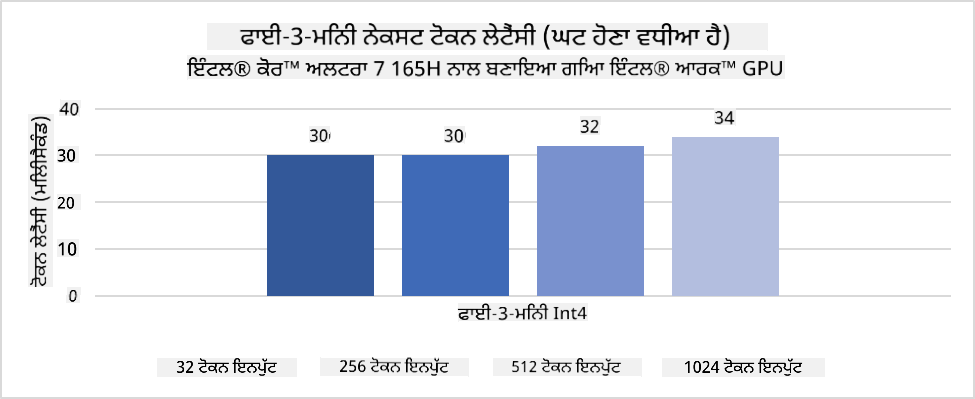
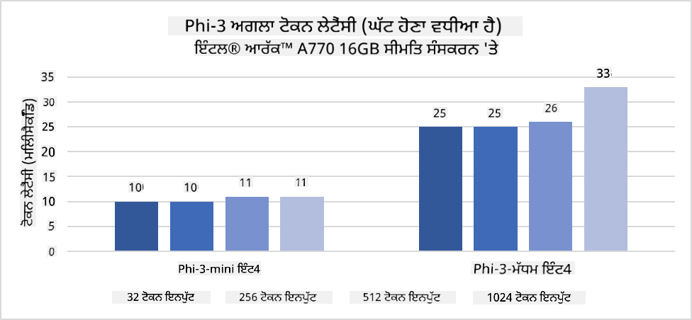
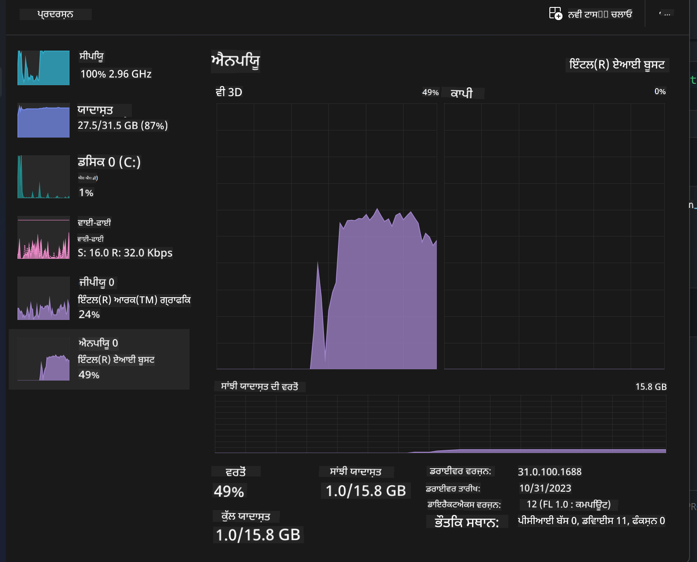
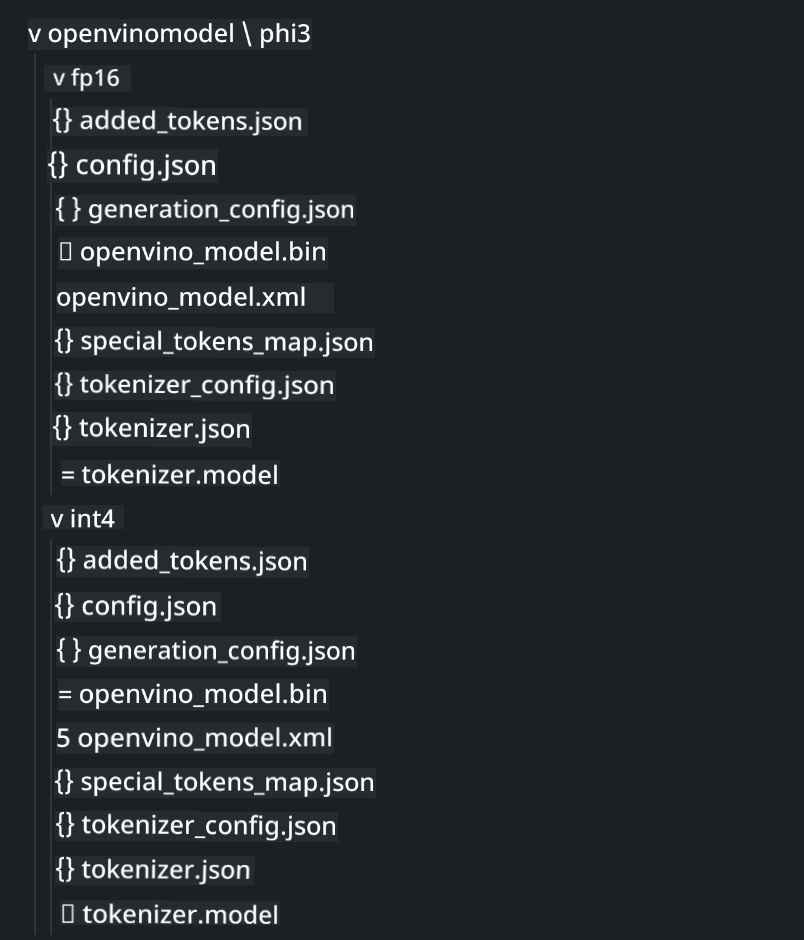
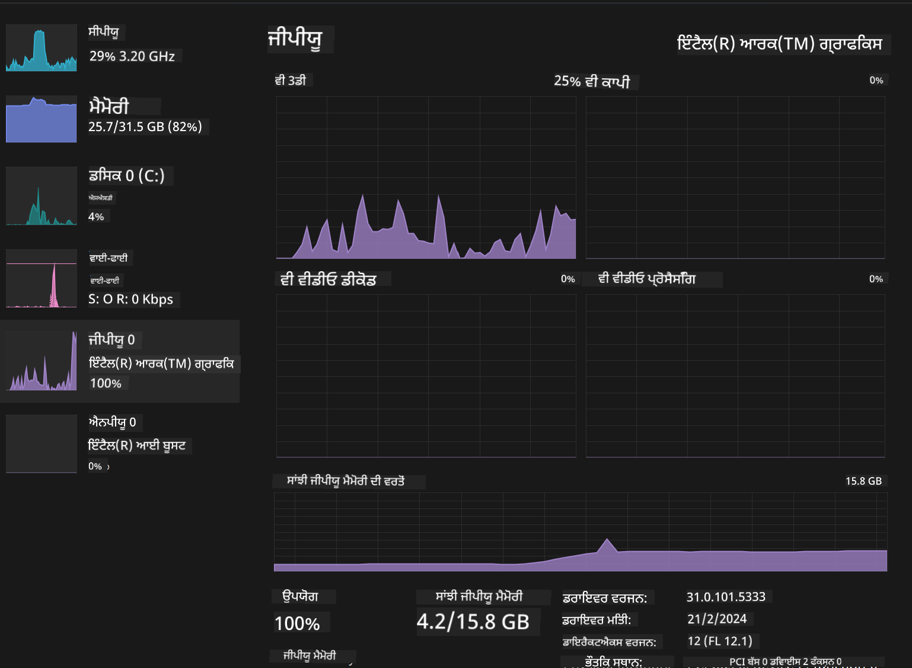

<!--
CO_OP_TRANSLATOR_METADATA:
{
  "original_hash": "e08ce816e23ad813244a09ca34ebb8ac",
  "translation_date": "2025-05-09T10:10:08+00:00",
  "source_file": "md/01.Introduction/03/AIPC_Inference.md",
  "language_code": "pa"
}
-->
# **AI PC ਵਿੱਚ Phi-3 ਦੀ ਅਨੁਮਾਨ ਲਗਾਉਣਾ**

ਜਨਰੇਟਿਵ AI ਦੇ ਵਿਕਾਸ ਅਤੇ edge ਡਿਵਾਈਸ ਹਾਰਡਵੇਅਰ ਸਮਰੱਥਾ ਵਿੱਚ ਸੁਧਾਰ ਨਾਲ, ਵੱਧ ਤੋਂ ਵੱਧ ਜਨਰੇਟਿਵ AI ਮਾਡਲ ਹੁਣ ਯੂਜ਼ਰਾਂ ਦੇ Bring Your Own Device (BYOD) ਡਿਵਾਈਸਾਂ ਵਿੱਚ ਸ਼ਾਮਲ ਕੀਤੇ ਜਾ ਸਕਦੇ ਹਨ। AI PC ਇਨ੍ਹਾਂ ਮਾਡਲਾਂ ਵਿੱਚੋਂ ਇੱਕ ਹਨ। 2024 ਤੋਂ ਸ਼ੁਰੂ ਹੋ ਕੇ, Intel, AMD ਅਤੇ Qualcomm ਨੇ PC ਨਿਰਮਾਤਾਵਾਂ ਨਾਲ ਮਿਲ ਕੇ AI PC ਲਾਂਚ ਕੀਤੇ ਹਨ ਜੋ ਹਾਰਡਵੇਅਰ ਸੋਧਾਂ ਰਾਹੀਂ ਲੋਕਲ ਜਨਰੇਟਿਵ AI ਮਾਡਲਾਂ ਨੂੰ ਤਿਆਰ ਕਰਨ ਵਿੱਚ ਸਹਾਇਤਾ ਕਰਦੇ ਹਨ। ਇਸ ਚਰਚਾ ਵਿੱਚ, ਅਸੀਂ Intel AI PC ਤੇ Phi-3 ਨੂੰ ਕਿਵੇਂ ਡਿਪਲੋਇ ਕਰਨਾ ਹੈ, ਇਸ ਤੇ ਧਿਆਨ ਦੇਵਾਂਗੇ।

### NPU ਕੀ ਹੈ

NPU (Neural Processing Unit) ਇੱਕ ਸਮਰਪਿਤ ਪ੍ਰੋਸੈਸਰ ਜਾਂ ਵੱਡੇ SoC ਵਿੱਚ ਪ੍ਰੋਸੈਸਿੰਗ ਯੂਨਿਟ ਹੁੰਦਾ ਹੈ ਜੋ ਖਾਸ ਤੌਰ 'ਤੇ ਨਿਊਰਲ ਨੈੱਟਵਰਕ ਓਪਰੇਸ਼ਨਾਂ ਅਤੇ AI ਕੰਮਾਂ ਨੂੰ ਤੇਜ਼ ਕਰਨ ਲਈ ਬਣਾਇਆ ਗਿਆ ਹੈ। ਆਮ CPU ਅਤੇ GPU ਤੋਂ ਵੱਖ, NPUs ਡੇਟਾ-ਚਲਿਤ ਪੈਰਾਲਲ ਕੰਪਿਊਟਿੰਗ ਲਈ ਢਾਲਿਆ ਹੁੰਦੇ ਹਨ, ਜਿਸ ਨਾਲ ਇਹ ਵੀਡੀਓ, ਚਿੱਤਰ ਅਤੇ ਨਿਊਰਲ ਨੈੱਟਵਰਕ ਲਈ ਡੇਟਾ ਪ੍ਰੋਸੈਸਿੰਗ ਵਿੱਚ ਬਹੁਤ ਪ੍ਰਭਾਵਸ਼ਾਲੀ ਹੁੰਦੇ ਹਨ। ਇਹ ਖਾਸ ਕਰਕੇ AI-ਸਬੰਧੀ ਕੰਮਾਂ ਜਿਵੇਂ ਕਿ ਬੋਲਚਾਲ ਦੀ ਪਛਾਣ, ਵੀਡੀਓ ਕਾਲਾਂ ਵਿੱਚ ਬੈਕਗ੍ਰਾਊਂਡ ਧੁੰਦਲਾ ਕਰਨਾ, ਅਤੇ ਚਿੱਤਰ ਜਾਂ ਵੀਡੀਓ ਸੰਪਾਦਨ ਜਿਵੇਂ ਵਸਤੂ ਪਛਾਣ ਵਿੱਚ ਮਹਿਰ ਹਨ।

## NPU ਅਤੇ GPU ਦਾ ਤੁਲਨਾਤਮਕ ਵਿਸ਼ਲੇਸ਼ਣ

ਜਦਕਿ ਬਹੁਤ ਸਾਰੇ AI ਅਤੇ ਮਸ਼ੀਨ ਲਰਨਿੰਗ ਕੰਮ GPU 'ਤੇ ਚੱਲਦੇ ਹਨ, GPU ਅਤੇ NPU ਵਿੱਚ ਅਹਿਮ ਫਰਕ ਹੈ।  
GPU ਪੈਰਾਲਲ ਕੰਪਿਊਟਿੰਗ ਲਈ ਮਸ਼ਹੂਰ ਹਨ, ਪਰ ਸਾਰੇ GPU ਗ੍ਰਾਫਿਕਸ ਤੋਂ ਇਲਾਵਾ ਕੰਮਾਂ ਵਿੱਚ ਇੱਕੋ ਜਿਹੇ ਪ੍ਰਭਾਵਸ਼ਾਲੀ ਨਹੀਂ ਹੁੰਦੇ। ਦੂਜੇ ਪਾਸੇ, NPU ਖਾਸ ਤੌਰ 'ਤੇ ਨਿਊਰਲ ਨੈੱਟਵਰਕ ਦੇ ਜਟਿਲ ਗਣਨਾਵਾਂ ਲਈ ਬਣਾਏ ਗਏ ਹਨ, ਜੋ AI ਕੰਮਾਂ ਲਈ ਬਹੁਤ ਪ੍ਰਭਾਵਸ਼ਾਲੀ ਹਨ।  

ਸੰਖੇਪ ਵਿੱਚ, NPU ਗਣਿਤ ਦੇ ਮਾਹਿਰ ਹਨ ਜੋ AI ਗਣਨਾਵਾਂ ਨੂੰ ਤੇਜ਼ ਕਰਦੇ ਹਨ ਅਤੇ AI PC ਦੇ ਉਭਰਦੇ ਦੌਰ ਵਿੱਚ ਮੁੱਖ ਭੂਮਿਕਾ ਨਿਭਾਉਂਦੇ ਹਨ!

***ਇਹ ਉਦਾਹਰਣ Intel ਦੇ ਤਾਜ਼ਾ Intel Core Ultra Processor ਤੇ ਆਧਾਰਿਤ ਹੈ***

## **1. Phi-3 ਮਾਡਲ ਚਲਾਉਣ ਲਈ NPU ਦੀ ਵਰਤੋਂ**

Intel® NPU ਡਿਵਾਈਸ ਇੱਕ AI ਇਨਫਰੈਂਸ ਐਕਸੇਲੇਰੇਟਰ ਹੈ ਜੋ Intel ਕਲਾਇੰਟ CPU ਨਾਲ ਇੱਕੀਕ੍ਰਿਤ ਹੁੰਦਾ ਹੈ, ਜੋ Intel® Core™ Ultra ਜਨਰੇਸ਼ਨ ਦੇ CPU (ਜਿਸਨੂੰ ਪਹਿਲਾਂ Meteor Lake ਕਿਹਾ ਜਾਂਦਾ ਸੀ) ਤੋਂ ਸ਼ੁਰੂ ਹੁੰਦਾ ਹੈ। ਇਹ ਕ੍ਰਿਤ੍ਰਿਮ ਨਿਊਰਲ ਨੈੱਟਵਰਕ ਕਾਰਜਾਂ ਨੂੰ ਊਰਜਾ-ਦક્ષਤਾ ਨਾਲ ਚਲਾਉਣ ਯੋਗ ਬਣਾਉਂਦਾ ਹੈ।





**Intel NPU ਤੇਜ਼ੀ ਲਾਇਬ੍ਰੇਰੀ**

Intel NPU Acceleration Library [https://github.com/intel/intel-npu-acceleration-library](https://github.com/intel/intel-npu-acceleration-library) ਇੱਕ Python ਲਾਇਬ੍ਰੇਰੀ ਹੈ ਜੋ ਤੁਹਾਡੇ ਐਪਲੀਕੇਸ਼ਨਾਂ ਦੀ ਪ੍ਰਭਾਵਸ਼ੀਲਤਾ ਨੂੰ ਵਧਾਉਂਦੀ ਹੈ, Intel Neural Processing Unit (NPU) ਦੀ ਤਾਕਤ ਦੀ ਵਰਤੋਂ ਕਰਕੇ ਤੇਜ਼ ਗਣਨਾਵਾਂ ਕਰਨ ਲਈ।

Intel® Core™ Ultra ਪ੍ਰੋਸੈਸਰਾਂ ਨਾਲ ਚੱਲ ਰਹੇ AI PC ਤੇ Phi-3-mini ਦਾ ਉਦਾਹਰਣ।


Python ਲਾਇਬ੍ਰੇਰੀ ਨੂੰ pip ਨਾਲ ਇੰਸਟਾਲ ਕਰੋ

```bash

   pip install intel-npu-acceleration-library

```

***ਨੋਟ*** ਪ੍ਰੋਜੈਕਟ ਹਾਲੇ ਵਿਕਾਸ ਅਧੀਨ ਹੈ, ਪਰ ਰੈਫਰੈਂਸ ਮਾਡਲ ਕਾਫੀ ਪੂਰਾ ਹੈ।

### **Intel NPU Acceleration Library ਨਾਲ Phi-3 ਚਲਾਉਣਾ**

Intel NPU ਤੇਜ਼ੀ ਦੀ ਵਰਤੋਂ ਕਰਦੇ ਹੋਏ, ਇਹ ਲਾਇਬ੍ਰੇਰੀ ਰਵਾਇਤੀ ਐਨਕੋਡਿੰਗ ਪ੍ਰਕਿਰਿਆ ਨੂੰ ਪ੍ਰਭਾਵਿਤ ਨਹੀਂ ਕਰਦੀ। ਤੁਹਾਨੂੰ ਸਿਰਫ ਇਸ ਲਾਇਬ੍ਰੇਰੀ ਦੀ ਵਰਤੋਂ ਕਰਕੇ ਅਸਲ Phi-3 ਮਾਡਲ ਨੂੰ ਕੁਆਂਟਾਈਜ਼ ਕਰਨਾ ਹੈ, ਜਿਵੇਂ FP16, INT8, INT4, ਆਦਿ

```python
from transformers import AutoTokenizer, pipeline,TextStreamer
from intel_npu_acceleration_library import NPUModelForCausalLM, int4
from intel_npu_acceleration_library.compiler import CompilerConfig
import warnings

model_id = "microsoft/Phi-3-mini-4k-instruct"

compiler_conf = CompilerConfig(dtype=int4)
model = NPUModelForCausalLM.from_pretrained(
    model_id, use_cache=True, config=compiler_conf, attn_implementation="sdpa"
).eval()

tokenizer = AutoTokenizer.from_pretrained(model_id)

text_streamer = TextStreamer(tokenizer, skip_prompt=True)
```

ਕੁਆਂਟਾਈਜ਼ੇਸ਼ਨ ਸਫਲ ਹੋਣ ਤੋਂ ਬਾਅਦ, NPU ਨੂੰ ਕਾਲ ਕਰਨ ਲਈ ਅਗਲੇ ਕਮਾਂਡ ਚਲਾਓ ਜੋ Phi-3 ਮਾਡਲ ਨੂੰ ਚਲਾਏਗਾ।

```python
generation_args = {
   "max_new_tokens": 1024,
   "return_full_text": False,
   "temperature": 0.3,
   "do_sample": False,
   "streamer": text_streamer,
}

pipe = pipeline(
   "text-generation",
   model=model,
   tokenizer=tokenizer,
)

query = "<|system|>You are a helpful AI assistant.<|end|><|user|>Can you introduce yourself?<|end|><|assistant|>"

with warnings.catch_warnings():
    warnings.simplefilter("ignore")
    pipe(query, **generation_args)
```

ਕੋਡ ਚਲਾਉਂਦੇ ਸਮੇਂ, ਅਸੀਂ Task Manager ਰਾਹੀਂ NPU ਦੀ ਚਾਲੂ ਸਥਿਤੀ ਵੇਖ ਸਕਦੇ ਹਾਂ



***ਨਮੂਨੇ*** : [AIPC_NPU_DEMO.ipynb](../../../../../code/03.Inference/AIPC/AIPC_NPU_DEMO.ipynb)

## **2. Phi-3 ਮਾਡਲ ਚਲਾਉਣ ਲਈ DirectML + ONNX Runtime ਦੀ ਵਰਤੋਂ**

### **DirectML ਕੀ ਹੈ**

[DirectML](https://github.com/microsoft/DirectML) ਇੱਕ ਹਾਈ-ਪਰਫਾਰਮੈਂਸ, ਹਾਰਡਵੇਅਰ-ਐਕਸੇਲੇਰੇਟਡ DirectX 12 ਲਾਇਬ੍ਰੇਰੀ ਹੈ ਜੋ ਮਸ਼ੀਨ ਲਰਨਿੰਗ ਲਈ ਬਣਾਈ ਗਈ ਹੈ। DirectML ਵੱਖ-ਵੱਖ ਸਮਰਥਿਤ ਹਾਰਡਵੇਅਰ ਅਤੇ ਡਰਾਈਵਰਾਂ ਉੱਤੇ ਆਮ ਮਸ਼ੀਨ ਲਰਨਿੰਗ ਕੰਮਾਂ ਲਈ GPU ਐਕਸੇਲੇਰੇਸ਼ਨ ਮੁਹੱਈਆ ਕਰਦਾ ਹੈ, ਜਿਸ ਵਿੱਚ AMD, Intel, NVIDIA ਅਤੇ Qualcomm ਦੇ ਸਾਰੇ DirectX 12-ਸਮਰਥਿਤ GPU ਸ਼ਾਮਲ ਹਨ।

ਜਦੋਂ DirectML ਨੂੰ ਅਕੇਲਾ ਵਰਤਿਆ ਜਾਂਦਾ ਹੈ, ਤਾਂ ਇਹ ਇੱਕ ਲੋਅ-ਲੇਵਲ DirectX 12 ਲਾਇਬ੍ਰੇਰੀ ਹੈ ਜੋ ਫਰੇਮਵਰਕ, ਖੇਡਾਂ ਅਤੇ ਹੋਰ ਰੀਅਲ-ਟਾਈਮ ਐਪਲੀਕੇਸ਼ਨਾਂ ਵਰਗੀਆਂ ਹਾਈ-ਪਰਫਾਰਮੈਂਸ, ਲੋਅ-ਲੇਟੈਂਸੀ ਐਪਲੀਕੇਸ਼ਨਾਂ ਲਈ ਉਚਿਤ ਹੈ। DirectML ਦੀ Direct3D 12 ਨਾਲ ਸਹਿਜ ਇੰਟਰਓਪਰੇਬਿਲਿਟੀ, ਘੱਟ ਓਵਰਹੈੱਡ ਅਤੇ ਹਾਰਡਵੇਅਰ ਵਿੱਚ ਸੰਗਤਤਾ ਇਸਨੂੰ ਮਸ਼ੀਨ ਲਰਨਿੰਗ ਨੂੰ ਤੇਜ਼ ਕਰਨ ਲਈ ਬਿਹਤਰ ਬਣਾਉਂਦੇ ਹਨ ਜਦੋਂ ਕਿ ਉੱਚ ਪ੍ਰਦਰਸ਼ਨ ਅਤੇ ਨਤੀਜਿਆਂ ਦੀ ਭਰੋਸੇਯੋਗਤਾ ਜ਼ਰੂਰੀ ਹੋਵੇ।

***ਨੋਟ*** : ਤਾਜ਼ਾ DirectML ਵਿੱਚ NPU ਦਾ ਸਮਰਥਨ ਸ਼ਾਮਲ ਹੈ (https://devblogs.microsoft.com/directx/introducing-neural-processor-unit-npu-support-in-directml-developer-preview/)

### DirectML ਅਤੇ CUDA ਦੀ ਸਮਰੱਥਾ ਅਤੇ ਪ੍ਰਦਰਸ਼ਨ ਦੇ ਮੁਕਾਬਲੇ:

**DirectML** ਮਾਇਕਰੋਸਾਫਟ ਦੁਆਰਾ ਵਿਕਸਿਤ ਮਸ਼ੀਨ ਲਰਨਿੰਗ ਲਾਇਬ੍ਰੇਰੀ ਹੈ। ਇਹ Windows ਡਿਵਾਈਸਾਂ ਉੱਤੇ ਮਸ਼ੀਨ ਲਰਨਿੰਗ ਕੰਮਾਂ ਨੂੰ ਤੇਜ਼ ਕਰਨ ਲਈ ਬਣਾਈ ਗਈ ਹੈ, ਜਿਸ ਵਿੱਚ ਡੈਸਕਟਾਪ, ਲੈਪਟਾਪ ਅਤੇ edge ਡਿਵਾਈਸ ਸ਼ਾਮਲ ਹਨ।  
- DX12 ਅਧਾਰਿਤ: DirectML DirectX 12 (DX12) ਉੱਤੇ ਬਣੀ ਹੈ, ਜੋ NVIDIA ਅਤੇ AMD ਸਮੇਤ ਵੱਖ-ਵੱਖ GPU ਨੂੰ ਸਮਰਥਨ ਦਿੰਦੀ ਹੈ।  
- ਵਿਆਪਕ ਸਮਰਥਨ: DX12 ਦੀ ਵਰਤੋਂ ਕਰਕੇ, DirectML ਕਿਸੇ ਵੀ DX12 ਸਮਰਥਿਤ GPU ਨਾਲ ਕੰਮ ਕਰ ਸਕਦੀ ਹੈ, ਇੰਟਿਗ੍ਰੇਟਡ GPU ਸਮੇਤ।  
- ਚਿੱਤਰ ਪ੍ਰੋਸੈਸਿੰਗ: DirectML ਨਿਊਰਲ ਨੈੱਟਵਰਕ ਦੀ ਵਰਤੋਂ ਕਰਕੇ ਚਿੱਤਰ ਅਤੇ ਹੋਰ ਡੇਟਾ ਪ੍ਰੋਸੈਸ ਕਰਦਾ ਹੈ, ਜੋ ਚਿੱਤਰ ਪਛਾਣ, ਵਸਤੂ ਪਛਾਣ ਆਦਿ ਲਈ ਉਚਿਤ ਹੈ।  
- ਸਥਾਪਨਾ ਵਿੱਚ ਆਸਾਨੀ: DirectML ਨੂੰ ਸੈੱਟਅੱਪ ਕਰਨਾ ਸਧਾਰਣ ਹੈ ਅਤੇ ਇਸ ਲਈ GPU ਨਿਰਮਾਤਾ ਦੀਆਂ ਖਾਸ SDK ਜਾਂ ਲਾਇਬ੍ਰੇਰੀਆਂ ਦੀ ਲੋੜ ਨਹੀਂ।  
- ਪ੍ਰਦਰਸ਼ਨ: ਕੁਝ ਮਾਮਲਿਆਂ ਵਿੱਚ, DirectML CUDA ਨਾਲੋਂ ਤੇਜ਼ ਹੋ ਸਕਦਾ ਹੈ, ਖਾਸ ਕਰਕੇ ਕੁਝ ਕੰਮਾਂ ਲਈ।  
- ਸੀਮਾਵਾਂ: ਪਰ, ਕੁਝ ਹਾਲਾਤਾਂ ਵਿੱਚ, ਖਾਸ ਕਰਕੇ float16 ਵੱਡੇ ਬੈਚ ਸਾਈਜ਼ ਲਈ DirectML ਥੋੜ੍ਹਾ ਹੌਲੀ ਹੋ ਸਕਦਾ ਹੈ।  

**CUDA** NVIDIA ਦਾ ਪੈਰਾਲਲ ਕੰਪਿਊਟਿੰਗ ਪਲੇਟਫਾਰਮ ਅਤੇ ਪ੍ਰੋਗ੍ਰਾਮਿੰਗ ਮਾਡਲ ਹੈ। ਇਹ ਵਿਕਾਸਕਾਰਾਂ ਨੂੰ NVIDIA GPU ਦੀ ਤਾਕਤ ਨੂੰ ਆਮ ਮਕਸਦ ਵਾਲੇ ਕੰਪਿਊਟਿੰਗ ਲਈ ਵਰਤਣ ਦੀ ਆਗਿਆ ਦਿੰਦਾ ਹੈ, ਜਿਸ ਵਿੱਚ ਮਸ਼ੀਨ ਲਰਨਿੰਗ ਅਤੇ ਵਿਗਿਆਨਕ ਸਿਮੂਲੇਸ਼ਨ ਸ਼ਾਮਲ ਹਨ।  
- NVIDIA-ਖਾਸ: CUDA NVIDIA GPU ਨਾਲ ਗਹਿਰਾਈ ਨਾਲ ਜੁੜਿਆ ਹੋਇਆ ਹੈ ਅਤੇ ਖਾਸ ਤੌਰ 'ਤੇ ਇਹਨਾਂ ਲਈ ਬਣਾਇਆ ਗਿਆ ਹੈ।  
- ਬਹੁਤ ਜ਼ਿਆਦਾ ਅਨੁਕੂਲਿਤ: ਇਹ GPU-ਐਕਸੇਲੇਰੇਟਡ ਕੰਮਾਂ ਲਈ ਬੇਹਤਰੀਨ ਪ੍ਰਦਰਸ਼ਨ ਦਿੰਦਾ ਹੈ, ਖਾਸ ਕਰਕੇ NVIDIA GPU ਉੱਤੇ।  
- ਵਿਆਪਕ ਵਰਤੋਂ: ਕਈ ਮਸ਼ੀਨ ਲਰਨਿੰਗ ਫਰੇਮਵਰਕ ਅਤੇ ਲਾਇਬ੍ਰੇਰੀਆਂ (ਜਿਵੇਂ TensorFlow ਅਤੇ PyTorch) CUDA ਸਮਰਥਨ ਰੱਖਦੀਆਂ ਹਨ।  
- ਕਸਟਮਾਈਜ਼ੇਸ਼ਨ: ਵਿਕਾਸਕਾਰ CUDA ਸੈਟਿੰਗਾਂ ਨੂੰ ਖਾਸ ਕੰਮਾਂ ਲਈ ਬਿਹਤਰ ਬਣਾਉਣ ਲਈ ਅਨੁਕੂਲਿਤ ਕਰ ਸਕਦੇ ਹਨ।  
- ਸੀਮਾਵਾਂ: ਪਰ, CUDA ਦੀ NVIDIA ਹਾਰਡਵੇਅਰ 'ਤੇ ਨਿਰਭਰਤਾ ਵੱਖ-ਵੱਖ GPU ਸਮਰਥਨ ਵਿੱਚ ਰੁਕਾਵਟ ਪੈਦਾ ਕਰ ਸਕਦੀ ਹੈ।  

### DirectML ਅਤੇ CUDA ਵਿਚੋਂ ਚੋਣ

DirectML ਅਤੇ CUDA ਵਿਚੋਂ ਚੋਣ ਤੁਹਾਡੇ ਖਾਸ ਵਰਤੋਂ ਦੇ ਕੇਸ, ਹਾਰਡਵੇਅਰ ਉਪਲਬਧਤਾ ਅਤੇ ਪਸੰਦਾਂ 'ਤੇ ਨਿਰਭਰ ਕਰਦੀ ਹੈ।  
ਜੇ ਤੁਸੀਂ ਵਿਆਪਕ ਸਮਰਥਨ ਅਤੇ ਸੌਖੀ ਸੈੱਟਅੱਪ ਚਾਹੁੰਦੇ ਹੋ, ਤਾਂ DirectML ਚੰਗਾ ਵਿਕਲਪ ਹੋ ਸਕਦਾ ਹੈ। ਪਰ ਜੇ ਤੁਹਾਡੇ ਕੋਲ NVIDIA GPU ਹਨ ਅਤੇ ਬਹੁਤ ਅਨੁਕੂਲਿਤ ਪ੍ਰਦਰਸ਼ਨ ਦੀ ਲੋੜ ਹੈ, ਤਾਂ CUDA ਮਜ਼ਬੂਤ ਚੋਣ ਹੈ। ਦੋਹਾਂ ਦੀਆਂ ਆਪਣੀਆਂ ਖੂਬੀਆਂ ਅਤੇ ਕਮਜ਼ੋਰੀਆਂ ਹਨ, ਇਸ ਲਈ ਆਪਣੇ ਜਰੂਰਤਾਂ ਅਤੇ ਹਾਰਡਵੇਅਰ ਦੇ ਅਧਾਰ 'ਤੇ ਫੈਸਲਾ ਕਰੋ।  

### **ONNX Runtime ਨਾਲ ਜਨਰੇਟਿਵ AI**

AI ਦੇ ਯੁੱਗ ਵਿੱਚ, AI ਮਾਡਲਾਂ ਦੀ ਪੋਰਟੇਬਿਲਟੀ ਬਹੁਤ ਜਰੂਰੀ ਹੈ। ONNX Runtime ਸਿਖਲਾਈ ਹੋਏ ਮਾਡਲਾਂ ਨੂੰ ਵੱਖ-ਵੱਖ ਡਿਵਾਈਸਾਂ 'ਤੇ ਆਸਾਨੀ ਨਾਲ ਡਿਪਲੋਇ ਕਰ ਸਕਦਾ ਹੈ। ਵਿਕਾਸਕਾਰਾਂ ਨੂੰ ਇਨਫਰੈਂਸ ਫਰੇਮਵਰਕ ਦੀ ਚਿੰਤਾ ਕਰਨ ਦੀ ਲੋੜ ਨਹੀਂ ਅਤੇ ਇੱਕ ਸਾਂਝਾ API ਵਰਤ ਕੇ ਮਾਡਲ ਇਨਫਰੈਂਸ ਪੂਰਾ ਕਰ ਸਕਦੇ ਹਨ। ਜਨਰੇਟਿਵ AI ਦੇ ਯੁੱਗ ਵਿੱਚ, ONNX Runtime ਕੋਡ ਅਨੁਕੂਲਨ ਵੀ ਕਰਦਾ ਹੈ (https://onnxruntime.ai/docs/genai/). ਇਸ ਅਨੁਕੂਲਿਤ ONNX Runtime ਰਾਹੀਂ, ਕੁਆਂਟਾਈਜ਼ਡ ਜਨਰੇਟਿਵ AI ਮਾਡਲ ਵੱਖ-ਵੱਖ ਟਰਮੀਨਲਾਂ 'ਤੇ ਇਨਫਰ ਕੀਤੇ ਜਾ ਸਕਦੇ ਹਨ। ONNX Runtime ਨਾਲ ਜਨਰੇਟਿਵ AI ਵਿੱਚ, ਤੁਸੀਂ Python, C#, C / C++ ਰਾਹੀਂ AI ਮਾਡਲ ਇਨਫਰੈਂਸ ਕਰ ਸਕਦੇ ਹੋ। ਜ਼ਰੂਰਤ ਪੈਂਦੀ ਹੈ ਤਾਂ iPhone 'ਤੇ C++ ਦੀ ਵਰਤੋਂ ਕਰਕੇ ONNX Runtime API ਨਾਲ ਡਿਪਲੋਇ ਕਰਨਾ ਵੀ ਸੰਭਵ ਹੈ।

[Sample Code](https://github.com/Azure-Samples/Phi-3MiniSamples/tree/main/onnx)

***ONNX Runtime ਲਾਇਬ੍ਰੇਰੀ ਨੂੰ ਕੰਪਾਇਲ ਕਰੋ***

```bash

winget install --id=Kitware.CMake  -e

git clone https://github.com/microsoft/onnxruntime.git

cd .\onnxruntime\

./build.bat --build_shared_lib --skip_tests --parallel --use_dml --config Release

cd ../

git clone https://github.com/microsoft/onnxruntime-genai.git

cd .\onnxruntime-genai\

mkdir ort

cd ort

mkdir include

mkdir lib

copy ..\onnxruntime\include\onnxruntime\core\providers\dml\dml_provider_factory.h ort\include

copy ..\onnxruntime\include\onnxruntime\core\session\onnxruntime_c_api.h ort\include

copy ..\onnxruntime\build\Windows\Release\Release\*.dll ort\lib

copy ..\onnxruntime\build\Windows\Release\Release\onnxruntime.lib ort\lib

python build.py --use_dml


```

**ਲਾਇਬ੍ਰੇਰੀ ਇੰਸਟਾਲ ਕਰੋ**

```bash

pip install .\onnxruntime_genai_directml-0.3.0.dev0-cp310-cp310-win_amd64.whl

```

ਇਹ ਚਲਾਉਣ ਦਾ ਨਤੀਜਾ ਹੈ


***ਨਮੂਨੇ*** : [AIPC_DirectML_DEMO.ipynb](../../../../../code/03.Inference/AIPC/AIPC_DirectML_DEMO.ipynb)

## **3. Phi-3 ਮਾਡਲ ਚਲਾਉਣ ਲਈ Intel OpenVino ਦੀ ਵਰਤੋਂ**

### **OpenVINO ਕੀ ਹੈ**

[OpenVINO](https://github.com/openvinotoolkit/openvino) ਇੱਕ ਓਪਨ-ਸੋਰਸ ਟੂਲਕਿਟ ਹੈ ਜੋ ਡੀਪ ਲਰਨਿੰਗ ਮਾਡਲਾਂ ਨੂੰ ਅਨੁਕੂਲਿਤ ਕਰਨ ਅਤੇ ਡਿਪਲੋਇ ਕਰਨ ਲਈ ਬਣਾਇਆ ਗਿਆ ਹੈ। ਇਹ TensorFlow, PyTorch ਅਤੇ ਹੋਰ ਪ੍ਰਸਿੱਧ ਫਰੇਮਵਰਕਾਂ ਤੋਂ ਵਿਜ਼ਨ, ਆਡੀਓ ਅਤੇ ਭਾਸ਼ਾ ਮਾਡਲਾਂ ਲਈ ਡੀਪ ਲਰਨਿੰਗ ਪ੍ਰਦਰਸ਼ਨ ਵਿੱਚ ਤੇਜ਼ੀ ਲਿਆਉਂਦਾ ਹੈ। OpenVINO ਨਾਲ ਸ਼ੁਰੂਆਤ ਕਰੋ। OpenVINO ਨੂੰ CPU ਅਤੇ GPU ਦੇ ਨਾਲ ਮਿਲ ਕੇ Phi-3 ਮਾਡਲ ਚਲਾਉਣ ਲਈ ਵੀ ਵਰਤਿਆ ਜਾ ਸਕਦਾ ਹੈ।

***ਨੋਟ***: ਇਸ ਸਮੇਂ OpenVINO NPU ਦਾ ਸਮਰਥਨ ਨਹੀਂ ਕਰਦਾ।

### **OpenVINO ਲਾਇਬ੍ਰੇਰੀ ਇੰਸਟਾਲ ਕਰੋ**

```bash

 pip install git+https://github.com/huggingface/optimum-intel.git

 pip install git+https://github.com/openvinotoolkit/nncf.git

 pip install openvino-nightly

```

### **OpenVINO ਨਾਲ Phi-3 ਚਲਾਉਣਾ**

NPU ਵਾਂਗ, OpenVINO ਵੀ ਕੁਆਂਟਾਈਜ਼ਡ ਮਾਡਲ ਚਲਾ ਕੇ ਜਨਰੇਟਿਵ AI ਮਾਡਲਾਂ ਨੂੰ ਕਾਲ ਕਰਦਾ ਹੈ। ਸਾਨੂੰ ਪਹਿਲਾਂ Phi-3 ਮਾਡਲ ਨੂੰ ਕੁਆਂਟਾਈਜ਼ ਕਰਨਾ ਪੈਂਦਾ ਹੈ ਅਤੇ optimum-cli ਰਾਹੀਂ ਕਮਾਂਡ ਲਾਈਨ ਤੇ ਮਾਡਲ ਕੁਆਂਟਾਈਜ਼ੇਸ਼ਨ ਪੂਰਾ ਕਰਨਾ ਹੁੰਦਾ ਹੈ।

**INT4**

```bash

optimum-cli export openvino --model "microsoft/Phi-3-mini-4k-instruct" --task text-generation-with-past --weight-format int4 --group-size 128 --ratio 0.6  --sym  --trust-remote-code ./openvinomodel/phi3/int4

```

**FP16**

```bash

optimum-cli export openvino --model "microsoft/Phi-3-mini-4k-instruct" --task text-generation-with-past --weight-format fp16 --trust-remote-code ./openvinomodel/phi3/fp16

```

ਬਦਲੇ ਹੋਏ ਫਾਰਮੈਟ ਦਾ ਨਮੂਨਾ, ਇਸ ਤਰ੍ਹਾਂ



ਮਾਡਲ ਪਾਥ (model_dir), ਸੰਬੰਧਿਤ ਸੰਰਚਨਾਵਾਂ (ov_config = {"PERFORMANCE_HINT": "LATENCY", "NUM_STREAMS": "1", "CACHE_DIR": ""}), ਅਤੇ ਹਾਰਡਵੇਅਰ-ਐਕਸੇਲੇਰੇਟਡ ਡਿਵਾਈਸ (GPU.0) ਨੂੰ OVModelForCausalLM ਰਾਹੀਂ ਲੋਡ ਕਰੋ

```python

ov_model = OVModelForCausalLM.from_pretrained(
     model_dir,
     device='GPU.0',
     ov_config=ov_config,
     config=AutoConfig.from_pretrained(model_dir, trust_remote_code=True),
     trust_remote_code=True,
)

```

ਕੋਡ ਚਲਾਉਂਦੇ ਸਮੇਂ, ਅਸੀਂ Task Manager ਰਾਹੀਂ GPU ਦੀ ਚਾਲੂ ਸਥਿਤੀ ਵੇਖ ਸਕਦੇ ਹਾਂ



***ਨਮੂਨੇ*** : [AIPC_OpenVino_Demo.ipynb](../../../../../code/03.Inference/AIPC/AIPC_OpenVino_Demo.ipynb)

### ***ਨੋਟ*** : ਉੱਪਰ ਦਿੱਤੇ ਤਿੰਨ ਤਰੀਕੇ ਆਪਣੀਆਂ ਖੂਬੀਆਂ ਰੱਖਦੇ ਹਨ, ਪਰ AI PC ਇਨਫਰੈਂਸ ਲਈ NPU ਐਕਸੇਲੇਰੇਸ਼ਨ ਦੀ ਵਰਤੋਂ ਕਰਨ ਦੀ ਸਿਫਾਰਿਸ਼ ਕੀਤੀ ਜਾਂਦੀ ਹੈ।

**ਅਸਵੀਕਾਰੋਤਾ**:  
ਇਹ ਦਸਤਾਵੇਜ਼ AI ਅਨੁਵਾਦ ਸੇਵਾ [Co-op Translator](https://github.com/Azure/co-op-translator) ਦੀ ਵਰਤੋਂ ਕਰਕੇ ਅਨੁਵਾਦ ਕੀਤਾ ਗਿਆ ਹੈ। ਜਦੋਂ ਕਿ ਅਸੀਂ ਸਹੀਅਤ ਲਈ ਕੋਸ਼ਿਸ਼ ਕਰਦੇ ਹਾਂ, ਕਿਰਪਾ ਕਰਕੇ ਧਿਆਨ ਰੱਖੋ ਕਿ ਆਟੋਮੈਟਿਕ ਅਨੁਵਾਦਾਂ ਵਿੱਚ ਗਲਤੀਆਂ ਜਾਂ ਅਸਹੀਤੀਆਂ ਹੋ ਸਕਦੀਆਂ ਹਨ। ਮੂਲ ਦਸਤਾਵੇਜ਼ ਆਪਣੇ ਮੂਲ ਭਾਸ਼ਾ ਵਿੱਚ ਹੀ ਪ੍ਰਮਾਣਿਕ ਸਰੋਤ ਮੰਨਿਆ ਜਾਣਾ ਚਾਹੀਦਾ ਹੈ। ਮਹੱਤਵਪੂਰਣ ਜਾਣਕਾਰੀ ਲਈ, ਪ੍ਰੋਫੈਸ਼ਨਲ ਮਨੁੱਖੀ ਅਨੁਵਾਦ ਦੀ ਸਿਫਾਰਿਸ਼ ਕੀਤੀ ਜਾਂਦੀ ਹੈ। ਅਸੀਂ ਇਸ ਅਨੁਵਾਦ ਦੇ ਇਸਤੇਮਾਲ ਤੋਂ ਉੱਪਜਣ ਵਾਲੀਆਂ ਕਿਸੇ ਵੀ ਗਲਤਫਹਮੀਆਂ ਜਾਂ ਗਲਤ ਵਿਆਖਿਆਵਾਂ ਲਈ ਜ਼ਿੰਮੇਵਾਰ ਨਹੀਂ ਹਾਂ।