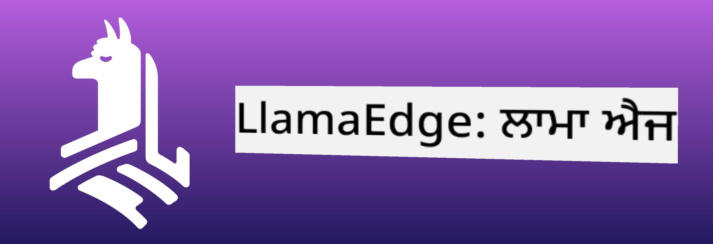
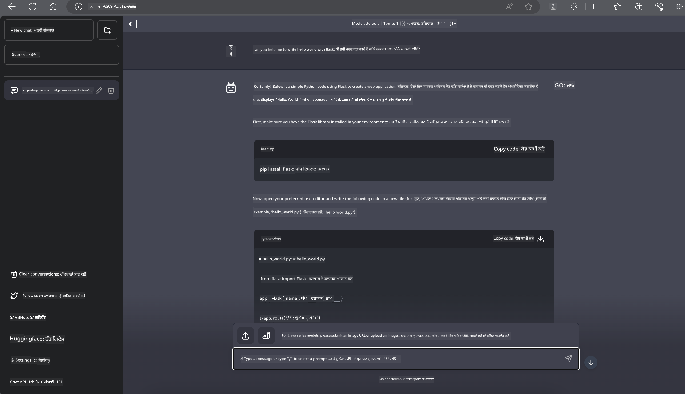

<!--
CO_OP_TRANSLATOR_METADATA:
{
  "original_hash": "be4101a30d98e95a71d42c276e8bcd37",
  "translation_date": "2025-07-16T20:41:29+00:00",
  "source_file": "md/01.Introduction/03/Jetson_Inference.md",
  "language_code": "pa"
}
-->
# **Nvidia Jetson ਵਿੱਚ Inference Phi-3**

Nvidia Jetson Nvidia ਦੀਆਂ ਐਮਬੈਡਿਡ ਕੰਪਿਊਟਿੰਗ ਬੋਰਡਾਂ ਦੀ ਇੱਕ ਸੀਰੀਜ਼ ਹੈ। Jetson TK1, TX1 ਅਤੇ TX2 ਮਾਡਲਾਂ ਵਿੱਚ Nvidia ਦਾ Tegra ਪ੍ਰੋਸੈਸਰ (ਜਾਂ SoC) ਹੁੰਦਾ ਹੈ ਜੋ ARM ਆਰਕੀਟੈਕਚਰ ਵਾਲਾ ਸੈਂਟਰਲ ਪ੍ਰੋਸੈਸਿੰਗ ਯੂਨਿਟ (CPU) ਸ਼ਾਮਲ ਕਰਦਾ ਹੈ। Jetson ਇੱਕ ਘੱਟ-ਪਾਵਰ ਸਿਸਟਮ ਹੈ ਅਤੇ ਮਸ਼ੀਨ ਲਰਨਿੰਗ ਐਪਲੀਕੇਸ਼ਨਾਂ ਨੂੰ ਤੇਜ਼ ਕਰਨ ਲਈ ਡਿਜ਼ਾਈਨ ਕੀਤਾ ਗਿਆ ਹੈ। Nvidia Jetson ਨੂੰ ਪੇਸ਼ੇਵਰ ਡਿਵੈਲਪਰਾਂ ਵੱਲੋਂ ਸਾਰੇ ਉਦਯੋਗਾਂ ਵਿੱਚ ਨਵੀਂ AI ਉਤਪਾਦ ਬਣਾਉਣ ਲਈ ਵਰਤਿਆ ਜਾਂਦਾ ਹੈ, ਅਤੇ ਵਿਦਿਆਰਥੀ ਅਤੇ ਸ਼ੌਕੀਨ ਲੋਕ ਹੱਥੋਂ-ਹੱਥ AI ਸਿੱਖਣ ਅਤੇ ਸ਼ਾਨਦਾਰ ਪ੍ਰੋਜੈਕਟ ਬਣਾਉਣ ਲਈ ਇਸਦਾ ਇਸਤੇਮਾਲ ਕਰਦੇ ਹਨ। SLM ਨੂੰ Jetson ਵਰਗੇ ਐਜ ਡਿਵਾਈਸਾਂ ਵਿੱਚ ਤਾਇਨਾਤ ਕੀਤਾ ਜਾਂਦਾ ਹੈ, ਜੋ ਉਦਯੋਗਿਕ ਜਨਰੇਟਿਵ AI ਐਪਲੀਕੇਸ਼ਨ ਸਥਿਤੀਆਂ ਦੀ ਬਿਹਤਰ ਕਾਰਗੁਜ਼ਾਰੀ ਯਕੀਨੀ ਬਣਾਉਂਦਾ ਹੈ।

## NVIDIA Jetson 'ਤੇ ਤਾਇਨਾਤੀ:
ਆਟੋਨੋਮਸ ਰੋਬੋਟਿਕਸ ਅਤੇ ਐਮਬੈਡਿਡ ਡਿਵਾਈਸਾਂ 'ਤੇ ਕੰਮ ਕਰਨ ਵਾਲੇ ਡਿਵੈਲਪਰ Phi-3 Mini ਦਾ ਲਾਭ ਉਠਾ ਸਕਦੇ ਹਨ। Phi-3 ਦਾ ਛੋਟਾ ਆਕਾਰ ਇਸਨੂੰ ਐਜ ਤਾਇਨਾਤੀ ਲਈ ਬਹੁਤ ਉਚਿਤ ਬਣਾਉਂਦਾ ਹੈ। ਟ੍ਰੇਨਿੰਗ ਦੌਰਾਨ ਪੈਰਾਮੀਟਰਾਂ ਨੂੰ ਬੜੀ ਸਾਵਧਾਨੀ ਨਾਲ ਟਿਊਨ ਕੀਤਾ ਗਿਆ ਹੈ, ਜਿਸ ਨਾਲ ਜਵਾਬਾਂ ਵਿੱਚ ਉੱਚ ਸਹੀਤਾ ਮਿਲਦੀ ਹੈ।

### TensorRT-LLM ਅਪਟੀਮਾਈਜ਼ੇਸ਼ਨ:
NVIDIA ਦੀ [TensorRT-LLM ਲਾਇਬ੍ਰੇਰੀ](https://github.com/NVIDIA/TensorRT-LLM?WT.mc_id=aiml-138114-kinfeylo) ਵੱਡੇ ਭਾਸ਼ਾ ਮਾਡਲ ਦੀ ਇੰਫਰੈਂਸ ਨੂੰ ਅਪਟੀਮਾਈਜ਼ ਕਰਦੀ ਹੈ। ਇਹ Phi-3 Mini ਦੇ ਲੰਮੇ ਸੰਦਰਭ ਵਿੰਡੋ ਨੂੰ ਸਹਾਰਾ ਦਿੰਦੀ ਹੈ, ਜਿਸ ਨਾਲ ਥਰੂਪੁੱਟ ਅਤੇ ਲੇਟੈਂਸੀ ਦੋਹਾਂ ਵਿੱਚ ਸੁਧਾਰ ਹੁੰਦਾ ਹੈ। ਅਪਟੀਮਾਈਜ਼ੇਸ਼ਨਾਂ ਵਿੱਚ LongRoPE, FP8 ਅਤੇ inflight batching ਵਰਗੀਆਂ ਤਕਨੀਕਾਂ ਸ਼ਾਮਲ ਹਨ।

### ਉਪਲਬਧਤਾ ਅਤੇ ਤਾਇਨਾਤੀ:
ਡਿਵੈਲਪਰ Phi-3 Mini ਨੂੰ 128K ਸੰਦਰਭ ਵਿੰਡੋ ਨਾਲ [NVIDIA ਦੇ AI](https://www.nvidia.com/en-us/ai-data-science/generative-ai/) 'ਤੇ ਅਨੁਸੰਧਾਨ ਕਰ ਸਕਦੇ ਹਨ। ਇਹ NVIDIA NIM ਵਜੋਂ ਪੈਕੇਜ ਕੀਤਾ ਗਿਆ ਹੈ, ਜੋ ਇੱਕ ਮਾਈਕ੍ਰੋਸਰਵਿਸ ਹੈ ਜਿਸਦਾ ਇੱਕ ਸਧਾਰਣ API ਹੁੰਦਾ ਹੈ ਅਤੇ ਇਹ ਕਿਤੇ ਵੀ ਤਾਇਨਾਤ ਕੀਤਾ ਜਾ ਸਕਦਾ ਹੈ। ਇਸਦੇ ਨਾਲ-ਨਾਲ, [TensorRT-LLM ਦੇ GitHub 'ਤੇ ਇੰਪਲੀਮੈਂਟੇਸ਼ਨ](https://github.com/NVIDIA/TensorRT-LLM) ਵੀ ਉਪਲਬਧ ਹਨ।

## **1. ਤਿਆਰੀ**

a. Jetson Orin NX / Jetson NX

b. JetPack 5.1.2+

c. Cuda 11.8

d. Python 3.8+

## **2. Jetson ਵਿੱਚ Phi-3 ਚਲਾਉਣਾ**

ਅਸੀਂ [Ollama](https://ollama.com) ਜਾਂ [LlamaEdge](https://llamaedge.com) ਚੁਣ ਸਕਦੇ ਹਾਂ।

ਜੇ ਤੁਸੀਂ ਇੱਕੋ ਸਮੇਂ ਕਲਾਉਡ ਅਤੇ ਐਜ ਡਿਵਾਈਸਾਂ ਵਿੱਚ gguf ਵਰਤਣਾ ਚਾਹੁੰਦੇ ਹੋ, ਤਾਂ LlamaEdge ਨੂੰ WasmEdge ਵਜੋਂ ਸਮਝਿਆ ਜਾ ਸਕਦਾ ਹੈ (WasmEdge ਇੱਕ ਹਲਕਾ, ਉੱਚ-ਕਾਰਗੁਜ਼ਾਰੀ, ਸਕੇਲ ਕਰਨ ਯੋਗ WebAssembly ਰਨਟਾਈਮ ਹੈ ਜੋ ਕਲਾਉਡ ਨੈਟਿਵ, ਐਜ ਅਤੇ ਵਿਖੰਡਿਤ ਐਪਲੀਕੇਸ਼ਨਾਂ ਲਈ ਉਚਿਤ ਹੈ। ਇਹ ਸਰਵਰਲੈੱਸ ਐਪਲੀਕੇਸ਼ਨਾਂ, ਐਮਬੈਡਿਡ ਫੰਕਸ਼ਨਾਂ, ਮਾਈਕ੍ਰੋਸਰਵਿਸਿਜ਼, ਸਮਾਰਟ ਕਾਂਟ੍ਰੈਕਟ ਅਤੇ IoT ਡਿਵਾਈਸਾਂ ਨੂੰ ਸਹਾਰਾ ਦਿੰਦਾ ਹੈ। ਤੁਸੀਂ gguf ਦਾ ਮਾਤਰਾਤਮਕ ਮਾਡਲ LlamaEdge ਰਾਹੀਂ ਐਜ ਡਿਵਾਈਸਾਂ ਅਤੇ ਕਲਾਉਡ 'ਤੇ ਤਾਇਨਾਤ ਕਰ ਸਕਦੇ ਹੋ।



ਇਹ ਰਹੇ ਵਰਤੋਂ ਦੇ ਕਦਮ:

1. ਸੰਬੰਧਿਤ ਲਾਇਬ੍ਰੇਰੀਆਂ ਅਤੇ ਫਾਈਲਾਂ ਇੰਸਟਾਲ ਅਤੇ ਡਾਊਨਲੋਡ ਕਰੋ

```bash

curl -sSf https://raw.githubusercontent.com/WasmEdge/WasmEdge/master/utils/install.sh | bash -s -- --plugin wasi_nn-ggml

curl -LO https://github.com/LlamaEdge/LlamaEdge/releases/latest/download/llama-api-server.wasm

curl -LO https://github.com/LlamaEdge/chatbot-ui/releases/latest/download/chatbot-ui.tar.gz

tar xzf chatbot-ui.tar.gz

```

**Note**: llama-api-server.wasm ਅਤੇ chatbot-ui ਨੂੰ ਇੱਕੋ ਡਾਇਰੈਕਟਰੀ ਵਿੱਚ ਹੋਣਾ ਜਰੂਰੀ ਹੈ

2. ਟਰਮੀਨਲ ਵਿੱਚ ਸਕ੍ਰਿਪਟ ਚਲਾਓ

```bash

wasmedge --dir .:. --nn-preload default:GGML:AUTO:{Your gguf path} llama-api-server.wasm -p phi-3-chat

```

ਇਹ ਰਹੀ ਚਲਾਉਣ ਦੀ ਨਤੀਜਾ



***ਨਮੂਨਾ ਕੋਡ*** [Phi-3 mini WASM ਨੋਟਬੁੱਕ ਨਮੂਨਾ](https://github.com/Azure-Samples/Phi-3MiniSamples/tree/main/wasm)

ਸੰਖੇਪ ਵਿੱਚ, Phi-3 Mini ਭਾਸ਼ਾ ਮਾਡਲਿੰਗ ਵਿੱਚ ਇੱਕ ਵੱਡਾ ਕਦਮ ਹੈ, ਜੋ ਕੁਸ਼ਲਤਾ, ਸੰਦਰਭ ਜਾਗਰੂਕਤਾ ਅਤੇ NVIDIA ਦੀ ਅਪਟੀਮਾਈਜ਼ੇਸ਼ਨ ਸਮਰੱਥਾ ਨੂੰ ਜੋੜਦਾ ਹੈ। ਚਾਹੇ ਤੁਸੀਂ ਰੋਬੋਟ ਬਣਾਉਂਦੇ ਹੋ ਜਾਂ ਐਜ ਐਪਲੀਕੇਸ਼ਨ, Phi-3 Mini ਇੱਕ ਸ਼ਕਤੀਸ਼ਾਲੀ ਸੰਦ ਹੈ ਜਿਸ ਨਾਲ ਜਾਣੂ ਹੋਣਾ ਲਾਜ਼ਮੀ ਹੈ।

**ਅਸਵੀਕਾਰੋਪਣ**:  
ਇਹ ਦਸਤਾਵੇਜ਼ AI ਅਨੁਵਾਦ ਸੇਵਾ [Co-op Translator](https://github.com/Azure/co-op-translator) ਦੀ ਵਰਤੋਂ ਕਰਕੇ ਅਨੁਵਾਦਿਤ ਕੀਤਾ ਗਿਆ ਹੈ। ਜਦੋਂ ਕਿ ਅਸੀਂ ਸਹੀਤਾ ਲਈ ਕੋਸ਼ਿਸ਼ ਕਰਦੇ ਹਾਂ, ਕਿਰਪਾ ਕਰਕੇ ਧਿਆਨ ਰੱਖੋ ਕਿ ਸਵੈਚਾਲਿਤ ਅਨੁਵਾਦਾਂ ਵਿੱਚ ਗਲਤੀਆਂ ਜਾਂ ਅਸਮਰਥਤਾਵਾਂ ਹੋ ਸਕਦੀਆਂ ਹਨ। ਮੂਲ ਦਸਤਾਵੇਜ਼ ਆਪਣੀ ਮੂਲ ਭਾਸ਼ਾ ਵਿੱਚ ਪ੍ਰਮਾਣਿਕ ਸਰੋਤ ਮੰਨਿਆ ਜਾਣਾ ਚਾਹੀਦਾ ਹੈ। ਮਹੱਤਵਪੂਰਨ ਜਾਣਕਾਰੀ ਲਈ, ਪੇਸ਼ੇਵਰ ਮਨੁੱਖੀ ਅਨੁਵਾਦ ਦੀ ਸਿਫਾਰਸ਼ ਕੀਤੀ ਜਾਂਦੀ ਹੈ। ਇਸ ਅਨੁਵਾਦ ਦੀ ਵਰਤੋਂ ਤੋਂ ਉਤਪੰਨ ਕਿਸੇ ਵੀ ਗਲਤਫਹਿਮੀ ਜਾਂ ਗਲਤ ਵਿਆਖਿਆ ਲਈ ਅਸੀਂ ਜ਼ਿੰਮੇਵਾਰ ਨਹੀਂ ਹਾਂ।