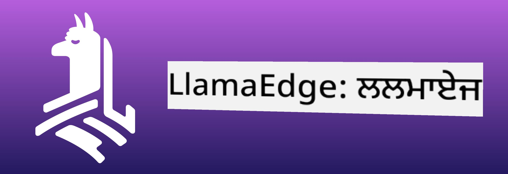
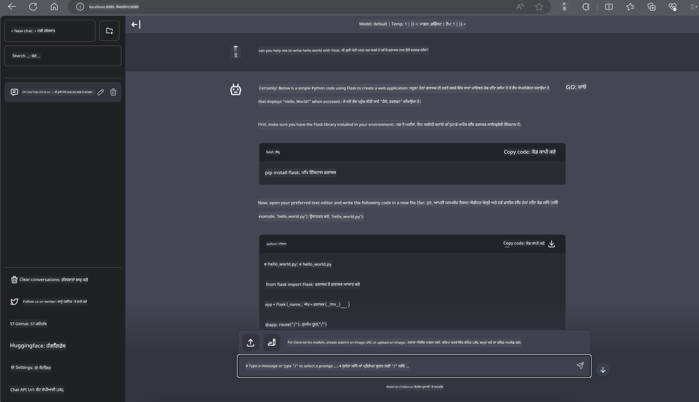

<!--
CO_OP_TRANSLATOR_METADATA:
{
  "original_hash": "be4101a30d98e95a71d42c276e8bcd37",
  "translation_date": "2025-05-09T11:34:19+00:00",
  "source_file": "md/01.Introduction/03/Jetson_Inference.md",
  "language_code": "pa"
}
-->
# **Nvidia Jetson ਵਿੱਚ Inference Phi-3**

Nvidia Jetson Nvidia ਦੀਆਂ embedded computing boards ਦੀ ਇੱਕ ਸੀਰੀਜ਼ ਹੈ। Jetson TK1, TX1 ਅਤੇ TX2 ਮਾਡਲ ਸਭ ਵਿੱਚ Nvidia ਦਾ Tegra processor (ਜਾਂ SoC) ਹੁੰਦਾ ਹੈ ਜੋ ARM architecture ਵਾਲਾ central processing unit (CPU) ਸ਼ਾਮਲ ਕਰਦਾ ਹੈ। Jetson ਇੱਕ low-power ਸਿਸਟਮ ਹੈ ਅਤੇ ਇਹ machine learning ਐਪਲੀਕੇਸ਼ਨਾਂ ਨੂੰ ਤੇਜ਼ ਕਰਨ ਲਈ ਬਣਾਇਆ ਗਿਆ ਹੈ। Nvidia Jetson ਪ੍ਰੋਫੈਸ਼ਨਲ ਡਿਵੈਲਪਰਾਂ ਵੱਲੋਂ ਸਾਰੇ ਉਦਯੋਗਾਂ ਵਿੱਚ ਨਵੀਂ AI ਉਤਪਾਦ ਬਣਾਉਣ ਲਈ ਵਰਤਿਆ ਜਾਂਦਾ ਹੈ, ਅਤੇ ਵਿਦਿਆਰਥੀ ਅਤੇ ਸ਼ੌਕੀਨ ਲੋਕਾਂ ਵੱਲੋਂ practical AI ਸਿੱਖਣ ਅਤੇ ਸ਼ਾਨਦਾਰ ਪ੍ਰੋਜੈਕਟ ਬਣਾਉਣ ਲਈ। SLM edge ਡਿਵਾਈਸਾਂ ਜਿਵੇਂ ਕਿ Jetson ਵਿੱਚ deploy ਕੀਤਾ ਜਾਂਦਾ ਹੈ, ਜੋ ਉਦਯੋਗਿਕ generative AI ਐਪਲੀਕੇਸ਼ਨ ਸੈਨਾਰਿਓਜ਼ ਦੀ ਵਧੀਆ ਅਮਲਦਾਰੀ ਯਕੀਨੀ ਬਣਾਉਂਦਾ ਹੈ।

## NVIDIA Jetson 'ਤੇ Deployment:
ਆਟੋਨੋਮਸ ਰੋਬੋਟਿਕਸ ਅਤੇ embedded ਡਿਵਾਈਸਾਂ 'ਤੇ ਕੰਮ ਕਰਨ ਵਾਲੇ ਡਿਵੈਲਪਰ Phi-3 Mini ਦਾ ਫਾਇਦਾ ਲੈ ਸਕਦੇ ਹਨ। Phi-3 ਦਾ relatively ਛੋਟਾ ਆਕਾਰ ਇਸਨੂੰ edge deployment ਲਈ ਬਹੁਤ ਵਧੀਆ ਬਣਾਉਂਦਾ ਹੈ। Parameters ਨੂੰ training ਦੌਰਾਨ ਬੜੀ ਸੂਚੀਵਧੀ ਨਾਲ ਟਿਊਨ ਕੀਤਾ ਗਿਆ ਹੈ, ਜਿਸ ਨਾਲ responses ਵਿੱਚ ਉੱਚ ਦਰੁਸਤੀ ਆਉਂਦੀ ਹੈ।

### TensorRT-LLM Optimization:
NVIDIA ਦੀ [TensorRT-LLM library](https://github.com/NVIDIA/TensorRT-LLM?WT.mc_id=aiml-138114-kinfeylo) ਵੱਡੇ ਭਾਸ਼ਾ ਮਾਡਲ inference ਨੂੰ optimize ਕਰਦੀ ਹੈ। ਇਹ Phi-3 Mini ਦੇ ਲੰਮੇ context window ਨੂੰ ਸਹਾਰਦਾ ਹੈ, throughput ਅਤੇ latency ਦੋਹਾਂ ਨੂੰ ਸੁਧਾਰਦਾ ਹੈ। Optimizations ਵਿੱਚ LongRoPE, FP8, ਅਤੇ inflight batching ਵਰਗੀਆਂ ਤਕਨੀਕਾਂ ਸ਼ਾਮਲ ਹਨ।

### Availability ਅਤੇ Deployment:
ਡਿਵੈਲਪਰ 128K context window ਵਾਲੇ Phi-3 Mini ਨੂੰ [NVIDIA's AI](https://www.nvidia.com/en-us/ai-data-science/generative-ai/) 'ਤੇ ਖੋਜ ਸਕਦੇ ਹਨ। ਇਹ NVIDIA NIM ਵਜੋਂ ਪੈਕੇਜ ਕੀਤਾ ਗਿਆ ਹੈ, ਜੋ ਇੱਕ ਮਾਈਕਰੋਸਰਵਿਸ ਹੈ ਜਿਸਦਾ standard API ਹੈ ਅਤੇ ਇਹ ਕਿਤੇ ਵੀ deploy ਕੀਤਾ ਜਾ ਸਕਦਾ ਹੈ। ਨਾਲ ਹੀ, [TensorRT-LLM ਦੇ GitHub implementations](https://github.com/NVIDIA/TensorRT-LLM) ਵੀ ਉਪਲਬਧ ਹਨ।

## **1. ਤਿਆਰੀ**

a. Jetson Orin NX / Jetson NX

b. JetPack 5.1.2+

c. Cuda 11.8

d. Python 3.8+

## **2. Jetson ਵਿੱਚ Phi-3 ਚਲਾਉਣਾ**

ਅਸੀਂ [Ollama](https://ollama.com) ਜਾਂ [LlamaEdge](https://llamaedge.com) ਚੁਣ ਸਕਦੇ ਹਾਂ।

ਜੇ ਤੁਸੀਂ ਇੱਕੋ ਸਮੇਂ cloud ਅਤੇ edge ਡਿਵਾਈਸਾਂ ਵਿੱਚ gguf ਵਰਤਣਾ ਚਾਹੁੰਦੇ ਹੋ, ਤਾਂ LlamaEdge ਨੂੰ WasmEdge ਵਜੋਂ ਸਮਝਿਆ ਜਾ ਸਕਦਾ ਹੈ (WasmEdge ਇੱਕ lightweight, high-performance, scalable WebAssembly runtime ਹੈ ਜੋ cloud native, edge ਅਤੇ decentralized ਐਪਲੀਕੇਸ਼ਨਾਂ ਲਈ موزوں ਹੈ। ਇਹ serverless ਐਪਲੀਕੇਸ਼ਨਾਂ, embedded functions, microservices, smart contracts ਅਤੇ IoT ਡਿਵਾਈਸਾਂ ਨੂੰ ਸਹਾਰਦਾ ਹੈ। ਤੁਸੀਂ gguf ਦੇ quantitative ਮਾਡਲ ਨੂੰ LlamaEdge ਰਾਹੀਂ edge ਡਿਵਾਈਸਾਂ ਅਤੇ cloud ਵਿੱਚ deploy ਕਰ ਸਕਦੇ ਹੋ।



ਇਹ ਹਨ ਵਰਤੋਂ ਦੇ ਕਦਮ:

1. ਸੰਬੰਧਤ ਲਾਇਬ੍ਰੇਰੀਆਂ ਅਤੇ ਫਾਇਲਾਂ ਇੰਸਟਾਲ ਅਤੇ ਡਾਊਨਲੋਡ ਕਰੋ

```bash

curl -sSf https://raw.githubusercontent.com/WasmEdge/WasmEdge/master/utils/install.sh | bash -s -- --plugin wasi_nn-ggml

curl -LO https://github.com/LlamaEdge/LlamaEdge/releases/latest/download/llama-api-server.wasm

curl -LO https://github.com/LlamaEdge/chatbot-ui/releases/latest/download/chatbot-ui.tar.gz

tar xzf chatbot-ui.tar.gz

```

**ਨੋਟ**: llama-api-server.wasm ਅਤੇ chatbot-ui ਨੂੰ ਇੱਕੋ ਡਾਇਰੈਕਟਰੀ ਵਿੱਚ ਹੋਣਾ ਚਾਹੀਦਾ ਹੈ

2. ਟਰਮੀਨਲ ਵਿੱਚ ਸਕ੍ਰਿਪਟ ਚਲਾਓ

```bash

wasmedge --dir .:. --nn-preload default:GGML:AUTO:{Your gguf path} llama-api-server.wasm -p phi-3-chat

```

ਇਹ ਹੈ ਚਲਾਉਣ ਦਾ ਨਤੀਜਾ



***ਨਮੂਨਾ ਕੋਡ*** [Phi-3 mini WASM Notebook Sample](https://github.com/Azure-Samples/Phi-3MiniSamples/tree/main/wasm)

ਸੰਖੇਪ ਵਿੱਚ, Phi-3 Mini ਭਾਸ਼ਾ ਮਾਡਲਿੰਗ ਵਿੱਚ ਇੱਕ ਵੱਡਾ ਕਦਮ ਹੈ, ਜੋ ਕੁਸ਼ਲਤਾ, context ਸੂਝਬੂਝ ਅਤੇ NVIDIA ਦੀ optimization ਸਮਰੱਥਾ ਨੂੰ ਮਿਲਾਉਂਦਾ ਹੈ। ਚਾਹੇ ਤੁਸੀਂ ਰੋਬੋਟ ਬਣਾ ਰਹੇ ਹੋ ਜਾਂ edge ਐਪਲੀਕੇਸ਼ਨਾਂ 'ਤੇ ਕੰਮ ਕਰ ਰਹੇ ਹੋ, Phi-3 Mini ਇੱਕ ਸ਼ਕਤੀਸ਼ਾਲੀ ਟੂਲ ਹੈ ਜਿਸਦਾ ਧਿਆਨ ਰੱਖਣਾ ਚਾਹੀਦਾ ਹੈ।

**ਡਿਸਕਲੇਮਰ**:  
ਇਹ ਦਸਤਾਵੇਜ਼ AI ਅਨੁਵਾਦ ਸੇਵਾ [Co-op Translator](https://github.com/Azure/co-op-translator) ਦੀ ਵਰਤੋਂ ਕਰਕੇ ਅਨੁਵਾਦ ਕੀਤਾ ਗਿਆ ਹੈ। ਜਦੋਂ ਕਿ ਅਸੀਂ ਸਹੀਅਤ ਲਈ ਕੋਸ਼ਿਸ਼ ਕਰਦੇ ਹਾਂ, ਕਿਰਪਾ ਕਰਕੇ ਜਾਣੂ ਰਹੋ ਕਿ ਆਟੋਮੇਟਿਕ ਅਨੁਵਾਦਾਂ ਵਿੱਚ ਗਲਤੀਆਂ ਜਾਂ ਅਸਥਿਰਤਾਵਾਂ ਹੋ ਸਕਦੀਆਂ ਹਨ। ਮੂਲ ਦਸਤਾਵੇਜ਼ ਆਪਣੀ ਮੂਲ ਭਾਸ਼ਾ ਵਿੱਚ ਹੀ ਅਧਿਕਾਰਤ ਸਰੋਤ ਮੰਨਿਆ ਜਾਣਾ ਚਾਹੀਦਾ ਹੈ। ਜ਼ਰੂਰੀ ਜਾਣਕਾਰੀ ਲਈ, ਪੇਸ਼ੇਵਰ ਮਨੁੱਖੀ ਅਨੁਵਾਦ ਦੀ ਸਿਫਾਰਸ਼ ਕੀਤੀ ਜਾਂਦੀ ਹੈ। ਅਸੀਂ ਇਸ ਅਨੁਵਾਦ ਦੀ ਵਰਤੋਂ ਨਾਲ ਹੋਣ ਵਾਲੀਆਂ ਕਿਸੇ ਵੀ ਗਲਤਫਹਿਮੀਆਂ ਜਾਂ ਗਲਤ ਵਿਆਖਿਆਵਾਂ ਲਈ ਜ਼ਿੰਮੇਵਾਰ ਨਹੀਂ ਹਾਂ।