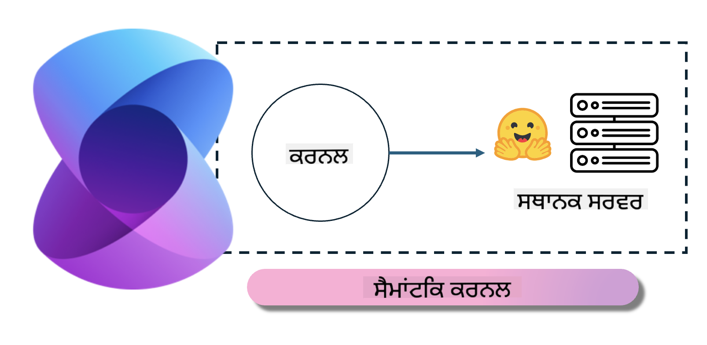

<!--
CO_OP_TRANSLATOR_METADATA:
{
  "original_hash": "bcf5dd7031db0031abdb9dd0c05ba118",
  "translation_date": "2025-05-09T12:02:47+00:00",
  "source_file": "md/01.Introduction/03/Local_Server_Inference.md",
  "language_code": "pa"
}
-->
# **Inference Phi-3 ਨੂੰ ਲੋਕਲ ਸਰਵਰ 'ਤੇ ਚਲਾਉਣਾ**

ਅਸੀਂ Phi-3 ਨੂੰ ਇੱਕ ਲੋਕਲ ਸਰਵਰ 'ਤੇ ਡਿਪਲੋਇ ਕਰ ਸਕਦੇ ਹਾਂ। ਯੂਜ਼ਰ [Ollama](https://ollama.com) ਜਾਂ [LM Studio](https://llamaedge.com) ਦੇ ਹੱਲ ਚੁਣ ਸਕਦੇ ਹਨ, ਜਾਂ ਉਹ ਆਪਣਾ ਕੋਡ ਵੀ ਲਿਖ ਸਕਦੇ ਹਨ। ਤੁਸੀਂ Phi-3 ਦੀਆਂ ਲੋਕਲ ਸੇਵਾਵਾਂ ਨੂੰ [Semantic Kernel](https://github.com/microsoft/semantic-kernel?WT.mc_id=aiml-138114-kinfeylo) ਜਾਂ [Langchain](https://www.langchain.com/) ਰਾਹੀਂ ਕਨੈਕਟ ਕਰਕੇ Copilot ਐਪਲੀਕੇਸ਼ਨ ਬਣਾਉ ਸਕਦੇ ਹੋ।

## **Semantic Kernel ਨਾਲ Phi-3-mini ਤੱਕ ਪਹੁੰਚ**

Copilot ਐਪਲੀਕੇਸ਼ਨ ਵਿੱਚ, ਅਸੀਂ Semantic Kernel / LangChain ਰਾਹੀਂ ਐਪਲੀਕੇਸ਼ਨ ਬਣਾਉਂਦੇ ਹਾਂ। ਇਹ ਕਿਸਮ ਦਾ ਐਪਲੀਕੇਸ਼ਨ ਫਰੇਮਵਰਕ ਆਮ ਤੌਰ 'ਤੇ Azure OpenAI Service / OpenAI ਮਾਡਲਾਂ ਨਾਲ ਕੰਪੈਟਿਬਲ ਹੁੰਦਾ ਹੈ, ਅਤੇ ਇਹ Hugging Face ਤੇ ਖੁੱਲ੍ਹੇ ਸਰੋਤ ਦੇ ਮਾਡਲਾਂ ਅਤੇ ਲੋਕਲ ਮਾਡਲਾਂ ਨੂੰ ਵੀ ਸਪੋਰਟ ਕਰ ਸਕਦਾ ਹੈ। ਜੇ ਅਸੀਂ Semantic Kernel ਰਾਹੀਂ Phi-3-mini ਤੱਕ ਪਹੁੰਚਣਾ ਚਾਹੁੰਦੇ ਹਾਂ ਤਾਂ ਕੀ ਕਰੀਏ? .NET ਦੀ ਉਦਾਹਰਨ ਦੇ ਤੌਰ 'ਤੇ, ਅਸੀਂ ਇਸਨੂੰ Semantic Kernel ਵਿੱਚ Hugging Face Connector ਨਾਲ ਜੋੜ ਸਕਦੇ ਹਾਂ। ਡਿਫਾਲਟ ਤੌਰ 'ਤੇ, ਇਹ Hugging Face ਉੱਤੇ ਮਾਡਲ id ਨਾਲ ਮੇਲ ਖਾਂਦਾ ਹੈ (ਜਦੋਂ ਪਹਿਲੀ ਵਾਰ ਵਰਤੋਂ ਕਰਦੇ ਹੋ, ਤਾਂ ਮਾਡਲ Hugging Face ਤੋਂ ਡਾਊਨਲੋਡ ਹੁੰਦਾ ਹੈ, ਜਿਸ ਵਿੱਚ ਵਕਤ ਲੱਗਦਾ ਹੈ)। ਤੁਸੀਂ ਬਣਾਈ ਹੋਈ ਲੋਕਲ ਸੇਵਾ ਨਾਲ ਵੀ ਕਨੈਕਟ ਕਰ ਸਕਦੇ ਹੋ। ਦੋਨਾਂ ਵਿੱਚੋਂ, ਅਸੀਂ ਦੂਜੇ ਤਰੀਕੇ ਦੀ ਸਿਫਾਰਿਸ਼ ਕਰਦੇ ਹਾਂ ਕਿਉਂਕਿ ਇਹ ਜ਼ਿਆਦਾ ਸੁਤੰਤਰਤਾ ਦਿੰਦਾ ਹੈ, ਖਾਸ ਕਰਕੇ ਕਾਰੋਬਾਰੀ ਐਪਲੀਕੇਸ਼ਨਾਂ ਵਿੱਚ।

ਫਿਗਰ ਵਿੱਚ ਵੇਖਾਇਆ ਗਿਆ ਹੈ ਕਿ Semantic Kernel ਰਾਹੀਂ ਲੋਕਲ ਸੇਵਾਵਾਂ ਤੱਕ ਪਹੁੰਚਣਾ ਅਸਾਨ ਹੈ ਅਤੇ ਇਹ ਸਵੈ-ਤਿਆਰ ਕੀਤਾ Phi-3-mini ਮਾਡਲ ਸਰਵਰ ਨਾਲ ਕਨੈਕਟ ਕਰ ਸਕਦਾ ਹੈ। ਇਹ ਰਨਿੰਗ ਨਤੀਜਾ ਹੈ:

***Sample Code*** https://github.com/kinfey/Phi3MiniSamples/tree/main/semantickernel

**ਅਸਵੀਕਾਰੋਥਾ**:  
ਇਹ ਦਸਤਾਵੇਜ਼ AI ਅਨੁਵਾਦ ਸੇਵਾ [Co-op Translator](https://github.com/Azure/co-op-translator) ਦੀ ਵਰਤੋਂ ਨਾਲ ਅਨੁਵਾਦ ਕੀਤਾ ਗਿਆ ਹੈ। ਜਦੋਂ ਕਿ ਅਸੀਂ ਸਹੀਤਾ ਲਈ ਕੋਸ਼ਿਸ਼ ਕਰਦੇ ਹਾਂ, ਕਿਰਪਾ ਕਰਕੇ ਧਿਆਨ ਵਿੱਚ ਰੱਖੋ ਕਿ ਸਵੈਚਲਿਤ ਅਨੁਵਾਦਾਂ ਵਿੱਚ ਗਲਤੀਆਂ ਜਾਂ ਅਸਹੀਤਾਵਾਂ ਹੋ ਸਕਦੀਆਂ ਹਨ। ਮੂਲ ਦਸਤਾਵੇਜ਼ ਆਪਣੇ ਮੂਲ ਭਾਸ਼ਾ ਵਿੱਚ ਪ੍ਰਮਾਣਿਕ ਸਰੋਤ ਮੰਨਿਆ ਜਾਣਾ ਚਾਹੀਦਾ ਹੈ। ਜਰੂਰੀ ਜਾਣਕਾਰੀ ਲਈ, ਪੇਸ਼ੇਵਰ ਮਨੁੱਖੀ ਅਨੁਵਾਦ ਦੀ ਸਿਫਾਰਸ਼ ਕੀਤੀ ਜਾਂਦੀ ਹੈ। ਅਸੀਂ ਇਸ ਅਨੁਵਾਦ ਦੀ ਵਰਤੋਂ ਨਾਲ ਪੈਦਾ ਹੋਣ ਵਾਲੀਆਂ ਕਿਸੇ ਵੀ ਗਲਤਫਹਿਮੀਆਂ ਜਾਂ ਗਲਤ ਵਿਆਖਿਆਵਾਂ ਲਈ ਜ਼ਿੰਮੇਵਾਰ ਨਹੀਂ ਹਾਂ।