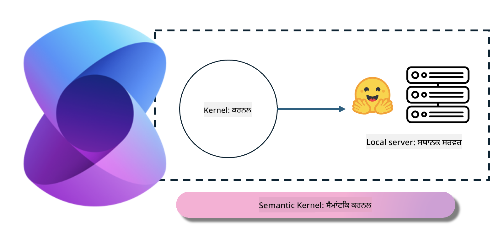
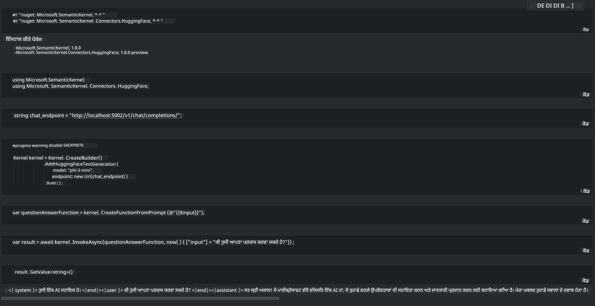

<!--
CO_OP_TRANSLATOR_METADATA:
{
  "original_hash": "bcf5dd7031db0031abdb9dd0c05ba118",
  "translation_date": "2025-07-16T20:56:40+00:00",
  "source_file": "md/01.Introduction/03/Local_Server_Inference.md",
  "language_code": "pa"
}
-->
# **ਲੋਕਲ ਸਰਵਰ 'ਤੇ Inference Phi-3**

ਅਸੀਂ Phi-3 ਨੂੰ ਇੱਕ ਲੋਕਲ ਸਰਵਰ 'ਤੇ ਡਿਪਲੋਇ ਕਰ ਸਕਦੇ ਹਾਂ। ਯੂਜ਼ਰ [Ollama](https://ollama.com) ਜਾਂ [LM Studio](https://llamaedge.com) ਹੱਲ ਚੁਣ ਸਕਦੇ ਹਨ, ਜਾਂ ਉਹ ਆਪਣਾ ਕੋਡ ਲਿਖ ਸਕਦੇ ਹਨ। ਤੁਸੀਂ Phi-3 ਦੀਆਂ ਲੋਕਲ ਸੇਵਾਵਾਂ ਨੂੰ [Semantic Kernel](https://github.com/microsoft/semantic-kernel?WT.mc_id=aiml-138114-kinfeylo) ਜਾਂ [Langchain](https://www.langchain.com/) ਰਾਹੀਂ ਕਨੈਕਟ ਕਰਕੇ Copilot ਐਪਲੀਕੇਸ਼ਨਾਂ ਬਣਾ ਸਕਦੇ ਹੋ।

## **Phi-3-mini ਤੱਕ ਪਹੁੰਚ ਲਈ Semantic Kernel ਦੀ ਵਰਤੋਂ ਕਰੋ**

Copilot ਐਪਲੀਕੇਸ਼ਨ ਵਿੱਚ, ਅਸੀਂ Semantic Kernel / LangChain ਰਾਹੀਂ ਐਪਲੀਕੇਸ਼ਨ ਬਣਾਉਂਦੇ ਹਾਂ। ਇਸ ਕਿਸਮ ਦਾ ਐਪਲੀਕੇਸ਼ਨ ਫਰੇਮਵਰਕ ਆਮ ਤੌਰ 'ਤੇ Azure OpenAI Service / OpenAI ਮਾਡਲਾਂ ਨਾਲ ਮਿਲਦਾ-ਜੁਲਦਾ ਹੁੰਦਾ ਹੈ, ਅਤੇ ਇਹ Hugging Face ਤੇ ਖੁੱਲ੍ਹੇ ਸਰੋਤ ਮਾਡਲਾਂ ਅਤੇ ਲੋਕਲ ਮਾਡਲਾਂ ਨੂੰ ਵੀ ਸਹਿਯੋਗ ਦੇ ਸਕਦਾ ਹੈ। ਜੇ ਅਸੀਂ Semantic Kernel ਦੀ ਵਰਤੋਂ ਕਰਕੇ Phi-3-mini ਤੱਕ ਪਹੁੰਚ ਕਰਨੀ ਹੋਵੇ ਤਾਂ ਕੀ ਕਰਨਾ ਚਾਹੀਦਾ ਹੈ? .NET ਨੂੰ ਉਦਾਹਰਨ ਵਜੋਂ ਲੈ ਕੇ, ਅਸੀਂ ਇਸਨੂੰ Semantic Kernel ਵਿੱਚ Hugging Face Connector ਨਾਲ ਜੋੜ ਸਕਦੇ ਹਾਂ। ਡਿਫਾਲਟ ਤੌਰ 'ਤੇ, ਇਹ Hugging Face 'ਤੇ ਮਾਡਲ ਆਈਡੀ ਨਾਲ ਮੇਲ ਖਾਂਦਾ ਹੈ (ਜਦੋਂ ਤੁਸੀਂ ਪਹਿਲੀ ਵਾਰੀ ਇਸਦੀ ਵਰਤੋਂ ਕਰਦੇ ਹੋ, ਤਾਂ ਮਾਡਲ Hugging Face ਤੋਂ ਡਾਊਨਲੋਡ ਹੁੰਦਾ ਹੈ, ਜਿਸ ਵਿੱਚ ਸਮਾਂ ਲੱਗਦਾ ਹੈ)। ਤੁਸੀਂ ਬਣਾਈ ਗਈ ਲੋਕਲ ਸੇਵਾ ਨਾਲ ਵੀ ਕਨੈਕਟ ਕਰ ਸਕਦੇ ਹੋ। ਦੋਹਾਂ ਵਿੱਚੋਂ, ਅਸੀਂ ਦੂਜੇ ਨੂੰ ਸਿਫਾਰਸ਼ ਕਰਦੇ ਹਾਂ ਕਿਉਂਕਿ ਇਸ ਵਿੱਚ ਖਾਸ ਕਰਕੇ ਉਦਯੋਗਿਕ ਐਪਲੀਕੇਸ਼ਨਾਂ ਵਿੱਚ ਵੱਧ ਖੁਦਮੁਖਤਿਆਰਤਾ ਹੁੰਦੀ ਹੈ।

ਤਸਵੀਰ ਵਿੱਚ ਵੇਖਾਇਆ ਗਿਆ ਹੈ ਕਿ Semantic Kernel ਰਾਹੀਂ ਲੋਕਲ ਸੇਵਾਵਾਂ ਤੱਕ ਪਹੁੰਚ ਕਰਨਾ ਆਸਾਨੀ ਨਾਲ ਆਪਣੇ ਬਣਾਏ Phi-3-mini ਮਾਡਲ ਸਰਵਰ ਨਾਲ ਜੁੜ ਸਕਦਾ ਹੈ। ਇੱਥੇ ਚਲਾਉਣ ਦਾ ਨਤੀਜਾ ਦਿੱਤਾ ਗਿਆ ਹੈ:

***Sample Code*** https://github.com/kinfey/Phi3MiniSamples/tree/main/semantickernel

**ਅਸਵੀਕਾਰੋਪਣ**:  
ਇਹ ਦਸਤਾਵੇਜ਼ AI ਅਨੁਵਾਦ ਸੇਵਾ [Co-op Translator](https://github.com/Azure/co-op-translator) ਦੀ ਵਰਤੋਂ ਕਰਕੇ ਅਨੁਵਾਦਿਤ ਕੀਤਾ ਗਿਆ ਹੈ। ਜਦੋਂ ਕਿ ਅਸੀਂ ਸਹੀਅਤ ਲਈ ਕੋਸ਼ਿਸ਼ ਕਰਦੇ ਹਾਂ, ਕਿਰਪਾ ਕਰਕੇ ਧਿਆਨ ਰੱਖੋ ਕਿ ਸਵੈਚਾਲਿਤ ਅਨੁਵਾਦਾਂ ਵਿੱਚ ਗਲਤੀਆਂ ਜਾਂ ਅਸਮਰਥਤਾਵਾਂ ਹੋ ਸਕਦੀਆਂ ਹਨ। ਮੂਲ ਦਸਤਾਵੇਜ਼ ਆਪਣੀ ਮੂਲ ਭਾਸ਼ਾ ਵਿੱਚ ਪ੍ਰਮਾਣਿਕ ਸਰੋਤ ਮੰਨਿਆ ਜਾਣਾ ਚਾਹੀਦਾ ਹੈ। ਮਹੱਤਵਪੂਰਨ ਜਾਣਕਾਰੀ ਲਈ, ਪੇਸ਼ੇਵਰ ਮਨੁੱਖੀ ਅਨੁਵਾਦ ਦੀ ਸਿਫਾਰਸ਼ ਕੀਤੀ ਜਾਂਦੀ ਹੈ। ਇਸ ਅਨੁਵਾਦ ਦੀ ਵਰਤੋਂ ਤੋਂ ਉਤਪੰਨ ਕਿਸੇ ਵੀ ਗਲਤਫਹਿਮੀ ਜਾਂ ਗਲਤ ਵਿਆਖਿਆ ਲਈ ਅਸੀਂ ਜ਼ਿੰਮੇਵਾਰ ਨਹੀਂ ਹਾਂ।