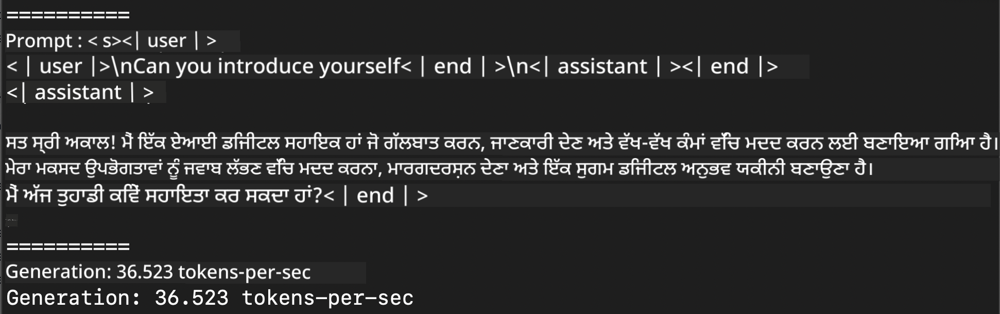
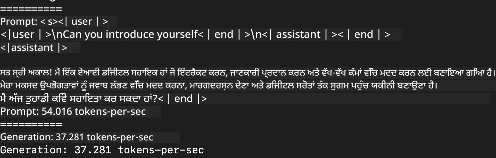
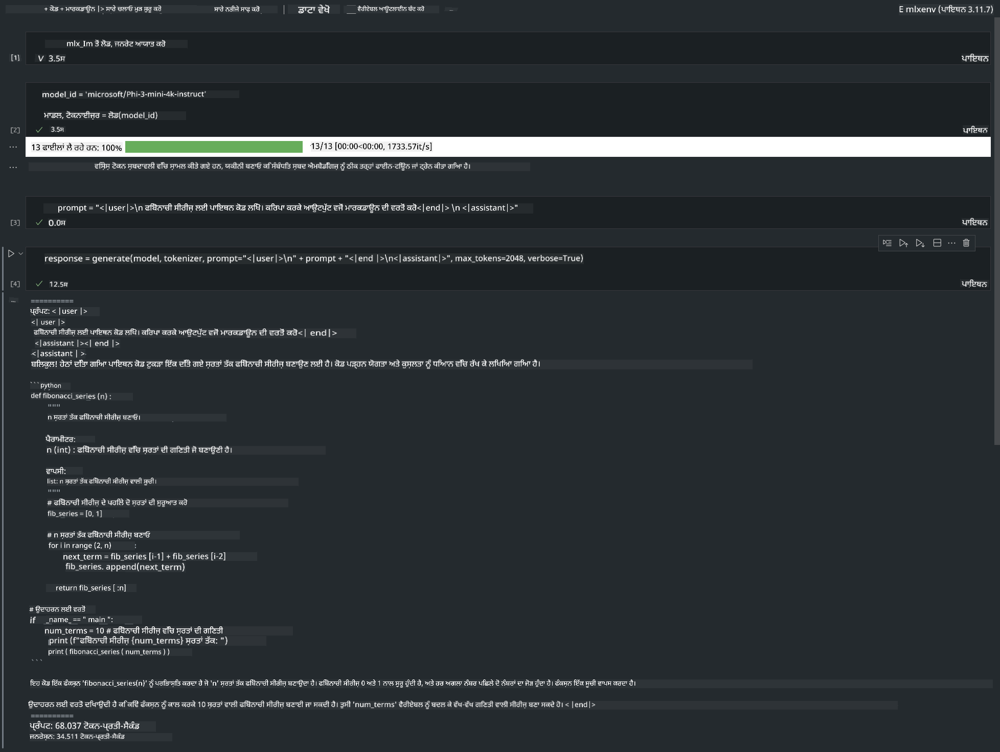

<!--
CO_OP_TRANSLATOR_METADATA:
{
  "original_hash": "dcb656f3d206fc4968e236deec5d4384",
  "translation_date": "2025-07-16T21:02:24+00:00",
  "source_file": "md/01.Introduction/03/MLX_Inference.md",
  "language_code": "pa"
}
-->
# **Inference Phi-3 ਨਾਲ Apple MLX Framework**

## **MLX Framework ਕੀ ਹੈ**

MLX ਇੱਕ ਐਰੇ ਫਰੇਮਵਰਕ ਹੈ ਜੋ Apple ਸਿਲੀਕਾਨ ਉੱਤੇ ਮਸ਼ੀਨ ਲਰਨਿੰਗ ਰਿਸਰਚ ਲਈ ਬਣਾਇਆ ਗਿਆ ਹੈ, ਜੋ Apple ਮਸ਼ੀਨ ਲਰਨਿੰਗ ਰਿਸਰਚ ਵੱਲੋਂ ਲਿਆਂਦਾ ਗਿਆ ਹੈ।

MLX ਮਸ਼ੀਨ ਲਰਨਿੰਗ ਰਿਸਰਚਰਾਂ ਵੱਲੋਂ ਮਸ਼ੀਨ ਲਰਨਿੰਗ ਰਿਸਰਚਰਾਂ ਲਈ ਡਿਜ਼ਾਈਨ ਕੀਤਾ ਗਿਆ ਹੈ। ਇਹ ਫਰੇਮਵਰਕ ਵਰਤੋਂਕਾਰ-ਮਿੱਤਰ ਹੈ, ਪਰ ਫਿਰ ਵੀ ਮਾਡਲਾਂ ਨੂੰ ਟ੍ਰੇਨ ਅਤੇ ਡਿਪਲੋਇ ਕਰਨ ਵਿੱਚ ਪ੍ਰਭਾਵਸ਼ਾਲੀ ਹੈ। ਫਰੇਮਵਰਕ ਦੀ ਡਿਜ਼ਾਈਨ ਖੁਦ ਵੀ ਸਿਧੀ ਅਤੇ ਆਸਾਨ ਹੈ। ਅਸੀਂ ਚਾਹੁੰਦੇ ਹਾਂ ਕਿ ਰਿਸਰਚਰ MLX ਨੂੰ ਆਸਾਨੀ ਨਾਲ ਵਧਾ ਸਕਣ ਅਤੇ ਸੁਧਾਰ ਸਕਣ ਤਾਂ ਜੋ ਨਵੇਂ ਵਿਚਾਰਾਂ ਨੂੰ ਤੇਜ਼ੀ ਨਾਲ ਖੋਜਿਆ ਜਾ ਸਕੇ।

Apple Silicon ਡਿਵਾਈਸਾਂ ਵਿੱਚ MLX ਰਾਹੀਂ LLMs ਨੂੰ ਤੇਜ਼ ਕੀਤਾ ਜਾ ਸਕਦਾ ਹੈ, ਅਤੇ ਮਾਡਲਾਂ ਨੂੰ ਬਹੁਤ ਆਸਾਨੀ ਨਾਲ ਲੋਕਲ ਚਲਾਇਆ ਜਾ ਸਕਦਾ ਹੈ।

## **MLX ਨਾਲ Phi-3-mini ਦਾ ਇੰਫਰੈਂਸ ਕਰਨਾ**

### **1. ਆਪਣਾ MLX ਵਾਤਾਵਰਣ ਸੈੱਟ ਕਰੋ**

1. Python 3.11.x
2. MLX ਲਾਇਬ੍ਰੇਰੀ ਇੰਸਟਾਲ ਕਰੋ


```bash

pip install mlx-lm

```

### **2. MLX ਨਾਲ ਟਰਮੀਨਲ ਵਿੱਚ Phi-3-mini ਚਲਾਉਣਾ**


```bash

python -m mlx_lm.generate --model microsoft/Phi-3-mini-4k-instruct --max-token 2048 --prompt  "<|user|>\nCan you introduce yourself<|end|>\n<|assistant|>"

```

ਨਤੀਜਾ (ਮੇਰਾ ਵਾਤਾਵਰਣ Apple M1 Max, 64GB ਹੈ) ਇਹ ਹੈ



### **3. MLX ਨਾਲ ਟਰਮੀਨਲ ਵਿੱਚ Phi-3-mini ਨੂੰ Quantize ਕਰਨਾ**


```bash

python -m mlx_lm.convert --hf-path microsoft/Phi-3-mini-4k-instruct

```

***Note：*** ਮਾਡਲ ਨੂੰ mlx_lm.convert ਰਾਹੀਂ Quantize ਕੀਤਾ ਜਾ ਸਕਦਾ ਹੈ, ਅਤੇ ਡਿਫਾਲਟ Quantization INT4 ਹੈ। ਇਸ ਉਦਾਹਰਨ ਵਿੱਚ Phi-3-mini ਨੂੰ INT4 ਵਿੱਚ Quantize ਕੀਤਾ ਗਿਆ ਹੈ।

ਮਾਡਲ ਨੂੰ mlx_lm.convert ਰਾਹੀਂ Quantize ਕੀਤਾ ਜਾ ਸਕਦਾ ਹੈ, ਅਤੇ ਡਿਫਾਲਟ Quantization INT4 ਹੈ। ਇਸ ਉਦਾਹਰਨ ਦਾ ਮਕਸਦ Phi-3-mini ਨੂੰ INT4 ਵਿੱਚ Quantize ਕਰਨਾ ਹੈ। Quantization ਤੋਂ ਬਾਅਦ, ਇਹ ਮਾਡਲ ਡਿਫਾਲਟ ਡਾਇਰੈਕਟਰੀ ./mlx_model ਵਿੱਚ ਸਟੋਰ ਕੀਤਾ ਜਾਵੇਗਾ।

ਅਸੀਂ ਟਰਮੀਨਲ ਤੋਂ MLX ਨਾਲ Quantize ਕੀਤਾ ਮਾਡਲ ਟੈਸਟ ਕਰ ਸਕਦੇ ਹਾਂ


```bash

python -m mlx_lm.generate --model ./mlx_model/ --max-token 2048 --prompt  "<|user|>\nCan you introduce yourself<|end|>\n<|assistant|>"

```

ਨਤੀਜਾ ਇਹ ਹੈ




### **4. MLX ਨਾਲ Jupyter Notebook ਵਿੱਚ Phi-3-mini ਚਲਾਉਣਾ**




***Note:*** ਕਿਰਪਾ ਕਰਕੇ ਇਸ ਸੈਂਪਲ ਨੂੰ ਪੜ੍ਹੋ [ਇਸ ਲਿੰਕ 'ਤੇ ਕਲਿੱਕ ਕਰੋ](../../../../../code/03.Inference/MLX/MLX_DEMO.ipynb)


## **ਸੰਸਾਧਨ**

1. Apple MLX Framework ਬਾਰੇ ਜਾਣੋ [https://ml-explore.github.io](https://ml-explore.github.io/mlx/build/html/index.html)

2. Apple MLX GitHub ਰਿਪੋ [https://github.com/ml-explore](https://github.com/ml-explore)

**ਅਸਵੀਕਾਰੋਪਣ**:  
ਇਹ ਦਸਤਾਵੇਜ਼ AI ਅਨੁਵਾਦ ਸੇਵਾ [Co-op Translator](https://github.com/Azure/co-op-translator) ਦੀ ਵਰਤੋਂ ਕਰਕੇ ਅਨੁਵਾਦਿਤ ਕੀਤਾ ਗਿਆ ਹੈ। ਜਦੋਂ ਕਿ ਅਸੀਂ ਸਹੀਅਤ ਲਈ ਕੋਸ਼ਿਸ਼ ਕਰਦੇ ਹਾਂ, ਕਿਰਪਾ ਕਰਕੇ ਧਿਆਨ ਰੱਖੋ ਕਿ ਸਵੈਚਾਲਿਤ ਅਨੁਵਾਦਾਂ ਵਿੱਚ ਗਲਤੀਆਂ ਜਾਂ ਅਸਮਰਥਤਾਵਾਂ ਹੋ ਸਕਦੀਆਂ ਹਨ। ਮੂਲ ਦਸਤਾਵੇਜ਼ ਆਪਣੀ ਮੂਲ ਭਾਸ਼ਾ ਵਿੱਚ ਪ੍ਰਮਾਣਿਕ ਸਰੋਤ ਮੰਨਿਆ ਜਾਣਾ ਚਾਹੀਦਾ ਹੈ। ਮਹੱਤਵਪੂਰਨ ਜਾਣਕਾਰੀ ਲਈ, ਪੇਸ਼ੇਵਰ ਮਨੁੱਖੀ ਅਨੁਵਾਦ ਦੀ ਸਿਫਾਰਸ਼ ਕੀਤੀ ਜਾਂਦੀ ਹੈ। ਅਸੀਂ ਇਸ ਅਨੁਵਾਦ ਦੀ ਵਰਤੋਂ ਤੋਂ ਉਤਪੰਨ ਕਿਸੇ ਵੀ ਗਲਤਫਹਿਮੀ ਜਾਂ ਗਲਤ ਵਿਆਖਿਆ ਲਈ ਜ਼ਿੰਮੇਵਾਰ ਨਹੀਂ ਹਾਂ।