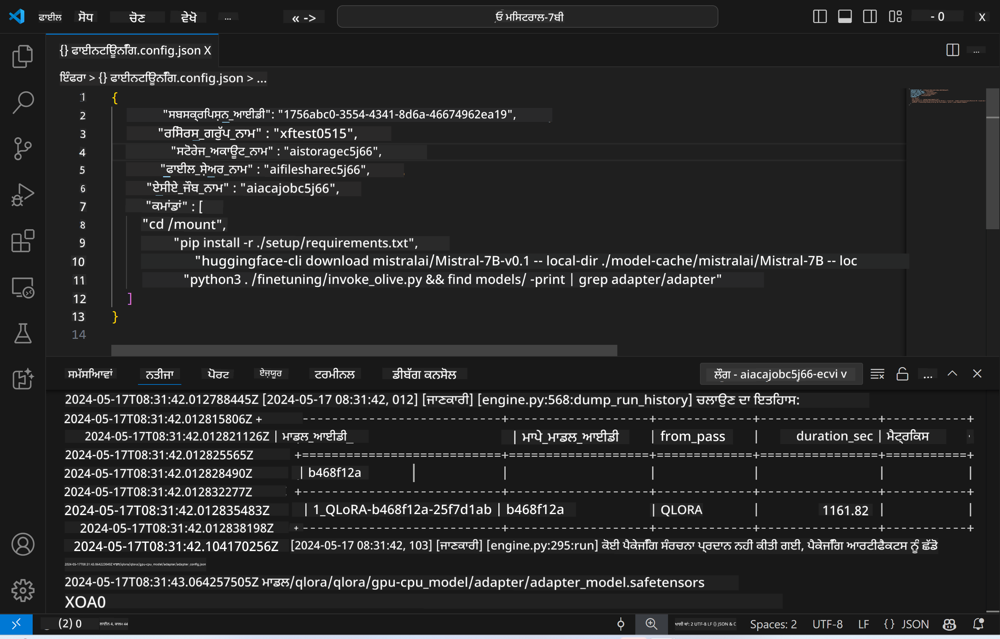
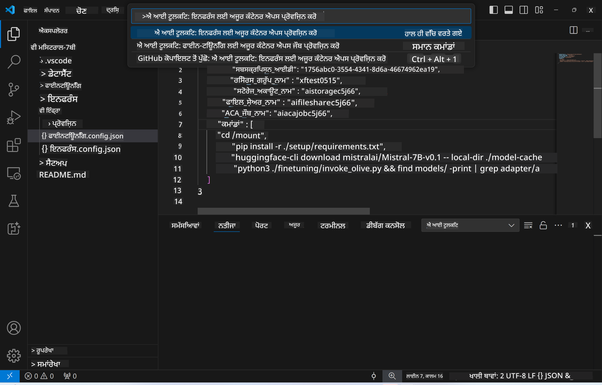
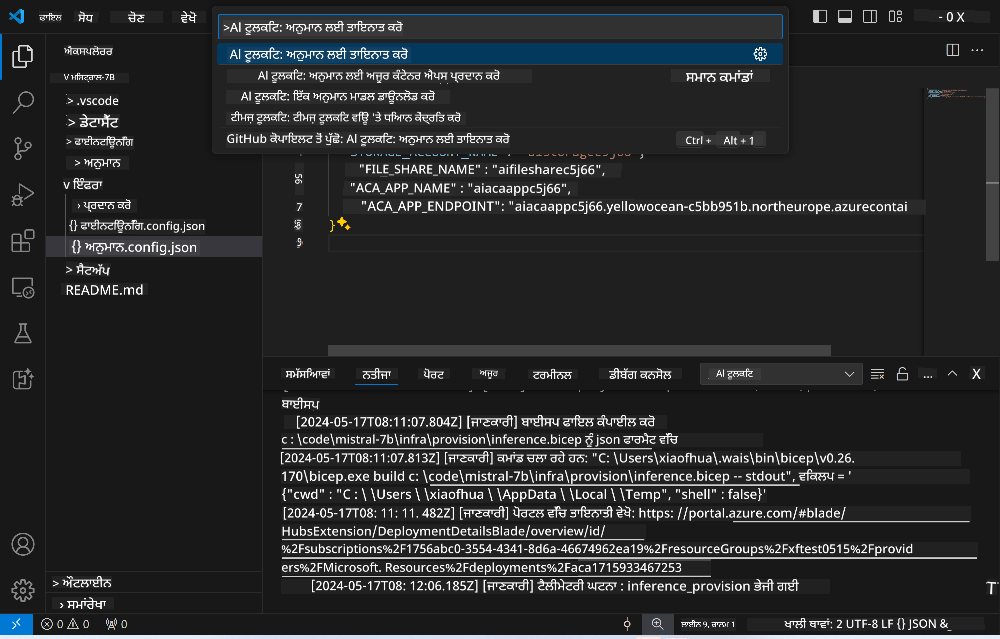
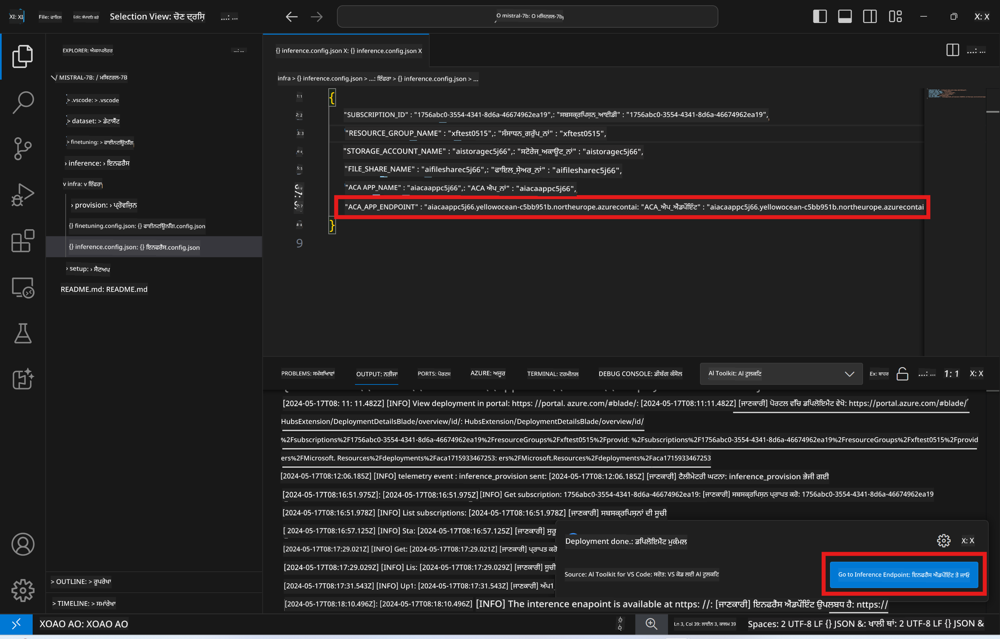

<!--
CO_OP_TRANSLATOR_METADATA:
{
  "original_hash": "a54cd3d65b6963e4e8ce21e143c3ab04",
  "translation_date": "2025-07-16T21:17:46+00:00",
  "source_file": "md/01.Introduction/03/Remote_Interence.md",
  "language_code": "pa"
}
-->
# ਫਾਈਨ-ਟਿਊਨ ਕੀਤੇ ਮਾਡਲ ਨਾਲ ਰਿਮੋਟ ਇੰਫਰੈਂਸਿੰਗ

ਜਦੋਂ ਅਡੈਪਟਰ ਰਿਮੋਟ ਵਾਤਾਵਰਣ ਵਿੱਚ ਟ੍ਰੇਨ ਹੋ ਜਾਂਦੇ ਹਨ, ਤਾਂ ਮਾਡਲ ਨਾਲ ਇੰਟਰੈਕਟ ਕਰਨ ਲਈ ਇੱਕ ਸਧਾਰਣ Gradio ਐਪਲੀਕੇਸ਼ਨ ਦੀ ਵਰਤੋਂ ਕਰੋ।



### Azure ਰਿਸੋਰਸز ਦੀ ਪ੍ਰੋਵਿਜ਼ਨ ਕਰੋ  
ਰਿਮੋਟ ਇੰਫਰੈਂਸ ਲਈ Azure ਰਿਸੋਰਸਜ਼ ਸੈੱਟਅਪ ਕਰਨ ਲਈ ਕਮਾਂਡ ਪੈਲੇਟ ਤੋਂ `AI Toolkit: Provision Azure Container Apps for inference` ਚਲਾਓ। ਇਸ ਸੈੱਟਅਪ ਦੌਰਾਨ, ਤੁਹਾਨੂੰ ਆਪਣੀ Azure ਸਬਸਕ੍ਰਿਪਸ਼ਨ ਅਤੇ ਰਿਸੋਰਸ ਗਰੁੱਪ ਚੁਣਨ ਲਈ ਕਿਹਾ ਜਾਵੇਗਾ।  


ਡਿਫਾਲਟ ਤੌਰ 'ਤੇ, ਇੰਫਰੈਂਸ ਲਈ ਸਬਸਕ੍ਰਿਪਸ਼ਨ ਅਤੇ ਰਿਸੋਰਸ ਗਰੁੱਪ ਉਹੀ ਹੋਣੇ ਚਾਹੀਦੇ ਹਨ ਜੋ ਫਾਈਨ-ਟਿਊਨਿੰਗ ਲਈ ਵਰਤੇ ਗਏ ਸਨ। ਇੰਫਰੈਂਸ ਉਹੀ Azure Container App Environment ਵਰਤੇਗਾ ਅਤੇ ਮਾਡਲ ਅਤੇ ਮਾਡਲ ਅਡੈਪਟਰ ਨੂੰ ਐਕਸੈਸ ਕਰੇਗਾ ਜੋ Azure Files ਵਿੱਚ ਸਟੋਰ ਕੀਤੇ ਗਏ ਹਨ, ਜੋ ਫਾਈਨ-ਟਿਊਨਿੰਗ ਦੌਰਾਨ ਬਣਾਏ ਗਏ ਸਨ।

## AI Toolkit ਦੀ ਵਰਤੋਂ

### ਇੰਫਰੈਂਸ ਲਈ ਡਿਪਲੋਇਮੈਂਟ  
ਜੇ ਤੁਸੀਂ ਇੰਫਰੈਂਸ ਕੋਡ ਨੂੰ ਸੋਧਣਾ ਜਾਂ ਇੰਫਰੈਂਸ ਮਾਡਲ ਨੂੰ ਰੀਲੋਡ ਕਰਨਾ ਚਾਹੁੰਦੇ ਹੋ, ਤਾਂ ਕਿਰਪਾ ਕਰਕੇ `AI Toolkit: Deploy for inference` ਕਮਾਂਡ ਚਲਾਓ। ਇਹ ਤੁਹਾਡੇ ਤਾਜ਼ਾ ਕੋਡ ਨੂੰ ACA ਨਾਲ ਸਿੰਕ੍ਰੋਨਾਈਜ਼ ਕਰੇਗਾ ਅਤੇ ਰੇਪਲਿਕਾ ਨੂੰ ਰੀਸਟਾਰਟ ਕਰੇਗਾ।



ਡਿਪਲੋਇਮੈਂਟ ਸਫਲਤਾਪੂਰਵਕ ਮੁਕੰਮਲ ਹੋਣ ਤੋਂ ਬਾਅਦ, ਮਾਡਲ ਹੁਣ ਇਸ ਐਂਡਪੌਇੰਟ ਰਾਹੀਂ ਮੁਲਾਂਕਣ ਲਈ ਤਿਆਰ ਹੈ।

### ਇੰਫਰੈਂਸ API ਤੱਕ ਪਹੁੰਚ

ਤੁਸੀਂ VSCode ਨੋਟੀਫਿਕੇਸ਼ਨ ਵਿੱਚ ਦਿਖਾਏ ਗਏ "*Go to Inference Endpoint*" ਬਟਨ 'ਤੇ ਕਲਿੱਕ ਕਰਕੇ ਇੰਫਰੈਂਸ API ਤੱਕ ਪਹੁੰਚ ਕਰ ਸਕਦੇ ਹੋ। ਵਿਕਲਪ ਵਜੋਂ, ਵੈੱਬ API ਐਂਡਪੌਇੰਟ `ACA_APP_ENDPOINT` ਵਿੱਚ `./infra/inference.config.json` ਅਤੇ ਆਉਟਪੁੱਟ ਪੈਨਲ ਵਿੱਚ ਮਿਲ ਸਕਦਾ ਹੈ।



> **Note:** ਇੰਫਰੈਂਸ ਐਂਡਪੌਇੰਟ ਨੂੰ ਪੂਰੀ ਤਰ੍ਹਾਂ ਚਾਲੂ ਹੋਣ ਵਿੱਚ ਕੁਝ ਮਿੰਟ ਲੱਗ ਸਕਦੇ ਹਨ।

## ਟੈਮਪਲੇਟ ਵਿੱਚ ਸ਼ਾਮਲ ਇੰਫਰੈਂਸ ਕੰਪੋਨੈਂਟਸ

| ਫੋਲਡਰ | ਸਮੱਗਰੀ |
| ------ |--------- |
| `infra` | ਰਿਮੋਟ ਓਪਰੇਸ਼ਨਾਂ ਲਈ ਸਾਰੀਆਂ ਜ਼ਰੂਰੀ ਕਨਫਿਗਰੇਸ਼ਨਜ਼ ਸ਼ਾਮਲ ਹਨ। |
| `infra/provision/inference.parameters.json` | ਬਾਈਸਪ ਟੈਮਪਲੇਟਸ ਲਈ ਪੈਰਾਮੀਟਰ ਰੱਖਦਾ ਹੈ, ਜੋ ਇੰਫਰੈਂਸ ਲਈ Azure ਰਿਸੋਰਸਜ਼ ਦੀ ਪ੍ਰੋਵਿਜ਼ਨਿੰਗ ਲਈ ਵਰਤੇ ਜਾਂਦੇ ਹਨ। |
| `infra/provision/inference.bicep` | ਇੰਫਰੈਂਸ ਲਈ Azure ਰਿਸੋਰਸਜ਼ ਦੀ ਪ੍ਰੋਵਿਜ਼ਨਿੰਗ ਲਈ ਟੈਮਪਲੇਟਸ ਸ਼ਾਮਲ ਹਨ। |
| `infra/inference.config.json` | ਇਹ ਕਨਫਿਗਰੇਸ਼ਨ ਫਾਈਲ ਹੈ, ਜੋ `AI Toolkit: Provision Azure Container Apps for inference` ਕਮਾਂਡ ਨਾਲ ਬਣਾਈ ਜਾਂਦੀ ਹੈ। ਇਹ ਹੋਰ ਰਿਮੋਟ ਕਮਾਂਡ ਪੈਲੇਟਸ ਲਈ ਇਨਪੁੱਟ ਵਜੋਂ ਵਰਤੀ ਜਾਂਦੀ ਹੈ। |

### Azure Resource Provision ਲਈ AI Toolkit ਦੀ ਵਰਤੋਂ  
[AI Toolkit](https://marketplace.visualstudio.com/items?itemName=ms-windows-ai-studio.windows-ai-studio) ਨੂੰ ਕਨਫਿਗਰ ਕਰੋ।

`Provision Azure Container Apps for inference` ਕਮਾਂਡ ਚਲਾਓ।

ਤੁਸੀਂ `./infra/provision/inference.parameters.json` ਫਾਈਲ ਵਿੱਚ ਕਨਫਿਗਰੇਸ਼ਨ ਪੈਰਾਮੀਟਰ ਲੱਭ ਸਕਦੇ ਹੋ। ਇੱਥੇ ਵੇਰਵੇ ਹਨ:  
| ਪੈਰਾਮੀਟਰ | ਵੇਰਵਾ |
| --------- |------------ |
| `defaultCommands` | ਇਹ ਵੈੱਬ API ਸ਼ੁਰੂ ਕਰਨ ਲਈ ਕਮਾਂਡਾਂ ਹਨ। |
| `maximumInstanceCount` | ਇਹ ਪੈਰਾਮੀਟਰ GPU ਇੰਸਟੈਂਸ ਦੀ ਵੱਧ ਤੋਂ ਵੱਧ ਸਮਰੱਥਾ ਸੈੱਟ ਕਰਦਾ ਹੈ। |
| `location` | ਇਹ ਥਾਂ ਹੈ ਜਿੱਥੇ Azure ਰਿਸੋਰਸਜ਼ ਪ੍ਰੋਵਿਜ਼ਨ ਕੀਤੇ ਜਾਂਦੇ ਹਨ। ਡਿਫਾਲਟ ਮੁੱਲ ਚੁਣੇ ਗਏ ਰਿਸੋਰਸ ਗਰੁੱਪ ਦੀ ਥਾਂ ਦੇ ਬਰਾਬਰ ਹੁੰਦਾ ਹੈ। |
| `storageAccountName`, `fileShareName`, `acaEnvironmentName`, `acaEnvironmentStorageName`, `acaAppName`, `acaLogAnalyticsName` | ਇਹ ਪੈਰਾਮੀਟਰ Azure ਰਿਸੋਰਸਜ਼ ਲਈ ਨਾਮ ਰੱਖਣ ਲਈ ਵਰਤੇ ਜਾਂਦੇ ਹਨ। ਡਿਫਾਲਟ ਤੌਰ 'ਤੇ ਇਹ ਫਾਈਨ-ਟਿਊਨਿੰਗ ਰਿਸੋਰਸ ਨਾਮ ਦੇ ਬਰਾਬਰ ਹੁੰਦੇ ਹਨ। ਤੁਸੀਂ ਆਪਣਾ ਨਵਾਂ, ਅਣਵਰਤਿਤ ਰਿਸੋਰਸ ਨਾਮ ਦਾਖਲ ਕਰਕੇ ਆਪਣੀ ਕਸਟਮ-ਨਾਮ ਵਾਲੀ ਰਿਸੋਰਸ ਬਣਾਉਣ ਲਈ ਇਨਪੁੱਟ ਦੇ ਸਕਦੇ ਹੋ, ਜਾਂ ਤੁਸੀਂ ਮੌਜੂਦਾ Azure ਰਿਸੋਰਸ ਦਾ ਨਾਮ ਦਾਖਲ ਕਰ ਸਕਦੇ ਹੋ ਜੇ ਤੁਸੀਂ ਉਹ ਵਰਤਣਾ ਚਾਹੁੰਦੇ ਹੋ। ਵੇਰਵਿਆਂ ਲਈ, [Using existing Azure Resources](../../../../../md/01.Introduction/03) ਸੈਕਸ਼ਨ ਨੂੰ ਵੇਖੋ। |

### ਮੌਜੂਦਾ Azure ਰਿਸੋਰਸਜ਼ ਦੀ ਵਰਤੋਂ

ਡਿਫਾਲਟ ਤੌਰ 'ਤੇ, ਇੰਫਰੈਂਸ ਪ੍ਰੋਵਿਜ਼ਨ ਉਹੀ Azure Container App Environment, Storage Account, Azure File Share, ਅਤੇ Azure Log Analytics ਵਰਤਦਾ ਹੈ ਜੋ ਫਾਈਨ-ਟਿਊਨਿੰਗ ਲਈ ਵਰਤੇ ਗਏ ਸਨ। ਇੰਫਰੈਂਸ API ਲਈ ਇੱਕ ਵੱਖਰਾ Azure Container App ਬਣਾਇਆ ਜਾਂਦਾ ਹੈ।

ਜੇ ਤੁਸੀਂ ਫਾਈਨ-ਟਿਊਨਿੰਗ ਦੌਰਾਨ Azure ਰਿਸੋਰਸਜ਼ ਨੂੰ ਕਸਟਮਾਈਜ਼ ਕੀਤਾ ਹੈ ਜਾਂ ਇੰਫਰੈਂਸ ਲਈ ਆਪਣੇ ਮੌਜੂਦਾ Azure ਰਿਸੋਰਸਜ਼ ਦੀ ਵਰਤੋਂ ਕਰਨਾ ਚਾਹੁੰਦੇ ਹੋ, ਤਾਂ ਉਹਨਾਂ ਦੇ ਨਾਮ `./infra/inference.parameters.json` ਫਾਈਲ ਵਿੱਚ ਦਰਜ ਕਰੋ। ਫਿਰ ਕਮਾਂਡ ਪੈਲੇਟ ਤੋਂ `AI Toolkit: Provision Azure Container Apps for inference` ਕਮਾਂਡ ਚਲਾਓ। ਇਹ ਦਿੱਤੇ ਗਏ ਕਿਸੇ ਵੀ ਰਿਸੋਰਸ ਨੂੰ ਅਪਡੇਟ ਕਰੇਗਾ ਅਤੇ ਜੇ ਕੋਈ ਗੁੰਮ ਹੈ ਤਾਂ ਉਹ ਬਣਾਏਗਾ।

ਉਦਾਹਰਨ ਵਜੋਂ, ਜੇ ਤੁਹਾਡੇ ਕੋਲ ਮੌਜੂਦਾ Azure container environment ਹੈ, ਤਾਂ ਤੁਹਾਡੀ `./infra/finetuning.parameters.json` ਇਸ ਤਰ੍ਹਾਂ ਹੋਣੀ ਚਾਹੀਦੀ ਹੈ:

```json
{
    "$schema": "https://schema.management.azure.com/schemas/2019-04-01/deploymentParameters.json#",
    "contentVersion": "1.0.0.0",
    "parameters": {
      ...
      "acaEnvironmentName": {
        "value": "<your-aca-env-name>"
      },
      "acaEnvironmentStorageName": {
        "value": null
      },
      ...
    }
  }
```

### ਮੈਨੂਅਲ ਪ੍ਰੋਵਿਜ਼ਨ  
ਜੇ ਤੁਸੀਂ Azure ਰਿਸੋਰਸਜ਼ ਨੂੰ ਹੱਥੋਂ-ਹੱਥ ਕਨਫਿਗਰ ਕਰਨਾ ਚਾਹੁੰਦੇ ਹੋ, ਤਾਂ ਤੁਸੀਂ `./infra/provision` ਫੋਲਡਰ ਵਿੱਚ ਦਿੱਤੇ ਬਾਈਸਪ ਫਾਈਲਾਂ ਦੀ ਵਰਤੋਂ ਕਰ ਸਕਦੇ ਹੋ। ਜੇ ਤੁਸੀਂ ਪਹਿਲਾਂ ਹੀ ਸਾਰੇ Azure ਰਿਸੋਰਸਜ਼ ਸੈੱਟਅਪ ਅਤੇ ਕਨਫਿਗਰ ਕਰ ਚੁੱਕੇ ਹੋ ਬਿਨਾਂ AI Toolkit ਕਮਾਂਡ ਪੈਲੇਟ ਦੀ ਵਰਤੋਂ ਕੀਤੇ, ਤਾਂ ਸਿਰਫ਼ `inference.config.json` ਫਾਈਲ ਵਿੱਚ ਰਿਸੋਰਸ ਨਾਮ ਦਰਜ ਕਰੋ।

ਉਦਾਹਰਨ ਵਜੋਂ:

```json
{
  "SUBSCRIPTION_ID": "<your-subscription-id>",
  "RESOURCE_GROUP_NAME": "<your-resource-group-name>",
  "STORAGE_ACCOUNT_NAME": "<your-storage-account-name>",
  "FILE_SHARE_NAME": "<your-file-share-name>",
  "ACA_APP_NAME": "<your-aca-name>",
  "ACA_APP_ENDPOINT": "<your-aca-endpoint>"
}
```

**ਅਸਵੀਕਾਰੋਪਣ**:  
ਇਹ ਦਸਤਾਵੇਜ਼ AI ਅਨੁਵਾਦ ਸੇਵਾ [Co-op Translator](https://github.com/Azure/co-op-translator) ਦੀ ਵਰਤੋਂ ਕਰਕੇ ਅਨੁਵਾਦਿਤ ਕੀਤਾ ਗਿਆ ਹੈ। ਜਦੋਂ ਕਿ ਅਸੀਂ ਸਹੀਤਾ ਲਈ ਕੋਸ਼ਿਸ਼ ਕਰਦੇ ਹਾਂ, ਕਿਰਪਾ ਕਰਕੇ ਧਿਆਨ ਰੱਖੋ ਕਿ ਸਵੈਚਾਲਿਤ ਅਨੁਵਾਦਾਂ ਵਿੱਚ ਗਲਤੀਆਂ ਜਾਂ ਅਸਮਰਥਤਾਵਾਂ ਹੋ ਸਕਦੀਆਂ ਹਨ। ਮੂਲ ਦਸਤਾਵੇਜ਼ ਆਪਣੀ ਮੂਲ ਭਾਸ਼ਾ ਵਿੱਚ ਪ੍ਰਮਾਣਿਕ ਸਰੋਤ ਮੰਨਿਆ ਜਾਣਾ ਚਾਹੀਦਾ ਹੈ। ਮਹੱਤਵਪੂਰਨ ਜਾਣਕਾਰੀ ਲਈ, ਪੇਸ਼ੇਵਰ ਮਨੁੱਖੀ ਅਨੁਵਾਦ ਦੀ ਸਿਫਾਰਸ਼ ਕੀਤੀ ਜਾਂਦੀ ਹੈ। ਅਸੀਂ ਇਸ ਅਨੁਵਾਦ ਦੀ ਵਰਤੋਂ ਤੋਂ ਉਤਪੰਨ ਕਿਸੇ ਵੀ ਗਲਤਫਹਿਮੀ ਜਾਂ ਗਲਤ ਵਿਆਖਿਆ ਲਈ ਜ਼ਿੰਮੇਵਾਰ ਨਹੀਂ ਹਾਂ।