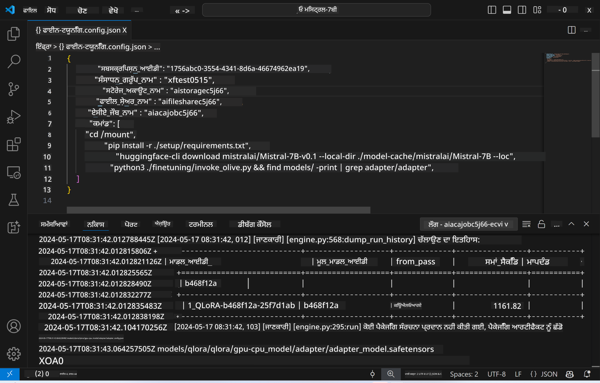
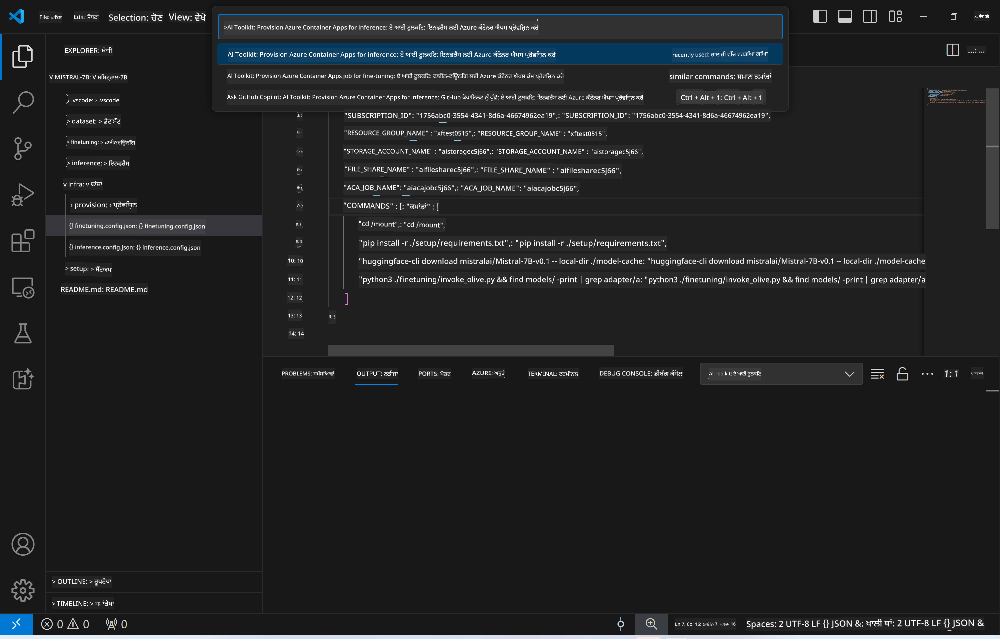
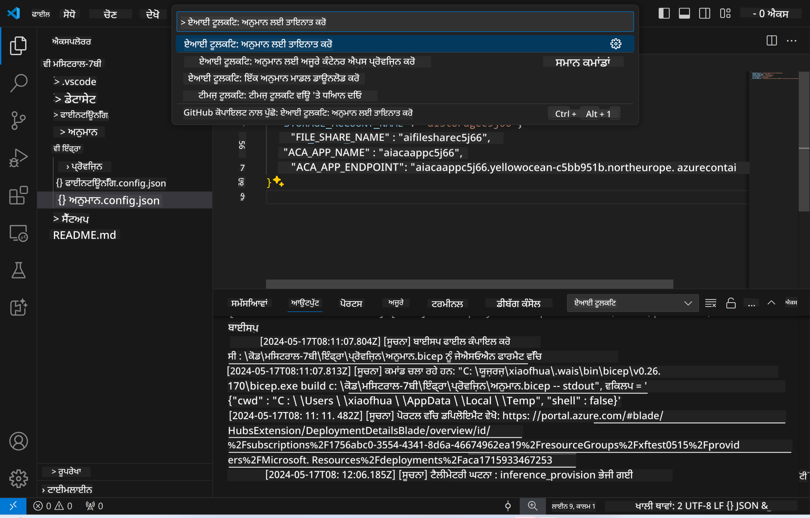

<!--
CO_OP_TRANSLATOR_METADATA:
{
  "original_hash": "a54cd3d65b6963e4e8ce21e143c3ab04",
  "translation_date": "2025-05-09T12:36:40+00:00",
  "source_file": "md/01.Introduction/03/Remote_Interence.md",
  "language_code": "pa"
}
-->
# Remote Inferencing with the fine-tuned model

ਜਦੋਂ ਅਡੈਪਟਰਾਂ ਨੂੰ ਰਿਮੋਟ ਮਾਹੌਲ ਵਿੱਚ ਟ੍ਰੇਨ ਕੀਤਾ ਜਾ ਚੁੱਕਾ ਹੋਵੇ, ਤਾਂ ਮਾਡਲ ਨਾਲ ਇੰਟਰੈਕਟ ਕਰਨ ਲਈ ਇੱਕ ਸਧਾਰਣ Gradio ਐਪਲੀਕੇਸ਼ਨ ਦੀ ਵਰਤੋਂ ਕਰੋ।



### Azure Resources ਦੀ ਸੈਟਅਪ ਕਰੋ  
ਤੁਹਾਨੂੰ ਰਿਮੋਟ ਇਨਫਰੰਸ ਲਈ Azure Resources ਸੈਟਅਪ ਕਰਨ ਦੀ ਲੋੜ ਹੈ, ਜਿਸ ਲਈ ਕਮਾਂਡ ਪੈਲੇਟ ਤੋਂ `AI Toolkit: Provision Azure Container Apps for inference` ਚਲਾਓ। ਇਸ ਸੈਟਅਪ ਦੌਰਾਨ, ਤੁਹਾਨੂੰ ਆਪਣੀ Azure Subscription ਅਤੇ resource group ਚੁਣਨ ਲਈ ਕਿਹਾ ਜਾਵੇਗਾ।  

   
ਡਿਫੌਲਟ ਤੌਰ 'ਤੇ, ਇਨਫਰੰਸ ਲਈ subscription ਅਤੇ resource group ਉਹੀ ਹੋਣੇ ਚਾਹੀਦੇ ਹਨ ਜੋ ਫਾਈਨ-ਟਿਊਨਿੰਗ ਲਈ ਵਰਤੇ ਗਏ ਸਨ। ਇਨਫਰੰਸ ਉਹੀ Azure Container App Environment ਵਰਤੇਗਾ ਅਤੇ ਮਾਡਲ ਅਤੇ ਮਾਡਲ ਅਡੈਪਟਰ ਨੂੰ Azure Files ਵਿੱਚ ਐਕਸੈੱਸ ਕਰੇਗਾ, ਜੋ ਫਾਈਨ-ਟਿਊਨਿੰਗ ਸਟੈਪ ਦੌਰਾਨ ਬਣਾਏ ਗਏ ਸਨ।

## AI Toolkit ਦੀ ਵਰਤੋਂ ਕਰਦੇ ਹੋਏ

### ਇਨਫਰੰਸ ਲਈ ਡਿਪਲੋਇਮੈਂਟ  
ਜੇ ਤੁਸੀਂ ਇਨਫਰੰਸ ਕੋਡ ਨੂੰ ਸੋਧਣਾ ਜਾਂ ਇਨਫਰੰਸ ਮਾਡਲ ਨੂੰ ਦੁਬਾਰਾ ਲੋਡ ਕਰਨਾ ਚਾਹੁੰਦੇ ਹੋ, ਤਾਂ ਕਿਰਪਾ ਕਰਕੇ `AI Toolkit: Deploy for inference` ਕਮਾਂਡ ਚਲਾਓ। ਇਹ ਤੁਹਾਡੇ ਤਾਜ਼ਾ ਕੋਡ ਨੂੰ ACA ਨਾਲ ਸਿੰਕ੍ਰੋਨਾਈਜ਼ ਕਰੇਗਾ ਅਤੇ ਰਿਪਲਿਕਾ ਨੂੰ ਰੀਸਟਾਰਟ ਕਰੇਗਾ।  



ਡਿਪਲੋਇਮੈਂਟ ਸਫਲਤਾਪੂਰਵਕ ਮੁਕੰਮਲ ਹੋਣ ਤੋਂ ਬਾਅਦ, ਮਾਡਲ ਹੁਣ ਇਸ ਐਂਡਪੌਇੰਟ ਦੀ ਵਰਤੋਂ ਕਰਕੇ ਮੁਲਾਂਕਣ ਲਈ ਤਿਆਰ ਹੈ।

### ਇਨਫਰੰਸ API ਤੱਕ ਪਹੁੰਚ

ਤੁਸੀਂ VSCode ਨੋਟੀਫਿਕੇਸ਼ਨ ਵਿੱਚ ਦਿਖਾਏ ਗਏ "*Go to Inference Endpoint*" ਬਟਨ 'ਤੇ ਕਲਿੱਕ ਕਰਕੇ ਇਨਫਰੰਸ API ਤੱਕ ਪਹੁੰਚ ਕਰ ਸਕਦੇ ਹੋ। ਵਿਕਲਪ ਵਜੋਂ, ਵੈੱਬ API ਐਂਡਪੌਇੰਟ ਨੂੰ `ACA_APP_ENDPOINT` ਵਿੱਚ `./infra/inference.config.json` ਅਤੇ ਆਉਟਪੁੱਟ ਪੈਨਲ ਵਿੱਚ ਲੱਭਿਆ ਜਾ ਸਕਦਾ ਹੈ।


> **Note:** ਇਨਫਰੰਸ ਐਂਡਪੌਇੰਟ ਨੂੰ ਪੂਰੀ ਤਰ੍ਹਾਂ ਕੰਮ ਕਰਨ ਲਈ ਕੁਝ ਮਿੰਟ ਲੱਗ ਸਕਦੇ ਹਨ।

## ਟੈਂਪਲੇਟ ਵਿੱਚ ਸ਼ਾਮਲ ਇਨਫਰੰਸ ਕੰਪੋਨੈਂਟਸ
 
| ਫੋਲਡਰ | ਸਮੱਗਰੀ |
| ------ |--------- |
| `infra` | ਰਿਮੋਟ ਓਪਰੇਸ਼ਨਾਂ ਲਈ ਸਾਰੀਆਂ ਲੋੜੀਂਦੀਆਂ ਸੰਰਚਨਾਵਾਂ ਸ਼ਾਮਲ ਹਨ। |
| `infra/provision/inference.parameters.json` | ਬਾਇਸਪ ਟੈਂਪਲੇਟ ਲਈ ਪੈਰਾਮੀਟਰਾਂ ਨੂੰ ਰੱਖਦਾ ਹੈ, ਜੋ ਇਨਫਰੰਸ ਲਈ Azure Resources ਪ੍ਰੋਵਿਜ਼ਨ ਕਰਨ ਲਈ ਵਰਤੇ ਜਾਂਦੇ ਹਨ। |
| `infra/provision/inference.bicep` | ਇਨਫਰੰਸ ਲਈ Azure Resources ਪ੍ਰੋਵਿਜ਼ਨ ਕਰਨ ਵਾਲੇ ਟੈਂਪਲੇਟ ਸ਼ਾਮਲ ਹਨ। |
| `infra/inference.config.json` | ਸੰਰਚਨਾ ਫਾਈਲ, ਜੋ `AI Toolkit: Provision Azure Container Apps for inference` ਕਮਾਂਡ ਦੁਆਰਾ ਬਣਾਈ ਜਾਂਦੀ ਹੈ। ਇਹ ਹੋਰ ਰਿਮੋਟ ਕਮਾਂਡ ਪੈਲੇਟ ਲਈ ਇਨਪੁੱਟ ਵਜੋਂ ਵਰਤੀ ਜਾਂਦੀ ਹੈ। |

### AI Toolkit ਦੀ ਵਰਤੋਂ ਕਰਕੇ Azure Resource Provision ਸੈਟਅਪ ਕਰਨਾ  
[AI Toolkit](https://marketplace.visualstudio.com/items?itemName=ms-windows-ai-studio.windows-ai-studio) ਨੂੰ ਕਨਫਿਗਰ ਕਰੋ

ਇਨਫਰੰਸ ਲਈ Azure Container Apps ਪ੍ਰੋਵਿਜ਼ਨ ਕਰੋ` command.

You can find configuration parameters in `./infra/provision/inference.parameters.json` file. Here are the details:
| Parameter | Description |
| --------- |------------ |
| `defaultCommands` | This is the commands to initiate a web API. |
| `maximumInstanceCount` | This parameter sets the maximum capacity of GPU instances. |
| `location` | This is the location where Azure resources are provisioned. The default value is the same as the chosen resource group's location. |
| `storageAccountName`, `fileShareName` `acaEnvironmentName`, `acaEnvironmentStorageName`, `acaAppName`,  `acaLogAnalyticsName` | These parameters are used to name the Azure resources for provision. By default, they will be same to the fine-tuning resource name. You can input a new, unused resource name to create your own custom-named resources, or you can input the name of an already existing Azure resource if you'd prefer to use that. For details, refer to the section [Using existing Azure Resources](../../../../../md/01.Introduction/03). |

### Using Existing Azure Resources

By default, the inference provision use the same Azure Container App Environment, Storage Account, Azure File Share, and Azure Log Analytics that were used for fine-tuning. A separate Azure Container App is created solely for the inference API. 

If you have customized the Azure resources during the fine-tuning step or want to use your own existing Azure resources for inference, specify their names in the `./infra/inference.parameters.json` ਫਾਈਲ ਵਿੱਚ। ਫਿਰ, ਕਮਾਂਡ ਪੈਲੇਟ ਤੋਂ `AI Toolkit: Provision Azure Container Apps for inference` ਕਮਾਂਡ ਚਲਾਓ। ਇਹ ਕਿਸੇ ਵੀ ਦਿੱਤੇ ਗਏ ਰਿਸੋਰਸ ਨੂੰ ਅਪਡੇਟ ਕਰੇਗਾ ਅਤੇ ਜੇ ਕੋਈ ਗਾਇਬ ਹੋਵੇ ਤਾਂ ਉਸਨੂੰ ਬਣਾਏਗਾ।

ਉਦਾਹਰਣ ਵਜੋਂ, ਜੇ ਤੁਹਾਡੇ ਕੋਲ ਮੌਜੂਦਾ Azure container environment ਹੈ, ਤਾਂ ਤੁਹਾਡੀ `./infra/finetuning.parameters.json` ਇਸ ਤਰ੍ਹਾਂ ਹੋਣੀ ਚਾਹੀਦੀ ਹੈ:

```json
{
    "$schema": "https://schema.management.azure.com/schemas/2019-04-01/deploymentParameters.json#",
    "contentVersion": "1.0.0.0",
    "parameters": {
      ...
      "acaEnvironmentName": {
        "value": "<your-aca-env-name>"
      },
      "acaEnvironmentStorageName": {
        "value": null
      },
      ...
    }
  }
```

### ਮੈਨੂਅਲ ਪ੍ਰੋਵਿਜ਼ਨ  
ਜੇ ਤੁਸੀਂ Azure resources ਨੂੰ ਮੈਨੂਅਲ ਤਰੀਕੇ ਨਾਲ ਕਨਫਿਗਰ ਕਰਨਾ ਚਾਹੁੰਦੇ ਹੋ, ਤਾਂ ਤੁਸੀਂ `./infra/provision` folders. If you have already set up and configured all the Azure resources without using the AI Toolkit command palette, you can simply enter the resource names in the `inference.config.json` ਫਾਈਲ ਵਿੱਚ ਦਿੱਤੇ ਗਏ ਬਾਇਸਪ ਫਾਈਲਾਂ ਦੀ ਵਰਤੋਂ ਕਰ ਸਕਦੇ ਹੋ।

ਉਦਾਹਰਣ ਲਈ:

```json
{
  "SUBSCRIPTION_ID": "<your-subscription-id>",
  "RESOURCE_GROUP_NAME": "<your-resource-group-name>",
  "STORAGE_ACCOUNT_NAME": "<your-storage-account-name>",
  "FILE_SHARE_NAME": "<your-file-share-name>",
  "ACA_APP_NAME": "<your-aca-name>",
  "ACA_APP_ENDPOINT": "<your-aca-endpoint>"
}
```

**ਅਸਵੀਕਾਰੋਤਾ**:  
ਇਹ ਦਸਤਾਵੇਜ਼ AI ਅਨੁਵਾਦ ਸੇਵਾ [Co-op Translator](https://github.com/Azure/co-op-translator) ਦੀ ਵਰਤੋਂ ਕਰਕੇ ਅਨੁਵਾਦਿਤ ਕੀਤਾ ਗਿਆ ਹੈ। ਜਦੋਂ ਕਿ ਅਸੀਂ ਸਹੀਅਤਾ ਲਈ ਕੋਸ਼ਿਸ਼ ਕਰਦੇ ਹਾਂ, ਕਿਰਪਾ ਕਰਕੇ ਧਿਆਨ ਵਿੱਚ ਰੱਖੋ ਕਿ ਆਟੋਮੈਟਿਕ ਅਨੁਵਾਦਾਂ ਵਿੱਚ ਗਲਤੀਆਂ ਜਾਂ ਅਣਸਹੀਤੀਆਂ ਹੋ ਸਕਦੀਆਂ ਹਨ। ਮੂਲ ਦਸਤਾਵੇਜ਼ ਆਪਣੀ ਮੂਲ ਭਾਸ਼ਾ ਵਿੱਚ ਹੀ ਪ੍ਰਮਾਣਿਕ ਸਰੋਤ ਮੰਨਿਆ ਜਾਣਾ ਚਾਹੀਦਾ ਹੈ। ਜਰੂਰੀ ਜਾਣਕਾਰੀ ਲਈ, ਪੇਸ਼ੇਵਰ ਮਨੁੱਖੀ ਅਨੁਵਾਦ ਦੀ ਸਿਫਾਰਸ਼ ਕੀਤੀ ਜਾਂਦੀ ਹੈ। ਅਸੀਂ ਇਸ ਅਨੁਵਾਦ ਦੀ ਵਰਤੋਂ ਤੋਂ ਪੈਦਾ ਹੋਣ ਵਾਲੀਆਂ ਕਿਸੇ ਵੀ ਗਲਤਫਹਿਮੀਆਂ ਜਾਂ ਗਲਤ ਵਿਵਰਣ ਲਈ ਜ਼ਿੰਮੇਵਾਰ ਨਹੀਂ ਹਾਂ।