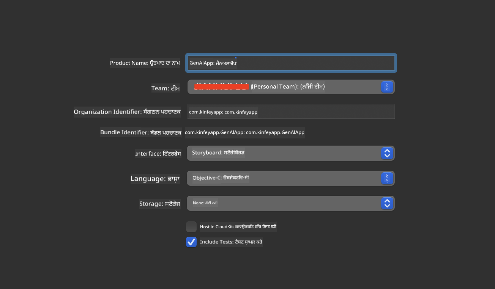
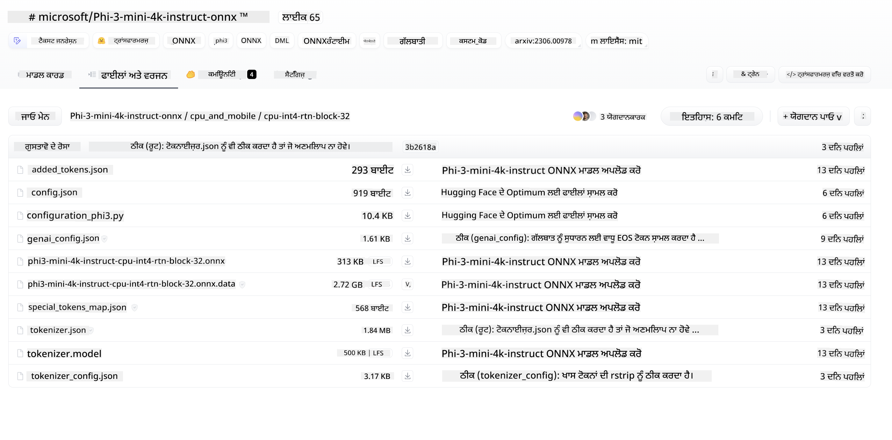
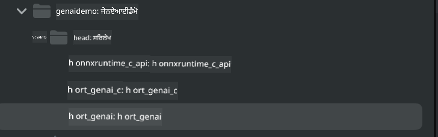

<!--
CO_OP_TRANSLATOR_METADATA:
{
  "original_hash": "82af197df38d25346a98f1f0e84d1698",
  "translation_date": "2025-07-16T20:20:23+00:00",
  "source_file": "md/01.Introduction/03/iOS_Inference.md",
  "language_code": "pa"
}
-->
# **iOS ਵਿੱਚ Inference Phi-3**

Phi-3-mini ਮਾਈਕ੍ਰੋਸਾਫਟ ਦੀ ਇੱਕ ਨਵੀਂ ਮਾਡਲ ਸੀਰੀਜ਼ ਹੈ ਜੋ ਐਜ ਡਿਵਾਈਸਾਂ ਅਤੇ IoT ਡਿਵਾਈਸਾਂ 'ਤੇ ਵੱਡੇ ਭਾਸ਼ਾ ਮਾਡਲਾਂ (LLMs) ਨੂੰ ਡਿਪਲੋਇ ਕਰਨ ਦੀ ਸਹੂਲਤ ਦਿੰਦੀ ਹੈ। Phi-3-mini iOS, Android ਅਤੇ Edge Device ਡਿਪਲੋਇਮੈਂਟ ਲਈ ਉਪਲਬਧ ਹੈ, ਜਿਸ ਨਾਲ BYOD ਵਾਤਾਵਰਣ ਵਿੱਚ ਜਨਰੇਟਿਵ AI ਨੂੰ ਡਿਪਲੋਇ ਕੀਤਾ ਜਾ ਸਕਦਾ ਹੈ। ਹੇਠਾਂ ਦਿੱਤਾ ਉਦਾਹਰਨ ਦਿਖਾਉਂਦਾ ਹੈ ਕਿ iOS 'ਤੇ Phi-3-mini ਨੂੰ ਕਿਵੇਂ ਡਿਪਲੋਇ ਕਰਨਾ ਹੈ।

## **1. ਤਿਆਰੀ**

- **a.** macOS 14+
- **b.** Xcode 15+
- **c.** iOS SDK 17.x (iPhone 14 A16 ਜਾਂ ਵੱਧ)
- **d.** Python 3.10+ ਇੰਸਟਾਲ ਕਰੋ (Conda ਦੀ ਸਿਫਾਰਸ਼ ਕੀਤੀ ਜਾਂਦੀ ਹੈ)
- **e.** Python ਲਾਇਬ੍ਰੇਰੀ ਇੰਸਟਾਲ ਕਰੋ: `python-flatbuffers`
- **f.** CMake ਇੰਸਟਾਲ ਕਰੋ

### Semantic Kernel ਅਤੇ Inference

Semantic Kernel ਇੱਕ ਐਪਲੀਕੇਸ਼ਨ ਫਰੇਮਵਰਕ ਹੈ ਜੋ ਤੁਹਾਨੂੰ Azure OpenAI Service, OpenAI ਮਾਡਲਾਂ ਅਤੇ ਸਥਾਨਕ ਮਾਡਲਾਂ ਨਾਲ ਕੰਪੈਟਿਬਲ ਐਪ ਬਣਾਉਣ ਦੀ ਆਗਿਆ ਦਿੰਦਾ ਹੈ। Semantic Kernel ਰਾਹੀਂ ਸਥਾਨਕ ਸਰਵਿਸਾਂ ਤੱਕ ਪਹੁੰਚ ਤੁਹਾਡੇ ਆਪਣੇ Phi-3-mini ਮਾਡਲ ਸਰਵਰ ਨਾਲ ਆਸਾਨ ਇੰਟੀਗ੍ਰੇਸ਼ਨ ਨੂੰ ਯਕੀਨੀ ਬਣਾਉਂਦੀ ਹੈ।

### Ollama ਜਾਂ LlamaEdge ਨਾਲ Quantized ਮਾਡਲਾਂ ਨੂੰ ਕਾਲ ਕਰਨਾ

ਕਈ ਯੂਜ਼ਰ ਮਾਡਲਾਂ ਨੂੰ ਸਥਾਨਕ ਤੌਰ 'ਤੇ ਚਲਾਉਣ ਲਈ quantized ਮਾਡਲਾਂ ਦੀ ਵਰਤੋਂ ਕਰਨਾ ਪਸੰਦ ਕਰਦੇ ਹਨ। [Ollama](https://ollama.com) ਅਤੇ [LlamaEdge](https://llamaedge.com) ਯੂਜ਼ਰਾਂ ਨੂੰ ਵੱਖ-ਵੱਖ quantized ਮਾਡਲਾਂ ਨੂੰ ਕਾਲ ਕਰਨ ਦੀ ਆਗਿਆ ਦਿੰਦੇ ਹਨ:

#### **Ollama**

ਤੁਸੀਂ `ollama run phi3` ਨੂੰ ਸਿੱਧਾ ਚਲਾ ਸਕਦੇ ਹੋ ਜਾਂ ਇਸਨੂੰ ਆਫਲਾਈਨ ਕਨਫਿਗਰ ਕਰ ਸਕਦੇ ਹੋ। ਆਪਣੇ `gguf` ਫਾਇਲ ਦੇ ਪਾਥ ਨਾਲ ਇੱਕ Modelfile ਬਣਾਓ। Phi-3-mini quantized ਮਾਡਲ ਚਲਾਉਣ ਲਈ ਨਮੂਨਾ ਕੋਡ:

```gguf
FROM {Add your gguf file path}
TEMPLATE \"\"\"<|user|> .Prompt<|end|> <|assistant|>\"\"\"
PARAMETER stop <|end|>
PARAMETER num_ctx 4096
```

#### **LlamaEdge**

ਜੇ ਤੁਸੀਂ `gguf` ਨੂੰ ਕਲਾਉਡ ਅਤੇ ਐਜ ਡਿਵਾਈਸਾਂ ਦੋਹਾਂ 'ਤੇ ਇਕੱਠੇ ਵਰਤਣਾ ਚਾਹੁੰਦੇ ਹੋ, ਤਾਂ LlamaEdge ਇੱਕ ਵਧੀਆ ਵਿਕਲਪ ਹੈ।

## **2. iOS ਲਈ ONNX Runtime ਕੰਪਾਈਲ ਕਰਨਾ**

```bash

git clone https://github.com/microsoft/onnxruntime.git

cd onnxruntime

./build.sh --build_shared_lib --ios --skip_tests --parallel --build_dir ./build_ios --ios --apple_sysroot iphoneos --osx_arch arm64 --apple_deploy_target 17.5 --cmake_generator Xcode --config Release

cd ../

```

### **ਨੋਟਿਸ**

- **a.** ਕੰਪਾਈਲ ਕਰਨ ਤੋਂ ਪਹਿਲਾਂ, ਯਕੀਨੀ ਬਣਾਓ ਕਿ Xcode ਠੀਕ ਤਰ੍ਹਾਂ ਕਨਫਿਗਰ ਹੈ ਅਤੇ ਟਰਮੀਨਲ ਵਿੱਚ ਇਸਨੂੰ ਐਕਟਿਵ ਡਿਵੈਲਪਰ ਡਾਇਰੈਕਟਰੀ ਵਜੋਂ ਸੈੱਟ ਕਰੋ:

    ```bash
    sudo xcode-select -switch /Applications/Xcode.app/Contents/Developer
    ```

- **b.** ONNX Runtime ਨੂੰ ਵੱਖ-ਵੱਖ ਪਲੇਟਫਾਰਮਾਂ ਲਈ ਕੰਪਾਈਲ ਕਰਨ ਦੀ ਲੋੜ ਹੁੰਦੀ ਹੈ। iOS ਲਈ, ਤੁਸੀਂ `arm64` ਜਾਂ `x86_64` ਲਈ ਕੰਪਾਈਲ ਕਰ ਸਕਦੇ ਹੋ।

- **c.** ਕੰਪਾਈਲ ਕਰਨ ਲਈ ਨਵਾਂ iOS SDK ਵਰਤਣਾ ਸਿਫਾਰਸ਼ੀ ਹੈ। ਪਰ ਜੇ ਤੁਹਾਨੂੰ ਪਿਛਲੇ SDKs ਨਾਲ ਕੰਪੈਟਿਬਿਲਟੀ ਚਾਹੀਦੀ ਹੈ ਤਾਂ ਤੁਸੀਂ ਪੁਰਾਣਾ ਵਰਜਨ ਵੀ ਵਰਤ ਸਕਦੇ ਹੋ।

## **3. iOS ਲਈ ONNX Runtime ਨਾਲ Generative AI ਕੰਪਾਈਲ ਕਰਨਾ**

> **Note:** ONNX Runtime ਨਾਲ Generative AI ਹਾਲੇ ਪ੍ਰੀਵਿਊ ਵਿੱਚ ਹੈ, ਇਸ ਲਈ ਸੰਭਾਵਿਤ ਬਦਲਾਵਾਂ ਦਾ ਧਿਆਨ ਰੱਖੋ।

```bash

git clone https://github.com/microsoft/onnxruntime-genai
 
cd onnxruntime-genai
 
mkdir ort
 
cd ort
 
mkdir include
 
mkdir lib
 
cd ../
 
cp ../onnxruntime/include/onnxruntime/core/session/onnxruntime_c_api.h ort/include
 
cp ../onnxruntime/build_ios/Release/Release-iphoneos/libonnxruntime*.dylib* ort/lib
 
export OPENCV_SKIP_XCODEBUILD_FORCE_TRYCOMPILE_DEBUG=1
 
python3 build.py --parallel --build_dir ./build_ios --ios --ios_sysroot iphoneos --ios_arch arm64 --ios_deployment_target 17.5 --cmake_generator Xcode --cmake_extra_defines CMAKE_XCODE_ATTRIBUTE_CODE_SIGNING_ALLOWED=NO

```

## **4. Xcode ਵਿੱਚ ਇੱਕ App ਐਪਲੀਕੇਸ਼ਨ ਬਣਾਉਣਾ**

ਮੈਂ App ਵਿਕਾਸ ਲਈ Objective-C ਚੁਣਿਆ, ਕਿਉਂਕਿ ONNX Runtime C++ API ਨਾਲ Generative AI ਵਰਤਣ ਲਈ Objective-C ਵਧੀਆ ਕੰਪੈਟਿਬਲ ਹੈ। ਬੇਸ਼ੱਕ, ਤੁਸੀਂ Swift ਬ੍ਰਿਜਿੰਗ ਰਾਹੀਂ ਵੀ ਸੰਬੰਧਿਤ ਕਾਲਾਂ ਪੂਰੀਆਂ ਕਰ ਸਕਦੇ ਹੋ।



## **5. ONNX quantized INT4 ਮਾਡਲ ਨੂੰ App ਐਪਲੀਕੇਸ਼ਨ ਪ੍ਰੋਜੈਕਟ ਵਿੱਚ ਕਾਪੀ ਕਰੋ**

ਸਾਨੂੰ ONNX ਫਾਰਮੈਟ ਵਿੱਚ INT4 quantization ਮਾਡਲ ਇੰਪੋਰਟ ਕਰਨਾ ਹੈ, ਜਿਸਨੂੰ ਪਹਿਲਾਂ ਡਾਊਨਲੋਡ ਕਰਨਾ ਲਾਜ਼ਮੀ ਹੈ।



ਡਾਊਨਲੋਡ ਕਰਨ ਤੋਂ ਬਾਅਦ, ਇਸਨੂੰ Xcode ਵਿੱਚ ਪ੍ਰੋਜੈਕਟ ਦੇ Resources ਡਾਇਰੈਕਟਰੀ ਵਿੱਚ ਸ਼ਾਮਲ ਕਰੋ।


## **6. ViewControllers ਵਿੱਚ C++ API ਸ਼ਾਮਲ ਕਰਨਾ**

> **ਨੋਟਿਸ:**

- **a.** ਪ੍ਰੋਜੈਕਟ ਵਿੱਚ ਸੰਬੰਧਿਤ C++ ਹੈਡਰ ਫਾਇਲਾਂ ਸ਼ਾਮਲ ਕਰੋ।

  

- **b.** Xcode ਵਿੱਚ `onnxruntime-genai` ਡਾਇਨਾਮਿਕ ਲਾਇਬ੍ਰੇਰੀ ਸ਼ਾਮਲ ਕਰੋ।

  

- **c.** ਟੈਸਟਿੰਗ ਲਈ C ਸੈਂਪਲ ਕੋਡ ਵਰਤੋਂ। ਤੁਸੀਂ ਹੋਰ ਫੀਚਰਾਂ ਜਿਵੇਂ ChatUI ਵੀ ਸ਼ਾਮਲ ਕਰ ਸਕਦੇ ਹੋ।

- **d.** ਕਿਉਂਕਿ ਤੁਹਾਨੂੰ ਪ੍ਰੋਜੈਕਟ ਵਿੱਚ C++ ਵਰਤਣਾ ਹੈ, ਇਸ ਲਈ `ViewController.m` ਦਾ ਨਾਮ ਬਦਲ ਕੇ `ViewController.mm` ਕਰੋ ਤਾਂ ਜੋ Objective-C++ ਸਹਾਇਤਾ ਮਿਲੇ।

```objc

    NSString *llmPath = [[NSBundle mainBundle] resourcePath];
    char const *modelPath = llmPath.cString;

    auto model =  OgaModel::Create(modelPath);

    auto tokenizer = OgaTokenizer::Create(*model);

    const char* prompt = "<|system|>You are a helpful AI assistant.<|end|><|user|>Can you introduce yourself?<|end|><|assistant|>";

    auto sequences = OgaSequences::Create();
    tokenizer->Encode(prompt, *sequences);

    auto params = OgaGeneratorParams::Create(*model);
    params->SetSearchOption("max_length", 100);
    params->SetInputSequences(*sequences);

    auto output_sequences = model->Generate(*params);
    const auto output_sequence_length = output_sequences->SequenceCount(0);
    const auto* output_sequence_data = output_sequences->SequenceData(0);
    auto out_string = tokenizer->Decode(output_sequence_data, output_sequence_length);
    
    auto tmp = out_string;

```

## **7. ਐਪਲੀਕੇਸ਼ਨ ਚਲਾਉਣਾ**

ਸੈਟਅੱਪ ਮੁਕੰਮਲ ਹੋਣ ਤੋਂ ਬਾਅਦ, ਤੁਸੀਂ ਐਪਲੀਕੇਸ਼ਨ ਚਲਾ ਕੇ Phi-3-mini ਮਾਡਲ ਇਨਫਰੈਂਸ ਦੇ ਨਤੀਜੇ ਵੇਖ ਸਕਦੇ ਹੋ।


ਹੋਰ ਨਮੂਨਾ ਕੋਡ ਅਤੇ ਵਿਸਥਾਰਪੂਰਕ ਹਦਾਇਤਾਂ ਲਈ, [Phi-3 Mini Samples repository](https://github.com/Azure-Samples/Phi-3MiniSamples/tree/main/ios) 'ਤੇ ਜਾਓ।

**ਅਸਵੀਕਾਰੋਪੱਤਰ**:  
ਇਹ ਦਸਤਾਵੇਜ਼ AI ਅਨੁਵਾਦ ਸੇਵਾ [Co-op Translator](https://github.com/Azure/co-op-translator) ਦੀ ਵਰਤੋਂ ਕਰਕੇ ਅਨੁਵਾਦਿਤ ਕੀਤਾ ਗਿਆ ਹੈ। ਜਦੋਂ ਕਿ ਅਸੀਂ ਸਹੀਤਾ ਲਈ ਕੋਸ਼ਿਸ਼ ਕਰਦੇ ਹਾਂ, ਕਿਰਪਾ ਕਰਕੇ ਧਿਆਨ ਰੱਖੋ ਕਿ ਸਵੈਚਾਲਿਤ ਅਨੁਵਾਦਾਂ ਵਿੱਚ ਗਲਤੀਆਂ ਜਾਂ ਅਸਮਰਥਤਾਵਾਂ ਹੋ ਸਕਦੀਆਂ ਹਨ। ਮੂਲ ਦਸਤਾਵੇਜ਼ ਆਪਣੀ ਮੂਲ ਭਾਸ਼ਾ ਵਿੱਚ ਪ੍ਰਮਾਣਿਕ ਸਰੋਤ ਮੰਨਿਆ ਜਾਣਾ ਚਾਹੀਦਾ ਹੈ। ਮਹੱਤਵਪੂਰਨ ਜਾਣਕਾਰੀ ਲਈ, ਪੇਸ਼ੇਵਰ ਮਨੁੱਖੀ ਅਨੁਵਾਦ ਦੀ ਸਿਫਾਰਸ਼ ਕੀਤੀ ਜਾਂਦੀ ਹੈ। ਇਸ ਅਨੁਵਾਦ ਦੀ ਵਰਤੋਂ ਤੋਂ ਉਤਪੰਨ ਕਿਸੇ ਵੀ ਗਲਤਫਹਿਮੀ ਜਾਂ ਗਲਤ ਵਿਆਖਿਆ ਲਈ ਅਸੀਂ ਜ਼ਿੰਮੇਵਾਰ ਨਹੀਂ ਹਾਂ।