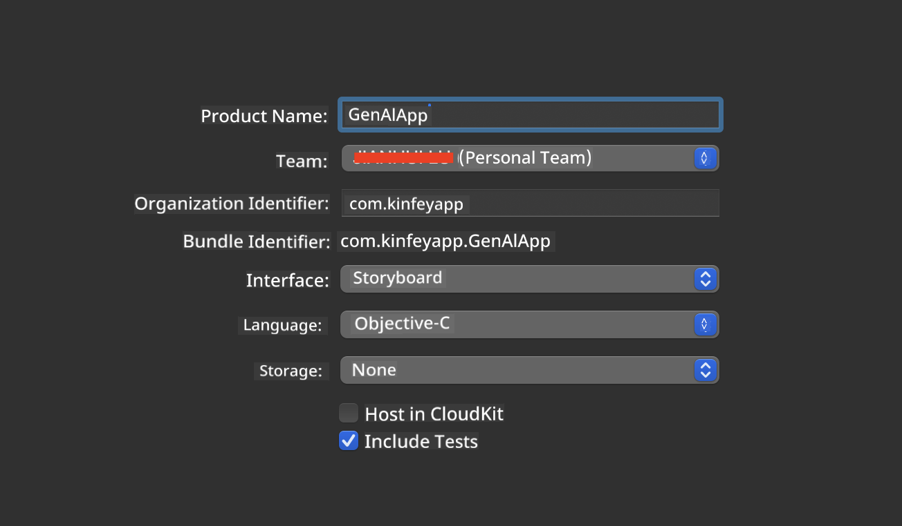
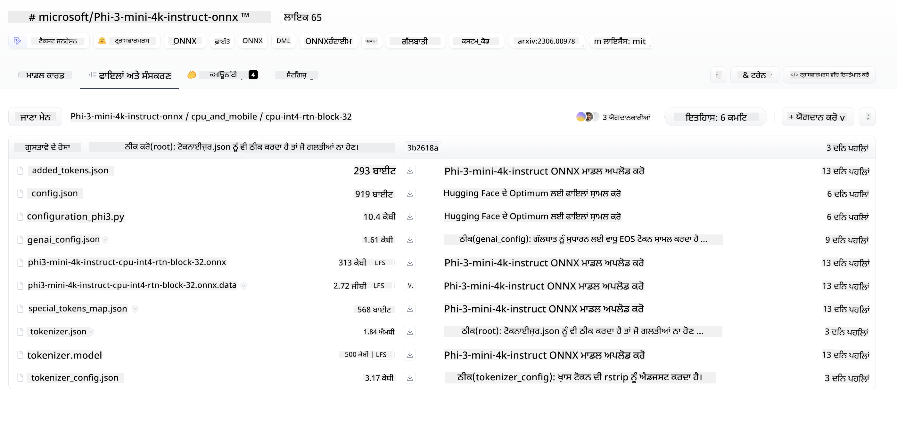
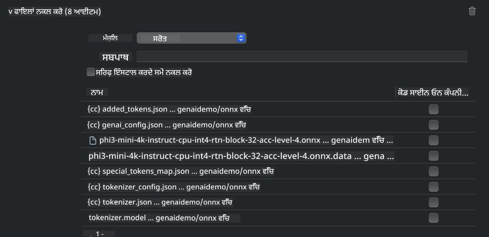
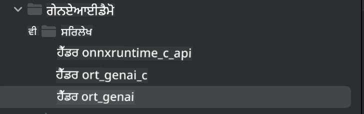
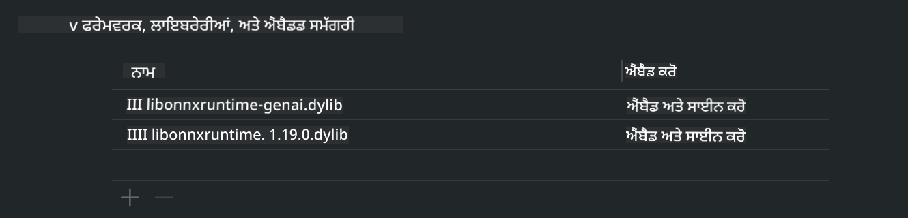
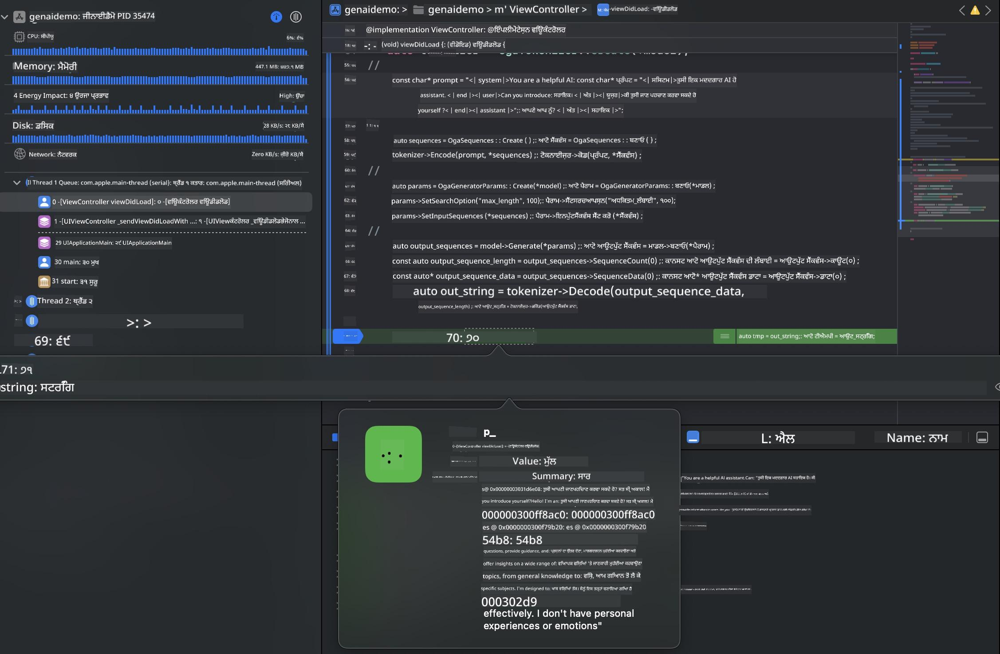

<!--
CO_OP_TRANSLATOR_METADATA:
{
  "original_hash": "82af197df38d25346a98f1f0e84d1698",
  "translation_date": "2025-05-09T10:55:08+00:00",
  "source_file": "md/01.Introduction/03/iOS_Inference.md",
  "language_code": "pa"
}
-->
# **iOS ਵਿੱਚ Inference Phi-3**

Phi-3-mini Microsoft ਦੀ ਇੱਕ ਨਵੀਂ ਮਾਡਲ ਸੀਰੀਜ਼ ਹੈ ਜੋ Edge ਡਿਵਾਈਸਾਂ ਅਤੇ IoT ਡਿਵਾਈਸਾਂ 'ਤੇ Large Language Models (LLMs) ਨੂੰ ਡਿਪਲੋਇ ਕਰਨ ਦੀ ਸਹੂਲਤ ਦਿੰਦੀ ਹੈ। Phi-3-mini iOS, Android ਅਤੇ Edge Device ਡਿਪਲੋਇਮੈਂਟ ਲਈ ਉਪਲਬਧ ਹੈ, ਜਿਸ ਨਾਲ generative AI ਨੂੰ BYOD ਮਾਹੌਲ ਵਿੱਚ ਡਿਪਲੋਇ ਕੀਤਾ ਜਾ ਸਕਦਾ ਹੈ। ਹੇਠਾਂ ਦਿੱਤਾ ਉਦਾਹਰਨ ਦਿਖਾਉਂਦਾ ਹੈ ਕਿ iOS 'ਤੇ Phi-3-mini ਨੂੰ ਕਿਵੇਂ ਡਿਪਲੋਇ ਕਰਨਾ ਹੈ।

## **1. ਤਿਆਰੀ**

- **a.** macOS 14+
- **b.** Xcode 15+
- **c.** iOS SDK 17.x (iPhone 14 A16 ਜਾਂ ਇਸ ਤੋਂ ਵੱਧ)
- **d.** Python 3.10+ ਇੰਸਟਾਲ ਕਰੋ (Conda ਦੀ ਸਿਫਾਰਿਸ਼ ਕੀਤੀ ਜਾਂਦੀ ਹੈ)
- **e.** Python ਲਾਇਬ੍ਰੇਰੀ ਇੰਸਟਾਲ ਕਰੋ: `python-flatbuffers`
- **f.** CMake ਇੰਸਟਾਲ ਕਰੋ

### Semantic Kernel ਅਤੇ Inference

Semantic Kernel ਇੱਕ ਐਪਲੀਕੇਸ਼ਨ ਫਰੇਮਵਰਕ ਹੈ ਜੋ ਤੁਹਾਨੂੰ Azure OpenAI Service, OpenAI ਮਾਡਲਾਂ ਅਤੇ ਲੋਕਲ ਮਾਡਲਾਂ ਨਾਲ ਕੰਮ ਕਰਨ ਵਾਲੀਆਂ ਐਪਲੀਕੇਸ਼ਨਾਂ ਬਣਾਉਣ ਦੀ ਆਗਿਆ ਦਿੰਦਾ ਹੈ। Semantic Kernel ਰਾਹੀਂ ਲੋਕਲ ਸਰਵਿਸਜ਼ ਤੱਕ ਪਹੁੰਚ ਕਰਕੇ ਤੁਸੀਂ ਆਪਣੇ ਖੁਦ ਦੇ Phi-3-mini ਮਾਡਲ ਸਰਵਰ ਨਾਲ ਆਸਾਨੀ ਨਾਲ ਇੰਟਿਗ੍ਰੇਟ ਕਰ ਸਕਦੇ ਹੋ।

### Ollama ਜਾਂ LlamaEdge ਨਾਲ Quantized ਮਾਡਲਾਂ ਨੂੰ ਕਾਲ ਕਰਨਾ

ਕਈ ਯੂਜ਼ਰ ਮਾਡਲਾਂ ਨੂੰ ਲੋਕਲ ਰੂਪ ਵਿੱਚ ਚਲਾਉਣ ਲਈ quantized ਮਾਡਲਾਂ ਨੂੰ ਪ੍ਰਾਥਮਿਕਤਾ ਦਿੰਦੇ ਹਨ। [Ollama](https://ollama.com) ਅਤੇ [LlamaEdge](https://llamaedge.com) ਯੂਜ਼ਰਾਂ ਨੂੰ ਵੱਖ-ਵੱਖ quantized ਮਾਡਲਾਂ ਨੂੰ ਕਾਲ ਕਰਨ ਦੀ ਆਗਿਆ ਦਿੰਦੇ ਹਨ:

#### **Ollama**

ਤੁਸੀਂ `ollama run phi3` ਨੂੰ ਸਿੱਧਾ ਚਲਾ ਸਕਦੇ ਹੋ ਜਾਂ ਇਸਨੂੰ ਆਫਲਾਈਨ ਕਨਫਿਗਰ ਕਰ ਸਕਦੇ ਹੋ। ਆਪਣੇ `gguf` ਫਾਇਲ ਦਾ ਪਾਥ ਰੱਖ ਕੇ ਇੱਕ Modelfile ਬਣਾਓ। Phi-3-mini quantized ਮਾਡਲ ਚਲਾਉਣ ਲਈ ਨਮੂਨਾ ਕੋਡ:

```gguf
FROM {Add your gguf file path}
TEMPLATE \"\"\"<|user|> .Prompt<|end|> <|assistant|>\"\"\"
PARAMETER stop <|end|>
PARAMETER num_ctx 4096
```

#### **LlamaEdge**

ਜੇ ਤੁਸੀਂ ਇੱਕੋ ਸਮੇਂ ਕਲਾਉਡ ਅਤੇ edge ਡਿਵਾਈਸਾਂ 'ਤੇ `gguf` ਵਰਤਣਾ ਚਾਹੁੰਦੇ ਹੋ, ਤਾਂ LlamaEdge ਇੱਕ ਵਧੀਆ ਵਿਕਲਪ ਹੈ।

## **2. iOS ਲਈ ONNX Runtime ਕੰਪਾਇਲ ਕਰਨਾ**

```bash

git clone https://github.com/microsoft/onnxruntime.git

cd onnxruntime

./build.sh --build_shared_lib --ios --skip_tests --parallel --build_dir ./build_ios --ios --apple_sysroot iphoneos --osx_arch arm64 --apple_deploy_target 17.5 --cmake_generator Xcode --config Release

cd ../

```

### **ਨੋਟਿਸ**

- **a.** ਕੰਪਾਇਲ ਕਰਨ ਤੋਂ ਪਹਿਲਾਂ ਯਕੀਨੀ ਬਣਾਓ ਕਿ Xcode ਠੀਕ ਤਰ੍ਹਾਂ ਕਨਫਿਗਰ ਕੀਤਾ ਗਿਆ ਹੈ ਅਤੇ ਟਰਮੀਨਲ ਵਿੱਚ ਇਸਨੂੰ ਐਕਟਿਵ ਡਿਵੈਲਪਰ ਡਾਇਰੈਕਟਰੀ ਵਜੋਂ ਸੈੱਟ ਕੀਤਾ ਗਿਆ ਹੈ:

    ```bash
    sudo xcode-select -switch /Applications/Xcode.app/Contents/Developer
    ```

- **b.** ONNX Runtime ਨੂੰ ਵੱਖ-ਵੱਖ ਪਲੇਟਫਾਰਮਾਂ ਲਈ ਕੰਪਾਇਲ ਕਰਨ ਦੀ ਲੋੜ ਹੁੰਦੀ ਹੈ। iOS ਲਈ, ਤੁਸੀਂ `arm64` or `x86_64` ਲਈ ਕੰਪਾਇਲ ਕਰ ਸਕਦੇ ਹੋ।

- **c.** ਕੰਪਾਇਲ ਕਰਨ ਲਈ ਨਵਾਂ iOS SDK ਵਰਤਣਾ ਸਿਫਾਰਿਸ਼ ਕੀਤੀ ਜਾਂਦੀ ਹੈ, ਪਰ ਜੇ ਪਿਛਲੇ SDKs ਨਾਲ ਕੰਪੈਟਬਿਲਿਟੀ ਦੀ ਲੋੜ ਹੋਵੇ ਤਾਂ ਤੁਸੀਂ ਪੁਰਾਣਾ ਵਰਜਨ ਵੀ ਵਰਤ ਸਕਦੇ ਹੋ।

## **3. iOS ਲਈ ONNX Runtime ਨਾਲ Generative AI ਕੰਪਾਇਲ ਕਰਨਾ**

> **Note:** ONNX Runtime ਨਾਲ Generative AI ਅਜੇ ਪ੍ਰੀਵਿਊ ਵਿੱਚ ਹੈ, ਇਸ ਲਈ ਸੰਭਵ ਤਬਦੀਲੀਆਂ ਦਾ ਧਿਆਨ ਰੱਖੋ।

```bash

git clone https://github.com/microsoft/onnxruntime-genai
 
cd onnxruntime-genai
 
mkdir ort
 
cd ort
 
mkdir include
 
mkdir lib
 
cd ../
 
cp ../onnxruntime/include/onnxruntime/core/session/onnxruntime_c_api.h ort/include
 
cp ../onnxruntime/build_ios/Release/Release-iphoneos/libonnxruntime*.dylib* ort/lib
 
export OPENCV_SKIP_XCODEBUILD_FORCE_TRYCOMPILE_DEBUG=1
 
python3 build.py --parallel --build_dir ./build_ios --ios --ios_sysroot iphoneos --ios_arch arm64 --ios_deployment_target 17.5 --cmake_generator Xcode --cmake_extra_defines CMAKE_XCODE_ATTRIBUTE_CODE_SIGNING_ALLOWED=NO

```

## **4. Xcode ਵਿੱਚ ਇੱਕ App ਐਪਲੀਕੇਸ਼ਨ ਬਣਾਉਣਾ**

ਮੈਂ App ਵਿਕਾਸ ਲਈ Objective-C ਚੁਣਿਆ, ਕਿਉਂਕਿ ONNX Runtime C++ API ਨਾਲ Generative AI ਵਰਤਦੇ ਸਮੇਂ Objective-C ਬਿਹਤਰ ਕੰਪੈਟਬਿਲਿਟੀ ਦਿੰਦਾ ਹੈ। ਬਿਲਕੁਲ, ਤੁਸੀਂ Swift bridging ਰਾਹੀਂ ਵੀ ਸੰਬੰਧਤ ਕਾਲਾਂ ਕਰ ਸਕਦੇ ਹੋ।



## **5. ONNX quantized INT4 ਮਾਡਲ ਨੂੰ App ਪ੍ਰੋਜੈਕਟ ਵਿੱਚ ਕਾਪੀ ਕਰੋ**

ਸਾਨੂੰ ONNX ਫਾਰਮੈਟ ਵਿੱਚ INT4 quantization ਮਾਡਲ ਨੂੰ ਇੰਪੋਰਟ ਕਰਨ ਦੀ ਲੋੜ ਹੈ, ਜੋ ਪਹਿਲਾਂ ਡਾਊਨਲੋਡ ਕਰਨਾ ਪੈਂਦਾ ਹੈ।



ਡਾਊਨਲੋਡ ਕਰਨ ਤੋਂ ਬਾਅਦ, ਇਸਨੂੰ Xcode ਵਿੱਚ ਪ੍ਰੋਜੈਕਟ ਦੇ Resources ਡਾਇਰੈਕਟਰੀ ਵਿੱਚ ਜੋੜੋ।



## **6. ViewControllers ਵਿੱਚ C++ API ਸ਼ਾਮਲ ਕਰਨਾ**

> **ਨੋਟਿਸ:**

- **a.** ਪ੍ਰੋਜੈਕਟ ਵਿੱਚ ਸੰਬੰਧਿਤ C++ ਹੈਡਰ ਫਾਇਲਾਂ ਸ਼ਾਮਲ ਕਰੋ।

  

- **b.** Objective-C++ ਸਹਾਇਤਾ ਲਈ `onnxruntime-genai` dynamic library in Xcode.

  

- **c.** Use the C Samples code for testing. You can also add additional features like ChatUI for more functionality.

- **d.** Since you need to use C++ in your project, rename `ViewController.m` to `ViewController.mm` ਨੂੰ ਸ਼ਾਮਲ ਕਰੋ।

```objc

    NSString *llmPath = [[NSBundle mainBundle] resourcePath];
    char const *modelPath = llmPath.cString;

    auto model =  OgaModel::Create(modelPath);

    auto tokenizer = OgaTokenizer::Create(*model);

    const char* prompt = "<|system|>You are a helpful AI assistant.<|end|><|user|>Can you introduce yourself?<|end|><|assistant|>";

    auto sequences = OgaSequences::Create();
    tokenizer->Encode(prompt, *sequences);

    auto params = OgaGeneratorParams::Create(*model);
    params->SetSearchOption("max_length", 100);
    params->SetInputSequences(*sequences);

    auto output_sequences = model->Generate(*params);
    const auto output_sequence_length = output_sequences->SequenceCount(0);
    const auto* output_sequence_data = output_sequences->SequenceData(0);
    auto out_string = tokenizer->Decode(output_sequence_data, output_sequence_length);
    
    auto tmp = out_string;

```

## **7. ਐਪਲੀਕੇਸ਼ਨ ਚਲਾਉਣਾ**

ਸੈਟਅੱਪ ਮੁਕੰਮਲ ਹੋਣ ਤੋਂ ਬਾਅਦ, ਤੁਸੀਂ ਐਪਲੀਕੇਸ਼ਨ ਚਲਾ ਕੇ Phi-3-mini ਮਾਡਲ ਇੰਫਰੈਂਸ ਦੇ ਨਤੀਜੇ ਵੇਖ ਸਕਦੇ ਹੋ।



ਹੋਰ ਨਮੂਨਾ ਕੋਡ ਅਤੇ ਵਿਸਥਾਰਪੂਰਵਕ ਦਿਸ਼ਾ-ਨਿਰਦੇਸ਼ ਲਈ, [Phi-3 Mini Samples repository](https://github.com/Azure-Samples/Phi-3MiniSamples/tree/main/ios) 'ਤੇ ਜਾਓ।

**ਅਸਵੀਕਾਰੋਪੱਤਰ**:  
ਇਹ ਦਸਤਾਵੇਜ਼ AI ਅਨੁਵਾਦ ਸੇਵਾ [Co-op Translator](https://github.com/Azure/co-op-translator) ਦੀ ਵਰਤੋਂ ਕਰਕੇ ਅਨੁਵਾਦਿਤ ਕੀਤਾ ਗਿਆ ਹੈ। ਜਦੋਂ ਕਿ ਅਸੀਂ ਸਹੀਅਤ ਲਈ ਕੋਸ਼ਿਸ਼ ਕਰਦੇ ਹਾਂ, ਕਿਰਪਾ ਕਰਕੇ ਧਿਆਨ ਵਿੱਚ ਰੱਖੋ ਕਿ ਸਵੈਚਾਲਿਤ ਅਨੁਵਾਦਾਂ ਵਿੱਚ ਗਲਤੀਆਂ ਜਾਂ ਅਸਮਰਥਤਾਵਾਂ ਹੋ ਸਕਦੀਆਂ ਹਨ। ਮੂਲ ਦਸਤਾਵੇਜ਼ ਆਪਣੀ ਮੂਲ ਭਾਸ਼ਾ ਵਿੱਚ ਹੀ ਅਧਿਕਾਰਕ ਸਰੋਤ ਮੰਨਿਆ ਜਾਣਾ ਚਾਹੀਦਾ ਹੈ। ਮਹੱਤਵਪੂਰਨ ਜਾਣਕਾਰੀ ਲਈ, ਪੇਸ਼ੇਵਰ ਮਨੁੱਖੀ ਅਨੁਵਾਦ ਦੀ ਸਿਫਾਰਿਸ਼ ਕੀਤੀ ਜਾਂਦੀ ਹੈ। ਅਸੀਂ ਇਸ ਅਨੁਵਾਦ ਦੀ ਵਰਤੋਂ ਤੋਂ ਪੈਦਾ ਹੋਣ ਵਾਲੀਆਂ ਕਿਸੇ ਵੀ ਗਲਤਫਹਮੀਆਂ ਜਾਂ ਗਲਤ ਵਿਆਖਿਆਵਾਂ ਲਈ ਜ਼ਿੰਮੇਵਾਰ ਨਹੀਂ ਹਾਂ।