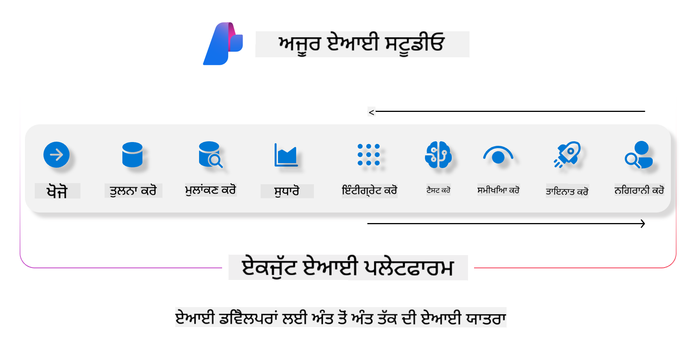
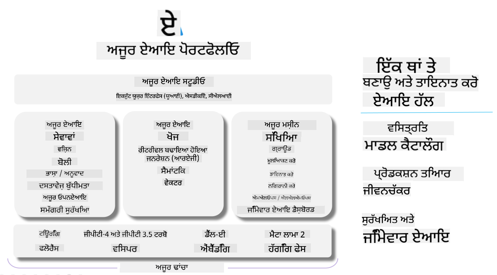

<!--
CO_OP_TRANSLATOR_METADATA:
{
  "original_hash": "7b4235159486df4000e16b7b46ddfec3",
  "translation_date": "2025-05-09T14:54:57+00:00",
  "source_file": "md/01.Introduction/05/AIFoundry.md",
  "language_code": "pa"
}
-->
# **Azure AI Foundry ਨਾਲ ਮੁਲਾਂਕਣ ਕਰਨਾ**

ਤੁਹਾਡੇ ਜਨਰੇਟਿਵ AI ਐਪਲੀਕੇਸ਼ਨ ਨੂੰ [Azure AI Foundry](https://ai.azure.com?WT.mc_id=aiml-138114-kinfeylo) ਦੀ ਵਰਤੋਂ ਕਰਕੇ ਕਿਵੇਂ ਮੁਲਾਂਕਣ ਕਰਨਾ ਹੈ। ਚਾਹੇ ਤੁਸੀਂ ਸਿੰਗਲ-ਟਰਨ ਜਾਂ ਮਲਟੀ-ਟਰਨ ਗੱਲਬਾਤਾਂ ਦਾ ਮੁਲਾਂਕਣ ਕਰ ਰਹੇ ਹੋ, Azure AI Foundry ਮਾਡਲ ਦੀ ਕਾਰਗੁਜ਼ਾਰੀ ਅਤੇ ਸੁਰੱਖਿਆ ਦੀ ਜਾਂਚ ਲਈ ਸੰਦ ਪ੍ਰਦਾਨ ਕਰਦਾ ਹੈ।

## Azure AI Foundry ਨਾਲ ਜਨਰੇਟਿਵ AI ਐਪਸ ਦਾ ਮੁਲਾਂਕਣ ਕਿਵੇਂ ਕਰੀਏ  
ਵਧੇਰੇ ਵੇਰਵਿਆਂ ਲਈ [Azure AI Foundry Documentation](https://learn.microsoft.com/azure/ai-studio/how-to/evaluate-generative-ai-app?WT.mc_id=aiml-138114-kinfeylo) ਵੇਖੋ।

ਸ਼ੁਰੂਆਤ ਕਰਨ ਲਈ ਇਹ ਕਦਮ ਹਨ:

## Azure AI Foundry ਵਿੱਚ ਜਨਰੇਟਿਵ AI ਮਾਡਲਾਂ ਦਾ ਮੁਲਾਂਕਣ

**ਲੋੜੀਂਦੇ ਚੀਜ਼ਾਂ**

- CSV ਜਾਂ JSON ਫਾਰਮੈਟ ਵਿੱਚ ਟੈਸਟ ਡੇਟਾਸੈੱਟ।
- ਇੱਕ ਜਨਰੇਟਿਵ AI ਮਾਡਲ ਜੋ ਡਿਪਲੋਇਡ ਹੋਇਆ ਹੋਵੇ (ਜਿਵੇਂ Phi-3, GPT 3.5, GPT 4, ਜਾਂ Davinci ਮਾਡਲ)।
- ਮੁਲਾਂਕਣ ਚਲਾਉਣ ਲਈ ਕੰਪਿਊਟ ਇੰਸਟੈਂਸ ਵਾਲਾ ਰਨਟਾਈਮ।

## ਬਿਲਟ-ਇਨ ਮੁਲਾਂਕਣ ਮੈਟਰਿਕਸ

Azure AI Foundry ਸਿੰਗਲ-ਟਰਨ ਅਤੇ ਜਟਿਲ ਮਲਟੀ-ਟਰਨ ਗੱਲਬਾਤਾਂ ਦੋਹਾਂ ਦਾ ਮੁਲਾਂਕਣ ਕਰਨ ਦੀ ਆਗਿਆ ਦਿੰਦਾ ਹੈ।  
Retrieval Augmented Generation (RAG) ਸਥਿਤੀਆਂ ਵਿੱਚ, ਜਿੱਥੇ ਮਾਡਲ ਖਾਸ ਡੇਟਾ 'ਤੇ ਆਧਾਰਿਤ ਹੁੰਦਾ ਹੈ, ਤੁਸੀਂ ਬਿਲਟ-ਇਨ ਮੁਲਾਂਕਣ ਮੈਟਰਿਕਸ ਦੀ ਵਰਤੋਂ ਕਰਕੇ ਕਾਰਗੁਜ਼ਾਰੀ ਦਾ ਅੰਕੜਾ ਲੈ ਸਕਦੇ ਹੋ।  
ਇਸ ਤੋਂ ਇਲਾਵਾ, ਤੁਸੀਂ ਆਮ ਸਿੰਗਲ-ਟਰਨ ਸਵਾਲ-ਜਵਾਬ ਸਥਿਤੀਆਂ (non-RAG) ਦਾ ਵੀ ਮੁਲਾਂਕਣ ਕਰ ਸਕਦੇ ਹੋ।

## ਮੁਲਾਂਕਣ ਰਨ ਬਣਾਉਣਾ

Azure AI Foundry UI ਵਿੱਚੋਂ, Evaluate ਪੇਜ਼ ਜਾਂ Prompt Flow ਪੇਜ਼ 'ਤੇ ਜਾਓ।  
ਮੁਲਾਂਕਣ ਬਣਾਉਣ ਵਾਲੇ ਵਿਜ਼ਾਰਡ ਦੀ ਪਾਲਣਾ ਕਰਦੇ ਹੋਏ ਮੁਲਾਂਕਣ ਰਨ ਸੈਟਅਪ ਕਰੋ। ਆਪਣੀ ਮੁਲਾਂਕਣ ਲਈ ਇਕ ਇਛਿਤ ਨਾਮ ਦਿਓ।  
ਉਸ ਸਥਿਤੀ ਨੂੰ ਚੁਣੋ ਜੋ ਤੁਹਾਡੇ ਐਪਲੀਕੇਸ਼ਨ ਦੇ ਉਦੇਸ਼ਾਂ ਨਾਲ ਮਿਲਦੀ ਹੋਵੇ।  
ਮਾਡਲ ਦੇ ਨਤੀਜਿਆਂ ਦਾ ਮੁਲਾਂਕਣ ਕਰਨ ਲਈ ਇੱਕ ਜਾਂ ਵੱਧ ਮੁਲਾਂਕਣ ਮੈਟਰਿਕਸ ਚੁਣੋ।

## ਕਸਟਮ ਮੁਲਾਂਕਣ ਪ੍ਰਕਿਰਿਆ (ਵਿਕਲਪਿਕ)

ਵੱਧ ਲਚਕੀਲਾਪਣ ਲਈ, ਤੁਸੀਂ ਆਪਣੀ ਖਾਸ ਜਰੂਰਤਾਂ ਦੇ ਅਨੁਸਾਰ ਕਸਟਮ ਮੁਲਾਂਕਣ ਪ੍ਰਕਿਰਿਆ ਤਿਆਰ ਕਰ ਸਕਦੇ ਹੋ।

## ਨਤੀਜੇ ਵੇਖਣਾ

ਮੁਲਾਂਕਣ ਚਲਾਉਣ ਤੋਂ ਬਾਅਦ, ਲੌਗ, ਵੇਖੋ ਅਤੇ Azure AI Foundry ਵਿੱਚ ਵਿਸਥਾਰ ਨਾਲ ਮੁਲਾਂਕਣ ਮੈਟਰਿਕਸ ਦਾ ਵਿਸ਼ਲੇਸ਼ਣ ਕਰੋ। ਆਪਣੇ ਐਪਲੀਕੇਸ਼ਨ ਦੀਆਂ ਸਮਰੱਥਾਵਾਂ ਅਤੇ ਸੀਮਾਵਾਂ ਬਾਰੇ ਜਾਣਕਾਰੀ ਪ੍ਰਾਪਤ ਕਰੋ।  

**Note** Azure AI Foundry ਇਸ ਵੇਲੇ ਪਬਲਿਕ ਪ੍ਰੀਵਿਊ ਵਿੱਚ ਹੈ, ਇਸ ਲਈ ਇਸਨੂੰ ਪ੍ਰਯੋਗ ਅਤੇ ਵਿਕਾਸ ਲਈ ਵਰਤੋਂ। ਪ੍ਰੋਡਕਸ਼ਨ ਵਰਕਲੋਡ ਲਈ ਹੋਰ ਵਿਕਲਪਾਂ ਬਾਰੇ ਸੋਚੋ। ਵਧੇਰੇ ਵੇਰਵੇ ਅਤੇ ਕਦਮ-ਦਰ-ਕਦਮ ਹਦਾਇਤਾਂ ਲਈ ਅਧਿਕਾਰਿਕ [AI Foundry documentation](https://learn.microsoft.com/azure/ai-studio/?WT.mc_id=aiml-138114-kinfeylo) ਨੂੰ ਵੇਖੋ।

**ਅਸਵੀਕਾਰੋਧ**:  
ਇਹ ਦਸਤਾਵੇਜ਼ AI ਅਨੁਵਾਦ ਸੇਵਾ [Co-op Translator](https://github.com/Azure/co-op-translator) ਦੀ ਵਰਤੋਂ ਕਰਕੇ ਅਨੁਵਾਦ ਕੀਤਾ ਗਿਆ ਹੈ। ਜਦੋਂ ਕਿ ਅਸੀਂ ਸਹੀਤਾ ਲਈ ਕੋਸ਼ਿਸ਼ ਕਰਦੇ ਹਾਂ, ਕਿਰਪਾ ਕਰਕੇ ਧਿਆਨ ਰੱਖੋ ਕਿ ਸਵੈਚਾਲਿਤ ਅਨੁਵਾਦਾਂ ਵਿੱਚ ਗਲਤੀਆਂ ਜਾਂ ਅਸਹੀਤਾਂ ਹੋ ਸਕਦੀਆਂ ਹਨ। ਮੂਲ ਦਸਤਾਵੇਜ਼ ਆਪਣੇ ਮੂਲ ਭਾਸ਼ਾ ਵਿੱਚ ਅਧਿਕਾਰਤ ਸਰੋਤ ਮੰਨਿਆ ਜਾਣਾ ਚਾਹੀਦਾ ਹੈ। ਮਹੱਤਵਪੂਰਨ ਜਾਣਕਾਰੀ ਲਈ, ਪੇਸ਼ੇਵਰ ਮਨੁੱਖੀ ਅਨੁਵਾਦ ਦੀ ਸਿਫਾਰਿਸ਼ ਕੀਤੀ ਜਾਂਦੀ ਹੈ। ਅਸੀਂ ਇਸ ਅਨੁਵਾਦ ਦੀ ਵਰਤੋਂ ਤੋਂ ਪੈਦਾ ਹੋਣ ਵਾਲੀਆਂ ਕਿਸੇ ਵੀ ਗਲਤਫਹਿਮੀਆਂ ਜਾਂ ਗਲਤ ਵਿਆਖਿਆਵਾਂ ਲਈ ਜ਼ਿੰਮੇਵਾਰ ਨਹੀਂ ਹਾਂ।