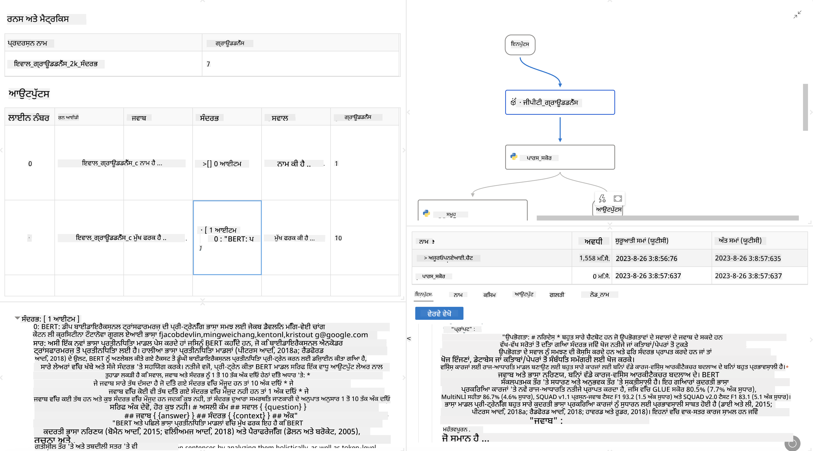

<!--
CO_OP_TRANSLATOR_METADATA:
{
  "original_hash": "3cbe7629d254f1043193b7fe22524d55",
  "translation_date": "2025-07-16T22:39:02+00:00",
  "source_file": "md/01.Introduction/05/Promptflow.md",
  "language_code": "pa"
}
-->
# **Promptflow ਦਾ ਪਰਚਯ**

[Microsoft Prompt Flow](https://microsoft.github.io/promptflow/index.html?WT.mc_id=aiml-138114-kinfeylo) ਇੱਕ ਵਿਜ਼ੂਅਲ ਵਰਕਫਲੋ ਆਟੋਮੇਸ਼ਨ ਟੂਲ ਹੈ ਜੋ ਉਪਭੋਗਤਾਵਾਂ ਨੂੰ ਪਹਿਲਾਂ ਤੋਂ ਬਣੇ ਟੈਮਪਲੇਟਾਂ ਅਤੇ ਕਸਟਮ ਕਨੈਕਟਰਾਂ ਦੀ ਵਰਤੋਂ ਕਰਕੇ ਆਟੋਮੇਟਿਕ ਵਰਕਫਲੋ ਬਣਾਉਣ ਦੀ ਆਗਿਆ ਦਿੰਦਾ ਹੈ। ਇਹ ਡਿਵੈਲਪਰਾਂ ਅਤੇ ਬਿਜ਼ਨਸ ਵਿਸ਼ਲੇਸ਼ਕਾਂ ਨੂੰ ਡਾਟਾ ਪ੍ਰਬੰਧਨ, ਸਹਿਯੋਗ ਅਤੇ ਪ੍ਰਕਿਰਿਆ ਸੁਧਾਰ ਵਰਗੇ ਕੰਮਾਂ ਲਈ ਤੇਜ਼ੀ ਨਾਲ ਆਟੋਮੇਟਿਕ ਪ੍ਰਕਿਰਿਆਵਾਂ ਬਣਾਉਣ ਲਈ ਤਿਆਰ ਕੀਤਾ ਗਿਆ ਹੈ। Prompt Flow ਨਾਲ, ਉਪਭੋਗਤਾ ਵੱਖ-ਵੱਖ ਸੇਵਾਵਾਂ, ਐਪਲੀਕੇਸ਼ਨਾਂ ਅਤੇ ਸਿਸਟਮਾਂ ਨੂੰ ਆਸਾਨੀ ਨਾਲ ਜੋੜ ਸਕਦੇ ਹਨ ਅਤੇ ਜਟਿਲ ਬਿਜ਼ਨਸ ਪ੍ਰਕਿਰਿਆਵਾਂ ਨੂੰ ਆਟੋਮੇਟ ਕਰ ਸਕਦੇ ਹਨ।

Microsoft Prompt Flow ਨੂੰ ਵੱਡੇ ਭਾਸ਼ਾ ਮਾਡਲਾਂ (LLMs) ਨਾਲ ਚਲਾਏ ਜਾਣ ਵਾਲੀਆਂ AI ਐਪਲੀਕੇਸ਼ਨਾਂ ਦੇ ਅੰਤ-ਤੱਕ ਵਿਕਾਸ ਚੱਕਰ ਨੂੰ ਸੁਗਮ ਬਣਾਉਣ ਲਈ ਡਿਜ਼ਾਈਨ ਕੀਤਾ ਗਿਆ ਹੈ। ਚਾਹੇ ਤੁਸੀਂ ਵਿਚਾਰ ਕਰ ਰਹੇ ਹੋ, ਪ੍ਰੋਟੋਟਾਈਪ ਬਣਾ ਰਹੇ ਹੋ, ਟੈਸਟ ਕਰ ਰਹੇ ਹੋ, ਮੁਲਾਂਕਣ ਕਰ ਰਹੇ ਹੋ ਜਾਂ LLM-ਅਧਾਰਿਤ ਐਪਲੀਕੇਸ਼ਨਾਂ ਨੂੰ ਡਿਪਲੋਇ ਕਰ ਰਹੇ ਹੋ, Prompt Flow ਪ੍ਰਕਿਰਿਆ ਨੂੰ ਸਧਾਰਨ ਬਣਾਉਂਦਾ ਹੈ ਅਤੇ ਤੁਹਾਨੂੰ ਉਤਪਾਦਨ ਗੁਣਵੱਤਾ ਵਾਲੀਆਂ LLM ਐਪਸ ਬਣਾਉਣ ਯੋਗ ਬਣਾਉਂਦਾ ਹੈ।

## Microsoft Prompt Flow ਦੇ ਮੁੱਖ ਫੀਚਰ ਅਤੇ ਲਾਭ:

**ਇੰਟਰਐਕਟਿਵ ਲੇਖਨ ਅਨੁਭਵ**

Prompt Flow ਤੁਹਾਡੇ ਫਲੋ ਦੀ ਸੰਰਚਨਾ ਦਾ ਵਿਜ਼ੂਅਲ ਪ੍ਰਤੀਨਿਧਿਤਾ ਦਿੰਦਾ ਹੈ, ਜਿਸ ਨਾਲ ਤੁਹਾਡੇ ਪ੍ਰੋਜੈਕਟਾਂ ਨੂੰ ਸਮਝਣਾ ਅਤੇ ਨੈਵੀਗੇਟ ਕਰਨਾ ਆਸਾਨ ਹੁੰਦਾ ਹੈ।  
ਇਹ ਪ੍ਰਭਾਵਸ਼ਾਲੀ ਫਲੋ ਵਿਕਾਸ ਅਤੇ ਡੀਬੱਗਿੰਗ ਲਈ ਨੋਟਬੁੱਕ ਵਰਗਾ ਕੋਡਿੰਗ ਅਨੁਭਵ ਪ੍ਰਦਾਨ ਕਰਦਾ ਹੈ।

**Prompt ਦੇ ਵੱਖ-ਵੱਖ ਰੂਪ ਅਤੇ ਟਿਊਨਿੰਗ**

ਕਈ ਪ੍ਰਾਂਪਟ ਵੈਰੀਅੰਟ ਬਣਾਓ ਅਤੇ ਤੁਲਨਾ ਕਰੋ ਤਾਂ ਜੋ ਇੱਕ ਦੁਹਰਾਈ ਜਾਂ ਸੁਧਾਰ ਪ੍ਰਕਿਰਿਆ ਨੂੰ ਸਹੂਲਤ ਮਿਲੇ। ਵੱਖ-ਵੱਖ ਪ੍ਰਾਂਪਟਾਂ ਦੀ ਕਾਰਗੁਜ਼ਾਰੀ ਦਾ ਮੁਲਾਂਕਣ ਕਰੋ ਅਤੇ ਸਭ ਤੋਂ ਪ੍ਰਭਾਵਸ਼ਾਲੀ ਚੁਣੋ।

**ਬਿਲਟ-ਇਨ ਮੁਲਾਂਕਣ ਫਲੋਜ਼**  
ਆਪਣੇ ਪ੍ਰਾਂਪਟਾਂ ਅਤੇ ਫਲੋਜ਼ ਦੀ ਗੁਣਵੱਤਾ ਅਤੇ ਪ੍ਰਭਾਵਸ਼ੀਲਤਾ ਨੂੰ ਬਿਲਟ-ਇਨ ਮੁਲਾਂਕਣ ਟੂਲਾਂ ਦੀ ਵਰਤੋਂ ਨਾਲ ਅੰਕਿਤ ਕਰੋ।  
ਸਮਝੋ ਕਿ ਤੁਹਾਡੇ LLM-ਅਧਾਰਿਤ ਐਪਲੀਕੇਸ਼ਨ ਕਿੰਨੇ ਚੰਗੇ ਕੰਮ ਕਰ ਰਹੇ ਹਨ।

**ਵਿਆਪਕ ਸਰੋਤ**

Prompt Flow ਵਿੱਚ ਬਿਲਟ-ਇਨ ਟੂਲਾਂ, ਨਮੂਨੇ ਅਤੇ ਟੈਮਪਲੇਟਾਂ ਦੀ ਲਾਇਬ੍ਰੇਰੀ ਸ਼ਾਮਲ ਹੈ। ਇਹ ਸਰੋਤ ਵਿਕਾਸ ਲਈ ਸ਼ੁਰੂਆਤੀ ਬਿੰਦੂ ਵਜੋਂ ਕੰਮ ਕਰਦੇ ਹਨ, ਰਚਨਾਤਮਕਤਾ ਨੂੰ ਪ੍ਰੇਰਿਤ ਕਰਦੇ ਹਨ ਅਤੇ ਪ੍ਰਕਿਰਿਆ ਨੂੰ ਤੇਜ਼ ਕਰਦੇ ਹਨ।

**ਸਹਿਯੋਗ ਅਤੇ ਐਂਟਰਪ੍ਰਾਈਜ਼ ਤਿਆਰੀ**

ਟੀਮ ਸਹਿਯੋਗ ਨੂੰ ਸਹਾਰਾ ਦਿਓ ਜਿਸ ਨਾਲ ਕਈ ਉਪਭੋਗਤਾ ਪ੍ਰਾਂਪਟ ਇੰਜੀਨੀਅਰਿੰਗ ਪ੍ਰੋਜੈਕਟਾਂ 'ਤੇ ਇਕੱਠੇ ਕੰਮ ਕਰ ਸਕਣ।  
ਵਰਜ਼ਨ ਕੰਟਰੋਲ ਬਣਾਈ ਰੱਖੋ ਅਤੇ ਗਿਆਨ ਨੂੰ ਪ੍ਰਭਾਵਸ਼ਾਲੀ ਢੰਗ ਨਾਲ ਸਾਂਝਾ ਕਰੋ। ਵਿਕਾਸ, ਮੁਲਾਂਕਣ ਤੋਂ ਲੈ ਕੇ ਡਿਪਲੋਇਮੈਂਟ ਅਤੇ ਮਾਨੀਟਰਿੰਗ ਤੱਕ ਪੂਰੀ ਪ੍ਰਾਂਪਟ ਇੰਜੀਨੀਅਰਿੰਗ ਪ੍ਰਕਿਰਿਆ ਨੂੰ ਸੁਗਮ ਬਣਾਓ।

## Prompt Flow ਵਿੱਚ ਮੁਲਾਂਕਣ

Microsoft Prompt Flow ਵਿੱਚ, ਮੁਲਾਂਕਣ ਤੁਹਾਡੇ AI ਮਾਡਲਾਂ ਦੀ ਕਾਰਗੁਜ਼ਾਰੀ ਨੂੰ ਅੰਕਿਤ ਕਰਨ ਵਿੱਚ ਮਹੱਤਵਪੂਰਨ ਭੂਮਿਕਾ ਨਿਭਾਉਂਦਾ ਹੈ। ਆਓ ਵੇਖੀਏ ਕਿ ਤੁਸੀਂ Prompt Flow ਵਿੱਚ ਮੁਲਾਂਕਣ ਫਲੋਜ਼ ਅਤੇ ਮੈਟ੍ਰਿਕਸ ਨੂੰ ਕਿਵੇਂ ਕਸਟਮਾਈਜ਼ ਕਰ ਸਕਦੇ ਹੋ:

**Prompt Flow ਵਿੱਚ ਮੁਲਾਂਕਣ ਨੂੰ ਸਮਝਣਾ**

Prompt Flow ਵਿੱਚ, ਇੱਕ ਫਲੋ ਨੋਡਾਂ ਦੀ ਲੜੀ ਹੁੰਦੀ ਹੈ ਜੋ ਇਨਪੁੱਟ ਪ੍ਰਕਿਰਿਆ ਕਰਦੀ ਹੈ ਅਤੇ ਆਉਟਪੁੱਟ ਤਿਆਰ ਕਰਦੀ ਹੈ। ਮੁਲਾਂਕਣ ਫਲੋਜ਼ ਖਾਸ ਕਿਸਮ ਦੇ ਫਲੋ ਹੁੰਦੇ ਹਨ ਜੋ ਕਿਸੇ ਚਲਾਏ ਗਏ ਫਲੋ ਦੀ ਕਾਰਗੁਜ਼ਾਰੀ ਨੂੰ ਨਿਰਧਾਰਿਤ ਮਾਪਦੰਡਾਂ ਅਤੇ ਲਕੜਾਂ ਦੇ ਆਧਾਰ 'ਤੇ ਅੰਕਿਤ ਕਰਨ ਲਈ ਬਣਾਏ ਜਾਂਦੇ ਹਨ।

**ਮੁਲਾਂਕਣ ਫਲੋਜ਼ ਦੇ ਮੁੱਖ ਫੀਚਰ**

ਇਹ ਆਮ ਤੌਰ 'ਤੇ ਟੈਸਟ ਕੀਤੇ ਜਾ ਰਹੇ ਫਲੋ ਦੇ ਚਲਾਉਣ ਤੋਂ ਬਾਅਦ ਚਲਦੇ ਹਨ ਅਤੇ ਉਸਦੇ ਆਉਟਪੁੱਟ ਦੀ ਵਰਤੋਂ ਕਰਦੇ ਹਨ। ਇਹ ਟੈਸਟ ਕੀਤੇ ਫਲੋ ਦੀ ਕਾਰਗੁਜ਼ਾਰੀ ਨੂੰ ਮਾਪਣ ਲਈ ਸਕੋਰ ਜਾਂ ਮੈਟ੍ਰਿਕਸ ਦੀ ਗਣਨਾ ਕਰਦੇ ਹਨ। ਮੈਟ੍ਰਿਕਸ ਵਿੱਚ ਸ਼ੁੱਧਤਾ, ਸਬੰਧਿਤ ਸਕੋਰ ਜਾਂ ਹੋਰ ਕੋਈ ਵੀ ਲਾਗੂ ਮਾਪਦੰਡ ਸ਼ਾਮਲ ਹੋ ਸਕਦੇ ਹਨ।

### ਮੁਲਾਂਕਣ ਫਲੋਜ਼ ਦੀ ਕਸਟਮਾਈਜ਼ੇਸ਼ਨ

**ਇਨਪੁੱਟ ਦੀ ਪਰਿਭਾਸ਼ਾ**

ਮੁਲਾਂਕਣ ਫਲੋਜ਼ ਨੂੰ ਟੈਸਟ ਕੀਤੇ ਜਾ ਰਹੇ ਚਲਾਉਣ ਦੇ ਆਉਟਪੁੱਟ ਲੈਣੇ ਪੈਂਦੇ ਹਨ। ਇਨਪੁੱਟ ਨੂੰ ਸਧਾਰਣ ਫਲੋਜ਼ ਵਾਂਗ ਪਰਿਭਾਸ਼ਿਤ ਕਰੋ।  
ਉਦਾਹਰਨ ਵਜੋਂ, ਜੇ ਤੁਸੀਂ QnA ਫਲੋ ਦਾ ਮੁਲਾਂਕਣ ਕਰ ਰਹੇ ਹੋ ਤਾਂ ਇਨਪੁੱਟ ਦਾ ਨਾਮ "answer" ਰੱਖੋ। ਜੇ ਕਲਾਸੀਫਿਕੇਸ਼ਨ ਫਲੋ ਦਾ ਮੁਲਾਂਕਣ ਕਰ ਰਹੇ ਹੋ ਤਾਂ ਇਨਪੁੱਟ ਦਾ ਨਾਮ "category" ਰੱਖੋ। ਗ੍ਰਾਊਂਡ ਟਰੂਥ ਇਨਪੁੱਟ (ਜਿਵੇਂ ਅਸਲੀ ਲੇਬਲ) ਵੀ ਲੋੜੀਂਦੇ ਹੋ ਸਕਦੇ ਹਨ।

**ਆਉਟਪੁੱਟ ਅਤੇ ਮੈਟ੍ਰਿਕਸ**

ਮੁਲਾਂਕਣ ਫਲੋਜ਼ ਉਹ ਨਤੀਜੇ ਤਿਆਰ ਕਰਦੇ ਹਨ ਜੋ ਟੈਸਟ ਕੀਤੇ ਫਲੋ ਦੀ ਕਾਰਗੁਜ਼ਾਰੀ ਨੂੰ ਮਾਪਦੇ ਹਨ। ਮੈਟ੍ਰਿਕਸ Python ਜਾਂ LLM (ਵੱਡੇ ਭਾਸ਼ਾ ਮਾਡਲ) ਦੀ ਵਰਤੋਂ ਨਾਲ ਗਣਨਾ ਕੀਤੇ ਜਾ ਸਕਦੇ ਹਨ। ਲਾਗ_ਮੈਟ੍ਰਿਕ() ਫੰਕਸ਼ਨ ਦੀ ਵਰਤੋਂ ਕਰਕੇ ਸੰਬੰਧਿਤ ਮੈਟ੍ਰਿਕਸ ਨੂੰ ਲਾਗ ਕਰੋ।

**ਕਸਟਮਾਈਜ਼ਡ ਮੁਲਾਂਕਣ ਫਲੋਜ਼ ਦੀ ਵਰਤੋਂ**

ਆਪਣੇ ਖਾਸ ਕੰਮਾਂ ਅਤੇ ਲਕੜਾਂ ਲਈ ਆਪਣਾ ਮੁਲਾਂਕਣ ਫਲੋ ਵਿਕਸਿਤ ਕਰੋ। ਆਪਣੇ ਮੁਲਾਂਕਣ ਦੇ ਲਕੜਾਂ ਦੇ ਅਨੁਸਾਰ ਮੈਟ੍ਰਿਕਸ ਨੂੰ ਕਸਟਮਾਈਜ਼ ਕਰੋ।  
ਇਸ ਕਸਟਮ ਮੁਲਾਂਕਣ ਫਲੋ ਨੂੰ ਵੱਡੇ ਪੱਧਰ 'ਤੇ ਟੈਸਟਿੰਗ ਲਈ ਬੈਚ ਚਲਾਉਣ 'ਤੇ ਲਾਗੂ ਕਰੋ।

## ਬਿਲਟ-ਇਨ ਮੁਲਾਂਕਣ ਤਰੀਕੇ

Prompt Flow ਬਿਲਟ-ਇਨ ਮੁਲਾਂਕਣ ਤਰੀਕੇ ਵੀ ਪ੍ਰਦਾਨ ਕਰਦਾ ਹੈ।  
ਤੁਸੀਂ ਬੈਚ ਚਲਾਉਣ ਸਬਮਿਟ ਕਰ ਸਕਦੇ ਹੋ ਅਤੇ ਵੱਡੇ ਡੇਟਾਸੈੱਟਾਂ ਨਾਲ ਆਪਣੇ ਫਲੋ ਦੀ ਕਾਰਗੁਜ਼ਾਰੀ ਦਾ ਮੁਲਾਂਕਣ ਕਰਨ ਲਈ ਇਹ ਤਰੀਕੇ ਵਰਤ ਸਕਦੇ ਹੋ।  
ਮੁਲਾਂਕਣ ਨਤੀਜੇ ਵੇਖੋ, ਮੈਟ੍ਰਿਕਸ ਦੀ ਤੁਲਨਾ ਕਰੋ ਅਤੇ ਜਰੂਰਤ ਮੁਤਾਬਕ ਦੁਹਰਾਈ ਕਰੋ।  
ਯਾਦ ਰੱਖੋ, ਮੁਲਾਂਕਣ ਤੁਹਾਡੇ AI ਮਾਡਲਾਂ ਨੂੰ ਚਾਹੀਦੇ ਮਾਪਦੰਡਾਂ ਅਤੇ ਲਕੜਾਂ 'ਤੇ ਖਰਾ ਉਤਰਣ ਲਈ ਜਰੂਰੀ ਹੈ। Microsoft Prompt Flow ਵਿੱਚ ਮੁਲਾਂਕਣ ਫਲੋਜ਼ ਨੂੰ ਵਿਕਸਿਤ ਕਰਨ ਅਤੇ ਵਰਤਣ ਲਈ ਵਿਸਥਾਰਿਤ ਹਦਾਇਤਾਂ ਲਈ ਅਧਿਕਾਰਿਕ ਦਸਤਾਵੇਜ਼ਾਂ ਦੀ ਜਾਂਚ ਕਰੋ।

ਸੰਖੇਪ ਵਿੱਚ, Microsoft Prompt Flow ਡਿਵੈਲਪਰਾਂ ਨੂੰ ਉੱਚ ਗੁਣਵੱਤਾ ਵਾਲੀਆਂ LLM ਐਪਲੀਕੇਸ਼ਨਾਂ ਬਣਾਉਣ ਲਈ ਪ੍ਰਾਂਪਟ ਇੰਜੀਨੀਅਰਿੰਗ ਨੂੰ ਸਧਾਰਨ ਬਣਾਉਂਦਾ ਹੈ ਅਤੇ ਇੱਕ ਮਜ਼ਬੂਤ ਵਿਕਾਸ ਵਾਤਾਵਰਣ ਪ੍ਰਦਾਨ ਕਰਦਾ ਹੈ। ਜੇ ਤੁਸੀਂ LLMs ਨਾਲ ਕੰਮ ਕਰ ਰਹੇ ਹੋ, ਤਾਂ Prompt Flow ਇੱਕ ਕੀਮਤੀ ਟੂਲ ਹੈ ਜਿਸਨੂੰ ਅਨੁਸੰਧਾਨ ਕਰਨਾ ਚਾਹੀਦਾ ਹੈ। Microsoft Prompt Flow ਵਿੱਚ ਮੁਲਾਂਕਣ ਫਲੋਜ਼ ਨੂੰ ਵਿਕਸਿਤ ਕਰਨ ਅਤੇ ਵਰਤਣ ਲਈ ਵਿਸਥਾਰਿਤ ਹਦਾਇਤਾਂ ਲਈ [Prompt Flow Evaluation Documents](https://learn.microsoft.com/azure/machine-learning/prompt-flow/how-to-develop-an-evaluation-flow?view=azureml-api-2?WT.mc_id=aiml-138114-kinfeylo) ਨੂੰ ਵੇਖੋ।

**ਅਸਵੀਕਾਰੋਪਣ**:  
ਇਹ ਦਸਤਾਵੇਜ਼ AI ਅਨੁਵਾਦ ਸੇਵਾ [Co-op Translator](https://github.com/Azure/co-op-translator) ਦੀ ਵਰਤੋਂ ਕਰਕੇ ਅਨੁਵਾਦਿਤ ਕੀਤਾ ਗਿਆ ਹੈ। ਜਦੋਂ ਕਿ ਅਸੀਂ ਸਹੀਤਾ ਲਈ ਕੋਸ਼ਿਸ਼ ਕਰਦੇ ਹਾਂ, ਕਿਰਪਾ ਕਰਕੇ ਧਿਆਨ ਰੱਖੋ ਕਿ ਸਵੈਚਾਲਿਤ ਅਨੁਵਾਦਾਂ ਵਿੱਚ ਗਲਤੀਆਂ ਜਾਂ ਅਸਮਰਥਤਾਵਾਂ ਹੋ ਸਕਦੀਆਂ ਹਨ। ਮੂਲ ਦਸਤਾਵੇਜ਼ ਆਪਣੀ ਮੂਲ ਭਾਸ਼ਾ ਵਿੱਚ ਪ੍ਰਮਾਣਿਕ ਸਰੋਤ ਮੰਨਿਆ ਜਾਣਾ ਚਾਹੀਦਾ ਹੈ। ਮਹੱਤਵਪੂਰਨ ਜਾਣਕਾਰੀ ਲਈ, ਪੇਸ਼ੇਵਰ ਮਨੁੱਖੀ ਅਨੁਵਾਦ ਦੀ ਸਿਫਾਰਸ਼ ਕੀਤੀ ਜਾਂਦੀ ਹੈ। ਅਸੀਂ ਇਸ ਅਨੁਵਾਦ ਦੀ ਵਰਤੋਂ ਤੋਂ ਉਤਪੰਨ ਕਿਸੇ ਵੀ ਗਲਤਫਹਿਮੀ ਜਾਂ ਗਲਤ ਵਿਆਖਿਆ ਲਈ ਜ਼ਿੰਮੇਵਾਰ ਨਹੀਂ ਹਾਂ।