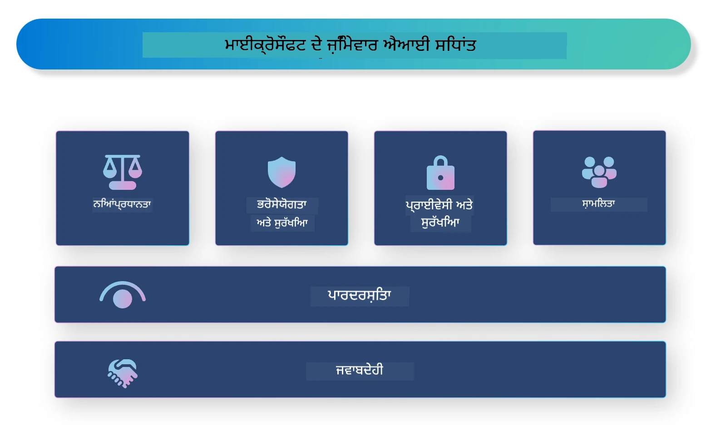

<!--
CO_OP_TRANSLATOR_METADATA:
{
  "original_hash": "805b96b20152936d8f4c587d90d6e06e",
  "translation_date": "2025-07-16T22:51:20+00:00",
  "source_file": "md/01.Introduction/05/ResponsibleAI.md",
  "language_code": "pa"
}
-->
# **ਜਿੰਮੇਵਾਰ AI ਦਾ ਪਰਚਯ**

[Microsoft Responsible AI](https://www.microsoft.com/ai/responsible-ai?WT.mc_id=aiml-138114-kinfeylo) ਇੱਕ ਐਸਾ ਉਪਰਾਲਾ ਹੈ ਜੋ ਵਿਕਾਸਕਾਰਾਂ ਅਤੇ ਸੰਗਠਨਾਂ ਨੂੰ ਐਸੇ AI ਸਿਸਟਮ ਬਣਾਉਣ ਵਿੱਚ ਮਦਦ ਕਰਦਾ ਹੈ ਜੋ ਪਾਰਦਰਸ਼ੀ, ਭਰੋਸੇਯੋਗ ਅਤੇ ਜਿੰਮੇਵਾਰ ਹੋਣ। ਇਹ ਉਪਰਾਲਾ ਜਿੰਮੇਵਾਰ AI ਹੱਲ ਵਿਕਸਿਤ ਕਰਨ ਲਈ ਮਾਰਗਦਰਸ਼ਨ ਅਤੇ ਸਰੋਤ ਪ੍ਰਦਾਨ ਕਰਦਾ ਹੈ ਜੋ ਨੈਤਿਕ ਸਿਧਾਂਤਾਂ ਨਾਲ ਮੇਲ ਖਾਂਦੇ ਹਨ, ਜਿਵੇਂ ਕਿ ਗੋਪਨੀਯਤਾ, ਨਿਆਂਸੰਗਤਾ ਅਤੇ ਪਾਰਦਰਸ਼ਤਾ। ਅਸੀਂ ਕੁਝ ਚੁਣੌਤੀਆਂ ਅਤੇ ਵਧੀਆ ਅਭਿਆਸਾਂ ਬਾਰੇ ਵੀ ਜਾਣੂ ਹੋਵਾਂਗੇ ਜੋ ਜਿੰਮੇਵਾਰ AI ਸਿਸਟਮ ਬਣਾਉਣ ਨਾਲ ਜੁੜੀਆਂ ਹਨ।

## Microsoft Responsible AI ਦਾ ਜਾਇਜ਼ਾ

**ਨੈਤਿਕ ਸਿਧਾਂਤ**

Microsoft Responsible AI ਕੁਝ ਨੈਤਿਕ ਸਿਧਾਂਤਾਂ ਦੁਆਰਾ ਚਲਾਇਆ ਜਾਂਦਾ ਹੈ, ਜਿਵੇਂ ਕਿ ਗੋਪਨੀਯਤਾ, ਨਿਆਂਸੰਗਤਾ, ਪਾਰਦਰਸ਼ਤਾ, ਜਿੰਮੇਵਾਰੀ ਅਤੇ ਸੁਰੱਖਿਆ। ਇਹ ਸਿਧਾਂਤ ਇਹ ਯਕੀਨੀ ਬਣਾਉਂਦੇ ਹਨ ਕਿ AI ਸਿਸਟਮ ਨੈਤਿਕ ਅਤੇ ਜਿੰਮੇਵਾਰ ਢੰਗ ਨਾਲ ਵਿਕਸਿਤ ਕੀਤੇ ਜਾਣ।

**ਪਾਰਦਰਸ਼ੀ AI**

Microsoft Responsible AI AI ਸਿਸਟਮਾਂ ਵਿੱਚ ਪਾਰਦਰਸ਼ਤਾ ਦੀ ਮਹੱਤਤਾ 'ਤੇ ਜ਼ੋਰ ਦਿੰਦਾ ਹੈ। ਇਸ ਵਿੱਚ ਇਹ ਸਮਝਾਉਣਾ ਸ਼ਾਮਲ ਹੈ ਕਿ AI ਮਾਡਲ ਕਿਵੇਂ ਕੰਮ ਕਰਦੇ ਹਨ, ਨਾਲ ਹੀ ਇਹ ਯਕੀਨੀ ਬਣਾਉਣਾ ਕਿ ਡਾਟਾ ਸਰੋਤ ਅਤੇ ਅਲਗੋਰਿਦਮ ਜਨਤਕ ਤੌਰ 'ਤੇ ਉਪਲਬਧ ਹਨ।

**ਜਿੰਮੇਵਾਰ AI**

[Microsoft Responsible AI](https://www.microsoft.com/ai/responsible-ai?WT.mc_id=aiml-138114-kinfeylo) ਜਿੰਮੇਵਾਰ AI ਸਿਸਟਮਾਂ ਦੇ ਵਿਕਾਸ ਨੂੰ ਪ੍ਰੋਤਸਾਹਿਤ ਕਰਦਾ ਹੈ, ਜੋ ਇਹ ਦੱਸ ਸਕਦੇ ਹਨ ਕਿ AI ਮਾਡਲ ਕਿਵੇਂ ਫੈਸਲੇ ਲੈਂਦੇ ਹਨ। ਇਹ ਉਪਭੋਗਤਾਵਾਂ ਨੂੰ AI ਸਿਸਟਮਾਂ ਦੇ ਨਤੀਜਿਆਂ 'ਤੇ ਭਰੋਸਾ ਕਰਨ ਵਿੱਚ ਮਦਦ ਕਰਦਾ ਹੈ।

**ਸਮਾਵੇਸ਼ੀਤਾ**

AI ਸਿਸਟਮ ਹਰ ਕਿਸੇ ਲਈ ਲਾਭਦਾਇਕ ਬਣਾਏ ਜਾਣੇ ਚਾਹੀਦੇ ਹਨ। Microsoft ਦਾ ਮਕਸਦ ਸਮਾਵੇਸ਼ੀ AI ਬਣਾਉਣਾ ਹੈ ਜੋ ਵੱਖ-ਵੱਖ ਨਜ਼ਰੀਏ ਧਿਆਨ ਵਿੱਚ ਰੱਖਦਾ ਹੈ ਅਤੇ ਪੱਖਪਾਤ ਜਾਂ ਭੇਦਭਾਵ ਤੋਂ ਬਚਦਾ ਹੈ।

**ਭਰੋਸੇਯੋਗਤਾ ਅਤੇ ਸੁਰੱਖਿਆ**

AI ਸਿਸਟਮਾਂ ਦੀ ਭਰੋਸੇਯੋਗਤਾ ਅਤੇ ਸੁਰੱਖਿਆ ਯਕੀਨੀ ਬਣਾਉਣਾ ਬਹੁਤ ਜਰੂਰੀ ਹੈ। Microsoft ਮਜ਼ਬੂਤ ਮਾਡਲ ਬਣਾਉਣ 'ਤੇ ਧਿਆਨ ਕੇਂਦਰਿਤ ਕਰਦਾ ਹੈ ਜੋ ਲਗਾਤਾਰ ਚੰਗਾ ਪ੍ਰਦਰਸ਼ਨ ਕਰਦੇ ਹਨ ਅਤੇ ਨੁਕਸਾਨਦਾਇਕ ਨਤੀਜਿਆਂ ਤੋਂ ਬਚਦੇ ਹਨ।

**AI ਵਿੱਚ ਨਿਆਂਸੰਗਤਾ**

Microsoft Responsible AI ਮੰਨਦਾ ਹੈ ਕਿ ਜੇ AI ਸਿਸਟਮ ਪੱਖਪਾਤੀ ਡਾਟਾ ਜਾਂ ਅਲਗੋਰਿਦਮ 'ਤੇ ਟ੍ਰੇਨ ਕੀਤੇ ਜਾਣ, ਤਾਂ ਉਹ ਪੱਖਪਾਤ ਨੂੰ ਜਾਰੀ ਰੱਖ ਸਕਦੇ ਹਨ। ਇਹ ਉਪਰਾਲਾ ਨਿਆਂਸੰਗਤ AI ਸਿਸਟਮ ਬਣਾਉਣ ਲਈ ਮਾਰਗਦਰਸ਼ਨ ਦਿੰਦਾ ਹੈ ਜੋ ਜਾਤੀ, ਲਿੰਗ ਜਾਂ ਉਮਰ ਵਰਗੇ ਕਾਰਕਾਂ ਦੇ ਆਧਾਰ 'ਤੇ ਭੇਦਭਾਵ ਨਹੀਂ ਕਰਦੇ।

**ਗੋਪਨੀਯਤਾ ਅਤੇ ਸੁਰੱਖਿਆ**

Microsoft Responsible AI ਉਪਭੋਗਤਾ ਦੀ ਗੋਪਨੀਯਤਾ ਅਤੇ ਡਾਟਾ ਸੁਰੱਖਿਆ ਦੀ ਮਹੱਤਤਾ 'ਤੇ ਜ਼ੋਰ ਦਿੰਦਾ ਹੈ। ਇਸ ਵਿੱਚ ਮਜ਼ਬੂਤ ਡਾਟਾ ਇਨਕ੍ਰਿਪਸ਼ਨ ਅਤੇ ਐਕਸੈਸ ਕੰਟਰੋਲ ਲਾਗੂ ਕਰਨਾ, ਨਾਲ ਹੀ AI ਸਿਸਟਮਾਂ ਦੀ ਨਿਯਮਤ ਜਾਂਚ ਕਰਨਾ ਸ਼ਾਮਲ ਹੈ।

**ਜਿੰਮੇਵਾਰੀ ਅਤੇ ਜਵਾਬਦੇਹੀ**

Microsoft Responsible AI AI ਵਿਕਾਸ ਅਤੇ ਤਾਇਨਾਤੀ ਵਿੱਚ ਜਵਾਬਦੇਹੀ ਅਤੇ ਜਿੰਮੇਵਾਰੀ ਨੂੰ ਪ੍ਰੋਤਸਾਹਿਤ ਕਰਦਾ ਹੈ। ਇਸ ਵਿੱਚ ਇਹ ਯਕੀਨੀ ਬਣਾਉਣਾ ਸ਼ਾਮਲ ਹੈ ਕਿ ਵਿਕਾਸਕਾਰ ਅਤੇ ਸੰਗਠਨ AI ਸਿਸਟਮਾਂ ਨਾਲ ਜੁੜੇ ਸੰਭਾਵਿਤ ਖਤਰਿਆਂ ਤੋਂ ਵਾਕਿਫ਼ ਹਨ ਅਤੇ ਉਹਨਾਂ ਨੂੰ ਘਟਾਉਣ ਲਈ ਕਦਮ ਚੁੱਕਦੇ ਹਨ।

## ਜਿੰਮੇਵਾਰ AI ਸਿਸਟਮ ਬਣਾਉਣ ਲਈ ਵਧੀਆ ਅਭਿਆਸ

**ਵੱਖ-ਵੱਖ ਡਾਟਾ ਸੈੱਟਾਂ ਨਾਲ AI ਮਾਡਲ ਵਿਕਸਿਤ ਕਰੋ**

AI ਸਿਸਟਮਾਂ ਵਿੱਚ ਪੱਖਪਾਤ ਤੋਂ ਬਚਣ ਲਈ, ਵੱਖ-ਵੱਖ ਨਜ਼ਰੀਏ ਅਤੇ ਤਜਰਬਿਆਂ ਨੂੰ ਦਰਸਾਉਂਦੇ ਡਾਟਾ ਸੈੱਟਾਂ ਦੀ ਵਰਤੋਂ ਕਰਨੀ ਜਰੂਰੀ ਹੈ।

**ਸਪਸ਼ਟ AI ਤਕਨੀਕਾਂ ਦੀ ਵਰਤੋਂ ਕਰੋ**

ਸਪਸ਼ਟ AI ਤਕਨੀਕਾਂ ਉਪਭੋਗਤਾਵਾਂ ਨੂੰ ਸਮਝਣ ਵਿੱਚ ਮਦਦ ਕਰਦੀਆਂ ਹਨ ਕਿ AI ਮਾਡਲ ਕਿਵੇਂ ਫੈਸਲੇ ਲੈਂਦੇ ਹਨ, ਜਿਸ ਨਾਲ ਸਿਸਟਮ 'ਤੇ ਭਰੋਸਾ ਵਧਦਾ ਹੈ।

**AI ਸਿਸਟਮਾਂ ਦੀ ਨਿਯਮਤ ਜਾਂਚ ਕਰੋ**

AI ਸਿਸਟਮਾਂ ਦੀ ਨਿਯਮਤ ਜਾਂਚ ਸੰਭਾਵਿਤ ਖਤਰਿਆਂ ਅਤੇ ਕਮਜ਼ੋਰੀਆਂ ਦੀ ਪਹਚਾਣ ਕਰਨ ਵਿੱਚ ਮਦਦ ਕਰਦੀ ਹੈ ਜਿਨ੍ਹਾਂ ਨੂੰ ਦੂਰ ਕਰਨ ਦੀ ਲੋੜ ਹੁੰਦੀ ਹੈ।

**ਮਜ਼ਬੂਤ ਡਾਟਾ ਇਨਕ੍ਰਿਪਸ਼ਨ ਅਤੇ ਐਕਸੈਸ ਕੰਟਰੋਲ ਲਾਗੂ ਕਰੋ**

ਡਾਟਾ ਇਨਕ੍ਰਿਪਸ਼ਨ ਅਤੇ ਐਕਸੈਸ ਕੰਟਰੋਲ AI ਸਿਸਟਮਾਂ ਵਿੱਚ ਉਪਭੋਗਤਾ ਦੀ ਗੋਪਨੀਯਤਾ ਅਤੇ ਸੁਰੱਖਿਆ ਦੀ ਰੱਖਿਆ ਕਰਦੇ ਹਨ।

**AI ਵਿਕਾਸ ਵਿੱਚ ਨੈਤਿਕ ਸਿਧਾਂਤਾਂ ਦੀ ਪਾਲਣਾ ਕਰੋ**

ਨਿਆਂਸੰਗਤਾ, ਪਾਰਦਰਸ਼ਤਾ ਅਤੇ ਜਵਾਬਦੇਹੀ ਵਰਗੇ ਨੈਤਿਕ ਸਿਧਾਂਤਾਂ ਦੀ ਪਾਲਣਾ AI ਸਿਸਟਮਾਂ ਵਿੱਚ ਭਰੋਸਾ ਬਣਾਉਣ ਅਤੇ ਜਿੰਮੇਵਾਰ ਢੰਗ ਨਾਲ ਵਿਕਾਸ ਨੂੰ ਯਕੀਨੀ ਬਣਾਉਂਦੀ ਹੈ।

## ਜਿੰਮੇਵਾਰ AI ਲਈ AI Foundry ਦੀ ਵਰਤੋਂ

[Azure AI Foundry](https://ai.azure.com?WT.mc_id=aiml-138114-kinfeylo) ਇੱਕ ਸ਼ਕਤੀਸ਼ਾਲੀ ਪਲੇਟਫਾਰਮ ਹੈ ਜੋ ਵਿਕਾਸਕਾਰਾਂ ਅਤੇ ਸੰਗਠਨਾਂ ਨੂੰ ਤੇਜ਼ੀ ਨਾਲ ਬੁੱਧੀਮਾਨ, ਅਗਲੇ ਪੱਧਰ ਦੇ, ਬਾਜ਼ਾਰ-ਤਿਆਰ ਅਤੇ ਜਿੰਮੇਵਾਰ ਐਪਲੀਕੇਸ਼ਨਾਂ ਬਣਾਉਣ ਦੀ ਆਗਿਆ ਦਿੰਦਾ ਹੈ। ਇੱਥੇ Azure AI Foundry ਦੀਆਂ ਕੁਝ ਮੁੱਖ ਵਿਸ਼ੇਸ਼ਤਾਵਾਂ ਅਤੇ ਸਮਰੱਥਾਵਾਂ ਹਨ:

**ਤਿਆਰ APIs ਅਤੇ ਮਾਡਲ**

Azure AI Foundry ਪਹਿਲਾਂ ਤੋਂ ਬਣੇ ਅਤੇ ਕਸਟਮਾਈਜ਼ ਕਰਨ ਯੋਗ APIs ਅਤੇ ਮਾਡਲ ਪ੍ਰਦਾਨ ਕਰਦਾ ਹੈ। ਇਹ ਵੱਖ-ਵੱਖ AI ਕੰਮਾਂ ਨੂੰ ਕਵਰ ਕਰਦੇ ਹਨ, ਜਿਵੇਂ ਕਿ ਜਨਰੇਟਿਵ AI, ਕੁਦਰਤੀ ਭਾਸ਼ਾ ਪ੍ਰੋਸੈਸਿੰਗ, ਖੋਜ, ਨਿਗਰਾਨੀ, ਅਨੁਵਾਦ, ਬੋਲਚਾਲ, ਵਿਜ਼ਨ ਅਤੇ ਫੈਸਲਾ ਲੈਣਾ।

**Prompt Flow**

Azure AI Foundry ਵਿੱਚ Prompt Flow ਤੁਹਾਨੂੰ ਗੱਲਬਾਤੀ AI ਅਨੁਭਵ ਬਣਾਉਣ ਦੀ ਆਗਿਆ ਦਿੰਦਾ ਹੈ। ਇਹ ਗੱਲਬਾਤੀ ਪ੍ਰਵਾਹਾਂ ਨੂੰ ਡਿਜ਼ਾਈਨ ਅਤੇ ਪ੍ਰਬੰਧਿਤ ਕਰਨ ਵਿੱਚ ਸਹਾਇਤਾ ਕਰਦਾ ਹੈ, ਜਿਸ ਨਾਲ ਚੈਟਬੋਟ, ਵਰਚੁਅਲ ਸਹਾਇਕ ਅਤੇ ਹੋਰ ਇੰਟਰਐਕਟਿਵ ਐਪਲੀਕੇਸ਼ਨਾਂ ਬਣਾਉਣਾ ਆਸਾਨ ਹੁੰਦਾ ਹੈ।

**Retrieval Augmented Generation (RAG)**

RAG ਇੱਕ ਤਕਨੀਕ ਹੈ ਜੋ ਰੀਟਰੀਵਲ-ਅਧਾਰਿਤ ਅਤੇ ਜਨਰੇਟਿਵ-ਅਧਾਰਿਤ ਦੋਹਾਂ ਤਰੀਕਿਆਂ ਨੂੰ ਜੋੜਦੀ ਹੈ। ਇਹ ਪੂਰਵ-ਮੌਜੂਦ ਗਿਆਨ (ਰੀਟਰੀਵਲ) ਅਤੇ ਰਚਨਾਤਮਕ ਜਨਰੇਸ਼ਨ (ਜਨਰੇਸ਼ਨ) ਦੋਹਾਂ ਦੀ ਵਰਤੋਂ ਕਰਕੇ ਜਵਾਬਾਂ ਦੀ ਗੁਣਵੱਤਾ ਨੂੰ ਬਿਹਤਰ ਬਣਾਉਂਦੀ ਹੈ।

**ਜਨਰੇਟਿਵ AI ਲਈ ਮੁਲਾਂਕਣ ਅਤੇ ਨਿਗਰਾਨੀ ਮੈਟਰਿਕਸ**

Azure AI Foundry ਜਨਰੇਟਿਵ AI ਮਾਡਲਾਂ ਦੇ ਮੁਲਾਂਕਣ ਅਤੇ ਨਿਗਰਾਨੀ ਲਈ ਟੂਲ ਪ੍ਰਦਾਨ ਕਰਦਾ ਹੈ। ਤੁਸੀਂ ਉਹਨਾਂ ਦੇ ਪ੍ਰਦਰਸ਼ਨ, ਨਿਆਂਸੰਗਤਾ ਅਤੇ ਹੋਰ ਮਹੱਤਵਪੂਰਨ ਮੈਟਰਿਕਸ ਦਾ ਅੰਕੜਾ ਲੈ ਸਕਦੇ ਹੋ ਤਾਂ ਜੋ ਜਿੰਮੇਵਾਰ ਤਾਇਨਾਤੀ ਯਕੀਨੀ ਬਣਾਈ ਜਾ ਸਕੇ। ਇਸ ਤੋਂ ਇਲਾਵਾ, ਜੇ ਤੁਸੀਂ ਡੈਸ਼ਬੋਰਡ ਬਣਾਇਆ ਹੈ, ਤਾਂ ਤੁਸੀਂ Azure Machine Learning Studio ਵਿੱਚ ਕੋਈ-ਕੋਡ UI ਦੀ ਵਰਤੋਂ ਕਰਕੇ [Responsible AI Toolbox](https://responsibleaitoolbox.ai/?WT.mc_id=aiml-138114-kinfeylo) Python ਲਾਇਬ੍ਰੇਰੀਜ਼ ਦੇ ਆਧਾਰ 'ਤੇ ਜਿੰਮੇਵਾਰ AI ਡੈਸ਼ਬੋਰਡ ਅਤੇ ਸਕੋਰਕਾਰਡ ਕਸਟਮਾਈਜ਼ ਅਤੇ ਤਿਆਰ ਕਰ ਸਕਦੇ ਹੋ। ਇਹ ਸਕੋਰਕਾਰਡ ਨਿਆਂਸੰਗਤਾ, ਫੀਚਰ ਮਹੱਤਤਾ ਅਤੇ ਹੋਰ ਜਿੰਮੇਵਾਰ ਤਾਇਨਾਤੀ ਸੰਬੰਧੀ ਮੁੱਖ ਜਾਣਕਾਰੀਆਂ ਤਕਨੀਕੀ ਅਤੇ ਗੈਰ-ਤਕਨੀਕੀ ਹਿੱਸੇਦਾਰਾਂ ਨਾਲ ਸਾਂਝਾ ਕਰਨ ਵਿੱਚ ਮਦਦ ਕਰਦਾ ਹੈ।

ਜਿੰਮੇਵਾਰ AI ਲਈ AI Foundry ਦੀ ਵਰਤੋਂ ਕਰਨ ਲਈ, ਤੁਸੀਂ ਇਹ ਵਧੀਆ ਅਭਿਆਸ ਅਪਣਾ ਸਕਦੇ ਹੋ:

**ਆਪਣੇ AI ਸਿਸਟਮ ਦੀ ਸਮੱਸਿਆ ਅਤੇ ਉਦੇਸ਼ ਪਰਿਭਾਸ਼ਿਤ ਕਰੋ**

ਵਿਕਾਸ ਪ੍ਰਕਿਰਿਆ ਸ਼ੁਰੂ ਕਰਨ ਤੋਂ ਪਹਿਲਾਂ, ਇਹ ਜਰੂਰੀ ਹੈ ਕਿ ਤੁਸੀਂ ਸਪਸ਼ਟ ਤੌਰ 'ਤੇ ਸਮੱਸਿਆ ਜਾਂ ਉਦੇਸ਼ ਨੂੰ ਪਰਿਭਾਸ਼ਿਤ ਕਰੋ ਜਿਸ ਨੂੰ ਤੁਹਾਡਾ AI ਸਿਸਟਮ ਹੱਲ ਕਰਨਾ ਚਾਹੁੰਦਾ ਹੈ। ਇਸ ਨਾਲ ਤੁਹਾਨੂੰ ਡਾਟਾ, ਅਲਗੋਰਿਦਮ ਅਤੇ ਸਰੋਤਾਂ ਦੀ ਪਹਚਾਣ ਕਰਨ ਵਿੱਚ ਮਦਦ ਮਿਲੇਗੀ ਜੋ ਪ੍ਰਭਾਵਸ਼ਾਲੀ ਮਾਡਲ ਬਣਾਉਣ ਲਈ ਲੋੜੀਂਦੇ ਹਨ।

**ਸੰਬੰਧਿਤ ਡਾਟਾ ਇਕੱਠਾ ਕਰੋ ਅਤੇ ਪ੍ਰੀ-ਪ੍ਰੋਸੈਸ ਕਰੋ**

AI ਸਿਸਟਮ ਦੀ ਟ੍ਰੇਨਿੰਗ ਵਿੱਚ ਵਰਤੇ ਜਾਣ ਵਾਲੇ ਡਾਟਾ ਦੀ ਗੁਣਵੱਤਾ ਅਤੇ ਮਾਤਰਾ ਇਸਦੇ ਪ੍ਰਦਰਸ਼ਨ 'ਤੇ ਵੱਡਾ ਪ੍ਰਭਾਵ ਪਾ ਸਕਦੀ ਹੈ। ਇਸ ਲਈ, ਸੰਬੰਧਿਤ ਡਾਟਾ ਇਕੱਠਾ ਕਰਨਾ, ਉਸਨੂੰ ਸਾਫ਼ ਕਰਨਾ, ਪ੍ਰੀ-ਪ੍ਰੋਸੈਸ ਕਰਨਾ ਅਤੇ ਇਹ ਯਕੀਨੀ ਬਣਾਉਣਾ ਜਰੂਰੀ ਹੈ ਕਿ ਇਹ ਡਾਟਾ ਉਸ ਆਬਾਦੀ ਜਾਂ ਸਮੱਸਿਆ ਦਾ ਪ੍ਰਤੀਨਿਧਿਤਵ ਕਰਦਾ ਹੈ ਜਿਸਨੂੰ ਤੁਸੀਂ ਹੱਲ ਕਰਨਾ ਚਾਹੁੰਦੇ ਹੋ।

**ਉਚਿਤ ਮੁਲਾਂਕਣ ਅਲਗੋਰਿਦਮ ਚੁਣੋ**

ਕਈ ਤਰ੍ਹਾਂ ਦੇ ਮੁਲਾਂਕਣ ਅਲਗੋਰਿਦਮ ਉਪਲਬਧ ਹਨ। ਤੁਹਾਡੇ ਡਾਟਾ ਅਤੇ ਸਮੱਸਿਆ ਦੇ ਅਨੁਸਾਰ ਸਭ ਤੋਂ ਉਚਿਤ ਅਲਗੋਰਿਦਮ ਚੁਣਨਾ ਜਰੂਰੀ ਹੈ।

**ਮਾਡਲ ਦਾ ਮੁਲਾਂਕਣ ਕਰੋ ਅਤੇ ਨਤੀਜੇ ਸਮਝੋ**

ਜਦੋਂ ਤੁਸੀਂ AI ਮਾਡਲ ਤਿਆਰ ਕਰ ਲੈਂਦੇ ਹੋ, ਤਾਂ ਇਸਦੇ ਪ੍ਰਦਰਸ਼ਨ ਦਾ ਉਚਿਤ ਮੈਟਰਿਕਸ ਨਾਲ ਮੁਲਾਂਕਣ ਕਰਨਾ ਅਤੇ ਨਤੀਜਿਆਂ ਨੂੰ ਪਾਰਦਰਸ਼ੀ ਢੰਗ ਨਾਲ ਸਮਝਣਾ ਜਰੂਰੀ ਹੈ। ਇਸ ਨਾਲ ਤੁਸੀਂ ਮਾਡਲ ਵਿੱਚ ਮੌਜੂਦ ਕਿਸੇ ਵੀ ਪੱਖਪਾਤ ਜਾਂ ਸੀਮਾਵਾਂ ਦੀ ਪਹਚਾਣ ਕਰ ਸਕਦੇ ਹੋ ਅਤੇ ਜਰੂਰਤ ਪੈਣ 'ਤੇ ਸੁਧਾਰ ਕਰ ਸਕਦੇ ਹੋ।

**ਪਾਰਦਰਸ਼ਤਾ ਅਤੇ ਸਮਝਾਉਣਯੋਗਤਾ ਯਕੀਨੀ ਬਣਾਓ**

AI ਸਿਸਟਮ ਪਾਰਦਰਸ਼ੀ ਅਤੇ ਸਮਝਾਉਣਯੋਗ ਹੋਣੇ ਚਾਹੀਦੇ ਹਨ ਤਾਂ ਜੋ ਉਪਭੋਗਤਾ ਸਮਝ ਸਕਣ ਕਿ ਇਹ ਕਿਵੇਂ ਕੰਮ ਕਰਦੇ ਹਨ ਅਤੇ ਫੈਸਲੇ ਕਿਵੇਂ ਲਏ ਜਾਂਦੇ ਹਨ। ਇਹ ਖਾਸ ਕਰਕੇ ਉਹਨਾਂ ਐਪਲੀਕੇਸ਼ਨਾਂ ਲਈ ਮਹੱਤਵਪੂਰਨ ਹੈ ਜਿਨ੍ਹਾਂ ਦਾ ਮਨੁੱਖੀ ਜੀਵਨ 'ਤੇ ਵੱਡਾ ਪ੍ਰਭਾਵ ਹੁੰਦਾ ਹੈ, ਜਿਵੇਂ ਕਿ ਸਿਹਤ ਸੇਵਾ, ਵਿੱਤ ਅਤੇ ਕਾਨੂੰਨੀ ਪ੍ਰਣਾਲੀਆਂ।

**ਮਾਡਲ ਦੀ ਨਿਗਰਾਨੀ ਅਤੇ ਅਪਡੇਟ ਕਰਦੇ ਰਹੋ**

AI ਸਿਸਟਮਾਂ ਦੀ ਲਗਾਤਾਰ ਨਿਗਰਾਨੀ ਅਤੇ ਅਪਡੇਟ ਕਰਨੀ ਚਾਹੀਦੀ ਹੈ ਤਾਂ ਜੋ ਉਹ ਸਮੇਂ ਦੇ ਨਾਲ ਸਹੀ ਅਤੇ ਪ੍ਰਭਾਵਸ਼ਾਲੀ ਰਹਿਣ। ਇਸ ਲਈ ਮਾਡਲ ਦੀ ਨਿਰੰਤਰ ਸੰਭਾਲ, ਟੈਸਟਿੰਗ ਅਤੇ ਦੁਬਾਰਾ ਟ੍ਰੇਨਿੰਗ ਦੀ ਲੋੜ ਹੁੰਦੀ ਹੈ।

ਅੰਤ ਵਿੱਚ, Microsoft Responsible AI ਇੱਕ ਐਸਾ ਉਪਰਾਲਾ ਹੈ ਜੋ ਵਿਕਾਸਕਾਰਾਂ ਅਤੇ ਸੰਗਠਨਾਂ ਨੂੰ ਐਸੇ AI ਸਿਸਟਮ ਬਣਾਉਣ ਵਿੱਚ ਮਦਦ ਕਰਦਾ ਹੈ ਜੋ ਪਾਰਦਰਸ਼ੀ, ਭਰੋਸੇਯੋਗ ਅਤੇ ਜਿੰਮੇਵਾਰ ਹੋਣ। ਯਾਦ ਰੱਖੋ ਕਿ ਜਿੰਮੇਵਾਰ AI ਦੀ ਲਾਗੂਆਈ ਬਹੁਤ ਜਰੂਰੀ ਹੈ, ਅਤੇ Azure AI Foundry ਇਸਨੂੰ ਸੰਗਠਨਾਂ ਲਈ ਵਾਸਤਵਿਕ ਬਣਾਉਣ ਦਾ ਉਦੇਸ਼ ਰੱਖਦਾ ਹੈ। ਨੈਤਿਕ ਸਿਧਾਂਤਾਂ ਅਤੇ ਵਧੀਆ ਅਭਿਆਸਾਂ ਦੀ ਪਾਲਣਾ ਕਰਕੇ, ਅਸੀਂ ਇਹ ਯਕੀਨੀ ਬਣਾ ਸਕਦੇ ਹਾਂ ਕਿ AI ਸਿਸਟਮ ਸਮਾਜ ਲਈ ਲਾਭਦਾਇਕ ਅਤੇ ਜਿੰਮੇਵਾਰ ਢੰਗ ਨਾਲ ਵਿਕਸਿਤ ਅਤੇ ਤਾਇਨਾਤ ਕੀਤੇ ਜਾਣ।

**ਅਸਵੀਕਾਰੋਪਣ**:  
ਇਹ ਦਸਤਾਵੇਜ਼ AI ਅਨੁਵਾਦ ਸੇਵਾ [Co-op Translator](https://github.com/Azure/co-op-translator) ਦੀ ਵਰਤੋਂ ਕਰਕੇ ਅਨੁਵਾਦ ਕੀਤਾ ਗਿਆ ਹੈ। ਜਦੋਂ ਕਿ ਅਸੀਂ ਸਹੀਤਾ ਲਈ ਕੋਸ਼ਿਸ਼ ਕਰਦੇ ਹਾਂ, ਕਿਰਪਾ ਕਰਕੇ ਧਿਆਨ ਰੱਖੋ ਕਿ ਸਵੈਚਾਲਿਤ ਅਨੁਵਾਦਾਂ ਵਿੱਚ ਗਲਤੀਆਂ ਜਾਂ ਅਸਮਰਥਤਾਵਾਂ ਹੋ ਸਕਦੀਆਂ ਹਨ। ਮੂਲ ਦਸਤਾਵੇਜ਼ ਆਪਣੀ ਮੂਲ ਭਾਸ਼ਾ ਵਿੱਚ ਪ੍ਰਮਾਣਿਕ ਸਰੋਤ ਮੰਨਿਆ ਜਾਣਾ ਚਾਹੀਦਾ ਹੈ। ਮਹੱਤਵਪੂਰਨ ਜਾਣਕਾਰੀ ਲਈ, ਪੇਸ਼ੇਵਰ ਮਨੁੱਖੀ ਅਨੁਵਾਦ ਦੀ ਸਿਫਾਰਸ਼ ਕੀਤੀ ਜਾਂਦੀ ਹੈ। ਅਸੀਂ ਇਸ ਅਨੁਵਾਦ ਦੀ ਵਰਤੋਂ ਤੋਂ ਉਤਪੰਨ ਕਿਸੇ ਵੀ ਗਲਤਫਹਿਮੀ ਜਾਂ ਗਲਤ ਵਿਆਖਿਆ ਲਈ ਜ਼ਿੰਮੇਵਾਰ ਨਹੀਂ ਹਾਂ।