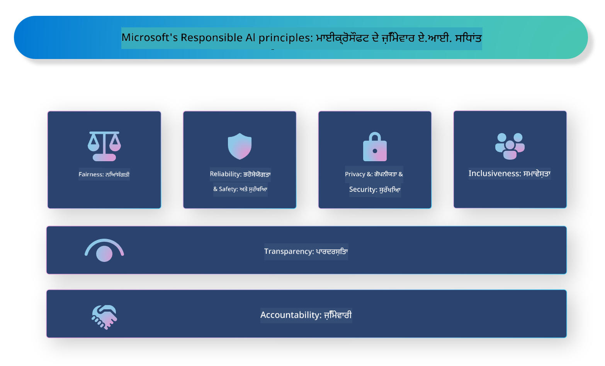

<!--
CO_OP_TRANSLATOR_METADATA:
{
  "original_hash": "805b96b20152936d8f4c587d90d6e06e",
  "translation_date": "2025-05-09T15:27:43+00:00",
  "source_file": "md/01.Introduction/05/ResponsibleAI.md",
  "language_code": "pa"
}
-->
# **ਜਿੰਮੇਵਾਰ AI ਦਾ ਪਰਚਯ**

[Microsoft Responsible AI](https://www.microsoft.com/ai/responsible-ai?WT.mc_id=aiml-138114-kinfeylo) ਇੱਕ ਐਸਾ ਉਪਰਾਲਾ ਹੈ ਜੋ ਵਿਕਾਸਕਾਰਾਂ ਅਤੇ ਸੰਗਠਨਾਂ ਨੂੰ ਸਹਾਇਤਾ ਦਿੰਦਾ ਹੈ ਤਾਂ ਜੋ ਉਹ ਐਸੇ AI ਸਿਸਟਮ ਬਣਾਉਣ ਜੋ ਪਾਰਦਰਸ਼ੀ, ਭਰੋਸੇਯੋਗ ਅਤੇ ਜਿੰਮੇਵਾਰ ਹੋਣ। ਇਹ ਉਪਰਾਲਾ ਜਿੰਮੇਵਾਰ AI ਹੱਲਾਂ ਨੂੰ ਵਿਕਸਿਤ ਕਰਨ ਲਈ ਮਾਰਗਦਰਸ਼ਨ ਅਤੇ ਸਰੋਤ ਮੁਹੱਈਆ ਕਰਵਾਉਂਦਾ ਹੈ ਜੋ ਨੈਤਿਕ ਸਿਧਾਂਤਾਂ ਨਾਲ ਮੇਲ ਖਾਂਦੇ ਹਨ, ਜਿਵੇਂ ਕਿ ਪਰਦੇਦਾਰੀ, ਇਨਸਾਫ ਅਤੇ ਪਾਰਦਰਸ਼ਤਾ। ਅਸੀਂ ਕੁਝ ਚੁਣੌਤੀਆਂ ਅਤੇ ਬਿਹਤਰ ਅਭਿਆਸ ਵੀ ਵੇਖਾਂਗੇ ਜੋ ਜਿੰਮੇਵਾਰ AI ਸਿਸਟਮ ਬਣਾਉਣ ਨਾਲ ਜੁੜੇ ਹਨ।

## Microsoft Responsible AI ਦਾ ਜਾਇਜ਼ਾ

**ਨੈਤਿਕ ਸਿਧਾਂਤ**

Microsoft Responsible AI ਕੁਝ ਨੈਤਿਕ ਸਿਧਾਂਤਾਂ ਦੁਆਰਾ ਚਲਾਇਆ ਜਾਂਦਾ ਹੈ, ਜਿਵੇਂ ਕਿ ਪਰਦੇਦਾਰੀ, ਇਨਸਾਫ, ਪਾਰਦਰਸ਼ਤਾ, ਜਿੰਮੇਵਾਰੀ ਅਤੇ ਸੁਰੱਖਿਆ। ਇਹ ਸਿਧਾਂਤ ਇਹ ਯਕੀਨੀ ਬਣਾਉਂਦੇ ਹਨ ਕਿ AI ਸਿਸਟਮ ਨੈਤਿਕ ਅਤੇ ਜਿੰਮੇਵਾਰ ਢੰਗ ਨਾਲ ਵਿਕਸਿਤ ਕੀਤੇ ਜਾਂ।

**ਪਾਰਦਰਸ਼ੀ AI**

Microsoft Responsible AI AI ਸਿਸਟਮਾਂ ਵਿੱਚ ਪਾਰਦਰਸ਼ਤਾ ਦੇ ਮਹੱਤਵ ਨੂੰ ਉਜਾਗਰ ਕਰਦਾ ਹੈ। ਇਸ ਵਿੱਚ ਇਹ ਸ਼ਾਮਲ ਹੈ ਕਿ AI ਮਾਡਲ ਕਿਵੇਂ ਕੰਮ ਕਰਦੇ ਹਨ ਇਸ ਦੀ ਸਪਸ਼ਟ ਵਿਆਖਿਆ ਦਿੱਤੀ ਜਾਵੇ, ਅਤੇ ਇਹ ਵੀ ਯਕੀਨੀ ਬਣਾਇਆ ਜਾਵੇ ਕਿ ਡਾਟਾ ਸਰੋਤ ਅਤੇ ਅਲਗੋਰਿਦਮ ਜਨਤਾ ਲਈ ਉਪਲਬਧ ਹਨ।

**ਜਿੰਮੇਵਾਰ AI**

[Microsoft Responsible AI](https://www.microsoft.com/ai/responsible-ai?WT.mc_id=aiml-138114-kinfeylo) ਜਿੰਮੇਵਾਰ AI ਸਿਸਟਮਾਂ ਦੇ ਵਿਕਾਸ ਨੂੰ ਪ੍ਰੋਤਸਾਹਿਤ ਕਰਦਾ ਹੈ, ਜੋ ਇਹ ਸਮਝਾਉਂਦੇ ਹਨ ਕਿ AI ਮਾਡਲ ਕਿਵੇਂ ਫੈਸਲੇ ਲੈਂਦੇ ਹਨ। ਇਸ ਨਾਲ ਯੂਜ਼ਰਾਂ ਨੂੰ AI ਸਿਸਟਮ ਦੇ ਨਤੀਜਿਆਂ 'ਤੇ ਭਰੋਸਾ ਕਰਨ ਵਿੱਚ ਮਦਦ ਮਿਲਦੀ ਹੈ।

**ਸਭ ਨੂੰ ਸ਼ਾਮਿਲ ਕਰਨਾ**

AI ਸਿਸਟਮ ਇਸ ਤਰ੍ਹਾਂ ਬਣਾਏ ਜਾਣੇ ਚਾਹੀਦੇ ਹਨ ਜੋ ਹਰ ਕਿਸੇ ਨੂੰ ਲਾਭ ਪਹੁੰਚਾਉਣ। Microsoft ਦਾ ਲਕੜੀ ਹੈ ਕਿ ਉਹ ਐਸਾ ਸਮਾਵੇਸ਼ੀ AI ਬਣਾਏ ਜੋ ਵੱਖ-ਵੱਖ ਨਜ਼ਰੀਏ ਧਿਆਨ ਵਿੱਚ ਰੱਖੇ ਅਤੇ ਪੱਖਪਾਤ ਜਾਂ ਭੇਦਭਾਵ ਤੋਂ ਬਚੇ।

**ਭਰੋਸੇਯੋਗਤਾ ਅਤੇ ਸੁਰੱਖਿਆ**

AI ਸਿਸਟਮਾਂ ਦੀ ਭਰੋਸੇਯੋਗਤਾ ਅਤੇ ਸੁਰੱਖਿਆ ਨੂੰ ਯਕੀਨੀ ਬਣਾਉਣਾ ਬਹੁਤ ਜਰੂਰੀ ਹੈ। Microsoft ਮਜ਼ਬੂਤ ਮਾਡਲ ਬਣਾਉਣ 'ਤੇ ਧਿਆਨ ਕੇਂਦਰਤ ਕਰਦਾ ਹੈ ਜੋ ਲਗਾਤਾਰ ਚੰਗਾ ਕੰਮ ਕਰਦੇ ਹਨ ਅਤੇ ਨੁਕਸਾਨਦੇਹ ਨਤੀਜਿਆਂ ਤੋਂ ਬਚਦੇ ਹਨ।

**AI ਵਿੱਚ ਇਨਸਾਫ**

Microsoft Responsible AI ਮੰਨਦਾ ਹੈ ਕਿ ਜੇ AI ਸਿਸਟਮ ਪੱਖਪਾਤੀ ਡਾਟਾ ਜਾਂ ਅਲਗੋਰਿਦਮ 'ਤੇ ਤਿਆਰ ਕੀਤੇ ਜਾਂ, ਤਾਂ ਉਹ ਪੱਖਪਾਤ ਨੂੰ ਵਧਾ ਸਕਦੇ ਹਨ। ਇਹ ਉਪਰਾਲਾ ਇਨਸਾਫ਼ਪੂਰਕ AI ਸਿਸਟਮ ਬਣਾਉਣ ਲਈ ਮਾਰਗਦਰਸ਼ਨ ਦਿੰਦਾ ਹੈ ਜੋ ਕਿਸੇ ਵੀ ਜਾਤੀ, ਲਿੰਗ ਜਾਂ ਉਮਰ ਦੇ ਆਧਾਰ 'ਤੇ ਭੇਦਭਾਵ ਨਹੀਂ ਕਰਦੇ।

**ਪਰਦੇਦਾਰੀ ਅਤੇ ਸੁਰੱਖਿਆ**

Microsoft Responsible AI ਉਪਭੋਗਤਾਵਾਂ ਦੀ ਪਰਦੇਦਾਰੀ ਅਤੇ ਡਾਟਾ ਸੁਰੱਖਿਆ ਦੀ ਮਹੱਤਤਾ 'ਤੇ ਜ਼ੋਰ ਦਿੰਦਾ ਹੈ। ਇਸ ਵਿੱਚ ਮਜ਼ਬੂਤ ਡਾਟਾ ਇਨਕ੍ਰਿਪਸ਼ਨ ਅਤੇ ਪਹੁੰਚ ਨਿਯੰਤਰਣ ਲਗਾਉਣਾ ਅਤੇ AI ਸਿਸਟਮਾਂ ਦੀ ਨਿਯਮਤ ਤੌਰ 'ਤੇ ਖਾਮੀਆਂ ਦੀ ਜਾਂਚ ਕਰਨਾ ਸ਼ਾਮਲ ਹੈ।

**ਜਿੰਮੇਵਾਰੀ ਅਤੇ ਜਵਾਬਦੇਹੀ**

Microsoft Responsible AI AI ਵਿਕਾਸ ਅਤੇ ਤਾਇਨਾਤੀ ਵਿੱਚ ਜਿੰਮੇਵਾਰੀ ਅਤੇ ਜਵਾਬਦੇਹੀ ਨੂੰ ਪ੍ਰੋਤਸਾਹਿਤ ਕਰਦਾ ਹੈ। ਇਸ ਵਿੱਚ ਇਹ ਯਕੀਨੀ ਬਣਾਉਣਾ ਸ਼ਾਮਲ ਹੈ ਕਿ ਵਿਕਾਸਕਾਰ ਅਤੇ ਸੰਗਠਨ AI ਸਿਸਟਮਾਂ ਨਾਲ ਜੁੜੇ ਸੰਭਾਵਿਤ ਖਤਰਿਆਂ ਤੋਂ ਵਾਕਿਫ ਹਨ ਅਤੇ ਉਹਨਾਂ ਨੂੰ ਘਟਾਉਣ ਲਈ ਕਦਮ ਚੁੱਕਦੇ ਹਨ।

## ਜਿੰਮੇਵਾਰ AI ਸਿਸਟਮ ਬਣਾਉਣ ਲਈ ਬਿਹਤਰ ਅਭਿਆਸ

**ਵੱਖ-ਵੱਖ ਡਾਟਾ ਸੈੱਟਾਂ ਨਾਲ AI ਮਾਡਲ ਵਿਕਸਿਤ ਕਰੋ**

AI ਸਿਸਟਮਾਂ ਵਿੱਚ ਪੱਖਪਾਤ ਤੋਂ ਬਚਣ ਲਈ, ਇਹ ਜ਼ਰੂਰੀ ਹੈ ਕਿ ਵੱਖ-ਵੱਖ ਨਜ਼ਰੀਏ ਅਤੇ ਤਜਰਬਿਆਂ ਨੂੰ ਦਰਸਾਉਂਦੇ ਡਾਟਾ ਸੈੱਟ ਵਰਤੇ ਜਾਣ।

**ਸਪਸ਼ਟ AI ਤਕਨੀਕਾਂ ਦੀ ਵਰਤੋਂ ਕਰੋ**

ਸਪਸ਼ਟ AI ਤਕਨੀਕਾਂ ਯੂਜ਼ਰਾਂ ਨੂੰ ਸਮਝਣ ਵਿੱਚ ਮਦਦ ਕਰਦੀਆਂ ਹਨ ਕਿ AI ਮਾਡਲ ਕਿਵੇਂ ਫੈਸਲੇ ਲੈਂਦੇ ਹਨ, ਜਿਸ ਨਾਲ ਸਿਸਟਮ ਵਿੱਚ ਭਰੋਸਾ ਵਧਦਾ ਹੈ।

**AI ਸਿਸਟਮਾਂ ਦੀ ਨਿਯਮਤ ਜਾਂਚ ਕਰੋ**

AI ਸਿਸਟਮਾਂ ਦੀ ਨਿਯਮਤ ਜਾਂਚ ਕਰਨ ਨਾਲ ਸੰਭਾਵਿਤ ਖਤਰਿਆਂ ਅਤੇ ਕਮਜ਼ੋਰੀਆਂ ਦੀ ਪਹਿਚਾਣ ਹੋ ਸਕਦੀ ਹੈ ਜਿਨ੍ਹਾਂ ਨੂੰ ਠੀਕ ਕਰਨ ਦੀ ਲੋੜ ਹੈ।

**ਮਜ਼ਬੂਤ ਡਾਟਾ ਇਨਕ੍ਰਿਪਸ਼ਨ ਅਤੇ ਪਹੁੰਚ ਨਿਯੰਤਰਣ ਲਗਾਓ**

ਡਾਟਾ ਇਨਕ੍ਰਿਪਸ਼ਨ ਅਤੇ ਪਹੁੰਚ ਨਿਯੰਤਰਣ ਉਪਭੋਗਤਾ ਦੀ ਪਰਦੇਦਾਰੀ ਅਤੇ ਸੁਰੱਖਿਆ ਦੀ ਰੱਖਿਆ ਵਿੱਚ ਮਦਦ ਕਰਦੇ ਹਨ।

**AI ਵਿਕਾਸ ਵਿੱਚ ਨੈਤਿਕ ਸਿਧਾਂਤਾਂ ਦੀ ਪਾਲਣਾ ਕਰੋ**

ਨੈਤਿਕ ਸਿਧਾਂਤਾਂ, ਜਿਵੇਂ ਕਿ ਇਨਸਾਫ, ਪਾਰਦਰਸ਼ਤਾ ਅਤੇ ਜਵਾਬਦੇਹੀ ਦੀ ਪਾਲਣਾ ਕਰਨ ਨਾਲ AI ਸਿਸਟਮਾਂ ਵਿੱਚ ਭਰੋਸਾ ਬਣਦਾ ਹੈ ਅਤੇ ਇਹ ਯਕੀਨੀ ਬਣਦਾ ਹੈ ਕਿ ਉਹ ਜਿੰਮੇਵਾਰ ਢੰਗ ਨਾਲ ਵਿਕਸਿਤ ਹੋ ਰਹੇ ਹਨ।

## Responsible AI ਲਈ AI Foundry ਦੀ ਵਰਤੋਂ

[Azure AI Foundry](https://ai.azure.com?WT.mc_id=aiml-138114-kinfeylo) ਇੱਕ ਸ਼ਕਤੀਸ਼ਾਲੀ ਪਲੇਟਫਾਰਮ ਹੈ ਜੋ ਵਿਕਾਸਕਾਰਾਂ ਅਤੇ ਸੰਗਠਨਾਂ ਨੂੰ ਤੇਜ਼ੀ ਨਾਲ ਬੁੱਧੀਮਾਨ, ਅਧੁਨਿਕ, ਮਾਰਕੀਟ-ਤਿਆਰ ਅਤੇ ਜਿੰਮੇਵਾਰ ਐਪਲੀਕੇਸ਼ਨਾਂ ਬਣਾਉਣ ਦੀ ਆਗਿਆ ਦਿੰਦਾ ਹੈ। ਇੱਥੇ Azure AI Foundry ਦੀਆਂ ਕੁਝ ਮੁੱਖ ਖੂਬੀਆਂ ਹਨ:

**ਤਿਆਰ ਅਤੇ ਕਸਟਮਾਈਜ਼ ਕਰ ਸਕਣ ਵਾਲੇ APIs ਅਤੇ ਮਾਡਲ**

Azure AI Foundry ਵੱਖ-ਵੱਖ AI ਕਾਰਜਾਂ ਲਈ ਤਿਆਰ ਅਤੇ ਕਸਟਮਾਈਜ਼ ਕਰਨ ਯੋਗ APIs ਅਤੇ ਮਾਡਲ ਮੁਹੱਈਆ ਕਰਵਾਉਂਦਾ ਹੈ, ਜਿਵੇਂ ਕਿ ਜਨਰੇਟਿਵ AI, ਕੁਦਰਤੀ ਭਾਸ਼ਾ ਪ੍ਰਕਿਰਿਆ, ਖੋਜ, ਮਾਨੀਟਰਿੰਗ, ਅਨੁਵਾਦ, ਬੋਲਚਾਲ, ਵਿਜ਼ਨ ਅਤੇ ਫੈਸਲਾ ਲੈਣਾ।

**Prompt Flow**

Azure AI Foundry ਵਿੱਚ Prompt Flow ਤੁਹਾਨੂੰ ਗੱਲਬਾਤੀ AI ਤਜਰਬੇ ਬਣਾਉਣ ਦੀ ਆਗਿਆ ਦਿੰਦਾ ਹੈ। ਇਸ ਨਾਲ ਤੁਸੀਂ ਗੱਲਬਾਤੀ ਪ੍ਰਵਾਹ ਡਿਜ਼ਾਈਨ ਅਤੇ ਪ੍ਰਬੰਧਿਤ ਕਰ ਸਕਦੇ ਹੋ, ਜਿਸ ਨਾਲ ਚੈਟਬੋਟ, ਵਰਚੁਅਲ ਸਹਾਇਕ ਅਤੇ ਹੋਰ ਇੰਟਰੈਕਟਿਵ ਐਪਲੀਕੇਸ਼ਨ ਬਣਾਉਣਾ ਆਸਾਨ ਹੁੰਦਾ ਹੈ।

**Retrieval Augmented Generation (RAG)**

RAG ਇੱਕ ਤਕਨੀਕ ਹੈ ਜੋ ਰੀਟਰੀਵਲ-ਅਧਾਰਿਤ ਅਤੇ ਜਨਰੇਟਿਵ-ਅਧਾਰਿਤ ਪਹੁੰਚਾਂ ਨੂੰ ਮਿਲਾਉਂਦੀ ਹੈ। ਇਹ ਪੂਰਵ-ਮੌਜੂਦ ਗਿਆਨ (ਰੀਟਰੀਵਲ) ਅਤੇ ਰਚਨਾਤਮਕ ਜਨਰੇਸ਼ਨ (ਜਨਰੇਸ਼ਨ) ਦੋਹਾਂ ਦਾ ਲਾਭ ਲੈ ਕੇ ਜਨਰੇਟ ਕੀਤੇ ਜਵਾਬਾਂ ਦੀ ਗੁਣਵੱਤਾ ਵਧਾਉਂਦੀ ਹੈ।

**ਜਨਰੇਟਿਵ AI ਲਈ ਮੁਲਾਂਕਣ ਅਤੇ ਮਾਨੀਟਰਿੰਗ ਮੈਟ੍ਰਿਕਸ**

Azure AI Foundry ਜਨਰੇਟਿਵ AI ਮਾਡਲਾਂ ਦੇ ਮੁਲਾਂਕਣ ਅਤੇ ਮਾਨੀਟਰਿੰਗ ਲਈ ਟੂਲਜ਼ ਪ੍ਰਦਾਨ ਕਰਦਾ ਹੈ। ਤੁਸੀਂ ਉਨ੍ਹਾਂ ਦੀ ਕਾਰਗੁਜ਼ਾਰੀ, ਇਨਸਾਫ਼ ਅਤੇ ਹੋਰ ਜਰੂਰੀ ਮੈਟ੍ਰਿਕਸ ਦੀ ਜਾਂਚ ਕਰ ਸਕਦੇ ਹੋ ਤਾਂ ਜੋ ਜਿੰਮੇਵਾਰ ਤਾਇਨਾਤੀ ਹੋਵੇ। ਇਸ ਤੋਂ ਇਲਾਵਾ, ਜੇ ਤੁਸੀਂ ਡੈਸ਼ਬੋਰਡ ਬਣਾਇਆ ਹੈ, ਤਾਂ ਤੁਸੀਂ Azure Machine Learning Studio ਵਿੱਚ ਕੋਡ-ਰਹਿਤ UI ਦੀ ਵਰਤੋਂ ਕਰਕੇ Responsible AI Dashboard ਅਤੇ ਇਸ ਨਾਲ ਜੁੜੇ ਸਕੋਰਕਾਰਡ ਨੂੰ ਕਸਟਮਾਈਜ਼ ਅਤੇ ਜਨਰੇਟ ਕਰ ਸਕਦੇ ਹੋ, ਜੋ [Responsible AI Toolbox](https://responsibleaitoolbox.ai/?WT.mc_id=aiml-138114-kinfeylo) Python ਲਾਇਬ੍ਰੇਰੀਜ਼ 'ਤੇ ਆਧਾਰਿਤ ਹੈ। ਇਹ ਸਕੋਰਕਾਰਡ ਤਕਨੀਕੀ ਅਤੇ ਗੈਰ-ਤਕਨੀਕੀ ਹਿੱਸੇਦਾਰਾਂ ਨਾਲ ਇਨਸਾਫ਼, ਫੀਚਰ ਮਹੱਤਤਾ ਅਤੇ ਹੋਰ ਜਿੰਮੇਵਾਰ ਤਾਇਨਾਤੀ ਸਬੰਧੀ ਮੁੱਖ ਜਾਣਕਾਰੀਆਂ ਸਾਂਝੀਆਂ ਕਰਨ ਵਿੱਚ ਮਦਦ ਕਰਦਾ ਹੈ।

Responsible AI ਲਈ AI Foundry ਦੀ ਵਰਤੋਂ ਕਰਨ ਲਈ, ਤੁਸੀਂ ਇਹ ਬਿਹਤਰ ਅਭਿਆਸ ਅਪਣਾ ਸਕਦੇ ਹੋ:

**ਆਪਣੇ AI ਸਿਸਟਮ ਦੀ ਸਮੱਸਿਆ ਅਤੇ ਉਦੇਸ਼ ਪਰਿਭਾਸ਼ਿਤ ਕਰੋ**

ਵਿਕਾਸ ਦੀ ਸ਼ੁਰੂਆਤ ਤੋਂ ਪਹਿਲਾਂ, ਇਹ ਜਰੂਰੀ ਹੈ ਕਿ ਤੁਸੀਂ ਆਪਣੇ AI ਸਿਸਟਮ ਦੇ ਹੱਲ ਕਰਨ ਵਾਲੇ ਸਮੱਸਿਆ ਜਾਂ ਉਦੇਸ਼ ਨੂੰ ਸਪਸ਼ਟ ਤੌਰ 'ਤੇ ਪਰਿਭਾਸ਼ਿਤ ਕਰੋ। ਇਸ ਨਾਲ ਤੁਹਾਨੂੰ ਡਾਟਾ, ਅਲਗੋਰਿਦਮ ਅਤੇ ਸਰੋਤਾਂ ਦੀ ਪਛਾਣ ਕਰਨ ਵਿੱਚ ਮਦਦ ਮਿਲੇਗੀ ਜੋ ਇੱਕ ਪ੍ਰਭਾਵਸ਼ਾਲੀ ਮਾਡਲ ਬਣਾਉਣ ਲਈ ਲੋੜੀਂਦੇ ਹਨ।

**ਸੰਬੰਧਿਤ ਡਾਟਾ ਇਕੱਠਾ ਕਰੋ ਅਤੇ ਪ੍ਰੀ-ਪ੍ਰੋਸੈਸ ਕਰੋ**

AI ਸਿਸਟਮ ਦੀ ਪ੍ਰਦਰਸ਼ਨ 'ਤੇ ਟ੍ਰੇਨਿੰਗ ਵਿੱਚ ਵਰਤੇ ਜਾਣ ਵਾਲੇ ਡਾਟਾ ਦੀ ਗੁਣਵੱਤਾ ਅਤੇ ਮਾਤਰਾ ਦਾ ਬਹੁਤ ਪ੍ਰਭਾਵ ਹੁੰਦਾ ਹੈ। ਇਸ ਲਈ, ਸੰਬੰਧਿਤ ਡਾਟਾ ਇਕੱਠਾ ਕਰਨਾ, ਉਸ ਨੂੰ ਸਾਫ਼ ਕਰਨਾ, ਪ੍ਰੀ-ਪ੍ਰੋਸੈਸ ਕਰਨਾ ਅਤੇ ਇਹ ਯਕੀਨੀ ਬਣਾਉਣਾ ਜਰੂਰੀ ਹੈ ਕਿ ਇਹ ਤੁਹਾਡੇ ਲਕੜੀ ਜਾਂ ਸਮੱਸਿਆ ਦੀ ਪ੍ਰਤੀਨਿਧਤਾ ਕਰਦਾ ਹੈ।

**ਉਚਿਤ ਮੁਲਾਂਕਣ ਅਲਗੋਰਿਦਮ ਚੁਣੋ**

ਕਈ ਕਿਸਮ ਦੇ ਮੁਲਾਂਕਣ ਅਲਗੋਰਿਦਮ ਉਪਲਬਧ ਹਨ। ਤੁਹਾਡੇ ਡਾਟਾ ਅਤੇ ਸਮੱਸਿਆ ਦੇ ਆਧਾਰ 'ਤੇ ਸਭ ਤੋਂ ਉਚਿਤ ਅਲਗੋਰਿਦਮ ਚੁਣਨਾ ਜਰੂਰੀ ਹੈ।

**ਮਾਡਲ ਦਾ ਮੁਲਾਂਕਣ ਅਤੇ ਵਿਆਖਿਆ ਕਰੋ**

ਜਦੋਂ ਤੁਸੀਂ AI ਮਾਡਲ ਬਣਾਉ ਲੈਂਦੇ ਹੋ, ਤਾਂ ਇਸ ਦੀ ਕਾਰਗੁਜ਼ਾਰੀ ਨੂੰ ਉਚਿਤ ਮੈਟ੍ਰਿਕਸ ਦੀ ਵਰਤੋਂ ਕਰਕੇ ਮੁਲਾਂਕਣ ਕਰਨਾ ਅਤੇ ਨਤੀਜਿਆਂ ਨੂੰ ਪਾਰਦਰਸ਼ੀ ਢੰਗ ਨਾਲ ਸਮਝਾਉਣਾ ਜਰੂਰੀ ਹੈ। ਇਸ ਨਾਲ ਤੁਹਾਨੂੰ ਮਾਡਲ ਵਿੱਚ ਕਿਸੇ ਵੀ ਪੱਖਪਾਤ ਜਾਂ ਸੀਮਾਵਾਂ ਦੀ ਪਹਿਚਾਣ ਕਰਨ ਅਤੇ ਜਰੂਰੀ ਸੁਧਾਰ ਕਰਨ ਵਿੱਚ ਮਦਦ ਮਿਲੇਗੀ।

**ਪਾਰਦਰਸ਼ਤਾ ਅਤੇ ਸਮਝਦਾਰੀ ਨੂੰ ਯਕੀਨੀ ਬਣਾਓ**

AI ਸਿਸਟਮ ਪਾਰਦਰਸ਼ੀ ਅਤੇ ਸਮਝਣਯੋਗ ਹੋਣ ਚਾਹੀਦੇ ਹਨ ਤਾਂ ਜੋ ਉਪਭੋਗਤਾ ਸਮਝ ਸਕਣ ਕਿ ਇਹ ਕਿਵੇਂ ਕੰਮ ਕਰਦੇ ਹਨ ਅਤੇ ਫੈਸਲੇ ਕਿਵੇਂ ਲੈਂਦੇ ਹਨ। ਇਹ ਖਾਸ ਕਰਕੇ ਉਹਨਾਂ ਐਪਲੀਕੇਸ਼ਨਾਂ ਲਈ ਜਰੂਰੀ ਹੈ ਜਿਨ੍ਹਾਂ ਦਾ ਮਨੁੱਖੀ ਜੀਵਨ ਉੱਤੇ ਵੱਡਾ ਪ੍ਰਭਾਵ ਹੁੰਦਾ ਹੈ, ਜਿਵੇਂ ਸਿਹਤ ਸੇਵਾ, ਵਿੱਤੀ ਅਤੇ ਕਾਨੂੰਨੀ ਸਿਸਟਮ।

**ਮਾਡਲ ਦੀ ਨਿਗਰਾਨੀ ਅਤੇ ਅਪਡੇਟ ਕਰਦੇ ਰਹੋ**

AI ਸਿਸਟਮਾਂ ਦੀ ਲਗਾਤਾਰ ਨਿਗਰਾਨੀ ਅਤੇ ਅਪਡੇਟ ਕਰਨੀ ਚਾਹੀਦੀ ਹੈ ਤਾਂ ਜੋ ਉਹ ਸਮੇਂ ਦੇ ਨਾਲ ਸਹੀ ਅਤੇ ਪ੍ਰਭਾਵਸ਼ਾਲੀ ਰਹਿਣ। ਇਸ ਵਿੱਚ ਮਾਡਲ ਦੀ ਰਖਿਆ, ਟੈਸਟਿੰਗ ਅਤੇ ਮੁੜ-ਟ੍ਰੇਨਿੰਗ ਸ਼ਾਮਲ ਹੈ।

ਅੰਤ ਵਿੱਚ, Microsoft Responsible AI ਇੱਕ ਐਸਾ ਉਪਰਾਲਾ ਹੈ ਜੋ ਵਿਕਾਸਕਾਰਾਂ ਅਤੇ ਸੰਗਠਨਾਂ ਨੂੰ ਜਿੰਮੇਵਾਰ, ਪਾਰਦਰਸ਼ੀ ਅਤੇ ਭਰੋਸੇਯੋਗ AI ਸਿਸਟਮ ਬਣਾਉਣ ਵਿੱਚ ਸਹਾਇਤਾ ਦਿੰਦਾ ਹੈ। ਯਾਦ ਰੱਖੋ ਕਿ ਜਿੰਮੇਵਾਰ AI ਦੀ ਲਾਗੂਆਈ ਬਹੁਤ ਜਰੂਰੀ ਹੈ, ਅਤੇ Azure AI Foundry ਇਸਨੂੰ ਸੰਗਠਨਾਂ ਲਈ ਅਮਲੀ ਬਣਾਉਂਦਾ ਹੈ। ਨੈਤਿਕ ਸਿਧਾਂਤਾਂ ਅਤੇ ਬਿਹਤਰ ਅਭਿਆਸਾਂ ਦੀ ਪਾਲਣਾ ਕਰਕੇ, ਅਸੀਂ ਇਹ ਯਕੀਨੀ ਬਣਾਉਂ ਸਕਦੇ ਹਾਂ ਕਿ AI ਸਿਸਟਮ ਸਮਾਜ ਲਈ ਲਾਭਦਾਇਕ ਅਤੇ ਜਿੰਮੇਵਾਰ ਢੰਗ ਨਾਲ ਵਿਕਸਿਤ ਅਤੇ ਤਾਇਨਾਤ ਕੀਤੇ ਜਾਣ।

**ਅਸਵੀਕਾਰੋਪੱਤਰ**:  
ਇਸ ਦਸਤਾਵੇਜ਼ ਦਾ ਅਨੁਵਾਦ AI ਅਨੁਵਾਦ ਸੇਵਾ [Co-op Translator](https://github.com/Azure/co-op-translator) ਦੀ ਵਰਤੋਂ ਕਰਕੇ ਕੀਤਾ ਗਿਆ ਹੈ। ਜਦੋਂ ਕਿ ਅਸੀਂ ਸਹੀਤਾ ਲਈ ਕੋਸ਼ਿਸ਼ ਕਰਦੇ ਹਾਂ, ਕਿਰਪਾ ਕਰਕੇ ਧਿਆਨ ਵਿੱਚ ਰੱਖੋ ਕਿ ਸਵੈਚਾਲਿਤ ਅਨੁਵਾਦਾਂ ਵਿੱਚ ਗਲਤੀਆਂ ਜਾਂ ਅਸਹੀਤਾਵਾਂ ਹੋ ਸਕਦੀਆਂ ਹਨ। ਮੂਲ ਦਸਤਾਵੇਜ਼ ਆਪਣੇ ਮੂਲ ਭਾਸ਼ਾ ਵਿੱਚ ਹੀ ਅਧਿਕਾਰਤ ਸਰੋਤ ਮੰਨਿਆ ਜਾਣਾ ਚਾਹੀਦਾ ਹੈ। ਜਰੂਰੀ ਜਾਣਕਾਰੀ ਲਈ, ਪੇਸ਼ੇਵਰ ਮਨੁੱਖੀ ਅਨੁਵਾਦ ਦੀ ਸਿਫਾਰਸ਼ ਕੀਤੀ ਜਾਂਦੀ ਹੈ। ਅਸੀਂ ਇਸ ਅਨੁਵਾਦ ਦੀ ਵਰਤੋਂ ਨਾਲ ਹੋਣ ਵਾਲੀਆਂ ਕਿਸੇ ਵੀ ਗਲਤਫਹਿਮੀਆਂ ਜਾਂ ਭ੍ਰਮਾਂ ਲਈ ਜ਼ਿੰਮੇਵਾਰ ਨਹੀਂ ਹਾਂ।