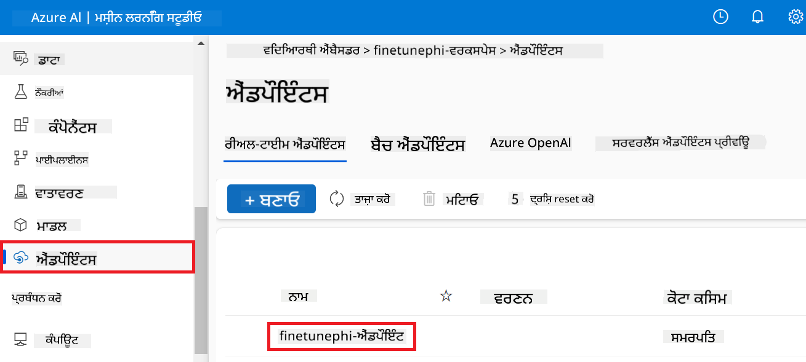
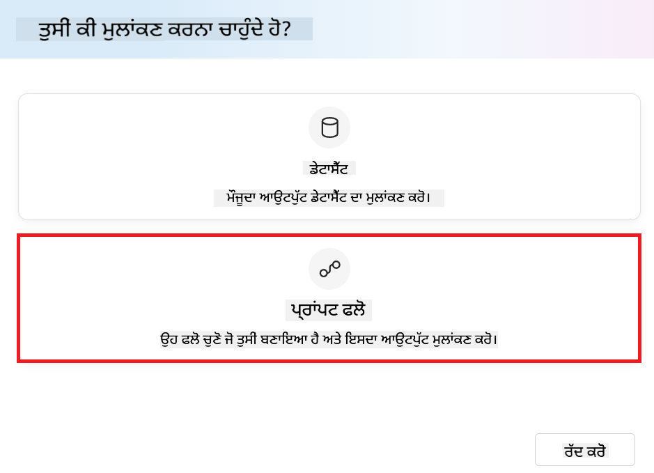
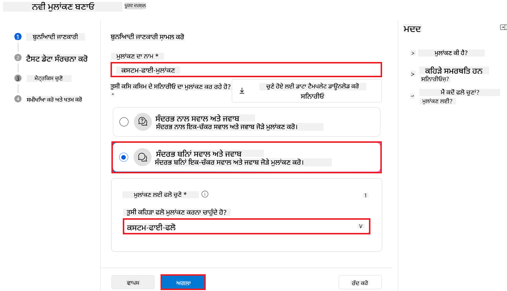
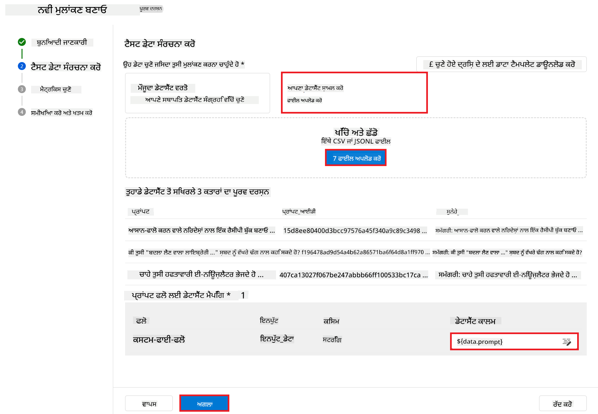
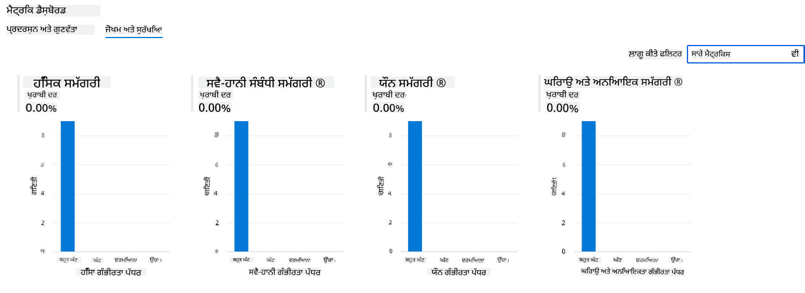

<!--
CO_OP_TRANSLATOR_METADATA:
{
  "original_hash": "80a853c08e4ee25ef9b4bfcedd8990da",
  "translation_date": "2025-07-16T23:32:05+00:00",
  "source_file": "md/02.Application/01.TextAndChat/Phi3/E2E_Phi-3-Evaluation_AIFoundry.md",
  "language_code": "pa"
}
-->
# Azure AI Foundry ਵਿੱਚ Microsoft ਦੇ Responsible AI ਸਿਧਾਂਤਾਂ ‘ਤੇ ਧਿਆਨ ਕੇਂਦਰਿਤ ਕਰਕੇ Fine-tuned Phi-3 / Phi-3.5 ਮਾਡਲ ਦਾ ਮੁਲਾਂਕਣ ਕਰੋ

ਇਹ end-to-end (E2E) ਸੈਂਪਲ Microsoft Tech Community ਦੇ "[Evaluate Fine-tuned Phi-3 / 3.5 Models in Azure AI Foundry Focusing on Microsoft's Responsible AI](https://techcommunity.microsoft.com/blog/educatordeveloperblog/evaluate-fine-tuned-phi-3--3-5-models-in-azure-ai-studio-focusing-on-microsofts-/4227850?WT.mc_id=aiml-137032-kinfeylo)" ਗਾਈਡ ‘ਤੇ ਆਧਾਰਿਤ ਹੈ।

## ਝਲਕ

### ਤੁਸੀਂ Azure AI Foundry ਵਿੱਚ fine-tuned Phi-3 / Phi-3.5 ਮਾਡਲ ਦੀ ਸੁਰੱਖਿਆ ਅਤੇ ਪ੍ਰਦਰਸ਼ਨ ਕਿਵੇਂ ਮੁਲਾਂਕਣ ਕਰ ਸਕਦੇ ਹੋ?

ਕਈ ਵਾਰੀ ਮਾਡਲ ਨੂੰ fine-tune ਕਰਨ ਨਾਲ ਅਣਚਾਹੇ ਜਾਂ ਗਲਤ ਜਵਾਬ ਆ ਸਕਦੇ ਹਨ। ਇਹ ਯਕੀਨੀ ਬਣਾਉਣ ਲਈ ਕਿ ਮਾਡਲ ਸੁਰੱਖਿਅਤ ਅਤੇ ਪ੍ਰਭਾਵਸ਼ਾਲੀ ਰਹੇ, ਇਹ ਜ਼ਰੂਰੀ ਹੈ ਕਿ ਮਾਡਲ ਦੀ ਸੰਭਾਵਨਾ ਨੂੰ ਨੁਕਸਾਨਦਾਇਕ ਸਮੱਗਰੀ ਬਣਾਉਣ ਅਤੇ ਸਹੀ, ਸਬੰਧਤ ਅਤੇ ਸੰਗਠਿਤ ਜਵਾਬ ਦੇਣ ਦੀ ਸਮਰੱਥਾ ਨੂੰ ਮੁਲਾਂਕਣ ਕੀਤਾ ਜਾਵੇ। ਇਸ ਟਿਊਟੋਰਿਯਲ ਵਿੱਚ, ਤੁਸੀਂ ਸਿੱਖੋਗੇ ਕਿ Azure AI Foundry ਵਿੱਚ Prompt flow ਨਾਲ ਇੰਟੀਗ੍ਰੇਟ ਕੀਤੇ fine-tuned Phi-3 / Phi-3.5 ਮਾਡਲ ਦੀ ਸੁਰੱਖਿਆ ਅਤੇ ਪ੍ਰਦਰਸ਼ਨ ਕਿਵੇਂ ਮੁਲਾਂਕਣ ਕਰਨਾ ਹੈ।

ਇਹ ਹੈ Azure AI Foundry ਦਾ ਮੁਲਾਂਕਣ ਪ੍ਰਕਿਰਿਆ।


*ਚਿੱਤਰ ਸਰੋਤ: [Evaluation of generative AI applications](https://learn.microsoft.com/azure/ai-studio/concepts/evaluation-approach-gen-ai?wt.mc_id%3Dstudentamb_279723)*

> [!NOTE]
>
> Phi-3 / Phi-3.5 ਬਾਰੇ ਹੋਰ ਵਿਸਥਾਰ ਵਿੱਚ ਜਾਣਕਾਰੀ ਅਤੇ ਵਾਧੂ ਸਰੋਤਾਂ ਲਈ, ਕਿਰਪਾ ਕਰਕੇ [Phi-3CookBook](https://github.com/microsoft/Phi-3CookBook?wt.mc_id=studentamb_279723) ਵੇਖੋ।

### ਲੋੜੀਂਦੇ ਸਾਧਨ

- [Python](https://www.python.org/downloads)
- [Azure subscription](https://azure.microsoft.com/free?wt.mc_id=studentamb_279723)
- [Visual Studio Code](https://code.visualstudio.com)
- Fine-tuned Phi-3 / Phi-3.5 ਮਾਡਲ

### ਸਮੱਗਰੀ ਸੂਚੀ

1. [**ਦ੍ਰਿਸ਼ 1: Azure AI Foundry ਦੇ Prompt flow ਮੁਲਾਂਕਣ ਦਾ ਪਰਿਚਯ**](../../../../../../md/02.Application/01.TextAndChat/Phi3)

    - [ਸੁਰੱਖਿਆ ਮੁਲਾਂਕਣ ਦਾ ਪਰਿਚਯ](../../../../../../md/02.Application/01.TextAndChat/Phi3)
    - [ਪ੍ਰਦਰਸ਼ਨ ਮੁਲਾਂਕਣ ਦਾ ਪਰਿਚਯ](../../../../../../md/02.Application/01.TextAndChat/Phi3)

1. [**ਦ੍ਰਿਸ਼ 2: Azure AI Foundry ਵਿੱਚ Phi-3 / Phi-3.5 ਮਾਡਲ ਦਾ ਮੁਲਾਂਕਣ**](../../../../../../md/02.Application/01.TextAndChat/Phi3)

    - [ਸ਼ੁਰੂ ਕਰਨ ਤੋਂ ਪਹਿਲਾਂ](../../../../../../md/02.Application/01.TextAndChat/Phi3)
    - [Phi-3 / Phi-3.5 ਮਾਡਲ ਦਾ ਮੁਲਾਂਕਣ ਕਰਨ ਲਈ Azure OpenAI ਨੂੰ ਡਿਪਲੋਇ ਕਰੋ](../../../../../../md/02.Application/01.TextAndChat/Phi3)
    - [Azure AI Foundry ਦੇ Prompt flow ਮੁਲਾਂਕਣ ਨਾਲ fine-tuned Phi-3 / Phi-3.5 ਮਾਡਲ ਦਾ ਮੁਲਾਂਕਣ ਕਰੋ](../../../../../../md/02.Application/01.TextAndChat/Phi3)

1. [ਵਧਾਈਆਂ!](../../../../../../md/02.Application/01.TextAndChat/Phi3)

## **ਦ੍ਰਿਸ਼ 1: Azure AI Foundry ਦੇ Prompt flow ਮੁਲਾਂਕਣ ਦਾ ਪਰਿਚਯ**

### ਸੁਰੱਖਿਆ ਮੁਲਾਂਕਣ ਦਾ ਪਰਿਚਯ

ਆਪਣੇ AI ਮਾਡਲ ਨੂੰ ਨੈਤਿਕ ਅਤੇ ਸੁਰੱਖਿਅਤ ਬਣਾਉਣ ਲਈ, Microsoft ਦੇ Responsible AI ਸਿਧਾਂਤਾਂ ਦੇ ਖਿਲਾਫ ਇਸ ਦਾ ਮੁਲਾਂਕਣ ਕਰਨਾ ਬਹੁਤ ਜ਼ਰੂਰੀ ਹੈ। Azure AI Foundry ਵਿੱਚ, ਸੁਰੱਖਿਆ ਮੁਲਾਂਕਣ ਤੁਹਾਨੂੰ ਆਪਣੇ ਮਾਡਲ ਦੀ jailbreak ਹਮਲਿਆਂ ਵੱਲ ਸੰਵੇਦਨਸ਼ੀਲਤਾ ਅਤੇ ਨੁਕਸਾਨਦਾਇਕ ਸਮੱਗਰੀ ਬਣਾਉਣ ਦੀ ਸੰਭਾਵਨਾ ਦਾ ਮੁਲਾਂਕਣ ਕਰਨ ਦੀ ਆਗਿਆ ਦਿੰਦੇ ਹਨ, ਜੋ ਸਿੱਧੇ ਤੌਰ ‘ਤੇ ਇਨ੍ਹਾਂ ਸਿਧਾਂਤਾਂ ਨਾਲ ਮੇਲ ਖਾਂਦੇ ਹਨ।


*ਚਿੱਤਰ ਸਰੋਤ: [Evaluation of generative AI applications](https://learn.microsoft.com/azure/ai-studio/concepts/evaluation-approach-gen-ai?wt.mc_id%3Dstudentamb_279723)*

#### Microsoft ਦੇ Responsible AI ਸਿਧਾਂਤ

ਤਕਨੀਕੀ ਕਦਮਾਂ ਨੂੰ ਸ਼ੁਰੂ ਕਰਨ ਤੋਂ ਪਹਿਲਾਂ, Microsoft ਦੇ Responsible AI ਸਿਧਾਂਤਾਂ ਨੂੰ ਸਮਝਣਾ ਜ਼ਰੂਰੀ ਹੈ, ਜੋ AI ਸਿਸਟਮਾਂ ਦੇ ਜ਼ਿੰਮੇਵਾਰ ਵਿਕਾਸ, ਤਾਇਨਾਤੀ ਅਤੇ ਚਾਲੂ ਕਰਨ ਲਈ ਇੱਕ ਨੈਤਿਕ ਢਾਂਚਾ ਹੈ। ਇਹ ਸਿਧਾਂਤ AI ਸਿਸਟਮਾਂ ਦੇ ਜ਼ਿੰਮੇਵਾਰ ਡਿਜ਼ਾਈਨ, ਵਿਕਾਸ ਅਤੇ ਤਾਇਨਾਤੀ ਨੂੰ ਮਦਦ ਕਰਦੇ ਹਨ, ਇਹ ਯਕੀਨੀ ਬਣਾਉਂਦੇ ਹੋਏ ਕਿ AI ਤਕਨਾਲੋਜੀਆਂ ਇਨਸਾਫ਼, ਪਾਰਦਰਸ਼ੀ ਅਤੇ ਸ਼ਾਮਿਲ ਕਰਨ ਵਾਲੇ ਢੰਗ ਨਾਲ ਬਣਾਈਆਂ ਜਾਂਦੀਆਂ ਹਨ। ਇਹ ਸਿਧਾਂਤ AI ਮਾਡਲਾਂ ਦੀ ਸੁਰੱਖਿਆ ਮੁਲਾਂਕਣ ਲਈ ਬੁਨਿਆਦ ਹਨ।

Microsoft ਦੇ Responsible AI ਸਿਧਾਂਤਾਂ ਵਿੱਚ ਸ਼ਾਮਿਲ ਹਨ:

- **ਇਨਸਾਫ਼ ਅਤੇ ਸ਼ਾਮਿਲਤਾ**: AI ਸਿਸਟਮ ਹਰ ਕਿਸੇ ਨਾਲ ਇਨਸਾਫ਼ ਨਾਲ ਪੇਸ਼ ਆਉਣ ਅਤੇ ਸਮਾਨ ਸਥਿਤੀ ਵਾਲੇ ਲੋਕਾਂ ਦੇ ਵੱਖ-ਵੱਖ ਸਮੂਹਾਂ ਨੂੰ ਵੱਖਰੇ ਢੰਗ ਨਾਲ ਪ੍ਰਭਾਵਿਤ ਕਰਨ ਤੋਂ ਬਚਣੇ ਚਾਹੀਦੇ ਹਨ। ਉਦਾਹਰਨ ਵਜੋਂ, ਜਦੋਂ AI ਸਿਸਟਮ ਮੈਡੀਕਲ ਇਲਾਜ, ਲੋਨ ਅਰਜ਼ੀਆਂ ਜਾਂ ਨੌਕਰੀ ਲਈ ਮਦਦ ਦਿੰਦੇ ਹਨ, ਤਾਂ ਉਹ ਹਰ ਉਸ ਵਿਅਕਤੀ ਨੂੰ ਜੋ ਸਮਾਨ ਲੱਛਣ, ਵਿੱਤੀ ਹਾਲਾਤ ਜਾਂ ਪੇਸ਼ੇਵਰ ਯੋਗਤਾਵਾਂ ਰੱਖਦਾ ਹੈ, ਇੱਕੋ ਜਿਹੇ ਸੁਝਾਅ ਦੇਣੇ ਚਾਹੀਦੇ ਹਨ।

- **ਭਰੋਸੇਯੋਗਤਾ ਅਤੇ ਸੁਰੱਖਿਆ**: ਭਰੋਸਾ ਬਣਾਉਣ ਲਈ, ਇਹ ਜ਼ਰੂਰੀ ਹੈ ਕਿ AI ਸਿਸਟਮ ਭਰੋਸੇਯੋਗ, ਸੁਰੱਖਿਅਤ ਅਤੇ ਲਗਾਤਾਰ ਚੱਲਣ ਵਾਲੇ ਹੋਣ। ਇਹ ਸਿਸਟਮ ਉਸ ਤਰ੍ਹਾਂ ਕੰਮ ਕਰਨ ਯੋਗ ਹੋਣ ਜੋ ਉਹਨਾਂ ਨੂੰ ਮੂਲ ਰੂਪ ਵਿੱਚ ਡਿਜ਼ਾਈਨ ਕੀਤਾ ਗਿਆ ਸੀ, ਅਣਪੇਸ਼ੀਦਗੀ ਹਾਲਾਤਾਂ ਵਿੱਚ ਸੁਰੱਖਿਅਤ ਜਵਾਬ ਦੇਣ ਅਤੇ ਨੁਕਸਾਨਦਾਇਕ ਹਸਤਖੇਪ ਦਾ ਵਿਰੋਧ ਕਰਨ। ਉਹ ਕਿਵੇਂ ਵਰਤਦੇ ਹਨ ਅਤੇ ਕਿਹੜੀਆਂ ਹਾਲਾਤਾਂ ਨੂੰ ਸੰਭਾਲ ਸਕਦੇ ਹਨ, ਇਹ ਡਿਜ਼ਾਈਨ ਅਤੇ ਟੈਸਟਿੰਗ ਦੌਰਾਨ ਵਿਕਾਸਕਾਰਾਂ ਵੱਲੋਂ ਸੋਚੀਆਂ ਗਈਆਂ ਸਥਿਤੀਆਂ ਅਤੇ ਹਾਲਾਤਾਂ ਦੀ ਪਹਿਚਾਣ ਕਰਦਾ ਹੈ।

- **ਪਾਰਦਰਸ਼ਤਾ**: ਜਦੋਂ AI ਸਿਸਟਮ ਲੋਕਾਂ ਦੀ ਜ਼ਿੰਦਗੀ ‘ਤੇ ਵੱਡੇ ਪ੍ਰਭਾਵ ਵਾਲੇ ਫੈਸਲੇ ਕਰਨ ਵਿੱਚ ਮਦਦ ਕਰਦੇ ਹਨ, ਤਾਂ ਇਹ ਜ਼ਰੂਰੀ ਹੈ ਕਿ ਲੋਕ ਸਮਝ ਸਕਣ ਕਿ ਉਹ ਫੈਸਲੇ ਕਿਵੇਂ ਲਏ ਗਏ। ਉਦਾਹਰਨ ਵਜੋਂ, ਇੱਕ ਬੈਂਕ AI ਸਿਸਟਮ ਦੀ ਵਰਤੋਂ ਕਰ ਸਕਦਾ ਹੈ ਇਹ ਫੈਸਲਾ ਕਰਨ ਲਈ ਕਿ ਕੋਈ ਵਿਅਕਤੀ ਕ੍ਰੈਡਿਟਯੋਗ ਹੈ ਜਾਂ ਨਹੀਂ। ਇੱਕ ਕੰਪਨੀ AI ਸਿਸਟਮ ਦੀ ਵਰਤੋਂ ਕਰ ਸਕਦੀ ਹੈ ਸਭ ਤੋਂ ਯੋਗ ਉਮੀਦਵਾਰਾਂ ਦੀ ਚੋਣ ਕਰਨ ਲਈ।

- **ਪ੍ਰਾਈਵੇਸੀ ਅਤੇ ਸੁਰੱਖਿਆ**: ਜਿਵੇਂ ਜਿਵੇਂ AI ਵੱਧ ਰਿਹਾ ਹੈ, ਪ੍ਰਾਈਵੇਸੀ ਦੀ ਰੱਖਿਆ ਅਤੇ ਨਿੱਜੀ ਅਤੇ ਕਾਰੋਬਾਰੀ ਜਾਣਕਾਰੀ ਦੀ ਸੁਰੱਖਿਆ ਹੋਰ ਜ਼ਰੂਰੀ ਅਤੇ ਜਟਿਲ ਹੋ ਰਹੀ ਹੈ। AI ਨਾਲ, ਪ੍ਰਾਈਵੇਸੀ ਅਤੇ ਡਾਟਾ ਸੁਰੱਖਿਆ ਨੂੰ ਧਿਆਨ ਨਾਲ ਦੇਖਭਾਲ ਦੀ ਲੋੜ ਹੈ ਕਿਉਂਕਿ ਡਾਟਾ ਤੱਕ ਪਹੁੰਚ AI ਸਿਸਟਮਾਂ ਲਈ ਲੋਕਾਂ ਬਾਰੇ ਸਹੀ ਅਤੇ ਜਾਣਕਾਰੀ ਵਾਲੇ ਅਨੁਮਾਨ ਅਤੇ ਫੈਸਲੇ ਕਰਨ ਲਈ ਅਹੰਕਾਰਪੂਰਕ ਹੈ।

- **ਜ਼ਿੰਮੇਵਾਰੀ**: ਜੋ ਲੋਕ AI ਸਿਸਟਮਾਂ ਨੂੰ ਡਿਜ਼ਾਈਨ ਅਤੇ ਤਾਇਨਾਤ ਕਰਦੇ ਹਨ, ਉਹਨਾਂ ਨੂੰ ਇਹਨਾਂ ਸਿਸਟਮਾਂ ਦੇ ਚਾਲੂ ਹੋਣ ਲਈ ਜ਼ਿੰਮੇਵਾਰ ਹੋਣਾ ਚਾਹੀਦਾ ਹੈ। ਸੰਗਠਨਾਂ ਨੂੰ ਉਦਯੋਗ ਮਿਆਰਾਂ ਤੋਂ ਸਹਾਇਤਾ ਲੈ ਕੇ ਜ਼ਿੰਮੇਵਾਰੀ ਦੇ ਨਿਯਮ ਬਣਾਉਣੇ ਚਾਹੀਦੇ ਹਨ। ਇਹ ਨਿਯਮ ਇਹ ਯਕੀਨੀ ਬਣਾਉਂਦੇ ਹਨ ਕਿ AI ਸਿਸਟਮ ਕਿਸੇ ਵੀ ਫੈਸਲੇ ‘ਤੇ ਆਖਰੀ ਅਥਾਰਟੀ ਨਾ ਬਣਨ ਜੋ ਲੋਕਾਂ ਦੀ ਜ਼ਿੰਦਗੀ ਨੂੰ ਪ੍ਰਭਾਵਿਤ ਕਰਦਾ ਹੈ। ਇਹ ਇਹ ਵੀ ਯਕੀਨੀ ਬਣਾਉਂਦੇ ਹਨ ਕਿ ਮਨੁੱਖ ਅਜੇ ਵੀ ਬਹੁਤ ਜ਼ਿਆਦਾ ਖੁਦਮੁਖਤਿਆਰ AI ਸਿਸਟਮਾਂ ‘ਤੇ ਅਰਥਪੂਰਨ ਨਿਯੰਤਰਣ ਰੱਖਦੇ ਹਨ।


*ਚਿੱਤਰ ਸਰੋਤ: [What is Responsible AI?](https://learn.microsoft.com/azure/machine-learning/concept-responsible-ai?view=azureml-api-2&viewFallbackFrom=azureml-api-2%253fwt.mc_id%3Dstudentamb_279723)*

> [!NOTE]
> Microsoft ਦੇ Responsible AI ਸਿਧਾਂਤਾਂ ਬਾਰੇ ਹੋਰ ਜਾਣਨ ਲਈ, [What is Responsible AI?](https://learn.microsoft.com/azure/machine-learning/concept-responsible-ai?view=azureml-api-2?wt.mc_id=studentamb_279723) ਵੇਖੋ।

#### ਸੁਰੱਖਿਆ ਮੈਟਰਿਕਸ

ਇਸ ਟਿਊਟੋਰਿਯਲ ਵਿੱਚ, ਤੁਸੀਂ Azure AI Foundry ਦੇ ਸੁਰੱਖਿਆ ਮੈਟਰਿਕਸ ਦੀ ਵਰਤੋਂ ਕਰਕੇ fine-tuned Phi-3 ਮਾਡਲ ਦੀ ਸੁਰੱਖਿਆ ਦਾ ਮੁਲਾਂਕਣ ਕਰੋਗੇ। ਇਹ ਮੈਟਰਿਕਸ ਤੁਹਾਨੂੰ ਮਾਡਲ ਦੀ ਨੁਕਸਾਨਦਾਇਕ ਸਮੱਗਰੀ ਬਣਾਉਣ ਦੀ ਸੰਭਾਵਨਾ ਅਤੇ jailbreak ਹਮਲਿਆਂ ਵੱਲ ਸੰਵੇਦਨਸ਼ੀਲਤਾ ਦਾ ਅੰਦਾਜ਼ਾ ਲਗਾਉਣ ਵਿੱਚ ਮਦਦ ਕਰਦੇ ਹਨ। ਸੁਰੱਖਿਆ ਮੈਟਰਿਕਸ ਵਿੱਚ ਸ਼ਾਮਿਲ ਹਨ:

- **ਆਪਣੇ ਆਪ ਨੂੰ ਨੁਕਸਾਨ ਪਹੁੰਚਾਉਣ ਵਾਲੀ ਸਮੱਗਰੀ**: ਮੁਲਾਂਕਣ ਕਰਦਾ ਹੈ ਕਿ ਮਾਡਲ ਵਿੱਚ ਆਪਣੇ ਆਪ ਨੂੰ ਨੁਕਸਾਨ ਪਹੁੰਚਾਉਣ ਵਾਲੀ ਸਮੱਗਰੀ ਬਣਾਉਣ ਦੀ ਰੁਝਾਨ ਹੈ ਜਾਂ ਨਹੀਂ।
- **ਘਿਰਾਉਣ ਵਾਲੀ ਅਤੇ ਅਨਿਆਇਕ ਸਮੱਗਰੀ**: ਮੁਲਾਂਕਣ ਕਰਦਾ ਹੈ ਕਿ ਮਾਡਲ ਵਿੱਚ ਘਿਰਾਉਣ ਵਾਲੀ ਜਾਂ ਅਨਿਆਇਕ ਸਮੱਗਰੀ ਬਣਾਉਣ ਦੀ ਰੁਝਾਨ ਹੈ ਜਾਂ ਨਹੀਂ।
- **ਹਿੰਸਕ ਸਮੱਗਰੀ**: ਮੁਲਾਂਕਣ ਕਰਦਾ ਹੈ ਕਿ ਮਾਡਲ ਵਿੱਚ ਹਿੰਸਕ ਸਮੱਗਰੀ ਬਣਾਉਣ ਦੀ ਰੁਝਾਨ ਹੈ ਜਾਂ ਨਹੀਂ।
- **ਲਿੰਗ ਸੰਬੰਧੀ ਅਣਚਾਹੀ ਸਮੱਗਰੀ**: ਮੁਲਾਂਕਣ ਕਰਦਾ ਹੈ ਕਿ ਮਾਡਲ ਵਿੱਚ ਅਣਚਾਹੀ ਲਿੰਗ ਸੰਬੰਧੀ ਸਮੱਗਰੀ ਬਣਾਉਣ ਦੀ ਰੁਝਾਨ ਹੈ ਜਾਂ ਨਹੀਂ।

ਇਹ ਪੱਖਾਂ ਦਾ ਮੁਲਾਂਕਣ ਇਹ ਯਕੀਨੀ ਬਣਾਉਂਦਾ ਹੈ ਕਿ AI ਮਾਡਲ ਨੁਕਸਾਨਦਾਇਕ ਜਾਂ ਅਪਮਾਨਜਨਕ ਸਮੱਗਰੀ ਨਹੀਂ ਬਣਾਉਂਦਾ, ਜੋ ਸਮਾਜਕ ਮੁੱਲਾਂ ਅਤੇ ਨਿਯਮਾਂ ਦੇ ਅਨੁਕੂਲ ਹੈ।


### ਪ੍ਰਦਰਸ਼ਨ ਮੁਲਾਂਕਣ ਦਾ ਪਰਿਚਯ

ਆਪਣੇ AI ਮਾਡਲ ਦੇ ਉਮੀਦ ਅਨੁਸਾਰ ਕੰਮ ਕਰਨ ਨੂੰ ਯਕੀਨੀ ਬਣਾਉਣ ਲਈ, ਇਸ ਦਾ ਪ੍ਰਦਰਸ਼ਨ ਪ੍ਰਦਰਸ਼ਨ ਮੈਟਰਿਕਸ ਦੇ ਖਿਲਾਫ ਮੁਲਾਂਕਣ ਕਰਨਾ ਜ਼ਰੂਰੀ ਹੈ। Azure AI Foundry ਵਿੱਚ, ਪ੍ਰਦਰਸ਼ਨ ਮੁਲਾਂਕਣ ਤੁਹਾਨੂੰ ਮਾਡਲ ਦੀ ਸਹੀ, ਸਬੰਧਤ ਅਤੇ ਸੰਗਠਿਤ ਜਵਾਬ ਬਣਾਉਣ ਦੀ ਸਮਰੱਥਾ ਦਾ ਮੁਲਾਂਕਣ ਕਰਨ ਦੀ ਆਗਿਆ ਦਿੰਦੇ ਹਨ।


*ਚਿੱਤਰ ਸਰੋਤ: [Evaluation of generative AI applications](https://learn.microsoft.com/azure/ai-studio/concepts/evaluation-approach-gen-ai?wt.mc_id%3Dstudentamb_279723)*

#### ਪ੍ਰਦਰਸ਼ਨ ਮੈਟਰਿਕਸ

ਇਸ ਟਿਊਟੋਰਿਯਲ ਵਿੱਚ, ਤੁਸੀਂ Azure AI Foundry ਦੇ ਪ੍ਰਦਰਸ਼ਨ ਮੈਟਰਿਕਸ ਦੀ ਵਰਤੋਂ ਕਰਕੇ fine-tuned Phi-3 / Phi-3.5 ਮਾਡਲ ਦਾ ਪ੍ਰਦਰਸ਼ਨ ਮੁਲਾਂਕਣ ਕਰੋਗੇ। ਇਹ ਮੈਟਰਿਕਸ ਤੁਹਾਨੂੰ ਮਾਡਲ ਦੀ ਸਹੀ, ਸਬੰਧਤ ਅਤੇ ਸੰਗਠਿਤ ਜਵਾਬ ਬਣਾਉਣ ਦੀ ਸਮਰੱਥਾ ਦਾ ਅੰਦਾਜ਼ਾ ਲਗਾਉਣ ਵਿੱਚ ਮਦਦ ਕਰਦੇ ਹਨ। ਪ੍ਰਦਰਸ਼ਨ ਮੈਟਰਿਕਸ ਵਿੱਚ ਸ਼ਾਮਿਲ ਹਨ:

- **Groundedness**: ਮੁਲਾਂਕਣ ਕਰਦਾ ਹੈ ਕਿ ਬਣਾਏ ਗਏ ਜਵਾਬ ਕਿੰਨੇ ਚੰਗੇ ਤਰੀਕੇ ਨਾਲ ਇਨਪੁੱਟ ਸਰੋਤ ਦੀ ਜਾਣਕਾਰੀ ਨਾਲ ਮੇਲ ਖਾਂਦੇ ਹਨ।
- **Relevance**: ਮੁਲਾਂਕਣ ਕਰਦਾ ਹੈ ਕਿ ਬਣਾਏ ਗਏ ਜਵਾਬ ਦਿੱਤੇ ਗਏ ਸਵਾਲਾਂ ਨਾਲ ਕਿੰਨੇ ਸਬੰਧਤ ਹਨ।
- **Coherence**: ਮੁਲਾਂਕਣ ਕਰਦਾ ਹੈ ਕਿ ਬਣਾਇਆ ਗਿਆ ਟੈਕਸਟ ਕਿੰਨਾ ਸੁਚਾਰੂ, ਕੁਦਰਤੀ ਪੜ੍ਹਨ ਵਾਲਾ ਅਤੇ ਮਨੁੱਖੀ ਭਾਸ਼ਾ ਵਰਗਾ ਹੈ।
- **Fluency**: ਮੁਲਾਂਕਣ ਕਰਦਾ ਹੈ ਕਿ ਬਣਾਇਆ ਗਿਆ ਟੈਕਸਟ ਭਾਸ਼ਾਈ ਦੱਖਲ ਵਿੱਚ ਕਿੰਨਾ ਪ੍ਰਵੀਂ ਹੈ।
- **GPT Similarity**: ਬਣਾਏ ਗਏ ਜਵਾਬ ਨੂੰ ground truth ਨਾਲ ਮਿਲਾ ਕੇ ਸਮਾਨਤਾ ਦੀ ਤੁਲਨਾ ਕਰਦਾ ਹੈ।
- **F1 Score**: ਬਣਾਏ ਗਏ ਜਵਾਬ ਅਤੇ ਸਰੋਤ ਡਾਟਾ ਵਿਚਕਾਰ ਸਾਂਝੇ ਸ਼ਬਦਾਂ ਦਾ ਅਨੁਪਾਤ ਗਣਨਾ ਕਰਦਾ ਹੈ।

ਇਹ ਮੈਟਰਿਕਸ ਤੁਹਾਨੂੰ ਮਾਡਲ ਦੀ ਸਹੀ, ਸਬੰਧਤ ਅਤੇ ਸੰਗਠਿਤ ਜਵਾਬ ਬਣਾਉਣ ਦੀ ਸਮਰੱਥਾ ਦਾ ਮੁਲਾਂਕਣ ਕਰਨ ਵਿੱਚ ਮਦਦ ਕਰਦੇ ਹਨ।


## **ਦ੍ਰਿਸ਼ 2: Azure AI Foundry ਵਿੱਚ Phi-3 / Phi-3.5 ਮਾਡਲ ਦਾ ਮੁਲਾਂਕਣ**

### ਸ਼ੁਰੂ ਕਰਨ ਤੋਂ ਪਹਿਲਾਂ

ਇਹ ਟਿਊਟੋਰਿਯਲ ਪਿਛਲੇ ਬਲੌਗ ਪੋਸਟਾਂ "[Fine-Tune and Integrate Custom Phi-3 Models with Prompt Flow: Step-by-Step Guide](https://techcommunity.microsoft.com/t5/educator-developer-blog/fine-tune-and-integrate-custom-phi-3-models-with-prompt-flow/ba-p/4178612?wt.mc_id=studentamb_279723)" ਅਤੇ "[Fine-Tune and Integrate Custom Phi-3 Models with Prompt Flow in Azure AI Foundry](https://techcommunity.microsoft.com/t5/educator-developer-blog/fine-tune-and-integrate-custom-phi-3-models-with-prompt-flow-in/ba-p/4191726?wt.mc_id=studentamb_279723)" ਦਾ ਅਗਲਾ ਹਿੱਸਾ ਹੈ। ਇਨ੍ਹਾਂ ਪੋਸਟਾਂ ਵਿੱਚ, ਅਸੀਂ Azure AI Foundry ਵਿੱਚ Phi-3 / Phi-3.5 ਮਾਡਲ ਨੂੰ fine-tune ਕਰਨ ਅਤੇ ਇਸਨੂੰ Prompt flow ਨਾਲ ਇੰਟੀਗ੍ਰੇਟ ਕਰਨ ਦੀ ਪ੍ਰਕਿਰਿਆ ਨੂੰ ਸਮਝਾਇਆ ਸੀ।

ਇਸ ਟਿਊਟੋਰਿਯਲ ਵਿੱਚ, ਤੁਸੀਂ Azure AI Foundry ਵਿੱਚ ਇੱਕ Azure OpenAI ਮਾਡਲ ਨੂੰ ਮੁਲਾਂਕਣ ਕਰਨ ਵਾਲੇ ਵਜੋਂ ਡਿਪਲੋਇ ਕਰੋਗੇ
> [!NOTE]
> ਜੇ ਤੁਸੀਂ "[Fine-Tune and Integrate Custom Phi-3 Models with Prompt Flow in Azure AI Foundry](https://techcommunity.microsoft.com/t5/educator-developer-blog/fine-tune-and-integrate-custom-phi-3-models-with-prompt-flow-in/ba-p/4191726?wt.mc_id=studentamb_279723)" ਵਿੱਚ ਦਿੱਤੇ ਲੋ-ਕੋਡ ਤਰੀਕੇ ਦੀ ਪਾਲਣਾ ਕੀਤੀ ਹੈ, ਤਾਂ ਤੁਸੀਂ ਇਹ ਅਭਿਆਸ ਛੱਡ ਕੇ ਅਗਲੇ ਤੇ ਜਾ ਸਕਦੇ ਹੋ।
> ਹਾਲਾਂਕਿ, ਜੇ ਤੁਸੀਂ "[Fine-Tune and Integrate Custom Phi-3 Models with Prompt Flow: Step-by-Step Guide](https://techcommunity.microsoft.com/t5/educator-developer-blog/fine-tune-and-integrate-custom-phi-3-models-with-prompt-flow/ba-p/4178612?wt.mc_id=studentamb_279723)" ਵਿੱਚ ਦਿੱਤੇ ਕੋਡ-ਪਹਿਲਾਂ ਤਰੀਕੇ ਦੀ ਪਾਲਣਾ ਕਰਕੇ ਆਪਣਾ Phi-3 / Phi-3.5 ਮਾਡਲ ਫਾਈਨ-ਟਿਊਨ ਅਤੇ ਡਿਪਲੋਇ ਕੀਤਾ ਹੈ, ਤਾਂ ਆਪਣੇ ਮਾਡਲ ਨੂੰ Prompt flow ਨਾਲ ਜੋੜਨ ਦੀ ਪ੍ਰਕਿਰਿਆ ਥੋੜ੍ਹੀ ਵੱਖਰੀ ਹੈ। ਤੁਸੀਂ ਇਸ ਅਭਿਆਸ ਵਿੱਚ ਇਹ ਪ੍ਰਕਿਰਿਆ ਸਿੱਖੋਗੇ।
IMPORTANT RULES:
1. ਅਨੁਵਾਦ ਦੇ ਆਲੇ-ਦੁਆਲੇ '''markdown ਜਾਂ ਹੋਰ ਕਿਸੇ ਵੀ ਟੈਗ ਨਾ ਜੋੜੋ
2. ਯਕੀਨੀ ਬਣਾਓ ਕਿ ਅਨੁਵਾਦ ਬਹੁਤ ਜ਼ਿਆਦਾ ਸ਼ਾਬਦਿਕ ਨਾ ਲੱਗੇ
3. ਟਿੱਪਣੀਆਂ ਦਾ ਵੀ ਅਨੁਵਾਦ ਕਰੋ
4. ਇਹ ਫਾਈਲ Markdown ਫਾਰਮੈਟ ਵਿੱਚ ਲਿਖੀ ਗਈ ਹੈ - ਇਸਨੂੰ XML ਜਾਂ HTML ਵਾਂਗ ਨਾ ਸਮਝੋ
5. ਅਨੁਵਾਦ ਨਾ ਕਰੋ:
   - [!NOTE], [!WARNING], [!TIP], [!IMPORTANT], [!CAUTION]
   - ਵੈਰੀਏਬਲ ਨਾਮ, ਫੰਕਸ਼ਨ ਨਾਮ, ਕਲਾਸ ਨਾਮ
   - ਜਿਹੜੇ ਪਲੇਸਹੋਲਡਰ ਹਨ ਜਿਵੇਂ @@INLINE_CODE_x@@ ਜਾਂ @@CODE_BLOCK_x@@
   - URLs ਜਾਂ ਪਾਥ
6. ਸਾਰੇ ਮੂਲ markdown ਫਾਰਮੈਟਿੰਗ ਨੂੰ ਬਰਕਰਾਰ ਰੱਖੋ
7. ਸਿਰਫ ਅਨੁਵਾਦਿਤ ਸਮੱਗਰੀ ਵਾਪਸ ਦਿਓ, ਕਿਸੇ ਹੋਰ ਟੈਗ ਜਾਂ ਮਾਰਕਅੱਪ ਦੇ ਬਿਨਾਂ
ਕਿਰਪਾ ਕਰਕੇ ਆਉਟਪੁੱਟ ਖੱਬੇ ਤੋਂ ਸੱਜੇ ਲਿਖੋ।

ਤੁਹਾਨੂੰ ਅੱਗੇ ਵਧਣ ਲਈ ਆਪਣੇ ਫਾਈਨ-ਟਿਊਨ ਕੀਤੇ Phi-3 / Phi-3.5 ਮਾਡਲ ਨੂੰ Azure AI Foundry ਵਿੱਚ Prompt flow ਵਿੱਚ ਇੰਟੀਗ੍ਰੇਟ ਕਰਨਾ ਪਵੇਗਾ।

#### Azure AI Foundry Hub ਬਣਾਓ

ਪ੍ਰੋਜੈਕਟ ਬਣਾਉਣ ਤੋਂ ਪਹਿਲਾਂ ਤੁਹਾਨੂੰ ਇੱਕ Hub ਬਣਾਉਣਾ ਪਵੇਗਾ। ਇੱਕ Hub ਇੱਕ Resource Group ਵਾਂਗ ਕੰਮ ਕਰਦਾ ਹੈ, ਜੋ ਤੁਹਾਨੂੰ Azure AI Foundry ਵਿੱਚ ਕਈ ਪ੍ਰੋਜੈਕਟਾਂ ਨੂੰ ਸੰਗਠਿਤ ਅਤੇ ਪ੍ਰਬੰਧਿਤ ਕਰਨ ਦੀ ਆਗਿਆ ਦਿੰਦਾ ਹੈ।

1. [Azure AI Foundry](https://ai.azure.com/?wt.mc_id=studentamb_279723) ਵਿੱਚ ਸਾਈਨ ਇਨ ਕਰੋ।

1. ਖੱਬੇ ਪਾਸੇ ਟੈਬ ਤੋਂ **All hubs** ਚੁਣੋ।

1. ਨੈਵੀਗੇਸ਼ਨ ਮੀਨੂ ਤੋਂ **+ New hub** ਚੁਣੋ।

    

1. ਹੇਠਾਂ ਦਿੱਤੇ ਕੰਮ ਕਰੋ:

    - **Hub name** ਦਿਓ। ਇਹ ਇੱਕ ਵਿਲੱਖਣ ਮੁੱਲ ਹੋਣਾ ਚਾਹੀਦਾ ਹੈ।
    - ਆਪਣੀ Azure **Subscription** ਚੁਣੋ।
    - ਵਰਤਣ ਲਈ **Resource group** ਚੁਣੋ (ਲੋੜ ਹੋਵੇ ਤਾਂ ਨਵਾਂ ਬਣਾਓ)।
    - ਵਰਤਣ ਲਈ **Location** ਚੁਣੋ।
    - ਵਰਤਣ ਲਈ **Connect Azure AI Services** ਚੁਣੋ (ਲੋੜ ਹੋਵੇ ਤਾਂ ਨਵਾਂ ਬਣਾਓ)।
    - **Connect Azure AI Search** ਲਈ **Skip connecting** ਚੁਣੋ।

    

1. **Next** ਚੁਣੋ।

#### Azure AI Foundry Project ਬਣਾਓ

1. ਜਿਸ Hub ਨੂੰ ਤੁਸੀਂ ਬਣਾਇਆ ਹੈ, ਉਸ ਵਿੱਚ ਖੱਬੇ ਪਾਸੇ ਟੈਬ ਤੋਂ **All projects** ਚੁਣੋ।

1. ਨੈਵੀਗੇਸ਼ਨ ਮੀਨੂ ਤੋਂ **+ New project** ਚੁਣੋ।

    

1. **Project name** ਦਿਓ। ਇਹ ਇੱਕ ਵਿਲੱਖਣ ਮੁੱਲ ਹੋਣਾ ਚਾਹੀਦਾ ਹੈ।

    

1. **Create a project** ਚੁਣੋ।

#### ਫਾਈਨ-ਟਿਊਨ ਕੀਤੇ Phi-3 / Phi-3.5 ਮਾਡਲ ਲਈ ਕਸਟਮ ਕਨੈਕਸ਼ਨ ਸ਼ਾਮਲ ਕਰੋ

ਆਪਣੇ ਕਸਟਮ Phi-3 / Phi-3.5 ਮਾਡਲ ਨੂੰ Prompt flow ਨਾਲ ਇੰਟੀਗ੍ਰੇਟ ਕਰਨ ਲਈ, ਤੁਹਾਨੂੰ ਮਾਡਲ ਦਾ endpoint ਅਤੇ key ਇੱਕ ਕਸਟਮ ਕਨੈਕਸ਼ਨ ਵਿੱਚ ਸੇਵ ਕਰਨਾ ਪਵੇਗਾ। ਇਹ ਸੈਟਅਪ ਤੁਹਾਡੇ ਕਸਟਮ ਮਾਡਲ ਤੱਕ Prompt flow ਵਿੱਚ ਪਹੁੰਚ ਯਕੀਨੀ ਬਣਾਉਂਦਾ ਹੈ।

#### ਫਾਈਨ-ਟਿਊਨ ਕੀਤੇ Phi-3 / Phi-3.5 ਮਾਡਲ ਦਾ api key ਅਤੇ endpoint uri ਸੈੱਟ ਕਰੋ

1. [Azure ML Studio](https://ml.azure.com/home?wt.mc_id=studentamb_279723) 'ਤੇ ਜਾਓ।

1. ਉਸ Azure Machine learning ਵਰਕਸਪੇਸ ਵਿੱਚ ਜਾਓ ਜੋ ਤੁਸੀਂ ਬਣਾਇਆ ਹੈ।

1. ਖੱਬੇ ਪਾਸੇ ਟੈਬ ਤੋਂ **Endpoints** ਚੁਣੋ।

    

1. ਬਣਾਇਆ ਹੋਇਆ endpoint ਚੁਣੋ।

    

1. ਨੈਵੀਗੇਸ਼ਨ ਮੀਨੂ ਤੋਂ **Consume** ਚੁਣੋ।

1. ਆਪਣਾ **REST endpoint** ਅਤੇ **Primary key** ਕਾਪੀ ਕਰੋ।

    

#### ਕਸਟਮ ਕਨੈਕਸ਼ਨ ਸ਼ਾਮਲ ਕਰੋ

1. [Azure AI Foundry](https://ai.azure.com/?wt.mc_id=studentamb_279723) 'ਤੇ ਜਾਓ।

1. ਉਸ Azure AI Foundry ਪ੍ਰੋਜੈਕਟ ਵਿੱਚ ਜਾਓ ਜੋ ਤੁਸੀਂ ਬਣਾਇਆ ਹੈ।

1. ਉਸ ਪ੍ਰੋਜੈਕਟ ਵਿੱਚ ਖੱਬੇ ਪਾਸੇ ਟੈਬ ਤੋਂ **Settings** ਚੁਣੋ।

1. **+ New connection** ਚੁਣੋ।

    

1. ਨੈਵੀਗੇਸ਼ਨ ਮੀਨੂ ਤੋਂ **Custom keys** ਚੁਣੋ।

    

1. ਹੇਠਾਂ ਦਿੱਤੇ ਕੰਮ ਕਰੋ:

    - **+ Add key value pairs** ਚੁਣੋ।
    - key name ਲਈ **endpoint** ਦਿਓ ਅਤੇ Azure ML Studio ਤੋਂ ਕਾਪੀ ਕੀਤਾ endpoint value ਫੀਲਡ ਵਿੱਚ ਪੇਸਟ ਕਰੋ।
    - ਫਿਰ **+ Add key value pairs** ਚੁਣੋ।
    - key name ਲਈ **key** ਦਿਓ ਅਤੇ Azure ML Studio ਤੋਂ ਕਾਪੀ ਕੀਤਾ key value ਫੀਲਡ ਵਿੱਚ ਪੇਸਟ ਕਰੋ।
    - keys ਸ਼ਾਮਲ ਕਰਨ ਤੋਂ ਬਾਅਦ, key ਨੂੰ ਪ੍ਰਕਾਸ਼ਿਤ ਹੋਣ ਤੋਂ ਬਚਾਉਣ ਲਈ **is secret** ਚੁਣੋ।

    

1. **Add connection** ਚੁਣੋ।

#### Prompt flow ਬਣਾਓ

ਤੁਸੀਂ Azure AI Foundry ਵਿੱਚ ਇੱਕ ਕਸਟਮ ਕਨੈਕਸ਼ਨ ਸ਼ਾਮਲ ਕਰ ਲਿਆ ਹੈ। ਹੁਣ, ਆਓ ਹੇਠਾਂ ਦਿੱਤੇ ਕਦਮਾਂ ਨਾਲ ਇੱਕ Prompt flow ਬਣਾਈਏ। ਫਿਰ, ਤੁਸੀਂ ਇਸ Prompt flow ਨੂੰ ਕਸਟਮ ਕਨੈਕਸ਼ਨ ਨਾਲ ਜੋੜ ਕੇ ਫਾਈਨ-ਟਿਊਨ ਕੀਤੇ ਮਾਡਲ ਨੂੰ Prompt flow ਵਿੱਚ ਵਰਤੋਂਗੇ।

1. ਉਸ Azure AI Foundry ਪ੍ਰੋਜੈਕਟ ਵਿੱਚ ਜਾਓ ਜੋ ਤੁਸੀਂ ਬਣਾਇਆ ਹੈ।

1. ਖੱਬੇ ਪਾਸੇ ਟੈਬ ਤੋਂ **Prompt flow** ਚੁਣੋ।

1. ਨੈਵੀਗੇਸ਼ਨ ਮੀਨੂ ਤੋਂ **+ Create** ਚੁਣੋ।

    

1. ਨੈਵੀਗੇਸ਼ਨ ਮੀਨੂ ਤੋਂ **Chat flow** ਚੁਣੋ।

    

1. ਵਰਤਣ ਲਈ **Folder name** ਦਿਓ।

    

1. **Create** ਚੁਣੋ।

#### ਆਪਣੇ ਕਸਟਮ Phi-3 / Phi-3.5 ਮਾਡਲ ਨਾਲ ਗੱਲਬਾਤ ਲਈ Prompt flow ਸੈੱਟ ਕਰੋ

ਤੁਹਾਨੂੰ ਫਾਈਨ-ਟਿਊਨ ਕੀਤੇ Phi-3 / Phi-3.5 ਮਾਡਲ ਨੂੰ Prompt flow ਵਿੱਚ ਇੰਟੀਗ੍ਰੇਟ ਕਰਨਾ ਹੈ। ਪਰ, ਮੌਜੂਦਾ ਦਿੱਤਾ ਗਿਆ Prompt flow ਇਸ ਮਕਸਦ ਲਈ ਬਣਾਇਆ ਨਹੀਂ ਗਿਆ। ਇਸ ਲਈ, ਤੁਹਾਨੂੰ Prompt flow ਨੂੰ ਮੁੜ ਡਿਜ਼ਾਈਨ ਕਰਨਾ ਪਵੇਗਾ ਤਾਂ ਜੋ ਕਸਟਮ ਮਾਡਲ ਦੀ ਇੰਟੀਗ੍ਰੇਸ਼ਨ ਹੋ ਸਕੇ।

1. Prompt flow ਵਿੱਚ ਮੌਜੂਦਾ flow ਨੂੰ ਮੁੜ ਬਣਾਉਣ ਲਈ ਹੇਠਾਂ ਦਿੱਤੇ ਕੰਮ ਕਰੋ:

    - **Raw file mode** ਚੁਣੋ।
    - *flow.dag.yml* ਫਾਈਲ ਵਿੱਚ ਮੌਜੂਦਾ ਸਾਰਾ ਕੋਡ ਹਟਾਓ।
    - *flow.dag.yml* ਵਿੱਚ ਹੇਠਾਂ ਦਿੱਤਾ ਕੋਡ ਸ਼ਾਮਲ ਕਰੋ।

        ```yml
        inputs:
          input_data:
            type: string
            default: "Who founded Microsoft?"

        outputs:
          answer:
            type: string
            reference: ${integrate_with_promptflow.output}

        nodes:
        - name: integrate_with_promptflow
          type: python
          source:
            type: code
            path: integrate_with_promptflow.py
          inputs:
            input_data: ${inputs.input_data}
        ```

    - **Save** ਚੁਣੋ।

    

1. Prompt flow ਵਿੱਚ ਕਸਟਮ Phi-3 / Phi-3.5 ਮਾਡਲ ਵਰਤਣ ਲਈ *integrate_with_promptflow.py* ਵਿੱਚ ਹੇਠਾਂ ਦਿੱਤਾ ਕੋਡ ਸ਼ਾਮਲ ਕਰੋ।

    ```python
    import logging
    import requests
    from promptflow import tool
    from promptflow.connections import CustomConnection

    # Logging setup
    logging.basicConfig(
        format="%(asctime)s - %(levelname)s - %(name)s - %(message)s",
        datefmt="%Y-%m-%d %H:%M:%S",
        level=logging.DEBUG
    )
    logger = logging.getLogger(__name__)

    def query_phi3_model(input_data: str, connection: CustomConnection) -> str:
        """
        Send a request to the Phi-3 / Phi-3.5 model endpoint with the given input data using Custom Connection.
        """

        # "connection" is the name of the Custom Connection, "endpoint", "key" are the keys in the Custom Connection
        endpoint_url = connection.endpoint
        api_key = connection.key

        headers = {
            "Content-Type": "application/json",
            "Authorization": f"Bearer {api_key}"
        }
    data = {
        "input_data": [input_data],
        "params": {
            "temperature": 0.7,
            "max_new_tokens": 128,
            "do_sample": True,
            "return_full_text": True
            }
        }
        try:
            response = requests.post(endpoint_url, json=data, headers=headers)
            response.raise_for_status()
            
            # Log the full JSON response
            logger.debug(f"Full JSON response: {response.json()}")

            result = response.json()["output"]
            logger.info("Successfully received response from Azure ML Endpoint.")
            return result
        except requests.exceptions.RequestException as e:
            logger.error(f"Error querying Azure ML Endpoint: {e}")
            raise

    @tool
    def my_python_tool(input_data: str, connection: CustomConnection) -> str:
        """
        Tool function to process input data and query the Phi-3 / Phi-3.5 model.
        """
        return query_phi3_model(input_data, connection)

    ```

    

> [!NOTE]
> Azure AI Foundry ਵਿੱਚ Prompt flow ਵਰਤਣ ਬਾਰੇ ਹੋਰ ਵਿਸਥਾਰ ਨਾਲ ਜਾਣਕਾਰੀ ਲਈ, ਤੁਸੀਂ [Prompt flow in Azure AI Foundry](https://learn.microsoft.com/azure/ai-studio/how-to/prompt-flow) ਵੇਖ ਸਕਦੇ ਹੋ।

1. ਆਪਣੇ ਮਾਡਲ ਨਾਲ ਗੱਲਬਾਤ ਕਰਨ ਲਈ **Chat input**, **Chat output** ਚੁਣੋ।

    

1. ਹੁਣ ਤੁਸੀਂ ਆਪਣੇ ਕਸਟਮ Phi-3 / Phi-3.5 ਮਾਡਲ ਨਾਲ ਗੱਲਬਾਤ ਕਰਨ ਲਈ ਤਿਆਰ ਹੋ। ਅਗਲੇ ਅਭਿਆਸ ਵਿੱਚ, ਤੁਸੀਂ ਸਿੱਖੋਗੇ ਕਿ Prompt flow ਕਿਵੇਂ ਸ਼ੁਰੂ ਕਰਨਾ ਹੈ ਅਤੇ ਇਸਨੂੰ ਆਪਣੇ ਫਾਈਨ-ਟਿਊਨ ਕੀਤੇ ਮਾਡਲ ਨਾਲ ਗੱਲਬਾਤ ਲਈ ਕਿਵੇਂ ਵਰਤਣਾ ਹੈ।

> [!NOTE]
>
> ਮੁੜ ਬਣਾਇਆ ਗਿਆ flow ਹੇਠਾਂ ਦਿੱਤੀ ਤਸਵੀਰ ਵਾਂਗ ਲੱਗਣਾ ਚਾਹੀਦਾ ਹੈ:
>
> 
>

#### Prompt flow ਸ਼ੁਰੂ ਕਰੋ

1. Prompt flow ਸ਼ੁਰੂ ਕਰਨ ਲਈ **Start compute sessions** ਚੁਣੋ।

    

1. ਪੈਰਾਮੀਟਰਾਂ ਨੂੰ ਨਵੀਨਤਮ ਕਰਨ ਲਈ **Validate and parse input** ਚੁਣੋ।

    

1. ਤੁਸੀਂ ਬਣਾਈ ਹੋਈ ਕਸਟਮ ਕਨੈਕਸ਼ਨ ਦੀ **connection** ਦੀ **Value** ਚੁਣੋ। ਉਦਾਹਰਨ ਵਜੋਂ, *connection*।

    

#### ਆਪਣੇ ਕਸਟਮ Phi-3 / Phi-3.5 ਮਾਡਲ ਨਾਲ ਗੱਲਬਾਤ ਕਰੋ

1. **Chat** ਚੁਣੋ।

    

1. ਨਤੀਜਿਆਂ ਦਾ ਉਦਾਹਰਨ: ਹੁਣ ਤੁਸੀਂ ਆਪਣੇ ਕਸਟਮ Phi-3 / Phi-3.5 ਮਾਡਲ ਨਾਲ ਗੱਲਬਾਤ ਕਰ ਸਕਦੇ ਹੋ। ਸਿਫਾਰਸ਼ ਕੀਤੀ ਜਾਂਦੀ ਹੈ ਕਿ ਤੁਸੀਂ ਫਾਈਨ-ਟਿਊਨਿੰਗ ਲਈ ਵਰਤੇ ਡੇਟਾ ਦੇ ਆਧਾਰ 'ਤੇ ਸਵਾਲ ਪੁੱਛੋ।

    

### Phi-3 / Phi-3.5 ਮਾਡਲ ਦਾ ਮੁਲਾਂਕਣ ਕਰਨ ਲਈ Azure OpenAI ਤੈਨਾਤ ਕਰੋ

Azure AI Foundry ਵਿੱਚ Phi-3 / Phi-3.5 ਮਾਡਲ ਦਾ ਮੁਲਾਂਕਣ ਕਰਨ ਲਈ, ਤੁਹਾਨੂੰ ਇੱਕ Azure OpenAI ਮਾਡਲ ਤੈਨਾਤ ਕਰਨਾ ਪਵੇਗਾ। ਇਹ ਮਾਡਲ Phi-3 / Phi-3.5 ਮਾਡਲ ਦੀ ਕਾਰਗੁਜ਼ਾਰੀ ਦਾ ਮੁਲਾਂਕਣ ਕਰਨ ਲਈ ਵਰਤਿਆ ਜਾਵੇਗਾ।

#### Azure OpenAI ਤੈਨਾਤ ਕਰੋ

1. [Azure AI Foundry](https://ai.azure.com/?wt.mc_id=studentamb_279723) ਵਿੱਚ ਸਾਈਨ ਇਨ ਕਰੋ।

1. ਉਸ Azure AI Foundry ਪ੍ਰੋਜੈਕਟ ਵਿੱਚ ਜਾਓ ਜੋ ਤੁਸੀਂ ਬਣਾਇਆ ਹੈ।

    

1. ਉਸ ਪ੍ਰੋਜੈਕਟ ਵਿੱਚ ਖੱਬੇ ਪਾਸੇ ਟੈਬ ਤੋਂ **Deployments** ਚੁਣੋ।

1. ਨੈਵੀਗੇਸ਼ਨ ਮੀਨੂ ਤੋਂ **+ Deploy model** ਚੁਣੋ।

1. **Deploy base model** ਚੁਣੋ।

    

1. ਵਰਤਣ ਲਈ Azure OpenAI ਮਾਡਲ ਚੁਣੋ। ਉਦਾਹਰਨ ਵਜੋਂ, **gpt-4o**।

    

1. **Confirm** ਚੁਣੋ।

### Azure AI Foundry ਦੇ Prompt flow ਮੁਲਾਂਕਣ ਨਾਲ ਫਾਈਨ-ਟਿਊਨ ਕੀਤੇ Phi-3 / Phi-3.5 ਮਾਡਲ ਦਾ ਮੁਲਾਂਕਣ ਕਰੋ

### ਨਵਾਂ ਮੁਲਾਂਕਣ ਸ਼ੁਰੂ ਕਰੋ

1. [Azure AI Foundry](https://ai.azure.com/?wt.mc_id=studentamb_279723) 'ਤੇ ਜਾਓ।

1. ਉਸ Azure AI Foundry ਪ੍ਰੋਜੈਕਟ ਵਿੱਚ ਜਾਓ ਜੋ ਤੁਸੀਂ ਬਣਾਇਆ ਹੈ।

    

1. ਉਸ ਪ੍ਰੋਜੈਕਟ ਵਿੱਚ ਖੱਬੇ ਪਾਸੇ ਟੈਬ ਤੋਂ **Evaluation** ਚੁਣੋ।

1. ਨੈਵੀਗੇਸ਼ਨ ਮੀਨੂ ਤੋਂ **+ New evaluation** ਚੁਣੋ।

    

1. **Prompt flow** ਮੁਲਾਂਕਣ ਚੁਣੋ।

    

1. ਹੇਠਾਂ ਦਿੱਤੇ ਕੰਮ ਕਰੋ:

    - ਮੁਲਾਂਕਣ ਦਾ ਨਾਮ ਦਿਓ। ਇਹ ਇੱਕ ਵਿਲੱਖਣ ਮੁੱਲ ਹੋਣਾ ਚਾਹੀਦਾ ਹੈ।
    - ਟਾਸਕ ਟਾਈਪ ਵਜੋਂ **Question and answer without context** ਚੁਣੋ। ਕਿਉਂਕਿ ਇਸ ਟਿਊਟੋਰਿਯਲ ਵਿੱਚ ਵਰਤੀ ਗਈ **UlTRACHAT_200k** ਡੇਟਾਸੈੱਟ ਵਿੱਚ ਸੰਦਰਭ ਨਹੀਂ ਹੈ।
    - ਉਹ prompt flow ਚੁਣੋ ਜਿਸਦਾ ਤੁਸੀਂ ਮੁਲਾਂਕਣ ਕਰਨਾ ਚਾਹੁੰਦੇ ਹੋ।

    

1. **Next** ਚੁਣੋ।

1. ਹੇਠਾਂ ਦਿੱਤੇ ਕੰਮ ਕਰੋ:

    - ਡੇਟਾਸੈੱਟ ਅਪਲੋਡ ਕਰਨ ਲਈ **Add your dataset** ਚੁਣੋ। ਉਦਾਹਰਨ ਵਜੋਂ, ਤੁਸੀਂ ਟੈਸਟ ਡੇਟਾਸੈੱਟ ਫਾਈਲ ਜਿਵੇਂ *test_data.json1* ਅਪਲੋਡ ਕਰ ਸਕਦੇ ਹੋ, ਜੋ **ULTRACHAT_200k** ਡੇਟਾਸੈੱਟ ਨਾਲ ਸ਼ਾਮਲ ਹੈ।
    - ਆਪਣੇ ਡੇਟਾਸੈੱਟ ਨਾਲ ਮੇਲ ਖਾਂਦਾ **Dataset column** ਚੁਣੋ। ਉਦਾਹਰਨ ਵਜੋਂ, ਜੇ ਤੁਸੀਂ **ULTRACHAT_200k** ਡੇਟਾਸੈੱਟ ਵਰਤ ਰਹੇ ਹੋ, ਤਾਂ **${data.prompt}** ਨੂੰ ਡੇਟਾਸੈੱਟ ਕਾਲਮ ਵਜੋਂ ਚੁਣੋ।

    

1. **Next** ਚੁਣੋ।

1. ਪ੍ਰਦਰਸ਼ਨ ਅਤੇ ਗੁਣਵੱਤਾ ਮੈਟਰਿਕਸ ਸੈੱਟ ਕਰਨ ਲਈ ਹੇਠਾਂ ਦਿੱਤੇ ਕੰਮ ਕਰੋ:

    - ਵਰਤਣ ਲਈ ਪ੍ਰਦਰਸ਼ਨ ਅਤੇ ਗੁਣਵੱਤਾ ਮੈਟਰਿਕਸ ਚੁਣੋ।
    - ਮੁਲਾਂਕਣ ਲਈ ਬਣਾਇਆ ਗਿਆ Azure OpenAI ਮਾਡਲ ਚੁਣੋ। ਉਦਾਹਰਨ ਵਜੋਂ, **gpt-4o**।

    

1. ਜੋਖਮ ਅਤੇ ਸੁਰੱਖਿਆ ਮੈਟਰਿਕਸ ਸੈੱਟ ਕਰਨ ਲਈ ਹੇਠਾਂ ਦਿੱਤੇ ਕੰਮ ਕਰੋ:

    - ਵਰਤਣ ਲਈ ਜੋਖਮ ਅਤੇ ਸੁਰੱਖਿਆ ਮੈਟਰਿਕਸ ਚੁਣੋ।
    - ਖ਼ਰਾਬੀ ਦਰ ਦੀ ਗਣਨਾ ਲਈ ਥ੍ਰੈਸ਼ਹੋਲਡ ਚੁਣੋ। ਉਦਾਹਰਨ ਵਜੋਂ, **Medium**।
    - **question** ਲਈ **Data source** ਨੂੰ **{$data.prompt}** ਚੁਣੋ।
    - **answer** ਲਈ **Data source** ਨੂੰ **{$run.outputs.answer}** ਚੁਣੋ।
    - **ground_truth** ਲਈ **Data source** ਨੂੰ **{$
> [!NOTE]
> ਹੇਠਾਂ ਦਿੱਤੇ ਨਤੀਜੇ ਮੁਲਾਂਕਣ ਪ੍ਰਕਿਰਿਆ ਨੂੰ ਸਮਝਾਉਣ ਲਈ ਹਨ। ਇਸ ਟਿਊਟੋਰਿਯਲ ਵਿੱਚ, ਅਸੀਂ ਇੱਕ ਮਾਡਲ ਵਰਤਿਆ ਹੈ ਜੋ ਇੱਕ ਛੋਟੀ ਡੇਟਾਸੈੱਟ 'ਤੇ ਫਾਈਨ-ਟਿਊਨ ਕੀਤਾ ਗਿਆ ਹੈ, ਜਿਸ ਕਰਕੇ ਨਤੀਜੇ ਕੁਝ ਹੱਦ ਤੱਕ ਠੀਕ ਨਹੀਂ ਹੋ ਸਕਦੇ। ਅਸਲ ਨਤੀਜੇ ਡੇਟਾਸੈੱਟ ਦੇ ਆਕਾਰ, ਗੁਣਵੱਤਾ ਅਤੇ ਵਿਭਿੰਨਤਾ ਦੇ ਨਾਲ-ਨਾਲ ਮਾਡਲ ਦੀ ਵਿਸ਼ੇਸ਼ ਸੰਰਚਨਾ 'ਤੇ ਵੀ ਕਾਫੀ ਪ੍ਰਭਾਵਿਤ ਹੋ ਸਕਦੇ ਹਨ।
ਇਕ ਵਾਰੀ ਮੁਲਾਂਕਣ ਮੁਕੰਮਲ ਹੋ ਜਾਣ ਤੋਂ ਬਾਅਦ, ਤੁਸੀਂ ਦੋਹਾਂ ਪ੍ਰਦਰਸ਼ਨ ਅਤੇ ਸੁਰੱਖਿਆ ਮੈਟ੍ਰਿਕਸ ਲਈ ਨਤੀਜੇ ਵੇਖ ਸਕਦੇ ਹੋ।

1. ਪ੍ਰਦਰਸ਼ਨ ਅਤੇ ਗੁਣਵੱਤਾ ਮੈਟ੍ਰਿਕਸ:

    - ਮਾਡਲ ਦੀ ਸਮਰੱਥਾ ਦਾ ਮੁਲਾਂਕਣ ਕਰੋ ਕਿ ਉਹ ਸੰਗਠਿਤ, ਸੁਚੱਜੇ ਅਤੇ ਸਬੰਧਤ ਜਵਾਬ ਦੇਣ ਵਿੱਚ ਕਿੰਨਾ ਪ੍ਰਭਾਵਸ਼ਾਲੀ ਹੈ।

    

1. ਜੋਖਮ ਅਤੇ ਸੁਰੱਖਿਆ ਮੈਟ੍ਰਿਕਸ:

    - ਯਕੀਨੀ ਬਣਾਓ ਕਿ ਮਾਡਲ ਦੇ ਨਤੀਜੇ ਸੁਰੱਖਿਅਤ ਹਨ ਅਤੇ Responsible AI Principles ਦੇ ਅਨੁਕੂਲ ਹਨ, ਕਿਸੇ ਵੀ ਨੁਕਸਾਨਦਾਇਕ ਜਾਂ ਅਪਮਾਨਜਨਕ ਸਮੱਗਰੀ ਤੋਂ ਬਚਦੇ ਹੋਏ।

    

1. ਤੁਸੀਂ ਹੇਠਾਂ ਸਕ੍ਰੋਲ ਕਰਕੇ **ਵਿਸਤ੍ਰਿਤ ਮੈਟ੍ਰਿਕਸ ਨਤੀਜੇ** ਵੇਖ ਸਕਦੇ ਹੋ।

    

1. ਆਪਣੇ ਕਸਟਮ Phi-3 / Phi-3.5 ਮਾਡਲ ਦਾ ਪ੍ਰਦਰਸ਼ਨ ਅਤੇ ਸੁਰੱਖਿਆ ਮੈਟ੍ਰਿਕਸ ਦੇ ਖਿਲਾਫ ਮੁਲਾਂਕਣ ਕਰਕੇ, ਤੁਸੀਂ ਇਹ ਪੁਸ਼ਟੀ ਕਰ ਸਕਦੇ ਹੋ ਕਿ ਮਾਡਲ ਨਾ ਸਿਰਫ ਪ੍ਰਭਾਵਸ਼ਾਲੀ ਹੈ, ਸਗੋਂ Responsible AI ਅਮਲਾਂ ਦੀ ਪਾਲਣਾ ਕਰਦਾ ਹੈ, ਜਿਸ ਨਾਲ ਇਹ ਅਸਲੀ ਦੁਨੀਆ ਵਿੱਚ ਤਾਇਨਾਤੀ ਲਈ ਤਿਆਰ ਹੈ।

## ਵਧਾਈਆਂ!

### ਤੁਸੀਂ ਇਹ ਟਿਊਟੋਰਿਯਲ ਪੂਰਾ ਕਰ ਲਿਆ ਹੈ

ਤੁਸੀਂ ਸਫਲਤਾਪੂਰਵਕ Azure AI Foundry ਵਿੱਚ Prompt flow ਨਾਲ ਇੰਟੀਗ੍ਰੇਟ ਕੀਤੇ ਗਏ fine-tuned Phi-3 ਮਾਡਲ ਦਾ ਮੁਲਾਂਕਣ ਕੀਤਾ ਹੈ। ਇਹ ਇੱਕ ਮਹੱਤਵਪੂਰਨ ਕਦਮ ਹੈ ਇਹ ਯਕੀਨੀ ਬਣਾਉਣ ਲਈ ਕਿ ਤੁਹਾਡੇ AI ਮਾਡਲ ਨਾ ਸਿਰਫ ਚੰਗਾ ਪ੍ਰਦਰਸ਼ਨ ਕਰਦੇ ਹਨ, ਸਗੋਂ Microsoft ਦੇ Responsible AI ਸਿਧਾਂਤਾਂ ਦੀ ਪਾਲਣਾ ਕਰਦੇ ਹੋਏ ਭਰੋਸੇਯੋਗ ਅਤੇ ਵਿਸ਼ਵਾਸਯੋਗ AI ਐਪਲੀਕੇਸ਼ਨਾਂ ਬਣਾਉਣ ਵਿੱਚ ਤੁਹਾਡੀ ਮਦਦ ਕਰਦੇ ਹਨ।


## Azure ਸਰੋਤਾਂ ਦੀ ਸਫਾਈ ਕਰੋ

ਆਪਣੇ ਖਾਤੇ 'ਤੇ ਵਾਧੂ ਖਰਚਿਆਂ ਤੋਂ ਬਚਣ ਲਈ ਆਪਣੇ Azure ਸਰੋਤਾਂ ਨੂੰ ਸਾਫ਼ ਕਰੋ। Azure ਪੋਰਟਲ 'ਤੇ ਜਾ ਕੇ ਹੇਠਾਂ ਦਿੱਤੇ ਸਰੋਤਾਂ ਨੂੰ ਹਟਾਓ:

- Azure Machine learning ਸਰੋਤ।
- Azure Machine learning ਮਾਡਲ ਐਂਡਪੌਇੰਟ।
- Azure AI Foundry ਪ੍ਰੋਜੈਕਟ ਸਰੋਤ।
- Azure AI Foundry Prompt flow ਸਰੋਤ।

### ਅਗਲੇ ਕਦਮ

#### ਦਸਤਾਵੇਜ਼

- [Responsible AI ਡੈਸ਼ਬੋਰਡ ਦੀ ਵਰਤੋਂ ਕਰਕੇ AI ਸਿਸਟਮਾਂ ਦਾ ਮੁਲਾਂਕਣ ਕਰੋ](https://learn.microsoft.com/azure/machine-learning/concept-responsible-ai-dashboard?view=azureml-api-2&source=recommendations?wt.mc_id=studentamb_279723)
- [ਜਨਰੇਟਿਵ AI ਲਈ ਮੁਲਾਂਕਣ ਅਤੇ ਨਿਗਰਾਨੀ ਮੈਟ੍ਰਿਕਸ](https://learn.microsoft.com/azure/ai-studio/concepts/evaluation-metrics-built-in?tabs=definition?wt.mc_id=studentamb_279723)
- [Azure AI Foundry ਦਸਤਾਵੇਜ਼](https://learn.microsoft.com/azure/ai-studio/?wt.mc_id=studentamb_279723)
- [Prompt flow ਦਸਤਾਵੇਜ਼](https://microsoft.github.io/promptflow/?wt.mc_id=studentamb_279723)

#### ਟ੍ਰੇਨਿੰਗ ਸਮੱਗਰੀ

- [Microsoft ਦੇ Responsible AI ਦ੍ਰਿਸ਼ਟੀਕੋਣ ਦਾ ਪਰਿਚਯ](https://learn.microsoft.com/training/modules/introduction-to-microsofts-responsible-ai-approach/?source=recommendations?wt.mc_id=studentamb_279723)
- [Azure AI Foundry ਦਾ ਪਰਿਚਯ](https://learn.microsoft.com/training/modules/introduction-to-azure-ai-studio/?wt.mc_id=studentamb_279723)

### ਸੰਦਰਭ

- [Responsible AI ਕੀ ਹੈ?](https://learn.microsoft.com/azure/machine-learning/concept-responsible-ai?view=azureml-api-2?wt.mc_id=studentamb_279723)
- [Azure AI ਵਿੱਚ ਨਵੇਂ ਟੂਲਾਂ ਦਾ ਐਲਾਨ ਜੋ ਤੁਹਾਨੂੰ ਹੋਰ ਸੁਰੱਖਿਅਤ ਅਤੇ ਭਰੋਸੇਯੋਗ ਜਨਰੇਟਿਵ AI ਐਪਲੀਕੇਸ਼ਨਾਂ ਬਣਾਉਣ ਵਿੱਚ ਮਦਦ ਕਰਦੇ ਹਨ](https://azure.microsoft.com/blog/announcing-new-tools-in-azure-ai-to-help-you-build-more-secure-and-trustworthy-generative-ai-applications/?wt.mc_id=studentamb_279723)
- [ਜਨਰੇਟਿਵ AI ਐਪਲੀਕੇਸ਼ਨਾਂ ਦਾ ਮੁਲਾਂਕਣ](https://learn.microsoft.com/azure/ai-studio/concepts/evaluation-approach-gen-ai?wt.mc_id%3Dstudentamb_279723)

**ਅਸਵੀਕਾਰੋਪੱਤਰ**:  
ਇਹ ਦਸਤਾਵੇਜ਼ AI ਅਨੁਵਾਦ ਸੇਵਾ [Co-op Translator](https://github.com/Azure/co-op-translator) ਦੀ ਵਰਤੋਂ ਕਰਕੇ ਅਨੁਵਾਦਿਤ ਕੀਤਾ ਗਿਆ ਹੈ। ਜਦੋਂ ਕਿ ਅਸੀਂ ਸਹੀਤਾ ਲਈ ਕੋਸ਼ਿਸ਼ ਕਰਦੇ ਹਾਂ, ਕਿਰਪਾ ਕਰਕੇ ਧਿਆਨ ਰੱਖੋ ਕਿ ਸਵੈਚਾਲਿਤ ਅਨੁਵਾਦਾਂ ਵਿੱਚ ਗਲਤੀਆਂ ਜਾਂ ਅਸਮਰਥਤਾਵਾਂ ਹੋ ਸਕਦੀਆਂ ਹਨ। ਮੂਲ ਦਸਤਾਵੇਜ਼ ਆਪਣੀ ਮੂਲ ਭਾਸ਼ਾ ਵਿੱਚ ਪ੍ਰਮਾਣਿਕ ਸਰੋਤ ਮੰਨਿਆ ਜਾਣਾ ਚਾਹੀਦਾ ਹੈ। ਮਹੱਤਵਪੂਰਨ ਜਾਣਕਾਰੀ ਲਈ, ਪੇਸ਼ੇਵਰ ਮਨੁੱਖੀ ਅਨੁਵਾਦ ਦੀ ਸਿਫਾਰਸ਼ ਕੀਤੀ ਜਾਂਦੀ ਹੈ। ਇਸ ਅਨੁਵਾਦ ਦੀ ਵਰਤੋਂ ਤੋਂ ਉਤਪੰਨ ਕਿਸੇ ਵੀ ਗਲਤਫਹਿਮੀ ਜਾਂ ਗਲਤ ਵਿਆਖਿਆ ਲਈ ਅਸੀਂ ਜ਼ਿੰਮੇਵਾਰ ਨਹੀਂ ਹਾਂ।