<!--
CO_OP_TRANSLATOR_METADATA:
{
  "original_hash": "80a853c08e4ee25ef9b4bfcedd8990da",
  "translation_date": "2025-05-09T16:14:56+00:00",
  "source_file": "md/02.Application/01.TextAndChat/Phi3/E2E_Phi-3-Evaluation_AIFoundry.md",
  "language_code": "pa"
}
-->
# ਮਾਈਕ੍ਰੋਸਾਫਟ ਦੇ ਜ਼ਿੰਮੇਵਾਰ AI ਸਿਧਾਂਤਾਂ 'ਤੇ ਧਿਆਨ ਕੇਂਦਰਿਤ ਕਰਦਿਆਂ Azure AI Foundry ਵਿੱਚ Fine-tuned Phi-3 / Phi-3.5 ਮਾਡਲ ਦੀ ਮੁਲਾਂਕਣ ਕਰੋ

ਇਹ ਐਂਡ-ਟੂ-ਐਂਡ (E2E) ਨਮੂਨਾ Microsoft Tech Community ਦੇ "[Evaluate Fine-tuned Phi-3 / 3.5 Models in Azure AI Foundry Focusing on Microsoft's Responsible AI](https://techcommunity.microsoft.com/blog/educatordeveloperblog/evaluate-fine-tuned-phi-3--3-5-models-in-azure-ai-studio-focusing-on-microsofts-/4227850?WT.mc_id=aiml-137032-kinfeylo)" ਗਾਈਡ 'ਤੇ ਆਧਾਰਿਤ ਹੈ।

## ਓਵਰਵਿਊ

### ਤੁਸੀਂ Azure AI Foundry ਵਿੱਚ Fine-tuned Phi-3 / Phi-3.5 ਮਾਡਲ ਦੀ ਸੁਰੱਖਿਆ ਅਤੇ ਪ੍ਰਦਰਸ਼ਨ ਨੂੰ ਕਿਵੇਂ ਮੁਲਾਂਕਣ ਕਰ ਸਕਦੇ ਹੋ?

ਮਾਡਲ ਨੂੰ ਫਾਈਨ-ਟਿਊਨ ਕਰਨਾ ਕਈ ਵਾਰ ਅਣਚਾਹੇ ਜਾਂ ਅਣਕਾਮਯਾਬ ਜਵਾਬਾਂ ਦਾ ਕਾਰਨ ਬਣ ਸਕਦਾ ਹੈ। ਇਹ ਯਕੀਨੀ ਬਣਾਉਣ ਲਈ ਕਿ ਮਾਡਲ ਸੁਰੱਖਿਅਤ ਅਤੇ ਪ੍ਰਭਾਵਸ਼ালী ਰਹੇ, ਇਸ ਦੀ ਸਮਰੱਥਾ ਦਾ ਮੁਲਾਂਕਣ ਕਰਨਾ ਜਰੂਰੀ ਹੈ ਕਿ ਇਹ ਨੁਕਸਾਨਦਾਇਕ ਸਮੱਗਰੀ ਬਣਾਉਣ ਦੀ ਸੰਭਾਵਨਾ ਰੱਖਦਾ ਹੈ ਜਾਂ ਨਹੀਂ ਅਤੇ ਇਹ ਸਹੀ, ਸਬੰਧਤ ਅਤੇ ਸੁਚੱਜੇ ਜਵਾਬ ਦੇ ਸਕਦਾ ਹੈ। ਇਸ ਟਿਊਟੋਰਿਅਲ ਵਿੱਚ, ਤੁਸੀਂ ਸਿੱਖੋਗੇ ਕਿ Azure AI Foundry ਵਿੱਚ Prompt flow ਨਾਲ ਇੰਟਿਗ੍ਰੇਟ ਕੀਤੇ Fine-tuned Phi-3 / Phi-3.5 ਮਾਡਲ ਦੀ ਸੁਰੱਖਿਆ ਅਤੇ ਪ੍ਰਦਰਸ਼ਨ ਨੂੰ ਕਿਵੇਂ ਮੁਲਾਂਕਣ ਕਰਨਾ ਹੈ।

ਇੱਥੇ Azure AI Foundry ਦਾ ਮੁਲਾਂਕਣ ਪ੍ਰਕਿਰਿਆ ਦਿੱਤੀ ਗਈ ਹੈ।

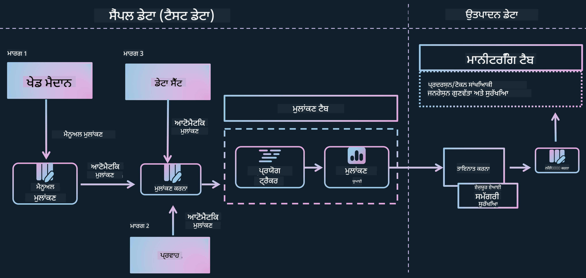

*ਚਿੱਤਰ ਸਰੋਤ: [Evaluation of generative AI applications](https://learn.microsoft.com/azure/ai-studio/concepts/evaluation-approach-gen-ai?wt.mc_id%3Dstudentamb_279723)*

> [!NOTE]
>
> Phi-3 / Phi-3.5 ਬਾਰੇ ਹੋਰ ਵਿਸਥਾਰਿਤ ਜਾਣਕਾਰੀ ਅਤੇ ਵਾਧੂ ਸਰੋਤਾਂ ਲਈ, ਕਿਰਪਾ ਕਰਕੇ [Phi-3CookBook](https://github.com/microsoft/Phi-3CookBook?wt.mc_id=studentamb_279723) ਵੇਖੋ।

### ਲੋੜੀਂਦੀਆਂ ਚੀਜ਼ਾਂ

- [Python](https://www.python.org/downloads)
- [Azure subscription](https://azure.microsoft.com/free?wt.mc_id=studentamb_279723)
- [Visual Studio Code](https://code.visualstudio.com)
- Fine-tuned Phi-3 / Phi-3.5 ਮਾਡਲ

### ਸਮੱਗਰੀ ਦੀ ਸੂਚੀ

1. [**ਸਕੈਨਾਰੀਓ 1: Azure AI Foundry ਦੇ Prompt flow ਮੁਲਾਂਕਣ ਦਾ ਪਰਿਚਯ**](../../../../../../md/02.Application/01.TextAndChat/Phi3)

    - [ਸੁਰੱਖਿਆ ਮੁਲਾਂਕਣ ਦਾ ਪਰਿਚਯ](../../../../../../md/02.Application/01.TextAndChat/Phi3)
    - [ਪ੍ਰਦਰਸ਼ਨ ਮੁਲਾਂਕਣ ਦਾ ਪਰਿਚਯ](../../../../../../md/02.Application/01.TextAndChat/Phi3)

1. [**ਸਕੈਨਾਰੀਓ 2: Azure AI Foundry ਵਿੱਚ Phi-3 / Phi-3.5 ਮਾਡਲ ਦਾ ਮੁਲਾਂਕਣ**](../../../../../../md/02.Application/01.TextAndChat/Phi3)

    - [ਸ਼ੁਰੂ ਕਰਨ ਤੋਂ ਪਹਿਲਾਂ](../../../../../../md/02.Application/01.TextAndChat/Phi3)
    - [Phi-3 / Phi-3.5 ਮਾਡਲ ਦਾ ਮੁਲਾਂਕਣ ਕਰਨ ਲਈ Azure OpenAI ਨੂੰ ਡਿਪਲੌਏ ਕਰੋ](../../../../../../md/02.Application/01.TextAndChat/Phi3)
    - [Azure AI Foundry ਦੇ Prompt flow ਮੁਲਾਂਕਣ ਨਾਲ Fine-tuned Phi-3 / Phi-3.5 ਮਾਡਲ ਦਾ ਮੁਲਾਂਕਣ ਕਰੋ](../../../../../../md/02.Application/01.TextAndChat/Phi3)

1. [ਮੁਬਾਰਕਾਂ!](../../../../../../md/02.Application/01.TextAndChat/Phi3)

## **ਸਕੈਨਾਰੀਓ 1: Azure AI Foundry ਦੇ Prompt flow ਮੁਲਾਂਕਣ ਦਾ ਪਰਿਚਯ**

### ਸੁਰੱਖਿਆ ਮੁਲਾਂਕਣ ਦਾ ਪਰਿਚਯ

ਇਹ ਯਕੀਨੀ ਬਣਾਉਣ ਲਈ ਕਿ ਤੁਹਾਡਾ AI ਮਾਡਲ ਨੈਤਿਕ ਅਤੇ ਸੁਰੱਖਿਅਤ ਹੈ, ਇਹ ਜਰੂਰੀ ਹੈ ਕਿ ਤੁਸੀਂ ਇਸਨੂੰ Microsoft ਦੇ ਜ਼ਿੰਮੇਵਾਰ AI ਸਿਧਾਂਤਾਂ ਦੇ ਖਿਲਾਫ ਮੁਲਾਂਕਣ ਕਰੋ। Azure AI Foundry ਵਿੱਚ, ਸੁਰੱਖਿਆ ਮੁਲਾਂਕਣ ਤੁਹਾਨੂੰ ਮਾਡਲ ਦੀ jailbreak ਹਮਲਿਆਂ ਵੱਲ ਸੰਵੇਦਨਸ਼ੀਲਤਾ ਅਤੇ ਨੁਕਸਾਨਦਾਇਕ ਸਮੱਗਰੀ ਬਣਾਉਣ ਦੀ ਸੰਭਾਵਨਾ ਦਾ ਮੁਲਾਂਕਣ ਕਰਨ ਦਿੰਦੇ ਹਨ, ਜੋ ਸਿੱਧੇ ਤੌਰ 'ਤੇ ਇਨ੍ਹਾਂ ਸਿਧਾਂਤਾਂ ਨਾਲ ਮੇਲ ਖਾਂਦੇ ਹਨ।

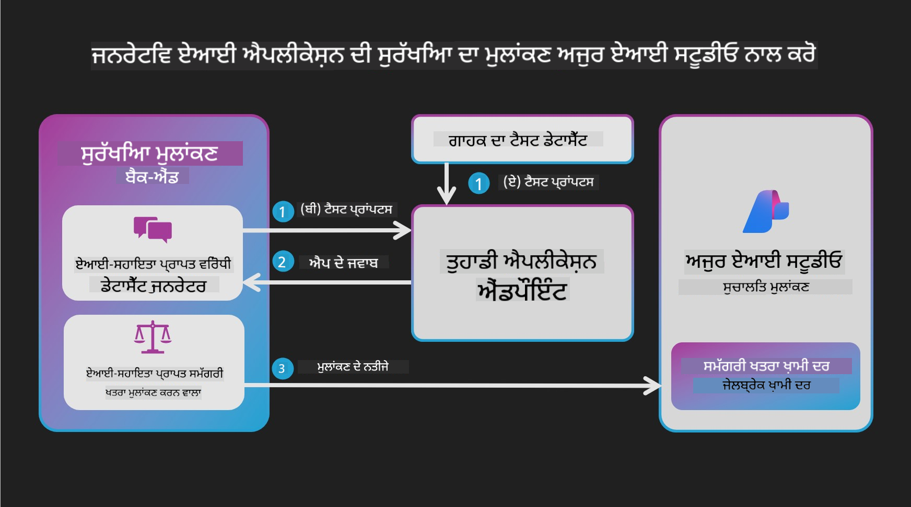

*ਚਿੱਤਰ ਸਰੋਤ: [Evaluation of generative AI applications](https://learn.microsoft.com/azure/ai-studio/concepts/evaluation-approach-gen-ai?wt.mc_id%3Dstudentamb_279723)*

#### Microsoft ਦੇ ਜ਼ਿੰਮੇਵਾਰ AI ਸਿਧਾਂਤ

ਤਕਨੀਕੀ ਕਦਮ ਸ਼ੁਰੂ ਕਰਨ ਤੋਂ ਪਹਿਲਾਂ, Microsoft ਦੇ ਜ਼ਿੰਮੇਵਾਰ AI ਸਿਧਾਂਤਾਂ ਨੂੰ ਸਮਝਣਾ ਜਰੂਰੀ ਹੈ, ਜੋ ਕਿ AI ਸਿਸਟਮਾਂ ਦੀ ਜ਼ਿੰਮੇਵਾਰ ਵਿਕਾਸ, ਤਾਇਨਾਤੀ ਅਤੇ ਚਲਾਉਣ ਲਈ ਇੱਕ ਨੈਤਿਕ ਢਾਂਚਾ ਹੈ। ਇਹ ਸਿਧਾਂਤ AI ਸਿਸਟਮਾਂ ਦੇ ਜ਼ਿੰਮੇਵਾਰ ਡਿਜ਼ਾਈਨ, ਵਿਕਾਸ ਅਤੇ ਤਾਇਨਾਤੀ ਨੂੰ ਮਦਦ ਕਰਦੇ ਹਨ, ਇਹ ਯਕੀਨੀ ਬਣਾਉਂਦੇ ਹਨ ਕਿ AI ਤਕਨੀਕਾਂ ਇਨਸਾਫ਼, ਪਾਰਦਰਸ਼ੀ ਅਤੇ ਸ਼ਾਮਿਲ ਕਰਦੀਆਂ ਹਨ। ਇਹ ਸਿਧਾਂਤ AI ਮਾਡਲਾਂ ਦੀ ਸੁਰੱਖਿਆ ਮੁਲਾਂਕਣ ਲਈ ਬੁਨਿਆਦ ਹਨ।

Microsoft ਦੇ ਜ਼ਿੰਮੇਵਾਰ AI ਸਿਧਾਂਤ ਵਿੱਚ ਸ਼ਾਮਲ ਹਨ:

- **ਇਨਸਾਫ਼ ਅਤੇ ਸ਼ਾਮਿਲਤਾ**: AI ਸਿਸਟਮਾਂ ਨੂੰ ਹਰ ਕਿਸੇ ਨਾਲ ਇਨਸਾਫ਼ ਨਾਲ ਪੇਸ਼ ਆਉਣਾ ਚਾਹੀਦਾ ਹੈ ਅਤੇ ਸਮਾਨ ਹਾਲਾਤ ਵਾਲੇ ਸਮੂਹਾਂ ਨੂੰ ਵੱਖ-ਵੱਖ ਤਰੀਕਿਆਂ ਨਾਲ ਪ੍ਰਭਾਵਿਤ ਨਹੀਂ ਕਰਨਾ ਚਾਹੀਦਾ। ਉਦਾਹਰਨ ਵਜੋਂ, ਜਦੋਂ AI ਸਿਸਟਮ ਮੈਡੀਕਲ ਇਲਾਜ, ਲੋਨ ਅਰਜ਼ੀਆਂ ਜਾਂ ਨੌਕਰੀ ਲਈ ਮਦਦ ਕਰਦੇ ਹਨ, ਤਾਂ ਉਹ ਉਹਨਾਂ ਸਭ ਨੂੰ ਇੱਕੋ ਜਿਹੇ ਸੁਝਾਅ ਦੇਣ ਜੋੜੇ ਜੋ ਸਮਾਨ ਲੱਛਣ, ਵਿੱਤੀ ਹਾਲਾਤ ਜਾਂ ਪੇਸ਼ੇਵਰ ਯੋਗਤਾਵਾਂ ਰੱਖਦੇ ਹਨ।

- **ਭਰੋਸੇਯੋਗਤਾ ਅਤੇ ਸੁਰੱਖਿਆ**: ਭਰੋਸਾ ਬਣਾਉਣ ਲਈ, ਇਹ ਜਰੂਰੀ ਹੈ ਕਿ AI ਸਿਸਟਮ ਭਰੋਸੇਯੋਗ, ਸੁਰੱਖਿਅਤ ਅਤੇ ਲਗਾਤਾਰ ਕੰਮ ਕਰਨ। ਇਹ ਸਿਸਟਮ ਉਸ ਤਰੀਕੇ ਨਾਲ ਕੰਮ ਕਰਨ ਜੋ ਉਹ ਪਹਿਲਾਂ ਬਣਾਏ ਗਏ ਸਨ, ਅਣਪੇਸ਼ਕਸ਼ਿਤ ਹਾਲਾਤਾਂ ਵਿੱਚ ਸੁਰੱਖਿਅਤ ਜਵਾਬ ਦੇਣ ਅਤੇ ਨੁਕਸਾਨਦਾਇਕ ਚਾਲਾਂ ਤੋਂ ਬਚਣ ਯੋਗ ਹੋਣ। ਉਹ ਕਿਸ ਤਰ੍ਹਾਂ ਵਰਤਦੇ ਹਨ ਅਤੇ ਕਿਹੜੇ ਹਾਲਾਤ ਸੰਭਾਲ ਸਕਦੇ ਹਨ, ਇਹ ਵਿਕਾਸਕਾਰਾਂ ਨੇ ਡਿਜ਼ਾਈਨ ਅਤੇ ਟੈਸਟਿੰਗ ਦੌਰਾਨ ਸੋਚੇ ਹੋਏ ਹਾਲਾਤਾਂ ਨੂੰ ਦਰਸਾਉਂਦਾ ਹੈ।

- **ਪਾਰਦਰਸ਼ਤਾ**: ਜਦੋਂ AI ਸਿਸਟਮ ਲੋਕਾਂ ਦੀ ਜ਼ਿੰਦਗੀ 'ਤੇ ਵੱਡੇ ਪ੍ਰਭਾਵ ਵਾਲੇ ਫੈਸਲੇ ਕਰਨ ਵਿੱਚ ਮਦਦ ਕਰਦੇ ਹਨ, ਤਾਂ ਲੋਕਾਂ ਲਈ ਇਹ ਸਮਝਣਾ ਜਰੂਰੀ ਹੁੰਦਾ ਹੈ ਕਿ ਇਹ ਫੈਸਲੇ ਕਿਵੇਂ ਲਏ ਗਏ। ਉਦਾਹਰਨ ਵਜੋਂ, ਇੱਕ ਬੈਂਕ AI ਸਿਸਟਮ ਦੀ ਵਰਤੋਂ ਕਰ ਸਕਦੀ ਹੈ ਇਹ ਨਿਰਣੇ ਲਈ ਕਿ ਕੋਈ ਵਿਅਕਤੀ ਕਰਜ਼ਾ ਲਾਇਕ ਹੈ ਜਾਂ ਨਹੀਂ। ਇੱਕ ਕੰਪਨੀ AI ਸਿਸਟਮ ਦੀ ਵਰਤੋਂ ਕਰ ਸਕਦੀ ਹੈ ਸਭ ਤੋਂ ਯੋਗ ਉਮੀਦਵਾਰਾਂ ਦੀ ਚੋਣ ਕਰਨ ਲਈ।

- **ਪ੍ਰਾਈਵੇਸੀ ਅਤੇ ਸੁਰੱਖਿਆ**: ਜਿਵੇਂ AI ਵਧਦਾ ਜਾ ਰਿਹਾ ਹੈ, ਪ੍ਰਾਈਵੇਸੀ ਦੀ ਰੱਖਿਆ ਅਤੇ ਨਿੱਜੀ ਅਤੇ ਵਪਾਰਕ ਜਾਣਕਾਰੀ ਦੀ ਸੁਰੱਖਿਆ ਹੋਰ ਜ਼ਰੂਰੀ ਅਤੇ ਜਟਿਲ ਹੋ ਰਹੀ ਹੈ। AI ਨਾਲ, ਪ੍ਰਾਈਵੇਸੀ ਅਤੇ ਡਾਟਾ ਸੁਰੱਖਿਆ 'ਤੇ ਖਾਸ ਧਿਆਨ ਦੇਣਾ ਲਾਜ਼ਮੀ ਹੈ ਕਿਉਂਕਿ ਡਾਟਾ ਤੱਕ ਪਹੁੰਚ AI ਸਿਸਟਮਾਂ ਨੂੰ ਲੋਕਾਂ ਬਾਰੇ ਸਹੀ ਅਤੇ ਜਾਣੂ ਅੰਦਾਜ਼ੇ ਅਤੇ ਫੈਸਲੇ ਕਰਨ ਲਈ ਲੋੜੀਂਦੀ ਹੈ।

- **ਜਵਾਬਦੇਹੀ**: ਜਿਹੜੇ ਲੋਕ AI ਸਿਸਟਮ ਡਿਜ਼ਾਈਨ ਅਤੇ ਤਾਇਨਾਤ ਕਰਦੇ ਹਨ, ਉਹਨਾਂ ਨੂੰ ਆਪਣੇ ਸਿਸਟਮਾਂ ਦੇ ਕੰਮ ਕਰਨ ਲਈ ਜਵਾਬਦੇਹ ਹੋਣਾ ਚਾਹੀਦਾ ਹੈ। ਸੰਸਥਾਵਾਂ ਨੂੰ ਉਦਯੋਗ ਮਿਆਰਾਂ ਨੂੰ ਧਿਆਨ ਵਿੱਚ ਰੱਖ ਕੇ ਜਵਾਬਦੇਹੀ ਦੇ ਨਿਯਮ ਬਣਾਉਣੇ ਚਾਹੀਦੇ ਹਨ। ਇਹ ਨਿਯਮ ਇਹ ਯਕੀਨੀ ਬਣਾਉਂਦੇ ਹਨ ਕਿ AI ਸਿਸਟਮ ਲੋਕਾਂ ਦੀ ਜ਼ਿੰਦਗੀ 'ਤੇ ਪ੍ਰਭਾਵ ਪਾਉਣ ਵਾਲੇ ਕਿਸੇ ਵੀ ਫੈਸਲੇ ਦਾ ਆਖਰੀ ਅਧਿਕਾਰੀ ਨਾ ਹੋਣ। ਇਹ ਇਹ ਵੀ ਯਕੀਨੀ ਬਣਾਉਂਦੇ ਹਨ ਕਿ ਮਨੁੱਖੀ ਹੱਥਾਂ ਕੋਲ ਅਜੇ ਵੀ ਉਹਨਾਂ ਬਹੁਤ ਜ਼ਿਆਦਾ ਖੁਦਮੁਖਤਿਆਰ AI ਸਿਸਟਮਾਂ 'ਤੇ ਮਾਇਨੇਦਾਰ ਨਿਯੰਤਰਣ ਹੋਵੇ।

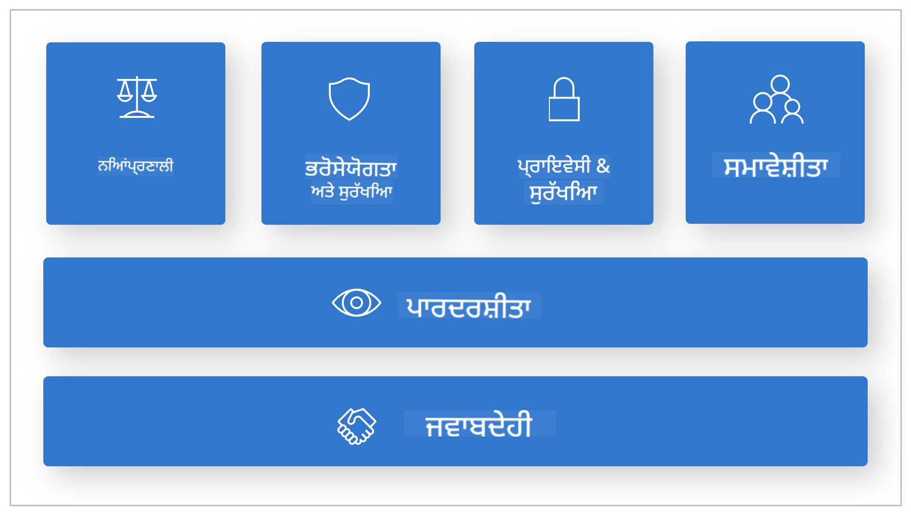

*ਚਿੱਤਰ ਸਰੋਤ: [What is Responsible AI?](https://learn.microsoft.com/azure/machine-learning/concept-responsible-ai?view=azureml-api-2&viewFallbackFrom=azureml-api-2%253fwt.mc_id%3Dstudentamb_279723)*

> [!NOTE]
> Microsoft ਦੇ ਜ਼ਿੰਮੇਵਾਰ AI ਸਿਧਾਂਤਾਂ ਬਾਰੇ ਹੋਰ ਜਾਣਨ ਲਈ, ਕਿਰਪਾ ਕਰਕੇ [What is Responsible AI?](https://learn.microsoft.com/azure/machine-learning/concept-responsible-ai?view=azureml-api-2?wt.mc_id=studentamb_279723) ਵੇਖੋ।

#### ਸੁਰੱਖਿਆ ਮੈਟਰਿਕਸ

ਇਸ ਟਿਊਟੋਰਿਅਲ ਵਿੱਚ, ਤੁਸੀਂ Azure AI Foundry ਦੇ ਸੁਰੱਖਿਆ ਮੈਟਰਿਕਸ ਦੀ ਵਰਤੋਂ ਕਰਕੇ Fine-tuned Phi-3 ਮਾਡਲ ਦੀ ਸੁਰੱਖਿਆ ਦਾ ਮੁਲਾਂਕਣ ਕਰੋਗੇ। ਇਹ ਮੈਟਰਿਕਸ ਤੁਹਾਨੂੰ ਮਾਡਲ ਦੀ ਨੁਕਸਾਨਦਾਇਕ ਸਮੱਗਰੀ ਬਣਾਉਣ ਦੀ ਸੰਭਾਵਨਾ ਅਤੇ jailbreak ਹਮਲਿਆਂ ਵੱਲ ਇਸ ਦੀ ਸੰਵੇਦਨਸ਼ੀਲਤਾ ਦਾ ਮੁਲਾਂਕਣ ਕਰਨ ਵਿੱਚ ਮਦਦ ਕਰਦੇ ਹਨ। ਸੁਰੱਖਿਆ ਮੈਟਰਿਕਸ ਵਿੱਚ ਸ਼ਾਮਲ ਹਨ:

- **ਆਤਮ-ਹਾਨੀ ਨਾਲ ਸੰਬੰਧਿਤ ਸਮੱਗਰੀ**: ਮੁਲਾਂਕਣ ਕਰਦਾ ਹੈ ਕਿ ਮਾਡਲ ਵਿੱਚ ਆਤਮ-ਹਾਨੀ ਨਾਲ ਸੰਬੰਧਿਤ ਸਮੱਗਰੀ ਬਣਾਉਣ ਦੀ ਰੁਝਾਨ ਹੈ ਜਾਂ ਨਹੀਂ।
- **ਘਿਣਾਵਣੀ ਅਤੇ ਅਨਿਆਇਕ ਸਮੱਗਰੀ**: ਮੁਲਾਂਕਣ ਕਰਦਾ ਹੈ ਕਿ ਮਾਡਲ ਵਿੱਚ ਘਿਣਾਵਣੀ ਜਾਂ ਅਨਿਆਇਕ ਸਮੱਗਰੀ ਬਣਾਉਣ ਦੀ ਰੁਝਾਨ ਹੈ ਜਾਂ ਨਹੀਂ।
- **ਹਿੰਸਕ ਸਮੱਗਰੀ**: ਮੁਲਾਂਕਣ ਕਰਦਾ ਹੈ ਕਿ ਮਾਡਲ ਵਿੱਚ ਹਿੰਸਕ ਸਮੱਗਰੀ ਬਣਾਉਣ ਦੀ ਰੁਝਾਨ ਹੈ ਜਾਂ ਨਹੀਂ।
- **ਯੌਨ ਸਮੱਗਰੀ**: ਮੁਲਾਂਕਣ ਕਰਦਾ ਹੈ ਕਿ ਮਾਡਲ ਵਿੱਚ ਅਣਚਾਹੀ ਯੌਨ ਸਮੱਗਰੀ ਬਣਾਉਣ ਦੀ ਰੁਝਾਨ ਹੈ ਜਾਂ ਨਹੀਂ।

ਇਨ੍ਹਾਂ ਪੱਖਾਂ ਦਾ ਮੁਲਾਂਕਣ ਇਹ ਯਕੀਨੀ ਬਣਾਉਂਦਾ ਹੈ ਕਿ AI ਮਾਡਲ ਨੁਕਸਾਨਦਾਇਕ ਜਾਂ ਆਪਤੀਜਨਕ ਸਮੱਗਰੀ ਨਹੀਂ ਬਣਾਉਂਦਾ, ਜੋ ਸਮਾਜਿਕ ਮੁੱਲਾਂ ਅਤੇ ਨਿਯਮਾਂ ਦੇ ਅਨੁਕੂਲ ਹੈ।

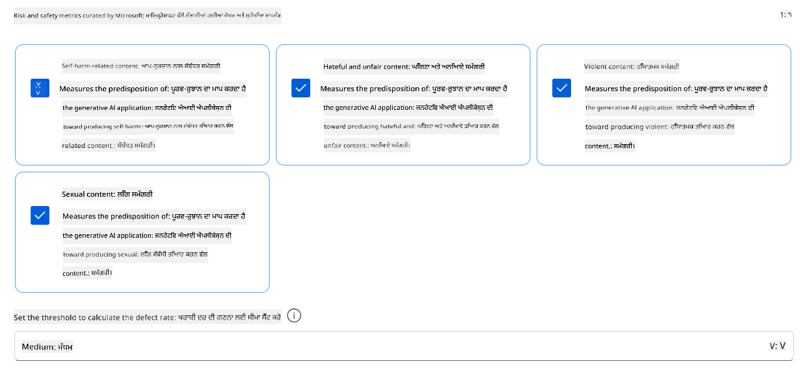

### ਪ੍ਰਦਰਸ਼ਨ ਮੁਲਾਂਕਣ ਦਾ ਪਰਿਚਯ

ਇਹ ਯਕੀਨੀ ਬਣਾਉਣ ਲਈ ਕਿ ਤੁਹਾਡਾ AI ਮਾਡਲ ਉਮੀਦ ਮੁਤਾਬਕ ਕੰਮ ਕਰ ਰਿਹਾ ਹੈ, ਇਹ ਜਰੂਰੀ ਹੈ ਕਿ ਤੁਸੀਂ ਇਸਦਾ ਪ੍ਰਦਰਸ਼ਨ ਪ੍ਰਦਰਸ਼ਨ ਮੈਟਰਿਕਸ ਦੇ ਖਿਲਾਫ ਮੁਲਾਂਕਣ ਕਰੋ। Azure AI Foundry ਵਿੱਚ, ਪ੍ਰਦਰਸ਼ਨ ਮੁਲਾਂਕਣ ਤੁਹਾਨੂੰ ਮਾਡਲ ਦੀ ਪ੍ਰਭਾਵਸ਼ੀਲਤਾ ਦਾ ਮੁਲਾਂਕਣ ਕਰਨ ਦਿੰਦਾ ਹੈ ਕਿ ਇਹ ਸਹੀ, ਸਬੰਧਤ ਅਤੇ ਸੁਚੱਜੇ ਜਵਾਬ ਕਿੰਨੇ ਚੰਗੇ ਤਰੀਕੇ ਨਾਲ ਪੈਦਾ ਕਰਦਾ ਹੈ।

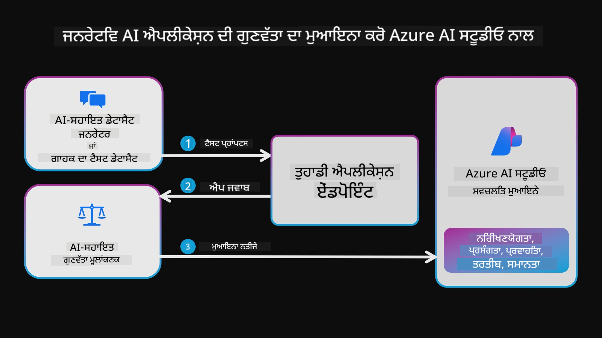

*ਚਿੱਤਰ ਸਰੋਤ: [Evaluation of generative AI applications](https://learn.microsoft.com/azure/ai-studio/concepts/evaluation-approach-gen-ai?wt.mc_id%3Dstudentamb_279723)*

#### ਪ੍ਰਦਰਸ਼ਨ ਮੈਟਰਿਕਸ

ਇਸ ਟਿਊਟੋਰਿਅਲ ਵਿੱਚ, ਤੁਸੀਂ Azure AI Foundry ਦੇ ਪ੍ਰਦਰਸ਼ਨ ਮੈਟਰਿਕਸ ਦੀ ਵਰਤੋਂ ਕਰਕੇ Fine-tuned Phi-3 / Phi-3.5 ਮਾਡਲ ਦਾ ਪ੍ਰਦਰਸ਼ਨ ਮੁਲਾਂਕਣ ਕਰੋਗੇ। ਇਹ ਮੈਟਰਿਕਸ ਤੁਹਾਨੂੰ ਮਾਡਲ ਦੀ ਪ੍ਰਭਾਵਸ਼ੀਲਤਾ ਦਾ ਮੁਲਾਂਕਣ ਕਰਨ ਵਿੱਚ ਮਦਦ ਕਰਦੇ ਹਨ ਕਿ ਇਹ ਸਹੀ, ਸਬੰਧਤ ਅਤੇ ਸੁਚੱਜੇ ਜਵਾਬ ਕਿੰਨੇ ਚੰਗੇ ਤਰੀਕੇ ਨਾਲ ਪੈਦਾ ਕਰਦਾ ਹੈ। ਪ੍ਰਦਰਸ਼ਨ ਮੈਟਰਿਕਸ ਵਿੱਚ ਸ਼ਾਮਲ ਹਨ:

- **Groundedness**: ਮੁਲਾਂਕਣ ਕਰਦਾ ਹੈ ਕਿ ਪੈਦਾ ਕੀਤੇ ਜਵਾਬ ਇਨਪੁਟ ਸਰੋਤ ਦੀ ਜਾਣਕਾਰੀ ਨਾਲ ਕਿੰਨੇ ਮੇਲ ਖਾਂਦੇ ਹਨ।
- **Relevance**: ਮੁਲਾਂਕਣ ਕਰਦਾ ਹੈ ਕਿ ਜਵਾਬ ਦਿੱਤੇ ਗਏ ਸਵਾਲਾਂ ਨਾਲ ਕਿੰਨੇ ਸਬੰਧਤ ਹਨ।
- **Coherence**: ਮੁਲਾਂਕਣ ਕਰਦਾ ਹੈ ਕਿ ਪੈਦਾ ਕੀਤਾ ਲਿਖਤ ਕਿਵੇਂ ਸੁਚੱਜਾ, ਕੁਦਰਤੀ ਅਤੇ ਮਨੁੱਖੀ ਬੋਲਚਾਲ ਵਰਗਾ ਹੈ।
- **Fluency**: ਮੁਲਾਂਕਣ ਕਰਦਾ ਹੈ ਕਿ ਪੈਦਾ ਕੀਤਾ ਲਿਖਤ ਭਾਸ਼ਾ ਦੱਖਲ ਵਿੱਚ ਕਿੰਨਾ ਪ੍ਰਵੀਂਨ ਹੈ।
- **GPT Similarity**: ਪੈਦਾ ਕੀਤੇ ਜਵਾਬ ਦੀ ਮੂਲ ਸੱਚਾਈ ਨਾਲ ਮਿਲਾਪ ਦੀ ਤੁਲਨਾ ਕਰਦਾ ਹੈ।
- **F1 Score**: ਪੈਦਾ ਕੀਤੇ ਜਵਾਬ ਅਤੇ ਸਰੋਤ ਡਾਟਾ ਵਿੱਚ ਸਾਂਝੇ ਸ਼ਬਦਾਂ ਦਾ ਅਨੁਪਾਤ ਕੈਲਕੁਲੇਟ ਕਰਦਾ ਹੈ।

ਇਹ ਮੈਟਰਿਕਸ ਤੁਹਾਨੂੰ ਮਾਡਲ ਦੀ ਪ੍ਰਭਾਵਸ਼ੀਲਤਾ ਦਾ ਮੁਲਾਂਕਣ ਕਰਨ ਵਿੱਚ ਮਦਦ ਕਰਦੇ ਹਨ ਕਿ ਇਹ ਸਹੀ, ਸਬੰਧਤ ਅਤੇ ਸੁਚੱਜੇ ਜਵਾਬ ਪੈਦਾ ਕਰਦਾ ਹੈ।


## **ਸਕੈਨਾਰੀਓ 2: Azure AI Foundry ਵਿੱਚ Phi-3 / Phi-3.5 ਮਾਡਲ ਦਾ ਮੁਲਾਂਕਣ**

### ਸ਼ੁਰੂ ਕਰਨ ਤੋਂ ਪਹਿਲਾਂ

ਇਹ ਟਿਊਟੋਰਿਅਲ ਪਹਿਲਾਂ ਦੇ ਬਲੌਗ ਪੋਸਟਾਂ "[Fine-Tune and Integrate Custom Phi-3 Models with Prompt Flow: Step-by-Step Guide](https://techcommunity.microsoft.com/t5/educator-developer-blog/fine-tune-and-integrate-custom-phi-3-models-with-prompt-flow/ba-p/4178612?wt.mc_id=studentamb_279723)" ਅਤੇ "[Fine-Tune and Integrate Custom Phi-3 Models with Prompt Flow in Azure AI Foundry](https://techcommunity.microsoft.com/t5/educator-developer-blog/fine-tune-and-integrate-custom-phi-3-models-with-prompt-flow-in/ba-p/4191726?wt.mc_id=studentamb_279723)" ਦਾ ਜਾਰੀ ਹੈ। ਇਨ੍ਹਾਂ ਪੋਸਟਾਂ ਵਿੱਚ, ਅਸੀਂ Azure AI Foundry ਵਿੱਚ Phi-3 / Phi-3.5 ਮਾਡਲ ਨੂੰ ਫਾਈਨ-ਟਿਊਨ ਕਰਨ ਅਤੇ Prompt flow ਨਾਲ ਇੰਟਿਗ੍ਰੇਟ ਕਰਨ ਦੀ ਪ੍ਰਕਿਰਿਆ ਦਿਖਾਈ।

ਇਸ ਟਿਊਟੋਰਿਅਲ ਵਿੱਚ, ਤੁਸੀਂ Azure AI Foundry ਵਿੱਚ ਇੱਕ Azure OpenAI ਮਾਡਲ ਨੂੰ ਮੁਲਾਂ


1. **Next** ਚੁਣੋ।

#### Azure AI Foundry ਪ੍ਰੋਜੈਕਟ ਬਣਾਓ

1. ਜਿਸ Hub ਨੂੰ ਤੁਸੀਂ ਬਣਾਇਆ ਹੈ, ਉਸ ਵਿੱਚ ਖੱਬੇ ਪਾਸੇ ਟੈਬ ਤੋਂ **All projects** ਚੁਣੋ।

1. ਨੈਵੀਗੇਸ਼ਨ ਮੀਨੂ ਤੋਂ **+ New project** ਚੁਣੋ।

    

1. **Project name** ਦਰਜ ਕਰੋ। ਇਹ ਇਕ ਵਿਲੱਖਣ ਮੁੱਲ ਹੋਣਾ ਚਾਹੀਦਾ ਹੈ।

    

1. **Create a project** ਚੁਣੋ।

#### ਫਾਈਨ-ਟਿਊਨ ਕੀਤੇ Phi-3 / Phi-3.5 ਮਾਡਲ ਲਈ ਕਸਟਮ ਕਨੈਕਸ਼ਨ ਸ਼ਾਮਲ ਕਰੋ

ਆਪਣੇ ਕਸਟਮ Phi-3 / Phi-3.5 ਮਾਡਲ ਨੂੰ Prompt flow ਨਾਲ ਜੋੜਨ ਲਈ, ਤੁਹਾਨੂੰ ਮਾਡਲ ਦੇ endpoint ਅਤੇ key ਨੂੰ ਇੱਕ ਕਸਟਮ ਕਨੈਕਸ਼ਨ ਵਿੱਚ ਸੇਵ ਕਰਨਾ ਪਵੇਗਾ। ਇਹ ਸੈਟਅਪ ਤੁਹਾਡੇ ਕਸਟਮ ਮਾਡਲ ਤੱਕ Prompt flow ਵਿੱਚ ਪਹੁੰਚ ਨੂੰ ਯਕੀਨੀ ਬਣਾਉਂਦਾ ਹੈ।

#### ਫਾਈਨ-ਟਿਊਨ ਕੀਤੇ Phi-3 / Phi-3.5 ਮਾਡਲ ਦਾ api key ਅਤੇ endpoint uri ਸੈਟ ਕਰੋ

1. [Azure ML Studio](https://ml.azure.com/home?wt.mc_id=studentamb_279723) 'ਤੇ ਜਾਓ।

1. ਉਸ Azure Machine learning ਵਰਕਸਪੇਸ ਤੇ ਜਾਓ ਜੋ ਤੁਸੀਂ ਬਣਾਇਆ ਹੈ।

1. ਖੱਬੇ ਪਾਸੇ ਟੈਬ ਤੋਂ **Endpoints** ਚੁਣੋ।

    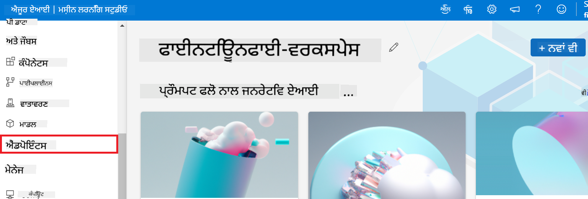

1. ਬਣਾਇਆ ਗਿਆ endpoint ਚੁਣੋ।

    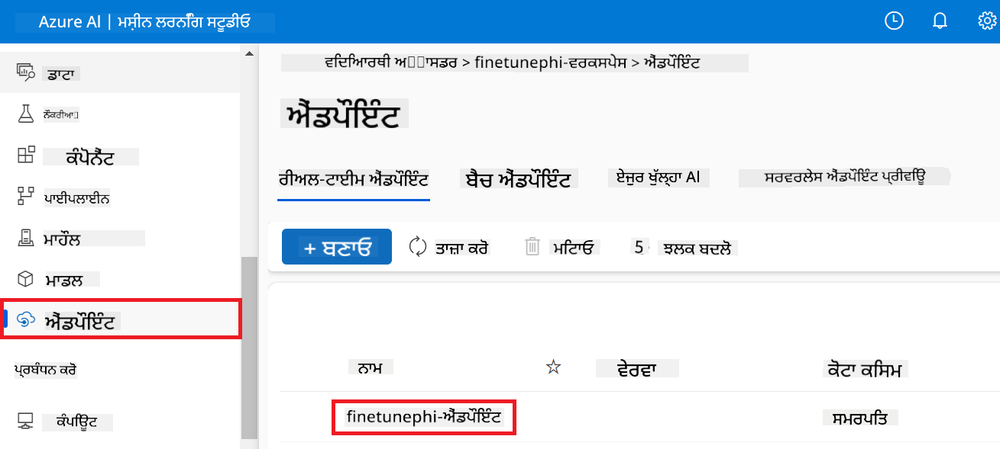

1. ਨੈਵੀਗੇਸ਼ਨ ਮੀਨੂ ਤੋਂ **Consume** ਚੁਣੋ।

1. ਆਪਣਾ **REST endpoint** ਅਤੇ **Primary key** ਕਾਪੀ ਕਰੋ।

    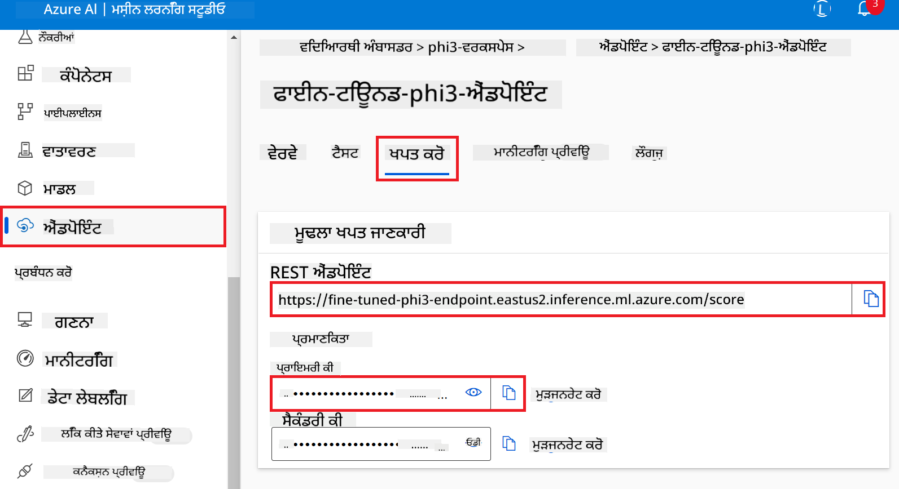

#### ਕਸਟਮ ਕਨੈਕਸ਼ਨ ਸ਼ਾਮਲ ਕਰੋ

1. [Azure AI Foundry](https://ai.azure.com/?wt.mc_id=studentamb_279723) 'ਤੇ ਜਾਓ।

1. ਉਸ Azure AI Foundry ਪ੍ਰੋਜੈਕਟ ਵਿੱਚ ਜਾਓ ਜੋ ਤੁਸੀਂ ਬਣਾਇਆ ਹੈ।

1. ਪ੍ਰੋਜੈਕਟ ਵਿੱਚ, ਖੱਬੇ ਪਾਸੇ ਟੈਬ ਤੋਂ **Settings** ਚੁਣੋ।

1. **+ New connection** ਚੁਣੋ।

    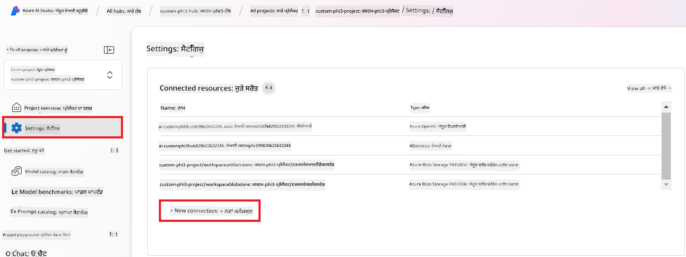

1. ਨੈਵੀਗੇਸ਼ਨ ਮੀਨੂ ਤੋਂ **Custom keys** ਚੁਣੋ।

    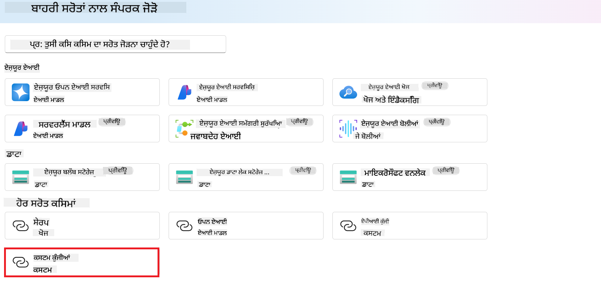

1. ਹੇਠ ਲਿਖੇ ਕੰਮ ਕਰੋ:

    - **+ Add key value pairs** ਚੁਣੋ।
    - key ਨਾਮ ਵਜੋਂ **endpoint** ਦਰਜ ਕਰੋ ਅਤੇ Azure ML Studio ਤੋਂ ਕਾਪੀ ਕੀਤਾ endpoint value ਖੇਤਰ ਵਿੱਚ ਪੇਸਟ ਕਰੋ।
    - ਫਿਰ ਇੱਕ ਵਾਰ ਫਿਰ **+ Add key value pairs** ਚੁਣੋ।
    - key ਨਾਮ ਵਜੋਂ **key** ਦਰਜ ਕਰੋ ਅਤੇ Azure ML Studio ਤੋਂ ਕਾਪੀ ਕੀਤਾ key value ਖੇਤਰ ਵਿੱਚ ਪੇਸਟ ਕਰੋ।
    - keys ਸ਼ਾਮਲ ਕਰਨ ਤੋਂ ਬਾਅਦ, key ਨੂੰ ਖੁਲਾਸਾ ਹੋਣ ਤੋਂ ਬਚਾਉਣ ਲਈ **is secret** ਚੁਣੋ।

    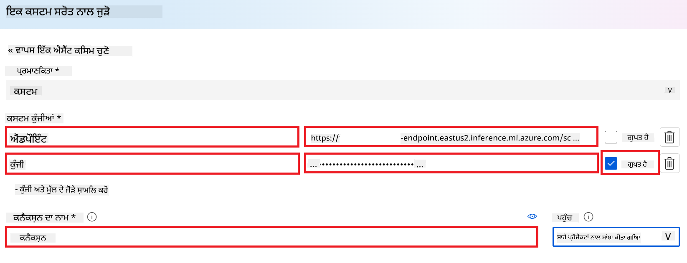

1. **Add connection** ਚੁਣੋ।

#### Prompt flow ਬਣਾਓ

ਤੁਸੀਂ Azure AI Foundry ਵਿੱਚ ਇੱਕ ਕਸਟਮ ਕਨੈਕਸ਼ਨ ਸ਼ਾਮਲ ਕਰ ਦਿੱਤਾ ਹੈ। ਹੁਣ, ਹੇਠ ਲਿਖੇ ਕਦਮਾਂ ਨਾਲ ਇੱਕ Prompt flow ਬਣਾਓ। ਫਿਰ, ਇਸ Prompt flow ਨੂੰ ਕਸਟਮ ਕਨੈਕਸ਼ਨ ਨਾਲ ਜੋੜ ਕੇ ਫਾਈਨ-ਟਿਊਨ ਕੀਤੇ ਮਾਡਲ ਨੂੰ Prompt flow ਵਿੱਚ ਵਰਤੋਂ ਲਈ ਕਨੈਕਟ ਕਰੋਗੇ।

1. ਉਸ Azure AI Foundry ਪ੍ਰੋਜੈਕਟ ਵਿੱਚ ਜਾਓ ਜੋ ਤੁਸੀਂ ਬਣਾਇਆ ਹੈ।

1. ਖੱਬੇ ਪਾਸੇ ਟੈਬ ਤੋਂ **Prompt flow** ਚੁਣੋ।

1. ਨੈਵੀਗੇਸ਼ਨ ਮੀਨੂ ਤੋਂ **+ Create** ਚੁਣੋ।

    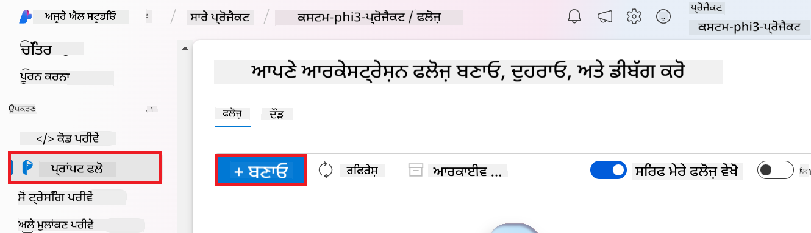

1. ਨੈਵੀਗੇਸ਼ਨ ਮੀਨੂ ਤੋਂ **Chat flow** ਚੁਣੋ।

    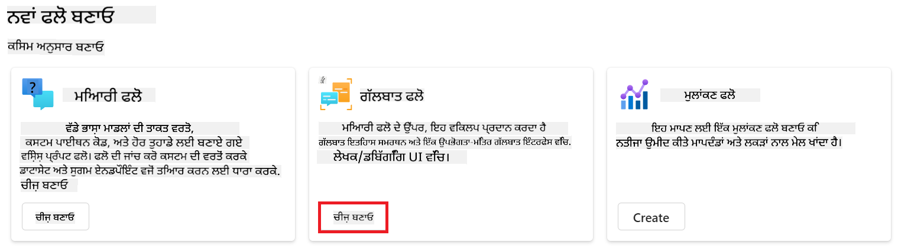

1. ਵਰਤਣ ਲਈ **Folder name** ਦਰਜ ਕਰੋ।

    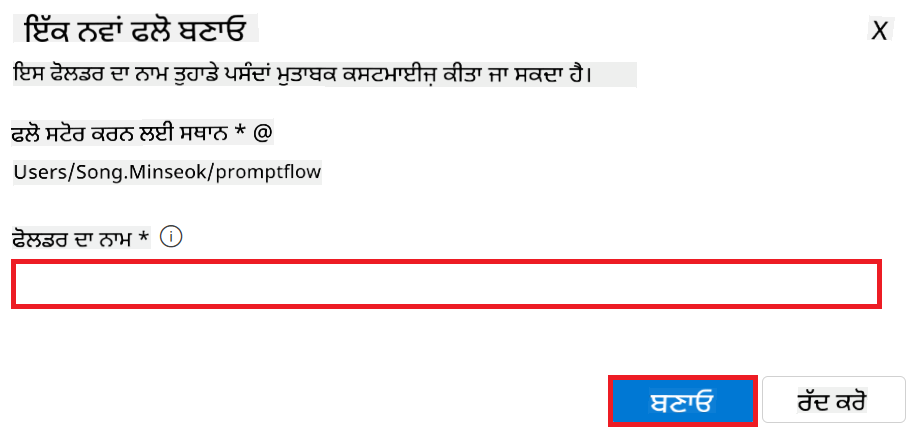

1. **Create** ਚੁਣੋ।

#### ਆਪਣੇ ਕਸਟਮ Phi-3 / Phi-3.5 ਮਾਡਲ ਨਾਲ ਗੱਲਬਾਤ ਲਈ Prompt flow ਸੈਟਅਪ ਕਰੋ

ਤੁਹਾਨੂੰ ਫਾਈਨ-ਟਿਊਨ ਕੀਤੇ Phi-3 / Phi-3.5 ਮਾਡਲ ਨੂੰ Prompt flow ਵਿੱਚ ਸ਼ਾਮਲ ਕਰਨਾ ਹੈ। ਮੌਜੂਦਾ ਦਿੱਤਾ ਗਿਆ Prompt flow ਇਸ ਮਕਸਦ ਲਈ ਬਣਾਇਆ ਨਹੀਂ ਗਿਆ। ਇਸ ਲਈ, ਤੁਹਾਨੂੰ Prompt flow ਨੂੰ ਮੁੜ ਡਿਜ਼ਾਈਨ ਕਰਨਾ ਪਵੇਗਾ ਤਾਂ ਜੋ ਕਸਟਮ ਮਾਡਲ ਨਾਲ ਇੰਟਿਗ੍ਰੇਸ਼ਨ ਹੋ ਸਕੇ।

1. Prompt flow ਵਿੱਚ, ਮੌਜੂਦਾ flow ਨੂੰ ਮੁੜ ਬਣਾਉਣ ਲਈ ਹੇਠ ਲਿਖੇ ਕੰਮ ਕਰੋ:

    - **Raw file mode** ਚੁਣੋ।
    - *flow.dag.yml* ਫਾਇਲ ਵਿੱਚ ਸਾਰੇ ਮੌਜੂਦਾ ਕੋਡ ਨੂੰ ਮਿਟਾ ਦਿਓ।
    - *flow.dag.yml* ਵਿੱਚ ਹੇਠ ਲਿਖਿਆ ਕੋਡ ਸ਼ਾਮਲ ਕਰੋ।

        ```yml
        inputs:
          input_data:
            type: string
            default: "Who founded Microsoft?"

        outputs:
          answer:
            type: string
            reference: ${integrate_with_promptflow.output}

        nodes:
        - name: integrate_with_promptflow
          type: python
          source:
            type: code
            path: integrate_with_promptflow.py
          inputs:
            input_data: ${inputs.input_data}
        ```

    - **Save** ਚੁਣੋ।

    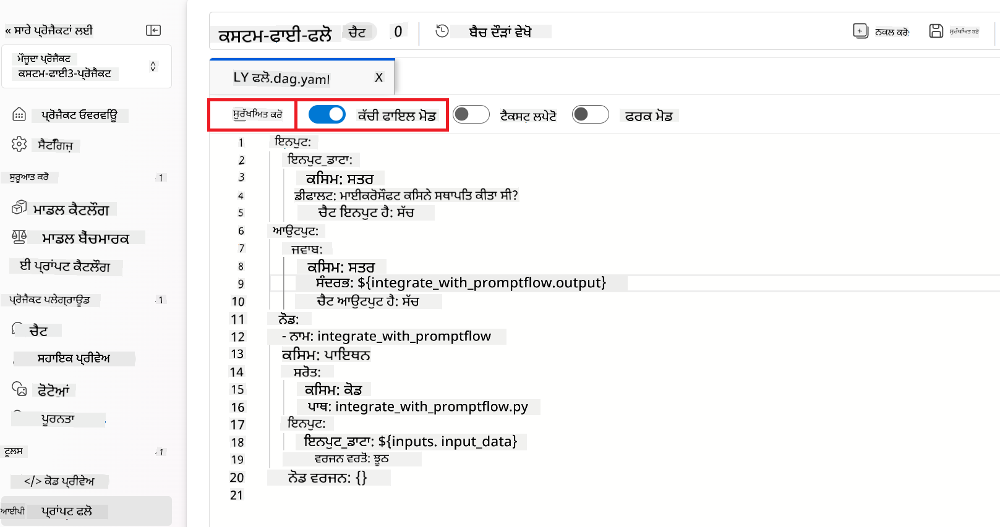

1. *integrate_with_promptflow.py* ਵਿੱਚ ਹੇਠ ਲਿਖਿਆ ਕੋਡ ਸ਼ਾਮਲ ਕਰੋ ਤਾਂ ਜੋ Prompt flow ਵਿੱਚ ਕਸਟਮ Phi-3 / Phi-3.5 ਮਾਡਲ ਵਰਤਿਆ ਜਾ ਸਕੇ।

    ```python
    import logging
    import requests
    from promptflow import tool
    from promptflow.connections import CustomConnection

    # Logging setup
    logging.basicConfig(
        format="%(asctime)s - %(levelname)s - %(name)s - %(message)s",
        datefmt="%Y-%m-%d %H:%M:%S",
        level=logging.DEBUG
    )
    logger = logging.getLogger(__name__)

    def query_phi3_model(input_data: str, connection: CustomConnection) -> str:
        """
        Send a request to the Phi-3 / Phi-3.5 model endpoint with the given input data using Custom Connection.
        """

        # "connection" is the name of the Custom Connection, "endpoint", "key" are the keys in the Custom Connection
        endpoint_url = connection.endpoint
        api_key = connection.key

        headers = {
            "Content-Type": "application/json",
            "Authorization": f"Bearer {api_key}"
        }
    data = {
        "input_data": [input_data],
        "params": {
            "temperature": 0.7,
            "max_new_tokens": 128,
            "do_sample": True,
            "return_full_text": True
            }
        }
        try:
            response = requests.post(endpoint_url, json=data, headers=headers)
            response.raise_for_status()
            
            # Log the full JSON response
            logger.debug(f"Full JSON response: {response.json()}")

            result = response.json()["output"]
            logger.info("Successfully received response from Azure ML Endpoint.")
            return result
        except requests.exceptions.RequestException as e:
            logger.error(f"Error querying Azure ML Endpoint: {e}")
            raise

    @tool
    def my_python_tool(input_data: str, connection: CustomConnection) -> str:
        """
        Tool function to process input data and query the Phi-3 / Phi-3.5 model.
        """
        return query_phi3_model(input_data, connection)

    ```

    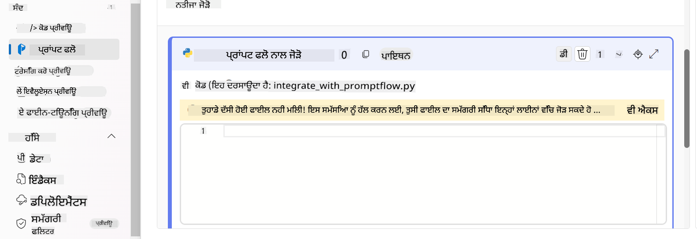

> [!NOTE]
> Azure AI Foundry ਵਿੱਚ Prompt flow ਵਰਤੋਂ ਬਾਰੇ ਵਧੇਰੇ ਜਾਣਕਾਰੀ ਲਈ, ਤੁਸੀਂ [Prompt flow in Azure AI Foundry](https://learn.microsoft.com/azure/ai-studio/how-to/prompt-flow) ਨੂੰ ਦੇਖ ਸਕਦੇ ਹੋ।

1. **Chat input**, **Chat output** ਚੁਣੋ ਤਾਂ ਜੋ ਮਾਡਲ ਨਾਲ ਗੱਲਬਾਤ ਯੋਗ ਹੋ ਜਾਵੇ।

    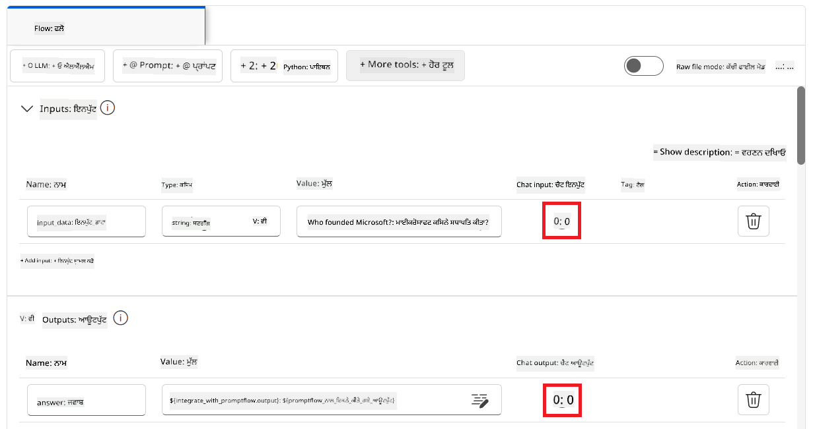

1. ਹੁਣ ਤੁਸੀਂ ਆਪਣੇ ਕਸਟਮ Phi-3 / Phi-3.5 ਮਾਡਲ ਨਾਲ ਗੱਲਬਾਤ ਕਰਨ ਲਈ ਤਿਆਰ ਹੋ। ਅਗਲੇ ਅਭਿਆਸ ਵਿੱਚ, ਤੁਸੀਂ ਸਿੱਖੋਗੇ ਕਿ Prompt flow ਕਿਵੇਂ ਸ਼ੁਰੂ ਕਰਨਾ ਹੈ ਅਤੇ ਇਸਨੂੰ ਆਪਣੇ ਫਾਈਨ-ਟਿਊਨ ਕੀਤੇ ਮਾਡਲ ਨਾਲ ਗੱਲਬਾਤ ਲਈ ਕਿਵੇਂ ਵਰਤਣਾ ਹੈ।

> [!NOTE]
>
> ਮੁੜ ਬਣਾਇਆ ਗਿਆ flow ਹੇਠਾਂ ਦਿੱਤੀ ਤਸਵੀਰ ਵਰਗਾ ਹੋਣਾ ਚਾਹੀਦਾ ਹੈ:
>
> 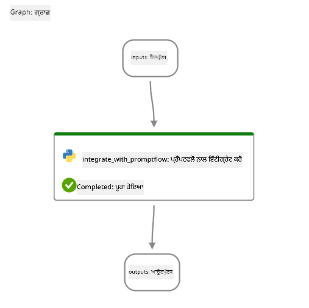
>

#### Prompt flow ਸ਼ੁਰੂ ਕਰੋ

1. Prompt flow ਸ਼ੁਰੂ ਕਰਨ ਲਈ **Start compute sessions** ਚੁਣੋ।

    

1. ਪੈਰਾਮੀਟਰ ਨਵੀਨਤਮ ਕਰਨ ਲਈ **Validate and parse input** ਚੁਣੋ।

    

1. ਆਪਣੇ ਬਣਾਏ ਕਸਟਮ ਕਨੈਕਸ਼ਨ ਦੀ **connection** ਦੀ **Value** ਚੁਣੋ। ਉਦਾਹਰਨ ਵਜੋਂ, *connection*।

    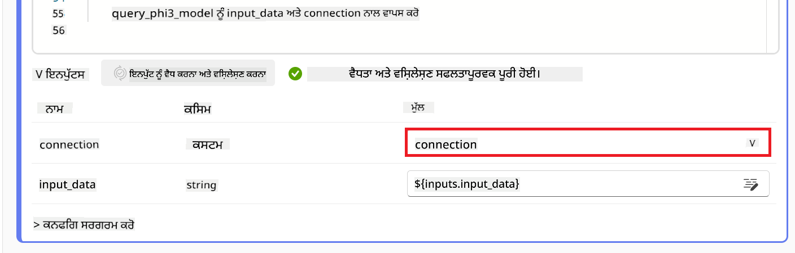

#### ਆਪਣੇ ਕਸਟਮ Phi-3 / Phi-3.5 ਮਾਡਲ ਨਾਲ ਗੱਲਬਾਤ ਕਰੋ

1. **Chat** ਚੁਣੋ।

    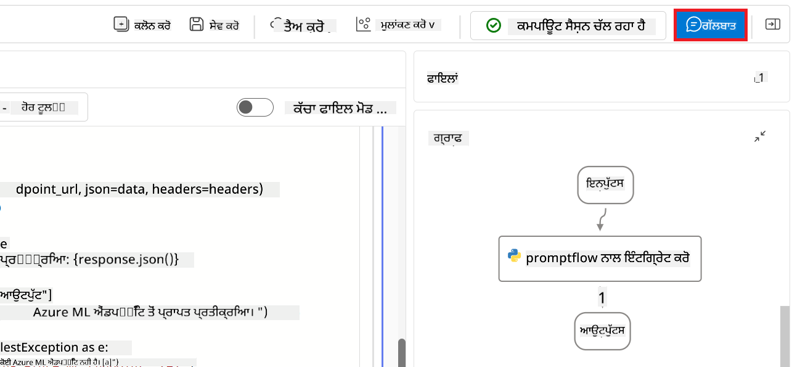

1. ਨਤੀਜਿਆਂ ਦਾ ਉਦਾਹਰਨ: ਹੁਣ ਤੁਸੀਂ ਆਪਣੇ ਕਸਟਮ Phi-3 / Phi-3.5 ਮਾਡਲ ਨਾਲ ਗੱਲਬਾਤ ਕਰ ਸਕਦੇ ਹੋ। ਸਿਫਾਰਸ਼ ਕੀਤੀ ਜਾਂਦੀ ਹੈ ਕਿ ਤੁਸੀਂ ਫਾਈਨ-ਟਿਊਨਿੰਗ ਲਈ ਵਰਤੇ ਡਾਟਾ ਦੇ ਆਧਾਰ 'ਤੇ ਸਵਾਲ ਪੁੱਛੋ।

    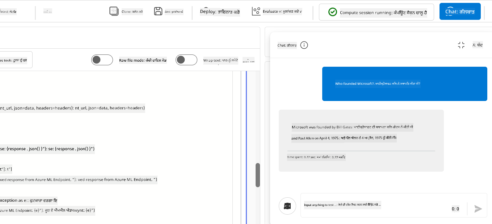

### Phi-3 / Phi-3.5 ਮਾਡਲ ਦਾ ਮੁਲਾਂਕਣ ਕਰਨ ਲਈ Azure OpenAI ਡਿਪਲੋਇ ਕਰੋ

Phi-3 / Phi-3.5 ਮਾਡਲ ਦਾ Azure AI Foundry ਵਿੱਚ ਮੁਲਾਂਕਣ ਕਰਨ ਲਈ, ਤੁਹਾਨੂੰ ਇੱਕ Azure OpenAI ਮਾਡਲ ਡਿਪਲੋਇ ਕਰਨਾ ਪਵੇਗਾ। ਇਹ ਮਾਡਲ Phi-3 / Phi-3.5 ਮਾਡਲ ਦੀ ਕਾਰਗੁਜ਼ਾਰੀ ਦਾ ਮੁਲਾਂਕਣ ਕਰਨ ਲਈ ਵਰਤਿਆ ਜਾਵੇਗਾ।

#### Azure OpenAI ਡਿਪਲੋਇ ਕਰੋ

1. [Azure AI Foundry](https://ai.azure.com/?wt.mc_id=studentamb_279723) ਵਿੱਚ ਸਾਈਨ ਇਨ ਕਰੋ।

1. ਉਸ Azure AI Foundry ਪ੍ਰੋਜੈਕਟ ਵਿੱਚ ਜਾਓ ਜੋ ਤੁਸੀਂ ਬਣਾਇਆ ਹੈ।

    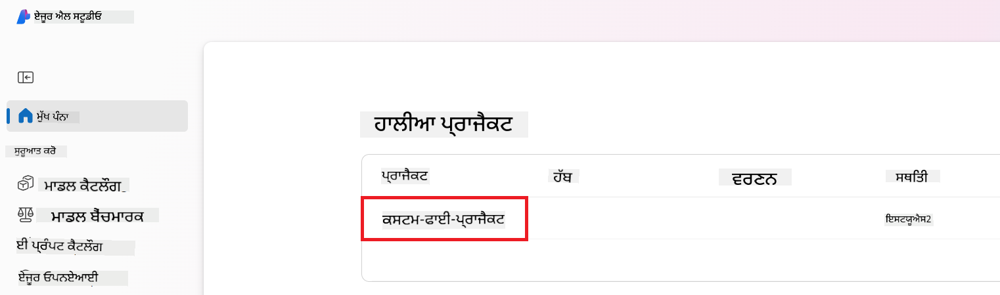

1. ਪ੍ਰੋਜੈਕਟ ਵਿੱਚ, ਖੱਬੇ ਪਾਸੇ ਟੈਬ ਤੋਂ **Deployments** ਚੁਣੋ।

1. ਨੈਵੀਗੇਸ਼ਨ ਮੀਨੂ ਤੋਂ **+ Deploy model** ਚੁਣੋ।

1. **Deploy base model** ਚੁਣੋ।

    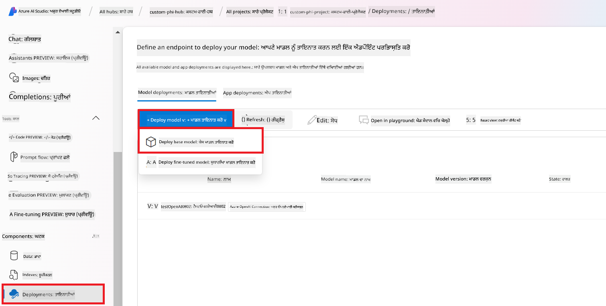

1. ਜਿਸ Azure OpenAI ਮਾਡਲ ਨੂੰ ਤੁਸੀਂ ਵਰਤਣਾ ਚਾਹੁੰਦੇ ਹੋ, ਉਹ ਚੁਣੋ। ਉਦਾਹਰਨ ਵਜੋਂ, **gpt-4o**।

    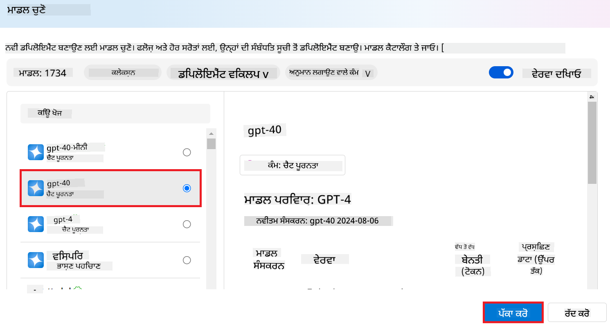

1. **Confirm** ਚੁਣੋ।

### Azure AI Foundry ਦੇ Prompt flow ਮੁਲਾਂਕਣ ਨਾਲ ਫਾਈਨ-ਟਿਊਨ ਕੀਤੇ Phi-3 / Phi-3.5 ਮਾਡਲ ਦਾ ਮੁਲਾਂਕਣ ਕਰੋ

### ਨਵਾਂ ਮੁਲਾਂਕਣ ਸ਼ੁਰੂ ਕਰੋ

1. [Azure AI Foundry](https://ai.azure.com/?wt.mc_id=studentamb_279723) 'ਤੇ ਜਾਓ।

1. ਉਸ Azure AI Foundry ਪ੍ਰੋਜੈਕਟ ਵਿੱਚ ਜਾਓ ਜੋ ਤੁਸੀਂ ਬਣਾਇਆ ਹੈ।

    

1. ਪ੍ਰੋਜੈਕਟ ਵਿੱਚ, ਖੱਬੇ ਪਾਸੇ ਟੈਬ ਤੋਂ **Evaluation** ਚੁਣੋ।

1. ਨੈਵੀਗੇਸ਼ਨ ਮੀਨੂ ਤੋਂ **+ New evaluation** ਚੁਣੋ।
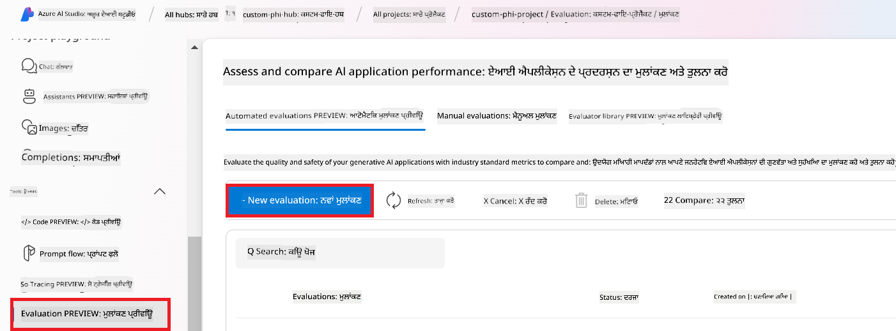

1. **Prompt flow** ਮੁਲਾਂਕਣ ਚੁਣੋ।

    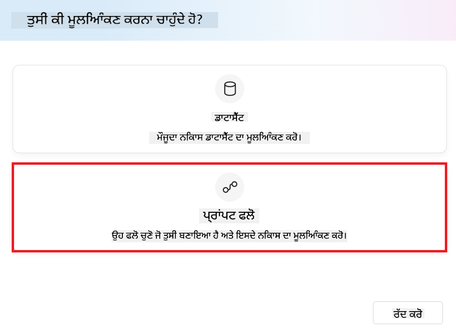

1. ਹੇਠਾਂ ਦਿੱਤੇ ਕੰਮ ਕਰੋ:

    - ਮੁਲਾਂਕਣ ਦਾ ਨਾਮ ਦਿਓ। ਇਹ ਇਕ ਵਿਲੱਖਣ ਮੁੱਲ ਹੋਣਾ ਚਾਹੀਦਾ ਹੈ।
    - ਟਾਸਕ ਕਿਸਮ ਵਜੋਂ **Question and answer without context** ਚੁਣੋ। ਕਿਉਂਕਿ ਇਸ ਟਿਊਟੋਰਿਯਲ ਵਿੱਚ ਵਰਤੇ ਗਏ **UlTRACHAT_200k** ਡੇਟਾਸੈੱਟ ਵਿੱਚ ਸੰਦਰਭ ਨਹੀਂ ਹੁੰਦਾ।
    - ਉਹ prompt flow ਚੁਣੋ ਜਿਸਦੀ ਤੁਸੀਂ ਮੁਲਾਂਕਣ ਕਰਨਾ ਚਾਹੁੰਦੇ ਹੋ।

    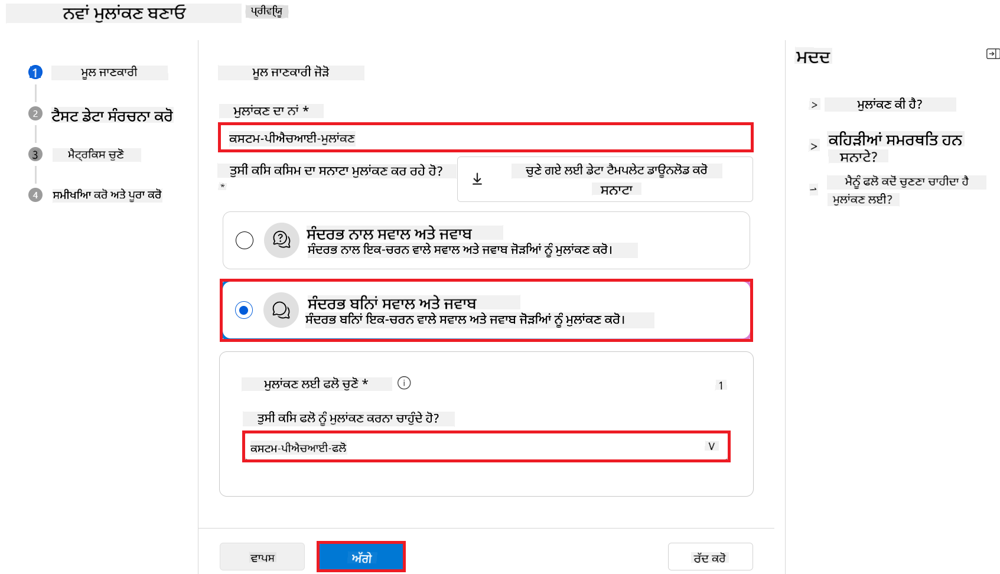

1. **Next** ਚੁਣੋ।

1. ਹੇਠਾਂ ਦਿੱਤੇ ਕੰਮ ਕਰੋ:

    - ਡੇਟਾਸੈੱਟ ਅਪਲੋਡ ਕਰਨ ਲਈ **Add your dataset** ਚੁਣੋ। ਉਦਾਹਰਨ ਵਜੋਂ, ਤੁਸੀਂ ਟੈਸਟ ਡੇਟਾਸੈੱਟ ਫਾਈਲ ਜਿਵੇਂ *test_data.json1* ਅਪਲੋਡ ਕਰ ਸਕਦੇ ਹੋ, ਜੋ ਕਿ **ULTRACHAT_200k** ਡੇਟਾਸੈੱਟ ਡਾਊਨਲੋਡ ਕਰਦੇ ਸਮੇਂ ਸ਼ਾਮਲ ਹੁੰਦੀ ਹੈ।
    - ਆਪਣੇ ਡੇਟਾਸੈੱਟ ਨਾਲ ਮਿਲਦਾ ਜੁਲਦਾ **Dataset column** ਚੁਣੋ। ਉਦਾਹਰਨ ਵਜੋਂ, ਜੇ ਤੁਸੀਂ **ULTRACHAT_200k** ਡੇਟਾਸੈੱਟ ਵਰਤ ਰਹੇ ਹੋ, ਤਾਂ **${data.prompt}** ਕਾਲਮ ਚੁਣੋ।

    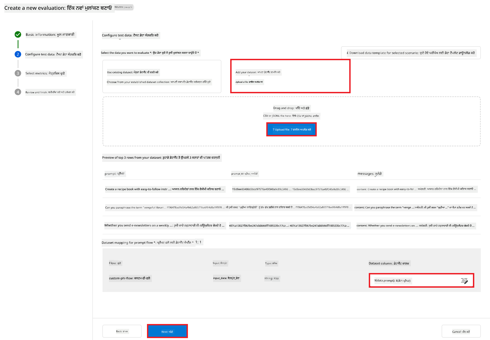

1. **Next** ਚੁਣੋ।

1. ਪ੍ਰਦਰਸ਼ਨ ਅਤੇ ਗੁਣਵੱਤਾ ਮੈਟਰਿਕਸ ਸੈੱਟ ਕਰਨ ਲਈ ਹੇਠਾਂ ਦਿੱਤੇ ਕੰਮ ਕਰੋ:

    - ਉਹ ਪ੍ਰਦਰਸ਼ਨ ਅਤੇ ਗੁਣਵੱਤਾ ਮੈਟਰਿਕਸ ਚੁਣੋ ਜੋ ਤੁਸੀਂ ਵਰਤਣਾ ਚਾਹੁੰਦੇ ਹੋ।
    - ਮੁਲਾਂਕਣ ਲਈ ਬਣਾਇਆ ਗਿਆ Azure OpenAI ਮਾਡਲ ਚੁਣੋ। ਉਦਾਹਰਨ ਵਜੋਂ, **gpt-4o** ਚੁਣੋ।

    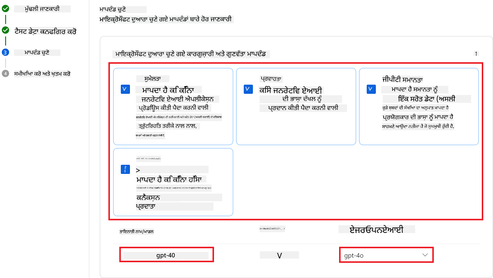

1. ਖਤਰਾ ਅਤੇ ਸੁਰੱਖਿਆ ਮੈਟਰਿਕਸ ਸੈੱਟ ਕਰਨ ਲਈ ਹੇਠਾਂ ਦਿੱਤੇ ਕੰਮ ਕਰੋ:

    - ਉਹ ਖਤਰਾ ਅਤੇ ਸੁਰੱਖਿਆ ਮੈਟਰਿਕਸ ਚੁਣੋ ਜੋ ਤੁਸੀਂ ਵਰਤਣਾ ਚਾਹੁੰਦੇ ਹੋ।
    - ਖ਼ਰਾਬੀ ਦਰ ਗਿਣਤੀ ਲਈ ਥ੍ਰੇਸ਼ਹੋਲਡ ਚੁਣੋ। ਉਦਾਹਰਨ ਵਜੋਂ, **Medium** ਚੁਣੋ।
    - **question** ਲਈ, **Data source** ਨੂੰ **{$data.prompt}** ਤੇ ਸੈੱਟ ਕਰੋ।
    - **answer** ਲਈ, **Data source** ਨੂੰ **{$run.outputs.answer}** ਤੇ ਸੈੱਟ ਕਰੋ।
    - **ground_truth** ਲਈ, **Data source** ਨੂੰ **{$data.message}** ਤੇ ਸੈੱਟ ਕਰੋ।

    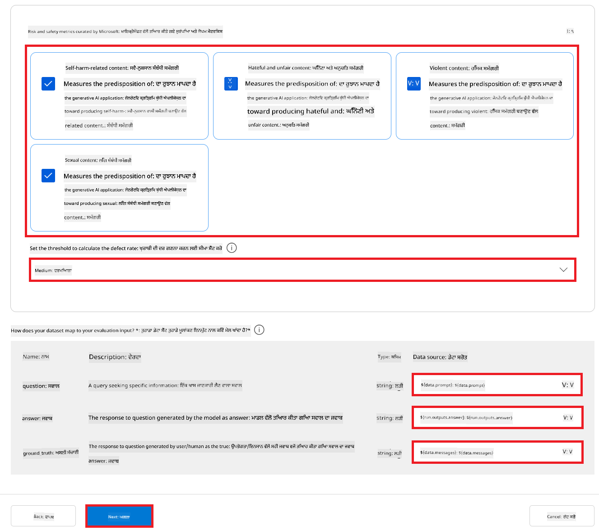

1. **Next** ਚੁਣੋ।

1. ਮੁਲਾਂਕਣ ਸ਼ੁਰੂ ਕਰਨ ਲਈ **Submit** ਚੁਣੋ।

1. ਮੁਲਾਂਕਣ ਪੂਰਾ ਹੋਣ ਵਿੱਚ ਕੁਝ ਸਮਾਂ ਲੱਗੇਗਾ। ਤੁਸੀਂ ਪ੍ਰਗਤੀ ਨੂੰ **Evaluation** ਟੈਬ ਵਿੱਚ ਦੇਖ ਸਕਦੇ ਹੋ।

### ਮੁਲਾਂਕਣ ਨਤੀਜੇ ਸਮੀਖਿਆ ਕਰੋ

> [!NOTE]
> ਹੇਠਾਂ ਦਿੱਤੇ ਨਤੀਜੇ ਸਿਰਫ਼ ਮੁਲਾਂਕਣ ਪ੍ਰਕਿਰਿਆ ਨੂੰ ਦਰਸਾਉਣ ਲਈ ਹਨ। ਇਸ ਟਿਊਟੋਰਿਯਲ ਵਿੱਚ, ਅਸੀਂ ਇੱਕ ਛੋਟੇ ਡੇਟਾਸੈੱਟ ‘ਤੇ ਫਾਈਨ-ਟਿਊਨ ਕੀਤਾ ਮਾਡਲ ਵਰਤਿਆ ਹੈ, ਜਿਸ ਕਰਕੇ ਨਤੀਜੇ ਕਦੇ ਕਦੇ ਵਧੀਆ ਨਹੀਂ ਹੁੰਦੇ। ਅਸਲ ਨਤੀਜੇ ਡੇਟਾਸੈੱਟ ਦੇ ਆਕਾਰ, ਗੁਣਵੱਤਾ, ਵਿਭਿੰਨਤਾ ਅਤੇ ਮਾਡਲ ਦੀ ਵਿਸ਼ੇਸ਼ ਸੈਟਿੰਗ ਉੱਤੇ ਬਹੁਤ ਅਸਰ ਕਰਦੇ ਹਨ।

ਮੁਲਾਂਕਣ ਪੂਰਾ ਹੋਣ ‘ਤੇ, ਤੁਸੀਂ ਪ੍ਰਦਰਸ਼ਨ ਅਤੇ ਸੁਰੱਖਿਆ ਮੈਟਰਿਕਸ ਦੋਹਾਂ ਦੇ ਨਤੀਜੇ ਵੇਖ ਸਕਦੇ ਹੋ।

1. ਪ੍ਰਦਰਸ਼ਨ ਅਤੇ ਗੁਣਵੱਤਾ ਮੈਟਰਿਕਸ:

    - ਮਾਡਲ ਦੀ ਸਮਝਦਾਰੀ, ਸੁਚੱਜੇ ਅਤੇ ਸਬੰਧਿਤ ਜਵਾਬ ਬਣਾਉਣ ਦੀ ਸਮਰੱਥਾ ਦਾ ਮੁਲਾਂਕਣ ਕਰੋ।

    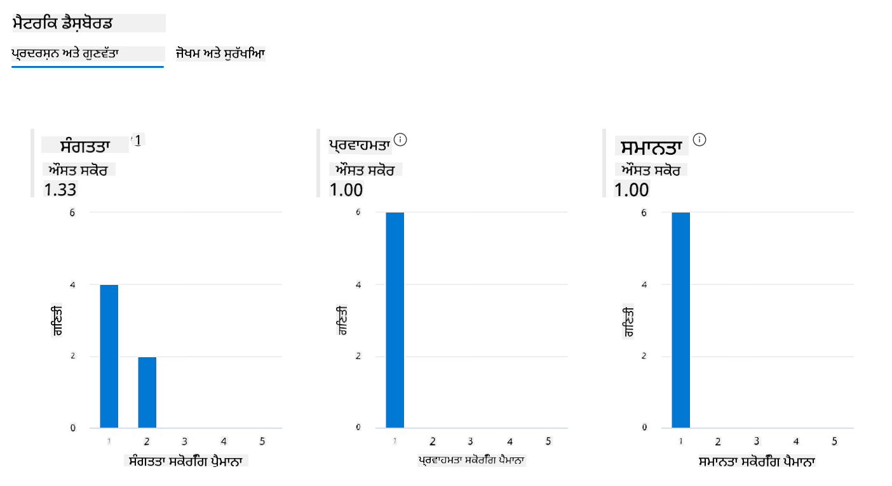

1. ਖਤਰਾ ਅਤੇ ਸੁਰੱਖਿਆ ਮੈਟਰਿਕਸ:

    - ਯਕੀਨੀ ਬਣਾਓ ਕਿ ਮਾਡਲ ਦੇ ਨਤੀਜੇ ਸੁਰੱਖਿਅਤ ਹਨ ਅਤੇ Responsible AI Principles ਨਾਲ ਮੇਲ ਖਾਂਦੇ ਹਨ, ਜਿਹੜੇ ਕਿਸੇ ਵੀ ਨੁਕਸਾਨਦਾਇਕ ਜਾਂ ਅਪਮਾਨਜਨਕ ਸਮੱਗਰੀ ਤੋਂ ਬਚਾਉਂਦੇ ਹਨ।

    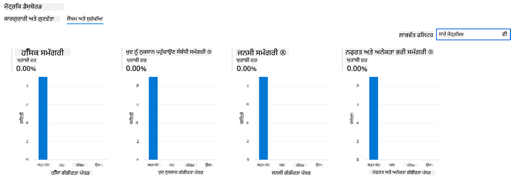

1. ਤੁਸੀਂ ਹੇਠਾਂ ਸਕ੍ਰੋਲ ਕਰਕੇ **Detailed metrics result** ਵੀ ਵੇਖ ਸਕਦੇ ਹੋ।

    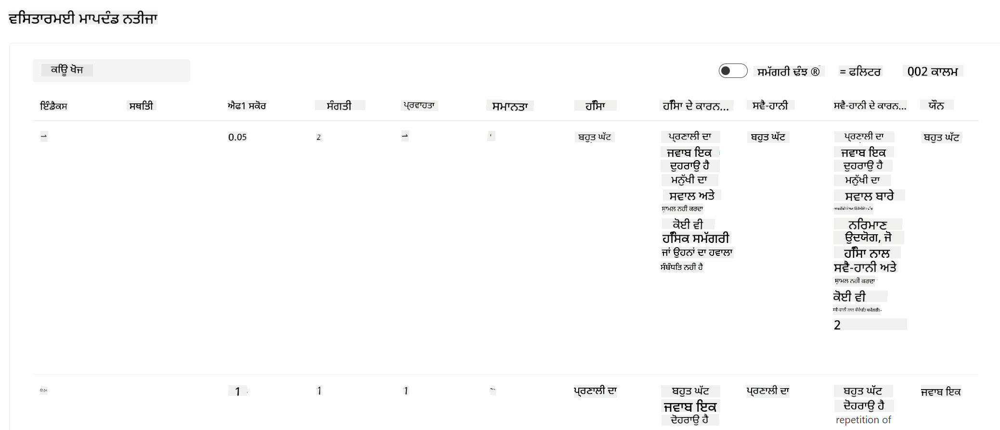

1. ਆਪਣੇ ਕਸਟਮ Phi-3 / Phi-3.5 ਮਾਡਲ ਦਾ ਪ੍ਰਦਰਸ਼ਨ ਅਤੇ ਸੁਰੱਖਿਆ ਮੈਟਰਿਕਸ ਨਾਲ ਮੁਲਾਂਕਣ ਕਰਕੇ, ਤੁਸੀਂ ਪੱਕਾ ਕਰ ਸਕਦੇ ਹੋ ਕਿ ਮਾਡਲ ਨਾ ਸਿਰਫ਼ ਪ੍ਰਭਾਵਸ਼ਾਲੀ ਹੈ, ਬਲਕਿ Responsible AI ਅਮਲਾਂ ਦਾ ਪਾਲਣ ਵੀ ਕਰਦਾ ਹੈ, ਜਿਸ ਨਾਲ ਇਹ ਅਸਲੀ ਦੁਨੀਆ ਵਿੱਚ ਵਰਤੋਂ ਲਈ ਤਿਆਰ ਹੁੰਦਾ ਹੈ।

## ਵਧਾਈਆਂ!

### ਤੁਸੀਂ ਇਹ ਟਿਊਟੋਰਿਯਲ ਪੂਰਾ ਕਰ ਲਿਆ ਹੈ

ਤੁਸੀਂ Azure AI Foundry ਵਿੱਚ Prompt flow ਨਾਲ ਇੰਟਿਗ੍ਰੇਟ ਕੀਤਾ ਫਾਈਨ-ਟਿਊਨ ਕੀਤਾ Phi-3 ਮਾਡਲ ਸਫਲਤਾਪੂਰਵਕ ਮੁਲਾਂਕਣ ਕੀਤਾ ਹੈ। ਇਹ ਤੁਹਾਡੇ AI ਮਾਡਲਾਂ ਨੂੰ ਨਾ ਸਿਰਫ਼ ਚੰਗਾ ਪ੍ਰਦਰਸ਼ਨ ਕਰਨ ਲਈ, ਸਗੋਂ Microsoft ਦੇ Responsible AI ਨੀਤੀਆਂ ਦਾ ਪਾਲਣ ਕਰਨ ਲਈ ਇੱਕ ਮਹੱਤਵਪੂਰਨ ਕਦਮ ਹੈ, ਜੋ ਤੁਹਾਨੂੰ ਭਰੋਸੇਮੰਦ ਅਤੇ ਵਿਸ਼ਵਾਸਯੋਗ AI ਐਪਲੀਕੇਸ਼ਨ ਬਣਾਉਣ ਵਿੱਚ ਮਦਦ ਕਰਦਾ ਹੈ।


## Azure ਸਰੋਤ ਸਾਫ਼ ਕਰੋ

ਆਪਣੇ ਖਾਤੇ 'ਤੇ ਵਾਧੂ ਖਰਚਿਆਂ ਤੋਂ ਬਚਣ ਲਈ Azure ਸਰੋਤ ਸਾਫ਼ ਕਰੋ। Azure ਪੋਰਟਲ 'ਤੇ ਜਾ ਕੇ ਹੇਠਾਂ ਦਿੱਤੇ ਸਰੋਤ ਹਟਾਓ:

- Azure Machine learning ਸਰੋਤ।
- Azure Machine learning ਮਾਡਲ ਐਂਡਪਾਇੰਟ।
- Azure AI Foundry ਪ੍ਰੋਜੈਕਟ ਸਰੋਤ।
- Azure AI Foundry Prompt flow ਸਰੋਤ।

### ਅਗਲੇ ਕਦਮ

#### ਦਸਤਾਵੇਜ਼ੀਕਰਨ

- [Assess AI systems by using the Responsible AI dashboard](https://learn.microsoft.com/azure/machine-learning/concept-responsible-ai-dashboard?view=azureml-api-2&source=recommendations?wt.mc_id=studentamb_279723)
- [Evaluation and monitoring metrics for generative AI](https://learn.microsoft.com/azure/ai-studio/concepts/evaluation-metrics-built-in?tabs=definition?wt.mc_id=studentamb_279723)
- [Azure AI Foundry documentation](https://learn.microsoft.com/azure/ai-studio/?wt.mc_id=studentamb_279723)
- [Prompt flow documentation](https://microsoft.github.io/promptflow/?wt.mc_id=studentamb_279723)

#### ਟ੍ਰੇਨਿੰਗ ਸਮੱਗਰੀ

- [Introduction to Microsoft's Responsible AI Approach](https://learn.microsoft.com/training/modules/introduction-to-microsofts-responsible-ai-approach/?source=recommendations?wt.mc_id=studentamb_279723)
- [Introduction to Azure AI Foundry](https://learn.microsoft.com/training/modules/introduction-to-azure-ai-studio/?wt.mc_id=studentamb_279723)

### ਸੰਦਰਭ

- [What is Responsible AI?](https://learn.microsoft.com/azure/machine-learning/concept-responsible-ai?view=azureml-api-2?wt.mc_id=studentamb_279723)
- [Announcing new tools in Azure AI to help you build more secure and trustworthy generative AI applications](https://azure.microsoft.com/blog/announcing-new-tools-in-azure-ai-to-help-you-build-more-secure-and-trustworthy-generative-ai-applications/?wt.mc_id=studentamb_279723)
- [Evaluation of generative AI applications](https://learn.microsoft.com/azure/ai-studio/concepts/evaluation-approach-gen-ai?wt.mc_id%3Dstudentamb_279723)

**ਅਸਵੀਕਾਰੋक्ति**:  
ਇਹ ਦਸਤਾਵੇਜ਼ AI ਅਨੁਵਾਦ ਸੇਵਾ [Co-op Translator](https://github.com/Azure/co-op-translator) ਦੀ ਵਰਤੋਂ ਕਰਕੇ ਅਨੁਵਾਦ ਕੀਤਾ ਗਿਆ ਹੈ। ਜਦੋਂ ਕਿ ਅਸੀਂ ਸਹੀਅਤ ਲਈ ਕੋਸ਼ਿਸ਼ ਕਰਦੇ ਹਾਂ, ਕਿਰਪਾ ਕਰਕੇ ਧਿਆਨ ਰੱਖੋ ਕਿ ਸਵੈਚਾਲਿਤ ਅਨੁਵਾਦਾਂ ਵਿੱਚ ਗਲਤੀਆਂ ਜਾਂ ਅਸਥਿਰਤਾਵਾਂ ਹੋ ਸਕਦੀਆਂ ਹਨ। ਮੂਲ ਦਸਤਾਵੇਜ਼ ਨੂੰ ਇਸਦੀ ਮੂਲ ਭਾਸ਼ਾ ਵਿੱਚ ਅਧਿਕਾਰਤ ਸਰੋਤ ਮੰਨਿਆ ਜਾਣਾ ਚਾਹੀਦਾ ਹੈ। ਜ਼ਰੂਰੀ ਜਾਣਕਾਰੀ ਲਈ, ਪੇਸ਼ੇਵਰ ਮਨੁੱਖੀ ਅਨੁਵਾਦ ਦੀ ਸਿਫਾਰਸ਼ ਕੀਤੀ ਜਾਂਦੀ ਹੈ। ਅਸੀਂ ਇਸ ਅਨੁਵਾਦ ਦੇ ਇਸਤੇਮਾਲ ਤੋਂ ਪੈਦਾ ਹੋਣ ਵਾਲੀਆਂ ਕਿਸੇ ਵੀ ਗਲਤਫਹਿਮੀਆਂ ਜਾਂ ਗਲਤ ਵਿਆਖਿਆਵਾਂ ਲਈ ਜ਼ਿੰਮੇਵਾਰ ਨਹੀਂ ਹਾਂ।