<!--
CO_OP_TRANSLATOR_METADATA:
{
  "original_hash": "455be2b7b9c3390d367d528f8fab2aa0",
  "translation_date": "2025-07-17T00:21:37+00:00",
  "source_file": "md/02.Application/01.TextAndChat/Phi3/E2E_Phi-3-FineTuning_PromptFlow_Integration.md",
  "language_code": "pa"
}
-->
# Fine-tune ਅਤੇ Prompt flow ਨਾਲ ਕਸਟਮ Phi-3 ਮਾਡਲ ਇੰਟੀਗ੍ਰੇਟ ਕਰੋ

ਇਹ end-to-end (E2E) ਸੈਂਪਲ Microsoft Tech Community ਤੋਂ "[Fine-Tune and Integrate Custom Phi-3 Models with Prompt Flow: Step-by-Step Guide](https://techcommunity.microsoft.com/t5/educator-developer-blog/fine-tune-and-integrate-custom-phi-3-models-with-prompt-flow/ba-p/4178612?WT.mc_id=aiml-137032-kinfeylo)" ਗਾਈਡ 'ਤੇ ਆਧਾਰਿਤ ਹੈ। ਇਹ fine-tuning, ਡਿਪਲੋਇਮੈਂਟ ਅਤੇ Prompt flow ਨਾਲ ਕਸਟਮ Phi-3 ਮਾਡਲਾਂ ਨੂੰ ਇੰਟੀਗ੍ਰੇਟ ਕਰਨ ਦੀ ਪ੍ਰਕਿਰਿਆ ਨੂੰ ਜਾਣੂ ਕਰਵਾਉਂਦਾ ਹੈ।

## ਓਵਰਵਿਊ

ਇਸ E2E ਸੈਂਪਲ ਵਿੱਚ, ਤੁਸੀਂ Phi-3 ਮਾਡਲ ਨੂੰ fine-tune ਕਰਨਾ ਅਤੇ ਇਸਨੂੰ Prompt flow ਨਾਲ ਇੰਟੀਗ੍ਰੇਟ ਕਰਨਾ ਸਿੱਖੋਗੇ। Azure Machine Learning ਅਤੇ Prompt flow ਦੀ ਵਰਤੋਂ ਕਰਕੇ, ਤੁਸੀਂ ਕਸਟਮ AI ਮਾਡਲਾਂ ਨੂੰ ਡਿਪਲੋਇ ਅਤੇ ਵਰਤਣ ਲਈ ਇੱਕ ਵਰਕਫਲੋ ਸੈੱਟ ਕਰੋਂਗੇ। ਇਹ E2E ਸੈਂਪਲ ਤਿੰਨ ਸਿਨਾਰਿਓਜ਼ ਵਿੱਚ ਵੰਡਿਆ ਗਿਆ ਹੈ:

**ਸਿਨਾਰਿਓ 1: Azure ਸਰੋਤ ਸੈੱਟ ਕਰੋ ਅਤੇ fine-tuning ਲਈ ਤਿਆਰੀ ਕਰੋ**

**ਸਿਨਾਰਿਓ 2: Phi-3 ਮਾਡਲ ਨੂੰ fine-tune ਕਰੋ ਅਤੇ Azure Machine Learning Studio ਵਿੱਚ ਡਿਪਲੋਇ ਕਰੋ**

**ਸਿਨਾਰਿਓ 3: Prompt flow ਨਾਲ ਇੰਟੀਗ੍ਰੇਟ ਕਰੋ ਅਤੇ ਆਪਣੇ ਕਸਟਮ ਮਾਡਲ ਨਾਲ ਗੱਲਬਾਤ ਕਰੋ**

ਇਹ ਹੈ ਇਸ E2E ਸੈਂਪਲ ਦਾ ਇੱਕ ਝਲਕ।

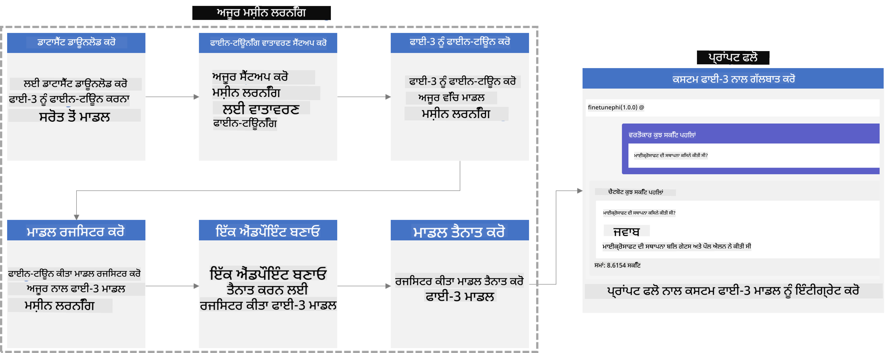

### ਸੂਚੀ

1. **[ਸਿਨਾਰਿਓ 1: Azure ਸਰੋਤ ਸੈੱਟ ਕਰੋ ਅਤੇ fine-tuning ਲਈ ਤਿਆਰੀ ਕਰੋ](../../../../../../md/02.Application/01.TextAndChat/Phi3)**
    - [Azure Machine Learning ਵਰਕਸਪੇਸ ਬਣਾਓ](../../../../../../md/02.Application/01.TextAndChat/Phi3)
    - [Azure Subscription ਵਿੱਚ GPU ਕੋਟਾ ਲਈ ਬੇਨਤੀ ਕਰੋ](../../../../../../md/02.Application/01.TextAndChat/Phi3)
    - [ਰੋਲ ਅਸਾਈਨਮੈਂਟ ਜੋੜੋ](../../../../../../md/02.Application/01.TextAndChat/Phi3)
    - [ਪ੍ਰੋਜੈਕਟ ਸੈੱਟ ਕਰੋ](../../../../../../md/02.Application/01.TextAndChat/Phi3)
    - [fine-tuning ਲਈ ਡੇਟਾਸੈੱਟ ਤਿਆਰ ਕਰੋ](../../../../../../md/02.Application/01.TextAndChat/Phi3)

1. **[ਸਿਨਾਰਿਓ 2: Phi-3 ਮਾਡਲ ਨੂੰ fine-tune ਕਰੋ ਅਤੇ Azure Machine Learning Studio ਵਿੱਚ ਡਿਪਲੋਇ ਕਰੋ](../../../../../../md/02.Application/01.TextAndChat/Phi3)**
    - [Azure CLI ਸੈੱਟ ਕਰੋ](../../../../../../md/02.Application/01.TextAndChat/Phi3)
    - [Phi-3 ਮਾਡਲ ਨੂੰ fine-tune ਕਰੋ](../../../../../../md/02.Application/01.TextAndChat/Phi3)
    - [fine-tuned ਮਾਡਲ ਨੂੰ ਡਿਪਲੋਇ ਕਰੋ](../../../../../../md/02.Application/01.TextAndChat/Phi3)

1. **[ਸਿਨਾਰਿਓ 3: Prompt flow ਨਾਲ ਇੰਟੀਗ੍ਰੇਟ ਕਰੋ ਅਤੇ ਆਪਣੇ ਕਸਟਮ ਮਾਡਲ ਨਾਲ ਗੱਲਬਾਤ ਕਰੋ](../../../../../../md/02.Application/01.TextAndChat/Phi3)**
    - [ਕਸਟਮ Phi-3 ਮਾਡਲ ਨੂੰ Prompt flow ਨਾਲ ਇੰਟੀਗ੍ਰੇਟ ਕਰੋ](../../../../../../md/02.Application/01.TextAndChat/Phi3)
    - [ਆਪਣੇ ਕਸਟਮ ਮਾਡਲ ਨਾਲ ਗੱਲਬਾਤ ਕਰੋ](../../../../../../md/02.Application/01.TextAndChat/Phi3)

## ਸਿਨਾਰਿਓ 1: Azure ਸਰੋਤ ਸੈੱਟ ਕਰੋ ਅਤੇ fine-tuning ਲਈ ਤਿਆਰੀ ਕਰੋ

### Azure Machine Learning ਵਰਕਸਪੇਸ ਬਣਾਓ

1. ਪੋਰਟਲ ਪੇਜ ਦੇ ਸਿਖਰਲੇ ਹਿੱਸੇ ਵਿੱਚ **search bar** ਵਿੱਚ *azure machine learning* ਲਿਖੋ ਅਤੇ ਆਉਣ ਵਾਲੇ ਵਿਕਲਪਾਂ ਵਿੱਚੋਂ **Azure Machine Learning** ਚੁਣੋ।

    

1. ਨੈਵੀਗੇਸ਼ਨ ਮੀਨੂ ਵਿੱਚੋਂ **+ Create** ਚੁਣੋ।

1. ਨੈਵੀਗੇਸ਼ਨ ਮੀਨੂ ਵਿੱਚੋਂ **New workspace** ਚੁਣੋ।

    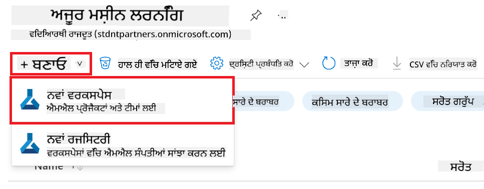

1. ਹੇਠਾਂ ਦਿੱਤੇ ਕੰਮ ਕਰੋ:

    - ਆਪਣੀ Azure **Subscription** ਚੁਣੋ।
    - ਵਰਤਣ ਲਈ **Resource group** ਚੁਣੋ (ਜੇ ਲੋੜ ਹੋਵੇ ਤਾਂ ਨਵਾਂ ਬਣਾਓ)।
    - **Workspace Name** ਦਿਓ। ਇਹ ਇੱਕ ਵਿਲੱਖਣ ਨਾਮ ਹੋਣਾ ਚਾਹੀਦਾ ਹੈ।
    - ਵਰਤਣ ਲਈ **Region** ਚੁਣੋ।
    - ਵਰਤਣ ਲਈ **Storage account** ਚੁਣੋ (ਜੇ ਲੋੜ ਹੋਵੇ ਤਾਂ ਨਵਾਂ ਬਣਾਓ)।
    - ਵਰਤਣ ਲਈ **Key vault** ਚੁਣੋ (ਜੇ ਲੋੜ ਹੋਵੇ ਤਾਂ ਨਵਾਂ ਬਣਾਓ)।
    - ਵਰਤਣ ਲਈ **Application insights** ਚੁਣੋ (ਜੇ ਲੋੜ ਹੋਵੇ ਤਾਂ ਨਵਾਂ ਬਣਾਓ)।
    - ਵਰਤਣ ਲਈ **Container registry** ਚੁਣੋ (ਜੇ ਲੋੜ ਹੋਵੇ ਤਾਂ ਨਵਾਂ ਬਣਾਓ)।

    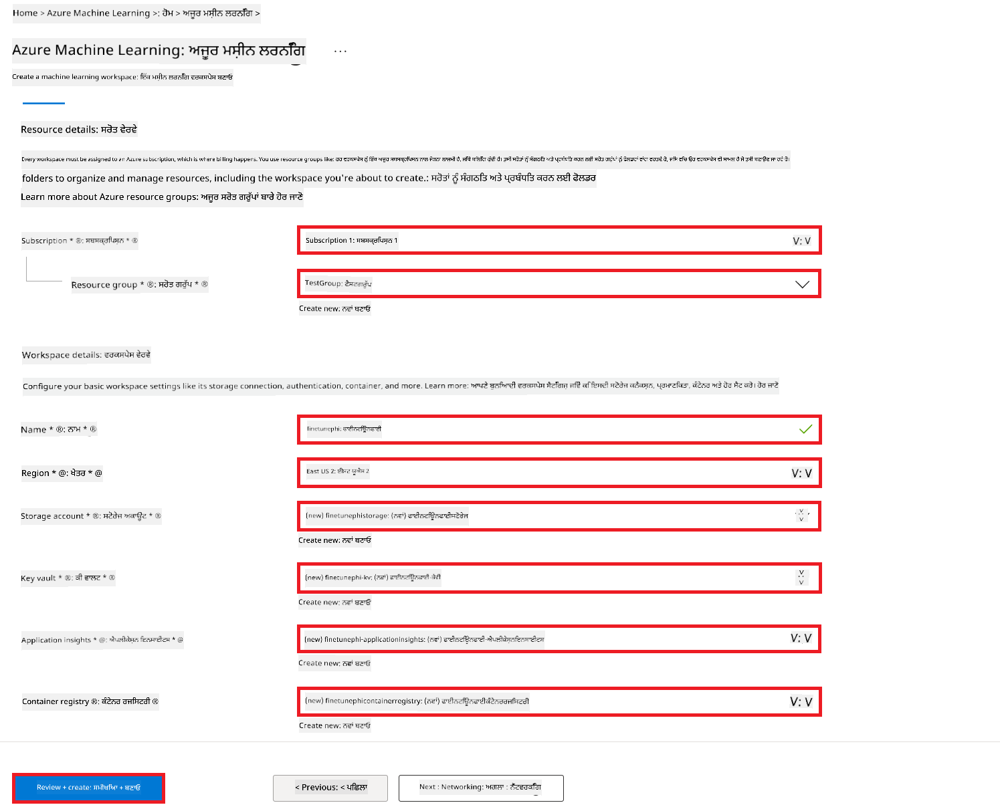

1. **Review + Create** ਚੁਣੋ।

1. **Create** ਚੁਣੋ।

### Azure Subscription ਵਿੱਚ GPU ਕੋਟਾ ਲਈ ਬੇਨਤੀ ਕਰੋ

ਇਸ E2E ਸੈਂਪਲ ਵਿੱਚ, ਤੁਸੀਂ fine-tuning ਲਈ *Standard_NC24ads_A100_v4 GPU* ਦੀ ਵਰਤੋਂ ਕਰੋਗੇ, ਜਿਸ ਲਈ ਕੋਟਾ ਬੇਨਤੀ ਜਰੂਰੀ ਹੈ, ਅਤੇ ਡਿਪਲੋਇਮੈਂਟ ਲਈ *Standard_E4s_v3* CPU ਦੀ ਵਰਤੋਂ ਕਰੋਗੇ, ਜਿਸ ਲਈ ਕੋਟਾ ਬੇਨਤੀ ਦੀ ਲੋੜ ਨਹੀਂ।

> [!NOTE]
>
> ਸਿਰਫ Pay-As-You-Go ਸਬਸਕ੍ਰਿਪਸ਼ਨ (ਮਿਆਰੀ ਸਬਸਕ੍ਰਿਪਸ਼ਨ ਕਿਸਮ) GPU ਅਲੋਕੇਸ਼ਨ ਲਈ ਯੋਗ ਹਨ; ਬੇਨਿਫਿਟ ਸਬਸਕ੍ਰਿਪਸ਼ਨ ਇਸ ਸਮੇਂ ਸਹਾਇਤਿਤ ਨਹੀਂ ਹਨ।
>
> ਜੇ ਤੁਸੀਂ ਬੇਨਿਫਿਟ ਸਬਸਕ੍ਰਿਪਸ਼ਨ (ਜਿਵੇਂ Visual Studio Enterprise Subscription) ਵਰਤ ਰਹੇ ਹੋ ਜਾਂ fine-tuning ਅਤੇ ਡਿਪਲੋਇਮੈਂਟ ਪ੍ਰਕਿਰਿਆ ਨੂੰ ਤੇਜ਼ੀ ਨਾਲ ਟੈਸਟ ਕਰਨਾ ਚਾਹੁੰਦੇ ਹੋ, ਤਾਂ ਇਹ ਟਿਊਟੋਰਿਯਲ CPU ਨਾਲ ਘੱਟ ਡੇਟਾਸੈੱਟ ਦੀ ਵਰਤੋਂ ਕਰਕੇ fine-tuning ਲਈ ਵੀ ਮਦਦ ਕਰਦਾ ਹੈ। ਪਰ ਇਹ ਜ਼ਰੂਰੀ ਹੈ ਕਿ GPU ਨਾਲ ਵੱਡੇ ਡੇਟਾਸੈੱਟ ਦੀ ਵਰਤੋਂ ਕਰਨ 'ਤੇ fine-tuning ਦੇ ਨਤੀਜੇ ਕਾਫੀ ਬਿਹਤਰ ਹੁੰਦੇ ਹਨ।

1. [Azure ML Studio](https://ml.azure.com/home?wt.mc_id=studentamb_279723) 'ਤੇ ਜਾਓ।

1. *Standard NCADSA100v4 Family* ਕੋਟਾ ਲਈ ਬੇਨਤੀ ਕਰਨ ਲਈ ਹੇਠਾਂ ਦਿੱਤੇ ਕੰਮ ਕਰੋ:

    - ਖੱਬੇ ਪਾਸੇ ਟੈਬ ਵਿੱਚੋਂ **Quota** ਚੁਣੋ।
    - ਵਰਤਣ ਲਈ **Virtual machine family** ਚੁਣੋ। ਉਦਾਹਰਨ ਵਜੋਂ, **Standard NCADSA100v4 Family Cluster Dedicated vCPUs** ਚੁਣੋ, ਜਿਸ ਵਿੱਚ *Standard_NC24ads_A100_v4* GPU ਸ਼ਾਮਲ ਹੈ।
    - ਨੈਵੀਗੇਸ਼ਨ ਮੀਨੂ ਵਿੱਚੋਂ **Request quota** ਚੁਣੋ।

        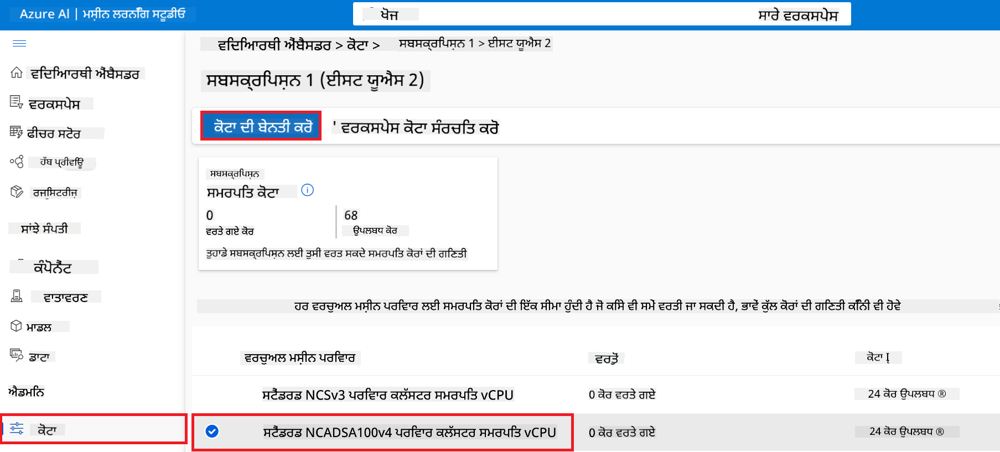

    - Request quota ਪੇਜ ਵਿੱਚ, ਵਰਤਣ ਲਈ **New cores limit** ਦਿਓ। ਉਦਾਹਰਨ ਵਜੋਂ, 24।
    - Request quota ਪੇਜ ਵਿੱਚ, GPU ਕੋਟਾ ਲਈ ਬੇਨਤੀ ਕਰਨ ਲਈ **Submit** ਚੁਣੋ।

> [!NOTE]
> ਤੁਸੀਂ ਆਪਣੀਆਂ ਜ਼ਰੂਰਤਾਂ ਮੁਤਾਬਕ GPU ਜਾਂ CPU ਚੁਣ ਸਕਦੇ ਹੋ, [Sizes for Virtual Machines in Azure](https://learn.microsoft.com/azure/virtual-machines/sizes/overview?tabs=breakdownseries%2Cgeneralsizelist%2Ccomputesizelist%2Cmemorysizelist%2Cstoragesizelist%2Cgpusizelist%2Cfpgasizelist%2Chpcsizelist) ਦਸਤਾਵੇਜ਼ ਨੂੰ ਦੇਖ ਕੇ।

### ਰੋਲ ਅਸਾਈਨਮੈਂਟ ਜੋੜੋ

ਆਪਣੇ ਮਾਡਲਾਂ ਨੂੰ fine-tune ਅਤੇ ਡਿਪਲੋਇ ਕਰਨ ਲਈ, ਤੁਹਾਨੂੰ ਪਹਿਲਾਂ ਇੱਕ User Assigned Managed Identity (UAI) ਬਣਾਉਣੀ ਪਵੇਗੀ ਅਤੇ ਇਸਨੂੰ ਸਹੀ ਅਧਿਕਾਰ ਦੇਣੇ ਪੈਣਗੇ। ਇਹ UAI ਡਿਪਲੋਇਮੈਂਟ ਦੌਰਾਨ ਪ੍ਰਮਾਣਿਕਤਾ ਲਈ ਵਰਤੀ ਜਾਵੇਗੀ।

#### User Assigned Managed Identity (UAI) ਬਣਾਓ

1. ਪੋਰਟਲ ਪੇਜ ਦੇ ਸਿਖਰਲੇ ਹਿੱਸੇ ਵਿੱਚ **search bar** ਵਿੱਚ *managed identities* ਲਿਖੋ ਅਤੇ ਆਉਣ ਵਾਲੇ ਵਿਕਲਪਾਂ ਵਿੱਚੋਂ **Managed Identities** ਚੁਣੋ।

    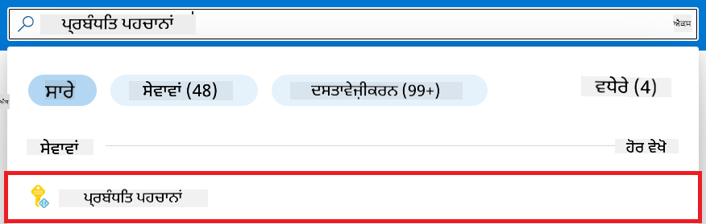

1. **+ Create** ਚੁਣੋ।

    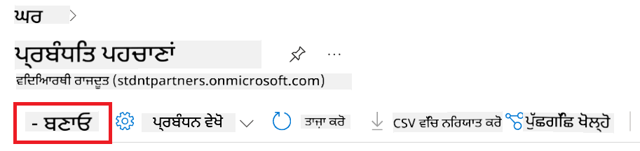

1. ਹੇਠਾਂ ਦਿੱਤੇ ਕੰਮ ਕਰੋ:

    - ਆਪਣੀ Azure **Subscription** ਚੁਣੋ।
    - ਵਰਤਣ ਲਈ **Resource group** ਚੁਣੋ (ਜੇ ਲੋੜ ਹੋਵੇ ਤਾਂ ਨਵਾਂ ਬਣਾਓ)।
    - ਵਰਤਣ ਲਈ **Region** ਚੁਣੋ।
    - **Name** ਦਿਓ। ਇਹ ਇੱਕ ਵਿਲੱਖਣ ਨਾਮ ਹੋਣਾ ਚਾਹੀਦਾ ਹੈ।

1. **Review + create** ਚੁਣੋ।

1. **+ Create** ਚੁਣੋ।

#### Managed Identity ਨੂੰ Contributor ਰੋਲ ਅਸਾਈਨਮੈਂਟ ਦਿਓ

1. ਉਸ Managed Identity ਰਿਸੋਰਸ ਤੇ ਜਾਓ ਜੋ ਤੁਸੀਂ ਬਣਾਈ ਹੈ।

1. ਖੱਬੇ ਪਾਸੇ ਟੈਬ ਵਿੱਚੋਂ **Azure role assignments** ਚੁਣੋ।

1. ਨੈਵੀਗੇਸ਼ਨ ਮੀਨੂ ਵਿੱਚੋਂ **+Add role assignment** ਚੁਣੋ।

1. Add role assignment ਪੇਜ ਵਿੱਚ ਹੇਠਾਂ ਦਿੱਤੇ ਕੰਮ ਕਰੋ:
    - **Scope** ਨੂੰ **Resource group** ਚੁਣੋ।
    - ਆਪਣੀ Azure **Subscription** ਚੁਣੋ।
    - ਵਰਤਣ ਲਈ **Resource group** ਚੁਣੋ।
    - **Role** ਨੂੰ **Contributor** ਚੁਣੋ।

    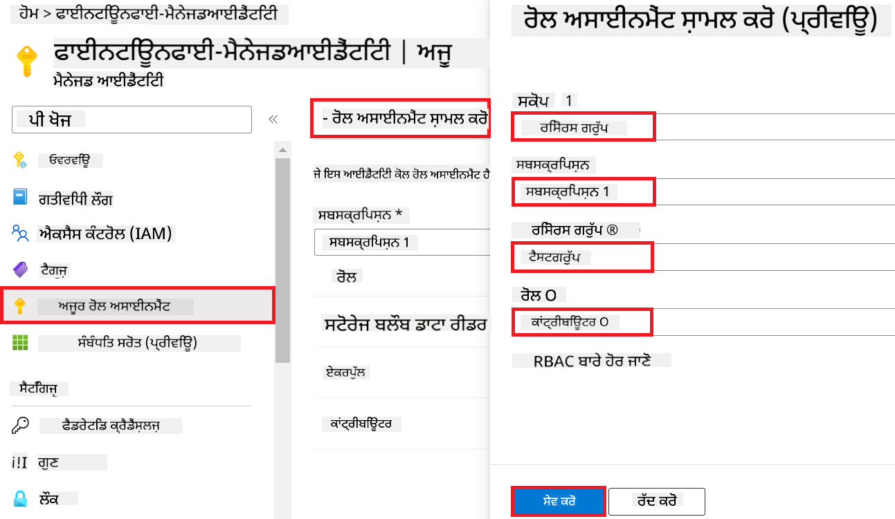

1. **Save** ਚੁਣੋ।

#### Managed Identity ਨੂੰ Storage Blob Data Reader ਰੋਲ ਅਸਾਈਨਮੈਂਟ ਦਿਓ

1. ਪੋਰਟਲ ਪੇਜ ਦੇ ਸਿਖਰਲੇ ਹਿੱਸੇ ਵਿੱਚ **search bar** ਵਿੱਚ *storage accounts* ਲਿਖੋ ਅਤੇ ਆਉਣ ਵਾਲੇ ਵਿਕਲਪਾਂ ਵਿੱਚੋਂ **Storage accounts** ਚੁਣੋ।

    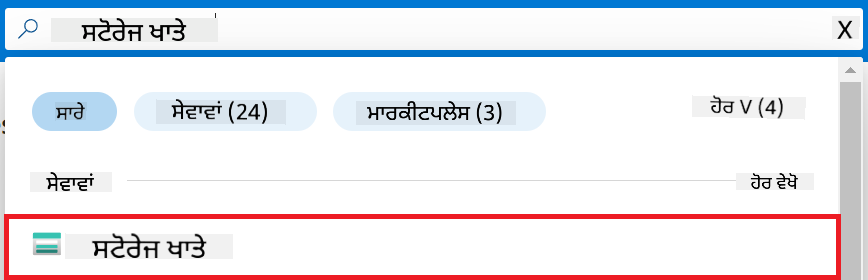

1. ਉਸ Storage account ਨੂੰ ਚੁਣੋ ਜੋ Azure Machine Learning ਵਰਕਸਪੇਸ ਨਾਲ ਜੁੜਿਆ ਹੋਇਆ ਹੈ। ਉਦਾਹਰਨ ਵਜੋਂ, *finetunephistorage*।

1. Add role assignment ਪੇਜ 'ਤੇ ਜਾਣ ਲਈ ਹੇਠਾਂ ਦਿੱਤੇ ਕੰਮ ਕਰੋ:

    - ਬਣਾਇਆ ਹੋਇਆ Azure Storage account ਖੋਲ੍ਹੋ।
    - ਖੱਬੇ ਪਾਸੇ ਟੈਬ ਵਿੱਚੋਂ **Access Control (IAM)** ਚੁਣੋ।
    - ਨੈਵੀਗੇਸ਼ਨ ਮੀਨੂ ਵਿੱਚੋਂ **+ Add** ਚੁਣੋ।
    - ਨੈਵੀਗੇਸ਼ਨ ਮੀਨੂ ਵਿੱਚੋਂ **Add role assignment** ਚੁਣੋ।

    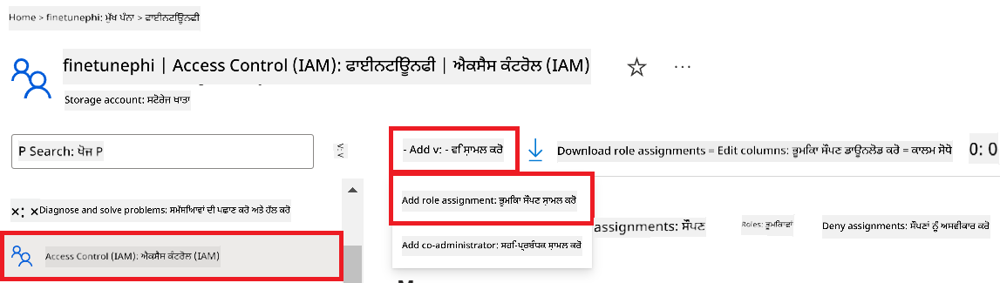

1. Add role assignment ਪੇਜ ਵਿੱਚ ਹੇਠਾਂ ਦਿੱਤੇ ਕੰਮ ਕਰੋ:

    - Role ਪੇਜ ਵਿੱਚ, **search bar** ਵਿੱਚ *Storage Blob Data Reader* ਲਿਖੋ ਅਤੇ ਆਉਣ ਵਾਲੇ ਵਿਕਲਪਾਂ ਵਿੱਚੋਂ **Storage Blob Data Reader** ਚੁਣੋ।
    - Role ਪੇਜ ਵਿੱਚ, **Next** ਚੁਣੋ।
    - Members ਪੇਜ ਵਿੱਚ, **Assign access to** ਵਜੋਂ **Managed identity** ਚੁਣੋ।
    - Members ਪੇਜ ਵਿੱਚ, **+ Select members** ਚੁਣੋ।
    - Select managed identities ਪੇਜ ਵਿੱਚ, ਆਪਣੀ Azure **Subscription** ਚੁਣੋ।
    - Select managed identities ਪੇਜ ਵਿੱਚ, **Managed identity** ਵਜੋਂ **Manage Identity** ਚੁਣੋ।
    - Select managed identities ਪੇਜ ਵਿੱਚ, ਉਹ Manage Identity ਚੁਣੋ ਜੋ ਤੁਸੀਂ ਬਣਾਈ ਹੈ। ਉਦਾਹਰਨ ਵਜੋਂ, *finetunephi-managedidentity*।
    - Select managed identities ਪੇਜ ਵਿੱਚ, **Select** ਚੁਣੋ।

    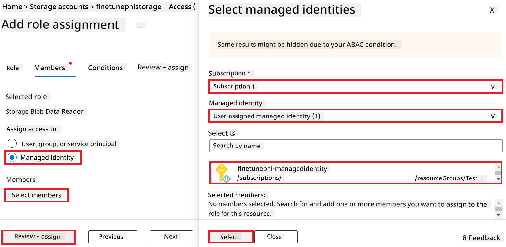

1. **Review + assign** ਚੁਣੋ।

#### Managed Identity ਨੂੰ AcrPull ਰੋਲ ਅਸਾਈਨਮੈਂਟ ਦਿਓ

1. ਪੋਰਟਲ ਪੇਜ ਦੇ ਸਿਖਰਲੇ ਹਿੱਸੇ ਵਿੱਚ **search bar** ਵਿੱਚ *container registries* ਲਿਖੋ ਅਤੇ ਆਉਣ ਵਾਲੇ ਵਿਕਲਪਾਂ ਵਿੱਚੋਂ **Container registries** ਚੁਣੋ।

    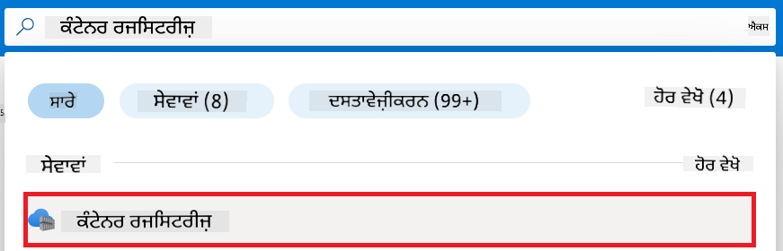

1. ਉਸ container registry ਨੂੰ ਚੁਣੋ ਜੋ Azure Machine Learning ਵਰਕਸਪੇਸ ਨਾਲ ਜੁੜਿਆ ਹੋਇਆ ਹੈ। ਉਦਾਹਰਨ ਵਜੋਂ, *finetunephicontainerregistries*

1. Add role assignment ਪੇਜ 'ਤੇ ਜਾਣ ਲਈ ਹੇਠਾਂ ਦਿੱਤੇ ਕੰਮ ਕਰੋ:

    - ਖੱਬੇ ਪਾਸੇ ਟੈਬ ਵਿੱਚੋਂ **Access Control (IAM)** ਚੁਣੋ।
    - ਨੈਵੀਗੇਸ਼ਨ ਮੀਨੂ ਵਿੱਚੋਂ **+ Add** ਚੁਣੋ।
    - ਨੈਵੀਗੇਸ਼ਨ ਮੀਨੂ ਵਿੱਚੋਂ **Add role assignment** ਚੁਣੋ।

1. Add role assignment ਪੇਜ ਵਿੱਚ ਹੇਠਾਂ ਦਿੱਤੇ ਕੰਮ ਕਰੋ:

    - Role ਪੇਜ ਵਿੱਚ, **search bar** ਵਿੱਚ *AcrPull* ਲਿਖੋ ਅਤੇ ਆਉਣ ਵਾਲੇ ਵਿਕਲਪਾਂ ਵਿੱਚੋਂ **AcrPull** ਚੁਣੋ।
    - Role ਪੇਜ ਵਿੱਚ, **Next** ਚੁਣੋ।
    - Members ਪੇਜ ਵਿੱਚ, **Assign access to** ਵਜੋਂ **Managed identity** ਚੁਣੋ।
    - Members ਪੇਜ ਵਿੱਚ, **+ Select members** ਚੁਣੋ।
    - Select managed identities ਪੇਜ ਵਿੱਚ, ਆਪਣੀ Azure **Subscription** ਚੁਣੋ।
    - Select managed identities ਪੇਜ ਵਿੱਚ, **Managed identity** ਵਜੋਂ **Manage Identity** ਚੁਣੋ।
    - Select managed identities ਪੇਜ ਵਿੱਚ, ਉਹ Manage Identity ਚੁਣੋ ਜੋ ਤੁਸੀਂ ਬਣਾਈ ਹੈ। ਉਦਾਹਰਨ ਵਜੋਂ, *finetunephi-managedidentity*।
    - Select managed identities ਪੇਜ ਵਿੱਚ, **Select** ਚੁਣੋ।
    - **Review + assign** ਚੁਣੋ।

### ਪ੍ਰੋਜੈਕਟ ਸੈੱਟ ਕਰੋ

ਹੁਣ, ਤੁਸੀਂ ਇੱਕ ਫੋਲਡਰ ਬਣਾਉਗੇ ਜਿਸ ਵਿੱਚ ਕੰਮ ਕਰਨਾ ਹੈ ਅਤੇ ਇੱਕ ਵਰਚੁਅਲ ਇਨਵਾਇਰਨਮੈਂਟ ਸੈੱਟ ਕਰੋਗੇ ਤਾਂ ਜੋ ਇੱਕ ਐਪਲੀਕੇਸ਼ਨ ਵਿਕਸਿਤ ਕਰ ਸਕੋ ਜੋ ਯੂਜ਼ਰਾਂ ਨਾਲ ਇੰਟਰੈਕਟ ਕਰੇ ਅਤੇ Azure Cosmos DB ਵਿੱਚ ਸਟੋਰ ਕੀਤੀ ਗਈ ਚੈਟ ਹਿਸਟਰੀ ਦੀ ਵਰਤੋਂ ਕਰਕੇ ਆਪਣੇ ਜਵਾਬਾਂ ਨੂੰ ਸੁਧਾਰੇ।

#### ਕੰਮ ਕਰਨ ਲਈ ਫੋਲਡਰ ਬਣਾਓ

1. ਟਰਮੀਨਲ ਖੋਲ੍ਹੋ ਅਤੇ ਡਿਫਾਲਟ ਪਾਥ ਵਿੱਚ *finetune-phi* ਨਾਮ ਦਾ ਫੋਲਡਰ ਬਣਾਉਣ ਲਈ ਹੇਠਾਂ ਦਿੱਤਾ ਕਮਾਂਡ ਲਿਖੋ।

    ```console
    mkdir finetune-phi
    ```

1. ਆਪਣੇ ਟਰਮੀਨਲ ਵਿੱਚ ਹੇਠਾਂ ਦਿੱਤਾ ਕਮਾਂਡ ਲਿਖੋ ਤਾਂ ਜੋ ਤੁਸੀਂ ਬਣਾਏ ਹੋਏ *finetune-phi* ਫੋਲਡਰ ਵਿੱਚ ਜਾ ਸਕੋ।

    ```console
    cd finetune-phi
    ```

#### ਵਰਚੁਅਲ ਇਨਵਾਇਰਨਮੈਂਟ ਬਣਾਓ

1. ਆਪਣੇ ਟਰਮੀਨਲ ਵਿੱਚ ਹੇਠਾਂ ਦਿੱਤਾ ਕਮਾਂਡ ਲਿਖੋ ਤਾਂ ਜੋ *.venv* ਨਾਮ ਦਾ ਵਰਚੁਅਲ ਇਨਵਾਇਰਨਮੈਂਟ ਬਣਾਇਆ ਜਾ ਸਕੇ।

    ```console
    python -m venv .venv
    ```

1. ਆਪਣੇ ਟਰਮੀਨਲ ਵਿੱਚ ਹੇਠਾਂ ਦਿੱਤਾ ਕਮਾਂਡ ਲਿਖੋ ਤਾਂ ਜੋ ਵਰਚੁਅਲ ਇਨਵਾਇਰਨਮੈਂਟ ਨੂੰ ਐਕਟੀਵੇਟ ਕੀਤਾ ਜਾ ਸਕੇ।

    ```console
    .venv\Scripts\activate.bat
    ```
IMPORTANT RULES:
1. ਅਨੁਵਾਦ ਦੇ ਆਲੇ-ਦੁਆਲੇ '''markdown ਜਾਂ ਹੋਰ ਕਿਸੇ ਵੀ ਟੈਗ ਨੂੰ ਨਾ ਜੋੜੋ
2. ਯਕੀਨੀ ਬਣਾਓ ਕਿ ਅਨੁਵਾਦ ਬਹੁਤ ਜ਼ਿਆਦਾ ਸ਼ਾਬਦਿਕ ਨਾ ਲੱਗੇ
3. ਟਿੱਪਣੀਆਂ ਦਾ ਵੀ ਅਨੁਵਾਦ ਕਰੋ
4. ਇਹ ਫਾਈਲ Markdown ਫਾਰਮੈਟ ਵਿੱਚ ਲਿਖੀ ਗਈ ਹੈ - ਇਸਨੂੰ XML ਜਾਂ HTML ਵਾਂਗ ਨਾ ਸਮਝੋ
5. ਅਨੁਵਾਦ ਨਾ ਕਰੋ:
   - [!NOTE], [!WARNING], [!TIP], [!IMPORTANT], [!CAUTION]
   - ਵੈਰੀਏਬਲ ਨਾਮ, ਫੰਕਸ਼ਨ ਨਾਮ, ਕਲਾਸ ਨਾਮ
   - @@INLINE_CODE_x@@ ਜਾਂ @@CODE_BLOCK_x@@ ਵਰਗੇ ਪਲੇਸਹੋਲਡਰ
   - URLs ਜਾਂ ਪਾਥ
6. ਸਾਰੇ ਮੂਲ markdown ਫਾਰਮੈਟਿੰਗ ਨੂੰ ਬਰਕਰਾਰ ਰੱਖੋ
7. ਸਿਰਫ ਅਨੁਵਾਦਿਤ ਸਮੱਗਰੀ ਵਾਪਸ ਕਰੋ, ਕਿਸੇ ਹੋਰ ਟੈਗ ਜਾਂ ਮਾਰਕਅੱਪ ਦੇ ਬਿਨਾਂ
ਕਿਰਪਾ ਕਰਕੇ ਨਤੀਜਾ ਖੱਬੇ ਤੋਂ ਸੱਜੇ ਲਿਖੋ।

> [!NOTE]
>
> ਜੇ ਇਹ ਕੰਮ ਕਰ ਗਿਆ, ਤਾਂ ਤੁਹਾਨੂੰ ਕਮਾਂਡ ਪ੍ਰਾਂਪਟ ਤੋਂ ਪਹਿਲਾਂ *(.venv)* ਦਿਖਾਈ ਦੇਣਾ ਚਾਹੀਦਾ ਹੈ।
#### ਲੋੜੀਂਦੇ ਪੈਕੇਜ ਇੰਸਟਾਲ ਕਰੋ

1. ਲੋੜੀਂਦੇ ਪੈਕੇਜ ਇੰਸਟਾਲ ਕਰਨ ਲਈ ਆਪਣੇ ਟਰਮੀਨਲ ਵਿੱਚ ਹੇਠਾਂ ਦਿੱਤੇ ਕਮਾਂਡ ਟਾਈਪ ਕਰੋ।

    ```console
    pip install datasets==2.19.1
    pip install transformers==4.41.1
    pip install azure-ai-ml==1.16.0
    pip install torch==2.3.1
    pip install trl==0.9.4
    pip install promptflow==1.12.0
    ```

#### ਪ੍ਰੋਜੈਕਟ ਫਾਈਲਾਂ ਬਣਾਓ

ਇਸ ਅਭਿਆਸ ਵਿੱਚ, ਤੁਸੀਂ ਸਾਡੇ ਪ੍ਰੋਜੈਕਟ ਲਈ ਜਰੂਰੀ ਫਾਈਲਾਂ ਬਣਾਉਗੇ। ਇਹ ਫਾਈਲਾਂ ਡਾਟਾਸੈੱਟ ਡਾਊਨਲੋਡ ਕਰਨ, Azure Machine Learning ਵਾਤਾਵਰਣ ਸੈਟਅਪ ਕਰਨ, Phi-3 ਮਾਡਲ ਨੂੰ ਫਾਈਨ-ਟਿਊਨ ਕਰਨ ਅਤੇ ਫਾਈਨ-ਟਿਊਨ ਕੀਤੇ ਮਾਡਲ ਨੂੰ ਡਿਪਲੋਇ ਕਰਨ ਲਈ ਸਕ੍ਰਿਪਟਾਂ ਸ਼ਾਮਲ ਹਨ। ਤੁਸੀਂ ਫਾਈਨ-ਟਿਊਨਿੰਗ ਵਾਤਾਵਰਣ ਸੈਟਅਪ ਕਰਨ ਲਈ *conda.yml* ਫਾਈਲ ਵੀ ਬਣਾਉਗੇ।

ਇਸ ਅਭਿਆਸ ਵਿੱਚ, ਤੁਸੀਂ:

- ਡਾਟਾਸੈੱਟ ਡਾਊਨਲੋਡ ਕਰਨ ਲਈ *download_dataset.py* ਫਾਈਲ ਬਣਾਉਗੇ।
- Azure Machine Learning ਵਾਤਾਵਰਣ ਸੈਟਅਪ ਕਰਨ ਲਈ *setup_ml.py* ਫਾਈਲ ਬਣਾਉਗੇ।
- *finetuning_dir* ਫੋਲਡਰ ਵਿੱਚ *fine_tune.py* ਫਾਈਲ ਬਣਾਉਗੇ ਜੋ ਡਾਟਾਸੈੱਟ ਦੀ ਵਰਤੋਂ ਕਰਕੇ Phi-3 ਮਾਡਲ ਨੂੰ ਫਾਈਨ-ਟਿਊਨ ਕਰੇਗੀ।
- ਫਾਈਨ-ਟਿਊਨਿੰਗ ਵਾਤਾਵਰਣ ਸੈਟਅਪ ਕਰਨ ਲਈ *conda.yml* ਫਾਈਲ ਬਣਾਉਗੇ।
- ਫਾਈਨ-ਟਿਊਨ ਕੀਤੇ ਮਾਡਲ ਨੂੰ ਡਿਪਲੋਇ ਕਰਨ ਲਈ *deploy_model.py* ਫਾਈਲ ਬਣਾਉਗੇ।
- ਫਾਈਨ-ਟਿਊਨ ਕੀਤੇ ਮਾਡਲ ਨੂੰ Prompt flow ਨਾਲ ਇੰਟੀਗ੍ਰੇਟ ਕਰਨ ਅਤੇ ਮਾਡਲ ਚਲਾਉਣ ਲਈ *integrate_with_promptflow.py* ਫਾਈਲ ਬਣਾਉਗੇ।
- Prompt flow ਲਈ ਵਰਕਫਲੋ ਸਟ੍ਰਕਚਰ ਸੈਟਅਪ ਕਰਨ ਲਈ flow.dag.yml ਫਾਈਲ ਬਣਾਉਗੇ।
- Azure ਜਾਣਕਾਰੀ ਦਰਜ ਕਰਨ ਲਈ *config.py* ਫਾਈਲ ਬਣਾਉਗੇ।

> [!NOTE]
>
> ਪੂਰਾ ਫੋਲਡਰ ਸਟ੍ਰਕਚਰ:
>
> ```text
> └── YourUserName
> .    └── finetune-phi
> .        ├── finetuning_dir
> .        │      └── fine_tune.py
> .        ├── conda.yml
> .        ├── config.py
> .        ├── deploy_model.py
> .        ├── download_dataset.py
> .        ├── flow.dag.yml
> .        ├── integrate_with_promptflow.py
> .        └── setup_ml.py
> ```

1. **Visual Studio Code** ਖੋਲ੍ਹੋ।

1. ਮੈਨੂ ਬਾਰ ਵਿੱਚੋਂ **File** ਚੁਣੋ।

1. **Open Folder** ਚੁਣੋ।

1. *finetune-phi* ਫੋਲਡਰ ਚੁਣੋ ਜੋ ਤੁਸੀਂ ਬਣਾਇਆ ਹੈ, ਜੋ ਕਿ *C:\Users\yourUserName\finetune-phi* 'ਤੇ ਸਥਿਤ ਹੈ।

    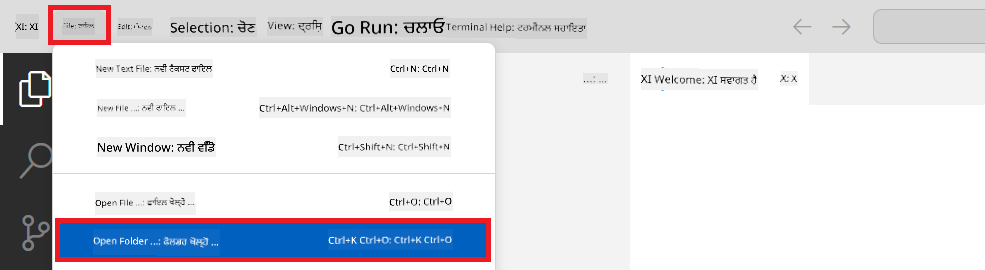

1. Visual Studio Code ਦੇ ਖੱਬੇ ਪੈਨ ਵਿੱਚ ਰਾਈਟ-ਕਲਿੱਕ ਕਰੋ ਅਤੇ **New File** ਚੁਣੋ, ਫਿਰ *download_dataset.py* ਨਾਮ ਦੀ ਨਵੀਂ ਫਾਈਲ ਬਣਾਓ।

1. Visual Studio Code ਦੇ ਖੱਬੇ ਪੈਨ ਵਿੱਚ ਰਾਈਟ-ਕਲਿੱਕ ਕਰੋ ਅਤੇ **New File** ਚੁਣੋ, ਫਿਰ *setup_ml.py* ਨਾਮ ਦੀ ਨਵੀਂ ਫਾਈਲ ਬਣਾਓ।

1. Visual Studio Code ਦੇ ਖੱਬੇ ਪੈਨ ਵਿੱਚ ਰਾਈਟ-ਕਲਿੱਕ ਕਰੋ ਅਤੇ **New File** ਚੁਣੋ, ਫਿਰ *deploy_model.py* ਨਾਮ ਦੀ ਨਵੀਂ ਫਾਈਲ ਬਣਾਓ।

    

1. Visual Studio Code ਦੇ ਖੱਬੇ ਪੈਨ ਵਿੱਚ ਰਾਈਟ-ਕਲਿੱਕ ਕਰੋ ਅਤੇ **New Folder** ਚੁਣੋ, ਫਿਰ *finetuning_dir* ਨਾਮ ਦਾ ਨਵਾਂ ਫੋਲਡਰ ਬਣਾਓ।

1. *finetuning_dir* ਫੋਲਡਰ ਵਿੱਚ *fine_tune.py* ਨਾਮ ਦੀ ਨਵੀਂ ਫਾਈਲ ਬਣਾਓ।

#### *conda.yml* ਫਾਈਲ ਬਣਾਓ ਅਤੇ ਕਨਫਿਗਰ ਕਰੋ

1. Visual Studio Code ਦੇ ਖੱਬੇ ਪੈਨ ਵਿੱਚ ਰਾਈਟ-ਕਲਿੱਕ ਕਰੋ ਅਤੇ **New File** ਚੁਣੋ, ਫਿਰ *conda.yml* ਨਾਮ ਦੀ ਨਵੀਂ ਫਾਈਲ ਬਣਾਓ।

1. *conda.yml* ਫਾਈਲ ਵਿੱਚ ਹੇਠਾਂ ਦਿੱਤਾ ਕੋਡ ਸ਼ਾਮਲ ਕਰੋ ਤਾਂ ਜੋ Phi-3 ਮਾਡਲ ਲਈ ਫਾਈਨ-ਟਿਊਨਿੰਗ ਵਾਤਾਵਰਣ ਸੈਟਅਪ ਕੀਤਾ ਜਾ ਸਕੇ।

    ```yml
    name: phi-3-training-env
    channels:
      - defaults
      - conda-forge
    dependencies:
      - python=3.10
      - pip
      - numpy<2.0
      - pip:
          - torch==2.4.0
          - torchvision==0.19.0
          - trl==0.8.6
          - transformers==4.41
          - datasets==2.21.0
          - azureml-core==1.57.0
          - azure-storage-blob==12.19.0
          - azure-ai-ml==1.16
          - azure-identity==1.17.1
          - accelerate==0.33.0
          - mlflow==2.15.1
          - azureml-mlflow==1.57.0
    ```

#### *config.py* ਫਾਈਲ ਬਣਾਓ ਅਤੇ ਕਨਫਿਗਰ ਕਰੋ

1. Visual Studio Code ਦੇ ਖੱਬੇ ਪੈਨ ਵਿੱਚ ਰਾਈਟ-ਕਲਿੱਕ ਕਰੋ ਅਤੇ **New File** ਚੁਣੋ, ਫਿਰ *config.py* ਨਾਮ ਦੀ ਨਵੀਂ ਫਾਈਲ ਬਣਾਓ।

1. *config.py* ਫਾਈਲ ਵਿੱਚ ਆਪਣੀ Azure ਜਾਣਕਾਰੀ ਸ਼ਾਮਲ ਕਰਨ ਲਈ ਹੇਠਾਂ ਦਿੱਤਾ ਕੋਡ ਜੋੜੋ।

    ```python
    # Azure settings
    AZURE_SUBSCRIPTION_ID = "your_subscription_id"
    AZURE_RESOURCE_GROUP_NAME = "your_resource_group_name" # "TestGroup"

    # Azure Machine Learning settings
    AZURE_ML_WORKSPACE_NAME = "your_workspace_name" # "finetunephi-workspace"

    # Azure Managed Identity settings
    AZURE_MANAGED_IDENTITY_CLIENT_ID = "your_azure_managed_identity_client_id"
    AZURE_MANAGED_IDENTITY_NAME = "your_azure_managed_identity_name" # "finetunephi-mangedidentity"
    AZURE_MANAGED_IDENTITY_RESOURCE_ID = f"/subscriptions/{AZURE_SUBSCRIPTION_ID}/resourceGroups/{AZURE_RESOURCE_GROUP_NAME}/providers/Microsoft.ManagedIdentity/userAssignedIdentities/{AZURE_MANAGED_IDENTITY_NAME}"

    # Dataset file paths
    TRAIN_DATA_PATH = "data/train_data.jsonl"
    TEST_DATA_PATH = "data/test_data.jsonl"

    # Fine-tuned model settings
    AZURE_MODEL_NAME = "your_fine_tuned_model_name" # "finetune-phi-model"
    AZURE_ENDPOINT_NAME = "your_fine_tuned_model_endpoint_name" # "finetune-phi-endpoint"
    AZURE_DEPLOYMENT_NAME = "your_fine_tuned_model_deployment_name" # "finetune-phi-deployment"

    AZURE_ML_API_KEY = "your_fine_tuned_model_api_key"
    AZURE_ML_ENDPOINT = "your_fine_tuned_model_endpoint_uri" # "https://{your-endpoint-name}.{your-region}.inference.ml.azure.com/score"
    ```

#### Azure ਵਾਤਾਵਰਣ ਵੈਰੀਏਬਲ ਸ਼ਾਮਲ ਕਰੋ

1. Azure Subscription ID ਸ਼ਾਮਲ ਕਰਨ ਲਈ ਹੇਠਾਂ ਦਿੱਤੇ ਕੰਮ ਕਰੋ:

    - ਪੋਰਟਲ ਪੇਜ਼ ਦੇ ਉੱਪਰਲੇ ਹਿੱਸੇ ਵਿੱਚ **search bar** ਵਿੱਚ *subscriptions* ਟਾਈਪ ਕਰੋ ਅਤੇ ਆਉਣ ਵਾਲੇ ਵਿਕਲਪਾਂ ਵਿੱਚੋਂ **Subscriptions** ਚੁਣੋ।
    - ਆਪਣੀ ਵਰਤਮਾਨ Azure Subscription ਚੁਣੋ।
    - ਆਪਣਾ Subscription ID *config.py* ਫਾਈਲ ਵਿੱਚ ਕਾਪੀ ਅਤੇ ਪੇਸਟ ਕਰੋ।

    

1. Azure Workspace Name ਸ਼ਾਮਲ ਕਰਨ ਲਈ ਹੇਠਾਂ ਦਿੱਤੇ ਕੰਮ ਕਰੋ:

    - ਉਸ Azure Machine Learning ਰਿਸੋਰਸ ਤੇ ਜਾਓ ਜੋ ਤੁਸੀਂ ਬਣਾਇਆ ਹੈ।
    - ਆਪਣਾ ਖਾਤਾ ਨਾਮ *config.py* ਫਾਈਲ ਵਿੱਚ ਕਾਪੀ ਅਤੇ ਪੇਸਟ ਕਰੋ।

    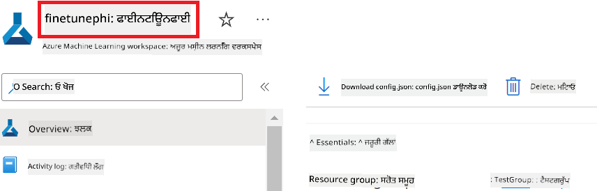

1. Azure Resource Group Name ਸ਼ਾਮਲ ਕਰਨ ਲਈ ਹੇਠਾਂ ਦਿੱਤੇ ਕੰਮ ਕਰੋ:

    - ਉਸ Azure Machine Learning ਰਿਸੋਰਸ ਤੇ ਜਾਓ ਜੋ ਤੁਸੀਂ ਬਣਾਇਆ ਹੈ।
    - ਆਪਣਾ Azure Resource Group Name *config.py* ਫਾਈਲ ਵਿੱਚ ਕਾਪੀ ਅਤੇ ਪੇਸਟ ਕਰੋ।

    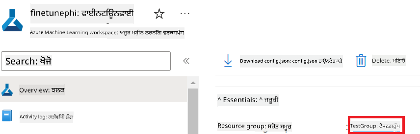

2. Azure Managed Identity ਨਾਮ ਸ਼ਾਮਲ ਕਰਨ ਲਈ ਹੇਠਾਂ ਦਿੱਤੇ ਕੰਮ ਕਰੋ:

    - ਉਸ Managed Identities ਰਿਸੋਰਸ ਤੇ ਜਾਓ ਜੋ ਤੁਸੀਂ ਬਣਾਇਆ ਹੈ।
    - ਆਪਣਾ Azure Managed Identity ਨਾਮ *config.py* ਫਾਈਲ ਵਿੱਚ ਕਾਪੀ ਅਤੇ ਪੇਸਟ ਕਰੋ।

    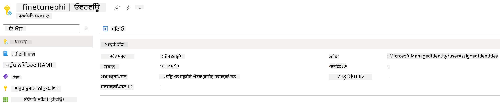

### ਫਾਈਨ-ਟਿਊਨਿੰਗ ਲਈ ਡਾਟਾਸੈੱਟ ਤਿਆਰ ਕਰੋ

ਇਸ ਅਭਿਆਸ ਵਿੱਚ, ਤੁਸੀਂ *download_dataset.py* ਫਾਈਲ ਚਲਾਕੇ *ULTRACHAT_200k* ਡਾਟਾਸੈੱਟ ਆਪਣੇ ਲੋਕਲ ਵਾਤਾਵਰਣ ਵਿੱਚ ਡਾਊਨਲੋਡ ਕਰੋਗੇ। ਫਿਰ ਤੁਸੀਂ ਇਸ ਡਾਟਾਸੈੱਟ ਦੀ ਵਰਤੋਂ ਕਰਕੇ Azure Machine Learning ਵਿੱਚ Phi-3 ਮਾਡਲ ਨੂੰ ਫਾਈਨ-ਟਿਊਨ ਕਰੋਗੇ।

#### *download_dataset.py* ਨਾਲ ਆਪਣਾ ਡਾਟਾਸੈੱਟ ਡਾਊਨਲੋਡ ਕਰੋ

1. Visual Studio Code ਵਿੱਚ *download_dataset.py* ਫਾਈਲ ਖੋਲ੍ਹੋ।

1. *download_dataset.py* ਵਿੱਚ ਹੇਠਾਂ ਦਿੱਤਾ ਕੋਡ ਸ਼ਾਮਲ ਕਰੋ।

    ```python
    import json
    import os
    from datasets import load_dataset
    from config import (
        TRAIN_DATA_PATH,
        TEST_DATA_PATH)

    def load_and_split_dataset(dataset_name, config_name, split_ratio):
        """
        Load and split a dataset.
        """
        # Load the dataset with the specified name, configuration, and split ratio
        dataset = load_dataset(dataset_name, config_name, split=split_ratio)
        print(f"Original dataset size: {len(dataset)}")
        
        # Split the dataset into train and test sets (80% train, 20% test)
        split_dataset = dataset.train_test_split(test_size=0.2)
        print(f"Train dataset size: {len(split_dataset['train'])}")
        print(f"Test dataset size: {len(split_dataset['test'])}")
        
        return split_dataset

    def save_dataset_to_jsonl(dataset, filepath):
        """
        Save a dataset to a JSONL file.
        """
        # Create the directory if it does not exist
        os.makedirs(os.path.dirname(filepath), exist_ok=True)
        
        # Open the file in write mode
        with open(filepath, 'w', encoding='utf-8') as f:
            # Iterate over each record in the dataset
            for record in dataset:
                # Dump the record as a JSON object and write it to the file
                json.dump(record, f)
                # Write a newline character to separate records
                f.write('\n')
        
        print(f"Dataset saved to {filepath}")

    def main():
        """
        Main function to load, split, and save the dataset.
        """
        # Load and split the ULTRACHAT_200k dataset with a specific configuration and split ratio
        dataset = load_and_split_dataset("HuggingFaceH4/ultrachat_200k", 'default', 'train_sft[:1%]')
        
        # Extract the train and test datasets from the split
        train_dataset = dataset['train']
        test_dataset = dataset['test']

        # Save the train dataset to a JSONL file
        save_dataset_to_jsonl(train_dataset, TRAIN_DATA_PATH)
        
        # Save the test dataset to a separate JSONL file
        save_dataset_to_jsonl(test_dataset, TEST_DATA_PATH)

    if __name__ == "__main__":
        main()

    ```

> [!TIP]
>
> **CPU ਦੀ ਵਰਤੋਂ ਨਾਲ ਘੱਟ ਡਾਟਾਸੈੱਟ ਨਾਲ ਫਾਈਨ-ਟਿਊਨਿੰਗ ਲਈ ਮਦਦ**
>
> ਜੇ ਤੁਸੀਂ ਫਾਈਨ-ਟਿਊਨਿੰਗ ਲਈ CPU ਦੀ ਵਰਤੋਂ ਕਰਨਾ ਚਾਹੁੰਦੇ ਹੋ, ਤਾਂ ਇਹ ਤਰੀਕਾ ਉਹਨਾਂ ਲਈ ਵਧੀਆ ਹੈ ਜਿਨ੍ਹਾਂ ਕੋਲ ਬੇਨਿਫਿਟ ਸਬਸਕ੍ਰਿਪਸ਼ਨ (ਜਿਵੇਂ Visual Studio Enterprise Subscription) ਹੈ ਜਾਂ ਜੋ ਫਾਈਨ-ਟਿਊਨਿੰਗ ਅਤੇ ਡਿਪਲੋਇਮੈਂਟ ਪ੍ਰਕਿਰਿਆ ਨੂੰ ਤੇਜ਼ੀ ਨਾਲ ਟੈਸਟ ਕਰਨਾ ਚਾਹੁੰਦੇ ਹਨ।
>
> `dataset = load_and_split_dataset("HuggingFaceH4/ultrachat_200k", 'default', 'train_sft[:1%]')` ਨੂੰ `dataset = load_and_split_dataset("HuggingFaceH4/ultrachat_200k", 'default', 'train_sft[:10]')` ਨਾਲ ਬਦਲੋ।
>

1. ਆਪਣੇ ਟਰਮੀਨਲ ਵਿੱਚ ਹੇਠਾਂ ਦਿੱਤੀ ਕਮਾਂਡ ਟਾਈਪ ਕਰੋ ਤਾਂ ਜੋ ਸਕ੍ਰਿਪਟ ਚੱਲੇ ਅਤੇ ਡਾਟਾਸੈੱਟ ਤੁਹਾਡੇ ਲੋਕਲ ਵਾਤਾਵਰਣ ਵਿੱਚ ਡਾਊਨਲੋਡ ਹੋ ਜਾਵੇ।

    ```console
    python download_data.py
    ```

1. ਯਕੀਨੀ ਬਣਾਓ ਕਿ ਡਾਟਾਸੈੱਟ ਸਫਲਤਾਪੂਰਵਕ ਤੁਹਾਡੇ ਲੋਕਲ *finetune-phi/data* ਡਾਇਰੈਕਟਰੀ ਵਿੱਚ ਸੇਵ ਹੋ ਗਏ ਹਨ।

> [!NOTE]
>
> **ਡਾਟਾਸੈੱਟ ਦਾ ਆਕਾਰ ਅਤੇ ਫਾਈਨ-ਟਿਊਨਿੰਗ ਦਾ ਸਮਾਂ**
>
> ਇਸ E2E ਨਮੂਨੇ ਵਿੱਚ, ਤੁਸੀਂ ਸਿਰਫ 1% ਡਾਟਾਸੈੱਟ (`train_sft[:1%]`) ਦੀ ਵਰਤੋਂ ਕਰਦੇ ਹੋ। ਇਸ ਨਾਲ ਡਾਟਾ ਦੀ ਮਾਤਰਾ ਕਾਫੀ ਘੱਟ ਹੋ ਜਾਂਦੀ ਹੈ, ਜਿਸ ਨਾਲ ਅਪਲੋਡ ਅਤੇ ਫਾਈਨ-ਟਿਊਨਿੰਗ ਦੋਹਾਂ ਦੀ ਪ੍ਰਕਿਰਿਆ ਤੇਜ਼ ਹੋ ਜਾਂਦੀ ਹੈ। ਤੁਸੀਂ ਪ੍ਰਸ਼ਿਸ਼ਣ ਸਮੇਂ ਅਤੇ ਮਾਡਲ ਪ੍ਰਦਰਸ਼ਨ ਵਿਚਕਾਰ ਸਹੀ ਸੰਤੁਲਨ ਲੱਭਣ ਲਈ ਪ੍ਰਤੀਸ਼ਤ ਨੂੰ ਬਦਲ ਸਕਦੇ ਹੋ। ਡਾਟਾਸੈੱਟ ਦੇ ਛੋਟੇ ਹਿੱਸੇ ਦੀ ਵਰਤੋਂ ਨਾਲ ਫਾਈਨ-ਟਿਊਨਿੰਗ ਲਈ ਲੱਗਣ ਵਾਲਾ ਸਮਾਂ ਘੱਟ ਹੁੰਦਾ ਹੈ, ਜਿਸ ਨਾਲ ਇਹ ਪ੍ਰਕਿਰਿਆ E2E ਨਮੂਨੇ ਲਈ ਵਧੀਆ ਬਣ ਜਾਂਦੀ ਹੈ।

## ਸਿਨਾਰੀਓ 2: Phi-3 ਮਾਡਲ ਨੂੰ ਫਾਈਨ-ਟਿਊਨ ਕਰੋ ਅਤੇ Azure Machine Learning Studio ਵਿੱਚ ਡਿਪਲੋਇ ਕਰੋ

### Azure CLI ਸੈਟਅਪ ਕਰੋ

ਤੁਹਾਨੂੰ ਆਪਣੇ ਵਾਤਾਵਰਣ ਨੂੰ ਪ੍ਰਮਾਣਿਤ ਕਰਨ ਲਈ Azure CLI ਸੈਟਅਪ ਕਰਨੀ ਪਵੇਗੀ। Azure CLI ਤੁਹਾਨੂੰ ਕਮਾਂਡ ਲਾਈਨ ਤੋਂ ਸਿੱਧਾ Azure ਰਿਸੋਰਸਾਂ ਦਾ ਪ੍ਰਬੰਧਨ ਕਰਨ ਦੀ ਆਗਿਆ ਦਿੰਦਾ ਹੈ ਅਤੇ Azure Machine Learning ਨੂੰ ਇਹ ਰਿਸੋਰਸਾਂ ਤੱਕ ਪਹੁੰਚ ਲਈ ਲੋੜੀਂਦੇ ਪ੍ਰਮਾਣ ਪੱਤਰ ਪ੍ਰਦਾਨ ਕਰਦਾ ਹੈ। ਸ਼ੁਰੂ ਕਰਨ ਲਈ [Azure CLI](https://learn.microsoft.com/cli/azure/install-azure-cli) ਇੰਸਟਾਲ ਕਰੋ।

1. ਟਰਮੀਨਲ ਵਿੰਡੋ ਖੋਲ੍ਹੋ ਅਤੇ ਆਪਣੇ Azure ਖਾਤੇ ਵਿੱਚ ਲੌਗਇਨ ਕਰਨ ਲਈ ਹੇਠਾਂ ਦਿੱਤੀ ਕਮਾਂਡ ਟਾਈਪ ਕਰੋ।

    ```console
    az login
    ```

1. ਆਪਣਾ ਵਰਤਮਾਨ Azure ਖਾਤਾ ਚੁਣੋ।

1. ਆਪਣੀ ਵਰਤਮਾਨ Azure ਸਬਸਕ੍ਰਿਪਸ਼ਨ ਚੁਣੋ।

    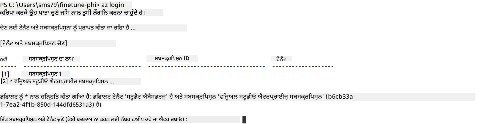

> [!TIP]
>
> ਜੇ ਤੁਹਾਨੂੰ Azure ਵਿੱਚ ਸਾਈਨ ਇਨ ਕਰਨ ਵਿੱਚ ਸਮੱਸਿਆ ਆ ਰਹੀ ਹੈ, ਤਾਂ ਡਿਵਾਈਸ ਕੋਡ ਦੀ ਵਰਤੋਂ ਕਰਨ ਦੀ ਕੋਸ਼ਿਸ਼ ਕਰੋ। ਟਰਮੀਨਲ ਵਿੰਡੋ ਖੋਲ੍ਹੋ ਅਤੇ ਆਪਣੇ Azure ਖਾਤੇ ਵਿੱਚ ਸਾਈਨ ਇਨ ਕਰਨ ਲਈ ਹੇਠਾਂ ਦਿੱਤੀ ਕਮਾਂਡ ਟਾਈਪ ਕਰੋ:
>
> ```console
> az login --use-device-code
> ```
>

### Phi-3 ਮਾਡਲ ਨੂੰ ਫਾਈਨ-ਟਿਊਨ ਕਰੋ

ਇਸ ਅਭਿਆਸ ਵਿੱਚ, ਤੁਸੀਂ ਦਿੱਤੇ ਗਏ ਡਾਟਾਸੈੱਟ ਦੀ ਵਰਤੋਂ ਕਰਕੇ Phi-3 ਮਾਡਲ ਨੂੰ ਫਾਈਨ-ਟਿਊਨ ਕਰੋਗੇ। ਪਹਿਲਾਂ, ਤੁਸੀਂ *fine_tune.py* ਫਾਈਲ ਵਿੱਚ ਫਾਈਨ-ਟਿਊਨਿੰਗ ਪ੍ਰਕਿਰਿਆ ਨੂੰ ਪਰਿਭਾਸ਼ਿਤ ਕਰੋਗੇ। ਫਿਰ, ਤੁਸੀਂ Azure Machine Learning ਵਾਤਾਵਰਣ ਨੂੰ ਕਨਫਿਗਰ ਕਰਕੇ *setup_ml.py* ਫਾਈਲ ਚਲਾਕੇ ਫਾਈਨ-ਟਿਊਨਿੰਗ ਪ੍ਰਕਿਰਿਆ ਸ਼ੁਰੂ ਕਰੋਗੇ। ਇਹ ਸਕ੍ਰਿਪਟ ਯਕੀਨੀ ਬਣਾਉਂਦਾ ਹੈ ਕਿ ਫਾਈਨ-ਟਿਊਨਿੰਗ Azure Machine Learning ਵਾਤਾਵਰਣ ਵਿੱਚ ਹੀ ਹੋਵੇ।

*setup_ml.py* ਚਲਾਕੇ, ਤੁਸੀਂ Azure Machine Learning ਵਾਤਾਵਰਣ ਵਿੱਚ ਫਾਈਨ-ਟਿਊਨਿੰਗ ਪ੍ਰਕਿਰਿਆ ਚਲਾਉਂਦੇ ਹੋ।

#### *fine_tune.py* ਫਾਈਲ ਵਿੱਚ ਕੋਡ ਸ਼ਾਮਲ ਕਰੋ

1. *finetuning_dir* ਫੋਲਡਰ ਵਿੱਚ ਜਾਓ ਅਤੇ Visual Studio Code ਵਿੱਚ *fine_tune.py* ਫਾਈਲ ਖੋਲ੍ਹੋ।

1. *fine_tune.py* ਵਿੱਚ ਹੇਠਾਂ ਦਿੱਤਾ ਕੋਡ ਸ਼ਾਮਲ ਕਰੋ।

    ```python
    import argparse
    import sys
    import logging
    import os
    from datasets import load_dataset
    import torch
    import mlflow
    from transformers import AutoModelForCausalLM, AutoTokenizer, TrainingArguments
    from trl import SFTTrainer

    # To avoid the INVALID_PARAMETER_VALUE error in MLflow, disable MLflow integration
    os.environ["DISABLE_MLFLOW_INTEGRATION"] = "True"

    # Logging setup
    logging.basicConfig(
        format="%(asctime)s - %(levelname)s - %(name)s - %(message)s",
        datefmt="%Y-%m-%d %H:%M:%S",
        handlers=[logging.StreamHandler(sys.stdout)],
        level=logging.WARNING
    )
    logger = logging.getLogger(__name__)

    def initialize_model_and_tokenizer(model_name, model_kwargs):
        """
        Initialize the model and tokenizer with the given pretrained model name and arguments.
        """
        model = AutoModelForCausalLM.from_pretrained(model_name, **model_kwargs)
        tokenizer = AutoTokenizer.from_pretrained(model_name)
        tokenizer.model_max_length = 2048
        tokenizer.pad_token = tokenizer.unk_token
        tokenizer.pad_token_id = tokenizer.convert_tokens_to_ids(tokenizer.pad_token)
        tokenizer.padding_side = 'right'
        return model, tokenizer

    def apply_chat_template(example, tokenizer):
        """
        Apply a chat template to tokenize messages in the example.
        """
        messages = example["messages"]
        if messages[0]["role"] != "system":
            messages.insert(0, {"role": "system", "content": ""})
        example["text"] = tokenizer.apply_chat_template(
            messages, tokenize=False, add_generation_prompt=False
        )
        return example

    def load_and_preprocess_data(train_filepath, test_filepath, tokenizer):
        """
        Load and preprocess the dataset.
        """
        train_dataset = load_dataset('json', data_files=train_filepath, split='train')
        test_dataset = load_dataset('json', data_files=test_filepath, split='train')
        column_names = list(train_dataset.features)

        train_dataset = train_dataset.map(
            apply_chat_template,
            fn_kwargs={"tokenizer": tokenizer},
            num_proc=10,
            remove_columns=column_names,
            desc="Applying chat template to train dataset",
        )

        test_dataset = test_dataset.map(
            apply_chat_template,
            fn_kwargs={"tokenizer": tokenizer},
            num_proc=10,
            remove_columns=column_names,
            desc="Applying chat template to test dataset",
        )

        return train_dataset, test_dataset

    def train_and_evaluate_model(train_dataset, test_dataset, model, tokenizer, output_dir):
        """
        Train and evaluate the model.
        """
        training_args = TrainingArguments(
            bf16=True,
            do_eval=True,
            output_dir=output_dir,
            eval_strategy="epoch",
            learning_rate=5.0e-06,
            logging_steps=20,
            lr_scheduler_type="cosine",
            num_train_epochs=3,
            overwrite_output_dir=True,
            per_device_eval_batch_size=4,
            per_device_train_batch_size=4,
            remove_unused_columns=True,
            save_steps=500,
            seed=0,
            gradient_checkpointing=True,
            gradient_accumulation_steps=1,
            warmup_ratio=0.2,
        )

        trainer = SFTTrainer(
            model=model,
            args=training_args,
            train_dataset=train_dataset,
            eval_dataset=test_dataset,
            max_seq_length=2048,
            dataset_text_field="text",
            tokenizer=tokenizer,
            packing=True
        )

        train_result = trainer.train()
        trainer.log_metrics("train", train_result.metrics)

        mlflow.transformers.log_model(
            transformers_model={"model": trainer.model, "tokenizer": tokenizer},
            artifact_path=output_dir,
        )

        tokenizer.padding_side = 'left'
        eval_metrics = trainer.evaluate()
        eval_metrics["eval_samples"] = len(test_dataset)
        trainer.log_metrics("eval", eval_metrics)

    def main(train_file, eval_file, model_output_dir):
        """
        Main function to fine-tune the model.
        """
        model_kwargs = {
            "use_cache": False,
            "trust_remote_code": True,
            "torch_dtype": torch.bfloat16,
            "device_map": None,
            "attn_implementation": "eager"
        }

        # pretrained_model_name = "microsoft/Phi-3-mini-4k-instruct"
        pretrained_model_name = "microsoft/Phi-3.5-mini-instruct"

        with mlflow.start_run():
            model, tokenizer = initialize_model_and_tokenizer(pretrained_model_name, model_kwargs)
            train_dataset, test_dataset = load_and_preprocess_data(train_file, eval_file, tokenizer)
            train_and_evaluate_model(train_dataset, test_dataset, model, tokenizer, model_output_dir)

    if __name__ == "__main__":
        parser = argparse.ArgumentParser()
        parser.add_argument("--train-file", type=str, required=True, help="Path to the training data")
        parser.add_argument("--eval-file", type=str, required=True, help="Path to the evaluation data")
        parser.add_argument("--model_output_dir", type=str, required=True, help="Directory to save the fine-tuned model")
        args = parser.parse_args()
        main(args.train_file, args.eval_file, args.model_output_dir)

    ```

1. *fine_tune.py* ਫਾਈਲ ਸੇਵ ਕਰੋ ਅਤੇ ਬੰਦ ਕਰੋ।

> [!TIP]
> **ਤੁਸੀਂ Phi-3.5 ਮਾਡਲ ਨੂੰ ਵੀ ਫਾਈਨ-ਟਿਊਨ ਕਰ ਸਕਦੇ ਹੋ**
>
> *fine_tune.py* ਫਾਈਲ ਵਿੱਚ, ਤੁਸੀਂ `pretrained_model_name` ਨੂੰ `"microsoft/Phi-3-mini-4k-instruct"` ਤੋਂ ਕਿਸੇ ਵੀ ਮਾਡਲ ਨਾਮ ਨਾਲ ਬਦਲ ਸਕਦੇ ਹੋ ਜੋ ਤੁਸੀਂ ਫਾਈਨ-ਟਿਊਨ ਕਰਨਾ ਚਾਹੁੰਦੇ ਹੋ। ਉਦਾਹਰਨ ਵਜੋਂ, ਜੇ ਤੁਸੀਂ ਇਸਨੂੰ `"microsoft/Phi-3.5-mini-instruct"` ਕਰਦੇ ਹੋ, ਤਾਂ ਤੁਸੀਂ Phi-3.5-mini-instruct ਮਾਡਲ ਦੀ ਵਰਤੋਂ ਕਰ ਰਹੇ ਹੋਵੋਗੇ। ਆਪਣੀ ਪਸੰਦ ਦਾ ਮਾਡਲ ਲੱਭਣ ਅਤੇ ਵਰਤਣ ਲਈ [Hugging Face](https://huggingface.co/) 'ਤੇ ਜਾਓ, ਮਾਡਲ ਖੋਜੋ ਅਤੇ ਫਿਰ ਉਸਦਾ ਨਾਮ `pretrained_model_name` ਫੀਲਡ ਵਿੱਚ ਪੇਸਟ ਕਰੋ।
>
> :::image type="content" source="../../imgs/03/FineTuning-PromptFlow/finetunephi3.5.png" alt-text="Fine tune Phi-3.5.":::
>

#### *setup_ml.py* ਫਾਈਲ ਵਿੱਚ ਕੋਡ ਸ਼ਾਮਲ ਕਰੋ

1. Visual Studio Code ਵਿੱਚ *setup_ml.py* ਫਾਈਲ ਖੋਲ੍ਹੋ।

1. *setup_ml.py* ਵਿੱਚ ਹੇਠਾਂ ਦਿੱਤਾ ਕੋਡ ਸ਼ਾਮਲ ਕਰੋ।

    ```python
    import logging
    from azure.ai.ml import MLClient, command, Input
    from azure.ai.ml.entities import Environment, AmlCompute
    from azure.identity import AzureCliCredential
    from config import (
        AZURE_SUBSCRIPTION_ID,
        AZURE_RESOURCE_GROUP_NAME,
        AZURE_ML_WORKSPACE_NAME,
        TRAIN_DATA_PATH,
        TEST_DATA_PATH
    )

    # Constants

    # Uncomment the following lines to use a CPU instance for training
    # COMPUTE_INSTANCE_TYPE = "Standard_E16s_v3" # cpu
    # COMPUTE_NAME = "cpu-e16s-v3"
    # DOCKER_IMAGE_NAME = "mcr.microsoft.com/azureml/openmpi4.1.0-ubuntu20.04:latest"

    # Uncomment the following lines to use a GPU instance for training
    COMPUTE_INSTANCE_TYPE = "Standard_NC24ads_A100_v4"
    COMPUTE_NAME = "gpu-nc24s-a100-v4"
    DOCKER_IMAGE_NAME = "mcr.microsoft.com/azureml/curated/acft-hf-nlp-gpu:59"

    CONDA_FILE = "conda.yml"
    LOCATION = "eastus2" # Replace with the location of your compute cluster
    FINETUNING_DIR = "./finetuning_dir" # Path to the fine-tuning script
    TRAINING_ENV_NAME = "phi-3-training-environment" # Name of the training environment
    MODEL_OUTPUT_DIR = "./model_output" # Path to the model output directory in azure ml

    # Logging setup to track the process
    logger = logging.getLogger(__name__)
    logging.basicConfig(
        format="%(asctime)s - %(levelname)s - %(name)s - %(message)s",
        datefmt="%Y-%m-%d %H:%M:%S",
        level=logging.WARNING
    )

    def get_ml_client():
        """
        Initialize the ML Client using Azure CLI credentials.
        """
        credential = AzureCliCredential()
        return MLClient(credential, AZURE_SUBSCRIPTION_ID, AZURE_RESOURCE_GROUP_NAME, AZURE_ML_WORKSPACE_NAME)

    def create_or_get_environment(ml_client):
        """
        Create or update the training environment in Azure ML.
        """
        env = Environment(
            image=DOCKER_IMAGE_NAME,  # Docker image for the environment
            conda_file=CONDA_FILE,  # Conda environment file
            name=TRAINING_ENV_NAME,  # Name of the environment
        )
        return ml_client.environments.create_or_update(env)

    def create_or_get_compute_cluster(ml_client, compute_name, COMPUTE_INSTANCE_TYPE, location):
        """
        Create or update the compute cluster in Azure ML.
        """
        try:
            compute_cluster = ml_client.compute.get(compute_name)
            logger.info(f"Compute cluster '{compute_name}' already exists. Reusing it for the current run.")
        except Exception:
            logger.info(f"Compute cluster '{compute_name}' does not exist. Creating a new one with size {COMPUTE_INSTANCE_TYPE}.")
            compute_cluster = AmlCompute(
                name=compute_name,
                size=COMPUTE_INSTANCE_TYPE,
                location=location,
                tier="Dedicated",  # Tier of the compute cluster
                min_instances=0,  # Minimum number of instances
                max_instances=1  # Maximum number of instances
            )
            ml_client.compute.begin_create_or_update(compute_cluster).wait()  # Wait for the cluster to be created
        return compute_cluster

    def create_fine_tuning_job(env, compute_name):
        """
        Set up the fine-tuning job in Azure ML.
        """
        return command(
            code=FINETUNING_DIR,  # Path to fine_tune.py
            command=(
                "python fine_tune.py "
                "--train-file ${{inputs.train_file}} "
                "--eval-file ${{inputs.eval_file}} "
                "--model_output_dir ${{inputs.model_output}}"
            ),
            environment=env,  # Training environment
            compute=compute_name,  # Compute cluster to use
            inputs={
                "train_file": Input(type="uri_file", path=TRAIN_DATA_PATH),  # Path to the training data file
                "eval_file": Input(type="uri_file", path=TEST_DATA_PATH),  # Path to the evaluation data file
                "model_output": MODEL_OUTPUT_DIR
            }
        )

    def main():
        """
        Main function to set up and run the fine-tuning job in Azure ML.
        """
        # Initialize ML Client
        ml_client = get_ml_client()

        # Create Environment
        env = create_or_get_environment(ml_client)
        
        # Create or get existing compute cluster
        create_or_get_compute_cluster(ml_client, COMPUTE_NAME, COMPUTE_INSTANCE_TYPE, LOCATION)

        # Create and Submit Fine-Tuning Job
        job = create_fine_tuning_job(env, COMPUTE_NAME)
        returned_job = ml_client.jobs.create_or_update(job)  # Submit the job
        ml_client.jobs.stream(returned_job.name)  # Stream the job logs
        
        # Capture the job name
        job_name = returned_job.name
        print(f"Job name: {job_name}")

    if __name__ == "__main__":
        main()

    ```

1. `COMPUTE_INSTANCE_TYPE`, `COMPUTE_NAME`, ਅਤੇ `LOCATION` ਨੂੰ ਆਪਣੇ ਵਿਸ਼ੇਸ਼ ਵੇਰਵਿਆਂ ਨਾਲ ਬਦਲੋ।

    ```python
   # Uncomment the following lines to use a GPU instance for training
    COMPUTE_INSTANCE_TYPE = "Standard_NC24ads_A100_v4"
    COMPUTE_NAME = "gpu-nc24s-a100-v4"
    ...
    LOCATION = "eastus2" # Replace with the location of your compute cluster
    ```

> [!TIP]
>
> **CPU ਦੀ ਵਰਤੋਂ ਨਾਲ ਘੱਟ ਡਾਟਾਸੈੱਟ ਨਾਲ ਫਾਈਨ-ਟਿਊਨਿੰਗ ਲਈ ਮਦਦ**
>
> ਜੇ ਤੁਸੀਂ ਫਾਈਨ-ਟਿਊਨਿੰਗ ਲਈ CPU ਦੀ ਵਰਤੋਂ ਕਰਨਾ ਚਾਹੁੰਦੇ ਹੋ, ਤਾਂ ਇਹ ਤਰੀਕਾ ਉਹਨਾਂ ਲਈ ਵਧੀਆ ਹੈ ਜਿਨ੍ਹਾਂ ਕੋਲ ਬੇਨਿਫਿਟ ਸਬਸਕ੍ਰਿਪਸ਼ਨ (ਜਿਵੇਂ Visual Studio Enterprise Subscription) ਹੈ ਜਾਂ ਜੋ ਫਾਈਨ-ਟਿਊਨਿੰਗ ਅਤੇ ਡਿਪਲੋਇਮੈਂਟ ਪ੍ਰਕਿਰਿਆ ਨੂੰ ਤੇਜ਼ੀ ਨਾਲ ਟੈਸਟ ਕਰਨਾ ਚਾਹੁੰਦੇ ਹਨ।
>
> 1. *setup_ml* ਫਾਈਲ ਖੋਲ੍ਹੋ।
> 1. `COMPUTE_INSTANCE_TYPE`, `COMPUTE_NAME`, ਅਤੇ `DOCKER_IMAGE_NAME` ਨੂੰ ਹੇਠਾਂ ਦਿੱਤੇ ਅਨੁਸਾਰ ਬਦਲੋ। ਜੇ ਤੁਹਾਡੇ ਕੋਲ *Standard_E16s_v3* ਤੱਕ ਪਹੁੰਚ ਨਹੀਂ ਹੈ, ਤਾਂ ਤੁਸੀਂ ਸਮਾਨ CPU ਇੰਸਟੈਂਸ ਦੀ ਵਰਤੋਂ ਕਰ ਸਕਦੇ ਹੋ ਜਾਂ ਨਵਾਂ ਕੋਟਾ ਮੰਗ ਸਕਦੇ ਹੋ।
> 1. `LOCATION` ਨੂੰ ਆਪਣੇ ਵਿਸ਼ੇਸ਼ ਵੇਰਵਿਆਂ ਨਾਲ ਬਦਲੋ।
>
>    ```python
>    # Uncomment the following lines to use a CPU instance for training
>    COMPUTE_INSTANCE_TYPE = "Standard_E16s_v3" # cpu
>    COMPUTE_NAME = "cpu-e16s-v3"
>    DOCKER_IMAGE_NAME = "mcr.microsoft.com/azureml/openmpi4.1.0-ubuntu20.04:latest"
>    LOCATION = "eastus2" # Replace with the location of your compute cluster
>    ```
>

1. *setup_ml.py* ਸਕ੍ਰਿਪਟ ਚਲਾਉਣ ਲਈ ਹੇਠਾਂ ਦਿੱਤੀ ਕਮਾਂਡ ਟਾਈਪ ਕਰੋ ਅਤੇ Azure Machine Learning ਵਿੱਚ ਫਾਈਨ-ਟਿਊਨਿੰਗ ਪ੍ਰਕਿਰਿਆ ਸ਼ੁਰੂ ਕਰੋ।

    ```python
    python setup_ml.py
    ```

1. ਇਸ ਅਭਿਆਸ ਵਿੱਚ, ਤੁਸੀਂ ਸਫਲਤਾਪੂਰਵਕ Azure Machine Learning ਦੀ ਵਰਤੋਂ ਕਰਕੇ Phi-3 ਮਾਡਲ ਨੂੰ ਫਾਈਨ-ਟਿਊਨ ਕੀਤਾ। *setup_ml.py* ਸਕ੍ਰਿਪਟ ਚਲਾਕੇ, ਤੁਸੀਂ Azure Machine Learning ਵਾਤਾਵਰਣ ਸੈਟਅਪ ਕੀਤਾ ਅਤੇ *fine_tune.py* ਵਿੱਚ ਪਰਿਭਾਸ਼ਿਤ ਫਾਈਨ-ਟਿਊਨਿੰਗ ਪ੍ਰਕਿਰਿਆ ਸ਼ੁਰੂ ਕੀਤੀ। ਕਿਰਪਾ ਕਰਕੇ ਧਿਆਨ ਦਿਓ ਕਿ ਫਾਈਨ-ਟਿਊਨਿੰਗ ਪ੍ਰਕਿਰਿਆ ਵਿੱਚ ਕਾਫੀ ਸਮਾਂ ਲੱਗ ਸਕਦਾ ਹੈ। `python setup_ml.py` ਕਮਾਂਡ ਚਲਾਉਣ ਤੋਂ ਬਾਅਦ, ਪ੍ਰਕਿਰਿਆ ਦੇ ਪੂਰੀ ਹੋਣ ਦੀ ਉਡੀਕ ਕਰੋ। ਤੁਸੀਂ ਟਰ
IMPORTANT RULES:  
1. ਆਪਣੇ ਕੰਮ ਦਾ ਨਾਮ `JOB_NAME = "your-job-name"` ਵਿੱਚ *deploy_model.py* ਫਾਇਲ ਵਿੱਚ ਕਾਪੀ ਅਤੇ ਪੇਸਟ ਕਰੋ।  

1. `COMPUTE_INSTANCE_TYPE` ਨੂੰ ਆਪਣੇ ਵਿਸ਼ੇਸ਼ ਵੇਰਵਿਆਂ ਨਾਲ ਬਦਲੋ।  

1. Azure Machine Learning ਵਿੱਚ ਡਿਪਲੋਇਮੈਂਟ ਪ੍ਰਕਿਰਿਆ ਸ਼ੁਰੂ ਕਰਨ ਲਈ *deploy_model.py* ਸਕ੍ਰਿਪਟ ਚਲਾਉਣ ਲਈ ਹੇਠਾਂ ਦਿੱਤਾ ਕਮਾਂਡ ਟਾਈਪ ਕਰੋ।  

```python
    python deploy_model.py
    ```  

> [!WARNING]  
> ਆਪਣੇ ਖਾਤੇ 'ਤੇ ਵਾਧੂ ਖਰਚੇ ਤੋਂ ਬਚਣ ਲਈ, Azure Machine Learning ਵਰਕਸਪੇਸ ਵਿੱਚ ਬਣਾਇਆ ਗਿਆ endpoint ਹਟਾਉਣਾ ਯਕੀਨੀ ਬਣਾਓ।  
>  

#### Azure Machine Learning ਵਰਕਸਪੇਸ ਵਿੱਚ ਡਿਪਲੋਇਮੈਂਟ ਦੀ ਸਥਿਤੀ ਚੈੱਕ ਕਰੋ  

1. [Azure ML Studio](https://ml.azure.com/home?wt.mc_id=studentamb_279723) 'ਤੇ ਜਾਓ।  

1. ਉਸ Azure Machine Learning ਵਰਕਸਪੇਸ 'ਤੇ ਜਾਓ ਜੋ ਤੁਸੀਂ ਬਣਾਇਆ ਹੈ।  

1. Azure Machine Learning ਵਰਕਸਪੇਸ ਖੋਲ੍ਹਣ ਲਈ **Studio web URL** ਚੁਣੋ।  

1. ਖੱਬੇ ਪਾਸੇ ਟੈਬ ਤੋਂ **Endpoints** ਚੁਣੋ।  

    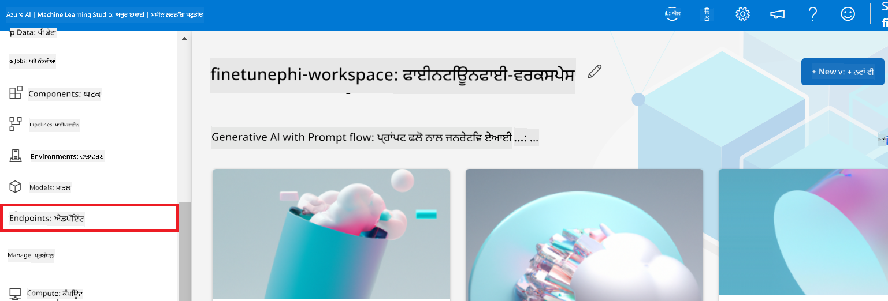  

2. ਉਸ endpoint ਨੂੰ ਚੁਣੋ ਜੋ ਤੁਸੀਂ ਬਣਾਇਆ ਹੈ।  

    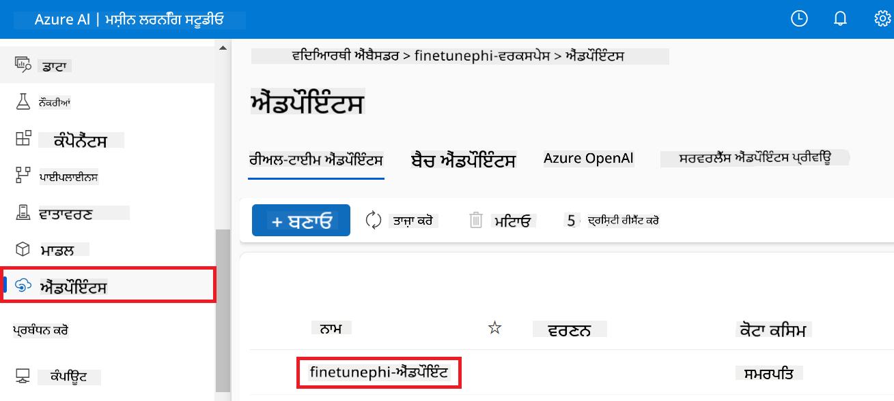  

3. ਇਸ ਪੰਨੇ 'ਤੇ, ਤੁਸੀਂ ਡਿਪਲੋਇਮੈਂਟ ਪ੍ਰਕਿਰਿਆ ਦੌਰਾਨ ਬਣਾਏ ਗਏ endpoints ਨੂੰ ਮੈਨੇਜ ਕਰ ਸਕਦੇ ਹੋ।  

## ਸਿਨਾਰਿਓ 3: Prompt flow ਨਾਲ ਇੰਟੀਗ੍ਰੇਟ ਕਰੋ ਅਤੇ ਆਪਣੇ ਕਸਟਮ ਮਾਡਲ ਨਾਲ ਗੱਲਬਾਤ ਕਰੋ  

### Prompt flow ਨਾਲ ਕਸਟਮ Phi-3 ਮਾਡਲ ਨੂੰ ਇੰਟੀਗ੍ਰੇਟ ਕਰੋ  

ਆਪਣਾ ਫਾਈਨ-ਟਿਊਨ ਕੀਤਾ ਮਾਡਲ ਸਫਲਤਾਪੂਰਵਕ ਡਿਪਲੋਇ ਕਰਨ ਤੋਂ ਬਾਅਦ, ਹੁਣ ਤੁਸੀਂ ਇਸਨੂੰ Prompt flow ਨਾਲ ਜੋੜ ਸਕਦੇ ਹੋ ਤਾਂ ਜੋ ਤੁਸੀਂ ਆਪਣੇ ਮਾਡਲ ਨੂੰ ਰੀਅਲ-ਟਾਈਮ ਐਪਲੀਕੇਸ਼ਨਾਂ ਵਿੱਚ ਵਰਤ ਸਕੋ, ਜਿਸ ਨਾਲ ਤੁਹਾਡੇ ਕਸਟਮ Phi-3 ਮਾਡਲ ਨਾਲ ਵੱਖ-ਵੱਖ ਇੰਟਰਐਕਟਿਵ ਕੰਮ ਕਰਨ ਦੀ ਸਹੂਲਤ ਮਿਲੇਗੀ।  

#### ਫਾਈਨ-ਟਿਊਨ ਕੀਤੇ Phi-3 ਮਾਡਲ ਦੀ api key ਅਤੇ endpoint uri ਸੈੱਟ ਕਰੋ  

1. ਉਸ Azure Machine Learning ਵਰਕਸਪੇਸ 'ਤੇ ਜਾਓ ਜੋ ਤੁਸੀਂ ਬਣਾਇਆ ਹੈ।  
1. ਖੱਬੇ ਪਾਸੇ ਟੈਬ ਤੋਂ **Endpoints** ਚੁਣੋ।  
1. ਉਸ endpoint ਨੂੰ ਚੁਣੋ ਜੋ ਤੁਸੀਂ ਬਣਾਇਆ ਹੈ।  
1. ਨੈਵੀਗੇਸ਼ਨ ਮੀਨੂ ਤੋਂ **Consume** ਚੁਣੋ।  
1. ਆਪਣਾ **REST endpoint** ਕਾਪੀ ਕਰਕੇ *config.py* ਫਾਇਲ ਵਿੱਚ `AZURE_ML_ENDPOINT = "your_fine_tuned_model_endpoint_uri"` ਦੀ ਥਾਂ ਪੇਸਟ ਕਰੋ।  
1. ਆਪਣੀ **Primary key** ਕਾਪੀ ਕਰਕੇ *config.py* ਫਾਇਲ ਵਿੱਚ `AZURE_ML_API_KEY = "your_fine_tuned_model_api_key"` ਦੀ ਥਾਂ ਪੇਸਟ ਕਰੋ।  

      

#### *flow.dag.yml* ਫਾਇਲ ਵਿੱਚ ਕੋਡ ਸ਼ਾਮਲ ਕਰੋ  

1. Visual Studio Code ਵਿੱਚ *flow.dag.yml* ਫਾਇਲ ਖੋਲ੍ਹੋ।  

1. ਹੇਠਾਂ ਦਿੱਤਾ ਕੋਡ *flow.dag.yml* ਵਿੱਚ ਸ਼ਾਮਲ ਕਰੋ।  

    ```yml
    inputs:
      input_data:
        type: string
        default: "Who founded Microsoft?"

    outputs:
      answer:
        type: string
        reference: ${integrate_with_promptflow.output}

    nodes:
    - name: integrate_with_promptflow
      type: python
      source:
        type: code
        path: integrate_with_promptflow.py
      inputs:
        input_data: ${inputs.input_data}
    ```  

#### *integrate_with_promptflow.py* ਫਾਇਲ ਵਿੱਚ ਕੋਡ ਸ਼ਾਮਲ ਕਰੋ  

1. Visual Studio Code ਵਿੱਚ *integrate_with_promptflow.py* ਫਾਇਲ ਖੋਲ੍ਹੋ।  

1. ਹੇਠਾਂ ਦਿੱਤਾ ਕੋਡ *integrate_with_promptflow.py* ਵਿੱਚ ਸ਼ਾਮਲ ਕਰੋ।  

    ```python
    import logging
    import requests
    from promptflow.core import tool
    import asyncio
    import platform
    from config import (
        AZURE_ML_ENDPOINT,
        AZURE_ML_API_KEY
    )

    # Logging setup
    logging.basicConfig(
        format="%(asctime)s - %(levelname)s - %(name)s - %(message)s",
        datefmt="%Y-%m-%d %H:%M:%S",
        level=logging.DEBUG
    )
    logger = logging.getLogger(__name__)

    def query_azml_endpoint(input_data: list, endpoint_url: str, api_key: str) -> str:
        """
        Send a request to the Azure ML endpoint with the given input data.
        """
        headers = {
            "Content-Type": "application/json",
            "Authorization": f"Bearer {api_key}"
        }
        data = {
            "input_data": [input_data],
            "params": {
                "temperature": 0.7,
                "max_new_tokens": 128,
                "do_sample": True,
                "return_full_text": True
            }
        }
        try:
            response = requests.post(endpoint_url, json=data, headers=headers)
            response.raise_for_status()
            result = response.json()[0]
            logger.info("Successfully received response from Azure ML Endpoint.")
            return result
        except requests.exceptions.RequestException as e:
            logger.error(f"Error querying Azure ML Endpoint: {e}")
            raise

    def setup_asyncio_policy():
        """
        Setup asyncio event loop policy for Windows.
        """
        if platform.system() == 'Windows':
            asyncio.set_event_loop_policy(asyncio.WindowsSelectorEventLoopPolicy())
            logger.info("Set Windows asyncio event loop policy.")

    @tool
    def my_python_tool(input_data: str) -> str:
        """
        Tool function to process input data and query the Azure ML endpoint.
        """
        setup_asyncio_policy()
        return query_azml_endpoint(input_data, AZURE_ML_ENDPOINT, AZURE_ML_API_KEY)

    ```  

### ਆਪਣੇ ਕਸਟਮ ਮਾਡਲ ਨਾਲ ਗੱਲਬਾਤ ਕਰੋ  

1. Azure Machine Learning ਵਿੱਚ ਡਿਪਲੋਇਮੈਂਟ ਪ੍ਰਕਿਰਿਆ ਸ਼ੁਰੂ ਕਰਨ ਲਈ *deploy_model.py* ਸਕ੍ਰਿਪਟ ਚਲਾਉਣ ਲਈ ਹੇਠਾਂ ਦਿੱਤਾ ਕਮਾਂਡ ਟਾਈਪ ਕਰੋ।  

    ```python
    pf flow serve --source ./ --port 8080 --host localhost
    ```  

1. ਨਤੀਜਿਆਂ ਦਾ ਉਦਾਹਰਨ: ਹੁਣ ਤੁਸੀਂ ਆਪਣੇ ਕਸਟਮ Phi-3 ਮਾਡਲ ਨਾਲ ਗੱਲਬਾਤ ਕਰ ਸਕਦੇ ਹੋ। ਸਿਫਾਰਸ਼ ਕੀਤੀ ਜਾਂਦੀ ਹੈ ਕਿ ਤੁਸੀਂ ਫਾਈਨ-ਟਿਊਨਿੰਗ ਲਈ ਵਰਤੇ ਡੇਟਾ ਦੇ ਆਧਾਰ 'ਤੇ ਸਵਾਲ ਪੁੱਛੋ।  

    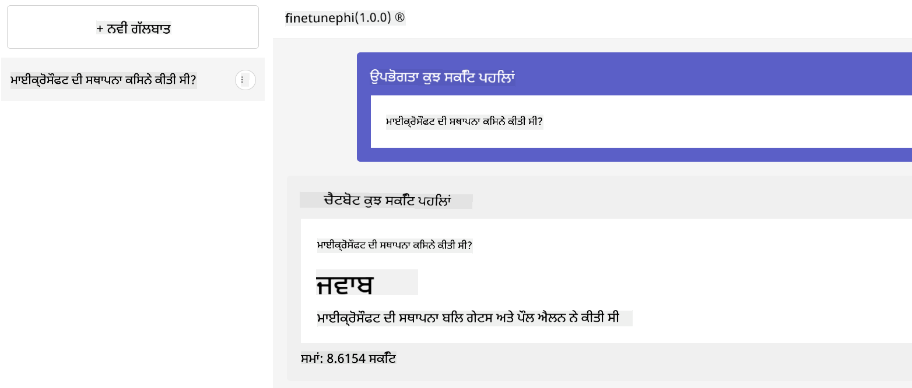

**ਅਸਵੀਕਾਰੋਪਣ**:  
ਇਹ ਦਸਤਾਵੇਜ਼ AI ਅਨੁਵਾਦ ਸੇਵਾ [Co-op Translator](https://github.com/Azure/co-op-translator) ਦੀ ਵਰਤੋਂ ਕਰਕੇ ਅਨੁਵਾਦਿਤ ਕੀਤਾ ਗਿਆ ਹੈ। ਜਦੋਂ ਕਿ ਅਸੀਂ ਸਹੀਤਾ ਲਈ ਕੋਸ਼ਿਸ਼ ਕਰਦੇ ਹਾਂ, ਕਿਰਪਾ ਕਰਕੇ ਧਿਆਨ ਰੱਖੋ ਕਿ ਸਵੈਚਾਲਿਤ ਅਨੁਵਾਦਾਂ ਵਿੱਚ ਗਲਤੀਆਂ ਜਾਂ ਅਸਮਰਥਤਾਵਾਂ ਹੋ ਸਕਦੀਆਂ ਹਨ। ਮੂਲ ਦਸਤਾਵੇਜ਼ ਆਪਣੀ ਮੂਲ ਭਾਸ਼ਾ ਵਿੱਚ ਪ੍ਰਮਾਣਿਕ ਸਰੋਤ ਮੰਨਿਆ ਜਾਣਾ ਚਾਹੀਦਾ ਹੈ। ਮਹੱਤਵਪੂਰਨ ਜਾਣਕਾਰੀ ਲਈ, ਪੇਸ਼ੇਵਰ ਮਨੁੱਖੀ ਅਨੁਵਾਦ ਦੀ ਸਿਫਾਰਸ਼ ਕੀਤੀ ਜਾਂਦੀ ਹੈ। ਇਸ ਅਨੁਵਾਦ ਦੀ ਵਰਤੋਂ ਤੋਂ ਉਤਪੰਨ ਕਿਸੇ ਵੀ ਗਲਤਫਹਮੀ ਜਾਂ ਗਲਤ ਵਿਆਖਿਆ ਲਈ ਅਸੀਂ ਜ਼ਿੰਮੇਵਾਰ ਨਹੀਂ ਹਾਂ।