<!--
CO_OP_TRANSLATOR_METADATA:
{
  "original_hash": "455be2b7b9c3390d367d528f8fab2aa0",
  "translation_date": "2025-05-09T17:25:02+00:00",
  "source_file": "md/02.Application/01.TextAndChat/Phi3/E2E_Phi-3-FineTuning_PromptFlow_Integration.md",
  "language_code": "pa"
}
-->
# Fine-tune ਅਤੇ Prompt flow ਨਾਲ custom Phi-3 ਮਾਡਲਾਂ ਨੂੰ ਇੰਟੀਗ੍ਰੇਟ ਕਰੋ

ਇਹ end-to-end (E2E) ਨਮੂਨਾ Microsoft Tech Community ਵਿੱਚ "[Fine-Tune and Integrate Custom Phi-3 Models with Prompt Flow: Step-by-Step Guide](https://techcommunity.microsoft.com/t5/educator-developer-blog/fine-tune-and-integrate-custom-phi-3-models-with-prompt-flow/ba-p/4178612?WT.mc_id=aiml-137032-kinfeylo)" ਗਾਈਡ 'ਤੇ ਆਧਾਰਿਤ ਹੈ। ਇਹ fine-tuning, deployment, ਅਤੇ custom Phi-3 ਮਾਡਲਾਂ ਨੂੰ Prompt flow ਨਾਲ ਜੋੜਨ ਦੀ ਪ੍ਰਕਿਰਿਆ ਨੂੰ ਪੇਸ਼ ਕਰਦਾ ਹੈ।

## ਝਲਕ

ਇਸ E2E ਨਮੂਨੇ ਵਿੱਚ, ਤੁਸੀਂ ਸਿੱਖੋਗੇ ਕਿ ਕਿਵੇਂ Phi-3 ਮਾਡਲ ਨੂੰ fine-tune ਕਰਨਾ ਹੈ ਅਤੇ ਇਸਨੂੰ Prompt flow ਨਾਲ ਜੋੜਨਾ ਹੈ। Azure Machine Learning ਅਤੇ Prompt flow ਦੀ ਵਰਤੋਂ ਕਰਕੇ, ਤੁਸੀਂ custom AI ਮਾਡਲਾਂ ਨੂੰ deploy ਕਰਨ ਅਤੇ ਵਰਤਣ ਲਈ ਇੱਕ workflow ਸੈੱਟ ਕਰੋਂਗੇ। ਇਹ E2E ਨਮੂਨਾ ਤਿੰਨ ਸਿਨਾਰਿਓ ਵਿੱਚ ਵੰਡਿਆ ਗਿਆ ਹੈ:

**ਸਿਨਾਰਿਓ 1: Azure ਸਰੋਤ ਸੈੱਟ ਕਰੋ ਅਤੇ fine-tuning ਲਈ ਤਿਆਰੀ ਕਰੋ**

**ਸਿਨਾਰਿਓ 2: Phi-3 ਮਾਡਲ ਨੂੰ fine-tune ਕਰੋ ਅਤੇ Azure Machine Learning Studio ਵਿੱਚ deploy ਕਰੋ**

**ਸਿਨਾਰਿਓ 3: Prompt flow ਨਾਲ ਇੰਟੀਗ੍ਰੇਟ ਕਰੋ ਅਤੇ ਆਪਣੇ custom ਮਾਡਲ ਨਾਲ ਗੱਲਬਾਤ ਕਰੋ**

ਇਹ ਰਿਹਾ ਇਸ E2E ਨਮੂਨੇ ਦੀ ਝਲਕ।


### ਸਮੱਗਰੀ ਦੀ ਸੂਚੀ

1. **[ਸਿਨਾਰਿਓ 1: Azure ਸਰੋਤ ਸੈੱਟ ਕਰੋ ਅਤੇ fine-tuning ਲਈ ਤਿਆਰੀ ਕਰੋ](../../../../../../md/02.Application/01.TextAndChat/Phi3)**
    - [Azure Machine Learning Workspace ਬਣਾਓ](../../../../../../md/02.Application/01.TextAndChat/Phi3)
    - [Azure Subscription ਵਿੱਚ GPU quotas ਦੀ ਬੇਨਤੀ ਕਰੋ](../../../../../../md/02.Application/01.TextAndChat/Phi3)
    - [ਰੋਲ ਅਸਾਈਨਮੈਂਟ ਸ਼ਾਮਿਲ ਕਰੋ](../../../../../../md/02.Application/01.TextAndChat/Phi3)
    - [ਪ੍ਰੋਜੈਕਟ ਸੈੱਟ ਕਰੋ](../../../../../../md/02.Application/01.TextAndChat/Phi3)
    - [fine-tuning ਲਈ dataset ਤਿਆਰ ਕਰੋ](../../../../../../md/02.Application/01.TextAndChat/Phi3)

1. **[ਸਿਨਾਰਿਓ 2: Phi-3 ਮਾਡਲ ਨੂੰ fine-tune ਕਰੋ ਅਤੇ Azure Machine Learning Studio ਵਿੱਚ deploy ਕਰੋ](../../../../../../md/02.Application/01.TextAndChat/Phi3)**
    - [Azure CLI ਸੈੱਟ ਕਰੋ](../../../../../../md/02.Application/01.TextAndChat/Phi3)
    - [Phi-3 ਮਾਡਲ ਨੂੰ fine-tune ਕਰੋ](../../../../../../md/02.Application/01.TextAndChat/Phi3)
    - [fine-tuned ਮਾਡਲ ਨੂੰ deploy ਕਰੋ](../../../../../../md/02.Application/01.TextAndChat/Phi3)

1. **[ਸਿਨਾਰਿਓ 3: Prompt flow ਨਾਲ ਇੰਟੀਗ੍ਰੇਟ ਕਰੋ ਅਤੇ ਆਪਣੇ custom ਮਾਡਲ ਨਾਲ ਗੱਲਬਾਤ ਕਰੋ](../../../../../../md/02.Application/01.TextAndChat/Phi3)**
    - [custom Phi-3 ਮਾਡਲ ਨੂੰ Prompt flow ਨਾਲ ਇੰਟੀਗ੍ਰੇਟ ਕਰੋ](../../../../../../md/02.Application/01.TextAndChat/Phi3)
    - [ਆਪਣੇ custom ਮਾਡਲ ਨਾਲ ਗੱਲਬਾਤ ਕਰੋ](../../../../../../md/02.Application/01.TextAndChat/Phi3)

## ਸਿਨਾਰਿਓ 1: Azure ਸਰੋਤ ਸੈੱਟ ਕਰੋ ਅਤੇ fine-tuning ਲਈ ਤਿਆਰੀ ਕਰੋ

### Azure Machine Learning Workspace ਬਣਾਓ

1. ਪੋਰਟਲ ਪੇਜ ਦੇ ਉੱਪਰਲੇ ਹਿੱਸੇ ਵਿੱਚ **search bar** ਵਿੱਚ *azure machine learning* ਟਾਈਪ ਕਰੋ ਅਤੇ ਆਉਣ ਵਾਲੀਆਂ ਵਿਕਲਪਾਂ ਵਿੱਚੋਂ **Azure Machine Learning** ਚੁਣੋ।

    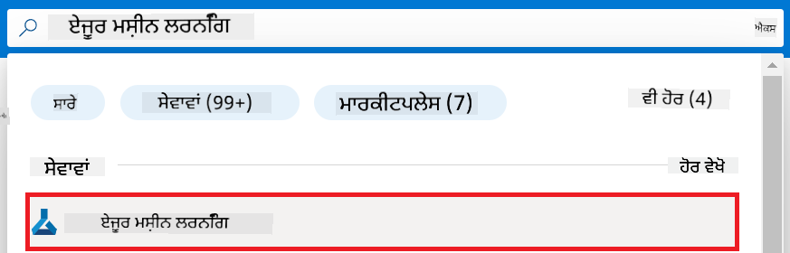

1. ਨੈਵੀਗੇਸ਼ਨ ਮੀਨੂ ਵਿੱਚੋਂ **+ Create** ਚੁਣੋ।

1. ਨੈਵੀਗੇਸ਼ਨ ਮੀਨੂ ਵਿੱਚੋਂ **New workspace** ਚੁਣੋ।

    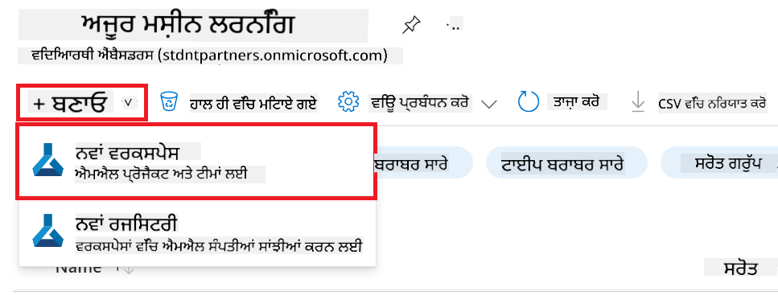

1. ਹੇਠਾਂ ਦਿੱਤੇ ਕੰਮ ਕਰੋ:

    - ਆਪਣੀ Azure **Subscription** ਚੁਣੋ।
    - ਵਰਤੋਂ ਲਈ **Resource group** ਚੁਣੋ (ਜੇ ਲੋੜ ਹੋਵੇ ਤਾਂ ਨਵਾਂ ਬਣਾਓ)।
    - **Workspace Name** ਦਿਓ। ਇਹ ਵਿਲੱਖਣ ਹੋਣਾ ਚਾਹੀਦਾ ਹੈ।
    - ਵਰਤੋਂ ਲਈ **Region** ਚੁਣੋ।
    - ਵਰਤੋਂ ਲਈ **Storage account** ਚੁਣੋ (ਜੇ ਲੋੜ ਹੋਵੇ ਤਾਂ ਨਵਾਂ ਬਣਾਓ)।
    - ਵਰਤੋਂ ਲਈ **Key vault** ਚੁਣੋ (ਜੇ ਲੋੜ ਹੋਵੇ ਤਾਂ ਨਵਾਂ ਬਣਾਓ)।
    - ਵਰਤੋਂ ਲਈ **Application insights** ਚੁਣੋ (ਜੇ ਲੋੜ ਹੋਵੇ ਤਾਂ ਨਵਾਂ ਬਣਾਓ)।
    - ਵਰਤੋਂ ਲਈ **Container registry** ਚੁਣੋ (ਜੇ ਲੋੜ ਹੋਵੇ ਤਾਂ ਨਵਾਂ ਬਣਾਓ)।

    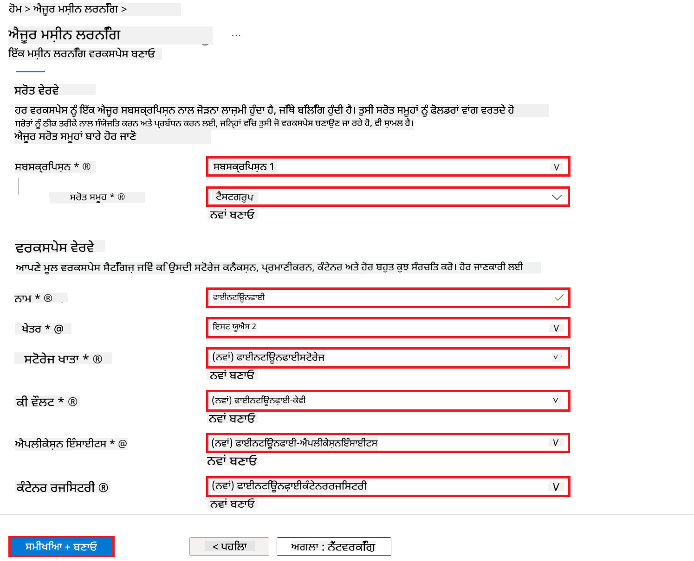

1. **Review + Create** ਚੁਣੋ।

1. **Create** ਚੁਣੋ।

### Azure Subscription ਵਿੱਚ GPU quotas ਦੀ ਬੇਨਤੀ ਕਰੋ

ਇਸ E2E ਨਮੂਨੇ ਵਿੱਚ, ਤੁਸੀਂ fine-tuning ਲਈ *Standard_NC24ads_A100_v4 GPU* ਦੀ ਵਰਤੋਂ ਕਰੋਗੇ, ਜਿਸ ਲਈ quota ਦੀ ਬੇਨਤੀ ਕਰਨੀ ਪੈਂਦੀ ਹੈ, ਅਤੇ deployment ਲਈ *Standard_E4s_v3* CPU ਦੀ ਵਰਤੋਂ ਕਰੋਗੇ, ਜਿਸ ਲਈ quota ਦੀ ਲੋੜ ਨਹੀਂ।

> [!NOTE]
>
> ਕੇਵਲ Pay-As-You-Go subscriptions (ਮਿਆਰੀ subscription ਕਿਸਮ) ਨੂੰ GPU allocation ਲਈ ਯੋਗਤਾ ਹੈ; benefit subscriptions ਇਸ ਸਮੇਂ ਸਹਾਇਤਾ ਨਹੀਂ ਕਰਦੇ।
>
> ਜੇ ਤੁਸੀਂ benefit subscriptions ਵਰਤ ਰਹੇ ਹੋ (ਜਿਵੇਂ Visual Studio Enterprise Subscription) ਜਾਂ fine-tuning ਅਤੇ deployment ਪ੍ਰਕਿਰਿਆ ਨੂੰ ਤੇਜ਼ੀ ਨਾਲ ਟੈਸਟ ਕਰਨਾ ਚਾਹੁੰਦੇ ਹੋ, ਤਾਂ ਇਹ ਟਿਊਟੋਰਿਯਲ CPU ਨਾਲ ਛੋਟੇ dataset ਦੀ ਵਰਤੋਂ ਕਰਕੇ fine-tuning ਲਈ ਵੀ ਦਿਸ਼ਾ-ਨਿਰਦੇਸ਼ ਦਿੰਦਾ ਹੈ। ਪਰ ਇਹ ਯਾਦ ਰੱਖੋ ਕਿ GPU ਨਾਲ ਵੱਡੇ datasets ਤੇ fine-tuning ਦੇ ਨਤੀਜੇ ਕਾਫੀ ਬਿਹਤਰ ਹੁੰਦੇ ਹਨ।

1. [Azure ML Studio](https://ml.azure.com/home?wt.mc_id=studentamb_279723) 'ਤੇ ਜਾਓ।

1. *Standard NCADSA100v4 Family* quota ਦੀ ਬੇਨਤੀ ਕਰਨ ਲਈ ਹੇਠਾਂ ਦਿੱਤੇ ਕੰਮ ਕਰੋ:

    - ਖੱਬੇ ਪਾਸੇ ਟੈਬ ਵਿੱਚੋਂ **Quota** ਚੁਣੋ।
    - ਵਰਤੋਂ ਲਈ **Virtual machine family** ਚੁਣੋ। ਉਦਾਹਰਨ ਵਜੋਂ, **Standard NCADSA100v4 Family Cluster Dedicated vCPUs** ਚੁਣੋ, ਜਿਸ ਵਿੱਚ *Standard_NC24ads_A100_v4* GPU ਸ਼ਾਮਿਲ ਹੈ।
    - ਨੈਵੀਗੇਸ਼ਨ ਮੀਨੂ ਵਿੱਚੋਂ **Request quota** ਚੁਣੋ।

        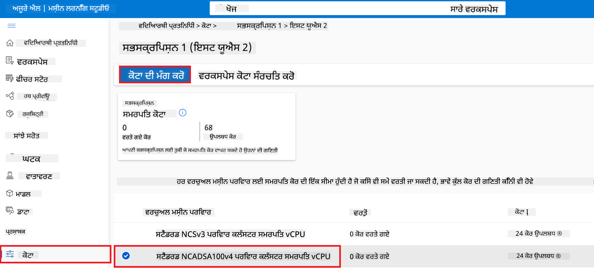

    - Request quota ਪੰਨੇ 'ਤੇ, ਵਰਤੋਂ ਲਈ **New cores limit** ਦਰਜ ਕਰੋ। ਉਦਾਹਰਨ ਵਜੋਂ, 24।
    - Request quota ਪੰਨੇ 'ਤੇ, GPU quota ਦੀ ਬੇਨਤੀ ਲਈ **Submit** ਚੁਣੋ।

> [!NOTE]
> ਤੁਸੀਂ ਆਪਣੀਆਂ ਜ਼ਰੂਰਤਾਂ ਮੁਤਾਬਕ GPU ਜਾਂ CPU ਚੁਣ ਸਕਦੇ ਹੋ [Sizes for Virtual Machines in Azure](https://learn.microsoft.com/azure/virtual-machines/sizes/overview?tabs=breakdownseries%2Cgeneralsizelist%2Ccomputesizelist%2Cmemorysizelist%2Cstoragesizelist%2Cgpusizelist%2Cfpgasizelist%2Chpcsizelist) ਦਸਤਾਵੇਜ਼ ਦੇਖ ਕੇ।

### ਰੋਲ ਅਸਾਈਨਮੈਂਟ ਸ਼ਾਮਿਲ ਕਰੋ

ਆਪਣੇ ਮਾਡਲਾਂ ਨੂੰ fine-tune ਅਤੇ deploy ਕਰਨ ਲਈ, ਸਭ ਤੋਂ ਪਹਿਲਾਂ ਤੁਹਾਨੂੰ ਇੱਕ User Assigned Managed Identity (UAI) ਬਣਾਉਣੀ ਪਵੇਗੀ ਅਤੇ ਇਸਨੂੰ ਸਹੀ permissions ਦੇਣੇ ਪੈਣਗੇ। ਇਹ UAI deployment ਦੌਰਾਨ authentication ਲਈ ਵਰਤੀ ਜਾਵੇਗੀ।

#### User Assigned Managed Identity(UAI) ਬਣਾਓ

1. ਪੋਰਟਲ ਪੇਜ ਦੇ ਉੱਪਰਲੇ ਹਿੱਸੇ ਵਿੱਚ **search bar** ਵਿੱਚ *managed identities* ਟਾਈਪ ਕਰੋ ਅਤੇ ਆਉਣ ਵਾਲੀਆਂ ਵਿਕਲਪਾਂ ਵਿੱਚੋਂ **Managed Identities** ਚੁਣੋ।

    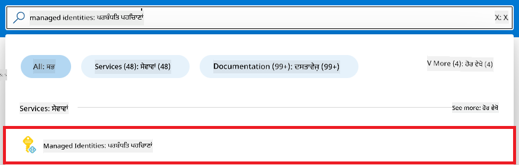

1. **+ Create** ਚੁਣੋ।

    

1. ਹੇਠਾਂ ਦਿੱਤੇ ਕੰਮ ਕਰੋ:

    - ਆਪਣੀ Azure **Subscription** ਚੁਣੋ।
    - ਵਰਤੋਂ ਲਈ **Resource group** ਚੁਣੋ (ਜੇ ਲੋੜ ਹੋਵੇ ਤਾਂ ਨਵਾਂ ਬਣਾਓ)।
    - ਵਰਤੋਂ ਲਈ **Region** ਚੁਣੋ।
    - **Name** ਦਿਓ। ਇਹ ਵਿਲੱਖਣ ਹੋਣਾ ਚਾਹੀਦਾ ਹੈ।

1. **Review + create** ਚੁਣੋ।

1. **+ Create** ਚੁਣੋ।

#### Managed Identity ਨੂੰ Contributor ਰੋਲ ਅਸਾਈਨਮੈਂਟ ਸ਼ਾਮਿਲ ਕਰੋ

1. ਉਸ Managed Identity resource ਤੇ ਜਾਓ ਜੋ ਤੁਸੀਂ ਬਣਾਈ ਹੈ।

1. ਖੱਬੇ ਪਾਸੇ ਟੈਬ ਵਿੱਚੋਂ **Azure role assignments** ਚੁਣੋ।

1. ਨੈਵੀਗੇਸ਼ਨ ਮੀਨੂ ਵਿੱਚੋਂ **+Add role assignment** ਚੁਣੋ।

1. Add role assignment ਪੰਨੇ 'ਤੇ ਹੇਠਾਂ ਦਿੱਤੇ ਕੰਮ ਕਰੋ:
    - **Scope** ਨੂੰ **Resource group** ਚੁਣੋ।
    - ਆਪਣੀ Azure **Subscription** ਚੁਣੋ।
    - ਵਰਤੋਂ ਲਈ **Resource group** ਚੁਣੋ।
    - **Role** ਨੂੰ **Contributor** ਚੁਣੋ।

    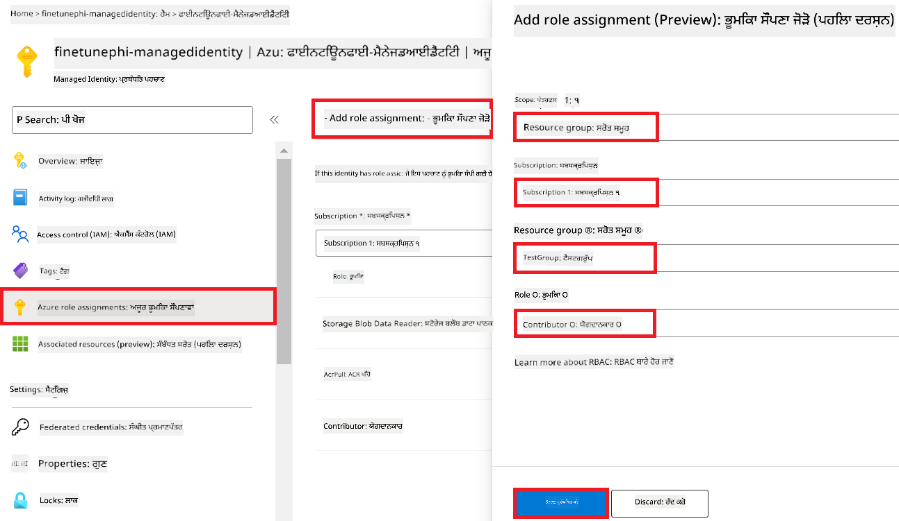

1. **Save** ਚੁਣੋ।

#### Managed Identity ਨੂੰ Storage Blob Data Reader ਰੋਲ ਅਸਾਈਨਮੈਂਟ ਸ਼ਾਮਿਲ ਕਰੋ

1. ਪੋਰਟਲ ਪੇਜ ਦੇ ਉੱਪਰਲੇ ਹਿੱਸੇ ਵਿੱਚ **search bar** ਵਿੱਚ *storage accounts* ਟਾਈਪ ਕਰੋ ਅਤੇ ਆਉਣ ਵਾਲੀਆਂ ਵਿਕਲਪਾਂ ਵਿੱਚੋਂ **Storage accounts** ਚੁਣੋ।

    

1. ਉਸ storage account ਨੂੰ ਚੁਣੋ ਜੋ Azure Machine Learning workspace ਨਾਲ ਜੁੜਿਆ ਹੋਇਆ ਹੈ। ਉਦਾਹਰਨ ਵਜੋਂ, *finetunephistorage*।

1. Add role assignment ਪੰਨੇ 'ਤੇ ਜਾਣ ਲਈ ਹੇਠਾਂ ਦਿੱਤੇ ਕੰਮ ਕਰੋ:

    - ਬਣਾਇਆ ਹੋਇਆ Azure Storage account ਖੋਲ੍ਹੋ।
    - ਖੱਬੇ ਪਾਸੇ ਟੈਬ ਵਿੱਚੋਂ **Access Control (IAM)** ਚੁਣੋ।
    - ਨੈਵੀਗੇਸ਼ਨ ਮੀਨੂ ਵਿੱਚੋਂ **+ Add** ਚੁਣੋ।
    - ਨੈਵੀਗੇਸ਼ਨ ਮੀਨੂ ਵਿੱਚੋਂ **Add role assignment** ਚੁਣੋ।

    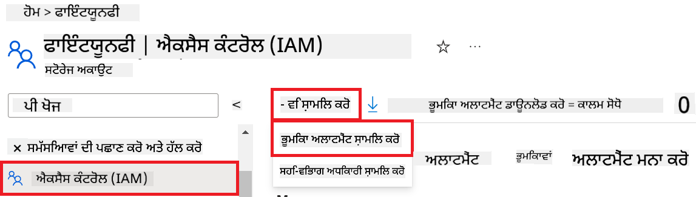

1. Add role assignment ਪੰਨੇ 'ਤੇ ਹੇਠਾਂ ਦਿੱਤੇ ਕੰਮ ਕਰੋ:

    - Role ਪੰਨੇ ਵਿੱਚ, **search bar** ਵਿੱਚ *Storage Blob Data Reader* ਟਾਈਪ ਕਰੋ ਅਤੇ ਵਿਕਲਪਾਂ ਵਿੱਚੋਂ **Storage Blob Data Reader** ਚੁਣੋ।
    - Role ਪੰਨੇ ਵਿੱਚ, **Next** ਚੁਣੋ।
    - Members ਪੰਨੇ ਵਿੱਚ, **Assign access to** 'ਤੇ **Managed identity** ਚੁਣੋ।
    - Members ਪੰਨੇ ਵਿੱਚ, **+ Select members** ਚੁਣੋ।
    - Select managed identities ਪੰਨੇ ਵਿੱਚ, ਆਪਣੀ Azure **Subscription** ਚੁਣੋ।
    - Select managed identities ਪੰਨੇ ਵਿੱਚ, **Managed identity** 'ਤੇ **Manage Identity** ਚੁਣੋ।
    - Select managed identities ਪੰਨੇ ਵਿੱਚ, ਉਹ Manage Identity ਚੁਣੋ ਜੋ ਤੁਸੀਂ ਬਣਾਈ ਸੀ। ਉਦਾਹਰਨ ਵਜੋਂ, *finetunephi-managedidentity*।
    - Select managed identities ਪੰਨੇ ਵਿੱਚ, **Select** ਚੁਣੋ।

    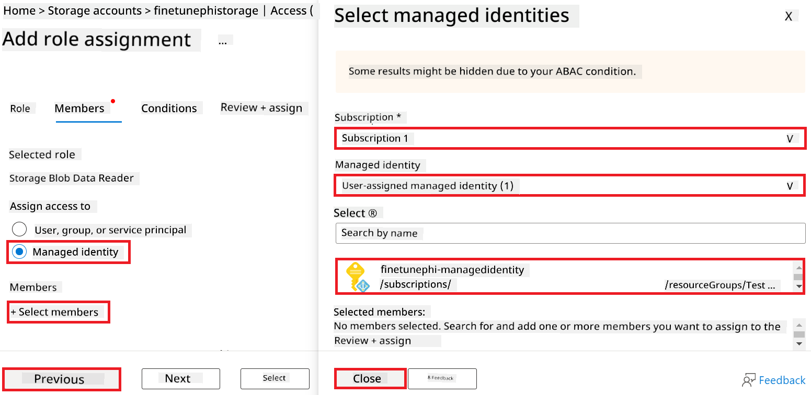

1. **Review + assign** ਚੁਣੋ।

#### Managed Identity ਨੂੰ AcrPull ਰੋਲ ਅਸਾਈਨਮੈਂਟ ਸ਼ਾਮਿਲ ਕਰੋ

1. ਪੋਰਟਲ ਪੇਜ ਦੇ ਉੱਪਰਲੇ ਹਿੱਸੇ ਵਿੱਚ **search bar** ਵਿੱਚ *container registries* ਟਾਈਪ ਕਰੋ ਅਤੇ ਆਉਣ ਵਾਲੀਆਂ ਵਿਕਲਪਾਂ ਵਿੱਚੋਂ **Container registries** ਚੁਣੋ।

    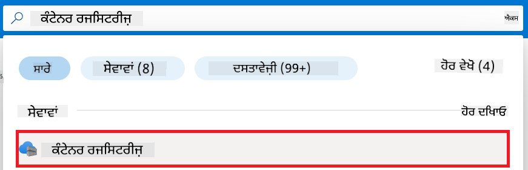

1. ਉਸ container registry ਨੂੰ ਚੁਣੋ ਜੋ Azure Machine Learning workspace ਨਾਲ ਜੁੜਿਆ ਹੋਇਆ ਹੈ। ਉਦਾਹਰਨ ਵਜੋਂ, *finetunephicontainerregistries*

1. Add role assignment ਪੰਨੇ 'ਤੇ ਜਾਣ ਲਈ ਹੇਠਾਂ ਦਿੱਤੇ ਕੰਮ ਕਰੋ:

    - ਖੱਬੇ ਪਾਸੇ ਟੈਬ ਵਿੱਚੋਂ **Access Control (IAM)** ਚੁਣੋ।
    - ਨੈਵੀਗੇਸ਼ਨ ਮੀਨੂ ਵਿੱਚੋਂ **+ Add** ਚੁਣੋ।
    - ਨੈਵੀਗੇਸ਼ਨ ਮੀਨੂ ਵਿੱਚੋਂ **Add role assignment** ਚੁਣੋ।

1. Add role assignment ਪੰਨੇ 'ਤੇ ਹੇਠਾਂ ਦਿੱਤੇ ਕੰਮ ਕਰੋ:

    - Role ਪੰਨੇ ਵਿੱਚ, **search bar** ਵਿੱਚ *AcrPull* ਟਾਈਪ ਕਰੋ ਅਤੇ ਵਿਕਲਪਾਂ ਵਿੱਚੋਂ **AcrPull** ਚੁਣੋ।
    - Role ਪੰਨੇ ਵਿੱਚ, **Next** ਚੁਣੋ।
    - Members ਪੰਨੇ ਵਿੱਚ, **Assign access to** 'ਤੇ **Managed identity** ਚੁਣੋ।
    - Members ਪੰਨੇ ਵਿੱਚ, **+ Select members** ਚੁਣੋ।
    - Select managed identities ਪੰਨੇ ਵਿੱਚ, ਆਪਣੀ Azure **Subscription** ਚੁਣੋ।
    - Select managed identities ਪੰਨੇ ਵਿੱਚ, **Managed identity** 'ਤੇ **Manage Identity** ਚੁਣੋ।
    - Select managed identities ਪੰਨੇ ਵਿੱਚ, ਉਹ Manage Identity ਚੁਣੋ ਜੋ ਤੁਸੀਂ ਬਣਾਈ ਸੀ। ਉਦਾਹਰਨ ਵਜੋਂ, *finetunephi-managedidentity*।
    - Select managed identities ਪੰਨੇ ਵਿੱਚ, **Select** ਚੁਣੋ।
    - **Review + assign** ਚੁਣੋ।

### ਪ੍ਰੋਜੈਕਟ ਸੈੱਟ ਕਰੋ

ਹੁਣ, ਤੁਸੀਂ ਇੱਕ ਫੋਲਡਰ ਬਣਾਓਗੇ ਜਿਸ ਵਿੱਚ ਕੰਮ ਕਰਨਾ ਹੈ ਅਤੇ ਇੱਕ virtual environment ਸੈੱਟ ਕਰੋਗੇ ਤਾਂ ਜੋ ਐਸਾ ਪ੍ਰੋਗਰਾਮ ਵਿਕਸਤ ਕੀਤਾ ਜਾ ਸਕੇ ਜੋ ਯੂਜ਼ਰਾਂ ਨਾਲ ਇੰਟਰੈਕਟ ਕਰੇ ਅਤੇ Azure Cosmos DB ਵਿੱਚ ਸਟੋਰ ਕੀਤੀ ਗਈ chat history ਨੂੰ ਆਪਣੇ ਜਵਾਬਾਂ ਲਈ ਵਰਤੇ।

#### ਕੰਮ ਕਰਨ ਲਈ ਫੋਲਡਰ ਬਣਾਓ

1. ਟਰਮੀਨਲ ਖੋਲ੍ਹੋ ਅਤੇ ਹੇਠਾਂ ਦਿੱਤਾ ਕਮਾਂਡ ਚਲਾਕੇ *finetune-phi* ਨਾਂ ਦਾ ਫੋਲਡਰ ਬਣਾਓ।

    ```console
    mkdir finetune-phi
    ```

1. ਹੇਠਾਂ ਦਿੱਤਾ ਕਮਾਂਡ ਚਲਾਕੇ ਆਪਣੇ ਟਰਮੀਨਲ ਵਿੱਚ *finetune-phi* ਫੋਲਡਰ ਵਿੱਚ ਜਾਓ।

    ```console
    cd finetune-phi
    ```

#### virtual environment ਬਣਾਓ

1. ਹੇਠਾਂ ਦਿੱਤਾ ਕਮਾਂਡ ਚਲਾਕੇ ਇੱਕ virtual environment *.venv* ਨਾਂ ਦਾ ਬਣਾਓ।

    ```console
    python -m venv .venv
    ```

1. ਹੇਠਾਂ ਦਿੱਤਾ ਕਮਾਂਡ ਚਲਾਕੇ virtual environment ਨੂੰ activate ਕਰੋ।

    ```console
    .venv\Scripts\activate.bat
    ```

> [!NOTE]
>
> ਜੇ ਸਫਲ ਹੋਇਆ, ਤਾਂ ਕਮਾਂਡ ਪ੍ਰੌਂਪਟ ਤੋਂ ਪਹਿਲਾਂ *(.venv)* ਦਿਖਾਈ ਦੇਵੇਗਾ।

#### ਲੋੜੀਂਦੇ ਪੈਕੇਜ ਇੰਸਟਾਲ ਕਰੋ

1. ਹੇਠਾਂ ਦਿੱਤੇ ਕਮਾਂਡ ਟਰਮੀਨਲ ਵਿੱਚ ਚਲਾਕੇ ਲੋੜੀਂਦੇ ਪੈਕੇਜ ਇੰਸਟਾਲ ਕਰੋ।

    ```console
    pip install datasets==2.19.1
    pip install transformers==4.41.1
    pip install azure-ai-ml==1.16.0
    pip install torch==2.3.1
    pip install trl==0.9.4
    pip install promptflow==1.12.0
    ```

#### ਪ੍ਰੋਜੈਕਟ ਫਾਈਲਾਂ ਬਣਾਓ

ਇਸ ਅਭਿਆਸ ਵਿੱਚ, ਤੁਸੀਂ ਆਪਣੇ ਪ੍ਰੋਜੈਕਟ ਲਈ ਜ਼ਰੂਰੀ ਫਾਈਲਾਂ ਬਣਾਓਗੇ। ਇਹ ਫਾਈਲਾਂ dataset ਡਾਊਨਲੋਡ ਕਰਨ, Azure Machine Learning environment ਸੈੱਟ ਕਰਨ, Phi-3 ਮਾਡਲ ਨੂੰ fine-tune ਕਰਨ ਅਤੇ fine-tuned ਮਾਡਲ ਨੂੰ deploy ਕਰਨ ਲਈ ਸਕ੍ਰਿਪਟਾਂ ਸ਼ਾਮਿਲ ਹਨ। ਤੁਸੀਂ ਇੱਕ *conda.yml* ਫਾਈਲ ਵੀ ਬਣਾਓਗੇ ਜੋ fine-tuning environment ਸੈੱਟ ਕਰੇਗੀ।

ਇਸ ਅਭਿਆਸ ਵਿੱਚ, ਤੁਸੀਂ:

- dataset ਡਾਊਨਲੋਡ ਕਰਨ ਲਈ *download_dataset.py* ਫਾਈਲ ਬਣਾਓਗੇ।
- Azure Machine Learning environment ਸੈੱਟ ਕਰਨ ਲਈ *setup_ml.py* ਫਾਈਲ ਬਣਾਓਗੇ।
- *finetuning_dir* ਫੋਲਡਰ ਵਿੱਚ dataset ਦੀ ਵਰਤੋਂ ਕਰ


1. Azure Workspace Name ਸ਼ਾਮਲ ਕਰਨ ਲਈ ਹੇਠਾਂ ਦਿੱਤੇ ਕੰਮ ਕਰੋ:

    - ਉਸ Azure Machine Learning ਰਿਸੋਰਸ ਤੇ ਜਾਓ ਜੋ ਤੁਸੀਂ ਬਣਾਇਆ ਹੈ।
    - ਆਪਣਾ ਖਾਤਾ ਨਾਮ *config.py* ਫਾਇਲ ਵਿੱਚ ਕਾਪੀ ਕਰਕੇ ਪੇਸਟ ਕਰੋ।

    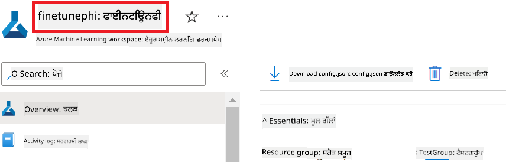

1. Azure Resource Group Name ਸ਼ਾਮਲ ਕਰਨ ਲਈ ਹੇਠਾਂ ਦਿੱਤੇ ਕੰਮ ਕਰੋ:

    - ਉਸ Azure Machine Learning ਰਿਸੋਰਸ ਤੇ ਜਾਓ ਜੋ ਤੁਸੀਂ ਬਣਾਇਆ ਹੈ।
    - ਆਪਣਾ Azure Resource Group Name *config.py* ਫਾਇਲ ਵਿੱਚ ਕਾਪੀ ਕਰਕੇ ਪੇਸਟ ਕਰੋ।

    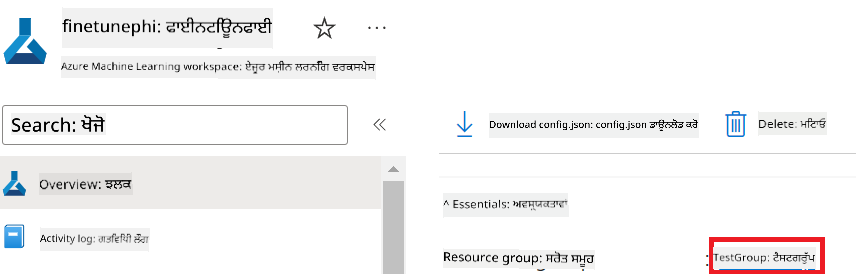

2. Azure Managed Identity ਨਾਮ ਸ਼ਾਮਲ ਕਰਨ ਲਈ ਹੇਠਾਂ ਦਿੱਤੇ ਕੰਮ ਕਰੋ

    - ਉਸ Managed Identities ਰਿਸੋਰਸ ਤੇ ਜਾਓ ਜੋ ਤੁਸੀਂ ਬਣਾਇਆ ਹੈ।
    - ਆਪਣਾ Azure Managed Identity ਨਾਮ *config.py* ਫਾਇਲ ਵਿੱਚ ਕਾਪੀ ਕਰਕੇ ਪੇਸਟ ਕਰੋ।

    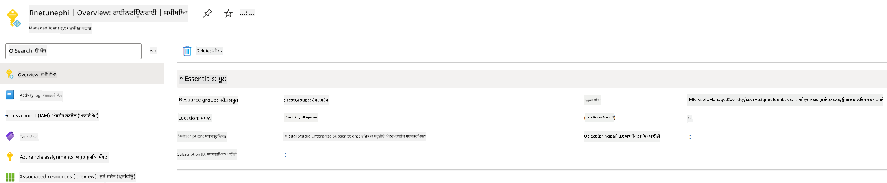

### Fine-tuning ਲਈ dataset ਤਿਆਰ ਕਰੋ

ਇਸ ਅਭਿਆਸ ਵਿੱਚ, ਤੁਸੀਂ *download_dataset.py* ਫਾਇਲ ਚਲਾਉਂਗੇ ਤਾਂ ਜੋ *ULTRACHAT_200k* datasets ਆਪਣੇ ਲੋਕਲ ਵਾਤਾਵਰਨ ਵਿੱਚ ਡਾਊਨਲੋਡ ਕਰ ਸਕੋ। ਫਿਰ ਤੁਸੀਂ ਇਹ datasets Azure Machine Learning ਵਿੱਚ Phi-3 ਮਾਡਲ ਨੂੰ fine-tune ਕਰਨ ਲਈ ਵਰਤੋਂਗੇ।

#### *download_dataset.py* ਦੀ ਵਰਤੋਂ ਕਰਕੇ ਆਪਣਾ dataset ਡਾਊਨਲੋਡ ਕਰੋ

1. Visual Studio Code ਵਿੱਚ *download_dataset.py* ਫਾਇਲ ਖੋਲ੍ਹੋ।

1. *download_dataset.py* ਵਿੱਚ ਹੇਠਾਂ ਦਿੱਤਾ ਕੋਡ ਸ਼ਾਮਲ ਕਰੋ।

    ```python
    import json
    import os
    from datasets import load_dataset
    from config import (
        TRAIN_DATA_PATH,
        TEST_DATA_PATH)

    def load_and_split_dataset(dataset_name, config_name, split_ratio):
        """
        Load and split a dataset.
        """
        # Load the dataset with the specified name, configuration, and split ratio
        dataset = load_dataset(dataset_name, config_name, split=split_ratio)
        print(f"Original dataset size: {len(dataset)}")
        
        # Split the dataset into train and test sets (80% train, 20% test)
        split_dataset = dataset.train_test_split(test_size=0.2)
        print(f"Train dataset size: {len(split_dataset['train'])}")
        print(f"Test dataset size: {len(split_dataset['test'])}")
        
        return split_dataset

    def save_dataset_to_jsonl(dataset, filepath):
        """
        Save a dataset to a JSONL file.
        """
        # Create the directory if it does not exist
        os.makedirs(os.path.dirname(filepath), exist_ok=True)
        
        # Open the file in write mode
        with open(filepath, 'w', encoding='utf-8') as f:
            # Iterate over each record in the dataset
            for record in dataset:
                # Dump the record as a JSON object and write it to the file
                json.dump(record, f)
                # Write a newline character to separate records
                f.write('\n')
        
        print(f"Dataset saved to {filepath}")

    def main():
        """
        Main function to load, split, and save the dataset.
        """
        # Load and split the ULTRACHAT_200k dataset with a specific configuration and split ratio
        dataset = load_and_split_dataset("HuggingFaceH4/ultrachat_200k", 'default', 'train_sft[:1%]')
        
        # Extract the train and test datasets from the split
        train_dataset = dataset['train']
        test_dataset = dataset['test']

        # Save the train dataset to a JSONL file
        save_dataset_to_jsonl(train_dataset, TRAIN_DATA_PATH)
        
        # Save the test dataset to a separate JSONL file
        save_dataset_to_jsonl(test_dataset, TEST_DATA_PATH)

    if __name__ == "__main__":
        main()

    ```

> [!TIP]
>
> **CPU ਨਾਲ ਘੱਟ dataset ਵਰਤ ਕੇ fine-tuning ਲਈ ਮਦਦ**
>
> ਜੇ ਤੁਸੀਂ CPU ਵਰਤ ਕੇ fine-tuning ਕਰਨਾ ਚਾਹੁੰਦੇ ਹੋ, ਤਾਂ ਇਹ ਤਰੀਕਾ ਉਨ੍ਹਾਂ ਲਈ ਵਧੀਆ ਹੈ ਜਿਨ੍ਹਾਂ ਕੋਲ benefit subscriptions ਹਨ (ਜਿਵੇਂ ਕਿ Visual Studio Enterprise Subscription) ਜਾਂ ਜਲਦੀ fine-tuning ਅਤੇ deployment ਪ੍ਰਕਿਰਿਆ ਦੀ ਜਾਂਚ ਕਰਨ ਲਈ।
>
> `dataset = load_and_split_dataset("HuggingFaceH4/ultrachat_200k", 'default', 'train_sft[:1%]')` with `dataset = load_and_split_dataset("HuggingFaceH4/ultrachat_200k", 'default', 'train_sft[:10]')` ਨਾਲ ਬਦਲੋ
>

1. ਟਰਮੀਨਲ ਵਿੱਚ ਹੇਠਾਂ ਦਿੱਤਾ ਕਮਾਂਡ ਲਿਖੋ ਤਾਂ ਜੋ ਸਕ੍ਰਿਪਟ ਚੱਲੇ ਅਤੇ dataset ਤੁਹਾਡੇ ਲੋਕਲ ਵਾਤਾਵਰਨ ਵਿੱਚ ਡਾਊਨਲੋਡ ਹੋ ਜਾਵੇ।

    ```console
    python download_data.py
    ```

1. ਯਕੀਨੀ ਬਣਾਓ ਕਿ datasets ਸਫਲਤਾਪੂਰਵਕ ਤੁਹਾਡੇ ਲੋਕਲ *finetune-phi/data* ਡਾਇਰੈਕਟਰੀ ਵਿੱਚ ਸੇਵ ਹੋ ਚੁੱਕੇ ਹਨ।

> [!NOTE]
>
> **Dataset ਦਾ ਆਕਾਰ ਅਤੇ fine-tuning ਦਾ ਸਮਾਂ**
>
> ਇਸ E2E ਨਮੂਨੇ ਵਿੱਚ, ਤੁਸੀਂ ਸਿਰਫ 1% dataset (`train_sft[:1%]`) ਵਰਤ ਰਹੇ ਹੋ। ਇਸ ਨਾਲ ਡਾਟਾ ਦੀ ਮਾਤਰਾ ਕਾਫੀ ਘੱਟ ਹੁੰਦੀ ਹੈ, ਜਿਸ ਨਾਲ ਅਪਲੋਡ ਅਤੇ fine-tuning ਦੋਹਾਂ ਤੇਜ਼ ਹੋ ਜਾਂਦੇ ਹਨ। ਤੁਸੀਂ ਪ੍ਰਸ਼ਿਛਣ ਸਮਾਂ ਅਤੇ ਮਾਡਲ ਦੀ ਕਾਰਗੁਜ਼ਾਰੀ ਵਿਚਕਾਰ ਸਹੀ ਸੰਤੁਲਨ ਲੱਭਣ ਲਈ ਇਸ ਪ੍ਰਤੀਸ਼ਤ ਨੂੰ ਬਦਲ ਸਕਦੇ ਹੋ। ਛੋਟੇ subset ਨਾਲ fine-tuning ਦਾ ਸਮਾਂ ਘੱਟ ਹੁੰਦਾ ਹੈ, ਜਿਸ ਨਾਲ ਇਹ E2E ਨਮੂਨੇ ਲਈ ਜ਼ਿਆਦਾ ਸੌਖਾ ਬਣ ਜਾਂਦਾ ਹੈ।

## ਦ੍ਰਿਸ਼ 2: Phi-3 ਮਾਡਲ ਨੂੰ fine-tune ਕਰੋ ਅਤੇ Azure Machine Learning Studio ਵਿੱਚ Deploy ਕਰੋ

### Azure CLI ਸੈੱਟਅਪ ਕਰੋ

ਤੁਹਾਨੂੰ ਆਪਣੇ ਵਾਤਾਵਰਨ ਨੂੰ authenticate ਕਰਨ ਲਈ Azure CLI ਸੈੱਟਅਪ ਕਰਨੀ ਪਵੇਗੀ। Azure CLI ਤੁਹਾਨੂੰ ਕਮਾਂਡ ਲਾਈਨ ਤੋਂ ਸਿੱਧਾ Azure ਰਿਸੋਰਸਾਂ ਦਾ ਪ੍ਰਬੰਧ ਕਰਨ ਦੀ ਆਗਿਆ ਦਿੰਦੀ ਹੈ ਅਤੇ Azure Machine Learning ਨੂੰ ਇਹ ਰਿਸੋਰਸਾਂ ਐਕਸੈੱਸ ਕਰਨ ਲਈ ਲੋੜੀਂਦੇ credentials ਪ੍ਰਦਾਨ ਕਰਦੀ ਹੈ। ਸ਼ੁਰੂ ਕਰਨ ਲਈ [Azure CLI](https://learn.microsoft.com/cli/azure/install-azure-cli) ਇੰਸਟਾਲ ਕਰੋ।

1. ਟਰਮੀਨਲ ਵਿੰਡੋ ਖੋਲ੍ਹੋ ਅਤੇ ਆਪਣੀ Azure ਖਾਤੇ ਵਿੱਚ ਲੌਗਇਨ ਕਰਨ ਲਈ ਹੇਠਾਂ ਦਿੱਤਾ ਕਮਾਂਡ ਲਿਖੋ।

    ```console
    az login
    ```

1. ਆਪਣਾ Azure ਖਾਤਾ ਚੁਣੋ।

1. ਆਪਣੀ Azure subscription ਚੁਣੋ।

    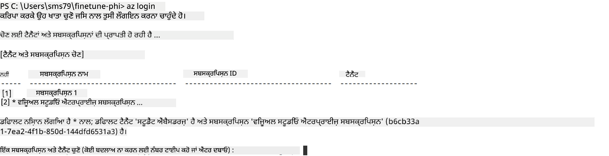

> [!TIP]
>
> ਜੇ ਤੁਹਾਨੂੰ Azure ਵਿੱਚ ਸਾਈਨ ਇਨ ਕਰਨ ਵਿੱਚ ਮੁਸ਼ਕਲ ਆ ਰਹੀ ਹੈ, ਤਾਂ ਡਿਵਾਈਸ ਕੋਡ ਵਰਤ ਕੇ ਕੋਸ਼ਿਸ਼ ਕਰੋ। ਟਰਮੀਨਲ ਖੋਲ੍ਹੋ ਅਤੇ ਹੇਠਾਂ ਦਿੱਤਾ ਕਮਾਂਡ ਲਿਖੋ:
>
> ```console
> az login --use-device-code
> ```
>

### Phi-3 ਮਾਡਲ ਨੂੰ fine-tune ਕਰੋ

ਇਸ ਅਭਿਆਸ ਵਿੱਚ, ਤੁਸੀਂ ਦਿੱਤੇ dataset ਦੀ ਵਰਤੋਂ ਕਰਕੇ Phi-3 ਮਾਡਲ ਨੂੰ fine-tune ਕਰੋਗੇ। ਪਹਿਲਾਂ, ਤੁਸੀਂ *fine_tune.py* ਫਾਇਲ ਵਿੱਚ fine-tuning ਦੀ ਪ੍ਰਕਿਰਿਆ ਪਰਿਭਾਸ਼ਿਤ ਕਰੋਗੇ। ਫਿਰ, ਤੁਸੀਂ Azure Machine Learning ਵਾਤਾਵਰਨ ਨੂੰ ਕਾਨਫਿਗਰ ਕਰਕੇ *setup_ml.py* ਫਾਇਲ ਚਲਾਉਂਗੇ। ਇਹ ਸਕ੍ਰਿਪਟ ਯਕੀਨੀ ਬਣਾਉਂਦਾ ਹੈ ਕਿ fine-tuning Azure Machine Learning ਵਾਤਾਵਰਨ ਵਿੱਚ ਹੀ ਹੋਵੇ।

*setup_ml.py* ਚਲਾਕੇ, ਤੁਸੀਂ Azure Machine Learning ਵਾਤਾਵਰਨ ਵਿੱਚ fine-tuning ਪ੍ਰਕਿਰਿਆ ਚਲਾਉਂਦੇ ਹੋ।

#### *fine_tune.py* ਫਾਇਲ ਵਿੱਚ ਕੋਡ ਸ਼ਾਮਲ ਕਰੋ

1. *finetuning_dir* ਫੋਲਡਰ ਵਿੱਚ ਜਾਓ ਅਤੇ Visual Studio Code ਵਿੱਚ *fine_tune.py* ਖੋਲ੍ਹੋ।

1. *fine_tune.py* ਵਿੱਚ ਹੇਠਾਂ ਦਿੱਤਾ ਕੋਡ ਸ਼ਾਮਲ ਕਰੋ।

    ```python
    import argparse
    import sys
    import logging
    import os
    from datasets import load_dataset
    import torch
    import mlflow
    from transformers import AutoModelForCausalLM, AutoTokenizer, TrainingArguments
    from trl import SFTTrainer

    # To avoid the INVALID_PARAMETER_VALUE error in MLflow, disable MLflow integration
    os.environ["DISABLE_MLFLOW_INTEGRATION"] = "True"

    # Logging setup
    logging.basicConfig(
        format="%(asctime)s - %(levelname)s - %(name)s - %(message)s",
        datefmt="%Y-%m-%d %H:%M:%S",
        handlers=[logging.StreamHandler(sys.stdout)],
        level=logging.WARNING
    )
    logger = logging.getLogger(__name__)

    def initialize_model_and_tokenizer(model_name, model_kwargs):
        """
        Initialize the model and tokenizer with the given pretrained model name and arguments.
        """
        model = AutoModelForCausalLM.from_pretrained(model_name, **model_kwargs)
        tokenizer = AutoTokenizer.from_pretrained(model_name)
        tokenizer.model_max_length = 2048
        tokenizer.pad_token = tokenizer.unk_token
        tokenizer.pad_token_id = tokenizer.convert_tokens_to_ids(tokenizer.pad_token)
        tokenizer.padding_side = 'right'
        return model, tokenizer

    def apply_chat_template(example, tokenizer):
        """
        Apply a chat template to tokenize messages in the example.
        """
        messages = example["messages"]
        if messages[0]["role"] != "system":
            messages.insert(0, {"role": "system", "content": ""})
        example["text"] = tokenizer.apply_chat_template(
            messages, tokenize=False, add_generation_prompt=False
        )
        return example

    def load_and_preprocess_data(train_filepath, test_filepath, tokenizer):
        """
        Load and preprocess the dataset.
        """
        train_dataset = load_dataset('json', data_files=train_filepath, split='train')
        test_dataset = load_dataset('json', data_files=test_filepath, split='train')
        column_names = list(train_dataset.features)

        train_dataset = train_dataset.map(
            apply_chat_template,
            fn_kwargs={"tokenizer": tokenizer},
            num_proc=10,
            remove_columns=column_names,
            desc="Applying chat template to train dataset",
        )

        test_dataset = test_dataset.map(
            apply_chat_template,
            fn_kwargs={"tokenizer": tokenizer},
            num_proc=10,
            remove_columns=column_names,
            desc="Applying chat template to test dataset",
        )

        return train_dataset, test_dataset

    def train_and_evaluate_model(train_dataset, test_dataset, model, tokenizer, output_dir):
        """
        Train and evaluate the model.
        """
        training_args = TrainingArguments(
            bf16=True,
            do_eval=True,
            output_dir=output_dir,
            eval_strategy="epoch",
            learning_rate=5.0e-06,
            logging_steps=20,
            lr_scheduler_type="cosine",
            num_train_epochs=3,
            overwrite_output_dir=True,
            per_device_eval_batch_size=4,
            per_device_train_batch_size=4,
            remove_unused_columns=True,
            save_steps=500,
            seed=0,
            gradient_checkpointing=True,
            gradient_accumulation_steps=1,
            warmup_ratio=0.2,
        )

        trainer = SFTTrainer(
            model=model,
            args=training_args,
            train_dataset=train_dataset,
            eval_dataset=test_dataset,
            max_seq_length=2048,
            dataset_text_field="text",
            tokenizer=tokenizer,
            packing=True
        )

        train_result = trainer.train()
        trainer.log_metrics("train", train_result.metrics)

        mlflow.transformers.log_model(
            transformers_model={"model": trainer.model, "tokenizer": tokenizer},
            artifact_path=output_dir,
        )

        tokenizer.padding_side = 'left'
        eval_metrics = trainer.evaluate()
        eval_metrics["eval_samples"] = len(test_dataset)
        trainer.log_metrics("eval", eval_metrics)

    def main(train_file, eval_file, model_output_dir):
        """
        Main function to fine-tune the model.
        """
        model_kwargs = {
            "use_cache": False,
            "trust_remote_code": True,
            "torch_dtype": torch.bfloat16,
            "device_map": None,
            "attn_implementation": "eager"
        }

        # pretrained_model_name = "microsoft/Phi-3-mini-4k-instruct"
        pretrained_model_name = "microsoft/Phi-3.5-mini-instruct"

        with mlflow.start_run():
            model, tokenizer = initialize_model_and_tokenizer(pretrained_model_name, model_kwargs)
            train_dataset, test_dataset = load_and_preprocess_data(train_file, eval_file, tokenizer)
            train_and_evaluate_model(train_dataset, test_dataset, model, tokenizer, model_output_dir)

    if __name__ == "__main__":
        parser = argparse.ArgumentParser()
        parser.add_argument("--train-file", type=str, required=True, help="Path to the training data")
        parser.add_argument("--eval-file", type=str, required=True, help="Path to the evaluation data")
        parser.add_argument("--model_output_dir", type=str, required=True, help="Directory to save the fine-tuned model")
        args = parser.parse_args()
        main(args.train_file, args.eval_file, args.model_output_dir)

    ```

1. *fine_tune.py* ਫਾਇਲ ਸੇਵ ਕਰੋ ਅਤੇ ਬੰਦ ਕਰੋ।

> [!TIP]
> **ਤੁਸੀਂ Phi-3.5 ਮਾਡਲ ਵੀ fine-tune ਕਰ ਸਕਦੇ ਹੋ**
>
> *fine_tune.py* ਵਿੱਚ, ਤੁਸੀਂ `pretrained_model_name` from `"microsoft/Phi-3-mini-4k-instruct"` to any model you want to fine-tune. For example, if you change it to `"microsoft/Phi-3.5-mini-instruct"`, you'll be using the Phi-3.5-mini-instruct model for fine-tuning. To find and use the model name you prefer, visit [Hugging Face](https://huggingface.co/), search for the model you're interested in, and then copy and paste its name into the `pretrained_model_name` ਫੀਲਡ ਨੂੰ ਆਪਣੇ ਸਕ੍ਰਿਪਟ ਵਿੱਚ ਬਦਲ ਸਕਦੇ ਹੋ।
>
> :::image type="content" source="../../imgs/03/FineTuning-PromptFlow/finetunephi3.5.png" alt-text="Fine tune Phi-3.5.":::
>

#### *setup_ml.py* ਫਾਇਲ ਵਿੱਚ ਕੋਡ ਸ਼ਾਮਲ ਕਰੋ

1. Visual Studio Code ਵਿੱਚ *setup_ml.py* ਖੋਲ੍ਹੋ।

1. *setup_ml.py* ਵਿੱਚ ਹੇਠਾਂ ਦਿੱਤਾ ਕੋਡ ਸ਼ਾਮਲ ਕਰੋ।

    ```python
    import logging
    from azure.ai.ml import MLClient, command, Input
    from azure.ai.ml.entities import Environment, AmlCompute
    from azure.identity import AzureCliCredential
    from config import (
        AZURE_SUBSCRIPTION_ID,
        AZURE_RESOURCE_GROUP_NAME,
        AZURE_ML_WORKSPACE_NAME,
        TRAIN_DATA_PATH,
        TEST_DATA_PATH
    )

    # Constants

    # Uncomment the following lines to use a CPU instance for training
    # COMPUTE_INSTANCE_TYPE = "Standard_E16s_v3" # cpu
    # COMPUTE_NAME = "cpu-e16s-v3"
    # DOCKER_IMAGE_NAME = "mcr.microsoft.com/azureml/openmpi4.1.0-ubuntu20.04:latest"

    # Uncomment the following lines to use a GPU instance for training
    COMPUTE_INSTANCE_TYPE = "Standard_NC24ads_A100_v4"
    COMPUTE_NAME = "gpu-nc24s-a100-v4"
    DOCKER_IMAGE_NAME = "mcr.microsoft.com/azureml/curated/acft-hf-nlp-gpu:59"

    CONDA_FILE = "conda.yml"
    LOCATION = "eastus2" # Replace with the location of your compute cluster
    FINETUNING_DIR = "./finetuning_dir" # Path to the fine-tuning script
    TRAINING_ENV_NAME = "phi-3-training-environment" # Name of the training environment
    MODEL_OUTPUT_DIR = "./model_output" # Path to the model output directory in azure ml

    # Logging setup to track the process
    logger = logging.getLogger(__name__)
    logging.basicConfig(
        format="%(asctime)s - %(levelname)s - %(name)s - %(message)s",
        datefmt="%Y-%m-%d %H:%M:%S",
        level=logging.WARNING
    )

    def get_ml_client():
        """
        Initialize the ML Client using Azure CLI credentials.
        """
        credential = AzureCliCredential()
        return MLClient(credential, AZURE_SUBSCRIPTION_ID, AZURE_RESOURCE_GROUP_NAME, AZURE_ML_WORKSPACE_NAME)

    def create_or_get_environment(ml_client):
        """
        Create or update the training environment in Azure ML.
        """
        env = Environment(
            image=DOCKER_IMAGE_NAME,  # Docker image for the environment
            conda_file=CONDA_FILE,  # Conda environment file
            name=TRAINING_ENV_NAME,  # Name of the environment
        )
        return ml_client.environments.create_or_update(env)

    def create_or_get_compute_cluster(ml_client, compute_name, COMPUTE_INSTANCE_TYPE, location):
        """
        Create or update the compute cluster in Azure ML.
        """
        try:
            compute_cluster = ml_client.compute.get(compute_name)
            logger.info(f"Compute cluster '{compute_name}' already exists. Reusing it for the current run.")
        except Exception:
            logger.info(f"Compute cluster '{compute_name}' does not exist. Creating a new one with size {COMPUTE_INSTANCE_TYPE}.")
            compute_cluster = AmlCompute(
                name=compute_name,
                size=COMPUTE_INSTANCE_TYPE,
                location=location,
                tier="Dedicated",  # Tier of the compute cluster
                min_instances=0,  # Minimum number of instances
                max_instances=1  # Maximum number of instances
            )
            ml_client.compute.begin_create_or_update(compute_cluster).wait()  # Wait for the cluster to be created
        return compute_cluster

    def create_fine_tuning_job(env, compute_name):
        """
        Set up the fine-tuning job in Azure ML.
        """
        return command(
            code=FINETUNING_DIR,  # Path to fine_tune.py
            command=(
                "python fine_tune.py "
                "--train-file ${{inputs.train_file}} "
                "--eval-file ${{inputs.eval_file}} "
                "--model_output_dir ${{inputs.model_output}}"
            ),
            environment=env,  # Training environment
            compute=compute_name,  # Compute cluster to use
            inputs={
                "train_file": Input(type="uri_file", path=TRAIN_DATA_PATH),  # Path to the training data file
                "eval_file": Input(type="uri_file", path=TEST_DATA_PATH),  # Path to the evaluation data file
                "model_output": MODEL_OUTPUT_DIR
            }
        )

    def main():
        """
        Main function to set up and run the fine-tuning job in Azure ML.
        """
        # Initialize ML Client
        ml_client = get_ml_client()

        # Create Environment
        env = create_or_get_environment(ml_client)
        
        # Create or get existing compute cluster
        create_or_get_compute_cluster(ml_client, COMPUTE_NAME, COMPUTE_INSTANCE_TYPE, LOCATION)

        # Create and Submit Fine-Tuning Job
        job = create_fine_tuning_job(env, COMPUTE_NAME)
        returned_job = ml_client.jobs.create_or_update(job)  # Submit the job
        ml_client.jobs.stream(returned_job.name)  # Stream the job logs
        
        # Capture the job name
        job_name = returned_job.name
        print(f"Job name: {job_name}")

    if __name__ == "__main__":
        main()

    ```

1. `COMPUTE_INSTANCE_TYPE`, `COMPUTE_NAME`, and `LOCATION` ਨੂੰ ਆਪਣੀਆਂ ਵਿਸ਼ੇਸ਼ ਜਾਣਕਾਰੀਆਂ ਨਾਲ ਬਦਲੋ।

    ```python
   # Uncomment the following lines to use a GPU instance for training
    COMPUTE_INSTANCE_TYPE = "Standard_NC24ads_A100_v4"
    COMPUTE_NAME = "gpu-nc24s-a100-v4"
    ...
    LOCATION = "eastus2" # Replace with the location of your compute cluster
    ```

> [!TIP]
>
> **CPU ਨਾਲ ਘੱਟ dataset ਵਰਤ ਕੇ fine-tuning ਲਈ ਮਦਦ**
>
> ਜੇ ਤੁਸੀਂ CPU ਨਾਲ fine-tuning ਕਰਨਾ ਚਾਹੁੰਦੇ ਹੋ, ਤਾਂ ਇਹ ਤਰੀਕਾ ਉਨ੍ਹਾਂ ਲਈ ਵਧੀਆ ਹੈ ਜਿਨ੍ਹਾਂ ਕੋਲ benefit subscriptions ਹਨ (ਜਿਵੇਂ Visual Studio Enterprise Subscription) ਜਾਂ ਜਲਦੀ fine-tuning ਅਤੇ deployment ਪ੍ਰਕਿਰਿਆ ਦੀ ਜਾਂਚ ਕਰਨ ਲਈ।
>
> 1. *setup_ml* ਫਾਇਲ ਖੋਲ੍ਹੋ।
> 1. `COMPUTE_INSTANCE_TYPE`, `COMPUTE_NAME`, and `DOCKER_IMAGE_NAME` with the following. If you do not have access to *Standard_E16s_v3*, you can use an equivalent CPU instance or request a new quota.
> 1. Replace `LOCATION` ਨੂੰ ਆਪਣੀਆਂ ਵਿਸ਼ੇਸ਼ ਜਾਣਕਾਰੀਆਂ ਨਾਲ ਬਦਲੋ।
>
>    ```python
>    # Uncomment the following lines to use a CPU instance for training
>    COMPUTE_INSTANCE_TYPE = "Standard_E16s_v3" # cpu
>    COMPUTE_NAME = "cpu-e16s-v3"
>    DOCKER_IMAGE_NAME = "mcr.microsoft.com/azureml/openmpi4.1.0-ubuntu20.04:latest"
>    LOCATION = "eastus2" # Replace with the location of your compute cluster
>    ```
>

1. *setup_ml.py* ਸਕ੍ਰਿਪਟ ਚਲਾਉਣ ਲਈ ਹੇਠਾਂ ਦਿੱਤਾ ਕਮਾਂਡ ਲਿਖੋ ਅਤੇ Azure Machine Learning ਵਿੱਚ fine-tuning ਪ੍ਰਕਿਰਿਆ ਸ਼ੁਰੂ ਕਰੋ।

    ```python
    python setup_ml.py
    ```

1. ਇਸ ਅਭਿਆਸ ਵਿੱਚ, ਤੁਸੀਂ Azure Machine Learning ਦੀ ਵਰਤੋਂ ਕਰਕੇ ਸਫਲਤਾਪੂਰਵਕ Phi-3 ਮਾਡਲ ਨੂੰ fine-tune ਕੀਤਾ ਹੈ। *setup_ml.py* ਸਕ੍ਰਿਪਟ ਚਲਾਕੇ, ਤੁਸੀਂ Azure Machine Learning ਵਾਤਾਵਰਨ ਸੈੱਟਅਪ ਕੀਤਾ ਅਤੇ *fine_tune.py* ਵਿੱਚ ਪਰਿਭਾਸ਼ਿਤ fine-tuning ਪ੍ਰਕਿਰਿਆ ਸ਼ੁਰੂ ਕੀਤੀ। ਧਿਆਨ ਦਿਓ ਕਿ fine-tuning ਪ੍ਰਕਿਰਿਆ ਵਿੱਚ ਕਾਫੀ ਸਮਾਂ ਲੱਗ ਸਕਦਾ ਹੈ। ਜਦੋਂ ਤੁਸੀਂ `python setup_ml.py` command, you need to wait for the process to complete. You can monitor the status of the fine-tuning job by following the link provided in the terminal to the Azure Machine Learning portal.

    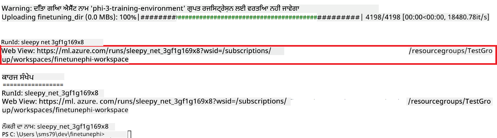

### Deploy the fine-tuned model

To integrate the fine-tuned Phi-3 model with Prompt Flow, you need to deploy the model to make it accessible for real-time inference. This process involves registering the model, creating an online endpoint, and deploying the model.

#### Set the model name, endpoint name, and deployment name for deployment

1. Open *config.py* file.

1. Replace `AZURE_MODEL_NAME = "your_fine_tuned_model_name"` with the desired name for your model.

1. Replace `AZURE_ENDPOINT_NAME = "your_fine_tuned_model_endpoint_name"` with the desired name for your endpoint.

1. Replace `AZURE_DEPLOYMENT_NAME = "your_fine_tuned_model_deployment_name"` ਨਾਲ ਆਪਣੀ deployment ਲਈ ਨਾਮ ਦੇਵੋਗੇ।

#### *deploy_model.py* ਫਾਇਲ ਵਿੱਚ ਕੋਡ ਸ਼ਾਮਲ ਕਰੋ

*deploy_model.py* ਫਾਇਲ ਚਲਾਉਣ ਨਾਲ ਪੂਰਾ deployment ਪ੍ਰਕਿਰਿਆ ਆਟੋਮੇਟਿਕ ਹੋ ਜਾਂਦਾ ਹੈ। ਇਹ ਮਾਡਲ ਨੂੰ ਰਜਿਸਟਰ ਕਰਦਾ ਹੈ, ਇੱਕ endpoint ਬਣਾਉਂਦਾ ਹੈ, ਅਤੇ deployment config.py ਫਾਇਲ ਵਿੱਚ ਦਿੱਤੀਆਂ ਸੈਟਿੰਗਾਂ (ਜਿਵੇਂ ਮਾਡਲ ਨਾਮ, endpoint ਨਾਮ, ਅਤੇ deployment ਨਾਮ) ਦੇ ਅਧਾਰ 'ਤੇ deployment ਚਲਾਉਂਦਾ ਹੈ।

1. Visual Studio Code ਵਿੱਚ *deploy_model.py* ਖੋਲ੍ਹੋ।

1. *deploy_model.py* ਵਿੱਚ ਹੇਠਾਂ ਦਿੱਤਾ ਕੋਡ ਸ਼ਾਮਲ ਕਰੋ।

    ```python
    import logging
    from azure.identity import AzureCliCredential
    from azure.ai.ml import MLClient
    from azure.ai.ml.entities import Model, ProbeSettings, ManagedOnlineEndpoint, ManagedOnlineDeployment, IdentityConfiguration, ManagedIdentityConfiguration, OnlineRequestSettings
    from azure.ai.ml.constants import AssetTypes

    # Configuration imports
    from config import (
        AZURE_SUBSCRIPTION_ID,
        AZURE_RESOURCE_GROUP_NAME,
        AZURE_ML_WORKSPACE_NAME,
        AZURE_MANAGED_IDENTITY_RESOURCE_ID,
        AZURE_MANAGED_IDENTITY_CLIENT_ID,
        AZURE_MODEL_NAME,
        AZURE_ENDPOINT_NAME,
        AZURE_DEPLOYMENT_NAME
    )

    # Constants
    JOB_NAME = "your-job-name"
    COMPUTE_INSTANCE_TYPE = "Standard_E4s_v3"

    deployment_env_vars = {
        "SUBSCRIPTION_ID": AZURE_SUBSCRIPTION_ID,
        "RESOURCE_GROUP_NAME": AZURE_RESOURCE_GROUP_NAME,
        "UAI_CLIENT_ID": AZURE_MANAGED_IDENTITY_CLIENT_ID,
    }

    # Logging setup
    logging.basicConfig(
        format="%(asctime)s - %(levelname)s - %(name)s - %(message)s",
        datefmt="%Y-%m-%d %H:%M:%S",
        level=logging.DEBUG
    )
    logger = logging.getLogger(__name__)

    def get_ml_client():
        """Initialize and return the ML Client."""
        credential = AzureCliCredential()
        return MLClient(credential, AZURE_SUBSCRIPTION_ID, AZURE_RESOURCE_GROUP_NAME, AZURE_ML_WORKSPACE_NAME)

    def register_model(ml_client, model_name, job_name):
        """Register a new model."""
        model_path = f"azureml://jobs/{job_name}/outputs/artifacts/paths/model_output"
        logger.info(f"Registering model {model_name} from job {job_name} at path {model_path}.")
        run_model = Model(
            path=model_path,
            name=model_name,
            description="Model created from run.",
            type=AssetTypes.MLFLOW_MODEL,
        )
        model = ml_client.models.create_or_update(run_model)
        logger.info(f"Registered model ID: {model.id}")
        return model

    def delete_existing_endpoint(ml_client, endpoint_name):
        """Delete existing endpoint if it exists."""
        try:
            endpoint_result = ml_client.online_endpoints.get(name=endpoint_name)
            logger.info(f"Deleting existing endpoint {endpoint_name}.")
            ml_client.online_endpoints.begin_delete(name=endpoint_name).result()
            logger.info(f"Deleted existing endpoint {endpoint_name}.")
        except Exception as e:
            logger.info(f"No existing endpoint {endpoint_name} found to delete: {e}")

    def create_or_update_endpoint(ml_client, endpoint_name, description=""):
        """Create or update an endpoint."""
        delete_existing_endpoint(ml_client, endpoint_name)
        logger.info(f"Creating new endpoint {endpoint_name}.")
        endpoint = ManagedOnlineEndpoint(
            name=endpoint_name,
            description=description,
            identity=IdentityConfiguration(
                type="user_assigned",
                user_assigned_identities=[ManagedIdentityConfiguration(resource_id=AZURE_MANAGED_IDENTITY_RESOURCE_ID)]
            )
        )
        endpoint_result = ml_client.online_endpoints.begin_create_or_update(endpoint).result()
        logger.info(f"Created new endpoint {endpoint_name}.")
        return endpoint_result

    def create_or_update_deployment(ml_client, endpoint_name, deployment_name, model):
        """Create or update a deployment."""

        logger.info(f"Creating deployment {deployment_name} for endpoint {endpoint_name}.")
        deployment = ManagedOnlineDeployment(
            name=deployment_name,
            endpoint_name=endpoint_name,
            model=model.id,
            instance_type=COMPUTE_INSTANCE_TYPE,
            instance_count=1,
            environment_variables=deployment_env_vars,
            request_settings=OnlineRequestSettings(
                max_concurrent_requests_per_instance=3,
                request_timeout_ms=180000,
                max_queue_wait_ms=120000
            ),
            liveness_probe=ProbeSettings(
                failure_threshold=30,
                success_threshold=1,
                period=100,
                initial_delay=500,
            ),
            readiness_probe=ProbeSettings(
                failure_threshold=30,
                success_threshold=1,
                period=100,
                initial_delay=500,
            ),
        )
        deployment_result = ml_client.online_deployments.begin_create_or_update(deployment).result()
        logger.info(f"Created deployment {deployment.name} for endpoint {endpoint_name}.")
        return deployment_result

    def set_traffic_to_deployment(ml_client, endpoint_name, deployment_name):
        """Set traffic to the specified deployment."""
        try:
            # Fetch the current endpoint details
            endpoint = ml_client.online_endpoints.get(name=endpoint_name)
            
            # Log the current traffic allocation for debugging
            logger.info(f"Current traffic allocation: {endpoint.traffic}")
            
            # Set the traffic allocation for the deployment
            endpoint.traffic = {deployment_name: 100}
            
            # Update the endpoint with the new traffic allocation
            endpoint_poller = ml_client.online_endpoints.begin_create_or_update(endpoint)
            updated_endpoint = endpoint_poller.result()
            
            # Log the updated traffic allocation for debugging
            logger.info(f"Updated traffic allocation: {updated_endpoint.traffic}")
            logger.info(f"Set traffic to deployment {deployment_name} at endpoint {endpoint_name}.")
            return updated_endpoint
        except Exception as e:
            # Log any errors that occur during the process
            logger.error(f"Failed to set traffic to deployment: {e}")
            raise


    def main():
        ml_client = get_ml_client()

        registered_model = register_model(ml_client, AZURE_MODEL_NAME, JOB_NAME)
        logger.info(f"Registered model ID: {registered_model.id}")

        endpoint = create_or_update_endpoint(ml_client, AZURE_ENDPOINT_NAME, "Endpoint for finetuned Phi-3 model")
        logger.info(f"Endpoint {AZURE_ENDPOINT_NAME} is ready.")

        try:
            deployment = create_or_update_deployment(ml_client, AZURE_ENDPOINT_NAME, AZURE_DEPLOYMENT_NAME, registered_model)
            logger.info(f"Deployment {AZURE_DEPLOYMENT_NAME} is created for endpoint {AZURE_ENDPOINT_NAME}.")

            set_traffic_to_deployment(ml_client, AZURE_ENDPOINT_NAME, AZURE_DEPLOYMENT_NAME)
            logger.info(f"Traffic is set to deployment {AZURE_DEPLOYMENT_NAME} at endpoint {AZURE_ENDPOINT_NAME}.")
        except Exception as e:
            logger.error(f"Failed to create or update deployment: {e}")

    if __name__ == "__main__":
        main()

    ```

1. `JOB_NAME`:

    - Navigate to Azure Machine Learning resource that you created.
    - Select **Studio web URL** to open the Azure Machine Learning workspace.
    - Select **Jobs** from the left side tab.
    - Select the experiment for fine-tuning. For example, *finetunephi*.
    - Select the job that you created.
    - Copy and paste your job Name into the `JOB_NAME = "your-job-name"` in *deploy_model.py* file.

1. Replace `COMPUTE_INSTANCE_TYPE` ਨੂੰ ਆਪਣੀਆਂ ਵਿਸ਼ੇਸ਼ ਜਾਣਕਾਰੀਆਂ ਨਾਲ ਬਦਲੋ।

1. *deploy_model.py* ਸਕ੍ਰਿਪਟ ਚਲਾਉਣ ਅਤੇ Azure Machine Learning ਵਿੱਚ deployment ਪ੍ਰਕਿਰਿਆ ਸ਼ੁਰੂ ਕਰਨ ਲਈ ਹੇਠਾਂ ਦਿੱਤਾ ਕਮਾਂਡ ਲਿਖੋ।

    ```python
    python deploy_model.py
    ```

> [!WARNING]
> ਆਪਣੇ ਖਾਤੇ 'ਤੇ ਵਾਧੂ ਖਰਚੇ ਤੋਂ ਬਚਣ ਲਈ, Azure Machine Learning workspace ਵਿੱਚ ਬਣਾਇਆ endpoint ਮਿਟਾ ਦੇਣਾ ਯਕੀਨੀ ਬਣਾਓ।
>

#### Azure Machine Learning Workspace ਵਿੱਚ deployment ਸਥਿਤੀ ਚੈੱਕ ਕਰੋ

1. [Azure ML Studio](https://ml.azure.com/home?wt.mc_id=studentamb_279723) ਤੇ ਜਾਓ।

1. ਉਸ Azure Machine Learning workspace ਤੇ ਜਾਓ ਜੋ ਤੁਸੀਂ ਬਣਾਇਆ ਹੈ।

1. **Studio web URL** ਨੂੰ ਚੁਣੋ ਤਾਂ ਜੋ Azure Machine Learning workspace ਖੁਲ ਜਾਵੇ।

1. ਖੱਬੇ ਪਾਸੇ ਵਾਲੇ ਟੈਬ ਤੋਂ **Endpoints** ਚੁਣੋ।

    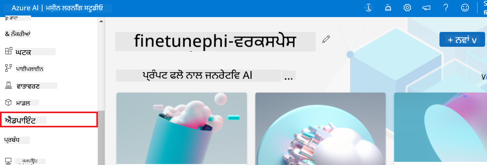

2. ਉਸ endpoint ਨੂੰ ਚੁਣੋ ਜੋ ਤੁਸੀਂ ਬਣਾਇਆ ਹੈ।

    

3. ਇਸ ਪੰਨੇ 'ਤੇ ਤੁਸੀਂ deployment ਦੌਰਾਨ ਬਣਾਏ endpoints ਦਾ ਪ੍ਰਬੰਧ ਕਰ ਸਕਦੇ ਹੋ।

## ਦ੍ਰਿਸ਼ 3: Prompt flow ਨਾਲ ਇੰਟਿਗਰੇਟ ਕਰੋ ਅਤੇ ਆਪਣੇ ਕਸਟਮ ਮਾਡਲ ਨਾਲ ਗੱਲਬਾਤ ਕਰੋ

### Prompt flow ਨਾਲ ਕਸਟਮ Phi-3 ਮਾਡਲ ਇੰਟਿਗਰੇਟ ਕਰੋ

ਆਪਣੇ fine-tuned ਮਾਡਲ ਨੂੰ ਸਫਲਤਾਪੂਰਵਕ deploy ਕਰਨ ਤੋਂ ਬਾਅਦ, ਤੁਸੀਂ ਹੁਣ ਇਸਨੂੰ Prompt flow ਨਾਲ ਜੋੜ ਸਕਦੇ ਹੋ ਤਾਂ ਜੋ ਆਪਣੇ ਮਾਡਲ ਨੂੰ ਰੀਅਲ-ਟਾਈਮ ਐਪਲੀਕੇਸ਼ਨਾਂ ਵਿੱਚ ਵਰਤ ਸਕੋ, ਜਿਸ ਨਾਲ ਤੁਹਾਡੇ ਕਸਟਮ Phi-3 ਮਾਡਲ ਨਾਲ ਕਈ ਤਰ੍ਹਾਂ ਦੀਆਂ ਇੰਟਰਐਕਟਿਵ ਟਾਸਕ ਸੰਭਵ ਹੁੰਦੀਆਂ ਹਨ।

#### fine-tuned Phi-3 ਮਾਡਲ ਦੀ api key ਅਤੇ endpoint uri ਸੈੱਟ ਕਰੋ

1. ਉਸ Azure Machine Learning workspace ਤੇ ਜਾਓ ਜੋ ਤੁਸੀਂ ਬਣਾਇਆ ਹੈ।
1. ਖੱਬੇ ਪਾਸੇ ਵਾਲੇ ਟੈਬ ਤੋਂ **Endpoints** ਚੁਣੋ।
1. ਉਸ endpoint ਨੂੰ ਚੁਣੋ ਜੋ ਤੁਸੀਂ ਬਣਾਇਆ ਹੈ।
1. ਨੈਵੀਗੇਸ਼ਨ ਮੀਨੂ ਤੋਂ **Consume** ਚੁਣੋ।
1. ਆਪਣੀ **REST endpoint** ਨੂੰ *config.py* ਫਾਇਲ ਵਿੱਚ ਕਾਪੀ ਕਰਕੇ ਪੇਸਟ ਕਰੋ, ਅਤੇ `AZURE_ML_ENDPOINT = "your_fine_tuned_model_endpoint_uri"` with your **REST endpoint**.
1. Copy and paste your **Primary key** into the *config.py* file, replacing `AZURE_ML_API_KEY = "your_fine_tuned_model_api_key"` ਨੂੰ ਆਪਣੀ **Primary key** ਨਾਲ ਬਦਲੋ।

    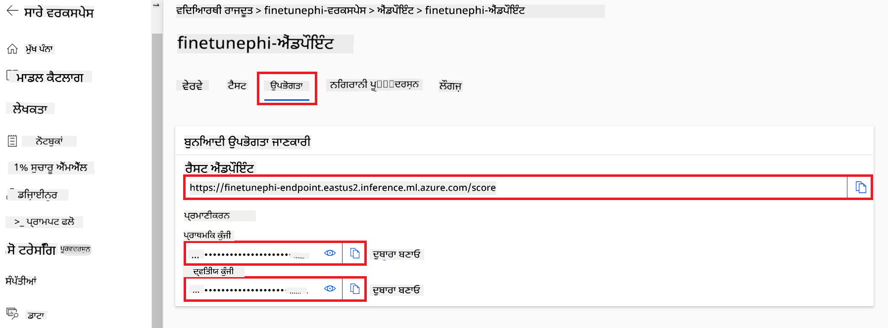

#### *flow.dag.yml* ਫਾਇਲ ਵਿੱਚ ਕੋਡ ਸ਼ਾਮਲ ਕਰੋ

1. Visual Studio Code ਵਿੱਚ *flow.dag.yml* ਖੋਲ੍ਹੋ।

1. *flow.dag.yml* ਵਿੱਚ ਹੇਠਾਂ ਦਿੱਤਾ ਕੋਡ ਸ਼ਾਮਲ ਕਰੋ।

    ```yml
    inputs:
      input_data:
        type: string
        default: "Who founded Microsoft?"

    outputs:
      answer:
        type: string
        reference: ${integrate_with_promptflow.output}

    nodes:
    - name: integrate_with_promptflow
      type: python
      source:
        type: code
        path: integrate_with_promptflow.py
      inputs:
        input_data: ${inputs.input_data}
    ```

#### *integrate_with_promptflow.py* ਫਾਇਲ ਵਿੱਚ ਕੋਡ ਸ਼ਾਮਲ ਕਰੋ

1. Visual Studio Code ਵਿੱਚ *integrate_with_promptflow.py* ਖੋਲ੍ਹੋ।

1. *integrate_with_promptflow.py* ਵਿੱਚ ਹੇਠਾਂ ਦਿੱਤਾ ਕੋਡ ਸ਼ਾਮਲ ਕਰੋ।

    ```python
    import logging
    import requests
    from promptflow.core import tool
    import asyncio
    import platform
    from config import (
        AZURE_ML_ENDPOINT,
        AZURE_ML_API_KEY
    )

    # Logging setup
    logging.basicConfig(
        format="%(asctime)s - %(levelname)s - %(name)s - %(message)s",
        datefmt="%Y-%m-%d %H:%M:%S",
        level=logging.DEBUG
    )
    logger = logging.getLogger(__name__)

    def query_azml_endpoint(input_data: list, endpoint_url: str, api_key: str) -> str:
        """
        Send a request to the Azure ML endpoint with the given input data.
        """
        headers = {
            "Content-Type": "application/json",
            "Authorization": f"Bearer {api_key}"
        }
        data = {
            "input_data": [input_data],
            "params": {
                "temperature": 0.7,
                "max_new_tokens": 128,
                "do_sample": True,
                "return_full_text": True
            }
        }
        try:
            response = requests.post(endpoint_url, json=data, headers=headers)
            response.raise_for_status()
            result = response.json()[0]
            logger.info("Successfully received response from Azure ML Endpoint.")
            return result
        except requests.exceptions.RequestException as e:
            logger.error(f"Error querying Azure ML Endpoint: {e}")
            raise

    def setup_asyncio_policy():
        """
        Setup asyncio event loop policy for Windows.
        """
        if platform.system() == 'Windows':
            asyncio.set_event_loop_policy(asyncio.WindowsSelectorEventLoopPolicy())
            logger.info("Set Windows asyncio event loop policy.")

    @tool
    def my_python_tool(input_data: str) -> str:
        """
        Tool function to process input data and query the Azure ML endpoint.
        """
        setup_asyncio_policy()
        return query_azml_endpoint(input_data, AZURE_ML_ENDPOINT, AZURE_ML_API_KEY)

    ```

### ਆਪਣੇ ਕਸਟਮ ਮਾਡਲ ਨਾਲ ਗੱਲਬਾਤ ਕਰੋ

1. *deploy_model.py* ਸਕ੍ਰਿਪਟ ਚਲਾਉਣ ਅਤੇ Azure Machine Learning ਵਿੱਚ deployment ਪ੍ਰਕਿਰਿਆ ਸ਼ੁਰੂ ਕਰਨ ਲਈ ਹੇਠਾਂ ਦਿੱਤਾ ਕਮਾਂਡ ਲਿਖੋ।

    ```python
    pf flow serve --source ./ --port 8080 --host localhost
    ```

1. ਨਤੀਜੇ ਦਾ ਉਦਾਹਰਨ: ਹੁਣ ਤੁਸੀਂ ਆਪਣੇ ਕਸਟਮ Phi-3 ਮਾਡਲ ਨਾਲ ਗੱਲਬਾਤ ਕਰ ਸਕਦੇ ਹੋ। ਇਹ ਸਿਫਾਰਸ਼ ਕੀਤੀ ਜਾਂਦੀ ਹੈ ਕਿ ਤੁਸੀਂ fine-tuning ਲਈ ਵਰਤੇ ਡਾਟਾ ਦੇ ਅਧਾਰ 'ਤੇ ਸਵਾਲ ਪੁੱਛੋ।

    

**ਅਸਵੀਕਾਰੋक्ति**:  
ਇਸ ਦਸਤਾਵੇਜ਼ ਦਾ ਅਨੁਵਾਦ AI ਅਨੁਵਾਦ ਸੇਵਾ [Co-op Translator](https://github.com/Azure/co-op-translator) ਦੀ ਵਰਤੋਂ ਕਰਕੇ ਕੀਤਾ ਗਿਆ ਹੈ। ਜਦੋਂ ਕਿ ਅਸੀਂ ਸਹੀਅਤ ਲਈ ਕੋਸ਼ਿਸ਼ ਕਰਦੇ ਹਾਂ, ਕਿਰਪਾ ਕਰਕੇ ਧਿਆਨ ਰੱਖੋ ਕਿ ਆਟੋਮੈਟਿਕ ਅਨੁਵਾਦਾਂ ਵਿੱਚ ਗਲਤੀਆਂ ਜਾਂ ਅਸੁਚਿਤਤਾਵਾਂ ਹੋ ਸਕਦੀਆਂ ਹਨ। ਮੂਲ ਦਸਤਾਵੇਜ਼ ਆਪਣੇ ਮੂਲ ਭਾਸ਼ਾ ਵਿੱਚ ਹੀ ਪ੍ਰਮਾਣਿਕ ਸਰੋਤ ਮੰਨਿਆ ਜਾਣਾ ਚਾਹੀਦਾ ਹੈ। ਮਹੱਤਵਪੂਰਨ ਜਾਣਕਾਰੀ ਲਈ, ਪ੍ਰੋਫੈਸ਼ਨਲ ਮਨੁੱਖੀ ਅਨੁਵਾਦ ਦੀ ਸਿਫ਼ਾਰਿਸ਼ ਕੀਤੀ ਜਾਂਦੀ ਹੈ। ਅਸੀਂ ਇਸ ਅਨੁਵਾਦ ਦੇ ਇਸਤੇਮਾਲ ਤੋਂ ਪੈਦਾ ਹੋਣ ਵਾਲੀਆਂ ਕਿਸੇ ਵੀ ਗਲਤਫਹਮੀਆਂ ਜਾਂ ਭੁੱਲਾਂ ਲਈ ਜ਼ਿੰਮੇਵਾਰ ਨਹੀਂ ਹਾਂ।