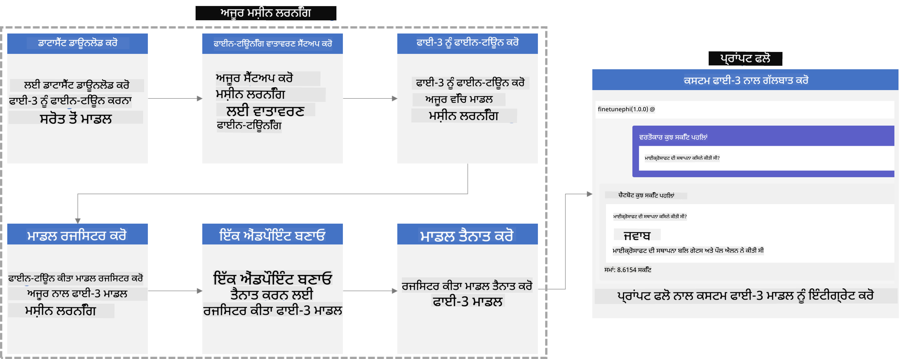
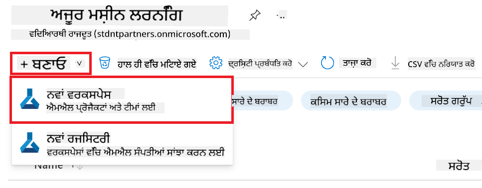
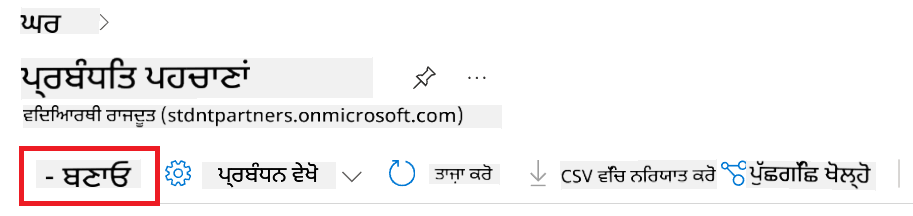
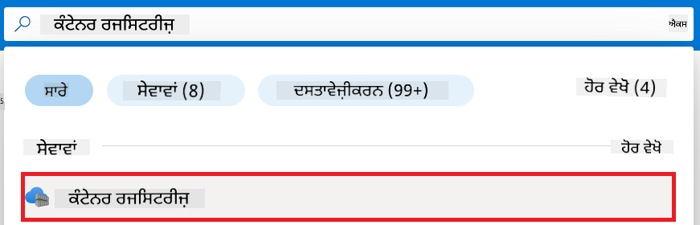
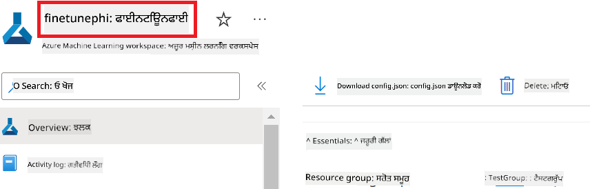
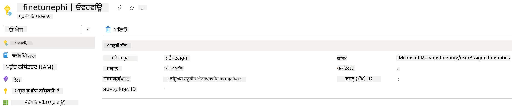
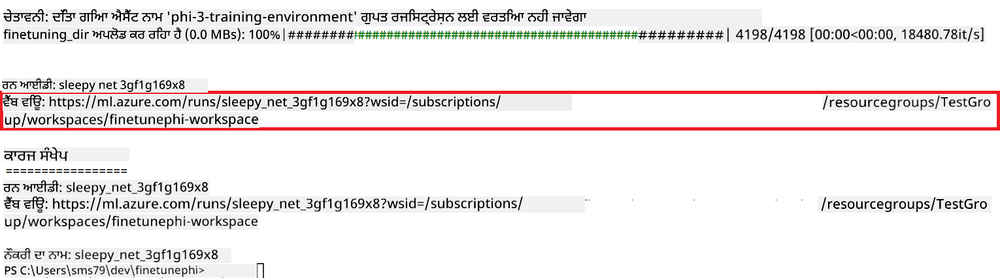
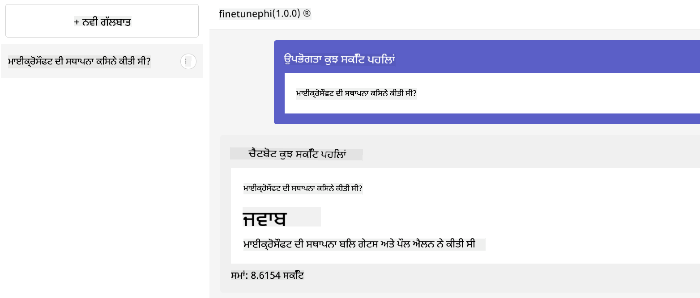

<!--
CO_OP_TRANSLATOR_METADATA:
{
  "original_hash": "7ca2c30fdb802664070e9cfbf92e24fe",
  "translation_date": "2026-01-05T02:35:00+00:00",
  "source_file": "md/02.Application/01.TextAndChat/Phi3/E2E_Phi-3-FineTuning_PromptFlow_Integration.md",
  "language_code": "pa"
}
-->
# Fine-tune and Integrate custom Phi-3 models with Prompt flow

This end-to-end (E2E) sample is based on the guide "[Fine-Tune and Integrate Custom Phi-3 Models with Prompt Flow: Step-by-Step Guide](https://techcommunity.microsoft.com/t5/educator-developer-blog/fine-tune-and-integrate-custom-phi-3-models-with-prompt-flow/ba-p/4178612?WT.mc_id=aiml-137032-kinfeylo)" from the Microsoft Tech Community. It introduces the processes of fine-tuning, deploying, and integrating custom Phi-3 models with Prompt flow.

## Overview

In this E2E sample, you will learn how to fine-tune the Phi-3 model and integrate it with Prompt flow. By leveraging Azure Machine Learning, and Prompt flow you will establish a workflow for deploying and utilizing custom AI models. This E2E sample is divided into three scenarios:

**Scenario 1: Set up Azure resources and Prepare for fine-tuning**

**Scenario 2: Fine-tune the Phi-3 model and Deploy in Azure Machine Learning Studio**

**Scenario 3: Integrate with Prompt flow and Chat with your custom model**

Here is an overview of this E2E sample.



### Table of Contents

1. **[Scenario 1: Set up Azure resources and Prepare for fine-tuning](../../../../../../md/02.Application/01.TextAndChat/Phi3)**
    - [Create an Azure Machine Learning Workspace](../../../../../../md/02.Application/01.TextAndChat/Phi3)
    - [Request GPU quotas in Azure Subscription](../../../../../../md/02.Application/01.TextAndChat/Phi3)
    - [Add role assignment](../../../../../../md/02.Application/01.TextAndChat/Phi3)
    - [Set up project](../../../../../../md/02.Application/01.TextAndChat/Phi3)
    - [Prepare dataset for fine-tuning](../../../../../../md/02.Application/01.TextAndChat/Phi3)

1. **[Scenario 2: Fine-tune Phi-3 model and Deploy in Azure Machine Learning Studio](../../../../../../md/02.Application/01.TextAndChat/Phi3)**
    - [Set up Azure CLI](../../../../../../md/02.Application/01.TextAndChat/Phi3)
    - [Fine-tune the Phi-3 model](../../../../../../md/02.Application/01.TextAndChat/Phi3)
    - [Deploy the fine-tuned model](../../../../../../md/02.Application/01.TextAndChat/Phi3)

1. **[Scenario 3: Integrate with Prompt flow and Chat with your custom model](../../../../../../md/02.Application/01.TextAndChat/Phi3)**
    - [Integrate the custom Phi-3 model with Prompt flow](../../../../../../md/02.Application/01.TextAndChat/Phi3)
    - [Chat with your custom model](../../../../../../md/02.Application/01.TextAndChat/Phi3)

## Scenario 1: Set up Azure resources and Prepare for fine-tuning

### Create an Azure Machine Learning Workspace

1. Type *azure machine learning* in the **search bar** at the top of the portal page and select **Azure Machine Learning** from the options that appear.

    

1. Select **+ Create** from the navigation menu.

1. Select **New workspace** from the navigation menu.

    

1. Perform the following tasks:

    - Select your Azure **Subscription**.
    - Select the **Resource group** to use (create a new one if needed).
    - Enter **Workspace Name**. It must be a unique value.
    - Select the **Region** you'd like to use.
    - Select the **Storage account** to use (create a new one if needed).
    - Select the **Key vault** to use (create a new one if needed).
    - Select the **Application insights** to use (create a new one if needed).
    - Select the **Container registry** to use (create a new one if needed).

    

1. Select **Review + Create**.

1. Select **Create**.

### Request GPU quotas in Azure Subscription

In this E2E sample, you will use the *Standard_NC24ads_A100_v4 GPU* for fine-tuning, which requires a quota request, and the *Standard_E4s_v3* CPU for deployment, which does not require a quota request.

> [!NOTE]
>
> Only Pay-As-You-Go subscriptions (the standard subscription type) are eligible for GPU allocation; benefit subscriptions are not currently supported.
>
> For those using benefit subscriptions (such as Visual Studio Enterprise Subscription) or those looking to quickly test the fine-tuning and deployment process, this tutorial also provides guidance for fine-tuning with a minimal dataset using a CPU. However, it is important to note that fine-tuning results are significantly better when using a GPU with larger datasets.

1. Visit [Azure ML Studio](https://ml.azure.com/home?wt.mc_id=studentamb_279723).

1. Perform the following tasks to request *Standard NCADSA100v4 Family* quota:

    - Select **Quota** from the left side tab.
    - Select the **Virtual machine family** to use. For example, select **Standard NCADSA100v4 Family Cluster Dedicated vCPUs**, which includes the *Standard_NC24ads_A100_v4* GPU.
    - Select the **Request quota** from the navigation menu.

        

    - Inside the Request quota page, enter the **New cores limit** you'd like to use. For example, 24.
    - Inside the Request quota page, select **Submit** to request the GPU quota.

> [!NOTE]
> You can select the appropriate GPU or CPU for your needs by referring to [Sizes for Virtual Machines in Azure](https://learn.microsoft.com/azure/virtual-machines/sizes/overview?tabs=breakdownseries%2Cgeneralsizelist%2Ccomputesizelist%2Cmemorysizelist%2Cstoragesizelist%2Cgpusizelist%2Cfpgasizelist%2Chpcsizelist) document.

### Add role assignment

To fine-tune and deploy your models, you must first create a User Assigned Managed Identity (UAI) and assign it the appropriate permissions. This UAI will be used for authentication during deployment

#### Create User Assigned Managed Identity(UAI)

1. Type *managed identities* in the **search bar** at the top of the portal page and select **Managed Identities** from the options that appear.

    

1. Select **+ Create**.

    

1. Perform the following tasks:

    - Select your Azure **Subscription**.
    - Select the **Resource group** to use (create a new one if needed).
    - Select the **Region** you'd like to use.
    - Enter the **Name**. It must be a unique value.

1. Select **Review + create**.

1. Select **+ Create**.

#### Add Contributor role assignment to Managed Identity

1. Navigate to the Managed Identity resource that you created.

1. Select **Azure role assignments** from the left side tab.

1. Select **+Add role assignment** from the navigation menu.

1. Inside Add role assignment page, Perform the following tasks:
    - Select the **Scope** to **Resource group**.
    - Select your Azure **Subscription**.
    - Select the **Resource group** to use.
    - Select the **Role** to **Contributor**.

    

1. Select **Save**.

#### Add Storage Blob Data Reader role assignment to Managed Identity

1. Type *storage accounts* in the **search bar** at the top of the portal page and select **Storage accounts** from the options that appear.

    

1. Select the storage account that associated with the Azure Machine Learning workspace that you created. For example, *finetunephistorage*.

1. Perform the following tasks to navigate to Add role assignment page:

    - Navigate to the Azure Storage account that you created.
    - Select **Access Control (IAM)** from the left side tab.
    - Select **+ Add** from the navigation menu.
    - Select **Add role assignment** from the navigation menu.

    

1. Inside Add role assignment page, Perform the following tasks:

    - Inside the Role page, type *Storage Blob Data Reader* in the **search bar** and select **Storage Blob Data Reader** from the options that appear.
    - Inside the Role page, select **Next**.
    - Inside the Members page, select **Assign access to** **Managed identity**.
    - Inside the Members page, select **+ Select members**.
    - Inside Select managed identities page, select your Azure **Subscription**.
    - Inside Select managed identities page, select the **Managed identity** to **Manage Identity**.
    - Inside Select managed identities page, select the Manage Identity that you created. For example, *finetunephi-managedidentity*.
    - Inside Select managed identities page, select **Select**.

    

1. Select **Review + assign**.

#### Add AcrPull role assignment to Managed Identity

1. Type *container registries* in the **search bar** at the top of the portal page and select **Container registries** from the options that appear.

    

1. Select the container registry that associated with the Azure Machine Learning workspace. For example, *finetunephicontainerregistries*

1. Perform the following tasks to navigate to Add role assignment page:

    - Select **Access Control (IAM)** from the left side tab.
    - Select **+ Add** from the navigation menu.
    - Select **Add role assignment** from the navigation menu.

1. Inside Add role assignment page, Perform the following tasks:

    - Inside the Role page, Type *AcrPull* in the **search bar** and select **AcrPull** from the options that appear.
    - Inside the Role page, select **Next**.
    - Inside the Members page, select **Assign access to** **Managed identity**.
    - Inside the Members page, select **+ Select members**.
    - Inside Select managed identities page, select your Azure **Subscription**.
    - Inside Select managed identities page, select the **Managed identity** to **Manage Identity**.
    - Inside Select managed identities page, select the Manage Identity that you created. For example, *finetunephi-managedidentity*.
    - Inside Select managed identities page, select **Select**.
    - Select **Review + assign**.

### Set up project

Now, you will create a folder to work in and set up a virtual environment to develop a program that interacts with users and uses stored chat history from Azure Cosmos DB to inform its responses.

#### Create a folder to work inside it

1. Open a terminal window and type the following command to create a folder named *finetune-phi* in the default path.

    ```console
    mkdir finetune-phi
    ```

1. Type the following command inside your terminal to navigate to the *finetune-phi* folder you created.

    ```console
    cd finetune-phi
    ```

#### Create a virtual environment

1. Type the following command inside your terminal to create a virtual environment named *.venv*.

    ```console
    python -m venv .venv
    ```

1. Type the following command inside your terminal to activate the virtual environment.

    ```console
    .venv\Scripts\activate.bat
    ```

> [!NOTE]
>
> If it worked, you should see *(.venv)* before the command prompt.

#### Install the required packages

1. Type the following commands inside your terminal to install the required packages.

    ```console
    pip install datasets==2.19.1
    pip install transformers==4.41.1
    pip install azure-ai-ml==1.16.0
    pip install torch==2.3.1
    pip install trl==0.9.4
    pip install promptflow==1.12.0
    ```

#### Create project files
ਇਸ ਅਭਿਆਸ ਵਿੱਚ, ਤੁਸੀਂ ਸਾਡੇ ਪ੍ਰੋਜੈਕਟ ਲਈ ਜਰੂਰੀ ਫਾਈਲਾਂ ਬਣਾਵੋਗੇ। ਇਹ ਫਾਈਲਾਂ ਡੇਟਾਸੈਟ ਡਾਊਨਲੋਡ ਕਰਨ, Azure Machine Learning ਵਾਤਾਵਰਣ ਸੈੱਟ ਕਰਨ, Phi-3 ਮਾਡਲ ਨੂੰ ਫਾਈਨ-ਟਿਊਨ ਕਰਨ ਅਤੇ ਫਾਈਨ-ਟਿਊਨ ਕੀਤਾ ਮਾਡਲ ਡਿਪਲੌਇ ਕਰਨ ਲਈ ਸਕ੍ਰਿਪਟਾਂ ਸ਼ਾਮਲ ਕਰਦੀਆਂ ਹਨ। ਤੁਸੀਂ ਫਾਈਨ-ਟਿਊਨਿੰਗ ਵਾਤਾਵਰਣ ਸੈੱਟ ਕਰਨ ਲਈ ਇੱਕ *conda.yml* ਫਾਈਲ ਵੀ ਬਣਾਉਗੇ।

In this exercise, you will:

- *download_dataset.py* ਫਾਈਲ ਬਣਾਓ ਜੋ ਡੇਟਾਸੈਟ ਡਾਊਨਲੋਡ ਕਰੇ।
- *setup_ml.py* ਫਾਈਲ ਬਣਾਓ ਜੋ Azure Machine Learning ਵਾਤਾਵਰਣ ਸੈੱਟ ਕਰੇ।
- *finetuning_dir* ਫੋਲਡਰ ਵਿੱਚ *fine_tune.py* ਫਾਈਲ ਬਣਾਓ ਜੋ ਡੇਟਾਸੈਟ ਦੀ ਵਰਤੋਂ ਕਰਕੇ Phi-3 ਮਾਡਲ ਨੂੰ ਫਾਈਨ-ਟਿਊਨ ਕਰੇ।
- ਫਾਈਨ-ਟਿਊਨਿੰਗ ਵਾਤਾਵਰਣ ਸੈੱਟ ਕਰਨ ਲਈ *conda.yml* ਫਾਈਲ ਬਣਾਓ।
- ਫਾਈਨ-ਟਿਊਨ ਕੀਤਾ ਮਾਡਲ ਡਿਪਲੌਇ ਕਰਨ ਲਈ *deploy_model.py* ਫਾਈਲ ਬਣਾਓ।
- ਫਾਈਨ-ਟਿਊਨ ਕੀਤਾ ਮਾਡਲ ਇੰਟਿਗ੍ਰੇਟ ਕਰਨ ਅਤੇ Prompt flow ਦੀ ਵਰਤੋਂ ਕਰਕੇ ਮਾਡਲ ਚਲਾਉਣ ਲਈ *integrate_with_promptflow.py* ਫਾਈਲ ਬਣਾਓ।
- Prompt flow ਲਈ ਵਰਕਫਲੋ ਸਰਾਂਚਾ ਸੈੱਟ ਕਰਨ ਲਈ flow.dag.yml ਫਾਈਲ ਬਣਾਓ।
- Azure ਜਾਣਕਾਰੀਆਂ ਦਰਜ ਕਰਨ ਲਈ *config.py* ਫਾਈਲ ਬਣਾਓ।

> [!NOTE]
>
> ਪੂਰੀ ਫੋਲਡਰ ਸਰਾਂਚਾ:
>
> ```text
> └── YourUserName
> .    └── finetune-phi
> .        ├── finetuning_dir
> .        │      └── fine_tune.py
> .        ├── conda.yml
> .        ├── config.py
> .        ├── deploy_model.py
> .        ├── download_dataset.py
> .        ├── flow.dag.yml
> .        ├── integrate_with_promptflow.py
> .        └── setup_ml.py
> ```

1. ਖੋਲ੍ਹੋ **Visual Studio Code**।

1. ਮੇਨੂ ਬਾਰ ਤੋਂ **File** ਚੁਣੋ।

1. **Open Folder** ਚੁਣੋ।

1. ਉਹ *finetune-phi* ਫੋਲਡਰ ਚੁਣੋ ਜੋ ਤੁਸੀਂ ਬਣਾਇਆ ਹੈ, ਜੋ ਕਿ *C:\Users\yourUserName\finetune-phi* 'ਤੇ ਸਥਿਤ ਹੈ।

    

1. Visual Studio Code ਦੇ ਖੱਬੇ ਪੈਨ ਵਿੱਚ, ਰਾਈਟ-ਕਲਿੱਕ ਕਰੋ ਅਤੇ ਨਵੀਂ ਫਾਈਲ ਬਣਾਉਣ ਲਈ **New File** ਚੁਣੋ, ਅਤੇ ਇੱਕ ਨਵੀਂ ਫਾਈਲ *download_dataset.py* ਨਾਂ ਨਾਲ ਬਣਾਓ।

1. Visual Studio Code ਦੇ ਖੱਬੇ ਪੈਨ ਵਿੱਚ, ਰਾਈਟ-ਕਲਿੱਕ ਕਰੋ ਅਤੇ ਨਵੀਂ ਫਾਈਲ ਬਣਾਉਣ ਲਈ **New File** ਚੁਣੋ, ਅਤੇ ਇੱਕ ਨਵੀਂ ਫਾਈਲ *setup_ml.py* ਨਾਂ ਨਾਲ ਬਣਾਓ।

1. Visual Studio Code ਦੇ ਖੱਬੇ ਪੈਨ ਵਿੱਚ, ਰਾਈਟ-ਕਲਿੱਕ ਕਰੋ ਅਤੇ ਨਵੀਂ ਫਾਈਲ ਬਣਾਉਣ ਲਈ **New File** ਚੁਣੋ, ਅਤੇ ਇੱਕ ਨਵੀਂ ਫਾਈਲ *deploy_model.py* ਨਾਂ ਨਾਲ ਬਣਾਓ।

    

1. Visual Studio Code ਦੇ ਖੱਬੇ ਪੈਨ ਵਿੱਚ, ਰਾਈਟ-ਕਲਿੱਕ ਕਰੋ ਅਤੇ **New Folder** ਚੁਣੋ, ਅਤੇ *finetuning_dir* ਨਾਂ ਦਾ ਨਵਾਂ ਫੋਲਡਰ ਬਣਾਓ।

1. *finetuning_dir* ਫੋਲਡਰ ਵਿੱਚ, *fine_tune.py* ਨਾਂ ਦੀ ਨਵੀਂ ਫਾਈਲ ਬਣਾਓ।

#### Create and Configure *conda.yml* file

1. Visual Studio Code ਦੇ ਖੱਬੇ ਪੈਨ ਵਿੱਚ, ਰਾਈਟ-ਕਲਿੱਕ ਕਰੋ ਅਤੇ ਨਵੀਂ ਫਾਈਲ ਬਣਾਉਣ ਲਈ **New File** ਚੁਣੋ, ਅਤੇ *conda.yml* ਨਾਂ ਦੀ ਫਾਈਲ ਬਣਾਓ।

1. ਫਾਈਨ-ਟਿਊਨਿੰਗ ਵਾਤਾਵਰਣ ਨੂੰ ਸੈੱਟ ਕਰਨ ਲਈ *conda.yml* ਫਾਈਲ ਵਿੱਚ ਹੇਠਾਂ ਦਿੱਤਾ ਕੋਡ ਜਮ੍ਹਾਂ ਕਰੋ ਜੋ Phi-3 ਮਾਡਲ ਲਈ ਵਾਤਾਵਰਣ ਸੈੱਟ ਕਰਦਾ ਹੈ।

    ```yml
    name: phi-3-training-env
    channels:
      - defaults
      - conda-forge
    dependencies:
      - python=3.10
      - pip
      - numpy<2.0
      - pip:
          - torch==2.4.0
          - torchvision==0.19.0
          - trl==0.8.6
          - transformers==4.41
          - datasets==2.21.0
          - azureml-core==1.57.0
          - azure-storage-blob==12.19.0
          - azure-ai-ml==1.16
          - azure-identity==1.17.1
          - accelerate==0.33.0
          - mlflow==2.15.1
          - azureml-mlflow==1.57.0
    ```

#### Create and Configure *config.py* file

1. Visual Studio Code ਦੇ ਖੱਬੇ ਪੈਨ ਵਿੱਚ, ਰਾਈਟ-ਕਲਿੱਕ ਕਰੋ ਅਤੇ ਨਵੀਂ ਫਾਈਲ ਬਣਾਉਣ ਲਈ **New File** ਚੁਣੋ, ਅਤੇ *config.py* ਨਾਂ ਦੀ ਫਾਈਲ ਬਣਾਓ।

1. ਆਪਣੀ Azure ਜਾਣਕਾਰੀ ਸ਼ਾਮਲ ਕਰਨ ਲਈ *config.py* ਫਾਈਲ ਵਿੱਚ ਹੇਠਾਂ ਦਿੱਤਾ ਕੋਡ ਜੋੜੋ।

    ```python
    # Azure ਸੈਟਿੰਗਾਂ
    AZURE_SUBSCRIPTION_ID = "your_subscription_id"
    AZURE_RESOURCE_GROUP_NAME = "your_resource_group_name" # "ਟੈਸਟਗਰੁੱਪ"

    # Azure ਮਸ਼ੀਨ ਲਰਨਿੰਗ ਸੈਟਿੰਗਾਂ
    AZURE_ML_WORKSPACE_NAME = "your_workspace_name" # "ਫਾਈਨਟਿਊਨਫਾਈ-ਵਰਕਸਪੇਸ"

    # Azure ਪ੍ਰਬੰਧਿਤ ਆਈਡੈਂਟਿਟੀ ਸੈਟਿੰਗਾਂ
    AZURE_MANAGED_IDENTITY_CLIENT_ID = "your_azure_managed_identity_client_id"
    AZURE_MANAGED_IDENTITY_NAME = "your_azure_managed_identity_name" # "ਫਾਈਨਟਿਊਨਫਾਈ-ਮੈਨਗਡਆਈਡੈਂਟਿਟੀ"
    AZURE_MANAGED_IDENTITY_RESOURCE_ID = f"/subscriptions/{AZURE_SUBSCRIPTION_ID}/resourceGroups/{AZURE_RESOURCE_GROUP_NAME}/providers/Microsoft.ManagedIdentity/userAssignedIdentities/{AZURE_MANAGED_IDENTITY_NAME}"

    # ਡੇਟਾਸੈੱਟ ਫਾਇਲ ਪਾਥ
    TRAIN_DATA_PATH = "data/train_data.jsonl"
    TEST_DATA_PATH = "data/test_data.jsonl"

    # ਫਾਈਨ-ਟਿਊਨ ਕੀਤਾ ਮਾਡਲ ਸੈਟਿੰਗਾਂ
    AZURE_MODEL_NAME = "your_fine_tuned_model_name" # "ਫਾਈਨਟਿਊਨ-ਫਾਈ-ਮਾਡਲ"
    AZURE_ENDPOINT_NAME = "your_fine_tuned_model_endpoint_name" # "ਫਾਈਨਟਿਊਨ-ਫਾਈ-ਐਂਡਪੌਇੰਟ"
    AZURE_DEPLOYMENT_NAME = "your_fine_tuned_model_deployment_name" # "ਫਾਈਨਟਿਊਨ-ਫਾਈ-ਡਿਪਲੋਇਮੈਂਟ"

    AZURE_ML_API_KEY = "your_fine_tuned_model_api_key"
    AZURE_ML_ENDPOINT = "your_fine_tuned_model_endpoint_uri" # "https://{ਤੁਹਾਡਾ-ਐਂਡਪੌਇੰਟ-ਨਾਂ}.{ਤੁਹਾਡਾ-ਇਲਾਕਾ}.inference.ml.azure.com/score"
    ```

#### Add Azure environment variables

1. Azure Subscription ID ਜੋੜਨ ਲਈ ਹੇਠਲੀਆਂ ਕਾਰਵਾਈਆਂ ਕਰੋ:

    - ਪੋਰਟਲ ਪੇਜ਼ ਦੇ ਉੱਪਰਲੇ ਭਾਗ ਵਿੱਚ **search bar** ਵਿੱਚ *subscriptions* ਟਾਈਪ ਕਰੋ ਅਤੇ ਦਿੱਤੇ ਵਿਕਲਪਾਂ ਵਿੱਚੋਂ **Subscriptions** ਚੁਣੋ।
    - ਆਪਣੀ ਵਰਤੂ Azure Subscription ਚੁਣੋ।
    - ਆਪਣਾ Subscription ID ਕਾਪੀ ਕਰਕੇ *config.py* ਫਾਈਲ ਵਿੱਚ ਪੇਸਟ ਕਰੋ।

    

1. Azure Workspace Name ਜੋੜਨ ਲਈ ਹੇਠਲੀਆਂ ਕਾਰਵਾਈਆਂ ਕਰੋ:

    - ਉਸ Azure Machine Learning ਸਰੋਤ ਤੇ ਜਾਓ ਜੋ ਤੁਸੀਂ ਬਣਾਇਆ ਸੀ।
    - ਆਪਣਾ ਅਕਾਊਂਟ ਨਾਮ ਕਾਪੀ ਕਰਕੇ *config.py* ਫਾਈਲ ਵਿੱਚ ਪੇਸਟ ਕਰੋ।

    

1. Azure Resource Group Name ਜੋੜਨ ਲਈ ਹੇਠਲੀਆਂ ਕਾਰਵਾਈਆਂ ਕਰੋ:

    - ਉਸ Azure Machine Learning ਸਰੋਤ ਤੇ ਜਾਓ ਜੋ ਤੁਸੀਂ ਬਣਾਇਆ ਸੀ।
    - ਆਪਣਾ Azure Resource Group Name ਕਾਪੀ ਕਰਕੇ *config.py* ਫਾਈਲ ਵਿੱਚ ਪੇਸਟ ਕਰੋ।

    

2. Azure Managed Identity name ਜੋੜਨ ਲਈ ਹੇਠਲੀਆਂ ਕਾਰਵਾਈਆਂ ਕਰੋ:

    - ਉਸ Managed Identities ਸਰੋਤ ਤੇ ਜਾਓ ਜੋ ਤੁਸੀਂ ਬਣਾਇਆ ਸੀ।
    - ਆਪਣਾ Azure Managed Identity ਨਾਂ ਕਾਪੀ ਕਰਕੇ *config.py* ਫਾਈਲ ਵਿੱਚ ਪੇਸਟ ਕਰੋ।

    

### ਫਾਈਨ-ਟਿਊਨਿੰਗ ਲਈ ਡੇਟਾਸੈਟ ਤਿਆਰ ਕਰੋ

ਇਸ ਅਭਿਆਸ ਵਿੱਚ, ਤੁਸੀਂ *download_dataset.py* ਫਾਈਲ ਚਲਾ ਕੇ *ULTRACHAT_200k* ਡੇਟਾਸੈਟਸ ਨੂੰ ਆਪਣੀ ਲੋਕਲ ਵਾਤਾਵਰਣ ਵਿੱਚ ਡਾਊਨਲੋਡ ਕਰੋਗੇ। ਫਿਰ ਤੁਸੀਂ ਇਹ ਡੇਟਾਸੈਟ Phi-3 ਮਾਡਲ ਨੂੰ Azure Machine Learning ਵਿੱਚ ਫਾਈਨ-ਟਿਊਨ ਕਰਨ ਲਈ ਵਰਤੋਂਗੇ।

#### *download_dataset.py* ਦੀ ਵਰਤੋਂ ਕਰਕੇ ਆਪਣਾ ਡੇਟਾਸੈਟ ਡਾਊਨਲੋਡ ਕਰੋ

1. Visual Studio Code ਵਿੱਚ *download_dataset.py* ਫਾਈਲ ਖੋਲ੍ਹੋ।

1. *download_dataset.py* ਵਿੱਚ ਹੇਠਾਂ ਦਿੱਤਾ ਕੋਡ ਸ਼ਾਮਿਲ ਕਰੋ।

    ```python
    import json
    import os
    from datasets import load_dataset
    from config import (
        TRAIN_DATA_PATH,
        TEST_DATA_PATH)

    def load_and_split_dataset(dataset_name, config_name, split_ratio):
        """
        Load and split a dataset.
        """
        # ਦਿੱਤੇ ਨਾਮ, ਕਨਫਿਗਰੇਸ਼ਨ ਅਤੇ ਸਪਲਿਟ ਅਨੁਪਾਤ ਨਾਲ ਡੇਟਾਸੈੱਟ ਲੋਡ ਕਰੋ
        dataset = load_dataset(dataset_name, config_name, split=split_ratio)
        print(f"Original dataset size: {len(dataset)}")
        
        # ਡੇਟਾਸੈੱਟ ਨੂੰ ਟਰੇਨ ਅਤੇ ਟੈਸਟ ਸੈੱਟਾਂ ਵਿੱਚ ਵੰਡੋ (80% ਟਰੇਨ, 20% ਟੈਸਟ)
        split_dataset = dataset.train_test_split(test_size=0.2)
        print(f"Train dataset size: {len(split_dataset['train'])}")
        print(f"Test dataset size: {len(split_dataset['test'])}")
        
        return split_dataset

    def save_dataset_to_jsonl(dataset, filepath):
        """
        Save a dataset to a JSONL file.
        """
        # ਜੇ ਡਾਇਰੈਕਟਰੀ ਮੌਜੂਦ ਨਹੀਂ ਹੈ ਤਾਂ ਉਸਨੂੰ ਬਣਾਓ
        os.makedirs(os.path.dirname(filepath), exist_ok=True)
        
        # ਫਾਇਲ ਨੂੰ ਲਿਖਣ ਦੇ ਮੋਡ ਵਿੱਚ ਖੋਲ੍ਹੋ
        with open(filepath, 'w', encoding='utf-8') as f:
            # ਡੇਟਾਸੈੱਟ ਵਿੱਚ ਹਰ ਰਿਕਾਰਡ 'ਤੇ ਦੁਹਰਾਈ ਕਰੋ
            for record in dataset:
                # ਰਿਕਾਰਡ ਨੂੰ JSON ਆਬਜੈਕਟ ਵਜੋਂ ਡੰਪ ਕਰੋ ਅਤੇ ਫਾਇਲ ਵਿੱਚ ਲਿਖੋ
                json.dump(record, f)
                # ਰਿਕਾਰਡਾਂ ਨੂੰ ਵੱਖਰਾ ਕਰਨ ਲਈ ਨਵੀਂ ਲਾਈਨ ਚਿੰਨ੍ਹ ਲਿਖੋ
                f.write('\n')
        
        print(f"Dataset saved to {filepath}")

    def main():
        """
        Main function to load, split, and save the dataset.
        """
        # ULTRACHAT_200k ਡੇਟਾਸੈੱਟ ਨੂੰ ਇੱਕ ਨਿਰਧਾਰਿਤ ਕਨਫਿਗਰੇਸ਼ਨ ਅਤੇ ਸਪਲਿਟ ਅਨੁਪਾਤ ਨਾਲ ਲੋਡ ਅਤੇ ਵੰਡੋ
        dataset = load_and_split_dataset("HuggingFaceH4/ultrachat_200k", 'default', 'train_sft[:1%]')
        
        # ਵੰਡ ਤੋਂ ਟਰੇਨ ਅਤੇ ਟੈਸਟ ਡੇਟਾਸੈੱਟ ਨਿਕਾਲੋ
        train_dataset = dataset['train']
        test_dataset = dataset['test']

        # ਟਰੇਨ ਡੇਟਾਸੈੱਟ ਨੂੰ ਇੱਕ JSONL ਫਾਇਲ ਵਿੱਚ ਸੇਵ ਕਰੋ
        save_dataset_to_jsonl(train_dataset, TRAIN_DATA_PATH)
        
        # ਟੈਸਟ ਡੇਟਾਸੈੱਟ ਨੂੰ ਵੱਖਰੀ JSONL ਫਾਇਲ ਵਿੱਚ ਸੇਵ ਕਰੋ
        save_dataset_to_jsonl(test_dataset, TEST_DATA_PATH)

    if __name__ == "__main__":
        main()

    ```

> [!TIP]
>
> **CPU ਦੀ ਵਰਤੋਂ ਕਰਕੇ ਘੱਟ ਡੇਟਾਸੈਟ ਨਾਲ ਫਾਈਨ-ਟਿਊਨਿੰਗ ਲਈ ਮਾਰਗਦਰਸ਼ਨ**
>
> ਜੇ ਤੁਸੀਂ ਫਾਈਨ-ਟਿਊਨਿੰਗ ਲਈ CPU ਵਰਤਣਾ ਚਾਹੁੰਦੇ ਹੋ, ਇਹ ਤਰੀਕਾ ਉਹਨਾਂ ਲਈ ਉਚਿਤ ਹੈ ਜਿਹੜਿਆਂ ਕੋਲ ਬੇਨੇਫਿਟ ਸਬਸਕ੍ਰਿਪਸ਼ਨ (ਜਿਵੇਂ Visual Studio Enterprise Subscription) ਹਨ ਜਾਂ ਫਾਈਨ-ਟਿਊਨਿੰਗ ਅਤੇ ਡਿਪਲੌਇ ਪ੍ਰਕਿਰੀਆ ਨੂੰ ਤੇਜ਼ੀ ਨਾਲ ਟੈਸਟ ਕਰਨ ਲਈ।
>
> `dataset = load_and_split_dataset("HuggingFaceH4/ultrachat_200k", 'default', 'train_sft[:1%]')` ਦੀ ਥਾਂ `dataset = load_and_split_dataset("HuggingFaceH4/ultrachat_200k", 'default', 'train_sft[:10]')` ਕਰੋ
>

1. ਆਪਣੀ ਟਰਮੀਨਲ ਵਿੱਚ ਹੇਠਾਂ ਦਿੱਤਾ ਕਮਾਂਡ ਟਾਈਪ ਕਰੋ ਤਾਂ ਜੋ ਸਕ੍ਰਿਪਟ ਚੱਲੇ ਅਤੇ ਡੇਟਾਸੈਟ ਤੁਹਾਡੀ ਲੋਕਲ ਮਸ਼ੀਨ ਤੇ ਡਾਊਨਲੋਡ ਹੋ ਜਾਵੇ।

    ```console
    python download_data.py
    ```

1. ਯਕੀਨੀ ਬਣਾਓ ਕਿ ਡੇਟਾਸੈਟ ਸਫਲਤਾਪੂਰਵਕ ਤੁਹਾਡੇ ਲੋਕਲ *finetune-phi/data* ਡਾਇਰੈਕਟਰੀ ਵਿੱਚ ਸੇਵ ਹੋ ਚੁੱਕੇ ਹਨ।

> [!NOTE]
>
> **ਡੇਟਾਸੈਟ ਦਾ ਆਕਾਰ ਅਤੇ ਫਾਈਨ-ਟਿਊਨਿੰਗ ਸਮਾਂ**
>
> ਇਸ E2E ਉਦਾਹਰਨ ਵਿੱਚ, ਤੁਸੀਂ ਕੇਵਲ 1% ਡੇਟਾਸੈਟ (`train_sft[:1%]`) ਦੀ ਵਰਤੋਂ ਕਰਦੇ ਹੋ। ਇਸ ਨਾਲ ਡੇਟਾ ਦੀ ਮਾਤਰਾ ਘੱਟ ਹੁੰਦੀ ਹੈ, ਜੋ ਅੱਪਲੋਡ ਅਤੇ ਫਾਈਨ-ਟਿਊਨਿੰਗ ਦੋਹਾਂ ਦੀ ਪ੍ਰਕਿਰਿਆ ਨੂੰ ਤੇਜ਼ ਕਰਦੀ ਹੈ। ਤੁਸੀਂ ਟ੍ਰੇਨਿੰਗ ਸਮੇਂ ਅਤੇ ਮਾਡਲ ਪ੍ਰਦਰਸ਼ਨ ਵਿਚੋਂ ਠੀਕ ਸੰਤੁਲਨ ਲੱਭਣ ਲਈ ਇਸ ਪ੍ਰਤੀਸ਼ਤ ਨੂੰ ਅਨੁਕੂਲ ਕਰ ਸਕਦੇ ਹੋ। ਛੋਟਾ ਸਬਸੈਟ ਵਰਤਣ ਨਾਲ ਫਾਈਨ-ਟਿਊਨਿੰਗ ਲਈ ਲੱਗਣ ਵਾਲਾ ਸਮਾਂ ਘੱਟ ਹੁੰਦਾ ਹੈ, ਜਿਸ ਨਾਲ ਇਹ E2E ਨਮੂਨੇ ਲਈ ਹੋਰ ਪ੍ਰਬੰਧਯੋਗ ਬਣ ਜਾਂਦਾ ਹੈ।
>
## ਦ੍ਰਿਸ਼ 2: Phi-3 ਮਾਡਲ ਨੂੰ ਫਾਈਨ-ਟਿਊਨ ਕਰੋ ਅਤੇ Azure Machine Learning Studio ਵਿੱਚ ਡਿਪਲੌਇ ਕਰੋ

### Azure CLI ਸੈੱਟ ਕਰੋ

ਤੁਹਾਨੂੰ ਆਪਣਾ ਵਾਤਾਵਰਣ ਦਸਤਾਵੇਜ਼ ਕਰਨ ਲਈ Azure CLI ਸੈੱਟ ਕਰਨ ਦੀ ਲੋੜ ਹੈ। Azure CLI ਤੁਹਾਨੂੰ ਕਮਾਂਡ ਲਾਈਨ ਤੋਂ ਸਿੱਧਾ Azure ਸਰੋਤਾਂ ਦਾ ਪ੍ਰਬੰਧ ਕਰਨ ਦੇ ਯੋਗ ਬਣਾਉਂਦੀ ਅਤੇ Azure Machine Learning ਲਈ ਜ਼ਰੂਰੀ ਪ੍ਰਮਾਣ-ਪੱਤਰ ਪ੍ਰਦਾਨ ਕਰਦੀ। ਸ਼ੁਰੂ ਕਰਨ ਲਈ [Azure CLI](https://learn.microsoft.com/cli/azure/install-azure-cli) ਇੰਸਟਾਲ ਕਰੋ

1. ਇੱਕ ਟਰਮੀਨਲ ਵਿੰਡੋ ਖੋਲ੍ਹੋ ਅਤੇ ਆਪਣੀ Azure ਖਾਤੇ ਵਿੱਚ ਲੌਗਇਨ ਕਰਨ ਲਈ ਹੇਠਾਂ ਦਿੱਤਾ ਕਮਾਂਡ ਟਾਈਪ ਕਰੋ।

    ```console
    az login
    ```

1. ਵਰਤਣ ਲਈ ਆਪਣਾ Azure ਖਾਤਾ ਚੁਣੋ।

1. ਵਰਤਣ ਲਈ ਆਪਣੀ Azure subscription ਚੁਣੋ।

    

> [!TIP]
>
> ਜੇ ਤੁਹਾਨੂੰ Azure ਵਿੱਚ ਸਾਈਨ-ਇਨ ਕਰਨ ਵਿੱਚ ਮੁਸ਼ਕਲ ਆ ਰਹੀ ਹੈ, ਤਾਂ ਡਿਵਾਈਸ ਕੋਡ ਦੀ ਵਰਤੋਂ ਕਰਨ ਦਾ ਯਤਨ ਕਰੋ। ਇੱਕ ਟਰਮੀਨਲ ਵਿੰਡੋ ਖੋਲ੍ਹੋ ਅਤੇ ਆਪਣੀ Azure ਖਾਤੇ ਵਿੱਚ ਸਾਈਨ-ਇਨ ਕਰਨ ਲਈ ਹੇਠਾਂ ਦਿੱਤਾ ਕਮਾਂਡ ਟਾਈਪ ਕਰੋ:
>
> ```console
> az login --use-device-code
> ```
>

### Phi-3 ਮਾਡਲ ਨੂੰ ਫਾਈਨ-ਟਿਊਨ ਕਰੋ

ਇਸ ਅਭਿਆਸ ਵਿੱਚ, ਤੁਸੀਂ ਦਿੱਤੇ ਡੇਟਾਸੈਟ ਦੀ ਵਰਤੋਂ ਕਰਕੇ Phi-3 ਮਾਡਲ ਨੂੰ ਫਾਈਨ-ਟਿਊਨ ਕਰੋਗੇ। ਪਹਿਲਾਂ, ਤੁਸੀਂ *fine_tune.py* ਫਾਈਲ ਵਿੱਚ ਫਾਈਨ-ਟਿਊਨਿੰਗ ਪ੍ਰਕਿਰਿਆ ਨਿਰਧਾਰਤ ਕਰੋਗੇ। ਫਿਰ, ਤੁਸੀਂ Azure Machine Learning ਵਾਤਾਵਰਣ ਨੂੰ ਸੰਰਚਿਤ ਕਰਕੇ ਅਤੇ *setup_ml.py* ਫਾਈਲ ਚਲਾ ਕੇ ਫਾਈਨ-ਟਿਊਨਿੰਗ ਪ੍ਰਕਿਰਿਆ ਸ਼ੁਰੂ ਕਰੋਗੇ। ਇਹ ਸਕ੍ਰਿਪਟ ਇਹ ਯਕੀਨੀ ਬਣਾਉਂਦਾ ਹੈ ਕਿ ਫਾਈਨ-ਟਿਊਨਿੰਗ Azure Machine Learning ਵਾਤਾਵਰਣ ਵਿੱਚ ਹੋਵੇ।

*setup_ml.py* ਚਲਾਕੇ, ਤੁਸੀਂ Azure Machine Learning ਵਾਤਾਵਰਣ ਵਿੱਚ ਫਾਈਨ-ਟਿਊਨਿੰਗ ਪ੍ਰਕਿਰਿਆ ਚਲਾਓਗੇ।

#### *fine_tune.py* ਫਾਈਲ ਵਿੱਚ ਕੋਡ ਜੋੜੋ

1. *finetuning_dir* ਫੋਲਡਰ ਵਿੱਚ ਜਾਓ ਅਤੇ Visual Studio Code ਵਿੱਚ *fine_tune.py* ਫਾਈਲ ਖੋਲ੍ਹੋ।

1. *fine_tune.py* ਵਿੱਚ ਹੇਠਾਂ ਦਿੱਤਾ ਕੋਡ ਸ਼ਾਮਿਲ ਕਰੋ।

    ```python
    import argparse
    import sys
    import logging
    import os
    from datasets import load_dataset
    import torch
    import mlflow
    from transformers import AutoModelForCausalLM, AutoTokenizer, TrainingArguments
    from trl import SFTTrainer

    # MLflow ਵਿੱਚ INVALID_PARAMETER_VALUE ਗਲਤੀ ਤੋਂ ਬਚਣ ਲਈ, MLflow ਇੰਟੀਗ੍ਰੇਸ਼ਨ ਨੂੰ ਬੰਦ ਕਰੋ
    os.environ["DISABLE_MLFLOW_INTEGRATION"] = "True"

    # ਲੌਗਿੰਗ ਸੈਟਅੱਪ
    logging.basicConfig(
        format="%(asctime)s - %(levelname)s - %(name)s - %(message)s",
        datefmt="%Y-%m-%d %H:%M:%S",
        handlers=[logging.StreamHandler(sys.stdout)],
        level=logging.WARNING
    )
    logger = logging.getLogger(__name__)

    def initialize_model_and_tokenizer(model_name, model_kwargs):
        """
        Initialize the model and tokenizer with the given pretrained model name and arguments.
        """
        model = AutoModelForCausalLM.from_pretrained(model_name, **model_kwargs)
        tokenizer = AutoTokenizer.from_pretrained(model_name)
        tokenizer.model_max_length = 2048
        tokenizer.pad_token = tokenizer.unk_token
        tokenizer.pad_token_id = tokenizer.convert_tokens_to_ids(tokenizer.pad_token)
        tokenizer.padding_side = 'right'
        return model, tokenizer

    def apply_chat_template(example, tokenizer):
        """
        Apply a chat template to tokenize messages in the example.
        """
        messages = example["messages"]
        if messages[0]["role"] != "system":
            messages.insert(0, {"role": "system", "content": ""})
        example["text"] = tokenizer.apply_chat_template(
            messages, tokenize=False, add_generation_prompt=False
        )
        return example

    def load_and_preprocess_data(train_filepath, test_filepath, tokenizer):
        """
        Load and preprocess the dataset.
        """
        train_dataset = load_dataset('json', data_files=train_filepath, split='train')
        test_dataset = load_dataset('json', data_files=test_filepath, split='train')
        column_names = list(train_dataset.features)

        train_dataset = train_dataset.map(
            apply_chat_template,
            fn_kwargs={"tokenizer": tokenizer},
            num_proc=10,
            remove_columns=column_names,
            desc="Applying chat template to train dataset",
        )

        test_dataset = test_dataset.map(
            apply_chat_template,
            fn_kwargs={"tokenizer": tokenizer},
            num_proc=10,
            remove_columns=column_names,
            desc="Applying chat template to test dataset",
        )

        return train_dataset, test_dataset

    def train_and_evaluate_model(train_dataset, test_dataset, model, tokenizer, output_dir):
        """
        Train and evaluate the model.
        """
        training_args = TrainingArguments(
            bf16=True,
            do_eval=True,
            output_dir=output_dir,
            eval_strategy="epoch",
            learning_rate=5.0e-06,
            logging_steps=20,
            lr_scheduler_type="cosine",
            num_train_epochs=3,
            overwrite_output_dir=True,
            per_device_eval_batch_size=4,
            per_device_train_batch_size=4,
            remove_unused_columns=True,
            save_steps=500,
            seed=0,
            gradient_checkpointing=True,
            gradient_accumulation_steps=1,
            warmup_ratio=0.2,
        )

        trainer = SFTTrainer(
            model=model,
            args=training_args,
            train_dataset=train_dataset,
            eval_dataset=test_dataset,
            max_seq_length=2048,
            dataset_text_field="text",
            tokenizer=tokenizer,
            packing=True
        )

        train_result = trainer.train()
        trainer.log_metrics("train", train_result.metrics)

        mlflow.transformers.log_model(
            transformers_model={"model": trainer.model, "tokenizer": tokenizer},
            artifact_path=output_dir,
        )

        tokenizer.padding_side = 'left'
        eval_metrics = trainer.evaluate()
        eval_metrics["eval_samples"] = len(test_dataset)
        trainer.log_metrics("eval", eval_metrics)

    def main(train_file, eval_file, model_output_dir):
        """
        Main function to fine-tune the model.
        """
        model_kwargs = {
            "use_cache": False,
            "trust_remote_code": True,
            "torch_dtype": torch.bfloat16,
            "device_map": None,
            "attn_implementation": "eager"
        }

        # ਪੂਰਵ-ਤਿਆਰ ਕੀਤਾ ਮਾਡਲ ਨਾਮ = "microsoft/Phi-3-mini-4k-instruct"
        pretrained_model_name = "microsoft/Phi-3.5-mini-instruct"

        with mlflow.start_run():
            model, tokenizer = initialize_model_and_tokenizer(pretrained_model_name, model_kwargs)
            train_dataset, test_dataset = load_and_preprocess_data(train_file, eval_file, tokenizer)
            train_and_evaluate_model(train_dataset, test_dataset, model, tokenizer, model_output_dir)

    if __name__ == "__main__":
        parser = argparse.ArgumentParser()
        parser.add_argument("--train-file", type=str, required=True, help="Path to the training data")
        parser.add_argument("--eval-file", type=str, required=True, help="Path to the evaluation data")
        parser.add_argument("--model_output_dir", type=str, required=True, help="Directory to save the fine-tuned model")
        args = parser.parse_args()
        main(args.train_file, args.eval_file, args.model_output_dir)

    ```

1. *fine_tune.py* ਫਾਈਲ ਨੂੰ ਸੇਵ ਕਰੋ ਅਤੇ ਬੰਦ ਕਰੋ।

> [!TIP]
> **ਤੁਸੀਂ Phi-3.5 ਮਾਡਲ ਵੀ ਫਾਈਨ-ਟਿਊਨ ਕਰ ਸਕਦੇ ਹੋ**
>
> *fine_tune.py* ਫਾਈਲ ਵਿੱਚ, ਤੁਸੀਂ `pretrained_model_name` ਨੂੰ `"microsoft/Phi-3-mini-4k-instruct"` ਤੋਂ ਉਸ ਕਿਸੇ ਵੀ ਮਾਡਲ ਨਾਲ ਬਦਲ ਸਕਦੇ ਹੋ ਜਿਸ ਨੂੰ ਤੁਸੀਂ ਫਾਈਨ-ਟਿਊਨ ਕਰਨਾ ਚਾਹੁੰਦੇ ਹੋ। ਉਦਾਹਰਣ ਲਈ, ਜੇ ਤੁਸੀਂ ਇਸਨੂੰ `"microsoft/Phi-3.5-mini-instruct"` ਵਿੱਚ ਬਦਲਦੇ ਹੋ, ਤਾਂ ਤੁਸੀਂ Phi-3.5-mini-instruct ਮਾਡਲ ਦੀ ਵਰਤੋਂ ਕਰ ਰਹੇ ਹੋਵੋਗੇ। ਆਪਣੀ ਪਸੰਦ ਦਾ ਮਾਡਲ ਲੱਭਣ ਅਤੇ ਉਸਦਾ ਨਾਮ ਪ੍ਰਾਪਤ ਕਰਨ ਲਈ [Hugging Face](https://huggingface.co/) 'ਤੇ ਜਾਓ, ਮੂਡਲ ਖੋਜੋ, ਅਤੇ ਫਿਰ ਉਸਦਾ ਨਾਮ ਆਪਣੀ ਸਕ੍ਰਿਪਟ ਵਿੱਚ `pretrained_model_name` ਫੀਲਡ ਵਿੱਚ ਕਾਪੀ-ਪੇਸਟ ਕਰੋ।
>
> <image type="content" src="../../../../imgs/02/FineTuning-PromptFlow/finetunephi3.5.png" alt-text="Phi-3.5 ਨੂੰ ਫਾਈਨ-ਟਿਊਨ ਕਰੋ.">
>

#### *setup_ml.py* ਫਾਈਲ ਵਿੱਚ ਕੋਡ ਜੋੜੋ

1. Visual Studio Code ਵਿੱਚ *setup_ml.py* ਫਾਈਲ ਖੋਲ੍ਹੋ।

1. *setup_ml.py* ਵਿੱਚ ਹੇਠਾਂ ਦਿੱਤਾ ਕੋਡ ਸ਼ਾਮਿਲ ਕਰੋ।

    ```python
    import logging
    from azure.ai.ml import MLClient, command, Input
    from azure.ai.ml.entities import Environment, AmlCompute
    from azure.identity import AzureCliCredential
    from config import (
        AZURE_SUBSCRIPTION_ID,
        AZURE_RESOURCE_GROUP_NAME,
        AZURE_ML_WORKSPACE_NAME,
        TRAIN_DATA_PATH,
        TEST_DATA_PATH
    )

    # ਕਾਂਸਟੈਂਟਸ

    # ਟ੍ਰੇਨਿੰਗ ਲਈ CPU ਇੰਸਟੈਂਸ ਵਰਤਣ ਲਈ ਹੇਠਾਂ ਦਿੱਤੀਆਂ ਲਾਈਨਾਂ ਦੀਆਂ ਕਮੈਂਟ ਹਟਾਓ
    # COMPUTE_INSTANCE_TYPE = "Standard_E16s_v3" # ਸੀਪੀਊ
    # COMPUTE_NAME = "cpu-e16s-v3"
    # DOCKER_IMAGE_NAME = "mcr.microsoft.com/azureml/openmpi4.1.0-ubuntu20.04:latest"

    # ਟ੍ਰੇਨਿੰਗ ਲਈ GPU ਇੰਸਟੈਂਸ ਵਰਤਣ ਲਈ ਹੇਠਾਂ ਦਿੱਤੀਆਂ ਲਾਈਨਾਂ ਦੀਆਂ ਕਮੈਂਟ ਹਟਾਓ
    COMPUTE_INSTANCE_TYPE = "Standard_NC24ads_A100_v4"
    COMPUTE_NAME = "gpu-nc24s-a100-v4"
    DOCKER_IMAGE_NAME = "mcr.microsoft.com/azureml/curated/acft-hf-nlp-gpu:59"

    CONDA_FILE = "conda.yml"
    LOCATION = "eastus2" # ਆਪਣੇ ਕੰਪਿਊਟ ਕਲੱਸਟਰ ਦੇ ਟਿਕਾਣੇ ਨਾਲ ਬਦਲੋ
    FINETUNING_DIR = "./finetuning_dir" # ਫਾਈਨ-ਟਿਊਨਿੰਗ ਸਕ੍ਰਿਪਟ ਦਾ ਪਾਥ
    TRAINING_ENV_NAME = "phi-3-training-environment" # ਟ੍ਰੇਨਿੰਗ ਵਾਤਾਵਰਣ ਦਾ ਨਾਮ
    MODEL_OUTPUT_DIR = "./model_output" # Azure ML ਵਿੱਚ ਮਾਡਲ ਆਉਟਪੁਟ ਡਾਇਰੈਕਟਰੀ ਦਾ ਪਾਥ

    # ਪ੍ਰਕਿਰਿਆ ਨੂੰ ਟ੍ਰੈਕ ਕਰਨ ਲਈ ਲੌਗਿੰਗ ਸੈਟਅਪ
    logger = logging.getLogger(__name__)
    logging.basicConfig(
        format="%(asctime)s - %(levelname)s - %(name)s - %(message)s",
        datefmt="%Y-%m-%d %H:%M:%S",
        level=logging.WARNING
    )

    def get_ml_client():
        """
        Initialize the ML Client using Azure CLI credentials.
        """
        credential = AzureCliCredential()
        return MLClient(credential, AZURE_SUBSCRIPTION_ID, AZURE_RESOURCE_GROUP_NAME, AZURE_ML_WORKSPACE_NAME)

    def create_or_get_environment(ml_client):
        """
        Create or update the training environment in Azure ML.
        """
        env = Environment(
            image=DOCKER_IMAGE_NAME,  # ਵਾਤਾਵਰਣ ਲਈ ਡੋਕਰ ਇਮੇਜ
            conda_file=CONDA_FILE,  # Conda ਵਾਤਾਵਰਣ ਫਾਇਲ
            name=TRAINING_ENV_NAME,  # ਵਾਤਾਵਰਣ ਦਾ ਨਾਮ
        )
        return ml_client.environments.create_or_update(env)

    def create_or_get_compute_cluster(ml_client, compute_name, COMPUTE_INSTANCE_TYPE, location):
        """
        Create or update the compute cluster in Azure ML.
        """
        try:
            compute_cluster = ml_client.compute.get(compute_name)
            logger.info(f"Compute cluster '{compute_name}' already exists. Reusing it for the current run.")
        except Exception:
            logger.info(f"Compute cluster '{compute_name}' does not exist. Creating a new one with size {COMPUTE_INSTANCE_TYPE}.")
            compute_cluster = AmlCompute(
                name=compute_name,
                size=COMPUTE_INSTANCE_TYPE,
                location=location,
                tier="Dedicated",  # ਕੰਪਿਊਟ ਕਲੱਸਟਰ ਦਾ ਪੱਧਰ
                min_instances=0,  # ਘੱਟੋ-ਘੱਟ ਇਨਸਟੈਂਸਾਂ ਦੀ ਗਿਣਤੀ
                max_instances=1  # ਅਧਿਕਤਮ ਇਨਸਟੈਂਸਾਂ ਦੀ ਗਿਣਤੀ
            )
            ml_client.compute.begin_create_or_update(compute_cluster).wait()  # ਕਲੱਸਟਰ ਬਣਨ ਦੀ ਉਡੀਕ ਕਰੋ
        return compute_cluster

    def create_fine_tuning_job(env, compute_name):
        """
        Set up the fine-tuning job in Azure ML.
        """
        return command(
            code=FINETUNING_DIR,  # fine_tune.py ਦਾ ਪਾਥ
            command=(
                "python fine_tune.py "
                "--train-file ${{inputs.train_file}} "
                "--eval-file ${{inputs.eval_file}} "
                "--model_output_dir ${{inputs.model_output}}"
            ),
            environment=env,  # ਟ੍ਰੇਨਿੰਗ ਵਾਤਾਵਰਣ
            compute=compute_name,  # ਵਰਤੋਂ ਲਈ ਕੰਪਿਊਟ ਕਲੱਸਟਰ
            inputs={
                "train_file": Input(type="uri_file", path=TRAIN_DATA_PATH),  # ਟ੍ਰੇਨਿੰਗ ਡੇਟਾ ਫਾਇਲ ਦਾ ਪਾਥ
                "eval_file": Input(type="uri_file", path=TEST_DATA_PATH),  # ਮੁਲਾਂਕਣ ਡੇਟਾ ਫਾਇਲ ਦਾ ਪਾਥ
                "model_output": MODEL_OUTPUT_DIR
            }
        )

    def main():
        """
        Main function to set up and run the fine-tuning job in Azure ML.
        """
        # ML ਕਲਾਇੰਟ ਨੂੰ ਇਨਿਸ਼ੀਅਲਾਈਜ਼ ਕਰੋ
        ml_client = get_ml_client()

        # ਵਾਤਾਵਰਣ ਬਣਾਓ
        env = create_or_get_environment(ml_client)
        
        # ਕੰਪਿਊਟ ਕਲੱਸਟਰ ਬਣਾਓ ਜਾਂ ਮੌਜੂ ਦਾ ਪ੍ਰਾਪਤ ਕਰੋ
        create_or_get_compute_cluster(ml_client, COMPUTE_NAME, COMPUTE_INSTANCE_TYPE, LOCATION)

        # ਫਾਈਨ-ਟਿਊਨਿੰਗ ਜੌਬ ਬਣਾਓ ਅਤੇ ਸਬਮਿਟ ਕਰੋ
        job = create_fine_tuning_job(env, COMPUTE_NAME)
        returned_job = ml_client.jobs.create_or_update(job)  # ਜੌਬ ਸਬਮਿਟ ਕਰੋ
        ml_client.jobs.stream(returned_job.name)  # ਜੌਬ ਲੌਗਸ ਸਟ੍ਰੀਮ ਕਰੋ
        
        # ਜੌਬ ਦਾ ਨਾਮ ਕੈਪਚਰ ਕਰੋ
        job_name = returned_job.name
        print(f"Job name: {job_name}")

    if __name__ == "__main__":
        main()

    ```

1. `COMPUTE_INSTANCE_TYPE`, `COMPUTE_NAME`, ਅਤੇ `LOCATION` ਨੂੰ ਆਪਣੀਆਂ ਵਿਸ਼ੇਸ਼ ਜਾਣਕਾਰੀਆਂ ਨਾਲ ਬਦਲੋ।

    ```python
   # ਟ੍ਰੇਨਿੰਗ ਲਈ GPU ਇੰਸਟੈਂਸ ਵਰਤਣ ਲਈ ਹੇਠਾਂ ਦਿੱਤੀਆਂ ਲਾਈਨਾਂ ਨੂੰ ਅਨਕਮੈਂਟ ਕਰੋ
    COMPUTE_INSTANCE_TYPE = "Standard_NC24ads_A100_v4"
    COMPUTE_NAME = "gpu-nc24s-a100-v4"
    ...
    LOCATION = "eastus2" # ਇਸਨੂੰ ਆਪਣੇ ਕਮਪਿਊਟ ਕਲੱਸਟਰ ਦੀ ਸਥਿਤੀ ਨਾਲ ਬਦਲੋ
    ```

> [!TIP]
>
> **CPU ਦੀ ਵਰਤੋਂ ਕਰਕੇ ਘੱਟ ਡੇਟਾਸੈਟ ਨਾਲ ਫਾਈਨ-ਟਿਊਨਿੰਗ ਲਈ ਮਾਰਗਦਰਸ਼ਨ**
>
> ਜੇ ਤੁਸੀਂ ਫਾਈਨ-ਟਿਊਨਿੰਗ ਲਈ CPU ਵਰਤਣਾ ਚਾਹੁੰਦੇ ਹੋ, ਇਹ ਤਰੀਕਾ ਉਹਨਾਂ ਲਈ ਉਚਿਤ ਹੈ ਜਿਹੜਿਆਂ ਕੋਲ ਬੇਨੇਫਿਟ ਸਬਸਕ੍ਰਿਪਸ਼ਨ (ਜਿਵੇਂ Visual Studio Enterprise Subscription) ਹਨ ਜਾਂ ਫਾਈਨ-ਟਿਊਨਿੰਗ ਅਤੇ ਡਿਪਲੌਇ ਪ੍ਰਕਿਰਿਆ ਨੂੰ ਤੇਜ਼ੀ ਨਾਲ ਟੈਸਟ ਕਰਨ ਲਈ।
>
> 1. *setup_ml* ਫਾਈਲ ਖੋਲ੍ਹੋ।
> 1. `COMPUTE_INSTANCE_TYPE`, `COMPUTE_NAME`, ਅਤੇ `DOCKER_IMAGE_NAME` ਨੂੰ ਹੇਠਾਂ ਦਿੱਤੇ ਮੁੱਲਾਂ ਨਾਲ ਬਦਲੋ। ਜੇ ਤੁਹਾਡੇ ਕੋਲ *Standard_E16s_v3* ਤੱਕ ਪਹੁੰਚ ਨਹੀਂ ਹੈ, ਤਾਂ ਤੁਸੀਂ ਸਮਕ ਸੀਪੀਯੂ ਇੰਸਟੈਂਸ ਵਰਤ ਸਕਦੇ ਹੋ ਜਾਂ ਨਵਾਂ ਕੋਟਾ ਬੇਨਤੀ ਕਰ ਸਕਦੇ ਹੋ।
> 1. `LOCATION` ਨੂੰ ਆਪਣੀ ਵਿਸ਼ੇਸ਼ ਜਾਣਕਾਰੀ ਨਾਲ ਬਦਲੋ।
>
>    ```python
>    # Uncomment the following lines to use a CPU instance for training
>    COMPUTE_INSTANCE_TYPE = "Standard_E16s_v3" # cpu
>    COMPUTE_NAME = "cpu-e16s-v3"
>    DOCKER_IMAGE_NAME = "mcr.microsoft.com/azureml/openmpi4.1.0-ubuntu20.04:latest"
>    LOCATION = "eastus2" # Replace with the location of your compute cluster
>    ```
>

1. *setup_ml.py* ਸਕ੍ਰਿਪਟ ਚਲਾਉਣ ਲਈ ਹੇਠਾਂ ਦਿੱਤਾ ਕਮਾਂਡ ਟਾਈਪ ਕਰੋ ਅਤੇ Azure Machine Learning ਵਿੱਚ ਫਾਈਨ-ਟਿਊਨਿੰਗ ਪ੍ਰਕਿਰਿਆ ਸ਼ੁਰੂ ਕਰੋ।

    ```python
    python setup_ml.py
    ```

1. ਇਸ ਅਭਿਆਸ ਵਿੱਚ, ਤੁਸੀਂ Azure Machine Learning ਦੀ ਵਰਤੋਂ ਕਰਕੇ ਫਾਈਨ-ਟਿਊਨਿੰਗ ਪ੍ਰਕਿਰਿਆ ਰਾਹੀਂ ਸਫਲਤਾਪੂਰਵਕ Phi-3 ਮਾਡਲ ਨੂੰ ਫਾਈਨ-ਟਿਊਨ ਕੀਤਾ। *setup_ml.py* ਸਕ੍ਰਿਪਟ ਚਲਾਕੇ, ਤੁਸੀਂ Azure Machine Learning ਵਾਤਾਵਰਣ ਸੈੱਟ ਕੀਤਾ ਅਤੇ *fine_tune.py* ਫਾਈਲ ਵਿੱਚ ਨਿਰਧਾਰਤ ਫਾਈਨ-ਟਿਊਨਿੰਗ ਪ੍ਰਕਿਰਿਆ ਸ਼ੁਰੂ ਕੀਤੀ। ਕਿਰਪਾ ਧਿਆਨ ਦਿਓ ਕਿ ਫਾਈਨ-ਟਿਊਨਿੰਗ ਪ੍ਰਕਿਰਿਆ ਵਿੱਚ ਕਾਫੀ ਸਮਾਂ ਲੱਗ ਸਕਦਾ ਹੈ। `python setup_ml.py` ਕਮਾਂਡ ਚਲਾਉਣ ਤੋਂ ਬਾਅਦ, ਤੁਹਾਨੂੰ ਪ੍ਰਕਿਰਿਆ ਦੇ ਪੂਰੇ ਹੋਣ ਦੀ ਉਡੀਕ ਕਰਨੀ ਪਵੇਗੀ। ਤੁਸੀਂ ਟਰਮੀਨਲ ਵਿੱਚ ਦਿੱਤੇ ਲਿੰਕ ਰਾਹੀਂ Azure Machine Learning ਪੋਰਟਲ 'ਤੇ ਜਾਕੇ ਫਾਈਨ-ਟਿਊਨਿੰਗ ਜੌਬ ਦੀ ਹਾਲਤ ਮਾਨੀਟਰ ਕਰ ਸਕਦੇ ਹੋ।

    

### ਫਾਈਨ-ਟਿਊਨ ਕੀਤਾ ਮਾਡਲ ਡਿਪਲੌਇ ਕਰੋ

ਫਾਈਨ-ਟਿਊਨ ਕੀਤਾ Phi-3 ਮਾਡਲ Prompt Flow ਨਾਲ ਇੰਟਿਗ੍ਰੇਟ ਕਰਨ ਲਈ, ਤੁਹਾਨੂੰ ਮਾਡਲ ਨੂੰ ਰੀਅਲ-ਟਾਈਮ ਇਨਫਰੰਸ ਲਈ ਪ੍ਰਾਪਤ ਕਰਨਯੋਗ ਬਣਾਉਣਾ ਹੋਵੇਗਾ। ਇਹ ਪ੍ਰਕਿਰਿਆ ਮਾਡਲ ਰਜਿਸਟਰ ਕਰਨ, ਇੱਕ ਆਨਲਾਈਨ ਏਂਡਪੌਇੰਟ ਬਣਾਉਣ ਅਤੇ ਮਾਡਲ ਨੂੰ ਡਿਪਲੌਇ ਕਰਨ 'ਤੇ مشتمل ਹੈ।

#### ਡਿਪਲੌਇ ਲਈ ਮਾਡਲ ਨਾਮ, ਏਂਡਪੌਇੰਟ ਨਾਮ, ਅਤੇ ਡਿਪਲੌਇਮੈਂਟ ਨਾਮ ਸੈੱਟ ਕਰੋ

1. *config.py* ਫਾਈਲ ਖੋਲ੍ਹੋ।

1. `AZURE_MODEL_NAME = "your_fine_tuned_model_name"` ਨੂੰ ਆਪਣੀ ਮਾਂਗੇ ਮੁਤਾਬਕ ਮਾਡਲ ਨਾਮ ਨਾਲ ਬਦਲੋ।

1. `AZURE_ENDPOINT_NAME = "your_fine_tuned_model_endpoint_name"` ਨੂੰ ਆਪਣੀ ਮਾਂਗੇ ਮੁਤਾਬਕ ਏਂਡਪੌਇੰਟ ਨਾਮ ਨਾਲ ਬਦਲੋ।

1. `AZURE_DEPLOYMENT_NAME = "your_fine_tuned_model_deployment_name"` ਨੂੰ ਆਪਣੀ ਮਾਂਗੇ ਮੁਤਾਬਕ ਡਿਪਲੌਇਮੈਂਟ ਨਾਮ ਨਾਲ ਬਦਲੋ।

#### *deploy_model.py* ਫਾਈਲ ਵਿੱਚ ਕੋਡ ਜੋੜੋ

*deploy_model.py* ਫਾਈਲ ਚਲਾਉਣਾ ਪੂਰੀ ਡਿਪਲੋਇਮੈਂਟ ਪ੍ਰਕਿਰਿਆ ਨੂੰ ਆਟੋਮੇਟ ਕਰਦਾ ਹੈ। ਇਹ ਮਾਡਲ ਨੂੰ ਰਜਿਸਟਰ ਕਰਦਾ ਹੈ, ਇੱਕ ਏਂਡਪੌਇੰਟ ਬਣਾਉਂਦਾ ਹੈ, ਅਤੇ *config.py* ਫਾਈਲ ਵਿੱਚ ਦਿੱਤੀਆਂ ਸੈਟਿੰਗਾਂ (ਜਿਵੇਂ ਮਾਡਲ ਨਾਮ, ਏਂਡਪੌਇੰਟ ਨਾਮ, ਅਤੇ ਡਿਪਲੌਇਮੈਂਟ ਨਾਮ) ਦੇ ਅਧਾਰ 'ਤੇ ਡਿਪਲੌਇਮੈਂਟ ਚਲਾਉਂਦਾ ਹੈ।

1. Visual Studio Code ਵਿੱਚ *deploy_model.py* ਫਾਈਲ ਖੋਲ੍ਹੋ।

1. *deploy_model.py* ਵਿੱਚ ਹੇਠਾਂ ਦਿੱਤਾ ਕੋਡ ਸ਼ਾਮਿਲ ਕਰੋ।

    ```python
    import logging
    from azure.identity import AzureCliCredential
    from azure.ai.ml import MLClient
    from azure.ai.ml.entities import Model, ProbeSettings, ManagedOnlineEndpoint, ManagedOnlineDeployment, IdentityConfiguration, ManagedIdentityConfiguration, OnlineRequestSettings
    from azure.ai.ml.constants import AssetTypes

    # ਕੰਫਿਗਰੇਸ਼ਨ ਆਯਾਤ
    from config import (
        AZURE_SUBSCRIPTION_ID,
        AZURE_RESOURCE_GROUP_NAME,
        AZURE_ML_WORKSPACE_NAME,
        AZURE_MANAGED_IDENTITY_RESOURCE_ID,
        AZURE_MANAGED_IDENTITY_CLIENT_ID,
        AZURE_MODEL_NAME,
        AZURE_ENDPOINT_NAME,
        AZURE_DEPLOYMENT_NAME
    )

    # ਸਥਿਰਾਂ
    JOB_NAME = "your-job-name"
    COMPUTE_INSTANCE_TYPE = "Standard_E4s_v3"

    deployment_env_vars = {
        "SUBSCRIPTION_ID": AZURE_SUBSCRIPTION_ID,
        "RESOURCE_GROUP_NAME": AZURE_RESOURCE_GROUP_NAME,
        "UAI_CLIENT_ID": AZURE_MANAGED_IDENTITY_CLIENT_ID,
    }

    # ਲੌਗਿੰਗ ਸੈਟਅਪ
    logging.basicConfig(
        format="%(asctime)s - %(levelname)s - %(name)s - %(message)s",
        datefmt="%Y-%m-%d %H:%M:%S",
        level=logging.DEBUG
    )
    logger = logging.getLogger(__name__)

    def get_ml_client():
        """Initialize and return the ML Client."""
        credential = AzureCliCredential()
        return MLClient(credential, AZURE_SUBSCRIPTION_ID, AZURE_RESOURCE_GROUP_NAME, AZURE_ML_WORKSPACE_NAME)

    def register_model(ml_client, model_name, job_name):
        """Register a new model."""
        model_path = f"azureml://jobs/{job_name}/outputs/artifacts/paths/model_output"
        logger.info(f"Registering model {model_name} from job {job_name} at path {model_path}.")
        run_model = Model(
            path=model_path,
            name=model_name,
            description="Model created from run.",
            type=AssetTypes.MLFLOW_MODEL,
        )
        model = ml_client.models.create_or_update(run_model)
        logger.info(f"Registered model ID: {model.id}")
        return model

    def delete_existing_endpoint(ml_client, endpoint_name):
        """Delete existing endpoint if it exists."""
        try:
            endpoint_result = ml_client.online_endpoints.get(name=endpoint_name)
            logger.info(f"Deleting existing endpoint {endpoint_name}.")
            ml_client.online_endpoints.begin_delete(name=endpoint_name).result()
            logger.info(f"Deleted existing endpoint {endpoint_name}.")
        except Exception as e:
            logger.info(f"No existing endpoint {endpoint_name} found to delete: {e}")

    def create_or_update_endpoint(ml_client, endpoint_name, description=""):
        """Create or update an endpoint."""
        delete_existing_endpoint(ml_client, endpoint_name)
        logger.info(f"Creating new endpoint {endpoint_name}.")
        endpoint = ManagedOnlineEndpoint(
            name=endpoint_name,
            description=description,
            identity=IdentityConfiguration(
                type="user_assigned",
                user_assigned_identities=[ManagedIdentityConfiguration(resource_id=AZURE_MANAGED_IDENTITY_RESOURCE_ID)]
            )
        )
        endpoint_result = ml_client.online_endpoints.begin_create_or_update(endpoint).result()
        logger.info(f"Created new endpoint {endpoint_name}.")
        return endpoint_result

    def create_or_update_deployment(ml_client, endpoint_name, deployment_name, model):
        """Create or update a deployment."""

        logger.info(f"Creating deployment {deployment_name} for endpoint {endpoint_name}.")
        deployment = ManagedOnlineDeployment(
            name=deployment_name,
            endpoint_name=endpoint_name,
            model=model.id,
            instance_type=COMPUTE_INSTANCE_TYPE,
            instance_count=1,
            environment_variables=deployment_env_vars,
            request_settings=OnlineRequestSettings(
                max_concurrent_requests_per_instance=3,
                request_timeout_ms=180000,
                max_queue_wait_ms=120000
            ),
            liveness_probe=ProbeSettings(
                failure_threshold=30,
                success_threshold=1,
                period=100,
                initial_delay=500,
            ),
            readiness_probe=ProbeSettings(
                failure_threshold=30,
                success_threshold=1,
                period=100,
                initial_delay=500,
            ),
        )
        deployment_result = ml_client.online_deployments.begin_create_or_update(deployment).result()
        logger.info(f"Created deployment {deployment.name} for endpoint {endpoint_name}.")
        return deployment_result

    def set_traffic_to_deployment(ml_client, endpoint_name, deployment_name):
        """Set traffic to the specified deployment."""
        try:
            # ਮੌਜੂਦਾ ਐਂਡਪਾਇੰਟ ਦੇ ਵੇਰਵੇ ਲਓ
            endpoint = ml_client.online_endpoints.get(name=endpoint_name)
            
            # ਡਿਬੱਗਿੰਗ ਲਈ ਮੌਜੂਦਾ ਟ੍ਰੈਫਿਕ ਵੰਡ ਨੂੰ ਲੌਗ ਕਰੋ
            logger.info(f"Current traffic allocation: {endpoint.traffic}")
            
            # ਡਿਪਲੋਇਮੈਂਟ ਲਈ ਟ੍ਰੈਫਿਕ ਵੰਡ ਸੈੱਟ ਕਰੋ
            endpoint.traffic = {deployment_name: 100}
            
            # ਨਵੀਂ ਟ੍ਰੈਫਿਕ ਵੰਡ ਨਾਲ ਐਂਡਪਾਇੰਟ ਨੂੰ ਅਪਡੇਟ ਕਰੋ
            endpoint_poller = ml_client.online_endpoints.begin_create_or_update(endpoint)
            updated_endpoint = endpoint_poller.result()
            
            # ਡਿਬੱਗਿੰਗ ਲਈ ਅਪਡੇਟ ਕੀਤੀ ਟ੍ਰੈਫਿਕ ਵੰਡ ਨੂੰ ਲੌਗ ਕਰੋ
            logger.info(f"Updated traffic allocation: {updated_endpoint.traffic}")
            logger.info(f"Set traffic to deployment {deployment_name} at endpoint {endpoint_name}.")
            return updated_endpoint
        except Exception as e:
            # ਪ੍ਰਕਿਰਿਆ ਦੌਰਾਨ ਹੋਣ ਵਾਲੀਆਂ ਕਿਸੇ ਵੀ ਗਲਤੀਆਂ ਨੂੰ ਲੌਗ ਕਰੋ
            logger.error(f"Failed to set traffic to deployment: {e}")
            raise


    def main():
        ml_client = get_ml_client()

        registered_model = register_model(ml_client, AZURE_MODEL_NAME, JOB_NAME)
        logger.info(f"Registered model ID: {registered_model.id}")

        endpoint = create_or_update_endpoint(ml_client, AZURE_ENDPOINT_NAME, "Endpoint for finetuned Phi-3 model")
        logger.info(f"Endpoint {AZURE_ENDPOINT_NAME} is ready.")

        try:
            deployment = create_or_update_deployment(ml_client, AZURE_ENDPOINT_NAME, AZURE_DEPLOYMENT_NAME, registered_model)
            logger.info(f"Deployment {AZURE_DEPLOYMENT_NAME} is created for endpoint {AZURE_ENDPOINT_NAME}.")

            set_traffic_to_deployment(ml_client, AZURE_ENDPOINT_NAME, AZURE_DEPLOYMENT_NAME)
            logger.info(f"Traffic is set to deployment {AZURE_DEPLOYMENT_NAME} at endpoint {AZURE_ENDPOINT_NAME}.")
        except Exception as e:
            logger.error(f"Failed to create or update deployment: {e}")

    if __name__ == "__main__":
        main()

    ```

1. `JOB_NAME` ਪ੍ਰਾਪਤ ਕਰਨ ਲਈ ਹੇਠਲੀਆਂ ਕਾਰਵਾਈਆਂ ਕਰੋ:

    - ਆਪਣੀ ਬਣਾਈ ਹੋਈ Azure Machine Learning ਸਰੋਤ ਤੇ ਜਾਓ।
    - **Studio web URL** ਚੁਣੋ ਤਾਂ ਜੋ Azure Machine Learning ਵਰਕਸਪેસ ਖੁਲੇ।
    - ਖੱਬੇ ਪਾਸੇ ਟੈਬ ਤੋਂ **Jobs** ਚੁਣੋ।
    - ਫਾਈਨ-ਟਿਊਨਿੰਗ ਲਈ ਐਕਸਪੇਰੀਮੈਂਟ ਚੁਣੋ। ਉਦਾਹਰਣ ਵੱਜੋਂ, *finetunephi*।
    - ਉਸ ਜੌਬ ਨੂੰ ਚੁਣੋ ਜੋ ਤੁਸੀਂ ਬਣਾਈ ਸੀ।
    - ਆਪਣੇ ਜੌਬ ਦਾ ਨਾਮ `JOB_NAME = "your-job-name"` ਵਿੱਚ ਕਾਪੀ ਅਤੇ ਪੇਸਟ ਕਰੋ *deploy_model.py* ਫਾਇਲ ਵਿੱਚ.

1. `COMPUTE_INSTANCE_TYPE` ਨੂੰ ਆਪਣੇ ਵਿਸ਼ੇਸ਼ ਵੇਰਵਿਆਂ ਨਾਲ ਬਦਲੋ.

1. ਹੇਠਾਂ ਦਿੱਤਾ ਕਮਾਂਡ ਟਾਈਪ ਕਰੋ ਤਾਂ ਜੋ *deploy_model.py* ਸਕ੍ਰਿਪਟ ਚੱਲੇ ਅਤੇ Azure Machine Learning ਵਿੱਚ ਡਿਪਲੋਇਮੈਂਟ ਪ੍ਰਕਿਰਿਆ ਸ਼ੁਰੂ ਹੋ ਜਾਵੇ.

    ```python
    python deploy_model.py
    ```

> [!WARNING]
> ਤੁਹਾਡੇ ਖਾਤੇ 'ਤੇ ਵਾਧੂ ਚਾਰਜਾਂ ਤੋਂ ਬਚਣ ਲਈ, Azure Machine Learning ਵਰਕਸਪੇਸ ਵਿੱਚ ਬਣਾਇਆ ਗਿਆ endpoint ਹਟਾ ਦੇਣਾ ਯਕੀਨੀ ਬਣਾਓ.
>

#### Azure Machine Learning ਵਰਕਸਪੇਸ ਵਿੱਚ ਡਿਪਲੋਇਮੈਂਟ ਦੀ ਸਥਿਤੀ ਜਾਂਚੋ

1. [Azure ML ਸਟੂਡੀਓ](https://ml.azure.com/home?wt.mc_id=studentamb_279723) 'ਤੇ ਜਾਓ.

1. ਉਸ Azure Machine Learning ਵਰਕਸਪੇਸ ਤੇ ਜਾਓ ਜੋ ਤੁਸੀਂ ਬਣਾਇਆ ਸੀ.

1. Azure Machine Learning ਵਰਕਸਪੇਸ ਖੋਲ੍ਹਣ ਲਈ **Studio web URL** ਚੁਣੋ.

1. ਖੱਬੇ ਪਾਸੇ ਦੇ ਟੈਬ ਤੋਂ **Endpoints** ਚੁਣੋ.

    

2. ਉਹ endpoint ਚੁਣੋ ਜੋ ਤੁਸੀਂ ਬਣਾਇਆ ਸੀ.

    

3. ਇਸ ਪੇਜ਼ 'ਤੇ, ਤੁਸੀਂ ਡਿਪਲੋਇਮੈਂਟ ਪ੍ਰਕਿਰਿਆ ਦੌਰਾਨ ਬਣਾਏ ਗਏ ਐਂਡਪਾਇੰਟਸ ਨੂੰ ਮੈਨੇਜ ਕਰ ਸਕਦੇ ਹੋ.

## ਸਿਨਾਰਿਓ 3: Prompt flow ਨਾਲ ਏਕੀਕਰਣ ਕਰੋ ਅਤੇ ਆਪਣੇ ਕਸਟਮ ਮਾਡਲ ਨਾਲ ਚੈਟ ਕਰੋ

### Prompt flow ਨਾਲ ਕਸਟਮ Phi-3 ਮਾਡਲ ਨੂੰ ਏਕੀਕਰਣ ਕਰੋ

ਤੁਹਾਡਾ ਫਾਈਨ-ਟਿਊਨ ਕੀਤਾ ਮਾਡਲ ਸਫਲਤਾਪੂਰਵਕ ਡਿਪਲੋਇ ਕਰਨ ਤੋਂ ਬਾਅਦ, ਤੁਸੀਂ ਹੁਣ ਇਸਨੂੰ Prompt flow ਨਾਲ ਏਕੀਕਰਣ ਕਰ ਸਕਦੇ ਹੋ ਤਾਂ ਜੋ ਆਪਣੇ ਮਾਡਲ ਨੂੰ ਰੀਅਲ-ਟਾਈਮ ਐਪਲੀਕੇਸ਼ਨਾਂ ਵਿੱਚ ਵਰਤਿਆ ਜਾ ਸਕੇ, ਅਤੇ ਆਪਣੇ ਕਸਟਮ Phi-3 ਮਾਡਲ ਨਾਲ ਵੱਖ-ਵੱਖ ਇੰਟਰਐਕਟਿਵ ਕਾਰਜਾਂ ਯੋਗ ਬਣ ਸਕਣ।

#### ਫਾਈਨ-ਟਿਊਨ ਕੀਤੇ Phi-3 ਮਾਡਲ ਦੀ api key ਅਤੇ endpoint uri ਸੈੱਟ ਕਰੋ

1. ਉਸ Azure Machine Learning ਵਰਕਸਪੇਸ ਤੇ ਜਾਓ ਜੋ ਤੁਸੀਂ ਬਣਾਇਆ ਸੀ.
1. ਖੱਬੇ ਪਾਸੇ ਦੇ ਟੈਬ ਤੋਂ **Endpoints** ਚੁਣੋ.
1. ਉਹ endpoint ਚੁਣੋ ਜੋ ਤੁਸੀਂ ਬਣਾਇਆ ਸੀ.
1. ਨੇਵੀਗੇਸ਼ਨ ਮੈਨੂ ਤੋਂ **Consume** ਚੁਣੋ.
1. ਆਪਣਾ **REST endpoint** ਕਾਪੀ ਕਰਕੇ *config.py* ਫਾਇਲ ਵਿੱਚ ਪੇਸਟ ਕਰੋ, `AZURE_ML_ENDPOINT = "your_fine_tuned_model_endpoint_uri"` ਨੂੰ ਆਪਣੀ **REST endpoint** ਨਾਲ ਬਦਲਦੇ ਹੋਏ.
1. ਆਪਣੀ **Primary key** ਕਾਪੀ ਕਰਕੇ *config.py* ਫਾਇਲ ਵਿੱਚ ਪੇਸਟ ਕਰੋ, `AZURE_ML_API_KEY = "your_fine_tuned_model_api_key"` ਨੂੰ ਆਪਣੀ **Primary key** ਨਾਲ ਬਦਲਦੇ ਹੋਏ.

    

#### *flow.dag.yml* ਫਾਇਲ ਵਿੱਚ ਕੋਡ ਜੋੜੋ

1. Visual Studio Code ਵਿੱਚ *flow.dag.yml* ਫਾਇਲ ਖੋਲ੍ਹੋ.

1. ਹੇਠਾਂ ਦਿੱਤਾ ਕੋਡ *flow.dag.yml* ਵਿੱਚ ਜੋੜੋ.

    ```yml
    inputs:
      input_data:
        type: string
        default: "Who founded Microsoft?"

    outputs:
      answer:
        type: string
        reference: ${integrate_with_promptflow.output}

    nodes:
    - name: integrate_with_promptflow
      type: python
      source:
        type: code
        path: integrate_with_promptflow.py
      inputs:
        input_data: ${inputs.input_data}
    ```

#### *integrate_with_promptflow.py* ਫਾਇਲ ਵਿੱਚ ਕੋਡ ਜੋੜੋ

1. Visual Studio Code ਵਿੱਚ *integrate_with_promptflow.py* ਫਾਇਲ ਖੋਲ੍ਹੋ.

1. ਹੇਠਾਂ ਦਿੱਤਾ ਕੋਡ *integrate_with_promptflow.py* ਵਿੱਚ ਜੋੜੋ.

    ```python
    import logging
    import requests
    from promptflow.core import tool
    import asyncio
    import platform
    from config import (
        AZURE_ML_ENDPOINT,
        AZURE_ML_API_KEY
    )

    # ਲੌਗਿੰਗ ਸੈਟਅਪ
    logging.basicConfig(
        format="%(asctime)s - %(levelname)s - %(name)s - %(message)s",
        datefmt="%Y-%m-%d %H:%M:%S",
        level=logging.DEBUG
    )
    logger = logging.getLogger(__name__)

    def query_azml_endpoint(input_data: list, endpoint_url: str, api_key: str) -> str:
        """
        Send a request to the Azure ML endpoint with the given input data.
        """
        headers = {
            "Content-Type": "application/json",
            "Authorization": f"Bearer {api_key}"
        }
        data = {
            "input_data": [input_data],
            "params": {
                "temperature": 0.7,
                "max_new_tokens": 128,
                "do_sample": True,
                "return_full_text": True
            }
        }
        try:
            response = requests.post(endpoint_url, json=data, headers=headers)
            response.raise_for_status()
            result = response.json()[0]
            logger.info("Successfully received response from Azure ML Endpoint.")
            return result
        except requests.exceptions.RequestException as e:
            logger.error(f"Error querying Azure ML Endpoint: {e}")
            raise

    def setup_asyncio_policy():
        """
        Setup asyncio event loop policy for Windows.
        """
        if platform.system() == 'Windows':
            asyncio.set_event_loop_policy(asyncio.WindowsSelectorEventLoopPolicy())
            logger.info("Set Windows asyncio event loop policy.")

    @tool
    def my_python_tool(input_data: str) -> str:
        """
        Tool function to process input data and query the Azure ML endpoint.
        """
        setup_asyncio_policy()
        return query_azml_endpoint(input_data, AZURE_ML_ENDPOINT, AZURE_ML_API_KEY)

    ```

### ਆਪਣੇ ਕਸਟਮ ਮਾਡਲ ਨਾਲ ਚੈਟ ਕਰੋ

1. ਹੇਠਾਂ ਦਿੱਤਾ ਕਮਾਂਡ ਟਾਈਪ ਕਰੋ ਤਾਂ ਜੋ *deploy_model.py* ਸਕ੍ਰਿਪਟ ਚੱਲੇ ਅਤੇ Azure Machine Learning ਵਿੱਚ ਡਿਪਲੋਇਮੈਂਟ ਪ੍ਰਕਿਰਿਆ ਸ਼ੁਰੂ ਹੋ ਜਾਵੇ.

    ```python
    pf flow serve --source ./ --port 8080 --host localhost
    ```

1. ਇੱਥੇ ਨਤੀਜੇ ਦਾ ਇੱਕ ਉਦਾਹਰਨ ਦਿੱਤਾ ਗਿਆ ਹੈ: ਹੁਣ ਤੁਸੀਂ ਆਪਣੇ ਕਸਟਮ Phi-3 ਮਾਡਲ ਨਾਲ ਚੈਟ ਕਰ ਸਕਦੇ ਹੋ। ਸਿਫਾਰਸ਼ ਕੀਤੀ ਜਾਂਦੀ ਹੈ ਕਿ ਤੁਸੀਂ ਫਾਈਨ-ਟਿਊਨਿੰਗ ਲਈ ਵਰਤੇ ਗਏ ਡੇਟਾ ਦੇ ਆਧਾਰ 'ਤੇ ਸਵਾਲ ਪੁੱਛੋ।

    

---

<!-- CO-OP TRANSLATOR DISCLAIMER START -->
ਅਸਵੀਕਾਰਤਾ:
ਇਸ ਦਸਤਾਵੇਜ਼ ਦਾ ਅਨੁਵਾਦ AI ਅਨੁਵਾਦ ਸੇਵਾ (Co-op Translator - https://github.com/Azure/co-op-translator) ਦੀ ਵਰਤੋਂ ਕਰਕੇ ਕੀਤਾ ਗਿਆ ਹੈ। ਜਿੱਥੇ ਅਸੀਂ ਸਹੀਤਾ ਲਈ ਕੋਸ਼ਿਸ਼ ਕਰਦੇ ਹਾਂ, ਕਿਰਪਾ ਕਰਕੇ ਧਿਆਨ ਰੱਖੋ ਕਿ ਸਵੈਚਾਲਿਤ ਅਨੁਵਾਦਾਂ ਵਿੱਚ ਗਲਤੀਆਂ ਜਾਂ ਅਣਸਹੀਤੀਆਂ ਹੋ ਸਕਦੀਆਂ ਹਨ। ਮੂਲ ਭਾਸ਼ਾ ਵਿੱਚ ਮੌਜੂਦ ਦਸਤਾਵੇਜ਼ ਨੂੰ ਪ੍ਰਮੁੱਖ ਅਤੇ ਪ੍ਰਮਾਣਿਕ ਸਰੋਤ ਮੰਨਿਆ ਜਾਣਾ ਚਾਹੀਦਾ ਹੈ। ਮਹੱਤਵਪੂਰਣ ਜਾਣਕਾਰੀ ਲਈ ਪੇਸ਼ੇਵਰ ਮਨੁੱਖੀ ਅਨੁਵਾਦ ਦੀ ਸਿਫਾਰਿਸ਼ ਕੀਤੀ ਜਾਂਦੀ ਹੈ। ਇਸ ਅਨੁਵਾਦ ਦੀ ਵਰਤੋਂ ਕਾਰਨ ਹੋਣ ਵਾਲੀਆਂ ਕਿਸੇ ਵੀ ਗਲਤਫਹਮੀਆਂ ਜਾਂ ਗਲਤ ਵਿਆਖਿਆਵਾਂ ਲਈ ਅਸੀਂ ਜ਼ਿੰਮੇਵਾਰ ਨਹੀਂ ਹਾਂ।
<!-- CO-OP TRANSLATOR DISCLAIMER END -->