# ਫਾਇਨ-ਟਿਊਨ ਅਤੇ ਕਸਟਮ Phi-3 ਮਾਡਲਾਂ ਨੂੰ ਪ੍ਰਾਂਪਟ ਫਲੋ ਨਾਲ ਇਕੱਤਰ ਕਰੋ

ਇਹ ਐਂਡ-ਟੂ-ਐਂਡ (E2E) ਸੈਂਪਲ ਮਾਈਕ੍ਰੋਸੌਫਟ ਟੈਕ ਕਮਿਊਨਿਟੀ ਦੇ ਮਾਰਗਦਰਸ਼ਕ "[ਫਾਇਨ-ਟਿਊਨ ਅਤੇ ਪ੍ਰਾਂਪਟ ਫਲੋ ਨਾਲ ਕਸਟਮ Phi-3 ਮਾਡਲਾਂ ਦਾ ਏਕਤ੍ਰੀਕਰਨ: ਕਦਮ-ਦਰ-ਕਦਮ ਗਾਈਡ](https://techcommunity.microsoft.com/t5/educator-developer-blog/fine-tune-and-integrate-custom-phi-3-models-with-prompt-flow/ba-p/4178612?WT.mc_id=aiml-137032-kinfeylo)" 'ਤੇ ਆਧਾਰਿਤ ਹੈ। ਇਹ ਫਾਇਨ-ਟਿਊਨਿੰਗ, ਡਿਪਲੋയ്ਮੈਂਟ ਅਤੇ ਪ੍ਰਾਂਪਟ ਫਲੋ ਨਾਲ ਕਸਟਮ Phi-3 ਮਾਡਲਾਂ ਦੇ ਏਕਤ੍ਰੀਕਰਨ ਦੀ ਪ੍ਰਕਿਰਿਆ ਨੂੰ ਪੇਸ਼ ਕਰਦਾ ਹੈ।

## ਓਵਰਵਿਊ

ਇਸ E2E ਸੈਂਪਲ ਵਿੱਚ, ਤੁਸੀਂ ਜਾਣੋਗੇ ਕਿ ਕਿਵੇਂ Phi-3 ਮਾਡਲ ਨੂੰ ਫਾਇਨ-ਟਿਊਨ ਕਰਨਾ ਹੈ ਅਤੇ ਪ੍ਰਾਂਪਟ ਫਲੋ ਨਾਲ ਇਕੱਤਰ ਕਰਨਾ ਹੈ। ਅਜ਼ੂਰ ਮਸ਼ੀਨ ਲਰਨਿੰਗ ਅਤੇ ਪ੍ਰਾਂਪਟ ਫਲੋ ਦੀ ਵਰਤੋਂ ਕਰਕੇ, ਤੁਸੀਂ ਕਸਟਮ AI ਮਾਡਲਾਂ ਨੂੰ ਡਿਪਲੋ ਕਰਨ ਅਤੇ ਵਰਤਣ ਲਈ ਵਰਕਫਲੋ ਸੈਟ ਅੱਪ ਕਰੋਗੇ। ਇਹ E2E ਸੈਂਪਲ ਤਿੰਨ ਸਿਨਾਰਿਓਜ਼ ਵਿੱਚ ਵੰਡਿਆ ਗਿਆ ਹੈ:

**ਸਿਨਾਰਿਓ 1: ਅਜ਼ੂਰ ਸਰੋਤ ਸੈਟਅੱਪ ਅਤੇ ਫਾਇਨ-ਟਿਊਨਿੰਗ ਲਈ ਤਿਆਰੀ**

**ਸਿਨਾਰਿਓ 2: Phi-3 ਮਾਡਲ ਨੂੰ ਫਾਇਨ-ਟਿਊਨ ਕਰੋ ਅਤੇ ਅਜ਼ੂਰ ਮਸ਼ੀਨ ਲਰਨਿੰਗ ਸਟੂਡੀਓ ਵਿੱਚ ਡਿਪਲੋਇ ਕਰੋ**

**ਸਿਨਾਰਿਓ 3: ਪ੍ਰਾਂਪਟ ਫਲੋ ਨਾਲ ਏਕਤ੍ਰੀਕਰਨ ਕਰੋ ਅਤੇ ਆਪਣੇ ਕਸਟਮ ਮਾਡਲ ਨਾਲ ਗੱਲਬਾਤ ਕਰੋ**

ਇੱਥੇ ਇਸ E2E ਸੈਂਪਲ ਦਾ ਇੱਕ ਓਵਰਵਿਊ ਦਿੱਤਾ ਗਿਆ ਹੈ।

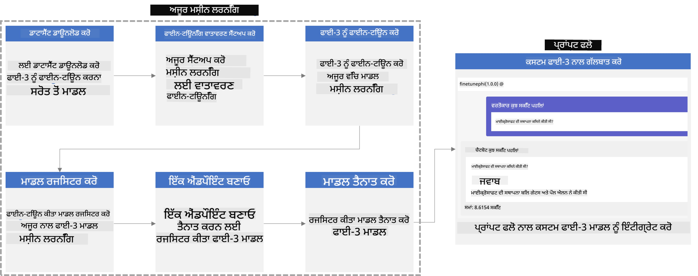

### ਟੇਬਲ ਆਫ਼ ਕੋਂਟੈਂਟਸ

1. **[ਸਿਨਾਰਿਓ 1: ਅਜ਼ੂਰ ਸਰੋਤ ਸੈਟਅੱਪ ਅਤੇ ਫਾਇਨ-ਟਿਊਨਿੰਗ ਲਈ ਤਿਆਰੀ](../../../../../../md/02.Application/01.TextAndChat/Phi3)**
    - [ਅਜ਼ੂਰ ਮਸ਼ੀਨ ਲਰਨਿੰਗ ਵਰਕਸਪੇਸ ਬਣਾਓ](../../../../../../md/02.Application/01.TextAndChat/Phi3)
    - [ਅਜ਼ੂਰ ਸਬਸਕ੍ਰਿਪਸ਼ਨ ਵਿੱਚ GPU ਕੋਟਾ ਦੀ ਬੇਨਤੀ ਕਰੋ](../../../../../../md/02.Application/01.TextAndChat/Phi3)
    - [ਰੋਲ ਅਸਾਈਨਮੈਂਟ ਸ਼ਾਮਲ ਕਰੋ](../../../../../../md/02.Application/01.TextAndChat/Phi3)
    - [ਪਰੋਜੈਕਟ ਸੈਟਅੱਪ ਕਰੋ](../../../../../../md/02.Application/01.TextAndChat/Phi3)
    - [ਫਾਇਨ-ਟਿਊਨਿੰਗ ਲਈ ਡੇਟਾਸੈੱਟ ਤਿਆਰ ਕਰੋ](../../../../../../md/02.Application/01.TextAndChat/Phi3)

1. **[ਸਿਨਾਰਿਓ 2: Phi-3 ਮਾਡਲ ਨੂੰ ਫਾਇਨ-ਟਿਊਨ ਕਰੋ ਅਤੇ ਅਜ਼ੂਰ ਮਸ਼ੀਨ ਲਰਨਿੰਗ ਸਟੂਡੀਓ ਵਿੱਚ ਡਿਪਲੋਇ ਕਰੋ](../../../../../../md/02.Application/01.TextAndChat/Phi3)**
    - [ਅਜ਼ੂਰ CLI ਸੈਟਅੱਪ ਕਰੋ](../../../../../../md/02.Application/01.TextAndChat/Phi3)
    - [Phi-3 ਮਾਡਲ ਨੂੰ ਫਾਇਨ-ਟਿਊਨ ਕਰੋ](../../../../../../md/02.Application/01.TextAndChat/Phi3)
    - [ਫਾਇਨ-ਟਿਊਨ ਕੀਤੇ ਮਾਡਲ ਨੂੰ ਡਿਪਲੋਇ ਕਰੋ](../../../../../../md/02.Application/01.TextAndChat/Phi3)

1. **[ਸਿਨਾਰਿਓ 3: ਪ੍ਰਾਂਪਟ ਫਲੋ ਨਾਲ ਏਕਤ੍ਰੀਕਰਨ ਕਰੋ ਅਤੇ ਆਪਣੇ ਕਸਟਮ ਮਾਡਲ ਨਾਲ ਗੱਲਬਾਤ ਕਰੋ](../../../../../../md/02.Application/01.TextAndChat/Phi3)**
    - [ਕਸਟਮ Phi-3 ਮਾਡਲ ਨੂੰ ਪ੍ਰਾਂਪਟ ਫਲੋ ਨਾਲ ਏਕਤ੍ਰੀਕਰਨ ਕਰੋ](../../../../../../md/02.Application/01.TextAndChat/Phi3)
    - [ਆਪਣੇ ਕਸਟਮ ਮਾਡਲ ਨਾਲ ਗੱਲਬਾਤ ਕਰੋ](../../../../../../md/02.Application/01.TextAndChat/Phi3)

## ਸਿਨਾਰਿਓ 1: ਅਜ਼ੂਰ ਸਰੋਤ ਸੈਟਅੱਪ ਅਤੇ ਫਾਇਨ-ਟਿਊਨਿੰਗ ਲਈ ਤਿਆਰੀ

### ਅਜ਼ੂਰ ਮਸ਼ੀਨ ਲਰਨਿੰਗ ਵਰਕਸਪੇਸ ਬਣਾਓ

1. ਪੋਰਟਲ ਪੇਜ ਦੇ ਊਪਰਲੇ ਹਿੱਸੇ ਵਿੱਚ **search bar** ਵਿੱਚ *azure machine learning* ਟਾਈਪ ਕਰੋ ਅਤੇ ਜੋ ਵਿਕਲਪ ਆਉਂਦੇ ਹਨ ਉਹਨਾਂ ਵਿੱਚੋਂ **Azure Machine Learning** ਚੁਣੋ।

    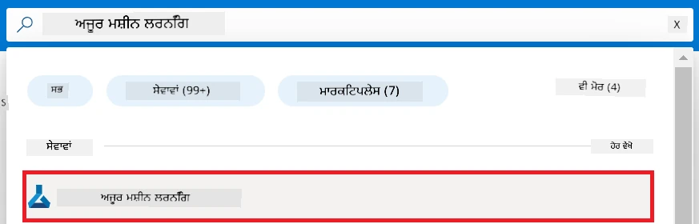

1. ਨੈਵੀਗੇਸ਼ਨ ਮੇਨੂ ਤੋਂ **+ Create** ਚੁਣੋ।

1. ਨੈਵੀਗੇਸ਼ਨ ਮੇਨੂ ਤੋਂ **New workspace** ਚੁਣੋ।

    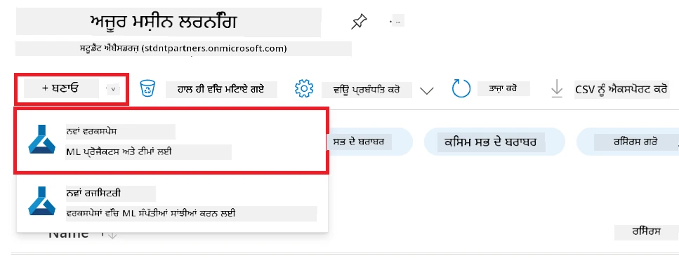

1. ਹੇਠਲੇ ਕੰਮ ਕਰੋ:

    - ਆਪਣੀ ਅਜ਼ੂਰ **Subscription** ਚੁਣੋ।
    - ਵਰਤਣ ਲਈ **Resource group** ਚੁਣੋ (ਜਰੂਰਤ ਪਏ ਤਾਂ ਨਵਾਂ ਬਣਾ ਲੋ)।
    - **Workspace Name** ਦਿਓ। ਇਹ ਇੱਕ ਵਿਲੱਖਣ ਮੁੱਲ ਹੋਣਾ ਚਾਹੀਦਾ ਹੈ।
    - ਵਰਤਣ ਵਾਲਾ **Region** ਚੁਣੋ।
    - ਵਰਤਣ ਲਈ **Storage account** ਚੁਣੋ (ਨਵਾਂ ਬਣਾਉਣ ਦੀ ਲੋੜ ਪਏ ਤਾਂ)।
    - ਵਰਤਣ ਲਈ **Key vault** ਚੁਣੋ (ਨਵਾਂ ਬਣਾਉਣ ਦੀ ਲੋੜ ਪਏ ਤਾਂ)।
    - ਵਰਤਣ ਲਈ **Application insights** ਚੁਣੋ (ਨਵਾਂ ਬਣਾਉਣ ਦੀ ਲੋੜ ਪਏ ਤਾਂ)।
    - ਵਰਤਣ ਲਈ **Container registry** ਚੁਣੋ (ਨਵਾਂ ਬਣਾਉਣ ਦੀ ਲੋੜ ਪਏ ਤਾਂ)।

    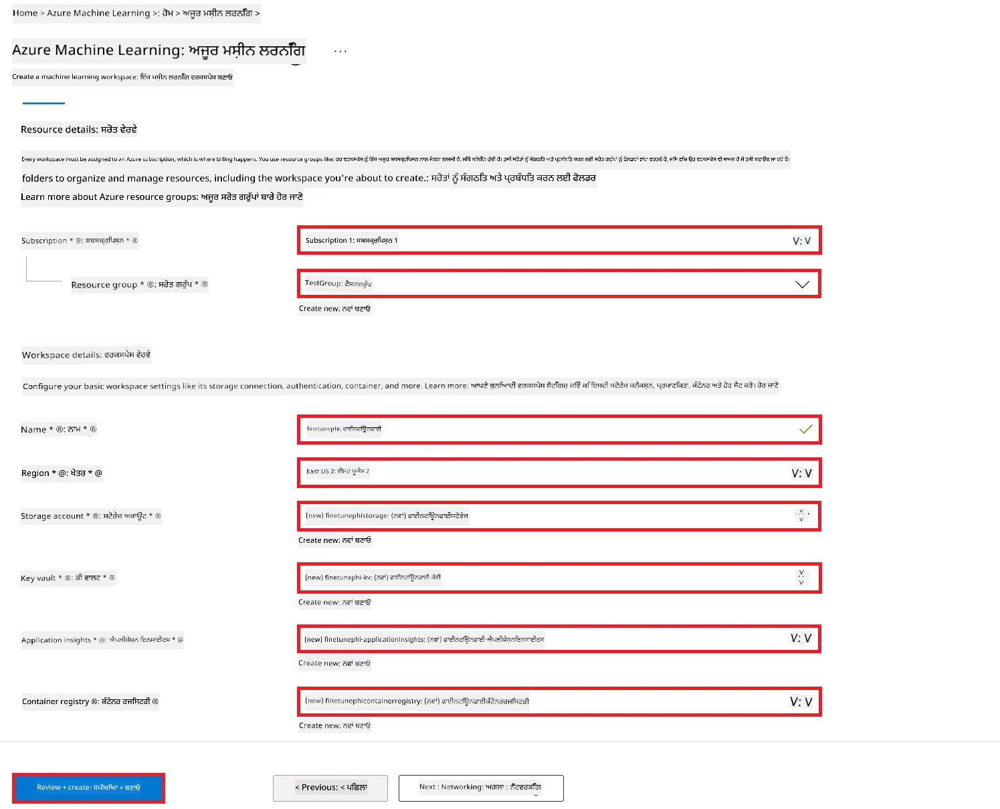

1. **Review + Create** ਚੁਣੋ।

1. **Create** ਚੁਣੋ।

### ਅਜ਼ੂਰ ਸਬਸਕ੍ਰਿਪਸ਼ਨ ਵਿੱਚ GPU ਕੋਟਾ ਦੀ ਬੇਨਤੀ ਕਰੋ

ਇਸ E2E ਸੈਂਪਲ ਵਿੱਚ, ਤੁਸੀਂ ਫਾਇਨ-ਟਿਊਨਿੰਗ ਲਈ *Standard_NC24ads_A100_v4 GPU* ਦੀ ਵਰਤੋਂ ਕਰੋਗੇ, ਜਿਸ ਲਈ ਕੋਟਾ ਦੀ ਬੇਨਤੀ ਲਾਜ਼ਮੀ ਹੈ, ਅਤੇ ਡਿਪਲੋਇਮੈਂਟ ਲਈ *Standard_E4s_v3* CPU ਦੀ ਵਰਤੋਂ ਕਰੋਗੇ, ਜਿਸ ਲਈ ਕੋਈ ਕੋਟਾ ਬੇਨਤੀ ਜਰੂਰੀ ਨਹੀਂ।

> [!NOTE]
>
> ਸਿਰਫ਼ Pay-As-You-Go ਸਬਸਕ੍ਰਿਪਸ਼ਨ (ਮਿਆਰੀ ਸਬਸਕ੍ਰਿਪਸ਼ਨ ਕਿਸਮ) GPU ਅਲੋਕੇਸ਼ਨ ਲਈ ਯੋਗ ਹਨ; ਬਿਨੈਤੀ ਸਬਸਕ੍ਰਿਪਸ਼ਨ ਇਸ ਸਮੇਂ ਸਹਾਇਕ ਨਹੀਂ ਹਨ।
>
> ਜਿਹੜੇ ਵਿਅਕਤੀ ਬਿਨੈਤੀ ਸਬਸਕ੍ਰਿਪਸ਼ਨ (ਜਿਵੇਂ ਕਿ Visual Studio Enterprise Subscription) ਵਰਤ ਰਹੇ ਹਨ ਜਾਂ ਤੇਜ਼ੀ ਨਾਲ ਫਾਇਨ-ਟਿਊਨਿੰਗ ਅਤੇ ਡਿਪਲੋਇਮੈਂਟ ਪ੍ਰਕਿਰਿਆ ਦੀ ਪੜਤਾਲ ਕਰਨਾ ਚਾਹੁੰਦੇ ਹਨ, ਇਸ ਟਿਊਟੋਰਿਯਲ ਵਿੱਚ CPU ਦੀ ਵਰਤੋਂ ਨਾਲ ਕਮ ਡੇਟਾਸੈੱਟ ਲਈ ਫਾਇਨ-ਟਿਊਨਿੰਗ ਲਈ ਵੀ ਮਦਦ ਦਿੱਤੀ ਗਈ ਹੈ। ਪਰ, ਇਹ ਜ਼ਰੂਰੀ ਹੈ ਕਿ ਵੱਡੇ ਡੇਟਾਸੈੱਟਸ ਨਾਲ GPU ਦੀ ਵਰਤੋਂ ਕਰਕੇ ਫਾਇਨ-ਟਿਊਨਿੰਗ ਦੇ ਨਤੀਜੇ ਕਾਫੀ ਬਿਹਤਰ ਹੁੰਦੇ ਹਨ।

1. [Azure ML Studio](https://ml.azure.com/home?wt.mc_id=studentamb_279723) 'ਤੇ ਜਾਓ।

1. *Standard NCADSA100v4 Family* ਕੋਟਾ ਦੀ ਬੇਨਤੀ ਕਰਨ ਲਈ ਹੇਠਾਂ ਦਿੱਤੇ ਕੰਮ ਕਰੋ:

    - ਖੱਬੇ ਪਾਸੇ ਟੈਬ ਤੋਂ **Quota** ਚੁਣੋ।
    - ਵਰਤਣ ਲਈ **Virtual machine family** ਚੁਣੋ। ਉਦਾਹਰਣ ਵਜੋਂ, **Standard NCADSA100v4 Family Cluster Dedicated vCPUs** ਚੁਣੋ, ਜਿਸ ਵਿੱਚ *Standard_NC24ads_A100_v4* GPU ਸ਼ਾਮਲ ਹੈ।
    - ਨੈਵੀਗੇਸ਼ਨ ਮੇਨੂ ਤੋਂ **Request quota** ਚੁਣੋ।

        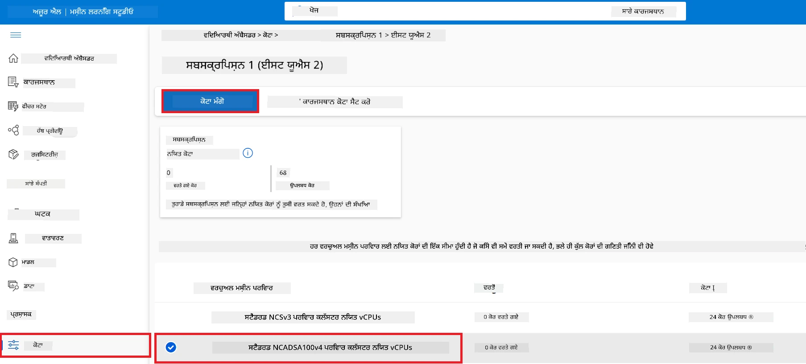

    - Request quota ਪੇਜ ਵਿੱਚ, ਤੁਸੀਂ ਵਰਤਣਾ ਚਾਹੁੰਦੇ ਹੋ ਉਹ **New cores limit** ਦਿਓ। ਜਿਵੇਂ, 24।
    - Request quota ਪੇਜ ਵਿੱਚ, GPU ਕੋਟਾ ਦੀ ਬੇਨਤੀ ਲਈ **Submit** ਕਰੋ।

> [!NOTE]
> ਤੁਸੀਂ ਆਪਣੀਆਂ ਜਰੂਰਤਾਂ ਅਨੁਸਾਰ [Azure ਵਿੱਚ ਵਰਚੁਅਲ ਮਸ਼ੀਨਾਂ ਦੇ ਆਕਾਰ](https://learn.microsoft.com/azure/virtual-machines/sizes/overview?tabs=breakdownseries%2Cgeneralsizelist%2Ccomputesizelist%2Cmemorysizelist%2Cstoragesizelist%2Cgpusizelist%2Cfpgasizelist%2Chpcsizelist) ਦਸਤਾਵੇਜ਼ ਨੂੰ ਦੇਖ ਕੇ ਉਚਿਤ GPU ਜਾਂ CPU ਚੁਣ ਸਕਦੇ ਹੋ।

### ਰੋਲ ਅਸਾਈਨਮੈਂਟ ਸ਼ਾਮਲ ਕਰੋ

ਆਪਣੇ ਮਾਡਲਾਂ ਨੂੰ ਫਾਇਨ-ਟਿਊਨ ਅਤੇ ਡਿਪਲੋਇ ਕਰਨ ਲਈ, ਪਹਿਲਾਂ ਤੁਹਾਨੂੰ ਇੱਕ ਯੂਜ਼ਰ ਅਸਾਈਨਡ ਮੈਨੇਜਡ ਆਈਡੈਂਟਿਟੀ (UAI) ਬਣਾਉਣੀ ਹੋਵੇਗੀ ਅਤੇ ਉਸਨੂੰ ਉਚਿਤ ਅਧਿਕਾਰ ਦਿੱਤੇ ਜਾਣਗੇ। ਇਹ UAI ਡਿਪਲੋਇਮੈਂਟ ਦੌਰਾਨ ਪ੍ਰਮਾਣੀਕਰਨ ਲਈ ਵਰਤੀ ਜਾਵੇਗੀ।

#### ਯੂਜ਼ਰ ਅਸਾਈਨਡ ਮੈਨੇਜਡ ਆਈਡੈਂਟਿਟੀ (UAI) ਬਣਾਓ

1. ਪੋਰਟਲ ਪੇਜ ਦੇ ਊਪਰਲੇ ਹਿੱਸੇ **search bar** ਵਿੱਚ *managed identities* ਟਾਈਪ ਕਰੋ ਅਤੇ ਜੋ ਵਿਕਲਪ ਆਉਂਦੇ ਹਨ ਉਹਨਾਂ ਵਿੱਚੋਂ **Managed Identities** ਚੁਣੋ।

    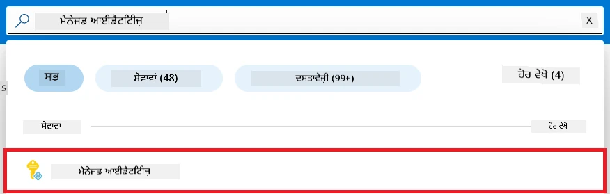

1. **+ Create** ਚੁਣੋ।

    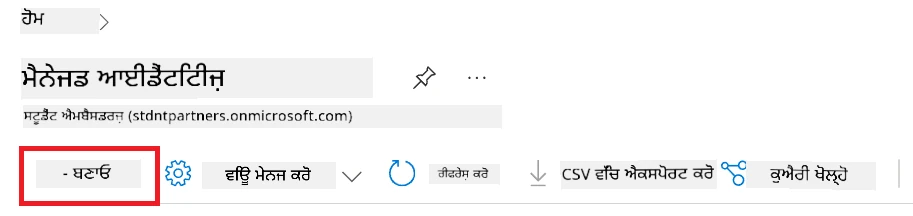

1. ਹੇਠਲੇ ਕੰਮ ਕਰੋ:

    - ਆਪਣੀ ਅਜ਼ੂਰ **Subscription** ਚੁਣੋ।
    - ਵਰਤਣ ਲਈ **Resource group** ਚੁਣੋ (ਨਵਾਂ ਬਣਾਉਣ ਦੀ ਲੋੜ ਹੋਵੇ ਤਾਂ)।
    - ਵਰਤਣ ਵਾਲਾ **Region** ਚੁਣੋ।
    - **Name** ਦਿਓ। ਇਹ ਇਕ ਵਿਲੱਖਣ ਨਾਮ ਹੋਣਾ ਚਾਹੀਦਾ ਹੈ।

1. **Review + create** ਚੁਣੋ।

1. **+ Create** ਚੁਣੋ।

#### ਮੈਨੇਜਡ ਆਈਡੈਂਟਿਟੀ ਨੂੰ Contributor ਰੋਲ ਅਸਾਈਨਮੈਂਟ ਦਿਓ

1. ਆਪਣੇ ਬਣਾਏ ਗਏ Managed Identity ਸਰੋਤ ਤੇ ਜਾਓ।

1. ਖੱਬੇ ਪਾਸੇ ਟੈਬ ਤੋਂ **Azure role assignments** ਚੁਣੋ।

1. ਨੈਵੀਗੇਸ਼ਨ ਮੇਨੂ ਤੋਂ **+Add role assignment** ਚੁਣੋ।

1. Add role assignment ਪੇਜ ਵਿੱਚ ਹੇਠਾਂ ਦਿੱਤੇ ਕੰਮ ਕਰੋ:
    - **Scope** ਨੂੰ **Resource group** ਤੈਅ ਕਰੋ।
    - ਆਪਣੀ ਅਜ਼ੂਰ **Subscription** ਚੁਣੋ।
    - ਵਰਤਣ ਲਈ **Resource group** ਚੁਣੋ।
    - **Role** ਨੂੰ **Contributor** ਚੁਣੋ।

    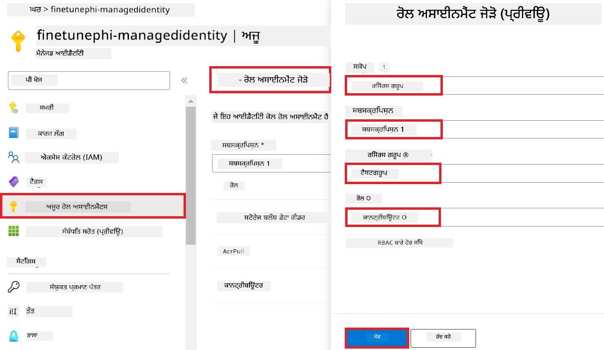

1. **Save** ਕਰੋ।

#### ਮੈਨੇਜਡ ਆਈਡੈਂਟਿਟੀ ਨੂੰ Storage Blob Data Reader ਰੋਲ ਦਿਓ

1. ਪੋਰਟਲ ਦੇ ਊਪਰਲੇ ਹਿੱਸੇ ਵਿਚ **search bar** ਵਿੱਚ *storage accounts* ਟਾਈਪ ਕਰੋ ਅਤੇ ਜੋ ਵਿਕਲਪ ਆਉਂਦੇ ਹਨ ਉਹਨਾਂ ਵਿੱਚੋਂ **Storage accounts** ਚੁਣੋ।

    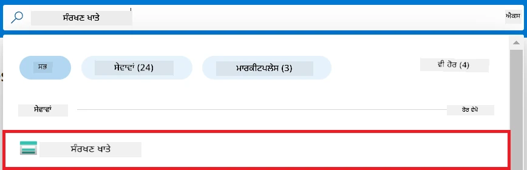

1. ਉਸ ਸਟੋਰੇਜ਼ ਖਾਤੇ ਨੂੰ ਚੁਣੋ ਜੋ ਤੁਹਾਡੇ ਅਜ਼ੂਰ ਮਸ਼ੀਨ ਲਰਨਿੰਗ ਵਰਕਸਪੇਸ ਨਾਲ ਸੰਬੰਧਿਤ ਹੈ। ਉਦਾਹਰਣ ਵਜੋਂ, *finetunephistorage*।

1. Add role assignment ਪੇਜ ਤੱਕ ਪਹੁੰਚਣ ਲਈ ਹੇਠਾਂ ਦਿਖਾਏ ਕੰਮ ਕਰੋ:

    - ਉਸ Azure Storage account 'ਤੇ ਜਾਓ ਜੋ ਤੁਸੀਂ ਬਣਾਇਆ ਹੈ।
    - ਖੱਬੇ ਪਾਸੇ ਟੈਬ ਤੋਂ **Access Control (IAM)** ਚੁਣੋ।
    - ਨੈਵੀਗੇਸ਼ਨ ਮੇਨੂ ਤੋਂ **+ Add** ਚੁਣੋ।
    - ਫਿਰ **Add role assignment** ਚੁਣੋ।

    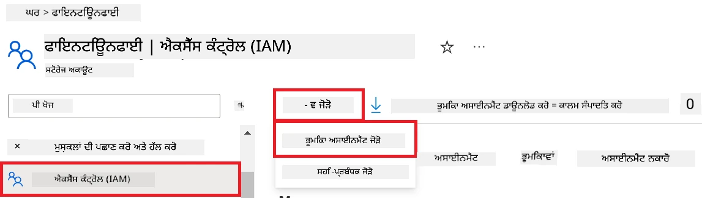

1. Add role assignment ਪੇਜ ਵਿੱਚ ਹੇਠਾਂ ਦੱਸਿਆ ਕੰਮ ਕਰੋ:

    - Role ਪੇਜ ਵਿੱਚ, **search bar** ਵਿੱਚ *Storage Blob Data Reader* ਟਾਈਪ ਕਰੋ ਅਤੇ ਜੋ ਵਿਕਲਪ ਆਉਂਦੇ ਹਨ ਉਹਨਾਂ ਵਿੱਚੋਂ **Storage Blob Data Reader** ਚੁਣੋ।
    - Role ਪੇਜ ਵਿੱਚ, **Next** ਚੁਣੋ।
    - Members ਪੇਜ ਵਿੱਚ, **Assign access to** 'ਤੇ **Managed identity** ਚੁਣੋ।
    - Members ਪੇਜ ਵਿੱਚ, **+ Select members** ਚੁਣੋ।
    - Select managed identities ਪੇਜ ਵਿੱਚ, ਆਪਣੀ ਅਜ਼ੂਰ **Subscription** ਚੁਣੋ।
    - Select managed identities ਪੇਜ ਵਿੱਚ, **Managed identity** ਤਹਿਥਾਂ **Manage Identity** ਚੁਣੋ।
    - Select managed identities ਪੇਜ ਵਿੱਚ, ਜਿਸ Managed Identity ਨੂੰ ਤੁਸੀਂ ਬਣਾਇਆ ਹੈ ਉਹ ਚੁਣੋ। ਉਦਾਹਰਣ ਵਜੋਂ, *finetunephi-managedidentity*।
    - Select managed identities ਪੇਜ ਵਿੱਚ, **Select** ਚੁਣੋ।

    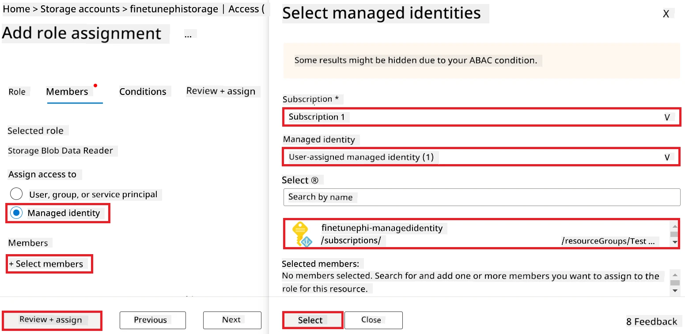

1. **Review + assign** ਚੁਣੋ।

#### ਮੈਨੇਜਡ ਆਈਡੈਂਟਿਟੀ ਨੂੰ AcrPull ਰੋਲ ਦਿਓ

1. ਪੋਰਟਲ ਦੇ ਊਪਰਲੇ ਹਿੱਸੇ ਵਿੱਚ **search bar** ਵਿੱਚ *container registries* ਟਾਈਪ ਕਰੋ ਅਤੇ ਜੋ ਵਿਕਲਪ ਆਉਂਦੇ ਹਨ ਉਹਨਾਂ ਵਿੱਚੋਂ **Container registries** ਚੁਣੋ।

    

1. ਉਸ Container Registry ਨੂੰ ਚੁਣੋ ਜੋ ਅਜ਼ੂਰ ਮਸ਼ੀਨ ਲਰਨਿੰਗ ਵਰਕਸਪੇਸ ਨਾਲ ਜੁੜੀ ਹੈ। ਉਦਾਹਰਣ ਵਜੋਂ, *finetunephicontainerregistries*।

1. Add role assignment ਪੇਜ ਤੱਕ ਪਹੁੰਚਣ ਲਈ ਹੇਠਾਂ ਦਿੱਤੇ ਕੰਮ ਕਰੋ:

    - ਖੱਬੇ ਪਾਸੇ ਟੈਬ ਤੋਂ **Access Control (IAM)** ਚੁਣੋ।
    - ਨੈਵੀਗੇਸ਼ਨ ਮੇਨੂ ਤੋਂ **+ Add** ਚੁਣੋ।
    - ਫਿਰ **Add role assignment** ਚੁਣੋ।

1. Add role assignment ਪੇਜ ਵਿੱਚ ਹੇਠਾਂ ਦੱਸੇ ਕੰਮ ਕਰੋ:

    - Role ਪੇਜ ਵਿੱਚ, **search bar** ਵਿੱਚ *AcrPull* ਟਾਈਪ ਕਰੋ ਅਤੇ ਜੋ ਵਿਕਲਪ ਆਉਂਦੇ ਹਨ ਉਹਨਾਂ ਵਿੱਚੋਂ **AcrPull** ਚੁਣੋ।
    - Role ਪੇਜ ਵਿੱਚ, **Next** ਚੁਣੋ।
    - Members ਪੇਜ ਵਿੱਚ, **Assign access to** 'ਤੇ **Managed identity** ਚੁਣੋ।
    - Members ਪੇਜ ਵਿੱਚ, **+ Select members** ਚੁਣੋ।
    - Select managed identities ਪੇਜ ਵਿੱਚ, ਆਪਣੀ ਅਜ਼ੂਰ **Subscription** ਚੁਣੋ।
    - Select managed identities ਪੇਜ ਵਿੱਚ, **Managed identity** ਤਹਿਥਾਂ **Manage Identity** ਚੁਣੋ।
    - Select managed identities ਪੇਜ ਵਿੱਚ, ਜਿਸ Managed Identity ਨੂੰ ਤੁਸੀਂ ਬਣਾਇਆ ਹੈ ਉਹ ਚੁਣੋ। ਉਦਾਹਰਣ ਵਜੋਂ, *finetunephi-managedidentity*।
    - Select managed identities ਪੇਜ ਵਿੱਚ, **Select** ਚੁਣੋ।
    - **Review + assign** ਚੁਣੋ।

### ਪਰੋਜੈਕਟ ਸੈਟਅੱਪ ਕਰੋ

ਹੁਣ, ਤੁਸੀਂ ਕੰਮ ਕਰਨ ਲਈ ਇੱਕ ਫੋਲਡਰ ਬਣਾਉਗੇ ਅਤੇ ਇੱਕ ਵਰਚੁਅਲ ਵਾਤਾਵਰਣ ਸੈਟਅੱਪ ਕਰੋਗੇ ਤਾਂ ਜੋ ਇੱਕ ਐਪ ਬਣਾਈ ਜਾ ਸਕੇ ਜੋ ਉਪਭੋਗਤਿਆਂ ਨਾਲ ਇੰਟਰਐਕਟ ਕਰੇ ਅਤੇ ਅਜ਼ੂਰ ਕੋਸਮੋਸ DB ਵਿੱਚ ਸਟੋਰ ਕੀਤੀ ਗਈ ਗੱਲਬਾਤ ਇਤਿਹਾਸ ਤੋਂ ਪ੍ਰਭਾਵਿਤ ਜਵਾਬ ਦੇਵੇ।

#### ਕੰਮ ਕਰਨ ਲਈ ਇੱਕ ਫੋਲਡਰ ਬਣਾਉ

1. ਟਰਮੀਨਲ ਵਿੰਡੋ ਖੋਲ੍ਹੋ ਅਤੇ ਡਿਫਾਲਟ ਪਾਥ ਵਿੱਚ *finetune-phi* ਨਾਮ ਦਾ ਫੋਲਡਰ ਬਣਾਉਣ ਲਈ ਹੇਠਾਂ ਦਿੱਤਾ ਅਦੇਸ਼ ਟਾਈਪ ਕਰੋ:

    ```console
    mkdir finetune-phi
    ```

1. ਆਪਣੇ ਟਰਮੀਨਲ ਵਿੱਚ ਹੇਠਾਂ ਦਿੱਤਾ ਅਦੇਸ਼ ਟਾਈਪ ਕਰੋ ਤਾਂ ਜੋ ਬਣਾਇਆ ਗਿਆ *finetune-phi* ਫੋਲਡਰ ਵਿੱਚ ਜਾ ਸਕੋ:

    ```console
    cd finetune-phi
    ```

#### ਵਰਚੁਅਲ ਵਾਤਾਵਰਣ ਬਣਾਓ

1. ਆਪਣੇ ਟਰਮੀਨਲ ਵਿੱਚ ਹੇਠਾਂ ਦਿੱਤਾ ਅਦੇਸ਼ ਟਾਈਪ ਕਰਕੇ *.venv* ਨਾਮ ਦਾ ਵਰਚੁਅਲ ਵਾਤਾਵਰਣ ਬਣਾਓ।

    ```console
    python -m venv .venv
    ```

1. ਆਪਣੇ ਟਰਮੀਨਲ ਵਿੱਚ ਹੇਠਾਂ ਦਿੱਤਾ ਅਦੇਸ਼ ਟਾਈਪ ਕਰਕੇ ਵਰਚੁਅਲ ਵਾਤਾਵਰਣ ਨੂੰ ਸਰਗਰਮ ਕਰੋ।

    ```console
    .venv\Scripts\activate.bat
    ```

> [!NOTE]
>
> ਜੇ ਇਹ ਸਫਲ ਹੋਇਆ, ਤਾਂ ਕਮਾਂਡ ਪ੍ਰੋਂਪਟ ਤੋਂ ਪਹਿਲਾਂ *(.venv)* ਵੇਖਨਾ ਚਾਹੀਦਾ ਹੈ।

#### ਲੋੜੀਂਦੇ ਪੈਕੇਜਾਂ ਦਾਖਲ ਕਰੋ

1. ਆਪਣੇ ਟਰਮੀਨਲ ਵਿੱਚ ਹੇਠਾਂ ਦਿੱਤੇ ਕਮਾਂਡਾਂ ਟਾਈਪ ਕਰਕੇ ਲੋੜੀਂਦੇ ਪੈਕੇਜਾਂ ਇੰਸਟਾਲ ਕਰੋ।

    ```console
    pip install datasets==2.19.1
    pip install transformers==4.41.1
    pip install azure-ai-ml==1.16.0
    pip install torch==2.3.1
    pip install trl==0.9.4
    pip install promptflow==1.12.0
    ```

#### ਪ੍ਰੋਜੈਕਟ ਫਾਈਲਾਂ ਬਣਾਓ
ਇਸ ਅਭਿਆਸ ਵਿੱਚ, ਤੁਸੀਂ ਸਾਡੇ ਪ੍ਰੋਜੈਕਟ ਲਈ ਜਰੂਰੀ ਫਾਈਲਾਂ ਬਣਾਉਣਗੇ। ਇਹ ਫਾਈਲਾਂ ਵਿੱਚ ਡੇਟਾਸੈੱਟ ਡਾਊਨਲੋਡ ਕਰਨ ਲਈ ਸਕ੍ਰਿਪਟਾਂ, ਏਜ਼ੂਅਰ ਮਸ਼ੀਨ ਲਰਨਿੰਗ ਵਾਤਾਵਰਣ ਸੈੱਟ ਕਰਨ ਲਈ, Phi-3 ਮਾਡਲ ਨੂੰ ਫਾਈਨ-ਟਿਊਨ ਕਰਨ ਲਈ ਅਤੇ ਫਾਈਨ-ਟਿਊਨ ਕੀਤੇ ਮਾਡਲ ਨੂੰ ਡਿਪਲੋਅ ਕਰਨ ਲਈ ਸਕ੍ਰਿਪਟ ਸ਼ਾਮਲ ਹਨ। ਤੁਸੀਂ ਫਾਈਨ-ਟਿਊਨਿੰਗ ਵਾਤਾਵਰਣ ਸੈੱਟ ਕਰਨ ਲਈ ਇੱਕ *conda.yml* ਫਾਈਲ ਵੀ ਬਣਾਵੋਗੇ।

ਇਸ ਅਭਿਆਸ ਵਿੱਚ, ਤੁਸੀਂ:

- ਡੇਟਾਸੈੱਟ ਡਾਊਨਲੋਡ ਕਰਨ ਲਈ *download_dataset.py* ਫਾਈਲ ਬਣਾਵੋਗੇ।
- ਏਜ਼ੂਅਰ ਮਸ਼ੀਨ ਲਰਨਿੰਗ ਵਾਤਾਵਰਣ ਸੈੱਟ ਕਰਨ ਲਈ *setup_ml.py* ਫਾਈਲ ਬਣਾਵੋਗੇ।
- *finetuning_dir* ਫੋਲਡਰ ਵਿੱਚ *fine_tune.py* ਫਾਈਲ ਬਣਾਉਗੇ ਜੋ ਡੇਟਾਸੈੱਟ ਦੀ ਵਰਤੋਂ ਕਰਕੇ Phi-3 ਮਾਡਲ ਨੂੰ ਫਾਈਨ-ਟਿਊਨ ਕਰੇਗੀ।
- ਫਾਈਨ-ਟਿਊਨਿੰਗ ਵਾਤਾਵਰਣ ਸੈੱਟ ਕਰਨ ਲਈ *conda.yml* ਫਾਈਲ ਬਣਾਵੋਗੇ।
- ਫਾਈਨ-ਟਿਊਨ ਕੀਤੇ ਮਾਡਲ ਨੂੰ ਡਿਪਲੋਅ ਕਰਨ ਲਈ *deploy_model.py* ਫਾਈਲ ਬਣਾਵੋਗੇ।
- ਫਾਈਨ-ਟਿਊਨ ਕੀਤੇ ਮਾਡਲ ਨੂੰ ਇੱਕਠਾ ਕਰਨ ਅਤੇ Prompt flow ਦੀ ਵਰਤੋਂ ਕਰਕੇ ਮਾਡਲ ਚਲਾਉਣ ਲਈ *integrate_with_promptflow.py* ਫਾਈਲ ਬਣਾਵੋਗੇ।
- Prompt flow ਲਈ ਵਰਕਫਲੋ ਸੰਰਚਨਾ ਸੈੱਟ ਕਰਨ ਲਈ flow.dag.yml ਫਾਈਲ ਬਣਾਵੋਗੇ।
- ਏਜ਼ੂਅਰ ਜਾਣਕਾਰੀ ਦਰਜ ਕਰਨ ਲਈ *config.py* ਫਾਈਲ ਬਣਾਵੋਗੇ।

> [!NOTE]
>
> ਪੂਰੀ ਫੋਲਡਰ ਸੰਰਚਨਾ:
>
> ```text
> └── YourUserName
> .    └── finetune-phi
> .        ├── finetuning_dir
> .        │      └── fine_tune.py
> .        ├── conda.yml
> .        ├── config.py
> .        ├── deploy_model.py
> .        ├── download_dataset.py
> .        ├── flow.dag.yml
> .        ├── integrate_with_promptflow.py
> .        └── setup_ml.py
> ```

1. **Visual Studio Code** ਖੋਲ੍ਹੋ।

1. ਮੈਨੂ ਬਾਰ ਤੋਂ **File** ਚੁਣੋ।

1. **Open Folder** ਚੁਣੋ।

1. ਆਪਣੇ ਬਣਾਏ *finetune-phi* ਫੋਲਡਰ ਨੂੰ ਚੁਣੋ, ਜੋ *C:\Users\yourUserName\finetune-phi* ਵਿੱਚ ਸਥਿਤ ਹੈ।

    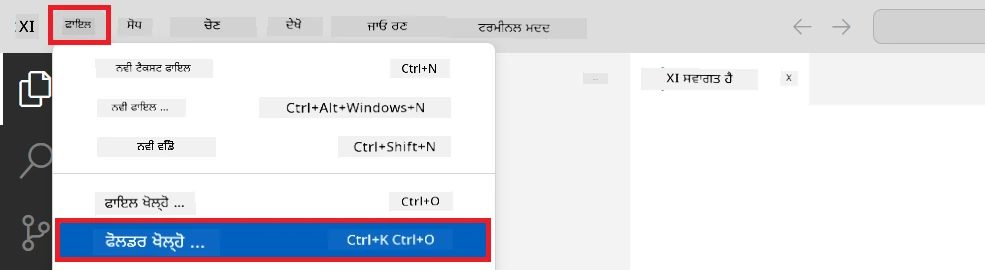

1. Visual Studio Code ਦੇ ਖੱਬੇ ਪੈਨ ਵਿੱਚ, ਸੱਜਾ ਕਲਿੱਕ ਕਰਕੇ **New File** ਚੁਣੋ ਅਤੇ ਨਵੀਂ ਫਾਈਲ *download_dataset.py* ਬਣਾਓ।

1. Visual Studio Code ਦੇ ਖੱਬੇ ਪੈਨ ਵਿੱਚ, ਸੱਜਾ ਕਲਿੱਕ ਕਰਕੇ **New File** ਚੁਣੋ ਅਤੇ ਨਵੀਂ ਫਾਈਲ *setup_ml.py* ਬਣਾਓ।

1. Visual Studio Code ਦੇ ਖੱਬੇ ਪੈਨ ਵਿੱਚ, ਸੱਜਾ ਕਲਿੱਕ ਕਰਕੇ **New File** ਚੁਣੋ ਅਤੇ ਨਵੀਂ ਫਾਈਲ *deploy_model.py* ਬਣਾਓ।

    

1. Visual Studio Code ਦੇ ਖੱਬੇ ਪੈਨ ਵਿੱਚ, ਸੱਜਾ ਕਲਿੱਕ ਕਰਕੇ **New Folder** ਚੁਣੋ ਅਤੇ *finetuning_dir* ਨਾਮਕ ਨਵਾਂ ਫੋਲਡਰ ਬਣਾਓ।

1. *finetuning_dir* ਫੋਲਡਰ ਵਿੱਚ, *fine_tune.py* ਨਾਂ ਦੀ ਨਵੀਂ ਫਾਈਲ ਬਣਾਓ।

#### *conda.yml* ਫਾਈਲ ਬਣਾਓ ਅਤੇ ਸੰਰਚਿਤ ਕਰੋ

1. Visual Studio Code ਦੇ ਖੱਬੇ ਪੈਨ ਵਿੱਚ, ਸੱਜਾ ਕਲਿੱਕ ਕਰਕੇ **New File** ਚੁਣੋ ਅਤੇ *conda.yml* ਨਾਂ ਦੀ ਨਵੀਂ ਫਾਈਲ ਬਣਾਓ।

1. *conda.yml* ਫਾਈਲ ਵਿੱਚ ਹੇਠਾਂ ਦਿੱਤਾ ਕੋਡ ਸ਼ਾਮਲ ਕਰੋ ਜਿਵੇਂ ਕਿ Phi-3 ਮਾਡਲ ਲਈ ਫਾਈਨ-ਟਿਊਨਿੰਗ ਵਾਤਾਵਰਣ ਸੈੱਟ ਕਰਨ ਲਈ।

    ```yml
    name: phi-3-training-env
    channels:
      - defaults
      - conda-forge
    dependencies:
      - python=3.10
      - pip
      - numpy<2.0
      - pip:
          - torch==2.4.0
          - torchvision==0.19.0
          - trl==0.8.6
          - transformers==4.41
          - datasets==2.21.0
          - azureml-core==1.57.0
          - azure-storage-blob==12.19.0
          - azure-ai-ml==1.16
          - azure-identity==1.17.1
          - accelerate==0.33.0
          - mlflow==2.15.1
          - azureml-mlflow==1.57.0
    ```

#### *config.py* ਫਾਈਲ ਬਣਾਓ ਅਤੇ ਸੰਰਚਿਤ ਕਰੋ

1. Visual Studio Code ਦੇ ਖੱਬੇ ਪੈਨ ਵਿੱਚ, ਸੱਜਾ ਕਲਿੱਕ ਕਰਕੇ **New File** ਚੁਣੋ ਅਤੇ *config.py* ਨਾਂ ਦੀ ਨਵੀਂ ਫਾਈਲ ਬਣਾਓ।

1. ਆਪਣੇ ਏਜ਼ੂਅਰ ਜਾਣਕਾਰੀ ਸ਼ਾਮਲ ਕਰਨ ਲਈ *config.py* ਫਾਈਲ ਵਿੱਚ ਹੇਠਾਂ ਦਿੱਤਾ ਕੋਡ ਸ਼ਾਮਲ ਕਰੋ।

    ```python
    # ਏਜ਼ੂਰੇ ਸੈਟਿੰਗਜ਼
    AZURE_SUBSCRIPTION_ID = "your_subscription_id"
    AZURE_RESOURCE_GROUP_NAME = "your_resource_group_name" # "TestGroup"

    # ਏਜ਼ੂਰੇ ਮਸ਼ੀਨ ਲਰਨਿੰਗ ਸੈਟਿੰਗਜ਼
    AZURE_ML_WORKSPACE_NAME = "your_workspace_name" # "finetunephi-workspace"

    # ਏਜ਼ੂਰੇ ਮੈਨੇਜਡ ਆਈਡੈਂਟਿਟੀ ਸੈਟਿੰਗਜ਼
    AZURE_MANAGED_IDENTITY_CLIENT_ID = "your_azure_managed_identity_client_id"
    AZURE_MANAGED_IDENTITY_NAME = "your_azure_managed_identity_name" # "finetunephi-mangedidentity"
    AZURE_MANAGED_IDENTITY_RESOURCE_ID = f"/subscriptions/{AZURE_SUBSCRIPTION_ID}/resourceGroups/{AZURE_RESOURCE_GROUP_NAME}/providers/Microsoft.ManagedIdentity/userAssignedIdentities/{AZURE_MANAGED_IDENTITY_NAME}"

    # ਡੇਟਾਸੇਟ ਫਾਇਲ ਪਾਥ
    TRAIN_DATA_PATH = "data/train_data.jsonl"
    TEST_DATA_PATH = "data/test_data.jsonl"

    # ਫਾਈਨ-ਟਿਊੰਡ ਮਾਡਲ ਸੈਟਿੰਗਜ਼
    AZURE_MODEL_NAME = "your_fine_tuned_model_name" # "finetune-phi-model"
    AZURE_ENDPOINT_NAME = "your_fine_tuned_model_endpoint_name" # "finetune-phi-endpoint"
    AZURE_DEPLOYMENT_NAME = "your_fine_tuned_model_deployment_name" # "finetune-phi-deployment"

    AZURE_ML_API_KEY = "your_fine_tuned_model_api_key"
    AZURE_ML_ENDPOINT = "your_fine_tuned_model_endpoint_uri" # "https://{your-endpoint-name}.{your-region}.inference.ml.azure.com/score"
    ```

#### ਏਜ਼ੂਅਰ ਵਾਤਾਵਰਣ ਚਲ ਰਿਹਾ ਹੈ ਵੈਰੀਏਬਲਸ ਜੋੜੋ

1. ਏਜ਼ੂਅਰ ਸਬਸਕ੍ਰਿਪਸ਼ਨ ID ਜੋੜਨ ਲਈ ਹੇਠਾਂ ਦਿੱਤੇ ਟਾਸਕ ਕਰੋ:

    - ਪੋਰਟਲ ਪੇਜ ਦੇ ਸਿਰਲੇਖ ਵਿੱਚ **search bar** ਵਿੱਚ *subscriptions* ਲਿਖੋ ਅਤੇ ਆਉਣ ਵਾਲੀਆਂ ਵਿਕਲਪਾਂ ਵਿੱਚੋਂ **Subscriptions** ਚੁਣੋ।
    - ਜਿਹੜੀ ਏਜ਼ੂਅਰ ਸਬਸਕ੍ਰਿਪਸ਼ਨ ਤੁਸੀਂ ਵਰਤ ਰਹੇ ਹੋ ਉਸਨੂੰ ਚੁਣੋ।
    - ਆਪਣੀ ਸਬਸਕ੍ਰਿਪਸ਼ਨ ID ਕਾਪੀ ਕਰਕੇ *config.py* ਫਾਈਲ ਵਿੱਚ ਪੇਸਟ ਕਰੋ।

    

1. ਏਜ਼ੂਅਰ ਵਰਕਸਪੇਸ ਨਾਂ ਜੋੜਨ ਲਈ ਹੇਠਾਂ ਦਿੱਤੇ ਟਾਸਕ ਕਰੋ:

    - ਆਪਣੇ ਬਣਾਏ ਏਜ਼ੂਅਰ ਮਸ਼ੀਨ ਲਰਨਿੰਗ ਸਰੋਤ ਤੱਕ ਜਾਓ।
    - ਆਪਣਾ ਖਾਤਾ ਨਾਂ ਕਾਪੀ ਕਰਕੇ *config.py* ਫਾਈਲ ਵਿੱਚ ਪੇਸਟ ਕਰੋ।

    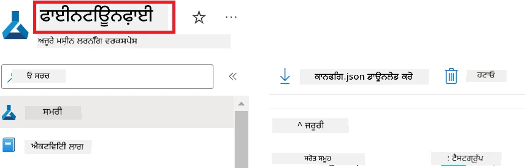

1. ਏਜ਼ੂਅਰ ਰਿਸੋਰਸ ਗਰੁੱਪ ਨਾਂ ਜੋੜਨ ਲਈ ਹੇਠਾਂ ਦਿੱਤੇ ਟਾਸਕ ਕਰੋ:

    - ਆਪਣੇ ਬਣਾਏ ਏਜ਼ੂਅਰ ਮਸ਼ੀਨ ਲਰਨਿੰਗ ਸਰੋਤ ਤੱਕ ਜਾਓ।
    - ਆਪਣਾ ਏਜ਼ੂਅਰ ਰਿਸੋਰਸ ਗਰੁੱਪ ਨਾਂ ਕਾਪੀ ਕਰਕੇ *config.py* ਵਿੱਚ ਪੇਸਟ ਕਰੋ।

    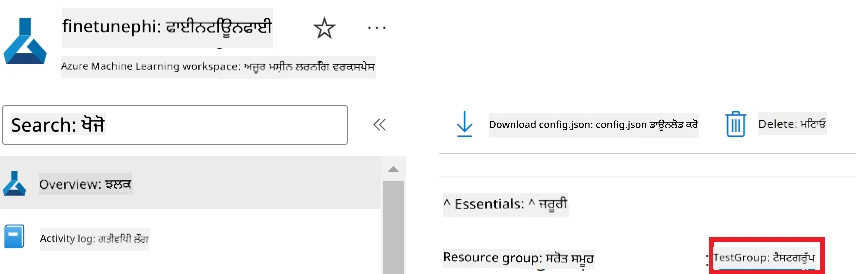

2. ਏਜ਼ੂਅਰ ਮੈਨੇਜਡ ਆਈਡੈਂਟੀਟੀ ਨਾਂ ਜੋੜਨ ਲਈ ਹੇਠਾਂ ਦਿੱਤੇ ਟਾਸਕ ਕਰੋ:

    - ਆਪਣੇ ਬਣਾਏ ਮੈਨੇਜਡ ਆਈਡੈਂਟੀਟੀ ਸਰੋਤ ਤੱਕ ਜਾਓ।
    - ਆਪਣਾ ਏਜ਼ੂਅਰ ਮੈਨੇਜਡ ਆਈਡੈਂਟੀਟੀ ਨਾਂ ਕਾਪੀ ਕਰਕੇ *config.py* ਵਿੱਚ ਪੇਸਟ ਕਰੋ।

    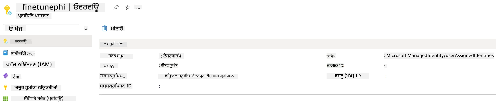

### ਫਾਈਨ-ਟਿਊਨਿੰਗ ਲਈ ਡੇਟਾਸੈੱਟ ਤਿਆਰ ਕਰੋ

ਇਸ ਅਭਿਆਸ ਵਿੱਚ, ਤੁਸੀਂ *download_dataset.py* ਫਾਈਲ ਨੂੰ ਚਲਾਕੇ *ULTRACHAT_200k* ਡੇਟਾਸੈੱਟ ਨੂੰ ਆਪਣੇ ਲੋਕਲ ਵਾਤਾਵਰਣ ਵਿੱਚ ਡਾਊਨਲੋਡ ਕਰੋਗੇ। ਫਿਰ, ਤੁਸੀਂ ਇਸ ਡੇਟਾਸੈੱਟ ਦੀ ਵਰਤੋਂ ਕਰਕੇ Phi-3 ਮਾਡਲ ਨੂੰ Azure ਮਸ਼ੀਨ ਲਰਨਿੰਗ ਵਿੱਚ ਫਾਈਨ-ਟਿਊਨ ਕਰੋਗੇ।

#### *download_dataset.py* ਫਾਈਲ ਦੀ ਵਰਤੋਂ ਕਰਕੇ ਆਪਣਾ ਡੇਟਾਸੈੱਟ ਡਾਊਨਲੋਡ ਕਰੋ

1. Visual Studio Code ਵਿੱਚ *download_dataset.py* ਫਾਈਲ ਖੋਲ੍ਹੋ।

1. *download_dataset.py* ਵਿੱਚ ਹੇਠਾਂ ਦਿੱਤਾ ਕੋਡ ਸ਼ਾਮਲ ਕਰੋ।

    ```python
    import json
    import os
    from datasets import load_dataset
    from config import (
        TRAIN_DATA_PATH,
        TEST_DATA_PATH)

    def load_and_split_dataset(dataset_name, config_name, split_ratio):
        """
        Load and split a dataset.
        """
        # ਦਿੱਤੇ ਗਏ ਨਾਮ, ਸੰਰਚਨਾ ਅਤੇ ਵੰਡ ਅਨੁਪਾਤ ਨਾਲ ਡੇਟਾਸੈੱਟ ਲੋਡ ਕਰੋ
        dataset = load_dataset(dataset_name, config_name, split=split_ratio)
        print(f"Original dataset size: {len(dataset)}")
        
        # ਡੇਟਾਸੈੱਟ ਨੂੰ ਟرين ਅਤੇ ਟੈਸਟ ਸੈਟਾਂ ਵਿੱਚ ਵੰਡੋ (80% ਟرين, 20% ਟੈਸਟ)
        split_dataset = dataset.train_test_split(test_size=0.2)
        print(f"Train dataset size: {len(split_dataset['train'])}")
        print(f"Test dataset size: {len(split_dataset['test'])}")
        
        return split_dataset

    def save_dataset_to_jsonl(dataset, filepath):
        """
        Save a dataset to a JSONL file.
        """
        # ਜੇ ਡਾਇਰੈਕਟਰੀ ਮੌਜੂਦ ਨਾ ਹੋਵੇ ਤਾਂ ਉਸਨੂੰ ਬਣਾਓ
        os.makedirs(os.path.dirname(filepath), exist_ok=True)
        
        # ਫਾਈਲ ਨੂੰ ਲਿਖਾਈ ਮੋਡ ਵਿੱਚ ਖੋਲ੍ਹੋ
        with open(filepath, 'w', encoding='utf-8') as f:
            # ਡੇਟਾਸੈੱਟ ਵਿੱਚ ਹਰ ਇੱਕ ਰਿਕਾਰਡ 'ਤੇ ਦੁਹਰਾਓ
            for record in dataset:
                # ਰਿਕਾਰਡ ਨੂੰ JSON ਵਸਤੂ ਵਜੋਂ ਡੰਪ ਕਰੋ ਅਤੇ ਫਾਈਲ ਵਿੱਚ ਲਿਖੋ
                json.dump(record, f)
                # ਰਿਕਾਰਡ ਨੂੰ ਵੱਖਰਾ ਕਰਨ ਲਈ ਨਵੀਂ ਲਾਈਨ ਦਾ ਕਰੈਕਟਰ ਲਿਖੋ
                f.write('\n')
        
        print(f"Dataset saved to {filepath}")

    def main():
        """
        Main function to load, split, and save the dataset.
        """
        # ਖ਼ਾਸ ਸੰਰਚਨਾ ਅਤੇ ਵੰਡ ਅਨੁਪਾਤ ਨਾਲ ULTRACHAT_200k ਡੇਟਾਸੈੱਟ ਲੋਡ ਅਤੇ ਵੰਡੋ
        dataset = load_and_split_dataset("HuggingFaceH4/ultrachat_200k", 'default', 'train_sft[:1%]')
        
        # ਵੰਡ ਤੋਂ ਟرين ਅਤੇ ਟੈਸਟ ਡੇਟਾਸੈੱਟ ਨਿਕਾਲੋ
        train_dataset = dataset['train']
        test_dataset = dataset['test']

        # ਟرين ਡੇਟਾਸੈੱਟ ਨੂੰ JSONL ਫਾਈਲ ਵਿੱਚ ਸੇਵ ਕਰੋ
        save_dataset_to_jsonl(train_dataset, TRAIN_DATA_PATH)
        
        # ਟੈਸਟ ਡੇਟਾਸੈੱਟ ਨੂੰ ਵੱਖਰੀ JSONL ਫਾਈਲ ਵਿੱਚ ਸੇਵ ਕਰੋ
        save_dataset_to_jsonl(test_dataset, TEST_DATA_PATH)

    if __name__ == "__main__":
        main()

    ```

> [!TIP]
>
> **ਮਿਨੀਮਮ ਡੇਟਾਸੈੱਟ ਨਾਲ CPU ਦੀ ਵਰਤੋਂ ਕਰਕੇ ਫਾਈਨ-ਟਿਊਨਿੰਗ ਲਈ ਮਾਰਗਦਰਸ਼ਨ**
>
> ਜੇ ਤੁਸੀਂ ਫਾਈਨ-ਟਿਊਨਿੰਗ ਲਈ CPU ਦੀ ਵਰਤੋਂ ਕਰਨਾ ਚਾਹੁੰਦੇ ਹੋ, ਤਾਂ ਇਹ ਤਰੀਕਾ ਉਹਨਾਂ ਲਈ ਵਧੀਆ ਹੈ ਜਿਨ੍ਹਾਂ ਕੋਲ ਬੇਨੇਫਿਟ ਸਬਸਕ੍ਰਿਪਸ਼ਨ ਹਨ (ਜਿਵੇਂ Visual Studio Enterprise Subscription) ਜਾਂ ਫਾਈਨ-ਟਿਊਨਿੰਗ ਅਤੇ ਡਿਪਲੋਇਮੈਂਟ ਪ੍ਰਕਿਰਿਆ ਨੂੰ ਤੇਜ਼ੀ ਨਾਲ ਟੈਸਟ ਕਰਨ ਲਈ।
>
> `dataset = load_and_split_dataset("HuggingFaceH4/ultrachat_200k", 'default', 'train_sft[:1%]')` ਨੂੰ `dataset = load_and_split_dataset("HuggingFaceH4/ultrachat_200k", 'default', 'train_sft[:10]')` ਨਾਲ ਬਦਲੋ।
>

1. ਟਰਮੀਨਲ ਵਿੱਚ ਹੇਠਾਂ ਦਿੱਤਾ ਕਮਾਂਡ ਟਾਈਪ ਕਰਕੇ ਸਕ੍ਰਿਪਟ ਚਲਾਓ ਅਤੇ ਡੇਟਾਸੈੱਟ ਨੂੰ ਆਪਣੇ ਲੋਕਲ ਵਾਤਾਵਰਣ ਵਿੱਚ ਡਾਊਨਲੋਡ ਕਰੋ।

    ```console
    python download_data.py
    ```

1. ਇਹ ਪੱਕਾ ਕਰੋ ਕਿ ਡੇਟਾਸੈੱਟ ਸਫਲਤਾਪੂਰਵਕ ਤੁਹਾਡੇ ਲੋਕਲ *finetune-phi/data* ਡਾਇਰੈਕਟਰੀ ਵਿੱਚ ਸੇਵ ਹੋ ਗਏ ਹਨ।

> [!NOTE]
>
> **ਡੇਟਾਸੈੱਟ ਦਾ ਆਕਾਰ ਅਤੇ ਫਾਈਨ-ਟਿਊਨਿੰਗ ਸਮਾਂ**
>
> ਇਸ E2E ਸੈਮਪਲ ਵਿੱਚ, ਤੁਸੀਂ ਸਿਰਫ਼ 1% ਡੇਟਾਸੈੱਟ (`train_sft[:1%]`) ਦੀ ਵਰਤੋਂ ਕਰ ਰਹੇ ਹੋ। ਇਸ ਨਾਲ ਡੇਟਾ ਦੀ ਮਾਤਰਾ ਕਾਫੀ ਘੱਟ ਹੁੰਦੀ ਹੈ, ਜਿਸ ਨਾਲ ਅੱਪਲੋਡ ਅਤੇ ਫਾਈਨ-ਟਿਊਨਿੰਗ ਪ੍ਰਕਿਰਿਆ ਦੋਹਾਂ ਤੇਜ਼ ਹੋ ਜਾਂਦੀ ਹੈ। ਤੁਸੀਂ ਟ੍ਰੇਨਿੰਗ ਸਮੇਂ ਅਤੇ ਮਾਡਲ ਪ੍ਰਦਰਸ਼ਨ ਦੇ ਵਿਚਕਾਰ ਸੰਤੁਲਨ ਲੱਭਣ ਲਈ ਪ੍ਰਤੀਸ਼ਤ ਨੂੰ ਬਦਲ ਸਕਦੇ ਹੋ। ਘੱਟ ਡੇਟਾਸੈੱਟ ਦੇ ਨਮੂਨੇ ਦੀ ਵਰਤੋਂ ਨਾਲ ਫਾਈਨ-ਟਿਊਨਿੰਗ ਦਾ ਸਮਾਂ ਘੱਟ ਹੁੰਦਾ ਹੈ, ਜੋ E2E ਸੈਮਪਲ ਲਈ ਪ੍ਰਕਿਰਿਆ ਨੂੰ ਵੱਧ ਸੰਭਾਲਯੋਗ ਬਣਾਉਂਦਾ ਹੈ।

## ਦ੍ਰਿਸ਼ 2: Phi-3 ਮਾਡਲ ਨੂੰ ਫਾਈਨ-ਟਿਊਨ ਕਰੋ ਅਤੇ Azure ਮਸ਼ੀਨ ਲਰਨਿੰਗ ਸਟੂਡੀਓ ਵਿੱਚ ਡਿਪਲੋਅ ਕਰੋ

### ਏਜ਼ੂਅਰ CLI ਸੈੱਟ ਕਰੋ

ਤੁਹਾਡੇ ਵਾਤਾਵਰਣ ਨੂੰ ਪ੍ਰਮਾਣਿਕ ਕਰਨ ਲਈ ਏਜ਼ੂਅਰ CLI ਸੈੱਟ ਕਰਨਾ ਲਾਜ਼ਮੀ ਹੈ। ਏਜ਼ੂਅਰ CLI ਤੋਂ ਸਰੋਕਾਰਤ ਸਿੱਧਾ ਕਮਾਂਡ ਲਾਈਨ ਦੁਆਰਾ ਏਜ਼ੂਅਰ ਸਰੋਤਾਂ ਦਾ ਪ੍ਰਬੰਧਨ ਕਰਨ ਦੀ ਆਗਿਆ ਦਿੰਦਾ ਹੈ ਅਤੇ Azure ਮਸ਼ੀਨ ਲਰਨਿੰਗ ਵੱਲੋਂ ਇਨ੍ਹਾਂ ਸਰੋਤਾਂ ਤੱਕ ਪਹੁੰਚ ਲਈ ਜ਼ਰੂਰੀ ਪ੍ਰਮਾਣਪੱਤਰ ਪ੍ਰਦਾਨ ਕਰਦਾ ਹੈ। ਸ਼ੁਰੂ ਕਰਨ ਲਈ [Azure CLI](https://learn.microsoft.com/cli/azure/install-azure-cli) ਇੰਸਟਾਲ ਕਰੋ।

1. ਇਕ ਟਰਮੀਨਲ ਵਿੰਡੋ ਖੋਲ੍ਹੋ ਅਤੇ ਆਪਣੇ ਏਜ਼ੂਅਰ ਖਾਤੇ ਵਿੱਚ ਲੌਗਿਨ ਕਰਨ ਲਈ ਹੇਠਾਂ ਦਿੱਤਾ ਕਮਾਂਡ ਟਾਈਪ ਕਰੋ।

    ```console
    az login
    ```

1. ਵਰਤੋਂ ਲਈ ਆਪਣਾ ਏਜ਼ੂਅਰ ਖਾਤਾ ਚੁਣੋ।

1. ਵਰਤੋਂ ਲਈ ਆਪਣੀ ਏਜ਼ੂਅਰ ਸਬਸਕ੍ਰਿਪਸ਼ਨ ਚੁਣੋ।

    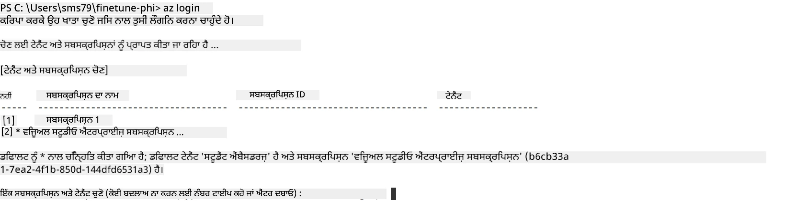

> [!TIP]
>
> ਜੇ ਤੁਹਾਨੂੰ ਏਜ਼ੂਅਰ ਵਿੱਚ ਸਾਈਨ ਇਨ ਵਿੱਚ ਸਮੱਸਿਆ ਆ ਰਹੀ ਹੈ, ਤਾਂ ਡਿਵਾਈਸ ਕੋਡ ਦੀ ਵਰਤੋਂ ਕਰੋ। ਇੱਕ ਟਰਮੀਨਲ ਵਿੰਡੋ ਖੋਲ੍ਹੋ ਅਤੇ ਹੇਠਾਂ ਦਿੱਤਾ ਕਮਾਂਡ ਟਾਈਪ ਕਰਕੇ ਆਪਣੇ ਏਜ਼ੂਅਰ ਖਾਤੇ ਵਿੱਚ ਸਾਈਨ ਇਨ ਕਰੋ:
>
> ```console
> az login --use-device-code
> ```
>

### Phi-3 ਮਾਡਲ ਨੂੰ ਫਾਈਨ-ਟਿਊਨ ਕਰੋ

ਇਸ ਅਭਿਆਸ ਵਿੱਚ, ਤੁਸੀਂ ਦਿੱਤੇ ਡੇਟਾਸੈੱਟ ਦੀ ਵਰਤੋਂ ਕਰਕੇ Phi-3 ਮਾਡਲ ਨੂੰ ਫਾਈਨ-ਟਿਊਨ ਕਰੋਗੇ। ਪਹਿਲਾਂ, ਫਾਈਨ-ਟਿਊਨਿੰਗ ਪ੍ਰਕਿਰਿਆ ਨੂੰ *fine_tune.py* ਫਾਈਲ ਵਿੱਚ ਪਰਿਭਾਸ਼ਿਤ ਕਰੋਗੇ। ਫਿਰ, Azure ਮਸ਼ੀਨ ਲਰਨਿੰਗ ਵਾਤਾਵਰਣ ਸੰਰਚਿਤ ਕਰਨ ਅਤੇ ਫਾਈਨ-ਟਿਊਨਿੰਗ ਪ੍ਰਕਿਰਿਆ ਸ਼ੁਰੂ ਕਰਨ ਲਈ *setup_ml.py* ਫਾਈਲ ਚਲਾਓਗੇ। ਇਹ ਸਕ੍ਰਿਪਟ ਯਕੀਨੀ ਬਣਾਉਂਦਾ ਹੈ ਕਿ ਫਾਈਨ-ਟਿਊਨਿੰਗ Azure ਮਸ਼ੀਨ ਲਰਨਿੰਗ ਵਾਤਾਵਰਣ ਵਿੱਚ ਹੀ ਹੋਵੇ।

*setup_ml.py* ਨੂੰ ਚਲਾ ਕੇ, ਤੁਸੀਂ ਫਾਈਨ-ਟਿਊਨਿੰਗ ਪ੍ਰਕਿਰਿਆ ਨੂੰ Azure ਮਸ਼ੀਨ ਲਰਨਿੰਗ ਵਾਤਾਵਰਣ ਵਿੱਚ ਚਲਾਓਗੇ।

#### *fine_tune.py* ਫਾਈਲ ਵਿੱਚ ਕੋਡ ਸ਼ਾਮਲ ਕਰੋ

1. *finetuning_dir* ਫੋਲਡਰ ਵਿੱਚ ਜਾਓ ਅਤੇ Visual Studio Code ਵਿੱਚ *fine_tune.py* ਫਾਈਲ ਖੋਲ੍ਹੋ।

1. *fine_tune.py* ਵਿੱਚ ਹੇਠਾਂ ਦਿੱਤਾ ਕੋਡ ਸ਼ਾਮਲ ਕਰੋ।

    ```python
    import argparse
    import sys
    import logging
    import os
    from datasets import load_dataset
    import torch
    import mlflow
    from transformers import AutoModelForCausalLM, AutoTokenizer, TrainingArguments
    from trl import SFTTrainer

    # MLflow ਵਿੱਚ INVALID_PARAMETER_VALUE ਗਲਤੀ ਤੋਂ ਬਚਣ ਲਈ, MLflow ਇੰਟੀਗ੍ਰੇਸ਼ਨ ਨੂੰ ਅਮਾਨਯ ਕਰੋ
    os.environ["DISABLE_MLFLOW_INTEGRATION"] = "True"

    # ਲੌਗਿੰਗ ਸੈੱਟਅਪ
    logging.basicConfig(
        format="%(asctime)s - %(levelname)s - %(name)s - %(message)s",
        datefmt="%Y-%m-%d %H:%M:%S",
        handlers=[logging.StreamHandler(sys.stdout)],
        level=logging.WARNING
    )
    logger = logging.getLogger(__name__)

    def initialize_model_and_tokenizer(model_name, model_kwargs):
        """
        Initialize the model and tokenizer with the given pretrained model name and arguments.
        """
        model = AutoModelForCausalLM.from_pretrained(model_name, **model_kwargs)
        tokenizer = AutoTokenizer.from_pretrained(model_name)
        tokenizer.model_max_length = 2048
        tokenizer.pad_token = tokenizer.unk_token
        tokenizer.pad_token_id = tokenizer.convert_tokens_to_ids(tokenizer.pad_token)
        tokenizer.padding_side = 'right'
        return model, tokenizer

    def apply_chat_template(example, tokenizer):
        """
        Apply a chat template to tokenize messages in the example.
        """
        messages = example["messages"]
        if messages[0]["role"] != "system":
            messages.insert(0, {"role": "system", "content": ""})
        example["text"] = tokenizer.apply_chat_template(
            messages, tokenize=False, add_generation_prompt=False
        )
        return example

    def load_and_preprocess_data(train_filepath, test_filepath, tokenizer):
        """
        Load and preprocess the dataset.
        """
        train_dataset = load_dataset('json', data_files=train_filepath, split='train')
        test_dataset = load_dataset('json', data_files=test_filepath, split='train')
        column_names = list(train_dataset.features)

        train_dataset = train_dataset.map(
            apply_chat_template,
            fn_kwargs={"tokenizer": tokenizer},
            num_proc=10,
            remove_columns=column_names,
            desc="Applying chat template to train dataset",
        )

        test_dataset = test_dataset.map(
            apply_chat_template,
            fn_kwargs={"tokenizer": tokenizer},
            num_proc=10,
            remove_columns=column_names,
            desc="Applying chat template to test dataset",
        )

        return train_dataset, test_dataset

    def train_and_evaluate_model(train_dataset, test_dataset, model, tokenizer, output_dir):
        """
        Train and evaluate the model.
        """
        training_args = TrainingArguments(
            bf16=True,
            do_eval=True,
            output_dir=output_dir,
            eval_strategy="epoch",
            learning_rate=5.0e-06,
            logging_steps=20,
            lr_scheduler_type="cosine",
            num_train_epochs=3,
            overwrite_output_dir=True,
            per_device_eval_batch_size=4,
            per_device_train_batch_size=4,
            remove_unused_columns=True,
            save_steps=500,
            seed=0,
            gradient_checkpointing=True,
            gradient_accumulation_steps=1,
            warmup_ratio=0.2,
        )

        trainer = SFTTrainer(
            model=model,
            args=training_args,
            train_dataset=train_dataset,
            eval_dataset=test_dataset,
            max_seq_length=2048,
            dataset_text_field="text",
            tokenizer=tokenizer,
            packing=True
        )

        train_result = trainer.train()
        trainer.log_metrics("train", train_result.metrics)

        mlflow.transformers.log_model(
            transformers_model={"model": trainer.model, "tokenizer": tokenizer},
            artifact_path=output_dir,
        )

        tokenizer.padding_side = 'left'
        eval_metrics = trainer.evaluate()
        eval_metrics["eval_samples"] = len(test_dataset)
        trainer.log_metrics("eval", eval_metrics)

    def main(train_file, eval_file, model_output_dir):
        """
        Main function to fine-tune the model.
        """
        model_kwargs = {
            "use_cache": False,
            "trust_remote_code": True,
            "torch_dtype": torch.bfloat16,
            "device_map": None,
            "attn_implementation": "eager"
        }

        # pretrained_model_name = "microsoft/Phi-3-mini-4k-instruct"
        pretrained_model_name = "microsoft/Phi-3.5-mini-instruct"

        with mlflow.start_run():
            model, tokenizer = initialize_model_and_tokenizer(pretrained_model_name, model_kwargs)
            train_dataset, test_dataset = load_and_preprocess_data(train_file, eval_file, tokenizer)
            train_and_evaluate_model(train_dataset, test_dataset, model, tokenizer, model_output_dir)

    if __name__ == "__main__":
        parser = argparse.ArgumentParser()
        parser.add_argument("--train-file", type=str, required=True, help="Path to the training data")
        parser.add_argument("--eval-file", type=str, required=True, help="Path to the evaluation data")
        parser.add_argument("--model_output_dir", type=str, required=True, help="Directory to save the fine-tuned model")
        args = parser.parse_args()
        main(args.train_file, args.eval_file, args.model_output_dir)

    ```

1. *fine_tune.py* ਫਾਈਲ ਸੇਵ ਕਰੋ ਅਤੇ ਬੰਦ ਕਰੋ।

> [!TIP]
> **ਤੁਸੀਂ Phi-3.5 ਮਾਡਲ ਵੀ ਫਾਈਨ-ਟਿਊਨ ਕਰ ਸਕਦੇ ਹੋ**
>
> *fine_tune.py* ਫਾਈਲ ਵਿੱਚ, ਤੁਸੀਂ `pretrained_model_name` ਨੂੰ `"microsoft/Phi-3-mini-4k-instruct"` ਤੋਂ ਕਿਸੇ ਵੀ ਮਾਡਲ ਨਾਲ ਬਦਲ ਸਕਦੇ ਹੋ ਜਿਸ ਨੂੰ ਤੁਸੀਂ ਫਾਈਨ-ਟਿਊਨ ਕਰਨਾ ਚਾਹੁੰਦੇ ਹੋ। ਉਦਾਹਰਨ ਵਜੋਂ, ਜੇ ਤੁਸੀਂ ਇਸਨੂੰ `"microsoft/Phi-3.5-mini-instruct"` ਨਾਲ ਬਦਲਦੇ ਹੋ ਤਾਂ ਤੁਸੀਂ Phi-3.5-mini-instruct ਮਾਡਲ ਦੀ ਵਰਤੋਂ ਕਰ ਰਹੇ ਹੋਵੋਗੇ। ਮਾਡਲ ਦਾ ਨਾਮ ਲੱਭਣ ਅਤੇ ਵਰਤਣ ਲਈ [Hugging Face](https://huggingface.co/) ਵੈੱਬਸਾਈਟ ਤੇ ਜਾ ਕੇ ਆਪਣੀ ਪਸੰਦ ਦਾ ਮਾਡਲ ਖੋਜੋ, ਫਿਰ ਉਸਦਾ ਨਾਮ ਦੀ ਸੈਕਸ਼ਨ `pretrained_model_name` ਵਿੱਚ ਕੋਪੀ-ਪੇਸਟ ਕਰੋ।
>
> <image type="content" src="../../../../imgs/02/FineTuning-PromptFlow/finetunephi3.5.png" alt-text="Fine tune Phi-3.5.">
>

#### *setup_ml.py* ਫਾਈਲ ਵਿੱਚ ਕੋਡ ਸ਼ਾਮਲ ਕਰੋ

1. Visual Studio Code ਵਿੱਚ *setup_ml.py* ਫਾਈਲ ਖੋਲ੍ਹੋ।

1. *setup_ml.py* ਵਿੱਚ ਹੇਠਾਂ ਦਿੱਤਾ ਕੋਡ ਸ਼ਾਮਲ ਕਰੋ।

    ```python
    import logging
    from azure.ai.ml import MLClient, command, Input
    from azure.ai.ml.entities import Environment, AmlCompute
    from azure.identity import AzureCliCredential
    from config import (
        AZURE_SUBSCRIPTION_ID,
        AZURE_RESOURCE_GROUP_NAME,
        AZURE_ML_WORKSPACE_NAME,
        TRAIN_DATA_PATH,
        TEST_DATA_PATH
    )

    # ਸਥਿਰਾਂ

    # ਪ੍ਰਸ਼ਿਸ਼ਣ ਲਈ CPU ਇੰਸਟੈਂਸ ਵਰਤਣ ਲਈ ਹੇਠਾਂ ਦਿੱਤੀਆਂ ਲਾਈਨਾਂ ਨੂੰ ਅਣਕਮੈਂਟ ਕਰੋ
    # COMPUTE_INSTANCE_TYPE = "Standard_E16s_v3" # cpu
    # COMPUTE_NAME = "cpu-e16s-v3"
    # DOCKER_IMAGE_NAME = "mcr.microsoft.com/azureml/openmpi4.1.0-ubuntu20.04:latest"

    # ਪ੍ਰਸ਼ਿਸ਼ਣ ਲਈ GPU ਇੰਸਟੈਂਸ ਵਰਤਣ ਲਈ ਹੇਠਾਂ ਦਿੱਤੀਆਂ ਲਾਈਨਾਂ ਨੂੰ ਅਣਕਮੈਂਟ ਕਰੋ
    COMPUTE_INSTANCE_TYPE = "Standard_NC24ads_A100_v4"
    COMPUTE_NAME = "gpu-nc24s-a100-v4"
    DOCKER_IMAGE_NAME = "mcr.microsoft.com/azureml/curated/acft-hf-nlp-gpu:59"

    CONDA_FILE = "conda.yml"
    LOCATION = "eastus2" # ਆਪਣੇ ਕਮਪਿਊਟ ਕਲੱਸਟਰ ਦੀ ਨਾਲ ਬਦਲੋ
    FINETUNING_DIR = "./finetuning_dir" # ਫਾਈਨ ਟਿਊਨਿੰਗ ਸਕ੍ਰਿਪਟ ਦਾ ਰਾਹ
    TRAINING_ENV_NAME = "phi-3-training-environment" # ਪ੍ਰਸ਼ਿਸ਼ਣ ਇਨਵਾਇਰਨਮੈਂਟ ਦਾ ਨਾਮ
    MODEL_OUTPUT_DIR = "./model_output" # ਅਜ਼ੂਰ ਐਮ ਐਲ ਵਿੱਚ ਮਾਡਲ ਆਉਟਪੁੱਟ ਡਾਇਰੈਕਟਰੀ ਦਾ ਰਾਹ

    # ਪ੍ਰਕਿਰਿਆ ਨੂੰ ਟ੍ਰੈਕ ਕਰਨ ਲਈ ਲੌਗਿੰਗ ਸੈਟਅੱਪ
    logger = logging.getLogger(__name__)
    logging.basicConfig(
        format="%(asctime)s - %(levelname)s - %(name)s - %(message)s",
        datefmt="%Y-%m-%d %H:%M:%S",
        level=logging.WARNING
    )

    def get_ml_client():
        """
        Initialize the ML Client using Azure CLI credentials.
        """
        credential = AzureCliCredential()
        return MLClient(credential, AZURE_SUBSCRIPTION_ID, AZURE_RESOURCE_GROUP_NAME, AZURE_ML_WORKSPACE_NAME)

    def create_or_get_environment(ml_client):
        """
        Create or update the training environment in Azure ML.
        """
        env = Environment(
            image=DOCKER_IMAGE_NAME,  # ਇਨਵਾਇਰਨਮੈਂਟ ਲਈ ਡੌਕਰ ਇਮੇਜ
            conda_file=CONDA_FILE,  # ਕੋੰਡਾ ਇਨਵਾਇਰਨਮੈਂਟ ਫਾਈਲ
            name=TRAINING_ENV_NAME,  # ਇਨਵਾਇਰਨਮੈਂਟ ਦਾ ਨਾਮ
        )
        return ml_client.environments.create_or_update(env)

    def create_or_get_compute_cluster(ml_client, compute_name, COMPUTE_INSTANCE_TYPE, location):
        """
        Create or update the compute cluster in Azure ML.
        """
        try:
            compute_cluster = ml_client.compute.get(compute_name)
            logger.info(f"Compute cluster '{compute_name}' already exists. Reusing it for the current run.")
        except Exception:
            logger.info(f"Compute cluster '{compute_name}' does not exist. Creating a new one with size {COMPUTE_INSTANCE_TYPE}.")
            compute_cluster = AmlCompute(
                name=compute_name,
                size=COMPUTE_INSTANCE_TYPE,
                location=location,
                tier="Dedicated",  # ਕਮਪਿਊਟ ਕਲੱਸਟਰ ਦੀ ਟੀਅਰ
                min_instances=0,  # ਘੱਟੋ-ਘੱਟ ਇੰਸਟੈਂਸਜ਼ ਦੀ ਗਿਣਤੀ
                max_instances=1  # ਵੱਧੋ ਵੱਧ ਇੰਸਟੈਂਸਜ਼ ਦੀ ਗਿਣਤੀ
            )
            ml_client.compute.begin_create_or_update(compute_cluster).wait()  # ਕਲੱਸਟਰ ਬਣਨ ਲਈ ਉਡੀਕ ਕਰੋ
        return compute_cluster

    def create_fine_tuning_job(env, compute_name):
        """
        Set up the fine-tuning job in Azure ML.
        """
        return command(
            code=FINETUNING_DIR,  # fine_tune.py ਦਾ ਰਾਹ
            command=(
                "python fine_tune.py "
                "--train-file ${{inputs.train_file}} "
                "--eval-file ${{inputs.eval_file}} "
                "--model_output_dir ${{inputs.model_output}}"
            ),
            environment=env,  # ਪ੍ਰਸ਼ਿਸ਼ਣ ਇਨਵਾਇਰਨਮੈਂਟ
            compute=compute_name,  # ਵਰਤਣ ਲਈ ਕਮਪਿਊਟ ਕਲੱਸਟਰ
            inputs={
                "train_file": Input(type="uri_file", path=TRAIN_DATA_PATH),  # ਪ੍ਰਸ਼ਿਸ਼ਣ ਡਾਟਾ ਫਾਈਲ ਦਾ ਰਾਹ
                "eval_file": Input(type="uri_file", path=TEST_DATA_PATH),  # ਮੁਲਾਂਕਣ ਡਾਟਾ ਫਾਈਲ ਦਾ ਰਾਹ
                "model_output": MODEL_OUTPUT_DIR
            }
        )

    def main():
        """
        Main function to set up and run the fine-tuning job in Azure ML.
        """
        # ਐਮ ਐਲ ਕਲਾਇੰਟ ਸ਼ੁਰੂ ਕਰੋ
        ml_client = get_ml_client()

        # ਇਨਵਾਇਰਨਮੈਂਟ ਬਣਾਓ
        env = create_or_get_environment(ml_client)
        
        # ਮੌਜੂਦਾ ਕਮਪਿਊਟ ਕਲੱਸਟਰ ਬਣਾਓ ਜਾਂ ਪ੍ਰਾਪਤ ਕਰੋ
        create_or_get_compute_cluster(ml_client, COMPUTE_NAME, COMPUTE_INSTANCE_TYPE, LOCATION)

        # ਫਾਈਨ-ਟਿਊਨਿੰਗ ਜੌਬ ਬਣਾਓ ਅਤੇ सबमिट ਕਰੋ
        job = create_fine_tuning_job(env, COMPUTE_NAME)
        returned_job = ml_client.jobs.create_or_update(job)  # ਜੌਬ ਸਬਮਿਟ ਕਰੋ
        ml_client.jobs.stream(returned_job.name)  # ਜੌਬ ਲੌਗਾਂ ਨੂੰ ਸਟ੍ਰੀਮ ਕਰੋ
        
        # ਜੌਬ ਦਾ ਨਾਮ ਕੈਪਚਰ ਕਰੋ
        job_name = returned_job.name
        print(f"Job name: {job_name}")

    if __name__ == "__main__":
        main()

    ```

1. `COMPUTE_INSTANCE_TYPE`, `COMPUTE_NAME`, ਅਤੇ `LOCATION` ਨੂੰ ਆਪਣੇ ਵਿਸ਼ੇਸ਼ ਵੇਰਵਿਆਂ ਨਾਲ ਬਦਲੋ।

    ```python
   # ਟਰੇਨਿੰਗ ਲਈ GPU ਇੰਸਟੈਂਸ ਦੀ ਵਰਤੋਂ ਕਰਨ ਲਈ ਹੇਠਾਂ ਦਿੱਤੀਆਂ ਲਾਈਨਾਂ ਨੂੰ ਅਣਕਮੈਂਟ ਕਰੋ
    COMPUTE_INSTANCE_TYPE = "Standard_NC24ads_A100_v4"
    COMPUTE_NAME = "gpu-nc24s-a100-v4"
    ...
    LOCATION = "eastus2" # ਆਪਣੇ ਕੰਪਿਊਟ ਕਲੱਸਟਰ ਦੀ ਥਾਂ ਨਾਲ ਬਦਲੋ
    ```

> [!TIP]
>
> **ਮਿਨੀਮਮ ਡੇਟਾਸੈੱਟ ਨਾਲ CPU ਦੀ ਵਰਤੋਂ ਕਰਕੇ ਫਾਈਨ-ਟਿਊਨਿੰਗ ਲਈ ਮਾਰਗਦਰਸ਼ਨ**
>
> ਜੇ ਤੁਸੀਂ ਫਾਈਨ-ਟਿਊਨਿੰਗ ਲਈ CPU ਦੀ ਵਰਤੋਂ ਕਰਨਾ ਚਾਹੁੰਦੇ ਹੋ, ਤਾਂ ਇਹ ਤਰੀਕਾ ਉਹਨਾਂ ਲਈ ਵਧੀਆ ਹੈ ਜਿਨ੍ਹਾਂ ਕੋਲ ਬੇਨੇਫਿਟ ਸਬਸਕ੍ਰਿਪਸ਼ਨ ਹਨ (ਜਿਵੇਂ Visual Studio Enterprise Subscription) ਜਾਂ ਫਾਈਨ-ਟਿਊਨਿੰਗ ਅਤੇ ਡਿਪਲੋਇਮੈਂਟ ਪ੍ਰਕਿਰਿਆ ਨੂੰ ਤੇਜ਼ੀ ਨਾਲ ਟੈਸਟ ਕਰਨ ਲਈ।
>
> 1. *setup_ml* ਫਾਈਲ ਖੋਲ੍ਹੋ।
> 1. `COMPUTE_INSTANCE_TYPE`, `COMPUTE_NAME`, ਅਤੇ `DOCKER_IMAGE_NAME` ਨੂੰ ਹੇਠਾਂ ਦਿੱਤੀਆਂ ਸੈਟਿੰਗਜ਼ ਨਾਲ ਬਦਲੋ। ਜੇ ਤੁਹਾਡੇ ਕੋਲ *Standard_E16s_v3* ਦੀ ਪਹੁੰਚ ਨਹੀਂ ਹੈ, ਤਾਂ ਤੁਸੀਂ ਕੋਈ ਸਮਕક્ષ CPU ਇੰਸਟਾਂਸ ਵਰਤ ਸਕਦੇ ਹੋ ਜਾਂ ਨਵੀਂ ਕੋਟਾ ਦੀ ਬੇਨਤੀ ਕਰ ਸਕਦੇ ਹੋ।
> 1. `LOCATION` ਨੂੰ ਆਪਣੇ ਵਿਸ਼ੇਸ਼ ਵੇਰਵਿਆਂ ਨਾਲ ਬਦਲੋ।
>
>    ```python
>    # Uncomment the following lines to use a CPU instance for training
>    COMPUTE_INSTANCE_TYPE = "Standard_E16s_v3" # cpu
>    COMPUTE_NAME = "cpu-e16s-v3"
>    DOCKER_IMAGE_NAME = "mcr.microsoft.com/azureml/openmpi4.1.0-ubuntu20.04:latest"
>    LOCATION = "eastus2" # Replace with the location of your compute cluster
>    ```
>

1. Azure ਮਸ਼ੀਨ ਲਰਨਿੰਗ ਵਿੱਚ ਫਾਈਨ-ਟਿਊਨਿੰਗ প্ৰਕਿਰਿਆ ਸ਼ੁਰੂ ਕਰਨ ਲਈ *setup_ml.py* ਸਕ੍ਰਿਪਟ ਚਲਾਉਣ ਲਈ ਹੇਠਾਂ ਦਿੱਤਾ ਕਮਾਂਡ ਟਾਈਪ ਕਰੋ।

    ```python
    python setup_ml.py
    ```

1. ਇਸ ਅਭਿਆਸ ਵਿੱਚ, ਤੁਸੀਂ ਸਫਲਤਾਪੂਰਵਕ Azure ਮਸ਼ੀਨ ਲਰਨਿੰਗ ਦੀ ਵਰਤੋਂ ਕਰਕੇ Phi-3 ਮਾਡਲ ਨੂੰ ਫਾਈਨ-ਟਿਊਨ ਕੀਤਾ। *setup_ml.py* ਸਕ੍ਰਿਪਟ ਨੂੰ ਚਲਾ ਕੇ, ਤੁਸੀਂ Azure ਮਸ਼ੀਨ ਲਰਨਿੰਗ ਵਾਤਾਵਰਣ ਸੈੱਟ ਕੀਤਾ ਅਤੇ *fine_tune.py* ਵਿੱਚ ਪਰਿਭਾਸ਼ਿਤ ਫਾਈਨ-ਟਿਊਨਿੰਗ ਪ੍ਰਕਿਰਿਆ ਸ਼ੁਰੂ ਕੀਤੀ। ਜ਼ਾਹਿਰ ਹੈ ਕਿ ਫਾਈਨ-ਟਿਊਨਿੰਗ ਪ੍ਰਕਿਰਿਆ ਵਿੱਚ ਕਾਫੀ ਸਮਾਂ ਲੱਗ ਸਕਦਾ ਹੈ। `python setup_ml.py` ਕਮਾਂਡ ਚਲਾਉਣ ਤੋਂ ਬਾਅਦ ਤੁਸੀਂ ਪ੍ਰਕਿਰਿਆ ਪੂਰੀ ਹੋਣ ਦੀ ਉਡੀਕ ਕਰੋ। ਤੁਸੀਂ ਟਰਮੀਨਲ ਵਿੱਚ ਦਿੱਤੇ ਲਿੰਕ ਰਾਹੀਂ Azure ਮਸ਼ੀਨ ਲਰਨਿੰਗ ਪੋਰਟਲ 'ਤੇ ਫਾਈਨ-ਟਿਊਨਿੰਗ ਜੌਬ ਦੀ ਸਥਿਤੀ ਮੋਨੀਟਰ ਕਰ ਸਕਦੇ ਹੋ।

    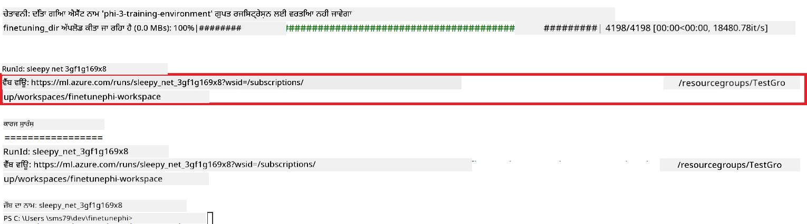

### ਫਾਈਨ-ਟਿਊਨ ਕੀਤੇ ਮਾਡਲ ਨੂੰ ਡਿਪਲੋਅ ਕਰੋ

ਫਾਈਨ-ਟਿਊਨ ਕੀਤੇ Phi-3 ਮਾਡਲ ਨੂੰ Prompt Flow ਨਾਲ ਜੋੜਨ ਲਈ, ਤੁਹਾਨੂੰ ਮਾਡਲ ਨੂੰ ਅਜਿਹਾ ਡਿਪਲੋਅ ਕਰਨਾ ਪਵੇਗਾ ਜੋ ਰੀਅਲ-ਟਾਈਮ ਇਨਫਰੰਸ ਲਈ ਪਹੁੰਚ ਯੋਗ ਹੋਵੇ। ਇਹ ਪ੍ਰਕਿਰਿਆ ਮਾਡਲ ਰਜਿਸਟਰ ਕਰਨ, ਆਨਲਾਈਨ ਏਂਡਪੌਇੰਟ ਬਣਾਉਣ ਅਤੇ ਮਾਡਲ ਡਿਪਲੋਇ ਕਰਨ ਨਾਲ ਜੁੜੀ ਹੈ।

#### ਡਿਪਲੋਇਮੈਂਟ ਲਈ ਮਾਡਲ ਨਾਂ, ਏਂਡਪੌਇੰਟ ਨਾਂ, ਅਤੇ ਡਿਪਲੋਇਮੈਂਟ ਨਾਂ ਸੈੱਟ ਕਰੋ

1. *config.py* ਫਾਈਲ ਖੋਲ੍ਹੋ।

1. `AZURE_MODEL_NAME = "your_fine_tuned_model_name"` ਨੂੰ ਆਪਣੇ ਮਾਡਲ ਲਈ ਇਚਛਿਤ ਨਾਂ ਨਾਲ ਬਦਲੋ।

1. `AZURE_ENDPOINT_NAME = "your_fine_tuned_model_endpoint_name"` ਨੂੰ ਆਪਣੇ ਏਂਡਪੌਇੰਟ ਲਈ ਇਚਛਿਤ ਨਾਂ ਨਾਲ ਬਦਲੋ।

1. `AZURE_DEPLOYMENT_NAME = "your_fine_tuned_model_deployment_name"` ਨੂੰ ਆਪਣੇ ਡਿਪਲੋਇਮੈਂਟ ਲਈ ਇਚਛਿਤ ਨਾਂ ਨਾਲ ਬਦਲੋ।

#### *deploy_model.py* ਫਾਈਲ ਵਿੱਚ ਕੋਡ ਸ਼ਾਮਲ ਕਰੋ

*deploy_model.py* ਫਾਈਲ ਚਲਾਉਣ ਨਾਲ ਪੂਰੀ ਡਿਪਲੋਇਮੈਂਟ ਪ੍ਰਕਿਰਿਆ ਸੁਚਾਰੂ ਰੂਪ ਵਿੱਚ ਚੱਲਦੀ ਹੈ। ਇਹ ਮਾਡਲ ਨੂੰ ਰਜਿਸਟਰ ਕਰਦੀ ਹੈ, ਏਂਡਪੌਇੰਟ ਬਣਾਉਂਦੀ ਹੈ ਅਤੇ ਡਿਪਲੋਇਮੈਂਟ ਨੂੰ ਲਾਗੂ ਕਰਦੀ ਹੈ ਜਿਹੜਾ *config.py* ਫਾਈਲ ਵਿੱਚ ਦਿੱਤੇ ਗਏ ਮਾਡਲ ਨਾਂ, ਏਂਡਪੌਇੰਟ ਨਾਂ ਅਤੇ ਡਿਪਲੋਇਮੈਂਟ ਨਾਂ ਦੇ ਸੈਟਿੰਗਾਂ ਨਾਲ ਹੁੰਦਾ ਹੈ।

1. Visual Studio Code ਵਿੱਚ *deploy_model.py* ਫਾਈਲ ਖੋਲ੍ਹੋ।

1. *deploy_model.py* ਵਿੱਚ ਹੇਠਾਂ ਦਿੱਤਾ ਕੋਡ ਸ਼ਾਮਲ ਕਰੋ।

    ```python
    import logging
    from azure.identity import AzureCliCredential
    from azure.ai.ml import MLClient
    from azure.ai.ml.entities import Model, ProbeSettings, ManagedOnlineEndpoint, ManagedOnlineDeployment, IdentityConfiguration, ManagedIdentityConfiguration, OnlineRequestSettings
    from azure.ai.ml.constants import AssetTypes

    # ਸੰਰਚਨਾ ਆਯਾਤ
    from config import (
        AZURE_SUBSCRIPTION_ID,
        AZURE_RESOURCE_GROUP_NAME,
        AZURE_ML_WORKSPACE_NAME,
        AZURE_MANAGED_IDENTITY_RESOURCE_ID,
        AZURE_MANAGED_IDENTITY_CLIENT_ID,
        AZURE_MODEL_NAME,
        AZURE_ENDPOINT_NAME,
        AZURE_DEPLOYMENT_NAME
    )

    # ਸਥਿਰਾਂ
    JOB_NAME = "your-job-name"
    COMPUTE_INSTANCE_TYPE = "Standard_E4s_v3"

    deployment_env_vars = {
        "SUBSCRIPTION_ID": AZURE_SUBSCRIPTION_ID,
        "RESOURCE_GROUP_NAME": AZURE_RESOURCE_GROUP_NAME,
        "UAI_CLIENT_ID": AZURE_MANAGED_IDENTITY_CLIENT_ID,
    }

    # ਲੌਗਿੰਗ ਸੈਟਅਪ
    logging.basicConfig(
        format="%(asctime)s - %(levelname)s - %(name)s - %(message)s",
        datefmt="%Y-%m-%d %H:%M:%S",
        level=logging.DEBUG
    )
    logger = logging.getLogger(__name__)

    def get_ml_client():
        """Initialize and return the ML Client."""
        credential = AzureCliCredential()
        return MLClient(credential, AZURE_SUBSCRIPTION_ID, AZURE_RESOURCE_GROUP_NAME, AZURE_ML_WORKSPACE_NAME)

    def register_model(ml_client, model_name, job_name):
        """Register a new model."""
        model_path = f"azureml://jobs/{job_name}/outputs/artifacts/paths/model_output"
        logger.info(f"Registering model {model_name} from job {job_name} at path {model_path}.")
        run_model = Model(
            path=model_path,
            name=model_name,
            description="Model created from run.",
            type=AssetTypes.MLFLOW_MODEL,
        )
        model = ml_client.models.create_or_update(run_model)
        logger.info(f"Registered model ID: {model.id}")
        return model

    def delete_existing_endpoint(ml_client, endpoint_name):
        """Delete existing endpoint if it exists."""
        try:
            endpoint_result = ml_client.online_endpoints.get(name=endpoint_name)
            logger.info(f"Deleting existing endpoint {endpoint_name}.")
            ml_client.online_endpoints.begin_delete(name=endpoint_name).result()
            logger.info(f"Deleted existing endpoint {endpoint_name}.")
        except Exception as e:
            logger.info(f"No existing endpoint {endpoint_name} found to delete: {e}")

    def create_or_update_endpoint(ml_client, endpoint_name, description=""):
        """Create or update an endpoint."""
        delete_existing_endpoint(ml_client, endpoint_name)
        logger.info(f"Creating new endpoint {endpoint_name}.")
        endpoint = ManagedOnlineEndpoint(
            name=endpoint_name,
            description=description,
            identity=IdentityConfiguration(
                type="user_assigned",
                user_assigned_identities=[ManagedIdentityConfiguration(resource_id=AZURE_MANAGED_IDENTITY_RESOURCE_ID)]
            )
        )
        endpoint_result = ml_client.online_endpoints.begin_create_or_update(endpoint).result()
        logger.info(f"Created new endpoint {endpoint_name}.")
        return endpoint_result

    def create_or_update_deployment(ml_client, endpoint_name, deployment_name, model):
        """Create or update a deployment."""

        logger.info(f"Creating deployment {deployment_name} for endpoint {endpoint_name}.")
        deployment = ManagedOnlineDeployment(
            name=deployment_name,
            endpoint_name=endpoint_name,
            model=model.id,
            instance_type=COMPUTE_INSTANCE_TYPE,
            instance_count=1,
            environment_variables=deployment_env_vars,
            request_settings=OnlineRequestSettings(
                max_concurrent_requests_per_instance=3,
                request_timeout_ms=180000,
                max_queue_wait_ms=120000
            ),
            liveness_probe=ProbeSettings(
                failure_threshold=30,
                success_threshold=1,
                period=100,
                initial_delay=500,
            ),
            readiness_probe=ProbeSettings(
                failure_threshold=30,
                success_threshold=1,
                period=100,
                initial_delay=500,
            ),
        )
        deployment_result = ml_client.online_deployments.begin_create_or_update(deployment).result()
        logger.info(f"Created deployment {deployment.name} for endpoint {endpoint_name}.")
        return deployment_result

    def set_traffic_to_deployment(ml_client, endpoint_name, deployment_name):
        """Set traffic to the specified deployment."""
        try:
            # ਮੌਜੂਦਾ ਐਂਡਪੌਇੰਟ ਵੇਰਵੇ ਪ੍ਰਾਪਤ ਕਰੋ
            endpoint = ml_client.online_endpoints.get(name=endpoint_name)
            
            # ਡੀਬੱਗਿੰਗ ਲਈ ਮੌਜੂਦਾ ਟ੍ਰੈਫਿਕ ਵੰਡ ਲੌਗ ਕਰੋ
            logger.info(f"Current traffic allocation: {endpoint.traffic}")
            
            # ਤैनਾਤੀ ਲਈ ਟ੍ਰੈਫਿਕ ਵੰਡ ਸੈੱਟ ਕਰੋ
            endpoint.traffic = {deployment_name: 100}
            
            # ਨਵੀਂ ਟ੍ਰੈਫਿਕ ਵੰਡ ਨਾਲ ਐਂਡਪੌਇੰਟ ਨੂੰ ਅਪਡੇਟ ਕਰੋ
            endpoint_poller = ml_client.online_endpoints.begin_create_or_update(endpoint)
            updated_endpoint = endpoint_poller.result()
            
            # ਡੀਬੱਗਿੰਗ ਲਈ ਅਪਡੇਟ ਕੀਤੀ ਟ੍ਰੈਫਿਕ ਵੰਡ ਲੌਗ ਕਰੋ
            logger.info(f"Updated traffic allocation: {updated_endpoint.traffic}")
            logger.info(f"Set traffic to deployment {deployment_name} at endpoint {endpoint_name}.")
            return updated_endpoint
        except Exception as e:
            # ਪ੍ਰਕਿਰਿਆ ਦੌਰਾਨ ਹੋਣ ਵਾਲੀਆਂ ਕੋਈ ਵੀ ਗਲਤੀਆਂ ਲੌਗ ਕਰੋ
            logger.error(f"Failed to set traffic to deployment: {e}")
            raise


    def main():
        ml_client = get_ml_client()

        registered_model = register_model(ml_client, AZURE_MODEL_NAME, JOB_NAME)
        logger.info(f"Registered model ID: {registered_model.id}")

        endpoint = create_or_update_endpoint(ml_client, AZURE_ENDPOINT_NAME, "Endpoint for finetuned Phi-3 model")
        logger.info(f"Endpoint {AZURE_ENDPOINT_NAME} is ready.")

        try:
            deployment = create_or_update_deployment(ml_client, AZURE_ENDPOINT_NAME, AZURE_DEPLOYMENT_NAME, registered_model)
            logger.info(f"Deployment {AZURE_DEPLOYMENT_NAME} is created for endpoint {AZURE_ENDPOINT_NAME}.")

            set_traffic_to_deployment(ml_client, AZURE_ENDPOINT_NAME, AZURE_DEPLOYMENT_NAME)
            logger.info(f"Traffic is set to deployment {AZURE_DEPLOYMENT_NAME} at endpoint {AZURE_ENDPOINT_NAME}.")
        except Exception as e:
            logger.error(f"Failed to create or update deployment: {e}")

    if __name__ == "__main__":
        main()

    ```

1. `JOB_NAME` ਪ੍ਰਾਪਤ ਕਰਨ ਲਈ ਹੇਠਾਂ ਦਿੱਤੇ ਟਾਸਕ ਕਰੋ:

    - ਆਪਣੇ ਬਣਾਏ Azure Machine Learning ਸਰੋਤ ਤੇ ਜਾਓ।
    - **Studio web URL** ਨੂੰ ਖੋਲ੍ਹ ਕੇ Azure Machine Learning ਵਰਕਸਪੇਸ ਵਿੱਚ ਜਾਓ।
    - ਖੱਬੇ ਪਾਸੇ ਤੋਂ **Jobs** ਚੁਣੋ।
    - ਫਾਈਨ-ਟਿਊਨਿੰਗ ਲਈ ਬਣਾਈ ਗਈ ਐਕਸਪੇਰਿਮੈਂਟ ਚੁਣੋ, ਉਦਾਹਰਨ ਵਜੋਂ *finetunephi*।
    - ਬਣਾਏ ਗਏ ਜੌਬ ਨੂੰ ਚੁਣੋ।
- ਆਪਣੇ ਜੌਬ ਦਾ ਨਾਮ `JOB_NAME = "your-job-name"` ਵਿੱਚ *deploy_model.py* ਫਾਇਲ ਵਿੱਚ ਕਾਪੀ ਅਤੇ ਪੇਸਟ ਕਰੋ।

1. `COMPUTE_INSTANCE_TYPE` ਨੂੰ ਆਪਣੇ ਵਿਸ਼ੇਸ਼ ਵੇਰਵਿਆਂ ਨਾਲ ਬਦਲੋ।

1. ਹੇਠਾਂ ਦਿੱਤਾ ਕਮਾਂਡ ਟਾਈਪ ਕਰੋ ਤਾਂ ਕਿ *deploy_model.py* ਸਕ੍ਰਿਪਟ ਚੱਲੇ ਅਤੇ Azure Machine Learning ਵਿੱਚ ਡਿਪਲੋਇਮੈਂਟ ਪ੍ਰਕਿਰਿਆ ਸ਼ੁਰੂ ਹੋ ਜਾਵੇ।

    ```python
    python deploy_model.py
    ```

> [!WARNING]
> ਆਪਣੇ ਖਾਤੇ 'ਤੇ ਵਾਧੂ ਖਰਚਿਆਂ ਤੋਂ ਬਚਣ ਲਈ, Azure Machine Learning ਵਰਕਸਪੇਸ ਵਿੱਚ ਬਣਾਇਆ ਗਿਆ endpoint ਮਿਟਾ ਦੇਣਾ ਯਕੀਨੀ ਬਣਾਓ।
>

#### Azure Machine Learning ਵਰਕਸਪੇਸ ਵਿੱਚ ਡਿਪਲੋਇਮੈਂਟ ਦੀ ਸਥਿਤੀ ਚੈੱਕ ਕਰੋ

1. [Azure ML Studio](https://ml.azure.com/home?wt.mc_id=studentamb_279723) 'ਤੇ ਜਾਓ।

1. ਉਸ Azure Machine Learning ਵਰਕਸਪੇਸ 'ਤੇ ਜਾਓ ਜੋ ਤੁਸੀਂ ਬਣਾਇਆ ਹੈ।

1. Azure Machine Learning ਵਰਕਸਪੇਸ ਖੋਲ੍ਹਣ ਲਈ **Studio web URL** ਚੁਣੋ।

1. ਖੱਬੇ ਪਾਸੇ ਦੇ ਟੈਬ ਵਿੱਚੋਂ **Endpoints** ਚੁਣੋ।

    

2. ਉਸ endpoint ਨੂੰ ਚੁਣੋ ਜੋ ਤੁਸੀਂ ਬਣਾਇਆ ਹੈ।

    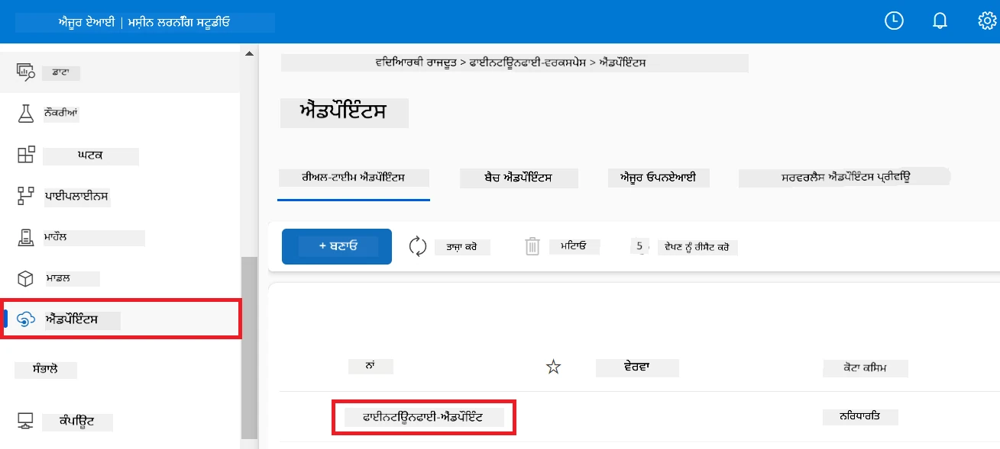

3. ਇਸ ਪੇਜ਼ 'ਤੇ, ਤੁਸੀਂ ਡਿਪਲੋਇਮੈਂਟ ਪ੍ਰਕਿਰਿਆ ਦੌਰਾਨ ਬਣਾਏ ਗਏ endpoints ਦਾ ਪ੍ਰਬੰਧਨ ਕਰ ਸਕਦੇ ਹੋ।

## ਘਟਨਾ 3: Prompt flow ਨਾਲ ਇੰਟੀਗ੍ਰੇਟ ਕਰੋ ਅਤੇ ਆਪਣੇ ਕਸਟਮ ਮਾਡਲ ਨਾਲ ਗੱਲ-ਬਾਤ ਕਰੋ

### ਕਸਟਮ Phi-3 ਮਾਡਲ ਨੂੰ Prompt flow ਨਾਲ ਇੰਟੀਗ੍ਰੇਟ ਕਰੋ

ਆਪਣਾ ਫਾਈਨ-ਟਿਊਨ ਕੀਤਾ ਮਾਡਲ ਸਫਲਤਾਪੂਰਵਕ ਡਿਪਲੋਇਟ ਕਰਨ ਤੋਂ ਬਾਅਦ, ਤੁਸੀਂ ਹੁਣ ਇਸਨੂੰ Prompt flow ਨਾਲ ਇੰਟੀਗ੍ਰੇਟ ਕਰ ਸਕਦੇ ਹੋ ਤਾਂ ਜੋ ਤੁਹਾਡੇ ਮਾਡਲ ਨੂੰ ਰੀਅਲ-ਟਾਈਮ ਐਪਲੀਕੇਸ਼ਨਾਂ ਵਿੱਚ ਵਰਤੋਂ ਕੀਤਾ ਜਾ ਸਕੇ, ਜਿਸ ਨਾਲ ਤੁਹਾਡੇ ਕਸਟਮ Phi-3 ਮਾਡਲ ਨਾਲ ਕਈ ਕਿਸਮ ਦੇ ਇੰਟਰਐਕਟਿਵ ਕਾਰਜ ਸੰਭਵ ਹੁੰਦੇ ਹਨ।

#### ਫਾਈਨ-ਟਿਊਨ ਕੀਤੇ Phi-3 ਮਾਡਲ ਦੀ api ਕੀ ਅਤੇ endpoint uri ਸੈੱਟ ਕਰੋ

1. ਉਹ Azure Machine Learning ਵਰਕਸਪੇਸ ਖੋਲ੍ਹੋ ਜੋ ਤੁਸੀਂ ਬਣਾਇਆ ਹੈ।
1. ਖੱਬੇ ਪਾਸੇ ਦੇ ਟੈਬ ਵਿੱਚੋਂ **Endpoints** ਚੁਣੋ।
1. ਉਸ endpoint ਨੂੰ ਚੁਣੋ ਜੋ ਤੁਸੀਂ ਬਣਾਇਆ ਹੈ।
1. ਨੈਵੀਗੇਸ਼ਨ ਮੇਨੂ ਵਿੱਚੋਂ **Consume** ਚੁਣੋ।
1. ਆਪਣਾ **REST endpoint** ਕਾਪੀ ਕਰਕੇ *config.py* ਫਾਇਲ ਵਿੱਚ `AZURE_ML_ENDPOINT = "your_fine_tuned_model_endpoint_uri"` ਦੀ ਥਾਂ ਆਪਣੇ **REST endpoint** ਨਾਲ ਪੇਸਟ ਕਰੋ।
1. ਆਪਣੀ **Primary key** ਕਾਪੀ ਕਰਕੇ *config.py* ਫਾਇਲ ਵਿੱਚ `AZURE_ML_API_KEY = "your_fine_tuned_model_api_key"` ਦੀ ਥਾਂ ਆਪਣੇ **Primary key** ਨਾਲ ਪੇਸਟ ਕਰੋ।

    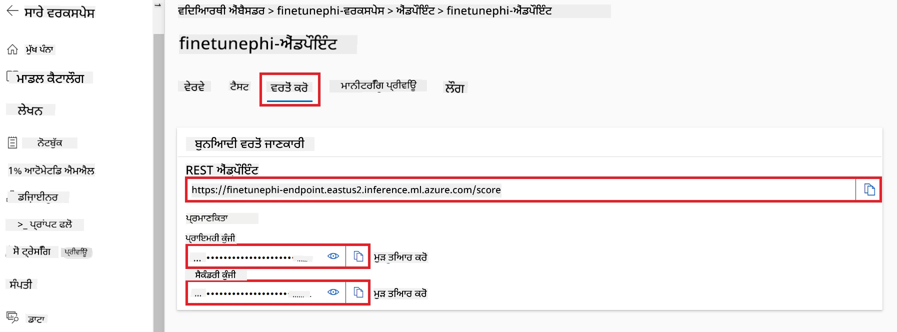

#### *flow.dag.yml* ਫਾਇਲ ਵਿੱਚ ਕੋਡ ਸ਼ਾਮਲ ਕਰੋ

1. Visual Studio Code ਵਿੱਚ *flow.dag.yml* ਫਾਇਲ ਖੋਲ੍ਹੋ।

1. *flow.dag.yml* ਵਿੱਚ ਹੇਠਾਂ ਦਿੱਤਾ ਕੋਡ ਸ਼ਾਮਲ ਕਰੋ।

    ```yml
    inputs:
      input_data:
        type: string
        default: "Who founded Microsoft?"

    outputs:
      answer:
        type: string
        reference: ${integrate_with_promptflow.output}

    nodes:
    - name: integrate_with_promptflow
      type: python
      source:
        type: code
        path: integrate_with_promptflow.py
      inputs:
        input_data: ${inputs.input_data}
    ```

#### *integrate_with_promptflow.py* ਫਾਇਲ ਵਿੱਚ ਕੋਡ ਸ਼ਾਮਲ ਕਰੋ

1. Visual Studio Code ਵਿੱਚ *integrate_with_promptflow.py* ਫਾਇਲ ਖੋਲ੍ਹੋ।

1. *integrate_with_promptflow.py* ਵਿੱਚ ਹੇਠਾਂ ਦਿੱਤਾ ਕੋਡ ਸ਼ਾਮਲ ਕਰੋ।

    ```python
    import logging
    import requests
    from promptflow.core import tool
    import asyncio
    import platform
    from config import (
        AZURE_ML_ENDPOINT,
        AZURE_ML_API_KEY
    )

    # ਲੌਗਿੰਗ ਸੈਟਅਪ
    logging.basicConfig(
        format="%(asctime)s - %(levelname)s - %(name)s - %(message)s",
        datefmt="%Y-%m-%d %H:%M:%S",
        level=logging.DEBUG
    )
    logger = logging.getLogger(__name__)

    def query_azml_endpoint(input_data: list, endpoint_url: str, api_key: str) -> str:
        """
        Send a request to the Azure ML endpoint with the given input data.
        """
        headers = {
            "Content-Type": "application/json",
            "Authorization": f"Bearer {api_key}"
        }
        data = {
            "input_data": [input_data],
            "params": {
                "temperature": 0.7,
                "max_new_tokens": 128,
                "do_sample": True,
                "return_full_text": True
            }
        }
        try:
            response = requests.post(endpoint_url, json=data, headers=headers)
            response.raise_for_status()
            result = response.json()[0]
            logger.info("Successfully received response from Azure ML Endpoint.")
            return result
        except requests.exceptions.RequestException as e:
            logger.error(f"Error querying Azure ML Endpoint: {e}")
            raise

    def setup_asyncio_policy():
        """
        Setup asyncio event loop policy for Windows.
        """
        if platform.system() == 'Windows':
            asyncio.set_event_loop_policy(asyncio.WindowsSelectorEventLoopPolicy())
            logger.info("Set Windows asyncio event loop policy.")

    @tool
    def my_python_tool(input_data: str) -> str:
        """
        Tool function to process input data and query the Azure ML endpoint.
        """
        setup_asyncio_policy()
        return query_azml_endpoint(input_data, AZURE_ML_ENDPOINT, AZURE_ML_API_KEY)

    ```

### ਆਪਣੇ ਕਸਟਮ ਮਾਡਲ ਨਾਲ ਗੱਲ-ਬਾਤ ਕਰੋ

1. ਹੇਠਾਂ ਦਿੱਤਾ ਕਮਾਂਡ ਟਾਈਪ ਕਰੋ ਤਾਂ ਕਿ *deploy_model.py* ਸਕ੍ਰਿਪਟ ਚੱਲੇ ਅਤੇ Azure Machine Learning ਵਿੱਚ ਡਿਪਲੋਇਮੈਂਟ ਪ੍ਰਕਿਰਿਆ ਸ਼ੁਰੂ ਹੋ ਜਾਵੇ।

    ```python
    pf flow serve --source ./ --port 8080 --host localhost
    ```

1. ਨਤੀਜਿਆਂ ਦਾ ਇੱਕ ਉਦਾਹਰਨ: ਹੁਣ ਤੁਸੀਂ ਆਪਣੇ ਕਸਟਮ Phi-3 ਮਾਡਲ ਨਾਲ ਗੱਲ-ਬਾਤ ਕਰ ਸਕਦੇ ਹੋ। ਸਿਫ਼ਾਰਸ਼ ਕੀਤੀ ਜਾਂਦੀ ਹੈ ਕਿ ਫਾਈਨ-ਟਿਊਨਿੰਗ ਲਈ ਵਰਤਿਆ ਗਿਆ ਡਾਟਾ ਦੇ ਆਧਾਰ 'ਤੇ ਸਵਾਲ ਪੁੱਛੇ ਜਾਣ।

    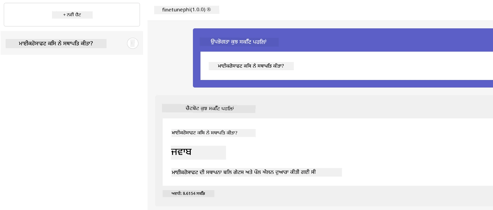

---

<!-- CO-OP TRANSLATOR DISCLAIMER START -->
**ਇਸਤੇਮਾਲੀ ਨੋਟ**:  
ਇਹ ਦਸਤਾਵੇਜ਼ ਏਆਈ ਅਨੁਵਾਦ ਸੇਵਾ [ਕੋ-ਓਪ ਟ੍ਰਾਂਸਲੇਟਰ](https://github.com/Azure/co-op-translator) ਦੀ ਵਰਤੋਂ ਕਰਕੇ ਅਨੁਵਾਦ ਕੀਤਾ ਗਿਆ ਹੈ। ਜਦੋਂ ਕਿ ਅਸੀਂ ਸਹੀਅਤ ਲਈ ਕੋਸ਼ਿਸ਼ ਕਰਦੇ ਹਾਂ, ਕਿਰਪਾ ਕਰਕੇ ਧਿਆਨ ਵਿੱਚ ਰੱਖੋ ਕਿ ਆਟੋਮੈਟਿਕ ਅਨੁਵਾਦਾਂ ਵਿੱਚ ਗਲਤੀਆਂ ਜਾਂ ਅਣਅਗਾਹੀਆਂ ਹੋ ਸਕਦੀਆਂ ਹਨ। ਮੂਲ ਦਸਤਾਵੇਜ਼ ਜੋ ਕਿ ਇਸ ਦੀ ਮੂਲ ਭਾਸ਼ਾ ਵਿੱਚ ਹੈ, ਉਸੇ ਨੂੰ ਪ੍ਰਮਾਣਿਕ ਸੂਤਰ ਮੰਨਿਆ ਜਾਣਾ ਚਾਹੀਦਾ ਹੈ। ਮਹੱਤਵਪੂਰਨ ਜਾਣਕਾਰੀ ਲਈ, ਪੇਸ਼ੇਵਰ ਮਨੁੱਖੀ ਅਨੁਵਾਦ ਦੀ ਸਿਫਾਰਸ਼ ਕੀਤੀ ਜਾਂਦੀ ਹੈ। ਅਸੀਂ ਇਸ ਅਨੁਵਾਦ ਦੇ ਇਸਤੇਮਾਲ ਤੋਂ ਉਤਪੰਨ ਕਿਸੇ ਵੀ ਗਲਤਫਹਿਮੀ ਜਾਂ ਗਲਤ ਵਿਆਖਿਆਵਾਂ ਲਈ ਜ਼ਿੰਮੇਵਾਰ ਨਹੀਂ ਹਾਂ।
<!-- CO-OP TRANSLATOR DISCLAIMER END -->