<!--
CO_OP_TRANSLATOR_METADATA:
{
  "original_hash": "ecbd9179a21edbaafaf114d47f09f3e3",
  "translation_date": "2025-07-17T01:21:17+00:00",
  "source_file": "md/02.Application/01.TextAndChat/Phi3/E2E_Phi-3-FineTuning_PromptFlow_Integration_AIFoundry.md",
  "language_code": "pa"
}
-->
# Fine-tune ਅਤੇ Prompt flow ਨਾਲ Azure AI Foundry ਵਿੱਚ custom Phi-3 ਮਾਡਲ ਇੰਟੀਗ੍ਰੇਟ ਕਰੋ

ਇਹ end-to-end (E2E) ਸੈਂਪਲ Microsoft Tech Community ਦੇ "[Fine-Tune and Integrate Custom Phi-3 Models with Prompt Flow in Azure AI Foundry](https://techcommunity.microsoft.com/t5/educator-developer-blog/fine-tune-and-integrate-custom-phi-3-models-with-prompt-flow-in/ba-p/4191726?WT.mc_id=aiml-137032-kinfeylo)" ਗਾਈਡ 'ਤੇ ਆਧਾਰਿਤ ਹੈ। ਇਹ fine-tuning, ਡਿਪਲੋਇਮੈਂਟ ਅਤੇ custom Phi-3 ਮਾਡਲਾਂ ਨੂੰ Azure AI Foundry ਵਿੱਚ Prompt flow ਨਾਲ ਇੰਟੀਗ੍ਰੇਟ ਕਰਨ ਦੀ ਪ੍ਰਕਿਰਿਆ ਨੂੰ ਜਾਣੂ ਕਰਵਾਉਂਦਾ ਹੈ।  
E2E ਸੈਂਪਲ "[Fine-Tune and Integrate Custom Phi-3 Models with Prompt Flow](./E2E_Phi-3-FineTuning_PromptFlow_Integration.md)" ਦੇ ਵਿਰੁੱਧ, ਜਿਸ ਵਿੱਚ ਕੋਡ ਲੋਕਲ ਤੌਰ 'ਤੇ ਚਲਾਇਆ ਗਿਆ ਸੀ, ਇਹ ਟਿਊਟੋਰਿਯਲ ਪੂਰੀ ਤਰ੍ਹਾਂ Azure AI / ML Studio ਵਿੱਚ ਮਾਡਲ ਦੀ fine-tuning ਅਤੇ ਇੰਟੀਗ੍ਰੇਸ਼ਨ 'ਤੇ ਧਿਆਨ ਕੇਂਦ੍ਰਿਤ ਕਰਦਾ ਹੈ।

## ਓਵਰਵਿਊ

ਇਸ E2E ਸੈਂਪਲ ਵਿੱਚ, ਤੁਸੀਂ Phi-3 ਮਾਡਲ ਨੂੰ fine-tune ਕਰਨਾ ਅਤੇ ਇਸਨੂੰ Azure AI Foundry ਵਿੱਚ Prompt flow ਨਾਲ ਇੰਟੀਗ੍ਰੇਟ ਕਰਨਾ ਸਿੱਖੋਗੇ। Azure AI / ML Studio ਦੀ ਵਰਤੋਂ ਕਰਕੇ, ਤੁਸੀਂ custom AI ਮਾਡਲਾਂ ਨੂੰ ਡਿਪਲੋਇ ਕਰਨ ਅਤੇ ਵਰਤਣ ਲਈ ਇੱਕ ਵਰਕਫਲੋ ਸੈੱਟ ਕਰੋਗੇ। ਇਹ E2E ਸੈਂਪਲ ਤਿੰਨ ਸਿਨਾਰਿਓਜ਼ ਵਿੱਚ ਵੰਡਿਆ ਗਿਆ ਹੈ:

**ਸਿਨਾਰਿਓ 1: Azure ਸਰੋਤ ਸੈੱਟ ਕਰੋ ਅਤੇ fine-tuning ਲਈ ਤਿਆਰੀ ਕਰੋ**

**ਸਿਨਾਰਿਓ 2: Phi-3 ਮਾਡਲ ਨੂੰ fine-tune ਕਰੋ ਅਤੇ Azure Machine Learning Studio ਵਿੱਚ ਡਿਪਲੋਇ ਕਰੋ**

**ਸਿਨਾਰਿਓ 3: Prompt flow ਨਾਲ ਇੰਟੀਗ੍ਰੇਟ ਕਰੋ ਅਤੇ Azure AI Foundry ਵਿੱਚ ਆਪਣੇ custom ਮਾਡਲ ਨਾਲ ਗੱਲਬਾਤ ਕਰੋ**

ਇਹ ਹੈ ਇਸ E2E ਸੈਂਪਲ ਦਾ ਓਵਰਵਿਊ।

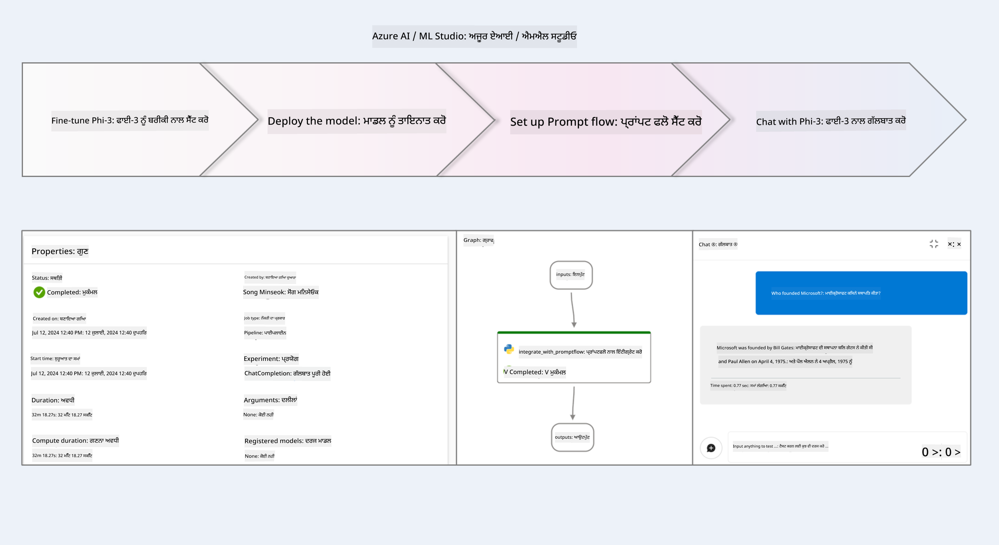

### ਸਮੱਗਰੀ ਦੀ ਸੂਚੀ

1. **[ਸਿਨਾਰਿਓ 1: Azure ਸਰੋਤ ਸੈੱਟ ਕਰੋ ਅਤੇ fine-tuning ਲਈ ਤਿਆਰੀ ਕਰੋ](../../../../../../md/02.Application/01.TextAndChat/Phi3)**
    - [Azure Machine Learning Workspace ਬਣਾਓ](../../../../../../md/02.Application/01.TextAndChat/Phi3)
    - [Azure Subscription ਵਿੱਚ GPU ਕੋਟਾ ਦੀ ਮੰਗ ਕਰੋ](../../../../../../md/02.Application/01.TextAndChat/Phi3)
    - [ਰੋਲ ਅਸਾਈਨਮੈਂਟ ਜੋੜੋ](../../../../../../md/02.Application/01.TextAndChat/Phi3)
    - [ਪ੍ਰੋਜੈਕਟ ਸੈੱਟ ਕਰੋ](../../../../../../md/02.Application/01.TextAndChat/Phi3)
    - [fine-tuning ਲਈ ਡੇਟਾਸੈੱਟ ਤਿਆਰ ਕਰੋ](../../../../../../md/02.Application/01.TextAndChat/Phi3)

1. **[ਸਿਨਾਰਿਓ 2: Phi-3 ਮਾਡਲ ਨੂੰ fine-tune ਕਰੋ ਅਤੇ Azure Machine Learning Studio ਵਿੱਚ ਡਿਪਲੋਇ ਕਰੋ](../../../../../../md/02.Application/01.TextAndChat/Phi3)**
    - [Phi-3 ਮਾਡਲ ਨੂੰ fine-tune ਕਰੋ](../../../../../../md/02.Application/01.TextAndChat/Phi3)
    - [fine-tuned Phi-3 ਮਾਡਲ ਨੂੰ ਡਿਪਲੋਇ ਕਰੋ](../../../../../../md/02.Application/01.TextAndChat/Phi3)

1. **[ਸਿਨਾਰਿਓ 3: Prompt flow ਨਾਲ ਇੰਟੀਗ੍ਰੇਟ ਕਰੋ ਅਤੇ Azure AI Foundry ਵਿੱਚ ਆਪਣੇ custom ਮਾਡਲ ਨਾਲ ਗੱਲਬਾਤ ਕਰੋ](../../../../../../md/02.Application/01.TextAndChat/Phi3)**
    - [custom Phi-3 ਮਾਡਲ ਨੂੰ Prompt flow ਨਾਲ ਇੰਟੀਗ੍ਰੇਟ ਕਰੋ](../../../../../../md/02.Application/01.TextAndChat/Phi3)
    - [ਆਪਣੇ custom Phi-3 ਮਾਡਲ ਨਾਲ ਗੱਲਬਾਤ ਕਰੋ](../../../../../../md/02.Application/01.TextAndChat/Phi3)

## ਸਿਨਾਰਿਓ 1: Azure ਸਰੋਤ ਸੈੱਟ ਕਰੋ ਅਤੇ fine-tuning ਲਈ ਤਿਆਰੀ ਕਰੋ

### Azure Machine Learning Workspace ਬਣਾਓ

1. ਪੋਰਟਲ ਪੇਜ਼ ਦੇ ਸਿਖਰਲੇ ਹਿੱਸੇ ਵਿੱਚ **search bar** ਵਿੱਚ *azure machine learning* ਟਾਈਪ ਕਰੋ ਅਤੇ ਆਉਣ ਵਾਲੇ ਵਿਕਲਪਾਂ ਵਿੱਚੋਂ **Azure Machine Learning** ਚੁਣੋ।

    

2. ਨੈਵੀਗੇਸ਼ਨ ਮੀਨੂ ਵਿੱਚੋਂ **+ Create** ਚੁਣੋ।

3. ਨੈਵੀਗੇਸ਼ਨ ਮੀਨੂ ਵਿੱਚੋਂ **New workspace** ਚੁਣੋ।

    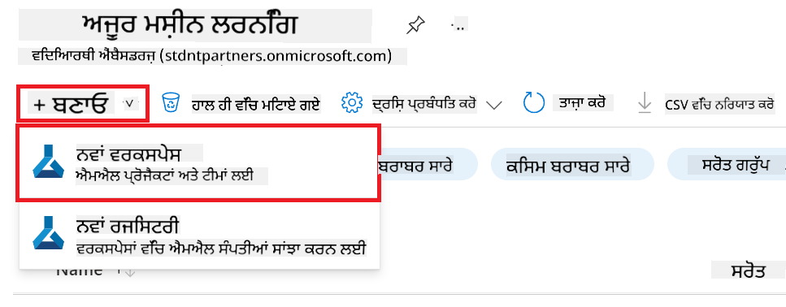

4. ਹੇਠਾਂ ਦਿੱਤੇ ਕੰਮ ਕਰੋ:

    - ਆਪਣੀ Azure **Subscription** ਚੁਣੋ।
    - ਵਰਤਣ ਲਈ **Resource group** ਚੁਣੋ (ਜੇ ਲੋੜ ਹੋਵੇ ਤਾਂ ਨਵਾਂ ਬਣਾਓ)।
    - **Workspace Name** ਦਿਓ। ਇਹ ਇੱਕ ਵਿਲੱਖਣ ਨਾਮ ਹੋਣਾ ਚਾਹੀਦਾ ਹੈ।
    - ਵਰਤਣ ਲਈ **Region** ਚੁਣੋ।
    - ਵਰਤਣ ਲਈ **Storage account** ਚੁਣੋ (ਜੇ ਲੋੜ ਹੋਵੇ ਤਾਂ ਨਵਾਂ ਬਣਾਓ)।
    - ਵਰਤਣ ਲਈ **Key vault** ਚੁਣੋ (ਜੇ ਲੋੜ ਹੋਵੇ ਤਾਂ ਨਵਾਂ ਬਣਾਓ)।
    - ਵਰਤਣ ਲਈ **Application insights** ਚੁਣੋ (ਜੇ ਲੋੜ ਹੋਵੇ ਤਾਂ ਨਵਾਂ ਬਣਾਓ)।
    - ਵਰਤਣ ਲਈ **Container registry** ਚੁਣੋ (ਜੇ ਲੋੜ ਹੋਵੇ ਤਾਂ ਨਵਾਂ ਬਣਾਓ)।

    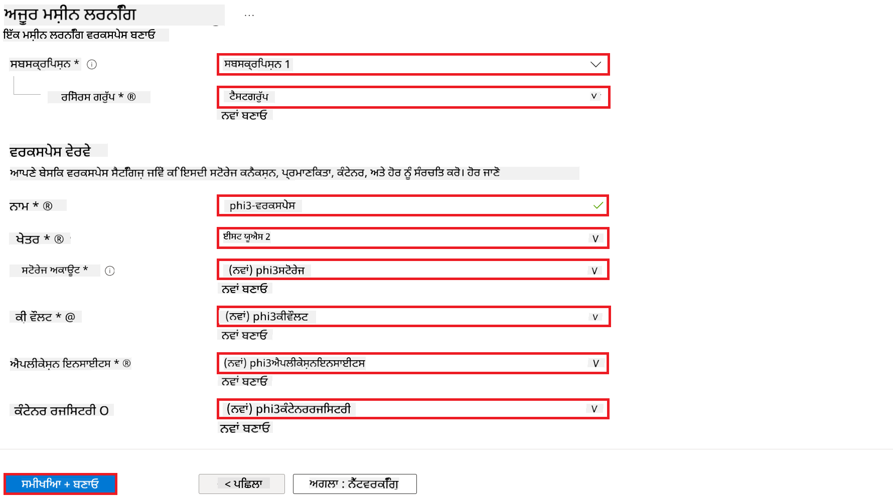

5. **Review + Create** ਚੁਣੋ।

6. **Create** ਚੁਣੋ।

### Azure Subscription ਵਿੱਚ GPU ਕੋਟਾ ਦੀ ਮੰਗ ਕਰੋ

ਇਸ ਟਿਊਟੋਰਿਯਲ ਵਿੱਚ, ਤੁਸੀਂ GPUs ਦੀ ਵਰਤੋਂ ਕਰਕੇ Phi-3 ਮਾਡਲ ਨੂੰ fine-tune ਅਤੇ ਡਿਪਲੋਇ ਕਰਨਾ ਸਿੱਖੋਗੇ। fine-tuning ਲਈ, ਤੁਸੀਂ *Standard_NC24ads_A100_v4* GPU ਦੀ ਵਰਤੋਂ ਕਰੋਗੇ, ਜਿਸ ਲਈ ਕੋਟਾ ਦੀ ਮੰਗ ਕਰਨੀ ਪੈਂਦੀ ਹੈ। ਡਿਪਲੋਇਮੈਂਟ ਲਈ, ਤੁਸੀਂ *Standard_NC6s_v3* GPU ਦੀ ਵਰਤੋਂ ਕਰੋਗੇ, ਜਿਸ ਲਈ ਵੀ ਕੋਟਾ ਦੀ ਮੰਗ ਜਰੂਰੀ ਹੈ।

> [!NOTE]
>
> ਸਿਰਫ Pay-As-You-Go ਸਬਸਕ੍ਰਿਪਸ਼ਨ (ਮਿਆਰੀ ਸਬਸਕ੍ਰਿਪਸ਼ਨ ਕਿਸਮ) GPU ਅਲੋਕੇਸ਼ਨ ਲਈ ਯੋਗ ਹਨ; ਬੇਨਿਫਿਟ ਸਬਸਕ੍ਰਿਪਸ਼ਨ ਇਸ ਸਮੇਂ ਸਹਾਇਤਿਤ ਨਹੀਂ ਹਨ।
>

1. [Azure ML Studio](https://ml.azure.com/home?wt.mc_id=studentamb_279723) 'ਤੇ ਜਾਓ।

1. *Standard NCADSA100v4 Family* ਕੋਟਾ ਦੀ ਮੰਗ ਕਰਨ ਲਈ ਹੇਠਾਂ ਦਿੱਤੇ ਕੰਮ ਕਰੋ:

    - ਖੱਬੇ ਪਾਸੇ ਟੈਬ ਵਿੱਚੋਂ **Quota** ਚੁਣੋ।
    - ਵਰਤਣ ਲਈ **Virtual machine family** ਚੁਣੋ। ਉਦਾਹਰਨ ਵਜੋਂ, **Standard NCADSA100v4 Family Cluster Dedicated vCPUs** ਚੁਣੋ, ਜਿਸ ਵਿੱਚ *Standard_NC24ads_A100_v4* GPU ਸ਼ਾਮਲ ਹੈ।
    - ਨੈਵੀਗੇਸ਼ਨ ਮੀਨੂ ਵਿੱਚੋਂ **Request quota** ਚੁਣੋ।

        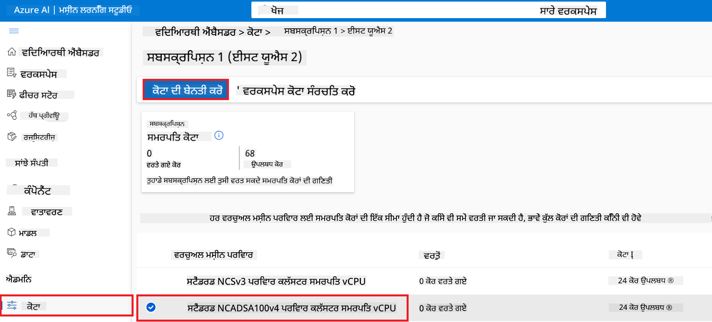

    - Request quota ਪੇਜ਼ ਵਿੱਚ, ਵਰਤਣ ਲਈ **New cores limit** ਦਿਓ। ਉਦਾਹਰਨ ਵਜੋਂ, 24।
    - Request quota ਪੇਜ਼ ਵਿੱਚ, GPU ਕੋਟਾ ਦੀ ਮੰਗ ਕਰਨ ਲਈ **Submit** ਚੁਣੋ।

1. *Standard NCSv3 Family* ਕੋਟਾ ਦੀ ਮੰਗ ਕਰਨ ਲਈ ਹੇਠਾਂ ਦਿੱਤੇ ਕੰਮ ਕਰੋ:

    - ਖੱਬੇ ਪਾਸੇ ਟੈਬ ਵਿੱਚੋਂ **Quota** ਚੁਣੋ।
    - ਵਰਤਣ ਲਈ **Virtual machine family** ਚੁਣੋ। ਉਦਾਹਰਨ ਵਜੋਂ, **Standard NCSv3 Family Cluster Dedicated vCPUs** ਚੁਣੋ, ਜਿਸ ਵਿੱਚ *Standard_NC6s_v3* GPU ਸ਼ਾਮਲ ਹੈ।
    - ਨੈਵੀਗੇਸ਼ਨ ਮੀਨੂ ਵਿੱਚੋਂ **Request quota** ਚੁਣੋ।
    - Request quota ਪੇਜ਼ ਵਿੱਚ, ਵਰਤਣ ਲਈ **New cores limit** ਦਿਓ। ਉਦਾਹਰਨ ਵਜੋਂ, 24।
    - Request quota ਪੇਜ਼ ਵਿੱਚ, GPU ਕੋਟਾ ਦੀ ਮੰਗ ਕਰਨ ਲਈ **Submit** ਚੁਣੋ।

### ਰੋਲ ਅਸਾਈਨਮੈਂਟ ਜੋੜੋ

ਆਪਣੇ ਮਾਡਲਾਂ ਨੂੰ fine-tune ਅਤੇ ਡਿਪਲੋਇ ਕਰਨ ਲਈ, ਤੁਹਾਨੂੰ ਪਹਿਲਾਂ ਇੱਕ User Assigned Managed Identity (UAI) ਬਣਾਉਣੀ ਪਵੇਗੀ ਅਤੇ ਇਸਨੂੰ ਸਹੀ ਅਧਿਕਾਰ ਦੇਣੇ ਪੈਣਗੇ। ਇਹ UAI ਡਿਪਲੋਇਮੈਂਟ ਦੌਰਾਨ ਪ੍ਰਮਾਣਿਕਤਾ ਲਈ ਵਰਤੀ ਜਾਵੇਗੀ।

#### User Assigned Managed Identity (UAI) ਬਣਾਓ

1. ਪੋਰਟਲ ਪੇਜ਼ ਦੇ ਸਿਖਰਲੇ ਹਿੱਸੇ ਵਿੱਚ **search bar** ਵਿੱਚ *managed identities* ਟਾਈਪ ਕਰੋ ਅਤੇ ਆਉਣ ਵਾਲੇ ਵਿਕਲਪਾਂ ਵਿੱਚੋਂ **Managed Identities** ਚੁਣੋ।

    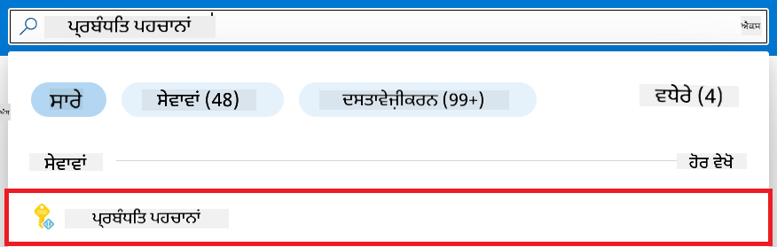

1. **+ Create** ਚੁਣੋ।

    

1. ਹੇਠਾਂ ਦਿੱਤੇ ਕੰਮ ਕਰੋ:

    - ਆਪਣੀ Azure **Subscription** ਚੁਣੋ।
    - ਵਰਤਣ ਲਈ **Resource group** ਚੁਣੋ (ਜੇ ਲੋੜ ਹੋਵੇ ਤਾਂ ਨਵਾਂ ਬਣਾਓ)।
    - ਵਰਤਣ ਲਈ **Region** ਚੁਣੋ।
    - **Name** ਦਿਓ। ਇਹ ਇੱਕ ਵਿਲੱਖਣ ਨਾਮ ਹੋਣਾ ਚਾਹੀਦਾ ਹੈ।

    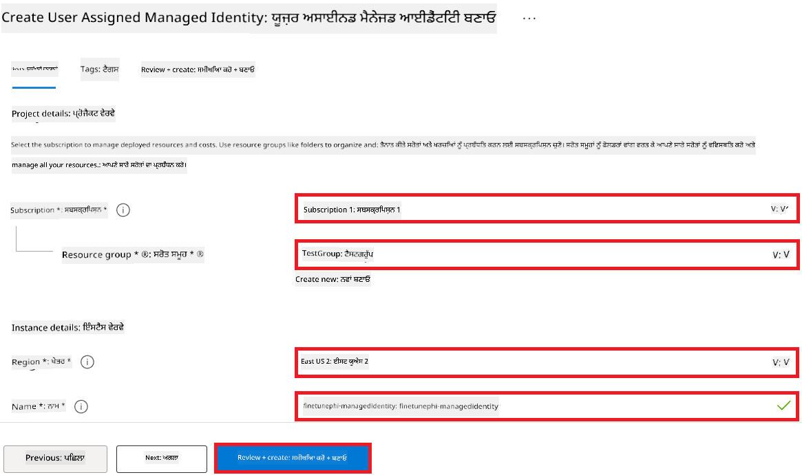

1. **Review + create** ਚੁਣੋ।

1. **+ Create** ਚੁਣੋ।

#### Managed Identity ਨੂੰ Contributor ਰੋਲ ਅਸਾਈਨਮੈਂਟ ਜੋੜੋ

1. ਉਸ Managed Identity ਰਿਸੋਰਸ 'ਤੇ ਜਾਓ ਜੋ ਤੁਸੀਂ ਬਣਾਈ ਹੈ।

1. ਖੱਬੇ ਪਾਸੇ ਟੈਬ ਵਿੱਚੋਂ **Azure role assignments** ਚੁਣੋ।

1. ਨੈਵੀਗੇਸ਼ਨ ਮੀਨੂ ਵਿੱਚੋਂ **+Add role assignment** ਚੁਣੋ।

1. Add role assignment ਪੇਜ਼ ਵਿੱਚ ਹੇਠਾਂ ਦਿੱਤੇ ਕੰਮ ਕਰੋ:
    - **Scope** ਨੂੰ **Resource group** ਚੁਣੋ।
    - ਆਪਣੀ Azure **Subscription** ਚੁਣੋ।
    - ਵਰਤਣ ਲਈ **Resource group** ਚੁਣੋ।
    - **Role** ਨੂੰ **Contributor** ਚੁਣੋ।

    

2. **Save** ਚੁਣੋ।

#### Managed Identity ਨੂੰ Storage Blob Data Reader ਰੋਲ ਅਸਾਈਨਮੈਂਟ ਜੋੜੋ

1. ਪੋਰਟਲ ਪੇਜ਼ ਦੇ ਸਿਖਰਲੇ ਹਿੱਸੇ ਵਿੱਚ **search bar** ਵਿੱਚ *storage accounts* ਟਾਈਪ ਕਰੋ ਅਤੇ ਆਉਣ ਵਾਲੇ ਵਿਕਲਪਾਂ ਵਿੱਚੋਂ **Storage accounts** ਚੁਣੋ।

    

1. ਉਸ storage account ਨੂੰ ਚੁਣੋ ਜੋ Azure Machine Learning workspace ਨਾਲ ਜੁੜਿਆ ਹੋਇਆ ਹੈ। ਉਦਾਹਰਨ ਵਜੋਂ, *finetunephistorage*।

1. Add role assignment ਪੇਜ਼ 'ਤੇ ਜਾਣ ਲਈ ਹੇਠਾਂ ਦਿੱਤੇ ਕੰਮ ਕਰੋ:

    - ਉਸ Azure Storage account 'ਤੇ ਜਾਓ ਜੋ ਤੁਸੀਂ ਬਣਾਇਆ ਹੈ।
    - ਖੱਬੇ ਪਾਸੇ ਟੈਬ ਵਿੱਚੋਂ **Access Control (IAM)** ਚੁਣੋ।
    - ਨੈਵੀਗੇਸ਼ਨ ਮੀਨੂ ਵਿੱਚੋਂ **+ Add** ਚੁਣੋ।
    - ਨੈਵੀਗੇਸ਼ਨ ਮੀਨੂ ਵਿੱਚੋਂ **Add role assignment** ਚੁਣੋ।

    

1. Add role assignment ਪੇਜ਼ ਵਿੱਚ ਹੇਠਾਂ ਦਿੱਤੇ ਕੰਮ ਕਰੋ:

    - Role ਪੇਜ਼ ਵਿੱਚ, **search bar** ਵਿੱਚ *Storage Blob Data Reader* ਟਾਈਪ ਕਰੋ ਅਤੇ ਆਉਣ ਵਾਲੇ ਵਿਕਲਪਾਂ ਵਿੱਚੋਂ **Storage Blob Data Reader** ਚੁਣੋ।
    - Role ਪੇਜ਼ ਵਿੱਚ, **Next** ਚੁਣੋ।
    - Members ਪੇਜ਼ ਵਿੱਚ, **Assign access to** ਵਜੋਂ **Managed identity** ਚੁਣੋ।
    - Members ਪੇਜ਼ ਵਿੱਚ, **+ Select members** ਚੁਣੋ।
    - Select managed identities ਪੇਜ਼ ਵਿੱਚ, ਆਪਣੀ Azure **Subscription** ਚੁਣੋ।
    - Select managed identities ਪੇਜ਼ ਵਿੱਚ, **Managed identity** ਵਜੋਂ **Manage Identity** ਚੁਣੋ।
    - Select managed identities ਪੇਜ਼ ਵਿੱਚ, ਉਹ Manage Identity ਚੁਣੋ ਜੋ ਤੁਸੀਂ ਬਣਾਈ ਹੈ। ਉਦਾਹਰਨ ਵਜੋਂ, *finetunephi-managedidentity*।
    - Select managed identities ਪੇਜ਼ ਵਿੱਚ, **Select** ਚੁਣੋ।

    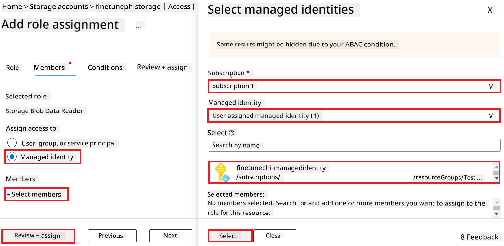

1. **Review + assign** ਚੁਣੋ।

#### Managed Identity ਨੂੰ AcrPull ਰੋਲ ਅਸਾਈਨਮੈਂਟ ਜੋੜੋ

1. ਪੋਰਟਲ ਪੇਜ਼ ਦੇ ਸਿਖਰਲੇ ਹਿੱਸੇ ਵਿੱਚ **search bar** ਵਿੱਚ *container registries* ਟਾਈਪ ਕਰੋ ਅਤੇ ਆਉਣ ਵਾਲੇ ਵਿਕਲਪਾਂ ਵਿੱਚੋਂ **Container registries** ਚੁਣੋ।

    

1. ਉਸ container registry ਨੂੰ ਚੁਣੋ ਜੋ Azure Machine Learning workspace ਨਾਲ ਜੁੜਿਆ ਹੋਇਆ ਹੈ। ਉਦਾਹਰਨ ਵਜੋਂ, *finetunephicontainerregistry*

1. Add role assignment ਪੇਜ਼ 'ਤੇ ਜਾਣ ਲਈ ਹੇਠਾਂ ਦਿੱਤੇ ਕੰਮ ਕਰੋ:

    - ਖੱਬੇ ਪਾਸੇ ਟੈਬ ਵਿੱਚੋਂ **Access Control (IAM)** ਚੁਣੋ।
    - ਨੈਵੀਗੇਸ਼ਨ ਮੀਨੂ ਵਿੱਚੋਂ **+ Add** ਚੁਣੋ।
    - ਨੈਵੀਗੇਸ਼ਨ ਮੀਨੂ ਵਿੱਚੋਂ **Add role assignment** ਚੁਣੋ।

1. Add role assignment ਪੇਜ਼ ਵਿੱਚ ਹੇਠਾਂ ਦਿੱਤੇ ਕੰਮ ਕਰੋ:

    - Role ਪੇਜ਼ ਵਿੱਚ, **search bar** ਵਿੱਚ *AcrPull* ਟਾਈਪ ਕਰੋ ਅਤੇ ਆਉਣ ਵਾਲੇ ਵਿਕਲਪਾਂ ਵਿੱਚੋਂ **AcrPull** ਚੁਣੋ।
    - Role ਪੇਜ਼ ਵਿੱਚ, **Next** ਚੁਣੋ।
    - Members ਪੇਜ਼ ਵਿੱਚ, **Assign access to** ਵਜੋਂ **Managed identity** ਚੁਣੋ।
    - Members ਪੇਜ਼ ਵਿੱਚ, **+ Select members** ਚੁਣੋ।
    - Select managed identities ਪੇਜ਼ ਵਿੱਚ, ਆਪਣੀ Azure **Subscription** ਚੁਣੋ।
    - Select managed identities ਪੇਜ਼ ਵਿੱਚ, **Managed identity** ਵਜੋਂ **Manage Identity** ਚੁਣੋ।
    - Select managed identities ਪੇਜ਼ ਵਿੱਚ, ਉਹ Manage Identity ਚੁਣੋ ਜੋ ਤੁਸੀਂ ਬਣਾਈ ਹੈ। ਉਦਾਹਰਨ ਵਜੋਂ, *finetunephi-managedidentity*।
    - Select managed identities ਪੇਜ਼ ਵਿੱਚ, **Select** ਚੁਣੋ।
    - **Review + assign** ਚੁਣੋ।

### ਪ੍ਰੋਜੈਕਟ ਸੈੱਟ ਕਰੋ

fine-tuning ਲਈ ਲੋੜੀਂਦੇ ਡੇਟਾਸੈੱਟ ਡਾਊਨਲੋਡ ਕਰਨ ਲਈ, ਤੁਸੀਂ ਇੱਕ ਲੋਕਲ ਵਾਤਾਵਰਣ ਸੈੱਟ ਕਰੋਗੇ।

ਇਸ ਅਭਿਆਸ ਵਿੱਚ, ਤੁਸੀਂ

- ਕੰਮ ਕਰਨ ਲਈ ਇੱਕ ਫੋਲਡਰ ਬਣਾਓਗੇ।
- ਇੱਕ ਵਰਚੁਅਲ ਵਾਤਾਵਰਣ ਬਣਾਓਗੇ।
- ਲੋੜੀਂਦੇ ਪੈਕੇਜ ਇੰਸਟਾਲ ਕਰੋਗੇ।
- ਡੇਟਾਸੈੱਟ ਡਾਊਨਲੋਡ ਕਰਨ ਲਈ *download_dataset.py* ਫਾਇਲ ਬਣਾਓਗੇ।

#### ਕੰਮ ਕਰਨ ਲਈ ਫੋਲਡਰ ਬਣਾਓ

1. ਟਰਮੀਨਲ ਵਿੰਡੋ ਖੋਲ੍ਹੋ ਅਤੇ ਡਿਫਾਲਟ ਪਾਥ ਵਿੱਚ *finetune-phi* ਨਾਮ ਦਾ ਫੋਲਡਰ ਬਣਾਉਣ ਲਈ ਹੇਠਾਂ ਦਿੱਤਾ ਕਮਾਂਡ ਟਾਈਪ ਕਰੋ।

    ```console
    mkdir finetune-phi
    ```

2. ਆਪਣੇ ਟਰਮੀਨਲ ਵਿੱਚ ਹੇਠਾਂ ਦਿੱਤਾ ਕਮਾਂਡ ਟਾਈਪ ਕਰਕੇ
#### ਇੱਕ ਵਰਚੁਅਲ ਵਾਤਾਵਰਣ ਬਣਾਓ

1. ਆਪਣੇ ਟਰਮੀਨਲ ਵਿੱਚ ਹੇਠਾਂ ਦਿੱਤਾ ਕਮਾਂਡ ਟਾਈਪ ਕਰੋ ਤਾਂ ਜੋ *.venv* ਨਾਮਕ ਵਰਚੁਅਲ ਵਾਤਾਵਰਣ ਬਣਾਇਆ ਜਾ ਸਕੇ।

2. ਆਪਣੇ ਟਰਮੀਨਲ ਵਿੱਚ ਹੇਠਾਂ ਦਿੱਤਾ ਕਮਾਂਡ ਟਾਈਪ ਕਰੋ ਤਾਂ ਜੋ ਵਰਚੁਅਲ ਵਾਤਾਵਰਣ ਨੂੰ ਐਕਟੀਵੇਟ ਕੀਤਾ ਜਾ ਸਕੇ।

> [!NOTE]
> ਜੇ ਇਹ ਕੰਮ ਕਰ ਗਿਆ, ਤਾਂ ਤੁਹਾਨੂੰ ਕਮਾਂਡ ਪ੍ਰਾਂਪਟ ਤੋਂ ਪਹਿਲਾਂ *(.venv)* ਦਿਖਾਈ ਦੇਣਾ ਚਾਹੀਦਾ ਹੈ।

#### ਲੋੜੀਂਦੇ ਪੈਕੇਜ ਇੰਸਟਾਲ ਕਰੋ

1. ਆਪਣੇ ਟਰਮੀਨਲ ਵਿੱਚ ਹੇਠਾਂ ਦਿੱਤੇ ਕਮਾਂਡ ਟਾਈਪ ਕਰੋ ਤਾਂ ਜੋ ਲੋੜੀਂਦੇ ਪੈਕੇਜ ਇੰਸਟਾਲ ਕੀਤੇ ਜਾ ਸਕਣ।

#### `download_dataset.py` ਬਣਾਓ

> [!NOTE]
> ਪੂਰਾ ਫੋਲਡਰ ਸਟ੍ਰਕਚਰ:
>
> ```text
> └── YourUserName
> .    └── finetune-phi
> .        └── download_dataset.py
> ```

1. **Visual Studio Code** ਖੋਲ੍ਹੋ।

1. ਮੈਨੂ ਬਾਰ ਵਿੱਚੋਂ **File** ਚੁਣੋ।

1. **Open Folder** ਚੁਣੋ।

1. *finetune-phi* ਫੋਲਡਰ ਚੁਣੋ ਜੋ ਤੁਸੀਂ ਬਣਾਇਆ ਸੀ, ਜੋ ਕਿ *C:\Users\yourUserName\finetune-phi* ਵਿੱਚ ਸਥਿਤ ਹੈ।

    

1. Visual Studio Code ਦੇ ਖੱਬੇ ਪੈਨ ਵਿੱਚ, ਰਾਈਟ-ਕਲਿੱਕ ਕਰੋ ਅਤੇ **New File** ਚੁਣੋ ਤਾਂ ਜੋ *download_dataset.py* ਨਾਮ ਦਾ ਨਵਾਂ ਫਾਇਲ ਬਣਾਇਆ ਜਾ ਸਕੇ।

    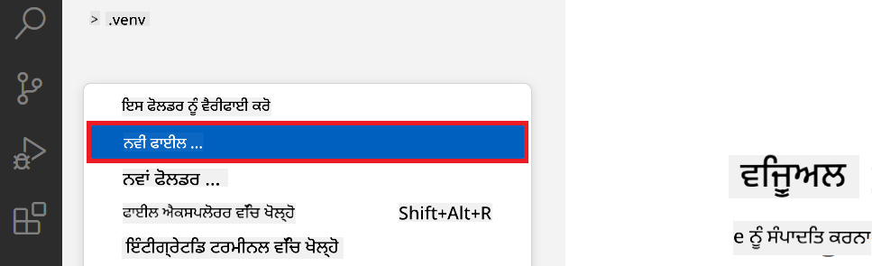

### ਫਾਈਨ-ਟਿਊਨਿੰਗ ਲਈ ਡੇਟਾਸੈੱਟ ਤਿਆਰ ਕਰੋ

ਇਸ ਅਭਿਆਸ ਵਿੱਚ, ਤੁਸੀਂ *download_dataset.py* ਫਾਇਲ ਚਲਾਕੇ *ultrachat_200k* ਡੇਟਾਸੈੱਟ ਆਪਣੇ ਲੋਕਲ ਵਾਤਾਵਰਣ ਵਿੱਚ ਡਾਊਨਲੋਡ ਕਰੋਗੇ। ਫਿਰ ਤੁਸੀਂ ਇਸ ਡੇਟਾਸੈੱਟ ਦੀ ਵਰਤੋਂ ਕਰਕੇ Azure Machine Learning ਵਿੱਚ Phi-3 ਮਾਡਲ ਨੂੰ ਫਾਈਨ-ਟਿਊਨ ਕਰੋਗੇ।

ਇਸ ਅਭਿਆਸ ਵਿੱਚ, ਤੁਸੀਂ:

- *download_dataset.py* ਫਾਇਲ ਵਿੱਚ ਕੋਡ ਜੋੜੋਗੇ ਤਾਂ ਜੋ ਡੇਟਾਸੈੱਟ ਡਾਊਨਲੋਡ ਹੋ ਸਕਣ।
- *download_dataset.py* ਫਾਇਲ ਚਲਾਕੇ ਡੇਟਾਸੈੱਟ ਆਪਣੇ ਲੋਕਲ ਵਾਤਾਵਰਣ ਵਿੱਚ ਡਾਊਨਲੋਡ ਕਰੋਗੇ।

#### *download_dataset.py* ਦੀ ਵਰਤੋਂ ਕਰਕੇ ਆਪਣਾ ਡੇਟਾਸੈੱਟ ਡਾਊਨਲੋਡ ਕਰੋ

1. Visual Studio Code ਵਿੱਚ *download_dataset.py* ਫਾਇਲ ਖੋਲ੍ਹੋ।

1. *download_dataset.py* ਫਾਇਲ ਵਿੱਚ ਹੇਠਾਂ ਦਿੱਤਾ ਕੋਡ ਸ਼ਾਮਲ ਕਰੋ।

1. ਆਪਣੇ ਟਰਮੀਨਲ ਵਿੱਚ ਹੇਠਾਂ ਦਿੱਤਾ ਕਮਾਂਡ ਟਾਈਪ ਕਰੋ ਤਾਂ ਜੋ ਸਕ੍ਰਿਪਟ ਚੱਲੇ ਅਤੇ ਡੇਟਾਸੈੱਟ ਤੁਹਾਡੇ ਲੋਕਲ ਵਾਤਾਵਰਣ ਵਿੱਚ ਡਾਊਨਲੋਡ ਹੋ ਜਾਵੇ।

1. ਯਕੀਨੀ ਬਣਾਓ ਕਿ ਡੇਟਾਸੈੱਟ ਸਫਲਤਾਪੂਰਵਕ ਤੁਹਾਡੇ ਲੋਕਲ *finetune-phi/data* ਡਾਇਰੈਕਟਰੀ ਵਿੱਚ ਸੇਵ ਹੋ ਗਏ ਹਨ।

> [!NOTE]
>
> #### ਡੇਟਾਸੈੱਟ ਦੇ ਆਕਾਰ ਅਤੇ ਫਾਈਨ-ਟਿਊਨਿੰਗ ਸਮੇਂ ਬਾਰੇ ਨੋਟ
>
> ਇਸ ਟਿਊਟੋਰਿਯਲ ਵਿੱਚ, ਤੁਸੀਂ ਸਿਰਫ 1% ਡੇਟਾਸੈੱਟ (`split='train[:1%]'`) ਦੀ ਵਰਤੋਂ ਕਰਦੇ ਹੋ। ਇਸ ਨਾਲ ਡੇਟਾ ਦੀ ਮਾਤਰਾ ਕਾਫੀ ਘੱਟ ਹੋ ਜਾਂਦੀ ਹੈ, ਜਿਸ ਨਾਲ ਅਪਲੋਡ ਅਤੇ ਫਾਈਨ-ਟਿਊਨਿੰਗ ਦੋਹਾਂ ਦੀ ਪ੍ਰਕਿਰਿਆ ਤੇਜ਼ ਹੋ ਜਾਂਦੀ ਹੈ। ਤੁਸੀਂ ਪ੍ਰਤੀਸ਼ਤ ਨੂੰ ਬਦਲ ਕੇ ਟ੍ਰੇਨਿੰਗ ਸਮੇਂ ਅਤੇ ਮਾਡਲ ਦੀ ਕਾਰਗੁਜ਼ਾਰੀ ਵਿੱਚ ਸਹੀ ਸੰਤੁਲਨ ਲੱਭ ਸਕਦੇ ਹੋ। ਡੇਟਾਸੈੱਟ ਦੇ ਛੋਟੇ ਹਿੱਸੇ ਦੀ ਵਰਤੋਂ ਨਾਲ ਫਾਈਨ-ਟਿਊਨਿੰਗ ਲਈ ਲੱਗਣ ਵਾਲਾ ਸਮਾਂ ਘੱਟ ਹੁੰਦਾ ਹੈ, ਜਿਸ ਨਾਲ ਟਿਊਟੋਰਿਯਲ ਲਈ ਪ੍ਰਕਿਰਿਆ ਆਸਾਨ ਬਣ ਜਾਂਦੀ ਹੈ।

## ਸਿਨਾਰਿਓ 2: Phi-3 ਮਾਡਲ ਨੂੰ ਫਾਈਨ-ਟਿਊਨ ਕਰੋ ਅਤੇ Azure Machine Learning Studio ਵਿੱਚ ਡਿਪਲੋਇ ਕਰੋ

### Phi-3 ਮਾਡਲ ਨੂੰ ਫਾਈਨ-ਟਿਊਨ ਕਰੋ

ਇਸ ਅਭਿਆਸ ਵਿੱਚ, ਤੁਸੀਂ Azure Machine Learning Studio ਵਿੱਚ Phi-3 ਮਾਡਲ ਨੂੰ ਫਾਈਨ-ਟਿਊਨ ਕਰੋਗੇ।

ਇਸ ਅਭਿਆਸ ਵਿੱਚ, ਤੁਸੀਂ:

- ਫਾਈਨ-ਟਿਊਨਿੰਗ ਲਈ ਕੰਪਿਊਟਰ ਕਲੱਸਟਰ ਬਣਾਓਗੇ।
- Azure Machine Learning Studio ਵਿੱਚ Phi-3 ਮਾਡਲ ਨੂੰ ਫਾਈਨ-ਟਿਊਨ ਕਰੋਗੇ।

#### ਫਾਈਨ-ਟਿਊਨਿੰਗ ਲਈ ਕੰਪਿਊਟਰ ਕਲੱਸਟਰ ਬਣਾਓ

1. [Azure ML Studio](https://ml.azure.com/home?wt.mc_id=studentamb_279723) 'ਤੇ ਜਾਓ।

1. ਖੱਬੇ ਪਾਸੇ ਟੈਬ ਵਿੱਚੋਂ **Compute** ਚੁਣੋ।

1. ਨੈਵੀਗੇਸ਼ਨ ਮੈਨੂ ਵਿੱਚੋਂ **Compute clusters** ਚੁਣੋ।

1. **+ New** ਚੁਣੋ।

    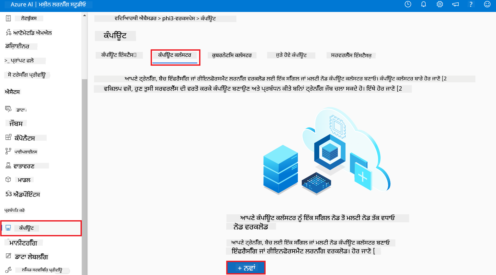

1. ਹੇਠਾਂ ਦਿੱਤੇ ਕੰਮ ਕਰੋ:

    - ਆਪਣੀ ਪਸੰਦ ਦੀ **Region** ਚੁਣੋ।
    - **Virtual machine tier** ਨੂੰ **Dedicated** ਚੁਣੋ।
    - **Virtual machine type** ਨੂੰ **GPU** ਚੁਣੋ।
    - **Virtual machine size** ਫਿਲਟਰ ਨੂੰ **Select from all options** ਚੁਣੋ।
    - **Virtual machine size** ਨੂੰ **Standard_NC24ads_A100_v4** ਚੁਣੋ।

    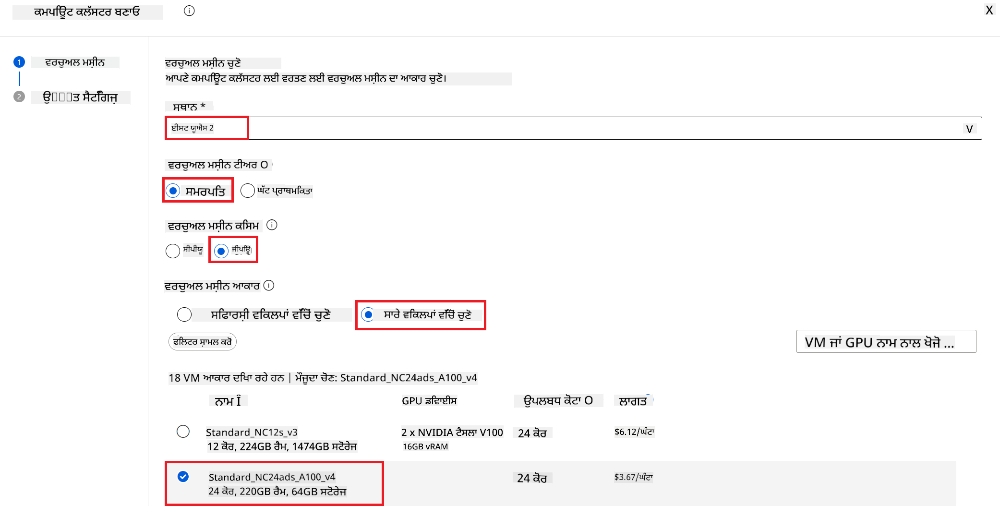

1. **Next** ਚੁਣੋ।

1. ਹੇਠਾਂ ਦਿੱਤੇ ਕੰਮ ਕਰੋ:

    - **Compute name** ਦਿਓ। ਇਹ ਇੱਕ ਵਿਲੱਖਣ ਨਾਮ ਹੋਣਾ ਚਾਹੀਦਾ ਹੈ।
    - **Minimum number of nodes** ਨੂੰ **0** ਚੁਣੋ।
    - **Maximum number of nodes** ਨੂੰ **1** ਚੁਣੋ।
    - **Idle seconds before scale down** ਨੂੰ **120** ਸੈੱਟ ਕਰੋ।

    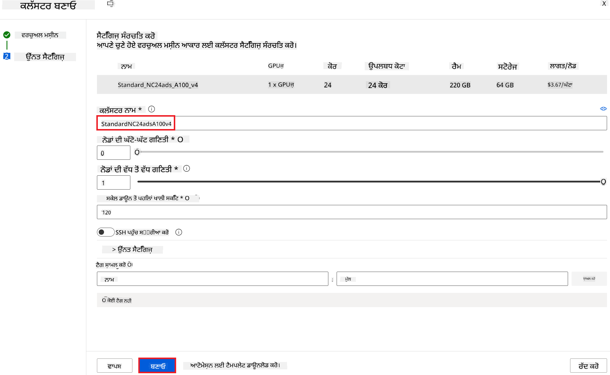

1. **Create** ਚੁਣੋ।

#### Phi-3 ਮਾਡਲ ਨੂੰ ਫਾਈਨ-ਟਿਊਨ ਕਰੋ

1. [Azure ML Studio](https://ml.azure.com/home?wt.mc_id=studentamb_279723) 'ਤੇ ਜਾਓ।

1. ਆਪਣਾ ਬਣਾਇਆ ਹੋਇਆ Azure Machine Learning ਵਰਕਸਪੇਸ ਚੁਣੋ।

    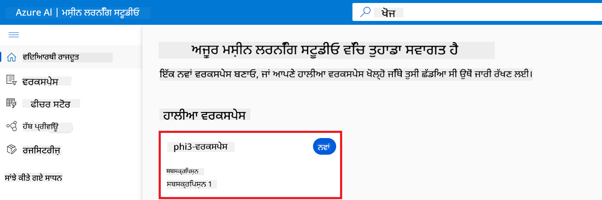

1. ਹੇਠਾਂ ਦਿੱਤੇ ਕੰਮ ਕਰੋ:

    - ਖੱਬੇ ਪਾਸੇ ਟੈਬ ਵਿੱਚੋਂ **Model catalog** ਚੁਣੋ।
    - **search bar** ਵਿੱਚ *phi-3-mini-4k* ਟਾਈਪ ਕਰੋ ਅਤੇ ਉਪਲਬਧ ਵਿਕਲਪਾਂ ਵਿੱਚੋਂ **Phi-3-mini-4k-instruct** ਚੁਣੋ।

    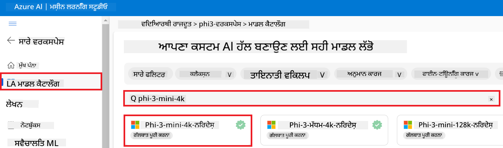

1. ਨੈਵੀਗੇਸ਼ਨ ਮੈਨੂ ਵਿੱਚੋਂ **Fine-tune** ਚੁਣੋ।

    

1. ਹੇਠਾਂ ਦਿੱਤੇ ਕੰਮ ਕਰੋ:

    - **Select task type** ਨੂੰ **Chat completion** ਚੁਣੋ।
    - **+ Select data** 'ਤੇ ਕਲਿੱਕ ਕਰਕੇ **Training data** ਅਪਲੋਡ ਕਰੋ।
    - Validation data ਅਪਲੋਡ ਕਿਸਮ ਨੂੰ **Provide different validation data** ਚੁਣੋ।
    - **+ Select data** 'ਤੇ ਕਲਿੱਕ ਕਰਕੇ **Validation data** ਅਪਲੋਡ ਕਰੋ।

    

    > [!TIP]
    >
    > ਤੁਸੀਂ **Advanced settings** ਚੁਣ ਕੇ **learning_rate** ਅਤੇ **lr_scheduler_type** ਵਰਗੀਆਂ ਸੈਟਿੰਗਾਂ ਨੂੰ ਆਪਣੀਆਂ ਜ਼ਰੂਰਤਾਂ ਅਨੁਸਾਰ ਕਸਟਮਾਈਜ਼ ਕਰ ਸਕਦੇ ਹੋ ਤਾਂ ਜੋ ਫਾਈਨ-ਟਿਊਨਿੰਗ ਪ੍ਰਕਿਰਿਆ ਨੂੰ ਬਿਹਤਰ ਬਣਾਇਆ ਜਾ ਸਕੇ।

1. **Finish** ਚੁਣੋ।

1. ਇਸ ਅਭਿਆਸ ਵਿੱਚ, ਤੁਸੀਂ ਸਫਲਤਾਪੂਰਵਕ Azure Machine Learning ਦੀ ਵਰਤੋਂ ਕਰਕੇ Phi-3 ਮਾਡਲ ਨੂੰ ਫਾਈਨ-ਟਿਊਨ ਕੀਤਾ। ਕਿਰਪਾ ਕਰਕੇ ਧਿਆਨ ਦਿਓ ਕਿ ਫਾਈਨ-ਟਿਊਨਿੰਗ ਪ੍ਰਕਿਰਿਆ ਵਿੱਚ ਕਾਫੀ ਸਮਾਂ ਲੱਗ ਸਕਦਾ ਹੈ। ਫਾਈਨ-ਟਿਊਨਿੰਗ ਜੌਬ ਚਲਾਉਣ ਤੋਂ ਬਾਅਦ, ਤੁਹਾਨੂੰ ਇਸ ਦੇ ਪੂਰਾ ਹੋਣ ਦੀ ਉਡੀਕ ਕਰਨੀ ਪਵੇਗੀ। ਤੁਸੀਂ ਆਪਣੇ Azure Machine Learning ਵਰਕਸਪੇਸ ਦੇ ਖੱਬੇ ਪਾਸੇ ਟੈਬ ਵਿੱਚੋਂ Jobs ਟੈਬ 'ਤੇ ਜਾ ਕੇ ਫਾਈਨ-ਟਿਊਨਿੰਗ ਜੌਬ ਦੀ ਸਥਿਤੀ ਦੀ ਨਿਗਰਾਨੀ ਕਰ ਸਕਦੇ ਹੋ। ਅਗਲੇ ਹਿੱਸੇ ਵਿੱਚ, ਤੁਸੀਂ ਫਾਈਨ-ਟਿਊਨ ਕੀਤਾ ਮਾਡਲ ਡਿਪਲੋਇ ਕਰਕੇ ਇਸਨੂੰ Prompt flow ਨਾਲ ਜੋੜੋਗੇ।

    

### ਫਾਈਨ-ਟਿਊਨ ਕੀਤਾ Phi-3 ਮਾਡਲ ਡਿਪਲੋਇ ਕਰੋ

ਫਾਈਨ-ਟਿਊਨ ਕੀਤਾ Phi-3 ਮਾਡਲ Prompt flow ਨਾਲ ਜੋੜਨ ਲਈ, ਤੁਹਾਨੂੰ ਮਾਡਲ ਨੂੰ ਡਿਪਲੋਇ ਕਰਨਾ ਪਵੇਗਾ ਤਾਂ ਜੋ ਇਹ ਰੀਅਲ-ਟਾਈਮ ਇੰਫਰੰਸ ਲਈ ਉਪਲਬਧ ਹੋ ਜਾਵੇ। ਇਸ ਪ੍ਰਕਿਰਿਆ ਵਿੱਚ ਮਾਡਲ ਨੂੰ ਰਜਿਸਟਰ ਕਰਨਾ, ਇੱਕ ਆਨਲਾਈਨ ਐਂਡਪੌਇੰਟ ਬਣਾਉਣਾ ਅਤੇ ਮਾਡਲ ਨੂੰ ਡਿਪਲੋਇ ਕਰਨਾ ਸ਼ਾਮਲ ਹੈ।

ਇਸ ਅਭਿਆਸ ਵਿੱਚ, ਤੁਸੀਂ:

- Azure Machine Learning ਵਰਕਸਪੇਸ ਵਿੱਚ ਫਾਈਨ-ਟਿਊਨ ਕੀਤਾ ਮਾਡਲ ਰਜਿਸਟਰ ਕਰੋਗੇ।
- ਇੱਕ ਆਨਲਾਈਨ ਐਂਡਪੌਇੰਟ ਬਣਾਉਗੇ।
- ਰਜਿਸਟਰ ਕੀਤਾ ਫਾਈਨ-ਟਿਊਨ ਕੀਤਾ Phi-3 ਮਾਡਲ ਡਿਪਲੋਇ ਕਰੋਗੇ।

#### ਫਾਈਨ-ਟਿਊਨ ਕੀਤਾ ਮਾਡਲ ਰਜਿਸਟਰ ਕਰੋ

1. [Azure ML Studio](https://ml.azure.com/home?wt.mc_id=studentamb_279723) 'ਤੇ ਜਾਓ।

1. ਆਪਣਾ ਬਣਾਇਆ ਹੋਇਆ Azure Machine Learning ਵਰਕਸਪੇਸ ਚੁਣੋ।

    

1. ਖੱਬੇ ਪਾਸੇ ਟੈਬ ਵਿੱਚੋਂ **Models** ਚੁਣੋ।

1. **+ Register** ਚੁਣੋ।

1. **From a job output** ਚੁਣੋ।

    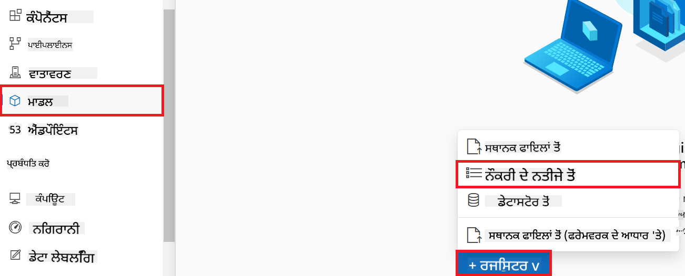

1. ਆਪਣਾ ਬਣਾਇਆ ਜੌਬ ਚੁਣੋ।

    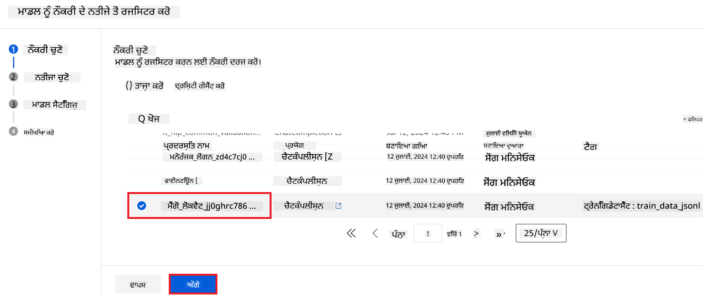

1. **Next** ਚੁਣੋ।

1. **Model type** ਨੂੰ **MLflow** ਚੁਣੋ।

1. ਯਕੀਨੀ ਬਣਾਓ ਕਿ **Job output** ਚੁਣਿਆ ਹੋਇਆ ਹੈ; ਇਹ ਆਟੋਮੈਟਿਕ ਚੁਣਿਆ ਹੋਣਾ ਚਾਹੀਦਾ ਹੈ।

    

2. **Next** ਚੁਣੋ।

3. **Register** ਚੁਣੋ।

    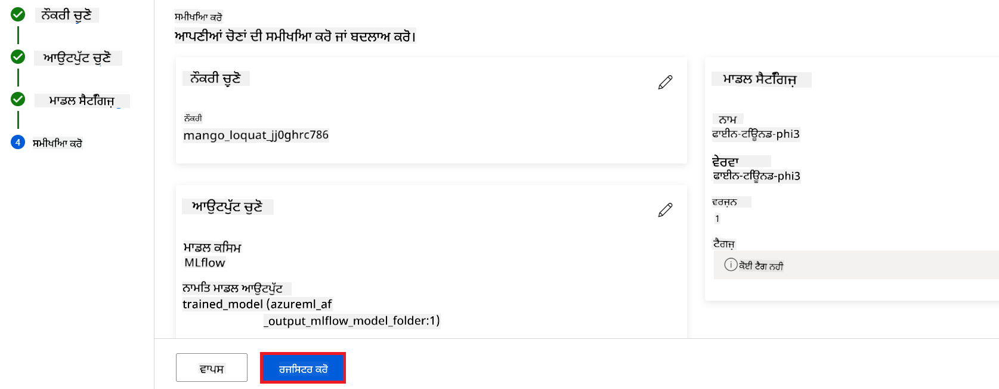

4. ਤੁਸੀਂ ਖੱਬੇ ਪਾਸੇ ਟੈਬ ਵਿੱਚੋਂ **Models** ਮੀਨੂ 'ਤੇ ਜਾ ਕੇ ਆਪਣੇ ਰਜਿਸਟਰ ਕੀਤੇ ਮਾਡਲ ਨੂੰ ਵੇਖ ਸਕਦੇ ਹੋ।

    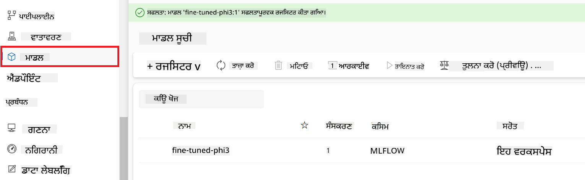

#### ਫਾਈਨ-ਟਿਊਨ ਕੀਤਾ ਮਾਡਲ ਡਿਪਲੋਇ ਕਰੋ

1. ਆਪਣੇ ਬਣਾਏ ਹੋਏ Azure Machine Learning ਵਰਕਸਪੇਸ 'ਤੇ ਜਾਓ।

1. ਖੱਬੇ ਪਾਸੇ ਟੈਬ ਵਿੱਚੋਂ **Endpoints** ਚੁਣੋ।

1. ਨੈਵੀਗੇਸ਼ਨ ਮੈਨੂ ਵਿੱਚੋਂ **Real-time endpoints** ਚੁਣੋ।

    

1. **Create** ਚੁਣੋ।

1. ਆਪਣਾ ਰਜਿਸਟਰ ਕੀਤਾ ਮਾਡਲ ਚੁਣੋ।

    

1. **Select** ਚੁਣੋ।

1. ਹੇਠਾਂ ਦਿੱਤੇ ਕੰਮ ਕਰੋ:

    - **Virtual machine** ਨੂੰ *Standard_NC6s_v3* ਚੁਣੋ।
    - ਤੁਸੀਂ ਵਰਤਣਾ ਚਾਹੁੰਦੇ ਹੋਏ **Instance count** ਚੁਣੋ। ਉਦਾਹਰਨ ਵਜੋਂ, *1*।
    - **Endpoint** ਨੂੰ **New** ਚੁਣੋ ਤਾਂ ਜੋ ਨਵਾਂ ਐਂਡਪੌਇੰਟ ਬਣਾਇਆ ਜਾ ਸਕੇ।
    - **Endpoint name** ਦਿਓ। ਇਹ ਇੱਕ ਵਿਲੱਖਣ ਨਾਮ ਹੋਣਾ ਚਾਹੀਦਾ ਹੈ।
    - **Deployment name** ਦਿਓ। ਇਹ ਵੀ ਇੱਕ ਵਿਲੱਖਣ ਨਾਮ ਹੋਣਾ ਚਾਹੀਦਾ ਹੈ।

    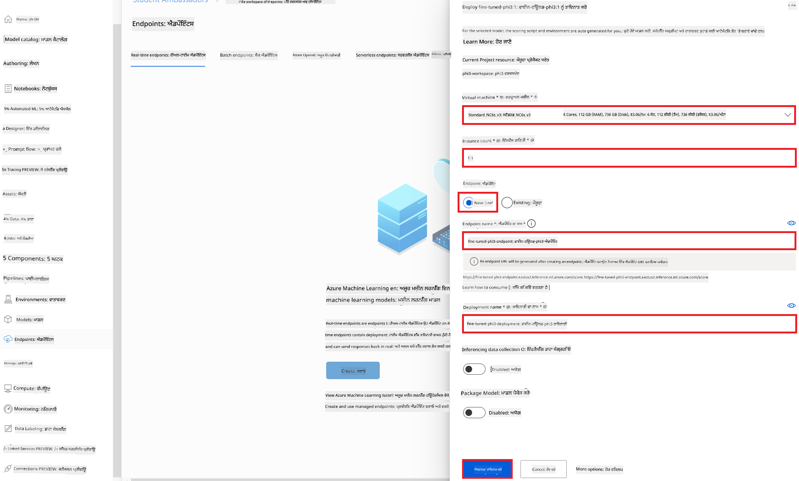

1. **Deploy** ਚੁਣੋ।

> [!WARNING]
> ਆਪਣੇ ਖਾਤੇ 'ਤੇ ਵਾਧੂ ਖਰਚੇ ਤੋਂ ਬਚਣ ਲਈ, ਕਿਰਪਾ ਕਰਕੇ Azure Machine Learning ਵਰਕਸਪੇਸ ਵਿੱਚ ਬਣਾਇਆ ਗਿਆ ਐਂਡਪੌਇੰਟ ਮਿਟਾ ਦਿਓ।
>

#### Azure Machine Learning ਵਰਕਸਪੇਸ ਵਿੱਚ ਡਿਪਲੋਇਮੈਂਟ ਸਥਿਤੀ ਚੈੱਕ ਕਰੋ

1. ਆਪਣੇ ਬਣਾਏ ਹੋਏ Azure Machine Learning ਵਰਕਸਪੇਸ 'ਤੇ ਜਾਓ।

1. ਖੱਬੇ ਪਾਸੇ ਟੈਬ ਵਿੱਚੋਂ **Endpoints** ਚੁਣੋ।

1. ਆਪਣਾ ਬਣਾਇਆ ਹੋਇਆ ਐਂਡਪੌਇੰਟ ਚੁਣੋ।

    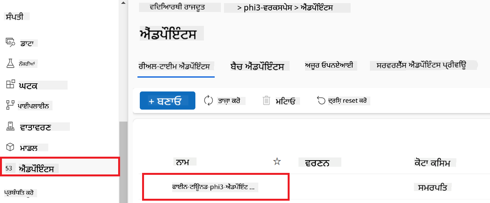

1. ਇਸ ਪੇਜ 'ਤੇ, ਤੁਸੀਂ ਡਿਪਲੋਇਮੈਂਟ ਪ੍ਰਕਿਰਿਆ ਦੌਰਾਨ ਐਂਡਪੌਇੰਟਸ ਦਾ ਪ੍ਰਬੰਧਨ ਕਰ ਸਕਦੇ ਹੋ।

> [!NOTE]
> ਜਦੋਂ ਡਿਪਲੋਇਮੈਂਟ ਪੂਰਾ ਹੋ ਜਾਵੇ, ਤਾਂ ਯਕੀਨੀ ਬਣਾਓ ਕਿ **Live traffic** 100% 'ਤੇ ਸੈੱਟ ਹੈ। ਜੇ ਇਹ ਨਹੀਂ ਹੈ, ਤਾਂ **Update traffic** ਚੁਣ ਕੇ ਟ੍ਰੈਫਿਕ ਸੈਟਿੰਗ ਨੂੰ ਅਪਡੇਟ ਕਰੋ। ਧਿਆਨ ਦਿਓ ਕਿ ਜੇ ਟ੍ਰੈਫਿਕ 0% 'ਤੇ ਹੈ ਤਾਂ ਤੁਸੀਂ ਮਾਡਲ ਦੀ ਟੈਸਟਿੰਗ ਨਹੀਂ ਕਰ ਸਕਦੇ।
>
> 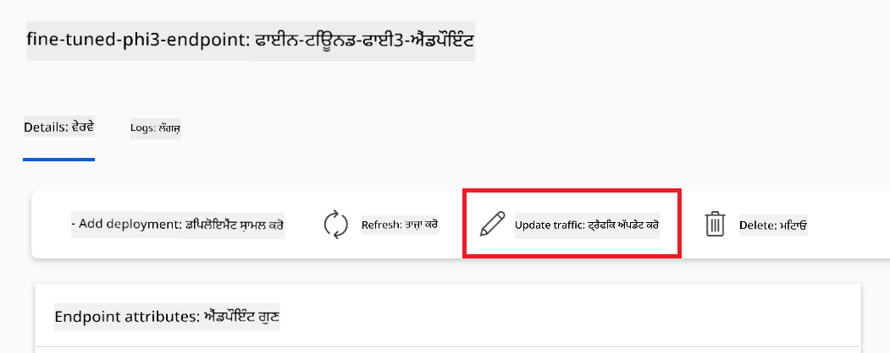
>

## ਸਿਨਾਰਿਓ 3: Prompt
> [!NOTE]
> ਤੁਸੀਂ Azure ML Studio ਨਾਲ Promptflow ਨੂੰ ਵੀ ਜੋੜ ਸਕਦੇ ਹੋ। ਉਹੀ ਇੰਟੀਗ੍ਰੇਸ਼ਨ ਪ੍ਰਕਿਰਿਆ Azure ML Studio 'ਤੇ ਵੀ ਲਾਗੂ ਕੀਤੀ ਜਾ ਸਕਦੀ ਹੈ।
#### Azure AI Foundry Hub ਬਣਾਓ

ਤੁਹਾਨੂੰ ਪ੍ਰੋਜੈਕਟ ਬਣਾਉਣ ਤੋਂ ਪਹਿਲਾਂ ਇੱਕ Hub ਬਣਾਉਣਾ ਲਾਜ਼ਮੀ ਹੈ। ਇੱਕ Hub ਇੱਕ Resource Group ਵਾਂਗ ਕੰਮ ਕਰਦਾ ਹੈ, ਜੋ ਤੁਹਾਨੂੰ Azure AI Foundry ਵਿੱਚ ਕਈ ਪ੍ਰੋਜੈਕਟਾਂ ਨੂੰ ਸੰਗਠਿਤ ਅਤੇ ਪ੍ਰਬੰਧਿਤ ਕਰਨ ਦੀ ਆਗਿਆ ਦਿੰਦਾ ਹੈ।

1. [Azure AI Foundry](https://ai.azure.com/?WT.mc_id=aiml-137032-kinfeylo) 'ਤੇ ਜਾਓ।

1. ਖੱਬੇ ਪਾਸੇ ਟੈਬ ਤੋਂ **All hubs** ਚੁਣੋ।

1. ਨੈਵੀਗੇਸ਼ਨ ਮੀਨੂ ਤੋਂ **+ New hub** ਚੁਣੋ।

    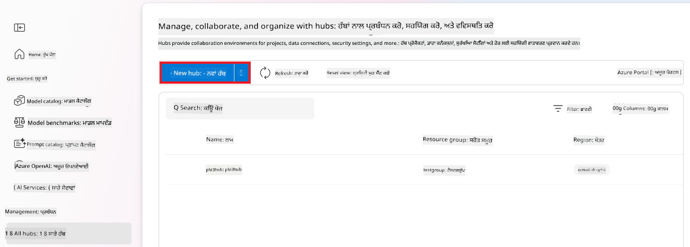

1. ਹੇਠਾਂ ਦਿੱਤੇ ਕੰਮ ਕਰੋ:

    - **Hub name** ਦਰਜ ਕਰੋ। ਇਹ ਇੱਕ ਵਿਲੱਖਣ ਮੁੱਲ ਹੋਣਾ ਚਾਹੀਦਾ ਹੈ।
    - ਆਪਣੀ Azure **Subscription** ਚੁਣੋ।
    - ਵਰਤਣ ਲਈ **Resource group** ਚੁਣੋ (ਜੇ ਲੋੜ ਹੋਵੇ ਤਾਂ ਨਵਾਂ ਬਣਾਓ)।
    - ਵਰਤਣ ਲਈ **Location** ਚੁਣੋ।
    - ਵਰਤਣ ਲਈ **Connect Azure AI Services** ਚੁਣੋ (ਜੇ ਲੋੜ ਹੋਵੇ ਤਾਂ ਨਵਾਂ ਬਣਾਓ)।
    - **Connect Azure AI Search** ਲਈ **Skip connecting** ਚੁਣੋ।

    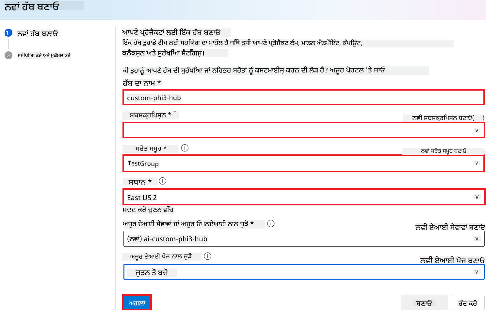

1. **Next** ਚੁਣੋ।

#### Azure AI Foundry ਪ੍ਰੋਜੈਕਟ ਬਣਾਓ

1. ਉਸ Hub ਵਿੱਚ ਜੋ ਤੁਸੀਂ ਬਣਾਇਆ ਹੈ, ਖੱਬੇ ਪਾਸੇ ਟੈਬ ਤੋਂ **All projects** ਚੁਣੋ।

1. ਨੈਵੀਗੇਸ਼ਨ ਮੀਨੂ ਤੋਂ **+ New project** ਚੁਣੋ।

    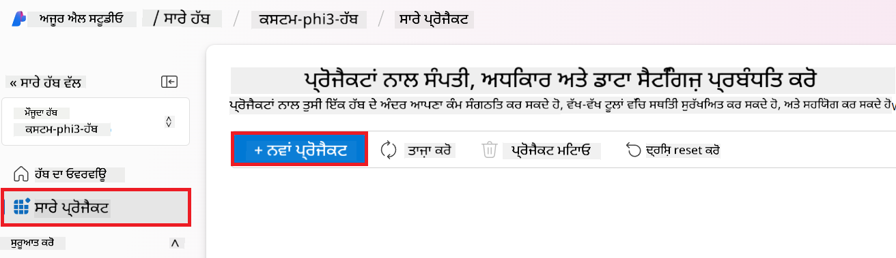

1. **Project name** ਦਰਜ ਕਰੋ। ਇਹ ਇੱਕ ਵਿਲੱਖਣ ਮੁੱਲ ਹੋਣਾ ਚਾਹੀਦਾ ਹੈ।

    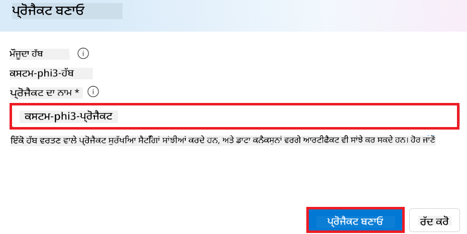

1. **Create a project** ਚੁਣੋ।

#### fine-tuned Phi-3 ਮਾਡਲ ਲਈ ਕਸਟਮ ਕਨੈਕਸ਼ਨ ਸ਼ਾਮਲ ਕਰੋ

ਆਪਣੇ ਕਸਟਮ Phi-3 ਮਾਡਲ ਨੂੰ Prompt flow ਨਾਲ ਜੋੜਨ ਲਈ, ਤੁਹਾਨੂੰ ਮਾਡਲ ਦਾ endpoint ਅਤੇ key ਇੱਕ ਕਸਟਮ ਕਨੈਕਸ਼ਨ ਵਿੱਚ ਸੇਵ ਕਰਨਾ ਪਵੇਗਾ। ਇਹ ਸੈਟਅਪ ਤੁਹਾਡੇ ਕਸਟਮ Phi-3 ਮਾਡਲ ਤੱਕ Prompt flow ਵਿੱਚ ਪਹੁੰਚ ਯਕੀਨੀ ਬਣਾਉਂਦਾ ਹੈ।

#### fine-tuned Phi-3 ਮਾਡਲ ਦਾ api key ਅਤੇ endpoint uri ਸੈੱਟ ਕਰੋ

1. [Azure ML Studio](https://ml.azure.com/home?WT.mc_id=aiml-137032-kinfeylo) 'ਤੇ ਜਾਓ।

1. ਉਸ Azure Machine learning ਵਰਕਸਪੇਸ ਵਿੱਚ ਜਾਓ ਜੋ ਤੁਸੀਂ ਬਣਾਇਆ ਹੈ।

1. ਖੱਬੇ ਪਾਸੇ ਟੈਬ ਤੋਂ **Endpoints** ਚੁਣੋ।

    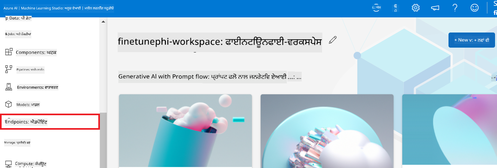

1. ਉਹ endpoint ਚੁਣੋ ਜੋ ਤੁਸੀਂ ਬਣਾਇਆ ਹੈ।

    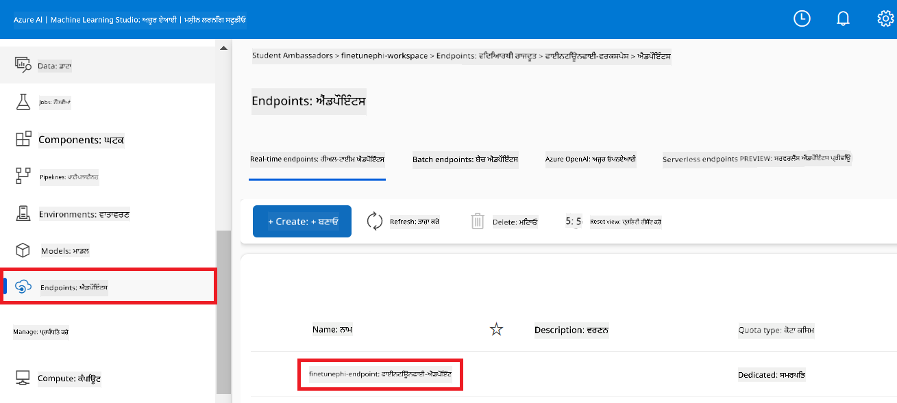

1. ਨੈਵੀਗੇਸ਼ਨ ਮੀਨੂ ਤੋਂ **Consume** ਚੁਣੋ।

1. ਆਪਣਾ **REST endpoint** ਅਤੇ **Primary key** ਕਾਪੀ ਕਰੋ।

    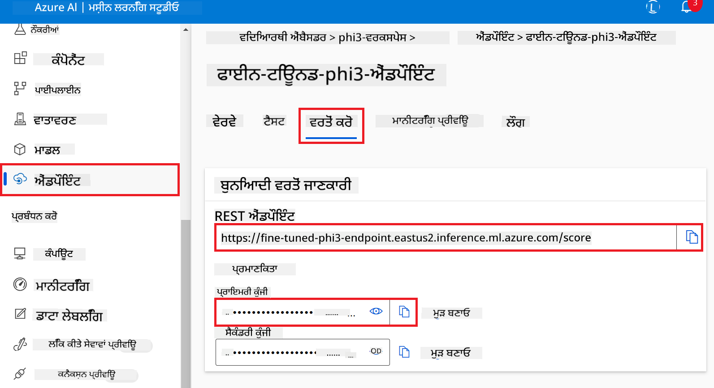

#### ਕਸਟਮ ਕਨੈਕਸ਼ਨ ਸ਼ਾਮਲ ਕਰੋ

1. [Azure AI Foundry](https://ai.azure.com/?WT.mc_id=aiml-137032-kinfeylo) 'ਤੇ ਜਾਓ।

1. ਉਸ Azure AI Foundry ਪ੍ਰੋਜੈਕਟ ਵਿੱਚ ਜਾਓ ਜੋ ਤੁਸੀਂ ਬਣਾਇਆ ਹੈ।

1. ਉਸ ਪ੍ਰੋਜੈਕਟ ਵਿੱਚ, ਖੱਬੇ ਪਾਸੇ ਟੈਬ ਤੋਂ **Settings** ਚੁਣੋ।

1. **+ New connection** ਚੁਣੋ।

    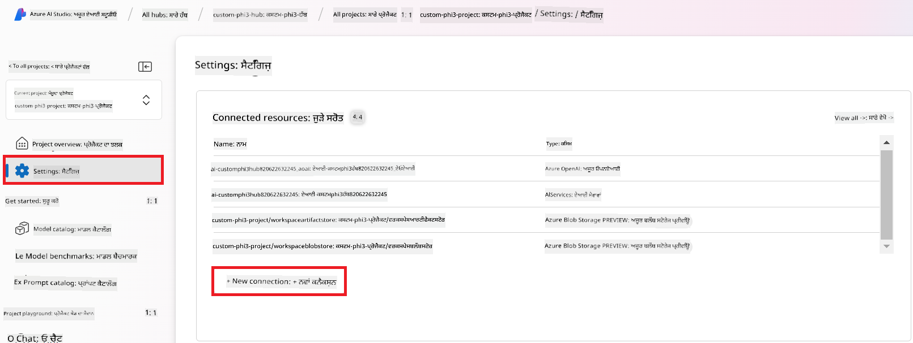

1. ਨੈਵੀਗੇਸ਼ਨ ਮੀਨੂ ਤੋਂ **Custom keys** ਚੁਣੋ।

    

1. ਹੇਠਾਂ ਦਿੱਤੇ ਕੰਮ ਕਰੋ:

    - **+ Add key value pairs** ਚੁਣੋ।
    - key name ਲਈ **endpoint** ਦਰਜ ਕਰੋ ਅਤੇ Azure ML Studio ਤੋਂ ਕਾਪੀ ਕੀਤਾ endpoint value ਫੀਲਡ ਵਿੱਚ ਪੇਸਟ ਕਰੋ।
    - ਫਿਰ **+ Add key value pairs** ਚੁਣੋ।
    - key name ਲਈ **key** ਦਰਜ ਕਰੋ ਅਤੇ Azure ML Studio ਤੋਂ ਕਾਪੀ ਕੀਤਾ key value ਫੀਲਡ ਵਿੱਚ ਪੇਸਟ ਕਰੋ।
    - keys ਸ਼ਾਮਲ ਕਰਨ ਤੋਂ ਬਾਅਦ, key ਨੂੰ ਪ੍ਰਕਾਸ਼ਿਤ ਹੋਣ ਤੋਂ ਬਚਾਉਣ ਲਈ **is secret** ਚੁਣੋ।

    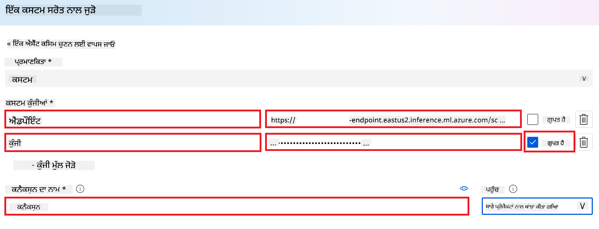

1. **Add connection** ਚੁਣੋ।

#### Prompt flow ਬਣਾਓ

ਤੁਸੀਂ Azure AI Foundry ਵਿੱਚ ਇੱਕ ਕਸਟਮ ਕਨੈਕਸ਼ਨ ਸ਼ਾਮਲ ਕਰ ਲਿਆ ਹੈ। ਹੁਣ, ਆਓ ਹੇਠਾਂ ਦਿੱਤੇ ਕਦਮਾਂ ਨਾਲ ਇੱਕ Prompt flow ਬਣਾਈਏ। ਫਿਰ, ਤੁਸੀਂ ਇਸ Prompt flow ਨੂੰ ਕਸਟਮ ਕਨੈਕਸ਼ਨ ਨਾਲ ਜੋੜੋਗੇ ਤਾਂ ਜੋ ਤੁਸੀਂ fine-tuned ਮਾਡਲ ਨੂੰ Prompt flow ਵਿੱਚ ਵਰਤ ਸਕੋ।

1. ਉਸ Azure AI Foundry ਪ੍ਰੋਜੈਕਟ ਵਿੱਚ ਜਾਓ ਜੋ ਤੁਸੀਂ ਬਣਾਇਆ ਹੈ।

1. ਖੱਬੇ ਪਾਸੇ ਟੈਬ ਤੋਂ **Prompt flow** ਚੁਣੋ।

1. ਨੈਵੀਗੇਸ਼ਨ ਮੀਨੂ ਤੋਂ **+ Create** ਚੁਣੋ।

    

1. ਨੈਵੀਗੇਸ਼ਨ ਮੀਨੂ ਤੋਂ **Chat flow** ਚੁਣੋ।

    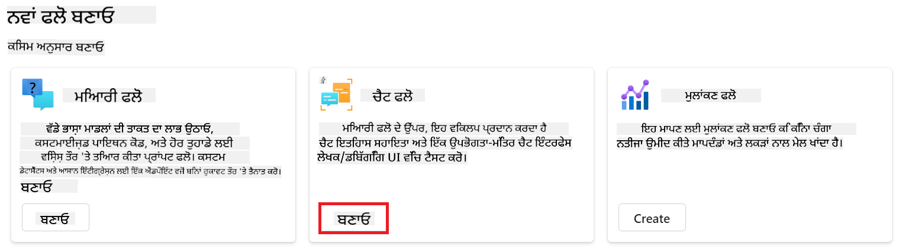

1. ਵਰਤਣ ਲਈ **Folder name** ਦਰਜ ਕਰੋ।

    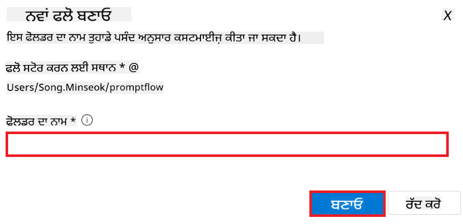

2. **Create** ਚੁਣੋ।

#### ਆਪਣੇ ਕਸਟਮ Phi-3 ਮਾਡਲ ਨਾਲ ਗੱਲਬਾਤ ਲਈ Prompt flow ਸੈੱਟ ਕਰੋ

ਤੁਹਾਨੂੰ fine-tuned Phi-3 ਮਾਡਲ ਨੂੰ Prompt flow ਵਿੱਚ ਜੋੜਨਾ ਹੈ। ਹਾਲਾਂਕਿ, ਮੌਜੂਦਾ ਦਿੱਤਾ ਗਿਆ Prompt flow ਇਸ ਮਕਸਦ ਲਈ ਬਣਾਇਆ ਨਹੀਂ ਗਿਆ। ਇਸ ਲਈ, ਤੁਹਾਨੂੰ Prompt flow ਨੂੰ ਮੁੜ ਡਿਜ਼ਾਈਨ ਕਰਨਾ ਪਵੇਗਾ ਤਾਂ ਜੋ ਕਸਟਮ ਮਾਡਲ ਦੀ ਇੰਟੀਗ੍ਰੇਸ਼ਨ ਹੋ ਸਕੇ।

1. Prompt flow ਵਿੱਚ, ਮੌਜੂਦਾ flow ਨੂੰ ਮੁੜ ਬਣਾਉਣ ਲਈ ਹੇਠਾਂ ਦਿੱਤੇ ਕੰਮ ਕਰੋ:

    - **Raw file mode** ਚੁਣੋ।
    - *flow.dag.yml* ਫਾਇਲ ਵਿੱਚ ਮੌਜੂਦਾ ਸਾਰਾ ਕੋਡ ਹਟਾਓ।
    - ਹੇਠਾਂ ਦਿੱਤਾ ਕੋਡ *flow.dag.yml* ਫਾਇਲ ਵਿੱਚ ਸ਼ਾਮਲ ਕਰੋ।

        ```yml
        inputs:
          input_data:
            type: string
            default: "Who founded Microsoft?"

        outputs:
          answer:
            type: string
            reference: ${integrate_with_promptflow.output}

        nodes:
        - name: integrate_with_promptflow
          type: python
          source:
            type: code
            path: integrate_with_promptflow.py
          inputs:
            input_data: ${inputs.input_data}
        ```

    - **Save** ਚੁਣੋ।

    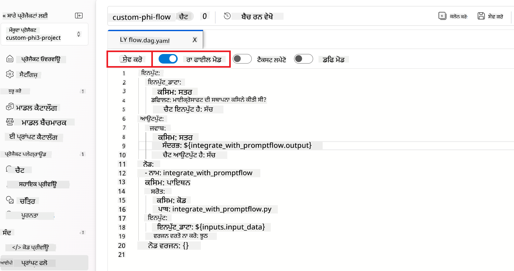

1. *integrate_with_promptflow.py* ਫਾਇਲ ਵਿੱਚ ਹੇਠਾਂ ਦਿੱਤਾ ਕੋਡ ਸ਼ਾਮਲ ਕਰੋ ਤਾਂ ਜੋ Prompt flow ਵਿੱਚ ਕਸਟਮ Phi-3 ਮਾਡਲ ਵਰਤਿਆ ਜਾ ਸਕੇ।

    ```python
    import logging
    import requests
    from promptflow import tool
    from promptflow.connections import CustomConnection

    # Logging setup
    logging.basicConfig(
        format="%(asctime)s - %(levelname)s - %(name)s - %(message)s",
        datefmt="%Y-%m-%d %H:%M:%S",
        level=logging.DEBUG
    )
    logger = logging.getLogger(__name__)

    def query_phi3_model(input_data: str, connection: CustomConnection) -> str:
        """
        Send a request to the Phi-3 model endpoint with the given input data using Custom Connection.
        """

        # "connection" is the name of the Custom Connection, "endpoint", "key" are the keys in the Custom Connection
        endpoint_url = connection.endpoint
        api_key = connection.key

        headers = {
            "Content-Type": "application/json",
            "Authorization": f"Bearer {api_key}"
        }
        data = {
            "input_data": {
                "input_string": [
                    {"role": "user", "content": input_data}
                ],
                "parameters": {
                    "temperature": 0.7,
                    "max_new_tokens": 128
                }
            }
        }
        try:
            response = requests.post(endpoint_url, json=data, headers=headers)
            response.raise_for_status()
            
            # Log the full JSON response
            logger.debug(f"Full JSON response: {response.json()}")

            result = response.json()["output"]
            logger.info("Successfully received response from Azure ML Endpoint.")
            return result
        except requests.exceptions.RequestException as e:
            logger.error(f"Error querying Azure ML Endpoint: {e}")
            raise

    @tool
    def my_python_tool(input_data: str, connection: CustomConnection) -> str:
        """
        Tool function to process input data and query the Phi-3 model.
        """
        return query_phi3_model(input_data, connection)

    ```

    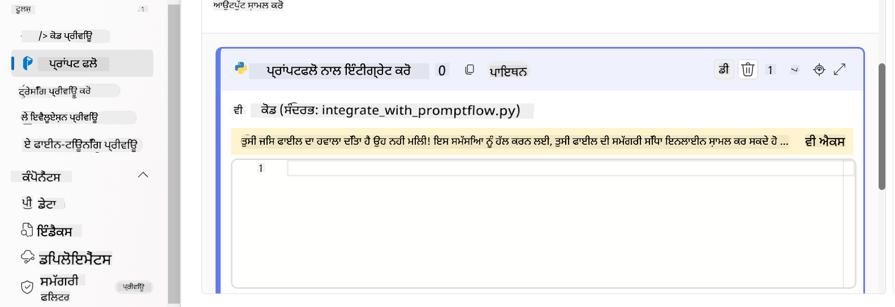

> [!NOTE]
> Azure AI Foundry ਵਿੱਚ Prompt flow ਵਰਤਣ ਬਾਰੇ ਹੋਰ ਵਿਸਥਾਰ ਵਿੱਚ ਜਾਣਕਾਰੀ ਲਈ, ਤੁਸੀਂ [Prompt flow in Azure AI Foundry](https://learn.microsoft.com/azure/ai-studio/how-to/prompt-flow) ਵੇਖ ਸਕਦੇ ਹੋ।

1. **Chat input**, **Chat output** ਚੁਣੋ ਤਾਂ ਜੋ ਮਾਡਲ ਨਾਲ ਗੱਲਬਾਤ ਯੋਗ ਹੋ ਜਾਵੇ।

    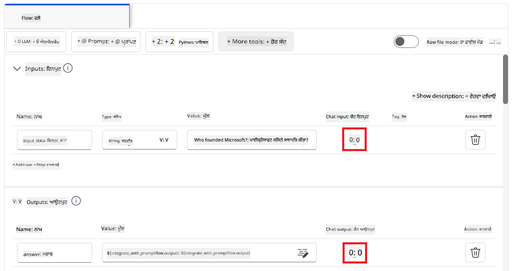

1. ਹੁਣ ਤੁਸੀਂ ਆਪਣੇ ਕਸਟਮ Phi-3 ਮਾਡਲ ਨਾਲ ਗੱਲਬਾਤ ਕਰਨ ਲਈ ਤਿਆਰ ਹੋ। ਅਗਲੇ ਅਭਿਆਸ ਵਿੱਚ, ਤੁਸੀਂ ਸਿੱਖੋਗੇ ਕਿ Prompt flow ਕਿਵੇਂ ਸ਼ੁਰੂ ਕਰਨਾ ਹੈ ਅਤੇ ਇਸਨੂੰ ਵਰਤ ਕੇ ਆਪਣੇ fine-tuned Phi-3 ਮਾਡਲ ਨਾਲ ਗੱਲਬਾਤ ਕਿਵੇਂ ਕਰਨੀ ਹੈ।

> [!NOTE]
>
> ਮੁੜ ਬਣਾਇਆ ਗਿਆ flow ਹੇਠਾਂ ਦਿੱਤੀ ਤਸਵੀਰ ਵਾਂਗ ਦਿਖਾਈ ਦੇਣਾ ਚਾਹੀਦਾ ਹੈ:
>
> 
>

### ਆਪਣੇ ਕਸਟਮ Phi-3 ਮਾਡਲ ਨਾਲ ਗੱਲਬਾਤ ਕਰੋ

ਹੁਣ ਜਦੋਂ ਕਿ ਤੁਸੀਂ ਆਪਣੇ ਕਸਟਮ Phi-3 ਮਾਡਲ ਨੂੰ fine-tune ਕਰਕੇ Prompt flow ਨਾਲ ਜੋੜ ਲਿਆ ਹੈ, ਤੁਸੀਂ ਇਸ ਨਾਲ ਗੱਲਬਾਤ ਸ਼ੁਰੂ ਕਰਨ ਲਈ ਤਿਆਰ ਹੋ। ਇਹ ਅਭਿਆਸ ਤੁਹਾਨੂੰ ਮਾਡਲ ਨਾਲ ਗੱਲਬਾਤ ਸੈੱਟਅਪ ਕਰਨ ਅਤੇ ਸ਼ੁਰੂ ਕਰਨ ਦੀ ਪ੍ਰਕਿਰਿਆ ਵਿੱਚ ਮਦਦ ਕਰੇਗਾ। ਇਹਨਾਂ ਕਦਮਾਂ ਦੀ ਪਾਲਣਾ ਕਰਕੇ, ਤੁਸੀਂ ਆਪਣੇ fine-tuned Phi-3 ਮਾਡਲ ਦੀਆਂ ਸਮਰੱਥਾਵਾਂ ਨੂੰ ਵੱਖ-ਵੱਖ ਕੰਮਾਂ ਅਤੇ ਗੱਲਬਾਤਾਂ ਲਈ ਪੂਰੀ ਤਰ੍ਹਾਂ ਵਰਤ ਸਕੋਗੇ।

- Prompt flow ਦੀ ਵਰਤੋਂ ਕਰਕੇ ਆਪਣੇ ਕਸਟਮ Phi-3 ਮਾਡਲ ਨਾਲ ਗੱਲਬਾਤ ਕਰੋ।

#### Prompt flow ਸ਼ੁਰੂ ਕਰੋ

1. Prompt flow ਸ਼ੁਰੂ ਕਰਨ ਲਈ **Start compute sessions** ਚੁਣੋ।

    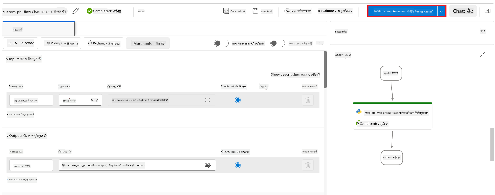

1. ਪੈਰਾਮੀਟਰਾਂ ਨੂੰ ਨਵੀਨਤਮ ਕਰਨ ਲਈ **Validate and parse input** ਚੁਣੋ।

    

1. ਉਸ **connection** ਦੀ **Value** ਚੁਣੋ ਜੋ ਤੁਸੀਂ ਕਸਟਮ ਕਨੈਕਸ਼ਨ ਲਈ ਬਣਾਈ ਸੀ। ਉਦਾਹਰਨ ਵਜੋਂ, *connection*।

    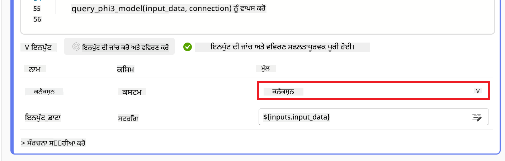

#### ਆਪਣੇ ਕਸਟਮ ਮਾਡਲ ਨਾਲ ਗੱਲਬਾਤ ਕਰੋ

1. **Chat** ਚੁਣੋ।

    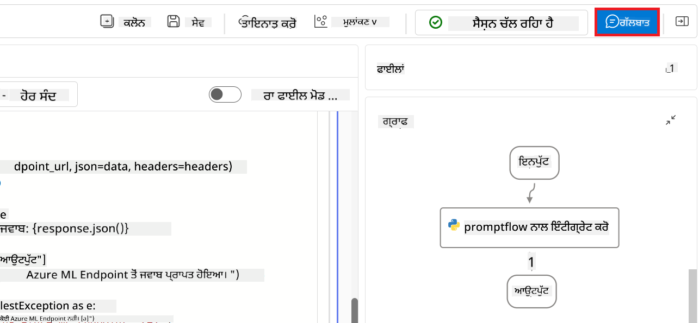

1. ਨਤੀਜਿਆਂ ਦਾ ਉਦਾਹਰਨ: ਹੁਣ ਤੁਸੀਂ ਆਪਣੇ ਕਸਟਮ Phi-3 ਮਾਡਲ ਨਾਲ ਗੱਲਬਾਤ ਕਰ ਸਕਦੇ ਹੋ। ਸਿਫਾਰਸ਼ ਕੀਤੀ ਜਾਂਦੀ ਹੈ ਕਿ fine-tuning ਲਈ ਵਰਤੇ ਗਏ ਡੇਟਾ ਦੇ ਆਧਾਰ 'ਤੇ ਸਵਾਲ ਪੁੱਛੋ।

    

**ਅਸਵੀਕਾਰੋਪੱਤਰ**:  
ਇਹ ਦਸਤਾਵੇਜ਼ AI ਅਨੁਵਾਦ ਸੇਵਾ [Co-op Translator](https://github.com/Azure/co-op-translator) ਦੀ ਵਰਤੋਂ ਕਰਕੇ ਅਨੁਵਾਦਿਤ ਕੀਤਾ ਗਿਆ ਹੈ। ਜਦੋਂ ਕਿ ਅਸੀਂ ਸਹੀਤਾ ਲਈ ਕੋਸ਼ਿਸ਼ ਕਰਦੇ ਹਾਂ, ਕਿਰਪਾ ਕਰਕੇ ਧਿਆਨ ਰੱਖੋ ਕਿ ਸਵੈਚਾਲਿਤ ਅਨੁਵਾਦਾਂ ਵਿੱਚ ਗਲਤੀਆਂ ਜਾਂ ਅਸਮਰਥਤਾਵਾਂ ਹੋ ਸਕਦੀਆਂ ਹਨ। ਮੂਲ ਦਸਤਾਵੇਜ਼ ਆਪਣੀ ਮੂਲ ਭਾਸ਼ਾ ਵਿੱਚ ਪ੍ਰਮਾਣਿਕ ਸਰੋਤ ਮੰਨਿਆ ਜਾਣਾ ਚਾਹੀਦਾ ਹੈ। ਮਹੱਤਵਪੂਰਨ ਜਾਣਕਾਰੀ ਲਈ, ਪੇਸ਼ੇਵਰ ਮਨੁੱਖੀ ਅਨੁਵਾਦ ਦੀ ਸਿਫਾਰਸ਼ ਕੀਤੀ ਜਾਂਦੀ ਹੈ। ਇਸ ਅਨੁਵਾਦ ਦੀ ਵਰਤੋਂ ਤੋਂ ਉਤਪੰਨ ਕਿਸੇ ਵੀ ਗਲਤਫਹਮੀ ਜਾਂ ਗਲਤ ਵਿਆਖਿਆ ਲਈ ਅਸੀਂ ਜ਼ਿੰਮੇਵਾਰ ਨਹੀਂ ਹਾਂ।