<!--
CO_OP_TRANSLATOR_METADATA:
{
  "original_hash": "0df910a227098303cc392b6ad204c271",
  "translation_date": "2026-01-06T04:30:15+00:00",
  "source_file": "md/02.Application/01.TextAndChat/Phi3/E2E_Phi-3-FineTuning_PromptFlow_Integration_AIFoundry.md",
  "language_code": "pa"
}
-->
# ਅਜੁਰ ਏਆਈ ਫਾਊਂਡਰੀ ਵਿੱਚ ਪ੍ਰਾਂਪਟ ਫਲੋ ਨਾਲ ਕਸਟਮ ਫਾਈ-3 ਮਾਡਲਾਂ ਨੂੰ ਫਾਈਨ-ਟਿਊਨ ਅਤੇ ਇੰਟਿਗਰੇਟ ਕਰੋ

ਇਹ ਐਂਡ-ਟੂ-ਐਂਡ (E2E) ਨਮੂਨਾ ਮਾਈਕ੍ਰੋਸਾਫਟ ਟੈਕ ਕਮਿਊਨਿਟੀ ਤੋਂ "[ਅਜੁਰ ਏਆਈ ਫਾਊਂਡਰੀ ਵਿੱਚ ਪ੍ਰਾਂਪਟ ਫਲੋ ਨਾਲ ਕਸਟਮ ਫਾਈ-3 ਮਾਡਲਾਂ ਨੂੰ ਫਾਈਨ-ਟਿਊਨ ਅਤੇ ਇੰਟਿਗਰੇਟ ਕਰੋ](https://techcommunity.microsoft.com/t5/educator-developer-blog/fine-tune-and-integrate-custom-phi-3-models-with-prompt-flow-in/ba-p/4191726?WT.mc_id=aiml-137032-kinfeylo)" ਗਾਈਡ 'ਤੇ ਅਧਾਰਿਤ ਹੈ। ਇਹ ਫਾਈਨ-ਟਿਊਨਿੰਗ, ਡਿਪਲਾਇਮੈਂਟ ਅਤੇ ਅਜੁਰ ਏਆਈ ਫਾਊਂਡਰੀ ਵਿੱਚ ਪ੍ਰਾਂਪਟ ਫਲੋ ਨਾਲ ਕਸਟਮ ਫਾਈ-3 ਮਾਡਲਾਂ ਦੇ ਇੰਟਿਗ੍ਰੇਸ਼ਨ ਦੀ ਪ੍ਰਕਿਰਿਆਵਾਂ ਨੂੰ ਪੇਸ਼ ਕਰਦਾ ਹੈ। ਐਂਡ-ਟੂ-ਐਂਡ ਨਮੂਨੇ "[ਅਜੁਰ ਏਆਈ / ਐਮਐਲ ਸਟੂਡੀਓ ਵਿੱਚ ਕੋਡ ਚਲਾਉਣ ਵਾਲੇ](./E2E_Phi-3-FineTuning_PromptFlow_Integration.md)" ਦੇ ਬਜਾਏ, ਇਸ ਟਿਊਟੋਰੀਅਲ ਵਿੱਚ ਸਿਰਫ਼ ਫਾਈਨ-ਟਿਊਨਿੰਗ ਅਤੇ ਤੁਹਾਡੇ ਮਾਡਲ ਦੇ ਅਜੁਰ ਏਆਈ / ਐਮਐਲ ਸਟੂਡੀਓ ਵਿੱਚ ਇੰਟਿਗ੍ਰੇਸ਼ਨ 'ਤੇ ਧਿਆਨ ਦਿੱਤਾ ਗਿਆ ਹੈ।

## ਓਵਰਵਿਊ

ਇਸ E2E ਨਮੂਨੇ ਵਿੱਚ, ਤੁਸੀਂ ਸਿੱਖੋਗੇ ਕਿ ਫਾਈ-3 ਮਾਡਲ ਨੂੰ ਕਿਵੇਂ ਫਾਈਨ-ਟਿਊਨ ਕਰਨਾ ਹੈ ਅਤੇ ਅਜੁਰ ਏਆਈ ਫਾਊਂਡਰੀ ਵਿੱਚ ਪ੍ਰਾਂਪਟ ਫਲੋ ਨਾਲ ਕਿਵੇਂ ਇੰਟਿਗਰੇਟ ਕਰਨਾ ਹੈ। ਅਜੁਰ ਏਆਈ / ਐਮਐਲ ਸਟੂਡੀਓ ਦੀ ਵਰਤੋਂ ਕਰਕੇ, ਤੁਸੀਂ ਕਸਟਮ ਏਆਈ ਮਾਡਲਾਂ ਨੂੰ ਡਿਪਲਾਇ ਅਤੇ ਵਰਤਣ ਲਈ ਵਰਕਫਲੋ ਸੈਟਅੱਪ ਕਰੋਗੇ। ਇਹ ਐਂਡ-ਟੂ-ਐਂਡ ਨਮੂਨਾ ਤਿੰਨ ਸਿਨਾਰਿਓਜ਼ ਵਿੱਚ ਵੰਡਿਆ ਗਿਆ ਹੈ:

**ਸਿਨਾਰਿਓ 1: ਅਜੁਰ ਸਰੋਤ ਸੈਟਅੱਪ ਕਰੋ ਅਤੇ ਫਾਈਨ-ਟਿਊਨਿੰਗ ਦੀ ਤਿਆਰੀ ਕਰੋ**

**ਸਿਨਾਰਿਓ 2: ਫਾਈ-3 ਮਾਡਲ ਨੂੰ ਫਾਈਨ-ਟਿਊਨ ਕਰੋ ਅਤੇ ਅਜੁਰ ਮਸ਼ੀਨ ਲਰਨਿੰਗ ਸਟੂਡੀਓ ਵਿੱਚ ਡਿਪਲਾਇ ਕਰੋ**

**ਸਿਨਾਰਿਓ 3: ਪ੍ਰਾਂਪਟ ਫਲੋ ਨਾਲ ਇੰਟਿਗਰੇਟ ਕਰੋ ਅਤੇ ਅਜੁਰ ਏਆਈ ਫਾਊਂਡਰੀ ਵਿੱਚ ਤੁਹਾਡੇ ਕਸਟਮ ਮਾਡਲ ਨਾਲ ਗੱਲਬਾਤ ਕਰੋ**

ਇਹ ਰਹਿ ਇਸ E2E ਨਮੂਨੇ ਦਾ ਓਵਰਵਿਊ।

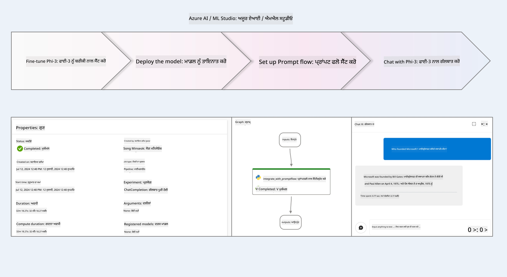

### ਟੇਬਲ ਆਫ਼ ਕੰਟੈਂਟ

1. **[ਸਿਨਾਰਿਓ 1: ਅਜੁਰ ਸਰੋਤ ਸੈਟਅੱਪ ਕਰੋ ਅਤੇ ਫਾਈਨ-ਟਿਊਨਿੰਗ ਦੀ ਤਿਆਰੀ ਕਰੋ](../../../../../../md/02.Application/01.TextAndChat/Phi3)**
    - [ਅਜੁਰ ਮਸ਼ੀਨ ਲਰਨਿੰਗ ਵਰਕਸਪੇਸ ਬਣਾਓ](../../../../../../md/02.Application/01.TextAndChat/Phi3)
    - [ਅਜੁਰ سبਸਕ੍ਰਿਪਸ਼ਨ ਵਿੱਚ GPU ਕੋਟਾ ਲਈ ਬੇਨਤੀ ਕਰੋ](../../../../../../md/02.Application/01.TextAndChat/Phi3)
    - [ਰੋਲ ਅਸਾਈਨਮੈਂਟ ਸ਼ਾਮਲ ਕਰੋ](../../../../../../md/02.Application/01.TextAndChat/Phi3)
    - [ਪ੍ਰੋਜੈਕਟ ਸੈੱਟઅੱਪ ਕਰੋ](../../../../../../md/02.Application/01.TextAndChat/Phi3)
    - [ਫਾਈਨ-ਟਿਊਨਿੰਗ ਲਈ ਡੇਟਾਸੇਟ ਦੀ ਤਿਆਰੀ ਕਰੋ](../../../../../../md/02.Application/01.TextAndChat/Phi3)

1. **[ਸਿਨਾਰਿਓ 2: ਫਾਈ-3 ਮਾਡਲ ਨੂੰ ਫਾਈਨ-ਟਿਊਨ ਕਰੋ ਅਤੇ ਅਜੁਰ ਮਸ਼ੀਨ ਲਰਨਿੰਗ ਸਟੂਡੀਓ ਵਿੱਚ ਡਿਪਲਾਇ ਕਰੋ](../../../../../../md/02.Application/01.TextAndChat/Phi3)**
    - [ਫਾਈ-3 ਮਾਡਲ ਨੂੰ ਫਾਈਨ-ਟਿਊਨ ਕਰੋ](../../../../../../md/02.Application/01.TextAndChat/Phi3)
    - [ਫਾਈਨ-ਟਿਊਨ ਕੀਤੇ ਫਾਈ-3 ਮਾਡਲ ਨੂੰ ਡਿਪਲਾਇ ਕਰੋ](../../../../../../md/02.Application/01.TextAndChat/Phi3)

1. **[ਸਿਨਾਰਿਓ 3: ਪ੍ਰਾਂਪਟ ਫਲੋ ਨਾਲ ਇੰਟਿਗਰੇਟ ਕਰੋ ਅਤੇ ਅਜੁਰ ਏਆਈ ਫਾਊਂਡਰੀ ਵਿੱਚ ਕਸਟਮ ਮਾਡਲ ਨਾਲ ਗੱਲਬਾਤ ਕਰੋ](../../../../../../md/02.Application/01.TextAndChat/Phi3)**
    - [ਕਸਟਮ ਫਾਈ-3 ਮਾਡਲ ਨੂੰ ਪ੍ਰਾਂਪਟ ਫਲੋ ਨਾਲ ਇੰਟਿਗਰੇਟ ਕਰੋ](../../../../../../md/02.Application/01.TextAndChat/Phi3)
    - [ਤੁਹਾਡੇ ਕਸਟਮ ਫਾਈ-3 ਮਾਡਲ ਨਾਲ ਗੱਲਬਾਤ ਕਰੋ](../../../../../../md/02.Application/01.TextAndChat/Phi3)

## ਸਿਨਾਰਿਓ 1: ਅਜੁਰ ਸਰੋਤ ਸੈਟઅੱਪ ਕਰੋ ਅਤੇ ਫਾਈਨ-ਟਿਊਨਿੰਗ ਦੀ ਤਿਆਰੀ ਕਰੋ

### ਅਜੁਰ ਮਸ਼ੀਨ ਲਰਨਿੰਗ ਵਰਕਸਪੇਸ ਬਣਾਓ

1. ਪੋਰਟਲ ਪੇਜ਼ ਦੇ ਉੱਪਰਲੇ ਹਿੱਸੇ ਵਿੱਚ **search bar** ਵਿੱਚ *azure machine learning* ਟਾਈਪ ਕਰੋ ਅਤੇ ਆਏ ਵਿਕਲਪਾਂ ਵਿੱਚੋਂ **Azure Machine Learning** ਚੁਣੋ।

    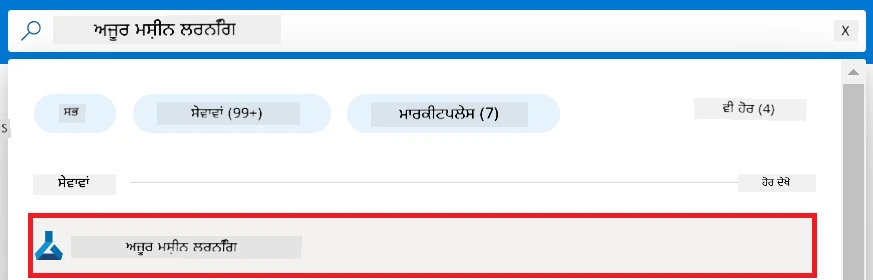

2. ਨੈਵੀਗੇਸ਼ਨ ਮੇਨੂ ਵਿੱਚੋਂ **+ Create** ਚੁਣੋ।

3. ਨੈਵੀਗੇਸ਼ਨ ਮੇਨੂ ਵਿੱਚੋਂ **New workspace** ਚੁਣੋ।

    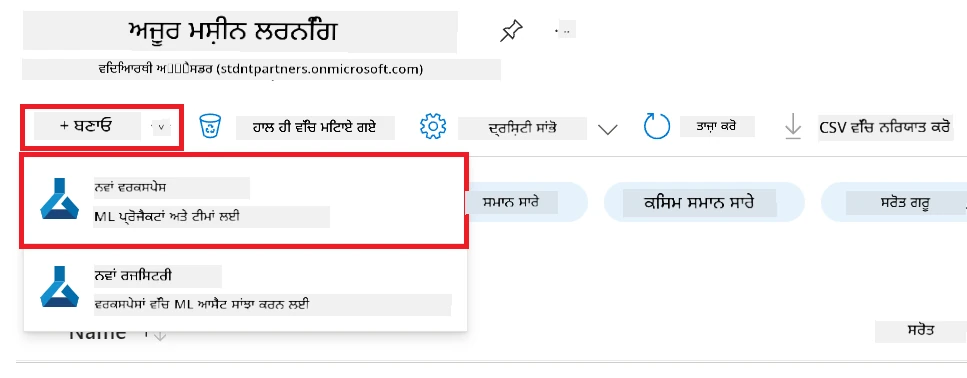

4. ਹੇਠ ਲਿਖੇ ਕੰਮ ਕਰੋ:

    - ਆਪਣੀ ਅਜੁਰ **Subscription** ਚੁਣੋ।
    - ਇਸਤੇਮਾਲ ਕਰਨ ਲਈ **Resource group** ਚੁਣੋ (ਲੋੜ ਹੋਵੇ ਤਾਂ ਨਵਾਂ ਬਣਾਓ)।
    - **Workspace Name** ਦਰਜ ਕਰੋ। ਇਹ ਇਕ ਵਿਲੱਖਣ ਮੁੱਲ ਹੋਣਾ ਚਾਹੀਦਾ ਹੈ।
    - ਇਹਤੇਮਾਲ ਲਈ **Region** ਚੁਣੋ।
    - ਇਸਤੇਮਾਲ ਕਰਨ ਲਈ **Storage account** ਚੁਣੋ (ਲੋੜ ਹੋਵੇ ਤਾਂ ਨਵਾਂ ਬਣਾਓ)।
    - ਇਸਤੇਮਾਲ ਕਰਨ ਲਈ **Key vault** ਚੁਣੋ (ਲੋੜ ਹੋਵੇ ਤਾਂ ਨਵਾਂ ਬਣਾਓ)।
    - ਇਸਤੇਮਾਲ ਕਰਨ ਲਈ **Application insights** ਚੁਣੋ (ਲੋੜ ਹੋਵੇ ਤਾਂ ਨਵਾਂ ਬਣਾਓ)।
    - ਇਸਤੇਮਾਲ ਕਰਨ ਲਈ **Container registry** ਚੁਣੋ (ਲੋੜ ਹੋਵੇ ਤਾਂ ਨਵਾਂ ਬਣਾਓ)।

    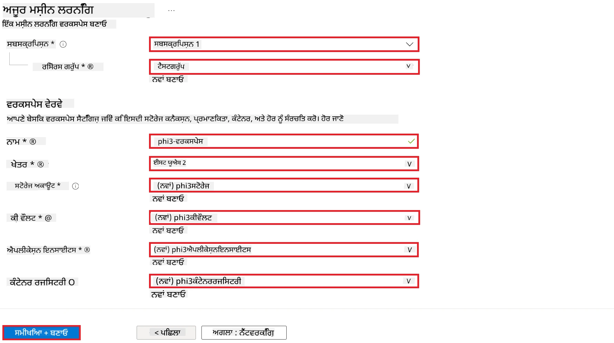

5. **Review + Create** ਚੁਣੋ।

6. **Create** ਚੁਣੋ।

### ਅਜੁਰ سبسਕ੍ਰਿਪਸ਼ਨ ਵਿੱਚ GPU ਕੋਟਾ ਲਈ ਬੇਨਤੀ ਕਰੋ

ਇਸ ਟਿਊਟੋਰੀਅਲ ਵਿੱਚ, ਤੁਸੀਂ GPUs ਦੀ ਵਰਤੋਂ ਕਰਕੇ ਫਾਈ-3 ਮਾਡਲ ਨੂੰ ਫਾਈਨ-ਟਿਊਨ ਅਤੇ ਡਿਪਲਾਇ ਕਰਨ ਦਾ ਤਰੀਕਾ ਸਿੱਖੋਗੇ। ਫਾਈਨ-ਟਿਊਨਿੰਗ ਲਈ, ਤੁਸੀਂ *Standard_NC24ads_A100_v4* GPU ਦੀ ਵਰਤੋਂ ਕਰੋਗੇ, ਜਿਸ ਲਈ ਕੋਟਾ ਬੇਨਤੀ ਦੀ ਲੋੜ ਹੈ। ਡਿਪਲਾਇਮੈਂਟ ਲਈ, ਤੁਸੀਂ *Standard_NC6s_v3* GPU ਦੀ ਵਰਤੋਂ ਕਰੋਗੇ, ਜਿਸ ਲਈ ਵੀ ਕੋਟਾ ਬੇਨਤੀ ਦੀ ਲੋੜ ਹੈ।

> [!NOTE]
>
> ਸਿਰਫ਼ ਪੇ-ਏਜ਼-ਯੂ-ਗੋ سبسک੍ਰਿਪਸ਼ਨ (ਮਿਆਰੀ سبسک੍ਰਿਪਸ਼ਨ ਕਿਸਮ) GPU ਆਲੋਕੇਸ਼ਨ ਲਈ ਯੋਗ ਹਨ; ਬੇਨੇਫਿਟ سبسک੍ਰਿਪਸ਼ਨ ਇਸ ਸਮੇਂ ਸਪੋਰਟਡ ਨਹੀਂ ਹਨ।
>

1. [Azure ML Studio](https://ml.azure.com/home?wt.mc_id=studentamb_279723) 'ਤੇ ਜਾਓ।

1. *Standard NCADSA100v4 Family* ਕੋਟਾ ਲਈ ਬੇਨਤੀ ਕਰਨ ਲਈ ਹੇਠ ਲਿਖੇ ਕੰਮ ਕਰੋ:

    - ਖੱਬੇ ਪਾਸੇ ਟੈਬ ਵਿਚੋਂ **Quota** ਚੁਣੋ।
    - ਵਰਤੋਂ ਲਈ **Virtual machine family** ਚੁਣੋ। ਉਦਾਹਰਨ ਲਈ, **Standard NCADSA100v4 Family Cluster Dedicated vCPUs** ਚੁਣੋ, ਜਿਸ ਵਿੱਚ *Standard_NC24ads_A100_v4* GPU ਸ਼ਾਮਲ ਹੈ।
    - ਨੈਵੀਗੇਸ਼ਨ ਮੇਨੂ ਤੋਂ **Request quota** ਨੂੰ ਚੁਣੋ।

        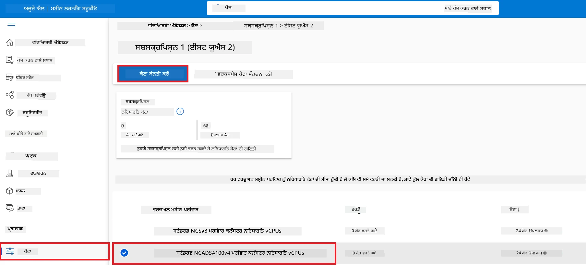

    - Request quota ਪੰਨੇ ਦੇ ਅੰਦਰ, **New cores limit** ਦਰਜ ਕਰੋ ਜੋ ਤੁਸੀਂ ਵਰਤਣਾ ਚਾਹੁੰਦੇ ਹੋ। ਉਦਾਹਰਨ ਲਈ, 24।
    - Request quota ਪੰਨੇ ਵਿੱਚ, GPU ਕੋਟਾ ਬੇਨਤੀ ਕਰਨ ਲਈ **Submit** ਨੂੰ ਚੁਣੋ।

1. *Standard NCSv3 Family* ਕੋਟਾ ਲਈ ਬੇਨਤੀ ਕਰਨ ਲਈ ਹੇਠ ਲਿਖੇ ਕੰਮ ਕਰੋ:

    - ਖੱਬੇ ਪਾਸੇ ਟੈਬ ਵਿਚੋਂ **Quota** ਚੁਣੋ।
    - ਵਰਤੋਂ ਲਈ **Virtual machine family** ਚੁਣੋ। ਉਦਾਹਰਨ ਲਈ, **Standard NCSv3 Family Cluster Dedicated vCPUs** ਚੁਣੋ, ਜਿਸ ਵਿੱਚ *Standard_NC6s_v3* GPU ਸ਼ਾਮਲ ਹੈ।
    - ਨੈਵੀਗੇਸ਼ਨ ਮੇਨੂ ਤੋਂ **Request quota** ਨੂੰ ਚੁਣੋ।
    - Request quota ਪੰਨੇ ਦੇ ਅੰਦਰ, **New cores limit** ਦਰਜ ਕਰੋ। ਉਦਾਹਰਨ ਲਈ, 24।
    - Request quota ਪੰਨੇ ਵਿੱਚ, GPU ਕੋਟਾ ਬੇਨਤੀ ਕਰਨ ਲਈ **Submit** ਨੂੰ ਚੁਣੋ।

### ਰੋਲ ਅਸਾਈਨਮੈਂਟ ਸ਼ਾਮਲ ਕਰੋ

ਤੁਹਾਡੇ ਮਾਡਲਾਂ ਨੂੰ ਫਾਈਨ-ਟਿਊਨ ਅਤੇ ਡਿਪਲਾਇ ਕਰਨ ਲਈ, ਸਭ ਤੋਂ ਪਹਿਲਾਂ ਤੁਹਾਨੂੰ ਇੱਕ ਯੂਜ਼ਰ ਐਸਾਈਨਡ ਮੈਨੇਜਡ ਆਈਡੈਂਟਿਟੀ (UAI) ਬਣਾਉਣੀ ਪਵੇਗੀ ਅਤੇ ਇਸਨੂੰ ਸਹੀ ਪਰਮੀਸ਼ਨਾਂ ਦੇਣੀਆਂ ਪਣਗੀਆਂ। ਇਹ UAI ਡਿਪਲਾਇਮੈਂਟ ਦੌਰਾਨ ਪਰਮਾਣਿਕਤਾ ਲਈ ਵਰਤੀ ਜਾਏਗੀ।

#### ਯੂਜ਼ਰ ਐਸਾਈਨਡ ਮੈਨੇਜਡ ਆਈਡੈਂਟਿਟੀ (UAI) ਬਣਾਓ

1. ਪੋਰਟਲ ਪੇਜ਼ ਦੇ ਉੱਪਰਲੇ ਹਿੱਸੇ ਵਿੱਚ **search bar** ਵਿੱਚ *managed identities* ਟਾਈਪ ਕਰੋ ਅਤੇ ਆਏ ਵਿਕਲਪਾਂ ਵਿੱਚੋਂ **Managed Identities** ਚੁਣੋ।

    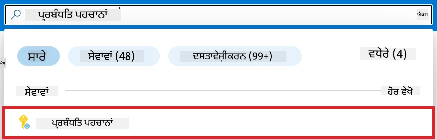

1. **+ Create** ਚੁਣੋ।

    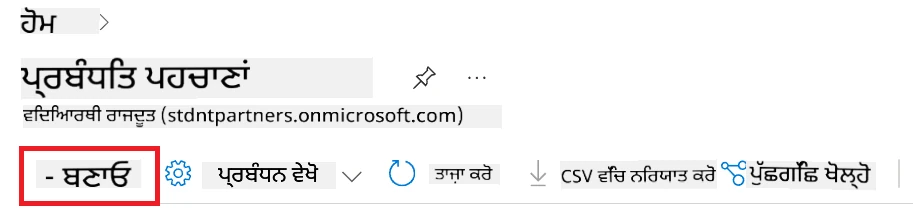

1. ਹੇਠ ਲਿਖੇ ਕੰਮ ਕਰੋ:

    - ਆਪਣੀ ਅਜੁਰ **Subscription** ਚੁਣੋ।
    - ਇਸਤੇਮਾਲ ਲਈ **Resource group** ਚੁਣੋ (ਲੋੜ ਹੋਵੇ ਤਾਂ ਨਵਾਂ ਬਣਾਓ)।
    - ਆਪਣਾ ਵਰਤਣਾ ਚਾਹੁੰਦੇ **Region** ਚੁਣੋ।
    - **Name** ਦਰਜ ਕਰੋ। ਇਹ ਇਕ ਵਿਲੱਖਣ ਮੁੱਲ ਹੋਣਾ ਚਾਹੀਦਾ ਹੈ।

    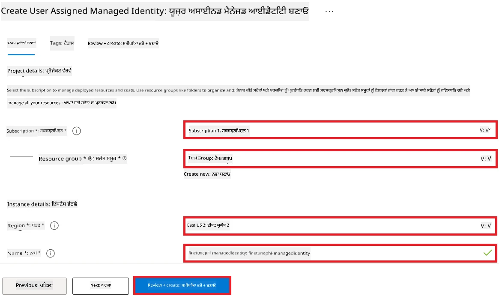

1. **Review + create** ਚੁਣੋ।

1. **+ Create** ਚੁਣੋ।

#### ਮੈਨੇਜਡ ਆਈਡੈਂਟਿਟੀ ਨੂੰ Contributor ਰੋਲ ਦੇ ਅਸਾਈਨਮੈਂਟ ਸ਼ਾਮਲ ਕਰੋ

1. ਉਸ Managed Identity ਸਰੋਤ ਤੇ ਜਾਓ ਜੋ ਤੁਸੀਂ ਬਣਾਇਆ ਹੈ।

1. ਖੱਬੇ ਪਾਸੇ ਟੈਬ ਵਿੱਚੋਂ **Azure role assignments** ਚੁਣੋ।

1. ਨੈਵੀਗੇਸ਼ਨ ਮੇਨੂ ਵਿੱਚੋਂ **+Add role assignment** ਚੁਣੋ।

1. Add role assignment ਪੰਨੇ ਦੇ ਅੰਦਰ, ਹੇਠ ਲਿਖੇ ਕੰਮ ਕਰੋ:
    - **Scope** ਨੂੰ **Resource group** 'ਤੇ ਸੈਟ ਕਰੋ।
    - ਆਪਣੀ ਅਜੁਰ **Subscription** ਚੁਣੋ।
    - ਵਰਤੋਂ ਲਈ **Resource group** ਚੁਣੋ।
    - **Role** ਨੂੰ **Contributor** ਸੈਟ ਕਰੋ।

    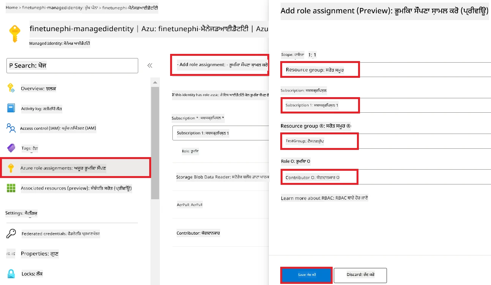

2. **Save** ਚੁਣੋ।

#### ਮੈਨੇਜਡ ਆਈਡੈਂਟਿਟੀ ਨੂੰ Storage Blob Data Reader ਰੋਲ ਦੇ ਅਸਾਈਨਮੈਂਟ ਸ਼ਾਮਲ ਕਰੋ

1. ਪੋਰਟਲ ਪੇਜ਼ ਦੇ ਉੱਪਰਲੇ ਹਿੱਸੇ ਵਿੱਚ **search bar** ਵਿੱਚ *storage accounts* ਟਾਈਪ ਕਰੋ ਅਤੇ ਆਏ ਵਿਕਲਪਾਂ ਵਿੱਚੋਂ **Storage accounts** ਚੁਣੋ।

    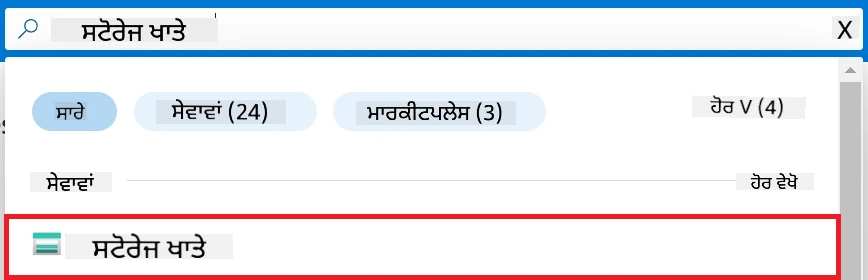

1. ਉਸ ਸਟੋਰੇਜ ਅਕਾਊਂਟ ਨੂੰ ਚੁਣੋ ਜੋ ਉਸ ਅਜੁਰ ਮਸ਼ੀਨ ਲਰਨਿੰਗ ਵਰਕਸਪੇਸ ਨਾਲ ਜੁੜਿਆ ਹੈ ਜੋ ਤੁਸੀਂ ਬਣਾਇਆ ਹੈ। ਉਦਾਹਰਨ ਲਈ, *finetunephistorage*।

1. Add role assignment ਪੰਨੇ 'ਤੇ ਜਾਣ ਲਈ ਹੇਠ ਲਿਖੇ ਕੰਮ ਕਰੋ:

    - ਉਸ ਅਜੁਰ ਸਟੋਰੇਜ ਅਕਾਊਂਟ 'ਤੇ ਜਾਓ ਜੋ ਤੁਸੀਂ ਬਣਾਇਆ ਹੈ।
    - ਖੱਬੇ ਪਾਸੇ ਟੈਬ ਵਿੱਚੋਂ **Access Control (IAM)** ਚੁਣੋ।
    - ਨੈਵੀਗੇਸ਼ਨ ਮੇਨੂ ਵਿੱਚੋਂ **+ Add** ਚੁਣੋ।
    - ਨੈਵੀਗੇਸ਼ਨ ਮੇਨੂ ਵਿੱਚੋਂ **Add role assignment** ਚੁਣੋ।

    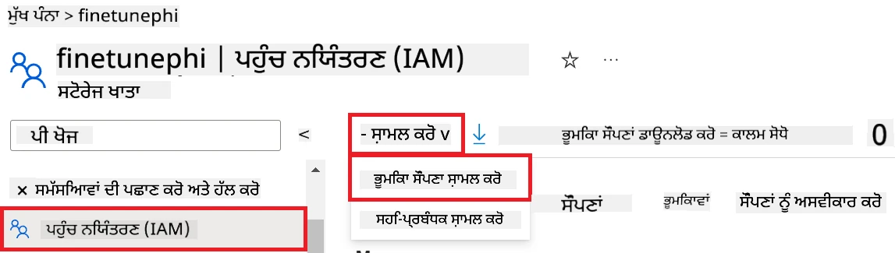

1. Add role assignment ਪੰਨੇ ਦੇ ਅੰਦਰ, ਹੇਠ ਲਿਖੇ ਕੰਮ ਕਰੋ:

    - Role ਪੰਨੇ ਵਿੱਚ, **search bar** ਵਿੱਚ *Storage Blob Data Reader* ਟਾਈਪ ਕਰੋ ਅਤੇ ਆਏ ਵਿਕਲਪਾਂ ਵਿੱਚੋਂ **Storage Blob Data Reader** ਚੁਣੋ।
    - Role ਪੰਨੇ ਵਿੱਚ, **Next** ਚੁਣੋ।
    - Members ਪੰਨੇ ਵਿੱਚ, **Assign access to** ਵਜੋਂ **Managed identity** ਚੁਣੋ।
    - Members ਪੰਨੇ ਵਿੱਚ, **+ Select members** ਚੁਣੋ।
    - Select managed identities ਪੰਨੇ ਵਿੱਚ, ਆਪਣੀ ਅਜੁਰ **Subscription** ਚੁਣੋ।
    - Select managed identities ਪੰਨੇ ਵਿੱਚ, **Managed identity** ਵਜੋਂ **Manage Identity** ਚੁਣੋ।
    - Select managed identities ਪੰਨੇ ਵਿੱਚ, ਉਹ Manage Identity ਚੁਣੋ ਜੋ ਤੁਸੀਂ ਬਣਾਇਆ ਸੀ। ਉਦਾਹਰਨ ਲਈ, *finetunephi-managedidentity*।
    - Select managed identities ਪੰਨੇ ਵਿੱਚ, **Select** ਚੁਣੋ।

    

1. **Review + assign** ਚੁਣੋ।

#### ਮੈਨੇਜਡ ਆਈਡੈਂਟਿਟੀ ਨੂੰ AcrPull ਰੋਲ ਦੇ ਅਸਾਈਨਮੈਂਟ ਸ਼ਾਮਲ ਕਰੋ

1. ਪੋਰਟਲ ਪੇਜ਼ ਦੇ ਉੱਪਰਲੇ ਹਿੱਸੇ ਵਿੱਚ **search bar** ਵਿੱਚ *container registries* ਟਾਈਪ ਕਰੋ ਅਤੇ ਆਏ ਵਿਕਲਪਾਂ ਵਿੱਚੋਂ **Container registries** ਚੁਣੋ।

    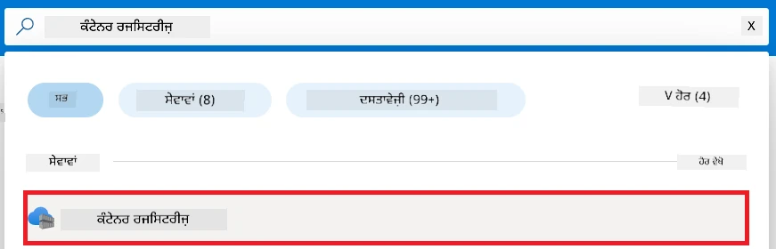

1. ਉਸ ਕੰਟੇਨਰ ਰਜਿਸਟਰੀ ਨੂੰ ਚੁਣੋ ਜੋ ਅਜੁਰ ਮਸ਼ੀਨ ਲਰਨਿੰਗ ਵਰਕਸਪੇਸ ਨਾਲ ਜੁੜੀ ਹੋਈ ਹੈ। ਉਦਾਹਰਨ ਲਈ, *finetunephicontainerregistry*

1. Add role assignment ਪੰਨੇ 'ਤੇ ਜਾਣ ਲਈ ਹੇਠ ਲਿਖੇ ਕੰਮ ਕਰੋ:

    - ਖੱਬੇ ਪਾਸੇ ਟੈਬ ਵਿੱਚੋਂ **Access Control (IAM)** ਚੁਣੋ।
    - ਨੈਵੀਗੇਸ਼ਨ ਮੇਨੂ ਵਿੱਚੋਂ **+ Add** ਚੁਣੋ।
    - ਨੈਵੀਗੇਸ਼ਨ ਮੇਨੂ ਵਿੱਚੋਂ **Add role assignment** ਚੁਣੋ।

1. Add role assignment ਪੰਨੇ ਦੇ ਅੰਦਰ, ਹੇਠ ਲਿਖੇ ਕੰਮ ਕਰੋ:

    - Role ਪੰਨੇ ਵਿੱਚ, **search bar** ਵਿੱਚ *AcrPull* ਟਾਈਪ ਕਰੋ ਅਤੇ ਆਏ ਵਿਕਲਪਾਂ ਵਿੱਚੋਂ **AcrPull** ਚੁਣੋ।
    - Role ਪੰਨੇ ਵਿੱਚ, **Next** ਚੁਣੋ।
    - Members ਪੰਨੇ ਵਿੱਚ, **Assign access to** ਵਜੋਂ **Managed identity** ਚੁਣੋ।
    - Members ਪੰਨੇ ਵਿੱਚ, **+ Select members** ਚੁਣੋ।
    - Select managed identities ਪੰਨੇ ਵਿੱਚ, ਆਪਣੀ ਅਜੁਰ **Subscription** ਚੁਣੋ।
    - Select managed identities ਪੰਨੇ ਵਿੱਚ, **Managed identity** ਵਜੋਂ **Manage Identity** ਚੁਣੋ।
    - Select managed identities ਪੰਨੇ ਵਿੱਚ, ਉਹ Manage Identity ਚੁਣੋ ਜੋ ਤੁਸੀਂ ਬਣਾਇਆ ਸੀ। ਉਦਾਹਰਨ ਲਈ, *finetunephi-managedidentity*।
    - Select managed identities ਪੰਨੇ ਵਿੱਚ, **Select** ਚੁਣੋ।
    - **Review + assign** ਚੁਣੋ।

### ਪ੍ਰੋਜੈਕਟ ਸੈੱਟਅੱਪ ਕਰੋ

ਫਾਈਨ-ਟਿਊਨਿੰਗ ਲਈ ਲੋੜੀਂਦੇ ਡੇਟਾਸੇਟ ਨੂੰ ਡਾਊਨਲੋਡ ਕਰਨ ਲਈ, ਤੁਸੀਂ ਇੱਕ ਲੋਕਲ ਐਨਵਾਇਰਨਮੈਂਟ ਸੈੱਟਅੱਪ ਕਰੋਗੇ।

ਇਸ ਕਸਰਤ ਵਿੱਚ, ਤੁਸੀਂ

- ਕੰਮ ਕਰਨ ਲਈ ਇੱਕ ਫੋਲਡਰ ਬਣਾਓਗੇ।
- ਇੱਕ ਵਰਚੂਅਲ ਐਨਵਾਇਰਨਮੈਂਟ ਬਣਾਓਗੇ।
- ਲੋੜੀਂਦੇ ਪੈਕੇਜ ਇੰਸਟਾਲ ਕਰੋਗੇ।
- ਡੇਟਾਸੇਟ ਡਾਊਨਲੋਡ ਕਰਨ ਲਈ *download_dataset.py* ਫਾਈਲ ਬਣਾਓਗੇ।

#### ਕੰਮ ਕਰਨ ਲਈ ਇੱਕ ਫੋਲਡਰ ਬਣਾਓ

1. ਟਰਮੀਨਲ ਵਿੰਡੋ ਖੋਲ੍ਹੋ ਅਤੇ ਮੂਲ ਪਾਥ ਵਿੱਚ *finetune-phi* ਨਾਮ ਦਾ ਫੋਲਡਰ ਬਣਾਉਣ ਲਈ ਹੇਠ ਲਿਖਾ ਕਮਾਂਡ ਟਾਈਪ ਕਰੋ।

    ```console
    mkdir finetune-phi
    ```

2. ਆਪਣੇ ਟਰਮੀਨਲ ਵਿੱਚ ਹੇਠਾਂ ਦਿੱਤਾ ਕਮਾਂਡ ਟਾਈਪ ਕਰੋ ਤਾਂ ਜੋ ਤੁਸੀਂ ਬਣਾਏ ਹੋਏ *finetune-phi* ਫੋਲਡਰ ਵਿੱਚ ਜਾ ਸਕੋ।

    ```console
    cd finetune-phi
    ```

#### ਇੱਕ ਵਰਚੁਅਲ ਵਾਤਾਵਰਣ ਬਣਾਓ

1. ਆਪਣੇ ਟਰਮੀਨਲ ਵਿੱਚ ਹੇਠਾਂ ਦਿੱਤਾ ਕਮਾਂਡ ਟਾਈਪ ਕਰੋ ਤਾਂ ਜੋ ਇੱਕ ਵਰਚੁਅਲ ਵਾਤਾਵਰਣ *.venv* ਨਾਮ ਨਾਲ ਬਣ ਸਕੇ।

    ```console
    python -m venv .venv
    ```

2. ਆਪਣੇ ਟਰਮੀਨਲ ਵਿੱਚ ਹੇਠਾਂ ਦਿੱਤਾ ਕਮਾਂਡ ਟਾਈਪ ਕਰੋ ਤਾਂ ਜੋ ਵਰਚੁਅਲ ਵਾਤਾਵਰਣ ਐਕਟੀਵੇਟ ਕੀਤਾ ਜਾ ਸਕੇ।

    ```console
    .venv\Scripts\activate.bat
    ```

> [!NOTE]
> ਜੇ ਇਸ ਨੇ ਕੰਮ ਕੀਤਾ, ਤਾਂ ਤੁਹਾਨੂੰ ਕਮਾਂਡ ਪ੍ਰਾਂਪਟ ਤੋਂ ਪਹਿਲਾਂ *(.venv)* ਦੇਖਾਈ ਦੇਣਾ ਚਾਹੀਦਾ ਹੈ।

#### ਲੋੜੀਂਦੇ ਪੈਕੇਜ ਇੰਸਟਾਲ ਕਰੋ

1. ਆਪਣੀ ਟਰਮੀਨਲ ਵਿੱਚ ਹੇਠ ਲਿਖੀਆਂ ਕਮਾਂਡਾਂ ਟਾਈਪ ਕਰੋ ਤਾਂ ਜੋ ਲੋੜੀਂਦੇ ਪੈਕੇਜ ਇੰਸਟਾਲ ਹੋਣ।

    ```console
    pip install datasets==2.19.1
    ```

#### `download_dataset.py` ਬਣਾਓ

> [!NOTE]
> ਪੂਰਾ ਫੋਲਡਰ ਸਟਰੱਕਚਰ:
>
> ```text
> └── YourUserName
> .    └── finetune-phi
> .        └── download_dataset.py
> ```

1. **Visual Studio Code** ਖੋਲ੍ਹੋ।

1. ਮੀਨੂ ਬਾਰ ਤੋਂ **File** ਚੁਣੋ।

1. **Open Folder** ਚੁਣੋ।

1. *finetune-phi* ਫੋਲਡਰ ਚੁਣੋ ਜੋ ਤੁਸੀਂ ਬਣਾਇਆ ਸੀ, ਜੋ ਕਿ *C:\Users\yourUserName\finetune-phi* ’ਤੇ ਸਥਿਤ ਹੈ।

    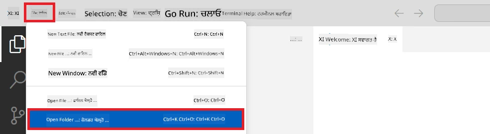

1. Visual Studio Code ਦੇ ਖੱਬੇ ਪੈਨ ਵਿੱਚ, ਰਾਈਟ-ਕਲਿੱਕ ਕਰੋ ਅਤੇ **New File** ਚੁਣੋ ਤਾਂ ਜੋ ਨਵਾਂ ਫਾਇਲ *download_dataset.py* ਬਣਾਇਆ ਜਾ ਸਕੇ।

    

### ਫਾਈਨ-ਟਿਊਨਿੰਗ ਲਈ ਡੇਟਾਸੈੱਟ ਤਿਆਰ ਕਰੋ

ਇਸ ਅਭਿਆਸ ਵਿੱਚ, ਤੁਸੀਂ *download_dataset.py* ਫਾਇਲ ਚਲਾਉਂਦੇ ਹੋ ਤਾਂ ਜੋ *ultrachat_200k* ਡੇਟਾਸੈੱਟ ਆਪਣੇ ਲੋਕਲ ਵਾਤਾਵਰਨ ਵਿੱਚ ਡਾਊਨਲੋਡ ਕਰ ਸਕੋ। ਫਿਰ ਤੁਸੀਂ ਇਹ ਡੇਟਾਸੈੱਟ Azure Machine Learning ਵਿੱਚ Phi-3 ਮਾਡਲ ਨੂੰ ਫਾਈਨ-ਟਿਊਨ ਕਰਨ ਲਈ ਵਰਤੋਂ ਕਰੋਂਗੇ।

ਇਸ ਅਭਿਆਸ ਵਿੱਚ, ਤੁਸੀਂ:

- *download_dataset.py* ਫਾਇਲ ਵਿੱਚ ਕੋਡ ਸ਼ਾਮਲ ਕਰੋਂਗੇ ਤਾਂ ਜੋ ਡੇਟਾਸੈੱਟ ਡਾਊਨਲੋਡ ਕੀਤਾ ਜਾ ਸਕੇ।
- *download_dataset.py* ਫਾਇਲ ਚਲਾਉਂਗੇ ਤਾਂ ਜੋ ਡੇਟਾਸੈੱਟ ਤੁਹਾਡੇ ਲੋਕਲ ਵਾਤਾਵਰਨ ਵਿੱਚ ਡਾਊਨਲੋਡ ਹੋ ਜਾਵੇ।

#### *download_dataset.py* ਦੀ ਵਰਤੋਂ ਕਰਦੇ ਹੋਏ ਆਪਣਾ ਡੇਟਾਸੈੱਟ ਡਾਊਨਲੋਡ ਕਰੋ

1. Visual Studio Code ਵਿੱਚ *download_dataset.py* ਫਾਇਲ ਖੋਲ੍ਹੋ।

1. ਹੇਠਾਂ ਦਿੱਤਾ ਕੋਡ *download_dataset.py* ਫਾਇਲ ਵਿੱਚ ਸ਼ਾਮਲ ਕਰੋ।

    ```python
    import json
    import os
    from datasets import load_dataset

    def load_and_split_dataset(dataset_name, config_name, split_ratio):
        """
        Load and split a dataset.
        """
        # ਦਿੱਤੇ ਗਏ ਨਾਮ, ਵਿਵਸਥਾ, ਅਤੇ ਵੰਡ ਅਨੁਪਾਤ ਨਾਲ ਡੇਟਾਸੈੱਟ ਲੋਡ ਕਰੋ
        dataset = load_dataset(dataset_name, config_name, split=split_ratio)
        print(f"Original dataset size: {len(dataset)}")
        
        # ਡੇਟਾਸੈੱਟ ਨੂੰ ਟ੍ਰੇਨ ਅਤੇ ਟੈਸਟ ਸੈੱਟਾਂ ਵਿੱਚ ਵੰਡੋ (80% ਟ੍ਰੇਨ, 20% ਟੈਸਟ)
        split_dataset = dataset.train_test_split(test_size=0.2)
        print(f"Train dataset size: {len(split_dataset['train'])}")
        print(f"Test dataset size: {len(split_dataset['test'])}")
        
        return split_dataset

    def save_dataset_to_jsonl(dataset, filepath):
        """
        Save a dataset to a JSONL file.
        """
        # ਡਾਇਰੈਕਟਰੀ ਬਣਾਓ ਜੇ ਇਹ ਮੌਜੂਦ ਨਾ ਹੋਵੇ
        os.makedirs(os.path.dirname(filepath), exist_ok=True)
        
        # ਫਾਇਲ ਨੂੰ ਲਿਖਣ ਦੇ ਮੋਡ ਵਿੱਚ ਖੋਲ੍ਹੋ
        with open(filepath, 'w', encoding='utf-8') as f:
            # ਡੇਟਾਸੈੱਟ ਵਿੱਚ ਹਰ ਰਿਕਾਰਡ 'ਤੇ ਦੁਹਰਾਈ ਕਰੋ
            for record in dataset:
                # ਰਿਕਾਰਡ ਨੂੰ JSON ਆਬਜੈਕਟ ਵਜੋਂ ਡੰਪ ਕਰੋ ਅਤੇ ਫਾਇਲ ਵਿੱਚ ਲਿਖੋ
                json.dump(record, f)
                # ਰਿਕਾਰਡਾਂ ਨੂੰ ਵੱਖਰਾ ਕਰਨ ਲਈ ਨਵੀਂ ਲਾਈਨ ਦਾ ਅੱਖਰ ਲਿਖੋ
                f.write('\n')
        
        print(f"Dataset saved to {filepath}")

    def main():
        """
        Main function to load, split, and save the dataset.
        """
        # ULTRACHAT_200k ਡੇਟਾਸੈੱਟ ਨੂੰ ਇੱਕ ਵਿਸ਼ੇਸ਼ ਵਿਵਸਥਾ ਅਤੇ ਵੰਡ ਅਨੁਪਾਤ ਨਾਲ ਲੋਡ ਅਤੇ ਵੰਡੋ
        dataset = load_and_split_dataset("HuggingFaceH4/ultrachat_200k", 'default', 'train_sft[:1%]')
        
        # ਵੰਡ ਵਿੱਚੋਂ ਟ੍ਰੇਨ ਅਤੇ ਟੈਸਟ ਡੇਟਾਸੈੱਟ ਨਿਕਾਲੋ
        train_dataset = dataset['train']
        test_dataset = dataset['test']

        # ਟ੍ਰੇਨ ਡੇਟਾਸੈੱਟ ਨੂੰ JSONL ਫਾਇਲ 'ਚ ਸੇਵ ਕਰੋ
        save_dataset_to_jsonl(train_dataset, "data/train_data.jsonl")
        
        # ਟੈਸਟ ਡੇਟਾਸੈੱਟ ਨੂੰ ਇੱਕ ਵੱਖਰੀ JSONL ਫਾਇਲ 'ਚ ਸੇਵ ਕਰੋ
        save_dataset_to_jsonl(test_dataset, "data/test_data.jsonl")

    if __name__ == "__main__":
        main()

    ```

1. ਆਪਣੇ ਟਰਮੀਨਲ ਵਿੱਚ ਹੇਠਾਂ ਦਿੱਤਾ ਕਮਾਂਡ ਟਾਈਪ ਕਰੋ ਤਾਂ ਜੋ ਸਕ੍ਰਿਪਟ ਚਲਾਈ ਜਾ ਸਕੇ ਤੇ ਡੇਟਾਸੈੱਟ ਤੁਹਾਡੇ ਲੋਕਲ ਵਾਤਾਵਰਨ ਵਿੱਚ ਡਾਊਨਲੋਡ ਹੋ ਜਾਵੇ।

    ```console
    python download_dataset.py
    ```

1. ਇਹ ਯਕੀਨੀ ਬਣਾਓ ਕਿ ਡੇਟਾਸੈੱਟ ਸਫਲਤਾਪੂਰਵਕ ਤੁਹਾਡੇ ਲੋਕਲ *finetune-phi/data* ਡਾਇਰੈਕਟਰੀ ਵਿੱਚ ਸੇਵ ਹੋਏ ਹਨ।

> [!NOTE]
>
> #### ਡੇਟਾਸੈੱਟ ਦੀ ਸਾਈਜ਼ ਅਤੇ ਫਾਈਨ-ਟਿਊਨਿੰਗ ਸਮੇਂ ਬਾਰੇ ਨੋਟ
>
> ਇਸ ਟਿਊਟੋਰਿਅਲ ਵਿੱਚ, ਤੁਸੀਂ ਸਿਰਫ 1% ਡੇਟਾਸੈੱਟ (`split='train[:1%]'`) ਹੀ ਵਰਤ ਰਹੇ ਹੋ। ਇਸ ਨਾਲ ਡੇਟਾ di matra ਘਟ ਜਾਦੀ ਹੈ, ਜਿਸ ਨਾਲ ਅੱਪਲੋਡ ਅਤੇ ਫਾਈਨ-ਟਿਊਨਿੰਗ ਪ੍ਰਕਿਰਿਆ ਤੇਜ ਹੋ ਜਾਂਦੀ ਹੈ। ਤੁਸੀਂ ਸਧਾਰਨ ਤੌਰ 'ਤੇ ਪ੍ਰਦਰਸ਼ਨ ਤੇ ਟ੍ਰੇਨਿੰਗ ਸਮੇਂ ਦੇ ਸੰਤੁਲਨ ਲਈ ਪ੍ਰਤੀਸ਼ਤ ਨੂੰ Ajust ਕਰ ਸਕਦੇ ਹੋ। ਡੇਟਾ ਦਾ ਛੋਟਾ ਹਿੱਸਾ ਵਰਤਣ ਨਾਲ ਫਾਈਨ-ਟਿਊਨਿੰਗ ਦਾ ਸਮਾਂ ਘਟਦਾ ਹੈ, ਜੋ ਇਸ ਟਿਊਟੋਰਿਅਲ ਲਈ ਪ੍ਰਕਿਰਿਆ ਨੂੰ ਸੁਗਮ ਬਣਾਉਂਦਾ ਹੈ।

## ਦ੍ਰਿਸ਼ 2: Phi-3 ਮਾਡਲ ਨੂੰ ਫਾਈਨ-ਟਿਊਨ ਕਰੋ ਅਤੇ Azure Machine Learning Studio ਵਿੱਚ ਡਿਪਲੋਈ ਕਰੋ

### Phi-3 ਮਾਡਲ ਨੂੰ ਫਾਈਨ-ਟਿਊਨ ਕਰੋ

ਇਸ ਅਭਿਆਸ ਵਿੱਚ, ਤੁਸੀਂ Azure Machine Learning Studio ਵਿੱਚ Phi-3 ਮਾਡਲ ਨੂੰ ਫਾਈਨ-ਟਿਊਨ ਕਰੋਗੇ।

ਇਸ ਅਭਿਆਸ ਵਿੱਚ, ਤੁਸੀਂ:

- ਫਾਈਨ-ਟਿਊਨਿੰਗ ਲਈ ਕੰਪਿਊਟਰ ਕਲੱਸਟਰ ਬਣਾਓਗੇ।
- Azure Machine Learning Studio ਵਿੱਚ Phi-3 ਮਾਡਲ ਨੂੰ ਫਾਈਨ-ਟਿਊਨ ਕਰੋਗੇ।

#### ਫਾਈਨ-ਟਿਊਨਿੰਗ ਲਈ ਕੰਪਿਊਟਰ ਕਲੱਸਟਰ ਬਣਾਓ

1. [Azure ML Studio](https://ml.azure.com/home?wt.mc_id=studentamb_279723) 'ਤੇ ਜਾਓ।

1. ਖੱਬੇ ਸਾਇਡ ਟੈਬ ਤੋਂ **Compute** ਚੁਣੋ।

1. ਨੈਵੀਗੇਸ਼ਨ ਮੇਨੂ ਵਿੱਚੋਂ **Compute clusters** ਚੁਣੋ।

1. **+ New** ਚੁਣੋ।

    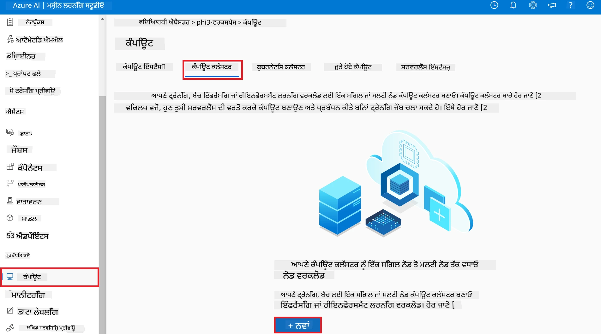

1. ਹੇਠਾਂ ਦਿੱਤੇ ਕੰਮ ਕਰੋ:

    - ਉਹ **Region** ਚੁਣੋ ਜਿੰਨਾ ਤੁਸੀਂ ਵਰਤਣਾ ਚਾਹੁੰਦੇ ਹੋ।
    - **Virtual machine tier** ਨੂੰ **Dedicated** ਚੁਣੋ।
    - **Virtual machine type** ਨੂੰ **GPU** ਚੁਣੋ।
    - **Virtual machine size** ਫਿਲਟਰ ਨੂੰ **Select from all options** ਚੁਣੋ।
    - **Virtual machine size** ਨੂੰ **Standard_NC24ads_A100_v4** ਚੁਣੋ।

    

1. **Next** ਚੁਣੋ।

1. ਹੇਠਾਂ ਦਿੱਤੇ ਕੰਮ ਕਰੋ:

    - **Compute name** ਦਿਓ। ਇਹ ਇੱਕ ਵਿਲੱਖਣ ਮੁੱਲ ਹੋਣਾ ਚਾਹੀਦਾ ਹੈ।
    - **Minimum number of nodes** ਨੂੰ **0** ਚੁਣੋ।
    - **Maximum number of nodes** ਨੂੰ **1** ਚੁਣੋ।
    - **Idle seconds before scale down** ਨੂੰ **120** ਚੁਣੋ।

    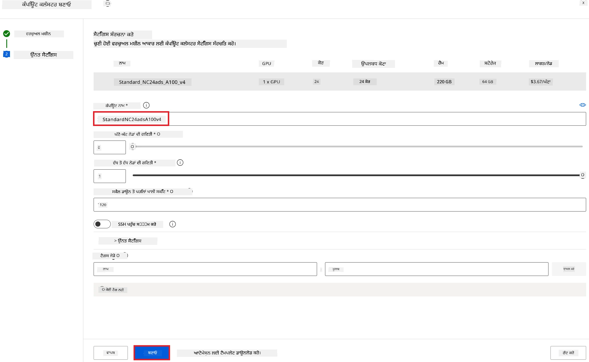

1. **Create** ਚੁਣੋ।

#### Phi-3 ਮਾਡਲ ਨੂੰ ਫਾਈਨ-ਟਿਊਨ ਕਰੋ

1. [Azure ML Studio](https://ml.azure.com/home?wt.mc_id=studentamb_279723) 'ਤੇ ਜਾਓ।

1. ਆਪਣਾ ਬਣਾਇਆ ਹੋਇਆ Azure Machine Learning ਵਰਕਸਪੇਸ ਚੁਣੋ।

    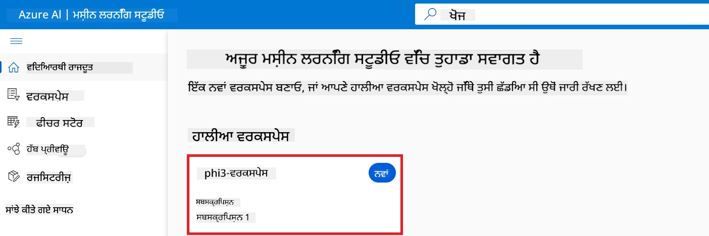

1. ਹੇਠਾਂ ਦਿੱਤੇ ਕੰਮ ਕਰੋ:

    - ਖੱਬੇ ਪਾਸੇ ਵਾਲੇ ਟੈਬ ਤੋਂ **Model catalog** ਚੁਣੋ।
    - **search bar** ਵਿੱਚ *phi-3-mini-4k* ਟਾਈਪ ਕਰੋ ਅਤੇ ਉੱਪਰ ਦਿੱਤੇ ਵਿਕਲਪਾਂ ਵਿੱਚੋਂ **Phi-3-mini-4k-instruct** ਚੁਣੋ।

    

1. ਨੈਵੀਗੇਸ਼ਨ ਮੇਨੂ ਤੋਂ **Fine-tune** ਚੁਣੋ।

    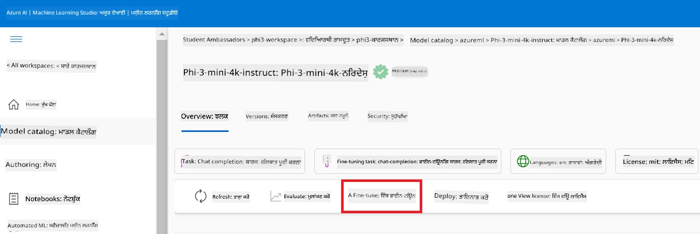

1. ਹੇਠਾਂ ਦਿੱਤੇ ਕੰਮ ਕਰੋ:

    - **Select task type** ਨੂੰ **Chat completion** ਚੁਣੋ।
    - **+ Select data** ਚੁਣੋ ਤਾਂ ਜੋ **Training data** ਅੱਪਲੋਡ ਕੀਤਾ ਜਾ ਸਕੇ।
    - Validation data ਅੱਪਲੋਡ ਦੀ ਕਿਸਮ ਨੂੰ **Provide different validation data** ਚੁਣੋ।
    - **+ Select data** ਚੁਣੋ ਤਾਂ ਜੋ **Validation data** ਅੱਪਲੋਡ ਕੀਤਾ ਜਾ ਸਕੇ।

    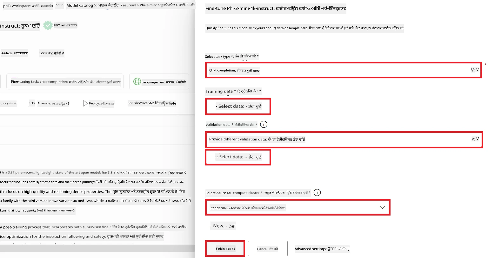

> [!TIP]
>
> ਤੁਸੀਂ **Advanced settings** ਚੁਣ ਕੇ ਆਪਣੇ ਖ਼ਾਸ ਜ਼ਰੂਰਤਾਂ ਮੁਤਾਬਕ **learning_rate** ਅਤੇ **lr_scheduler_type** ਵਰਗੀਆਂ ਸੰਰਚਨਾਵਾਂ ਕਸਟਮਾਈਜ਼ ਕਰ ਸਕਦੇ ਹੋ ਤਾਂ ਜੋ ਫਾਈਨ-ਟਿਊਨਿੰਗ ਪ੍ਰਕਿਰਿਆ ਨੂੰ ਬਿਹਤਰ ਬਨਾਇਆ ਜਾ ਸਕੇ।

1. **Finish** ਚੁਣੋ।

1. ਇਸ ਅਭਿਆਸ ਵਿੱਚ, ਤੁਸੀਂ ਸਫਲਤਾ ਨਾਲ Azure Machine Learning ਦੀ ਵਰਤੋਂ ਕਰਕੇ Phi-3 ਮਾਡਲ ਨੂੰ ਫਾਈਨ-ਟਿਊਨ ਕੀਤਾ। ਕਿਰਪਾ ਕਰਕੇ ਧਿਆਨ ਦਿਓ ਕਿ ਫਾਈਨ-ਟਿਊਨਿੰਗ ਦੀ ਪ੍ਰਕਿਰਿਆ ਕਾਫੀ ਸਮਾਂ ਲੈ ਸਕਦੀ ਹੈ। ਫਾਈਨ-ਟਿਊਨਿੰਗ ਦਾ ਕੰਮ ਸ਼ੁਰੂ ਹੋਣ ਤੋਂ ਬਾਅਦ, ਤੁਹਾਨੂੰ ਇਸ ਦੇ ਪੂਰੇ ਹੋਣ ਲਈ ਉਡੀਕ ਕਰਨੀ ਪਵੇਗੀ। ਤੁਸੀਂ Azure Machine Learning ਵਰਕਸਪੇਸ ਦੇ ਖੱਬੇ ਪਸਤ ਟੈਬ ਤੇ ਜਾ ਕੇ Jobs ਟੈਬ ਵਿੱਚ ਫਾਈਨ-ਟਿਊਨਿੰਗ ਜੌਬ ਦੀ ਸਥਿਤੀ ਦਾ ਨਿਰੀਖਣ ਕਰ ਸਕਦੇ ਹੋ। ਅਗਲੇ ਭਾਗ ਵਿੱਚ, ਤੁਸੀਂ ਫਾਈਨ-ਟਿਊਨ ਕੀਤਾ ਮਾਡਲ ਡਿਪਲੋਈ ਕਰਕੇ ਇਸਨੂੰ Prompt flow ਨਾਲ ਸੰਬੰਧਿਤ ਕਰੋਗੇ।

    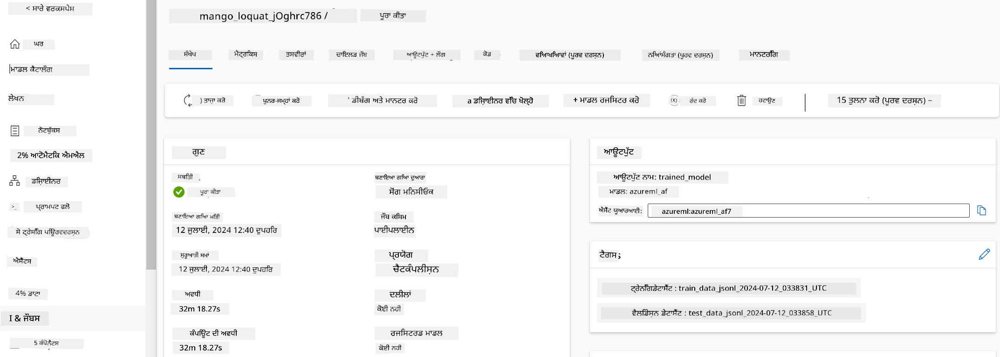

### ਫਾਈਨ-ਟਿਊਨ ਕੀਤਾ Phi-3 ਮਾਡਲ ਡਿਪਲੋਈ ਕਰੋ

ਫਾਈਨ-ਟਿਊਨ ਕੀਤਾ Phi-3 ਮਾਡਲ Prompt flow ਨਾਲ ਏਨਗ੍ਰੇਟ ਕਰਨ ਲਈ, ਤੁਹਾਨੂੰ ਮਾਡਲ ਨੂੰ ਡਿਪਲੋਈ ਕਰਨਾ ਪਵੇਗਾ ਤਾਂ ਜੋ ਇਹ ਰੀਅਲ-ਟਾਈਮ ਇੰਫਰੈਂਸ ਲਈ ਉਪਲਬਧ ਹੋ ਜਾਵੇ। ਇਸ ਪ੍ਰਕਿਰਿਆ ਵਿੱਚ ਮਾਡਲ ਰਜਿਸਟਰ ਕਰਨਾ, ਇੱਕ ਆਨਲਾਈਨ ਐਂਡਪੌਇੰਟ ਬਣਾਉਣਾ, ਅਤੇ ਮਾਡਲ ਡਿਪਲੋਈ ਕਰਨਾ ਸ਼ਾਮਲ ਹੈ।

ਇਸ ਅਭਿਆਸ ਵਿੱਚ, ਤੁਸੀਂ:

- Azure Machine Learning ਵਰਕਸਪੇਸ ਵਿੱਚ ਫਾਈਨ-ਟਿਊਨ ਕੀਤਾ ਮਾਡਲ ਰਜਿਸਟਰ ਕਰੋਗੇ।
- ਇੱਕ ਆਨਲਾਈਨ ਐਂਡਪੌਇੰਟ ਬਣਾਓਗੇ।
- ਰਜਿਸਟਰ ਮਾਡਲ ਨੂੰ ਡਿਪਲੋਈ ਕਰੋਗੇ।

#### ਫਾਈਨ-ਟਿਊਨ ਕੀਤਾ ਮਾਡਲ ਰਜਿਸਟਰ ਕਰੋ

1. [Azure ML Studio](https://ml.azure.com/home?wt.mc_id=studentamb_279723) 'ਤੇ ਜਾਓ।

1. ਆਪਣਾ ਬਣਾਇਆ ਹੋਇਆ Azure Machine Learning ਵਰਕਸਪੇਸ ਚੁਣੋ।

    

1. ਖੱਬੇ ਪਾਸੇ ਵਾਲੇ ਟੈਬ ਤੋਂ **Models** ਚੁਣੋ।
1. **+ Register** ਚੁਣੋ।
1. **From a job output** ਚੁਣੋ।

    

1. ਉਹ ਜੌਬ ਚੁਣੋ ਜੋ ਤੁਸੀਂ ਬਣਾਈ ਸੀ।

    

1. **Next** ਚੁਣੋ।

1. **Model type** ਨੂੰ **MLflow** ਚੁਣੋ।

1. ਯਕੀਨੀ ਬਣਾਓ ਕਿ **Job output** ਚੁਣਿਆ ਹੋਇਆ ਹੈ; ਇਹ ਆਪਣੇ-ਆਪ ਹੀ ਚੁਣਿਆ ਹੋਣ ਚਾਹੀਦਾ ਹੈ।

    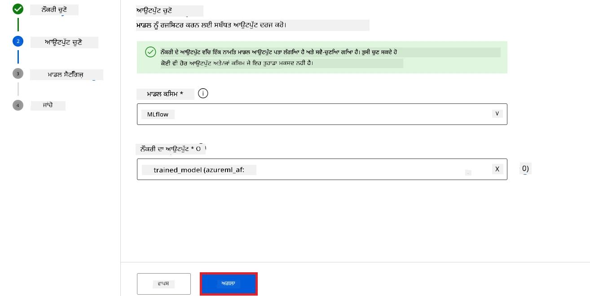

2. **Next** ਚੁਣੋ।

3. **Register** ਚੁਣੋ।

    

4. ਤੁਸੀਂ ਆਪਣੇ ਰਜਿਸਟਰ ਕੀਤੇ ਮਾਡਲ ਨੂੰ ਖੱਬੇ ਪਾਸੇ ਵਾਲੇ ਟੈਬ ਤੋਂ **Models** ਮੇਨੂ ਵਿੱਚ ਦੇਖ ਸਕਦੇ ਹੋ।

    

#### ਫਾਈਨ-ਟਿਊਨ ਕੀਤਾ ਮਾਡਲ ਡਿਪਲੋਈ ਕਰੋ

1. Azure Machine Learning ਵਰਕਸਪੇਸ ਵਿੱਚ ਜਾਓ ਜੋ ਤੁਸੀਂ ਬਣਾਇਆ।

1. ਖੱਬੇ ਪਾਸੇ ਵਾਲੇ ਟੈਬ ਤੋਂ **Endpoints** ਚੁਣੋ।

1. ਨੈਵੀਗੇਸ਼ਨ ਮੇਨੂ ਤੋਂ **Real-time endpoints** ਚੁਣੋ।

    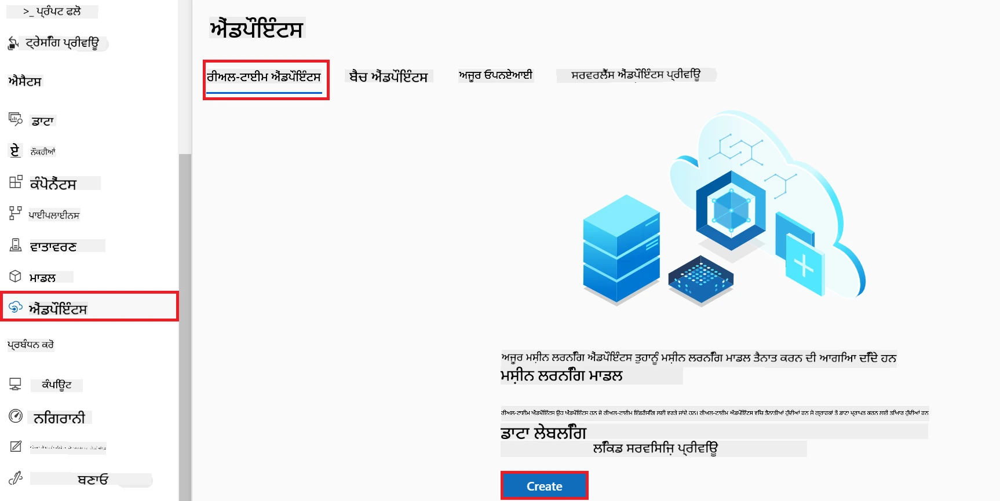

1. **Create** ਚੁਣੋ।

1. ਆਪਣੇ ਬਣਾਏ ਹੋਏ ਰਜਿਸਟਰ ਮਾਡਲ ਨੂੰ ਚੁਣੋ।

    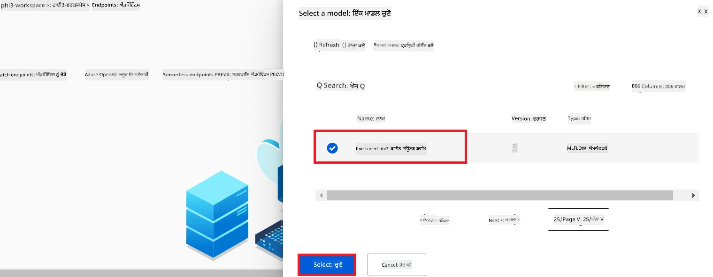

1. **Select** ਚੁਣੋ।

1. ਹੇਠਾਂ ਦਿੱਤੇ ਕੰਮ ਕਰੋ:

    - **Virtual machine** ਨੂੰ *Standard_NC6s_v3* ਚੁਣੋ।
    - **Instance count** ਉਸ ਮੁੱਲ ਨੂੰ ਚੁਣੋ ਜੋ ਤੁਸੀਂ ਵਰਤਣਾ ਹੈ। ਉਦਾਹਰਨ ਲਈ, *1*।
    - **Endpoint** ਨੂੰ **New** ਚੁਣੋ ਤਾਂ ਜੋ ਐਂਡਪੌਇੰਟ ਬਣਾਇਆ ਜਾ ਸਕੇ।
    - **Endpoint name** ਦਿਓ। ਇਹ ਇੱਕ ਵਿਲੱਖਣ ਮੁੱਲ ਹੋਣਾ ਚਾਹੀਦਾ ਹੈ।
    - **Deployment name** ਦਿਓ। ਇਹ ਇੱਕ ਵਿਲੱਖਣ ਮੁੱਲ ਹੋਣਾ ਚਾਹੀਦਾ ਹੈ।

    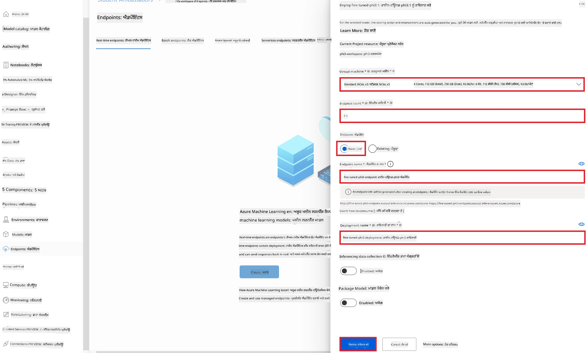

1. **Deploy** ਚੁਣੋ।

> [!WARNING]
> ਆਪਣੇ ਖਾਤੇ ਤੇ ਵਾਧੂ ਖਰਚੋਂ ਤੋਂ ਬਚਣ ਲਈ, ਜੋ ਐਂਡਪੌਇੰਟ ਤੁਸੀਂ Azure Machine Learning ਵਰਕਸਪੇਸ ਵਿੱਚ ਬਣਾਇਆ ਹੈ, ਜਰੂਰ ਹਟਾ ਦੇਵੋ।
>

#### Azure Machine Learning ਵਰਕਸਪੇਸ ਵਿੱਚ ਡਿਪਲੋਇਮੈਂਟ ਸਥਿਤੀ ਚੈੱਕ ਕਰੋ

1. ਉਸ Azure Machine Learning ਵਰਕਸਪੇਸ 'ਤੇ ਜਾਓ ਜੋ ਤੁਸੀਂ ਬਣਾਇਆ।

1. ਖੱਬੇ ਪਾਸੇ ਵਾਲੇ ਟੈਬ ਤੋਂ **Endpoints** ਚੁਣੋ।

1. ਉਸ ਐਂਡਪੌਇੰਟ ਨੂੰ ਚੁਣੋ ਜੋ ਤੁਸੀਂ ਬਣਾਇਆ ਸੀ।

    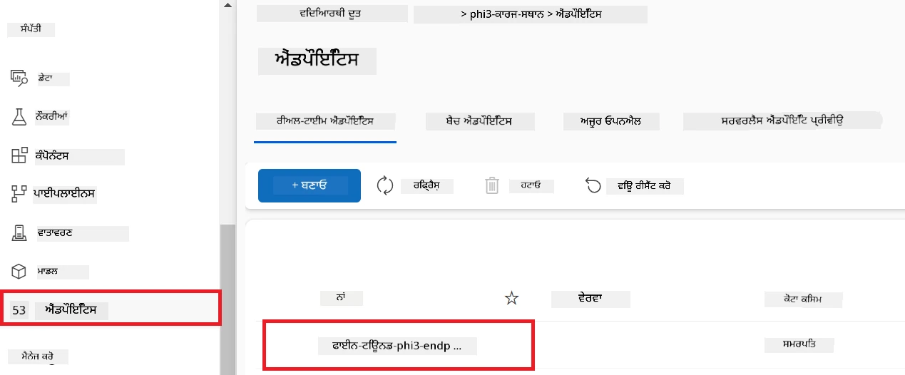

1. ਇਸ ਪੰਨੇ ਤੇ, ਤੁਸੀਂ ਡਿਪਲੋਇਮੈਂਟ ਪ੍ਰਕਿਰਿਆ ਦੌਰਾਨ ਐਂਡਪੌਇੰਟ ਦੀ ਪ੍ਰਬੰਧਨਾ ਕਰ ਸਕਦੇ ਹੋ।

> [!NOTE]
> ਜਦੋਂ ਡਿਪਲੋਇਮੈਂਟ ਪੂਰਾ ਹੋ ਜਾਵੇ, ਯਕੀਨੀ ਬਣਾਓ ਕਿ **Live traffic** **100%** 'ਤੇ ਸੈੱਟ ਹੈ। ਜੇ ਇਸਦਾ ਮੁੱਲ 0% ਨਹੀਂ ਹੈ ਤਾਂ, ਟ੍ਰੈਫਿਕ ਸੈਟਿੰਗ ਨੂੰ ਠੀਕ ਕਰਨ ਲਈ **Update traffic** ਚੁਣੋ। ਧਿਆਨ ਦੇਵੋ ਕਿ ਜੇ ਟ੍ਰੈਫਿਕ 0% ‘ਤੇ ਹੈ ਤਾਂ ਮਾਡਲ ਨੂੰ ਟੈਸਟ ਨਹੀਂ ਕੀਤਾ ਜਾ ਸਕਦਾ।
>
> 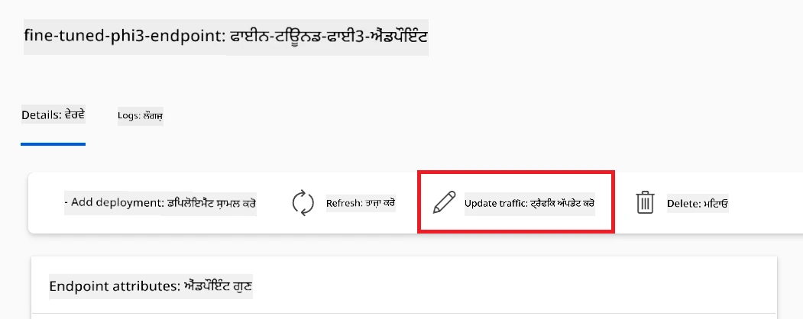
>

## ਦ੍ਰਿਸ਼ 3: Prompt flow ਨਾਲ ਇੰਟੀਗ੍ਰੇਟ ਕਰੋ ਅਤੇ Azure AI Foundry ਵਿੱਚ ਆਪਣੇ ਕਸਟਮ ਮਾਡਲ ਨਾਲ ਗੱਲਬਾਤ ਕਰੋ

### ਕਸਟਮ Phi-3 ਮਾਡਲ ਨੂੰ Prompt flow ਨਾਲ ਜੋੜੋ

ਆਪਣਾ ਫਾਈਨ-ਟਿਊਨ ਕੀਤਾ ਮਾਡਲ ਸਫਲਤਾਪੂਰਵਕ ਡਿਪਲੋਈ ਕਰਨ ਤੋਂ ਬਾਅਦ, ਤੁਸੀਂ ਹੁਣ ਇਸਨੂੰ Prompt Flow ਨਾਲ ਇੰਟੀਗ੍ਰੇਟ ਕਰ ਸਕਦੇ ਹੋ ਤਾਂ ਜੋ ਰੀਅਲ-ਟਾਈਮ ਐਪਲੀਕੇਸ਼ਨਜ਼ ਵਿੱਚ ਆਪਣੇ ਮਾਡਲ ਦੀ ਵਰਤੋਂ ਕਰਕੇ ਵੱਖ-ਵੱਖ ਇੰਟਰੈਕਟਿਵ ਕਾਰਜ ਸੰਪਾਦਿਤ ਕੀਤੇ ਜਾ ਸਕਣ।

ਇਸ ਅਭਿਆਸ ਵਿੱਚ, ਤੁਸੀਂ:

- Azure AI Foundry Hub ਬਣਾਓਗੇ।
- Azure AI Foundry ਪ੍ਰੋਜੈਕਟ ਬਣਾਓਗੇ।
- Prompt flow ਬਣਾਓਗੇ।
- ਫਾਈਨ-ਟਿਊਨ ਕੀਤਾ Phi-3 ਮਾਡਲ ਲਈ ਕਸਟਮ ਕਨੈਕਸ਼ਨ ਜੋੜੋਗੇ।
- ਆਪਣੇ ਕਸਟਮ Phi-3 ਮਾਡਲ ਨਾਲ ਗੱਲਬਾਤ ਕਰਨ ਲਈ Prompt flow ਸੈੱਟ ਕਰੋਗੇ।

> [!NOTE]
> ਤੁਸੀਂ Azure ML Studio ਦੀ ਵਰਤੋਂ ਕਰਕੇ ਵੀ Prompt flow ਨਾਲ ਇੰਟੀਗ੍ਰੇਸ਼ਨ ਕਰ ਸਕਦੇ ਹੋ। ਇਹੋ ਜਿਹਾ ਇੰਟੀਗ੍ਰੇਸ਼ਨ ਪ੍ਰਕਿਰਿਆ Azure ML Studio 'ਤੇ ਵੀ ਲਾਗੂ ਹੁੰਦੀ ਹੈ।

#### Azure AI Foundry Hub ਬਣਾਓ

ਪ੍ਰੋਜੈਕਟ ਬਣਾਉਣ ਤੋਂ ਪਹਿਲਾਂ ਤੁਹਾਨੂੰ ਇੱਕ Hub ਬਣਾਉਣਾ ਪਵੇਗਾ। ਇੱਕ Hub ਇੱਕ Resource Group ਵਾਂਗ ਕਮ ਕਰਦਾ ਹੈ, ਜੋ Azure AI Foundry ਵਿੱਚ ਵੱਖ-ਵੱਖ ਪ੍ਰੋਜੈਕਟਾਂ ਨੂੰ ਵਿਵਸਥਿਤ ਅਤੇ ਪਰਬੰਧਿਤ ਕਰਨ ਵਿੱਚ ਮਦਦ ਕਰਦਾ ਹੈ।

1. [Azure AI Foundry](https://ai.azure.com/?WT.mc_id=aiml-137032-kinfeylo) 'ਤੇ ਜਾਓ।

1. ਖੱਬੇ ਪਾਸੇ ਵਾਲੇ ਟੈਬ ਤੋਂ **All hubs** ਚੁਣੋ।

1. ਨੈਵੀਗੇਸ਼ਨ ਮੇਨੂ ਤੋਂ **+ New hub** ਚੁਣੋ।
    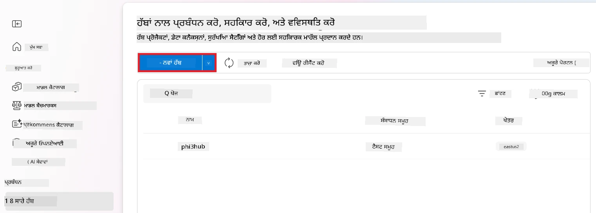

1. ਹੇਠਾਂ ਦਿੱਤੇ ਕੰਮ ਕਰੋ:

    - **Hub name** ਦਰਜ ਕਰੋ। ਇਹ ਇੱਕ ਵਿਲੱਖਣ ਮੁੱਲ ਹੋਣਾ ਚਾਹੀਦਾ ਹੈ।
    - ਆਪਣਾ Azure **Subscription** ਚੁਣੋ।
    - ਵਰਤਣ ਲਈ **Resource group** ਚੁਣੋ (ਜ਼ਰੂਰਤ ਹੋਵੇ ਤਾਂ ਨਵਾਂ ਬਣਾਓ)।
    - ਆਪਣੀ ਪਸੰਦ ਦਾ **Location** ਚੁਣੋ।
    - ਵਰਤਣ ਲਈ **Connect Azure AI Services** ਚੁਣੋ (ਜ਼ਰੂਰਤ ਹੋਵੇ ਤਾਂ ਨਵਾਂ ਬਣਾਓ)।
    - **Connect Azure AI Search** ਨੂੰ **Skip connecting** ਚੁਣੋ।

    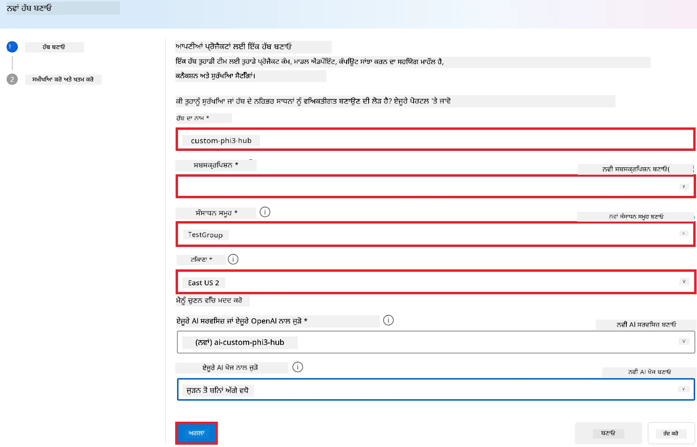

1. **Next** ਚੁਣੋ।

#### Azure AI Foundry ਪ੍ਰੋਜੈਕਟ ਬਣਾਓ

1. ਤੁਸੀਂ ਬਣਾਇਆ ਹੋਇਆ ਹੱਬ ਵਿੱਚ, ਖੱਬੇ ਪਾਸੇ ਟੈਬ ਤੋਂ **All projects** ਚੁਣੋ।

1. ਨੈਵੀਗੇਸ਼ਨ ਮেনੂ ਤੋਂ **+ New project** ਚੁਣੋ।

    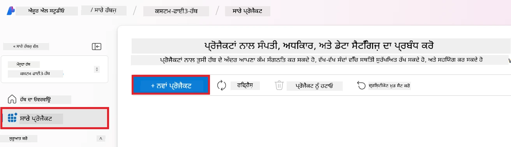

1. **Project name** ਦਰਜ ਕਰੋ। ਇਹ ਇੱਕ ਵਿਲੱਖਣ ਮੁੱਲ ਹੋਣਾ ਚਾਹੀਦਾ ਹੈ।

    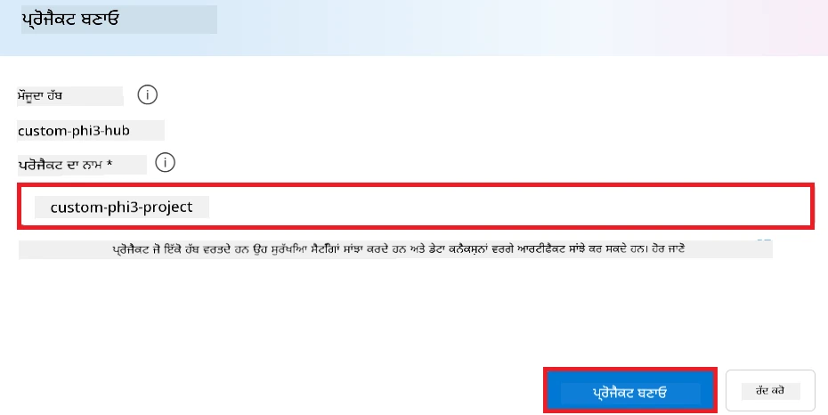

1. **Create a project** ਚੁਣੋ।

#### fine-tuned Phi-3 ਮਾਡਲ ਲਈ ਇਕ ਕਸਟਮ ਕਨੈਕਸ਼ਨ ਜੋੜੋ

ਆਪਣੇ ਕਸਟਮ Phi-3 ਮਾਡਲ ਨੂੰ Prompt flow ਨਾਲ ਜੋੜਨ ਲਈ, ਤੁਹਾਨੂੰ ਮਾਡਲ ਦੇ ਏਂਡਪੋਇੰਟ ਅਤੇ ਕੁੰਜੀ ਨੂੰ ਇੱਕ ਕਸਟਮ ਕਨੈਕਸ਼ਨ ਵਿੱਚ ਸੇਵ ਕਰਨਾ ਪਵੇਗਾ। ਇਹ ਸੈਟਅਪ Prompt flow ਵਿੱਚ ਤੁਹਾਡੇ ਕਸਟਮ Phi-3 ਮਾਡਲ ਤੱਕ ਪਹੁੰਚ ਯਕੀਨੀ ਬਣਾਉਂਦਾ ਹੈ।

#### fine-tuned Phi-3 ਮਾਡਲ ਦੀ api ਕੁੰਜੀ ਅਤੇ endpoint uri ਸੈੱਟ ਕਰੋ

1. [Azure ML Studio](https://ml.azure.com/home?WT.mc_id=aiml-137032-kinfeylo) 'ਤੇ ਜਾਓ।

1. ਆਪਣਾ ਬਣਾਇਆ ਹੋਇਆ Azure Machine learning ਵਰਕਸਪੇਸ ਖੋਲ੍ਹੋ।

1. ਖੱਬੇ ਪਾਸੇ ਟੈਬ ਤੋਂ **Endpoints** ਚੁਣੋ।

    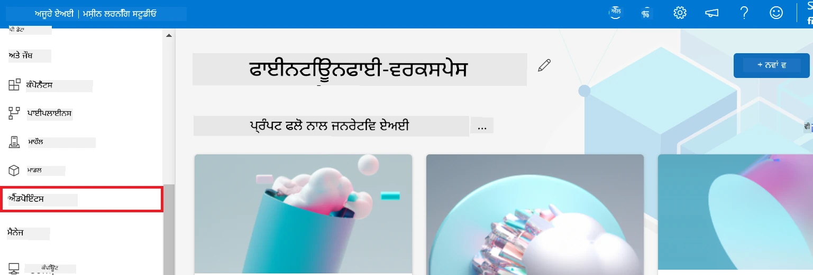

1. ਆਪਣਾ ਬਣਾਇਆ ਹੋਇਆ endpoint ਚੁਣੋ।

    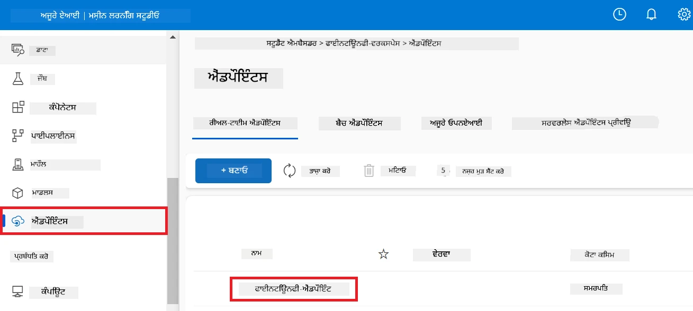

1. ਨੈਵੀਗੇਸ਼ਨ ਮੈਨੂ ਤੋਂ **Consume** ਚੁਣੋ।

1. ਆਪਣਾ **REST endpoint** ਅਤੇ **Primary key** ਕਾਪੀ ਕਰੋ।

    

#### ਕਸਟਮ ਕਨੈਕਸ਼ਨ ਜੋੜੋ

1. [Azure AI Foundry](https://ai.azure.com/?WT.mc_id=aiml-137032-kinfeylo) 'ਤੇ ਜਾਓ।

1. ਆਪਣਾ ਬਣਾਇਆ ਹੋਇਆ Azure AI Foundry ਪ੍ਰੋਜੈਕਟ ਖੋਲ੍ਹੋ।

1. ਬਣਾਇਆ ਹੋਇਆ ਪ੍ਰੋਜੈਕਟ ਵਿੱਚ, ਖੱਬੇ ਪਾਸੇ ਟੈਬ ਤੋਂ **Settings** ਚੁਣੋ।

1. **+ New connection** ਚੁਣੋ।

    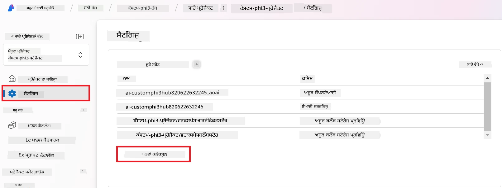

1. ਨੈਵੀਗੇਸ਼ਨ ਮੈਨੂ ਤੋਂ **Custom keys** ਚੁਣੋ।

    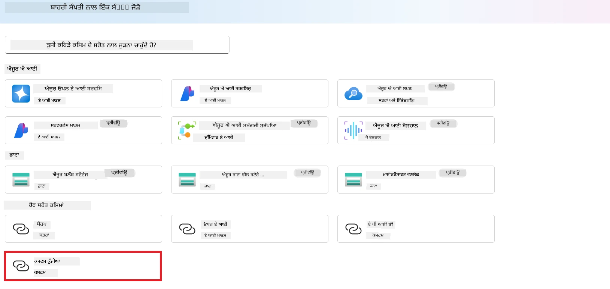

1. ਹੇਠਾਂ ਦਿੱਤੇ ਕੰਮ ਕਰੋ:

    - **+ Add key value pairs** ਚੁਣੋ।
    - ਕੁੰਜੀ ਦੇ ਨਾਮ ਲਈ **endpoint** ਦਰਜ ਕਰੋ ਅਤੇ ਵੈਲਿਊ ਖੇਤਰ ਵਿੱਚ Azure ML Studio ਤੋਂ ਕਾਪੀ ਕੀਤਾ endpoint ਪੇਸਟ ਕਰੋ।
    - ਫਿਰ ਇੱਕ ਵਾਰ ਫਿਰ **+ Add key value pairs** ਚੁਣੋ।
    - ਕੁੰਜੀ ਦੇ ਨਾਮ ਲਈ **key** ਦਰਜ ਕਰੋ ਅਤੇ Azure ML Studio ਤੋਂ ਕਾਪੀ ਕੀਤਾ key ਵੈਲਿਊ ਖੇਤਰ ਵਿੱਚ ਪੇਸਟ ਕਰੋ।
    - ਕੁੰਜੀਆਂ ਜੋੜਨ ਤੋਂ ਬਾਅਦ, ਕੁੰਜੀ ਨੂੰ ਸੁਰੱਖਿਅਤ ਰੱਖਣ ਲਈ **is secret** ਚੁਣੋ।

    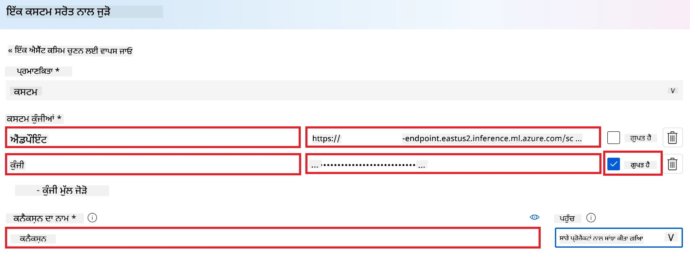

1. **Add connection** ਚੁਣੋ।

#### Prompt flow ਬਣਾਓ

ਤੁਸੀਂ Azure AI Foundry ਵਿੱਚ ਇੱਕ ਕਸਟਮ ਕਨੈਕਸ਼ਨ ਜੋੜ ਦਿੱਤਾ ਹੈ। ਹੁਣ, ਹੇਠਾਂ ਦਿੱਤੇ ਕਦਮਾਂ ਦੀ ਵਰਤੋਂ ਕਰਕੇ ਇੱਕ Prompt flow ਬਣਾਓ। ਫਿਰ, ਤੁਸੀਂ ਇਸ Prompt flow ਨੂੰ ਕਸਟਮ ਕਨੈਕਸ਼ਨ ਨਾਲ ਜੋੜੋਗੇ ਤਾਂ ਜੋ ਤੁਸੀਂ Prompt flow ਵਿੱਚ ਆਪਣੇ fine-tuned ਮਾਡਲ ਦੀ ਵਰਤੋਂ ਕਰ ਸਕੋ।

1. ਆਪਣਾ ਬਣਾਇਆ ਹੋਇਆ Azure AI Foundry ਪ੍ਰੋਜੈਕਟ ਖੋਲ੍ਹੋ।

1. ਖੱਬੇ ਪਾਸੇ ਟੈਬ ਤੋਂ **Prompt flow** ਚੁਣੋ।

1. ਨੈਵੀਗੇਸ਼ਨ ਮੈਨੂ ਤੋਂ **+ Create** ਚੁਣੋ।

    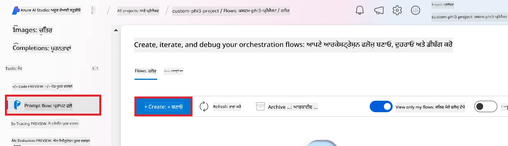

1. ਨੈਵੀਗੇਸ਼ਨ ਮainedੂ ਤੋਂ **Chat flow** ਚੁਣੋ।

    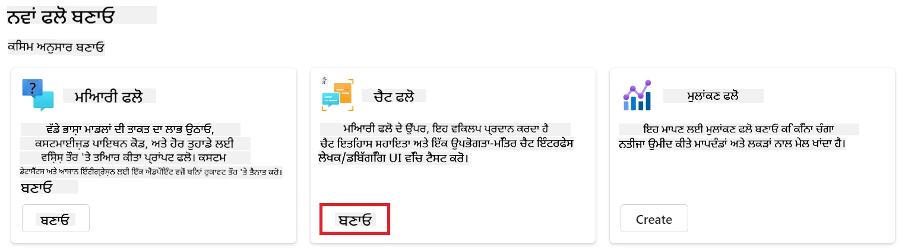

1. ਵਰਤਣ ਲਈ **Folder name** ਦਰਜ ਕਰੋ।

    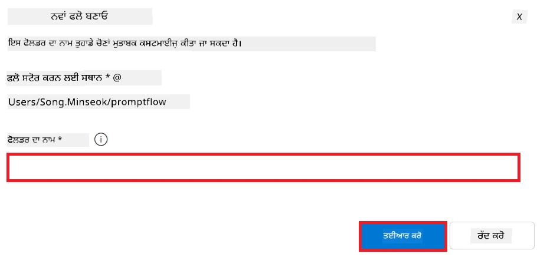

2. **Create** ਚੁਣੋ।

#### Prompt flow ਨੂੰ ਆਪਣੇ ਕਸਟਮ Phi-3 ਮਾਡਲ ਨਾਲ ਚੈਟ ਕਰਨ ਲਈ ਸੈਟਅਪ ਕਰੋ

ਤੁਹਾਨੂੰ fine-tuned Phi-3 ਮਾਡਲ ਨੂੰ Prompt flow ਵਿੱਚ ਜੋੜਨਾ ਲੋੜੀਂਦਾ ਹੈ। ਪਰantu, ਮੌਜੂਦਾ Prompt flow ਜੋ ਦਿੱਤਾ ਗਿਆ ਹੈ, ਉਹ ਇਸ ਲਈ ਉਚਿਤ ਨਹੀਂ ਹੈ। ਇਸ ਲਈ, ਤੁਹਾਨੂੰ Prompt flow ਨੂੰ ਮੁੜ ਡਿਜ਼ਾਈਨ ਕਰਨਾ ਪਵੇਗਾ ਤਾਂ ਜੋ ਕਸਟਮ ਮਾਡਲ ਦੀ ਏਕਤਾ ਹੋ ਸਕੇ।

1. Prompt flow ਵਿੱਚ, ਮੌਜੂਦਾ ਫਲੋ ਨੂੰ ਦੁਬਾਰਾ ਬਣਾਉਣ ਲਈ ਹੇਠਾਂ ਦਿੱਤੇ ਕੰਮ ਕਰੋ:

    - **Raw file mode** ਚੁਣੋ।
    - *flow.dag.yml* ਫਾਇਲ ਵਿੱਚ ਮੌਜੂਦਾ ਸਾਰੇ ਕੋਡ ਨੂੰ ਹਟਾਓ।
    - ਹੇਠਾਂ ਦਿੱਤਾ ਕੋਡ *flow.dag.yml* ਫਾਇਲ ਵਿੱਚ ਜੋੜੋ।

        ```yml
        inputs:
          input_data:
            type: string
            default: "Who founded Microsoft?"

        outputs:
          answer:
            type: string
            reference: ${integrate_with_promptflow.output}

        nodes:
        - name: integrate_with_promptflow
          type: python
          source:
            type: code
            path: integrate_with_promptflow.py
          inputs:
            input_data: ${inputs.input_data}
        ```

    - **Save** ਚੁਣੋ।

    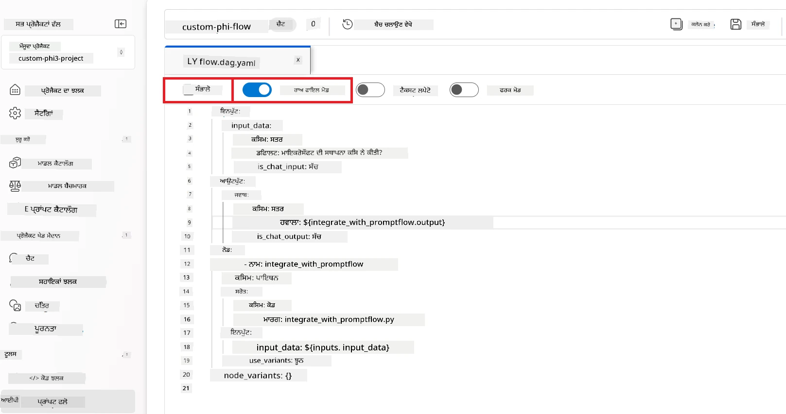

1. *integrate_with_promptflow.py* ਫਾਇਲ ਵਿੱਚ ਹੇਠਾਂ ਦਿੱਤਾ ਕੋਡ ਜੋੜੋ ਤਾਂ ਜੋ Prompt flow ਵਿੱਚ ਕਸਟਮ Phi-3 ਮਾਡਲ ਦੀ ਵਰਤੋਂ ਕੀਤੀ ਜਾ ਸਕੇ।

    ```python
    import logging
    import requests
    from promptflow import tool
    from promptflow.connections import CustomConnection

    # ਲੋਗਿੰਗ ਸੈਟਅਪ
    logging.basicConfig(
        format="%(asctime)s - %(levelname)s - %(name)s - %(message)s",
        datefmt="%Y-%m-%d %H:%M:%S",
        level=logging.DEBUG
    )
    logger = logging.getLogger(__name__)

    def query_phi3_model(input_data: str, connection: CustomConnection) -> str:
        """
        Send a request to the Phi-3 model endpoint with the given input data using Custom Connection.
        """

        # "connection" ਕਸਟਮ ਕਨੈਕਸ਼ਨ ਦਾ ਨਾਮ ਹੈ, "endpoint", "key" ਕਸਟਮ ਕਨੈਕਸ਼ਨ ਵਿਚ ਕੁੰਜੀਆਂ ਹਨ
        endpoint_url = connection.endpoint
        api_key = connection.key

        headers = {
            "Content-Type": "application/json",
            "Authorization": f"Bearer {api_key}"
        }
        data = {
            "input_data": {
                "input_string": [
                    {"role": "user", "content": input_data}
                ],
                "parameters": {
                    "temperature": 0.7,
                    "max_new_tokens": 128
                }
            }
        }
        try:
            response = requests.post(endpoint_url, json=data, headers=headers)
            response.raise_for_status()
            
            # ਪੂਰਾ JSON ਪ੍ਰਤੀਕਿਰਿਆ ਲੌਗ ਕਰੋ
            logger.debug(f"Full JSON response: {response.json()}")

            result = response.json()["output"]
            logger.info("Successfully received response from Azure ML Endpoint.")
            return result
        except requests.exceptions.RequestException as e:
            logger.error(f"Error querying Azure ML Endpoint: {e}")
            raise

    @tool
    def my_python_tool(input_data: str, connection: CustomConnection) -> str:
        """
        Tool function to process input data and query the Phi-3 model.
        """
        return query_phi3_model(input_data, connection)

    ```

    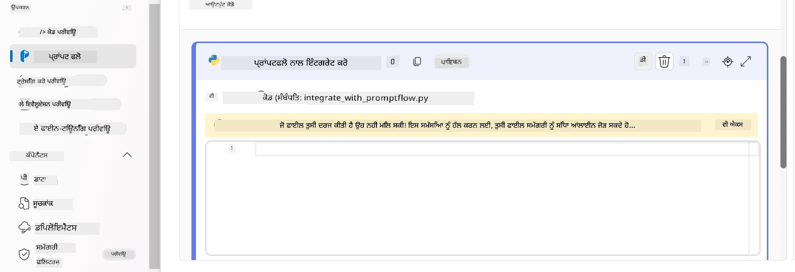

> [!NOTE]
> Azure AI Foundry ਵਿੱਚ Prompt flow ਵਰਤਣ ਬਾਰੇ ਹੋਰ ਵਿਸਥਾਰਿਤ ਜਾਣਕਾਰੀ ਲਈ, ਤੁਸੀਂ [Prompt flow in Azure AI Foundry](https://learn.microsoft.com/azure/ai-studio/how-to/prompt-flow) ਨੂੰ ਵੇਖ ਸਕਦੇ ਹੋ।

1. **Chat input**, **Chat output** ਚੁਣੋ ਤਾਂ ਜੋ ਆਪਣੇ ਮਾਡਲ ਨਾਲ ਚੈਟ ਆਗਿਆਕਾਰੀ ਬਣਾਈ ਜਾ ਸਕੇ।

    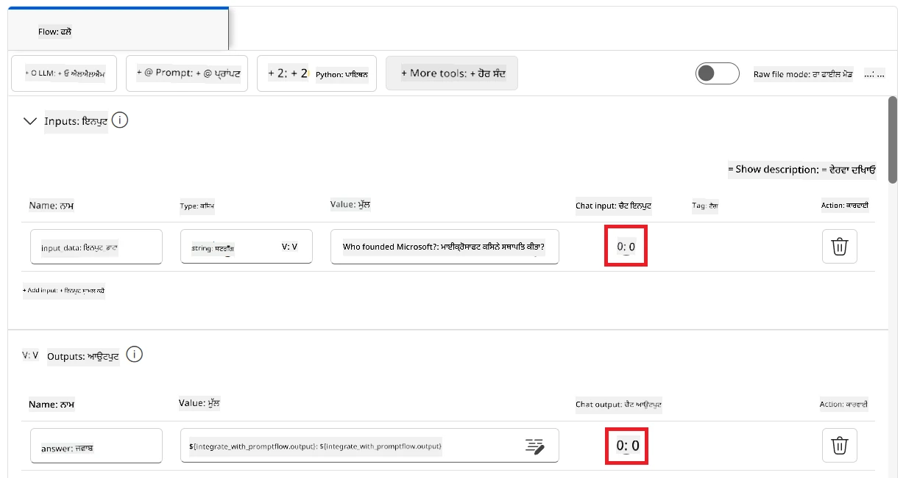

1. ਹੁਣ ਤੁਸੀਂ ਆਪਣੇ ਕਸਟਮ Phi-3 ਮਾਡਲ ਨਾਲ ਚੈਟ ਕਰਨ ਲਈ ਤਿਆਰ ਹੋ। ਅਗਲੇ ਅਭਿਆਸ ਵਿੱਚ, ਤੁਸੀਂ ਜਾਣੋਗੇ ਕਿ ਕਿਵੇਂ Prompt flow ਨੂੰ ਸ਼ੁਰੂ ਕਰਨਾ ਹੈ ਅਤੇ ਇਸ ਦੀ ਵਰਤੋਂ ਕਰਕੇ ਆਪਣੇ fine-tuned Phi-3 ਮਾਡਲ ਨਾਲ ਚੈਟ ਕਰਨਾ ਹੈ।

> [!NOTE]
>
> ਮੁੜ ਬਣਾਇਆ ਗਇਆ ਫਲੋ ਹੇਠ ਦਿੱਤੀ ਤਸਵੀਰ ਵਾਂਗ ਦਿਖਾਈ ਦੇਣਾ ਚਾਹੀਦਾ ਹੈ:
>
> 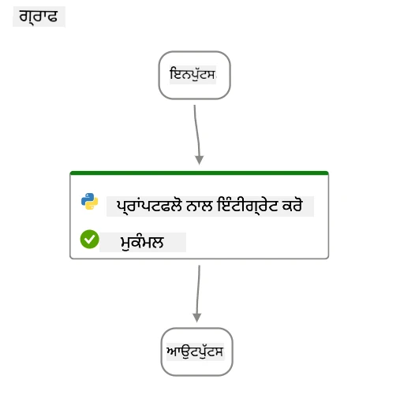
>

### ਆਪਣੇ ਕਸਟਮ Phi-3 ਮਾਡਲ ਨਾਲ ਚੈਟ ਕਰੋ

ਹੁਣ ਜਦੋਂ ਤੁਸੀਂ ਆਪਣੇ ਕਸਟਮ Phi-3 ਮਾਡਲ ਨੂੰ fine-tune ਕਰਕੇ Prompt flow ਨਾਲ ਜੋੜ ਲਿਆ ਹੈ, ਤੁਸੀਂ ਇਸ ਨਾਲ ਗੱਲਬਾਤ ਸ਼ੁਰੂ ਕਰਨ ਲਈ ਤਿਆਰ ਹੋ। ਇਹ ਅਭਿਆਸ ਤੁਹਾਨੂੰ ਦਿਸ਼ਾ-ਨਿਰਦੇਸ਼ ਦੇਵੇਗਾ ਕਿ ਕਿਵੇਂ Prompt flow ਦੀ ਸੈਟਿੰਗ ਕਰਨੀ ਹੈ ਅਤੇ ਕਿਵੇਂ ਆਪਣੇ ਮਾਡਲ ਨਾਲ ਗੱਲਬਾਤ ਸ਼ੁਰੂ ਕਰਨੀ ਹੈ। ਇਨ੍ਹਾਂ ਕਦਮਾਂ ਦੀ ਪਾਲਣਾ ਕਰਕੇ, ਤੁਸੀਂ ਆਪਣੇ fine-tuned Phi-3 ਮਾਡਲ ਦੇ ਸਾਰੇ ਕਾਮਕਾਜ ਅਤੇ ਗੱਲਬਾਤਾਂ ਦਾ ਪੂਰਾ ਲਾਭ ਉਠਾ ਸਕੋਗੇ।

- Prompt flow ਦੀ ਵਰਤੋਂ ਕਰਕੇ ਆਪਣੇ ਕਸਟਮ Phi-3 ਮਾਡਲ ਨਾਲ ਚੈਟ ਕਰੋ।

#### Prompt flow ਸ਼ੁਰੂ ਕਰੋ

1. Prompt flow ਸ਼ੁਰੂ ਕਰਨ ਲਈ **Start compute sessions** ਚੁਣੋ।

    

1. ਪੈਰਾਮੀਟਰ ਨਵੀਨਤਮ ਕਰਨ ਲਈ **Validate and parse input** ਚੁਣੋ।

    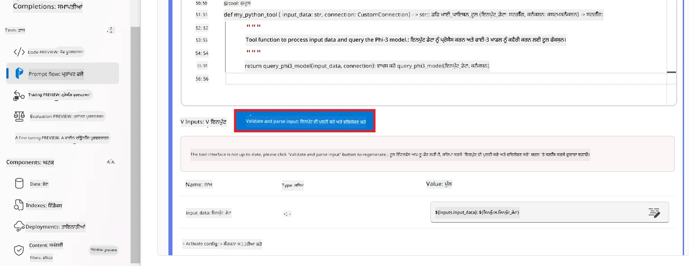

1. ਜਦੋਂ ਤਕ ਨਵਾਂ ਬਣਾਇਆ ਗਿਆ ਕਸਟਮ ਕਨੇਕਸ਼ਨ ਚੁਣੋ, ਉਦਾਹਰਨ ਵਜੋਂ, *connection*।

    

#### ਆਪਣੇ ਕਸਟਮ ਮਾਡਲ ਨਾਲ ਚੈਟ ਕਰੋ

1. **Chat** ਚੁਣੋ।

    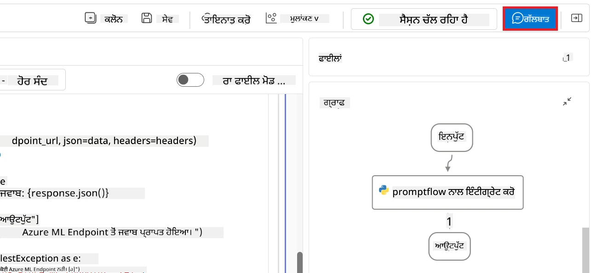

1. ਨਤੀਜਿਆਂ ਦੀ ਇੱਕ ਉਦਾਹਰਨ ਹੇਠਾਂ ਦਿੱਤੀ ਹੈ: ਹੁਣ ਤੁਸੀਂ ਆਪਣੇ ਕਸਟਮ Phi-3 ਮਾਡਲ ਨਾਲ ਗੱਲਬਾਤ ਕਰ ਸਕਦੇ ਹੋ। ਇਹ ਸੁਝਾਅ ਦਿੱਤਾ ਜਾਂਦਾ ਹੈ ਕਿ fine-tuning ਲਈ ਵਰਤੇ ਗਏ ਡੇਟਾ ਦੇ ਆਧਾਰ 'ਤੇ ਪ੍ਰਸ਼ਨ ਪੁੱਛੋ।

    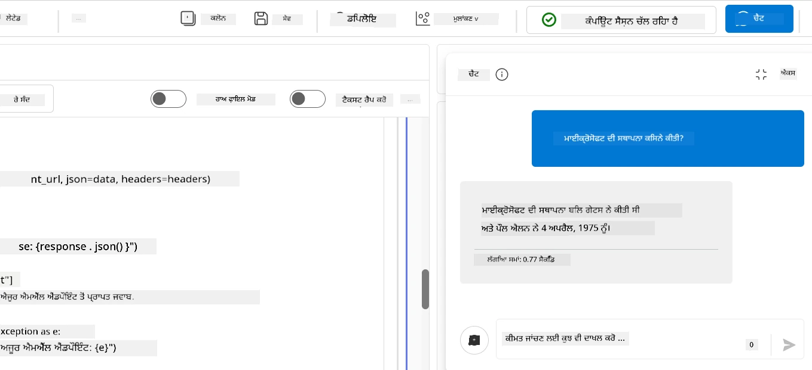

---

<!-- CO-OP TRANSLATOR DISCLAIMER START -->
**ਅਸਵੀਕਾਰਯੋਗੀ**:  
ਇਹ ਦਸਤਾਵੇਜ਼ ਏਆਈ ਅਨੁਵਾਦ ਸੇਵਾ [Co-op Translator](https://github.com/Azure/co-op-translator) ਦੀ ਵਰਤੋਂ ਕਰਕੇ ਅਨੁਵਾਦਿਤ ਕੀਤਾ ਗਿਆ ਹੈ। ਹਾਲਾਂਕਿ ਅਸੀਂ ਸਹੀਅਤਾ ਲਈ ਕੋਸ਼ਿਸ਼ ਕਰਦੇ ਹਾਂ, ਕਿਰਪਾ ਕਰਕੇ ਜਾਣੋ ਕਿ ਸਵੈਚਾਲਿਤ ਅਨੁਵਾਦਾਂ ਵਿੱਚ ਗਲਤੀਆਂ ਜਾਂ ਅਸਮਤੀ ਹੋ ਸਕਦੀ ਹੈ। ਮੂਲ ਦਸਤਾਵੇਜ਼ ਆਪਣੀ ਮੂਲ ਭਾਸ਼ਾ ਵਿੱਚ ਸਰਬੋਤਮ ਸ੍ਰੋਤ ਮੰਨੀ ਜਾਏ। ਮਹੱਤਵਪੂਰਨ ਜਾਣਕਾਰੀ ਲਈ ਪੇਸ਼ੇਵਰ ਮਨੁੱਖੀ ਅਨੁਵਾਦ ਦੀ ਸਿਫਾਰਿਸ਼ ਕੀਤੀ ਜਾਂਦੀ ਹੈ। ਅਸੀਂ ਇਸ ਅਨੁਵਾਦ ਦੀ ਵਰਤੋਂ ਤੋਂ ਉੱਪਜਣ ਵਾਲੀਆਂ ਕਿਸੇ ਵੀ ਗਲਤ ਫਹਿਮੀਆਂ ਜਾਂ ਗਲਤ ਅਰਥ ਲੱਗਣ ਲਈ ਜ਼ਿੰਮੇਵਾਰ ਨਹੀਂ ਹਾਂ।
<!-- CO-OP TRANSLATOR DISCLAIMER END -->