<!--
CO_OP_TRANSLATOR_METADATA:
{
  "original_hash": "ecbd9179a21edbaafaf114d47f09f3e3",
  "translation_date": "2025-05-09T17:59:22+00:00",
  "source_file": "md/02.Application/01.TextAndChat/Phi3/E2E_Phi-3-FineTuning_PromptFlow_Integration_AIFoundry.md",
  "language_code": "pa"
}
-->
# Fine-tune ਅਤੇ Azure AI Foundry ਵਿੱਚ Prompt flow ਨਾਲ custom Phi-3 ਮਾਡਲ ਇੰਟੀਗਰੇਟ ਕਰੋ

ਇਹ end-to-end (E2E) ਨਮੂਨਾ Microsoft Tech Community ਦੇ "[Fine-Tune and Integrate Custom Phi-3 Models with Prompt Flow in Azure AI Foundry](https://techcommunity.microsoft.com/t5/educator-developer-blog/fine-tune-and-integrate-custom-phi-3-models-with-prompt-flow-in/ba-p/4191726?WT.mc_id=aiml-137032-kinfeylo)" ਗਾਈਡ 'ਤੇ ਆਧਾਰਿਤ ਹੈ। ਇਹ fine-tuning, deployment, ਅਤੇ Azure AI Foundry ਵਿੱਚ Prompt flow ਨਾਲ custom Phi-3 ਮਾਡਲ ਇੰਟੀਗਰੇਟ ਕਰਨ ਦੇ ਪ੍ਰਕਿਰਿਆਵਾਂ ਨੂੰ ਪੇਸ਼ ਕਰਦਾ ਹੈ। E2E ਨਮੂਨੇ "[Fine-Tune and Integrate Custom Phi-3 Models with Prompt Flow](./E2E_Phi-3-FineTuning_PromptFlow_Integration.md)" ਤੋਂ ਵੱਖਰਾ, ਜਿਸ ਵਿੱਚ ਕੋਡ ਲੋਕਲ ਤੌਰ 'ਤੇ ਚਲਾਇਆ ਗਿਆ ਸੀ, ਇਹ ਟਿਊਟੋਰਿਯਲ ਮੁੱਖ ਤੌਰ 'ਤੇ Azure AI / ML Studio ਵਿੱਚ ਮਾਡਲ ਨੂੰ fine-tune ਅਤੇ ਇੰਟੀਗਰੇਟ ਕਰਨ 'ਤੇ ਧਿਆਨ ਕੇਂਦਰਿਤ ਕਰਦਾ ਹੈ।

## ਓਵਰਵਿਊ

ਇਸ E2E ਨਮੂਨੇ ਵਿੱਚ, ਤੁਸੀਂ ਸਿੱਖੋਗੇ ਕਿ ਕਿਵੇਂ Phi-3 ਮਾਡਲ ਨੂੰ fine-tune ਕਰਨਾ ਹੈ ਅਤੇ Azure AI Foundry ਵਿੱਚ Prompt flow ਨਾਲ ਇੰਟੀਗਰੇਟ ਕਰਨਾ ਹੈ। Azure AI / ML Studio ਦੀ ਵਰਤੋਂ ਕਰਕੇ, ਤੁਸੀਂ custom AI ਮਾਡਲਾਂ ਨੂੰ deploy ਅਤੇ ਵਰਤਣ ਲਈ ਇੱਕ workflow ਬਣਾਵੋਗੇ। ਇਹ E2E ਨਮੂਨਾ ਤਿੰਨ ਸਿਨਾਰਿਓ ਵਿੱਚ ਵੰਡਿਆ ਗਿਆ ਹੈ:

**ਸਿਨਾਰਿਓ 1: Azure resources ਸੈਟਅਪ ਕਰੋ ਅਤੇ fine-tuning ਲਈ ਤਿਆਰੀ ਕਰੋ**

**ਸਿਨਾਰਿਓ 2: Phi-3 ਮਾਡਲ ਨੂੰ fine-tune ਕਰੋ ਅਤੇ Azure Machine Learning Studio ਵਿੱਚ deploy ਕਰੋ**

**ਸਿਨਾਰਿਓ 3: Prompt flow ਨਾਲ ਇੰਟੀਗਰੇਟ ਕਰੋ ਅਤੇ Azure AI Foundry ਵਿੱਚ ਆਪਣੇ custom ਮਾਡਲ ਨਾਲ ਗੱਲਬਾਤ ਕਰੋ**

ਇਹ ਹੈ ਇਸ E2E ਨਮੂਨੇ ਦਾ ਓਵਰਵਿਊ।


### ਟੇਬਲ ਆਫ਼ ਕੰਟੈਂਟਸ

1. **[ਸਿਨਾਰਿਓ 1: Azure resources ਸੈਟਅਪ ਕਰੋ ਅਤੇ fine-tuning ਲਈ ਤਿਆਰੀ ਕਰੋ](../../../../../../md/02.Application/01.TextAndChat/Phi3)**
    - [Azure Machine Learning Workspace ਬਣਾਓ](../../../../../../md/02.Application/01.TextAndChat/Phi3)
    - [Azure Subscription ਵਿੱਚ GPU quotas ਦੀ ਬੇਨਤੀ ਕਰੋ](../../../../../../md/02.Application/01.TextAndChat/Phi3)
    - [ਰੋਲ ਅਸਾਈਨਮੈਂਟ ਸ਼ਾਮਲ ਕਰੋ](../../../../../../md/02.Application/01.TextAndChat/Phi3)
    - [ਪ੍ਰੋਜੈਕਟ ਸੈਟਅਪ ਕਰੋ](../../../../../../md/02.Application/01.TextAndChat/Phi3)
    - [fine-tuning ਲਈ ਡਾਟਾਸੈਟ ਤਿਆਰ ਕਰੋ](../../../../../../md/02.Application/01.TextAndChat/Phi3)

1. **[ਸਿਨਾਰਿਓ 2: Phi-3 ਮਾਡਲ ਨੂੰ fine-tune ਕਰੋ ਅਤੇ Azure Machine Learning Studio ਵਿੱਚ deploy ਕਰੋ](../../../../../../md/02.Application/01.TextAndChat/Phi3)**
    - [Phi-3 ਮਾਡਲ ਨੂੰ fine-tune ਕਰੋ](../../../../../../md/02.Application/01.TextAndChat/Phi3)
    - [fine-tuned Phi-3 ਮਾਡਲ ਨੂੰ deploy ਕਰੋ](../../../../../../md/02.Application/01.TextAndChat/Phi3)

1. **[ਸਿਨਾਰਿਓ 3: Prompt flow ਨਾਲ ਇੰਟੀਗਰੇਟ ਕਰੋ ਅਤੇ Azure AI Foundry ਵਿੱਚ ਆਪਣੇ custom ਮਾਡਲ ਨਾਲ ਗੱਲਬਾਤ ਕਰੋ](../../../../../../md/02.Application/01.TextAndChat/Phi3)**
    - [Prompt flow ਨਾਲ custom Phi-3 ਮਾਡਲ ਇੰਟੀਗਰੇਟ ਕਰੋ](../../../../../../md/02.Application/01.TextAndChat/Phi3)
    - [ਆਪਣੇ custom Phi-3 ਮਾਡਲ ਨਾਲ ਗੱਲਬਾਤ ਕਰੋ](../../../../../../md/02.Application/01.TextAndChat/Phi3)

## ਸਿਨਾਰਿਓ 1: Azure resources ਸੈਟਅਪ ਕਰੋ ਅਤੇ fine-tuning ਲਈ ਤਿਆਰੀ ਕਰੋ

### Azure Machine Learning Workspace ਬਣਾਓ

1. ਪੋਰਟਲ ਪੇਜ ਦੇ ਸਿਖਰਲੇ ਹਿੱਸੇ ਵਿੱਚ **search bar** ਵਿੱਚ *azure machine learning* ਲਿਖੋ ਅਤੇ ਜੋ ਵਿਕਲਪ ਆਉਂਦੇ ਹਨ, ਉਨ੍ਹਾਂ ਵਿੱਚੋਂ **Azure Machine Learning** ਚੁਣੋ।

    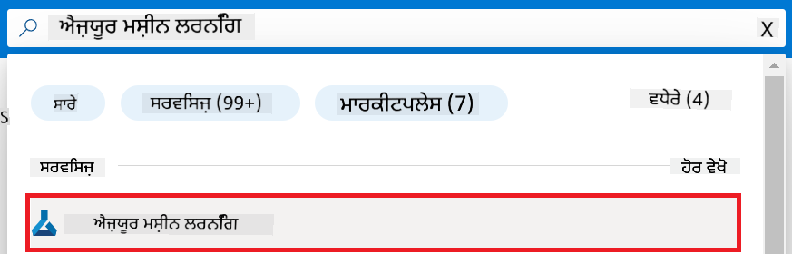

2. ਨੈਵੀਗੇਸ਼ਨ ਮੈਨੂ ਵਿੱਚੋਂ **+ Create** ਚੁਣੋ।

3. ਨੈਵੀਗੇਸ਼ਨ ਮੈਨੂ ਵਿੱਚੋਂ **New workspace** ਚੁਣੋ।

    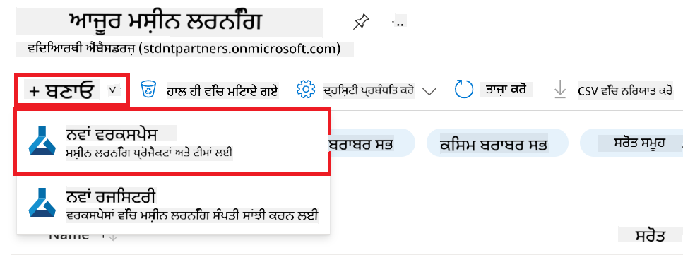

4. ਹੇਠਾਂ ਦਿੱਤੇ ਕੰਮ ਕਰੋ:

    - ਆਪਣੀ Azure **Subscription** ਚੁਣੋ।
    - ਵਰਤਣ ਲਈ **Resource group** ਚੁਣੋ (ਜੇ ਲੋੜ ਹੋਵੇ ਤਾਂ ਨਵਾਂ ਬਣਾਓ)।
    - **Workspace Name** ਦਰਜ ਕਰੋ। ਇਹ ਇੱਕ ਵਿਲੱਖਣ ਨਾਮ ਹੋਣਾ ਚਾਹੀਦਾ ਹੈ।
    - ਵਰਤਣ ਲਈ **Region** ਚੁਣੋ।
    - ਵਰਤਣ ਲਈ **Storage account** ਚੁਣੋ (ਜੇ ਲੋੜ ਹੋਵੇ ਤਾਂ ਨਵਾਂ ਬਣਾਓ)।
    - ਵਰਤਣ ਲਈ **Key vault** ਚੁਣੋ (ਜੇ ਲੋੜ ਹੋਵੇ ਤਾਂ ਨਵਾਂ ਬਣਾਓ)।
    - ਵਰਤਣ ਲਈ **Application insights** ਚੁਣੋ (ਜੇ ਲੋੜ ਹੋਵੇ ਤਾਂ ਨਵਾਂ ਬਣਾਓ)।
    - ਵਰਤਣ ਲਈ **Container registry** ਚੁਣੋ (ਜੇ ਲੋੜ ਹੋਵੇ ਤਾਂ ਨਵਾਂ ਬਣਾਓ)।

    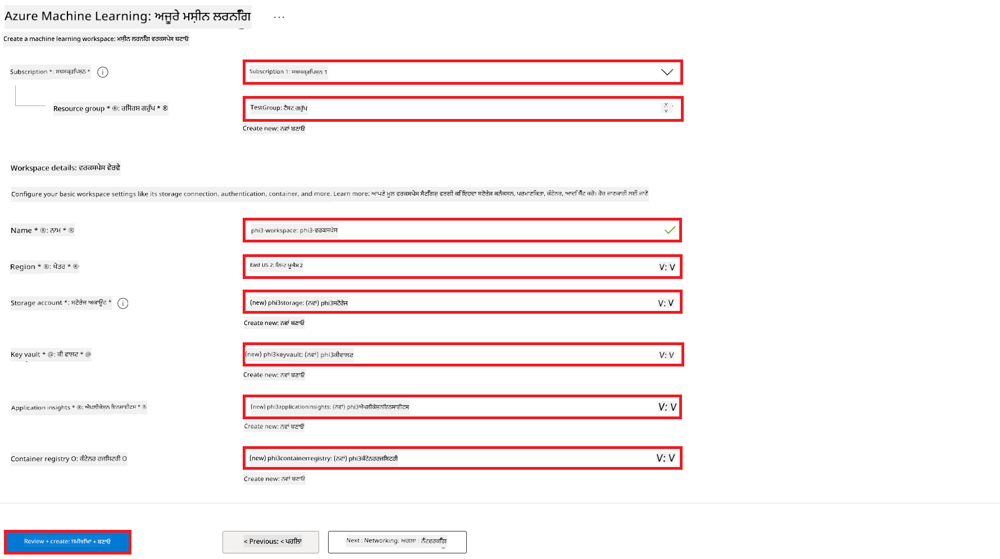

5. **Review + Create** ਚੁਣੋ।

6. **Create** ਚੁਣੋ।

### Azure Subscription ਵਿੱਚ GPU quotas ਦੀ ਬੇਨਤੀ ਕਰੋ

ਇਸ ਟਿਊਟੋਰਿਯਲ ਵਿੱਚ, ਤੁਸੀਂ GPUs ਦੀ ਵਰਤੋਂ ਕਰਕੇ Phi-3 ਮਾਡਲ ਨੂੰ fine-tune ਅਤੇ deploy ਕਰਨਾ ਸਿੱਖੋਗੇ। Fine-tuning ਲਈ, ਤੁਸੀਂ *Standard_NC24ads_A100_v4* GPU ਦੀ ਵਰਤੋਂ ਕਰੋਗੇ, ਜਿਸ ਲਈ quota ਦੀ ਬੇਨਤੀ ਜ਼ਰੂਰੀ ਹੈ। Deployment ਲਈ, ਤੁਸੀਂ *Standard_NC6s_v3* GPU ਦੀ ਵਰਤੋਂ ਕਰੋਗੇ, ਜਿਸ ਲਈ ਵੀ quota ਦੀ ਬੇਨਤੀ ਕਰਨੀ ਪਵੇਗੀ।

> [!NOTE]
>
> ਸਿਰਫ Pay-As-You-Go subscriptions (ਮਿਆਰੀ subscription ਕਿਸਮ) ਹੀ GPU allocation ਲਈ ਯੋਗ ਹਨ; benefit subscriptions ਇਸ ਵੇਲੇ ਸਮਰਥਿਤ ਨਹੀਂ ਹਨ।
>

1. [Azure ML Studio](https://ml.azure.com/home?wt.mc_id=studentamb_279723) ਤੇ ਜਾਓ।

1. *Standard NCADSA100v4 Family* quota ਦੀ ਬੇਨਤੀ ਕਰਨ ਲਈ ਹੇਠਾਂ ਦਿੱਤੇ ਕੰਮ ਕਰੋ:

    - ਖੱਬੇ ਪਾਸੇ ਵਾਲੇ ਟੈਬ ਵਿੱਚੋਂ **Quota** ਚੁਣੋ।
    - ਵਰਤਣ ਲਈ **Virtual machine family** ਚੁਣੋ। ਉਦਾਹਰਨ ਵਜੋਂ, **Standard NCADSA100v4 Family Cluster Dedicated vCPUs** ਚੁਣੋ, ਜਿਸ ਵਿੱਚ *Standard_NC24ads_A100_v4* GPU ਸ਼ਾਮਲ ਹੈ।
    - ਨੈਵੀਗੇਸ਼ਨ ਮੈਨੂ ਵਿੱਚੋਂ **Request quota** ਚੁਣੋ।

        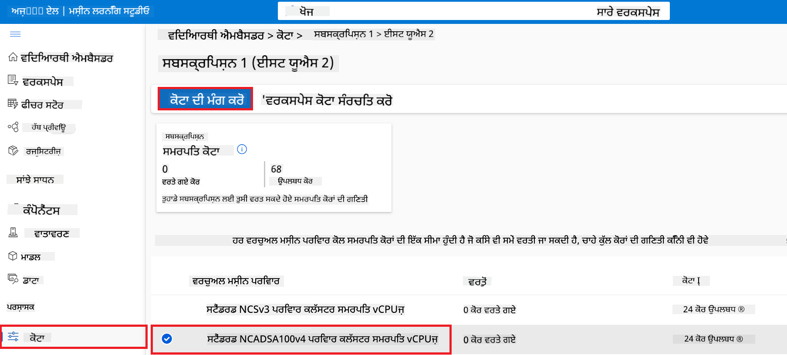

    - Request quota ਪੇਜ ਵਿੱਚ, ਵਰਤਣ ਲਈ **New cores limit** ਦਰਜ ਕਰੋ। ਉਦਾਹਰਨ ਵਜੋਂ, 24।
    - Request quota ਪੇਜ ਵਿੱਚ, GPU quota ਦੀ ਬੇਨਤੀ ਕਰਨ ਲਈ **Submit** ਚੁਣੋ।

1. *Standard NCSv3 Family* quota ਦੀ ਬੇਨਤੀ ਕਰਨ ਲਈ ਹੇਠਾਂ ਦਿੱਤੇ ਕੰਮ ਕਰੋ:

    - ਖੱਬੇ ਪਾਸੇ ਵਾਲੇ ਟੈਬ ਵਿੱਚੋਂ **Quota** ਚੁਣੋ।
    - ਵਰਤਣ ਲਈ **Virtual machine family** ਚੁਣੋ। ਉਦਾਹਰਨ ਵਜੋਂ, **Standard NCSv3 Family Cluster Dedicated vCPUs** ਚੁਣੋ, ਜਿਸ ਵਿੱਚ *Standard_NC6s_v3* GPU ਸ਼ਾਮਲ ਹੈ।
    - ਨੈਵੀਗੇਸ਼ਨ ਮੈਨੂ ਵਿੱਚੋਂ **Request quota** ਚੁਣੋ।
    - Request quota ਪੇਜ ਵਿੱਚ, ਵਰਤਣ ਲਈ **New cores limit** ਦਰਜ ਕਰੋ। ਉਦਾਹਰਨ ਵਜੋਂ, 24।
    - Request quota ਪੇਜ ਵਿੱਚ, GPU quota ਦੀ ਬੇਨਤੀ ਕਰਨ ਲਈ **Submit** ਚੁਣੋ।

### ਰੋਲ ਅਸਾਈਨਮੈਂਟ ਸ਼ਾਮਲ ਕਰੋ

ਆਪਣੇ ਮਾਡਲਾਂ ਨੂੰ fine-tune ਅਤੇ deploy ਕਰਨ ਲਈ, ਪਹਿਲਾਂ ਤੁਹਾਨੂੰ ਇੱਕ User Assigned Managed Identity (UAI) ਬਣਾਉਣੀ ਪਵੇਗੀ ਅਤੇ ਇਸਨੂੰ ਸਹੀ ਅਧਿਕਾਰ ਦੇਣੇ ਪਵੇਗੇ। ਇਹ UAI deployment ਦੌਰਾਨ authentication ਲਈ ਵਰਤੀ ਜਾਵੇਗੀ।

#### User Assigned Managed Identity (UAI) ਬਣਾਓ

1. ਪੋਰਟਲ ਪੇਜ ਦੇ ਸਿਖਰਲੇ ਹਿੱਸੇ ਵਿੱਚ **search bar** ਵਿੱਚ *managed identities* ਲਿਖੋ ਅਤੇ ਜੋ ਵਿਕਲਪ ਆਉਂਦੇ ਹਨ, ਉਨ੍ਹਾਂ ਵਿੱਚੋਂ **Managed Identities** ਚੁਣੋ।

    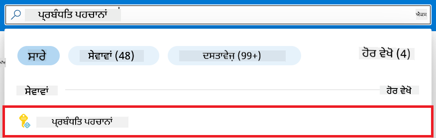

1. **+ Create** ਚੁਣੋ।

    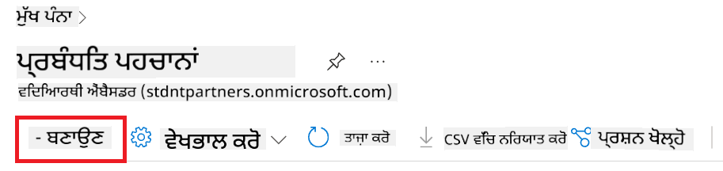

1. ਹੇਠਾਂ ਦਿੱਤੇ ਕੰਮ ਕਰੋ:

    - ਆਪਣੀ Azure **Subscription** ਚੁਣੋ।
    - ਵਰਤਣ ਲਈ **Resource group** ਚੁਣੋ (ਜੇ ਲੋੜ ਹੋਵੇ ਤਾਂ ਨਵਾਂ ਬਣਾਓ)।
    - ਵਰਤਣ ਲਈ **Region** ਚੁਣੋ।
    - **Name** ਦਰਜ ਕਰੋ। ਇਹ ਇੱਕ ਵਿਲੱਖਣ ਨਾਮ ਹੋਣਾ ਚਾਹੀਦਾ ਹੈ।

    

1. **Review + create** ਚੁਣੋ।

1. **+ Create** ਚੁਣੋ।

#### Managed Identity ਨੂੰ Contributor ਰੋਲ ਅਸਾਈਨਮੈਂਟ ਸ਼ਾਮਲ ਕਰੋ

1. ਉਸ Managed Identity resource ਤੇ ਜਾਓ ਜੋ ਤੁਸੀਂ ਬਣਾਈ ਸੀ।

1. ਖੱਬੇ ਪਾਸੇ ਵਾਲੇ ਟੈਬ ਵਿੱਚੋਂ **Azure role assignments** ਚੁਣੋ।

1. ਨੈਵੀਗੇਸ਼ਨ ਮੈਨੂ ਵਿੱਚੋਂ **+Add role assignment** ਚੁਣੋ।

1. Add role assignment ਪੇਜ ਵਿੱਚ, ਹੇਠਾਂ ਦਿੱਤੇ ਕੰਮ ਕਰੋ:
    - **Scope** ਨੂੰ **Resource group** 'ਤੇ ਸੈੱਟ ਕਰੋ।
    - ਆਪਣੀ Azure **Subscription** ਚੁਣੋ।
    - ਵਰਤਣ ਲਈ **Resource group** ਚੁਣੋ।
    - **Role** ਨੂੰ **Contributor** ਚੁਣੋ।

    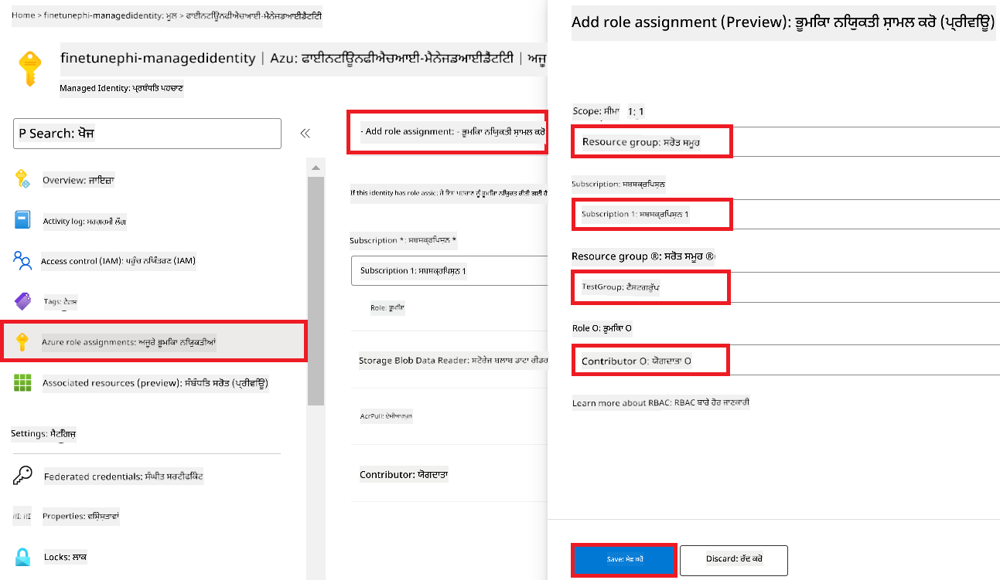

2. **Save** ਚੁਣੋ।

#### Managed Identity ਨੂੰ Storage Blob Data Reader ਰੋਲ ਅਸਾਈਨਮੈਂਟ ਸ਼ਾਮਲ ਕਰੋ

1. ਪੋਰਟਲ ਦੇ ਸਿਖਰਲੇ ਹਿੱਸੇ ਵਿੱਚ **search bar** ਵਿੱਚ *storage accounts* ਲਿਖੋ ਅਤੇ ਜੋ ਵਿਕਲਪ ਆਉਂਦੇ ਹਨ, ਉਨ੍ਹਾਂ ਵਿੱਚੋਂ **Storage accounts** ਚੁਣੋ।

    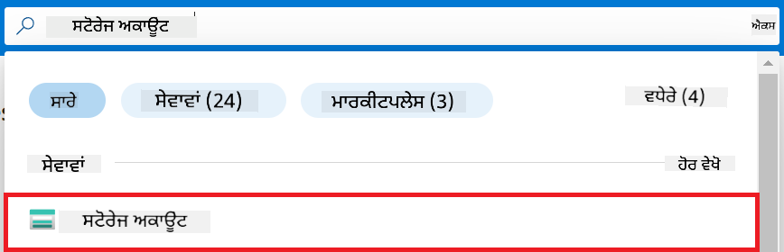

1. ਉਸ storage account ਨੂੰ ਚੁਣੋ ਜੋ ਤੁਸੀਂ Azure Machine Learning workspace ਨਾਲ ਜੋੜਿਆ ਸੀ। ਉਦਾਹਰਨ ਵਜੋਂ, *finetunephistorage*।

1. Add role assignment ਪੇਜ ਤੇ ਜਾਣ ਲਈ ਹੇਠਾਂ ਦਿੱਤੇ ਕੰਮ ਕਰੋ:

    - ਉਸ Azure Storage account ਤੇ ਜਾਓ ਜੋ ਤੁਸੀਂ ਬਣਾਇਆ ਸੀ।
    - ਖੱਬੇ ਪਾਸੇ ਵਾਲੇ ਟੈਬ ਵਿੱਚੋਂ **Access Control (IAM)** ਚੁਣੋ।
    - ਨੈਵੀਗੇਸ਼ਨ ਮੈਨੂ ਵਿੱਚੋਂ **+ Add** ਚੁਣੋ।
    - ਨੈਵੀਗੇਸ਼ਨ ਮੈਨੂ ਵਿੱਚੋਂ **Add role assignment** ਚੁਣੋ।

    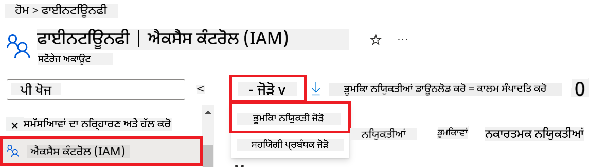

1. Add role assignment ਪੇਜ ਵਿੱਚ, ਹੇਠਾਂ ਦਿੱਤੇ ਕੰਮ ਕਰੋ:

    - Role ਪੇਜ ਵਿੱਚ, **search bar** ਵਿੱਚ *Storage Blob Data Reader* ਲਿਖੋ ਅਤੇ ਜੋ ਵਿਕਲਪ ਆਉਂਦੇ ਹਨ, ਉਨ੍ਹਾਂ ਵਿੱਚੋਂ **Storage Blob Data Reader** ਚੁਣੋ।
    - Role ਪੇਜ ਵਿੱਚ, **Next** ਚੁਣੋ।
    - Members ਪੇਜ ਵਿੱਚ, **Assign access to** ਵਿੱਚੋਂ **Managed identity** ਚੁਣੋ।
    - Members ਪੇਜ ਵਿੱਚ, **+ Select members** ਚੁਣੋ।
    - Select managed identities ਪੇਜ ਵਿੱਚ, ਆਪਣੀ Azure **Subscription** ਚੁਣੋ।
    - Select managed identities ਪੇਜ ਵਿੱਚ, **Managed identity** ਨੂੰ **Manage Identity** ਚੁਣੋ।
    - Select managed identities ਪੇਜ ਵਿੱਚ, ਉਹ Manage Identity ਚੁਣੋ ਜੋ ਤੁਸੀਂ ਬਣਾਈ ਸੀ। ਉਦਾਹਰਨ ਵਜੋਂ, *finetunephi-managedidentity*।
    - Select managed identities ਪੇਜ ਵਿੱਚ, **Select** ਚੁਣੋ।

    

1. **Review + assign** ਚੁਣੋ।

#### Managed Identity ਨੂੰ AcrPull ਰੋਲ ਅਸਾਈਨਮੈਂਟ ਸ਼ਾਮਲ ਕਰੋ

1. ਪੋਰਟਲ ਦੇ ਸਿਖਰਲੇ ਹਿੱਸੇ ਵਿੱਚ **search bar** ਵਿੱਚ *container registries* ਲਿਖੋ ਅਤੇ ਜੋ ਵਿਕਲਪ ਆਉਂਦੇ ਹਨ, ਉਨ੍ਹਾਂ ਵਿੱਚੋਂ **Container registries** ਚੁਣੋ।

    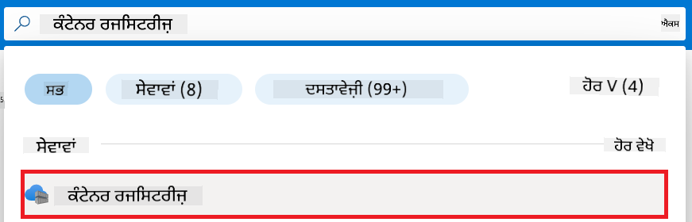

1. ਉਸ container registry ਨੂੰ ਚੁਣੋ ਜੋ Azure Machine Learning workspace ਨਾਲ ਜੋੜਿਆ ਹੈ। ਉਦਾਹਰਨ ਵਜੋਂ, *finetunephicontainerregistry*

1. Add role assignment ਪੇਜ ਤੇ ਜਾਣ ਲਈ ਹੇਠਾਂ ਦਿੱਤੇ ਕੰਮ ਕਰੋ:

    - ਖੱਬੇ ਪਾਸੇ ਵਾਲੇ ਟੈਬ ਵਿੱਚੋਂ **Access Control (IAM)** ਚੁਣੋ।
    - ਨੈਵੀਗੇਸ਼ਨ ਮੈਨੂ ਵਿੱਚੋਂ **+ Add** ਚੁਣੋ।
    - ਨੈਵੀਗੇਸ਼ਨ ਮੈਨੂ ਵਿੱਚੋਂ **Add role assignment** ਚੁਣੋ।

1. Add role assignment ਪੇਜ ਵਿੱਚ, ਹੇਠਾਂ ਦਿੱਤੇ ਕੰਮ ਕਰੋ:

    - Role ਪੇਜ ਵਿੱਚ, **search bar** ਵਿੱਚ *AcrPull* ਲਿਖੋ ਅਤੇ ਜੋ ਵਿਕਲਪ ਆਉਂਦੇ ਹਨ, ਉਨ੍ਹਾਂ ਵਿੱਚੋਂ **AcrPull** ਚੁਣੋ।
    - Role ਪੇਜ ਵਿੱਚ, **Next** ਚੁਣੋ।
    - Members ਪੇਜ ਵਿੱਚ, **Assign access to** ਵਿੱਚੋਂ **Managed identity** ਚੁਣੋ।
    - Members ਪੇਜ ਵਿੱਚ, **+ Select members** ਚੁਣੋ।
    - Select managed identities ਪੇਜ ਵਿੱਚ, ਆਪਣੀ Azure **Subscription** ਚੁਣੋ।
    - Select managed identities ਪੇਜ ਵਿੱਚ, **Managed identity** ਨੂੰ **Manage Identity** ਚੁਣੋ।
    - Select managed identities ਪੇਜ ਵਿੱਚ, ਉਹ Manage Identity ਚੁਣੋ ਜੋ ਤੁਸੀਂ ਬਣਾਈ ਸੀ। ਉਦਾਹਰਨ ਵਜੋਂ, *finetunephi-managedidentity*।
    - Select managed identities ਪੇਜ ਵਿੱਚ, **Select** ਚੁਣੋ।
    - **Review + assign** ਚੁਣੋ।

### ਪ੍ਰੋਜੈਕਟ ਸੈਟਅਪ ਕਰੋ

fine-tuning ਲਈ ਲੋੜੀਂਦੇ datasets ਡਾਊਨਲੋਡ ਕਰਨ ਲਈ, ਤੁਸੀਂ ਇੱਕ ਲੋਕਲ ਮਾਹੌਲ ਸੈਟਅਪ ਕਰੋਗੇ।

ਇਸ ਅਭਿਆਸ ਵਿੱਚ, ਤੁਸੀਂ:

- ਕੰਮ ਕਰਨ ਲਈ ਇੱਕ ਫੋਲਡਰ ਬਣਾਓਗੇ।
- ਇੱਕ virtual environment ਬਣਾਵੋਗੇ।
- ਜ਼ਰੂਰੀ packages ਇੰਸਟਾਲ ਕਰੋਗੇ।
- ਡਾਟਾਸੈਟ ਡਾਊਨਲੋਡ ਕਰਨ ਲਈ *download_dataset.py* ਫਾਈਲ ਬਣਾਵੋਗੇ।

#### ਕੰਮ ਕਰਨ ਲਈ ਫੋਲਡਰ ਬਣਾਓ

1. ਟਰਮੀਨਲ ਖੋਲ੍ਹੋ ਅਤੇ ਨਿਮਨਲਿਖਤ ਕਮਾਂਡ ਲਿਖੋ ਤਾਂ ਜੋ ਡਿਫਾਲਟ ਪਾਥ ਵਿੱਚ *finetune-phi* ਨਾਮ ਦਾ ਫੋਲਡਰ ਬਣ ਜਾਵੇ।

    ```console
    mkdir finetune-phi
    ```

2. ਟਰਮੀਨਲ ਵਿੱਚ ਨਿਮਨਲਿਖਤ ਕਮਾਂਡ ਲਿਖੋ ਤਾਂ ਜੋ ਤੁਸੀਂ ਬਣਾਏ *finetune-phi* ਫੋਲਡਰ ਵਿੱਚ ਜਾ ਸਕੋ।

    ```console
    cd finetune-phi
    ```

#### virtual environment ਬਣਾਓ

1. ਟਰਮੀਨਲ ਵਿੱਚ ਨਿਮਨਲਿਖਤ ਕਮਾਂਡ ਲਿਖੋ ਤਾਂ ਜੋ *.venv* ਨਾਮ ਦਾ virtual environment ਬਣ ਜਾਵੇ।

    ```console
    python -m venv .venv
    ```

2. ਟਰਮੀਨਲ ਵਿੱਚ ਨਿਮਨਲਿਖਤ ਕਮਾਂਡ ਲਿਖੋ ਤਾਂ ਜੋ virtual environment ਐਕਟੀਵੇਟ ਹੋ ਜਾਵੇ।

    ```console
    .venv\Scripts\activate.bat
    ```


1. [Azure ML Studio](https://ml.azure.com/home?wt.mc_id=studentamb_279723) ‘ਤੇ ਜਾਓ।

1. ਖੱਬੇ ਪਾਸੇ ਟੈਬ ਵਿੱਚੋਂ **Compute** ਚੁਣੋ।

1. ਨੈਵੀਗੇਸ਼ਨ ਮੀਨੂ ਵਿੱਚੋਂ **Compute clusters** ਚੁਣੋ।

1. **+ New** ਚੁਣੋ।

    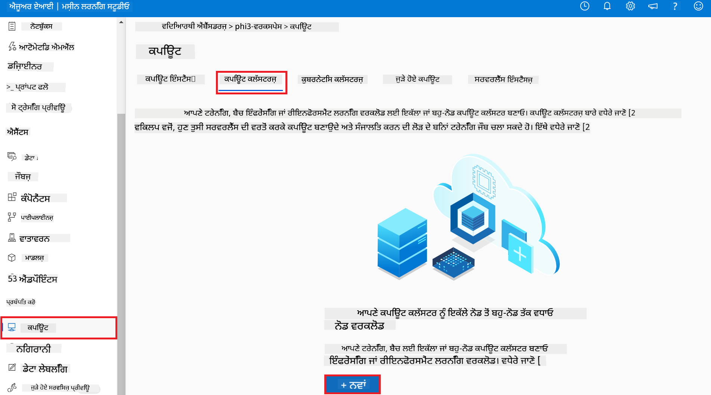

1. ਹੇਠ ਲਿਖੀਆਂ ਕਿਰਿਆਵਾਂ ਕਰੋ:

    - ਆਪਣੀ ਪਸੰਦ ਦੀ **Region** ਚੁਣੋ।
    - **Virtual machine tier** ਨੂੰ **Dedicated** ਚੁਣੋ।
    - **Virtual machine type** ਨੂੰ **GPU** ਚੁਣੋ।
    - **Virtual machine size** ਫਿਲਟਰ ਨੂੰ **Select from all options** ਤੇ ਸੈੱਟ ਕਰੋ।
    - **Virtual machine size** ਨੂੰ **Standard_NC24ads_A100_v4** ਚੁਣੋ।

    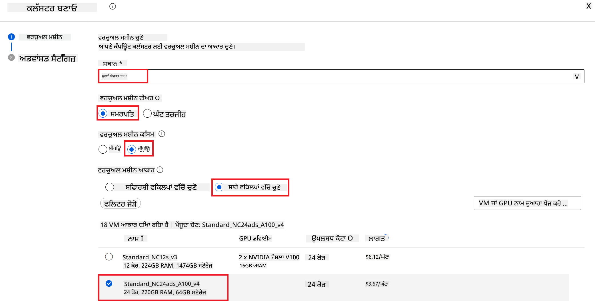

1. **Next** ਚੁਣੋ।

1. ਹੇਠ ਲਿਖੀਆਂ ਕਿਰਿਆਵਾਂ ਕਰੋ:

    - **Compute name** ਦਾਖਲ ਕਰੋ। ਇਹ ਇੱਕ ਵਿਲੱਖਣ ਮੁੱਲ ਹੋਣਾ ਚਾਹੀਦਾ ਹੈ।
    - **Minimum number of nodes** ਨੂੰ **0** ਸੈੱਟ ਕਰੋ।
    - **Maximum number of nodes** ਨੂੰ **1** ਸੈੱਟ ਕਰੋ।
    - **Idle seconds before scale down** ਨੂੰ **120** ਸੈੱਟ ਕਰੋ।

    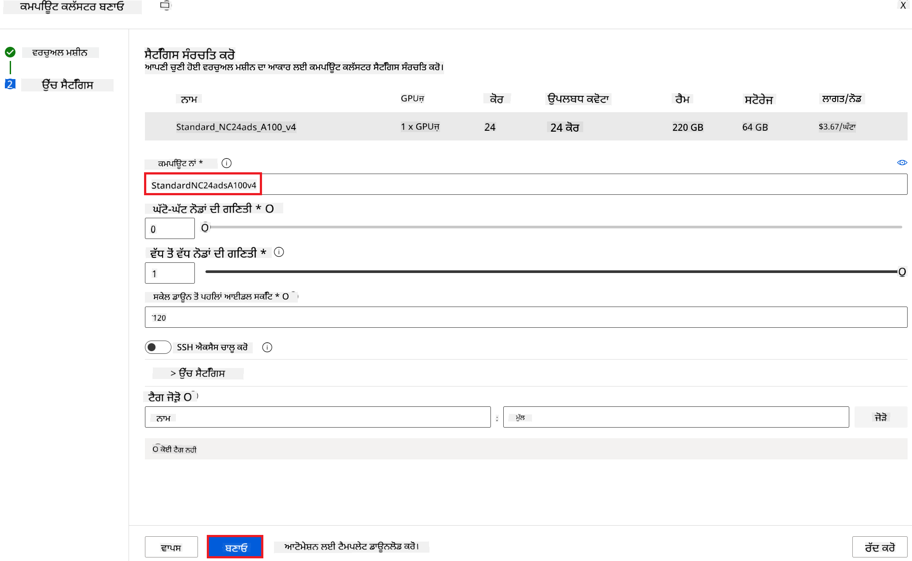

1. **Create** ਚੁਣੋ।

#### Phi-3 ਮਾਡਲ ਨੂੰ ਫਾਈਨ-ਟਿਊਨ ਕਰੋ

1. [Azure ML Studio](https://ml.azure.com/home?wt.mc_id=studentamb_279723) ‘ਤੇ ਜਾਓ।

1. ਉਸ Azure Machine Learning ਵਰਕਸਪੇਸ ਨੂੰ ਚੁਣੋ ਜੋ ਤੁਸੀਂ ਬਣਾਇਆ ਸੀ।

    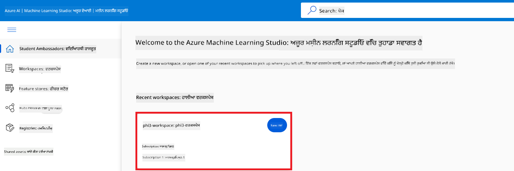

1. ਹੇਠ ਲਿਖੀਆਂ ਕਿਰਿਆਵਾਂ ਕਰੋ:

    - ਖੱਬੇ ਪਾਸੇ ਟੈਬ ਵਿੱਚੋਂ **Model catalog** ਚੁਣੋ।
    - **search bar** ਵਿੱਚ *phi-3-mini-4k* ਟਾਈਪ ਕਰੋ ਅਤੇ ਜੋ ਵਿਕਲਪ ਆਉਂਦੇ ਹਨ ਉਨ੍ਹਾਂ ਵਿੱਚੋਂ **Phi-3-mini-4k-instruct** ਚੁਣੋ।

    

1. ਨੈਵੀਗੇਸ਼ਨ ਮੀਨੂ ਵਿੱਚੋਂ **Fine-tune** ਚੁਣੋ।

    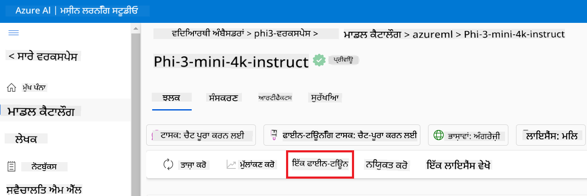

1. ਹੇਠ ਲਿਖੀਆਂ ਕਿਰਿਆਵਾਂ ਕਰੋ:

    - **Select task type** ਨੂੰ **Chat completion** ਚੁਣੋ।
    - **+ Select data** ‘ਤੇ ਕਲਿੱਕ ਕਰਕੇ **Training data** ਅਪਲੋਡ ਕਰੋ।
    - Validation data ਅਪਲੋਡ ਕਿਸਮ ਨੂੰ **Provide different validation data** ਤੇ ਸੈੱਟ ਕਰੋ।
    - **+ Select data** ‘ਤੇ ਕਲਿੱਕ ਕਰਕੇ **Validation data** ਅਪਲੋਡ ਕਰੋ।

    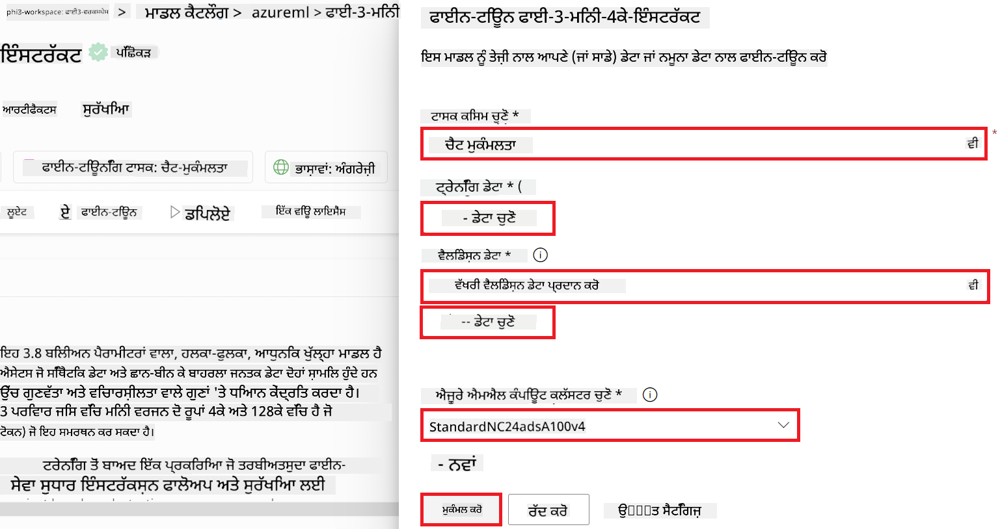

    > [!TIP]
    >
    > ਤੁਸੀਂ **Advanced settings** ਚੁਣ ਕੇ ਆਪਣੇ ਮਤਾਬਕ fine-tuning ਪ੍ਰਕਿਰਿਆ ਨੂੰ optimize ਕਰਨ ਲਈ ਜਿਵੇਂ ਕਿ **learning_rate** ਅਤੇ **lr_scheduler_type** ਵਰਗੀਆਂ ਸੈਟਿੰਗਾਂ ਨੂੰ ਕਸਟਮਾਈਜ਼ ਕਰ ਸਕਦੇ ਹੋ।

1. **Finish** ਚੁਣੋ।

1. ਇਸ ਅਭਿਆਸ ਵਿੱਚ, ਤੁਸੀਂ Azure Machine Learning ਦੀ ਵਰਤੋਂ ਕਰਕੇ ਸਫਲਤਾਪੂਰਵਕ Phi-3 ਮਾਡਲ ਨੂੰ ਫਾਈਨ-ਟਿਊਨ ਕੀਤਾ। ਧਿਆਨ ਰੱਖੋ ਕਿ ਫਾਈਨ-ਟਿਊਨਿੰਗ ਵਿੱਚ ਕਾਫੀ ਸਮਾਂ ਲੱਗ ਸਕਦਾ ਹੈ। ਫਾਈਨ-ਟਿਊਨਿੰਗ ਜੌਬ ਚਲਾਉਣ ਤੋਂ ਬਾਅਦ, ਇਸ ਦੇ ਮੁਕੰਮਲ ਹੋਣ ਦੀ ਉਡੀਕ ਕਰੋ। ਤੁਸੀਂ Azure Machine Learning ਵਰਕਸਪੇਸ ਦੇ ਖੱਬੇ ਪਾਸੇ ਟੈਬ ਵਿੱਚੋਂ Jobs ਟੈਬ ‘ਚ ਜੌਬ ਦੀ ਸਥਿਤੀ ਦੀ ਨਿਗਰਾਨੀ ਕਰ ਸਕਦੇ ਹੋ। ਅਗਲੇ ਹਿੱਸੇ ਵਿੱਚ, ਤੁਸੀਂ ਫਾਈਨ-ਟਿਊਨ ਕੀਤਾ ਮਾਡਲ ਡਿਪਲੌਇ ਕਰਕੇ ਇਸਨੂੰ Prompt flow ਨਾਲ ਜੋੜੋਗੇ।

    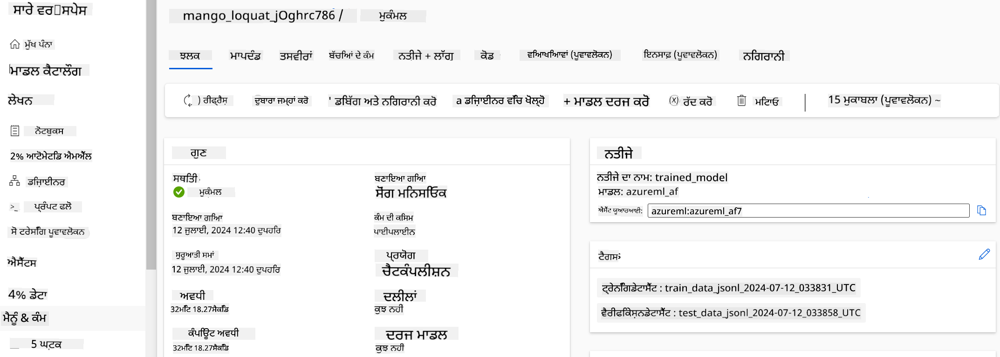

### ਫਾਈਨ-ਟਿਊਨ ਕੀਤਾ Phi-3 ਮਾਡਲ ਡਿਪਲੌਇ ਕਰੋ

ਫਾਈਨ-ਟਿਊਨ ਕੀਤਾ Phi-3 ਮਾਡਲ Prompt flow ਨਾਲ ਜੋੜਨ ਲਈ, ਤੁਹਾਨੂੰ ਮਾਡਲ ਨੂੰ ਡਿਪਲੌਇ ਕਰਨਾ ਪਵੇਗਾ ਤਾਂ ਜੋ ਇਹ ਰੀਅਲ-ਟਾਈਮ ਇਨਫਰੈਂਸ ਲਈ ਉਪਲਬਧ ਹੋ ਜਾਵੇ। ਇਸ ਪ੍ਰਕਿਰਿਆ ਵਿੱਚ ਮਾਡਲ ਨੂੰ ਰਜਿਸਟਰ ਕਰਨਾ, ਇੱਕ ਆਨਲਾਈਨ ਐਂਡਪੌਇੰਟ ਬਣਾਉਣਾ ਅਤੇ ਮਾਡਲ ਨੂੰ ਡਿਪਲੌਇ ਕਰਨਾ ਸ਼ਾਮਲ ਹੈ।

ਇਸ ਅਭਿਆਸ ਵਿੱਚ, ਤੁਸੀਂ:

- Azure Machine Learning ਵਰਕਸਪੇਸ ਵਿੱਚ ਫਾਈਨ-ਟਿਊਨ ਕੀਤਾ ਮਾਡਲ ਰਜਿਸਟਰ ਕਰੋਗੇ।
- ਇੱਕ ਆਨਲਾਈਨ ਐਂਡਪੌਇੰਟ ਬਣਾਉਗੇ।
- ਰਜਿਸਟਰ ਕੀਤਾ ਫਾਈਨ-ਟਿਊਨ ਕੀਤਾ Phi-3 ਮਾਡਲ ਡਿਪਲੌਇ ਕਰੋਗੇ।

#### ਫਾਈਨ-ਟਿਊਨ ਕੀਤਾ ਮਾਡਲ ਰਜਿਸਟਰ ਕਰੋ

1. [Azure ML Studio](https://ml.azure.com/home?wt.mc_id=studentamb_279723) ‘ਤੇ ਜਾਓ।

1. ਉਸ Azure Machine Learning ਵਰਕਸਪੇਸ ਨੂੰ ਚੁਣੋ ਜੋ ਤੁਸੀਂ ਬਣਾਇਆ ਸੀ।

    

1. ਖੱਬੇ ਪਾਸੇ ਟੈਬ ਵਿੱਚੋਂ **Models** ਚੁਣੋ।

1. **+ Register** ਚੁਣੋ।

1. **From a job output** ਚੁਣੋ।

    

1. ਉਸ ਜੌਬ ਨੂੰ ਚੁਣੋ ਜੋ ਤੁਸੀਂ ਬਣਾਇਆ ਸੀ।

    

1. **Next** ਚੁਣੋ।

1. **Model type** ਨੂੰ **MLflow** ਚੁਣੋ।

1. ਯਕੀਨੀ ਬਣਾਓ ਕਿ **Job output** ਚੁਣਿਆ ਹੋਇਆ ਹੈ; ਇਹ ਆਟੋਮੈਟਿਕ ਹੋਣਾ ਚਾਹੀਦਾ ਹੈ।

    

2. **Next** ਚੁਣੋ।

3. **Register** ਚੁਣੋ।

    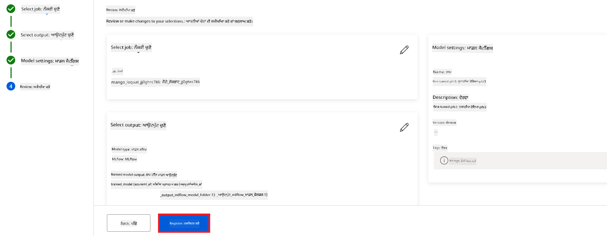

4. ਤੁਸੀਂ ਖੱਬੇ ਪਾਸੇ ਟੈਬ ਵਿੱਚੋਂ **Models** ਮੀਨੂ ‘ਚ ਜਾ ਕੇ ਆਪਣੇ ਰਜਿਸਟਰਡ ਮਾਡਲ ਨੂੰ ਵੇਖ ਸਕਦੇ ਹੋ।

    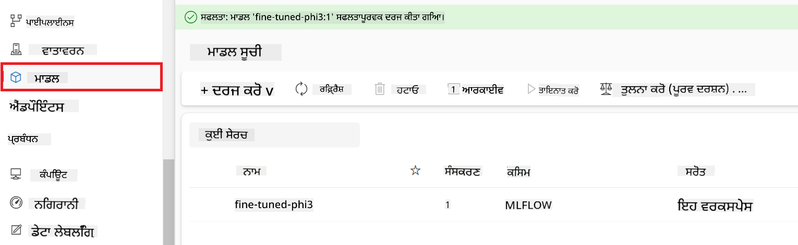

#### ਫਾਈਨ-ਟਿਊਨ ਕੀਤਾ ਮਾਡਲ ਡਿਪਲੌਇ ਕਰੋ

1. ਉਸ Azure Machine Learning ਵਰਕਸਪੇਸ ‘ਚ ਜਾਓ ਜੋ ਤੁਸੀਂ ਬਣਾਇਆ ਸੀ।

1. ਖੱਬੇ ਪਾਸੇ ਟੈਬ ਵਿੱਚੋਂ **Endpoints** ਚੁਣੋ।

1. ਨੈਵੀਗੇਸ਼ਨ ਮੀਨੂ ਵਿੱਚੋਂ **Real-time endpoints** ਚੁਣੋ।

    

1. **Create** ਚੁਣੋ।

1. ਆਪਣਾ ਰਜਿਸਟਰਡ ਮਾਡਲ ਚੁਣੋ ਜੋ ਤੁਸੀਂ ਬਣਾਇਆ ਸੀ।

    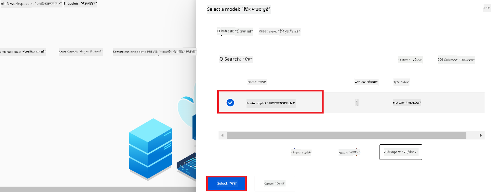

1. **Select** ਚੁਣੋ।

1. ਹੇਠ ਲਿਖੀਆਂ ਕਿਰਿਆਵਾਂ ਕਰੋ:

    - **Virtual machine** ਨੂੰ *Standard_NC6s_v3* ਚੁਣੋ।
    - ਤੁਸੀਂ ਵਰਤਣਾ ਚਾਹੁੰਦੇ ਹੋਏ **Instance count** ਚੁਣੋ। ਉਦਾਹਰਨ ਵਜੋਂ, *1*।
    - **Endpoint** ਨੂੰ **New** ਸੈੱਟ ਕਰੋ ਤਾਂ ਜੋ ਨਵਾਂ ਐਂਡਪੌਇੰਟ ਬਣਾਇਆ ਜਾ ਸਕੇ।
    - **Endpoint name** ਦਾਖਲ ਕਰੋ। ਇਹ ਇੱਕ ਵਿਲੱਖਣ ਮੁੱਲ ਹੋਣਾ ਚਾਹੀਦਾ ਹੈ।
    - **Deployment name** ਦਾਖਲ ਕਰੋ। ਇਹ ਵੀ ਵਿਲੱਖਣ ਹੋਣਾ ਚਾਹੀਦਾ ਹੈ।

    

1. **Deploy** ਚੁਣੋ।

> [!WARNING]
> ਆਪਣੇ ਖਾਤੇ 'ਤੇ ਵਾਧੂ ਖਰਚੇ ਤੋਂ ਬਚਣ ਲਈ, Azure Machine Learning ਵਰਕਸਪੇਸ ਵਿੱਚ ਬਣਾਇਆ ਗਿਆ ਐਂਡਪੌਇੰਟ ਜਰੂਰ ਮਿਟਾਓ।
>

#### Azure Machine Learning ਵਰਕਸਪੇਸ ਵਿੱਚ ਡਿਪਲੌਇਮੈਂਟ ਸਥਿਤੀ ਚੈੱਕ ਕਰੋ

1. ਉਸ Azure Machine Learning ਵਰਕਸਪੇਸ ਵਿੱਚ ਜਾਓ ਜੋ ਤੁਸੀਂ ਬਣਾਇਆ ਸੀ।

1. ਖੱਬੇ ਪਾਸੇ ਟੈਬ ਵਿੱਚੋਂ **Endpoints** ਚੁਣੋ।

1. ਉਸ ਐਂਡਪੌਇੰਟ ਨੂੰ ਚੁਣੋ ਜੋ ਤੁਸੀਂ ਬਣਾਇਆ ਸੀ।

    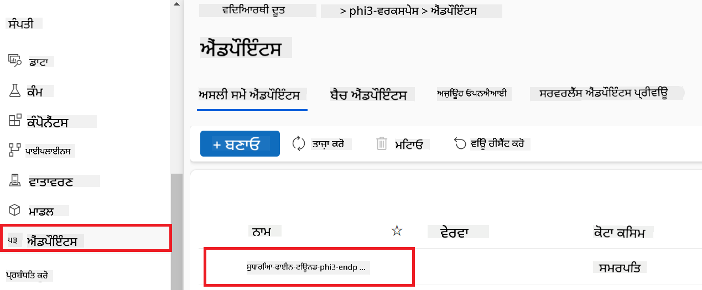

1. ਇਸ ਪੇਜ ‘ਤੇ, ਤੁਸੀਂ ਡਿਪਲੌਇਮੈਂਟ ਪ੍ਰਕਿਰਿਆ ਦੌਰਾਨ ਐਂਡਪੌਇੰਟਸ ਦਾ ਪ੍ਰਬੰਧਨ ਕਰ ਸਕਦੇ ਹੋ।

> [!NOTE]
> ਜਦੋਂ ਡਿਪਲੌਇਮੈਂਟ ਮੁਕੰਮਲ ਹੋ ਜਾਵੇ, ਯਕੀਨੀ ਬਣਾਓ ਕਿ **Live traffic** ਨੂੰ **100%** ਤੇ ਸੈੱਟ ਕੀਤਾ ਗਿਆ ਹੈ। ਜੇ ਨਹੀਂ, ਤਾਂ **Update traffic** ਚੁਣ ਕੇ ਟ੍ਰੈਫਿਕ ਸੈਟਿੰਗਜ਼ ਨੂੰ ਬਦਲੋ। ਧਿਆਨ ਰੱਖੋ ਕਿ ਜੇ ਟ੍ਰੈਫਿਕ 0% ਤੇ ਹੈ ਤਾਂ ਤੁਸੀਂ ਮਾਡਲ ਦੀ ਟੈਸਟਿੰਗ ਨਹੀਂ ਕਰ ਸਕਦੇ।
>
> 
>

## ਸਿਨਾਰਿਓ 3: Prompt flow ਨਾਲ ਇੰਟੀਗ੍ਰੇਟ ਕਰੋ ਅਤੇ ਆਪਣੇ ਕਸਟਮ ਮਾਡਲ ਨਾਲ Azure AI Foundry ਵਿੱਚ ਗੱਲਬਾਤ ਕਰੋ

### ਕਸਟਮ Phi-3 ਮਾਡਲ ਨੂੰ Prompt flow ਨਾਲ ਜੋੜੋ

ਆਪਣਾ ਫਾਈਨ-ਟਿਊਨ ਕੀਤਾ ਮਾਡਲ ਸਫਲਤਾਪੂਰਵਕ ਡਿਪਲੌਇ ਕਰਨ ਤੋਂ ਬਾਅਦ, ਹੁਣ ਤੁਸੀਂ ਇਸਨੂੰ Prompt Flow ਨਾਲ ਜੋੜ ਕੇ ਆਪਣੇ ਮਾਡਲ ਨੂੰ ਰੀਅਲ-ਟਾਈਮ ਐਪਲੀਕੇਸ਼ਨਾਂ ਵਿੱਚ ਵਰਤ ਸਕਦੇ ਹੋ, ਜਿਸ ਨਾਲ ਤੁਸੀਂ ਕਈ ਇੰਟਰਐਕਟਿਵ ਟਾਸਕ ਕਰ ਸਕਦੇ ਹੋ।

ਇਸ ਅਭਿਆਸ ਵਿੱਚ, ਤੁਸੀਂ:

- Azure AI Foundry Hub ਬਣਾਓਗੇ।
- Azure AI Foundry ਪ੍ਰੋਜੈਕਟ ਬਣਾਓਗੇ।
- Prompt flow ਬਣਾਓਗੇ।
- ਫਾਈਨ-ਟਿਊਨ ਕੀਤਾ Phi-3 ਮਾਡਲ ਲਈ ਇੱਕ ਕਸਟਮ ਕਨੈਕਸ਼ਨ ਜੋੜੋਗੇ।
- Prompt flow ਸੈੱਟ ਕਰਕੇ ਆਪਣੇ ਕਸਟਮ Phi-3 ਮਾਡਲ ਨਾਲ ਗੱਲਬਾਤ ਕਰਨ ਲਈ ਤਿਆਰ ਕਰੋਗੇ।

> [!NOTE]
> ਤੁਸੀਂ Azure ML Studio ਦੀ ਵਰਤੋਂ ਕਰਕੇ ਵੀ Promptflow ਨਾਲ ਇੰਟੀਗ੍ਰੇਸ਼ਨ ਕਰ ਸਕਦੇ ਹੋ। ਇਹੀ ਇੰਟੀਗ੍ਰੇਸ਼ਨ ਪ੍ਰਕਿਰਿਆ Azure ML Studio ‘ਤੇ ਵੀ ਲਾਗੂ ਹੁੰਦੀ ਹੈ।

#### Azure AI Foundry Hub ਬਣਾਓ

ਪ੍ਰੋਜੈਕਟ ਬਣਾਉਣ ਤੋਂ ਪਹਿਲਾਂ ਤੁਹਾਨੂੰ ਇੱਕ Hub ਬਣਾਉਣਾ ਪਵੇਗਾ। Hub ਇੱਕ Resource Group ਵਾਂਗ ਕੰਮ ਕਰਦਾ ਹੈ, ਜੋ ਤੁਹਾਨੂੰ Azure AI Foundry ਵਿੱਚ ਕਈ ਪ੍ਰੋਜੈਕਟਸ ਨੂੰ ਆਯੋਜਿਤ ਅਤੇ ਪ੍ਰਬੰਧਿਤ ਕਰਨ ਦੀ ਆਗਿਆ ਦਿੰਦਾ ਹੈ।

1. [Azure AI Foundry](https://ai.azure.com/?WT.mc_id=aiml-137032-kinfeylo) ‘ਤੇ ਜਾਓ।

1. ਖੱਬੇ ਪਾਸੇ ਟੈਬ ਵਿੱਚੋਂ **All hubs** ਚੁਣੋ।

1. ਨੈਵੀਗੇਸ਼ਨ ਮੀਨੂ ਵਿੱਚੋਂ **+ New hub** ਚੁਣੋ।

    

1. ਹੇਠ ਲਿਖੀਆਂ ਕਿਰਿਆਵਾਂ ਕਰੋ:

    - **Hub name** ਦਾਖਲ ਕਰੋ। ਇਹ ਇੱਕ ਵਿਲੱਖਣ ਮੁੱਲ ਹੋਣਾ ਚਾਹੀਦਾ ਹੈ।
    - ਆਪਣੀ Azure **Subscription** ਚੁਣੋ।
    - ਵਰਤਣ ਲਈ **Resource group** ਚੁਣੋ (ਜੇ ਲੋੜ ਹੋਵੇ ਤਾਂ ਨਵਾਂ ਬਣਾਓ)।
    - ਵਰਤਣ ਲਈ **Location** ਚੁਣੋ।
    - ਵਰਤਣ ਲਈ **Connect Azure AI Services** ਚੁਣੋ (ਜੇ ਲੋੜ ਹੋਵੇ ਤਾਂ ਨਵਾਂ ਬਣਾਓ)।
    - **Connect Azure AI Search** ਨੂੰ **Skip connecting** ਤੇ ਸੈੱਟ ਕਰੋ।

    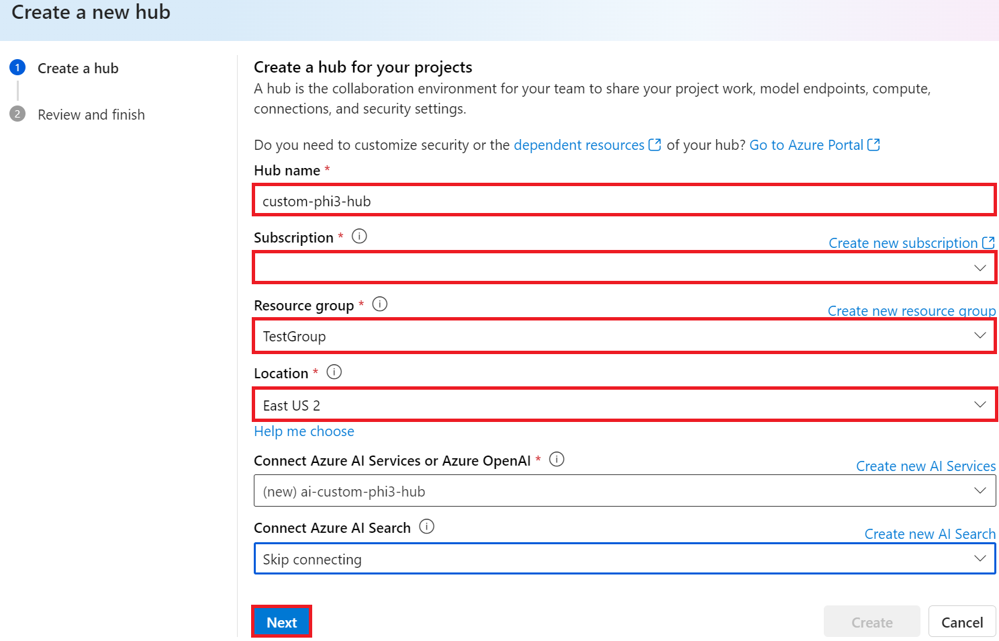

1. **Next** ਚੁਣੋ।

#### Azure AI Foundry ਪ੍ਰੋਜੈਕਟ ਬਣਾਓ

1. ਉਸ Hub ਵਿੱਚ ਜੋ ਤੁਸੀਂ ਬਣਾਇਆ ਸੀ, ਖੱਬੇ ਪਾਸੇ ਟੈਬ ਵਿੱਚੋਂ **All projects** ਚੁਣੋ।

1. ਨੈਵੀਗੇਸ਼ਨ ਮੀਨੂ ਵਿੱਚੋਂ **+ New project** ਚੁਣੋ।

    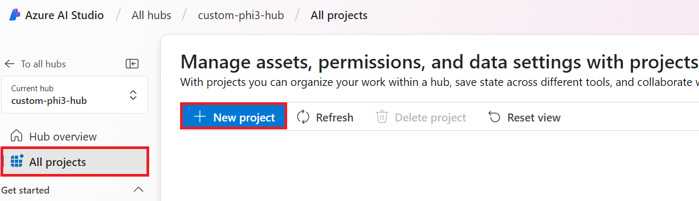

1. **Project name** ਦਾਖਲ ਕਰੋ। ਇਹ ਇੱਕ ਵਿਲੱਖਣ ਮੁੱਲ ਹੋਣਾ ਚਾਹੀਦਾ ਹੈ।

    

1. **Create a project** ਚੁਣੋ।

#### ਫਾਈਨ-ਟਿਊਨ ਕੀਤਾ Phi-3 ਮਾਡਲ ਲਈ ਕਸਟਮ ਕਨੈਕਸ਼ਨ ਜੋੜੋ

ਆਪਣੇ ਕਸਟਮ Phi-3 ਮਾਡਲ ਨੂੰ Prompt flow ਨਾਲ ਜੋੜਨ ਲਈ, ਤੁਹਾਨੂੰ ਮਾਡਲ ਦਾ ਐਂਡਪੌਇੰਟ ਅਤੇ ਕੀ ਇੱਕ ਕਸਟਮ ਕਨੈਕਸ਼ਨ ਵਿੱਚ ਸੇਵ ਕਰਨਾ ਪਵੇਗਾ। ਇਹ ਸੈਟਅੱਪ ਤੁਹਾਡੇ ਮਾਡਲ ਤੱਕ Prompt flow ਵਿੱਚ ਪਹੁੰਚ ਯਕੀਨੀ ਬਣਾਉਂਦਾ ਹੈ।

#### ਫਾਈਨ-ਟਿਊਨ ਕੀਤਾ Phi-3 ਮਾਡਲ ਲਈ api key ਅਤੇ endpoint uri ਸੈੱਟ ਕਰੋ

1. [Azure ML Studio](https://ml.azure.com/home?WT.mc_id=aiml-137032-kinfeylo) ‘ਤੇ ਜਾਓ।

1. ਉਸ Azure Machine Learning ਵਰਕਸਪੇਸ ਵਿੱਚ ਜਾਓ ਜੋ ਤੁਸੀਂ ਬਣਾਇਆ ਸੀ।

1. ਖੱਬੇ ਪਾਸੇ ਟੈਬ ਵਿੱਚੋਂ **Endpoints** ਚੁਣੋ।

    

1. ਉਸ ਐਂਡਪੌਇੰਟ ਨੂੰ ਚੁਣੋ ਜੋ ਤੁਸੀਂ ਬਣਾਇਆ ਸੀ।

    

1. ਨੈਵੀਗੇਸ਼ਨ ਮੀਨੂ ਵਿੱਚੋਂ **Consume** ਚੁਣੋ।

1. ਆਪਣਾ **REST endpoint** ਅਤੇ **Primary key** ਕਾਪੀ ਕਰੋ।


#### ਕਸਟਮ ਕਨੈਕਸ਼ਨ ਜੋੜੋ

1. [Azure AI Foundry](https://ai.azure.com/?WT.mc_id=aiml-137032-kinfeylo) 'ਤੇ ਜਾਓ।

1. ਉਸ Azure AI Foundry ਪ੍ਰੋਜੈਕਟ 'ਤੇ ਜਾਓ ਜੋ ਤੁਸੀਂ ਬਣਾਇਆ ਸੀ।

1. ਆਪਣੇ ਬਣਾਏ ਪ੍ਰੋਜੈਕਟ ਵਿੱਚ, ਖੱਬੇ ਪਾਸੇ ਟੈਬ ਤੋਂ **Settings** ਚੁਣੋ।

1. **+ New connection** ਚੁਣੋ।

    

1. ਨੈਵੀਗੇਸ਼ਨ ਮੇਨੂ ਵਿੱਚੋਂ **Custom keys** ਚੁਣੋ।

    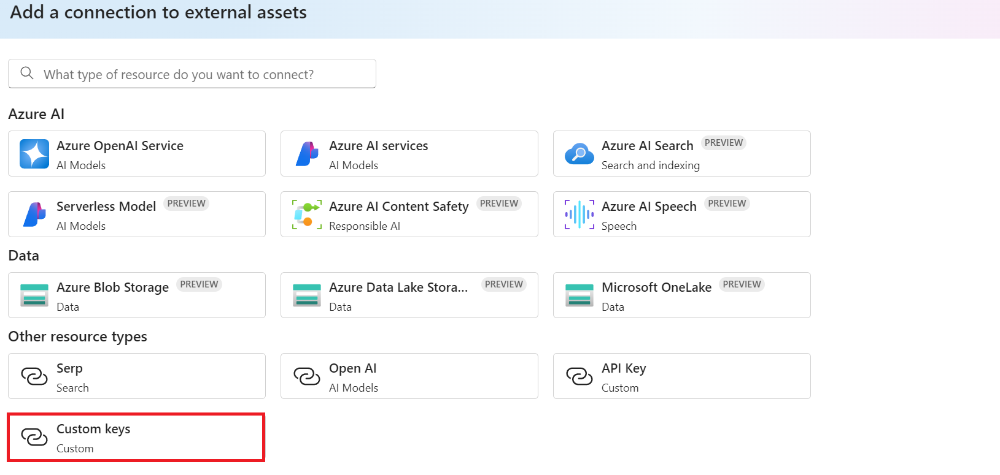

1. ਹੇਠਾਂ ਦਿੱਤੇ ਕੰਮ ਕਰੋ:

    - **+ Add key value pairs** ਚੁਣੋ।
    - key ਨਾਮ ਲਈ **endpoint** ਲਿਖੋ ਅਤੇ Azure ML Studio ਤੋਂ ਕਾਪੀ ਕੀਤਾ endpoint value ਫੀਲਡ ਵਿੱਚ ਪੇਸਟ ਕਰੋ।
    - ਫਿਰ ਤੋਂ **+ Add key value pairs** ਚੁਣੋ।
    - key ਨਾਮ ਲਈ **key** ਲਿਖੋ ਅਤੇ Azure ML Studio ਤੋਂ ਕਾਪੀ ਕੀਤਾ key value ਫੀਲਡ ਵਿੱਚ ਪੇਸਟ ਕਰੋ।
    - keys ਜੋੜਨ ਤੋਂ ਬਾਅਦ, key ਨੂੰ ਛੁਪਾਉਣ ਲਈ **is secret** ਚੁਣੋ।

    

1. **Add connection** ਚੁਣੋ।

#### Prompt flow ਬਣਾਓ

ਤੁਸੀਂ Azure AI Foundry ਵਿੱਚ ਕਸਟਮ ਕਨੈਕਸ਼ਨ ਜੋੜ ਦਿੱਤਾ ਹੈ। ਹੁਣ, ਅਗਲੇ ਕਦਮਾਂ ਨਾਲ Prompt flow ਬਣਾਉ। ਫਿਰ, ਇਸ Prompt flow ਨੂੰ ਕਸਟਮ ਕਨੈਕਸ਼ਨ ਨਾਲ ਜੋੜੋ ਤਾਂ ਜੋ ਤੁਸੀਂ fine-tuned ਮਾਡਲ ਨੂੰ Prompt flow ਵਿੱਚ ਵਰਤ ਸਕੋ।

1. ਆਪਣੇ ਬਣਾਏ Azure AI Foundry ਪ੍ਰੋਜੈਕਟ 'ਤੇ ਜਾਓ।

1. ਖੱਬੇ ਪਾਸੇ ਟੈਬ ਤੋਂ **Prompt flow** ਚੁਣੋ।

1. ਨੈਵੀਗੇਸ਼ਨ ਮੇਨੂ ਵਿੱਚੋਂ **+ Create** ਚੁਣੋ।

    

1. ਨੈਵੀਗੇਸ਼ਨ ਮੇਨੂ ਵਿੱਚੋਂ **Chat flow** ਚੁਣੋ।

    

1. ਵਰਤਣ ਲਈ **Folder name** ਦਰਜ ਕਰੋ।

    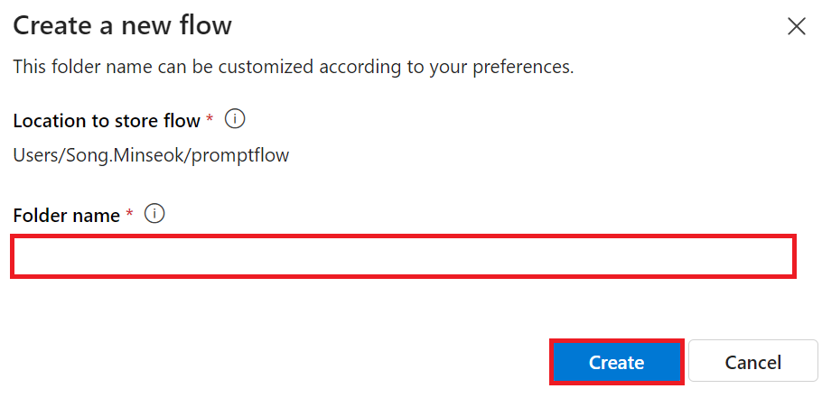

2. **Create** ਚੁਣੋ।

#### ਆਪਣੇ ਕਸਟਮ Phi-3 ਮਾਡਲ ਨਾਲ ਗੱਲਬਾਤ ਲਈ Prompt flow ਸੈੱਟ ਕਰੋ

ਤੁਹਾਨੂੰ fine-tuned Phi-3 ਮਾਡਲ ਨੂੰ Prompt flow ਵਿੱਚ ਜੋੜਨਾ ਹੈ। ਮੌਜੂਦਾ ਦਿੱਤਾ Prompt flow ਇਸ ਲਈ ਬਣਾਇਆ ਨਹੀਂ ਗਿਆ, ਇਸ ਲਈ ਤੁਹਾਨੂੰ Prompt flow ਨੂੰ ਦੁਬਾਰਾ ਡਿਜ਼ਾਈਨ ਕਰਨਾ ਪਵੇਗਾ ਤਾਂ ਜੋ ਕਸਟਮ ਮਾਡਲ ਨਾਲ ਇੰਟੀਗ੍ਰੇਸ਼ਨ ਹੋ ਸਕੇ।

1. Prompt flow ਵਿੱਚ, ਮੌਜੂਦਾ flow ਨੂੰ ਦੁਬਾਰਾ ਬਣਾਉਣ ਲਈ ਹੇਠਾਂ ਦਿੱਤੇ ਕੰਮ ਕਰੋ:

    - **Raw file mode** ਚੁਣੋ।
    - *flow.dag.yml* ਫਾਈਲ ਵਿੱਚ ਮੌਜੂਦਾ ਸਾਰੇ ਕੋਡ ਹਟਾਓ।
    - *flow.dag.yml* ਫਾਈਲ ਵਿੱਚ ਹੇਠਾਂ ਦਿੱਤਾ ਕੋਡ ਪੇਸਟ ਕਰੋ।

        ```yml
        inputs:
          input_data:
            type: string
            default: "Who founded Microsoft?"

        outputs:
          answer:
            type: string
            reference: ${integrate_with_promptflow.output}

        nodes:
        - name: integrate_with_promptflow
          type: python
          source:
            type: code
            path: integrate_with_promptflow.py
          inputs:
            input_data: ${inputs.input_data}
        ```

    - **Save** ਚੁਣੋ।

    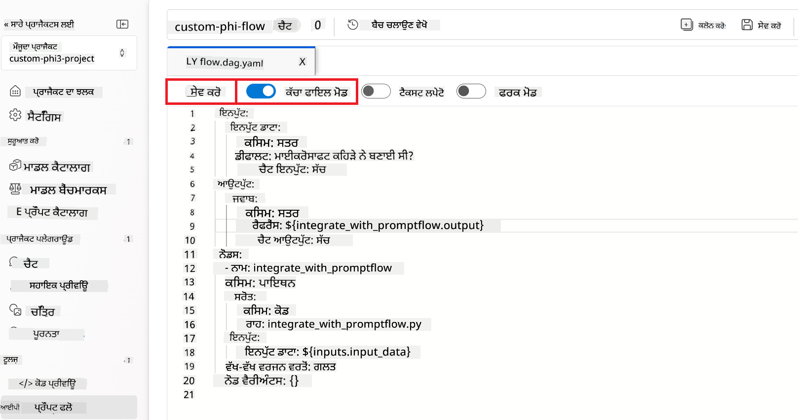

1. *integrate_with_promptflow.py* ਫਾਈਲ ਵਿੱਚ ਹੇਠਾਂ ਦਿੱਤਾ ਕੋਡ ਜੋੜੋ ਤਾਂ ਜੋ Prompt flow ਵਿੱਚ ਕਸਟਮ Phi-3 ਮਾਡਲ ਵਰਤਿਆ ਜਾ ਸਕੇ।

    ```python
    import logging
    import requests
    from promptflow import tool
    from promptflow.connections import CustomConnection

    # Logging setup
    logging.basicConfig(
        format="%(asctime)s - %(levelname)s - %(name)s - %(message)s",
        datefmt="%Y-%m-%d %H:%M:%S",
        level=logging.DEBUG
    )
    logger = logging.getLogger(__name__)

    def query_phi3_model(input_data: str, connection: CustomConnection) -> str:
        """
        Send a request to the Phi-3 model endpoint with the given input data using Custom Connection.
        """

        # "connection" is the name of the Custom Connection, "endpoint", "key" are the keys in the Custom Connection
        endpoint_url = connection.endpoint
        api_key = connection.key

        headers = {
            "Content-Type": "application/json",
            "Authorization": f"Bearer {api_key}"
        }
        data = {
            "input_data": {
                "input_string": [
                    {"role": "user", "content": input_data}
                ],
                "parameters": {
                    "temperature": 0.7,
                    "max_new_tokens": 128
                }
            }
        }
        try:
            response = requests.post(endpoint_url, json=data, headers=headers)
            response.raise_for_status()
            
            # Log the full JSON response
            logger.debug(f"Full JSON response: {response.json()}")

            result = response.json()["output"]
            logger.info("Successfully received response from Azure ML Endpoint.")
            return result
        except requests.exceptions.RequestException as e:
            logger.error(f"Error querying Azure ML Endpoint: {e}")
            raise

    @tool
    def my_python_tool(input_data: str, connection: CustomConnection) -> str:
        """
        Tool function to process input data and query the Phi-3 model.
        """
        return query_phi3_model(input_data, connection)

    ```

    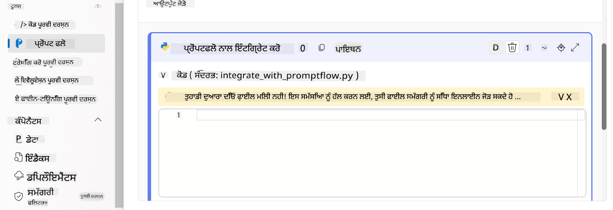

> [!NOTE]
> Azure AI Foundry ਵਿੱਚ Prompt flow ਵਰਤਣ ਬਾਰੇ ਹੋਰ ਵਿਸਥਾਰ ਨਾਲ ਜਾਣਕਾਰੀ ਲਈ, ਤੁਸੀਂ [Prompt flow in Azure AI Foundry](https://learn.microsoft.com/azure/ai-studio/how-to/prompt-flow) ਵੇਖ ਸਕਦੇ ਹੋ।

1. ਗੱਲਬਾਤ ਕਰਨ ਲਈ **Chat input**, **Chat output** ਚੁਣੋ।

    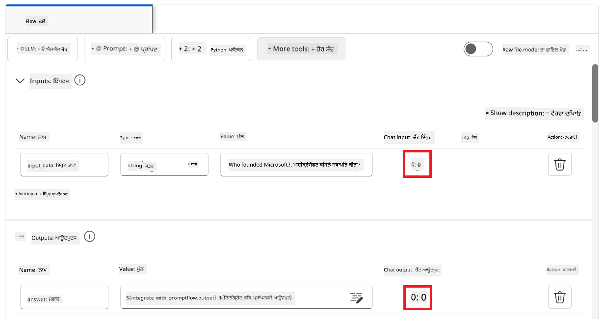

1. ਹੁਣ ਤੁਸੀਂ ਆਪਣੇ ਕਸਟਮ Phi-3 ਮਾਡਲ ਨਾਲ ਗੱਲਬਾਤ ਕਰਨ ਲਈ ਤਿਆਰ ਹੋ। ਅਗਲੇ ਅਭਿਆਸ ਵਿੱਚ, ਤੁਸੀਂ ਸਿੱਖੋਗੇ ਕਿ ਕਿਵੇਂ Prompt flow ਸ਼ੁਰੂ ਕਰਨੀ ਹੈ ਅਤੇ ਇਸਨੂੰ ਆਪਣੇ fine-tuned Phi-3 ਮਾਡਲ ਨਾਲ ਗੱਲਬਾਤ ਲਈ ਵਰਤਣਾ ਹੈ।

> [!NOTE]
>
> ਦੁਬਾਰਾ ਬਣਾਇਆ ਹੋਇਆ flow ਹੇਠਾਂ ਦਿੱਤੀ ਤਸਵੀਰ ਵਰਗਾ ਹੋਣਾ ਚਾਹੀਦਾ ਹੈ:
>
> 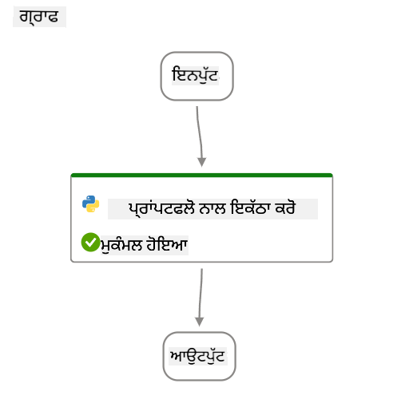
>

### ਆਪਣੇ ਕਸਟਮ Phi-3 ਮਾਡਲ ਨਾਲ ਗੱਲਬਾਤ ਕਰੋ

ਹੁਣ ਜਦੋਂ ਤੁਸੀਂ ਆਪਣਾ ਕਸਟਮ Phi-3 ਮਾਡਲ fine-tune ਕਰਕੇ Prompt flow ਵਿੱਚ ਜੋੜ ਲਿਆ ਹੈ, ਤਾਂ ਤੁਸੀਂ ਇਸ ਨਾਲ ਗੱਲਬਾਤ ਸ਼ੁਰੂ ਕਰਨ ਲਈ ਤਿਆਰ ਹੋ। ਇਹ ਅਭਿਆਸ ਤੁਹਾਨੂੰ Prompt flow ਵਰਤ ਕੇ ਮਾਡਲ ਨਾਲ ਗੱਲਬਾਤ ਸੈੱਟਅਪ ਕਰਨ ਅਤੇ ਸ਼ੁਰੂ ਕਰਨ ਦੀ ਪ੍ਰਕਿਰਿਆ ਦਿਖਾਏਗਾ। ਇਹਨਾਂ ਕਦਮਾਂ ਦੀ ਪਾਲਣਾ ਕਰਕੇ, ਤੁਸੀਂ ਆਪਣੇ fine-tuned Phi-3 ਮਾਡਲ ਦੀਆਂ ਸਮਰੱਥਾਵਾਂ ਨੂੰ ਵੱਖ-ਵੱਖ ਕੰਮਾਂ ਅਤੇ ਗੱਲਬਾਤਾਂ ਲਈ ਪੂਰੀ ਤਰ੍ਹਾਂ ਵਰਤ ਸਕੋਗੇ।

- Prompt flow ਦੀ ਵਰਤੋਂ ਕਰਕੇ ਆਪਣੇ ਕਸਟਮ Phi-3 ਮਾਡਲ ਨਾਲ ਗੱਲਬਾਤ ਕਰੋ।

#### Prompt flow ਸ਼ੁਰੂ ਕਰੋ

1. Prompt flow ਸ਼ੁਰੂ ਕਰਨ ਲਈ **Start compute sessions** ਚੁਣੋ।

    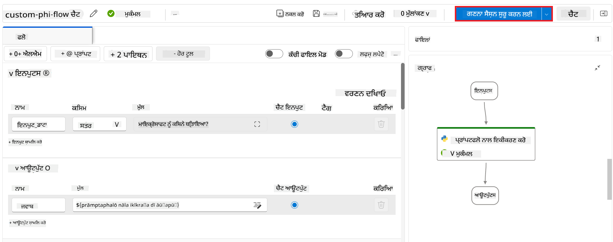

1. ਪੈਰਾਮੀਟਰਾਂ ਨੂੰ ਨਵਾਂ ਕਰਨ ਲਈ **Validate and parse input** ਚੁਣੋ।

    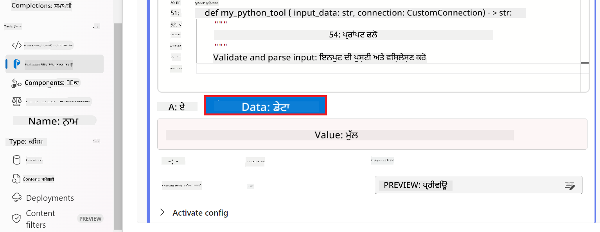

1. ਆਪਣੇ ਬਣਾਏ ਕਸਟਮ ਕਨੈਕਸ਼ਨ ਦਾ **connection** ਵੈਲਯੂ ਚੁਣੋ। ਉਦਾਹਰਣ ਵਜੋਂ, *connection*।

    

#### ਆਪਣੇ ਕਸਟਮ ਮਾਡਲ ਨਾਲ ਗੱਲਬਾਤ ਕਰੋ

1. **Chat** ਚੁਣੋ।

    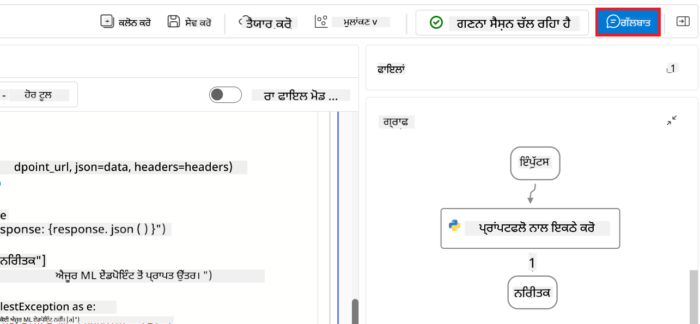

1. ਨਤੀਜੇ ਦਾ ਉਦਾਹਰਣ: ਹੁਣ ਤੁਸੀਂ ਆਪਣੇ ਕਸਟਮ Phi-3 ਮਾਡਲ ਨਾਲ ਗੱਲਬਾਤ ਕਰ ਸਕਦੇ ਹੋ। ਸੁਝਾਅ ਹੈ ਕਿ fine-tuning ਲਈ ਵਰਤੇ ਡੇਟਾ ਦੇ ਆਧਾਰ 'ਤੇ ਸਵਾਲ ਪੁੱਛੋ।

    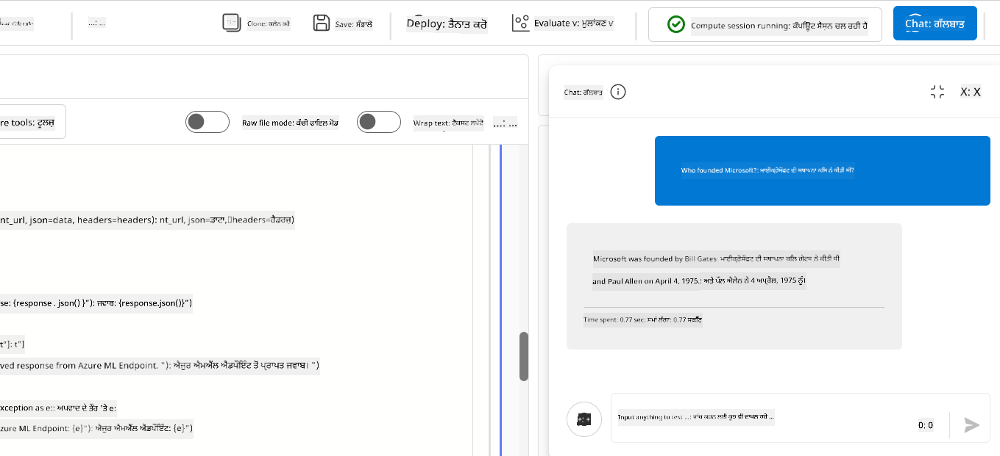

**ਅਸਵੀਕਾਰੋਪਣ**:  
ਇਹ ਦਸਤਾਵੇਜ਼ AI ਅਨੁਵਾਦ ਸੇਵਾ [Co-op Translator](https://github.com/Azure/co-op-translator) ਦੀ ਵਰਤੋਂ ਕਰਕੇ ਅਨੁਵਾਦ ਕੀਤਾ ਗਿਆ ਹੈ। ਜਦੋਂ ਕਿ ਅਸੀਂ ਸਹੀਤਾ ਲਈ ਕੋਸ਼ਿਸ਼ ਕਰਦੇ ਹਾਂ, ਕਿਰਪਾ ਕਰਕੇ ਧਿਆਨ ਰੱਖੋ ਕਿ ਸਵੈਚਾਲਿਤ ਅਨੁਵਾਦਾਂ ਵਿੱਚ ਗਲਤੀਆਂ ਜਾਂ ਅਸਮਰੱਥਤਾਵਾਂ ਹੋ ਸਕਦੀਆਂ ਹਨ। ਮੂਲ ਦਸਤਾਵੇਜ਼ ਆਪਣੀ ਮੂਲ ਭਾਸ਼ਾ ਵਿੱਚ ਪ੍ਰਮਾਣਿਕ ਸਰੋਤ ਮੰਨਿਆ ਜਾਣਾ ਚਾਹੀਦਾ ਹੈ। ਮਹੱਤਵਪੂਰਨ ਜਾਣਕਾਰੀ ਲਈ, ਪੇਸ਼ੇਵਰ ਮਨੁੱਖੀ ਅਨੁਵਾਦ ਦੀ ਸਿਫ਼ਾਰਸ਼ ਕੀਤੀ ਜਾਂਦੀ ਹੈ। ਅਸੀਂ ਇਸ ਅਨੁਵਾਦ ਦੀ ਵਰਤੋਂ ਤੋਂ ਪੈਦਾ ਹੋਣ ਵਾਲੀਆਂ ਕਿਸੇ ਵੀ ਗਲਤਫਹਿਮੀਆਂ ਜਾਂ ਗਲਤ ਵਿਆਖਿਆਵਾਂ ਲਈ ਜ਼ਿੰਮੇਵਾਰ ਨਹੀਂ ਹਾਂ।