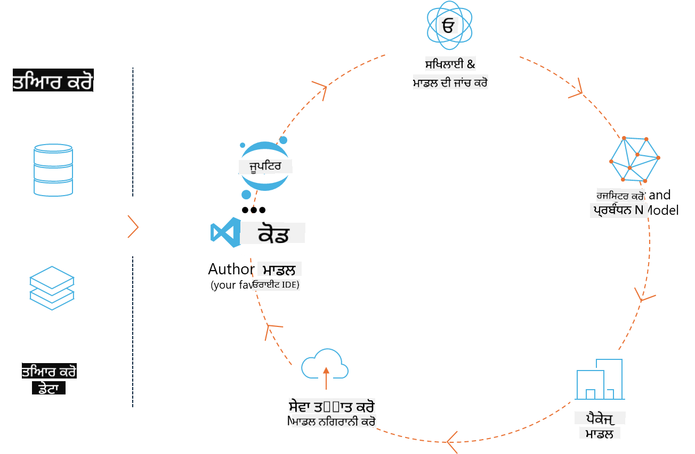
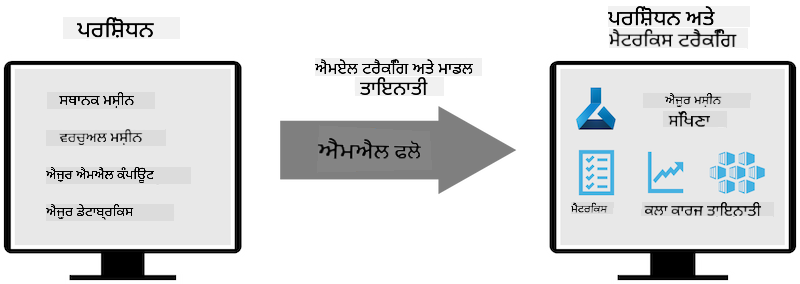
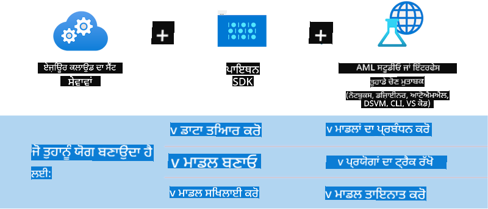

<!--
CO_OP_TRANSLATOR_METADATA:
{
  "original_hash": "f61c383bbf0c3dac97e43f833c258731",
  "translation_date": "2025-05-09T18:35:57+00:00",
  "source_file": "md/02.Application/01.TextAndChat/Phi3/E2E_Phi-3-MLflow.md",
  "language_code": "pa"
}
-->
# MLflow

[MLflow](https://mlflow.org/) ਇੱਕ ਖੁੱਲ੍ਹਾ ਸਰੋਤ ਪਲੇਟਫਾਰਮ ਹੈ ਜੋ ਮਸ਼ੀਨ ਲਰਨਿੰਗ ਦੀ ਪੂਰੀ ਲਾਈਫਸਾਈਕਲ ਨੂੰ ਸੰਭਾਲਣ ਲਈ ਬਣਾਇਆ ਗਿਆ ਹੈ।



MLFlow ਨੂੰ ML ਲਾਈਫਸਾਈਕਲ ਨੂੰ ਸੰਭਾਲਣ ਲਈ ਵਰਤਿਆ ਜਾਂਦਾ ਹੈ, ਜਿਸ ਵਿੱਚ ਪ੍ਰਯੋਗ, ਦੁਹਰਾਅਯੋਗਤਾ, ਡਿਪਲੋਇਮੈਂਟ ਅਤੇ ਕੇਂਦਰੀ ਮਾਡਲ ਰਜਿਸਟਰੀ ਸ਼ਾਮਲ ਹੈ। ML flow ਵਰਤਮਾਨ ਵਿੱਚ ਚਾਰ ਕੰਪੋਨੈਂਟ ਪ੍ਰਦਾਨ ਕਰਦਾ ਹੈ।

- **MLflow Tracking:** ਪ੍ਰਯੋਗ, ਕੋਡ, ਡਾਟਾ ਕੰਫਿਗ ਅਤੇ ਨਤੀਜੇ ਰਿਕਾਰਡ ਅਤੇ ਪੁੱਛਗਿੱਛ ਕਰੋ।
- **MLflow Projects:** ਡਾਟਾ ਸਾਇੰਸ ਕੋਡ ਨੂੰ ਇੱਕ ਐਸੇ ਫਾਰਮੈਟ ਵਿੱਚ ਪੈਕੇਜ ਕਰੋ ਜੋ ਕਿਸੇ ਵੀ ਪਲੇਟਫਾਰਮ 'ਤੇ ਦੌੜਾਂ ਨੂੰ ਦੁਹਰਾਉਣਯੋਗ ਬਣਾਉਂਦਾ ਹੈ।
- **Mlflow Models:** ਮਸ਼ੀਨ ਲਰਨਿੰਗ ਮਾਡਲਾਂ ਨੂੰ ਵੱਖ-ਵੱਖ ਸਰਵਿੰਗ ਵਾਤਾਵਰਨਾਂ ਵਿੱਚ ਡਿਪਲੋਇ ਕਰੋ।
- **Model Registry:** ਮਾਡਲਾਂ ਨੂੰ ਕੇਂਦਰੀ ਰਿਪੋਜ਼ਟਰੀ ਵਿੱਚ ਸਟੋਰ, ਟਿੱਪਣੀ ਅਤੇ ਪ੍ਰਬੰਧਿਤ ਕਰੋ।

ਇਸ ਵਿੱਚ ਪ੍ਰਯੋਗਾਂ ਨੂੰ ਟ੍ਰੈਕ ਕਰਨ, ਕੋਡ ਨੂੰ ਦੁਹਰਾਅਯੋਗ ਦੌੜਾਂ ਵਿੱਚ ਪੈਕੇਜ ਕਰਨ ਅਤੇ ਮਾਡਲਾਂ ਨੂੰ ਸਾਂਝਾ ਕਰਨ ਅਤੇ ਡਿਪਲੋਇ ਕਰਨ ਦੀ ਸਮਰੱਥਾ ਸ਼ਾਮਲ ਹੈ। MLFlow ਨੂੰ Databricks ਵਿੱਚ ਇੰਟਿਗਰੇਟ ਕੀਤਾ ਗਿਆ ਹੈ ਅਤੇ ਇਹ ਕਈ ML ਲਾਇਬ੍ਰੇਰੀਆਂ ਦਾ ਸਮਰਥਨ ਕਰਦਾ ਹੈ, ਇਸ ਲਈ ਇਹ ਲਾਇਬ੍ਰੇਰੀ-ਅਗਨੋਸਟਿਕ ਹੈ। ਇਹ ਕਿਸੇ ਵੀ ਮਸ਼ੀਨ ਲਰਨਿੰਗ ਲਾਇਬ੍ਰੇਰੀ ਅਤੇ ਕਿਸੇ ਵੀ ਪ੍ਰੋਗ੍ਰਾਮਿੰਗ ਭਾਸ਼ਾ ਨਾਲ ਵਰਤਿਆ ਜਾ ਸਕਦਾ ਹੈ, ਕਿਉਂਕਿ ਇਹ ਸਹੂਲਤ ਲਈ REST API ਅਤੇ CLI ਪ੍ਰਦਾਨ ਕਰਦਾ ਹੈ।



MLFlow ਦੀਆਂ ਮੁੱਖ ਵਿਸ਼ੇਸ਼ਤਾਵਾਂ ਵਿੱਚ ਸ਼ਾਮਲ ਹਨ:

- **Experiment Tracking:** ਪੈਰਾਮੀਟਰਾਂ ਅਤੇ ਨਤੀਜਿਆਂ ਨੂੰ ਰਿਕਾਰਡ ਅਤੇ ਤੁਲਨਾ ਕਰੋ।
- **Model Management:** ਮਾਡਲਾਂ ਨੂੰ ਵੱਖ-ਵੱਖ ਸਰਵਿੰਗ ਅਤੇ ਇਨਫਰੰਸ ਪਲੇਟਫਾਰਮਾਂ 'ਤੇ ਡਿਪਲੋਇ ਕਰੋ।
- **Model Registry:** MLflow Models ਦੀ ਲਾਈਫਸਾਈਕਲ ਨੂੰ ਸਹਿਯੋਗੀ ਤਰੀਕੇ ਨਾਲ ਪ੍ਰਬੰਧਿਤ ਕਰੋ, ਜਿਸ ਵਿੱਚ ਵਰਜ਼ਨਿੰਗ ਅਤੇ ਟਿੱਪਣੀਆਂ ਸ਼ਾਮਲ ਹਨ।
- **Projects:** ML ਕੋਡ ਨੂੰ ਸਾਂਝਾ ਕਰਨ ਜਾਂ ਪ੍ਰੋਡਕਸ਼ਨ ਵਰਤੋਂ ਲਈ ਪੈਕੇਜ ਕਰੋ।

MLFlow MLOps ਲੂਪ ਨੂੰ ਵੀ ਸਹਿਯੋਗ ਦਿੰਦਾ ਹੈ, ਜਿਸ ਵਿੱਚ ਡਾਟਾ ਤਿਆਰ ਕਰਨਾ, ਮਾਡਲਾਂ ਨੂੰ ਰਜਿਸਟਰ ਅਤੇ ਪ੍ਰਬੰਧਿਤ ਕਰਨਾ, ਮਾਡਲਾਂ ਨੂੰ ਚਲਾਉਣ ਲਈ ਪੈਕੇਜ ਕਰਨਾ, ਸਰਵਿਸਜ਼ ਨੂੰ ਡਿਪਲੋਇ ਕਰਨਾ ਅਤੇ ਮਾਡਲਾਂ ਦੀ ਨਿਗਰਾਨੀ ਕਰਨਾ ਸ਼ਾਮਲ ਹੈ। ਇਸਦਾ ਮਕਸਦ ਪ੍ਰੋਟੋਟਾਈਪ ਤੋਂ ਪ੍ਰੋਡਕਸ਼ਨ ਵਰਕਫਲੋ ਤੱਕ ਦੇ ਪ੍ਰਕਿਰਿਆ ਨੂੰ ਆਸਾਨ ਬਣਾਉਣਾ ਹੈ, ਖਾਸ ਕਰਕੇ ਕਲਾਉਡ ਅਤੇ ਏਜ ਵਾਤਾਵਰਨਾਂ ਵਿੱਚ।

## E2E ਸਨੇਰੀਓ - ਇੱਕ wrapper ਬਣਾਉਣਾ ਅਤੇ Phi-3 ਨੂੰ MLFlow ਮਾਡਲ ਵਜੋਂ ਵਰਤਣਾ

ਇਸ E2E ਨਮੂਨੇ ਵਿੱਚ ਅਸੀਂ ਦੋ ਵੱਖ-ਵੱਖ ਤਰੀਕੇ ਦਿਖਾਵਾਂਗੇ ਜਿਨ੍ਹਾਂ ਨਾਲ Phi-3 ਛੋਟੇ ਭਾਸ਼ਾ ਮਾਡਲ (SLM) ਦੇ ਆਲੇ-ਦੁਆਲੇ ਇੱਕ wrapper ਬਣਾਇਆ ਜਾ ਸਕਦਾ ਹੈ ਅਤੇ ਫਿਰ ਇਸਨੂੰ MLFlow ਮਾਡਲ ਵਜੋਂ ਸਥਾਨਕ ਜਾਂ ਕਲਾਉਡ ਵਿੱਚ ਚਲਾਇਆ ਜਾ ਸਕਦਾ ਹੈ, ਜਿਵੇਂ ਕਿ Azure Machine Learning ਵਰਕਸਪੇਸ ਵਿੱਚ।



| ਪ੍ਰੋਜੈਕਟ | ਵੇਰਵਾ | ਸਥਾਨ |
| ------------ | ----------- | -------- |
| Transformer Pipeline | ਜੇ ਤੁਸੀਂ HuggingFace ਮਾਡਲ ਨੂੰ MLFlow ਦੇ ਪ੍ਰਯੋਗਾਤਮਕ transformers flavour ਨਾਲ ਵਰਤਣਾ ਚਾਹੁੰਦੇ ਹੋ ਤਾਂ Transformer Pipeline wrapper ਬਣਾਉਣ ਦਾ ਸਭ ਤੋਂ ਆਸਾਨ ਵਿਕਲਪ ਹੈ। | [**TransformerPipeline.ipynb**](../../../../../../code/06.E2E/E2E_Phi-3-MLflow_TransformerPipeline.ipynb) |
| Custom Python Wrapper | ਲਿਖਣ ਸਮੇਂ, transformer pipeline ਨੇ ONNX ਫਾਰਮੈਟ ਵਿੱਚ HuggingFace ਮਾਡਲਾਂ ਲਈ MLFlow wrapper ਬਣਾਉਣ ਦਾ ਸਮਰਥਨ ਨਹੀਂ ਦਿੱਤਾ, ਭਾਵੇਂ experimental optimum Python package ਨਾਲ। ਇਨ੍ਹਾਂ ਹਾਲਤਾਂ ਲਈ, ਤੁਸੀਂ ਆਪਣਾ ਕਸਟਮ Python wrapper MLFlow ਮੋਡ ਲਈ ਬਣਾ ਸਕਦੇ ਹੋ | [**CustomPythonWrapper.ipynb**](../../../../../../code/06.E2E/E2E_Phi-3-MLflow_CustomPythonWrapper.ipynb) |

## ਪ੍ਰੋਜੈਕਟ: Transformer Pipeline

1. ਤੁਹਾਨੂੰ MLFlow ਅਤੇ HuggingFace ਤੋਂ ਸਬੰਧਿਤ Python ਪੈਕੇਜਾਂ ਦੀ ਲੋੜ ਹੋਵੇਗੀ:

    ``` Python
    import mlflow
    import transformers
    ```

2. ਅਗਲਾ, ਤੁਸੀਂ HuggingFace ਰਜਿਸਟਰੀ ਵਿੱਚ ਟਾਰਗਟ Phi-3 ਮਾਡਲ ਦਾ ਹਵਾਲਾ ਦੇ ਕੇ transformer pipeline ਸ਼ੁਰੂ ਕਰ ਸਕਦੇ ਹੋ। ਜਿਵੇਂ ਕਿ _Phi-3-mini-4k-instruct_ ਦੇ ਮਾਡਲ ਕਾਰਡ ਵਿੱਚ ਦਿਖਾਇਆ ਗਿਆ ਹੈ, ਇਸਦਾ ਕੰਮ "Text Generation" ਕਿਸਮ ਦਾ ਹੈ:

    ``` Python
    pipeline = transformers.pipeline(
        task = "text-generation",
        model = "microsoft/Phi-3-mini-4k-instruct"
    )
    ```

3. ਹੁਣ ਤੁਸੀਂ ਆਪਣੇ Phi-3 ਮਾਡਲ ਦੀ transformer pipeline ਨੂੰ MLFlow ਫਾਰਮੈਟ ਵਿੱਚ ਸੇਵ ਕਰ ਸਕਦੇ ਹੋ ਅਤੇ ਵਾਧੂ ਜਾਣਕਾਰੀ ਜਿਵੇਂ ਟਾਰਗਟ ਆਰਟੀਫੈਕਟ ਪਾਥ, ਖਾਸ ਮਾਡਲ ਕੰਫਿਗਰੇਸ਼ਨ ਸੈਟਿੰਗਾਂ ਅਤੇ ਇਨਫਰੰਸ API ਕਿਸਮ ਦੇ ਸਕਦੇ ਹੋ:

    ``` Python
    model_info = mlflow.transformers.log_model(
        transformers_model = pipeline,
        artifact_path = "phi3-mlflow-model",
        model_config = model_config,
        task = "llm/v1/chat"
    )
    ```

## ਪ੍ਰੋਜੈਕਟ: Custom Python Wrapper

1. ਇੱਥੇ ਅਸੀਂ Microsoft ਦਾ [ONNX Runtime generate() API](https://github.com/microsoft/onnxruntime-genai) ਵਰਤ ਸਕਦੇ ਹਾਂ ONNX ਮਾਡਲ ਦੇ ਇਨਫਰੰਸ ਅਤੇ ਟੋਕਨ ਇਨਕੋਡਿੰਗ / ਡੀਕੋਡਿੰਗ ਲਈ। ਤੁਹਾਨੂੰ ਆਪਣੇ ਟਾਰਗਟ ਕੰਪਿਊਟ ਲਈ _onnxruntime_genai_ ਪੈਕੇਜ ਚੁਣਣਾ ਪਵੇਗਾ, ਹੇਠਾਂ ਦਿੱਤੇ ਉਦਾਹਰਨ ਵਿੱਚ CPU ਟਾਰਗਟ ਹੈ:

    ``` Python
    import mlflow
    from mlflow.models import infer_signature
    import onnxruntime_genai as og
    ```

1. ਸਾਡੀ ਕਸਟਮ ਕਲਾਸ ਦੋ ਮੈਥਡਾਂ ਨੂੰ ਅਮਲ ਕਰਦੀ ਹੈ: _load_context()_ ਜੋ Phi-3 Mini 4K Instruct ਦੇ **ONNX ਮਾਡਲ**, **ਜਨਰੇਟਰ ਪੈਰਾਮੀਟਰ** ਅਤੇ **ਟੋਕਨਾਈਜ਼ਰ** ਨੂੰ ਇਨਿਸ਼ੀਅਲਾਈਜ਼ ਕਰਦਾ ਹੈ; ਅਤੇ _predict()_ ਜੋ ਦਿੱਤੇ ਗਏ ਪ੍ਰਾਂਪਟ ਲਈ ਆਉਟਪੁੱਟ ਟੋਕਨ ਬਣਾਉਂਦਾ ਹੈ:

    ``` Python
    class Phi3Model(mlflow.pyfunc.PythonModel):
        def load_context(self, context):
            # Retrieving model from the artifacts
            model_path = context.artifacts["phi3-mini-onnx"]
            model_options = {
                 "max_length": 300,
                 "temperature": 0.2,         
            }
        
            # Defining the model
            self.phi3_model = og.Model(model_path)
            self.params = og.GeneratorParams(self.phi3_model)
            self.params.set_search_options(**model_options)
            
            # Defining the tokenizer
            self.tokenizer = og.Tokenizer(self.phi3_model)
    
        def predict(self, context, model_input):
            # Retrieving prompt from the input
            prompt = model_input["prompt"][0]
            self.params.input_ids = self.tokenizer.encode(prompt)
    
            # Generating the model's response
            response = self.phi3_model.generate(self.params)
    
            return self.tokenizer.decode(response[0][len(self.params.input_ids):])
    ```

1. ਹੁਣ ਤੁਸੀਂ _mlflow.pyfunc.log_model()_ ਫੰਕਸ਼ਨ ਦੀ ਵਰਤੋਂ ਕਰਕੇ Phi-3 ਮਾਡਲ ਲਈ ਇੱਕ ਕਸਟਮ Python wrapper (pickle ਫਾਰਮੈਟ ਵਿੱਚ) ਤਿਆਰ ਕਰ ਸਕਦੇ ਹੋ, ਅਸਲ ONNX ਮਾਡਲ ਅਤੇ ਜ਼ਰੂਰੀ ਡਿਪੈਂਡੇਨਸੀਜ਼ ਦੇ ਨਾਲ:

    ``` Python
    model_info = mlflow.pyfunc.log_model(
        artifact_path = artifact_path,
        python_model = Phi3Model(),
        artifacts = {
            "phi3-mini-onnx": "cpu_and_mobile/cpu-int4-rtn-block-32-acc-level-4",
        },
        input_example = input_example,
        signature = infer_signature(input_example, ["Run"]),
        extra_pip_requirements = ["torch", "onnxruntime_genai", "numpy"],
    )
    ```

## ਬਣਾਏ ਗਏ MLFlow ਮਾਡਲਾਂ ਦੇ ਸਿਗਨੇਚਰ

1. ਉਪਰ Transformer Pipeline ਪ੍ਰੋਜੈਕਟ ਦੇ ਕਦਮ 3 ਵਿੱਚ, ਅਸੀਂ MLFlow ਮਾਡਲ ਦੇ ਕੰਮ ਨੂੰ "_llm/v1/chat_" ਸੈੱਟ ਕੀਤਾ। ਇਹ ਹੁਕਮ OpenAI ਦੇ Chat API ਨਾਲ ਸੰਗਤਸ਼ੀਲ ਮਾਡਲ API wrapper ਬਣਾਉਂਦਾ ਹੈ, ਜਿਵੇਂ ਹੇਠਾਂ ਦਿਖਾਇਆ ਗਿਆ ਹੈ:

    ``` Python
    {inputs: 
      ['messages': Array({content: string (required), name: string (optional), role: string (required)}) (required), 'temperature': double (optional), 'max_tokens': long (optional), 'stop': Array(string) (optional), 'n': long (optional), 'stream': boolean (optional)],
    outputs: 
      ['id': string (required), 'object': string (required), 'created': long (required), 'model': string (required), 'choices': Array({finish_reason: string (required), index: long (required), message: {content: string (required), name: string (optional), role: string (required)} (required)}) (required), 'usage': {completion_tokens: long (required), prompt_tokens: long (required), total_tokens: long (required)} (required)],
    params: 
      None}
    ```

1. ਨਤੀਜੇ ਵਜੋਂ, ਤੁਸੀਂ ਆਪਣੇ ਪ੍ਰਾਂਪਟ ਨੂੰ ਹੇਠਾਂ ਦਿੱਤੇ ਫਾਰਮੈਟ ਵਿੱਚ ਭੇਜ ਸਕਦੇ ਹੋ:

    ``` Python
    messages = [{"role": "user", "content": "What is the capital of Spain?"}]
    ```

1. ਫਿਰ, OpenAI API-ਸੰਗਤ ਪੋਸਟ-ਪ੍ਰੋਸੈਸਿੰਗ ਵਰਤੋ, ਜਿਵੇਂ _response[0][‘choices’][0][‘message’][‘content’]_, ਤਾਂ ਜੋ ਤੁਹਾਡੇ ਆਉਟਪੁੱਟ ਨੂੰ ਇਸ ਤਰ੍ਹਾਂ ਸੁੰਦਰ ਬਣਾਇਆ ਜਾ ਸਕੇ:

    ``` JSON
    Question: What is the capital of Spain?
    
    Answer: The capital of Spain is Madrid. It is the largest city in Spain and serves as the political, economic, and cultural center of the country. Madrid is located in the center of the Iberian Peninsula and is known for its rich history, art, and architecture, including the Royal Palace, the Prado Museum, and the Plaza Mayor.
    
    Usage: {'prompt_tokens': 11, 'completion_tokens': 73, 'total_tokens': 84}
    ```

1. ਉਪਰ Custom Python Wrapper ਪ੍ਰੋਜੈਕਟ ਦੇ ਕਦਮ 3 ਵਿੱਚ, ਅਸੀਂ MLFlow ਪੈਕੇਜ ਨੂੰ ਦਿੱਤੇ ਗਏ ਇਨਪੁੱਟ ਉਦਾਹਰਨ ਤੋਂ ਮਾਡਲ ਦਾ ਸਿਗਨੇਚਰ ਬਣਾਉਣ ਦੀ ਆਗਿਆ ਦਿੰਦੇ ਹਾਂ। ਸਾਡਾ MLFlow wrapper ਦਾ ਸਿਗਨੇਚਰ ਇਸ ਤਰ੍ਹਾਂ ਦਿਖੇਗਾ:

    ``` Python
    {inputs: 
      ['prompt': string (required)],
    outputs: 
      [string (required)],
    params: 
      None}
    ```

1. ਇਸ ਲਈ, ਸਾਡਾ ਪ੍ਰਾਂਪਟ "prompt" ਡਿਕਸ਼ਨਰੀ ਕੁੰਜੀ ਸ਼ਾਮਲ ਕਰਨਾ ਚਾਹੀਦਾ ਹੈ, ਇਸ ਤਰ੍ਹਾਂ:

    ``` Python
    {"prompt": "<|system|>You are a stand-up comedian.<|end|><|user|>Tell me a joke about atom<|end|><|assistant|>",}
    ```

1. ਮਾਡਲ ਦਾ ਆਉਟਪੁੱਟ ਫਿਰ ਸਟਰਿੰਗ ਫਾਰਮੈਟ ਵਿੱਚ ਦਿੱਤਾ ਜਾਵੇਗਾ:

    ``` JSON
    Alright, here's a little atom-related joke for you!
    
    Why don't electrons ever play hide and seek with protons?
    
    Because good luck finding them when they're always "sharing" their electrons!
    
    Remember, this is all in good fun, and we're just having a little atomic-level humor!
    ```

**ਅਸਵੀਕਾਰਤਾ**:  
ਇਹ ਦਸਤਾਵੇਜ਼ AI ਅਨੁਵਾਦ ਸੇਵਾ [Co-op Translator](https://github.com/Azure/co-op-translator) ਦੀ ਵਰਤੋਂ ਕਰਕੇ ਅਨੁਵਾਦ ਕੀਤਾ ਗਿਆ ਹੈ। ਜਦੋਂ ਕਿ ਅਸੀਂ ਸਹੀਤਾ ਲਈ ਕੋਸ਼ਿਸ਼ ਕਰਦੇ ਹਾਂ, ਕਿਰਪਾ ਕਰਕੇ ਜਾਣੂ ਰਹੋ ਕਿ ਆਟੋਮੈਟਿਕ ਅਨੁਵਾਦਾਂ ਵਿੱਚ ਗਲਤੀਆਂ ਜਾਂ ਅਸਥਿਰਤਾਵਾਂ ਹੋ ਸਕਦੀਆਂ ਹਨ। ਮੂਲ ਦਸਤਾਵੇਜ਼ ਆਪਣੀ ਮੂਲ ਭਾਸ਼ਾ ਵਿੱਚ ਹੀ ਪ੍ਰਮਾਣਿਕ ਸਰੋਤ ਮੰਨਿਆ ਜਾਣਾ ਚਾਹੀਦਾ ਹੈ। ਜ਼ਰੂਰੀ ਜਾਣਕਾਰੀ ਲਈ, ਪੇਸ਼ੇਵਰ ਮਨੁੱਖੀ ਅਨੁਵਾਦ ਦੀ ਸਿਫਾਰਸ਼ ਕੀਤੀ ਜਾਂਦੀ ਹੈ। ਅਸੀਂ ਇਸ ਅਨੁਵਾਦ ਦੀ ਵਰਤੋਂ ਕਰਕੇ ਪੈਦਾ ਹੋਣ ਵਾਲੀਆਂ ਕਿਸੇ ਵੀ ਗਲਤਫਹਿਮੀਆਂ ਜਾਂ ਗਲਤ ਵਿਆਖਿਆਵਾਂ ਲਈ ਜ਼ਿੰਮੇਵਾਰ ਨਹੀਂ ਹਾਂ।