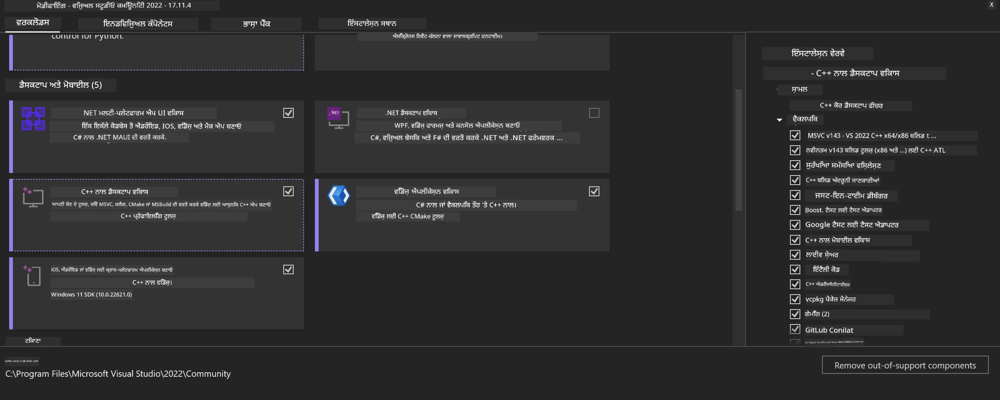
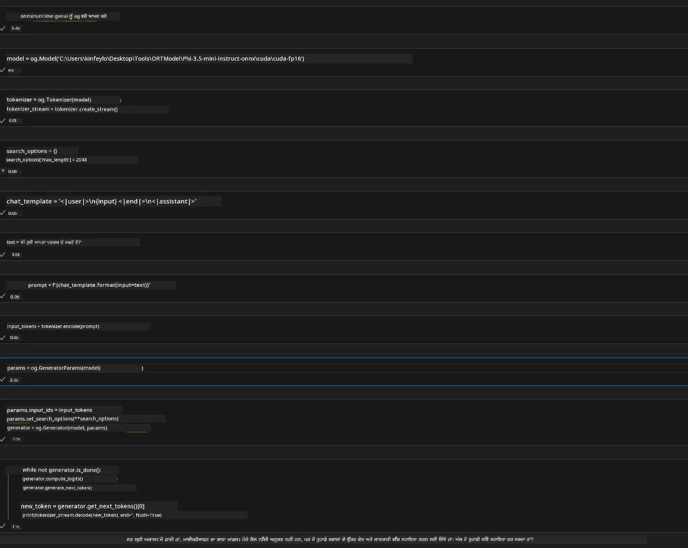
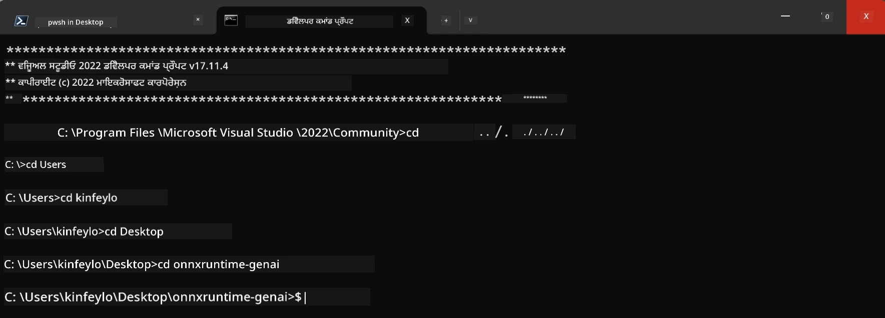

<!--
CO_OP_TRANSLATOR_METADATA:
{
  "original_hash": "b066fc29c1b2129df84e027cb75119ce",
  "translation_date": "2025-07-17T02:42:01+00:00",
  "source_file": "md/02.Application/01.TextAndChat/Phi3/ORTWindowGPUGuideline.md",
  "language_code": "pa"
}
-->
# **OnnxRuntime GenAI Windows GPU ਲਈ ਮਾਰਗਦਰਸ਼ਕ**

ਇਹ ਮਾਰਗਦਰਸ਼ਕ Windows 'ਤੇ GPUs ਨਾਲ ONNX Runtime (ORT) ਸੈਟਅਪ ਅਤੇ ਵਰਤੋਂ ਲਈ ਕਦਮ ਦਿੰਦਾ ਹੈ। ਇਹ ਤੁਹਾਡੇ ਮਾਡਲਾਂ ਲਈ GPU ਤੇਜ਼ੀ ਦਾ ਲਾਭ ਉਠਾਉਣ ਵਿੱਚ ਮਦਦ ਕਰਦਾ ਹੈ, ਜਿਸ ਨਾਲ ਪ੍ਰਦਰਸ਼ਨ ਅਤੇ ਕੁਸ਼ਲਤਾ ਵਿੱਚ ਸੁਧਾਰ ਹੁੰਦਾ ਹੈ।

ਦਸਤਾਵੇਜ਼ ਵਿੱਚ ਦਿੱਤੀ ਗਈ ਸਲਾਹਾਂ ਹਨ:

- ਵਾਤਾਵਰਣ ਸੈਟਅਪ: CUDA, cuDNN ਅਤੇ ONNX Runtime ਵਰਗੀਆਂ ਲੋੜੀਂਦੀਆਂ ਡਿਪੈਂਡੈਂਸੀਜ਼ ਇੰਸਟਾਲ ਕਰਨ ਲਈ ਹਦਾਇਤਾਂ।
- ਸੰਰਚਨਾ: ਵਾਤਾਵਰਣ ਅਤੇ ONNX Runtime ਨੂੰ GPU ਸਰੋਤਾਂ ਦੀ ਪ੍ਰਭਾਵਸ਼ਾਲੀ ਵਰਤੋਂ ਲਈ ਕਿਵੇਂ ਸੰਰਚਿਤ ਕਰਨਾ ਹੈ।
- ਅਪਟੀਮਾਈਜ਼ੇਸ਼ਨ ਟਿਪਸ: ਆਪਣੇ GPU ਸੈਟਿੰਗਜ਼ ਨੂੰ ਵਧੀਆ ਪ੍ਰਦਰਸ਼ਨ ਲਈ ਕਿਵੇਂ ਸੁਧਾਰਨਾ ਹੈ।

### **1. Python 3.10.x /3.11.8**

   ***Note*** ਆਪਣੇ Python ਵਾਤਾਵਰਣ ਲਈ [miniforge](https://github.com/conda-forge/miniforge/releases/latest/download/Miniforge3-Windows-x86_64.exe) ਦੀ ਵਰਤੋਂ ਕਰਨ ਦੀ ਸਿਫਾਰਸ਼ ਕੀਤੀ ਜਾਂਦੀ ਹੈ

   ```bash

   conda create -n pydev python==3.11.8

   conda activate pydev

   ```

   ***Reminder*** ਜੇ ਤੁਸੀਂ Python ONNX ਲਾਇਬ੍ਰੇਰੀ ਇੰਸਟਾਲ ਕੀਤੀ ਹੈ, ਤਾਂ ਕਿਰਪਾ ਕਰਕੇ ਉਸਨੂੰ ਅਣਇੰਸਟਾਲ ਕਰੋ

### **2. winget ਨਾਲ CMake ਇੰਸਟਾਲ ਕਰੋ**


   ```bash

   winget install -e --id Kitware.CMake

   ```

### **3. Visual Studio 2022 - Desktop Development with C++ ਇੰਸਟਾਲ ਕਰੋ**

   ***Note*** ਜੇ ਤੁਸੀਂ ਕੰਪਾਈਲ ਨਹੀਂ ਕਰਨਾ ਚਾਹੁੰਦੇ ਤਾਂ ਇਸ ਕਦਮ ਨੂੰ ਛੱਡ ਸਕਦੇ ਹੋ




### **4. NVIDIA ਡਰਾਈਵਰ ਇੰਸਟਾਲ ਕਰੋ**

1. **NVIDIA GPU Driver**  [https://www.nvidia.com/en-us/drivers/](https://www.nvidia.com/en-us/drivers/)

2. **NVIDIA CUDA 12.4** [https://developer.nvidia.com/cuda-12-4-0-download-archive](https://developer.nvidia.com/cuda-12-4-0-download-archive)

3. **NVIDIA CUDNN 9.4**  [https://developer.nvidia.com/cudnn-downloads](https://developer.nvidia.com/cudnn-downloads)

***Reminder*** ਇੰਸਟਾਲੇਸ਼ਨ ਦੌਰਾਨ ਡਿਫਾਲਟ ਸੈਟਿੰਗਜ਼ ਦੀ ਵਰਤੋਂ ਕਰੋ

### **5. NVIDIA ਵਾਤਾਵਰਣ ਸੈਟ ਕਰੋ**

NVIDIA CUDNN 9.4 ਦੇ lib, bin, include ਫਾਈਲਾਂ ਨੂੰ NVIDIA CUDA 12.4 ਦੇ lib, bin, include ਵਿੱਚ ਕਾਪੀ ਕਰੋ

- *'C:\Program Files\NVIDIA\CUDNN\v9.4\bin\12.6'* ਦੀਆਂ ਫਾਈਲਾਂ ਨੂੰ *'C:\Program Files\NVIDIA GPU Computing Toolkit\CUDA\v12.4\bin'* ਵਿੱਚ ਕਾਪੀ ਕਰੋ

- *'C:\Program Files\NVIDIA\CUDNN\v9.4\include\12.6'* ਦੀਆਂ ਫਾਈਲਾਂ ਨੂੰ *'C:\Program Files\NVIDIA GPU Computing Toolkit\CUDA\v12.4\include'* ਵਿੱਚ ਕਾਪੀ ਕਰੋ

- *'C:\Program Files\NVIDIA\CUDNN\v9.4\lib\12.6'* ਦੀਆਂ ਫਾਈਲਾਂ ਨੂੰ *'C:\Program Files\NVIDIA GPU Computing Toolkit\CUDA\v12.4\lib\x64'* ਵਿੱਚ ਕਾਪੀ ਕਰੋ


### **6. Phi-3.5-mini-instruct-onnx ਡਾਊਨਲੋਡ ਕਰੋ**


   ```bash

   winget install -e --id Git.Git

   winget install -e --id GitHub.GitLFS

   git lfs install

   git clone https://huggingface.co/microsoft/Phi-3.5-mini-instruct-onnx

   ```

### **7. InferencePhi35Instruct.ipynb ਚਲਾਓ**

   [Notebook](../../../../../../code/09.UpdateSamples/Aug/ortgpu-phi35-instruct.ipynb) ਖੋਲ੍ਹੋ ਅਤੇ ਚਲਾਓ





### **8. ORT GenAI GPU ਕੰਪਾਈਲ ਕਰੋ**


   ***Note*** 
   
   1. ਕਿਰਪਾ ਕਰਕੇ ਪਹਿਲਾਂ onnx, onnxruntime ਅਤੇ onnxruntime-genai ਸਬੰਧੀ ਸਾਰੀਆਂ ਲਾਇਬ੍ਰੇਰੀਆਂ ਅਣਇੰਸਟਾਲ ਕਰੋ

   
   ```bash

   pip list 
   
   ```

   ਫਿਰ ਸਾਰੀਆਂ onnxruntime ਲਾਇਬ੍ਰੇਰੀਆਂ ਅਣਇੰਸਟਾਲ ਕਰੋ ਜਿਵੇਂ ਕਿ 


   ```bash

   pip uninstall onnxruntime

   pip uninstall onnxruntime-genai

   pip uninstall onnxruntume-genai-cuda
   
   ```

   2. Visual Studio Extension ਸਹਾਇਤਾ ਦੀ ਜਾਂਚ ਕਰੋ

   C:\Program Files\NVIDIA GPU Computing Toolkit\CUDA\v12.4\extras ਵਿੱਚ ਜਾਂਚ ਕਰੋ ਕਿ C:\Program Files\NVIDIA GPU Computing Toolkit\CUDA\v12.4\extras\visual_studio_integration ਮੌਜੂਦ ਹੈ। 
   
   ਜੇ ਨਹੀਂ ਮਿਲਦਾ, ਤਾਂ ਹੋਰ CUDA toolkit ਡਰਾਈਵਰ ਫੋਲਡਰਾਂ ਵਿੱਚ ਖੋਜੋ ਅਤੇ visual_studio_integration ਫੋਲਡਰ ਅਤੇ ਇਸਦੇ ਸਮੱਗਰੀ ਨੂੰ C:\Program Files\NVIDIA GPU Computing Toolkit\CUDA\v12.4\extras\visual_studio_integration ਵਿੱਚ ਕਾਪੀ ਕਰੋ


   - ਜੇ ਤੁਸੀਂ ਕੰਪਾਈਲ ਨਹੀਂ ਕਰਨਾ ਚਾਹੁੰਦੇ ਤਾਂ ਇਸ ਕਦਮ ਨੂੰ ਛੱਡ ਸਕਦੇ ਹੋ


   ```bash

   git clone https://github.com/microsoft/onnxruntime-genai

   ```

   - [https://github.com/microsoft/onnxruntime/releases/download/v1.19.2/onnxruntime-win-x64-gpu-1.19.2.zip](https://github.com/microsoft/onnxruntime/releases/download/v1.19.2/onnxruntime-win-x64-gpu-1.19.2.zip) ਤੋਂ ਡਾਊਨਲੋਡ ਕਰੋ

   - onnxruntime-win-x64-gpu-1.19.2.zip ਨੂੰ ਅਨਜ਼ਿਪ ਕਰੋ, ਇਸਦਾ ਨਾਮ **ort** ਰੱਖੋ ਅਤੇ ort ਫੋਲਡਰ ਨੂੰ onnxruntime-genai ਵਿੱਚ ਕਾਪੀ ਕਰੋ

   - Windows Terminal ਦੀ ਵਰਤੋਂ ਕਰਦੇ ਹੋਏ, VS 2022 ਲਈ Developer Command Prompt ਖੋਲ੍ਹੋ ਅਤੇ onnxruntime-genai ਵਿੱਚ ਜਾਓ



   - ਆਪਣੇ Python ਵਾਤਾਵਰਣ ਨਾਲ ਇਸਨੂੰ ਕੰਪਾਈਲ ਕਰੋ

   
   ```bash

   cd onnxruntime-genai

   python build.py --use_cuda  --cuda_home "C:\Program Files\NVIDIA GPU Computing Toolkit\CUDA\v12.4" --config Release
 

   cd build/Windows/Release/Wheel

   pip install .whl

   ```

**ਅਸਵੀਕਾਰੋਪੱਤਰ**:  
ਇਹ ਦਸਤਾਵੇਜ਼ AI ਅਨੁਵਾਦ ਸੇਵਾ [Co-op Translator](https://github.com/Azure/co-op-translator) ਦੀ ਵਰਤੋਂ ਕਰਕੇ ਅਨੁਵਾਦਿਤ ਕੀਤਾ ਗਿਆ ਹੈ। ਜਦੋਂ ਕਿ ਅਸੀਂ ਸਹੀਤਾ ਲਈ ਕੋਸ਼ਿਸ਼ ਕਰਦੇ ਹਾਂ, ਕਿਰਪਾ ਕਰਕੇ ਧਿਆਨ ਰੱਖੋ ਕਿ ਸਵੈਚਾਲਿਤ ਅਨੁਵਾਦਾਂ ਵਿੱਚ ਗਲਤੀਆਂ ਜਾਂ ਅਸਮਰਥਤਾਵਾਂ ਹੋ ਸਕਦੀਆਂ ਹਨ। ਮੂਲ ਦਸਤਾਵੇਜ਼ ਆਪਣੀ ਮੂਲ ਭਾਸ਼ਾ ਵਿੱਚ ਪ੍ਰਮਾਣਿਕ ਸਰੋਤ ਮੰਨਿਆ ਜਾਣਾ ਚਾਹੀਦਾ ਹੈ। ਮਹੱਤਵਪੂਰਨ ਜਾਣਕਾਰੀ ਲਈ, ਪੇਸ਼ੇਵਰ ਮਨੁੱਖੀ ਅਨੁਵਾਦ ਦੀ ਸਿਫਾਰਸ਼ ਕੀਤੀ ਜਾਂਦੀ ਹੈ। ਅਸੀਂ ਇਸ ਅਨੁਵਾਦ ਦੀ ਵਰਤੋਂ ਤੋਂ ਉਤਪੰਨ ਕਿਸੇ ਵੀ ਗਲਤਫਹਿਮੀ ਜਾਂ ਗਲਤ ਵਿਆਖਿਆ ਲਈ ਜ਼ਿੰਮੇਵਾਰ ਨਹੀਂ ਹਾਂ।