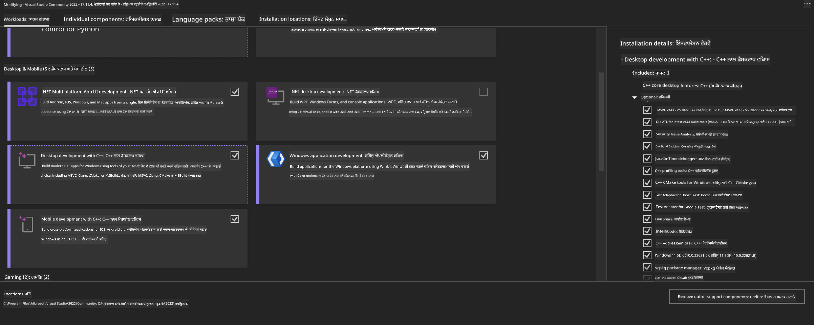
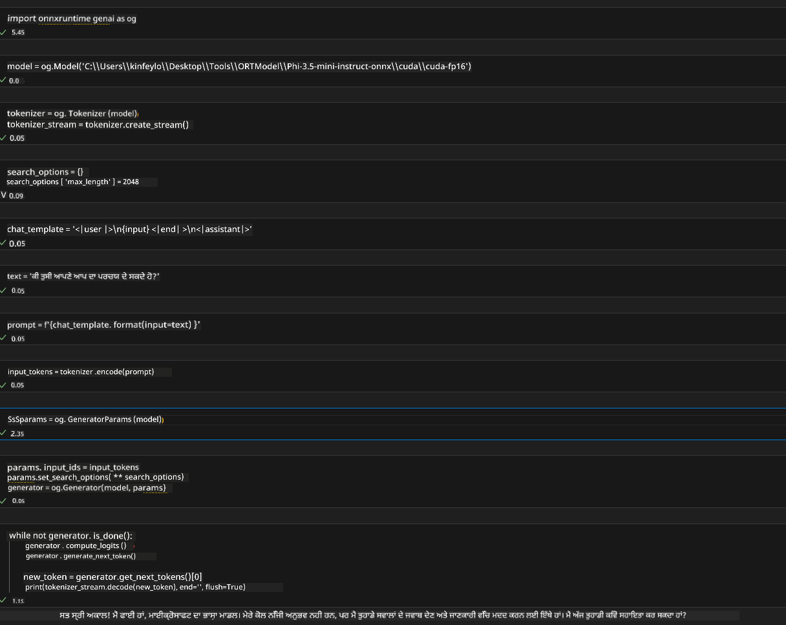
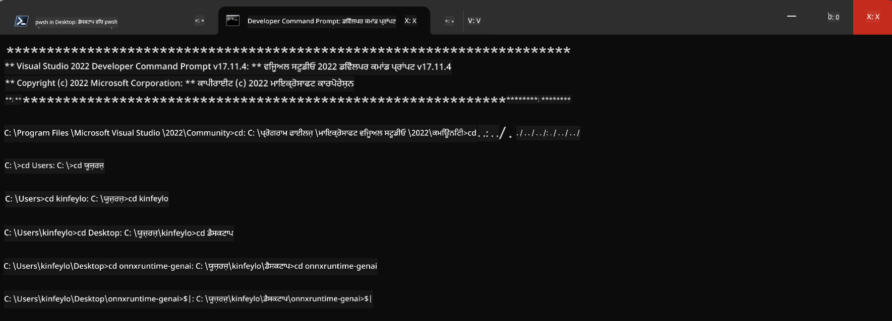

<!--
CO_OP_TRANSLATOR_METADATA:
{
  "original_hash": "b066fc29c1b2129df84e027cb75119ce",
  "translation_date": "2025-05-09T18:42:26+00:00",
  "source_file": "md/02.Application/01.TextAndChat/Phi3/ORTWindowGPUGuideline.md",
  "language_code": "pa"
}
-->
# **OnnxRuntime GenAI Windows GPU ਲਈ ਮਾਰਗਦਰਸ਼ਕ**

ਇਹ ਮਾਰਗਦਰਸ਼ਕ Windows 'ਤੇ GPUs ਨਾਲ ONNX Runtime (ORT) ਸੈੱਟਅੱਪ ਅਤੇ ਵਰਤੋਂ ਦੇ ਕਦਮ ਦਿੰਦਾ ਹੈ। ਇਹ ਤੁਹਾਡੇ ਮਾਡਲਾਂ ਲਈ GPU ਤੀਬਰਤਾ ਦੀ ਵਰਤੋਂ ਕਰਨ ਵਿੱਚ ਮਦਦ ਕਰਨ ਲਈ ਬਣਾਇਆ ਗਿਆ ਹੈ, ਜਿਸ ਨਾਲ ਪ੍ਰਦਰਸ਼ਨ ਅਤੇ ਕੁਸ਼ਲਤਾ ਵਿੱਚ ਸੁਧਾਰ ਹੁੰਦਾ ਹੈ।

ਦਸਤਾਵੇਜ਼ ਵਿੱਚ ਹੇਠਾਂ ਦਿੱਤੀ ਗਾਈਡਲਾਈਨ ਹੈ:

- ਵਾਤਾਵਰਣ ਸੈੱਟਅੱਪ: CUDA, cuDNN, ਅਤੇ ONNX Runtime ਵਰਗੀਆਂ ਲੋੜੀਂਦੀਆਂ ਡਿਪੈਂਡੈਂਸੀਜ਼ ਇੰਸਟਾਲ ਕਰਨ ਦੇ ਨਿਰਦੇਸ਼।
- ਸੰਰਚਨਾ: GPU ਸਰੋਤਾਂ ਨੂੰ ਪ੍ਰਭਾਵਸ਼ালী ਢੰਗ ਨਾਲ ਵਰਤਣ ਲਈ ਵਾਤਾਵਰਣ ਅਤੇ ONNX Runtime ਨੂੰ ਕਿਵੇਂ ਸੰਰਚਿਤ ਕਰਨਾ ਹੈ।
- ਬਿਹਤਰੀ ਦੇ ਸੁਝਾਅ: ਆਪਣੀ GPU ਸੈਟਿੰਗਾਂ ਨੂੰ ਬਿਹਤਰ ਪ੍ਰਦਰਸ਼ਨ ਲਈ ਕਿਵੇਂ ਟਿਊਨ ਕਰਨਾ ਹੈ।

### **1. Python 3.10.x /3.11.8**

   ***Note*** ਆਪਣਾ Python ਵਾਤਾਵਰਣ ਬਣਾਉਣ ਲਈ [miniforge](https://github.com/conda-forge/miniforge/releases/latest/download/Miniforge3-Windows-x86_64.exe) ਦੀ ਸਿਫਾਰਸ਼ ਕੀਤੀ ਜਾਂਦੀ ਹੈ

   ```bash

   conda create -n pydev python==3.11.8

   conda activate pydev

   ```

   ***Reminder*** ਜੇ ਤੁਸੀਂ ਪਹਿਲਾਂ Python ONNX ਲਾਇਬ੍ਰੇਰੀ ਇੰਸਟਾਲ ਕੀਤੀ ਹੈ, ਤਾਂ ਕਿਰਪਾ ਕਰਕੇ ਉਸਨੂੰ ਅਣਇੰਸਟਾਲ ਕਰੋ

### **2. winget ਨਾਲ CMake ਇੰਸਟਾਲ ਕਰੋ**


   ```bash

   winget install -e --id Kitware.CMake

   ```

### **3. Visual Studio 2022 - Desktop Development with C++ ਇੰਸਟਾਲ ਕਰੋ**

   ***Note*** ਜੇ ਤੁਸੀਂ ਕੰਪਾਇਲ ਨਹੀਂ ਕਰਨਾ ਚਾਹੁੰਦੇ ਤਾਂ ਇਹ ਕਦਮ ਛੱਡ ਸਕਦੇ ਹੋ




### **4. NVIDIA ਡਰਾਈਵਰ ਇੰਸਟਾਲ ਕਰੋ**

1. **NVIDIA GPU Driver**  [https://www.nvidia.com/en-us/drivers/](https://www.nvidia.com/en-us/drivers/)

2. **NVIDIA CUDA 12.4** [https://developer.nvidia.com/cuda-12-4-0-download-archive](https://developer.nvidia.com/cuda-12-4-0-download-archive)

3. **NVIDIA CUDNN 9.4**  [https://developer.nvidia.com/cudnn-downloads](https://developer.nvidia.com/cudnn-downloads)

***Reminder*** ਇੰਸਟਾਲੇਸ਼ਨ ਦੌਰਾਨ ਡਿਫਾਲਟ ਸੈਟਿੰਗਾਂ ਦੀ ਵਰਤੋਂ ਕਰੋ

### **5. NVIDIA ਵਾਤਾਵਰਣ ਸੈੱਟ ਕਰੋ**

NVIDIA CUDNN 9.4 ਦੇ lib, bin, include ਫਾਈਲਾਂ ਨੂੰ NVIDIA CUDA 12.4 ਦੇ lib, bin, include ਵਿੱਚ ਕਾਪੀ ਕਰੋ

- *'C:\Program Files\NVIDIA\CUDNN\v9.4\bin\12.6'* ਦੀਆਂ ਫਾਈਲਾਂ ਨੂੰ *'C:\Program Files\NVIDIA GPU Computing Toolkit\CUDA\v12.4\bin'* ਵਿੱਚ ਕਾਪੀ ਕਰੋ

- *'C:\Program Files\NVIDIA\CUDNN\v9.4\include\12.6'* ਦੀਆਂ ਫਾਈਲਾਂ ਨੂੰ *'C:\Program Files\NVIDIA GPU Computing Toolkit\CUDA\v12.4\include'* ਵਿੱਚ ਕਾਪੀ ਕਰੋ

- *'C:\Program Files\NVIDIA\CUDNN\v9.4\lib\12.6'* ਦੀਆਂ ਫਾਈਲਾਂ ਨੂੰ *'C:\Program Files\NVIDIA GPU Computing Toolkit\CUDA\v12.4\lib\x64'* ਵਿੱਚ ਕਾਪੀ ਕਰੋ


### **6. Phi-3.5-mini-instruct-onnx ਡਾਊਨਲੋਡ ਕਰੋ**


   ```bash

   winget install -e --id Git.Git

   winget install -e --id GitHub.GitLFS

   git lfs install

   git clone https://huggingface.co/microsoft/Phi-3.5-mini-instruct-onnx

   ```

### **7. InferencePhi35Instruct.ipynb ਚਲਾਓ**

   [Notebook](../../../../../../code/09.UpdateSamples/Aug/ortgpu-phi35-instruct.ipynb) ਖੋਲ੍ਹੋ ਅਤੇ ਚਲਾਓ





### **8. ORT GenAI GPU ਕੰਪਾਇਲ ਕਰੋ**


   ***Note*** 
   
   1. ਸਭ ONNX, onnxruntime ਅਤੇ onnxruntime-genai ਲਾਇਬ੍ਰੇਰੀਆਂ ਪਹਿਲਾਂ ਅਣਇੰਸਟਾਲ ਕਰੋ

   
   ```bash

   pip list 
   
   ```

   ਫਿਰ ਸਾਰੇ onnxruntime ਲਾਇਬ੍ਰੇਰੀਆਂ ਨੂੰ ਅਣਇੰਸਟਾਲ ਕਰੋ ਜਿਵੇਂ ਕਿ 


   ```bash

   pip uninstall onnxruntime

   pip uninstall onnxruntime-genai

   pip uninstall onnxruntume-genai-cuda
   
   ```

   2. Visual Studio ਐਕਸਟੈਂਸ਼ਨ ਸਹਾਇਤਾ ਚੈੱਕ ਕਰੋ 

   C:\Program Files\NVIDIA GPU Computing Toolkit\CUDA\v12.4\extras ਵਿੱਚ ਜਾਂਚੋ ਕਿ C:\Program Files\NVIDIA GPU Computing Toolkit\CUDA\v12.4\extras\visual_studio_integration ਮੌਜੂਦ ਹੈ। 
   
   ਜੇ ਨਹੀਂ ਮਿਲਦਾ, ਤਾਂ ਹੋਰ CUDA ਟੂਲਕਿਟ ਡਰਾਈਵਰ ਫੋਲਡਰਾਂ ਵਿੱਚ ਖੋਜੋ ਅਤੇ visual_studio_integration ਫੋਲਡਰ ਅਤੇ ਇਸਦੇ ਸਮੱਗਰੀ ਨੂੰ C:\Program Files\NVIDIA GPU Computing Toolkit\CUDA\v12.4\extras\visual_studio_integration ਵਿੱਚ ਕਾਪੀ ਕਰੋ


   - ਜੇ ਤੁਸੀਂ ਕੰਪਾਇਲ ਨਹੀਂ ਕਰਨਾ ਚਾਹੁੰਦੇ ਤਾਂ ਇਹ ਕਦਮ ਛੱਡ ਸਕਦੇ ਹੋ


   ```bash

   git clone https://github.com/microsoft/onnxruntime-genai

   ```

   - [https://github.com/microsoft/onnxruntime/releases/download/v1.19.2/onnxruntime-win-x64-gpu-1.19.2.zip](https://github.com/microsoft/onnxruntime/releases/download/v1.19.2/onnxruntime-win-x64-gpu-1.19.2.zip) ਤੋਂ ਡਾਊਨਲੋਡ ਕਰੋ

   - onnxruntime-win-x64-gpu-1.19.2.zip ਨੂੰ ਅਨਜ਼ਿਪ ਕਰੋ, ਇਸਨੂੰ **ort** ਨਾਲ ਰੀਨੇਮ ਕਰੋ ਅਤੇ ort ਫੋਲਡਰ ਨੂੰ onnxruntime-genai ਵਿੱਚ ਕਾਪੀ ਕਰੋ

   - Windows Terminal ਵਿੱਚ ਜਾ ਕੇ Developer Command Prompt for VS 2022 ਖੋਲ੍ਹੋ ਅਤੇ onnxruntime-genai ਵਿੱਚ ਜਾਓ



   - ਆਪਣੇ python ਵਾਤਾਵਰਣ ਨਾਲ ਇਸਨੂੰ ਕੰਪਾਇਲ ਕਰੋ

   
   ```bash

   cd onnxruntime-genai

   python build.py --use_cuda  --cuda_home "C:\Program Files\NVIDIA GPU Computing Toolkit\CUDA\v12.4" --config Release
 

   cd build/Windows/Release/Wheel

   pip install .whl

   ```

**ਅਸਵੀਕਾਰੋ:**
ਇਹ ਦਸਤਾਵੇਜ਼ AI ਅਨੁਵਾਦ ਸੇਵਾ [Co-op Translator](https://github.com/Azure/co-op-translator) ਦੀ ਵਰਤੋਂ ਨਾਲ ਅਨੁਵਾਦ ਕੀਤਾ ਗਿਆ ਹੈ। ਜਦੋਂ ਕਿ ਅਸੀਂ ਸਹੀਅਤ ਲਈ ਕੋਸ਼ਿਸ਼ ਕਰਦੇ ਹਾਂ, ਕਿਰਪਾ ਕਰਕੇ ਧਿਆਨ ਰੱਖੋ ਕਿ ਸਵੈਚਾਲਿਤ ਅਨੁਵਾਦਾਂ ਵਿੱਚ ਗਲਤੀਆਂ ਜਾਂ ਅਸਤੀਕਤਾਵਾਂ ਹੋ ਸਕਦੀਆਂ ਹਨ। ਮੂਲ ਦਸਤਾਵੇਜ਼ ਆਪਣੀ ਮੂਲ ਭਾਸ਼ਾ ਵਿੱਚ ਪ੍ਰਮਾਣਿਕ ਸਰੋਤ ਮੰਨਿਆ ਜਾਣਾ ਚਾਹੀਦਾ ਹੈ। ਮਹੱਤਵਪੂਰਨ ਜਾਣਕਾਰੀ ਲਈ, ਪੇਸ਼ੇਵਰ ਮਨੁੱਖੀ ਅਨੁਵਾਦ ਦੀ ਸਿਫਾਰਿਸ਼ ਕੀਤੀ ਜਾਂਦੀ ਹੈ। ਇਸ ਅਨੁਵਾਦ ਦੀ ਵਰਤੋਂ ਨਾਲ ਪੈਦ ਹੋਣ ਵਾਲੀਆਂ ਕਿਸੇ ਵੀ ਗਲਤਫਹਿਮੀਆਂ ਜਾਂ ਭ੍ਰਮਾਂ ਲਈ ਅਸੀਂ ਜ਼ਿੰਮੇਵਾਰ ਨਹੀਂ ਹਾਂ।