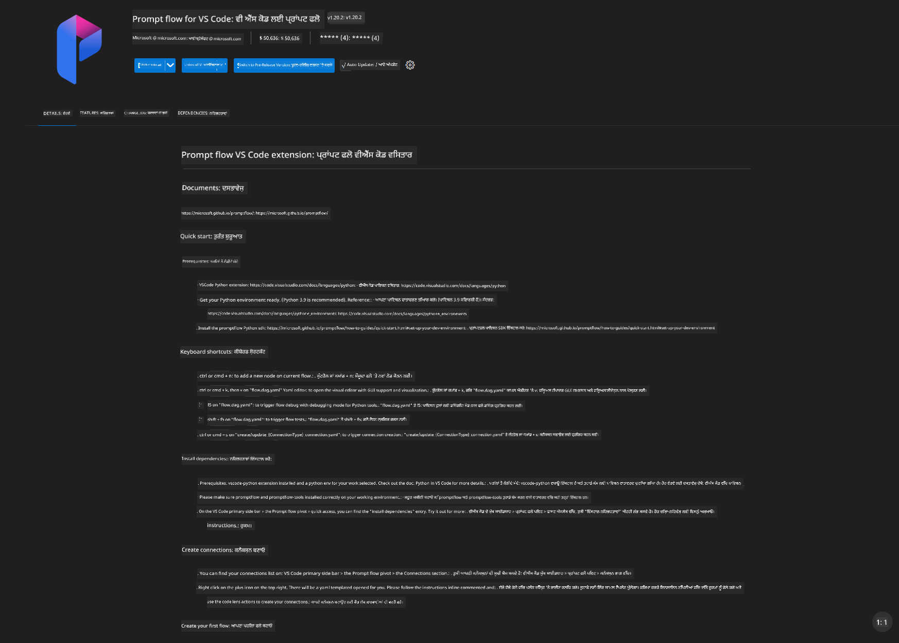
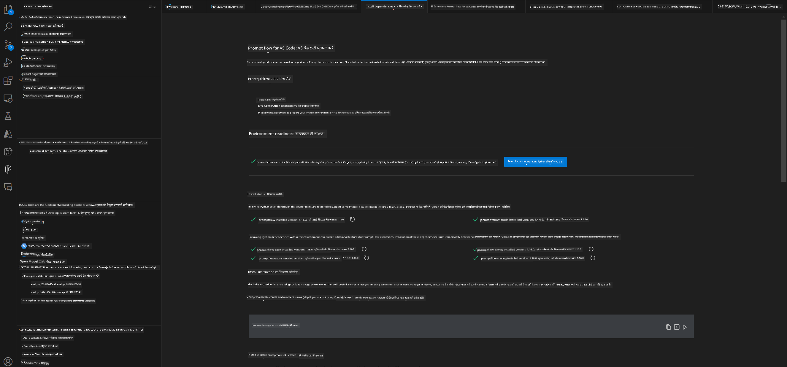
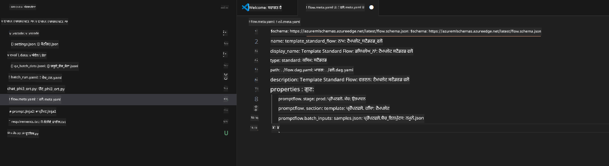
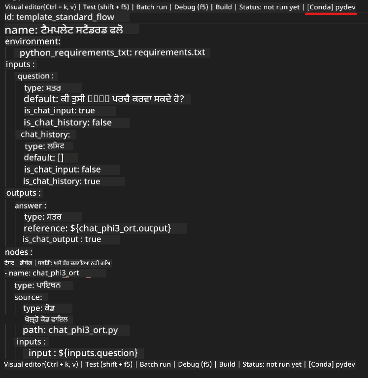
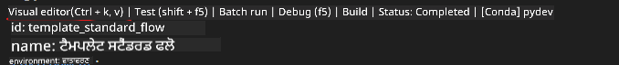
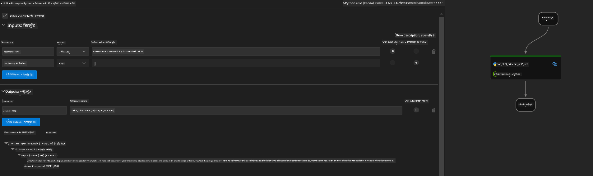
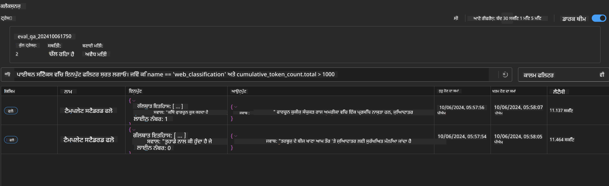

<!--
CO_OP_TRANSLATOR_METADATA:
{
  "original_hash": "92e7dac1e5af0dd7c94170fdaf6860fe",
  "translation_date": "2025-05-09T18:51:57+00:00",
  "source_file": "md/02.Application/01.TextAndChat/Phi3/UsingPromptFlowWithONNX.md",
  "language_code": "pa"
}
-->
# Windows GPU ਨਾਲ Phi-3.5-Instruct ONNX ਦੇ ਨਾਲ Prompt flow ਹੱਲ ਬਣਾਉਣਾ

ਹੇਠਾਂ ਦਿੱਤਾ ਦਸਤਾਵੇਜ਼ ਦਿਖਾਉਂਦਾ ਹੈ ਕਿ ਕਿਵੇਂ PromptFlow ਨੂੰ ONNX (Open Neural Network Exchange) ਨਾਲ ਵਰਤ ਕੇ Phi-3 ਮਾਡਲਾਂ ਅਧਾਰਿਤ AI ਐਪਲੀਕੇਸ਼ਨਾਂ ਦਾ ਵਿਕਾਸ ਕੀਤਾ ਜਾ ਸਕਦਾ ਹੈ।

PromptFlow ਵਿਕਾਸ ਦੇ ਸਾਧਨਾਂ ਦਾ ਇੱਕ ਸੈੱਟ ਹੈ ਜੋ LLM-ਅਧਾਰਿਤ (Large Language Model) AI ਐਪਲੀਕੇਸ਼ਨਾਂ ਦੇ ਆਈਡੀਆ ਤੋਂ ਲੈ ਕੇ ਪ੍ਰੋਟੋਟਾਈਪਿੰਗ, ਟੈਸਟਿੰਗ ਅਤੇ ਮੁਲਾਂਕਣ ਤੱਕ ਦੇ ਪੂਰੇ ਵਿਕਾਸ ਚੱਕਰ ਨੂੰ ਆਸਾਨ ਬਣਾਉਂਦਾ ਹੈ।

PromptFlow ਨੂੰ ONNX ਨਾਲ ਜੋੜ ਕੇ ਵਿਕਾਸਕਾਰ ਇਹ ਕਰ ਸਕਦੇ ਹਨ:

- ਮਾਡਲ ਪ੍ਰਦਰਸ਼ਨ ਦਾ ਸੁਧਾਰ: ONNX ਦੀ ਵਰਤੋਂ ਕਰਕੇ ਮਾਡਲ ਦੀ ਕੁਸ਼ਲ ਇੰਫਰੰਸ ਅਤੇ ਡਿਪਲੌਇਮੈਂਟ ਕਰੋ।
- ਵਿਕਾਸ ਨੂੰ ਸਧਾਰਣ ਬਣਾਉਣਾ: PromptFlow ਦੀ ਮਦਦ ਨਾਲ ਵਰਕਫਲੋ ਨੂੰ ਮੈਨੇਜ ਕਰੋ ਅਤੇ ਦੋਹਰਾਏ ਜਾਣ ਵਾਲੇ ਕੰਮਾਂ ਨੂੰ ਆਟੋਮੇਟ ਕਰੋ।
- ਸਹਿਯੋਗ ਨੂੰ ਵਧਾਵੋ: ਟੀਮ ਮੈਂਬਰਾਂ ਵਿਚਕਾਰ ਬਿਹਤਰ ਸਹਿਯੋਗ ਲਈ ਇੱਕ ਏਕਜੁਟ ਵਿਕਾਸ ਮਾਹੌਲ ਮੁਹੱਈਆ ਕਰੋ।

**Prompt flow** ਵਿਕਾਸ ਦੇ ਸਾਧਨਾਂ ਦਾ ਇੱਕ ਸੈੱਟ ਹੈ ਜੋ LLM-ਅਧਾਰਿਤ AI ਐਪਲੀਕੇਸ਼ਨਾਂ ਦੇ ਆਈਡੀਆ, ਪ੍ਰੋਟੋਟਾਈਪਿੰਗ, ਟੈਸਟਿੰਗ, ਮੁਲਾਂਕਣ ਤੋਂ ਲੈ ਕੇ ਉਤਪਾਦਨ ਤੱਕ ਦੇ ਪੂਰੇ ਵਿਕਾਸ ਚੱਕਰ ਨੂੰ ਆਸਾਨ ਬਣਾਉਂਦਾ ਹੈ। ਇਹ prompt engineering ਨੂੰ ਬਹੁਤ ਆਸਾਨ ਬਣਾਉਂਦਾ ਹੈ ਅਤੇ ਤੁਹਾਨੂੰ ਉਤਪਾਦਨ ਮਿਆਰ ਵਾਲੀਆਂ LLM ਐਪ ਬਣਾਉਣ ਦੀ ਸਹੂਲਤ ਦਿੰਦਾ ਹੈ।

Prompt flow OpenAI, Azure OpenAI Service ਅਤੇ ਕਸਟਮ ਮਾਡਲਾਂ (Huggingface, ਸਥਾਨਕ LLM/SLM) ਨਾਲ ਜੁੜ ਸਕਦਾ ਹੈ। ਅਸੀਂ Phi-3.5 ਦੇ quantized ONNX ਮਾਡਲ ਨੂੰ ਸਥਾਨਕ ਐਪਲੀਕੇਸ਼ਨਾਂ ਵਿੱਚ ਡਿਪਲੌਇ ਕਰਨ ਦੀ ਆਸ ਕਰਦੇ ਹਾਂ। Prompt flow ਸਾਡੇ ਕਾਰੋਬਾਰ ਦੀ ਯੋਜਨਾ ਬਣਾਉਣ ਅਤੇ Phi-3.5 ਅਧਾਰਿਤ ਸਥਾਨਕ ਹੱਲ ਪੂਰੇ ਕਰਨ ਵਿੱਚ ਮਦਦ ਕਰ ਸਕਦਾ ਹੈ। ਇਸ ਉਦਾਹਰਣ ਵਿੱਚ, ਅਸੀਂ Windows GPU ਤੇ ਆਧਾਰਿਤ Prompt flow ਹੱਲ ਪੂਰਾ ਕਰਨ ਲਈ ONNX Runtime GenAI ਲਾਇਬ੍ਰੇਰੀ ਨੂੰ ਜੋੜਾਂਗੇ।

## **ਇੰਸਟਾਲੇਸ਼ਨ**

### **Windows GPU ਲਈ ONNX Runtime GenAI**

Windows GPU ਲਈ ONNX Runtime GenAI ਸੈੱਟ ਕਰਨ ਲਈ ਇਹ ਗਾਈਡ ਪੜ੍ਹੋ [click here](./ORTWindowGPUGuideline.md)

### **VSCode ਵਿੱਚ Prompt flow ਸੈੱਟ ਕਰੋ**

1. Prompt flow VS Code Extension ਇੰਸਟਾਲ ਕਰੋ



2. Prompt flow VS Code Extension ਇੰਸਟਾਲ ਕਰਨ ਤੋਂ ਬਾਅਦ, extension ਤੇ ਕਲਿੱਕ ਕਰੋ ਅਤੇ **Installation dependencies** ਚੁਣੋ, ਇਸ ਗਾਈਡ ਨੂੰ ਫਾਲੋ ਕਰਕੇ ਆਪਣੇ env ਵਿੱਚ Prompt flow SDK ਇੰਸਟਾਲ ਕਰੋ



3. [Sample Code](../../../../../../code/09.UpdateSamples/Aug/pf/onnx_inference_pf) ਡਾਊਨਲੋਡ ਕਰੋ ਅਤੇ VS Code ਨਾਲ ਇਹ ਸੈਂਪਲ ਖੋਲ੍ਹੋ



4. ਆਪਣਾ Python env ਚੁਣਨ ਲਈ **flow.dag.yaml** ਖੋਲ੍ਹੋ



   ਆਪਣਾ Phi-3.5-instruct ONNX ਮਾਡਲ ਦੀ ਲੋਕੇਸ਼ਨ ਬਦਲਣ ਲਈ **chat_phi3_ort.py** ਖੋਲ੍ਹੋ


5. Prompt flow ਚਲਾਕੇ ਟੈਸਟ ਕਰੋ

**flow.dag.yaml** ਖੋਲ੍ਹੋ ਅਤੇ visual editor 'ਤੇ ਕਲਿੱਕ ਕਰੋ



ਇਸ 'ਤੇ ਕਲਿੱਕ ਕਰਨ ਤੋਂ ਬਾਅਦ, ਚਲਾਓ ਅਤੇ ਟੈਸਟ ਕਰੋ



1. ਹੋਰ ਨਤੀਜੇ ਦੇਖਣ ਲਈ ਤੁਸੀਂ ਟਰਮੀਨਲ ਵਿੱਚ batch ਚਲਾ ਸਕਦੇ ਹੋ

```bash

pf run create --file batch_run.yaml --stream --name 'Your eval qa name'    

```

ਤੁਸੀਂ ਆਪਣੇ ਡਿਫਾਲਟ ਬ੍ਰਾਊਜ਼ਰ ਵਿੱਚ ਨਤੀਜੇ ਵੇਖ ਸਕਦੇ ਹੋ



**ਅਸਵੀਕਾਰੋਪਣ**:  
ਇਹ ਦਸਤਾਵੇਜ਼ AI ਅਨੁਵਾਦ ਸੇਵਾ [Co-op Translator](https://github.com/Azure/co-op-translator) ਦੀ ਵਰਤੋਂ ਕਰਕੇ ਅਨੁਵਾਦਿਤ ਕੀਤਾ ਗਿਆ ਹੈ। ਜਦੋਂ ਕਿ ਅਸੀਂ ਸਹੀਅਤ ਲਈ ਯਤਨ ਕਰਦੇ ਹਾਂ, ਕਿਰਪਾ ਕਰਕੇ ਧਿਆਨ ਰੱਖੋ ਕਿ ਸਵੈਚਾਲਿਤ ਅਨੁਵਾਦਾਂ ਵਿੱਚ ਗਲਤੀਆਂ ਜਾਂ ਅਸਹੀਤੀਆਂ ਹੋ ਸਕਦੀਆਂ ਹਨ। ਮੂਲ ਦਸਤਾਵੇਜ਼ ਆਪਣੇ ਮੂਲ ਭਾਸ਼ਾ ਵਿੱਚ ਹੀ ਪ੍ਰਮਾਣਿਕ ਸਰੋਤ ਮੰਨਿਆ ਜਾਣਾ ਚਾਹੀਦਾ ਹੈ। ਜਰੂਰੀ ਜਾਣਕਾਰੀ ਲਈ, ਪੇਸ਼ੇਵਰ ਮਨੁੱਖੀ ਅਨੁਵਾਦ ਦੀ ਸਿਫਾਰਸ਼ ਕੀਤੀ ਜਾਂਦੀ ਹੈ। ਇਸ ਅਨੁਵਾਦ ਦੀ ਵਰਤੋਂ ਕਰਕੇ ਹੋਣ ਵਾਲੀਆਂ ਕਿਸੇ ਵੀ ਗਲਤਫਹਿਮੀਆਂ ਜਾਂ ਭੁਲਾਂ ਲਈ ਅਸੀਂ ਜ਼ਿੰਮੇਵਾਰ ਨਹੀਂ ਹਾਂ।